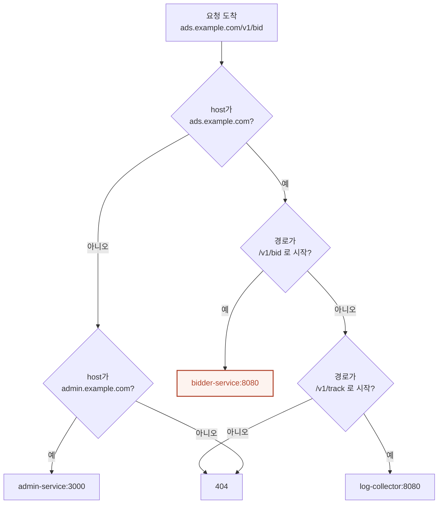
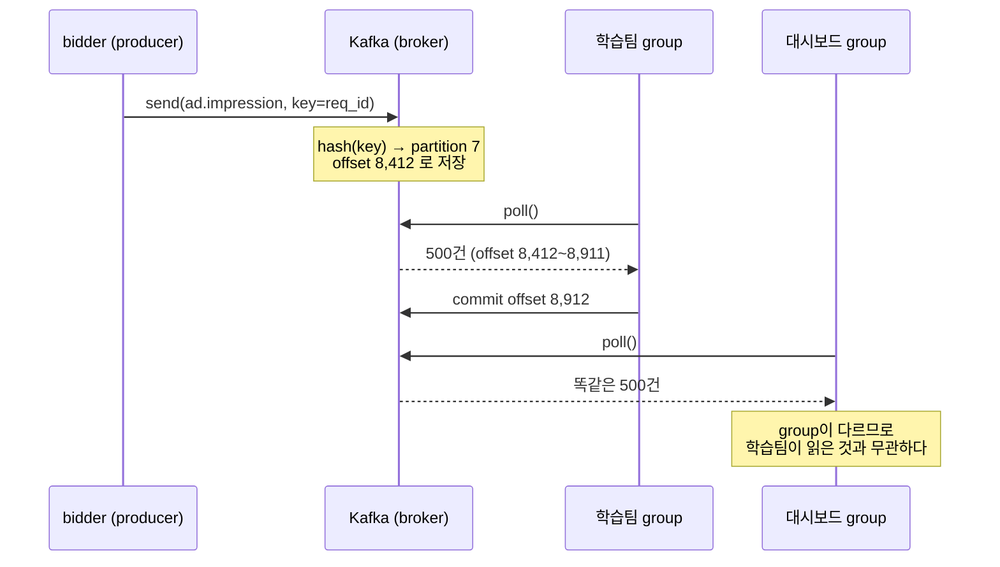
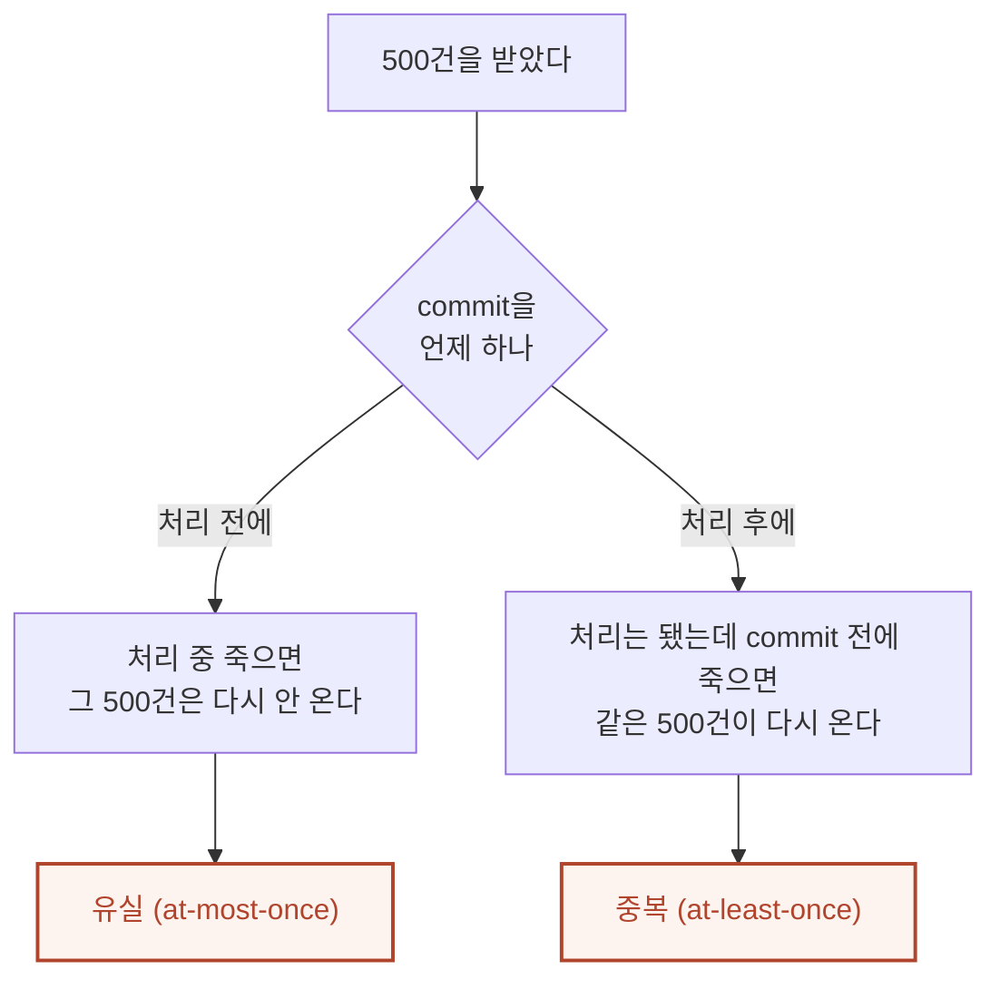

# 개발 인프라 글 2편 + 데모 2개 Implementation Plan

> **For agentic workers:** REQUIRED SUB-SKILL: Use superpowers:subagent-driven-development (recommended) or superpowers:executing-plans to implement this plan task-by-task. Steps use checkbox (`- [ ]`) syntax for tracking.

**Goal:** 광고 요청 경로(LB·Ingress·API Gateway·라우터)와 Kafka를 다루는 글 2편을 인라인 SVG·mermaid·인터랙티브 데모와 함께 추가한다.

**Architecture:** 글은 `posts/<slug>.md` 마크다운, 메타는 `js/posts.js` 객체 하나. 브라우저가 marked.js로 렌더한다(빌드 없음). 그림은 인라인 SVG(CSS 변수 색)와 mermaid 두 가지를 쓰고, mermaid는 블로그 팔레트로 전역 교체한다. 데모는 `demo-*.html` + `js/*-demo.js` + `js/demo-edu-content.js` 엔트리 3점 세트다.

**Tech Stack:** Vanilla HTML/CSS/JS, marked.js, KaTeX, mermaid 11, Chart.js, zero-dependency Node 검증 스크립트

**설계 문서:** `docs/superpowers/specs/2026-08-07-dev-infra-posts-design.md`

---

## 이 계획에서 "테스트"란

유닛 테스트가 없는 저장소다. 대신 검증 스크립트 3개가 게이트다. **각 태스크의 마지막은 항상 이 중 해당하는 것을 돌려 출력을 확인하는 것이다.**

```bash
node scripts/validate-posts.js                      # 분류·빈 필드·없는 .md·죽은 링크
node scripts/check-content-standard.js <post-id>    # 특정 글만 대시보드로
node scripts/build-search-index.js                  # 검색 색인 재생성
```

`check-content-standard.js`가 글 하나에 대해 재는 것(코드에서 확인한 실제 항목):

| 항목 | 기준 |
|---|---|
| `bytes` | 15,000 이상 |
| `short` | 산문 300자 미만인 `##` 섹션 = 경고 |
| `long` | 한 문장 80자 초과 = 경고 |
| `badBadge` | `[무대: …]` 값이 열린 RTB·닫힌 생태계·공통 셋 중 하나가 아니면 경고 |
| `mathKorean` | LaTeX 명령이 든 수식 안에 한글이 있으면 경고 |
| `dead` | `post.html?id=…` 의 id가 없거나 링크한 `.html`이 없으면 경고 |
| `python` `tables` `demo` `h2` | 개수만 보고함(임계값 없음). 사람이 판단 |

**경고는 글을 고치라는 신호다. 경고를 없애려고 문장을 자르거나 불릿으로 바꾸지 않는다.**

---

## 파이썬 블록 작성 형식 (5개 블록 전부 이 형식을 따른다)

이 저장소의 파이썬 블록은 **주석이 곧 설명 본문**이다. 코드가 아니라 글이라고 생각하고 쓴다. 아래가 완성형 본보기다 — 길이·주석 밀도·구분선·출력 형식을 이대로 맞춘다.

````markdown
```python
# "규칙을 서비스마다 따로 두면 뭐가 문제인가" — 개수로 답한다.
#
# 상황: 서비스 4개, 매체 10곳. 인증·쿼터·타임아웃 세 가지 정책을 지켜야 한다.
#   방식 A(각자): 서비스 4곳이 세 정책을 각각 구현한다.
#   방식 B(한 곳): Gateway 한 곳에 구현하고 서비스는 모른 채 둔다.
# 모든 숫자는 설명을 위한 가상 데이터다.

SERVICES = 4
POLICIES = 3
LINES_PER_POLICY = 60      # 정책 하나를 구현하는 코드 줄수(가정)
CHANGES_PER_QUARTER = 2    # 정책이 바뀌는 횟수
INCIDENT_RATE = 0.02       # 배포 1회당 사고 확률(가정)

# ── 방식 A: 정책이 서비스 수만큼 복제된다 ──
a_copies = SERVICES * POLICIES
a_lines = a_copies * LINES_PER_POLICY
a_deploys = SERVICES                       # 정책 1회 변경 → 서비스 전부 배포
# 손으로 4번 구현하면 한 곳이 어긋날 기회가 그만큼 생긴다.
# 한 곳이 정확히 같게 구현될 확률을 0.9로 두면, 넷이 모두 같을 확률은 0.9^3.
a_match = 0.9 ** (SERVICES - 1)

# ── 방식 B: 한 곳에만 있다 ──
b_copies = POLICIES
b_lines = b_copies * LINES_PER_POLICY
b_deploys = 1
b_match = 1.0                              # 한 벌뿐이라 어긋날 데가 없다

print(f"서비스 {SERVICES}개 · 정책 {POLICIES}종 · 분기당 변경 {CHANGES_PER_QUARTER}회")
print()
print(f"{'':22}{'A) 서비스마다':>14}{'B) Gateway 한 곳':>18}")
print(f"{'구현 벌수':22}{a_copies:>14}{b_copies:>18}")
print(f"{'총 코드 줄수':22}{a_lines:>14,}{b_lines:>18,}")
print(f"{'정책 1회 변경 시 배포':22}{a_deploys:>14}{b_deploys:>18}")
print(f"{'분기당 배포':22}{a_deploys*CHANGES_PER_QUARTER:>14}{b_deploys*CHANGES_PER_QUARTER:>18}")
print(f"{'구현이 모두 일치할 확률':22}{a_match:>13.1%}{b_match:>17.1%}")
print()
print(f"분기당 기대 사고  A {a_deploys*CHANGES_PER_QUARTER*INCIDENT_RATE:.2f}건"
      f"   B {b_deploys*CHANGES_PER_QUARTER*INCIDENT_RATE:.2f}건")
print()
print("→ 코드량이 문제가 아니다. 정책 하나를 고치는 데 배포가 몇 번 필요한가가 문제다.")
print("→ 벌수가 늘수록 '어딘가 한 곳만 다르게 구현돼 있는' 상태가 기본값이 된다.")

# 출력:
# (여기에 실제 실행 결과를 그대로 붙인다)
```
````

지켜야 할 것:

- 첫 줄은 **질문**으로 연다. "무엇을 계산하는가"가 아니라 "무엇이 궁금한가"
- 상황과 가정을 주석으로 먼저 깐다. 가상 데이터임을 그 안에서 밝힌다
- `# ── 구분선 ──` 으로 방식·단계를 나눈다
- 마지막 `print` 두세 줄은 **결론**이다. 숫자가 아니라 판단을 쓴다
- `# 출력:` 에는 **실제 실행 결과만** 붙인다. 손으로 쓰지 않는다
- 표준 라이브러리만 쓴다. 20~60줄
- **f-string 안에 LaTeX를 넣지 않는다.** `\frac{}` 의 중괄호를 변수로 읽어 `NameError`가 난다

---

## SVG 공통 규격 (10장 전부 이 규격을 따른다)

각 태스크의 SVG 단계에는 **이 규격에서 달라지는 것만** 적혀 있다. 아래가 기본값이다.

| 항목 | 값 |
|---|---|
| 감싸는 것 | `<figure style="text-align:center; margin:2rem 0;">` + 끝에 `<figcaption style="margin-top:0.75rem; font-size:0.9rem; color:var(--text-muted)">` |
| 접근성 | `role="img"` + `aria-label="…"` 필수. 그림을 못 보는 사람이 읽을 한 문장 |
| 크기 | `viewBox="0 0 W H"` + `style="width:100%; max-width:{W-20}px; height:auto; font-family:var(--font-sans)"` |
| 상자 | `rx="9"`, `fill:var(--bg-secondary)`, `stroke:var(--border-color)`, `stroke-width:1.5` |
| 강조 상자 | `stroke:var(--accent-primary)`, `stroke-width:2` |
| 보조 강조 | `stroke:var(--accent-secondary)`, `stroke-width:1.7` |
| 묶음(점선) | `fill:none`, `stroke:var(--text-muted)`, `stroke-width:1.3`, `stroke-dasharray:6 4` |
| 제목 글자 | `font-size:13px`, `fill:var(--text-primary)` (강조는 `font-weight:700` + `fill:var(--accent-primary)`) |
| 부제 글자 | `font-size:9.5px`, `fill:var(--text-muted)` |
| 값·주소 표기 | `font-family:var(--font-mono)`, `font-size:10px` |
| 나쁜 상태 | `fill:var(--state-bad)` — 끊기는 지점, 실패, 유실 |
| 화살표 | `<marker>` + `path d="M0,0 L7.5,3 L0,6 Z"`, `fill:var(--accent-primary)` |

**절대 어기면 안 되는 둘:**

1. **색을 hex로 박지 않는다.** 전부 `var(--...)`. 하드코딩하면 다크 테마에서 반드시 깨진다
2. **`marker` id는 글 안에서 유일해야 한다.** 접두사 + 절 번호로 짓는다 — 글 1은 `gw1-arr`~`gw6-arr`, 글 2는 `kf1-arr`·`kf3-arr`·`kf6-arr`·`kf7-arr`. **id가 겹치면 나중 정의가 먼저 것을 덮어 화살표 색이 엉킨다**

완성형 본보기는 Task 4 Step 4에 있다. 새 SVG를 그릴 때 그것을 복사해 시작한다.

---

## File Structure

| 파일 | 책임 | 상태 |
|---|---|---|
| `data/taxonomy.json` | 카테고리·태그·무대 표준 목록 (단일 소스) | 수정 — 태그 `Kafka` 추가 |
| `post.html` | 글 상세 템플릿. mermaid 초기화 1곳 | 수정 — 팔레트 |
| `js/main.js` | 렌더·테마·검색. mermaid 재초기화 1곳 | 수정 — 팔레트 |
| `js/posts.js` | 글 메타 단일 소스 + `series` | 수정 — 글 2편 + 시리즈 |
| `posts/gateway-ingress-router.md` | 글 1 본문 | 신규 |
| `posts/kafka-log-pipeline.md` | 글 2 본문 | 신규 |
| `demo-request-path.html` | 데모 1 화면·스타일 | 신규 |
| `js/request-path-demo.js` | 데모 1 로직 | 신규 |
| `demo-kafka-partition.html` | 데모 2 화면·스타일 | 신규 |
| `js/kafka-partition-demo.js` | 데모 2 로직 | 신규 |
| `js/demo-edu-content.js` | 데모 해설·투어·임베드 규칙 | 수정 — 엔트리 2개 |
| `demos.html` | 데모 목록(로드맵 + 카드) | 수정 — 2곳씩 2개 |
| `MARKDOWN_GUIDE.md` | 글 작성 규칙 | 수정 — 문체 규칙 |
| `search-index.json` | 검색 색인 (생성물) | 재생성 |

---

## Phase 0 — 기반

### Task 1: taxonomy에 `Kafka` 태그 추가

`js/posts.js`보다 **먼저** 해야 한다. 순서를 어기면 `validate-posts.js`가 막는다.

**Files:**
- Modify: `data/taxonomy.json`

- [ ] **Step 1: 지금 태그가 통과 못 하는 것을 먼저 확인한다**

Run:
```bash
node -e "const t=require('./data/taxonomy.json'); console.log(t.tags.includes('Kafka'))"
```
Expected: `false`

- [ ] **Step 2: 태그 배열 마지막 줄에 추가**

`data/taxonomy.json`의 `tags` 배열에서 이 줄을

```json
    "Software Architecture", "System Design", "Microservices", "Event-Driven", "Kubernetes", "Networking"
```

이렇게 바꾼다:

```json
    "Software Architecture", "System Design", "Microservices", "Event-Driven", "Kubernetes", "Networking", "Kafka"
```

- [ ] **Step 3: 추가됐는지 확인**

Run:
```bash
node -e "const t=require('./data/taxonomy.json'); console.log(t.tags.includes('Kafka'))"
node scripts/validate-posts.js
```
Expected: `true`, 그리고 validate가 통과(기존 글에 영향 없음)

- [ ] **Step 4: 커밋**

```bash
git add data/taxonomy.json
git commit -m "chore(taxonomy): Kafka 태그 추가"
```

---

### Task 2: mermaid 팔레트를 블로그 색으로 전역 교체

**기존 26편의 mermaid 그림이 전부 바뀐다.** 사용자가 승인한 변경이다.

**Files:**
- Modify: `post.html:60`
- Modify: `js/main.js:1189-1193`

- [ ] **Step 1: 바꾸기 전 상태를 눈으로 잡아 둔다**

Run:
```bash
python3 -m http.server 8000 &
```
브라우저에서 `http://localhost:8000/post.html?id=git-practical-guide` 를 연다. mermaid 그림이 13개로 가장 많은 글이다. 회색 상자 모습을 스크린샷으로 남긴다.

- [ ] **Step 2: 팔레트 정의를 `js/main.js`에 함수로 추가**

`js/main.js`의 mermaid 렌더 블록(약 1186행) **바로 위**에 추가한다:

```javascript
      // mermaid 팔레트 — 블로그 토큰(css/style.css :root)을 그대로 옮긴다.
      // theme:'base' 여야 themeVariables가 먹는다. 'neutral'/'dark'는 무시한다.
      function mermaidPalette(isDark) {
        return isDark ? {
          background: '#1a1715',
          primaryColor: '#232020',       // 노드 배경
          primaryTextColor: '#f1ece3',
          primaryBorderColor: 'rgba(241,236,227,0.26)',
          secondaryColor: '#2e2a26',
          tertiaryColor: '#2e2a26',
          lineColor: '#c9a36b',          // bronze
          textColor: '#f1ece3',
          mainBkg: '#232020',
          clusterBkg: '#2e2a26',
          clusterBorder: 'rgba(241,236,227,0.20)',
          edgeLabelBackground: '#1a1715',
          fontFamily: "'Pretendard Variable','Pretendard',system-ui,sans-serif",
          fontSize: '14px'
        } : {
          background: '#faf8f3',
          primaryColor: '#fffdf8',
          primaryTextColor: '#201d1a',
          primaryBorderColor: 'rgba(32,29,26,0.22)',
          secondaryColor: '#efe9dd',
          tertiaryColor: '#f4efe4',
          lineColor: '#8a6a3a',          // bronze
          textColor: '#201d1a',
          mainBkg: '#fffdf8',
          clusterBkg: '#f4efe4',
          clusterBorder: 'rgba(32,29,26,0.18)',
          edgeLabelBackground: '#faf8f3',
          fontFamily: "'Pretendard Variable','Pretendard',system-ui,sans-serif",
          fontSize: '14px'
        };
      }
```

- [ ] **Step 3: `js/main.js`의 initialize 호출을 바꾼다**

지금:
```javascript
        const currentTheme = document.documentElement.getAttribute('data-theme');
        mermaidInstance.initialize({
          startOnLoad: false,
          theme: currentTheme === 'dark' ? 'dark' : 'neutral'
        });
        mermaidInstance.run();
```

바꿀 것:
```javascript
        const currentTheme = document.documentElement.getAttribute('data-theme');
        mermaidInstance.initialize({
          startOnLoad: false,
          theme: 'base',
          themeVariables: mermaidPalette(currentTheme === 'dark')
        });
        mermaidInstance.run();
```

- [ ] **Step 4: `post.html`의 초기 initialize도 맞춘다**

`post.html:60` 지금:
```javascript
    mermaid.initialize({ startOnLoad: false, theme: 'neutral' });
```

바꿀 것 — 이 시점엔 `mermaidPalette`가 아직 없으므로 라이트 값을 인라인으로 둔다. `js/main.js`가 렌더 직전에 테마에 맞춰 다시 initialize하므로 여기는 폴백이다:
```javascript
    mermaid.initialize({
      startOnLoad: false, theme: 'base',
      themeVariables: {
        background: '#faf8f3', primaryColor: '#fffdf8', primaryTextColor: '#201d1a',
        primaryBorderColor: 'rgba(32,29,26,0.22)', secondaryColor: '#efe9dd', tertiaryColor: '#f4efe4',
        lineColor: '#8a6a3a', textColor: '#201d1a', mainBkg: '#fffdf8',
        clusterBkg: '#f4efe4', clusterBorder: 'rgba(32,29,26,0.18)', edgeLabelBackground: '#faf8f3',
        fontFamily: "'Pretendard Variable','Pretendard',system-ui,sans-serif", fontSize: '14px'
      }
    });
```

- [ ] **Step 5: 기존 글 4편을 라이트·다크 양쪽에서 눈으로 확인**

브라우저에서 각각 열고 테마 토글을 눌러 본다:

| 글 | 왜 이 글인가 |
|---|---|
| `post.html?id=git-practical-guide` | mermaid 13개로 가장 많음 |
| `post.html?id=lookalike-modeling` | 8개, subgraph 사용 |
| `post.html?id=ad-network-vs-exchange` | 8개 |
| `post.html?id=deep-ctr-models` | 5개, 노드 라벨이 긴 편 |

확인할 것: 글자가 배경에 묻히지 않나, subgraph 테두리가 보이나, 화살표가 보이나, 다크에서 상자가 검게 뭉개지지 않나.

**문제가 있으면 `mermaidPalette`의 값을 고친다. 개별 글을 고치지 않는다.**

- [ ] **Step 6: 커밋**

```bash
git add post.html js/main.js
git commit -m "style(mermaid): 회색 기본 테마를 블로그 크림·잉크·브론즈 팔레트로 교체"
```

---

## Phase 1 — 글 1: `gateway-ingress-router`

### Task 3: 글 1 스캐폴드와 메타데이터

**Files:**
- Create: `posts/gateway-ingress-router.md` (stub)
- Modify: `js/posts.js`

- [ ] **Step 1: 스캐폴드 스크립트 실행**

```bash
node scripts/new-post.js gateway-ingress-router \
  "광고 요청 하나가 서비스까지 가는 길 — LB · Ingress · API Gateway · 라우터" \
  "Software Engineering" \
  "Microservices,Networking,System Design" \
  "na"
```
Expected: `posts/gateway-ingress-router.md` 생성 + `js/posts.js`에 엔트리 삽입

- [ ] **Step 2: `js/posts.js` 엔트리를 완성한다**

스크립트가 만든 엔트리를 찾아 `excerpt`·`date`·`series`를 채운다. 최종 모습:

```javascript
  {
    id: 'gateway-ingress-router',
    world: 'na',
    title: '광고 요청 하나가 서비스까지 가는 길 — LB · Ingress · API Gateway · 라우터',
    excerpt: '매체가 보낸 입찰 요청 한 건은 12ms 안에 bidder까지 도착해야 한다. 그 길에 LB·Ingress·API Gateway·라우터가 차례로 서 있는데, 넷 다 "요청을 어디로 보낼지 정하는" 일을 한다. 왜 넷으로 나뉘어 있을까. 서버 한 대에서 시작해 서비스 12개까지 키우면서, 각 부품이 어떤 문제 때문에 생겼는지를 실제 설정과 숫자로 따라간다.',
    date: '2026-08-07',
    categories: ['Software Engineering'],
    tags: ['Microservices', 'Networking', 'System Design'],
    contentUrl: 'posts/gateway-ingress-router.md',
    series: 'engineering-foundations'
  },
```

`world: 'na'` 인 글은 `worldNote`·`worldPractical`을 쓰지 않는다(기존 `kubernetes-networking`과 같다).

- [ ] **Step 3: 검증**

```bash
node scripts/validate-posts.js
```
Expected: 통과. 실패하면 태그나 카테고리 철자가 `data/taxonomy.json`과 다른 것이다.

- [ ] **Step 4: 커밋**

```bash
git add posts/gateway-ingress-router.md js/posts.js
git commit -m "feat(posts): 게이트웨이·Ingress·라우터 글 스캐폴드"
```

---

### Task 4: 글 1 — 도입 + 1·2절 (서버 1대 → LB)

**Files:**
- Modify: `posts/gateway-ingress-router.md`

- [ ] **Step 1: 도입과 안내 블록을 쓴다**

도입은 개념어 없이 장면으로 연다 — bidder 한 대가 매체 한 곳의 요청을 받고 있는 상태. 그 뒤에 요약과 안내를 붙인다.

```markdown
> **한 줄 요약:** LB·Ingress·API Gateway·라우터는 한꺼번에 설계된 것이 아니다. 서비스가 늘 때마다 생긴 문제에 하나씩 답한 결과다.

> **골라 읽는 법** — 절이 8개인 긴 글입니다. 처음부터 다 읽지 않아도 됩니다.
>
> - 부품이 왜 생겼는지 순서대로 → 1~5절
> - "라우터"라는 말이 헷갈리면 → 3절
> - Ingress와 API Gateway의 경계만 → 4절
> - 넷을 표로 비교만 → 6절
> - 흔한 오해만 → 7절
```

**연속된 `>` 줄은 마크다운이 한 문단으로 합친다.** 항목 사이에 빈 `>` 줄이 반드시 있어야 한다.

- [ ] **Step 2: 1절 본문을 쓴다**

`## 1. 서버 한 대 — 매체가 주소를 직접 부른다`

넣을 것:
- 매체가 `10.0.3.14:8080` 을 직접 호출하는 상태. 설정 파일에 IP가 박혀 있다
- 이 상태에서 배포하면 무슨 일이 나나 — 프로세스가 내려간 사이의 요청은 연결 거부
- 가데이터 표: 하루 배포 4회 × 회당 20초 정지 × 초당 3,000요청 = 하루 실패 240,000건
- 서버가 한 대라 장애 시 대안이 없다

**섹션 산문이 300자를 넘어야 한다.** 표와 코드는 산문으로 세지 않는다.

- [ ] **Step 3: 2절 본문을 쓴다**

`## 2. 세 대로 늘렸다 — LB가 생긴다`

넣을 것:
- 매체가 IP 3개를 다 알아야 하나. 한 대가 죽으면 매체 설정을 고쳐야 하나
- LB가 하는 일: 공인 IP 하나 뒤에 대상 3개, 헬스체크로 살아 있는 것만 고름
- 실제 설정값 표: 헬스체크 경로 `/healthz`, 주기 5초, 타임아웃 2초, 연속 2회 실패 시 제외, 연속 2회 성공 시 복귀
- **LB가 못 하는 것**: L4는 IP·포트만 본다. `/v1/bid` 와 `/v1/track` 을 구분하지 못한다 → 3절로 이어짐

- [ ] **Step 4: 1·2절 SVG 2장을 넣는다**

두 장은 **같은 캔버스**다. 2절 그림은 1절 그림에 LB 칸이 추가된 것이다. 아래가 1절 그림의 완성형이고, 2절부터는 이 구조를 그대로 늘린다.

````markdown
<figure style="text-align:center; margin:2rem 0;">
<svg viewBox="0 0 700 150" role="img" aria-label="매체 한 곳이 bidder 서버 한 대의 IP를 직접 호출하는 구조." style="width:100%; max-width:680px; height:auto; font-family:var(--font-sans)">
<defs>
<marker id="gw1-arr" markerWidth="9" markerHeight="9" refX="7.5" refY="3" orient="auto"><path d="M0,0 L7.5,3 L0,6 Z" style="fill:var(--accent-primary)"/></marker>
</defs>
<rect x="20" y="46" width="130" height="58" rx="9" style="fill:var(--bg-tertiary); stroke:var(--border-color); stroke-width:1.5"/>
<text x="85" y="71" text-anchor="middle" style="font-size:13px; fill:var(--text-primary)">매체 1곳</text>
<text x="85" y="89" text-anchor="middle" style="font-size:9.5px; fill:var(--text-muted)">설정에 IP가 박혀 있다</text>
<line x1="150" y1="75" x2="250" y2="75" style="stroke:var(--accent-primary); stroke-width:2" marker-end="url(#gw1-arr)"/>
<text x="200" y="66" text-anchor="middle" style="font-size:10px; fill:var(--text-muted); font-family:var(--font-mono)">10.0.3.14:8080</text>
<rect x="254" y="46" width="150" height="58" rx="9" style="fill:var(--bg-secondary); stroke:var(--accent-primary); stroke-width:1.8"/>
<text x="329" y="71" text-anchor="middle" style="font-size:13px; font-weight:700; fill:var(--accent-primary)">bidder</text>
<text x="329" y="89" text-anchor="middle" style="font-size:9.5px; fill:var(--text-muted)">서버 1대</text>
<text x="500" y="70" text-anchor="middle" style="font-size:11px; fill:var(--state-bad)">배포하면 이 칸이 잠깐 사라진다</text>
<text x="500" y="88" text-anchor="middle" style="font-size:11px; fill:var(--state-bad)">그동안 요청은 전부 실패</text>
</svg>
<figcaption style="margin-top:0.75rem; font-size:0.9rem; color:var(--text-muted)">1절 — 부품이 하나도 없는 상태. 매체가 서버 주소를 직접 안다.</figcaption>
</figure>
````

2절 그림 규격: 같은 `viewBox` 폭에 매체 → **LB** → bidder 3대(점선 묶음). LB 칸만 `stroke:var(--accent-primary)` + `stroke-width:2` 로 강조하고, 위에 `이번 절에서 새로 생긴 칸` 라벨을 `var(--accent-primary)` 로 단다. marker id는 `gw2-arr` 로 새로 만든다(**id가 겹치면 나중 것이 먼저 것을 덮는다**).

- [ ] **Step 5: 검증**

```bash
node scripts/check-content-standard.js gateway-ingress-router
```
Expected: `short` 에 1·2절이 없어야 한다. `long` 에 걸린 문장이 있으면 **그 문장을 진짜로 두 문장으로 나눈다.**

- [ ] **Step 6: 커밋**

```bash
git add posts/gateway-ingress-router.md
git commit -m "feat(posts): 게이트웨이 글 1~2절 — 서버 1대에서 LB까지"
```

---

### Task 5: 글 1 — 3절 (Ingress와 "라우터"의 세 용법)

**Files:**
- Modify: `posts/gateway-ingress-router.md`

- [ ] **Step 1: 3절 본문을 쓴다**

`## 3. 서비스를 넷으로 쪼갰다 — Ingress가 생긴다`

넣을 것:
- bidder 하나를 bidder·pctr·feature-store·log-collector 넷으로 쪼갰다
- 서비스마다 LB를 하나씩 붙이면? 가데이터 표로 — 공인 IP 4개, 인증서 4장, 월 비용 4배
- Ingress는 **규칙표**다. 실제 규칙을 코드 블록으로 보인다:

````markdown
```yaml
# Ingress 규칙 — 위에서부터 훑다가 처음 맞는 줄에서 멈춘다
rules:
  - host: ads.example.com
    paths:
      - path: /v1/bid      →  bidder-service:8080
      - path: /v1/track    →  log-collector:8080
      - path: /v1/feature  →  feature-store:8080
  - host: admin.example.com
    paths:
      - path: /            →  admin-service:3000
# 맞는 줄이 없으면 404. 규칙 순서가 곧 우선순위다.
```
````

- 순서가 왜 중요한가: `/v1` 규칙을 `/v1/bid` 위에 두면 입찰 요청이 엉뚱한 서비스로 간다

- [ ] **Step 2: "라우터"의 세 용법 표를 넣는다**

이 말이 문맥마다 다른 것을 가리켜서 헷갈리는 지점이다. 표로 못 박는다.

```markdown
| 어디서 쓰는 말인가 | 무엇을 가리키나 | 실제 이름 |
|---|---|---|
| 쿠버네티스 | 규칙표를 실제로 실행하는 프로세스 | Ingress Controller (nginx·traefik) |
| OpenShift | Ingress에 해당하는 자체 리소스 | `Route` 오브젝트 |
| 앱 코드 안 | 들어온 경로를 함수에 연결하는 것 | `@app.route("/v1/bid")` |
```

세 가지가 다 "경로를 보고 어디로 보낼지 정한다"는 점은 같고, **어느 층에서 도느냐**가 다르다는 것을 한 문단으로 정리한다.

- [ ] **Step 3: 3절 mermaid 흐름도를 넣는다**

Ingress가 규칙을 위에서부터 훑는 것을 분기로 보인다. Task 2에서 팔레트를 이미 바꿨으므로 색 지정은 `classDef` 하나면 된다.

````markdown

````

- [ ] **Step 4: 3절 SVG를 넣는다**

2절 캔버스에 Ingress 칸을 추가한 그림. Ingress 칸만 강조하고, 오른쪽 서비스는 점선 묶음 안에 4줄로. marker id `gw3-arr`.

- [ ] **Step 5: 검증**

```bash
node scripts/check-content-standard.js gateway-ingress-router
```
Expected: 3절이 `short` 에 없어야 한다. `dead` 가 비어 있어야 한다.

- [ ] **Step 6: 커밋**

```bash
git add posts/gateway-ingress-router.md
git commit -m "feat(posts): 게이트웨이 글 3절 — Ingress 규칙표와 라우터의 세 용법"
```

---

### Task 6: 글 1 — 4절 (API Gateway) + 파이썬 ①

**Files:**
- Modify: `posts/gateway-ingress-router.md`

- [ ] **Step 1: 4절 본문을 쓴다**

`## 4. 매체가 열 곳으로 늘었다 — API Gateway가 생긴다`

Ingress로 안 되는 것 넷을 든다: 매체별 인증키 확인, 초당 호출 제한, `v1`/`v2` 분기, 응답 형식 변환.

가데이터 표(매체 10곳 중 5곳만 보임):

```markdown
| 매체 | 인증 방식 | 초당 허용 | 쓰는 버전 |
|---|---|---|---|
| A앱 | API 키 | 3,000 | v2 |
| B웹 | mTLS | 8,000 | v2 |
| C제휴 | API 키 | 500 | v1 |
| D앱 | OAuth | 1,200 | v1 |
| E웹 | API 키 | 4,500 | v2 |
```

Gateway 설정도 실제 모양으로 보인다:

````markdown
```yaml
routes:
  - id: bid-v2
    match: { host: ads.example.com, path: /v1/bid, header: { x-api-version: "2" } }
    target: bidder-service:8080
    policies:
      - auth:      { type: api-key, header: x-media-key }
      - ratelimit: { key: media_id, per_second: from_media_table }
      - timeout:   { ms: 12 }
```
````

- [ ] **Step 2: 파이썬 ①을 쓰고 실제로 실행한다**

계산할 것: 인증·쿼터를 **서비스마다 각각 구현**할 때와 **Gateway에 한 번** 구현할 때의 차이.

고정 입력값(이 숫자를 그대로 쓴다):
- 서비스 4개, 매체 10곳
- 정책 종류 3가지(인증·쿼터·타임아웃)
- 정책이 바뀌는 빈도: 분기당 2회
- 서비스 1개에 정책 1개를 구현하는 코드: 약 60줄
- 배포 1회당 사고 확률 0.02

출력 표의 열: `구현 벌수` / `총 코드 줄수` / `정책 1회 변경 시 배포 횟수` / `분기당 배포 횟수` / `분기당 기대 사고 건수`. 마지막에 두 방식의 배수 차이 한 줄.

**"불일치 확률"도 계산한다** — 서비스 4곳에 같은 정책을 손으로 4번 구현하면 한 곳이 어긋날 확률. 벌수가 늘수록 어긋날 기회가 느는 것을 보인다.

작성 후:
```bash
python3 - <<'PY'
# (여기에 작성한 코드를 붙여 실행)
PY
```
출력을 그대로 `# 출력:` 주석에 옮기고 **본문 문장의 숫자와 맞춘다.**

- [ ] **Step 3: Ingress와 Gateway의 경계를 표로 못 박는다**

```markdown
| | Ingress | API Gateway |
|---|---|---|
| 무엇을 보고 나누나 | 호스트 · 경로 | 호스트 · 경로 + 헤더 · 토큰 · 매체 |
| 정책을 갖나 | 아니오 (TLS 종료 정도) | 예 — 인증 · 쿼터 · 변환 · 타임아웃 |
| 누가 관리하나 | 인프라팀 | 서비스팀 |
| 없으면 무엇이 터지나 | 서비스마다 공인 IP·인증서가 하나씩 필요 | 정책이 서비스 수만큼 복제된다 |
```

- [ ] **Step 4: 4절 SVG를 넣는다**

3절 캔버스에서 바뀌는 것만 적는다. 나머지 상자·좌표·스타일은 Task 4 Step 4의 1절 SVG와 같다.

| 무엇 | 어떻게 |
|---|---|
| 추가되는 칸 | Ingress와 서비스 묶음 **사이**에 `API Gateway` 칸. 3줄 라벨 — 굵은 `API Gateway` / `매체 인증 · 쿼터` / `버전 라우팅` |
| 강조 | Gateway 칸만 `stroke:var(--accent-primary)` + `stroke-width:2`. Ingress는 `var(--accent-secondary)` 로 내린다 |
| 라벨 | Gateway 칸 위에 `이번 절에서 새로 생긴 칸` 을 `fill:var(--accent-primary)`, `font-size:10.5px` 로 |
| 왼쪽 첫 칸 | `매체 1곳` → `매체 10곳` 으로 바꾸고 부제를 `앱 · 웹 · 제휴` 로 |
| marker id | `gw4-arr` (**id가 겹치면 나중 것이 먼저 것을 덮는다**) |
| `aria-label` | "매체 10곳의 요청이 LB와 Ingress를 지나 API Gateway에서 인증·쿼터를 거친 뒤 서비스 넷으로 나뉘는 구조." |

- [ ] **Step 5: 검증**

```bash
node scripts/check-content-standard.js gateway-ingress-router
```
Expected: `python` 이 1 이상. 4절이 `short` 에 없음.

- [ ] **Step 6: 커밋**

```bash
git add posts/gateway-ingress-router.md
git commit -m "feat(posts): 게이트웨이 글 4절 — API Gateway와 정책 중복 비용 계산"
```

---

### Task 7: 글 1 — 5절 (서비스 메시) + 파이썬 ②

**Files:**
- Modify: `posts/gateway-ingress-router.md`

- [ ] **Step 1: 5절 본문을 쓴다**

`## 5. 서비스가 열둘이 됐다 — 메시를 써야 하나`

넣을 것:
- 지금까지는 "밖에서 안으로"였다. 이제 문제는 "안에서 안으로"다
- bidder가 pctr을 부르고, pctr이 feature-store를 부른다. 그 사이의 재시도·타임아웃·추적을 누가 하나
- 메시가 주는 것: 서비스 코드를 안 고치고 재시도·타임아웃·mTLS·추적을 얻는다
- 무는 값: 사이드카가 요청마다 두 번(나갈 때·들어올 때) 낀다

- [ ] **Step 2: 파이썬 ②를 쓰고 실제로 실행한다**

계산할 것 두 가지.

(가) 서비스 수가 늘 때 관리할 "사이"의 개수: 1·4·8·12·20개일 때의 가능한 호출 짝.

(나) **사이드카가 12ms 입찰 예산을 얼마나 먹나.** 고정 입력값:
- 입찰 예산 12ms
- 지금 쓰는 시간: Ingress 0.3 + Gateway 1.1 + bidder 자체 3.0 + pctr 호출 4.5 + feature-store 호출 2.0 = 10.9ms
- 사이드카 1회 왕복 추가 지연 0.5ms
- 메시를 넣으면 내부 호출 2개(pctr·feature-store)가 각각 사이드카를 두 번 지난다

출력: 메시 도입 전후의 총 지연, 남는 여유, 예산을 넘는지. 그리고 사이드카 지연이 0.2 / 0.5 / 1.0ms 일 때 각각 어떻게 갈리는지 표.

**시뮬레이션 결과가 서술과 어긋나면 서술을 고친다.** 코드를 결론에 맞추지 않는다.

- [ ] **Step 3: 언제 메시를 넣나의 기준을 쓴다**

숫자에서 나온 결론을 그대로 쓴다 — 예산이 빠듯하면 서비스 수가 아니라 **남은 여유**가 기준이 된다는 것. 서비스 12개라도 여유가 1ms면 못 넣고, 여유가 5ms면 넣을 수 있다.

- [ ] **Step 4: 5절 SVG를 넣는다**

이 그림만 구조가 다르다. 앞의 넷은 **왼쪽에서 오른쪽으로 흐르는 한 줄**이었지만, 5절은 **서비스끼리 서로 부르는 그물**이다. 그 차이가 5절의 요지다.

| 무엇 | 어떻게 |
|---|---|
| 왼쪽 | 앞 절의 한 줄(매체 → LB → Ingress → Gateway)을 **작게 축소**해 넣는다. "여기까지가 밖에서 안으로" 라벨을 `var(--text-muted)` 로 |
| 오른쪽 | 서비스 상자 6개를 격자로 놓고 그 사이를 얇은 선으로 잇는다. 선은 `var(--border-color)`, `stroke-width:1` — 많아서 어지러운 것이 요지이므로 굵게 그리지 않는다 |
| 사이드카 | 각 서비스 상자 왼쪽 변에 붙은 폭 10px짜리 작은 칸. `fill:var(--accent-secondary)`, 라벨 없음. 범례로 한 번만 `사이드카` 라고 적는다 |
| 강조 | 한 요청이 지나는 경로(bidder → pctr → feature-store)만 `var(--accent-primary)` 굵은 선으로. 그 경로에서 사이드카를 몇 번 지나는지 셀 수 있게 |
| marker id | `gw5-arr` |
| `aria-label` | "밖에서 안으로 들어온 요청이 서비스 사이를 여러 번 오가고, 그때마다 사이드카를 지나는 구조." |

- [ ] **Step 5: 검증**

```bash
node scripts/check-content-standard.js gateway-ingress-router
```
Expected: `python` 이 2. 5절이 `short` 에 없음.

- [ ] **Step 6: 커밋**

```bash
git add posts/gateway-ingress-router.md
git commit -m "feat(posts): 게이트웨이 글 5절 — 메시와 12ms 예산"
```

---

### Task 8: 글 1 — 6·7·8절 (완성 지도 · 헷갈리는 점 · 더 깊이)

**Files:**
- Modify: `posts/gateway-ingress-router.md`

- [ ] **Step 1: 6절 완성 지도 SVG와 정리표를 넣는다**

`## 6. 완성된 지도`

1~5절에서 쌓은 칸이 전부 들어간 한 장. **이 그림에는 강조 칸이 없다** — 전부 이미 설명한 것이므로 하나만 튀면 안 된다.

| 무엇 | 어떻게 |
|---|---|
| 구성 | 4절 SVG와 같은 한 줄 배치에, 각 칸 아래 `var(--text-muted)` 로 "무엇을 보고 나누나" 한 줄씩 (`IP·포트` / `호스트·경로` / `+ 헤더·토큰`) |
| 강조 | 없음. 모든 칸이 `stroke:var(--border-color)`, `stroke-width:1.5`. 테두리 굵기를 다르게 주지 않는다 |
| 메시 | 서비스 묶음을 감싸는 점선 테두리 하나로만 표시하고 `서비스 메시 (선택)` 라벨 |
| marker id | `gw6-arr` |
| `aria-label` | "매체에서 시작해 LB·Ingress·API Gateway를 지나 서비스에 이르는 전체 경로와, 각 부품이 무엇을 보고 나누는지." |

정리표:

```markdown
| 부품 | 어디서 도나 | 무엇을 보고 나누나 | 없으면 무엇이 터지나 |
|---|---|---|---|
| LB | 클러스터 밖 | IP · 포트 (L4) | 서버 한 대가 죽으면 대안이 없다 |
| Ingress | 클러스터 입구 | 호스트 · 경로 (L7) | 서비스마다 공인 IP·인증서가 필요하다 |
| API Gateway | 앱 계층 | 경로 + 헤더 · 토큰 · 매체 | 정책이 서비스 수만큼 복제된다 |
| 라우터 | 앱 안 | 코드 경로 | 한 서비스 안에서 요청을 구분 못 한다 |
| 서비스 메시 | 서비스 사이 | 서비스 간 호출 | 재시도·타임아웃을 서비스마다 짠다 |
```

- [ ] **Step 2: 7절 헷갈리는 점을 쓴다**

`## 7. 헷갈리기 쉬운 점`

세 가지를 각각 소제목 없이 굵은 첫 줄 + 설명 2~3문단으로:

1. **"Ingress랑 API Gateway랑 같은 것 아닌가"** — 둘 다 L7 경로를 본다는 점이 같다. 다른 것은 정책을 갖느냐다. 쿠버네티스 Gateway API가 둘을 합치는 방향이라는 것도 짧게
2. **"LB가 있으면 Ingress는 필요 없나"** — Ingress도 결국 앞에 LB 하나를 둔다. 대체가 아니라 그 뒤에 붙는 것
3. **"Gateway를 넣으면 느려지지 않나"** — 4절에서 계산한 1.1ms를 다시 불러와, 그 값이 12ms 예산에서 어떤 의미인지

- [ ] **Step 3: 8절 더 깊이 보기를 쓴다**

`## 8. 더 깊이 보기`

내부 링크를 건다. **글 id를 파일명에서 추측하지 않는다.**

```bash
node -e "require('./js/posts.js').posts.forEach(p=>console.log(p.id))" | grep -E "kubernetes|architecture|log-pipeline|feature-store"
```

걸 링크: `kubernetes-networking`(Pod·Service까지 내려가는 이야기), `software-architecture-patterns`(왜 쪼개나), `ad-log-pipeline`(이 경로로 들어온 요청이 남기는 로그), 그리고 Kafka 글(Task 12 이후에 추가 — **지금은 아직 없으므로 링크하지 않는다. Task 20에서 넣는다**).

- [ ] **Step 4: 골라 읽는 법의 절 번호가 본문과 맞는지 확인**

Task 4에서 쓴 안내 블록의 절 번호를 실제 `##` 번호와 대조한다.

```bash
grep -n "^## " posts/gateway-ingress-router.md
```

- [ ] **Step 5: 전체 검증**

```bash
node scripts/validate-posts.js
node scripts/check-content-standard.js gateway-ingress-router
```
Expected: `bytes` 15,000 이상, `short` 비어 있음, `dead` 비어 있음, `badBadge` 비어 있음, `python` 2, `tables` 6 이상.

`long` 에 걸린 문장은 하나씩 실제로 나눈다.

- [ ] **Step 6: 모바일 가로 스크롤 확인**

브라우저를 375px 폭으로 줄이고 글을 연 뒤 콘솔에서:

```javascript
document.documentElement.scrollWidth === document.documentElement.clientWidth
```
Expected: `true`

`false` 면 넓은 SVG나 표가 밖으로 나간 것이다. 표는 `.table-wrapper`가 이미 감싸므로 대개 SVG가 원인이다. 해당 SVG를 `<div style="overflow-x:auto">` 로 감싼다.

- [ ] **Step 7: 커밋**

```bash
git add posts/gateway-ingress-router.md
git commit -m "feat(posts): 게이트웨이 글 6~8절 — 완성 지도·오해·더 깊이"
```

---

## Phase 2 — 데모 1: `demo-request-path`

### Task 9: 데모 1 만들기

기존 데모 3점 세트를 따른다. `demo-frequency-capping.html`(277행) + `js/frequency-capping-demo.js`(144행)가 가장 작은 본보기다.

**Files:**
- Create: `demo-request-path.html`
- Create: `js/request-path-demo.js`

- [ ] **Step 1: HTML 뼈대를 만든다**

`demo-frequency-capping.html`의 head를 그대로 가져온다. 첫 줄의 테마·embed 스크립트가 **반드시** 있어야 임베드 모드가 돈다:

```html
<head><script>(function(){try{var d=document.documentElement,t=localStorage.getItem('theme')||'light',p=localStorage.getItem('palette')||'cream';d.setAttribute('data-theme',t);d.setAttribute('data-palette',p);}catch(e){}if(location.search.indexOf('embed=1')>-1)document.documentElement.classList.add('is-embed');})();</script>
```

`<title>요청 경로 시뮬레이터 — Ad Tech Blog</title>`, `<link rel="stylesheet" href="css/style.css">`, 그리고 클래스 접두사는 `rp-` 를 쓴다.

Chart.js는 **쓰지 않는다.** 이 데모는 상태 표시라 캔버스가 필요 없다.

- [ ] **Step 2: 컨트롤과 표시 영역을 만든다**

```html
<div class="rp-controls">
  <label><input type="checkbox" id="rp-lb" checked> LB</label>
  <label><input type="checkbox" id="rp-ingress" checked> Ingress</label>
  <label><input type="checkbox" id="rp-gateway" checked> API Gateway</label>
  <label><input type="checkbox" id="rp-mesh"> 서비스 메시</label>
  <div class="rp-slider-row">
    <span>서비스 수</span><input id="rp-svc" type="range" min="1" max="12" value="4"><span id="rp-svc-v">4</span>
  </div>
  <div class="rp-slider-row">
    <span>매체 수</span><input id="rp-media" type="range" min="1" max="10" value="3"><span id="rp-media-v">3</span>
  </div>
  <button id="rp-fire" class="rp-fire-btn">요청 한 건 보내기</button>
</div>
<div id="rp-path" class="rp-path"></div>
<div id="rp-verdict" class="rp-verdict"></div>
<div id="rp-cost" class="rp-cost"></div>
```

- [ ] **Step 3: `js/request-path-demo.js` 의 판정 로직을 쓴다**

핵심은 이 두 함수다. 나머지(DOM 그리기)는 이 결과를 렌더할 뿐이다.

```javascript
// 부품 구성에서 요청이 어디까지 가는지 정한다.
// 반환: [{name, ok, note}] — ok:false 인 첫 칸에서 요청이 멈춘다.
function tracePath(cfg) {
  var steps = [];
  steps.push({ name: '매체', ok: true, note: cfg.media + '곳' });

  if (cfg.lb) {
    steps.push({ name: 'LB', ok: true, note: '살아 있는 대상만 고름' });
  } else {
    steps.push({ name: 'LB 없음', ok: false,
      note: '매체가 서버 IP를 직접 안다. 배포하면 그 사이 요청이 실패한다' });
    return steps;
  }

  if (cfg.ingress) {
    steps.push({ name: 'Ingress', ok: true, note: '호스트·경로로 서비스를 고름' });
  } else if (cfg.services > 1) {
    steps.push({ name: 'Ingress 없음', ok: false,
      note: '서비스가 ' + cfg.services + '개인데 경로로 나눌 수단이 없다. 서비스마다 LB를 따로 붙여야 한다' });
    return steps;
  } else {
    steps.push({ name: 'Ingress 없음', ok: true, note: '서비스가 1개라 아직 필요 없다' });
  }

  if (cfg.gateway) {
    steps.push({ name: 'API Gateway', ok: true, note: '매체 키 확인 · 쿼터 차감 · 버전 분기' });
  } else if (cfg.media > 1) {
    steps.push({ name: 'API Gateway 없음', ok: false,
      note: '매체가 ' + cfg.media + '곳인데 인증·쿼터를 서비스 ' + cfg.services + '곳이 각자 구현해야 한다' });
    return steps;
  } else {
    steps.push({ name: 'API Gateway 없음', ok: true, note: '매체가 1곳이라 아직 필요 없다' });
  }

  steps.push({ name: 'bidder', ok: true, note: '입찰가 계산' });
  return steps;
}

// 지금 구성에서 사람이 관리해야 하는 것의 개수
function burden(cfg) {
  return {
    매체가_아는_주소: cfg.ingress ? 1 : cfg.services,
    공인_IP: cfg.ingress ? 1 : cfg.services,
    인증서: cfg.ingress ? 1 : cfg.services,
    정책_구현_벌수: cfg.gateway ? 1 : cfg.services,
    사이드카_지연_ms: cfg.mesh ? +(0.5 * 2 * Math.min(cfg.services - 1, 3)).toFixed(1) : 0
  };
}
```

- [ ] **Step 4: 브라우저에서 손으로 확인한다**

```bash
python3 -m http.server 8000 &
```
`http://localhost:8000/demo-request-path.html` 에서 확인할 것:

| 조작 | 기대 |
|---|---|
| Ingress 끄기 + 서비스 4개 | Ingress 칸에서 멈추고, 공인 IP·인증서가 4로 뜬다 |
| Ingress 끄기 + 서비스 1개 | 통과한다 ("아직 필요 없다") |
| Gateway 끄기 + 매체 3곳 | Gateway 칸에서 멈춘다 |
| Gateway 끄기 + 매체 1곳 | 통과한다 |
| 메시 켜기 | 사이드카 지연이 0보다 큰 값으로 뜬다 |

- [ ] **Step 5: 라이트·다크 양쪽에서 확인**

테마 토글을 눌러 두 테마 다 글자가 읽히는지 본다. 색은 전부 `var(--...)` 여야 한다. **하드코딩 hex가 있으면 한쪽 테마에서 반드시 깨진다.**

- [ ] **Step 6: 커밋**

```bash
git add demo-request-path.html js/request-path-demo.js
git commit -m "feat(demo): 요청 경로 시뮬레이터 — 부품을 끄면 어디서 터지나"
```

---

### Task 10: 데모 1 등록과 임베드

**Files:**
- Modify: `js/demo-edu-content.js`
- Modify: `demos.html`
- Modify: `posts/gateway-ingress-router.md`

- [ ] **Step 1: `js/demo-edu-content.js` 에 엔트리를 추가한다**

기존 엔트리와 같은 모양이되 `analogy` 필드에는 비유를 쓰지 않는다(필드 이름이 그럴 뿐, 한 줄 설명이면 된다).

```javascript
    'request-path': {
        analogy: '부품을 하나씩 꺼 보면, 그 부품이 무엇을 막고 있었는지가 보인다',
        anchor: '.rp-controls',
        embedKeep: ['.rp-controls', '.rp-path', '.rp-verdict', '.rp-cost'],
        embedHide: ['.demo-prereq', '.demo-tldr-analogy', '.demo-intro', '.demo-steps', '.rp-intro', '.demo-tldr', '.demo-next', '.demo-practice'],
        explain: {
            '#rp-ingress': ({ el }) =>
                el.checked
                    ? 'Ingress를 켰습니다. 매체가 아는 주소가 <strong>하나</strong>로 줄고, 인증서도 한 장이면 됩니다.'
                    : 'Ingress를 껐습니다. 서비스마다 공인 IP와 인증서가 하나씩 필요해집니다 — 서비스 수만큼 늘어납니다.',
            '#rp-gateway': ({ el }) =>
                el.checked
                    ? 'API Gateway를 켰습니다. 인증·쿼터를 <strong>한 곳에서</strong> 처리합니다.'
                    : 'API Gateway를 껐습니다. 같은 정책을 서비스마다 따로 구현해야 하고, 정책이 바뀌면 그만큼 배포합니다.',
            '#rp-svc': ({ value, prev }) =>
                `서비스를 <strong>${prev}개 → ${value}개</strong>로 바꿨습니다. Ingress가 꺼져 있다면 관리할 IP·인증서가 그만큼 늘어납니다.`,
            '#rp-media': ({ value, prev }) =>
                `매체를 <strong>${prev}곳 → ${value}곳</strong>으로 바꿨습니다. Gateway가 꺼져 있으면 매체별 인증·쿼터가 서비스 쪽 부담이 됩니다.`,
            '#rp-mesh': ({ el }) =>
                el.checked
                    ? '서비스 메시를 켰습니다. 재시도·타임아웃·추적을 코드 없이 얻는 대신, 요청마다 사이드카 지연이 붙습니다. 12ms 예산에서 얼마가 남는지 보세요.'
                    : '서비스 메시를 껐습니다. 사이드카 지연이 0이 됩니다.'
        },
        tour: [
            {
                el: '.rp-controls',
                title: '부품을 끄고 켜 본다',
                body: '체크박스 넷이 이 글에서 하나씩 생겨난 부품입니다. 끄면 그 부품이 없던 시절로 돌아갑니다.'
            },
            {
                el: '#rp-ingress',
                title: 'Ingress를 꺼 보기',
                body: '<strong>Ingress를 끄고</strong> 서비스 수를 4로 올려 보세요. 요청이 어디서 멈추는지, 관리할 인증서가 몇 장이 되는지 보입니다.',
                waitFor: 'change'
            },
            {
                el: '#rp-mesh',
                title: '메시의 대가',
                body: '<strong>메시를 켜면</strong> 사이드카 지연이 붙습니다. 12ms 예산에서 남는 여유가 얼마인지 확인해 보세요.',
                waitFor: 'change'
            }
        ]
    },
```

- [ ] **Step 2: `demos.html` 두 곳에 등록한다**

(가) 로드맵 목록 — 중급 단계 안에 한 줄:
```html
              <a href="demo-request-path.html" style="color:var(--text-primary); text-decoration:none; font-size:0.88rem;">→ 요청 경로 시뮬레이터</a>
```

(나) 데모 카드 — 기존 카드 하나를 본떠 추가:
```html
          <div class="demo-card">
            <div class="demo-card-badges">
              <span class="demo-card-badge" data-badge="Infra">Infra</span>
              <span class="demo-card-level level-intermediate">중급</span>
            </div>
            <h3>요청 경로 시뮬레이터</h3>
            <p>LB·Ingress·API Gateway·서비스 메시를 하나씩 끄고 요청을 던져 봅니다. 없는 부품 때문에 요청이 어디서 멈추는지, 관리할 IP·인증서·정책 벌수가 얼마나 늘어나는지 바로 보입니다.</p>
            <div class="demo-card-meta">
              <span class="demo-card-meta-item">⏱ 8분</span>
              <span class="demo-card-meta-item">선수지식 거의 없음</span>
            </div>
            <a href="demo-request-path.html" class="btn-try">체험하기</a>
          </div>
```

`data-badge="Infra"` 가 기존 배지 목록에 없으면 스타일이 안 먹는다. `demos.html` 에서 `data-badge` 값들을 먼저 확인하고, 없으면 기존 값 중 맞는 것을 쓴다:
```bash
grep -o 'data-badge="[^"]*"' demos.html | sort -u
```

- [ ] **Step 3: 글 1에 임베드한다**

`posts/gateway-ingress-router.md` 의 6절 뒤(7절 앞)에 넣는다. **앞뒤로 빈 줄 필수, 내부에 빈 줄 금지, 안에 `$`와 `**` 금지.**

```html
<div class="demo-embed-wrap">
<iframe class="demo-embed" src="demo-request-path.html?embed=1" height="560" loading="lazy" title="요청 경로 시뮬레이터"></iframe>
<a class="demo-embed-open" href="demo-request-path.html" target="_blank" rel="noopener">↗ 전체 데모로 열기 (가이드 투어 포함)</a>
</div>
```

- [ ] **Step 4: 임베드 모드가 도는지 확인**

`http://localhost:8000/demo-request-path.html?embed=1` 을 직접 열어 컨트롤과 결과만 남는지 본다. 그다음 `http://localhost:8000/post.html?id=gateway-ingress-router` 에서 iframe이 높이에 맞게 자동 조절되는지 본다.

- [ ] **Step 5: 검증**

```bash
node scripts/validate-posts.js
node scripts/check-content-standard.js gateway-ingress-router
```
Expected: `demo` 가 1. `dead` 가 비어 있음(`demo-request-path.html` 이 실제로 있어야 통과한다).

- [ ] **Step 6: 커밋**

```bash
git add js/demo-edu-content.js demos.html posts/gateway-ingress-router.md
git commit -m "feat(demo): 요청 경로 데모 등록 + 게이트웨이 글에 임베드"
```

---

## Phase 3 — 글 2: `kafka-log-pipeline`

### Task 11: 글 2 스캐폴드와 메타데이터

**Files:**
- Create: `posts/kafka-log-pipeline.md` (stub)
- Modify: `js/posts.js`

- [ ] **Step 1: 스캐폴드 실행**

```bash
node scripts/new-post.js kafka-log-pipeline \
  "Kafka는 왜 있나 — 노출 로그 한 줄이 학습 데이터가 되기까지" \
  "Software Engineering" \
  "Event-Driven,System Design,ML Infra,Kafka" \
  "na"
```

카테고리를 둘로 넣지 못하면 스크립트가 하나만 넣는다. Step 2에서 손으로 채운다.

- [ ] **Step 2: `js/posts.js` 엔트리를 완성한다**

```javascript
  {
    id: 'kafka-log-pipeline',
    world: 'na',
    title: 'Kafka는 왜 있나 — 노출 로그 한 줄이 학습 데이터가 되기까지',
    excerpt: '광고가 한 번 노출되면 그 사실을 알아야 하는 곳이 네 군데다 — 학습팀·정산팀·대시보드·광고주 리포트. bidder가 네 곳에 직접 알리면 한 팀이 배포할 때마다 광고가 느려진다. Kafka는 이 문제를 "한 번 쓰고 각자 읽는" 구조로 푼다. producer가 무엇인지, partition이 왜 있는지, offset이 무엇을 기억하는지를 노출 로그 한 줄이 pCTR 학습 데이터가 되는 과정으로 따라간다.',
    date: '2026-08-07',
    categories: ['Software Engineering', 'ML Infrastructure'],
    tags: ['Event-Driven', 'System Design', 'ML Infra', 'Kafka'],
    contentUrl: 'posts/kafka-log-pipeline.md',
    series: 'engineering-foundations'
  },
```

- [ ] **Step 3: 검증**

```bash
node scripts/validate-posts.js
```
Expected: 통과. `Kafka` 태그가 Task 1에서 taxonomy에 들어가 있어야 한다.

- [ ] **Step 4: 커밋**

```bash
git add posts/kafka-log-pipeline.md js/posts.js
git commit -m "feat(posts): Kafka 글 스캐폴드"
```

---

### Task 12: 글 2 — 도입 + 1절 (Kafka 없이 하면 어디서 터지나)

**Files:**
- Modify: `posts/kafka-log-pipeline.md`

- [ ] **Step 1: 도입과 안내 블록**

도입 장면: 광고가 한 번 노출됐다. 그 사실을 알아야 하는 곳이 넷이다 — 학습팀, 정산팀, 대시보드, 광고주 리포트.

```markdown
> **한 줄 요약:** Kafka는 한 번 쓰고 여러 팀이 각자 읽는 로그 보관소다. 보내는 쪽과 읽는 쪽을 떼어 놓는 것이 전부다.

> **골라 읽는 법** — 절이 8개인 긴 글입니다. 처음부터 다 읽지 않아도 됩니다.
>
> - Kafka가 왜 필요한지만 → 1절
> - producer가 무엇인지 → 2절
> - partition을 몇 개로 잡을지 → 3절
> - 여러 팀이 같은 로그를 읽는 구조 → 4~5절
> - 로그가 학습 데이터가 되는 부분 → 7절
```

- [ ] **Step 2: 1절 본문**

`## 1. Kafka 없이 하면 어디서 터지나`

세 방법을 차례로. 각각 무엇이 무너지는지 구체적인 숫자와 함께.

| 방법 | 무엇이 무너지나 |
|---|---|
| bidder가 네 팀 서버로 직접 HTTP | 학습팀이 배포하면 그 호출이 타임아웃난다. 12ms 예산에서 4번 호출이면 예산을 다 쓴다 |
| 파일에 쓰고 나중에 옮긴다 | 서버가 죽으면 아직 안 옮긴 파일이 사라진다. 오토스케일로 내려간 인스턴스도 마찬가지 |
| DB에 바로 넣는다 | 초당 5만 건 쓰기에서 인덱스 갱신이 밀린다. 읽는 쪽 쿼리까지 같이 느려진다 |

마지막에 표로 정리하고, 셋의 공통 문제를 한 문장으로 — **보내는 쪽이 받는 쪽 사정을 알아야 한다는 것.**

- [ ] **Step 3: 1절 SVG**

세 방법이 각각 어디서 끊기는지 한 장에. 세 줄로 나란히 놓고 끊기는 지점에 `var(--state-bad)` 표시. marker id `kf1-arr`.

- [ ] **Step 4: 검증**

```bash
node scripts/check-content-standard.js kafka-log-pipeline
```

- [ ] **Step 5: 커밋**

```bash
git add posts/kafka-log-pipeline.md
git commit -m "feat(posts): Kafka 글 1절 — 없이 하면 어디서 터지나"
```

---

### Task 13: 글 2 — 2절 (producer)

**Files:**
- Modify: `posts/kafka-log-pipeline.md`

- [ ] **Step 1: producer가 무엇인지 못 박는다**

`## 2. producer — 보내는 쪽`

가장 먼저 오해를 없앤다: **producer는 별도 서버가 아니다. bidder 프로세스 안에 들어가는 라이브러리다.** 이걸 첫 문단에 둔다.

- [ ] **Step 2: 실제 로그 한 줄을 보인다**

이 JSON이 글 전체를 따라다닌다. 3·4·5·7절에서 계속 이 줄을 가리킨다.

````markdown
```json
{
  "req_id":  "r-8f21",
  "ad_id":   9931,
  "slot":    "main_top",
  "media":   "A앱",
  "pctr":    0.0213,
  "bid":     182.4,
  "ts":      1786000101
}
```
````

- [ ] **Step 3: 보내는 코드를 의사코드로 보인다**

브로커 없이 안 돌아가므로 **첫 줄에 의사코드 표시를 단다.** 이건 `MARKDOWN_GUIDE.md`에 이미 있는 규칙이다.

````markdown
```python
# (의사코드 — 브로커가 있어야 돌아갑니다. 호출 모양만 봅니다.)
producer.send(
    topic="ad.impression",
    key=req_id.encode(),          # 이 값으로 어느 칸에 들어갈지 정해진다 (3절)
    value=json.dumps(record).encode(),
)
# send()는 기다리지 않는다. 버퍼에 넣고 바로 돌아온다.
# 실제 전송은 백그라운드 스레드가 배치로 묶어 보낸다.
```
````

**`send()`가 기다리지 않는다는 것**이 이 절의 핵심이다. 그래서 12ms 예산을 안 먹는다.

- [ ] **Step 4: `acks` 설정 표를 넣는다**

```markdown
| `acks` | 언제 성공으로 치나 | 유실 | 지연 |
|---|---|---|---|
| `0` | 보냈으면 끝 | 브로커가 죽으면 사라진다 | 가장 짧다 |
| `1` | 리더가 받았으면 | 리더가 죽고 복제 전이면 사라진다 | 중간 |
| `all` | 복제본까지 받았으면 | 거의 없다 | 가장 길다 |
```

광고 로그에서 무엇을 고르나 — 노출·클릭은 `1`, 과금·전환은 `all` 이 실무의 대체적 기준이라는 것을 한 문단으로. **가정임을 밝힌다.**

- [ ] **Step 5: 검증 후 커밋**

```bash
node scripts/check-content-standard.js kafka-log-pipeline
git add posts/kafka-log-pipeline.md
git commit -m "feat(posts): Kafka 글 2절 — producer와 acks"
```

---

### Task 14: 글 2 — 3절 (topic·partition) + 파이썬 ① + 데모 자리

**Files:**
- Modify: `posts/kafka-log-pipeline.md`

- [ ] **Step 1: 3절 본문**

`## 3. topic과 partition — 어디에 쌓이나`

- topic = 이름표. `ad.impression` · `ad.click` · `ad.conversion` 로 나눈다
- partition = topic 안의 칸. **한 칸은 한 consumer가 맡는다.** 그래서 칸 수가 처리량 상한이다
- `hash(key) % 칸수` 로 칸이 정해진다
- **순서 보장은 칸 안에서만이다.** 이게 가장 자주 틀리는 부분이므로 굵게 한 줄로 못 박는다
- key를 `req_id` 로 잡으면 같은 요청의 노출·클릭이 같은 칸에 간다 → 7절 조인에 유리

- [ ] **Step 2: 파이썬 ①을 쓰고 실행한다**

계산할 것: key를 무엇으로 잡느냐에 따라 칸 분포가 어떻게 갈리나.

고정 입력값:
- partition 12칸
- 노출 로그 100,000줄
- `req_id`: 전부 다른 값
- `ad_id`: 500종. **상위 5개 광고가 전체의 40%를 차지한다**(가상 분포)
- key 없음: 라운드로빈

출력 표의 열: `key 종류` / `가장 많이 받은 칸` / `가장 적게 받은 칸` / `최대÷최소 배수` / `순서 보장 여부`.

결론 세 줄:
- `req_id` → 고르게 퍼진다. 같은 요청의 노출·클릭이 같은 칸
- `ad_id` → 인기 광고 쪽 칸이 몇 배로 쏠린다. 그 칸을 맡은 consumer만 밀린다
- key 없음 → 가장 고르지만 **같은 요청의 순서가 안 지켜진다**

- [ ] **Step 3: 3절 SVG**

topic 하나 안에 칸 12개, 각 칸에 줄이 쌓이고 offset 번호가 매겨진 구조. 칸마다 길이가 다른 것도 보인다. marker id `kf3-arr`.

- [ ] **Step 4: 데모 임베드 자리를 비워 둔다**

Task 16에서 데모를 만든 뒤 여기에 넣는다. 지금은 넣지 않는다 — 없는 `.html` 을 링크하면 `check-content-standard.js` 의 `dead` 에 걸린다.

- [ ] **Step 5: partition 수를 나중에 늘리면 안 되는 이유를 쓴다**

`hash(key) % 12` 와 `hash(key) % 24` 는 같은 key를 다른 칸에 보낸다. 순서 보장이 그 시점에서 끊긴다. 그래서 칸 수는 처음에 넉넉히 잡는다.

- [ ] **Step 6: 검증 후 커밋**

```bash
node scripts/check-content-standard.js kafka-log-pipeline
git add posts/kafka-log-pipeline.md
git commit -m "feat(posts): Kafka 글 3절 — topic·partition과 key 선택"
```

---

### Task 15: 글 2 — 4·5절 (consumer group · offset) + mermaid 2개 + 파이썬 ②

**Files:**
- Modify: `posts/kafka-log-pipeline.md`

- [ ] **Step 1: 4절 본문**

`## 4. consumer group — 누가 읽나`

- consumer group = 한 팀. 학습팀·정산팀·대시보드가 각각 다른 group
- **다른 group은 같은 줄을 각자 통째로 읽는다.** 한 팀이 읽어도 다른 팀 것이 사라지지 않는다
- group **안에서는** 칸을 나눠 맡는다. 그래서 group 안 consumer가 칸보다 많으면 남는 사람은 논다
- 학습팀이 3일치를 다시 읽어도 정산팀은 영향받지 않는다

- [ ] **Step 2: 4절 mermaid 시퀀스**

````markdown

````

- [ ] **Step 3: 5절 본문**

`## 5. offset — 어디까지 읽었나`

- offset = 칸 안의 줄 번호. **group마다 따로 기억한다**
- commit을 처리 **전에** 하느냐 **후에** 하느냐가 사고의 종류를 정한다
- 광고에서 중복이 왜 치명적인가: 과금이 두 번 되고, 학습 라벨에 같은 노출이 두 줄 들어가 그 광고의 CTR 추정이 흔들린다

- [ ] **Step 4: 5절 mermaid 분기**

````markdown

````

- [ ] **Step 5: 파이썬 ②를 쓰고 실행한다**

계산할 것: commit 시점에 따라 중복·유실이 몇 건 나오나.

고정 입력값:
- 한 번에 500건씩 가져온다
- 하루 폴 횟수 456,000회 (2.28억 건 ÷ 500)
- consumer가 하루에 죽는 횟수 3회 (배포 2 + 장애 1)
- 죽는 시점은 배치 처리의 중간(평균 50% 지점)

출력: 두 방식의 하루 중복 건수·유실 건수, 그리고 그것이 과금·학습 데이터에 얼마짜리 오차인지. 노출 1건당 단가를 가정해 금액으로도 환산한다. **가상 데이터임을 밝힌다.**

- [ ] **Step 6: 검증 후 커밋**

```bash
node scripts/check-content-standard.js kafka-log-pipeline
git add posts/kafka-log-pipeline.md
git commit -m "feat(posts): Kafka 글 4~5절 — consumer group과 offset"
```

---

### Task 16: 글 2 — 6·7·8절 (보관 기간 · 학습 데이터 · 지뢰) + 파이썬 ③

**Files:**
- Modify: `posts/kafka-log-pipeline.md`

- [ ] **Step 1: 6절 본문 + 파이썬 ③**

`## 6. 보관 기간 — 왜 지나간 것도 읽을 수 있나`

핵심: **읽어도 지우지 않는다.** 기간이나 용량으로 지운다. 그래서 학습 파이프라인이 3일 멈춰도 복구된다.

파이썬 ③ 고정 입력값(`ad-log-pipeline.md`의 볼륨 표와 맞춘다):
- `ad.impression` 하루 2.28억 줄, 1줄 200바이트
- `ad.click` 하루 228만 줄
- 복제 계수 3
- 보존 3 / 7 / 14 / 30일

출력: topic별·보존일수별 디스크 용량(복제 포함), 그리고 "학습이 N일 멈춰도 복구되나"의 판정.

- [ ] **Step 2: 6절 SVG**

시간축 한 줄에 보존 기간 7일 창을 놓고, 학습이 멈춘 구간과 그때 복구 가능한 범위를 표시. 보존 창을 넘어간 구간은 `var(--state-bad)`. marker id `kf6-arr`.

- [ ] **Step 3: 7절 본문**

`## 7. 로그 한 줄이 학습 데이터가 되기까지`

2절의 그 JSON 줄로 돌아온다.

- `ad.impression` + `ad.click` 을 `req_id` 로 조인 → `(X, y)`
- 클릭은 노출보다 늦게 온다. 얼마나 기다렸다 조인하나 — 조인 창
- 창을 짧게 잡으면 늦게 온 클릭이 `y=0` 으로 들어간다. 길게 잡으면 학습이 늦어진다
- 이 창 이야기는 `online-learning-delayed-feedback` 와 이어진다

- [ ] **Step 4: 7절 SVG**

노출 한 줄과 그에 대응하는 클릭이 시간차를 두고 도착하는 그림. 조인 창의 경계선과, 창 밖으로 나간 클릭이 `y=0` 이 되는 것. marker id `kf7-arr`.

- [ ] **Step 5: 8절 지뢰와 더 깊이 보기**

`## 8. 자주 밟는 지뢰`

각각 굵은 첫 줄 + 설명 두세 문단으로:

1. **"Kafka는 큐다"** — 반만 맞다. 읽어도 사라지지 않는다. 그래서 여러 팀이 같은 것을 읽을 수 있다
2. **partition 수가 최대 병렬도다** — consumer를 아무리 늘려도 칸 수를 넘으면 남는 사람은 논다
3. **key 없이 보내면 순서가 안 지켜진다** — 같은 요청의 노출·클릭이 다른 칸에 흩어진다
4. **consumer lag을 봐야 한다** — 처리량이 아니라 "얼마나 밀렸나"가 진짜 신호다
5. **브로커 운영은 이 글 밖이다** — 복제 계수·ISR·리밸런싱은 이름만 짚고 넘어간다

`## 더 깊이 보기` 에 링크. **id를 파일명에서 추측하지 않는다:**

```bash
node -e "require('./js/posts.js').posts.forEach(p=>console.log(p.id))" | grep -E "log|feature|online|gateway"
```

걸 링크: `ad-log-pipeline`, `ad-log-system`, `feature-store-serving`, `online-learning-delayed-feedback`, `gateway-ingress-router`, 그리고 `demo-log-to-model.html`.

- [ ] **Step 6: 글 1에도 Kafka 글 링크를 추가한다**

Task 8 Step 3에서 미뤄 둔 것이다. `posts/gateway-ingress-router.md` 의 8절에 한 줄 추가:

```markdown
- [Kafka는 왜 있나 — 노출 로그 한 줄이 학습 데이터가 되기까지](post.html?id=kafka-log-pipeline) — 이 경로로 들어온 요청이 남긴 로그가 어디로 가는지
```

- [ ] **Step 7: 골라 읽는 법의 절 번호 확인**

```bash
grep -n "^## " posts/kafka-log-pipeline.md
```

- [ ] **Step 8: 전체 검증**

```bash
node scripts/validate-posts.js
node scripts/check-content-standard.js kafka-log-pipeline gateway-ingress-router
```
Expected: 두 글 다 `bytes` 15,000 이상, `short`·`dead`·`badBadge` 비어 있음. Kafka 글 `python` 3.

- [ ] **Step 9: 커밋**

```bash
git add posts/kafka-log-pipeline.md posts/gateway-ingress-router.md
git commit -m "feat(posts): Kafka 글 6~8절 — 보관 기간·학습 데이터·지뢰"
```

---

## Phase 4 — 데모 2: `demo-kafka-partition`

### Task 17: 데모 2 만들기

브레인스토밍 프로토타입이 `.superpowers/brainstorm/34199-1786078328/content/demo-question.html` 에 있다. 배정·판정 로직을 여기서 가져온다.

**Files:**
- Create: `demo-kafka-partition.html`
- Create: `js/kafka-partition-demo.js`

- [ ] **Step 1: HTML 뼈대**

Task 9 Step 1과 같은 head 스크립트를 쓴다. 클래스 접두사는 `kp-`. `<title>Kafka Partition 놀이터 — Ad Tech Blog</title>`.

컨트롤:
```html
<div class="kp-controls">
  <div class="kp-slider-row"><span>partition 수</span><input id="kp-part" type="range" min="1" max="12" value="4"><span id="kp-part-v">4</span></div>
  <div class="kp-slider-row"><span>consumer 수</span><input id="kp-cons" type="range" min="1" max="6" value="2"><span id="kp-cons-v">2</span></div>
  <div class="kp-key-row">
    key로 무엇을 쓰나
    <label><input type="radio" name="kp-key" value="req_id" checked> req_id</label>
    <label><input type="radio" name="kp-key" value="ad_id"> ad_id</label>
    <label><input type="radio" name="kp-key" value="none"> 없음</label>
  </div>
</div>
<div id="kp-verdict" class="kp-verdict"></div>
<div id="kp-grid" class="kp-grid"></div>
```

- [ ] **Step 2: `js/kafka-partition-demo.js` 의 핵심 로직**

```javascript
// 샘플 노출 로그 — ad_id 가 일부러 쏠려 있다(9931 이 4건).
var RECORDS = [
  { req: 'r-8f21', ad: 9931, slot: 'main_top' }, { req: 'r-3c07', ad: 1204, slot: 'feed_2' },
  { req: 'r-b19e', ad: 9931, slot: 'feed_5' },   { req: 'r-77aa', ad: 5510, slot: 'main_top' },
  { req: 'r-0d42', ad: 3388, slot: 'feed_2' },   { req: 'r-e6c1', ad: 1204, slot: 'side_1' },
  { req: 'r-5b90', ad: 9931, slot: 'feed_9' },   { req: 'r-a238', ad: 7702, slot: 'main_top' },
  { req: 'r-cc15', ad: 5510, slot: 'feed_2' },   { req: 'r-14f3', ad: 3388, slot: 'side_1' },
  { req: 'r-9e88', ad: 7702, slot: 'feed_5' },   { req: 'r-2af6', ad: 9931, slot: 'main_top' }
];

function hashKey(s) {
  var n = 0;
  for (var i = 0; i < s.length; i++) n = (n * 31 + s.charCodeAt(i)) >>> 0;
  return n;
}

// 로그를 칸에 나눈다. keyKind: 'req_id' | 'ad_id' | 'none'
function assign(records, partitions, keyKind) {
  var bins = [];
  for (var i = 0; i < partitions; i++) bins.push([]);
  records.forEach(function (r, idx) {
    var p;
    if (keyKind === 'none') p = idx % partitions;                 // 라운드로빈
    else if (keyKind === 'ad_id') p = hashKey(String(r.ad)) % partitions;
    else p = hashKey(r.req) % partitions;
    bins[p].push(r);
  });
  return bins;
}

// 칸을 consumer 에게 나눠 준다. 반환: partition index -> consumer index
function ownerOf(partitionIndex, consumers) { return partitionIndex % consumers; }

// 지금 구성에서 무엇이 문제인지 한 줄로 판정한다.
function verdict(bins, consumers, keyKind) {
  var owned = {};
  bins.forEach(function (_, i) { owned[ownerOf(i, consumers)] = true; });
  var idle = 0;
  for (var c = 0; c < consumers; c++) if (!owned[c]) idle++;

  var sizes = bins.map(function (b) { return b.length; });
  var max = Math.max.apply(null, sizes), min = Math.min.apply(null, sizes);

  if (idle > 0) {
    return { level: 'bad', text: 'consumer ' + consumers + '명 중 ' + idle + '명이 논다. 칸이 ' + bins.length +
      '개뿐이라 맡을 것이 없다. consumer를 늘려도 partition보다 많으면 처리량이 안 는다.' };
  }
  if (keyKind === 'none') {
    return { level: 'warn', text: '가장 고르게 퍼졌다(최대 ' + max + '줄, 최소 ' + min +
      '줄). 대신 key가 없어서 같은 요청의 노출과 클릭이 다른 칸으로 흩어진다 — 순서가 안 지켜진다.' };
  }
  if (keyKind === 'ad_id' && bins.length > 1 && max >= min * 2 + 1) {
    return { level: 'warn', text: '인기 광고 쪽으로 쏠렸다(최대 ' + max + '줄, 최소 ' + min +
      '줄). 그 칸을 맡은 consumer만 밀린다.' };
  }
  return { level: 'good', text: '고르게 퍼졌고 같은 req_id는 같은 칸에 모인다(최대 ' + max + '줄, 최소 ' + min +
    '줄). 노출과 클릭을 이어 붙이기 좋은 상태다.' };
}
```

- [ ] **Step 3: 렌더 함수를 쓴다**

칸마다 카드 하나를 그린다. 헤더에 `partition N · consumer M`, 몸통에 그 칸에 들어간 줄들(`req_id` + `ad=`). 색은 **consumer 별로** 다르게 하되 반드시 CSS 변수를 쓴다. 흙톤 6색은 `css/style.css` 의 `.chart-layer-item` 규칙에 있는 값을 그대로 쓴다:

```javascript
var TONE = ['rgba(156,90,68,1)', 'rgba(90,107,122,1)', 'rgba(95,122,99,1)',
            'rgba(168,120,58,1)', 'rgba(125,94,114,1)', 'rgba(154,125,56,1)'];
```

**배경·글자색은 `var(--bg-secondary)` · `var(--text-primary)` 를 쓴다.** 위 6색은 테두리와 헤더 강조에만 쓴다. 그래야 다크 테마에서 안 깨진다.

`verdict()` 가 돌려주는 `level` 은 이렇게 색으로 옮긴다. **hex를 쓰지 않는다** — 두 테마에서 동시에 대비를 만족하는 단일 hex는 없어서 시맨틱 변수를 따로 둔 것이다.

```javascript
var LEVEL_COLOR = {
  bad:  'var(--state-bad)',
  warn: 'var(--state-warn)',
  good: 'var(--state-good)'
};
// 판정 상자: 왼쪽 3px 선만 level 색, 배경은 var(--bg-secondary), 글자는 var(--text-primary)
el.style.borderLeft = '3px solid ' + LEVEL_COLOR[v.level];
el.style.background = 'var(--bg-secondary)';
el.style.color = 'var(--text-primary)';
```

- [ ] **Step 4: 브라우저에서 손으로 확인**

| 조작 | 기대 |
|---|---|
| partition 3, consumer 5 | "5명 중 2명이 논다" |
| key = `ad_id`, partition 4 | 한 칸에 쏠린 것이 보이고 경고가 뜬다 |
| key = 없음 | "순서가 안 지켜진다" 경고 |
| key = `req_id`, partition 12, consumer 3 | 좋음 판정 |
| partition을 4 → 8로 | 같은 `req_id` 가 다른 칸으로 이동하는 것이 보임 |

- [ ] **Step 5: 라이트·다크 확인 후 커밋**

```bash
git add demo-kafka-partition.html js/kafka-partition-demo.js
git commit -m "feat(demo): Kafka partition 놀이터 — 칸·consumer·key 선택"
```

---

### Task 18: 데모 2 등록과 임베드

**Files:**
- Modify: `js/demo-edu-content.js`
- Modify: `demos.html`
- Modify: `posts/kafka-log-pipeline.md`

- [ ] **Step 1: `js/demo-edu-content.js` 엔트리 추가**

```javascript
    'kafka-partition': {
        analogy: 'partition 수가 처리량 상한이고, key가 순서 보장 범위를 정한다',
        anchor: '.kp-controls',
        embedKeep: ['.kp-controls', '.kp-verdict', '.kp-grid'],
        embedHide: ['.demo-prereq', '.demo-tldr-analogy', '.demo-intro', '.demo-steps', '.kp-intro', '.demo-tldr', '.demo-next', '.demo-practice'],
        explain: {
            '#kp-part': ({ value, prev }) =>
                `partition을 <strong>${prev}칸 → ${value}칸</strong>으로 바꿨습니다. 같은 req_id가 다른 칸으로 옮겨 간 것을 보세요 — <strong>칸 수를 나중에 바꾸면 순서 보장이 그 시점에서 끊깁니다.</strong>`,
            '#kp-cons': ({ value, prev }) =>
                `consumer를 <strong>${prev}명 → ${value}명</strong>으로 바꿨습니다. 칸 수보다 많으면 남는 사람은 아무 칸도 못 맡습니다.`,
            'input[name="kp-key"]': ({ el }) =>
                el.value === 'none'
                    ? 'key를 안 쓰면 라운드로빈으로 가장 고르게 퍼집니다. 대신 같은 요청의 노출과 클릭이 다른 칸에 흩어져 <strong>순서가 안 지켜집니다</strong>.'
                    : el.value === 'ad_id'
                        ? 'key를 ad_id로 잡으면 인기 광고 쪽 칸에 쏠립니다. 그 칸을 맡은 consumer만 밀립니다.'
                        : 'key를 req_id로 잡으면 고르게 퍼지고, 같은 요청의 노출·클릭이 같은 칸에 모입니다.'
        },
        tour: [
            {
                el: '.kp-grid',
                title: '칸에 나뉘어 쌓인다',
                body: '노출 로그 12줄이 <strong>hash(key) % 칸수</strong>로 흩어져 있습니다. 카드 하나가 partition 한 칸입니다.'
            },
            {
                el: '#kp-cons',
                title: 'consumer를 칸보다 많이',
                body: '<strong>consumer를 6명까지</strong> 올려 보세요. 칸이 모자라면 몇 명이 노는지 위에 뜹니다.',
                waitFor: 'input'
            },
            {
                el: '.kp-key-row',
                title: 'key를 바꿔 보기',
                body: '<strong>ad_id</strong>로 바꾸면 쏠림이, <strong>없음</strong>으로 바꾸면 순서 문제가 나타납니다.',
                waitFor: 'change'
            }
        ]
    },
```

- [ ] **Step 2: `demos.html` 두 곳에 등록**

Task 10 Step 2와 같은 모양. 카드 문구:

```html
            <h3>Kafka Partition 놀이터</h3>
            <p>노출 로그 12줄이 partition에 나뉘고 consumer가 그 칸을 나눠 맡습니다. 칸 수·읽는 사람 수·key를 바꾸면 쏠림·노는 consumer·순서 깨짐이 각각 어떻게 나타나는지 바로 보입니다.</p>
```

- [ ] **Step 3: 글 2의 3절에 임베드**

Task 14 Step 4에서 비워 둔 자리다.

```html
<div class="demo-embed-wrap">
<iframe class="demo-embed" src="demo-kafka-partition.html?embed=1" height="620" loading="lazy" title="Kafka Partition 놀이터"></iframe>
<a class="demo-embed-open" href="demo-kafka-partition.html" target="_blank" rel="noopener">↗ 전체 데모로 열기 (가이드 투어 포함)</a>
</div>
```

- [ ] **Step 4: 임베드 모드 확인**

`http://localhost:8000/demo-kafka-partition.html?embed=1` → 컨트롤·판정·격자만 남는지. 그다음 `post.html?id=kafka-log-pipeline` 에서 높이 자동 조절이 되는지.

- [ ] **Step 5: 검증 후 커밋**

```bash
node scripts/validate-posts.js
node scripts/check-content-standard.js kafka-log-pipeline
git add js/demo-edu-content.js demos.html posts/kafka-log-pipeline.md
git commit -m "feat(demo): Kafka partition 데모 등록 + 글에 임베드"
```

---

## Phase 5 — 마무리

### Task 19: 시리즈 등록 · 가이드 갱신 · 색인 재생성

**Files:**
- Modify: `js/posts.js:700` 부근 (`series.engineering-foundations`)
- Modify: `MARKDOWN_GUIDE.md`
- Regenerate: `search-index.json`

- [ ] **Step 1: 시리즈에 두 글을 추가한다**

`js/posts.js` 의 `series` 객체에서:

```javascript
  'engineering-foundations': {
    title: '엔지니어링 기초 트랙',
    desc: '협업 도구(Git)부터 시스템 설계(아키텍처 패턴)와 운영(쿠버네티스)까지 — 백엔드/인프라 엔지니어의 기본기',
    posts: ['git-practical-guide', 'software-architecture-patterns', 'kubernetes-networking'],
  },
```

이렇게 바꾼다:

```javascript
  'engineering-foundations': {
    title: '엔지니어링 기초 트랙',
    desc: '협업 도구(Git)부터 시스템 설계·운영(아키텍처 패턴·쿠버네티스)과 요청 경로·로그 파이프라인까지 — 백엔드/인프라 엔지니어의 기본기',
    posts: ['git-practical-guide', 'software-architecture-patterns', 'kubernetes-networking', 'gateway-ingress-router', 'kafka-log-pipeline'],
  },
```

- [ ] **Step 2: `MARKDOWN_GUIDE.md` 의 문체 규칙을 갱신한다**

"글 내용 표준" 절의 2번 항목이 지금 이렇다:

```markdown
2. **섹션마다 굵은 요약 한 줄 + 상세 2~4문단.** 한두 줄로 끝나는 섹션은 두지 않습니다. 전개 순서는 비유 → 구체 숫자 → 왜 그런가 → 실무에선.
```

이렇게 바꾼다:

```markdown
2. **섹션마다 굵은 요약 한 줄 + 상세 2~4문단.** 한두 줄로 끝나는 섹션은 두지 않습니다. 전개 순서는 구체 숫자 → 왜 그런가 → 실무에선.
```

그리고 "표기 규칙" 절에 항목 하나를 더한다:

```markdown
- **비유를 쓰지 않습니다** (2026-08-07 확정). 성문·집·푸드코트 같은 일상 사물 비유 대신 **실제 설정·실제 값·표**로 씁니다. 인프라·시스템 주제는 보여줄 실물이 있습니다 — Ingress 규칙표, Kafka JSON 한 줄, 설정 파일. 2026-08-07 이전 글 39편은 비유로 쓰였고 **소급해 고치지 않습니다.** 새 글에만 적용합니다.
```

"누구를 위해 쓰는가" 절의 1번 항목에 있는 `"일상 비유 → 구체 숫자 → 왜 그런가 → 실무에선" 순서입니다` 도 같은 방향으로 고친다.

- [ ] **Step 3: 검색 색인 재생성**

```bash
node scripts/build-search-index.js
```

- [ ] **Step 4: 전체 검증**

```bash
node scripts/validate-posts.js
node scripts/check-content-standard.js
```
Expected: 전체 55편이 통과. 새 글 2편이 목록에 있고 `short`·`dead`·`badBadge` 가 비어 있음.

- [ ] **Step 5: 브라우저 최종 확인**

| 확인할 것 | 어디서 |
|---|---|
| 시리즈 박스에 5편이 순서대로 뜨나 | `post.html?id=gateway-ingress-router` 하단 |
| 검색(Cmd+K)에서 "Kafka"·"Ingress"가 잡히나 | 아무 페이지 |
| 데모 2개가 목록에 뜨나 | `demos.html` |
| 새 글 2편이 목록에 뜨나 | `posts-browse.html` (카테고리 Software Engineering 필터) |
| mermaid 그림이 두 테마에서 다 읽히나 | 새 글 2편 + `git-practical-guide` |
| 375px에서 가로 스크롤이 없나 | 새 글 2편. 콘솔에서 `document.documentElement.scrollWidth === document.documentElement.clientWidth` |

- [ ] **Step 6: 커밋**

```bash
git add js/posts.js MARKDOWN_GUIDE.md search-index.json
git commit -m "chore: 새 글 2편 시리즈 등록 + 문체 규칙 갱신 + 검색 색인 재생성"
```

---

### Task 20: 푸시

- [ ] **Step 1: 커밋된 것을 확인한다**

```bash
git status
git log --oneline origin/main..HEAD
```
Expected: 작업 파일이 전부 커밋돼 있고, 작업 트리가 깨끗하다.

**`git add -A` 를 쓰지 않는다.** 다른 파일이 섞여 들어간다.

- [ ] **Step 2: 원격을 먼저 가져와 합친다**

```bash
git fetch origin && git merge origin/main
```

CI가 `sitemap.xml`·`feed.xml`·`search-index.json` 을 되커밋하므로 이 단계 없이 push하면 거부된다. 충돌은 나지 않는다.

- [ ] **Step 3: 커밋 계정을 확인한다**

```bash
git log -1 --format='%an <%ae>'
```
Expected: `chkimsu <37789148+chkimsu@users.noreply.github.com>`

회사 이메일(`@navercorp.com`)이면 커밋을 고쳐야 한다.

- [ ] **Step 4: 푸시**

```bash
git push origin main
```

- [ ] **Step 5: CI 확인**

GitHub Actions에서 `validate.yml` 과 `sitemap.yml` 이 통과하는지 본다. 통과하면 `sitemap.xml`·`feed.xml` 이 자동으로 갱신된 커밋이 하나 더 올라온다.

---

## 되풀이해 밟는 지뢰 (작업 중 계속 참고)

| 지뢰 | 어떻게 |
|---|---|
| SVG의 `marker` id가 겹친다 | 글 안에서 유일해야 한다. `gw1-arr`·`kf3-arr` 처럼 접두사 + 절 번호 |
| SVG 색을 hex로 박는다 | 다크 테마에서 반드시 깨진다. 전부 `var(--...)` |
| 넓은 SVG가 페이지를 가로로 스크롤시킨다 | `overflow-x:auto` 상자에 담는다. 375px에서 `scrollWidth == clientWidth` 확인 |
| 데모 임베드 블록 안에 빈 줄·`$`·`**` | 렌더가 깨진다. 앞뒤 빈 줄은 필수, 내부 빈 줄은 금지 |
| 내부 링크 id를 파일명에서 추측 | `node -e "require('./js/posts.js').posts.forEach(p=>console.log(p.id))"` 로 확인 |
| `>` 인용 줄을 연달아 쓴다 | 한 문단으로 합쳐진다. 항목 사이에 빈 `>` 줄 |
| 파이썬에서 f-string과 LaTeX를 섞는다 | `\frac{}` 의 중괄호를 변수로 읽어 `NameError` |
| 시뮬레이션이 서술과 어긋난다 | **서술을 고친다.** 코드를 결론에 맞추지 않는다 |
| 검사기 경고를 회피한다 | 80자 초과는 문장을 진짜로 나눈다. 마침표를 끼워 넣거나 불릿으로 바꾸지 않는다 |
| 파이썬 `# 출력:` 을 손으로 쓴다 | 반드시 실제 실행 결과를 붙인다. 안 돌아가는 코드는 첫 줄에 의사코드 표시 |
| 가데이터임을 안 밝힌다 | 표·코드의 숫자는 "가상 데이터" 라고 한 번 말해 둔다 |
