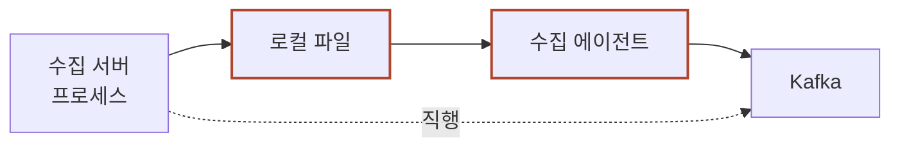

# 로그 수집기 9홉 글 + 데모 Implementation Plan

> **For agentic workers:** REQUIRED SUB-SKILL: Use superpowers:subagent-driven-development (recommended) or superpowers:executing-plans to implement this plan task-by-task. Steps use checkbox (`- [ ]`) syntax for tracking.

**Goal:** 화면에서 클릭 한 건이 생겨 수집기·변환기를 지나 Kafka에 닿고 학습 데이터가 되기까지, 홉마다 실제 데이터가 어떤 모양인지 보이는 글 1편과 흐름 데모 1개를 추가한다.

**Architecture:** 글은 `posts/log-hops-to-kafka.md` 마크다운 한 파일, 메타는 `js/posts.js` 객체 하나. 브라우저가 marked.js로 렌더한다(빌드 없음). 그림은 인라인 SVG 2장 + mermaid 1장. 데모는 `demo-log-hops.html` + `js/log-hops-demo.js` + `js/demo-edu-content.js` 엔트리 3점 세트다. 절마다 고정 4칸 표를 달아 "지금 어디 / 무슨 모양 / 몇 바이트 / 얼마나 머무나"를 반복한다.

**Tech Stack:** Vanilla HTML/CSS/JS, marked.js, mermaid 11, zero-dependency Node 검증 스크립트, Python 3 표준 라이브러리(예제 실행용)

**설계 문서:** `docs/superpowers/specs/2026-08-11-log-hops-to-kafka-design.md`

---

## Global Constraints

이 절의 값은 모든 태스크에 암묵적으로 붙는다.

- **slug** `log-hops-to-kafka` · **제목** `로그 수집기 안을 열어 본다 — 클릭 한 건이 Kafka를 지나기까지 9홉`
- **categories** `['ML Infrastructure', 'Software Engineering']` · **tags** `['ML Infra', 'Event-Driven', 'Kafka', 'System Design']` · **world** `'both'`
- **series** `engineering-foundations` 의 6번째 (`kafka-log-pipeline` 바로 뒤)
- **비유 금지.** 실제 설정 파일·실제 값·표로 쓴다. 성문·집·택배 같은 일상 사물 비유를 넣지 않는다
- **`§` 금지.** `3절`·`1~3절` 로 쓴다
- **읽는 시간 추정 금지.** 분량은 절 개수로 말한다
- **문장은 짧게.** 한 문장 = 한 생각. 80자를 넘으면 두 문장으로 나눈다
- **가데이터임을 도입부에서 한 번 밝힌다**
- SVG 색은 전부 `var(--…)`. hex 금지. marker id 접두사는 `lh` + 절 번호 (`lh1-arr`, `lh7-arr`)
- 색만으로 구분하지 않는다. 점선·굵기를 같이 준다
- mermaid `classDef` 에는 테두리 색과 굵기만. `fill`·`color` 금지
- 넓은 요소는 스크롤 상자에. 375px 에서 `document.scrollWidth == clientWidth`
- 커밋은 `chkimsu` 계정. `git add -A` 금지, 파일 명시. push 전 `git fetch origin && git merge origin/main`

### 이 글에서 쓰는 확정 숫자

기존 글에서 가져온 값은 절대 바꾸지 않는다. 실행값은 아래 파이썬 예제가 실제로 낸 것이다.

| 값 | 숫자 | 출처 |
|---|---|---|
| `req_id` / `ad_id` / `slot` / `media` | `r-8f21` / 9931 / `main_top` / `A앱` | `kafka-log-pipeline` |
| 노출 시각 | 1786000101 = 2026-08-06 16:08:21 KST | 같은 글 도입 |
| 클릭 시각 | 1786002501 = 2026-08-06 16:48:21 KST | 같은 글 7절 |
| `ad.impression` 하루 | 2억 2,800만 (초당 2,639) | 같은 글 1절 |
| `ad.click` 하루 | 228만 (초당 26.4) | 같은 글 7절 |
| 수집 서버가 받는 총량 | **하루 2억 3,028만 · 초당 2,665건** | 위 둘의 합 |
| partition 12개, key `req_id` | | 같은 글 3절 |
| 보존 7일, 복제 3벌, 브로커 6대, 대당 500GB | | 같은 글 6절 |
| 조인 창 3시간, `bid` 182.4 | | 같은 글 7절·도입 |
| 액세스 로그 한 줄 | **169 B** | 예제 1·2 실행값 |
| 변환 뒤 JSON 한 건 | **308 B** | 예제 1·2 실행값 |
| Avro 한 건 | **95 B** | 예제 2 실행값 |
| Kafka 에 실제로 저장되는 크기 | **JSON 배치 gzip 36.6 B · Avro 배치 gzip 30.0 B** | 예제 2 실행값 |
| 탭 → Kafka 도달 | **1,112 ms** | 예제 3 실행값 |
| 탭 → 학습 데이터 | **10.2시간** | 예제 3 실행값 |
| Kafka 멈췄을 때 버티는 시간 | **파일 61.7시간 · 직행 10.4분 (356배)** | 예제 3 실행값 |

### 설계 문서에서 바뀐 것 (예제를 돌려 보고 고친 것)

**스펙 7절은 "크기 때문에 Avro 로 간다"였다. 실행 결과가 이를 반박했다.**

압축 전에는 308 B → 95 B 로 69% 가 준다. 그런데 Kafka producer 는 배치 단위로 압축하고, 압축을 끼우면 JSON 36.6 B 대 Avro 30.0 B 로 차이가 **18%** 로 좁혀진다. gzip 이 반복되는 필드 이름을 어차피 지우기 때문이다.

**그래서 7절의 결론을 바꾼다.** Avro 로 가는 이유는 크기가 전부가 아니라 **이름이 값에서 빠져나가 스키마 레지스트리에 등록되면 그 스키마가 보내는 쪽과 읽는 쪽의 계약이 된다는 것**이다. 크기는 부수적 이득으로 적는다. `MARKDOWN_GUIDE.md` 의 "시뮬레이션이 서술을 반박하면 서술을 고친다"를 따른 것이다.

스펙의 추정치도 실행값으로 대체됐다: 190 B → 169 B, 300 B → 308 B, 78 B → 95 B, 55시간 → 61.7시간, 17분 → 10.4분.

---

## 이 계획에서 "테스트"란

유닛 테스트가 없는 저장소다. 검증 스크립트 3개가 게이트다. **각 태스크의 마지막은 항상 해당하는 것을 돌려 출력을 확인하는 것이다.**

```bash
node scripts/validate-posts.js                          # 분류·빈 필드·없는 .md·죽은 링크
node scripts/check-content-standard.js log-hops-to-kafka # 이 글만 상세
node scripts/build-search-index.js                      # 검색 색인 재생성
```

`check-content-standard.js` 가 재는 것:

| 항목 | 기준 |
|---|---|
| `bytes` | 15,000 이상 |
| `short` | 산문 300자 미만인 `##` 섹션 = 경고 |
| `long` | 한 문장 80자 초과 = 경고 |
| `badBadge` | `[무대: …]` 값이 열린 RTB·닫힌 생태계·공통 셋 중 하나가 아니면 경고 |
| `mathKorean` | LaTeX 명령이 든 수식 안에 한글이 있으면 경고 |
| `dead` | `post.html?id=…` 의 id가 없거나 링크한 `.html` 이 없으면 경고 |
| `python` `tables` `demo` `h2` | 개수만 보고. 사람이 판단 |

**경고는 글을 고치라는 신호다. 경고를 없애려고 문장을 자르거나 산문을 불릿으로 바꾸지 않는다.**

---

## File Structure

| 파일 | 책임 | 어느 태스크 |
|---|---|---|
| `posts/log-hops-to-kafka.md` | 글 본문 전체 (도입 + 9절 + 더 깊이 보기) | 1~6 |
| `js/posts.js` | 글 메타 객체 1개 + `series.engineering-foundations.posts` 에 slug 추가 | 1 |
| `demo-log-hops.html` | 데모 페이지 뼈대 · 컨트롤 마크업 · 스타일 | 7 |
| `js/log-hops-demo.js` | 흐름 시뮬레이션 · 한 건 상세 렌더 · 컨트롤 바인딩 | 7 |
| `js/demo-edu-content.js` | `'log-hops'` 엔트리 (`embedKeep`·`embedHide`·`explain`) | 8 |
| `demos.html` | 데모 카드 1개 + 로드맵 링크 1줄 | 8 |
| `search-index.json` | 재생성 산출물 | 9 |

`js/log-hops-demo.js` 는 세 부분으로 나눈다 — 시뮬레이션 상태(`state`), 그리기(`draw*`), 컨트롤 바인딩(`bind*`). 한 함수가 셋을 겸하지 않게 한다. `js/kafka-partition-demo.js` 가 같은 구조다.

---

## 절 ↔ 홉 대응 (구현 중 헷갈리지 말 것)

| 홉 | 어디 | 어느 절 |
|---|---|---|
| ① | 앱 SDK 메모리 큐 | 1절 |
| ② | HTTP 요청 (이동 구간) | 2절 |
| ③ | 수집 서버 프로세스 | 3절 |
| ④ | 수집 서버 로컬 파일 | 3절 끝 · 4절 |
| ⑤ | 수집 에이전트 | 5절 |
| ⑥ | 변환기 | 6절 |
| ⑦ | Kafka 브로커 | 7절 |
| ⑧ | consumer 프로세스 | 8절 |
| ⑨ | 저장소(S3 Parquet) · 조인 | 8절 끝 |

4절은 홉이 아니라 ④를 거칠지 말지의 선택을 다룬다.

---

## 절마다 다는 고정 표 (1~8절 전부)

굵은 요약 한 줄 바로 아래에 이 표를 단다. **열 이름과 순서를 절마다 똑같이 유지한다.** 반복되는 것이 이 글의 장치다.

```markdown
| 지금 어디 | 무슨 모양 | 몇 바이트 | 얼마나 머무나 |
|---|---|---|---|
| 앱 SDK 메모리 큐 | 구조체 하나 | 96 B | 클릭 0초 · 노출 최대 5초 |
```

절별로 채울 값:

| 절 | 지금 어디 | 무슨 모양 | 몇 바이트 | 얼마나 머무나 |
|---|---|---|---|---|
| 1 | 앱 SDK 메모리 큐 | 구조체 하나 | 96 B | 클릭 0초 · 노출 최대 5초 |
| 2 | 네트워크 위 | HTTP 요청 본문 JSON | 78 B | 왕복 168 ms |
| 3 | 수집 서버 로컬 디스크 | 액세스 로그 텍스트 한 줄 | 169 B | 640 ms |
| 4 | (선택을 다루는 절 — 표 대신 대비 표를 쓴다) | | | |
| 5 | 수집 에이전트 메모리 | 값이 전부 문자열인 map | 169 B | 46 ms |
| 6 | 변환기 메모리 | 타입이 붙은 JSON | 308 B | 220 ms |
| 7 | Kafka 브로커 디스크 | 배치로 묶여 압축된 바이트 | 건당 36.6 B (Avro면 30.0 B) | 7일 |
| 8 | consumer 프로세스 → S3 | ConsumerRecord → Parquet 열 | 308 B → 41 B | Parquet 은 수개월 |

1절 96 B와 2절 78 B는 태스크 2에서 실제로 세어 확정한다. 8절 41 B는 태스크 6에서 확정한다.

---

## Task 1: 스캐폴드와 메타 등록

**Files:**
- Create: `posts/log-hops-to-kafka.md` (stub)
- Modify: `js/posts.js` (글 객체 1개 + series 배열 1줄)

**Interfaces:**
- Produces: 글 id `log-hops-to-kafka`. 태스크 2~6이 이 `.md` 에 절을 덧붙인다. 태스크 8이 `post.html?id=log-hops-to-kafka` 로 링크한다.

- [ ] **Step 1: 스캐폴드 생성**

```bash
node scripts/new-post.js log-hops-to-kafka \
  "로그 수집기 안을 열어 본다 — 클릭 한 건이 Kafka를 지나기까지 9홉" \
  "ML Infrastructure" \
  "ML Infra,Event-Driven,Kafka,System Design" \
  "공통"
```

`new-post.js` 는 git 을 건드리지 않는다. `posts/log-hops-to-kafka.md` stub 과 `js/posts.js` 엔트리만 만든다.

- [ ] **Step 2: 스크립트가 못 넣는 세 가지를 손으로 채운다**

`js/posts.js` 의 새 객체에서 확인·수정할 것:

```javascript
{
  id: 'log-hops-to-kafka',
  title: '로그 수집기 안을 열어 본다 — 클릭 한 건이 Kafka를 지나기까지 9홉',
  excerpt: '광고를 탭한 그 순간부터 학습 데이터가 되기까지, 클릭 한 건은 다섯 군데에 머물고 그때마다 모양이 바뀐다. 수집 서버 안에서는 타입 없는 텍스트 한 줄(169 B)이고, 변환기를 지나면 필드가 8개에서 17개로 늘어난 JSON(308 B)이 되며, Kafka 안에서는 배치로 묶여 압축된 36.6 B다. 파일을 한 번 거치는 설계는 Kafka가 멈춰도 61.7시간을 버티고 직행은 10.4분을 버틴다 — 356배 차이가 640 ms 지연의 값이다. 같은 줄을 대시보드는 2초 뒤에, 학습은 10.2시간 뒤에 읽는다. 그래서 7일을 남긴다.',
  date: '2026-08-11',
  categories: ['ML Infrastructure', 'Software Engineering'],
  tags: ['ML Infra', 'Event-Driven', 'Kafka', 'System Design'],
  world: 'both',
  contentUrl: 'posts/log-hops-to-kafka.md',
}
```

`categories` 두 번째 값 `'Software Engineering'` 은 `new-post.js` 가 하나만 받으므로 직접 추가한다.

- [ ] **Step 3: 시리즈에 넣는다**

`js/posts.js` 의 `series` 객체에서 `engineering-foundations` 를 찾아 배열 끝에 추가한다.

```javascript
'engineering-foundations': {
  title: '엔지니어링 기초 트랙',
  desc: '...',
  posts: ['git-practical-guide', 'software-architecture-patterns', 'kubernetes-networking',
          'gateway-ingress-router', 'kafka-log-pipeline', 'log-hops-to-kafka'],
},
```

- [ ] **Step 4: 검증이 통과하는지 확인**

Run: `node scripts/validate-posts.js`
Expected: 통과. 실패하면 `data/taxonomy.json` 에 없는 분류를 썼거나 빈 필드가 있는 것이다.

- [ ] **Step 5: 커밋**

```bash
git add posts/log-hops-to-kafka.md js/posts.js
git commit -m "feat(posts): 로그 수집기 9홉 글 스캐폴드 + 메타 등록"
```

---

## Task 2: 도입과 1~2절 — 화면에서 HTTP까지

**Files:**
- Modify: `posts/log-hops-to-kafka.md`

**Interfaces:**
- Consumes: 태스크 1이 만든 stub
- Produces: 1절 96 B, 2절 78 B 를 실제로 세어 확정한다. 태스크 6의 9절 전체 지도 표가 이 두 값을 쓴다.

- [ ] **Step 1: 도입 장면을 쓴다**

개념어 없이 시작한다. `kafka-log-pipeline` 도입부와 같은 결이다.

들어가야 할 것:
- 2026년 8월 6일 16시 48분 21초, A앱에서 광고 하나를 탭했다는 장면
- 40분 전 16시 08분 21초에 그 광고가 떴다는 것 (기존 글 노출 `ts`)
- 이 탭이 학습 데이터의 `y=1` 이 된다는 것
- **기존 글 인용:** `kafka-log-pipeline` 7절의 "`ad.impression` 은 `bidder` 가 넣고 `ad.click` 은 매체를 거쳐 `log-collector` 가 넣는다" — 이 글이 뒤쪽 문장을 펼친다는 선언
- 이 글의 숫자가 전부 지어낸 값이라는 문장

- [ ] **Step 2: 한 줄 요약과 골라 읽는 법을 넣는다**

```markdown
> **한 줄 요약:** 화면에서 생긴 이벤트 하나는 Kafka에 닿기까지 다섯 군데에 머물고, 머물 때마다 모양이 바뀐다. 어디에 얼마나 머무느냐가 무엇을 잃을 수 있느냐를 정한다.

> **골라 읽는 법** — 절이 9개인 긴 글입니다. 처음부터 다 읽지 않아도 됩니다.
>
> - 수집기 안의 데이터가 어떻게 생겼는지만 → 3절
> - 변환이 무엇을 바꾸는지 → 6절
> - Kafka 안에 무엇이 들어 있는지 → 7절
> - consume 하면 무엇이 오는지 → 8절
> - 저장했다 보내나 바로 보내나 → 1·4절
> - 홉 아홉 개를 한 표로 → 9절
```

`>` 다음에 빈 `>` 줄을 넣고 항목은 `> - ` 로 쓴다. 안 그러면 마크다운이 한 문단으로 합친다.

- [ ] **Step 3: 1절을 쓴다 — 화면 안 SDK**

굵은 요약 한 줄: `이벤트를 만드는 것은 수집기가 아니라 앱 안의 SDK다. 그리고 클릭만 즉시 보낸다.`

고정 4칸 표를 단다. 그다음 실제 객체를 보인다.

```
ClickEvent(t="clk", rid="r-8f21", ad=9931, s="main_top",
           ts=1786002501234, seq=47, tz=540, sdk="3.2.1")
```

써야 할 것:
- `seq` 는 앱 실행 후 몇 번째 이벤트인지. `rid` 와 합쳐 멱등키가 된다
- **노출은 묶어 보내고 클릭은 즉시 보낸다.** 탭하면 랜딩 페이지로 넘어가고 앱이 백그라운드로 간다. 묶어 두면 못 보낸다. 노출은 10건 차거나 5초 지나면 보낸다
- 오프라인이면 디스크 큐에 넣고 다음 실행 때 보낸다 → 며칠 늦게 도착하는 로그의 첫 원인
- **"저장이냐 즉시냐"의 첫 답은 "이벤트 종류마다 다르다"** 라는 문장으로 절을 닫는다

- [ ] **Step 4: 1절의 96 B 를 실제로 센다**

Run:
```bash
python3 -c "
import json
d={'t':'clk','rid':'r-8f21','ad':9931,'s':'main_top','ts':1786002501234,'seq':47,'tz':540,'sdk':'3.2.1'}
print(len(json.dumps(d,separators=(',',':')).encode()))"
```
Expected: 숫자 하나가 찍힌다. 그 값을 1절 표의 "몇 바이트" 칸에 넣는다. 96 이 아니면 실제 값을 쓴다.

- [ ] **Step 5: 2절을 쓴다 — HTTP 전송**

굵은 요약 한 줄: `전송은 한 번의 HTTP 요청이다. 응답을 못 받으면 다시 보내고, 그래서 중복이 생긴다.`

고정 4칸 표를 달고 실제 요청을 보인다.

```
POST /v1/e HTTP/1.1
Host: log.adsvc.example
Content-Type: application/json
User-Agent: MyApp/3.2.1 (iPhone; iOS 19.2)

{"t":"clk","rid":"r-8f21","ad":9931,"s":"main_top","ts":1786002501234,"seq":47}
```

응답은 `HTTP/1.1 204 No Content`. 본문이 없어야 모바일 데이터와 지연이 준다.

GET 픽셀과 POST 배치를 표로 대비한다.

| | GET 픽셀 | POST 배치 |
|---|---|---|
| 어디서 쓰나 | 웹, 서드파티 지면, 앱 종료 직전 | 앱 SDK |
| 한 번에 | 1건 | 여러 건 |
| 길이 제한 | URL 길이(실무상 2KB 안팎) | 없다시피 |
| 앱이 죽어도 | 브라우저가 마저 보낸다 | 안 간다 |

**재전송이 있는 곳에는 중복이 있다.** 2초 안에 204 를 못 받으면 다시 보낸다. 멱등키 `rid`+`seq` 는 보내는 쪽이 만든다. 받는 쪽이 붙이면 재전송마다 새 키가 생겨 중복 제거가 불가능하다. `ad-log-system` 7절로 링크한다.

왕복 168 ms → `collect_ts` = 16:48:21.402 로 절을 닫는다.

- [ ] **Step 6: 2절의 78 B 를 실제로 센다**

Run:
```bash
python3 -c "
print(len(b'{\"t\":\"clk\",\"rid\":\"r-8f21\",\"ad\":9931,\"s\":\"main_top\",\"ts\":1786002501234,\"seq\":47}'))"
```
Expected: 숫자 하나. 2절 표의 "몇 바이트" 칸에 넣는다.

- [ ] **Step 7: 검증**

Run: `node scripts/check-content-standard.js log-hops-to-kafka`
Expected: `short`(300자 미만 섹션)·`long`(80자 초과 문장) 경고가 없다. 있으면 그 섹션을 채우거나 문장을 나눈다. `bytes` 는 아직 15,000 미만이어도 된다.

- [ ] **Step 8: 커밋**

```bash
git add posts/log-hops-to-kafka.md
git commit -m "feat(posts): 9홉 글 도입~2절 — SDK 큐와 HTTP 전송"
```

---

## Task 3: 3~4절 — 수집 서버, 그리고 파일이냐 직행이냐

**Files:**
- Modify: `posts/log-hops-to-kafka.md`

**Interfaces:**
- Consumes: 태스크 2가 확정한 `collect_ts` 16:48:21.402
- Produces: 액세스 로그 한 줄 169 B, 파일 61.7시간 / 직행 10.4분. 태스크 5의 7절과 태스크 6의 9절이 쓴다.

- [ ] **Step 1: 3절을 쓴다 — 수집 서버가 받는 것**

굵은 요약 한 줄: `수집기 안의 데이터는 텍스트 한 줄이고 타입이 없다. 9931 은 숫자가 아니라 글자 넷이다.`

고정 4칸 표를 달고 nginx 설정을 그대로 보인다.

```
log_format collect '$remote_addr $time_iso8601 $request_method $uri $status '
                   '$request_time "$http_user_agent" $request_body';
```

찍히는 한 줄:

```
10.2.31.7 2026-08-06T16:48:21+09:00 POST /v1/e 204 0.002 "MyApp/3.2.1 (iPhone; iOS 19.2)" {"t":"clk","rid":"r-8f21","ad":9931,"s":"main_top","ts":1786002501234,"seq":47}
```

써야 할 것:
- **이 절의 핵심:** 이 시점의 데이터에는 타입이 없다. `9931` 도 `204` 도 글자다. 숫자로 쓰려면 누군가 바꿔야 하고 그 자리가 6절이다
- 응답(204)을 먼저 주고 로그는 그다음에 쓴다. 로그 쓰기가 응답을 붙잡지 않는다
- 유실 지점: `access_log … buffer=32k` 를 주면 32KB 씩 묶어 쓴다. 프로세스가 죽으면 그 버퍼가 사라진다. 32KB ÷ 169 B ≈ 194줄
- 이 줄이 파일 끝에 붙는다는 것으로 4절에 넘긴다

- [ ] **Step 2: 4절을 쓴다 — 파일이냐 직행이냐**

굵은 요약 한 줄: `파일을 한 번 거치면 Kafka가 멈춰도 61.7시간을 버틴다. 직행은 10.4분이다. 그 값으로 640 ms를 산다.`

**이 절은 기존 글과 정면으로 이어야 한다.** `kafka-log-pipeline` 1절 ②가 "파일에 쓰고 나중에 옮긴다"를 유실 사례로 깠다. 같은 절에서 "파일을 계속 따라 읽는 에이전트를 붙이면 5분이 몇 초로 줄어든다. 맞다"고 이미 인정했다. **그 문장을 인용하고 거기서 이어받는다.** 기존 글이 깐 것은 5분 배치 이동이지 파일 자체가 아니라는 것을 분명히 한다.

대비 표:

| | 파일 경유 | 프로세스 안 producer 직행 |
|---|---|---|
| 홉 수 | 3 (파일 → 에이전트 → Kafka) | 1 |
| Kafka 도달까지 | 906 ms | 5~50 ms |
| Kafka 가 멈추면 버티는 시간 | 디스크 100GB → **61.7시간** | 메모리 512MB → **10.4분** |
| 수집 서버가 죽으면 | 파일은 남는다. 안 읽은 끝부분만 늦어진다 | 버퍼가 사라진다 |
| 인스턴스가 사라지면 | 파일도 같이 사라진다 | 같다 |
| 디스크가 차면 | 쓰기 실패가 요청 처리까지 흔든다 | 영향 없다 |
| 배포 | 수집 서버와 전송 로직을 따로 배포 | 같이 배포 |
| 언어 | 무관 | Kafka 클라이언트가 있는 언어여야 |

**우리 답은 파일 경유다.** 근거는 버티는 시간 하나다.

**빠져나갈 길까지 막는다.** 직행이 틀린 것이 아니다. 지연이 밀리초로 중요한 곳, 디스크가 없는 컨테이너, 언어가 이미 맞는 곳은 직행이 낫다. **판정 기준은 하나다 — Kafka 가 30분 멈춰도 되나.**

- [ ] **Step 3: 파이썬 예제를 4절에 넣는다 (실행 검증 완료본)**

아래를 그대로 넣는다. 이미 실행해 출력을 확인한 코드다. 수정하면 다시 돌려 `# 출력:` 을 갱신한다.

````markdown
```python
# "탭에서 Kafka 까지 얼마나 걸리고, 앞이 멈추면 어디까지 버티나" — 홉을 더해 본다.
#
# 상황: 16:48:21.234 에 탭한 클릭 한 건이 홉을 차례로 지난다. 홉마다 머무는
#   시간을 더해 Kafka 에 닿는 시각을 낸다. 그다음 Kafka 가 멈췄다고 하고,
#   파일 경유와 프로세스 안 직행이 각각 얼마나 버티는지 잰다.
# 하루 유입은 Kafka 글 값을 합친 것이다 — 노출 확인 2.28억 + 클릭 228만.
# 홉별 밀리초, 디스크 100GB, 메모리 512MB 는 전부 지어낸 값이다.
from unicodedata import east_asian_width

TAP = 1786002501234                       # 2026-08-06 16:48:21.234 KST
ROWS_DAY = 228_000_000 + 2_280_000
PER_SEC = ROWS_DAY / 86_400               # 수집 서버가 초당 받는 줄
LINE_TEXT, LINE_JSON = 169, 308           # 예제 2에서 잰 한 줄 바이트
DISK, MEM = 100 * 10 ** 9, 512 * 10 ** 6

# (홉 이름, 머무는 밀리초, 무슨 모양으로 있나)
HOPS = [
    ("앱 SDK 메모리 큐",   0, "구조체 (클릭은 즉시 보낸다)"),
    ("HTTP 왕복",        168, "요청 본문 JSON"),
    ("수집 서버 처리",      2, "액세스 로그 한 줄"),
    ("로컬 파일",         640, "텍스트 파일 끝에 붙어 있다"),
    ("수집 에이전트",       46, "문자열만 든 map"),
    ("변환기",            220, "타입이 붙은 JSON"),
    ("producer → 브로커",  36, "배치로 묶인 바이트"),
]

def w(s):
    return sum(2 if east_asian_width(c) in "WF" else 1 for c in s)

def row(*cells):
    print("".join(" " * (n - w(c)) + c for c, n in cells))

def clock(ms):                            # 밀리초를 16:48:21.234 꼴로
    s, sub = divmod(TAP + ms, 1000)
    h, m = divmod(s % 86_400 // 60, 60)
    return f"{(h + 9) % 24:02d}:{m:02d}:{s % 60:02d}.{sub:03d}"

print(f"탭 {clock(0)} 부터 홉마다 쌓이는 시간")
row(("홉", 20), ("머문다", 9), ("여기를 떠나는 시각", 22), ("무슨 모양으로", 30))
acc = 0
for name, ms, shape in HOPS:
    acc += ms
    row((name, 20), (f"{ms:,} ms", 9), (clock(acc), 22), (shape, 30))
print()
print(f"→ 탭에서 Kafka 까지 {acc:,} ms. 그중 {HOPS[3][1]:,} ms 가 로컬 파일에서 기다린 시간이다.")

# ── 같은 줄을 누가 언제 읽나. group 마다 다르다 ──
#    학습은 다음 날 03:00 에 하루치를 몰아 읽는다. 탭한 16:48:21 부터의 초를 센다
NEXT_3AM = 27 * 3600 - (16 * 3600 + 48 * 60 + 21)
READERS = [("대시보드", 900, None), ("정산", 2_900, None),
           ("학습", NEXT_3AM * 1000 - acc, "다음 날 03:00:00")]
print()
print("같은 줄을 읽는 시각은 group 마다 다르다")
row(("group", 12), ("Kafka 도달 뒤", 15), ("보는 시각", 18), ("탭부터", 12))
for name, wait, label in READERS:
    t = acc + wait
    dur = (lambda x: f"{x:,} ms" if x < 3_600_000 else f"{x / 3_600_000:,.1f}시간")
    row((name, 12), (dur(wait), 15), (label or clock(t), 18), (dur(t), 12))
print()

# ── Kafka 가 멈췄다. 앞에 쌓인 것이 어디까지 버티나 ──
file_bps = PER_SEC * LINE_TEXT            # 파일에는 액세스 로그 텍스트가 쌓인다
mem_bps = PER_SEC * LINE_JSON             # 직행이면 변환된 JSON 을 메모리에 든다
print(f"Kafka 가 멈췄을 때 (초당 {PER_SEC:,.0f}건이 계속 들어온다)")
row(("어디에 쌓이나", 18), ("크기", 10), ("초당", 12), ("버티는 시간", 14))
row(("로컬 파일 (디스크)", 18), (f"{DISK / 10 ** 9:,.0f} GB", 10),
    (f"{file_bps / 1000:,.0f} KB", 12), (f"{DISK / file_bps / 3600:,.1f}시간", 14))
row(("직행 (메모리 버퍼)", 18), (f"{MEM / 10 ** 6:,.0f} MB", 10),
    (f"{mem_bps / 1000:,.0f} KB", 12), (f"{MEM / mem_bps / 60:,.1f}분", 14))
print()
print(f"→ {DISK / file_bps / (MEM / mem_bps):,.0f}배 차이다. 파일을 한 번 거치는 값이 이것이다.")
print(f"→ 대신 {HOPS[3][1]:,} ms 를 매 건마다 낸다. 대시보드가 몇 초 안에 숫자를 올려야 하는데")
print(f"   그중 {HOPS[3][1] / 1000:,.1f}초를 여기서 쓴다.")
print("→ 판정 기준은 하나다. Kafka 가 30분 멈춰도 되나, 안 되나.")

# 출력:
# 탭 16:48:21.234 부터 홉마다 쌓이는 시간
#                   홉   머문다    여기를 떠나는 시각                 무슨 모양으로
#     앱 SDK 메모리 큐     0 ms          16:48:21.234   구조체 (클릭은 즉시 보낸다)
#            HTTP 왕복   168 ms          16:48:21.402                요청 본문 JSON
#       수집 서버 처리     2 ms          16:48:21.404             액세스 로그 한 줄
#            로컬 파일   640 ms          16:48:22.044    텍스트 파일 끝에 붙어 있다
#        수집 에이전트    46 ms          16:48:22.090               문자열만 든 map
#               변환기   220 ms          16:48:22.310              타입이 붙은 JSON
#    producer → 브로커    36 ms          16:48:22.346            배치로 묶인 바이트
#
# → 탭에서 Kafka 까지 1,112 ms. 그중 640 ms 가 로컬 파일에서 기다린 시간이다.
#
# 같은 줄을 읽는 시각은 group 마다 다르다
#        group  Kafka 도달 뒤         보는 시각      탭부터
#     대시보드         900 ms      16:48:23.246    2,012 ms
#         정산       2,900 ms      16:48:25.246    4,012 ms
#         학습       10.2시간  다음 날 03:00:00    10.2시간
#
# Kafka 가 멈췄을 때 (초당 2,665건이 계속 들어온다)
#      어디에 쌓이나      크기        초당   버티는 시간
# 로컬 파일 (디스크)    100 GB      450 KB      61.7시간
# 직행 (메모리 버퍼)    512 MB      821 KB        10.4분
#
# → 356배 차이다. 파일을 한 번 거치는 값이 이것이다.
# → 대신 640 ms 를 매 건마다 낸다. 대시보드가 몇 초 안에 숫자를 올려야 하는데
#    그중 0.6초를 여기서 쓴다.
# → 판정 기준은 하나다. Kafka 가 30분 멈춰도 되나, 안 되나.
```
````

- [ ] **Step 4: mermaid 그림을 4절에 넣는다**

파일 경유와 직행 두 갈래. `classDef` 에 테두리 색과 굵기만 준다.

```markdown

```

`stroke` 만 주고 `fill`·`color` 는 주지 않는다. 사이트 CSS 가 라벨 `<p>` 색을 덮어써서 다크에서 대비가 1.7:1 이 된다.

- [ ] **Step 5: 파이썬 블록이 실제로 도는지 확인**

Run:
```bash
python3 - <<'PY'
# 위 코드 블록을 그대로 붙여 실행
PY
```
Expected: 글에 적은 `# 출력:` 과 한 글자도 다르지 않다. 다르면 `# 출력:` 을 실행 결과로 고친다.

- [ ] **Step 6: 검증**

Run: `node scripts/check-content-standard.js log-hops-to-kafka`
Expected: `short`·`long` 경고 없음

- [ ] **Step 7: 커밋**

```bash
git add posts/log-hops-to-kafka.md
git commit -m "feat(posts): 9홉 글 3~4절 — 수집 서버와 파일이냐 직행이냐"
```

---

## Task 4: 5~6절 — 에이전트와 변환

**Files:**
- Modify: `posts/log-hops-to-kafka.md`

**Interfaces:**
- Consumes: 3절이 확정한 액세스 로그 한 줄과 169 B
- Produces: 변환 뒤 17필드 JSON 308 B, 시각 셋(`event_ts`·`collect_ts`·`process_ts`). 태스크 5의 7절과 태스크 6의 8·9절이 쓴다.

- [ ] **Step 1: 5절을 쓴다 — 수집 에이전트**

굵은 요약 한 줄: `에이전트가 하는 일은 셋이다. 파일을 따라 읽고, 정규식으로 쪼개고, 어디까지 읽었는지 적어 둔다.`

고정 4칸 표를 달고 Fluent Bit 설정을 그대로 보인다.

```
[INPUT]
    Name              tail
    Path              /var/log/collect/e-*.log
    DB                /var/lib/fluent-bit/pos.db
    Refresh_Interval  1
    Parser            collect_v1
[OUTPUT]
    Name              kafka
    Match             *
    Brokers           kafka-01:9092,kafka-02:9092
    Topics            ad.click
```

파싱 결과 — **여전히 전부 문자열이다.**

```json
{"remote":"10.2.31.7","ts":"2026-08-06T16:48:21+09:00","method":"POST",
 "uri":"/v1/e","status":"204","rt":"0.002",
 "agent":"MyApp/3.2.1 (iPhone; iOS 19.2)",
 "body":"{\"t\":\"clk\",\"rid\":\"r-8f21\",\"ad\":9931,\"s\":\"main_top\",\"ts\":1786002501234,\"seq\":47}"}
```

써야 할 것:
- `"204"` 가 따옴표 안이라는 것. `body` 는 아직 통째로 문자열 하나다
- 위치 파일 내용을 보인다:

```
/var/log/collect/e-2026080616.log   inode=8391204   offset=48,271,104
```

- **offset 의 예고편이 여기다.** "어디까지 읽었나"를 적어 두는 물건이 Kafka 이전에도 있다. 다른 점은 있는 자리다 — Kafka offset 은 브로커에 있고 이것은 에이전트 로컬 디스크에 있다. 인스턴스가 사라지면 이 파일도 사라진다
- 로테이션 함정 한 문단: `e-2026080616.log` → `e-2026080617.log` 로 바뀔 때 inode 가 바뀐다. 옛 파일의 끝을 다 읽기 전에 지워지면 그만큼이 안 간다
- **제품 하나의 동작을 부류 전체로 쓰지 않는다.** 위 설정은 Fluent Bit 것이고, 위치를 어디에 어떻게 적는지는 도구마다 다르다는 한 문장을 넣는다

- [ ] **Step 2: 6절을 쓴다 — 변환**

굵은 요약 한 줄: `변환기가 하는 일은 다섯이다. 쪼개고, 타입을 붙이고, 밖에서 값을 가져와 붙이고, 지우고, 검증한다.`

고정 4칸 표를 달고 다섯 작업 표를 놓는다.

| 작업 | 이 줄에서 무슨 일이 | 결과 |
|---|---|---|
| 쪼개기 | `body` 문자열을 JSON 으로 연다 | 필드 1개 → 6개 |
| 타입 붙이기 | 문자열을 숫자로 | `"9931"` → `9931` |
| 보강 | 밖에서 값을 가져와 붙인다 | UA → `os`·`os_ver`·`device`·`app_ver` / IP → `region` / `ad_id` → `campaign_id`·`advertiser_id`·`media` |
| 지우기 | 남기면 안 되는 것 | `remote` 삭제 |
| 검증 | 스키마에 안 맞으면 뺀다 | `event_ts` 가 `collect_ts` 보다 뒤면 dead-letter topic 으로 |

시각 표를 별도로 놓는다.

| 이름 | 값 | 누가 찍나 | 믿을 수 있나 |
|---|---|---|---|
| `event_ts` | 16:48:21.234 | 기기 | 기기 시계가 틀리면 틀린다 |
| `collect_ts` | 16:48:21.402 | 수집 서버 | 서버 시계라 믿을 수 있다 |
| `process_ts` | 16:48:22.310 | 변환기 | 재처리하면 값이 바뀐다 |

**셋을 어디에 쓰는지가 갈림길이다.** 저장소 파티션(`dt=`·`hour=`)은 `collect_ts` 로 자르고, 조인 창 3시간(`kafka-log-pipeline` 7절)은 `event_ts` 로 잰다. 섞으면 하루치가 새거나 겹친다. 9절 지뢰로 다시 나온다.

**보강이 밖을 부른다**는 것도 한 문단. `ad_id` → `campaign_id` 조회는 다른 저장소를 읽는 일이다. 그 저장소가 느려지면 변환이 밀리고, 그 밀림이 5절 파일에 쌓인다. 4절이 잰 61.7시간이 여기서 값을 낸다.

- [ ] **Step 3: 파이썬 예제를 6절에 넣는다 (실행 검증 완료본)**

````markdown
```python
# "수집기 안의 한 줄이 무엇으로 바뀌나" — 액세스 로그 한 줄을 직접 통과시킨다.
#
# 상황: 16:48:21 에 A앱에서 광고 하나를 탭했다. 그 요청이 수집 서버에 남긴
#   액세스 로그 한 줄을 그대로 놓고, 변환기가 하는 다섯 가지를 차례로 적용한다.
#   쪼개기 → 타입 붙이기 → 보강 → 지우기 → 검증.
# req_id r-8f21 · ad_id 9931 · slot main_top 은 Kafka 글에서 가져왔고
#   나머지 값과 조회 테이블은 전부 지어낸 것이다.
import json, re
from unicodedata import east_asian_width

RAW = ('10.2.31.7 2026-08-06T16:48:21+09:00 POST /v1/e 204 0.002 '
       '"MyApp/3.2.1 (iPhone; iOS 19.2)" '
       '{"t":"clk","rid":"r-8f21","ad":9931,"s":"main_top","ts":1786002501234,"seq":47}')

def w(s):                          # 한글은 모노스페이스에서 두 칸을 먹는다
    return sum(2 if east_asian_width(c) in "WF" else 1 for c in s)

def row(*cells):                   # (글자, 칸수) 쌍을 오른쪽 맞춤으로 찍는다
    print("".join(" " * (n - w(c)) + c for c, n in cells))

# ── 1단계 쪼개기: 에이전트가 정규식으로 여덟 칸을 뜯는다. 값은 전부 문자열이다 ──
M = re.match(r'(\S+) (\S+) (\S+) (\S+) (\S+) (\S+) "([^"]*)" (.*)', RAW)
rec = dict(zip("remote ts method uri status rt agent body".split(), M.groups()))

# ── 2단계 쪼개기 계속: body 는 아직 문자열 하나다. 열어야 필드가 된다 ──
body = json.loads(rec["body"])

# ── 3단계 타입 붙이기: 문자열을 숫자로 바꾸고 이름을 제 이름으로 되돌린다 ──
out = {"req_id": body["rid"], "event": "click", "ad_id": int(body["ad"]),
       "slot": body["s"], "seq": int(body["seq"])}

# ── 4단계 보강: 밖에서 값을 가져와 붙인다. 셋 다 다른 곳을 읽는 일이다 ──
UA = re.search(r'(\w+)/([\d.]+) \((\w+); (\w+) ([\d.]+)\)', rec["agent"])
out.update(app_ver=UA.group(2), device=UA.group(3), os=UA.group(4), os_ver=UA.group(5))
GEO = {"10.2.31.": "KR-11"}                     # IP 대역 → 지역
out["region"] = GEO[rec["remote"].rsplit(".", 1)[0] + "."]
ADS = {9931: (5502, 311, "A앱")}                 # ad_id → 캠페인·광고주·매체
out["campaign_id"], out["advertiser_id"], out["media"] = ADS[out["ad_id"]]

# ── 5단계 지우기와 시각 늘리기: remote 는 안 넘긴다. 시각은 하나에서 셋이 된다 ──
out["event_ts"] = body["ts"]                    # 기기가 찍은 시각
out["collect_ts"] = body["ts"] + 168            # 수집 서버가 받은 시각(왕복 168ms)
out["process_ts"] = body["ts"] + 1076           # 변환기가 처리한 시각
out["schema"] = "click.v3"

# ── 6단계 검증: 기기 시계가 앞서 있으면 dead-letter topic 으로 뺀다 ──
assert out["event_ts"] <= out["collect_ts"], "기기 시계가 앞서 있다"

AFTER = json.dumps(out, ensure_ascii=False, separators=(",", ":"))
looked_up = ["region", "campaign_id", "advertiser_id", "media"]   # 다른 저장소를 읽어 온 것

print("액세스 로그 한 줄이 변환기를 지나면")
row(("", 9), ("필드 수", 9), ("바이트", 9), ("숫자로 보이는 값", 22))
row(("변환 전", 9), (f"{len(rec)}개", 9), (f"{len(RAW.encode()):,} B", 9),
    (f"status = {rec['status']!r}", 22))
row(("변환 후", 9), (f"{len(out)}개", 9), (f"{len(AFTER.encode()):,} B", 9),
    (f"ad_id = {out['ad_id']!r}", 22))
print()
print(f"→ 변환 전에는 숫자가 하나도 없다. {rec['status']!r} 도 {rec['rt']!r} 도 글자다.")
print(f"→ 필드가 {len(out) - len(rec)}개 늘었다. 그중 {len(looked_up)}개({' · '.join(looked_up)})는\n   이 줄에 없던 값이라 다른 저장소를 읽어 왔다.")
print(f"→ 사라진 것: remote({rec['remote']}) · status · rt. 남기면 안 되거나 이벤트와 무관하다.")
print(f"→ 시각이 하나에서 셋이 됐다 — event {out['event_ts']} / collect {out['collect_ts']} / process {out['process_ts']}")
print()
print(AFTER)

# 출력:
# 액세스 로그 한 줄이 변환기를 지나면
#            필드 수   바이트      숫자로 보이는 값
#   변환 전      8개    169 B        status = '204'
#   변환 후     17개    308 B          ad_id = 9931
#
# → 변환 전에는 숫자가 하나도 없다. '204' 도 '0.002' 도 글자다.
# → 필드가 9개 늘었다. 그중 4개(region · campaign_id · advertiser_id · media)는
#    이 줄에 없던 값이라 다른 저장소를 읽어 왔다.
# → 사라진 것: remote(10.2.31.7) · status · rt. 남기면 안 되거나 이벤트와 무관하다.
# → 시각이 하나에서 셋이 됐다 — event 1786002501234 / collect 1786002501402 / process 1786002502310
#
# {"req_id":"r-8f21","event":"click","ad_id":9931,"slot":"main_top","seq":47,"app_ver":"3.2.1","device":"iPhone","os":"iOS","os_ver":"19.2","region":"KR-11","campaign_id":5502,"advertiser_id":311,"media":"A앱","event_ts":1786002501234,"collect_ts":1786002501402,"process_ts":1786002502310,"schema":"click.v3"}
```
````

- [ ] **Step 4: 파이썬 블록을 실제로 돌려 출력이 맞는지 확인**

Run: 위 블록을 파일로 저장해 `python3` 로 실행
Expected: `# 출력:` 과 한 글자도 다르지 않다. 특히 `process 1786002502310` 이 나와야 한다(`+1076`). 다르면 코드가 아니라 `# 출력:` 을 고친다.

- [ ] **Step 5: 검증**

Run: `node scripts/check-content-standard.js log-hops-to-kafka`
Expected: `short`·`long` 경고 없음

- [ ] **Step 6: 커밋**

```bash
git add posts/log-hops-to-kafka.md
git commit -m "feat(posts): 9홉 글 5~6절 — 에이전트와 변환, 시각이 셋이 되는 자리"
```

---

## Task 5: 7절 — Kafka 안을 바이트로 본다

**Files:**
- Modify: `posts/log-hops-to-kafka.md`

**Interfaces:**
- Consumes: 6절이 만든 17필드 JSON 308 B
- Produces: Avro 95 B, JSON 배치 gzip 36.6 B, Avro 배치 gzip 30.0 B, group 별 읽는 시각. 태스크 6의 8·9절과 태스크 8의 데모 임베드 자리가 여기다.

- [ ] **Step 1: 7절 앞부분을 쓴다 — producer 에 넘기는 것과 브로커가 붙이는 것**

굵은 요약 한 줄: `브로커가 들고 있는 것은 바이트다. 값이 무엇인지는 브로커가 모른다.`

고정 4칸 표를 달고 두 덩이를 보인다.

producer 에 넘기는 것:

```
topic      ad.click
key        b'r-8f21'                              6 B
value      b'{"req_id":"r-8f21","ad_id":9931,…}'  308 B
headers    [('schema', b'click.v3'), ('src', b'collector-07')]
```

브로커에 붙은 뒤 생기는 것:

```
partition 5      ← hash(b'r-8f21') % 12   (kafka-log-pipeline 3절)
offset    8412
timestamp 1786002502310   type=CREATE_TIME
```

`timestamp` 가 6절의 `process_ts` 와 같은 값이라는 것을 짚는다. `CREATE_TIME` 은 producer 가 `send()` 를 부른 시각이라 그렇다.

- [ ] **Step 2: 콘솔로 꺼내 보는 두 화면을 쓴다**

JSON 일 때:

```
$ kafka-console-consumer --topic ad.click --partition 5 --offset 8412 \
    --max-messages 1 --property print.key=true --property print.offset=true
Offset:8412	r-8f21	{"req_id":"r-8f21","ad_id":9931,"slot":"main_top",…}
```

Avro 일 때:

```
Offset:8412	r-8f21	\x00\x00\x00\x00\x11\x0cr-8f21\xa6\x9b\x01\x10main_top…
```

바이트 해부 표:

| 위치 | 바이트 | 무엇 |
|---|---|---|
| 0 | `\x00` | 매직 — 이 뒤가 스키마 번호라는 표시 |
| 1~4 | `\x00\x00\x00\x11` | 스키마 번호 17 (big-endian) |
| 5~ | `\x0c` `r-8f21` … | 길이 6 + 값. 필드 이름이 없다 |

- [ ] **Step 3: 파이썬 예제를 넣는다 (실행 검증 완료본)**

**중요:** 이 예제의 결론이 스펙과 다르다. 압축을 끼우면 JSON 과 Avro 차이가 18% 로 좁혀진다. 그 결과를 그대로 싣고, 아래 Step 4 에서 결론을 그에 맞춘다.

````markdown
```python
# "Kafka 에 담기는 바이트가 표현마다 얼마나 다른가" — 같은 한 건을 다섯으로 만들어 잰다.
#
# 상황: 클릭 한 건이 여러 모양을 지난다. 다섯을 나란히 놓고 바이트를 센다.
#   ① 수집 서버 액세스 로그 텍스트   ② 변환 뒤 JSON 한 건
#   ③ JSON 을 500건 묶어 gzip        ④ Avro 한 건   ⑤ Avro 를 500건 묶어 gzip
# ③⑤ 가 Kafka 에 실제로 저장되는 모양이다. producer 는 배치 단위로 압축한다.
# Avro 인코딩은 어느 구현의 것도 아니다. 바이트 수만 재려고 직접 짠 것이다
#   (zigzag varint + 길이 접두 문자열, 앞에 매직 1B·스키마 번호 4B).
# 하루 줄 수·복제·브로커는 Kafka 글에서 가져왔다 — ad.impression 2.28억,
#   ad.click 228만, 복제 3벌, 브로커 6대, 대당 디스크 500GB, 보존 7일.
import gzip, json, random
from unicodedata import east_asian_width

RAW = ('10.2.31.7 2026-08-06T16:48:21+09:00 POST /v1/e 204 0.002 '
       '"MyApp/3.2.1 (iPhone; iOS 19.2)" '
       '{"t":"clk","rid":"r-8f21","ad":9931,"s":"main_top","ts":1786002501234,"seq":47}')
REC = {"req_id": "r-8f21", "event": "click", "ad_id": 9931, "slot": "main_top",
       "seq": 47, "app_ver": "3.2.1", "device": "iPhone", "os": "iOS",
       "os_ver": "19.2", "region": "KR-11", "campaign_id": 5502,
       "advertiser_id": 311, "media": "A앱", "event_ts": 1786002501234,
       "collect_ts": 1786002501402, "process_ts": 1786002502310,
       "schema": "click.v3"}

GB = 10 ** 9
ROWS = 228_000_000 + 2_280_000          # 수집 서버가 하루에 받는 총량
RF, BROKERS, DISK, KEEP, BATCH = 3, 6, 500, 7, 500

def w(s):                                # 한글은 모노스페이스에서 두 칸을 먹는다
    return sum(2 if east_asian_width(c) in "WF" else 1 for c in s)

def row(*cells):
    print("".join(" " * (n - w(c)) + c for c, n in cells))

# ── Avro 이진: 필드 이름을 안 싣는다. 값만 정해진 순서로 이어 붙인다 ──
def varint(n):                           # 7비트씩 끊어 담고, 이어지면 최상위 비트를 1로
    out = bytearray()
    while True:
        b, n = n & 0x7F, n >> 7
        out.append(b | 0x80 if n else b)
        if not n:
            return bytes(out)

def avro(rec, schema_id=17):
    out = bytearray(b"\x00" + schema_id.to_bytes(4, "big"))     # 매직 + 스키마 번호
    for v in rec.values():
        if isinstance(v, str):
            s = v.encode()
            out += varint(len(s) << 1) + s                      # 길이(zigzag) + 값
        else:
            out += varint(v << 1)                               # 숫자(zigzag)
    return bytes(out)

# ── 배치를 만든다. 500건이 다 같으면 압축이 비현실적으로 잘 되니 실제처럼 흩어 놓는다 ──
HOT = [9931, 1204, 5510, 3388, 7702]                            # 상위 5개가 40%
COLD = list(range(10000, 10495))
SLOTS = ["main_top", "main_mid", "feed_1", "feed_2", "end_card"]
DEVS = [("iPhone", "iOS", "19.2"), ("Galaxy S25", "Android", "16"),
        ("Pixel 10", "Android", "16"), ("iPad", "iOS", "19.1"),
        ("Xiaomi 15", "Android", "15")]
REGIONS = [f"KR-{i:02d}" for i in range(11, 28)]
random.seed(11)

def batch(encode):
    blob = bytearray()
    for _ in range(BATCH):
        r = dict(REC)
        r["req_id"] = f"r-{random.randrange(16 ** 8):08x}"
        r["ad_id"] = random.choice(HOT) if random.random() < 0.4 else random.choice(COLD)
        r["campaign_id"] = r["ad_id"] // 2 + 1000
        r["advertiser_id"] = r["ad_id"] % 400
        r["slot"] = random.choice(SLOTS)
        r["device"], r["os"], r["os_ver"] = random.choice(DEVS)
        r["region"] = random.choice(REGIONS)
        r["app_ver"] = random.choice(["3.2.1", "3.1.9", "3.0.4"])
        r["seq"] = random.randrange(1, 900)
        r["event_ts"] = REC["event_ts"] + random.randrange(0, 60_000)
        r["collect_ts"] = r["event_ts"] + random.randrange(60, 400)
        r["process_ts"] = r["collect_ts"] + random.randrange(300, 1500)
        blob += encode(r)
    return bytes(blob)

as_json = lambda r: json.dumps(r, ensure_ascii=False, separators=(",", ":")).encode() + b"\n"
FORMS = [
    ("① 액세스 로그 텍스트", len(RAW.encode()), "수집 서버"),
    ("② JSON 한 건", len(as_json(REC)) - 1, "변환기"),
    ("③ JSON 배치 gzip", len(gzip.compress(batch(as_json), 6)) / BATCH, "Kafka"),
    ("④ Avro 한 건", len(avro(REC)), "변환기"),
    ("⑤ Avro 배치 gzip", len(gzip.compress(batch(avro), 6)) / BATCH, "Kafka"),
]

print(f"같은 클릭 한 건 · 하루 {ROWS:,}줄 · 보존 {KEEP}일 · 복제 {RF}벌 · 브로커 {BROKERS}대")
row(("모양", 22), ("한 건", 10), ("하루", 11), ("보존분", 12), ("브로커 한 대", 26), ("어디", 12))
for name, size, where in FORMS:
    day = size * ROWS / GB
    disk = day * KEEP * RF
    row((name, 22), (f"{size:,.1f} B", 10), (f"{day:,.1f} GB", 11), (f"{disk:,.0f} GB", 12),
        (f"{disk / BROKERS:,.0f} GB (디스크의 {disk / BROKERS / DISK:.0%})", 26), (where, 12))
print()

j, a = FORMS[1][1], FORMS[3][1]
jz, az = FORMS[2][1], FORMS[4][1]
print(f"→ 압축 전만 보면 Avro 가 이긴다. {j} B → {a} B 로 {(1 - a / j):.0%} 가 준다.")
print("   빠지는 것은 필드 이름과 따옴표·쉼표, 그리고 숫자를 글자로 쓰던 자리다.")
print(f"→ 압축을 끼우면 좁혀진다. {jz:,.1f} B 대 {az:,.1f} B 로 차이가 {(1 - az / jz):.0%} 다.")
print("   gzip 이 반복되는 필드 이름을 어차피 지우기 때문이다.")
print("→ 그러니 Avro 를 고르는 이유는 크기가 전부가 아니다. 이름이 값에서 빠져나가")
print("   스키마 레지스트리에 등록되면, 그 스키마가 보내는 쪽과 읽는 쪽의 계약이 된다.")
print(f"→ 대신 콘솔로 꺼내면 안 읽힌다. 앞 5바이트 {avro(REC)[:5].hex(' ')} 중 뒤 4바이트가")
print(f"   스키마 번호 {int.from_bytes(avro(REC)[1:5], 'big')} 이고, 이름은 그 번호로 밖에서 찾아온다.")

# 출력:
# 같은 클릭 한 건 · 하루 230,280,000줄 · 보존 7일 · 복제 3벌 · 브로커 6대
#                   모양     한 건       하루      보존분              브로커 한 대        어디
#   ① 액세스 로그 텍스트   169.0 B    38.9 GB      817 GB     136 GB (디스크의 27%)   수집 서버
#           ② JSON 한 건   308.0 B    70.9 GB    1,489 GB     248 GB (디스크의 50%)      변환기
#       ③ JSON 배치 gzip    36.6 B     8.4 GB      177 GB       30 GB (디스크의 6%)       Kafka
#           ④ Avro 한 건    95.0 B    21.9 GB      459 GB      77 GB (디스크의 15%)      변환기
#       ⑤ Avro 배치 gzip    30.0 B     6.9 GB      145 GB       24 GB (디스크의 5%)       Kafka
#
# → 압축 전만 보면 Avro 가 이긴다. 308 B → 95 B 로 69% 가 준다.
#    빠지는 것은 필드 이름과 따옴표·쉼표, 그리고 숫자를 글자로 쓰던 자리다.
# → 압축을 끼우면 좁혀진다. 36.6 B 대 30.0 B 로 차이가 18% 다.
#    gzip 이 반복되는 필드 이름을 어차피 지우기 때문이다.
# → 그러니 Avro 를 고르는 이유는 크기가 전부가 아니다. 이름이 값에서 빠져나가
#    스키마 레지스트리에 등록되면, 그 스키마가 보내는 쪽과 읽는 쪽의 계약이 된다.
# → 대신 콘솔로 꺼내면 안 읽힌다. 앞 5바이트 00 00 00 00 11 중 뒤 4바이트가
#    스키마 번호 17 이고, 이름은 그 번호로 밖에서 찾아온다.
```
````

- [ ] **Step 4: 예제 뒤에 결론 문단을 쓴다 — 크기가 아니라 계약**

**이 문단이 이 절의 결론이다. 스펙과 달라진 자리이니 그대로 쓴다.**

써야 할 것:
- 압축 전 69% 차이가 압축 뒤 18% 로 줄어든다는 것을 먼저 인정한다
- **그러니 "크기 때문에 Avro" 는 약한 근거다.** 크기만 보면 JSON 에 압축만 켜도 대부분을 얻는다
- 진짜 이유는 이름이 값에서 빠져나가 스키마 레지스트리에 등록된다는 것이다. 그 스키마가 보내는 쪽과 읽는 쪽의 계약이 된다. 필드를 하나 지우면 등록 단계에서 걸린다. JSON 은 안 걸리고 읽는 쪽에서 `KeyError` 로 터진다
- 대가도 적는다. 부품이 하나 늘고, 콘솔로 못 읽고, 레지스트리가 죽으면 읽는 쪽이 멈춘다
- 스키마 진화 자체는 이 글 밖이라고 밝히고 `ad-log-system` 8절로 넘긴다

- [ ] **Step 5: "바로바로 읽어 가나"에 답하는 표를 절 끝에 놓는다**

| group | 읽는 방식 | 이 클릭을 보는 시각 | 탭한 때(16:48:21)부터 |
|---|---|---|---|
| 대시보드 | poll 루프가 계속 돈다 | 16:48:23.246 | 2,012 ms |
| 정산 | 계속 | 16:48:25.246 | 4,012 ms |
| 학습 | 하루 한 번, 다음 날 03:00 | 다음 날 03:00:00 | 10.2시간 |

**같은 줄을 누구는 2초 뒤에, 누구는 10.2시간 뒤에 읽는다. 그래서 보존 7일이 필요하다.** `kafka-log-pipeline` 6절로 링크한다.

- [ ] **Step 6: SVG 바이트 해부도를 넣는다**

`viewBox` 폭 500~520, `max-width:500px`, marker id 접두사 `lh7-`.

그려야 할 것: 레코드 하나를 가로 띠로 놓고 왼쪽부터 `\x00`(매직) · 4바이트 스키마 번호 · payload 로 나눈다. 그 위에 브로커가 따로 들고 있는 것(key · headers · offset · timestamp)을 얹는다. **payload 안에는 필드 이름이 없다는 것이 이 그림의 요점이다.**

`role="img"` 와 `aria-label` 에 그림 내용을 문장으로 적는다. figcaption 은 본문을 되풀이하지 않는다 — 그림이 담지 못한 한 가지(브로커는 payload 안을 들여다보지 않는다는 것)를 적는다.

- [ ] **Step 7: 파이썬 블록 실행 확인**

Run: 블록을 파일로 저장해 `python3` 로 실행
Expected: `# 출력:` 과 일치. `random.seed(11)` 이 있어 gzip 값도 재현된다.

- [ ] **Step 8: 검증**

Run: `node scripts/check-content-standard.js log-hops-to-kafka`
Expected: `short`·`long` 경고 없음

- [ ] **Step 9: 커밋**

```bash
git add posts/log-hops-to-kafka.md
git commit -m "feat(posts): 9홉 글 7절 — Kafka 안을 바이트로, Avro 는 크기가 아니라 계약"
```

---

## Task 6: 8~9절 — consume, 그리고 전체 지도

**Files:**
- Modify: `posts/log-hops-to-kafka.md`

**Interfaces:**
- Consumes: 1~7절이 확정한 홉별 바이트와 머무는 시간 전부
- Produces: 완성된 글. 태스크 8이 7절에 iframe 만 끼운다.

- [ ] **Step 1: 8절을 쓴다 — consume 한 쪽이 받는 것**

굵은 요약 한 줄: `poll() 이 돌려주는 것은 값이 아니라 봉투째다. 값은 그중 한 칸이다.`

고정 4칸 표를 달고 실제 객체를 보인다.

```python
ConsumerRecord(
    topic='ad.click', partition=5, offset=8412,
    timestamp=1786002502310, timestamp_type=0,
    key=b'r-8f21',
    value=b'{"req_id":"r-8f21","ad_id":9931,…}',
    headers=[('schema', b'click.v3'), ('src', b'collector-07')],
    serialized_key_size=6, serialized_value_size=308,
)
```

써야 할 것:
- 값은 `value` 하나뿐이고 나머지는 브로커가 붙인 꼬리표다
- **`offset` 은 보내는 쪽이 만든 적 없는 값이다.** 5절의 `pos.db` 와 같은 일을 하는데 있는 자리가 다르다
- 클라이언트마다 필드 이름이 다르다는 한 문장 (위는 kafka-python 모양이다)

- [ ] **Step 2: 8절 뒷부분 — 쌓기와 조인 두 갈래**

| 갈래 | 하는 일 | 결과 모양 |
|---|---|---|
| 그대로 쌓기 | 시간 파티션으로 S3 에 쓴다 | `s3://adlog/ad.click/dt=2026-08-06/hour=16/part-00005-….parquet` |
| 조인해서 라벨 만들기 | 노출 LEFT JOIN 클릭, 창 3시간 | 학습 한 줄 |

파티션을 `collect_ts` 로 자른다는 것을 6절과 이어 붙인다.

Parquet 한 문단: 줄이 아니라 열로 눕는다. 같은 필드의 값이 모여 압축이 잘 되고, 학습이 `req_id` 열만 읽을 때 나머지 열을 안 읽는다.

- [ ] **Step 3: 8절의 Parquet 41 B 를 실제로 세거나 근거를 밝힌다**

Parquet 은 표준 라이브러리로 못 만든다. 두 가지 중 하나를 고른다.

- (권장) 숫자를 쓰지 않고 "열로 눕히면 같은 값이 모여 더 줄어든다"까지만 쓴다. 7절 예제 ⑤ 의 30.0 B 를 근거로 "배치 압축과 같은 원리이고 열 단위라 조금 더 준다" 로 잇는다
- 숫자를 꼭 쓰려면 `# 출력:` 없이 "가정값"이라고 못박고 41 B 를 쓴다

**근거 없는 숫자를 실측처럼 쓰지 않는다.** `MARKDOWN_GUIDE.md` 가 이 함정을 이미 기록해 뒀다.

- [ ] **Step 4: 8절 마지막 — 이 글이 끝나는 줄**

```json
{"req_id":"r-8f21","ad_id":9931,"slot":"main_top","media":"A앱","bid":182.4,"y":1}
```

**"이 글이 따라온 한 건이 저 `y:1` 이다."** `kafka-log-pipeline` 7절이 시작하는 자리라고 밝히고 링크한다.

- [ ] **Step 5: 9절 전체 지도 표를 쓴다**

열은 `# / 어디 / 무슨 모양 / 크기 / 머무는 시간 / 여기서 죽으면 사라지는 것`. 9행. 앞 절들의 고정 4칸 표 값을 그대로 옮긴다.

| # | 어디 | 무슨 모양 | 크기 | 머문다 | 죽으면 사라지는 것 |
|---|---|---|---|---|---|
| ① | 앱 SDK 메모리 큐 | 구조체 | 96 B | 클릭 0초 · 노출 최대 5초 | 앱이 죽으면 큐에 있던 것 |
| ② | 네트워크 | HTTP 요청 본문 | 78 B | 168 ms | 응답을 못 받으면 재전송 → 중복 |
| ③ | 수집 서버 프로세스 | — | — | 2 ms | 로그 버퍼 32KB(약 194줄) |
| ④ | 로컬 파일 | 액세스 로그 텍스트 | 169 B | 640 ms | 인스턴스가 사라지면 안 읽은 끝부분 |
| ⑤ | 수집 에이전트 | 문자열만 든 map | 169 B | 46 ms | `pos.db` 와 함께 사라지면 위치를 잃는다 |
| ⑥ | 변환기 | 타입이 붙은 JSON | 308 B | 220 ms | 조회 저장소가 느려지면 밀린다 |
| ⑦ | Kafka 브로커 | 배치로 묶여 압축된 바이트 | 36.6 B | 7일 | 보존 창을 넘기면 지워진다 |
| ⑧ | consumer 프로세스 | ConsumerRecord | 308 B | poll 주기 | commit 시점에 따라 유실/중복 |
| ⑨ | S3 Parquet · 조인 | 열로 누운 컬럼 | 더 줄어든다 | 수개월 | 조인 창 3시간을 넘긴 클릭은 y=0 |

⑧의 유실/중복은 이 글이 다루지 않는다는 것을 한 줄로 밝히고 `kafka-log-pipeline` 5절로 넘긴다.

총합 두 줄:
- 탭 → Kafka 도달: **1,112 ms**
- 탭 → 학습 데이터: **10.2시간**

- [ ] **Step 6: 9홉 세로 지도 SVG 를 넣는다**

`viewBox` 폭 500~520, `max-width:500px`, marker id 접두사 `lh9-`.

그려야 할 것: 홉 9개를 세로로 쌓고, 홉마다 오른쪽에 크기 막대와 머무는 시간을 붙인다. 크기 막대의 길이가 바이트에 비례해야 한다(308 B 가 가장 길고 30.0 B 가 가장 짧다). **375px 에서 글자가 읽혀야 한다.** 12.5px 미만으로 내리지 않는다.

`role="img"` 와 `aria-label` 필수. figcaption 에는 표가 못 담은 것 — 크기가 한 번 늘었다가(308 B) 다시 주는(36.6 B) 모양 — 을 적는다.

- [ ] **Step 7: 9절 지뢰 5개를 쓴다**

각각 굵은 제목 + 2~3문단.

1. **"수집기가 로그를 만든다"** — 만드는 것은 SDK고 수집기는 받아 적는다. 수집기에 안 보이면 애초에 안 왔을 수 있고, 그 구간은 수집기 그래프에 안 잡힌다
2. **수집기 단계에서 숫자로 보이는 것은 전부 문자열이다** — 타입은 6절에서 처음 생긴다. 여기서 집계하면 문자열 비교가 된다
3. **시각 셋을 섞지 마라** — 파티션은 `collect_ts`, 조인 창은 `event_ts`. 섞으면 하루치가 새거나 겹친다
4. **재전송이 있으면 중복이 있다** — 멱등키는 보내는 쪽이 만든다. 받는 쪽이 붙이면 재전송마다 새 키가 생긴다
5. **파일 경유 홉의 유실은 그래프에 안 잡힌다** — `pos.db` 가 남아 있으면 늦게라도 온다. 인스턴스가 사라지면 안 온다. 평균값 그래프로는 안 보이고 축소 시각에 맞춰 봐야 보인다

- [ ] **Step 8: 더 깊이 보기를 쓴다**

```markdown
## 더 깊이 보기

- [Kafka는 왜 있나 — 노출 로그 한 줄이 학습 데이터가 되기까지](post.html?id=kafka-log-pipeline) — 이 글이 끝나는 자리에서 시작한다. acks·partition·offset·보존 기간
- [광고 로그 시스템 완전 해부](post.html?id=ad-log-system) — 수집 계층의 나머지. 스키마가 바뀌는 동안 읽는 넷을 안 깨는 방법
- [광고 시스템 로그 파이프라인](post.html?id=ad-log-pipeline) — 이 글은 클릭 하나를 따라갔다. 입찰 한 건이 남기는 로그는 열 종
- [Feature Store & Real-Time Serving](post.html?id=feature-store-serving) — 8절이 만든 X 쪽
- [Online Learning & Delayed Feedback](post.html?id=online-learning-delayed-feedback) — 조인 창의 확대판. 클릭은 3시간이지만 전환은 며칠이 걸린다
- [로그가 모델이 되기까지 데모](demo-log-to-model.html) — 이 글 뒤의 아홉 단계
```

링크 id 를 추측하지 않는다. 확인 명령:

```bash
node -e "require('./js/posts.js').posts.forEach(p=>console.log(p.id))" | grep -E 'kafka|ad-log|feature|online'
```

- [ ] **Step 9: 검증 — 이제 분량 기준도 본다**

Run: `node scripts/check-content-standard.js log-hops-to-kafka`
Expected: `bytes` 15,000 이상, `short`·`long`·`dead` 경고 없음

Run: `node scripts/validate-posts.js`
Expected: 통과

- [ ] **Step 10: 커밋**

```bash
git add posts/log-hops-to-kafka.md
git commit -m "feat(posts): 9홉 글 8~9절 — consume, 전체 지도, 지뢰 5개"
```

---

## Task 7: 데모 만들기

**Files:**
- Create: `demo-log-hops.html`
- Create: `js/log-hops-demo.js`

**Interfaces:**
- Consumes: 글이 확정한 홉별 값 (169 B · 308 B · 36.6 B, 640 ms · 46 ms · 220 ms, 초당 2,665건)
- Produces: `?embed=1` 로 열리는 페이지. 태스크 8이 `js/demo-edu-content.js` 엔트리와 `demos.html` 카드를 붙이고 7절에 iframe 을 끼운다.

- [ ] **Step 1: 기존 데모 구조를 읽는다**

Run:
```bash
sed -n '1,80p' demo-kafka-partition.html
sed -n '1,60p' js/kafka-partition-demo.js
```

`?embed=1` 처리·postMessage 높이 보고·테마 대응이 어떻게 돼 있는지 확인한다. **같은 구조를 따른다.**

- [ ] **Step 2: `demo-log-hops.html` 뼈대를 만든다**

위아래 두 칸. 클래스 접두사는 `lh-` 로 통일한다(`embedKeep` 셀렉터가 이 접두사를 쓴다).

```html
<div class="lh-flow">        <!-- 위: 5층 흐름 -->
  <div class="lh-lane" data-hop="sdk">…</div>
  <div class="lh-lane" data-hop="collector">…</div>
  <div class="lh-lane" data-hop="agent">…</div>
  <div class="lh-lane" data-hop="kafka">…</div>
  <div class="lh-lane" data-hop="consumer">…</div>
</div>
<div class="lh-controls">…</div>   <!-- 재생·속도·멈춤 스위치·배치 슬라이더 -->
<div class="lh-detail">…</div>     <!-- 아래: 골라둔 한 건 -->
<div class="lh-scale">…</div>      <!-- 축척 표시 -->
```

- [ ] **Step 3: 컨트롤을 넣는다**

| 컨트롤 | id | 무엇이 보이나 |
|---|---|---|
| 재생·정지 | `#lh-play` | 흐름이 돌고 멈춘다 |
| 속도 | `#lh-speed` | 1x · 4x · 16x |
| 수집기 멈춤 | `#lh-stop-agent` | 파일 막대가 찬다. 앞단은 멀쩡하다 |
| Kafka 멈춤 | `#lh-stop-kafka` | 에이전트가 밀린다 |
| SDK 배치 건수 | `#lh-batch` | 1이면 낱개로, 20이면 뭉쳐서 간다 |

**키보드로 재생·정지가 돼야 한다.** 버튼을 `<button>` 으로 만들면 그냥 된다.

- [ ] **Step 4: `js/log-hops-demo.js` 를 세 부분으로 나눠 쓴다**

```javascript
// 1) 상태 — 시뮬레이션 값만 든다. DOM 을 모른다
const state = {
  playing: false, speed: 1, batch: 10,
  stopped: { agent: false, kafka: false },
  packets: [],      // {id, hop, enteredAt, bytes}
  selected: null,
};

// 2) 그리기 — state 를 읽어 DOM 에 반영한다. state 를 바꾸지 않는다
function drawFlow() { … }
function drawDetail() { … }

// 3) 바인딩 — 이벤트를 받아 state 를 바꾸고 draw* 를 부른다
function bindControls() { … }
```

한 함수가 셋을 겸하지 않게 한다.

- [ ] **Step 5: 홉별 모양 데이터를 상수로 둔다**

아래를 그대로 쓴다. 글과 값이 어긋나면 안 된다.

```javascript
const HOPS = [
  { key: 'sdk',       label: '앱 SDK',   bytes: 96,   ms: 0,
    shape: 'ClickEvent(t="clk", rid="r-8f21", ad=9931, s="main_top",\n           ts=1786002501234, seq=47)' },
  { key: 'collector', label: '수집 서버', bytes: 169,  ms: 642,
    shape: '10.2.31.7 2026-08-06T16:48:21+09:00 POST /v1/e 204 0.002\n"MyApp/3.2.1 (iPhone; iOS 19.2)" {"t":"clk","rid":"r-8f21",…}' },
  { key: 'agent',     label: '에이전트',  bytes: 169,  ms: 46,
    shape: '{"remote":"10.2.31.7","status":"204","body":"{\\"t\\":\\"clk\\",…}"}' },
  { key: 'transform', label: '변환기',    bytes: 308,  ms: 220,
    shape: '{"req_id":"r-8f21","event":"click","ad_id":9931,…,"schema":"click.v3"}' },
  { key: 'kafka',     label: 'Kafka',    bytes: 36.6, ms: 604800000,
    shape: 'partition 5 · offset 8412\nkey b\'r-8f21\' · 배치로 묶여 압축됨' },
  { key: 'consumer',  label: 'consumer', bytes: 308,  ms: 900,
    shape: 'ConsumerRecord(topic=\'ad.click\', partition=5, offset=8412, …)' },
];
```

`collector` 의 642 ms 는 수집 서버 처리 2 ms + 로컬 파일 640 ms 다. 데모는 층을 5개로 묶으므로 이 둘을 합친다. **글의 표와 다른 이유를 화면에 한 줄로 적는다.**

- [ ] **Step 6: 축척을 화면에 표시한다**

초당 2,665건을 다 그릴 수 없다. 점 하나가 몇 건인지 정하고 `#lh-scale` 에 항상 보이게 둔다. 예: `점 하나 = 200건 · 실제 초당 2,665건`.

- [ ] **Step 7: 색을 `cssVar()` 로 가져온다**

canvas 를 쓴다면 `var()` 가 조용히 실패한다. 헬퍼 + 폴백 상수를 쓴다. `js/kafka-partition-demo.js` 에 같은 헬퍼가 있으면 그것을 따른다.

**색만으로 구분하지 않는다.** 멈춘 층은 색뿐 아니라 점선 테두리와 `⚠` 글리프를 같이 준다.

- [ ] **Step 8: 브라우저에서 확인**

Run:
```bash
python3 -m http.server 8080 &
open http://localhost:8080/demo-log-hops.html
```

확인할 것:
- 재생·정지가 되고 키보드로도 된다
- 수집기 멈춤을 켜면 파일 막대가 찬다
- Kafka 멈춤을 켜면 에이전트가 밀린다
- 점을 클릭하면 아래 상세가 그 건으로 바뀐다
- 라이트·다크 두 테마에서 다 읽힌다
- `?embed=1` 로 열면 컨트롤과 상세만 남는다

- [ ] **Step 9: 375px 폭 확인**

Run: 브라우저 콘솔에서
```javascript
document.scrollWidth === document.documentElement.clientWidth
```
Expected: `true` (375px 폭에서)

- [ ] **Step 10: 커밋**

```bash
git add demo-log-hops.html js/log-hops-demo.js
git commit -m "feat(demo): 로그 9홉 흐름 데모 — 흐름과 한 건 상세를 한 화면에"
```

---

## Task 8: 데모 등록과 본문 임베드

**Files:**
- Modify: `js/demo-edu-content.js`
- Modify: `demos.html`
- Modify: `posts/log-hops-to-kafka.md` (7절에 iframe)

**Interfaces:**
- Consumes: 태스크 7의 `.lh-*` 클래스 이름
- Produces: 7절 안에서 도는 데모

- [ ] **Step 1: `js/demo-edu-content.js` 에 엔트리를 넣는다**

`'kafka-partition'` 엔트리 옆에 같은 모양으로 넣는다.

```javascript
'log-hops': {
    analogy: '홉마다 모양이 바뀌고, 머무는 시간이 무엇을 잃을 수 있는지를 정한다',
    anchor: '.lh-controls',
    embedKeep: ['.lh-flow', '.lh-controls', '.lh-detail', '.lh-scale'],
    embedHide: ['.demo-prereq', '.demo-tldr-analogy', '.demo-intro', '.demo-steps',
                '.lh-intro', '.demo-tldr', '.demo-next', '.demo-practice'],
    explain: {
        '#lh-stop-agent': ({ value }) => value
            ? '수집 에이전트를 멈췄습니다. 앞단(앱·수집 서버)은 아무 영향을 안 받고 <strong>로컬 파일만 찹니다</strong>. 100GB면 61.7시간을 버팁니다.'
            : '에이전트를 다시 켰습니다. 쌓인 것을 따라잡는 동안에도 새 줄은 초당 2,665건씩 들어옵니다.',
        '#lh-stop-kafka': ({ value }) => value
            ? 'Kafka를 멈췄습니다. 에이전트가 보낼 곳이 없어 <strong>파일에 그대로 쌓입니다</strong>. 프로세스 안 producer로 직행했다면 메모리 512MB로 10.4분을 버팁니다.'
            : 'Kafka를 다시 켰습니다.',
        '#lh-batch': ({ value, prev }) => `SDK가 한 번에 보내는 건수를 <strong>${prev} → ${value}건</strong>으로 바꿨습니다. 늘리면 요청 수가 줄지만 앱이 죽을 때 잃는 것이 그만큼 늘어납니다. 클릭만 이 값과 무관하게 즉시 갑니다.`,
    },
},
```

`analogy` 필드 이름은 기존 스키마라 그대로 두되, **값에는 비유를 쓰지 않는다.**

- [ ] **Step 2: `demos.html` 에 카드를 넣는다**

`Kafka Partition 놀이터` 카드 근처에 같은 모양으로 넣는다. Infra 배지를 붙인다.

```html
<div class="demo-card">
  <div class="demo-card-badges">
    <span class="demo-card-badge" data-badge="Infra">Infra</span>
    <span class="demo-card-level level-beginner">입문</span>
  </div>
  <h3>로그 9홉 흐름</h3>
  <p>클릭 한 건이 앱 SDK에서 Kafka까지 다섯 층을 내려갑니다. 수집기나 Kafka를 멈추면 어디에 쌓이는지 보이고, 점을 클릭하면 그 건이 지금 어떤 모양인지 실제 바이트로 나옵니다.</p>
  <div class="demo-card-meta">
    <span class="demo-card-meta-item">⏱ 6분</span>
    <span class="demo-card-meta-item">선수지식 거의 없음</span>
  </div>
  <a href="demo-log-hops.html" class="btn-try">체험하기</a>
</div>
```

로드맵 링크도 한 줄 넣는다.

```html
<a href="demo-log-hops.html" style="color:var(--text-primary); text-decoration:none; font-size:0.88rem;">→ 로그 9홉 흐름</a>
```

`data-badge="Infra"` 가 이미 쓰이는 값인지 확인한다.

Run: `grep -o 'data-badge="[^"]*"' demos.html | sort -u`

- [ ] **Step 3: 7절에 iframe 을 끼운다**

`kafka-log-pipeline` 3절의 임베드와 같은 모양이다. 앞뒤 빈 줄 필수, 내부 빈 줄 금지, 안에 `$`·`**` 금지.

```html
<div class="demo-embed-wrap">
<iframe class="demo-embed" src="demo-log-hops.html?embed=1" height="640" loading="lazy" title="로그 9홉 흐름 데모"></iframe>
<a class="demo-embed-open" href="demo-log-hops.html" target="_blank" rel="noopener">↗ 전체 데모로 열기 (가이드 투어 포함)</a>
</div>
```

iframe 앞에 안내 문단을 한 문단 쓴다. **그림이 못 보여 준 것**을 적는다 — 멈췄을 때 어디에 쌓이는지는 정지 화면으로 안 보인다는 것.

- [ ] **Step 4: 임베드가 실제로 도는지 확인**

Run:
```bash
python3 -m http.server 8080 &
open "http://localhost:8080/post.html?id=log-hops-to-kafka"
```

확인할 것: 7절에 데모가 뜨고, 컨트롤과 상세만 보이고, 높이가 자동으로 맞는다.

- [ ] **Step 5: 검증**

Run: `node scripts/check-content-standard.js log-hops-to-kafka`
Expected: `demo` 개수가 1, `dead` 경고 없음

- [ ] **Step 6: 커밋**

```bash
git add js/demo-edu-content.js demos.html posts/log-hops-to-kafka.md
git commit -m "feat(demo): 로그 9홉 데모 등록 + 7절 임베드"
```

---

## Task 9: 최종 검증과 배포

**Files:**
- Modify: `search-index.json`

- [ ] **Step 1: 기존 글과 숫자가 어긋나지 않는지 대조한다**

Run:
```bash
grep -n "2억 2,800만\|228만\|2,639\|2,665\|partition 12\|12개\|7일\|3시간\|182.4" \
  posts/log-hops-to-kafka.md posts/kafka-log-pipeline.md | head -40
```

확인할 것: 두 글에서 같은 대상의 숫자가 같다. 다르면 새 글을 고친다. **기존 글은 안 고친다.**

- [ ] **Step 2: 파이썬 3개를 다시 돌려 `# 출력:` 과 맞는지 본다**

Run: 6절·7절·4절의 블록을 각각 파일로 저장해 `python3` 로 실행
Expected: 글에 적힌 `# 출력:` 과 한 글자도 다르지 않다

- [ ] **Step 3: 375px 에서 가로 스크롤이 없는지 본다**

Run: 브라우저를 375px 로 좁히고 `post.html?id=log-hops-to-kafka` 에서
```javascript
document.scrollWidth === document.documentElement.clientWidth
```
Expected: `true`. `false` 면 SVG 나 표가 넘친 것이다. 표는 `.table-wrapper` 가 감싸므로 대개 SVG 쪽이다

- [ ] **Step 4: 테마 4조합에서 그림을 본다**

크림·슬레이트 팔레트 × 라이트·다크 테마. SVG 2장, mermaid 1장, 데모가 다 읽혀야 한다.

특히 볼 것: `--state-bad`(#9c3b26)와 `--accent-primary`(#b0442c)는 같은 벽돌 계열이라 색만으로는 구분이 안 된다. 점선·굵기 차이가 있는지 확인한다.

- [ ] **Step 5: 검증 셋을 다 돌린다**

Run:
```bash
node scripts/validate-posts.js
node scripts/check-content-standard.js log-hops-to-kafka
node scripts/build-search-index.js
```
Expected: 앞의 둘은 통과, 셋째는 `search-index.json` 재생성

- [ ] **Step 6: 커밋과 푸시**

```bash
git add search-index.json
git commit -m "chore: 검색 색인 재생성 — 로그 9홉 글 반영"
git fetch origin && git merge origin/main
git push origin main
```

`git fetch` + `merge` 를 빼면 CI 가 `sitemap.xml`·`feed.xml` 을 되커밋해 둔 탓에 push 가 거부된다. 충돌은 나지 않는다.

- [ ] **Step 7: 배포된 페이지를 연다**

푸시 뒤 CI 가 돌고 나면 실제 사이트에서 글과 데모를 연다. 7절 iframe 이 도는지 확인한다.

---

## Self-Review

**스펙 커버리지 확인**

| 스펙 항목 | 어느 태스크 |
|---|---|
| 메타데이터·시리즈 등록 | 1 |
| 도입 + 1·2절 | 2 |
| 3·4절 + 예제 3 + mermaid | 3 |
| 5·6절 + 예제 1 | 4 |
| 7절 + 예제 2 + SVG 바이트 해부도 | 5 |
| 8·9절 + SVG 9홉 지도 + 지뢰 5개 + 더 깊이 보기 | 6 |
| 데모 제작 | 7 |
| 데모 등록·임베드 | 8 |
| 검증 8항목·커밋 절차 | 9 |
| 절마다 고정 4칸 표 | "절마다 다는 고정 표" 절에 값까지 명시 |
| 홉 ↔ 절 대응 | "절 ↔ 홉 대응" 절 |
| 범위 밖(브로커 운영·스키마 진화·전환 로그) | 6절 Step 7·5절 Step 4 에서 링크로 넘김 |

**스펙에서 바뀐 것**

- 7절 결론: "크기 때문에 Avro" → **"계약 때문에 Avro"**. 예제 2 실행 결과가 반박했다
- 바이트·시간 추정치가 전부 실행값으로 대체됐다 (Global Constraints 표)
- 8절 Parquet 41 B 는 근거를 못 만들어 **숫자를 빼는 쪽을 권장**으로 바꿨다 (태스크 6 Step 3)

**타입·이름 일관성**

- 데모 클래스 접두사 `lh-` 가 태스크 7(제작)과 태스크 8(`embedKeep`)에서 같다
- SVG marker id 접두사 `lh1-`·`lh7-`·`lh9-` 가 서로 겹치지 않는다
- `HOPS` 상수의 `collector.ms = 642` 가 글의 2 ms + 640 ms 와 맞고, 그 이유를 화면에 적게 했다
- 홉 번호 ①~⑨ 가 "절 ↔ 홉 대응" 표와 9절 전체 지도 표에서 같다
