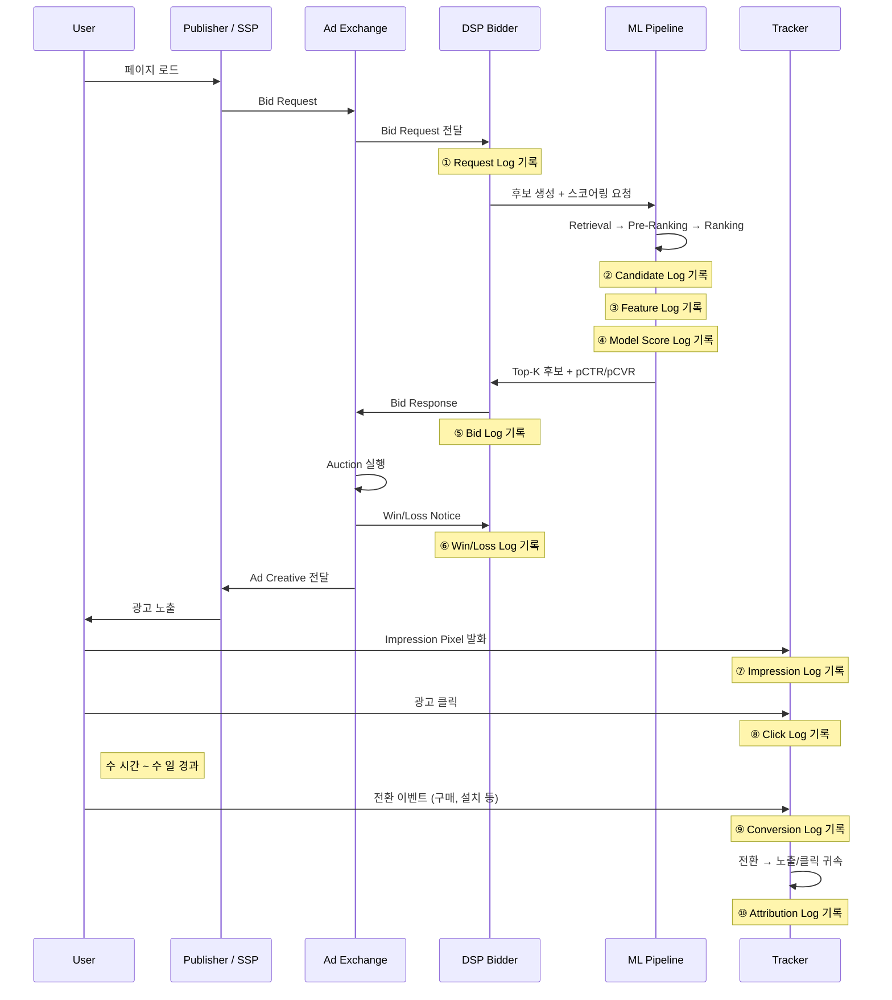
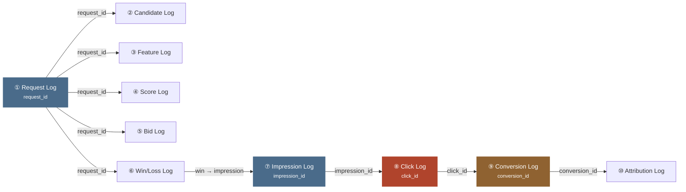

pCTR 모델을 학습시키려면 impression log를 열어야 합니다. 그런데 그 impression log는 **정확히 언제, 어디서, 어떤 필드로** 기록되었을까요? Request log, candidate log, click log는요? 광고 시스템에서 하나의 ad request가 발생하면, 그 요청이 시스템을 통과하면서 **최소 10종의 로그**를 남깁니다. 이 글은 그 10개의 로그를 시간순으로 추적하여, 각 로그가 언제 기록되고 어떻게 ML 학습 데이터로 합류하는지 해부합니다.

> [생태계 전체 지도](post.html?id=adtech-ecosystem-map)는 이걸 "피드백 루프" 한 줄로 요약합니다.
> [RTB Auction 흐름](post.html?id=ad-serving-flow)은 Bid Request부터 노출까지만 봅니다.
> [Feature Store](post.html?id=feature-store-serving)는 이걸 "이벤트 로그"로 뭉뚱그립니다.
> 이 글은 그 세 곳에서 모두 생략된 **로그 자체**를 파고듭니다.
>
> 형제 글과 역할도 갈립니다. [로그 시스템 설계](post.html?id=ad-log-system)는 로그를 잃지 않고 옮기는 인프라를 다룹니다.
> 이 글은 어떤 로그가 왜 남는지, 그 내용을 다룹니다.

---

## 1. 전체 로그 파이프라인 조감도

하나의 ad request는 시스템을 지나며 로그 10개를 남깁니다. 아래 그림이 그 시간순 흐름입니다.

로그가 열 개나 되는 이유는 단순합니다. 요청을 받고, 후보를 고르고, 값을 매기고, 입찰하고, 경매 결과를 듣고, 광고를 띄우고, 클릭을 받고, 며칠 뒤 전환을 받습니다. 단계마다 "그때 무슨 일이 있었나"를 남겨야 나중에 되짚을 수 있습니다. 한 단계라도 안 남기면 그 구간은 영원히 캄캄해집니다.

시간 폭이 넓다는 점도 함께 담아두세요. 앞의 다섯 개는 0~10ms 안에 다 끝납니다. 마지막 두 개는 며칠 뒤에야 도착합니다. 같은 요청 하나를 설명하는 로그인데, 도착 시각은 100만 배 이상 벌어집니다.


```mermaid
sequenceDiagram
  participant U as User
  participant PUB as Publisher / SSP
  participant AX as Ad Exchange
  participant BID as DSP Bidder
  participant ML as ML Pipeline
  participant TRK as Tracker

  U->>PUB: 페이지 로드
  PUB->>AX: Bid Request
  AX->>BID: Bid Request 전달

  Note over BID: ① Request Log 기록

  BID->>ML: 후보 생성 + 스코어링 요청
  ML->>ML: Retrieval → Pre-Ranking → Ranking

  Note over ML: ② Candidate Log 기록
  Note over ML: ③ Feature Log 기록
  Note over ML: ④ Model Score Log 기록

  ML->>BID: Top-K 후보 + pCTR/pCVR

  BID->>AX: Bid Response
  Note over BID: ⑤ Bid Log 기록

  AX->>AX: Auction 실행
  AX->>BID: Win/Loss Notice
  Note over BID: ⑥ Win/Loss Log 기록

  AX->>PUB: Ad Creative 전달
  PUB->>U: 광고 노출
  U->>TRK: Impression Pixel 발화
  Note over TRK: ⑦ Impression Log 기록

  U->>TRK: 광고 클릭
  Note over TRK: ⑧ Click Log 기록

  Note right of U: 수 시간 ~ 수 일 경과

  U->>TRK: 전환 이벤트 (구매, 설치 등)
  Note over TRK: ⑨ Conversion Log 기록
  TRK->>TRK: 전환 → 노출/클릭 귀속
  Note over TRK: ⑩ Attribution Log 기록
```

### 10개 로그 요약

| # | Log | 트리거 시점 | 기록 주체 | 요청 대비 지연 | 주요 소비자 |
|---|-----|-----------|----------|-------------|-----------|
| ① | **Request Log** | Bid Request 수신 즉시 | DSP Bidder | 0ms | QPS 모니터링, JOIN key |
| ② | **Candidate Log** | 후보 생성·필터 완료 | Ranking Pipeline | ~1-2ms | Retrieval recall 분석 |
| ③ | **Feature Log** | Feature Vector 조합 완료 | Feature Gateway | ~2-3ms | Training-Serving Skew 감지 |
| ④ | **Model Score Log** | 모델 추론 완료 | Model Server | ~5-8ms | Calibration 모니터링 |
| ⑤ | **Bid Log** | Bid Response 전송 | DSP Bidder | ~10ms | 입찰 전략 분석 |
| ⑥ | **Win/Loss Log** | 경매 결과 수신 | Ad Exchange → DSP | ~50-100ms | Bid Shading 학습 |
| ⑦ | **Impression Log** | 광고 렌더링 확인 | Client SDK / Pixel | ~200ms-1s | pCTR 학습 (샘플) |
| ⑧ | **Click Log** | 유저 클릭 | Click Tracker | 수 초~수 분 | pCTR 학습 (라벨) |
| ⑨ | **Conversion Log** | 전환 이벤트 발생 | Advertiser SDK → Postback | 수 시간~수 일 | pCVR 학습 (라벨) |
| ⑩ | **Attribution Log** | 전환 귀속 처리 완료 | Attribution Engine | 수 시간~수 일 | ROAS 정산 |

---

## 2. Core 6 Logs — 입찰부터 전환까지

광고 서빙 파이프라인의 핵심 6개 로그를 시간순으로 추적합니다.

<div class="chart-steps">
  <div style="font-size:0.85rem; font-weight:700; color:var(--text-primary); margin-bottom:12px;">Ad Serving Log Pipeline — 시간순으로 봅니다.</div>
  <div class="chart-step">
    <div class="chart-step-indicator">
      <div class="chart-step-dot green">1</div>
      <div class="chart-step-line"></div>
    </div>
    <div class="chart-step-content">
      <div class="chart-step-title">Request Log — Bid Request 수신 즉시 (0ms)</div>
      <div class="chart-step-desc">Bid Request를 받는 순간 기록됩니다. DSP Bidder가 Exchange로부터 요청을 받자마자 남깁니다. 모든 후속 로그의 JOIN key(request_id)가 여기서 생성됩니다.</div>
      <span class="chart-step-badge green">DSP Bidder, 0ms</span>
    </div>
  </div>
  <div class="chart-step">
    <div class="chart-step-indicator">
      <div class="chart-step-dot green">2</div>
      <div class="chart-step-line"></div>
    </div>
    <div class="chart-step-content">
      <div class="chart-step-title">Candidate Log — 후보 깔때기</div>
      <div class="chart-step-desc">Retrieval → Pre-Ranking 직후(~1-2ms). 상위 N개 후보가 확정된 시점입니다. 각 단계에서 몇 개가 탈락했는지 추적합니다.</div>
      <span class="chart-step-badge green">Ranking Pipeline, ~2ms</span>
    </div>
  </div>
  <div class="chart-step">
    <div class="chart-step-indicator">
      <div class="chart-step-dot blue">3</div>
      <div class="chart-step-line"></div>
    </div>
    <div class="chart-step-content">
      <div class="chart-step-title">Impression Log — 렌더링 확인</div>
      <div class="chart-step-desc">광고가 실제로 그려진 순간(~200ms-1s). 유저 화면에 뜬 것을 Impression Pixel 또는 Client SDK가 알립니다. pCTR 학습 데이터의 한 행이 여기서 탄생합니다.</div>
      <span class="chart-step-badge blue">Client SDK / Pixel, ~1s</span>
    </div>
  </div>
  <div class="chart-step">
    <div class="chart-step-indicator">
      <div class="chart-step-dot orange">4</div>
      <div class="chart-step-line"></div>
    </div>
    <div class="chart-step-content">
      <div class="chart-step-title">Click Log — 유저 클릭</div>
      <div class="chart-step-desc">유저가 광고를 누른 순간(수 초~수 분). Click Tracker가 redirect URL 또는 JS 이벤트로 잡습니다. pCTR 학습의 라벨(y=1)이 됩니다.</div>
      <span class="chart-step-badge orange">Click Tracker, 수 초</span>
    </div>
  </div>
  <div class="chart-step">
    <div class="chart-step-indicator">
      <div class="chart-step-dot pink">5</div>
      <div class="chart-step-line"></div>
    </div>
    <div class="chart-step-content">
      <div class="chart-step-title">Conversion Log — 전환 이벤트</div>
      <div class="chart-step-desc">구매·가입·설치가 일어난 순간(수 시간~수 일). 광고주 사이트에서 발생합니다. Advertiser SDK 또는 Server-to-Server Postback으로 DSP에 전달됩니다.</div>
      <span class="chart-step-badge pink">Advertiser → DSP, 수 시간~수 일</span>
    </div>
  </div>
  <div class="chart-step">
    <div class="chart-step-indicator">
      <div class="chart-step-dot blue">6</div>
    </div>
    <div class="chart-step-content">
      <div class="chart-step-title">Win/Loss Log — 경매 결과</div>
      <div class="chart-step-desc">낙찰·패찰을 Exchange가 알려줍니다. Bid Response 전송 후 ~50-100ms 안에 옵니다. 낙찰이면 clearing price가 실리고, 패찰이면 가격이 안 보입니다(Right-Censored).</div>
      <span class="chart-step-badge blue">Exchange → DSP, ~100ms</span>
    </div>
  </div>
</div>

이제 여섯 개를 하나씩 뜯어봅니다.

### 2.1 Request Log — 모든 것의 시작점

**언제 기록되는가**: DSP Bidder가 Ad Exchange로부터 Bid Request를 수신하는 **바로 그 순간**(0ms). 시스템이 이 요청을 처리할지 판단하기 전에, 먼저 로그부터 남깁니다.

**누가 기록하는가**: DSP Bidder (API Gateway 또는 Ad Server의 최전방 계층)

**핵심 필드**:

| 필드 | 설명 | 예시 |
|------|------|------|
| `request_id` | 이 요청의 고유 식별자 — **모든 후속 로그의 JOIN key** | `req-a1b2c3d4` |
| `timestamp` | 수신 시각 (ms 정밀도) | `2026-04-12T09:31:22.417Z` |
| `user_id` / `device_id` | 유저 식별자 (3rd-party cookie 또는 ADID/IDFA) | `did-xyz789` |
| `publisher_id` | 매체 식별자 | `pub-news-kr` |
| `slot_id` / `slot_size` | 광고 지면 정보 | `slot-top-banner`, `300x250` |
| `geo_country` / `geo_region` | 유저 위치 | `KR`, `Seoul` |
| `device_type` / `os` | 디바이스 정보 | `mobile`, `iOS 18` |
| `bid_floor` | Exchange가 설정한 최저 입찰가 | `$0.50` |
| `exchange_id` | 어떤 Exchange에서 온 요청인지 | `google-adx` |

**다운스트림 활용**:
- **QPS 모니터링**: 초당 request log 수 = 시스템 부하
- **전체 로그 체인의 JOIN key**: `request_id`가 이후 모든 로그를 관통
- **Budget Pacing 분모**: 전체 요청 수 대비 입찰 비율 계산
- **트래픽 분석**: Exchange별, 매체별, 시간대별 트래픽 분포

> Bid Request의 상세 구조는 [RTB Auction 전체 흐름](post.html?id=ad-serving-flow)을 참고하세요.

### 2.2 Candidate Log — 후보 깔때기의 기록

**언제 기록되는가**: [Multi-Stage Ranking Pipeline](post.html?id=model-serving-architecture)의 Retrieval → Pre-Ranking 단계가 완료되어 **상위 후보가 확정된 시점** (~1-2ms). 전체 광고 풀에서 수천 개를 꺼내고, 그 중 수백 개로 줄이는 과정이 끝나는 순간입니다.

**누가 기록하는가**: DSP Ranking Pipeline (Retrieval + Pre-Ranking 모듈)

**핵심 필드**:

| 필드 | 설명 | 예시 |
|------|------|------|
| `request_id` | Request Log와 JOIN | `req-a1b2c3d4` |
| `stage` | 파이프라인 단계 | `retrieval`, `pre_ranking`, `ranking` |
| `candidates_in` | 이 단계 진입 후보 수 | `3,200` |
| `candidates_out` | 이 단계 통과 후보 수 | `200` |
| `top_candidates[]` | 통과한 후보 목록 (ad_id, score) | `[{ad_id: "ad-001", score: 0.82}, ...]` |
| `filter_reasons` | 탈락 사유 집계 | `{budget_exhausted: 1200, target_mismatch: 800}` |
| `latency_ms` | 이 단계 처리 시간 | `0.8` |

**다운스트림 활용**:
- **Retrieval Recall 분석**: 최종 낙찰 광고가 Retrieval 단계에서 후보에 포함되었는가?
- **Funnel Dropout 분석**: 어떤 단계에서 몇 %가 탈락하는가? 필터 조건이 너무 공격적이지 않은가?
- **Pre-Ranking ↔ Ranking 일관성**: Pre-Ranking에서 상위권이었던 광고가 Ranking에서도 상위권인가?

> 이 로그는 대부분의 교과서에서 언급되지 않지만, **실무에서 모델 개선의 첫 단서는 여기에 있습니다.** "왜 이 좋은 광고가 노출되지 않았는가?"라는 질문의 답은 Candidate Log의 `filter_reasons`에서 시작합니다.

### 2.3 Impression Log — pCTR 학습 데이터의 탄생

**언제 기록되는가**: 유저 화면에 광고가 **실제로 렌더링된 시점**. 구체적으로는:
- **Pixel 방식**: 광고 Creative에 1x1 투명 이미지(tracking pixel)가 포함되어 있고, 브라우저가 이 이미지를 로드하는 순간 서버에 요청이 발생하여 기록
- **SDK 방식**: 모바일 앱 내 광고 SDK가 광고 렌더링 완료를 감지하고 이벤트를 전송
- **Viewability 기준**: IAB 표준 — 광고 영역의 50% 이상이 1초 이상 (영상은 2초) 화면에 노출

**누가 기록하는가**: Client-side SDK 또는 Pixel Tracker → DSP의 Impression Tracking Server

**핵심 필드**:

| 필드 | 설명 | 예시 |
|------|------|------|
| `impression_id` | 이 노출의 고유 식별자 — Click/Conversion Log의 JOIN key | `imp-e5f6g7h8` |
| `request_id` | Request Log와 JOIN | `req-a1b2c3d4` |
| `user_id` | 유저 식별자 | `did-xyz789` |
| `ad_id` / `campaign_id` | 노출된 광고와 캠페인 | `ad-001`, `camp-42` |
| `creative_id` | 어떤 소재가 노출되었는지 | `cr-banner-v3` |
| `position` | 광고 위치 (슬롯 내 순서) | `1` |
| `win_price` | 실제 지불 가격 (clearing price) | `$0.83` |
| `viewability` | 실제 조회 가능 여부 | `viewable`, `not_viewable` |
| `exchange_id` | 어떤 Exchange를 통해 낙찰되었는지 | `google-adx` |

**다운스트림 활용**:
- **pCTR 학습 데이터의 한 행**: 노출 1건 = 학습 샘플 1건. Click이 있으면 y=1, 없으면 y=0
- **CTR 계산의 분모**: CTR = Click 수 / Impression 수
- **Frequency Cap**: 이 유저에게 이 광고가 몇 번 노출되었는지 카운팅
- **CPM 과금**: impression 기반 과금 모델의 과금 트리거

> [Negative Sampling Bias 포스트](post.html?id=negative-sampling-bias)에서 다룬 문제가 여기서 시작됩니다. impression log의 **모든 행은 "이전 모델이 노출하기로 결정한 광고"에서만 생성**됩니다. 노출되지 않은 광고가 클릭되었을지는 영원히 알 수 없습니다. 이것이 Selection Bias의 근원입니다.

**중요한 구분**: Impression Log ≠ Request Log. Request가 100건이면 그 중 낙찰+실제노출된 건만 Impression Log에 남습니다 (Win Rate에 따라 10~30건). 나머지 70~90건의 요청은 패찰되어 Impression을 남기지 않습니다.

### 2.4 Click Log — pCTR 라벨의 원천

**언제 기록되는가**: 유저가 광고를 **클릭하는 순간**. 노출 후 수 초~수 분 이내에 발생합니다.

**기록 방식**:
- **Redirect 방식**: 유저 클릭 → DSP의 Click Tracking URL로 redirect → 로그 기록 → 광고주 랜딩 페이지로 최종 redirect
- **JS Event 방식**: 광고 내 JavaScript가 클릭 이벤트를 감지하여 비동기로 Click Tracker에 전송

**누가 기록하는가**: DSP Click Tracker (Redirect Server 또는 Client-side Event Collector)

**핵심 필드**:

| 필드 | 설명 | 예시 |
|------|------|------|
| `click_id` | 이 클릭의 고유 식별자 | `clk-i9j0k1l2` |
| `impression_id` | Impression Log와 JOIN | `imp-e5f6g7h8` |
| `request_id` | Request Log와 JOIN | `req-a1b2c3d4` |
| `user_id` | 유저 식별자 | `did-xyz789` |
| `ad_id` | 클릭된 광고 | `ad-001` |
| `timestamp` | 클릭 시각 | `2026-04-12T09:31:25.891Z` |
| `time_since_impression_ms` | 노출 후 클릭까지 경과 시간 | `3474` (약 3.5초) |
| `is_valid` | Fraud Detection 결과 | `true` |

**다운스트림 활용**:
- **pCTR 학습 라벨**: Impression Log와 JOIN했을 때, Click이 있으면 y=1 (positive sample)
- **CPC 과금 트리거**: 클릭 기반 과금 모델에서 과금 발생
- **Fraud Detection 입력**: 비정상적으로 빠른 클릭(< 100ms), 동일 IP 반복 클릭 등 탐지
- **pCVR 학습의 입력 조건**: pCVR 모델은 "클릭한 유저 중 전환한 비율"을 예측하므로, Click Log가 pCVR의 샘플 기준

### 2.5 Conversion Log — 가장 늦게 도착하는 가장 중요한 라벨

**언제 기록되는가**: 유저가 광고주 사이트에서 **전환 이벤트**(구매, 가입, 앱 설치 등)를 완료한 시점. 클릭 후 **수 시간~수 일** 지연됩니다.

**기록 방식**:
- **Client-side Pixel**: 광고주 사이트의 전환 완료 페이지에 심어진 tracking pixel이 발화
- **Server-to-Server Postback**: 광고주 서버가 전환 발생 시 DSP API를 직접 호출
- **MMP(Mobile Measurement Partner)**: 앱 설치 추적 시 AppsFlyer, Adjust 등이 중개

**누가 기록하는가**: 광고주 측 SDK/Pixel → DSP Conversion Tracker (Postback 수신)

**핵심 필드**:

| 필드 | 설명 | 예시 |
|------|------|------|
| `conversion_id` | 이 전환의 고유 식별자 | `conv-m3n4o5p6` |
| `click_id` | Click Log와 JOIN | `clk-i9j0k1l2` |
| `impression_id` | Impression Log와 JOIN (view-through attribution 시) | `imp-e5f6g7h8` |
| `user_id` | 유저 식별자 | `did-xyz789` |
| `conversion_type` | 전환 종류 | `purchase`, `signup`, `install` |
| `conversion_value` | 전환 금액 | `$49.99` |
| `timestamp` | 전환 발생 시각 | `2026-04-13T14:22:08.000Z` |
| `attribution_window` | 귀속 윈도우 | `7d_click`, `1d_view` |

**다운스트림 활용**:
- **pCVR 학습 라벨**: Click Log와 JOIN하여, 전환이 있으면 y=1
- **CPA 과금**: 전환 기반 과금 모델의 과금 트리거
- **ROAS 계산**: Return on Ad Spend = conversion_value 합 / 광고비 합
- **광고주 리포팅**: 캠페인별 전환 수, 전환 가치 집계

<a href="demo-attribution-window.html" class="btn-demo">윈도우·모델이 공로를 어떻게 바꾸는지 직접 눌러보기 →</a>

> [Online Learning & Delayed Feedback 포스트](post.html?id=online-learning-delayed-feedback)에도 같은 뼈대가 나옵니다. 전환 지연이 **Fake Negative를 만들어 pCVR을 과소추정**시킵니다. 클릭 후 3일 뒤에 전환이 발생했는데, 학습 데이터를 1일 뒤에 잘라버리면 이 전환은 "비전환(y=0)"으로 잘못 라벨링됩니다. Conversion Log의 도착 지연이 이 문제의 근원입니다.

### 2.6 Win/Loss Log — 경매의 결과

**언제 기록되는가**: Ad Exchange가 경매 결과를 DSP에 통보하는 시점. Bid Response 전송 후 **수십 ms** 이내.

**기록 방식**:
- **Win Notice (nurl)**: DSP가 낙찰되면 Exchange가 DSP의 Win Notice URL을 호출. 이때 clearing price(실제 지불 가격)가 포함
- **Loss Notice**: 일부 Exchange(OpenRTB 2.6+)는 패찰 시에도 통보. 단, 낙찰가는 미공개

**누가 기록하는가**: Ad Exchange → DSP Bidder (Win/Loss Notice 수신 모듈)

**핵심 필드**:

| 필드 | 설명 | 예시 |
|------|------|------|
| `request_id` | Request Log와 JOIN | `req-a1b2c3d4` |
| `result` | 경매 결과 | `win` / `loss` |
| `bid_price` | DSP가 제출한 입찰가 | `$1.20` |
| `win_price` | 실제 지불 가격 (win 시에만) | `$0.83` |
| `exchange_id` | 어떤 Exchange의 경매인지 | `google-adx` |
| `auction_type` | 경매 방식 | `first_price`, `second_price` |
| `loss_reason` | 패찰 사유 (지원 시) | `bid_below_floor`, `outbid` |

**다운스트림 활용**:
- **Bid Shading 모델 학습**: 시장 가격 분포를 추정하기 위한 핵심 데이터. Win 시의 clearing price가 학습 타겟
- **Win Rate 계산**: win 수 / (win + loss) 수 — 입찰 전략의 효율성 지표
- **Budget 차감**: 낙찰 시 win_price만큼 예산에서 차감
- **Exchange별 경쟁 분석**: Exchange마다 다른 가격 분포와 경쟁 강도 파악

> [Bid Shading 포스트](post.html?id=bid-shading-censored)에서 다뤘듯이, **패찰(loss) 시에는 경쟁자 가격이 관측되지 않습니다**(Right-Censored Data). "내가 `$1.20`에 입찰했는데 졌다"는 것은 낙찰가가 `$1.20` 이상이라는 것만 알려줄 뿐, 정확한 가격은 모릅니다. Win/Loss Log의 이 비대칭성이 Censored Regression이 필요한 이유입니다.

---

## 3. ML Pipeline Logs — 모델이 남기는 로그

Core 6 로그가 "유저 행동"을 기록한다면, ML Pipeline 로그는 **"모델 내부 상태"**를 기록합니다. 유저에게는 보이지 않지만, 모델의 품질 관리와 디버깅에 필수적인 로그들입니다:

<div class="chart-cards">
  <div class="chart-card">
    <div class="chart-card-header">
      <div class="chart-card-icon green">B</div>
      <div>
        <div class="chart-card-name">Bid Log</div>
        <div class="chart-card-subtitle">입찰 의사결정 기록</div>
      </div>
    </div>
    <div class="chart-card-body">
      <div class="chart-card-row">
        <span class="chart-card-row-label">트리거</span>
        <span class="chart-card-row-value">Bid Response 전송 시점 (~10ms)</span>
      </div>
      <div class="chart-card-row">
        <span class="chart-card-row-label">기록 주체</span>
        <span class="chart-card-row-value">DSP Bidder</span>
      </div>
      <div class="chart-card-row">
        <span class="chart-card-row-label">핵심 필드</span>
        <span class="chart-card-row-value">bid_price, true_value, shading_ratio, pacing_multiplier</span>
      </div>
      <div class="chart-card-row">
        <span class="chart-card-row-label">활용</span>
        <span class="chart-card-row-value">Auto-Bidding 성능, Shading 전략 평가, 입찰가 분포</span>
      </div>
    </div>
    <div class="chart-card-tags">
      <span class="chart-card-tag">입찰 전략</span>
      <span class="chart-card-tag">Budget Pacing</span>
    </div>
  </div>
  <div class="chart-card">
    <div class="chart-card-header">
      <div class="chart-card-icon blue">F</div>
      <div>
        <div class="chart-card-name">Feature Log</div>
        <div class="chart-card-subtitle">서빙 시점 피처 스냅샷</div>
      </div>
    </div>
    <div class="chart-card-body">
      <div class="chart-card-row">
        <span class="chart-card-row-label">트리거</span>
        <span class="chart-card-row-value">Feature Vector 조합 완료 시점 (~2-3ms)</span>
      </div>
      <div class="chart-card-row">
        <span class="chart-card-row-label">기록 주체</span>
        <span class="chart-card-row-value">Feature Gateway / Feature Store</span>
      </div>
      <div class="chart-card-row">
        <span class="chart-card-row-label">핵심 필드</span>
        <span class="chart-card-row-value">feature_vector, feature_names, feature_source, lookup_latency_ms</span>
      </div>
      <div class="chart-card-row">
        <span class="chart-card-row-label">활용</span>
        <span class="chart-card-row-value">Training-Serving Skew 감지, Feature Drift 모니터링</span>
      </div>
    </div>
    <div class="chart-card-tags">
      <span class="chart-card-tag">Feature Store</span>
      <span class="chart-card-tag">Skew 감지</span>
    </div>
  </div>
  <div class="chart-card">
    <div class="chart-card-header">
      <div class="chart-card-icon pink">M</div>
      <div>
        <div class="chart-card-name">Model Score Log</div>
        <div class="chart-card-subtitle">모델 추론 결과 기록</div>
      </div>
    </div>
    <div class="chart-card-body">
      <div class="chart-card-row">
        <span class="chart-card-row-label">트리거</span>
        <span class="chart-card-row-value">모델 추론 완료 시점 (~5-8ms)</span>
      </div>
      <div class="chart-card-row">
        <span class="chart-card-row-label">기록 주체</span>
        <span class="chart-card-row-value">Model Server</span>
      </div>
      <div class="chart-card-row">
        <span class="chart-card-row-label">핵심 필드</span>
        <span class="chart-card-row-value">model_version, pctr, pcvr, inference_latency_ms, fallback_used</span>
      </div>
      <div class="chart-card-row">
        <span class="chart-card-row-label">활용</span>
        <span class="chart-card-row-value">Calibration Gap 계산, A/B 실험 분석, Latency 추적</span>
      </div>
    </div>
    <div class="chart-card-tags">
      <span class="chart-card-tag">모델 모니터링</span>
      <span class="chart-card-tag">Calibration</span>
    </div>
  </div>
  <div class="chart-card">
    <div class="chart-card-header">
      <div class="chart-card-icon orange">A</div>
      <div>
        <div class="chart-card-name">Attribution Log</div>
        <div class="chart-card-subtitle">전환 귀속 결과</div>
      </div>
    </div>
    <div class="chart-card-body">
      <div class="chart-card-row">
        <span class="chart-card-row-label">트리거</span>
        <span class="chart-card-row-value">전환 &rarr; 노출/클릭 귀속 처리 완료 (수 시간~수 일)</span>
      </div>
      <div class="chart-card-row">
        <span class="chart-card-row-label">기록 주체</span>
        <span class="chart-card-row-value">Attribution Engine</span>
      </div>
      <div class="chart-card-row">
        <span class="chart-card-row-label">핵심 필드</span>
        <span class="chart-card-row-value">conversion_id, attributed_impression_id, attribution_model, credit</span>
      </div>
      <div class="chart-card-row">
        <span class="chart-card-row-label">활용</span>
        <span class="chart-card-row-value">Multi-Touch Attribution, ROAS 정산, 캠페인 리포팅</span>
      </div>
    </div>
    <div class="chart-card-tags">
      <span class="chart-card-tag">어트리뷰션</span>
      <span class="chart-card-tag">ROAS</span>
    </div>
  </div>
</div>

**Feature Log**는 [Feature Store 포스트](post.html?id=feature-store-serving)에서 다룬 Training-Serving Skew의 **감지 수단**입니다. 서빙 시점에 모델이 실제로 받은 피처 값을 기록하지 않으면, 학습 환경과 서빙 환경의 피처가 다른지 확인할 방법이 없습니다.

**Model Score Log**는 [Model Serving Architecture 포스트](post.html?id=model-serving-architecture)의 Timeout Fallback 계층에서 fallback이 발동되었는지를 추적하는 수단입니다. `fallback_used=true`가 급증하면 서빙 인프라에 문제가 있다는 신호입니다.

---

## 4. 로그 간 JOIN 관계: request_id가 잇는 체인

10개 로그는 독립적으로 존재하지 않습니다. **`request_id`를 중심으로 한 체인**으로 연결됩니다:


```mermaid
graph LR
  REQ["① Request Log<br/><small>request_id</small>"]
  CAND["② Candidate Log"]
  FEAT["③ Feature Log"]
  SCORE["④ Score Log"]
  BID["⑤ Bid Log"]
  WL["⑥ Win/Loss Log"]
  IMP["⑦ Impression Log<br/><small>impression_id</small>"]
  CLK["⑧ Click Log<br/><small>click_id</small>"]
  CONV["⑨ Conversion Log<br/><small>conversion_id</small>"]
  ATTR["⑩ Attribution Log"]

  REQ -->|request_id| CAND
  REQ -->|request_id| FEAT
  REQ -->|request_id| SCORE
  REQ -->|request_id| BID
  REQ -->|request_id| WL
  WL -->|"win → impression"| IMP
  IMP -->|impression_id| CLK
  CLK -->|click_id| CONV
  CONV -->|conversion_id| ATTR

  style REQ fill:#4a6b8a,stroke:#4a6b8a,color:#fff
  style IMP fill:#4a6b8a,stroke:#4a6b8a,color:#fff
  style CLK fill:#b0442c,stroke:#b0442c,color:#fff
  style CONV fill:#8f6231,stroke:#8f6231,color:#fff
```

핵심 JOIN key 체인: `request_id` → `impression_id` → `click_id` → `conversion_id`. 이 체인이 끊어지면 학습 데이터를 만들 수 없습니다.

### pCTR 학습 데이터 구성 예시

```python
# pCTR 학습 데이터 = Impression Log + Click Log + Feature Log JOIN
# 한 줄의 학습 데이터가 만들어지는 과정

import pyspark.sql.functions as F

# 1. Impression Log: 노출된 (user, ad) 쌍 = 샘플
impression = spark.read.parquet("s3://logs/impression/dt=2026-04-11")

# 2. Click Log: 클릭 여부 = 라벨 (y)
click = spark.read.parquet("s3://logs/click/dt=2026-04-11")

# 3. Feature Log: 서빙 시점의 피처 = X
feature = spark.read.parquet("s3://logs/feature/dt=2026-04-11")

# Impression LEFT JOIN Click → 라벨 생성
#   - Click이 있으면 y=1, 없으면 y=0
training_data = (
    impression
    .join(click, on="impression_id", how="left")
    .withColumn("label", F.when(F.col("click_id").isNotNull(), 1).otherwise(0))
    # Feature Log JOIN → 서빙 시점 피처 복원
    .join(feature, on=["request_id", "ad_id"], how="inner")
    .select(
        "request_id", "user_id", "ad_id",
        "feature_vector",   # X: 서빙 시점 그대로의 피처
        "label",            # y: 클릭 여부 (0 or 1)
        "position"          # Position Bias 보정용
    )
)
# 결과: 노출된 모든 (user, ad) 쌍에 대해
#   X = feature_vector (서빙 시점 그대로)
#   y = clicked (0 or 1)
```

> 이 JOIN 구조에는 함정이 하나 있습니다. impression log를 기준으로 negative sampling하면 Class Imbalance 문제가 생깁니다. CTR이 1%라면 y=0이 99%, y=1이 1%입니다. 이 불균형을 어떻게 다루는지는 [Negative Sampling Bias 포스트](post.html?id=negative-sampling-bias)에서 다룹니다.

---

## 5. 시간축으로 보는 로그 생성 타이밍

10개 로그의 생성 시점을 시간축 위에 배치하면, **실시간 로그와 지연 로그의 극적인 차이**가 드러납니다:

<div class="chart-timeline">
  <div style="font-size:0.85rem; font-weight:700; color:var(--text-primary); margin-bottom:12px;">로그 생성 타이밍 (요청 시점 기준)</div>
  <div class="chart-timeline-bar">
    <div class="chart-timeline-segment green" style="width:8%;" title="Request Log">&#9312; REQ</div>
    <div class="chart-timeline-segment green" style="width:8%;" title="Candidate Log">&#9313; CAND</div>
    <div class="chart-timeline-segment green" style="width:8%;" title="Feature Log">&#9314; FEAT</div>
    <div class="chart-timeline-segment green" style="width:8%;" title="Model Score Log">&#9315; SCORE</div>
    <div class="chart-timeline-segment green" style="width:8%;" title="Bid Log">&#9316; BID</div>
    <div class="chart-timeline-segment blue" style="width:10%;" title="Win/Loss Log">&#9317; W/L</div>
    <div class="chart-timeline-segment blue" style="width:12%;" title="Impression Log">&#9318; IMP</div>
    <div class="chart-timeline-segment orange" style="width:14%;" title="Click Log">&#9319; CLICK</div>
    <div class="chart-timeline-segment pink" style="width:12%;" title="Conversion Log">&#9320; CONV</div>
    <div class="chart-timeline-segment pink" style="width:12%;" title="Attribution Log">&#9321; ATTR</div>
  </div>
  <div class="chart-timeline-labels">
    <span>0ms</span>
    <span>~10ms</span>
    <span>~100ms</span>
    <span>~1s</span>
    <span>수 초</span>
    <span>수 시간~수 일</span>
  </div>
  <div class="chart-timeline-legend">
    <div class="chart-timeline-legend-item">
      <div class="chart-timeline-legend-dot" style="background:rgba(75,192,192,0.7);"></div>
      <span><strong>실시간 (0~10ms)</strong> &mdash; DSP 내부에서 자체 기록. Request, Candidate, Feature, Score, Bid</span>
    </div>
    <div class="chart-timeline-legend-item">
      <div class="chart-timeline-legend-dot" style="background:rgba(54,162,235,0.7);"></div>
      <span><strong>준실시간 (~100ms-1s)</strong> &mdash; 외부 통신 필요. Win/Loss (Exchange 통보), Impression (Pixel 발화)</span>
    </div>
    <div class="chart-timeline-legend-item">
      <div class="chart-timeline-legend-dot" style="background:rgba(255,159,64,0.7);"></div>
      <span><strong>지연 (수 초~수 분)</strong> &mdash; 유저 행동 의존. Click</span>
    </div>
    <div class="chart-timeline-legend-item">
      <div class="chart-timeline-legend-dot" style="background:rgba(255,99,132,0.7);"></div>
      <span><strong>고지연 (수 시간~수 일)</strong> &mdash; 외부 시스템 의존. Conversion, Attribution</span>
    </div>
  </div>
</div>

노출·클릭까지의 실시간 로그는 DSP 내부에서 동기적으로 기록할 수 있습니다. 하지만 전환·어트리뷰션 같은 지연 로그는 외부 이벤트에 의존하므로 **도착 시점이 불확실**합니다. 이 불확실성이 [Delayed Feedback](post.html?id=online-learning-delayed-feedback)의 근본 원인입니다.

---

## 6. 로그 볼륨과 저장 전략 [무대: 열린 RTB]

로그를 다 남기면 될 것 같지만, 실제로는 그럴 수 없습니다. 볼륨 차이가 극적이기 때문입니다.

숫자로 보면 이렇습니다. 요청 로그는 하루 수십억 행이고, 전환 로그는 수백만 행입니다. **1,000배 이상 차이 납니다.** 왜냐하면 각 단계마다 사람이 떨어져 나가기 때문입니다. 요청 100건 중 낙찰은 일부이고, 낙찰된 노출 100건 중 클릭은 약 1건이고, 클릭 100건 중 구매는 5~10건입니다.

그래서 저장 전략이 로그마다 갈립니다. **위쪽(요청·후보)은 양이 많고 값이 싸고, 아래쪽(클릭·전환)은 양이 적고 값이 비쌉니다.** 요청 로그는 전부 남기려면 비용이 감당이 안 돼서 샘플링합니다. 반대로 전환 로그는 한 행이 곧 매출이라 2년 이상 남깁니다.

Request Log에서 Conversion Log로 갈수록 깔때기처럼 줄어듭니다.

| Log | 일 볼륨 (대형 DSP 기준) | 저장소 | 보존 기간 | 비고 |
|-----|----------------------|--------|----------|------|
| Request Log | 수십억 행 | Kafka → S3 (Parquet) | 7일 (hot) + 90일 (cold) | 전체 저장 불가 시 샘플링 |
| Candidate Log | 수십억 행 | Kafka → S3 | 7일 (샘플링) | 전체 저장 비용 높음 |
| Feature Log | 수십억 행 | Kafka → S3 | 30일 | Feature Vector 크기 주의 |
| Model Score Log | 수십억 행 | Kafka → S3 | 30일 | 경량 (숫자 몇 개) |
| Bid Log | 수십억 행 | Kafka → S3 | 30일 | 입찰 건별 1행 |
| Win/Loss Log | 수십억 행 | Kafka → S3 + Hive | 90일 | Win + Loss 모두 저장 |
| Impression Log | 수억 행 | Kafka → S3 + Hive | 1년+ | 학습 데이터 핵심 |
| Click Log | 수천만 행 | Kafka → S3 + Hive | 1년+ | CTR ~1% |
| Conversion Log | 수백만 행 | Kafka → S3 + Hive | 2년+ | CVR ~5-10% of clicks |
| Attribution Log | 수백만 행 | Kafka → S3 + Hive | 2년+ | Conversion과 1:1 |

표에서 보존 기간을 눈여겨보세요. 7일부터 2년까지 벌어집니다. 이 차이는 "얼마나 오래 필요한가"로 정해집니다.

요청·후보 로그는 대개 **어제 무슨 일이 있었는지 디버깅할 때** 봅니다. 일주일이면 충분합니다. 반면 노출·클릭 로그는 **모델 학습 데이터의 본체**라서 1년 이상 남깁니다. 계절성을 배우려면 최소한 작년 같은 달이 있어야 하기 때문입니다.

전환 로그가 2년인 이유는 하나 더 있습니다. **정산 근거**입니다. 광고주와 금액을 다투게 되면 이 로그가 유일한 증거입니다. 모델이 필요 없어져도 회계는 남습니다.

여기서 실무의 함정이 하나 나옵니다. 요청 로그를 샘플링해 버리면, 나중에 "그때 왜 이 광고를 안 골랐지?"를 되짚을 수 없습니다. 학습에 쓸 후보군을 복원할 방법이 사라지는 것입니다. 그래서 샘플링을 하더라도 **요청 ID 기준으로 일관되게** 뽑아야 합니다. 무작위로 행을 버리면 같은 요청의 후보 일부만 남아 체인이 끊깁니다.

### 깔때기를 직접 곱해 보기

"1,000배 차이"가 어디서 나오는지 통과율을 순서대로 곱해 확인해 봅시다. 가상 데이터입니다.

```python
# 로그 볼륨이 왜 1,000배씩 벌어지나 — 깔때기를 직접 곱해 본다.
#
# 각 단계의 통과율(가상)을 순서대로 곱하면 하루 행 수가 나온다.
# 저장 단가는 Parquet 압축 후 대략치다. 실제 값은 회사·리전마다 다르다.

DAILY_REQUESTS = 5_000_000_000        # 하루 입찰 요청 50억 건 (대형 DSP 가정)

# (로그 이름, 이전 단계 대비 통과율, 행 1건당 크기(bytes), 보존일수)
STAGES = [
    ("Request",     1.0,      420,   7),   # 요청 그 자체 — 통과율 1.0
    ("Candidate",   1.0,      180,   7),   # 요청당 후보 여러 개지만 샘플링해 1:1로 남긴다고 가정
    ("Bid",         0.60,     260,  30),   # 40%는 입찰 자체를 포기(예산·타겟 미스)
    ("Win",         0.08,     150,  90),   # 낙찰률 8%
    ("Impression",  0.95,     200, 365),   # 낙찰 중 5%는 실제 노출 실패
    ("Click",       0.01,     160, 365),   # CTR 1%
    ("Conversion",  0.07,     240, 730),   # 클릭 중 7% 전환
]

rows = DAILY_REQUESTS
print(f"{'로그':<12}{'하루 행 수':>18}{'요청 대비':>12}{'일 용량':>12}{'보존':>7}{'총 저장량':>13}")
first_rows = None
results = []
for name, rate, size, keep in STAGES:
    rows = int(rows * rate)
    if first_rows is None:
        first_rows = rows
    daily_gb = rows * size / 1e9                  # 하루 몇 GB인가
    total_gb = daily_gb * keep                    # 보존 기간 전체로 몇 GB인가
    ratio = first_rows / rows                     # 요청 대비 몇 분의 1인가
    results.append((name, rows, total_gb))
    # GB가 1000을 넘으면 TB로 바꿔 읽기 쉽게 한다
    unit = f"{total_gb/1000:,.1f}TB" if total_gb >= 1000 else f"{total_gb:,.1f}GB"
    print(f"{name:<12}{rows:>18,}{'1/' + f'{ratio:,.0f}':>12}"
          f"{daily_gb:>10.1f}GB{keep:>6}일{unit:>12}")

req_rows = results[0][1]
conv_rows = results[-1][1]
print()
print(f"요청 대비 전환 로그   1 / {req_rows / conv_rows:,.0f}")
print(f"저장량 합계          {sum(t for _, _, t in results)/1000:,.1f}TB")

# 저장량이 가장 큰 로그와 가장 작은 로그
big = max(results, key=lambda r: r[2])
small = min(results, key=lambda r: r[2])
print(f"저장량 1위           {big[0]} {big[2]/1000:,.1f}TB (보존 30일뿐인데도 1위)")
print(f"저장량 최소          {small[0]} {small[2]:,.1f}GB (2년 남겨도 이 정도)")
print(f"둘의 차이            {big[2]/small[2]:,.0f}배")
print()
print("→ 위쪽은 '양이 많아 못 남기고', 아래쪽은 '적어서 오래 남긴다'.")
print("→ 그래서 보존 정책이 로그마다 다르다. 한 규칙으로 통일하면 둘 다 손해다.")

# 출력:
# 로그                      하루 행 수       요청 대비        일 용량     보존        총 저장량
# Request          5,000,000,000         1/1    2100.0GB     7일      14.7TB
# Candidate        5,000,000,000         1/1     900.0GB     7일       6.3TB
# Bid              3,000,000,000         1/2     780.0GB    30일      23.4TB
# Win                240,000,000        1/21      36.0GB    90일       3.2TB
# Impression         228,000,000        1/22      45.6GB   365일      16.6TB
# Click                2,280,000     1/2,193       0.4GB   365일     133.2GB
# Conversion             159,600    1/31,328       0.0GB   730일      28.0GB
#
# 요청 대비 전환 로그   1 / 31,328
# 저장량 합계          64.4TB
# 저장량 1위           Bid 23.4TB (보존 30일뿐인데도 1위)
# 저장량 최소          Conversion 28.0GB (2년 남겨도 이 정도)
# 둘의 차이            837배
#
# → 위쪽은 '양이 많아 못 남기고', 아래쪽은 '적어서 오래 남긴다'.
# → 그래서 보존 정책이 로그마다 다르다. 한 규칙으로 통일하면 둘 다 손해다.
```

결과에서 두 가지가 눈에 걸립니다.

첫째, **요청 대비 전환은 1/31,328입니다.** 3만 건이 넘는 요청이 있어야 전환 한 건이 나옵니다. 전환 로그 한 행이 왜 그렇게 귀한지가 여기서 나옵니다. 그리고 이게 pCVR 모델이 늘 데이터 부족에 시달리는 이유입니다.

둘째, **저장량 1위가 Bid 로그입니다.** 보존 기간이 30일뿐인데도 1위입니다. 노출 로그는 1년을 남기는데도 16.6TB고, Bid는 30일에 23.4TB입니다. 행 수가 압도적이기 때문입니다.

여기서 실무 감각이 하나 생깁니다. **비용을 줄이려면 보존 기간이 아니라 위쪽 로그의 샘플링을 먼저 봐야 합니다.** 전환 로그를 2년에서 1년으로 줄여도 14GB밖에 안 아껴집니다. Bid 로그를 10%만 샘플링하면 21TB가 빠집니다. 차이가 1,500배입니다.

:::deep 더 깊이 — 로그 스키마 실제 정의 (dataclass 5종)

앞의 표가 "무엇을 얼마나 남기나"였다면, 여기는 "각 행에 어떤 칼럼이 들어가나"입니다. 초심자는 넘어가도 됩니다. 다만 한 가지만 눈에 담아 두면 좋습니다 — `request_id`가 다섯 스키마에 전부 들어 있다는 것입니다. 이 칼럼 하나가 요청부터 전환까지를 잇는 유일한 끈입니다.

```python
from dataclasses import dataclass
from typing import Optional, List
from datetime import datetime

@dataclass
class RequestLog:
    """① Bid Request 수신 즉시 기록"""
    request_id: str               # 모든 후속 로그의 JOIN key
    timestamp: datetime
    user_id: Optional[str]        # 3rd-party cookie 또는 device_id
    device_type: str              # mobile, desktop, tablet
    os: str                       # iOS 18, Android 14
    geo_country: str
    geo_region: Optional[str]
    publisher_id: str
    slot_id: str
    slot_size: str                # "300x250", "728x90"
    bid_floor: float              # Exchange가 설정한 최저가
    exchange_id: str

@dataclass
class ImpressionLog:
    """⑦ 광고 렌더링 확인 시점에 기록"""
    impression_id: str            # Click/Conversion JOIN key
    request_id: str               # → RequestLog JOIN
    timestamp: datetime
    user_id: Optional[str]
    ad_id: str
    campaign_id: str
    creative_id: str
    position: int
    win_price: float              # 실제 지불 가격
    exchange_id: str
    viewability: str              # "viewable", "not_viewable", "unknown"

@dataclass
class ClickLog:
    """⑧ 유저 클릭 시점에 기록"""
    click_id: str
    impression_id: str            # → ImpressionLog JOIN
    request_id: str
    timestamp: datetime
    user_id: Optional[str]
    ad_id: str
    time_since_impression_ms: int # 노출 후 몇 ms 만에 클릭했는가
    is_valid: bool                # Fraud Detection 결과

@dataclass
class ConversionLog:
    """⑨ 전환 이벤트 발생 시점에 기록"""
    conversion_id: str
    click_id: Optional[str]       # → ClickLog JOIN (click-through)
    impression_id: Optional[str]  # → ImpressionLog JOIN (view-through)
    user_id: Optional[str]
    conversion_type: str          # purchase, signup, install
    conversion_value: float       # 전환 금액
    timestamp: datetime
    attribution_window: str       # 7d_click, 1d_view

@dataclass
class WinLossLog:
    """⑥ 경매 결과 수신 시점에 기록"""
    request_id: str               # → RequestLog JOIN
    result: str                   # "win" or "loss"
    bid_price: float              # DSP가 제출한 입찰가
    win_price: Optional[float]    # 실제 지불가 (win 시에만)
    exchange_id: str
    auction_type: str             # first_price, second_price
    loss_reason: Optional[str]    # outbid, bid_below_floor (loss 시)

@dataclass
class BidLog:
    """⑤ Bid Response 전송 시점에 기록"""
    request_id: str
    ad_id: str
    bid_price: float
    true_value: float             # pCTR × pCVR × ConvValue
    shading_ratio: float          # bid_price / true_value
    pctr: float
    pcvr: float
    budget_remaining: float
    pacing_multiplier: float      # Budget Pacing 계수
```

`BidLog`의 `true_value`와 `shading_ratio`를 같이 남기는 게 실무의 요령입니다. 나중에 "이 입찰가가 왜 이 값이었나"를 되짚어야 할 때가 옵니다. 내부 가치와 깎은 비율이 분리돼 있어야 모델 문제인지 입찰 전략 문제인지 가릅니다.
:::

---

## 7. 로그가 ML 모델을 만든다 — 학습 데이터 관점

모든 ML 모델의 학습 데이터는 **로그의 JOIN**으로 만들어집니다:

<div class="chart-layer">
  <div class="chart-layer-title">RAW LOGS (수집)</div>
  <div class="chart-layer-row">
    <div class="chart-layer-group">
      <div class="chart-layer-group-label">DSP 내부 로그</div>
      <div class="chart-layer-items">
        <span class="chart-layer-item green">Request</span>
        <span class="chart-layer-item green">Candidate</span>
        <span class="chart-layer-item green">Feature</span>
        <span class="chart-layer-item green">Score</span>
        <span class="chart-layer-item green">Bid</span>
      </div>
    </div>
    <div class="chart-layer-group">
      <div class="chart-layer-group-label">유저 행동 로그</div>
      <div class="chart-layer-items">
        <span class="chart-layer-item blue">Win/Loss</span>
        <span class="chart-layer-item blue">Impression</span>
        <span class="chart-layer-item orange">Click</span>
        <span class="chart-layer-item pink">Conversion</span>
        <span class="chart-layer-item pink">Attribution</span>
      </div>
    </div>
  </div>
  <div class="chart-layer-arrow">&#8595; JOIN &amp; Label Generation</div>
  <div class="chart-layer-title">학습 데이터셋 (ETL)</div>
  <div class="chart-layer-row">
    <div class="chart-layer-group">
      <div class="chart-layer-group-label">pCTR 학습 데이터</div>
      <div class="chart-layer-items">
        <span class="chart-layer-item blue">Impression</span>
        <span class="chart-layer-item cyan">LEFT JOIN Click</span>
        <span class="chart-layer-item green">+ Feature Log</span>
      </div>
    </div>
    <div class="chart-layer-group">
      <div class="chart-layer-group-label">pCVR 학습 데이터</div>
      <div class="chart-layer-items">
        <span class="chart-layer-item orange">Click</span>
        <span class="chart-layer-item cyan">LEFT JOIN Conversion</span>
        <span class="chart-layer-item green">+ Feature Log</span>
      </div>
    </div>
    <div class="chart-layer-group">
      <div class="chart-layer-group-label">Bid Shading 학습 데이터</div>
      <div class="chart-layer-items">
        <span class="chart-layer-item green">Bid Log</span>
        <span class="chart-layer-item cyan">JOIN Win/Loss</span>
      </div>
    </div>
  </div>
  <div class="chart-layer-arrow">&#8595; 모델 학습</div>
  <div class="chart-layer-title">MODEL TRAINING</div>
  <div class="chart-layer-row">
    <div class="chart-layer-group">
      <div class="chart-layer-group-label">pCTR Model</div>
      <div class="chart-layer-items">
        <span class="chart-layer-item pink">DeepFM(X=feature, y=click)</span>
      </div>
    </div>
    <div class="chart-layer-group">
      <div class="chart-layer-group-label">pCVR Model</div>
      <div class="chart-layer-items">
        <span class="chart-layer-item pink">ESMM(X=feature, y=conversion)</span>
      </div>
    </div>
    <div class="chart-layer-group">
      <div class="chart-layer-group-label">Bid Shading Model</div>
      <div class="chart-layer-items">
        <span class="chart-layer-item pink">Censored Regression(X=ctx, y=price)</span>
      </div>
    </div>
    <div class="chart-layer-group">
      <div class="chart-layer-group-label">Calibration</div>
      <div class="chart-layer-items">
        <span class="chart-layer-item pink">Platt Scaling(predicted vs actual)</span>
      </div>
    </div>
  </div>
  <div class="chart-layer-arrow">&#8595; 배포 &amp; 서빙 &rarr; 다시 로그 생성 (Feedback Loop)</div>
</div>

핵심 공식:
- **pCTR 학습 데이터** = Impression Log `LEFT JOIN` Click Log (on impression_id) + Feature Log (on request_id)
- **pCVR 학습 데이터** = Click Log `LEFT JOIN` Conversion Log (on click_id) + Feature Log
- **Bid Shading 학습 데이터** = Bid Log `JOIN` Win/Loss Log (on request_id)
- **[Calibration](post.html?id=calibration)** = Model Score Log의 predicted pCTR vs Impression+Click에서 계산한 actual CTR

로그의 품질이 곧 모델의 품질입니다. Impression이 중복 기록되면 CTR이 과소추정되고, Click fraud가 섞이면 pCTR이 과대추정됩니다. 로그 파이프라인의 신뢰성이 모델 성능의 **상한선**을 결정합니다.

---

## 8. 실무에서 겪는 로그 파이프라인 함정 [무대: 공통]

로그 파이프라인 사고에는 공통점이 하나 있습니다. **조용합니다.**

서버가 죽으면 알람이 울립니다. 그런데 로그가 두 번 찍히거나 몇 시간 늦게 도착하는 건 아무 알람도 울리지 않습니다. 파이프라인은 정상으로 보이고, 대시보드도 그럴듯한 숫자를 뱉습니다. 모델만 조용히 나빠집니다.

발견도 늦습니다. 보통 이런 순서로 옵니다. 먼저 며칠에서 몇 주가 지납니다. 그다음 "CTR이 왜 이렇게 낮지?"라는 질문이 나옵니다. 그리고 모델을 의심하며 며칠을 씁니다. 마지막에야 로그를 열어 봅니다.

아래 함정들이 그렇게 지나간 것들입니다. 하나씩 볼 때 **"이게 어느 방향으로 모델을 틀어 놓는가"** 를 같이 보세요. 중복은 분모를 부풀려 확률을 **낮추고**, 지연은 라벨을 음성으로 만들어 역시 **낮춥니다**. 방향을 알면 대시보드 숫자만 보고도 어느 함정인지 짚을 수 있습니다.

<div class="chart-cards">
  <div class="chart-card">
    <div class="chart-card-header">
      <div class="chart-card-icon orange">!</div>
      <div>
        <div class="chart-card-name">Impression 중복 기록</div>
        <div class="chart-card-subtitle">CTR 과소추정의 원인</div>
      </div>
    </div>
    <div class="chart-card-body">
      <div class="chart-card-row">
        <span class="chart-card-row-label">원인</span>
        <span class="chart-card-row-value">SDK retry, 네트워크 타임아웃, 페이지 새로고침</span>
      </div>
      <div class="chart-card-row">
        <span class="chart-card-row-label">영향</span>
        <span class="chart-card-row-value">같은 impression이 2-3번 기록 &rarr; CTR 분모 부풀림 &rarr; pCTR 과소추정</span>
      </div>
      <div class="chart-card-row">
        <span class="chart-card-row-label">대응</span>
        <span class="chart-card-row-value">impression_id 기반 deduplication, 시간 윈도우 내 중복 제거</span>
      </div>
    </div>
    <div class="chart-card-tags">
      <span class="chart-card-tag">데이터 품질</span>
      <span class="chart-card-tag">CTR</span>
    </div>
  </div>
  <div class="chart-card">
    <div class="chart-card-header">
      <div class="chart-card-icon pink">!</div>
      <div>
        <div class="chart-card-name">Attribution Window 오설정</div>
        <div class="chart-card-subtitle">Fake Negative 발생</div>
      </div>
    </div>
    <div class="chart-card-body">
      <div class="chart-card-row">
        <span class="chart-card-row-label">원인</span>
        <span class="chart-card-row-value">학습 데이터 생성 시점에 Attribution Window 밖 전환 누락</span>
      </div>
      <div class="chart-card-row">
        <span class="chart-card-row-label">영향</span>
        <span class="chart-card-row-value">실제 전환했지만 y=0으로 라벨링 &rarr; pCVR 과소추정</span>
      </div>
      <div class="chart-card-row">
        <span class="chart-card-row-label">대응</span>
        <span class="chart-card-row-value">FSIW(Feedback Shift Importance Weighting), 충분한 대기 후 라벨링</span>
      </div>
    </div>
    <div class="chart-card-tags">
      <span class="chart-card-tag">Delayed Feedback</span>
      <span class="chart-card-tag">pCVR</span>
    </div>
  </div>
  <div class="chart-card">
    <div class="chart-card-header">
      <div class="chart-card-icon blue">!</div>
      <div>
        <div class="chart-card-name">Feature Log 누락</div>
        <div class="chart-card-subtitle">Training-Serving Skew 미감지</div>
      </div>
    </div>
    <div class="chart-card-body">
      <div class="chart-card-row">
        <span class="chart-card-row-label">원인</span>
        <span class="chart-card-row-value">Feature Log 미구현 또는 로깅 장애</span>
      </div>
      <div class="chart-card-row">
        <span class="chart-card-row-label">영향</span>
        <span class="chart-card-row-value">학습과 서빙의 피처가 달라도 감지 불가 &rarr; 원인 불명의 성능 저하</span>
      </div>
      <div class="chart-card-row">
        <span class="chart-card-row-label">대응</span>
        <span class="chart-card-row-value">서빙 시점 feature vector 전수 로깅, 주기적 분포 비교</span>
      </div>
    </div>
    <div class="chart-card-tags">
      <span class="chart-card-tag">Feature Store</span>
      <span class="chart-card-tag">Skew</span>
    </div>
  </div>
  <div class="chart-card">
    <div class="chart-card-header">
      <div class="chart-card-icon orange">!</div>
      <div>
        <div class="chart-card-name">Win/Loss Log 비대칭</div>
        <div class="chart-card-subtitle">Censored Data 문제</div>
      </div>
    </div>
    <div class="chart-card-body">
      <div class="chart-card-row">
        <span class="chart-card-row-label">원인</span>
        <span class="chart-card-row-value">패찰 시 경쟁자 가격 미관측 (Right-Censored)</span>
      </div>
      <div class="chart-card-row">
        <span class="chart-card-row-label">영향</span>
        <span class="chart-card-row-value">Win 데이터만으로 시장 분포 추정 &rarr; 과도한 Bid Shading &rarr; Win Rate 하락</span>
      </div>
      <div class="chart-card-row">
        <span class="chart-card-row-label">대응</span>
        <span class="chart-card-row-value">Censored Regression, Survival Analysis</span>
      </div>
    </div>
    <div class="chart-card-tags">
      <span class="chart-card-tag">Bid Shading</span>
      <span class="chart-card-tag">Censored Data</span>
    </div>
  </div>
  <div class="chart-card">
    <div class="chart-card-header">
      <div class="chart-card-icon green">!</div>
      <div>
        <div class="chart-card-name">Request Log 샘플링</div>
        <div class="chart-card-subtitle">희소 이벤트 분석 불가</div>
      </div>
    </div>
    <div class="chart-card-body">
      <div class="chart-card-row">
        <span class="chart-card-row-label">원인</span>
        <span class="chart-card-row-value">수십억 행을 전부 저장하기 어려워 1-10% 샘플링</span>
      </div>
      <div class="chart-card-row">
        <span class="chart-card-row-label">영향</span>
        <span class="chart-card-row-value">새 광고, 희소 유저 세그먼트의 request가 샘플에서 누락 &rarr; Cold-Start 분석 불가</span>
      </div>
      <div class="chart-card-row">
        <span class="chart-card-row-label">대응</span>
        <span class="chart-card-row-value">Stratified Sampling (희소 세그먼트 오버샘플링), 집계 통계만 전수 저장</span>
      </div>
    </div>
    <div class="chart-card-tags">
      <span class="chart-card-tag">인프라</span>
      <span class="chart-card-tag">Cold-Start</span>
    </div>
  </div>
</div>

### 로그 품질 모니터링 예시

```python
# 로그 파이프라인 건전성 체크: 일일 배치
import pyspark.sql.functions as F

dt = "2026-04-11"
impression = spark.read.parquet(f"s3://logs/impression/dt={dt}")
click = spark.read.parquet(f"s3://logs/click/dt={dt}")
request = spark.read.parquet(f"s3://logs/request/dt={dt}")

# 1. Impression 중복률 체크
total_imp = impression.count()
unique_imp = impression.select("impression_id").distinct().count()
dup_rate = 1 - unique_imp / total_imp
print(f"Impression 중복률: {dup_rate:.4%}")  # 정상: < 0.1%

# 2. Orphan Click 비율 (Impression 없는 Click)
orphan_clicks = (
    click.join(impression, on="impression_id", how="left_anti")
    .count()
)
orphan_rate = orphan_clicks / click.count()
print(f"Orphan Click 비율: {orphan_rate:.4%}")  # 정상: < 0.5%

# 3. Request → Impression 전환율 (= Win Rate 근사)
req_count = request.count()
imp_count = unique_imp
win_rate_approx = imp_count / req_count
print(f"Request→Impression 전환율: {win_rate_approx:.2%}")  # 보통: 10-30%
```

---

## 마무리

1. **로그는 광고 ML의 원유입니다.** 모든 학습 데이터는 로그의 JOIN으로 만들어집니다. 로그 스키마를 모르면 학습 데이터를 이해할 수 없습니다.

2. **`request_id`가 모든 것을 잇습니다.** 10개 로그를 관통하는 단일 키. 이 키가 누락되면 JOIN이 불가능하고, 학습 데이터를 만들 수 없습니다.

3. **시간축을 항상 의식해야 합니다.** Request Log는 0ms, Conversion Log는 수 일 후. 이 시간 차이가 [Delayed Feedback](post.html?id=online-learning-delayed-feedback) 문제의 근원입니다.

4. **기록되지 않은 것은 존재하지 않습니다.** Candidate Log를 남기지 않으면 Retrieval 단계의 recall을 평가할 방법이 없습니다. Feature Log를 남기지 않으면 [Training-Serving Skew](post.html?id=feature-store-serving)를 감지할 수 없습니다.

5. **로그 품질 = 모델 품질.** Impression 중복, Click fraud, Conversion 누락은 모두 학습 라벨을 오염시킵니다. 로그 파이프라인의 신뢰성이 모델 성능의 상한선을 결정합니다.

> 이 글에서 다룬 로그 파이프라인은 광고 ML 시스템의 **데이터 기반(data foundation)**입니다. 그 위에 세 층이 얹힙니다.
>
> - [Feature Store](post.html?id=feature-store-serving) — 피처를 공급한다
> - [Model Serving Architecture](post.html?id=model-serving-architecture) — 추론을 실행한다
> - [Online Learning](post.html?id=online-learning-delayed-feedback) — 모델을 갱신한다
