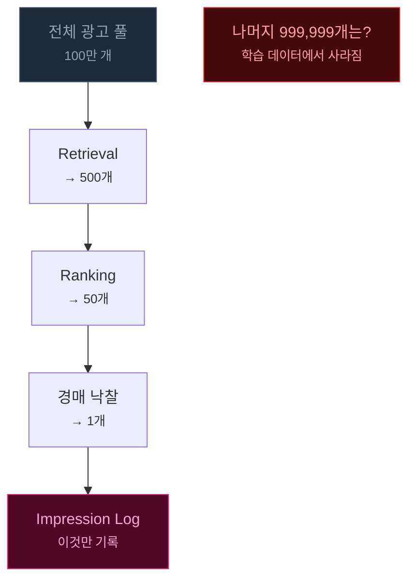
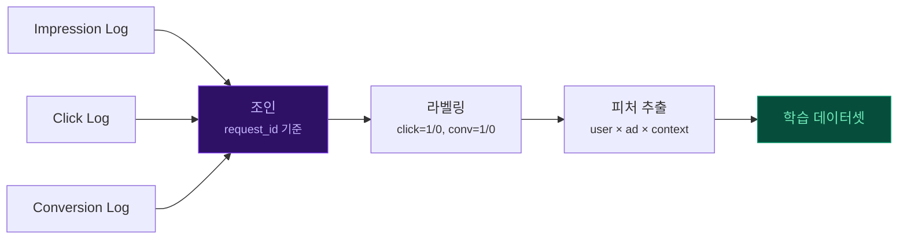
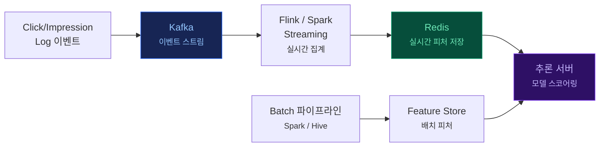
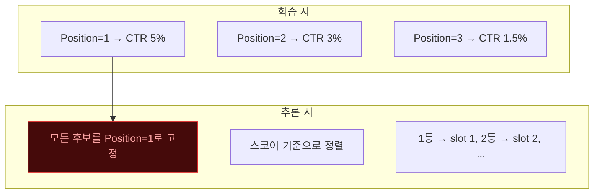

광고 시스템에서 "로그"는 단순한 디버깅 기록이 아닙니다. **ML 모델의 학습 데이터**이자 **실시간 피처의 원천**이며, 로그를 어떻게 설계하느냐가 모델 성능의 상한선을 결정합니다.

이 포스트에서는 광고 시스템의 로그 종류를 하나씩 해부하고, 특히 **Candidate Log**(랭킹 후보 전체 로그)의 역할과 유무에 따른 차이, **실시간 피처 파이프라인**, 그리고 멀티슬롯 환경에서의 **rank=1 추론 문제**까지 다룹니다.

---

| 로그 | 생성 시점 | 기록 대상 | 주요 용도 |
|------|----------|----------|----------|
| **Request Log** | 광고 요청 시 | 유저 컨텍스트, 지면 정보 | 트래픽 분석, 디버깅 |
| **Candidate Log** | 랭킹 시 | 후보 광고 전체 + 스코어 + 피처 | 모델 학습, 오프라인 평가 |
| **Impression Log** | 노출 시 | 낙찰 광고, 노출 위치, 비용 | 과금, CTR 라벨링 |
| **Click Log** | 클릭 시 | 클릭된 광고, 타임스탬프 | pCTR 학습 라벨 |
| **Conversion Log** | 전환 시 | 전환 종류, 금액, 지연 시간 | pCVR 학습 라벨, ROAS 측정 |

---

## 1. 광고 로그의 종류

광고 요청 하나가 처리되는 과정에서 **5종류의 로그**가 서로 다른 시점에 생성됩니다:


### Request Log

광고 요청이 들어온 순간 기록됩니다. 아직 어떤 광고를 보여줄지 결정되기 전의 **입력 컨텍스트**입니다.

- 유저 ID, 디바이스, OS, 브라우저
- 지면 ID, 앱/웹 구분, 페이지 카테고리
- 타임스탬프, 요청 IP, 지역

### Candidate Log

랭킹 단계에서 **스코어링된 모든 후보 광고**를 기록합니다. 노출된 광고뿐 아니라 **탈락한 광고까지 전부** 포함합니다. 이 로그가 이 포스트의 핵심 주제이며, 섹션 2에서 상세히 다룹니다.

### Impression Log

경매에서 낙찰되어 **실제로 유저에게 노출된 광고**의 기록입니다.

- 낙찰 광고 ID, 광고주 ID
- 노출 위치 (slot position)
- 낙찰가, 과금 금액
- Viewability 여부 (실제 화면에 보였는지)

### Click Log

유저가 광고를 **클릭한 이벤트**입니다. pCTR 모델의 **positive label**이 됩니다.

- 클릭된 광고 ID
- 클릭 타임스탬프
- 노출~클릭 시간 차이 (dwell time)

### Conversion Log

클릭 이후 **전환(구매, 가입, 설치 등)이 발생한 이벤트**입니다. pCVR 모델의 label이 됩니다.

- 전환 종류 (purchase, sign_up, install 등)
- 전환 금액
- 클릭~전환 시간 차이 (지연 시간)

> Conversion Log는 클릭 후 **수 시간~수 일** 뒤에 발생할 수 있어, Delayed Feedback 문제의 원인이 됩니다. 자세한 내용은 [Online Learning & Delayed Feedback](post.html?id=online-learning-delayed-feedback)에서 다룹니다.

---

## 2. Candidate Log 상세 해부

Candidate Log는 랭킹 단계에서 **스코어링된 모든 후보 광고의 스냅샷**입니다. Impression Log가 "승자"만 기록한다면, Candidate Log는 "경기에 참가한 모든 선수"를 기록합니다.

### 일반적인 구조

```python
# Candidate Log 1건 (= 광고 요청 1건)
{
  "request_id": "req_abc123",
  "timestamp": "2026-04-11T14:30:00Z",

  # 유저 컨텍스트
  "user_id": "u_789",
  "user_features": {
    "device": "mobile", "os": "iOS",
    "age_bucket": "30s", "gender": "M",
    "recent_click_categories": ["tech", "sports"]
  },

  # 지면 정보
  "slot_id": "slot_main_1",
  "page_category": "news",

  # 후보 광고 리스트 (수십~수백 개)
  "candidates": [
    {
      "ad_id": "ad_001",
      "advertiser_id": "adv_A",
      "ad_features": {"category": "tech", "creative_type": "image"},
      "pCTR": 0.045,
      "pCVR": 0.012,
      "eCPM": 540,
      "bid_price": 500,
      "rank": 1,
      "is_winner": true
    },
    {
      "ad_id": "ad_002",
      "advertiser_id": "adv_B",
      "ad_features": {"category": "fashion", "creative_type": "video"},
      "pCTR": 0.032,
      "pCVR": 0.008,
      "eCPM": 380,
      "bid_price": 450,
      "rank": 2,
      "is_winner": false
    },
    # ... 수십~수백 개 후보
  ]
}
```

### 데이터 볼륨

Candidate Log의 가장 큰 도전은 **볼륨**입니다:

| 지표 | Impression Log | Candidate Log |
|------|---------------|---------------|
| 요청당 레코드 수 | 1건 (낙찰 광고) | 수십~수백 건 (후보 전체) |
| 일일 데이터량 (QPS 10만 기준) | ~8.6B rows | ~860B+ rows |
| 스토리지 | 수 TB | 수십~수백 TB |

### 저장 전략

이 볼륨을 감당하기 위한 일반적인 전략:

- **샘플링**: 전체 요청의 1~10%만 Candidate Log 기록
- **Top-K만 저장**: 전체 후보가 아닌 상위 K개 + 랜덤 샘플만 기록
- **TTL(Time-to-Live)**: 7~30일 후 자동 삭제
- **압축**: Parquet/ORC 등 컬럼형 포맷으로 저장

---

## 3. Candidate Log가 있을 때 vs 없을 때

Candidate Log 도입 여부는 모델 학습 품질에 직접적인 영향을 미칩니다.

| 관점 | Candidate Log 없음 | Candidate Log 있음 |
|------|-------------------|-------------------|
| **Negative Sample** | 노출 후 미클릭만 사용 | 랭킹 탈락 광고도 negative로 활용 |
| **Sample Selection Bias** | 심함 — 이미 필터된 "좋은" 광고만 학습 | 완화 — 더 넓은 후보 분포를 학습 |
| **오프라인 평가** | 불가능 — 승자만 기록되어 있음 | 가능 — 전체 후보를 replay하여 새 모델 시뮬레이션 |
| **탈락 원인 분석** | 불가능 | 가능 — "왜 이 광고가 졌는지" 피처 레벨 분석 |
| **스토리지 비용** | 낮음 | 높음 (수십~수백 배) |
| **파이프라인 복잡도** | 단순 | 복잡 (조인, 샘플링 로직 필요) |

### Impression Log만 사용할 때의 함정



Impression Log만으로 학습하면, 모델은 **"이미 경쟁력 있는 광고들 사이의 미세한 차이"**만 학습합니다. 애초에 Retrieval에서 걸러진 광고, 랭킹에서 탈락한 광고의 패턴은 학습하지 못합니다. 이것이 [Negative Sampling & Sample Selection Bias](post.html?id=negative-sampling-bias)에서 다룬 구조적 편향의 원인입니다.

Candidate Log가 있으면 "탈락한 광고가 왜 탈락했는지"까지 학습할 수 있어, 모델의 **판별력(discrimination)**이 크게 향상됩니다.

---

## 4. 로그 기반 학습 데이터 파이프라인

로그는 그 자체로는 학습 데이터가 아닙니다. 여러 로그를 **조인하고 라벨링**하는 파이프라인을 거쳐야 합니다.



### pCTR 학습 데이터 생성

1. **Impression Log**에서 노출된 (user, ad, context) 쌍을 추출
2. **Click Log**와 request_id로 조인 → 클릭 발생 시 `label=1`, 미클릭 시 `label=0`
3. 피처 추출: 유저 피처 + 광고 피처 + 컨텍스트 피처

### pCVR 학습 데이터 생성

1. **Click Log**에서 클릭된 (user, ad) 쌍을 추출
2. **Conversion Log**와 조인 → 전환 발생 시 `label=1`
3. **문제**: 전환은 수 시간~수 일 뒤 발생 → 조인 시점에서 "아직 전환 안 한 건지" vs "안 할 건지" 구분 불가 (Delayed Feedback)

### Candidate Log 활용 시 차이

Candidate Log가 있으면 **negative sample의 풀이 크게 확장**됩니다:

| 방식 | Negative 출처 | 샘플 수 |
|------|-------------|---------|
| Impression만 | 노출 후 미클릭 | ~요청당 1건 |
| Candidate Log | 노출 미클릭 + 랭킹 탈락 | ~요청당 수십~수백 건 |

더 다양한 negative sample은 모델이 "왜 이 광고는 안 되는지"를 더 잘 학습하게 합니다.

---

## 5. 실시간 피처 파이프라인 (Redis / Feature Store)

로그는 학습 데이터뿐 아니라 **실시간 피처의 원천**이기도 합니다. 유저의 최근 행동, 광고의 실시간 성과 등은 로그 이벤트를 실시간으로 집계하여 추론 서버에 공급합니다.

### 아키텍처



### 실시간 피처 예시

| 피처 | 집계 방식 | 갱신 주기 | 저장소 |
|------|----------|----------|-------|
| 유저 최근 10분 클릭 수 | Sliding Window Count | ~초 단위 | Redis |
| 광고별 최근 1시간 CTR | Sliding Window Avg | ~분 단위 | Redis |
| 유저-카테고리 관심도 | 최근 N회 클릭의 카테고리 분포 | ~초 단위 | Redis |
| 광고별 오늘 예산 소진율 | 누적 비용 / 일 예산 | ~분 단위 | Redis |
| 유저 과거 30일 구매 이력 | Batch 집계 | 1일 1회 | Feature Store |
| 광고 임베딩 벡터 | 모델 학습 후 추출 | 모델 배포 시 | Feature Store |

### 세 갈래 피처의 결합

추론 시 **Batch + Streaming + Real-Time** 세 갈래 피처가 하나의 Feature Vector로 합쳐집니다:

```python
# 추론 시점의 피처 조합 (개념적)
feature_vector = {
    # Batch 피처 (Feature Store, 1일 1회 갱신)
    "user_30d_purchase_count": 5,
    "ad_embedding": [0.12, -0.34, ...],

    # Streaming 피처 (Redis, 분 단위 갱신)
    "ad_1h_ctr": 0.032,
    "ad_budget_spent_ratio": 0.45,

    # Real-Time 피처 (Redis, 초 단위 갱신)
    "user_10min_click_count": 3,
    "user_recent_categories": ["tech", "sports"],
}
```

> 피처 파이프라인의 전체 아키텍처는 [Feature Store & Real-Time Serving](post.html?id=feature-store-serving)에서 상세히 다룹니다.

---

## 6. 멀티슬롯 환경의 rank=1 추론 문제

광고 지면에 슬롯이 여러 개인 경우(예: 뉴스 피드에 광고 3개), **Position(위치)**이 CTR에 큰 영향을 미칩니다. 이때 학습과 추론 사이에 근본적인 괴리가 발생합니다.

### 문제 상황



**학습 시**: 모델은 실제 position을 피처로 사용합니다. Position=1에 노출된 광고는 CTR이 높고, Position=3은 낮습니다. 모델은 이 차이를 학습합니다.

**추론 시**: 아직 position이 정해지지 않았습니다. 누구를 1번에 놓을지 결정하려면 먼저 스코어링을 해야 하는데, 스코어링하려면 position이 필요합니다 — **닭과 달걀 문제**입니다.

### 왜 rank=1로 고정하는가

실무에서 가장 흔한 해법은 **모든 후보를 position=1로 고정**하여 스코어링하는 것입니다:

- 모든 후보가 "최고 위치에 놓였을 때의 예상 CTR"로 스코어링됨
- **상대적 순서는 보존**됨 — position=1에서 CTR이 높은 광고는 position=2에서도 높을 가능성이 큼
- 한 번의 추론으로 전체 후보를 정렬할 수 있어 **추론 비용이 최소**

### 문제점

| 문제 | 설명 |
|------|------|
| **Calibration 깨짐** | 모든 후보의 pCTR이 과대추정됨. 실제 position=3에 놓일 광고도 position=1 기준으로 예측 → eCPM 계산 왜곡 |
| **추론 비용 vs 정확도 트레이드오프** | 이상적으로는 slot 1 낙찰 후 나머지를 position=2로 재스코어링해야 하지만, 추론 비용이 슬롯 수만큼 증가 |
| **부익부빈익빈** | Position Bias 보정 없이 학습하면, "좋은 위치에 노출 → CTR 높음 → 다시 좋은 위치" 순환이 강화됨 |

### 실무 해법

#### 1. Position Feature 분리 (Examination Hypothesis)

모델 구조에서 **position의 영향을 분리**하여, 추론 시 position-free 스코어를 사용합니다:

$$P(\text{click}) = P(\text{examine} | \text{position}) \times P(\text{relevant} | \text{user, ad})$$

- $P(\text{examine} | \text{position})$: 위치에 따른 "볼 확률" — 추론 시 제외
- $P(\text{relevant} | \text{user, ad})$: 광고 자체의 관련성 — 추론 시 이것만 사용

이렇게 하면 학습 시에는 position 정보를 활용하되, 추론 시에는 position에 의존하지 않는 공정한 스코어를 얻을 수 있습니다.

#### 2. IPS (Inverse Propensity Scoring) 보정

position별 "examination probability"의 역수를 가중치로 사용하여 학습 데이터의 position bias를 보정합니다:

$$w_i = \frac{1}{P(\text{examine} | \text{position}_i)}$$

Position=1의 가중치는 낮게(어차피 잘 보이니까), Position=3의 가중치는 높게(잘 안 보이는데 클릭했으면 정말 좋은 광고) 설정합니다.

#### 3. 사후 보정 계수

rank=1로 추론한 스코어에 position별 보정 계수를 곱하여 실제 pCTR을 추정합니다:

```python
# 추론 후 보정
base_score = model.predict(features, position=1)  # rank=1 고정 추론

# position별 보정 계수 (사전에 통계적으로 추정)
position_factor = {1: 1.0, 2: 0.65, 3: 0.40}

# 실제 pCTR 추정
actual_pctr = base_score * position_factor[assigned_position]
```

> Position Bias의 이론과 보정 기법은 [Position Bias & Unbiased Learning to Rank](post.html?id=position-bias-ultr)에서, Calibration 문제는 [Calibration: AUC가 높아도 돈을 잃는 이유](post.html?id=calibration)에서 상세히 다룹니다.

---

## 7. 정리: 로그 설계가 모델 성능을 결정한다

광고 시스템의 로그는 단순한 "기록"이 아닙니다. **ML 파이프라인의 첫 번째 설계 결정**이며, 이후 모든 단계의 품질을 좌우합니다.

| 설계 결정 | 영향 |
|----------|------|
| **Candidate Log 도입 여부** | Negative Sample 품질 → 모델 판별력 |
| **실시간 피처 파이프라인** | 피처 신선도 → 모델 예측 정확도 |
| **Position 처리 방식** | Calibration 품질 → eCPM/입찰 정확도 |
| **Conversion Log 조인 타이밍** | Delayed Feedback 처리 → pCVR 정확도 |

[Ad Tech 개발 레이어 맵](post.html?id=adtech-dev-layers)에서 "측정 · 어트리뷰션 → 예측 모델"로 향하는 피드백 루프 — 그 실체가 바로 이 로그 파이프라인입니다.

> 로그를 잘 설계하는 것은 모델 아키텍처를 바꾸는 것만큼, 때로는 그 이상으로 모델 성능에 영향을 미칩니다.
