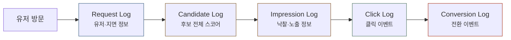
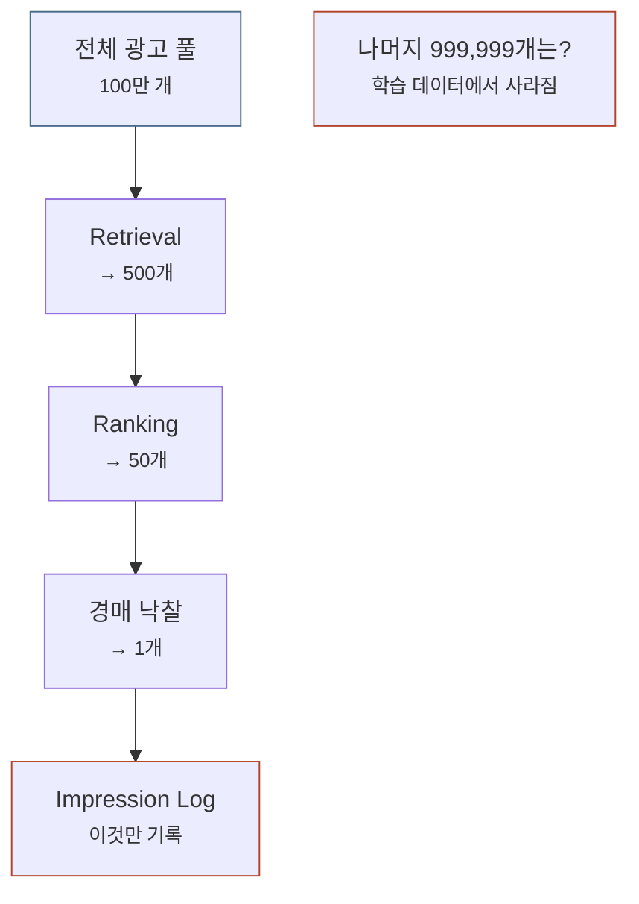
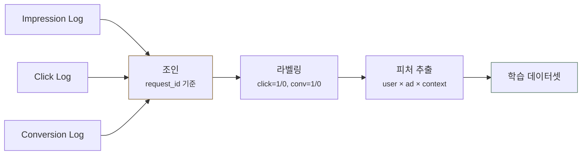
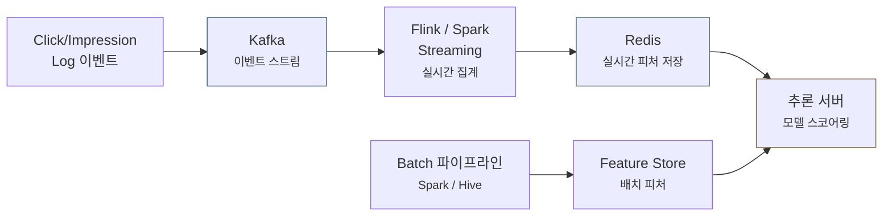
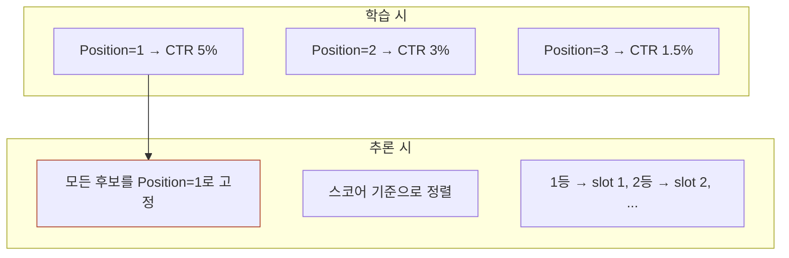

광고 시스템에서 "로그"는 단순한 디버깅 기록이 아닙니다. **ML 모델의 학습 데이터**이자 **실시간 피처의 원천**이며, 로그를 어떻게 설계하느냐가 모델 성능의 상한선을 결정합니다.

이 글이 맡은 것은 **로그 시스템을 어떻게 설계하고 운영하나**입니다. 수집 계층, 스키마 진화, 저장소 선택, 품질 감시 네 가지입니다.
형제 글 [광고 로그 파이프라인 완전 해부](post.html?id=ad-log-pipeline)는 **로그 10종이 각각 왜 남는지, 볼륨이 얼마나 되는지**를 맡습니다. 겹치는 대목은 그 글로 넘깁니다.

앞쪽에서는 **Candidate Log**의 역할, **실시간 피처 파이프라인**, 멀티슬롯 **rank=1 추론 문제**를 봅니다. 뒤쪽에서는 로그를 잃지 않고 옮기는 수집 계층과, 필드가 바뀌어도 어제 로그가 안 깨지는 스키마 규칙을 다룹니다.

---

| 로그 | 생성 시점 | 주요 용도 |
|------|----------|----------|
| **Request Log** | 광고 요청 시 | 트래픽 분석, No-Fill 추적 |
| **Candidate Log** | 랭킹 시 | 모델 학습, 오프라인 평가 |
| **Impression Log** | 노출 시 | 과금, CTR 라벨링 |
| **Click Log** | 클릭 시 | pCTR 학습 라벨 |
| **Conversion Log** | 전환 시 | pCVR 학습 라벨, ROAS 측정 |

---

## 1. 광고 로그의 종류

광고 요청 하나가 처리되는 과정에서 **5종류의 로그**가 서로 다른 시점에 생성됩니다:


```mermaid
graph LR
    A["유저 방문"] --> B["Request Log<br/><small>유저·지면 정보</small>"]
    B --> C["Candidate Log<br/><small>후보 전체 스코어</small>"]
    C --> D["Impression Log<br/><small>낙찰·노출 정보</small>"]
    D --> E["Click Log<br/><small>클릭 이벤트</small>"]
    E --> F["Conversion Log<br/><small>전환 이벤트</small>"]

    style B stroke:#4a6b8a
    style C stroke:#8a6a3a
    style D stroke:#8f6231
    style E stroke:#5b7d6a
    style F stroke:#b0442c
```

> 로그별 필드·기록 주체·도착 지연을 하나씩 보려면 [광고 로그 파이프라인](post.html?id=ad-log-pipeline)이 10종을 시간순으로 다룹니다. 여기서는 설계에 필요한 만큼만 요약합니다.

### Request Log

광고 요청이 들어온 순간 기록됩니다. 아직 어떤 광고를 보여줄지 결정되기 전의 **입력 컨텍스트**이자, 모든 다운스트림 로그의 **출발점**입니다.

#### 핵심 역할

Request Log는 단순한 "트래픽 분석, 디버깅" 이상의 역할을 합니다:

- **`request_id` 생성**: 이후 모든 로그를 잇는 **조인 키의 출발점**. 없으면 연결 고리가 끊어집니다.
- **No-Fill 분석의 유일한 소스**: 빈 응답을 준 요청은 Impression Log에 안 남습니다. `Fill Rate = Impressions / Requests`의 **분모**가 이 로그입니다.
- **필터링·모니터링 기준점**: 봇 탐지, 빈도 캡(frequency capping), 사전 타겟팅 필터의 결정과 QPS·응답 시간이 남습니다.
- **Context Feature의 원천**: 시간대·지역·디바이스 같은 Request-level 컨텍스트가 학습 때 **context feature**로 쓰입니다.

#### 일반적인 구조

```python
# (의사코드 — 구조만 보여 줍니다. 그대로 실행되지 않습니다.)
# Request Log 1건 (= 광고 요청 1건)
{
  "request_id": "req_abc123",           # 모든 다운스트림 로그의 조인 키
  "timestamp": "2026-04-11T14:30:00Z",

  # 유저 컨텍스트
  "user_id": "u_789",
  "device": "mobile", "os": "iOS 17.2", "browser": "Safari",
  "geo": {"country": "KR", "region": "Seoul", "city": "Gangnam"},

  # 지면 정보
  "slot_id": "slot_main_1",
  "publisher_id": "pub_news_001",
  "page_url": "https://news.example.com/tech/article-123",
  "page_category": "news/tech",
  "slot_size": "320x50", "slot_position": "above_fold",

  # 요청 메타
  "request_type": "display",            # display, video, native 등
  "frequency_cap_status": {              # 빈도 캡 상태
    "user_daily_impressions": 12,
    "user_hourly_impressions": 3
  },

  # 응답 결과
  "response_status": "filled",          # filled, no_fill, timeout, error
  "candidate_count": 47,                # 후보 광고 수
  "latency_ms": 23,                     # 응답 시간
  "filtering_reason": null               # no_fill인 경우 사유
}
```

#### No-Fill 분석

Request Log의 고유한 가치 중 하나는 **"왜 광고가 안 나왔는지"**를 추적할 수 있다는 점입니다:

| response_status | 의미 | 분석 포인트 |
|----------------|------|------------|
| `filled` | 정상 노출 | — |
| `no_fill` | 후보 광고 없음 | 타겟팅이 너무 좁은지, 예산 소진 광고주가 많은지 |
| `timeout` | 응답 시간 초과 | 서버 성능, 외부 DSP 응답 지연 |
| `error` | 처리 오류 | 버그, 인프라 장애 |
| `filtered` | 봇/정책 필터링 | IVT(Invalid Traffic) 비율 모니터링 |

> Fill Rate가 낮으면 **매출 기회 손실**입니다. 원인을 잡으려면 `response_status`와 `filtering_reason` 분석이 필수입니다.

#### 볼륨

Request Log는 **가장 볼륨이 큽니다**. 전수 기록하고, 나머지 로그는 전부 그 부분 집합입니다. 아래로 갈수록 깔때기처럼 줄어 전환 로그는 요청의 수만 분의 1까지 내려갑니다. 이 차이가 저장소와 보존 기간을 로그마다 다르게 만듭니다. 하루 행 수와 저장 용량 계산은 [형제 글의 깔때기 계산](post.html?id=ad-log-pipeline)에 있습니다.

### Candidate Log

랭킹 단계에서 **스코어링된 모든 후보**를 기록합니다. **탈락한 광고까지 전부** 들어갑니다. 다음 섹션에서 자세히 봅니다.

### Impression · Click · Conversion Log

경매 결과와 유저 행동이 차례로 남는 세 로그입니다. 뒤로 갈수록 건수가 줄고, 대신 한 건의 값이 비싸집니다.

| 로그 | 담기는 것 | ML에서의 쓰임 |
|------|---------|-------------|
| **Impression** | 낙찰 광고·광고주 ID, 노출 위치, 낙찰가·과금액, viewability | pCTR 학습의 분모 |
| **Click** | 클릭된 광고 ID, 클릭 시각, 노출~클릭 간격(dwell time) | pCTR의 positive label |
| **Conversion** | 전환 종류(purchase·sign_up·install), 금액, 클릭~전환 지연 | pCVR label, ROAS 측정 |

> Conversion Log는 클릭 후 **수 시간~수 일** 뒤에 옵니다. 이게 Delayed Feedback 문제의 원인입니다. 자세히는 [Online Learning 과 지연 피드백](post.html?id=online-learning-delayed-feedback)에서 다룹니다.

---

## 2. Candidate Log 상세 해부

Candidate Log는 랭킹 단계에서 **스코어링된 모든 후보 광고의 스냅샷**입니다. Impression Log가 "승자"만 기록한다면, Candidate Log는 "경기에 참가한 모든 선수"를 기록합니다.

### 일반적인 구조

```python
# (의사코드 — 구조만 보여 줍니다. 그대로 실행되지 않습니다.)
# Candidate Log 1건 (= 광고 요청 1건)
{
  "request_id": "req_abc123",
  "timestamp": "2026-04-11T14:30:00Z",

  # 유저 컨텍스트
  "user_id": "u_789",
  "user_features": {
    "device": "mobile", "os": "iOS", "age_bucket": "30s", "gender": "M",
    "recent_click_categories": ["tech", "sports"]
  },

  # 지면 정보
  "slot_id": "slot_main_1",
  "page_category": "news",

  # 후보 광고 리스트 (수십~수백 개)
  "candidates": [
    {
      "ad_id": "ad_001", "advertiser_id": "adv_A",
      "ad_features": {"category": "tech", "creative_type": "image"},
      "pCTR": 0.045, "pCVR": 0.012, "eCPM": 540,
      "bid_price": 500, "rank": 1, "is_winner": true
    },
    {
      "ad_id": "ad_002", "advertiser_id": "adv_B",
      "ad_features": {"category": "fashion", "creative_type": "video"},
      "pCTR": 0.032, "pCVR": 0.008, "eCPM": 380,
      "bid_price": 450, "rank": 2, "is_winner": false
    },
    # ... 수십~수백 개 후보
  ]
}
```

### 데이터 볼륨

Candidate Log의 가장 큰 도전은 **볼륨**입니다. Impression Log는 요청당 1건(낙찰 광고)이지만, Candidate Log는 요청당 수십~수백 건(후보 전체)입니다. 같은 트래픽에서 저장량이 수십~수백 배로 뜁니다.

### 저장 전략

이 볼륨을 감당하는 일반적인 전략:

- **샘플링**: 전체 요청의 1~10%만 기록
- **Top-K만 저장**: 상위 K개 + 랜덤 샘플만 기록
- **TTL(Time-to-Live)**: 7~30일 후 자동 삭제
- **압축**: Parquet/ORC 등 컬럼형 포맷

---

## 3. Candidate Log가 있을 때 vs 없을 때

Candidate Log 도입 여부는 모델 학습 품질에 곧바로 영향을 줍니다.

| 관점 | Candidate Log 없음 | Candidate Log 있음 |
|------|-------------------|-------------------|
| **Negative Sample** | 노출 후 미클릭만 | 랭킹 탈락 광고도 negative로 |
| **Sample Selection Bias** | 심함 — 필터된 "좋은" 광고만 학습 | 완화 — 넓은 후보 분포를 학습 |
| **오프라인 평가** | 불가능 — 승자만 남아서 | 가능 — 전체 후보 replay로 새 모델 시뮬레이션 |
| **탈락 원인 분석** | 불가능 | 가능 — 피처 레벨로 "왜 졌는지" |
| **스토리지 비용** | 낮음 | 높음 (수십~수백 배) |
| **파이프라인 복잡도** | 단순 | 복잡 (조인·샘플링 로직 필요) |

### Impression Log만 사용할 때의 함정


```mermaid
graph TD
    A["전체 광고 풀<br/><small>100만 개</small>"] --> B["Retrieval<br/><small>→ 500개</small>"]
    B --> C["Ranking<br/><small>→ 50개</small>"]
    C --> D["경매 낙찰<br/><small>→ 1개</small>"]
    D --> E["Impression Log<br/><small>이것만 기록</small>"]

    style A stroke:#4a6b8a
    style E stroke:#b0442c

    F["나머지 999,999개는?<br/><small>학습 데이터에서 사라짐</small>"]
    style F stroke:#b0442c
```

Impression Log만으로 학습하면 모델은 **"이미 경쟁력 있는 광고들 사이의 미세한 차이"**만 배웁니다. Retrieval에서 걸러진 광고, 랭킹에서 탈락한 광고의 패턴은 배우지 못합니다. 이것이 [Negative Sampling](post.html?id=negative-sampling-bias)에서 다룬 구조적 편향의 원인입니다.

Candidate Log가 있으면 "탈락한 광고가 왜 탈락했는지"까지 학습할 수 있습니다. 모델의 **판별력(discrimination)**이 크게 올라갑니다.

---

## 4. 로그 기반 학습 데이터 파이프라인

로그는 그 자체로는 학습 데이터가 아닙니다. 여러 로그를 **조인하고 라벨링**하는 파이프라인을 거쳐야 합니다.


```mermaid
graph LR
    A["Impression Log"] --> D["조인<br/><small>request_id 기준</small>"]
    B["Click Log"] --> D
    C["Conversion Log"] --> D
    D --> E["라벨링<br/><small>click=1/0, conv=1/0</small>"]
    E --> F["피처 추출<br/><small>user × ad × context</small>"]
    F --> G["학습 데이터셋"]

    style D stroke:#8a6a3a
    style G stroke:#5b7d6a
```

pCTR 학습 데이터는 Impression에 Click을 붙여 `label=1/0`을 만들고, pCVR은 Click에 Conversion을 붙여 만듭니다. Candidate Log가 있으면 negative sample이 요청당 1건에서 수십~수백 건으로 넓어집니다.

> 조인 체인과 시간축, pCTR 학습 데이터를 만드는 코드까지는 [광고 로그 파이프라인](post.html?id=ad-log-pipeline)이 자세히 다룹니다. 여기서는 시스템 설계 결정만 봅니다.

### 시스템 설계 결정은 "조인을 언제 돌리나"

로그 종류를 정하는 일보다 어려운 게 **조인 시각을 정하는 일**입니다. 전환은 클릭 후 수 시간~수 일 뒤에 도착합니다. 그래서 너무 일찍 조인하면 "아직 전환 안 한 건"과 "앞으로도 안 할 건"이 구분되지 않고 전부 `label=0`이 됩니다. 이게 Delayed Feedback 문제의 실무적 얼굴입니다.

해법은 두 갈래입니다. **기다리기**는 전환 창(예: 7일)이 닫힐 때까지 라벨링을 미룹니다. 정확하지만 모델이 일주일 늦은 세상을 배웁니다. **먼저 쓰고 고치기**는 일단 `label=0`으로 학습하고, 늦게 온 전환으로 라벨을 정정해 다시 학습합니다. 신선하지만 라벨을 두 번 만드는 파이프라인이 필요합니다.

어느 쪽이든 **라벨링 배치가 워터마크를 봐야** 합니다. "언제까지의 로그로 만든 데이터인지"를 데이터셋에 박아 두지 않으면 성능 변화를 되짚을 수 없습니다.

---

## 5. 실시간 피처 파이프라인 (Redis / Feature Store)

로그는 학습 데이터뿐 아니라 **실시간 피처의 원천**입니다. 유저의 최근 행동, 광고의 실시간 성과는 로그 이벤트를 집계해 추론 서버에 공급합니다.

갱신 주기가 갈리는 이유는 값이 변하는 속도가 다르기 때문입니다. 유저의 최근 10분 클릭 수는 초 단위로 바뀌지만, 과거 30일 구매 이력은 하루에 한 번만 움직입니다. 초 단위 피처를 배치로 만들면 모델이 방금 일어난 행동을 못 봅니다. 반대로 배치 피처를 요청마다 실시간으로 계산하면 같은 값을 매번 다시 세게 됩니다.

### 아키텍처


```mermaid
graph LR
    A["Click/Impression<br/>Log 이벤트"] --> B["Kafka<br/><small>이벤트 스트림</small>"]
    B --> C["Flink / Spark<br/>Streaming<br/><small>실시간 집계</small>"]
    C --> D["Redis<br/><small>실시간 피처 저장</small>"]
    D --> E["추론 서버<br/><small>모델 스코어링</small>"]

    F["Batch 파이프라인<br/><small>Spark / Hive</small>"] --> G["Feature Store<br/><small>배치 피처</small>"]
    G --> E

    style B stroke:#4a6b8a
    style D stroke:#5b7d6a
    style E stroke:#8a6a3a
```

### 실시간 피처 예시

| 피처 | 집계 방식 | 갱신 주기 | 저장소 |
|------|----------|----------|-------|
| 유저 최근 10분 클릭 수 | Sliding Window Count | 초 단위 | Redis |
| 광고별 최근 1시간 CTR | Sliding Window Avg | 분 단위 | Redis |
| 유저-카테고리 관심도 | 최근 N회 클릭의 분포 | 초 단위 | Redis |
| 광고별 오늘 예산 소진율 | 누적 비용 / 일 예산 | 분 단위 | Redis |
| 유저 과거 30일 구매 이력 | Batch 집계 | 1일 1회 | Feature Store |
| 광고 임베딩 벡터 | 모델 학습 후 추출 | 배포 시 | Feature Store |

### 세 갈래 피처의 결합

추론 시 **Batch + Streaming + Real-Time** 세 갈래 피처가 하나의 Feature Vector로 합쳐집니다:

```python
# (구조 예시 — 자리만 보여 줍니다. 그대로 실행해도 출력은 없습니다.)
feature_vector = {
    "user_30d_purchase_count": 5,        # Batch — Feature Store, 1일 1회
    "ad_embedding": [0.12, -0.34, ...],  # Batch — 모델 배포 때 갱신
    "ad_1h_ctr": 0.032,                  # Streaming — Redis, 분 단위
    "ad_budget_spent_ratio": 0.45,       # Streaming — Redis, 분 단위
    "user_10min_click_count": 3,         # Real-Time — Redis, 초 단위
}
```

> 피처 파이프라인의 전체 아키텍처는 [Feature Store](post.html?id=feature-store-serving)에서 상세히 다룹니다.

---

## 6. 멀티슬롯 환경의 rank=1 추론 문제

광고 지면에 슬롯이 여러 개인 경우(예: 뉴스 피드에 광고 3개), **Position(위치)**이 CTR에 큰 영향을 미칩니다. 이때 학습과 추론 사이에 근본적인 괴리가 발생합니다.

### 문제 상황


```mermaid
graph TD
    subgraph "학습 시"
        T1["Position=1 → CTR 5%"] 
        T2["Position=2 → CTR 3%"]
        T3["Position=3 → CTR 1.5%"]
    end

    subgraph "추론 시"
        I1["모든 후보를 Position=1로 고정"]
        I2["스코어 기준으로 정렬"]
        I3["1등 → slot 1, 2등 → slot 2, ..."]
    end

    T1 --> I1
    style I1 stroke:#b0442c
```

**학습 시**: 모델은 실제 position을 피처로 씁니다. 1번 자리 광고는 CTR이 높고 3번은 낮습니다. 모델은 이 차이를 배웁니다.

**추론 시**: 아직 position이 없습니다. 누구를 1번에 놓을지 정하려면 스코어링을 해야 하는데, 스코어링하려면 position이 필요합니다 — **닭과 달걀 문제**입니다.

### 왜 rank=1로 고정하는가

실무에서 가장 흔한 해법은 **모든 후보를 position=1로 고정**하여 스코어링하는 것입니다:

- 모든 후보가 "최고 위치에 놓였을 때의 예상 CTR"로 스코어링됨
- **상대적 순서는 보존**됨 — 1번에서 CTR 높은 광고는 2번에서도 높을 가능성이 큼
- 한 번의 추론으로 전체를 정렬할 수 있어 **추론 비용이 최소**

### 문제점

| 문제 | 설명 |
|------|------|
| **Calibration 깨짐** | pCTR이 전부 과대추정됨. position=3에 놓일 광고도 1 기준으로 예측 → eCPM 왜곡 |
| **비용 vs 정확도** | slot 1 낙찰 후 나머지를 position=2로 재스코어링해야 맞지만, 추론 비용이 슬롯 수만큼 증가 |
| **부익부빈익빈** | 보정 없이 학습하면 "좋은 위치 → CTR 높음 → 다시 좋은 위치" 순환이 강화됨 |

### 실무 해법

#### 1. Position Feature 분리 (Examination Hypothesis)

모델 구조에서 **position의 영향을 분리**하여, 추론 시 position-free 스코어를 사용합니다:

$$P(\text{click}) = P(\text{examine} | \text{position}) \times P(\text{relevant} | \text{user, ad})$$

- $P(\text{examine} | \text{position})$: 위치에 따른 "볼 확률" — 추론 시 제외
- $P(\text{relevant} | \text{user, ad})$: 광고 자체의 관련성 — 추론 시 이것만 사용

학습 때는 position 정보를 쓰고, 추론 때는 position에 기대지 않는 공정한 스코어를 씁니다.

:::deep 더 깊이 — IPS(Inverse Propensity Scoring)로 학습 데이터를 되돌리기
position별 "examination probability"의 역수를 가중치로 써서 학습 데이터의 position bias를 보정합니다.

$$w_i = \frac{1}{P(\text{examine} | \text{position}_i)}$$

Position=1의 가중치는 낮게 잡습니다. 어차피 눈에 잘 띄는 자리니까요.
Position=3의 가중치는 높게 잡습니다. 잘 안 보이는데도 클릭했다면 정말 좋은 광고입니다.
:::

#### 2. 사후 보정 계수

rank=1로 추론한 스코어에 position별 보정 계수를 곱해 실제 pCTR을 추정합니다. 계수는 사전에 통계로 뽑아 둡니다. 예를 들어 1번 자리 `1.0`, 2번 `0.65`, 3번 `0.40`을 쓰면, 3번에 놓일 광고의 pCTR은 rank=1 스코어의 40%로 내려 잡습니다.

> Position Bias의 이론과 보정 기법은 [Position Bias](post.html?id=position-bias-ultr)에서 다룹니다.
> Calibration 문제는 [Calibration: AUC가 높아도 돈을 잃는 이유](post.html?id=calibration)에서 다룹니다.

---

## 7. 수집 계층 — 로그를 잃지 않고 옮기기 [무대: 공통]

로그 설계의 절반은 "무엇을 남길까"가 아니라 **"남긴 걸 안 잃고 옮기기"**입니다. 광고 로그는 세 곳에서 출발하고, 출발지마다 잃는 방식이 다릅니다. 클라이언트 픽셀·SDK로 오는 노출·클릭은 앱 종료와 광고 차단기에 잘립니다. 자사 서버가 찍는 요청·후보·입찰은 서버가 죽거나 큐가 밀리면 사라집니다. 광고주 포스트백으로 오는 전환은 남의 서버 장애에 흔들립니다.

세 갈래 모두 답은 **재전송**입니다. 그리고 여기서 규칙이 하나 나옵니다. **재전송이 있는 곳에는 반드시 중복이 있습니다.** 클라이언트가 "혹시 안 갔을까 봐" 한 번 더 보내면 노출 1건이 로그 2건이 됩니다. CTR의 분모가 부풀고 pCTR은 실제보다 낮게 학습됩니다.

그래서 수집 계층은 **최소 1회 전송(at-least-once) + 멱등키**로 짭니다. 보내는 쪽은 갈 때까지 보내고, 받는 쪽은 같은 키가 또 오면 버립니다. 멱등키는 반드시 **보내는 쪽이** 만들어야 합니다. 받는 쪽에서 붙이면 재전송마다 새 키가 생겨 중복 제거가 불가능해집니다. 브라우저부터 광고주 서버까지 **"정확히 1회(exactly-once)"** 보장은 포기합니다. 남의 기기를 한 트랜잭션으로 묶을 수 없으니, 스트림 안쪽만 exactly-once로 잡고 바깥쪽은 멱등키로 흡수합니다.

저장소도 한 곳이 아닙니다. **스트림**(Kafka)은 방금 들어온 것을 며칠만 들고 있습니다. **원본 보관**(S3 + Parquet)은 손대지 않은 원본을 수개월~수년 둡니다. **질의용**(Hive·ClickHouse)에는 집계본만 얹습니다. 원본은 절대 덮어쓰지 않습니다. 라벨이 틀렸으면 원본에서 다시 만들면 되지만, 원본까지 고치면 되돌릴 곳이 없어집니다.

### 조용히 썩는 로그를 잡는 세 가지 눈

로그 사고는 알람을 울리지 않습니다. 서버는 살아 있고 대시보드도 그럴듯한 숫자를 뱉는데, 모델만 조용히 나빠집니다. 그래서 감시 지표를 따로 세웁니다.

- **신선도**: 가장 늦게 도착한 로그의 시각과 지금의 차이. 이 워터마크가 멈추면 파이프라인이 멈춘 것입니다.
- **완결성**: 어제 센 행 수와 오늘 다시 센 행 수. 늦게 오는 전환 탓에 며칠은 늘어나는 게 정상입니다.
- **중복률**: 같은 멱등키가 몇 번 왔는지. 0.1%를 넘으면 재전송 규칙부터 의심합니다.

---

## 8. 스키마는 팀 간 계약이다 [무대: 열린 RTB]

로그 스키마를 "우리 팀 자료구조"로 여기면 사고가 납니다. 스키마는 **찍는 쪽과 읽는 쪽의 계약**입니다. 어제 찍힌 로그는 이미 저장소에 있어서, 오늘 마음을 바꿔도 어제 것은 안 바뀝니다.

난이도는 무대에 따라 갈립니다. 담장 안은 노출·클릭·전환이 모두 자사 서버에 남습니다. 스키마를 한 팀이 통제하고 조인 키도 내가 만든 것이라 확실해서, 필드 변경은 사내 합의 한 번으로 끝납니다.

열린 RTB는 로그가 SSP·자사 서버·광고주 포스트백으로 흩어져 있습니다. 스키마 합의 자체가 회사 간 협상이 되고, 남이 보내주는 필드는 예고 없이 바뀝니다. 그래서 **내가 만드는 필드와 남이 주는 필드를 갈라 두고**, 남이 주는 쪽은 전부 nullable로 잡습니다.

### 필드를 하나 고치면 어제 로그는 어떻게 되나

```python
# 스키마를 고치면 '어제 로그'가 어디서 터지나 — 직접 읽어 본다.
# 어제 찍힌 v1 로그는 저장소에 그대로 있다. 고칠 수도, 지울 수도 없다.
# 오늘 (A) creative_type 추가, (B) slot_id -> placement_id 이름 변경,
# (C) pctr 을 문자열에서 실수로 바꿨다. 새 코드로 어제 것을 읽는다.

OLD = {"request_id": "req-1", "slot_id": "slot_A", "pctr": "0.045"}   # 어제 것
NEW = {"request_id": "req-9", "placement_id": "slot_A",               # 오늘 것
       "pctr": 0.048, "creative_type": "video"}

CHANGES = [
    ("(A) 추가   creative_type 를 읽는다", lambda r: r["creative_type"]),
    ("(B) 이름   placement_id 를 읽는다 ", lambda r: r["placement_id"]),
    ("(C) 타입   pctr * 1000 을 계산한다", lambda r: r["pctr"] * 1000),
]
for label, read_one in CHANGES:
    try:
        got = read_one(OLD)
        # 안 터지는 게 더 무섭다. 문자열 * 1000 은 파이썬에서 '반복'이다
        print(f"{label} -> 안 터진다. 타입 {type(got).__name__}, 길이 {len(str(got))}")
    except KeyError as err:
        print(f"{label} -> KeyError: {err}")


def read_safe(row):
    slot = row.get("placement_id") or row.get("slot_id")     # 옛 이름을 한 버전 더 본다
    ctype = row.get("creative_type", "unknown")              # 추가 필드는 기본값으로
    return slot, ctype, round(float(row["pctr"]) * 1000, 1)  # 타입은 읽는 쪽에서 통일


print()
for row in (OLD, NEW):
    print("규칙 지킨 리더", row["request_id"], read_safe(row))
print()
print("→ 추가는 안전하다. 단 nullable + 기본값을 스키마에 같이 박아야 한다.")
print("→ 이름 변경은 삭제 + 추가다. 옛 이름을 한 버전 더 살려 둬야 한다.")
print("→ 타입 변경은 조용히 썩는다. 새 필드를 만들고 옛 필드는 그대로 둔다.")

# 출력:
# (A) 추가   creative_type 를 읽는다 -> KeyError: 'creative_type'
# (B) 이름   placement_id 를 읽는다  -> KeyError: 'placement_id'
# (C) 타입   pctr * 1000 을 계산한다 -> 안 터진다. 타입 str, 길이 5000
#
# 규칙 지킨 리더 req-1 ('slot_A', 'unknown', 45.0)
# 규칙 지킨 리더 req-9 ('slot_A', 'video', 48.0)
#
# → 추가는 안전하다. 단 nullable + 기본값을 스키마에 같이 박아야 한다.
# → 이름 변경은 삭제 + 추가다. 옛 이름을 한 버전 더 살려 둬야 한다.
# → 타입 변경은 조용히 썩는다. 새 필드를 만들고 옛 필드는 그대로 둔다.
```

(C)를 눈여겨보세요. 필드를 지우거나 이름을 바꾸면 코드가 **큰 소리로** 터집니다. 타입만 바꾸면 예외가 안 납니다. 문자열 `"0.045"`에 1000을 곱하면 파이썬은 그 문자열을 1000번 이어 붙입니다. 5000자짜리 값이 피처로 흘러들고, 모델은 며칠 뒤에야 조용히 나빠집니다.

### 규칙으로 정리하면

| 바꾸는 일 | 해도 되나 | 규칙 |
|----------|---------|------|
| **필드 추가** | 된다 | nullable로 넣고 기본값을 스키마에 함께 등록 |
| **삭제·이름 변경** | 조심 | 즉시 지우지 말고 deprecated로 한 버전 더 유지 |
| **타입 변경** | 안 된다 | 새 필드를 만들고 옛 필드는 그대로 둔다 |

이 규칙을 사람 기억에 맡기지 않는 장치가 **스키마 레지스트리**입니다. 스키마를 코드가 아니라 별도 저장소에 버전으로 등록하고, 규칙을 어기는 변경은 배포 때 막습니다. Avro·Protobuf를 쓰는 이유의 절반이 이것입니다.

---

## 9. 다른 회사들은 어떻게 로그를 수집하는가

주요 플랫폼의 수집 방식을 보면 공통 패턴과 각 사의 고유한 결정이 같이 보입니다.

### Meta (Facebook Ads)

- **Scribe → Hive/Spark**: 광고 이벤트를 내부 수집기 **Scribe**로 모아 데이터 레이크에 적재
- **Opportunity Log**: Candidate Log와 비슷. 노출 기회마다 **후보군 전체의 스코어를 기록**
- **실시간 피처**: 자체 Feature Store(**Sagitta**)에서 최근 N분 인게이지먼트를 실시간 집계
- **이중 전환 수집**: Conversion을 **서버사이드(CAPI)** + **클라이언트 픽셀** 양쪽에서 받아 누락 방지

### Google (DV360 / Google Ads)

- **Mesa + Dremel**: near-realtime 웨어하우스 **Mesa**에 적재, **Dremel(BigQuery)**로 PB 스케일 분석
- **로그가 더 세분화됨**: `AdRequest → BidRequest → BidResponse → Impression → Click → Conversion` — 입찰 과정 자체를 별도 로그로 분리
- **ColumnIO 포맷**: 자체 컬럼형 포맷으로 압축률·쿼리 성능 최적화
- **Data Transfer**: 광고주에게도 impression-level 로그 제공

### Twitter(X) Ads

- **Manhattan(KV store) + Kafka + HDFS** 파이프라인
- Request Log에 해당하는 **Ad Serving Log**에 타임라인 위치, 트윗 컨텍스트, **팔로우 그래프 피처**를 함께 담음
- **Earlybird(검색 인덱스)** 단계의 리트리벌 로그도 따로 수집해 후보 생성 과정까지 추적

### LinkedIn

- **Unified Logging Framework**: 광고 이벤트를 **Kafka → Brooklin → HDFS**로 통합 수집
- Request 단계에서 **member features snapshot**을 따로 저장 — 프로필이 바뀌어도 학습 데이터가 안 흔들림
- B2B 특성상 **company-level aggregated features**(회사 규모, 업종, 직급 분포)가 Request Log에 포함

### Criteo (리타게팅 DSP)

- 공개 논문·데이터셋으로 로그 구조를 가장 상세히 밝힌 회사
- **Display Log**: Request + Candidate + Impression을 한 로그에 통합. **과거 상품 조회 시퀀스**가 Request 피처로
- **Criteo 1TB Dataset**: 24일간 click log(익명화 피처 40개 + label)를 공개해 업계 벤치마크가 됨

### 업계 공통 패턴

| 패턴 | 설명 | 사용 회사 |
|------|------|----------|
| **Event Sourcing** | 이벤트를 Kafka에 먼저 적재하고 여러 consumer가 소비 | 거의 모든 회사 |
| **Lambda Architecture** | 실시간 + 배치 이중 파이프라인으로 신선도와 안정성을 동시에 | Meta, Google, LinkedIn |
| **Feature Snapshot** | 추론 시점 피처 값을 로그에 남겨 학습 데이터를 일관되게 | Meta, LinkedIn, Criteo |
| **Candidate 분리 저장** | 후보군 전체 로그는 **샘플링해 별도 저장** | Meta, Google |
| **서버 + 클라이언트 이중 수집** | Impression/Click을 양쪽에서 받아 누락 방지 | Google, Meta |

> 회사마다 로그 이름이나 구조는 다릅니다.
> 그래도 세 가지 원칙은 사실상 업계 표준입니다. **이벤트 스트림으로 수집 → request_id로 조인 → 피처 스냅샷 보존**입니다.

---

## 10. 정리: 로그 설계가 모델 성능을 결정한다

광고 시스템의 로그는 단순한 "기록"이 아닙니다. **ML 파이프라인의 첫 번째 설계 결정**이며, 이후 모든 단계의 품질을 좌우합니다.

| 설계 결정 | 영향 |
|----------|------|
| **Candidate Log 도입 여부** | Negative Sample 품질 → 모델 판별력 |
| **실시간 피처 파이프라인** | 피처 신선도 → 모델 예측 정확도 |
| **Position 처리 방식** | Calibration 품질 → eCPM/입찰 정확도 |
| **Conversion Log 조인 타이밍** | Delayed Feedback 처리 → pCVR 정확도 |
| **멱등키·스키마 규칙** | 중복·타입 사고 차단 → 라벨 신뢰도 |

표의 다섯 줄은 모두 **모델을 건드리지 않고 내리는 결정**입니다. 그런데 결과는 전부 모델 성능으로 나타납니다. 그래서 로그 설계는 데이터 엔지니어링이 아니라 ML 엔지니어링의 첫 장에 놓입니다. 새 모델 구조를 얹기 전에 지금 쓰는 로그부터 보는 편이 훨씬 자주 이깁니다. 중복 없이 도착하는지, 스키마가 조용히 바뀌지 않았는지를요.

[Ad Tech 개발 레이어](post.html?id=adtech-dev-layers)에서 "측정 · 어트리뷰션 → 예측 모델"로 향하는 피드백 루프 — 그 실체가 바로 이 로그 파이프라인입니다.

> 로그를 잘 설계하는 것은 모델 아키텍처를 바꾸는 것만큼, 때로는 그 이상으로 모델 성능에 영향을 미칩니다.

---

## 더 깊이 보기

- 어떤 로그가 왜 남는지, 볼륨은 얼마인지 → [광고 로그 파이프라인](post.html?id=ad-log-pipeline)
- 로그로 만든 피처를 서빙에 꽂기까지 → [Feature Store와 실시간 서빙](post.html?id=feature-store-serving)
- 추론을 어느 층에서 실행하나 → [Multi-Stage 모델 서빙](post.html?id=model-serving-architecture)
- 광고 ML 전체 지도에서 이 글의 위치 → [ML 엔지니어 트랙](ml-track.html)
