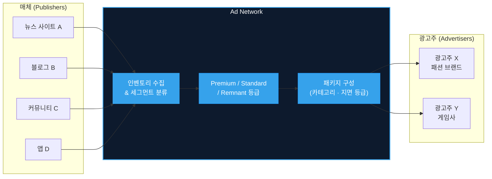
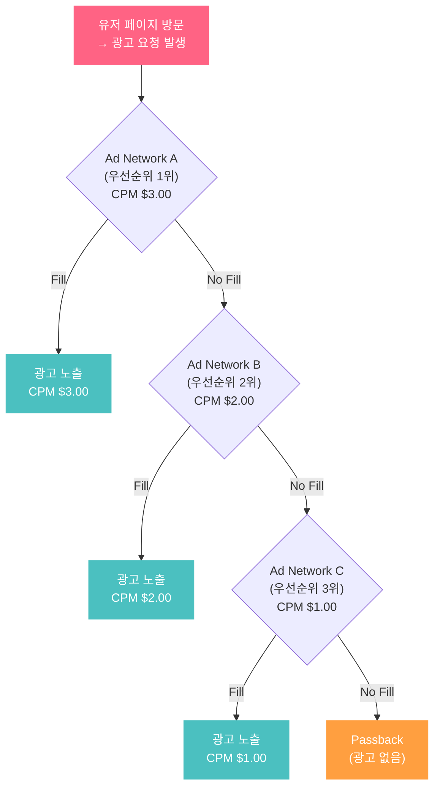
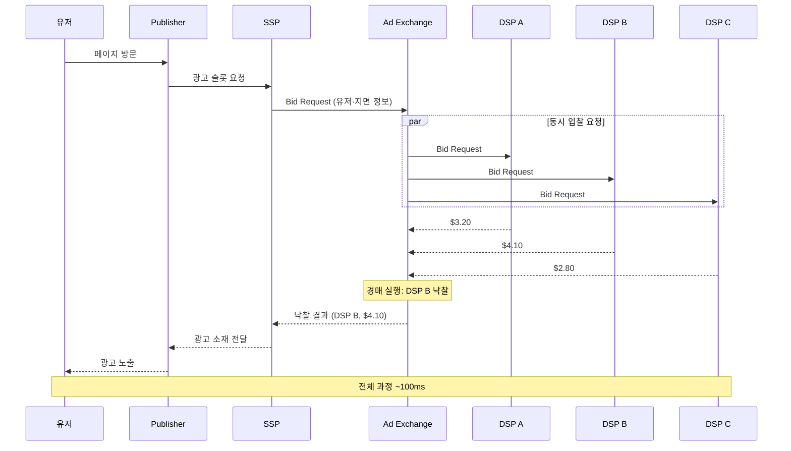
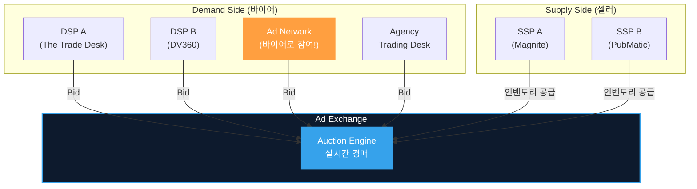
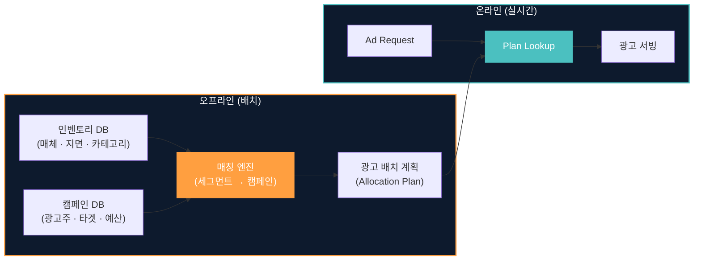
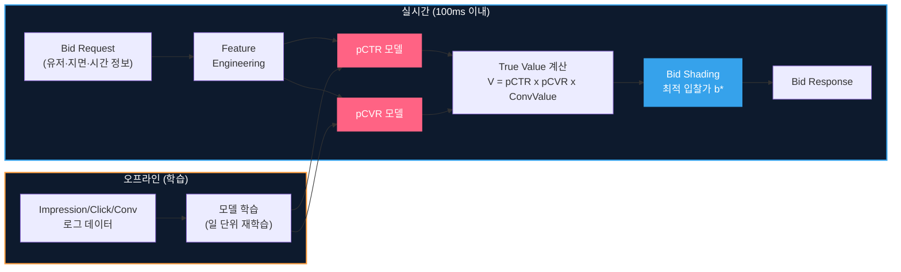
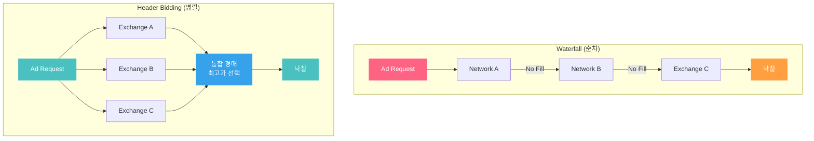
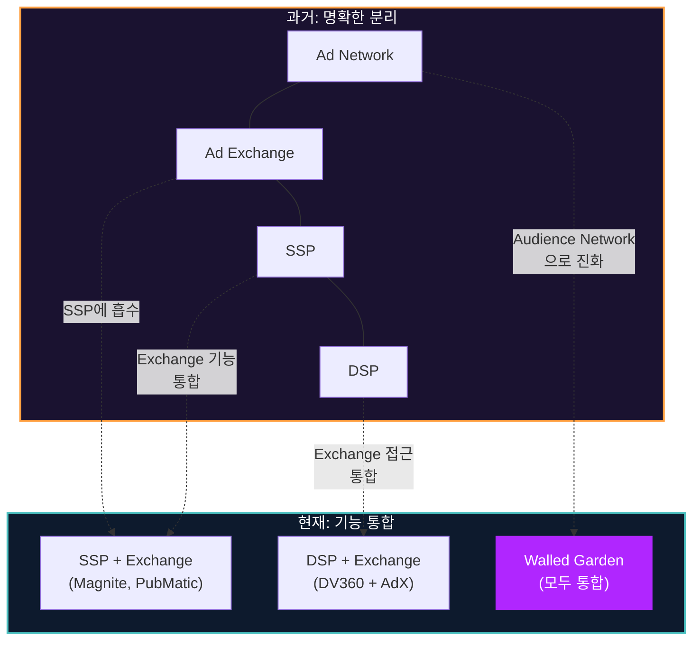

DSP, SSP, RTB, Header Bidding... 광고 기술(Ad Tech) 생태계를 처음 접하면 약어의 홍수에 빠집니다. 하지만 이 모든 개념의 출발점은 하나의 질문입니다: **"매체(Publisher)의 광고 지면을 광고주(Advertiser)에게 어떻게 연결할 것인가?"**

이 질문에 대한 답이 시대에 따라 **Ad Network**에서 **Ad Exchange**로 진화했고, 그 과정에서 Waterfall, RTB, Header Bidding이라는 기술이 등장했습니다. 이 글은 두 구조의 **기술적 차이, 아키텍처, 진화 과정**을 해부하고, 엔지니어 관점에서 왜 이 구분이 중요한지를 설명합니다.

> 광고 생태계의 전체 조감도가 필요하다면 [광고 기술 생태계 전체 지도](post.html?id=adtech-ecosystem-map)를, RTB 서빙 플로우의 상세가 궁금하다면 [Ad Serving Flow](post.html?id=ad-serving-flow)를 먼저 참고하세요.

---

## 1. 핵심 비교 (Executive Summary)

| 차원 | Ad Network | Ad Exchange |
|------|-----------|-------------|
| **비유** | 도매상 (Wholesaler) | 주식 거래소 (Stock Exchange) |
| **거래 단위** | 인벤토리 패키지 (묶음) | 개별 Impression (1건씩) |
| **가격 결정** | 사전 협상 / 고정 CPM | 실시간 경매 (RTB) |
| **의사결정 속도** | 수 시간~수 일 (캠페인 단위) | 100ms 이내 (impression 단위) |
| **투명성** | 낮음 (매체·가격 불투명) | 높음 (Bid Request에 지면 정보 포함) |
| **참여자** | Publisher ↔ Advertiser (중개) | DSP, SSP, Agency, Ad Network 모두 참여 |
| **타겟팅** | 세그먼트 단위 (카테고리, 지면 등급) | 유저 단위 (실시간 피처 활용) |
| **매체 제어권** | 제한적 (Network이 가격·배치 결정) | 높음 (Floor Price, Block List 설정 가능) |
| **등장 시기** | 1990년대 후반 | 2005년~ (Right Media) |

---

## 2. Ad Network: 디지털 광고의 첫 번째 중개자

### 역할과 동작 원리

1990년대 후반, 웹사이트 수가 폭발적으로 증가하면서 개별 매체가 직접 광고주를 찾아 영업하는 것이 불가능해졌습니다. **Ad Network**는 이 문제를 해결한 최초의 중개 플랫폼입니다.

Ad Network의 핵심 역할은 **인벤토리 애그리게이션(Aggregation)**입니다:

동작 방식:

1. **인벤토리 수집**: 다수의 매체가 Network에 자사 광고 지면을 등록
2. **세그먼트 분류**: Network이 지면을 카테고리(스포츠, IT, 패션 등), 품질 등급(Premium, Standard, Remnant), 유저 인구통계(연령, 성별, 지역) 등으로 분류
3. **패키지 판매**: 광고주가 원하는 세그먼트를 선택하면, Network이 해당 세그먼트에 속하는 지면들에 광고를 배치
4. **가격 결정**: 사전에 협상된 고정 CPM(Cost Per Mille) 또는 CPC(Cost Per Click) 기준

### 가격 모델: 고정 가격의 한계

Ad Network의 가격은 **사전 협상 기반**입니다. 광고주와 Network이 캠페인 시작 전에 CPM $2.00 같은 고정 단가를 합의합니다. 이 모델의 문제:

- **시장 가격 미반영**: 프라임타임(출퇴근 시간)에도, 새벽 3시에도 같은 가격
- **수요-공급 불일치**: 인벤토리가 넘쳐도 가격이 내려가지 않고, 경쟁이 치열해도 올라가지 않음
- **매체 수익 최적화 불가**: 더 높은 가격을 지불할 의사가 있는 광고주가 있어도, 이미 계약된 가격으로 판매

### Waterfall: 순차 호출의 비효율

매체는 수익을 극대화하기 위해 여러 Ad Network에 동시에 등록합니다. 이때 **Waterfall(폭포수)** 방식으로 Network를 순차 호출합니다:

Waterfall의 치명적 문제:

| 문제 | 설명 |
|------|------|
| **순서 고정** | 우선순위는 과거 평균 CPM 기준으로 설정. 특정 impression에서 Network B가 $5.00을 지불할 의사가 있어도, Network A가 먼저 호출됨 |
| **레이턴시 누적** | Network A가 No Fill을 반환할 때까지 대기 → B 호출 → 대기... 사용자 경험 악화 |
| **가격 최적화 불가** | Network A가 Fill하면 거기서 끝. B, C가 더 높은 가격을 제시할 기회조차 없음 |
| **불투명한 마진** | Network이 매체에 $2.00을 지불하면서 광고주에게 $5.00을 청구해도, 매체는 알 수 없음 |

이 비효율성이 Ad Exchange 등장의 직접적 원인입니다.

---

## 3. Ad Exchange: 실시간 경매 마켓플레이스

### 역할과 동작 원리

**Ad Exchange**는 Waterfall의 "순차 호출 → 첫 번째 응답 채택" 패턴을 **"모든 바이어에게 동시 입찰 기회 → 경매로 최고가 선택"**으로 바꿨습니다.

핵심 기술은 **RTB(Real-Time Bidding)**: 유저가 페이지를 로딩하는 100ms 안에 수십~수백 개의 DSP가 동시에 입찰하고, 경매를 통해 낙찰자를 결정합니다.

### Waterfall과의 결정적 차이

Waterfall에서는 Network A가 거절해야 B에게 기회가 갔습니다. Exchange에서는 **모든 바이어가 동시에 입찰**합니다. 따라서:

- **가격 발견(Price Discovery)**: 시장의 수요-공급이 실시간으로 가격에 반영
- **매체 수익 극대화**: 가장 높은 가격을 제시한 바이어에게 판매
- **광고주 효율 극대화**: 특정 유저·지면에 높은 가치를 부여하는 광고주만 높게 입찰

### 참여자의 확장

Ad Exchange의 핵심적 특징은 **Ad Network도 바이어로 참여**할 수 있다는 점입니다:

Ad Network이 Exchange의 바이어로 참여한다는 것은, **Network과 Exchange가 경쟁 관계가 아닌 보완 관계**임을 의미합니다. Network은 자체 광고주 풀의 수요를 모아 Exchange에서 입찰하고, Exchange는 Network에게 더 넓은 인벤토리 접근을 제공합니다.

### 경매 메커니즘: 1st Price vs 2nd Price

Ad Exchange 초기에는 **2nd Price Auction**이 표준이었습니다. 2등 가격 + $0.01을 지불하므로 광고주는 True Value 그대로 입찰하면 됩니다(Truthful Bidding). 하지만 2017년 이후 **1st Price Auction**으로 전환되면서, DSP는 [Bid Shading](post.html?id=bid-shading-censored)이라는 새로운 최적화 기법을 도입해야 했습니다.

| 경매 방식 | 지불 금액 | DSP 전략 | 시기 |
|-----------|----------|----------|------|
| 2nd Price | 2등 가격 + $0.01 | Truthful Bidding ($b = V$) | ~2017 |
| 1st Price | 내 입찰가 그대로 | Bid Shading ($b < V$) | 2017~ |

---

## 4. 기술 아키텍처 비교

### 시스템 설계의 근본적 차이

Ad Network과 Ad Exchange는 **아키텍처 패러다임 자체가 다릅니다**:

| 차원 | Ad Network | Ad Exchange |
|------|-----------|-------------|
| **처리 모드** | 배치(Batch) | 실시간 스트리밍(Real-Time) |
| **의사결정 단위** | 캠페인 단위 (수천~수만 impression 묶음) | Impression 단위 (1건) |
| **레이턴시 요구** | 수 초~수 분 (비동기) | 100ms 이내 (동기) |
| **프로토콜** | 자체 API (비표준) | OpenRTB 표준 프로토콜 |
| **ML 모델 역할** | 제한적 (세그먼트 분류 정도) | 핵심 (pCTR, pCVR, Bid Shading) |
| **데이터 활용** | 사전 집계된 세그먼트 | 실시간 유저·컨텍스트 피처 |
| **확장 과제** | 매체 온보딩 | 수십만 QPS 처리, 10ms 추론 |

### Ad Network: 배치 매칭 아키텍처

Ad Network의 핵심 로직은 **오프라인 매칭**입니다:

- 매칭은 **사전에 계산**: "스포츠 카테고리 Premium 지면 → 나이키 캠페인" 같은 규칙
- 실시간에는 **단순 Lookup**: 미리 계산된 배치 결과를 조회하여 서빙
- ML 모델의 역할이 제한적: 유저 단위 실시간 예측이 불필요

### Ad Exchange: 실시간 추론 아키텍처

Ad Exchange를 활용하는 DSP의 아키텍처는 **실시간 ML 추론**이 핵심입니다:

- **Bid Request마다 ML 추론**: 유저 특성, 지면 특성, 시간대 등을 입력으로 pCTR/pCVR을 실시간 예측
- **개인화된 입찰**: 같은 지면이라도 유저마다 다른 가격으로 입찰
- **모델 서빙 인프라**: [10ms 안에 수백 개 광고를 스코어링](post.html?id=model-serving-architecture)해야 하므로, GPU 추론, 모델 경량화, Feature Store 등 고도화된 ML 인프라 필요

---

## 5. 진화의 역사: Waterfall에서 Header Bidding까지

### 타임라인

| 연도 | 사건 | 의미 |
|------|------|------|
| **1996** | DoubleClick 설립 | 최초의 대형 Ad Network. 배너 광고 서빙 + 리포팅 |
| **2003** | Google, DoubleClick 인수 추진 | 검색 광고를 넘어 디스플레이 광고 시장 진입 |
| **2005** | Right Media 출시 | **최초의 Ad Exchange**. Impression 단위 실시간 거래 도입 |
| **2007** | Google AdX (DoubleClick Ad Exchange) | 세계 최대 Exchange. RTB 프로토콜 표준화 선도 |
| **2010** | OpenRTB 1.0 표준 발표 | Bid Request/Response 포맷 표준화 → DSP-Exchange 연동 비용 감소 |
| **2014** | Header Bidding 등장 | Waterfall 우회. 모든 Exchange에 동시 입찰 요청 |
| **2017~** | 1st Price Auction 전환 | AppNexus, Index Exchange, Google AdX 순차 전환 |
| **2019** | Google Open Bidding | Server-to-Server Header Bidding. 레이턴시 최적화 |
| **현재** | SSP-Exchange 경계 소멸 | Magnite, PubMatic 등 SSP가 Exchange 기능 통합 |

### Header Bidding: 게임 체인저

Waterfall의 근본적 문제는 **"순차 호출"**이었습니다. Header Bidding은 이를 **"병렬 호출"**로 바꿨습니다:

Header Bidding의 핵심 효과:

| 효과 | Waterfall | Header Bidding |
|------|-----------|----------------|
| **입찰 기회** | 순차 (앞 Network이 거절해야 다음으로) | 동시 (모든 Exchange가 동시 입찰) |
| **가격 발견** | 불완전 (첫 Fill에서 종료) | 완전 (전체 시장 수요 반영) |
| **매체 수익** | 과소 (잠재적 최고가 미발견) | 극대화 (최고 입찰가 선택) |
| **레이턴시** | 순차 누적 (최악 N x timeout) | 병렬 (최대 1 x timeout) |
| **Network/Exchange 구분** | 명확 (순서대로 호출) | 모호 (모두 같은 경매에 참여) |

마지막 행이 핵심입니다. Header Bidding 이후 **Ad Network와 Ad Exchange의 기술적 경계가 희미해졌습니다**. 둘 다 동일한 경매에 바이어로 참여하기 때문입니다.

---

## 6. 현대 생태계에서의 위치: 경계의 소멸

### SSP = Exchange?

현대 Ad Tech에서 **SSP와 Ad Exchange의 경계는 사실상 소멸**했습니다:

- **Magnite** (구 Rubicon Project): SSP로 출발했지만 현재 자체 Exchange 운영
- **PubMatic**: SSP + Exchange 통합 플랫폼
- **Google Ad Manager**: AdX(Exchange) + DFP(Ad Server) 통합

매체 입장에서 "SSP에 연동하는 것"과 "Exchange에 인벤토리를 올리는 것"은 사실상 같은 행위가 되었습니다.

### Ad Network의 현대적 형태

전통적 Ad Network이 사라진 것은 아닙니다. **형태가 진화**했습니다:

| 유형 | 예시 | 특징 |
|------|------|------|
| **Audience Network** | Meta Audience Network, TikTok for Business | 자사 광고주 수요를 외부 매체에 확장. Network의 핵심 역할(수요 애그리게이션) 유지 |
| **Vertical Network** | Criteo (리타겟팅 특화), AdMob (모바일 특화) | 특정 도메인에 특화된 수요와 인벤토리 매칭 |
| **Walled Garden** | Google, Meta, Amazon, 네이버, 카카오 | DSP + Exchange + Network + Publisher를 모두 자사 내에서 운영. [Walled Garden 상세 분석](post.html?id=walled-garden) 참고 |

### 통합의 흐름

---

## 7. 실무적 시사점: 엔지니어가 알아야 하는 이유

"Ad Network vs Ad Exchange"가 역사 이야기로만 끝나는 것이 아닙니다. **현재도 두 구조가 공존**하며, 엔지니어의 시스템 설계에 직접적 영향을 미칩니다.

### pCTR/pCVR 모델 학습 데이터의 차이

| 차원 | Network 경유 트래픽 | Exchange(RTB) 트래픽 |
|------|---------------------|---------------------|
| **Bid Request 정보** | 제한적 (카테고리, 사이즈 정도) | 풍부 (URL, 유저 ID, 디바이스, 위치 등) |
| **가격 피드백** | 고정 가격 (시장 가격 정보 없음) | Winning Price, Clearing Price 관측 가능 |
| **유저 피처** | 세그먼트 레벨 (25-34세 남성) | 유저 레벨 (실시간 브라우징 이력) |
| **모델 학습 영향** | Feature sparse → 모델 정확도 한계 | Feature rich → 개인화 정밀 예측 가능 |

같은 pCTR 모델이라도, Network 경유 트래픽과 Exchange 트래픽을 **분리해서 학습**하거나, 트래픽 소스를 피처로 포함해야 합니다.

### Bid Optimization의 적용 범위

- **Exchange 트래픽**: Bid Shading, Budget Pacing, Auto-Bidding 등 모든 입찰 최적화 기법이 적용 가능. 시장 가격 분포를 학습하여 최적 입찰가를 탐색
- **Network 트래픽**: 가격이 사전 고정되므로 Bid Shading이 무의미. 최적화 대상은 "어떤 Network에 얼마의 예산을 배분할 것인가" (Allocation 문제)

### Feature Engineering 전략

Exchange(RTB) 환경에서는 Bid Request에 포함된 **실시간 피처**를 활용할 수 있습니다:

- **유저 컨텍스트**: 디바이스, OS, 브라우저, IP 기반 위치
- **지면 컨텍스트**: URL, 도메인, 카테고리, 광고 사이즈, 위치(above/below fold)
- **시간 컨텍스트**: 시간대, 요일, 계절성
- **경매 컨텍스트**: Exchange ID, Floor Price, 경매 유형(1st/2nd Price)

이 피처들이 pCTR 모델의 정확도를 결정하고, 정확한 pCTR이 True Value의 정확도를 결정하며, True Value가 입찰 최적화의 성패를 좌우합니다. **Exchange → 풍부한 피처 → 정확한 모델 → 효율적 입찰**이라는 선순환 구조입니다.

---

## 마무리

1. **Ad Network은 "묶음 판매의 중개상", Ad Exchange는 "impression 단위의 실시간 경매소"** — 거래 단위와 가격 결정 메커니즘이 근본적으로 다릅니다.

2. **Waterfall의 비효율이 Exchange 등장의 직접적 원인** — 순차 호출은 가격 발견을 방해하고, 매체와 광고주 모두에게 불리합니다.

3. **Header Bidding이 두 세계의 경계를 허물었다** — 모든 바이어가 같은 경매에 참여하면서, Network과 Exchange의 기술적 구분이 희미해졌습니다.

4. **현대 Ad Tech은 통합의 시대** — SSP가 Exchange를 흡수하고, Walled Garden이 모든 역할을 통합합니다. 하지만 두 구조의 설계 철학(배치 매칭 vs 실시간 경매)은 여전히 시스템 아키텍처의 근간입니다.

5. **엔지니어에게 이 구분은 실무적으로 중요** — 학습 데이터 특성, 입찰 최적화 전략, Feature Engineering 전략이 트래픽 소스(Network vs Exchange)에 따라 달라집니다.

---

### 참고 자료

- Mintegral. (2023). *Ad Tech 101: Ad Network vs. Ad Exchange*. YouTube.
- IAB Tech Lab. *OpenRTB Specification*. https://iabtechlab.com/standards/openrtb/
- Google Ad Manager Help. *How Ad Exchange works*.
- Prebid.org. *Header Bidding Overview*.
