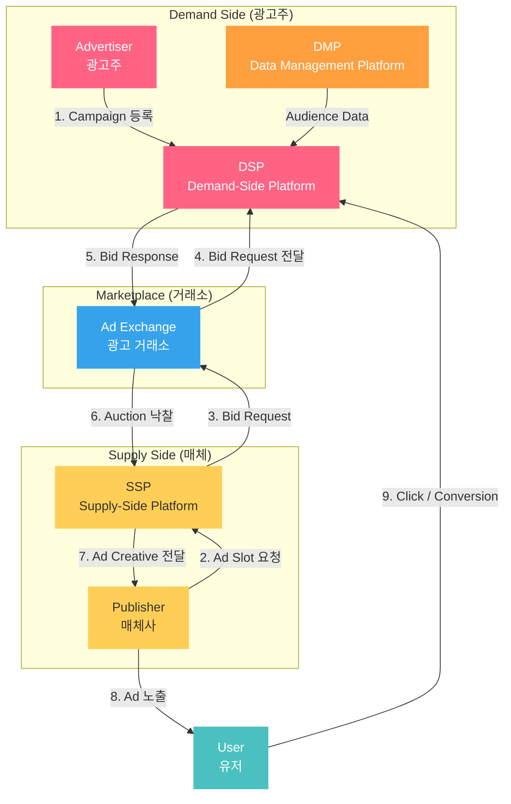
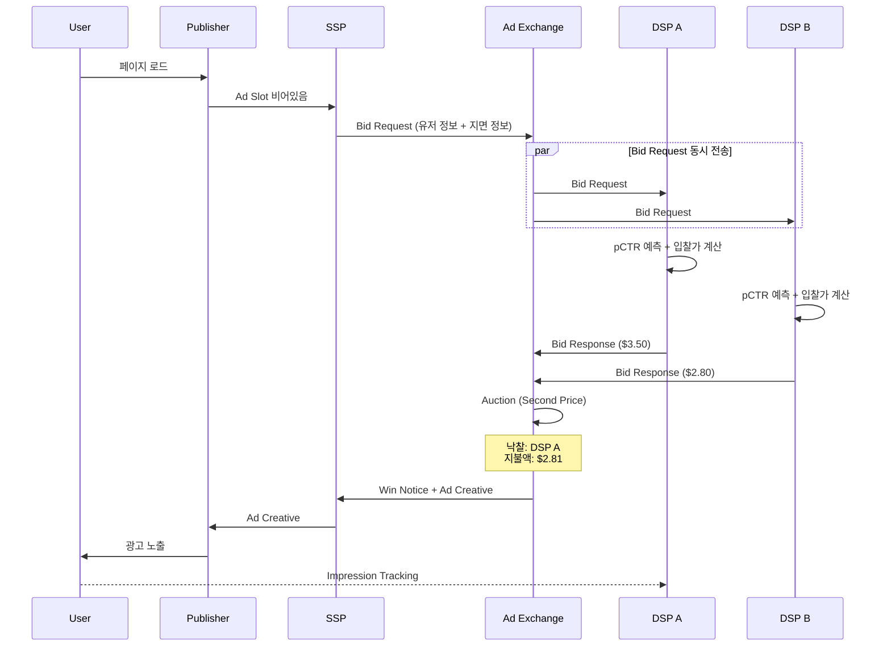
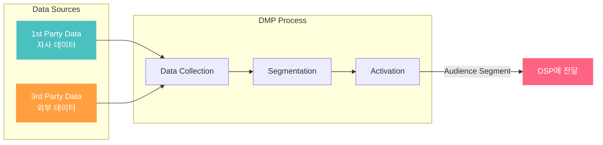
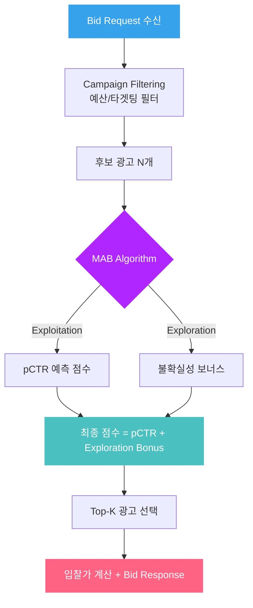

# Ad Serving Flow: 광고가 유저에게 도달하는 전체 과정

광고주가 캠페인을 집행하고, 유저가 광고를 보기까지의 전체 흐름을 도식화합니다.

---

## 1. 전체 파이프라인 (End-to-End)

---

## 2. RTB Auction 상세 플로우

유저가 페이지를 로드하는 순간부터 광고가 노출되기까지 100~200ms 안에 벌어지는 일입니다.

---

## 3. 주요 구성요소

### DSP (Demand-Side Platform)

광고주 측의 플랫폼. 여러 Ad Exchange에 동시에 입찰하여 최적의 지면을 확보합니다.

핵심 기능:
- Audience Targeting (DMP 연동)
- pCTR/pCVR 예측 모델
- Bid Optimization (입찰가 최적화)
- MAB Algorithm (탐색/활용 밸런싱)

### SSP (Supply-Side Platform)

매체사 측의 플랫폼. 광고 지면의 수익을 극대화합니다.

핵심 기능:
- Floor Price 설정
- Header Bidding 지원
- Ad Quality 필터링

### Ad Exchange

DSP와 SSP를 연결하는 거래소. 실시간 경매를 수행합니다.

경매 방식:
- First Price Auction: 입찰가 그대로 지불
- Second Price Auction: 2등 입찰가 + $0.01 지불
- Bid Shading: First Price 환경에서 낙찰가를 낮추는 전략

### DMP (Data Management Platform)

유저 데이터를 수집/분석하여 Audience Segment를 생성합니다.

---

## 4. MAB가 개입하는 지점

DSP 내부에서 "어떤 광고를 입찰할 것인가"를 결정하는 Ad Selection 단계에 MAB 알고리즘이 적용됩니다.

이 흐름에서 MAB 알고리즘의 선택지:
- Context-Free (e-Greedy, Basic TS): 유저 정보 없이 광고의 평균 CTR만으로 선택
- Contextual (LinUCB, Linear TS): 유저 Context Vector를 활용하여 개인화된 선택
