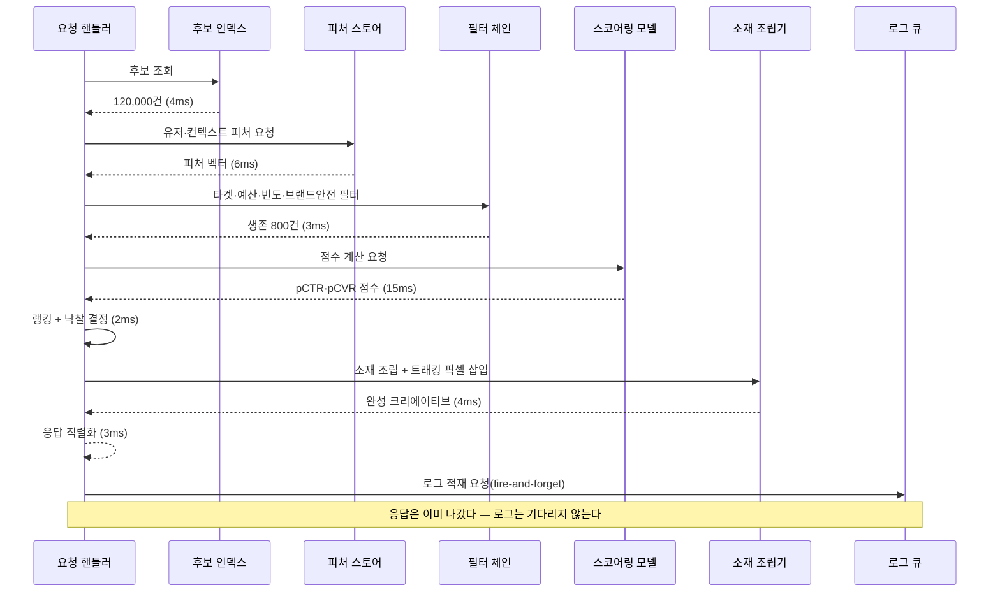

민지가 지하철에서 웹툰 앱을 켠다. 회차와 회차 사이, 광고 한 칸이 잠깐 하얗다가 신발 광고로 채워진다.

그 하얀 칸이 채워지는 데 걸리는 시간은 짧다. 그 짧은 시간 동안 서버 코드는 여러 단계를 순서대로 지나간다.

**dsp-ssp-exchange** 글은 이 요청을 누가 처리하는지를 봤다. DSP·SSP·Exchange라는 서로 다른 회사가 등장했다. 그 회사 사이를 오가는 0.1초와 수수료도 계산했다.

이 글은 각도를 완전히 바꾼다. 회사 이름은 잠깐 잊자. 대신 **요청 한 건이 코드 한 줄 한 줄을 지나가는 길**을 그대로 따라가 본다.

후보를 찾는다. 안 맞는 건 거른다. 남은 후보에 점수를 매겨 순위를 정한다. 이긴 광고를 조립해서 내보낸다. 그리고 방금 벌어진 일을 기록에 남긴다. 이 다섯 동작이 이 글의 뼈대다.

> 한 줄 요약: 광고 요청 1건은 서버 코드 안에서 여덟 단계를 통과한다. **후보 조회 → 필터링 → 점수 계산 → 랭킹 → 낙찰 → 소재 조립 → 로그 적재** 순서다. 각 단계에는 정해진 시간, 즉 지연 예산이 있다. 이 예산을 넘기면 응답은 나가지 못한다. 필터링에서 한 번 걸러진 후보는 랭킹이 아무리 좋아도 다시 살아나지 못한다.

---

## 1. 요청 한 건이 지나가는 여덟 걸음

**광고 요청 1건이 들어오면, 서버는 정해진 순서로 여덟 번 일한다.** 후보를 찾고, 거르고, 점수를 매기고, 순위를 정하고, 이긴 걸 조립해서 내보내는 순서다. 이 순서는 거의 바뀌지 않는다.

왜 순서가 고정돼 있을까. 뒷단으로 갈수록 하는 일이 무거워지기 때문이다. 후보 12만 건 전부에 무거운 점수 계산 모델을 돌리면 시간 예산이 남아나지 않는다. 그래서 먼저 싼 작업으로 후보를 확 줄인다. 남은 소수에만 비싼 계산을 쓴다. 이 원칙 하나가 이 글 전체를 관통한다.

아래 그림은 이 여덟 걸음을 코드 모듈 단위로 그린 것이다. 화살표를 따라가면 요청이 들어와 응답이 나가기까지의 경로가 보인다. 맨 끝에 로그가 점선으로 빠지는 이유는 뒤에서(§10·§11) 따로 설명한다.


```mermaid
graph LR
  REQ["요청 파싱<br/>정규화"]
  CAND["후보 조회<br/>(인덱스)"]
  FEAT["피처 조회<br/>(유저·컨텍스트)"]
  FILT["필터링<br/>(예산·타겟·빈도·브랜드안전)"]
  SCORE["점수 계산<br/>(pCTR·pCVR)"]
  RANK["랭킹·낙찰"]
  CREA["소재 조립<br/>(트래킹 픽셀)"]
  RESP["응답 전송"]
  LOG["로그 큐<br/>(비동기)"]

  REQ --> CAND --> FEAT --> FILT --> SCORE --> RANK --> CREA --> RESP
  RESP -.->|"응답 막지 않음"| LOG

  style FILT fill:#c9a961,stroke:#c9a961,color:#201d1a
  style SCORE fill:#b0442c,stroke:#b0442c,color:#fff
  style LOG fill:#5b7d6a,stroke:#5b7d6a,color:#fff
```

이 그림에서 눈여겨볼 곳은 두 가지다. 하나는 **필터링과 점수 계산이 색으로 강조된 이유**다. 이 둘이 각각 후보 수와 계산 시간을 가장 크게 좌우한다. §3과 §7에서 이 두 단계를 집중적으로 다룬다.

다른 하나는 **로그가 점선으로 빠진다는 점**이다. 로그를 쓰는 일이 응답을 막으면 안 된다. 이 이유는 §10에서 자세히 다룬다.

---

## 2. 후보 조회 — 12만 건은 어디서 나오는가

**요청이 들어오면 서버는 먼저 낼 수 있는 광고부터 찾는다.** 이 단계를 후보 조회(Candidate Retrieval)라 부른다. 모든 캠페인을 하나하나 확인하지 않는다. 미리 만들어 둔 색인을 뒤진다.

색인은 보통 이렇게 생겼다. 이 지면·이 연령대·이 관심사에 걸리는 캠페인 ID들을 미리 묶어 둔 표다. 창고에서 상품을 찾을 때 통로 전체를 걷지 않고 위치 코드로 바로 찾아가는 것과 같다. 요청이 들어오면 이 요청의 조건(지면·유저 세그먼트·기기)으로 색인을 조회한다. 조건에 걸리는 캠페인 ID 목록을 즉시 받는다.

이 글에서는 이 조회로 **120,000건**의 후보가 나왔다고 가정한다. 이 숫자는 광고주 전체 캠페인 수가 아니다. 이미 이 지면 카테고리에서 노출 가능하다는 대략적인 조건으로 한 번 걸러진 뒤의 숫자다. 진짜 필터링은 다음 단계(§3)에서 시작된다.

색인 조회가 왜 빠른지는 그 안에서 무거운 계산을 전혀 안 하기 때문이다. 점수도 안 매긴다. 예산도 안 본다. 그저 이 조건에 등록된 캠페인이 무엇인지 찾아 반환할 뿐이다. §7의 지연 예산 표에서 이 단계는 8단계 중 가장 짧은 축에 속한다. 무거운 일은 뒤로 미뤄 둔다.

---

## 3. 필터링 — 여기서 놓치면 끝이다

**필터링은 후보 중 지금 낼 수 없는 걸 지운다. 그리고 여기서 지워진 후보는 절대 돌아오지 못한다.** 아무리 랭킹 모델이 정교해도, 필터링 단계에서 이미 사라진 광고를 다시 불러올 방법은 없다.

필터는 보통 이 순서로 걸린다. 첫째, **타겟 조건**이다. 지면·지역·연령·세그먼트가 캠페인이 원하는 조건과 맞는지 본다. 둘째, **예산 소진 제외**다. 오늘 예산을 이미 다 쓴 캠페인은 뺀다. 셋째, **빈도 제한(frequency cap)**이다. 이 유저가 이 광고를 이미 정해진 횟수만큼 봤으면 뺀다. 넷째, **브랜드 안전(brand safety)**이다. 이 지면의 콘텐츠 카테고리와 광고가 충돌하면 뺀다.

이 네 필터를 §2의 12만 건에 순서대로 적용하면 이렇게 줄어든다. 아래는 이 글의 가데이터다.

| 단계 | 남은 후보 수 | 이 단계 통과율 | 최초 대비 누적 생존율 |
|---|---|---|---|
| 시작(색인 조회 직후) | 120,000건 | — | 100% |
| ① 타겟 조건 통과 | 4,200건 | 3.5% | 3.50% |
| ② 예산 소진 제외 통과 | 2,310건 | 55.0% | 1.93% |
| ③ 빈도 제한 통과 | 1,155건 | 50.0% | 0.96% |
| ④ 브랜드 안전 통과(= 랭킹 대상) | 800건 | 69.3% | 0.67% |
| 최종 응답(랭킹 1위) | 1건 | — | 0.0008% |

가장 큰 감소는 ①번, 타겟 조건에서 일어난다. 12만 건 중 이 유저·이 지면 조건에 맞는 캠페인은 3.5%뿐이다. 나머지는 애초에 이 자리를 원하지도 않았던 캠페인들이다. 반면 ④번 브랜드 안전은 상대적으로 순한 필터다. 이미 좁혀진 1,155건 중에서도 69.3%가 살아남는다.

이 표가 말하는 건 하나다. 최종 800건 안에 들지 못한 나머지는 119,200건이다. **그 안에 아무리 좋은 광고가 있었어도 이미 게임에서 빠졌다.** 랭킹은 이 800건 안에서만 순서를 정할 뿐이다. 필터링이 랭킹보다 먼저, 그리고 더 결정적으로 승부를 가른다.

---

## 4. 점수 계산과 랭킹 — 살아남은 후보의 순서를 정하다

**필터를 통과한 800건 각각에 점수를 매기고, 그 점수로 순위를 정하는 단계다.** 여기서부터는 "가능한 광고"가 아니라 가장 좋은 광고 하나를 고르는 일이 된다.

점수는 보통 예상 클릭률(pCTR)과 예상 전환율(pCVR), 그리고 입찰가를 함께 묶어 만든다. 이 점수를 실제로 어떻게 계산하고 어떻게 순위로 바꾸는지는 이 글의 범위가 아니다. **eCPM과 광고 랭킹** 글이 시장별 계산 기준을 다룬다. **광고 모델 서빙 아키텍처** 글이 800건을 몇 ms 안에 스코어링하는 방법을 다룬다. 이 글은 그 계산이 파이프라인의 어디에 위치하는지만 본다.

위치는 중요하다. §7의 지연 예산 표에서 점수 계산은 여덟 단계 중 가장 무거운 한 줄을 차지한다. 필터링을 먼저 거쳐 800건까지 줄여 놓았기 때문에, 이 무거운 계산을 감당할 수 있다. 만약 필터링 없이 12만 건 전부에 같은 모델을 돌렸다면, 이 단계 하나만으로 지연 예산을 다 써버렸을 것이다.

순위를 정한 뒤에는 탐색(exploration)을 살짝 섞는 경우도 있다. 점수가 확실하지 않은 신규 캠페인에 가끔 기회를 주는 방식이다. 이 기법은 **UCB 알고리즘 패밀리** 글에서 따로 다룬다. 이 글에서는 순위가 여기서 정해진다는 것까지만 기억하면 된다.

---

## 5. 낙찰과 소재 조립 — 광고가 완성되는 순간

**순위가 정해지면 1등이 이 자리를 가져간다. 그다음 할 일은 그 광고를 실제로 내보낼 수 있는 모습으로 조립하는 것이다.** 점수 계산이 누가 이겼는지를 정했다면, 이 단계는 이긴 광고가 실제로 어떻게 생겼는지를 만든다.

낙찰가가 얼마인지는 경매 방식에 따라 갈린다. 1등가 그대로 낼 수도 있다. 2등 입찰가에 맞출 수도 있다. 이 계산은 **dsp-ssp-exchange** 글과 **2등 가격 경매** 글에서 이미 다뤘다. 여기서는 반복하지 않는다.

소재 조립은 다른 일이다. 광고 이미지·문구 템플릿에 이 유저·이 자리에 맞는 값을 채워 넣는다. 상품 이미지를 유저가 최근 본 상품으로 바꾸는 동적 크리에이티브가 대표적이다. 그리고 이 과정에서 **트래킹 픽셀**을 심는다. 이 광고가 화면에 그려졌는지 확인할 아주 작은 이미지 요청 하나, 그리고 클릭했을 때 어디를 거쳐 갈지 정하는 리디렉션 주소다.

이 조립이 끝나야 비로소 완성된 응답을 내보낼 수 있다. 트래킹 픽셀과 클릭 리디렉션이 정확히 무슨 일을 하는지는 §11에서 이어서 본다. 지금은 소재 하나에 이미지·문구·픽셀·링크가 한 번에 조립된다는 것만 기억해 두자.

---

## 6. 파이썬으로 깔때기와 비용을 함께 본다

**§3의 깔때기를 코드로 그대로 옮기고, 필터 순서를 바꿔 봤을 때 처리 비용이 어떻게 달라지는지 계산한다.** 결론부터 말하면, 최종 살아남는 후보 수는 순서와 무관하다. 하지만 처리 비용은 최대 9배 가까이 벌어진다.

아래 코드는 표준 라이브러리만 쓴다. 필터마다 통과율과 후보 1건을 검사하는 비용(ns)을 정해 둔다. 순서대로 적용하며 후보 수와 누적 비용을 함께 추적한다.

```python
# 광고 요청 1건이 8단계 코드 경로를 지나며 후보가 줄어드는 과정과,
# 필터 순서를 바꾸면 처리 비용(=지연)이 어떻게 달라지는지 함께 본다.
# 후보 수·통과율·비용은 이 글의 가데이터 표와 맞춘 예시값이다(표준 라이브러리만 사용).

CANDIDATES_START = 120_000

# (필터 이름, 통과율, 후보 1건 검사 비용ns) — 순서는 실제 파이프라인 순서.
# 통과율은 '독립'이라고 가정한다: 각 필터는 다른 필터와 무관하게 후보를 받아들이거나 뺀다.
# 비용(ns)은 필터 하나가 후보 1건을 검사하는 데 드는 상대적 비용의 예시치다.
PIPELINE = [
    ("타겟 조건(세그먼트·지면·연령)", 0.035,     10),  # 인덱스/비트마스크 조회 — 가장 싸다
    ("예산 소진 제외",               0.55,       8),  # 카운터 비교 — 싸다
    ("빈도 제한",                    0.50,      25),  # 캐시 조회 — 중간
    ("브랜드 안전",                  800 / 1155, 80),  # 카테고리 매칭 — 가장 비싸다
]


def run_funnel(pipeline, start):
    """단계를 순서대로 적용해 (단계별 남은 후보 수, 총 검사 비용ns)을 반환한다."""
    remaining = start
    counts = [remaining]
    total_cost_ns = 0
    for _name, rate, cost_ns in pipeline:
        total_cost_ns += remaining * cost_ns  # 이 단계는 '지금 남은 후보 전부'를 검사해야 한다
        remaining = round(remaining * rate)
        counts.append(remaining)
    return counts, total_cost_ns


# (a) 실제 파이프라인 순서로 후보 수 변화를 본다 (싼 필터 → 비싼 필터)
counts, cost_actual = run_funnel(PIPELINE, CANDIDATES_START)
print("(a) 실제 순서 — 단계별 남은 후보 수")
labels = ["시작(전체 캠페인 후보)"] + [name for name, _r, _c in PIPELINE]
for label, n in zip(labels, counts):
    print(f"    {label:<28} {n:>7,}건")

# (b) 순서를 뒤집으면(비싼 필터 → 싼 필터) 최종 생존자는 같아도(독립 가정) 처리 비용은 달라진다
reversed_pipeline = list(reversed(PIPELINE))
counts_rev, cost_reversed = run_funnel(reversed_pipeline, CANDIDATES_START)

print("\n(b) 필터 순서 비교 — 최종 생존자는 같아도 비용은 다르다")
print(f"    실제 순서(싼 필터 먼저)    최종 {counts[-1]:>4,}건   비용 {cost_actual/1e6:6.3f}ms")
print(f"    거꾸로 순서(비싼 필터 먼저) 최종 {counts_rev[-1]:>4,}건   비용 {cost_reversed/1e6:6.3f}ms")
print(f"    비용 배율: {cost_reversed/cost_actual:.2f}배")

# 검산: 필터가 독립이라면 최종 생존자 수는 순서와 무관해야 한다(반올림 오차 정도만 허용)
assert abs(counts[-1] - counts_rev[-1]) <= 1

# 출력:
# (a) 실제 순서 — 단계별 남은 후보 수
#     시작(전체 캠페인 후보)                120,000건
#     타겟 조건(세그먼트·지면·연령)              4,200건
#     예산 소진 제외                       2,310건
#     빈도 제한                          1,155건
#     브랜드 안전                           800건
#
# (b) 필터 순서 비교 — 최종 생존자는 같아도 비용은 다르다
#     실제 순서(싼 필터 먼저)    최종  800건   비용  1.384ms
#     거꾸로 순서(비싼 필터 먼저) 최종  800건   비용 12.239ms
#     비용 배율: 8.84배
```

코드에서 눈여겨볼 곳은 `run_funnel` 안의 비용 계산 줄이다. `total_cost_ns += remaining * cost_ns`. 이 한 줄이 전부를 설명한다. 어떤 필터든 **지금 남아 있는 후보 전부를 검사해야 한다.** 그러니 그 필터를 만나기 전에 후보가 얼마나 줄어 있었는지가 비용을 좌우한다.

실제 순서(타겟 조건 먼저)에서는 가장 비싼 필터인 브랜드 안전을 만날 때 이미 후보가 1,155건까지 줄어 있다. 그래서 비싼 단가(80ns)를 곱해도 총량이 작다. 거꾸로 순서에서는 브랜드 안전이 12만 건 전부를 검사한다. 같은 단가라도 대상이 100배 넘게 많으니 비용이 폭증한다. **싼 필터를 먼저 걸어 후보를 줄이는 일은 취향이 아니라 산수다.**

---

## 7. 지연 예산 — 여덟 단계가 나눠 쓰는 45ms

**이 글의 파이프라인에는 전체 45ms라는 타임아웃이 걸려 있다. 여덟 단계가 이 45ms를 나눠 쓴다.** 아래는 이 글의 가데이터 표다. 각 단계가 몇 ms를 쓰는지, 누적이 얼마인지, 타임아웃까지 남은 여유가 얼마인지 함께 적었다.

| # | 단계 | 이 단계(ms) | 누적(ms) | 타임아웃까지 남은 여유(ms) |
|---|---|---|---|---|
| 1 | 요청 파싱·정규화 | 1 | 1 | 44 |
| 2 | 후보 조회(§2) | 4 | 5 | 40 |
| 3 | 피처 조회(유저·컨텍스트) | 6 | 11 | 34 |
| 4 | 필터링(§3) | 3 | 14 | 31 |
| 5 | 점수 계산(§4) | 15 | 29 | 16 |
| 6 | 랭킹·낙찰 결정(§4·§5) | 2 | 31 | 14 |
| 7 | 소재 조립(§5) | 4 | 35 | 10 |
| 8 | 응답 직렬화·전송 | 3 | 38 | 7 |

45ms 예산 중 38ms를 쓰고 7ms가 남는다. 이 7ms가 이 시스템의 진짜 안전 마진이다. 트래픽이 몰려 어느 한 단계가 조금 느려져도, 이 여유 안에서는 버틸 수 있다.

가장 큰 몫은 5번, 점수 계산의 15ms다. 여덟 단계가 쓴 38ms 중 거의 40%를 이 한 줄이 가져간다. §3에서 필터링으로 800건까지 줄여 놓지 않았다면, 이 15ms 안에 모델을 다 돌리는 건 불가능했을 것이다. 필터링(4번, 3ms)이 작아 보여도, 그 3ms가 뒤따라오는 15ms를 가능하게 만든다.

이제 §6의 파이썬 결과를 이 표 위에 얹어 보자. 필터를 실제 순서로 걸면 §6의 계산상 1.384ms만 쓴다. 표의 3ms 예산 안에 여유 있게 들어온다. 그런데 순서를 거꾸로 하면 12.239ms가 걸린다. 필터링 한 단계만으로 3ms 예산을 4배 넘게 초과한다.

이 초과분이 전체에 어떤 영향을 주는지 계산해 보자. 필터링을 뺀 나머지 일곱 단계의 합은 35ms다(1+4+6+15+2+4+3). 여기에 거꾸로 순서의 실제 비용 12.239ms를 더하면 47.239ms가 나온다. **45ms 타임아웃을 2.2ms 넘긴다.** 필터 순서 하나가 틀리면 이 요청은 응답도 못 내고 타임아웃으로 죽는다. 그때까지 계산한 점수도, 조립한 소재도 전부 버려진다.

이 흐름을 모듈 호출 순서로 다시 그리면 이렇다. 시간은 위에서 아래로 흐른다.


```mermaid
sequenceDiagram
  participant H as 요청 핸들러
  participant IDX as 후보 인덱스
  participant FS as 피처 스토어
  participant FLT as 필터 체인
  participant M as 스코어링 모델
  participant CR as 소재 조립기
  participant LQ as 로그 큐

  H->>IDX: 후보 조회
  IDX-->>H: 120,000건 (4ms)
  H->>FS: 유저·컨텍스트 피처 요청
  FS-->>H: 피처 벡터 (6ms)
  H->>FLT: 타겟·예산·빈도·브랜드안전 필터
  FLT-->>H: 생존 800건 (3ms)
  H->>M: 점수 계산 요청
  M-->>H: pCTR·pCVR 점수 (15ms)
  H->>H: 랭킹 + 낙찰 결정 (2ms)
  H->>CR: 소재 조립 + 트래킹 픽셀 삽입
  CR-->>H: 완성 크리에이티브 (4ms)
  H-->>H: 응답 직렬화 (3ms)
  H->>LQ: 로그 적재 요청(fire-and-forget)
  Note over H,LQ: 응답은 이미 나갔다 — 로그는 기다리지 않는다
```

---

## 8. 왜 열린 RTB에선 이 예산이 늘 빠듯한가 [무대: 열린 RTB]

**여러 회사를 거치는 구조에서는, 이 글의 45ms 자체가 전체 시간의 일부일 뿐이다.** 이 파이프라인은 어느 한 회사(예: DSP) 안에서 벌어지는 일이다. 그런데 그 회사에 요청이 도착하고 응답이 나가는 데도 시간이 든다.

**dsp-ssp-exchange** 글의 표를 떠올려 보자. 그 글에서 DSP 응답은 표의 한 줄이었다. 15ms에 시작해 65ms에 끝나는, 50ms짜리 블랙박스였다. 이 글은 정확히 그 블랙박스를 열어 본 것이다. 안에는 이 여덟 단계가 있다.

그 50ms 중 일부는 순수 네트워크 왕복이다. Exchange가 요청을 보내고 DSP가 응답을 돌려주는, 물리적인 이동 시간이다. 이 글의 45ms는 그 왕복을 뺀, DSP 내부 계산에 쓸 수 있는 몫으로 보면 된다. 회사가 갈리는 순간, 지연 예산은 이렇게 내부 계산 몫과 회사 사이 이동 몫으로 쪼개진다.

문제는 타임아웃이 어느 한쪽 사정을 봐주지 않는다는 점이다. Exchange의 콜아웃 타임아웃은 DSP가 왜 늦었는지 묻지 않는다. 그냥 그 DSP를 이번 경매에서 뺀다. §7에서 본 필터 순서 실수처럼, 내부 사정으로 예산을 넘기면 결과는 똑같다. 이 노출의 낙찰 기회 자체가 사라지고, 그만큼의 매출도 사라진다.

---

## 9. 왜 닫힌 생태계에선 모든 지연이 내 책임인가 [무대: 닫힌 생태계]

**네이버·카카오 같은 닫힌 생태계에서는 이 여덟 단계가 전부 한 회사 안, 심지어 같은 데이터센터 안에서 벌어진다.** 후보·유저 프로필·소재 카탈로그가 전부 같은 저장소에 있다. 회사와 회사 사이를 오가는 네트워크 홉이 없다.

그 결과 §8에서 본 내부 계산 몫과 이동 몫의 분리가 여기서는 의미가 없다. 홉이 짧으니 이동에 쓰는 시간이 거의 없다. 45ms 예산 거의 전부를 계산에 쓸 수 있다는 뜻이다. 이론적으로는 더 무거운 모델을, 더 많은 후보에 돌릴 여유가 생긴다.

그런데 이게 마냥 편한 상황은 아니다. **모든 지연이 온전히 내 책임이 되기 때문이다.** 열린 RTB에서는 네트워크가 느렸다거나 상대 회사 서버가 늦었다는 변명이 성립한다. 닫힌 생태계에는 그런 변명이 없다. 점수 계산이 느리면 그건 우리 팀이 짠 모델이 느린 것이다. 필터링이 느리면 그건 우리 팀이 만든 색인이 느린 것이다.

그래서 역설적으로 최적화 압력은 담장 안에서 더 세게 걸린다. 탓할 대상이 없으니, 45ms를 넘기지 않는 일은 순전히 엔지니어링 실력의 문제로 남는다. §10에서 볼 기법들, 타임아웃·캐시·비동기 로깅은 두 무대 모두에 필요하다. 다만 닫힌 생태계에서는 이걸 안 하면 핑계 댈 곳이 없다.

---

## 10. 실전 — 지연 예산을 지키는 법

**지연 예산은 한 번 계산해서 끝나는 숫자가 아니다. 트래픽이 늘고 모델이 무거워지면 조용히 예산을 넘기기 시작한다.** 그래서 예산을 지키는 별도의 기법이 필요하다.

가장 기본적인 원칙은 이거다. **어떤 단계도 전체를 볼모로 잡으면 안 된다.** 점수 계산 모델 하나가 느려졌다고 전체 요청이 45ms를 넘기면, 그 요청은 통째로 버려진다. 처음부터 무슨 일이 있어도 45ms 안에 뭐라도 응답하게 만드는 장치가 있어야 한다.

이 장치들은 대개 눈에 잘 안 띈다. 평소에는 조용히 있다가, 트래픽이 몰리는 순간에만 작동한다. 그래서 실무자가 아니면 왜 이런 코드가 있는지 이해하기 어렵다. 아래 심화 박스에서 대표적인 세 가지를 짚는다.

:::deep 더 깊이 — 예산을 지키는 세 가지 장치
**타임아웃과 부분 응답.** 점수 계산이 배정된 15ms를 넘기면 어떻게 할까. 전체를 실패 처리하는 대신, 그때까지 계산이 끝난 후보만으로 랭킹을 진행하는 경우가 많다. 800건 중 500건만 점수가 나왔어도, 그 500건 중 1등을 내보내는 편이 아무것도 안 내보내는 것보다 낫다. 이걸 부분 응답(partial response)이라 부른다. 완벽한 답보다 제때 온 답을 우선한다.

**캐시 계층.** §2의 피처 조회(6ms)는 매 요청마다 새로 계산할 필요가 없는 값이 많다. 같은 유저의 세그먼트 정보는 몇 분 안에는 거의 바뀌지 않는다. 그래서 유저·세그먼트 단위로 짧은 시간(TTL) 동안 결과를 캐시에 저장해 두고 재사용한다. 캐시가 있으면 피처 조회가 6ms에서 1ms 이하로 줄어드는 경우도 흔하다. 다만 캐시가 오래된 값을 들고 있으면 오답을 빠르게 내는 셈이다. TTL을 얼마로 잡을지가 늘 트레이드오프다.

**비동기 로깅.** §1에서 로그가 점선으로 빠져나가는 이유가 이거다. 이번에 낸 요청·후보·점수·낙찰 기록을 디스크나 로그 시스템에 쓰는 일은, 이 유저에게 응답하는 것과 아무 상관이 없다. 그런데 만약 이 쓰기를 응답 전에 동기로 처리한다면, 로그 시스템이 잠깐 느려지는 순간 모든 광고 요청이 함께 느려진다. 그래서 응답은 먼저 내보내고, 로그는 큐에 넣어 두었다가 별도 프로세스가 나중에 처리한다. 이 로그가 다음 날 학습 데이터가 되는 과정은 §11에서 이어간다.
:::

---

## 11. 트래킹과 로그 — 노출 그 이후

**응답을 내보냈다고 끝이 아니다. 그 광고가 정말 화면에 보였는지, 눌렸는지를 확인하는 일이 남아 있다.** 그리고 이 확인 기록이 다음 날 모델을 다시 학습시키는 재료가 된다.

먼저 노출의 정의부터 짚어야 한다. 서버가 응답을 보낸 시점과 유저 눈에 실제로 보인 시점은 다르다. §5에서 만든 응답은 그 자체로 보임을 보장하지 않는다. 서버는 그저 데이터를 보냈을 뿐이다. 화면에 얼마나 그려졌는지는 클라이언트(브라우저·앱)가 따로 잰다. 업계에서 흔히 쓰는 기준(MRC 표준)은 화면 절반 이상이 1초 이상 보일 때를 뷰어블 노출로 친다. 서버가 응답을 보낸 이벤트와 클라이언트가 뷰어빌리티 픽셀을 쏘는 이벤트는 서로 다르다. 시간도 위치도 별개다.

클릭도 비슷하다. 유저가 광고를 누르면 곧바로 광고주 페이지로 가지 않는다. 먼저 트래킹 서버가 만든 리디렉션 주소를 한 번 거친다. 이 주소가 클릭했다는 사실을 로그에 남긴 다음, 진짜 랜딩 페이지로 302 리디렉션을 보낸다. 측정업체가 하나 더 끼어 있으면 리디렉션이 한 번 더 늘어난다. §5에서 조립했던 트래킹 픽셀·리디렉션 주소가 바로 이 경로를 만드는 부품이다.

이렇게 쌓인 요청·노출·클릭 로그는 그날 밤 배치로 정리된다. 어떤 후보가 필터링에서 걸러졌는지가 기록으로 남는다. 어떤 후보가 점수는 높았지만 낙찰엔 실패했는지도 남는다. 실제로 클릭까지 이어진 노출이 무엇이었는지도 함께 남는다. 이 기록이 내일 점수 계산 모델을 다시 훈련시키는 데이터가 된다. 로그 한 건에서 실제로 몇 종류가 만들어지는지는 **광고 시스템 로그 파이프라인** 글이 다룬다. 로그 구조를 request log부터 candidate log까지 나누는 건 **광고 로그 시스템 완전 해부** 글이 다룬다.

---

## 12. 한눈 정리

| 단계 | 이 글에서 본 숫자 | 핵심 |
|---|---|---|
| 후보 조회 | 120,000건 | 색인 조회, 무거운 계산 없음 |
| 필터링 | 120,000 → 800건(0.67%) | 여기서 걸러지면 랭킹도 못 구함 |
| 점수 계산 | 지연 예산 15ms(8단계 중 최대) | 800건까지 줄였기에 감당 가능 |
| 필터 순서 | 1.384ms vs 12.239ms(8.84배) | 최종 결과는 같아도 비용은 다름 |
| 지연 예산 | 총 45ms, 사용 38ms, 여유 7ms | 순서 실수 하나로 47.2ms까지 초과 가능 |
| 뷰어블 노출 | 화면 절반 이상 1초 이상(MRC 기준) | 서버 응답과 실제로 보임은 다른 사건 |
| 비동기 로깅 | 응답 후 큐잉, fire-and-forget | 로그가 응답 지연을 잡아먹으면 안 됨 |

이 표에서 가장 기억할 숫자 하나만 고르라면 **8.84배**다. 후보 집합도, 최종 낙찰자도 똑같은데 순서만 바꿨을 뿐이다. 그런데 처리 비용은 거의 9배 벌어졌고, 그 차이가 타임아웃 통과 여부까지 갈랐다. 좋은 랭킹 모델보다 먼저 챙겨야 하는 건 이 순서다.

---

## 13. 헷갈리기 쉬운 점

- **필터링에서 놓친 광고는 랭킹으로 복구 못 한다.** §3에서 119,200건이 사라진 순간, 그 안에 아무리 좋은 광고가 있었어도 이미 끝난 일이다.
- **필터 순서는 결과가 아니라 비용을 바꾼다.** 최종 생존자 수는 순서와 무관하지만(§6), 처리 비용은 최대 8.84배 차이가 난다.
- **타임아웃은 느린 응답이 아니라 응답 없음이다.** §7에서 47.2ms가 걸린 요청은, 그때까지 계산한 점수와 조립한 소재를 전부 버리고 아무것도 못 내보낸다.
- **서버가 응답을 보낸 것과 광고가 실제로 보인 것은 다른 사건이다.** §11에서 본 것처럼 노출 로그와 뷰어빌리티 로그는 시점도 주체도 다르다.
- **로그를 동기로 쓰면 광고 자체가 느려진다.** 그래서 거의 모든 시스템이 로그 적재를 비동기로 뺀다(§10).
- **닫힌 생태계라고 지연이 공짜는 아니다.** 네트워크 홉은 줄지만(§9), 그만큼 지연을 남 탓으로 돌릴 핑계도 함께 사라진다.

---

## 더 깊이 보기

- 이 요청을 처리하는 회사들, 0.1초 타임라인과 수수료 → [DSP·SSP·Ad Exchange](post.html?id=dsp-ssp-exchange)
- 점수를 순위로 바꾸는 시장별 기준 → [eCPM과 광고 랭킹](post.html?id=ecpm-ranking)
- 800건을 몇 ms 안에 스코어링하는 아키텍처 → [광고 모델 서빙 아키텍처](post.html?id=model-serving-architecture)
- 낙찰가는 왜 부른 값 그대로가 아닌가 → [2등 가격 경매](post.html?id=second-price-auction)
- 순위에 탐색을 섞는 법 → [UCB 알고리즘 패밀리](post.html?id=ucb-family)
- 로그 한 건에서 몇 종류가 만들어지나 → [광고 시스템 로그 파이프라인](post.html?id=ad-log-pipeline)
- 로그 구조를 request부터 candidate까지 → [광고 로그 시스템 완전 해부](post.html?id=ad-log-system)
- 광고 ML 전체 지도에서 이 글의 위치 → [ML 엔지니어 트랙](ml-track.html)
