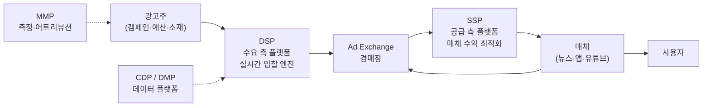

광고 기술(Ad Tech)은 처음 보면 용어가 산처럼 쌓여 있고, 어디서부터 봐야 할지 막막합니다. 이 글은 **완전 초보자**를 가정하고 30분 안에 전체 지도를 머릿속에 그릴 수 있도록 썼습니다. 수식은 쓰지 않고, **비유와 숫자 예시**로만 설명합니다. 끝까지 읽고 나면 이 블로그의 다른 포스트 30편이 "어느 방의 문인지" 보일 겁니다.

> 이 글은 내비게이션 허브입니다. 각 섹션 끝에 "자세히 보기" 링크가 있으니, 궁금한 주제로 바로 뛰어드세요.

---

## 0. 왜 광고 시스템은 이렇게 복잡한가

한 번의 광고 노출(Impression)에는 보통 **세 명의 이해관계자**가 있습니다.

| 주체 | 원하는 것 | 대표 지표 |
|---|---|---|
| **광고주**(Advertiser) — 예: 쿠팡, 배민 | 돈을 쓴 만큼 매출·설치·가입이 발생 | ROAS(광고수익률), CPA(전환당 비용) |
| **매체사**(Publisher) — 예: 유튜브, 뉴스 사이트, 게임 앱 | 같은 지면에서 최대한 많은 수익 | eCPM(1000회 노출당 매출) |
| **사용자**(User) — 여러분과 저 | 관련 있고 방해되지 않는 경험 | 클릭률, 이탈률 |

세 주체의 이해관계는 **항상 일치하지 않습니다**. 광고주는 싸게 노출하고 싶고, 매체는 비싸게 팔고 싶고, 사용자는 가능하면 광고를 피하고 싶죠. 광고 시스템의 본질은 이 **세 이해관계를 100ms(0.1초) 안에 균형 잡는 실시간 경매 시장**입니다.

---

## 1. 생태계 한 장 요약 — 5분

광고 요청 하나가 유저 화면에 닿기까지 타는 "지하철 노선도"입니다.

각 박스의 역할을 한 문장으로 풀어쓰면:

- **광고주(Advertiser)**: "이런 사람에게, 이 예산으로, 이 소재를 보여 주세요."
- **DSP(Demand-Side Platform, 수요 측 플랫폼)**: 광고주를 대신해 **경매에 참가하고 입찰가를 결정**하는 로봇. 네이버 GFA, 카카오모먼트, Google DV360, The Trade Desk가 DSP다.
- **Ad Exchange(광고 거래소)**: 수많은 DSP의 입찰을 받아 **1등을 고르는 경매장**.
- **SSP(Supply-Side Platform, 공급 측 플랫폼)**: 매체사를 대신해 **경매를 운영**하고 매체 수익을 최적화. Google Ad Manager, Magnite, PubMatic 등.
- **매체(Publisher)**: 광고 지면을 가진 앱/웹사이트.
- **사용자(User)**: 결국 광고를 보는 사람.
- **CDP(Customer Data Platform)**: 광고주의 **1st-party 데이터**(내 회원 DB)를 모으는 곳.
- **DMP(Data Management Platform)**: **3rd-party 데이터**(외부 데이터 브로커)를 모으는 곳. 쿠키리스 전환으로 영향력이 줄고 있다.
- **MMP(Mobile Measurement Partner)**: 광고가 실제로 설치/전환으로 이어졌는지 추적. AppsFlyer, Adjust 등.

> 한 번의 광고 요청이 발생하면, SSP가 경매를 열고 → Ad Exchange가 여러 DSP에게 "이 자리에 얼마 내실래요?"를 100ms 안에 물어보고 → 제일 높게 쓴 DSP의 소재가 사용자에게 보입니다. 이 모든 게 **사용자가 앱을 여는 순간**에 일어납니다.

### 더 깊이 보기
- 생태계 전체의 상세 지도와 pCTR 모델러 관점: [광고 기술 생태계 전체 지도](post.html?id=adtech-ecosystem-map)
- 위 다이어그램의 시퀀스 버전: [Ad Serving Flow — 광고가 유저에게 도달하는 전체 과정](post.html?id=ad-serving-flow)
- DSP/SSP/Exchange의 기술적 차이: [Ad Network vs Ad Exchange: 유통 구조의 진화](post.html?id=ad-network-vs-exchange)
- 네이버·카카오처럼 한 회사가 DSP부터 매체까지 다 갖는 경우: [Walled Garden](post.html?id=walled-garden)

---

## 2. 경매 — 10분

### 2.1 RTB(Real-Time Bidding, 실시간 입찰)

과거에는 광고가 **팔리지 않은 재고를 다음 광고 네트워크로 차례차례 넘기는 폭포수(Waterfall)** 방식이었습니다. 느리고 비효율적이었죠. 2010년대부터 표준이 된 방식은 **실시간 경매**입니다.

1. 사용자가 앱을 연다.
2. 매체의 SDK가 SSP에 "광고 하나 필요"라고 요청.
3. SSP가 Ad Exchange에 "Bid Request"를 던진다.
4. Exchange가 연결된 수백 개의 DSP에게 "이 유저에게 얼마 낼래?"를 물어본다.
5. DSP가 내부 ML 모델로 값을 계산해 답을 돌려준다 — **100ms 안에**.
6. 가장 높은 값을 쓴 DSP가 승자. 승자의 소재가 사용자 화면에 뜬다.

이 프로토콜의 표준이 **OpenRTB**입니다. 요청/응답 JSON 스펙이 정해져 있어서, DSP 하나를 만들면 수백 개 Exchange에 동시에 붙을 수 있습니다.

### 2.2 1st Price vs 2nd Price

경매에는 두 방식이 있습니다.

- **2nd Price(차가 경매)**: "내가 쓴 값" 중 1등이 이기지만, **실제 지불은 2등의 가격**. 전통적으로 공정하다는 평가. 1st Price가 표준이 되기 전까진 다수였다.
- **1st Price(최고가 경매)**: 1등이 **자기가 쓴 값 그대로 지불**. 2020년 전후로 업계 표준이 됨. 문제는 "진짜 가치보다 많이 쓰면 손해" — 그래서 **Bid Shading**이라는 기법이 필요하다.

**예시 숫자**
- 3개 DSP가 각각 `$5, $3, $2`를 쓴다.
- 2nd Price: 1등 DSP가 `$3 + 약간`만 낸다.
- 1st Price: 1등 DSP가 `$5`를 그대로 낸다. → 진짜 가치가 $4였다면 $1을 날린 셈.

### 2.3 eCPM — 서로 다른 가격체계를 한 통화로

같은 광고 자리에 `CPC $0.5(클릭당)` 광고와 `CPM $3(1000노출당)` 광고가 같이 응찰한다면? 누가 1등인지 어떻게 비교할까요. 답은 **eCPM(effective CPM, 실효 CPM)**입니다. 모든 광고를 "1000회 노출했을 때 기대 수익"으로 환산해 비교합니다.

- `eCPM_CPM = CPM 가격 그대로`
- `eCPM_CPC = CPC × 예상 CTR × 1000`

여기서 **예상 CTR(Click-Through Rate)이 곧 pCTR 모델의 출력**입니다. eCPM 공식 하나가 이 블로그 절반의 존재 이유죠.

### 2.4 Bid Shading — 1st Price 세상에서 살아남기

1st Price 경매에서 DSP는 "이길 최소 금액"을 알고 싶어합니다. 시장 분포를 보고 `내가 $3으로도 이길 수 있는데 굳이 $5 쓸 필요 없다`고 판단해 **입찰가를 깎는 기술**이 Bid Shading입니다. 경쟁 DSP의 입찰가는 볼 수 없고(Censored Data) 내가 진 경우엔 "상대가 얼마였는지"조차 모르기 때문에, 통계적 추정이 까다롭습니다.

### 더 깊이 보기
- 서로 다른 시장에서 eCPM이 어떻게 1등을 결정하는가: [eCPM과 광고 랭킹](post.html?id=ecpm-ranking)
- 1st Price 경매에서의 입찰가 최적화: [Bid Shading & Censored Data](post.html?id=bid-shading-censored)
- 하루 예산을 24시간 균등 분배하는 법: [Auto-Bidding & Budget Pacing](post.html?id=auto-bidding-pacing)
- 눈에 보이는 RTB 경매 시뮬레이터: [RTB Auction Simulator 데모](demo-rtb.html)

---

## 3. 랭킹 — 10분

### 3.1 "누구에게 보여줄까"는 두 단계로 푼다

광고 후보는 많으면 수백만 개입니다. 100ms 안에 하나를 고르려면 **다단 랭킹(Multi-Stage Ranking)**을 씁니다.

1. **Retrieval(후보 생성)**: 수백만 개에서 **수백 개**로 대충 줄이기. Two-Tower 임베딩, Rule-based 필터 등이 쓰인다.
2. **Ranking(정밀 평가)**: 수백 개를 정교한 모델로 스코어링해 1등을 고른다.

### 3.2 pCTR / pCVR — 스코어의 핵심

두 모델이 "누가 1등인지"를 결정합니다.

- **pCTR(predicted Click-Through Rate, 예측 클릭률)**: 이 유저가 이 광고를 클릭할 확률. 예: 3.2%.
- **pCVR(predicted Conversion Rate, 예측 전환율)**: 클릭 후에 실제로 구매/설치할 확률. 예: 5%.

**True Value(진짜 가치)** = `pCTR × pCVR × 전환가치(ConversionValue)`

만약 pCTR이 3.2%, pCVR이 5%, 전환가치가 $20이면,
`True Value = 0.032 × 0.05 × 20 = $0.032` (1회 노출당 기댓값)

여기에 Bid Shading으로 깎은 값이 최종 입찰가가 됩니다.

### 3.3 CTR 모델의 진화 — 한 줄씩

| 모델 | 핵심 아이디어 |
|---|---|
| **LR**(Logistic Regression) | 가장 단순. 선형 가중합 |
| **FM**(Factorization Machines) | 피처 2개씩의 곱(상호작용)을 임베딩으로 |
| **Wide & Deep** | LR(암기) + DNN(일반화)을 합친다 |
| **DeepFM** | FM + DNN을 한 모델에 |
| **DCN-v2**(Deep & Cross Network v2) | 고차 상호작용을 명시적으로 |
| **DIN**(Deep Interest Network) | 유저의 과거 행동 시퀀스에서 현재 광고에 관련된 부분만 "어텐션"으로 주목 |
| **DIEN**(Deep Interest Evolution Network) | DIN + GRU로 관심사의 "시간 진화"까지 |

### 3.4 알아야 할 함정 두 가지

- **Calibration(보정)**: AUC(순서 평가 지표)가 아무리 높아도 **출력 확률이 진짜 확률과 다르면 돈을 잃는다**. pCTR이 1%라고 나왔는데 실제로 0.5%라면, 입찰가가 2배 과대 계산되어 손해. Platt Scaling, Isotonic Regression 같은 기법으로 보정한다.
- **Position Bias(위치 편향)**: 1등 자리의 광고는 단지 **눈에 띄어서** 클릭률이 높은 거지, 진짜 더 좋은 광고여서가 아닐 수 있다. 이를 무시하면 모델이 "좋은 자리"만 학습하게 된다.

### 3.5 탐색 vs 활용(Exploration vs Exploitation)

완전히 새로 올라온 광고는 **학습 데이터가 없습니다**. 기존 모델은 "저걸 보여주면 뭐가 좋을지 모르겠다"고 판단해 아예 노출을 안 시킬 수도 있습니다. 이러면 영영 데이터가 안 쌓이죠. 그래서 일부 노출을 일부러 "모르는 광고"에 할당합니다 — 이것이 **밴딧(MAB) 알고리즘**의 영역입니다.

### 더 깊이 보기
- "돈만 보지 말고 유저 경험도" — 랭킹의 상위 개념: [LTV 기반 광고 랭킹](post.html?id=ltv-ad-ranking)
- CTR 모델의 전체 진화 가계도: [Deep CTR 모델의 진화 — LR에서 DIN까지](post.html?id=deep-ctr-models)
- 두 모델을 한 번에 학습하는 기법: [Multi-Task Learning — pCTR과 pCVR을 동시에](post.html?id=multi-task-learning)
- pCVR 특유의 지연 전환 문제: [pCVR 모델링 & Deduplication 이슈](post.html?id=my-markdown-post)
- AUC만 믿으면 왜 위험한가: [Calibration — AUC가 높아도 돈을 잃는 이유](post.html?id=calibration)
- 위치 편향을 제거하는 법: [Position Bias & Unbiased Learning to Rank](post.html?id=position-bias-ultr)
- 탐색/활용의 근본 딜레마: [탐색과 활용(Exploration & Exploitation)](post.html?id=exploration-exploitation)
- 밴딧 알고리즘 치트시트: [AdTech MAB Algorithm Collection](post.html?id=mab-summary)
- 수백만 후보를 10ms에 줄이는 Retrieval: [Two-Tower Model](post.html?id=two-tower-retrieval)

---

## 4. 측정 — 10분

### 4.1 광고의 "돈 단위"

| 약어 | 뜻 | 누가 쓰나 |
|---|---|---|
| **CPM**(Cost Per Mille) | 1,000회 노출당 비용 | 브랜드 광고, 매체 기준 |
| **CPC**(Cost Per Click) | 클릭 1회당 비용 | 검색광고, 퍼포먼스 |
| **CPA**(Cost Per Action) | 전환 1회당 비용(설치·구매 등) | 퍼포먼스 광고주 |
| **ROAS**(Return On Ad Spend) | 광고비 1원당 매출 | 이커머스 |
| **CTR**(Click-Through Rate) | 클릭률 = 클릭 ÷ 노출 | 모두 |
| **CVR**(Conversion Rate) | 전환율 = 전환 ÷ 클릭 | 퍼포먼스 |
| **VTR**(View-Through Rate) | 완주율(동영상) | 동영상 광고 |
| **Viewability** | "실제로 눈에 보인" 비율(IAB 기준: 픽셀 50% 이상이 1초 이상 노출) | 브랜드 |

**예시 숫자**
- 예산 100만 원 → 100만 노출 (CPM $1) → 1%가 클릭(CTR 1%) = 1만 클릭 → 5%가 전환(CVR 5%) = 500건 전환 → 전환당 가치가 5천 원이면 매출 250만 원 → **ROAS 2.5** (1원 써서 2.5원 번 셈)

### 4.2 어트리뷰션(Attribution) — 공로를 누구에게?

유저가 전환하기 전에 여러 광고를 봤습니다. 누구 덕분에 전환이 일어났을까요?

- **Last-click(마지막 클릭)**: 전환 직전 클릭에 100% 공로. 가장 단순하고 가장 많이 쓰이지만, 처음 관심을 끈 광고의 공은 사라진다.
- **Multi-Touch Attribution(MTA)**: 여러 터치포인트에 비율로 분배. Shapley Value, Markov Chain 기반.
- **Media Mix Modeling(MMM)**: 개별 유저 추적 없이 **시계열 회귀**로 채널별 기여 추정. iOS ATT 시대에 다시 주목받는다.

### 4.3 iOS ATT와 SKAdNetwork — "유저를 못 따라간다"

2021년 iOS 14.5부터 Apple이 **ATT(App Tracking Transparency)** 팝업을 의무화했습니다. 유저가 "허용" 누르지 않으면 IDFA(광고 식별자)가 0으로 찍혀 "이 사람이 그 사람인가"를 추적할 수 없습니다. 대신 Apple이 자체 포스트백 프로토콜 **SKAdNetwork**(최근은 AdAttributionKit)를 제공하는데, 개별 유저 단위가 아니라 **노이즈가 섞인 집계 데이터**로만 전환을 전달합니다. MMP와 퍼포먼스 광고의 측정 패러다임이 전부 다시 짜이는 중입니다.

### 4.4 로그 파이프라인 — 데이터는 어디서 오나

pCTR 모델을 학습하려면 **"누가 무엇을 언제 봤고, 무엇을 눌렀고, 얼마를 냈는지"** 로그가 있어야 합니다. 한 번의 광고 요청은 내부에 10종 가까운 로그를 만듭니다 — Request, Candidate, Impression, Click, Conversion, Attribution... 이걸 일관되게 묶는 게 실무에서 가장 어려운 부분 중 하나입니다.

### 더 깊이 보기
- 편향된 학습 데이터 보정법: [Negative Sampling & Sample Selection Bias](post.html?id=negative-sampling-bias)
- 광고 시스템 10종 로그의 역할: [광고 시스템 로그 파이프라인](post.html?id=ad-log-pipeline)
- Request Log부터 Candidate Log까지: [광고 로그 시스템 완전 해부](post.html?id=ad-log-system)
- 지연 전환을 처리하는 온라인 학습: [Online Learning & Delayed Feedback](post.html?id=online-learning-delayed-feedback)

---

## 5. 타겟팅 & 오디언스 — 5분

### 5.1 "누구에게"를 정하는 네 방식

| 종류 | 설명 | 예시 |
|---|---|---|
| **Demographic** | 성별·연령·거주지 같은 인구통계 | "25~34세 여성, 서울" |
| **Behavioral** | 최근 행동(웹·앱 이동, 구매) 기반 | "30일 내 운동화 검색" |
| **Contextual** | 현재 보고 있는 콘텐츠의 주제에 맞춤 | "여행 기사 옆에 호텔 광고" |
| **Retargeting** | 우리 사이트를 이미 방문한 유저에게 재노출 | "장바구니 이탈자" |

### 5.2 세그먼트와 Lookalike

- **Segmentation(세그멘테이션)**: 유저들을 **규칙 또는 ML 클러스터링**으로 묶어 같은 메시지를 보낸다.
- **Lookalike(유사 유저 확장)**: "전환한 100명의 유저"를 Seed로 두고, **임베딩/Propensity Score**로 수백만 유사 유저를 찾는다.

### 5.3 1st / 3rd Party 데이터와 쿠키리스 전환

- **1st-party 데이터**: 광고주가 자기 서비스에서 직접 수집(회원 DB, 구매 이력).
- **3rd-party 데이터**: 외부 브로커가 여러 사이트에서 긁어모은 데이터. 쿠키 기반이 많다.
- Chrome이 2024년 이후 **3rd-party 쿠키를 단계적으로 폐지** 중. 대안으로 Google이 내놓은 것이 **Privacy Sandbox**(Topics API, Protected Audience(예전 FLEDGE), Attribution Reporting). 핵심은 "개별 유저는 숨기고, 집계 수준에서만 광고가 작동"하는 방향이다.

### 더 깊이 보기
- 세그멘테이션 전체 체계: [오디언스 세그멘테이션](post.html?id=audience-segmentation)
- 전환 유저 100명에서 100만 유사 유저 발굴: [Lookalike Modeling](post.html?id=lookalike-modeling)

---

## 6. 인프라 — 3분 감만 잡기

광고 ML 시스템을 현실에서 돌리려면 **데이터·모델·서빙**이 유기적으로 맞물려야 합니다.

- **Feature Store(피처 저장소)**: 오프라인 배치 피처(어제의 CTR 등)와 스트리밍 피처(방금 클릭)가 한 곳에서 조회되도록 정리.
- **Real-Time Serving**: 모델 추론이 100ms 안에 끝나야 경매를 놓치지 않는다. Multi-Stage Ranking, Embedding Lookup 최적화, GPU/CPU 혼합 추론.
- **Online Learning**: 유저 행동은 매일 바뀌므로 모델도 주기적으로(혹은 스트리밍으로) 업데이트해야 한다. Delayed Feedback(전환까지 며칠 걸림) 처리는 이 블로그의 단골 주제다.

### 더 깊이 보기
- 데이터 공급망 전체 지도: [Feature Store & Real-Time Serving](post.html?id=feature-store-serving)
- 10ms 안에 수백 개 광고 스코어링: [광고 모델 서빙 아키텍처](post.html?id=model-serving-architecture)
- 8개 레이어로 본 Ad Tech 개발 맵: [Ad Tech 개발 레이어 맵](post.html?id=adtech-dev-layers)

---

## 7. 어디부터 읽을까 — 관심사별 추천 경로

| 나는 이런 사람 | 추천 순서 |
|---|---|
| **광고 기술 자체가 처음** | ① [생태계 지도](post.html?id=adtech-ecosystem-map) → ② [Ad Serving Flow](post.html?id=ad-serving-flow) → ③ [eCPM과 랭킹](post.html?id=ecpm-ranking) |
| **입찰/경매가 궁금** | ① [Ad Network vs Exchange](post.html?id=ad-network-vs-exchange) → ② [Bid Shading](post.html?id=bid-shading-censored) → ③ [Auto-Bidding & Pacing](post.html?id=auto-bidding-pacing) |
| **ML 모델링이 궁금** | ① [Deep CTR 모델 진화](post.html?id=deep-ctr-models) → ② [Calibration](post.html?id=calibration) → ③ [Multi-Task Learning](post.html?id=multi-task-learning) → ④ [Position Bias](post.html?id=position-bias-ultr) |
| **밴딧/탐색이 궁금** | ① [Exploration vs Exploitation](post.html?id=exploration-exploitation) → ② [MAB 치트시트](post.html?id=mab-summary) → ③ [UCB vs TS](post.html?id=ucb-vs-ts) → ④ [LinUCB](post.html?id=disjoint-linucb) |
| **인프라/서빙이 궁금** | ① [Feature Store](post.html?id=feature-store-serving) → ② [모델 서빙 아키텍처](post.html?id=model-serving-architecture) → ③ [Two-Tower Retrieval](post.html?id=two-tower-retrieval) → ④ [로그 파이프라인](post.html?id=ad-log-pipeline) |
| **타겟팅이 궁금** | ① [오디언스 세그멘테이션](post.html?id=audience-segmentation) → ② [Lookalike Modeling](post.html?id=lookalike-modeling) → ③ [Walled Garden](post.html?id=walled-garden) |

---

## 8. 30분 요약 — 한 장 정리

1. 광고 시스템은 **광고주·매체·사용자**의 이해관계를 100ms 안에 맞추는 실시간 경매.
2. 경로는 **광고주 → DSP → Ad Exchange → SSP → 매체 → 사용자**. 측정은 MMP·Attribution이 담당.
3. 경매는 대부분 **1st Price**. 그래서 DSP는 **Bid Shading**으로 입찰가를 깎는다.
4. 서로 다른 가격체계는 **eCPM**으로 환산해 비교하고, 여기에 **pCTR · pCVR**이 들어간다.
5. 랭킹은 **Retrieval(후보 생성) → Ranking(정밀 스코어링)** 2단. 모델은 LR부터 DIN·DIEN까지 진화했다.
6. 모델이 아무리 AUC가 높아도 **Calibration**이 안 되면 돈을 잃는다.
7. 새 광고/새 유저는 **탐색-활용 딜레마** → 밴딧 알고리즘으로 학습 데이터를 일부러 만든다.
8. 측정은 **CTR·CVR·ROAS** 같은 핵심 지표 + **Attribution(공로 배분)**. iOS ATT 이후 개별 추적이 어려워져 **SKAdNetwork / Privacy Sandbox**로 패러다임이 바뀌는 중.
9. 타겟팅은 **Demographic·Behavioral·Contextual·Retargeting** 네 축. 1st-party 데이터와 Lookalike의 중요성이 커지고 있다.
10. 모든 건 **Feature Store + Real-Time Serving + Online Learning** 인프라 위에서 돌아간다.

여기까지 왔다면 이 블로그의 30편 포스트가 "어느 방에 있는 문"인지 보일 겁니다. 위의 관심사별 추천 경로에서 한 편을 골라 들어가 보세요.

— 읽어주셔서 감사합니다. 궁금한 점이나 틀린 부분이 있다면 [GitHub](https://github.com/chkimsu/adtech-blog)로 알려주세요.
