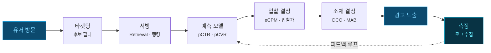
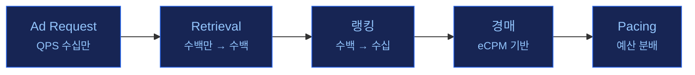
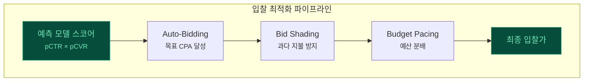
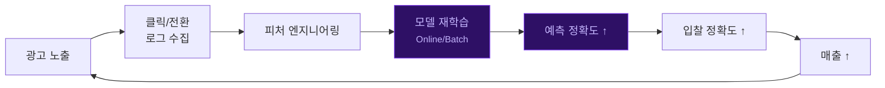

유저가 웹페이지를 열면, 광고 하나가 화면에 뜨기까지 **수십 밀리초**밖에 걸리지 않습니다. 하지만 그 짧은 순간 안에 광고 시스템은 **8개의 전문 레이어**를 통과하며, "누구에게", "무엇을", "얼마에" 보여줄지를 결정합니다.

이 포스트는 Ad Tech 개발의 전체 레이어를 하나의 지도로 펼쳐놓고, 각 레이어가 어떤 문제를 풀고 있는지, 그리고 서로 어떻게 연결되는지를 정리합니다.

---

> 위 다이어그램은 광고 요청이 유저에게 도달하기까지 통과하는 전체 파이프라인입니다. 아래에서 각 레이어를 하나씩 해부합니다.

---

| 레이어 | 핵심 질문 | 주요 기술 |
|--------|----------|----------|
| **타겟팅 · 오디언스** | 누구에게 보여줄까? | 세그먼트, Lookalike, 리타겟팅 |
| **광고 서빙** | 어떤 광고를 후보로? | Retrieval, 랭킹, 경매 |
| **예측 모델링** | 클릭/전환 확률은? | pCTR, pCVR, Calibration |
| **입찰 최적화** | 얼마에 입찰할까? | Auto-Bidding, Bid Shading |
| **소재 최적화** | 어떤 소재를 보여줄까? | DCO, MAB, 품질 심사 |
| **측정 · 어트리뷰션** | 효과가 있었는가? | 어트리뷰션, 증분성, Fraud |
| **인프라 · 플랫폼** | 이 모든 걸 어떻게 돌릴까? | 모델 서빙, 로그, 실험 플랫폼 |
| **프라이버시 · 규제** | 합법적으로 할 수 있는가? | 쿠키리스, CMP, 차등 프라이버시 |

---

## 1. 전체 요청 흐름

광고 요청 하나가 유저에게 도달하기까지의 파이프라인입니다:

각 단계에서 내려지는 핵심 결정:

1. **타겟팅**: 수천만 유저 중 이 광고를 볼 자격이 있는 후보군 필터링
2. **서빙**: 수백만 광고 후보에서 수백 개를 검색(Retrieval)하고, 랭킹으로 정렬
3. **예측 모델**: 각 후보 광고의 클릭 확률(pCTR)과 전환 확률(pCVR)을 스코어링
4. **입찰 결정**: 예측값 기반으로 eCPM을 계산하고, 경매에서 최적 입찰가를 결정
5. **소재 결정**: 낙찰된 광고의 어떤 소재 조합(제목 × 이미지 × CTA)을 보여줄지 결정
6. **측정**: 노출/클릭/전환 로그를 수집하여 모델 학습 데이터로 피드백

> 이 전체 과정이 **10~100ms** 안에 일어납니다.

---

## 2. 타겟팅 · 오디언스 — 누구에게 보여줄까

타겟팅 레이어는 "이 광고를 누구에게 보여줄 것인가"를 결정합니다. 전체 유저 풀에서 광고주의 목표에 맞는 후보 유저를 필터링하는 첫 번째 관문입니다.

### 핵심 컴포넌트

| 컴포넌트 | 설명 |
|---------|------|
| **오디언스 세그먼트** | 유저를 관심사/행동/인구통계 기반으로 그룹화. 예: "30대 남성 + 최근 운동화 검색" |
| **Lookalike 확장** | 전환 유저(시드)와 유사한 신규 유저를 임베딩 유사도로 발굴. Facebook Lookalike이 대표적 |
| **리타겟팅** | 사이트 방문/장바구니 이탈 유저를 추적하여 재노출. 가장 높은 전환율을 보이는 전략 |
| **컨텍스트 타겟팅** | 유저가 아닌 콘텐츠(기사/영상)의 맥락을 분석하여 매칭. 쿠키리스 시대에 부상 |
| **Position Bias 보정** | 광고 위치에 따른 클릭률 편향을 제거하여 공정한 랭킹 보장 |

**관련 포스트:**
- [Position Bias & Unbiased Learning to Rank](post.html?id=position-bias-ultr) — 위치 편향 보정 기법
- [Two-Tower Model & 광고 후보 생성](post.html?id=two-tower-retrieval) — 유저-광고 매칭의 기반 기술

---

## 3. 광고 서빙 — 요청 처리 파이프라인

서빙 레이어는 광고 요청이 들어왔을 때 "어떤 광고를 보여줄지"를 결정하는 핵심 파이프라인입니다. 수백만 광고 중에서 최적의 후보를 찾아 경매까지 진행합니다.

### Multi-Stage Ranking

실시간 서빙에서 수백만 광고를 모두 스코어링하는 것은 불가능합니다. 그래서 **단계적으로 후보를 줄여나가는** Multi-Stage Ranking 구조를 사용합니다:

| 단계 | 후보 수 | 모델 복잡도 | 지연 시간 |
|------|---------|-----------|----------|
| Retrieval | 수백만 → 수백 | 가벼운 (Two-Tower, ANN) | ~5ms |
| Pre-Ranking | 수백 → 수십 | 중간 (경량 DNN) | ~3ms |
| Ranking | 수십 → Top K | 무거운 (DeepFM, DIN) | ~10ms |
| 경매 | Top K → 낙찰 | eCPM 계산 | ~1ms |

**관련 포스트:**
- [Ad Serving Flow: 광고가 유저에게 도달하는 전체 과정](post.html?id=ad-serving-flow)
- [광고 모델 서빙 아키텍처: 10ms 안에 수백 개 광고를 스코어링하는 법](post.html?id=model-serving-architecture)

---

## 4. 예측 모델링 — 성과 예측 ML

예측 모델링은 광고 시스템의 **두뇌**입니다. "이 유저가 이 광고를 클릭할 확률은 얼마인가?"를 예측하여 eCPM 계산과 입찰의 근거를 제공합니다.

### 핵심 컴포넌트

| 컴포넌트 | 역할 |
|---------|------|
| **pCTR 예측** | 클릭 확률 예측. LR → FM → DeepFM → DIN으로 진화. 광고 수익의 직접적 근거 |
| **pCVR 예측** | 전환(구매/가입) 확률 예측. 지연 피드백(Delayed Feedback) 처리가 핵심 난제 |
| **Calibration** | 모델의 예측 확률을 실제 확률에 맞게 보정. AUC가 높아도 보정 없으면 돈을 잃음 |
| **Multi-Task Learning** | pCTR + pCVR을 동시 학습하여 Sample Selection Bias 해결 (ESMM, MMoE, PLE) |
| **Feature Store** | Batch/Streaming/Real-Time 피처를 통합 관리하여 10ms 안에 모델에 공급 |

광고에서 eCPM(수익 기대값)은 다음과 같이 계산됩니다:

$$\text{eCPM} = \text{pCTR} \times \text{pCVR} \times \text{Bid} \times 1000$$

이 수식에서 pCTR과 pCVR의 **정확도가 곧 매출**입니다.

**관련 포스트:**
- [Deep CTR 모델의 진화: LR에서 DIN까지](post.html?id=deep-ctr-models)
- [Calibration: AUC가 높아도 돈을 잃는 이유](post.html?id=calibration)
- [Multi-Task Learning: pCTR과 pCVR을 동시에 학습하면 왜 더 좋은가](post.html?id=multi-task-learning)
- [Feature Store & Real-Time Serving](post.html?id=feature-store-serving)

---

## 5. 입찰 최적화 — 얼마에 입찰할까

예측 모델이 "이 광고가 얼마나 좋은지"를 알려준다면, 입찰 최적화는 "그래서 얼마를 써야 하는지"를 결정합니다. 광고주의 목표(CPA, ROAS)를 달성하면서 예산을 최적으로 분배하는 레이어입니다.

### 핵심 컴포넌트

| 컴포넌트 | 설명 |
|---------|------|
| **Auto-Bidding** | 광고주가 목표 CPA/ROAS만 설정하면 시스템이 자동으로 입찰가 결정. PID Controller → Lagrangian Dual → RL로 진화 |
| **Bid Shading** | 1st Price 경매에서 과다 지불을 방지. True Value보다 낮게 입찰하여 Surplus 극대화 |
| **Bid Landscape** | 입찰가별 낙찰률/비용 곡선을 모델링. Censored Data에서 시장 가격 분포 추정이 핵심 |
| **Budget Pacing** | 일 예산을 하루 전체에 걸쳐 균등 분배. 아침에 예산을 다 써버리는 문제 방지 |

**관련 포스트:**
- [Auto-Bidding & Budget Pacing: 일 예산 제약 하에서 입찰 최적화하는 법](post.html?id=auto-bidding-pacing)
- [Bid Shading & Censored Data: 1st Price Auction에서 최적 입찰가를 찾는 법](post.html?id=bid-shading-censored)

---

## 6. 소재 최적화 — 무엇을 보여줄까

같은 상품이라도 **어떤 소재로 보여주느냐**에 따라 CTR이 2~5배 차이 납니다. 소재 최적화 레이어는 유저별로 최적의 소재 조합을 결정합니다.

### 핵심 컴포넌트

| 컴포넌트 | 설명 |
|---------|------|
| **DCO (Dynamic Creative Optimization)** | 제목 × 이미지 × CTA × 배경색 등 요소를 조합하여 유저별 맞춤 소재 자동 생성 |
| **A/B · MAB** | 소재 변형 간 성과 비교. MAB(밴딧)를 쓰면 탐색과 활용을 동시에 수행하여 A/B 대비 기회 비용 절감 |
| **소재 피처 추출** | 이미지 임베딩(ResNet 등), 텍스트 임베딩으로 소재의 특성을 수치화하여 성과 예측에 활용 |
| **품질 심사** | 정책 위반 소재(성인물, 허위 광고 등)를 ML 기반으로 자동 필터링 |

**관련 포스트:**
- [탐색과 활용(Exploration & Exploitation): 광고 시스템의 근본적 딜레마](post.html?id=exploration-exploitation) — MAB 기반 소재 최적화의 이론적 배경

---

## 7. 측정 · 어트리뷰션 — 효과가 있었는가

광고를 노출한 후, **실제로 효과가 있었는지** 측정하는 레이어입니다. 이 레이어의 데이터가 예측 모델을 업데이트하는 **피드백 루프**의 출발점이기도 합니다.

### 핵심 컴포넌트

| 컴포넌트 | 설명 |
|---------|------|
| **어트리뷰션** | 전환에 기여한 터치포인트를 식별. Last Click → Multi-Touch → Data-Driven 모델로 진화 |
| **증분성 테스트 (Incrementality)** | "광고가 없었어도 전환했을까?"에 대한 인과 추론. 가장 정직한 광고 효과 측정 |
| **Viewability** | 광고가 실제로 유저의 화면에 보였는지 측정. "노출"과 "실제 시청"은 다름 |
| **Fraud Detection** | 봇 트래픽, 클릭 팜 등 무효 트래픽 탐지. 광고비 낭비 방지 |

### 피드백 루프

측정 데이터는 단순히 보고서로 끝나지 않습니다. **예측 모델의 학습 데이터**로 되돌아가는 피드백 루프가 광고 시스템의 핵심 동력입니다:

이 루프가 빠르게 돌수록(모델이 빨리 업데이트될수록) 시스템 성능이 향상됩니다. 이것이 [Online Learning](post.html?id=online-learning-delayed-feedback)이 중요한 이유입니다.

---

## 8. 크로스커팅 레이어

위 6개 레이어가 요청 흐름의 "단계"라면, 아래 2개 레이어는 **모든 단계에 걸쳐 적용되는** 크로스커팅 관심사입니다.

### 인프라 · 플랫폼

| 컴포넌트 | 역할 |
|---------|------|
| **실시간 서빙 인프라** | 수십만 QPS를 수십ms 이내에 처리하는 고성능 시스템 |
| **모델 서빙** | ML 모델을 온라인 추론에 최적화 (TF Serving, Triton, ONNX Runtime) |
| **Online Learning** | 실시간 피드백으로 모델을 점진적 업데이트. Concept Drift 대응 |
| **로그 파이프라인** | 노출/클릭/전환 이벤트를 수집·조인하여 학습 데이터 생성 |
| **실험 플랫폼** | A/B 테스트 인프라. 새로운 모델·전략의 인과적 효과 검증 |

### 프라이버시 · 규제

| 컴포넌트 | 역할 |
|---------|------|
| **쿠키리스 대응** | 3rd Party Cookie 폐지 후 대안 — Topics API, Attribution Reporting API, FLEDGE |
| **동의 관리 (CMP)** | GDPR/CCPA 준수를 위한 유저 동의 수집·관리 |
| **차등 프라이버시** | 집계 데이터에 노이즈를 추가하여 개인 식별 방지 |

프라이버시 규제는 타겟팅(유저 데이터 활용), 측정(크로스사이트 추적), 예측 모델(학습 데이터 범위)까지 **모든 레이어에 직접적 영향**을 미칩니다.

**관련 포스트:**
- [Online Learning & Delayed Feedback: 광고 모델은 왜 매일 낡아지는가](post.html?id=online-learning-delayed-feedback)

---

## 9. 어디서부터 시작할까?

이 블로그의 기존 포스트를 레이어별로 정리하면:

### 예측 모델링 (가장 많은 포스트)
- [Deep CTR 모델의 진화](post.html?id=deep-ctr-models) — CTR 예측 모델 계보
- [Calibration: AUC가 높아도 돈을 잃는 이유](post.html?id=calibration) — 확률 보정
- [Multi-Task Learning](post.html?id=multi-task-learning) — pCTR + pCVR 동시 학습
- [Negative Sampling & Bias](post.html?id=negative-sampling-bias) — 학습 데이터 편향

### 입찰 최적화
- [Auto-Bidding & Budget Pacing](post.html?id=auto-bidding-pacing) — 자동 입찰의 전체 그림
- [Bid Shading & Censored Data](post.html?id=bid-shading-censored) — 1st Price 경매 최적화
- [eCPM과 광고 랭킹](post.html?id=ecpm-ranking) — 랭킹 기준의 이해

### 광고 생태계
- [pCTR 모델러를 위한 광고 기술 생태계 전체 지도](post.html?id=adtech-ecosystem-map) — 생태계 개관
- [Ad Serving Flow](post.html?id=ad-serving-flow) — 서빙 흐름
- [Walled Garden](post.html?id=walled-garden) — 폐쇄형 vs 개방형 생태계

### 밴딧 · 개인화
- [탐색과 활용 통합 가이드](post.html?id=exploration-exploitation) — MAB 이론과 실무
- [UCB 알고리즘 패밀리](post.html?id=ucb-family) — UCB1 vs LinUCB
- [MAB Algorithm Collection](post.html?id=mab-summary) — 밴딧 알고리즘 총정리

### 인프라
- [광고 모델 서빙 아키텍처](post.html?id=model-serving-architecture) — 10ms 서빙의 비밀
- [Feature Store & Real-Time Serving](post.html?id=feature-store-serving) — 데이터 공급망
- [Online Learning & Delayed Feedback](post.html?id=online-learning-delayed-feedback) — 실시간 모델 업데이트

> 광고 시스템에 처음 입문한다면 [생태계 전체 지도](post.html?id=adtech-ecosystem-map)에서 큰 그림을 잡고, 관심 있는 레이어의 포스트로 깊이 들어가는 것을 추천합니다.
