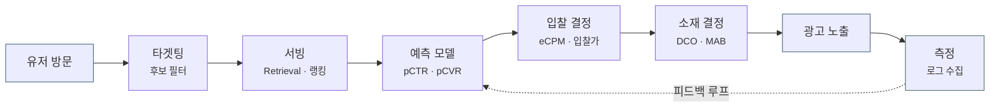
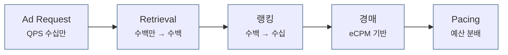
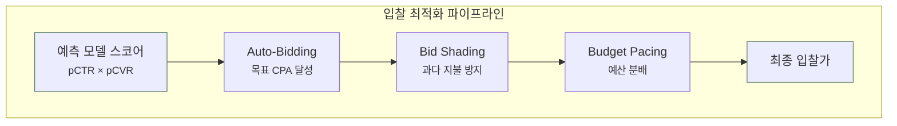
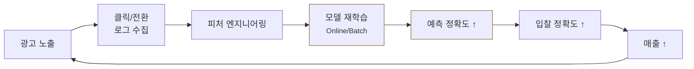

유저가 웹페이지를 열면, 광고 하나가 화면에 뜨기까지 **수십 밀리초**밖에 걸리지 않습니다. 하지만 그 짧은 순간 안에 광고 시스템은 **8개의 전문 레이어**를 통과하며, "누구에게", "무엇을", "얼마에" 보여줄지를 결정합니다.

이 글은 Ad Tech 개발의 전체 레이어를 하나의 지도로 펼칩니다. 각 레이어가 어떤 문제를 푸는지, 그리고 서로 어떻게 연결되는지를 정리합니다.

회사와 회사 사이의 관계를 보고 싶다면 [광고 생태계 전체 지도](post.html?id=adtech-ecosystem-map)를 보세요. 그 글이 "누가 누구와 무엇을 주고받나"라면, 이 글은 **"엔지니어가 무엇을 만드나"** 입니다.

---


> 위 다이어그램은 광고 요청이 유저에게 도달하기까지 통과하는 전체 파이프라인입니다. 아래에서 각 레이어를 하나씩 해부합니다.

---

| 레이어 | 핵심 질문 | 주요 기술 |
|--------|----------|----------|
| **타겟팅 · 오디언스** | 누구에게 보여줄까? | 세그먼트, Lookalike, 리타겟팅 |
| **광고 서빙** | 어떤 광고를 후보로? | Retrieval, 랭킹, 경매 |
| **예측 모델링** | 클릭/전환 확률은? | pCTR, pCVR, Calibration |
| **입찰 최적화** | 얼마에 입찰할까? | Auto-Bidding, Bid Shading |
| **소재 최적화** | 어떤 소재를 보여줄까? | DCO, MAB, 품질 심사 |
| **측정 · 어트리뷰션** | 효과가 있었는가? | 어트리뷰션, 증분성, Fraud |
| **인프라 · 플랫폼** | 이 모든 걸 어떻게 돌릴까? | 모델 서빙, 로그, 실험 플랫폼 |
| **프라이버시 · 규제** | 합법적으로 할 수 있는가? | 쿠키리스, CMP, 차등 프라이버시 |

---

## 1. 전체 요청 흐름

광고 요청 하나가 유저에게 도달하기까지의 파이프라인입니다:


```mermaid
graph LR
    A["유저 방문"] --> B["타겟팅<br/><small>후보 필터</small>"]
    B --> C["서빙<br/><small>Retrieval · 랭킹</small>"]
    C --> D["예측 모델<br/><small>pCTR · pCVR</small>"]
    D --> E["입찰 결정<br/><small>eCPM · 입찰가</small>"]
    E --> F["소재 결정<br/><small>DCO · MAB</small>"]
    F --> G["광고 노출"]
    G --> H["측정<br/><small>로그 수집</small>"]
    H -.->|"피드백 루프"| D

    style A stroke:#4a6b8a
    style G stroke:#4a6b8a
    style H stroke:#54736f
```

각 단계에서 내려지는 핵심 결정:

1. **타겟팅**: 수천만 유저 중 이 광고를 볼 자격이 있는 후보군 필터링
2. **서빙**: 수백만 광고 후보에서 수백 개를 검색(Retrieval)하고, 랭킹으로 정렬
3. **예측 모델**: 각 후보 광고의 클릭 확률(pCTR)과 전환 확률(pCVR)을 스코어링
4. **입찰 결정**: 예측값 기반으로 eCPM을 계산하고, 경매에서 최적 입찰가를 결정
5. **소재 결정**: 낙찰된 광고의 어떤 소재 조합(제목 × 이미지 × CTA)을 보여줄지 결정
6. **측정**: 노출/클릭/전환 로그를 수집하여 모델 학습 데이터로 피드백

> 이 전체 과정이 **10~100ms** 안에 일어납니다.

---

## 2. 타겟팅 · 오디언스 — 누구에게 보여줄까 [무대: 닫힌 생태계]

타겟팅 레이어는 "이 광고를 누구에게 보여줄 것인가"를 결정합니다. 전체 유저 풀에서 광고주의 목표에 맞는 후보 유저를 필터링하는 첫 번째 관문입니다.

이 레이어가 두 무대에서 가장 크게 갈립니다. **재료의 확실성이 다릅니다.**

담장 안(네이버·카카오)은 로그인 ID가 있어 "이 사람이 이 사람"이라는 걸 확정할 수 있습니다. 기기를 바꿔도 같은 사람으로 이어지고, 세그먼트를 실시간으로 갱신해 바로 랭킹에 반영합니다. 열린 RTB는 쿠키·기기 ID 같은 확률적 신호에 기대야 하고, 크로스디바이스 매칭 정확도가 60~70%에 그칩니다. 세그먼트를 데이터 업체에서 사 와야 하는 경우도 많습니다.

9절에서 보겠지만 타겟팅 오차는 **다음 학습으로 되돌아옵니다.** 그래서 재료가 부실한 쪽은 그 부실함이 시간이 갈수록 누적됩니다.

### 핵심 컴포넌트

| 컴포넌트 | 설명 |
|---------|------|
| **오디언스 세그먼트** | 유저를 관심사/행동/인구통계 기반으로 그룹화. 예: "30대 남성 + 최근 운동화 검색" |
| **Lookalike 확장** | 전환 유저(시드)와 유사한 신규 유저를 임베딩 유사도로 발굴. Facebook Lookalike이 대표적 |
| **리타겟팅** | 사이트 방문/장바구니 이탈 유저를 추적하여 재노출. 가장 높은 전환율을 보이는 전략 |
| **컨텍스트 타겟팅** | 유저가 아닌 콘텐츠(기사/영상)의 맥락을 분석하여 매칭. 쿠키리스 시대에 부상 |
| **Position Bias 보정** | 광고 위치에 따른 클릭률 편향을 제거하여 공정한 랭킹 보장 |

**관련 포스트:**
- [오디언스 세그멘테이션](post.html?id=audience-segmentation) — Demographic, Behavioral, RFM, ML Clustering 기반 세그먼트 설계
- [Lookalike Modeling](post.html?id=lookalike-modeling) — Seed에서 유사 유저를 발굴하는 Embedding/Propensity/Graph 접근법
- [Position Bias](post.html?id=position-bias-ultr) — 위치 편향 보정 기법
- [Two-Tower Retrieval](post.html?id=two-tower-retrieval) — 유저-광고 매칭의 기반 기술

---

## 3. 광고 서빙 — 요청 처리 파이프라인

서빙 레이어는 광고 요청이 들어왔을 때 "어떤 광고를 보여줄지"를 결정하는 핵심 파이프라인입니다. 수백만 광고 중에서 최적의 후보를 찾아 경매까지 진행합니다.


```mermaid
graph LR
    A["Ad Request<br/><small>QPS 수십만</small>"] --> B["Retrieval<br/><small>수백만 → 수백</small>"]
    B --> C["랭킹<br/><small>수백 → 수십</small>"]
    C --> D["경매<br/><small>eCPM 기반</small>"]
    D --> E["Pacing<br/><small>예산 분배</small>"]

    style A stroke:#4a6b8a
    style B stroke:#4a6b8a
    style C stroke:#4a6b8a
    style D stroke:#4a6b8a
    style E stroke:#4a6b8a
```

### Multi-Stage Ranking

실시간 서빙에서 수백만 광고를 모두 스코어링하는 것은 불가능합니다. 그래서 **단계적으로 후보를 줄여나가는** Multi-Stage Ranking 구조를 사용합니다:

| 단계 | 후보 수 | 모델 복잡도 | 지연 시간 |
|------|---------|-----------|----------|
| Retrieval | 수백만 → 수백 | 가벼운 (Two-Tower, ANN) | ~5ms |
| Pre-Ranking | 수백 → 수십 | 중간 (경량 DNN) | ~3ms |
| Ranking | 수십 → Top K | 무거운 (DeepFM, DIN) | ~10ms |
| 경매 | Top K → 낙찰 | eCPM 계산 | ~1ms |

**관련 포스트:**
- [Ad Serving Flow: 후보 12만 건이 800건으로 좁혀지는 순서](post.html?id=ad-serving-flow)
- [광고 모델 서빙 아키텍처: 10ms 안에 수백 개 광고를 스코어링하는 법](post.html?id=model-serving-architecture)

---

## 4. 예측 모델링 — 성과 예측 ML

예측 모델링은 광고 시스템의 **두뇌**입니다. "이 유저가 이 광고를 클릭할 확률은 얼마인가?"를 예측하여 eCPM 계산과 입찰의 근거를 제공합니다.

### 핵심 컴포넌트

| 컴포넌트 | 역할 |
|---------|------|
| **pCTR 예측** | 클릭 확률 예측. LR → FM → DeepFM → DIN으로 진화. 광고 수익의 직접적 근거 |
| **pCVR 예측** | 전환(구매/가입) 확률 예측. 지연 피드백(Delayed Feedback) 처리가 핵심 난제 |
| **Calibration** | 모델의 예측 확률을 실제 확률에 맞게 보정. AUC가 높아도 보정 없으면 돈을 잃음 |
| **Multi-Task Learning** | pCTR + pCVR을 동시 학습하여 Sample Selection Bias 해결 (ESMM, MMoE, PLE) |
| **Feature Store** | Batch/Streaming/Real-Time 피처를 통합 관리하여 10ms 안에 모델에 공급 |

광고에서 eCPM(수익 기대값)은 다음과 같이 계산됩니다:

$$\text{eCPM} = \text{pCTR} \times \text{pCVR} \times \text{Bid} \times 1000$$

이 수식에서 pCTR과 pCVR의 **정확도가 곧 매출**입니다.

**관련 포스트:**
- [Deep CTR 모델의 진화: LR에서 DIN까지](post.html?id=deep-ctr-models)
- [Calibration: AUC가 높아도 돈을 잃는 이유](post.html?id=calibration)
- [Multi-Task Learning: pCTR과 pCVR을 같이 배우면 왜 더 좋은가](post.html?id=multi-task-learning)
- [Feature Store](post.html?id=feature-store-serving)

---

## 5. 입찰 최적화 — 얼마에 입찰할까

예측 모델이 "이 광고가 얼마나 좋은지"를 알려준다면, 입찰 최적화는 "그래서 얼마를 써야 하는지"를 결정합니다. 광고주의 목표(CPA, ROAS)를 달성하면서 예산을 최적으로 분배하는 레이어입니다.

### 핵심 컴포넌트

| 컴포넌트 | 설명 |
|---------|------|
| **Auto-Bidding** | 광고주가 목표 CPA/ROAS만 설정하면 시스템이 자동으로 입찰가 결정. PID Controller → Lagrangian Dual → RL로 진화 |
| **Bid Shading** | 1st Price 경매에서 과다 지불을 방지. True Value보다 낮게 입찰하여 Surplus 극대화 |
| **Bid Landscape** | 입찰가별 낙찰률/비용 곡선을 모델링. Censored Data에서 시장 가격 분포 추정이 핵심 |
| **Budget Pacing** | 일 예산을 하루 전체에 걸쳐 균등 분배. 아침에 예산을 다 써버리는 문제 방지 |


```mermaid
graph TD
    subgraph "입찰 최적화 파이프라인"
        A["예측 모델 스코어<br/><small>pCTR × pCVR</small>"]
        B["Auto-Bidding<br/><small>목표 CPA 달성</small>"]
        C["Bid Shading<br/><small>과다 지불 방지</small>"]
        D["Budget Pacing<br/><small>예산 분배</small>"]
        E["최종 입찰가"]
    end

    A --> B
    B --> C
    C --> D
    D --> E

    style A stroke:#5b7d6a
    style E stroke:#5b7d6a
```

**관련 포스트:**
- [Auto-Bidding & Budget Pacing: 일 예산 제약 하에서 입찰 최적화하는 법](post.html?id=auto-bidding-pacing)
- [Bid Shading: 1st Price 경매에서 얼마를 깎아 부를까](post.html?id=bid-shading-censored)

---

## 6. 소재 최적화 — 무엇을 보여줄까

같은 상품이라도 **어떤 소재로 보여주느냐**에 따라 CTR이 2~5배 차이 납니다. 소재 최적화 레이어는 유저별로 최적의 소재 조합을 결정합니다.

### 핵심 컴포넌트

| 컴포넌트 | 설명 |
|---------|------|
| **DCO (Dynamic Creative Optimization)** | 제목 × 이미지 × CTA × 배경색 등 요소를 조합하여 유저별 맞춤 소재 자동 생성 |
| **A/B · MAB** | 소재 변형 간 성과 비교. MAB(밴딧)를 쓰면 탐색과 활용을 동시에 수행하여 A/B 대비 기회 비용 절감 |
| **소재 피처 추출** | 이미지 임베딩(ResNet 등), 텍스트 임베딩으로 소재의 특성을 수치화하여 성과 예측에 활용 |
| **품질 심사** | 정책 위반 소재(성인물, 허위 광고 등)를 ML 기반으로 자동 필터링 |

### 왜 사람이 다 못 고르나 — 조합을 세어 보기

"조합을 다 만들어서 A/B로 재보면 되지 않나?"라는 생각이 자연스럽습니다. 왜 안 통하는지 숫자로 봅시다. 가상 데이터입니다.

```python
# 소재 조합은 왜 사람이 다 못 고르나 — 개수를 세어 본다.
#
# DCO는 제목·이미지·CTA·배경색을 조합해 소재를 자동 생성한다.
# "그냥 다 만들어서 A/B 돌리면 되지 않나?"라는 생각이 왜 안 통하는지 계산해 보자.

import random
random.seed(42)

SLOTS = {"제목": 5, "이미지": 4, "CTA 문구": 3, "배경색": 3}

combos = 1
parts = []
for name, n in SLOTS.items():
    combos *= n
    parts.append(f"{name} {n}")
print("소재 요소:", " × ".join(parts))
print(f"만들 수 있는 조합  {combos}개")
print()

# ── A/B 테스트로 전부 검증하려면 노출이 몇 번 필요한가 ──
# 기준 CTR 2%에서 상대 10% 차이를 검출하려면 한 변형당 약 8만 노출이 필요하다
# (RCT 글의 표본 크기 계산과 같은 뼈대다).
PER_VARIANT = 80_680
DAILY_IMPRESSIONS = 500_000

print(f"A/B로 전 조합 검증하려면 (변형당 {PER_VARIANT:,}회 필요, 하루 {DAILY_IMPRESSIONS:,}회 노출)")
for label, slots in [("작게 잡아도", SLOTS), ("실무 규모라면", {"제목": 8, "이미지": 6, "CTA 문구": 4, "배경색": 3})]:
    n = 1
    for v in slots.values():
        n *= v
    need = n * PER_VARIANT
    d = need / DAILY_IMPRESSIONS
    print(f"  {label:<10} 조합 {n:>4}개 → {need:>12,}회 → {d:>5.0f}일")
print("  → 캠페인이 보통 2~4주인데, 작게 잡아도 그 기간을 다 써야 첫 결론이 나온다.")
print("  → 요소를 조금만 늘리면 석 달이 넘는다. 그동안 얻는 정보는 0이다.")
print()

# ── 밴딧은 왜 다른가 ──
# 나쁜 조합을 일찍 접고 좋은 조합에 노출을 몰아준다.
# 전 조합을 '검증'하지 않고, 좋은 걸 '찾아' 쓴다.
true_ctr = {}
for i in range(combos):
    # 조합마다 진짜 CTR을 만든다. 대부분 평범하고 몇 개만 좋다(현실의 모양).
    true_ctr[i] = max(0.002, random.gauss(0.020, 0.006))
best_i = max(true_ctr, key=true_ctr.get)

def run_ab(impressions):
    """모든 조합에 노출을 똑같이 나눈다."""
    per = impressions // combos
    return sum(true_ctr[i] * per for i in range(combos))

def run_bandit(impressions, explore_share=0.15):
    """앞부분만 탐색에 쓰고, 그 뒤엔 그때까지 1등에 몰아준다."""
    explore = int(impressions * explore_share)
    per = explore // combos
    clicks = sum(true_ctr[i] * per for i in range(combos))
    # 탐색 구간의 관측으로 1등을 고른다(노출이 적으면 잘못 고를 수도 있다)
    observed = {i: random.binomialvariate(per, true_ctr[i]) if hasattr(random, 'binomialvariate')
                   else sum(1 for _ in range(per) if random.random() < true_ctr[i])
                for i in range(combos)}
    picked = max(observed, key=observed.get)
    clicks += true_ctr[picked] * (impressions - explore)
    return clicks, picked

TOTAL = 3_000_000
ab = run_ab(TOTAL)
bandit, picked = run_bandit(TOTAL)
print(f"노출 {TOTAL:,}회를 쓸 때 클릭 수")
print(f"  A/B (전 조합 균등)   {ab:>10,.0f}회")
print(f"  밴딧 (탐색 15%)      {bandit:>10,.0f}회   {(bandit/ab-1)*100:+.1f}%")
print(f"  진짜 1등 조합 #{best_i} (CTR {true_ctr[best_i]:.2%})"
      f" / 밴딧이 고른 조합 #{picked} (CTR {true_ctr[picked]:.2%})")
print()
print("→ 조합이 180개면 A/B로는 다 못 재본다. 시간이 안 된다.")
print("→ 밴딧은 '전부 검증'을 포기하고 '좋은 걸 빨리 쓰기'를 택한다.")
print("→ 소재 레이어에서 밴딧이 잘 통하는 이유는, 실패가 다음 학습을 오염시키지 않기 때문이다.")

# 출력:
# 소재 요소: 제목 5 × 이미지 4 × CTA 문구 3 × 배경색 3
# 만들 수 있는 조합  180개
#
# A/B로 전 조합 검증하려면 (변형당 80,680회 필요, 하루 500,000회 노출)
#   작게 잡아도     조합  180개 →   14,522,400회 →    29일
#   실무 규모라면    조합  576개 →   46,471,680회 →    93일
#   → 캠페인이 보통 2~4주인데, 작게 잡아도 그 기간을 다 써야 첫 결론이 나온다.
#   → 요소를 조금만 늘리면 석 달이 넘는다. 그동안 얻는 정보는 0이다.
#
# 노출 3,000,000회를 쓸 때 클릭 수
#   A/B (전 조합 균등)       62,111회
#   밴딧 (탐색 15%)          87,027회   +40.1%
#   진짜 1등 조합 #53 (CTR 3.40%) / 밴딧이 고른 조합 #132 (CTR 3.05%)
#
# → 조합이 180개면 A/B로는 다 못 재본다. 시간이 안 된다.
# → 밴딧은 '전부 검증'을 포기하고 '좋은 걸 빨리 쓰기'를 택한다.
# → 소재 레이어에서 밴딧이 잘 통하는 이유는, 실패가 다음 학습을 오염시키지 않기 때문이다.
```

두 가지가 드러납니다.

첫째, **A/B로는 시간이 안 됩니다.** 요소를 작게 잡아도 조합이 180개고, 변형마다 8만 노출이 필요하니 29일이 걸립니다. 캠페인이 보통 2~4주인데 그 기간을 다 써야 첫 결론이 나옵니다. 요소를 조금만 늘려 576개가 되면 93일입니다. **그동안 얻는 정보는 0입니다.**

둘째, **밴딧이 이깁니다.** 같은 노출 300만 회로 클릭이 6.2만에서 8.7만으로 40.1% 늘었습니다. 흥미로운 건 밴딧이 **진짜 1등을 못 찾았다는 점**입니다. 진짜 1등은 CTR 3.40%인 53번인데 밴딧은 3.05%인 132번을 골랐습니다. 그런데도 A/B를 크게 이겼습니다. **"최고를 찾는 것"보다 "나쁜 걸 빨리 접는 것"이 이득의 대부분이기 때문입니다.**

여기서 이 레이어의 성격이 나옵니다. 소재는 **틀려도 되돌아오지 않습니다.** 나쁜 소재를 보여준 손해는 그 노출에서 끝나고, 다음 모델 학습을 오염시키지 않습니다. 그래서 마음껏 실험할 수 있고, 그게 밴딧이 여기서 특히 잘 통하는 이유입니다.

**관련 포스트:**
- [탐색과 활용(Exploration & Exploitation): 새 소재에 노출 몇 번을 걸까](post.html?id=exploration-exploitation) — MAB 기반 소재 최적화의 이론적 배경

---

## 7. 측정 · 어트리뷰션 — 효과가 있었는가

광고를 노출한 후, **실제로 효과가 있었는지** 측정하는 레이어입니다. 이 레이어의 데이터가 예측 모델을 업데이트하는 **피드백 루프**의 출발점이기도 합니다.

### 핵심 컴포넌트

| 컴포넌트 | 설명 |
|---------|------|
| **어트리뷰션** | 전환에 기여한 터치포인트를 식별. Last Click → Multi-Touch → Data-Driven 모델로 진화 |
| **증분성 테스트 (Incrementality)** | "광고가 없었어도 전환했을까?"에 대한 인과 추론. 가장 정직한 광고 효과 측정 |
| **Viewability** | 광고가 실제로 유저의 화면에 보였는지 측정. "노출"과 "실제 시청"은 다름 |
| **Fraud Detection** | 봇 트래픽, 클릭 팜 등 무효 트래픽 탐지. 광고비 낭비 방지 |

### 피드백 루프

측정 데이터는 단순히 보고서로 끝나지 않습니다. **예측 모델의 학습 데이터**로 되돌아가는 피드백 루프가 광고 시스템의 핵심 동력입니다:


```mermaid
graph LR
    A["광고 노출"] --> B["클릭/전환<br/>로그 수집"]
    B --> C["피처 엔지니어링"]
    C --> D["모델 재학습<br/><small>Online/Batch</small>"]
    D --> E["예측 정확도 ↑"]
    E --> F["입찰 정확도 ↑"]
    F --> G["매출 ↑"]
    G --> A

    style D stroke:#8a6a3a
    style E stroke:#8a6a3a
```

이 루프가 빠르게 돌수록(모델이 빨리 업데이트될수록) 시스템 성능이 향상됩니다. 이것이 [Online Learning](post.html?id=online-learning-delayed-feedback)이 중요한 이유입니다.

---

## 8. 크로스커팅 레이어

위 6개 레이어가 요청 흐름의 "단계"라면, 아래 2개 레이어는 **모든 단계에 걸쳐 적용되는** 크로스커팅 관심사입니다.

### 인프라 · 플랫폼

| 컴포넌트 | 역할 |
|---------|------|
| **실시간 서빙 인프라** | 수십만 QPS를 수십ms 이내에 처리하는 고성능 시스템 |
| **모델 서빙** | ML 모델을 온라인 추론에 최적화 (TF Serving, Triton, ONNX Runtime) |
| **Online Learning** | 실시간 피드백으로 모델을 점진적 업데이트. Concept Drift 대응 |
| **로그 파이프라인** | 노출/클릭/전환 이벤트를 수집·조인하여 학습 데이터 생성 |
| **실험 플랫폼** | A/B 테스트 인프라. 새로운 모델·전략의 인과적 효과 검증 |

### 프라이버시 · 규제

| 컴포넌트 | 역할 |
|---------|------|
| **쿠키리스 대응** | 3rd Party Cookie 폐지 후 대안 — Topics API, Attribution Reporting API, FLEDGE |
| **동의 관리 (CMP)** | GDPR/CCPA 준수를 위한 유저 동의 수집·관리 |
| **차등 프라이버시** | 집계 데이터에 노이즈를 추가하여 개인 식별 방지 |

프라이버시 규제는 여러 레이어를 한꺼번에 건드립니다. 타겟팅의 유저 데이터 활용, 측정의 크로스사이트 추적, 예측 모델의 학습 데이터 범위까지 **모든 레이어에 직접적 영향**을 미칩니다.

**관련 포스트:**
- [Online Learning 과 지연 피드백: 광고 모델은 왜 매일 낡아지는가](post.html?id=online-learning-delayed-feedback)

---

## 9. 어디서부터 시작할까? [무대: 공통]

레이어가 8개면 "다 중요하다"는 말은 도움이 안 됩니다. **무엇부터 손봐야 하는지**를 숫자로 가려 봅시다. 가상 데이터입니다.

```python
# 레이어 8개가 다 중요하다면, 무엇부터 손봐야 하나.
#
# 답은 "곱셈 사슬에서 어디에 있느냐"로 갈린다.
# 광고 하나의 기대수익은 각 레이어의 결과가 곱해져 만들어진다.
#   기대수익 = 도달가능유저 × pCTR × pCVR × 전환가치 × (소재계수) × (측정신뢰도)
# 곱셈이므로 어느 한 칸이 10% 틀리면 결과도 10% 틀린다 — 여기까진 똑같다.
# 차이는 "그 오차가 몇 칸을 타고 번지는가"에서 생긴다.

BASE = {
    "도달 유저(타겟팅)":   1_000_000,   # 이 캠페인이 닿을 수 있는 유저 수
    "pCTR":                0.020,       # 노출→클릭
    "pCVR":                0.050,       # 클릭→전환
    "전환가치(원)":         30_000,
    "소재계수":             1.00,        # 소재가 평균일 때 1.0
    "측정신뢰도":           1.00,        # 성과를 얼마나 정확히 세는가
}

def revenue(d):
    """기대 매출 = 도달 × pCTR × pCVR × 전환가치 × 소재계수. 측정은 매출이 아니라 '판단'에 곱해진다."""
    return (d["도달 유저(타겟팅)"] * d["pCTR"] * d["pCVR"]
            * d["전환가치(원)"] * d["소재계수"])

base_rev = revenue(BASE)
print(f"기준 기대매출  {base_rev:,.0f}원")
print(f"  = 도달 {BASE['도달 유저(타겟팅)']:,}명 × pCTR {BASE['pCTR']:.1%}"
      f" × pCVR {BASE['pCVR']:.1%} × 전환가치 {BASE['전환가치(원)']:,}원")
print()

# ── 한 레이어가 10% 나빠지면 매출이 얼마 줄나 ──
print("한 레이어만 10% 나빠질 때")
print(f"{'레이어':<20}{'매출':>16}{'감소':>10}")
rows = []
for k in ["도달 유저(타겟팅)", "pCTR", "pCVR", "소재계수"]:
    d = dict(BASE)
    d[k] = d[k] * 0.9
    r = revenue(d)
    rows.append((k, r, (r / base_rev - 1) * 100))
    print(f"{k:<20}{r:>14,.0f}원{(r/base_rev-1)*100:>9.1f}%")
print("  → 곱셈 사슬이라 어느 칸이든 10%면 매출도 10%. 여기까진 같다.")
print()

# ── 그런데 오차가 '번지는' 방식은 다르다 ──
# 타겟팅이 틀리면 잘못된 유저에게 노출된다. 그 노출로 만든 클릭·전환 로그가
# 다시 모델 학습 데이터가 되므로, 오차가 다음 학습에 실려 되돌아온다.
# pCTR이 틀리면 입찰가가 틀리고, 낙찰 결과가 다시 로그가 된다.
# 소재는 그 라운드에서만 손해가 나고 다음 학습을 오염시키지 않는다.
CASCADE = {
    "타겟팅":   3,   # 서빙 → 예측 학습 → 입찰. 세 층으로 번진다
    "예측":     2,   # 입찰 → 측정
    "입찰":     1,   # 낙찰 결과에만
    "소재":     0,   # 그 라운드에서 끝
    "측정":     3,   # 모든 판단의 근거라, 틀리면 위 전부를 잘못 고친다
}
print("같은 10% 오차가 몇 개 층으로 번지나 (1라운드 뒤 누적 영향)")
print(f"{'레이어':<8}{'번지는 층':>10}{'누적 영향':>12}")
for k, hops in sorted(CASCADE.items(), key=lambda x: -x[1]):
    # 한 층 지날 때마다 오차가 0.9배씩 더 실린다고 단순 가정
    cumulative = (0.9 ** (1 + hops) - 1) * 100
    print(f"{k:<8}{hops:>8}층{cumulative:>11.1f}%")
print()
print("→ 매출 감소만 보면 모든 레이어가 같아 보인다.")
print("→ 하지만 타겟팅·측정 오차는 다음 학습을 오염시켜 몇 배로 되돌아온다.")
print("→ 그래서 '먼저 고칠 곳'은 사슬 앞쪽(타겟팅)과 판단 근거(측정)다.")
print("→ 소재는 되돌아오지 않으니 마음껏 실험해도 된다 — 그래서 밴딧을 쓴다.")

# 출력:
# 기준 기대매출  30,000,000원
#   = 도달 1,000,000명 × pCTR 2.0% × pCVR 5.0% × 전환가치 30,000원
#
# 한 레이어만 10% 나빠질 때
# 레이어                               매출        감소
# 도달 유저(타겟팅)              27,000,000원    -10.0%
# pCTR                    27,000,000원    -10.0%
# pCVR                    27,000,000원    -10.0%
# 소재계수                    27,000,000원    -10.0%
#   → 곱셈 사슬이라 어느 칸이든 10%면 매출도 10%. 여기까진 같다.
#
# 같은 10% 오차가 몇 개 층으로 번지나 (1라운드 뒤 누적 영향)
# 레이어          번지는 층       누적 영향
# 타겟팅            3층      -34.4%
# 측정             3층      -34.4%
# 예측             2층      -27.1%
# 입찰             1층      -19.0%
# 소재             0층      -10.0%
#
# → 매출 감소만 보면 모든 레이어가 같아 보인다.
# → 하지만 타겟팅·측정 오차는 다음 학습을 오염시켜 몇 배로 되돌아온다.
# → 그래서 '먼저 고칠 곳'은 사슬 앞쪽(타겟팅)과 판단 근거(측정)다.
# → 소재는 되돌아오지 않으니 마음껏 실험해도 된다 — 그래서 밴딧을 쓴다.
```

결과를 두 덩이로 읽어야 합니다.

**위쪽 표를 보면 모든 레이어가 똑같습니다.** 기대수익이 곱셈 사슬(도달 × pCTR × pCVR × 전환가치)이라, 어느 칸이 10% 나빠져도 매출은 10% 줄어듭니다. 여기까지만 보면 우선순위를 못 정합니다.

**아래쪽에서 갈립니다.** 차이는 오차가 **몇 층으로 번지는가**입니다. 타겟팅이 틀리면 잘못된 유저에게 노출되고, 그 노출로 만든 클릭·전환 로그가 **다시 모델 학습 데이터가 됩니다.** 오차가 다음 학습에 실려 되돌아옵니다. 같은 10%가 34.4%로 커집니다.

측정도 마찬가지입니다. 측정이 틀리면 모든 판단의 근거가 틀립니다. 잘못된 숫자를 보고 잘못된 곳을 고치게 되니, 노력이 오히려 상황을 나쁘게 만듭니다.

반대로 소재는 그 라운드에서 끝납니다. 10%가 10%로 남습니다.

**그래서 순서는 이렇습니다.** 사슬 앞쪽(타겟팅)과 판단 근거(측정)를 먼저 잡습니다. 그다음이 예측, 그다음이 입찰입니다. 소재는 되돌아오지 않으니 마음껏 실험합니다 — 6절에서 밴딧을 쓰는 이유가 여기 있습니다.

:::deep 더 깊이 — 왜 곱셈 사슬이면 "가장 약한 칸"을 먼저 봐야 하나

기대수익이 덧셈이라면 각 항을 따로 개선할 수 있습니다. 곱셈이면 성질이 달라집니다.

$$\text{수익} = R \times p_{ctr} \times p_{cvr} \times V$$

각 항의 상대 개선률을 $1+\epsilon_i$ 라 하면 전체 개선률은 $\prod_i (1+\epsilon_i)$ 입니다. 로그를 취하면 $\sum_i \ln(1+\epsilon_i) \approx \sum_i \epsilon_i$ 가 됩니다. 즉 **작은 개선들은 그냥 더해집니다.** pCTR 5% 개선과 pCVR 5% 개선은 합쳐서 약 10%입니다.

문제는 손해 쪽입니다. 어느 한 항이 0에 가까워지면 나머지가 아무리 좋아도 전체가 0이 됩니다. 타겟팅이 완전히 틀려서 도달이 0이면, 세계 최고의 pCTR 모델도 매출을 못 만듭니다.

여기서 실무 판단 기준이 나옵니다. **"가장 좋은 칸을 더 좋게"보다 "가장 나쁜 칸을 덜 나쁘게"가 먼저입니다.** pCTR AUC를 0.82에서 0.83으로 올리는 일이 있습니다. 타겟팅 세그먼트 커버리지가 40%밖에 안 되는 문제도 있습니다. 후자가 훨씬 크게 남습니다.

위 코드의 "번지는 층" 가정(한 층당 0.9배)은 설명용 단순화입니다. 실제 전파율은 재학습 주기와 로그 혼합 비율에 따라 달라지므로, 방향만 참고하고 값은 그대로 믿지 마세요.
:::

이 블로그의 기존 포스트를 레이어별로 정리하면:

### 예측 모델링 (가장 많은 포스트)
- [Deep CTR 모델](post.html?id=deep-ctr-models) — CTR 예측 모델 계보
- [Calibration: AUC가 높아도 돈을 잃는 이유](post.html?id=calibration) — 확률 보정
- [Multi-Task Learning](post.html?id=multi-task-learning) — pCTR + pCVR 동시 학습
- [Negative Sampling & Bias](post.html?id=negative-sampling-bias) — 학습 데이터 편향

### 입찰 최적화
- [Auto-Bidding 과 예산 페이싱](post.html?id=auto-bidding-pacing) — 자동 입찰의 전체 그림
- [Bid Shading](post.html?id=bid-shading-censored) — 1st Price 경매 최적화
- [eCPM과 광고 랭킹](post.html?id=ecpm-ranking) — 랭킹 기준의 이해

### 광고 생태계
- [광고 기술 생태계 지도: 요청 하나가 지나는 21개 모듈](post.html?id=adtech-ecosystem-map) — 생태계 개관
- [Ad Serving Flow](post.html?id=ad-serving-flow) — 서빙 흐름
- [Walled Garden](post.html?id=walled-garden) — 폐쇄형 vs 개방형 생태계

### 밴딧 · 개인화
- [탐색과 활용 통합 가이드](post.html?id=exploration-exploitation) — MAB 이론과 실무
- [UCB 계열](post.html?id=ucb-family) — UCB1 vs LinUCB
- [MAB Algorithm Collection](post.html?id=mab-summary) — 밴딧 알고리즘 총정리

### 인프라
- [광고 모델 서빙 아키텍처](post.html?id=model-serving-architecture) — 10ms 서빙의 비밀
- [Feature Store](post.html?id=feature-store-serving) — 데이터 공급망
- [Online Learning 과 지연 피드백](post.html?id=online-learning-delayed-feedback) — 실시간 모델 업데이트

> 광고 시스템에 처음 입문한다면 [생태계 전체 지도](post.html?id=adtech-ecosystem-map)에서 큰 그림을 잡고, 관심 있는 레이어의 포스트로 깊이 들어가는 것을 추천합니다.
