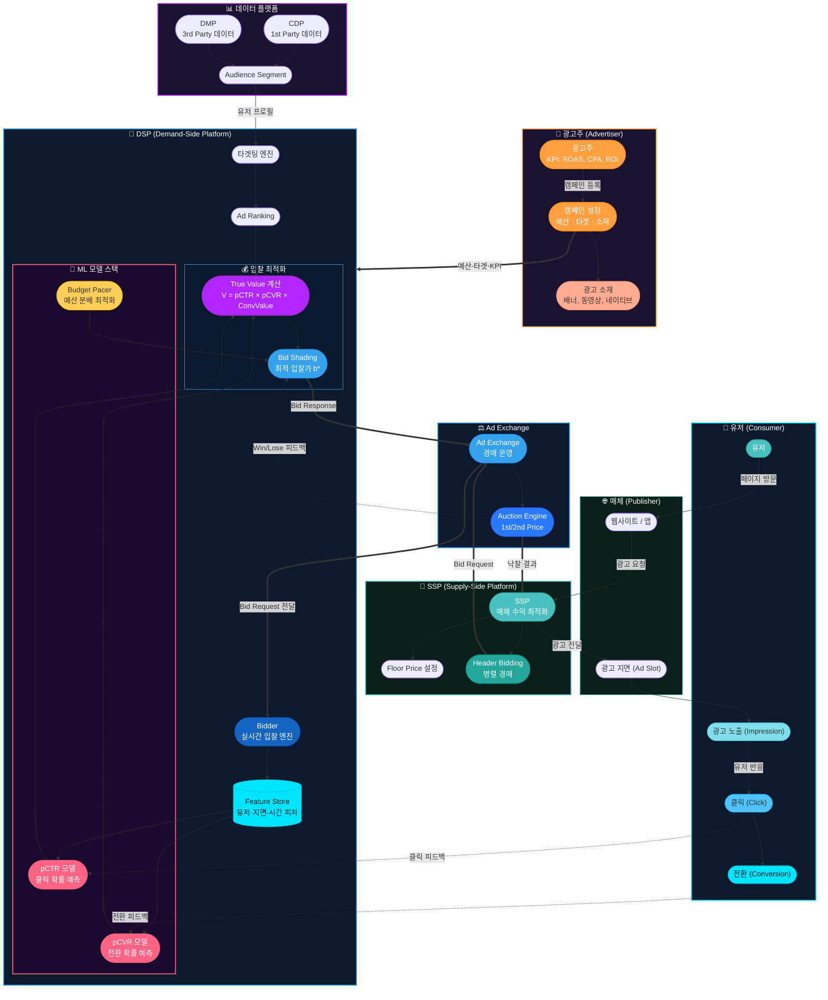

pCTR 모델을 만드는 입장에서, "내 모델이 실제로 어디에서 어떻게 쓰이는가"를 이해하는 것은 모델 설계만큼 중요합니다. 이 글은 **광고주의 캠페인 등록부터 유저의 전환까지**, 전체 생태계를 pCTR 모델러의 시선으로 해부합니다.

> 각 단계에서 pCTR/pCVR 모델이 어떤 역할을 하는지, 그리고 모델 정확도가 비즈니스에 어떤 영향을 미치는지에 집중합니다.

---

## 1. 광고 생태계 전체 조감도

먼저 숲을 보겠습니다. 광고 생태계의 모든 주요 참여자와 데이터 흐름입니다:



이 다이어그램에서 **빨간색(pCTR, pCVR)**이 pCTR 모델러의 영역입니다. 보라색(True Value)과 파란색(Bid Shading)은 모델 출력이 실제 입찰로 전환되는 지점입니다.

---

## 2. 한 번의 입찰이 일어나는 100ms

유저가 웹페이지를 열고 광고가 노출되기까지 약 100~200ms. 이 짧은 시간 안에 일어나는 모든 일을 시간순으로 봅니다:

<div class="chart-timeline">
  <div style="display:flex; justify-content:space-between; align-items:center; margin-bottom:8px;">
    <span style="font-size:0.85rem; font-weight:700; color:var(--text-primary);">RTB 입찰 전체 타임라인 (~100-200ms)</span>
    <span style="font-size:0.75rem; color:var(--text-muted);">유저 페이지 방문 &rarr; 광고 노출</span>
  </div>
  <div class="chart-timeline-bar">
    <div class="chart-timeline-segment green" style="width:5%;" title="유저 → Publisher">1</div>
    <div class="chart-timeline-segment green" style="width:8%;" title="Publisher → SSP">2-3</div>
    <div class="chart-timeline-segment blue" style="width:10%;" title="SSP → Exchange → DSP">4</div>
    <div class="chart-timeline-segment pink" style="width:35%;" title="DSP 내부 처리">5. DSP 내부 처리 (~10-30ms)</div>
    <div class="chart-timeline-segment blue" style="width:8%;" title="Bid Response">6</div>
    <div class="chart-timeline-segment" style="width:10%; background:rgba(176,38,255,0.5);" title="Auction">7. 경매</div>
    <div class="chart-timeline-segment green" style="width:12%;" title="낙찰 → 노출">8-10</div>
    <div class="chart-timeline-segment orange" style="width:12%;" title="유저 반응">11-12</div>
  </div>
  <div class="chart-timeline-labels">
    <span>0ms</span>
    <span>Bid Request</span>
    <span style="color:#ff6384; font-weight:600;">DSP: Feature &rarr; pCTR &rarr; Shading</span>
    <span>Auction</span>
    <span>노출</span>
    <span>~200ms</span>
  </div>
  <div class="chart-timeline-legend">
    <div class="chart-timeline-legend-item">
      <div class="chart-timeline-legend-dot" style="background:rgba(75,192,192,0.7);"></div>
      <span>1. 유저 페이지 방문 &rarr; SSP 광고 요청</span>
    </div>
    <div class="chart-timeline-legend-item">
      <div class="chart-timeline-legend-dot" style="background:rgba(54,162,235,0.7);"></div>
      <span>4. Bid Request 전달 (~50ms 타임아웃)</span>
    </div>
    <div class="chart-timeline-legend-item">
      <div class="chart-timeline-legend-dot" style="background:rgba(255,99,132,0.7);"></div>
      <span>5. DSP: Feature 추출 &rarr; pCTR=0.032 &rarr; pCVR=0.15 &rarr; V=$0.24 &rarr; b*=$0.17</span>
    </div>
    <div class="chart-timeline-legend-item">
      <div class="chart-timeline-legend-dot" style="background:rgba(176,38,255,0.5);"></div>
      <span>7. Auction (1st/2nd Price) &rarr; 낙찰</span>
    </div>
    <div class="chart-timeline-legend-item">
      <div class="chart-timeline-legend-dot" style="background:rgba(255,159,64,0.7);"></div>
      <span>11-12. Click (수 초) / Conversion (수 시간~수 일 지연)</span>
    </div>
  </div>
</div>

### pCTR 모델러가 주목할 포인트

- **5c**: pCTR 추론이 **~1ms 이내**에 완료되어야 합니다. 모델 복잡도 vs 레이턴시 트레이드오프
- **5e**: pCTR의 작은 오차가 True Value에 증폭됩니다. pCTR이 0.032가 아니라 0.050이었다면 True Value는 $0.24 → $0.375로 56% 뛰고, 입찰가도 그만큼 올라갑니다
- **11-12**: 클릭 피드백은 수 초 내 도착하지만, 전환 피드백은 **수 시간~수 일 지연**(Delayed Feedback)될 수 있습니다. 이것이 pCVR 모델의 핵심 난관입니다

---

## 3. pCTR 모델이 비즈니스에 미치는 영향 경로

pCTR 모델의 정확도가 최종 광고주 ROI까지 어떤 경로로 영향을 미치는지 추적합니다:

<div class="chart-steps">
  <div style="font-size:0.85rem; font-weight:700; color:var(--text-primary); margin-bottom:12px;">pCTR 모델 정확도 &rarr; 비즈니스 결과 영향 경로</div>
  <div class="chart-step">
    <div class="chart-step-indicator">
      <div class="chart-step-dot pink">1</div>
      <div class="chart-step-line"></div>
    </div>
    <div class="chart-step-content">
      <div class="chart-step-title">pCTR 모델</div>
      <div class="chart-step-desc">캘리브레이션 (예측 vs 실제 확률 일치도) + 판별력 (AUC-ROC)</div>
      <span class="chart-step-badge pink">모델러의 영역</span>
    </div>
  </div>
  <div class="chart-step">
    <div class="chart-step-indicator">
      <div class="chart-step-dot purple" style="background:rgba(176,38,255,0.8);">2</div>
      <div class="chart-step-line"></div>
    </div>
    <div class="chart-step-content">
      <div class="chart-step-title">True Value 정확도</div>
      <div class="chart-step-desc">V = pCTR &times; pCVR &times; ConvValue. pCTR 오차가 그대로 V에 전파됩니다.</div>
    </div>
  </div>
  <div class="chart-step">
    <div class="chart-step-indicator">
      <div class="chart-step-dot blue">3</div>
      <div class="chart-step-line"></div>
    </div>
    <div class="chart-step-content">
      <div class="chart-step-title">입찰가 정확도 &rarr; Win Rate &amp; 비용 효율</div>
      <div class="chart-step-desc">과대추정 &rarr; 과다입찰 &rarr; Win Rate&uarr; but 비용&uarr;&uarr;. 과소추정 &rarr; 과소입찰 &rarr; 기회 손실.</div>
    </div>
  </div>
  <div class="chart-step">
    <div class="chart-step-indicator">
      <div class="chart-step-dot green">4</div>
    </div>
    <div class="chart-step-content">
      <div class="chart-step-title">비즈니스 결과</div>
      <div class="chart-step-desc">광고주 ROI, DSP 수익, 예산 소진 속도가 모두 pCTR 정확도에 직결됩니다.</div>
      <span class="chart-step-badge green">최종 목표: ROI 극대화</span>
    </div>
  </div>
</div>

| pCTR 상태 | True Value | 입찰 결과 | 비즈니스 영향 |
|-----------|-----------|---------|-------------|
| **과대추정** (pCTR > 실제 CTR) | V 과대 → 과다 입찰 | Win Rate ↑ but 비용 ↑↑ | ROI 하락, 예산 조기 소진 |
| **과소추정** (pCTR < 실제 CTR) | V 과소 → 과소 입찰 | Win Rate ↓↓ | 기회 손실, 노출 부족 |
| **정확** (pCTR ≈ 실제 CTR) | V 정확 → 최적 shading 가능 | Win Rate 적정 + 비용 효율 | **ROI 극대화** |
| **판별력 부족** (AUC 낮음) | 좋은 지면/나쁜 지면 구분 실패 | 나쁜 지면에 과다입찰 | 전환 없는 노출에 예산 낭비 |

---

## 4. 자동 입찰(Auto-Bidding) 파이프라인 상세

광고주가 "CPA $10 목표"라고 설정하면, DSP 내부에서 일어나는 자동 입찰 로직입니다:

<div class="chart-arch">
  <div class="chart-arch-section">
    <div class="chart-arch-section-header">
      <span class="chart-arch-section-icon">&#127919;</span>
      <span class="chart-arch-section-title orange">광고주 입력 (Input)</span>
    </div>
    <div class="chart-arch-grid">
      <div class="chart-arch-node">
        <div class="chart-arch-node-name">캠페인 목표</div>
        <div class="chart-arch-node-desc">CPA = $10</div>
      </div>
      <div class="chart-arch-node">
        <div class="chart-arch-node-name">일일 예산</div>
        <div class="chart-arch-node-desc">$1,000</div>
      </div>
      <div class="chart-arch-node">
        <div class="chart-arch-node-name">타겟 조건</div>
        <div class="chart-arch-node-desc">국가, 디바이스, 관심사</div>
      </div>
    </div>
  </div>
  <div class="chart-arch-connector">&#8595;</div>
  <div class="chart-arch-section">
    <div class="chart-arch-section-header">
      <span class="chart-arch-section-icon">&#129504;</span>
      <span class="chart-arch-section-title pink">예측 단계 (Prediction)</span>
    </div>
    <div class="chart-arch-grid">
      <div class="chart-arch-node">
        <div class="chart-arch-node-name">pCTR(x) = 0.032</div>
        <div class="chart-arch-node-desc">클릭 확률 예측</div>
      </div>
      <div class="chart-arch-node">
        <div class="chart-arch-node-name">pCVR(x) = 0.15</div>
        <div class="chart-arch-node-desc">전환 확률 예측</div>
      </div>
      <div class="chart-arch-node">
        <div class="chart-arch-node-name">pCTCVR = 0.0048</div>
        <div class="chart-arch-node-desc">pCTR &times; pCVR</div>
      </div>
    </div>
  </div>
  <div class="chart-arch-connector">&#8595;</div>
  <div style="display:grid; grid-template-columns:1fr 1fr; gap:12px;">
    <div class="chart-arch-section">
      <div class="chart-arch-section-header">
        <span class="chart-arch-section-icon">&#128176;</span>
        <span class="chart-arch-section-title purple">가치 산정 (Valuation)</span>
      </div>
      <div class="chart-arch-grid">
        <div class="chart-arch-node">
          <div class="chart-arch-node-name">CPA 기반</div>
          <div class="chart-arch-node-desc">V = 0.0048 &times; $10 = $0.048</div>
        </div>
        <div class="chart-arch-node">
          <div class="chart-arch-node-name">ROAS 기반</div>
          <div class="chart-arch-node-desc">V = 0.0048 &times; $50 = $0.24</div>
        </div>
      </div>
    </div>
    <div class="chart-arch-section">
      <div class="chart-arch-section-header">
        <span class="chart-arch-section-icon">&#128200;</span>
        <span class="chart-arch-section-title blue">입찰 최적화 (Shading)</span>
      </div>
      <div class="chart-arch-grid">
        <div class="chart-arch-node">
          <div class="chart-arch-node-name">시장 분포 추정</div>
          <div class="chart-arch-node-desc">F(b|x) ~ LogNormal</div>
        </div>
        <div class="chart-arch-node">
          <div class="chart-arch-node-name">Budget Pacing</div>
          <div class="chart-arch-node-desc">남은 예산 기반 조절</div>
        </div>
      </div>
    </div>
  </div>
  <div class="chart-arch-connector">&#8595;</div>
  <div class="chart-arch-section">
    <div class="chart-arch-section-header">
      <span class="chart-arch-section-icon">&#9989;</span>
      <span class="chart-arch-section-title" style="color:#4bc0c0;">입찰 출력 (Output)</span>
    </div>
    <div class="chart-arch-grid">
      <div class="chart-arch-node">
        <div class="chart-arch-node-name">최종 입찰가: b* = $0.034</div>
        <div class="chart-arch-node-desc">Surplus 최대화: b* = argmax (V-b)&middot;F(b|x), shading 29%</div>
      </div>
    </div>
  </div>
</div>

### eCPM: 과금 모델을 통일하는 정규화 공식

광고 시장에는 CPM(노출 과금), CPC(클릭 과금), CPA(전환 과금) 등 다양한 과금 모델이 공존합니다. Ad Exchange에서 서로 다른 과금 모델의 캠페인이 **동일 지면을 놓고 경쟁**할 때, 이를 비교하려면 **eCPM(effective Cost Per Mille)**으로 정규화해야 합니다.

$$\text{eCPM} = \text{1,000 노출당 기대 수익}$$

| 과금 모델 | eCPM 변환 공식 | 예시 |
|----------|--------------|------|
| **CPM** | $\text{eCPM} = \text{CPM}$ | CPM $5.00 → eCPM $5.00 |
| **CPC** | $\text{eCPM} = pCTR \times CPC \times 1{,}000$ | pCTR 2%, CPC $0.50 → eCPM $10.00 |
| **CPA** | $\text{eCPM} = pCTR \times pCVR \times CPA \times 1{,}000$ | pCTR 2%, pCVR 10%, CPA $20 → eCPM $40.00 |

**pCTR 모델의 정확도가 eCPM에 직결되는 이유**: CPC/CPA 캠페인의 eCPM은 pCTR을 곱해서 산출됩니다. pCTR이 2%인데 모델이 4%로 과대추정하면 eCPM이 2배로 뻥튀기되어, 실제 가치보다 훨씬 높은 가격에 입찰하게 됩니다. 반대로 과소추정하면 경쟁에서 밀려 노출 기회를 잃습니다.

**SSP/Exchange 관점**: Exchange는 모든 입찰을 eCPM으로 변환한 뒤 비교하여 낙찰자를 결정합니다. 따라서 DSP가 보내는 입찰가는 이미 eCPM 기반이며, 앞서 본 True Value 계산이 바로 이 eCPM 산출 과정입니다.

### 두 가지 가치 산정 방식

**CPA 기반** (전환 최적화 캠페인):
$$V = \underbrace{pCTR(x) \times pCVR(x)}_{\text{전환 확률 (pCTCVR)}} \times \underbrace{\text{Target CPA}}_{\text{광고주 설정 목표}}$$

**ROAS 기반** (수익 최적화 캠페인):
$$V = pCTR(x) \times pCVR(x) \times \underbrace{\text{Avg Revenue}}_{\text{평균 전환 매출}}$$

어떤 방식이든, **pCTR과 pCVR이 핵심 입력**입니다. 모델이 부정확하면 V가 부정확하고, V가 부정확하면 입찰가가 부정확합니다.

---

## 5. 데이터 피드백 루프: 모델이 학습하는 과정

광고 시스템은 **자기 강화 루프(feedback loop)**로 작동합니다. pCTR 모델의 예측이 데이터를 만들고, 그 데이터가 다시 모델을 학습시킵니다:

<div class="chart-layer">
  <div class="chart-layer-title">OFFLINE TRAINING (수 시간 ~ 수 일 주기)</div>
  <div class="chart-layer-row">
    <div class="chart-layer-group">
      <div class="chart-layer-group-label">로그 데이터</div>
      <div class="chart-layer-items">
        <span class="chart-layer-item blue">Impression</span>
        <span class="chart-layer-item blue">Click</span>
        <span class="chart-layer-item blue">Conversion</span>
      </div>
    </div>
    <div class="chart-layer-group">
      <div class="chart-layer-group-label">Feature Engineering</div>
      <div class="chart-layer-items">
        <span class="chart-layer-item pink">유저 &middot; 지면 &middot; 시간 &middot; 소재 피처</span>
      </div>
    </div>
    <div class="chart-layer-group">
      <div class="chart-layer-group-label">모델 학습 &amp; 평가</div>
      <div class="chart-layer-items">
        <span class="chart-layer-item pink">Logistic Reg, DeepFM 등</span>
        <span class="chart-layer-item pink">AUC, Calibration, LogLoss</span>
      </div>
    </div>
    <div class="chart-layer-group">
      <div class="chart-layer-group-label">모델 배포</div>
      <div class="chart-layer-items">
        <span class="chart-layer-item green">서빙 서버 배포</span>
      </div>
    </div>
  </div>
  <div class="chart-layer-arrow">&#8595; 배포된 모델</div>
  <div class="chart-layer-title">ONLINE SERVING (실시간, ~1ms)</div>
  <div class="chart-layer-row">
    <div class="chart-layer-group">
      <div class="chart-layer-group-label">pCTR 추론</div>
      <div class="chart-layer-items">
        <span class="chart-layer-item pink">x &rarr; p(click|x)</span>
      </div>
    </div>
    <div class="chart-layer-group">
      <div class="chart-layer-group-label">입찰 &amp; 낙찰</div>
      <div class="chart-layer-items">
        <span class="chart-layer-item blue">True Value &rarr; Bid Shading</span>
      </div>
    </div>
    <div class="chart-layer-group">
      <div class="chart-layer-group-label">광고 노출</div>
      <div class="chart-layer-items">
        <span class="chart-layer-item green">유저에게 광고 도달</span>
      </div>
    </div>
  </div>
  <div class="chart-layer-arrow">&#8595; 유저 반응</div>
  <div class="chart-layer-title">FEEDBACK (피드백 수집) &mdash; &#8634; 다시 로그 데이터로</div>
  <div class="chart-layer-row">
    <div class="chart-layer-group">
      <div class="chart-layer-group-label">클릭 이벤트</div>
      <div class="chart-layer-items">
        <span class="chart-layer-item cyan">수 초 내 수집</span>
      </div>
    </div>
    <div class="chart-layer-group">
      <div class="chart-layer-group-label">전환 이벤트</div>
      <div class="chart-layer-items">
        <span class="chart-layer-item cyan">수 시간 ~ 수 일 지연</span>
      </div>
    </div>
    <div class="chart-layer-group">
      <div class="chart-layer-group-label">Win/Lose 피드백</div>
      <div class="chart-layer-items">
        <span class="chart-layer-item cyan">경매 결과</span>
      </div>
    </div>
    <div class="chart-layer-group">
      <div class="chart-layer-group-label">&#9888; 난관 (Challenges)</div>
      <div class="chart-layer-items">
        <span class="chart-layer-item orange">Selection Bias</span>
        <span class="chart-layer-item orange">Delayed Feedback</span>
        <span class="chart-layer-item orange">Distribution Shift</span>
        <span class="chart-layer-item orange">Censored Data</span>
      </div>
    </div>
  </div>
</div>

### pCTR 모델러가 매일 싸우는 4가지 난관

| 난관 | 원인 | 영향 | 대응 |
|------|------|------|------|
| **Selection Bias** | 낙찰한 광고만 클릭/전환 데이터 수집 | 못 이긴 경매의 잠재 성과를 모름 | ESMM, Inverse Propensity Weighting |
| **Delayed Feedback** | 전환은 클릭 후 수 시간~수 일 후 발생 | 최신 데이터에 전환 라벨 누락 | Attribution Window, FSIW |
| **Distribution Shift** | 유저 행동, 시즌, 경쟁 환경 변화 | 어제의 모델이 오늘 부정확 | 온라인 학습, 주기적 재학습 |
| **Censored Data** | 패찰 시 경쟁자 가격 미관측 | 시장 분포 과소추정 → 과도한 shading | Censored Regression, Survival Analysis |

---

## 6. 유저 여정과 모델 터치포인트

마지막으로, **유저의 관점**에서 광고가 어떤 경로로 도달하는지, 그리고 각 단계에서 어떤 모델이 개입하는지 봅니다:

<div class="chart-timeline">
  <div style="font-size:0.85rem; font-weight:700; color:var(--text-primary); margin-bottom:12px;">유저 여정 (Consumer Journey) &amp; 모델 터치포인트</div>
  <div class="chart-timeline-bar">
    <div class="chart-timeline-segment green" style="width:14%;">뉴스 앱 실행</div>
    <div class="chart-timeline-segment green" style="width:14%;">기사 페이지 로딩</div>
    <div class="chart-timeline-segment cyan" style="width:15%;">광고 노출</div>
    <div class="chart-timeline-segment pink" style="width:14%;">광고 클릭</div>
    <div class="chart-timeline-segment" style="width:14%; background:rgba(176,38,255,0.5);">랜딩 페이지</div>
    <div class="chart-timeline-segment orange" style="width:14%;">장바구니 담기</div>
    <div class="chart-timeline-segment" style="width:15%; background:rgba(75,192,192,0.7);">결제 완료</div>
  </div>
  <div class="chart-timeline-legend">
    <div class="chart-timeline-legend-item">
      <div class="chart-timeline-legend-dot" style="background:rgba(255,206,86,0.8);"></div>
      <span><strong>페이지 로딩 시</strong> &mdash; 타겟팅 모델: 이 유저에게 광고를 보여줄 것인가?</span>
    </div>
    <div class="chart-timeline-legend-item">
      <div class="chart-timeline-legend-dot" style="background:rgba(255,99,132,0.8);"></div>
      <span><strong>노출 전 (~10ms)</strong> &mdash; pCTR 모델: 클릭 확률은? + Bid Shading: 얼마에 입찰?</span>
    </div>
    <div class="chart-timeline-legend-item">
      <div class="chart-timeline-legend-dot" style="background:rgba(255,99,132,0.8);"></div>
      <span><strong>클릭 시 (수 초)</strong> &mdash; pCVR 모델 (사후 분석) + pCTR 학습 데이터 수집</span>
    </div>
    <div class="chart-timeline-legend-item">
      <div class="chart-timeline-legend-dot" style="background:rgba(176,38,255,0.8);"></div>
      <span><strong>전환 시 (수 시간~수 일)</strong> &mdash; 어트리뷰션 모델: 이 전환은 어떤 광고 덕분?</span>
    </div>
  </div>
</div>

| 유저 행동 | 시점 | 개입 모델 | 모델러 관심사 |
|----------|------|---------|-------------|
| 페이지 방문 | Bid Request 발생 | **타겟팅 모델** | 이 유저가 캠페인 타겟에 맞는가? |
| 광고 노출 전 | 입찰 결정 (~10ms) | **pCTR** + **Bid Shading** | 클릭 확률 → True Value → 최적 입찰가 |
| 클릭 | 수 초 내 | **pCVR** (사후 분석) | 클릭 피드백으로 pCTR 모델 업데이트 |
| 전환 | 수 시간~수 일 후 | **어트리뷰션 모델** | 어떤 노출/클릭이 전환에 기여했는가? |

---

## 7. 데모와 개념의 연결 가이드

이 블로그의 데모들이 전체 생태계에서 어디에 위치하는지 매핑합니다:

| 데모 | 생태계 위치 | pCTR 모델러에게 주는 인사이트 |
|------|-----------|--------------------------|
| [UCB1 Demo](demo-ucb1.html) | 광고 선택 (Ad Ranking) | 새 광고의 pCTR을 아직 모를 때, 탐색과 활용의 균형 |
| [Thompson Sampling](demo-ts.html) | 광고 선택 (확률적 접근) | pCTR의 **불확실성**을 분포로 표현하여 자연스러운 탐색 |
| [LinUCB](demo-linucb.html) | 개인화 광고 선택 | **유저 Feature**를 활용한 pCTR 예측의 기초 원리 |
| [RTB Auction](demo-rtb.html) | Ad Exchange 경매 | pCTR × ConvValue가 입찰가로 변환되는 과정 |
| [Bid Landscape](demo-bid-landscape.html) | 입찰 전략 분석 | pCTR 정확도가 최적 입찰가에 미치는 영향 |
| [Bid Shading](demo-bid-shading.html) | 입찰 최적화 + Censored Data | 1st Price에서 Shading이 필수인 이유 + 관측 불가 문제 |

### 추천 학습 순서

```
1. UCB1 / Thompson Sampling  →  "탐색 vs 활용" 직관 형성
2. LinUCB                    →  "Feature가 예측에 미치는 영향" 이해
3. RTB Auction               →  "경매 시장에서 입찰이 어떻게 작동하는가"
4. Bid Landscape             →  "pCTR이 입찰 전략에 미치는 영향"
5. Bid Shading               →  "1st Price에서의 최적화 + Censored Data"
```

1-2에서 알고리즘의 기초를 잡고, 3에서 시장 역학을 이해한 후, 4-5에서 **pCTR 모델의 정확도가 비즈니스 성과를 좌우한다**는 핵심 교훈에 도달하는 구조입니다.

---

## 마무리

1. **pCTR 모델은 광고 시스템의 심장** — True Value 계산의 핵심 입력이며, 정확도가 입찰가 → Win Rate → 비용 효율 → 광고주 ROI로 직결됩니다.

2. **모델링은 입찰의 시작일 뿐** — pCTR → True Value → Bid Shading → Budget Pacing까지 end-to-end 파이프라인을 이해해야 모델 개선의 방향을 잡을 수 있습니다.

3. **피드백 루프의 함정에 주의** — Selection Bias, Delayed Feedback, Censored Data는 모델 학습 데이터 자체를 오염시킵니다. 이 구조적 문제를 모르면 모델 정확도를 올려도 비즈니스 성과가 안 따라옵니다.

4. **캘리브레이션이 AUC보다 중요할 수 있다** — 입찰 시스템에서는 "얼마나 정확한 확률인가"(calibration)가 "순서를 잘 맞추는가"(AUC)보다 직접적으로 비용에 영향을 미칩니다.

5. **시장은 살아있다** — 경쟁 DSP의 전략 변화, 시즌 효과, SSP의 floor price 조정 등 외부 요인이 끊임없이 변합니다. 모델 재학습 주기와 모니터링이 필수입니다.