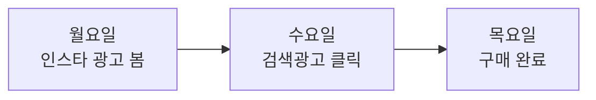

민지가 운동화를 샀다. 그런데 며칠 전 인스타에서 그 광고를 봤고, 어제는 검색광고를 눌렀고, 유튜브 광고도 스쳤다. **이 구매는 누구 공일까?**

그걸 정하는 일이 **어트리뷰션(Attribution, 기여도 분석)**이다. 답에 따라 광고비를 어디에 더 쓸지가 갈리니, 광고판에서 가장 ‘정치적인’ 숫자다.

> 한 줄 요약: 어트리뷰션은 **하나의 전환을 거쳐 온 광고들에게 ‘공’을 나눠 주는 규칙**이다. 규칙이 바뀌면 성적표가 통째로 바뀐다.

---

## 1. 왜 어려운가

광고는 **본 즉시 사지 않는다.** 며칠에 걸쳐 여러 광고를 거친 뒤 산다.

“마지막에 누른 광고”만 칭찬하면 앞단에서 인지를 만든 광고가 억울하다. 그렇다고 모두에게 똑같이 주면 정말 결정적이었던 광고가 묻힌다. **‘정답’이 없고 ‘규칙’만 있다.**

---

## 2. 기여 규칙들 — 같은 여정, 다른 성적표

위 여정(인스타 노출 → 검색 클릭 → 구매)에 공을 나눠 보자.

| 규칙 | 인스타 광고 | 검색광고 | 한 줄 |
|---|---|---|---|
| **라스트클릭** | 0% | 100% | 마지막 클릭이 다 가져감. 단순하지만 앞단 무시 |
| **퍼스트클릭** | 100% | 0% | 첫 접점만 인정 |
| **선형(균등)** | 50% | 50% | 거쳐 온 모두에게 똑같이 |
| **시간감쇠** | 30% | 70% | 구매에 가까운 접점일수록 더 |

- **라스트클릭(Last-Click)**: 가장 흔하고 단순. 하지만 “마지막 한 방”만 본다.
- **멀티터치(MTA, Multi-Touch)**: 선형·시간감쇠·U자형(첫·마지막 강조)처럼 **여러 접점에 나눠** 주는 묶음.

---

## 3. 어트리뷰션 윈도우 — ‘며칠까지 인정?’

광고를 본/누른 뒤 **며칠 안의 구매까지** 그 광고 공으로 칠지 정하는 게 윈도우다.

- 흔한 설정: **클릭 후 7일, 노출 후 1일.**
- 윈도우를 길게 잡으면 광고 성과가 부풀고, 짧게 잡으면 쪼그라든다. 같은 캠페인도 윈도우만 바꾸면 ROAS가 달라진다.

> 윈도우를 직접 바꿔보기 → [Attribution Window 데모](demo-attribution-window.html)

---

## 4. 실제로 누가 재나

- **앱**: MMP(Mobile Measurement Partner)가 잰다 — AppsFlyer · Adjust · 국내 Airbridge.
- **웹**: 픽셀·태그(Meta Pixel, Google Analytics 4 등).
- **프라이버시 벽**: iOS의 ATT(앱 추적 동의)와 SKAdNetwork 이후, 사람 단위 정밀 추적이 어려워졌다. 그래서 집계·모델 기반 측정의 비중이 커졌다.

---

## 5. 함정 — 어트리뷰션 ≠ ‘진짜 효과’

어트리뷰션은 **“이미 일어난 전환의 공을 나누는” 회계**다. “이 광고가 **없었다면** 그 구매가 안 일어났을까?”라는 **증분(Incrementality)** 질문과는 다르다.

예: 어차피 살 사람에게 마지막에 보인 광고가 라스트클릭으로 공을 100% 가져갈 수 있다. 하지만 그 광고가 매출을 **늘린** 건 아닐 수 있다. 진짜 효과는 실험(A/B)·준실험으로 따로 재야 한다.

> 상관과 인과는 왜 다른가 → [인과추론 입문](post.html?id=causal-inference-101)

---

## 6. 한눈 정리

| 개념 | 뜻 | 핵심 |
|---|---|---|
| **라스트클릭** | 마지막 클릭에 공 100% | 단순·기본값, 앞단 과소평가 |
| **멀티터치(MTA)** | 여러 접점에 공 분배 | 더 공정하지만 규칙 선택이 어려움 |
| **윈도우** | 인정 기간(예: 클릭 7일) | 길수록 성과 부풀음 |
| **증분(Incrementality)** | 광고가 ‘추가로’ 만든 전환 | 어트리뷰션과 다른 질문 — 실험 필요 |

---

## 7. 헷갈리기 쉬운 점

- **라스트클릭은 ‘진실’이 아니라 ‘규칙’이다.** 가장 흔할 뿐, 가장 정확한 건 아니다.
- **어트리뷰션 ≠ 증분.** 공을 받았다고 매출을 늘린 건 아니다.
- **뷰스루(View-through) vs 클릭.** 누르지 않고 보기만 한 광고에도 공을 줄지(노출 기여)부터 규칙이 갈린다.

---

## 더 깊이 보기

- 카카오에서 성과를 어떻게 재나(자동입찰·측정) → [캠페인이 굴러가는 법](post.html?id=kakao-ads-bidding-measurement)
- 광고가 정말 효과 있었나(증분·인과) → [인과추론 입문](post.html?id=causal-inference-101)
- 기여 기간을 바꿔보기 → [Attribution Window 데모](demo-attribution-window.html)
- 그림으로 먼저 → [쉬운 버전 ‘누구 공이냐’](ecosystem-easy.html#attribution)
- 약어가 헷갈리면 → [쉬운 용어 사전](ecosystem-terms.html#mmp)
