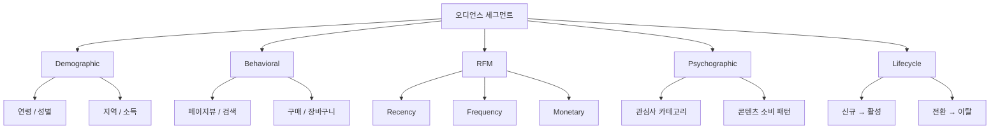
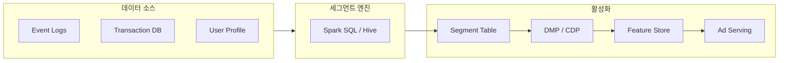
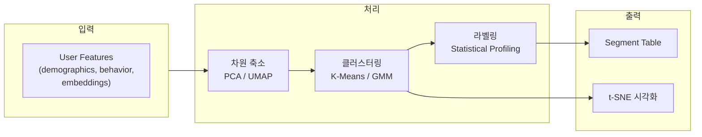
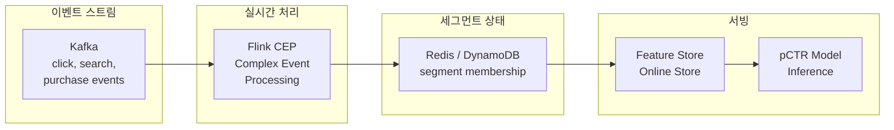
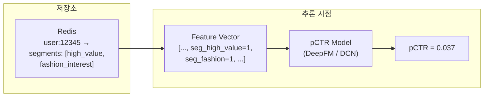
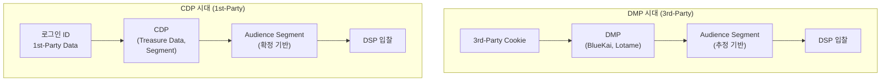

"누구에게 보여줄 것인가?" — 광고가 노출되기 전, 시스템이 가장 먼저 답해야 할 질문입니다. 아무리 정교한 pCTR 모델을 만들고, 최적의 입찰 전략을 설계하더라도, **적절한 오디언스에게 도달하지 못하면** 모든 것이 무의미합니다. 오디언스 세그멘테이션은 수백만~수억 명의 유저를 **행동 가능한 그룹(Actionable Audience)**으로 묶는 과정이며, 이것이 [Lookalike Modeling](post.html?id=lookalike-modeling)의 시드 오디언스, 리타겟팅, 그리고 모든 타겟팅 전략의 출발점입니다.

[Ad Tech 개발 레이어 맵](post.html?id=adtech-dev-layers)에서 세그멘테이션은 데이터 레이어와 모델링 레이어의 교차점에 위치합니다. 유저 이벤트 로그가 [Feature Store](post.html?id=feature-store-serving)를 통해 실시간으로 서빙되고, [Walled Garden](post.html?id=walled-garden)과 Open RTB 생태계에서 각각 다른 방식으로 오디언스를 정의하고 활성화합니다. 이 글은 Rule-based SQL 세그먼트부터 ML 기반 클러스터링, 실시간 스트리밍 할당, 그리고 pCTR 모델과의 연동까지 — 오디언스 세그멘테이션의 전체 스펙트럼을 엔지니어 관점에서 해부합니다.

---

## 1. 핵심 비교 (Executive Summary)

먼저 전체 지형을 봅니다. 세그멘테이션에 사용되는 5가지 접근법의 특성을 한눈에 비교합니다.

### 세그멘테이션 접근법 비교

| 접근법 | 입력 데이터 | 갱신 지연 | 세분화 수준 | 해석 가능성 | 구현 복잡도 |
|--------|-----------|----------|-----------|-----------|-----------|
| **Rule-based (SQL)** | 이벤트 로그, 프로필 | 시간~일 (배치) | 중간 (조건 조합) | 매우 높음 | 낮음 |
| **RFM Scoring** | 거래 데이터 | 일 1회 (배치) | 중간 (5×5×5 = 125셀) | 높음 | 낮음 |
| **K-Means Clustering** | 유저 피처/임베딩 | 주 1회 (모델 재학습) | 높음 (K개 클러스터) | 중간 (라벨링 필요) | 중간 |
| **GMM (Soft Assignment)** | 유저 피처/임베딩 | 주 1회 (모델 재학습) | 매우 높음 (확률적) | 낮음 (확률 분포) | 높음 |
| **Streaming (CEP)** | 실시간 이벤트 스트림 | 초~분 | 낮음 (단순 규칙) | 매우 높음 | 높음 (인프라) |

### DMP vs CDP 비교

3rd-party cookie 기반 DMP에서 1st-party data 중심 CDP로의 전환은 현재 진행형입니다.

| 구분 | DMP | CDP |
|------|-----|-----|
| **주요 데이터** | 3rd-party cookie, 외부 데이터 구매 | 1st-party 행동 데이터, CRM, 거래 |
| **식별자** | Cookie ID, MAID (비결정론적) | 로그인 ID, 이메일 해시 (결정론적) |
| **데이터 지속성** | 90일 (cookie 수명) | 무제한 (고객 동의 기반) |
| **주요 용도** | 프로그래매틱 광고 타겟팅 | 전 채널 개인화 + 광고 |
| **대표 서비스** | Oracle BlueKai, Lotame | Treasure Data, Segment (Twilio), mParticle |
| **현재 추세** | 축소 (cookie 폐지) | 성장 (1st-party 데이터 중심) |

> **핵심 전환**: 3rd-party cookie 폐지와 GDPR/CCPA 규제 강화로, 세그멘테이션의 기반이 "외부 데이터 구매(DMP)"에서 "자사 데이터 구축(CDP)"으로 근본적으로 이동하고 있습니다. 이 전환에 실패한 광고주는 타겟팅 정밀도에서 구조적 열위에 놓입니다.

---

## 2. 세그먼트 분류 체계 (Taxonomy)

오디언스 세그먼트는 크게 5가지 유형으로 분류됩니다. 각 유형은 서로 다른 데이터 소스에서 출발하며, 타겟팅 정밀도와 활용 목적이 다릅니다.



### 2-1. Demographic 세그먼트

가장 기본적인 세그멘테이션입니다. 연령, 성별, 소득 수준, 거주 지역 등 **인구통계학적 속성**으로 유저를 분류합니다.

**데이터 소스**: 회원가입 정보, 설문, DMP 추정 데이터. 직접 수집된 데이터(Declared Data)가 가장 정확하지만, 대부분의 경우 모델 기반 추정(Inferred Data)에 의존합니다. 예를 들어, 네이버는 검색 패턴과 서비스 이용 이력을 기반으로 연령대와 성별을 추정하며, 이 추정의 정확도가 세그먼트 품질을 좌우합니다.

**한계**: Demographic 세그먼트는 **의도(Intent)**를 포착하지 못합니다. "25-34세 여성 서울 거주"라는 세그먼트는 수백만 명을 포함하며, 그 안에서 운동화를 찾는 사람과 유아용품을 찾는 사람의 광고 반응은 완전히 다릅니다. 따라서 Demographic 세그먼트는 단독보다는 **Pre-filter**로 활용하는 것이 일반적입니다 — 먼저 연령/성별로 범위를 좁히고, Behavioral 세그먼트로 정밀 타겟팅하는 방식입니다.

**프로덕션 활용**: 광고주가 캠페인 설정 시 "25-34세, 여성, 서울/경기"를 선택하면, 이것이 DSP의 입찰 필터로 작동합니다. OpenRTB bid request의 `user.gender`, `user.yob`, `device.geo` 필드가 이에 해당합니다.

### 2-2. Behavioral 세그먼트

유저의 **실제 행동**을 기반으로 한 세그먼트입니다. Demographic보다 훨씬 강력한 신호를 제공하며, 광고 반응 예측에 가장 높은 상관관계를 보입니다.

**행동 데이터 유형**:
- **검색 쿼리**: "나이키 에어맥스 가격" → 구매 의도가 높은 유저
- **페이지뷰**: 상품 상세 페이지 3회 이상 방문 → 고관여 유저
- **장바구니**: 상품 담기 후 미구매 → 리타겟팅 대상
- **앱 활동**: 앱 설치 후 7일 이내 미사용 → 이탈 위험

**세그먼트 예시**:
- `최근_7일_운동화_검색_3회이상`: 운동화 카테고리 광고의 핵심 타겟
- `30일_내_3회_이상_구매`: 고빈도 구매자 — Cross-sell 기회
- `장바구니_이탈_24시간_이내`: 가장 전환율이 높은 리타겟팅 세그먼트
- `앱_미사용_14일_이상`: 푸시 알림 또는 Re-engagement 캠페인 대상

Behavioral 세그먼트의 핵심 강점은 **의도 신호(Intent Signal)**를 직접 포착한다는 것입니다. "운동화를 검색한 사람"은 "25-34세 남성"보다 운동화 광고에 반응할 확률이 압도적으로 높습니다. 이 의도 신호의 강도는 시간이 지남에 따라 급격히 감소하므로(Recency Decay), 세그먼트의 **갱신 주기**가 매우 중요합니다 — 7일 전 검색과 1시간 전 검색은 완전히 다른 의도 강도를 가집니다.

### 2-3. RFM 세그먼트

RFM(Recency, Frequency, Monetary)은 Direct Marketing에서 시작된 고전적이지만 여전히 가장 실용적인 세그멘테이션 프레임워크입니다. 세 가지 차원으로 고객 가치를 정량화합니다.

- **Recency (R)**: 마지막 구매/활동으로부터의 경과 시간. 최근일수록 높은 점수.
- **Frequency (F)**: 일정 기간 내 구매/활동 횟수. 많을수록 높은 점수.
- **Monetary (M)**: 일정 기간 내 총 구매 금액. 클수록 높은 점수.

각 차원을 1-5점으로 scoring하면, 이론적으로 $5 \times 5 \times 5 = 125$개의 셀이 만들어지지만, 실무에서는 이를 의미 있는 그룹으로 병합합니다.

$$\text{RFM Score} = (R, F, M) \quad \text{where each} \in \{1, 2, 3, 4, 5\}$$

| 세그먼트 | R | F | M | 설명 | 광고 전략 |
|----------|---|---|---|------|----------|
| **Champions** | 5 | 5 | 5 | 최근 + 자주 + 고액 구매 | 로열티 프로그램, Cross-sell 프리미엄 상품 |
| **Loyal** | 3-4 | 4-5 | 4-5 | 꾸준히 자주 구매하는 충성 고객 | Upsell, 신상품 우선 노출 |
| **At Risk** | 1-2 | 3-5 | 3-5 | 과거에 우수했지만 최근 이탈 조짐 | Win-back 캠페인, 할인 쿠폰 |
| **Hibernating** | 1-2 | 1-2 | 1-2 | 장기 비활성 유저 | 재활성화 시도 or 타겟팅 제외 |
| **New** | 5 | 1 | 1 | 최근 첫 구매한 신규 고객 | 온보딩, 2차 전환 유도, 웰컴 쿠폰 |

RFM의 강점은 **해석 가능성**입니다. "Cluster 3"이라고 하면 아무도 이해하지 못하지만, "At Risk (R=1, F=4, M=5) — 과거 고액 다빈도 구매자가 최근 30일 미활동"이라고 하면 광고주는 즉시 전략을 수립할 수 있습니다. ML 클러스터링을 도입하기 전에 먼저 RFM으로 시작하는 것이 실무적으로 올바른 순서입니다.

### 2-4. Psychographic & Interest 세그먼트

유저의 **관심사, 가치관, 라이프스타일**을 기반으로 한 세그먼트입니다. Behavioral 세그먼트가 "무엇을 했는가"에 초점을 맞춘다면, Psychographic 세그먼트는 "무엇에 관심이 있는가"에 초점을 맞춥니다.

**데이터 소스**: 콘텐츠 소비 패턴(어떤 기사를 읽는가), 검색 쿼리(무엇을 찾는가), 소셜 인터랙션(무엇에 반응하는가), 앱 설치 목록, 구독 서비스. 이러한 신호들을 종합하여 유저를 관심사 카테고리에 매핑합니다.

**Taxonomy 구조**: Meta와 Google은 각각 1,000개 이상의 관심사 카테고리를 운영합니다. 예를 들어, Meta의 Detailed Targeting은 "패션 > 스트리트웨어 > 나이키", "스포츠 > 러닝 > 마라톤"과 같은 계층 구조를 가집니다. 업계 표준으로는 **IAB Content Taxonomy**가 있으며, 현재 버전 3.0은 약 700개의 콘텐츠 카테고리를 정의합니다. OpenRTB bid request에서 `site.cat` 또는 `app.cat` 필드가 IAB 카테고리를 사용합니다.

**구축 방법**: 1st-party 데이터에서 관심사 세그먼트를 직접 구축하려면, 유저의 콘텐츠 소비 이력을 NLP 모델로 분류하고, TF-IDF 또는 embedding 기반으로 카테고리 affinity score를 계산합니다. 예를 들어, 유저가 최근 30일간 "스트리트웨어" 관련 기사를 10건 이상 읽었다면, 해당 유저의 "패션 > 스트리트웨어" affinity는 높게 설정됩니다.

### 2-5. Lifecycle 세그먼트

유저의 **고객 여정 단계**를 기반으로 한 세그먼트입니다. 동일한 제품에 관심이 있더라도, 신규 방문자와 재구매 고객에게는 완전히 다른 광고 메시지와 입찰 전략이 필요합니다.

**Lifecycle 단계**:
```
신규 방문자 → 활성 유저 → 첫 전환자 → 재구매 고객 → 충성 고객 → 이탈 위험 → 이탈
```

각 단계는 서로 다른 광고 목표를 가집니다:
- **신규 방문자**: 브랜드 인지도, 회원가입 유도 — CPM 기반 광고
- **활성 유저 (미전환)**: 제품 탐색 유도, 프로모션 노출 — CPC 기반
- **첫 전환자**: 2차 구매 유도, 관련 상품 추천 — CPA 기반
- **재구매 고객**: Cross-sell, Upsell — ROAS 기반
- **이탈 위험**: Win-back 캠페인 — 높은 입찰가로 적극 리타겟팅
- **이탈 고객**: Re-engagement 또는 타겟팅 제외

### 세그먼트 유형 종합 비교

| 유형 | 데이터 소스 | 예시 | 갱신 주기 | 타겟팅 정밀도 |
|------|-----------|------|----------|-------------|
| **Demographic** | 회원 정보, 추정 모델 | 25-34세 여성, 서울 거주 | 주 1회 | 낮음 |
| **Behavioral** | 이벤트 로그 | 최근 7일 운동화 검색 3회+ | 일 1회 ~ 실시간 | 높음 |
| **RFM** | 거래 데이터 | Champions (R5-F5-M5) | 일 1회 | 중간 |
| **Psychographic** | 콘텐츠 소비, 검색 | 패션 > 스트리트웨어 관심 | 주 1회 | 중간 |
| **Lifecycle** | 전환 이벤트 | 첫 구매 후 30일 미재방문 | 일 1회 | 높음 |

> 실무에서 가장 효과적인 타겟팅은 **세그먼트 조합(Intersection)**입니다. "25-34세 여성(Demographic) AND 최근 7일 운동화 검색(Behavioral) AND At Risk(RFM)"처럼 여러 유형을 교차시키면 정밀도가 비약적으로 향상됩니다. 다만, 교차가 지나치면 세그먼트 크기가 너무 작아져 통계적 유의성과 도달 범위(Reach)가 훼손됩니다.

---

## 3. Rule-Based 세그멘테이션

### 3-1. SQL/Hive 기반 세그먼트 정의

대부분의 프로덕션 세그먼트 시스템은 SQL 쿼리로 시작합니다. 이벤트 로그, 거래 DB, 유저 프로필을 입력으로, Spark SQL 또는 Hive에서 세그먼트 멤버십을 계산하여 DMP/CDP와 Feature Store로 전달합니다.



다음은 프로덕션 환경에서 실제로 사용되는 4가지 세그먼트 SQL 패턴입니다.

```sql
-- ============================================================
-- 1. 고가치 최근 구매자 (High-Value Recent Buyer)
-- 최근 30일 내 10만원 이상, 3회 이상 구매한 유저
-- 활용: Cross-sell 프리미엄 상품, 로열티 프로그램 광고
-- ============================================================
INSERT OVERWRITE TABLE segments PARTITION (segment_id = 'high_value_recent')
SELECT user_id
FROM transactions
WHERE purchase_date >= date_sub(current_date, 30)
GROUP BY user_id
HAVING SUM(amount) >= 100000
   AND COUNT(*) >= 3;

-- ============================================================
-- 2. 장바구니 이탈자 (Cart Abandoner — 7일 윈도우)
-- 장바구니에 담았지만 7일 내 구매하지 않은 유저
-- 활용: 가장 전환율이 높은 리타겟팅 세그먼트 중 하나
-- ============================================================
INSERT OVERWRITE TABLE segments PARTITION (segment_id = 'cart_abandon_7d')
SELECT DISTINCT a.user_id
FROM cart_events a
LEFT JOIN purchase_events b
  ON a.user_id = b.user_id
  AND a.product_id = b.product_id
  AND b.event_date BETWEEN a.event_date AND date_add(a.event_date, 7)
WHERE a.event_date >= date_sub(current_date, 7)
  AND b.user_id IS NULL;

-- ============================================================
-- 3. 신규 유저 (14일 이내 가입)
-- 최근 2주 내 가입한 유저 — 온보딩 광고 대상
-- 활용: 웰컴 쿠폰, 첫 구매 유도 캠페인
-- ============================================================
INSERT OVERWRITE TABLE segments PARTITION (segment_id = 'new_user_14d')
SELECT user_id
FROM user_profiles
WHERE signup_date >= date_sub(current_date, 14);

-- ============================================================
-- 4. 이탈 위험 유저 (과거 활성 → 최근 30일 미접속)
-- 90일 전까지 활발했지만 최근 30일간 접속하지 않은 유저
-- 활용: Win-back 캠페인, 특별 할인 리타겟팅
-- ============================================================
INSERT OVERWRITE TABLE segments PARTITION (segment_id = 'churn_risk')
SELECT user_id
FROM user_activity
WHERE last_active_date BETWEEN date_sub(current_date, 90)
                          AND date_sub(current_date, 30)
  AND total_sessions_90d >= 10;
```

각 SQL은 세그먼트 테이블의 특정 파티션에 결과를 덮어씁니다. `segment_id`를 파티션 키로 사용하면, 각 세그먼트를 독립적으로 갱신할 수 있고, 세그먼트 간 갱신 주기를 다르게 설정할 수 있습니다. 예를 들어, `cart_abandon_7d`는 매시간 갱신하지만, `churn_risk`는 일 1회면 충분합니다.

### 3-2. 규칙 관리와 버전 관리

Rule-based 세그먼트는 간단해 보이지만, 프로덕션 환경에서는 **규칙 폭증(Rule Proliferation)** 문제에 직면합니다. 광고주와 마케터의 요청이 쌓이면서 수백 개의 세그먼트 규칙이 생성되고, 이들 사이의 중복, 의존성, 상충 관계를 파악하기 어려워집니다.

**규칙 폭증의 증상**:
- 비슷하지만 미세하게 다른 세그먼트가 20개 이상 존재 (`cart_abandon_7d`, `cart_abandon_3d`, `cart_abandon_24h`, `cart_abandon_7d_high_value`, ...)
- 어떤 세그먼트가 어떤 캠페인에 연결되어 있는지 아무도 모름
- 세그먼트 정의를 변경했을 때 downstream 영향 범위를 파악할 수 없음
- 사용되지 않는 세그먼트가 여전히 매일 계산되어 컴퓨팅 자원을 낭비

**해결 방법**: 세그먼트 정의를 **코드로 관리(Segment-as-Code)**합니다. 각 세그먼트의 SQL 정의, 갱신 주기, 소유자, 의존 데이터 소스를 YAML 또는 JSON 스키마로 선언하고, Git으로 버전 관리합니다. 세그먼트 간 의존성을 DAG(Directed Acyclic Graph)로 표현하면, Airflow/Dagster 같은 워크플로우 엔진에서 올바른 순서로 실행할 수 있습니다.

```yaml
# segment_definitions/high_value_recent.yaml
segment_id: high_value_recent
name: "고가치 최근 구매자"
description: "30일 내 10만원+, 3회+ 구매 유저"
owner: marketing-analytics@company.com
schedule: "0 6 * * *"  # 매일 06:00 UTC
source_tables:
  - transactions
sql_file: sql/high_value_recent.sql
dependencies:
  - segment_id: null  # 다른 세그먼트에 의존하지 않음
downstream_consumers:
  - campaign: summer_crosssell_2024
  - feature_store: seg_high_value_recent
ttl_days: 1
min_size: 1000
max_size: 5000000
```

이러한 메타데이터 기반 관리 체계는 **세그먼트 카탈로그**의 기초가 됩니다. 7절에서 다루는 건강성 모니터링도 이 카탈로그 위에서 작동합니다.

---

## 4. ML 기반 세그멘테이션

Rule-based 세그먼트는 명시적이고 해석 가능하지만, **유저 간의 숨겨진 패턴**을 발견하지 못합니다. "최근 7일 운동화 검색 3회"라는 규칙은 분석가가 이미 알고 있는 패턴을 코드화한 것이지, 데이터에서 새로운 패턴을 발견하는 것이 아닙니다. ML 기반 클러스터링은 유저 피처 공간에서 **자연스러운 그룹**을 발견하여, 분석가가 미처 인지하지 못한 세그먼트를 드러냅니다.



### 4-1. K-Means Clustering

K-Means는 가장 널리 사용되는 클러스터링 알고리즘입니다. $N$명의 유저를 $K$개의 클러스터로 나누되, 각 클러스터 내의 분산을 최소화하는 것이 목표입니다.

**목적 함수 (Inertia)**:

$$J = \sum_{k=1}^{K} \sum_{x_i \in C_k} \|x_i - \mu_k\|^2$$

여기서 $C_k$는 클러스터 $k$에 속한 유저 집합, $\mu_k$는 클러스터 $k$의 중심(centroid)입니다. 알고리즘은 (1) 각 유저를 가장 가까운 centroid에 할당하고, (2) 각 centroid를 해당 클러스터의 평균으로 업데이트하는 과정을 수렴할 때까지 반복합니다.

**최적 K 결정**: $K$를 몇으로 설정할 것인가는 항상 어려운 문제입니다. 두 가지 방법이 표준적으로 사용됩니다.

1. **Elbow Method**: $K$를 1부터 점진적으로 늘리면서 Inertia $J$의 감소를 관찰합니다. 감소 기울기가 급격히 완만해지는 지점("팔꿈치")이 최적 $K$의 후보입니다.

2. **Silhouette Score**: 각 유저 $i$에 대해 클러스터 내 평균 거리 $a(i)$와 가장 가까운 다른 클러스터까지의 평균 거리 $b(i)$를 비교합니다.

$$s(i) = \frac{b(i) - a(i)}{\max(a(i), b(i))}$$

$s(i) \in [-1, 1]$이며, 1에 가까울수록 유저 $i$가 올바른 클러스터에 잘 할당된 것입니다. 전체 유저의 평균 Silhouette Score가 가장 높은 $K$를 선택합니다.

| 알고리즘 | 클러스터 형태 | 할당 방식 | 하이퍼파라미터 | 장점 | 한계 |
|----------|-------------|----------|--------------|------|------|
| **K-Means** | 구형 (Spherical) | Hard (1 cluster) | $K$ | 빠름, 직관적, 대규모 데이터 적합 | 비구형 클러스터에 약함 |
| **GMM** | 타원형 (Ellipsoidal) | Soft (확률) | $K$, 공분산 타입 | 확률적 할당, 유연한 형태 | 수렴 느림, 초기화 민감 |
| **DBSCAN** | 임의 형태 | Hard + Noise 탐지 | $\epsilon$, min_samples | $K$ 불필요, 노이즈 탐지 | 밀도 차이에 민감, 고차원 약함 |

### 4-2. GMM (Gaussian Mixture Model)

K-Means의 가장 큰 한계는 **Hard Assignment**입니다. 유저는 반드시 하나의 클러스터에만 속하며, 경계에 있는 유저의 불확실성을 표현할 수 없습니다. 광고 세그멘테이션에서 이는 심각한 문제가 됩니다 — 한 유저가 "패션"에도 관심이 있고 "스포츠"에도 관심이 있는 경우가 일반적이기 때문입니다.

GMM은 데이터가 $K$개의 가우시안 분포의 혼합으로 생성되었다고 가정합니다:

$$P(x) = \sum_{k=1}^{K} \pi_k \, \mathcal{N}(x \mid \mu_k, \Sigma_k)$$

여기서 $\pi_k$는 혼합 계수(mixing coefficient)이며 $\sum_{k=1}^{K} \pi_k = 1$을 만족합니다. $\mu_k$와 $\Sigma_k$는 각 가우시안 컴포넌트의 평균과 공분산 행렬입니다.

**EM 알고리즘**:
1. **E-step (Expectation)**: 현재 파라미터에서 각 유저 $x_i$가 클러스터 $k$에 속할 **책임(Responsibility)** $\gamma_{ik}$를 계산합니다.
   $$\gamma_{ik} = \frac{\pi_k \, \mathcal{N}(x_i \mid \mu_k, \Sigma_k)}{\sum_{j=1}^{K} \pi_j \, \mathcal{N}(x_i \mid \mu_j, \Sigma_j)}$$

2. **M-step (Maximization)**: $\gamma_{ik}$를 가중치로 사용하여 $\pi_k$, $\mu_k$, $\Sigma_k$를 업데이트합니다.

**Soft Assignment의 광고 활용**: GMM의 출력은 각 유저가 각 클러스터에 속할 **확률 벡터**입니다. 유저 A가 "패션" 클러스터에 70%, "스포츠" 클러스터에 30% 확률로 할당된다면:
- 패션 광고 캠페인에서 유저 A의 입찰 가중치를 0.7로 설정
- 스포츠 광고 캠페인에서도 0.3 가중치로 입찰 가능
- K-Means였다면 유저 A는 "패션"에만 할당되어 스포츠 광고 기회를 놓침

이 확률적 할당은 광고 예산의 효율적 배분에 직접적으로 기여합니다.

### 4-3. 유저 임베딩 기반 클러스터링

전통적인 클러스터링은 수작업으로 설계한 피처(연령, 구매 횟수, 평균 구매 금액 등)를 입력으로 사용합니다. 하지만 이러한 명시적 피처는 유저 행동의 복잡한 패턴을 충분히 포착하지 못합니다.

[Two-Tower Model](post.html?id=two-tower-retrieval)의 User Tower는 유저의 모든 상호작용을 128차원 dense vector로 압축합니다. 이 유저 임베딩은 행동 유사성이 높은 유저를 벡터 공간에서 가까이 배치하므로, 클러스터링의 입력으로 탁월합니다.

**파이프라인**: 유저 임베딩 → 정규화(StandardScaler) → 차원 축소(PCA/UMAP) → 클러스터링(K-Means/GMM)

```python
import numpy as np
from sklearn.cluster import KMeans
from sklearn.mixture import GaussianMixture
from sklearn.preprocessing import StandardScaler
from sklearn.decomposition import PCA

# ── 1. 유저 임베딩 로드 (Two-Tower User Tower 출력) ──
user_embeddings = np.load('user_embeddings.npy')  # shape: (N, 128)
user_ids = np.load('user_ids.npy')                # shape: (N,)

# ── 2. 정규화 + 차원 축소 ──
scaler = StandardScaler()
X = scaler.fit_transform(user_embeddings)

pca = PCA(n_components=32)
X_reduced = pca.fit_transform(X)
print(f"PCA 누적 설명 분산: {pca.explained_variance_ratio_.sum():.2%}")

# ── 3-A. K-Means (Hard Assignment) ──
kmeans = KMeans(n_clusters=8, random_state=42, n_init=10)
hard_labels = kmeans.fit_predict(X_reduced)

# ── 3-B. GMM (Soft Assignment) ──
gmm = GaussianMixture(n_components=8, covariance_type='full', random_state=42)
gmm.fit(X_reduced)
soft_probs = gmm.predict_proba(X_reduced)   # shape: (N, 8) 확률 행렬
primary_labels = gmm.predict(X_reduced)

# ── 4. 세그먼트 테이블 생성 ──
segment_records = []
for i, uid in enumerate(user_ids):
    primary_seg = primary_labels[i]
    top2_segs = np.argsort(soft_probs[i])[-2:][::-1]
    top2_probs = soft_probs[i][top2_segs]
    
    segment_records.append({
        'user_id': uid,
        'primary_segment': int(primary_seg),
        'primary_prob': float(top2_probs[0]),
        'secondary_segment': int(top2_segs[1]),
        'secondary_prob': float(top2_probs[1]),
    })
    # → DMP/CDP 또는 Feature Store에 적재
```

**차원 축소가 필수인 이유**: 128차원 임베딩에 직접 K-Means를 적용하면 "차원의 저주(Curse of Dimensionality)" 문제가 발생합니다. 고차원에서는 모든 점 간의 거리가 비슷해져 유클리드 거리 기반 클러스터링이 의미를 잃습니다. PCA로 32차원, 또는 UMAP으로 10-20차원으로 축소한 후 클러스터링하면 훨씬 깨끗한 군집이 형성됩니다.

### 4-4. 세그먼트 라벨링과 해석

ML 클러스터링의 **"Last Mile" 문제**는 라벨링입니다. 알고리즘은 "Cluster 0", "Cluster 1", ... 이라는 숫자만 출력합니다. 광고주와 캠페인 매니저가 이해하고 활용하려면, 각 클러스터에 **사람이 읽을 수 있는 라벨**을 부여해야 합니다.

**Statistical Profiling 방법**: 각 클러스터에 대해, 전체 유저 평균 대비 **과대표(Over-represented)된 피처**를 식별합니다.

```
Cluster 3 프로파일:
  - 평균 연령: 27.3세 (전체 평균: 34.1세) ↓
  - 스포츠웨어 구매 비율: 42% (전체: 12%) ↑↑
  - 모바일 앱 사용 비율: 89% (전체: 61%) ↑
  - 월 평균 구매 금액: 85,000원 (전체: 120,000원) ↓
  → 라벨: "모바일 중심 영스포츠 소비자"
```

**자동 라벨링**: 각 클러스터에서 가장 차별적인 상위 3-5개 피처를 추출하고, 이를 조합하여 라벨을 자동 생성합니다. "패션_관심_고소득_2030"처럼 피처명을 연결하는 방식이 가장 직관적입니다. LLM을 활용하면 프로파일 통계를 자연어 라벨로 변환하는 것도 가능합니다.

> ML 클러스터링은 "발견(Discovery)"에 강하고, Rule-based는 "실행(Execution)"에 강합니다. 실무에서는 ML로 새로운 패턴을 발견한 후, 이를 SQL 규칙으로 코드화하여 프로덕션에 배포하는 **Discovery → Rule 파이프라인**이 가장 효과적입니다.

---

## 5. 실시간 세그먼트 할당

배치 파이프라인은 "어제의 데이터"로 세그먼트를 계산합니다. 하지만 유저가 **지금 이 순간** 장바구니에 상품을 담고, 검색하고, 페이지를 탐색하는 행동은 가장 강력한 의도 신호이며, 이를 즉시 세그먼트에 반영해야 합니다.



### 5-1. Streaming Pipeline (Kafka + Flink)

실시간 세그먼트 할당의 핵심은 **Complex Event Processing (CEP)**입니다. 단일 이벤트가 아니라, 일정 시간 윈도우 내의 이벤트 패턴을 감지하여 세그먼트를 할당합니다.

```python
# Flink CEP 의사코드: 실시간 세그먼트 할당
class SegmentAssigner(ProcessFunction):
    """
    Kafka에서 유저 이벤트를 수신하고,
    규칙 기반으로 실시간 세그먼트를 할당/해제합니다.
    세그먼트 상태는 Redis에 저장되어 Feature Store에서 서빙됩니다.
    """
    
    def process_element(self, event, ctx):
        user_id = event.user_id
        
        # ── 규칙 1: 최근 1시간 내 3회 이상 검색 → "active_searcher" ──
        search_count = self.state.get_search_count(user_id, window='1h')
        if event.type == 'search':
            search_count += 1
            self.state.update_search_count(user_id, search_count)
        if search_count >= 3:
            self.emit_segment(user_id, 'active_searcher', ttl=3600)
        
        # ── 규칙 2: 장바구니 추가 후 10분 내 미구매 → "cart_abandoner_rt" ──
        if event.type == 'add_to_cart':
            ctx.timer_service().register_event_time_timer(
                event.timestamp + 600_000  # 10분 후 트리거
            )
        
        # ── 규칙 3: 구매 이벤트 → "converter" 세그먼트 즉시 할당 ──
        if event.type == 'purchase':
            self.emit_segment(user_id, 'converter', ttl=86400 * 30)
            # 장바구니 이탈 타이머가 있으면 취소
            self.cancel_cart_abandon_timer(user_id)
            # cart_abandoner 세그먼트 해제
            self.remove_segment(user_id, 'cart_abandoner_rt')
    
    def on_timer(self, timestamp, ctx):
        """10분 타이머 만료 — 구매 없었으면 cart_abandoner_rt 할당"""
        user_id = ctx.get_current_key()
        if not self.state.has_recent_purchase(user_id, window='10m'):
            self.emit_segment(user_id, 'cart_abandoner_rt', ttl=86400)
```

**TTL(Time-To-Live) 설계**: 실시간 세그먼트에는 반드시 TTL을 설정해야 합니다. `active_searcher` 세그먼트의 TTL이 1시간이라면, 유저가 검색을 멈추면 1시간 후 자동으로 세그먼트에서 제거됩니다. TTL 없이 세그먼트를 할당하면, 세그먼트 크기가 단조 증가하여 타겟팅 정밀도가 급격히 하락합니다.

**상태 관리**: Flink의 Keyed State에 유저별 이벤트 카운터와 타이머를 관리합니다. 상태는 RocksDB 기반으로 체크포인팅되며, 장애 복구 시 exactly-once 시맨틱을 보장합니다. 세그먼트 할당 결과는 Redis에 저장되어, [Feature Store](post.html?id=feature-store-serving)의 Online Store에서 pCTR 모델 추론 시 실시간으로 조회됩니다.

### 5-2. 배치 vs 스트리밍 vs 하이브리드

| 구분 | 배치 (Spark/Hive) | 스트리밍 (Flink) | 하이브리드 |
|------|-------------------|-----------------|-----------|
| **갱신 지연** | 시간 ~ 일 | 초 ~ 분 | 세그먼트별 최적 |
| **데이터 범위** | 전체 이력 | 최근 이벤트 | 이력 + 최근 |
| **복잡한 집계** | 용이 (GROUP BY 전체) | 제한적 (Window 집계) | 배치에서 복잡 집계 |
| **인프라 비용** | 낮음 (주기적 실행) | 높음 (상시 운영) | 중간 |
| **적합한 세그먼트** | RFM, Demographic, Lifecycle | Cart Abandon, Active Searcher | 대부분의 프로덕션 |
| **장애 영향** | 다음 배치까지 지연 | 실시간 세그먼트 중단 | 배치가 Fallback 역할 |

> 대부분의 프로덕션 시스템은 **하이브리드 아키텍처**를 채택합니다. 배치로 무거운 집계 세그먼트(RFM, Lifecycle, ML Clustering)를 계산하고, 스트리밍으로 실시간 반응 세그먼트(장바구니 이탈, 활성 검색자, 실시간 전환자)를 처리합니다. Lambda Architecture 또는 Kappa Architecture의 세그멘테이션 버전이라 할 수 있습니다.

**하이브리드의 핵심 설계 원칙**: 스트리밍 세그먼트와 배치 세그먼트가 동일 유저에 대해 충돌할 경우, **스트리밍이 우선**합니다. 배치에서 유저 A를 "비활성"으로 분류했더라도, 스트리밍에서 유저 A의 실시간 검색 이벤트를 감지하면 "active_searcher"로 즉시 업데이트해야 합니다. Redis에서 배치 세그먼트와 스트리밍 세그먼트를 별도 키 프리픽스로 관리하고, 조회 시 병합(merge with streaming priority)하는 패턴이 일반적입니다.

---

## 6. Segment as Feature: pCTR 모델 연동

세그먼트를 만드는 것 자체는 절반에 불과합니다. 세그먼트의 **실질적 가치**는 pCTR 모델에 피처로 투입되어 입찰 결정에 영향을 미칠 때 실현됩니다.



### 6-1. Feature Store를 통한 세그먼트 피처 서빙

세그먼트 멤버십은 [Feature Store](post.html?id=feature-store-serving)의 Online Store(Redis)에 저장됩니다. pCTR 모델 추론 시, 유저의 세그먼트 목록을 조회하여 피처 벡터로 인코딩합니다. 이 조회는 **10ms 이내**에 완료되어야 하므로, Redis의 O(1) 조회 성능이 필수적입니다.

**세그먼트 피처 인코딩 방식**:

**1. Multi-hot 인코딩**

전체 세그먼트 목록이 $M$개라면, 각 유저를 $M$차원 이진 벡터로 표현합니다.

```
세그먼트 목록: [high_value, fashion_interest, active_searcher, new_user, ...]
유저 12345:    [    1     ,        1        ,       0        ,    0    , ...]
```

- **장점**: 직관적, 해석 가능, 구현 간단
- **단점**: 세그먼트 수가 증가하면 sparse해지고, 세그먼트 간 의미적 유사성을 포착하지 못함
- **적용 시점**: 세그먼트 수가 50개 미만일 때 적합

**2. Segment Embedding**

각 세그먼트에 대해 dense embedding vector를 학습합니다. pCTR 모델의 embedding table에 segment_id를 추가하고, 다른 피처 embedding과 함께 interaction을 학습합니다.

$$e_{\text{segment}} = W_{\text{seg}} \cdot \text{one\_hot}(\text{segment\_id})$$

여기서 $W_{\text{seg}} \in \mathbb{R}^{d \times M}$은 세그먼트 embedding table, $d$는 embedding 차원(보통 8-32)입니다.

- **장점**: 세그먼트 간 의미적 유사성 학습 ("high_value"와 "repeat_buyer"가 벡터 공간에서 가까이 위치), 새로운 세그먼트 추가 시 학습 가능
- **단점**: 해석이 어려움, 학습 데이터가 충분해야 함
- **적용 시점**: 세그먼트 수가 50개 이상이거나, 세그먼트 간 interaction 포착이 중요할 때

### 6-2. 세그먼트 임베딩의 심화

[Deep CTR Models](post.html?id=deep-ctr-models)에서 다룬 DeepFM이나 DCN에서, 세그먼트 embedding은 다른 피처 embedding(광고 카테고리, 크리에이티브 타입, 유저 임베딩 등)과 **Cross Feature Interaction**을 형성합니다.

예를 들어:
- `seg_high_value × ad_category_luxury` → 강한 양의 interaction (고가치 유저 × 럭셔리 광고 → 높은 pCTR)
- `seg_new_user × ad_category_luxury` → 약한 interaction (신규 유저 × 럭셔리 광고 → 낮은 pCTR)

이러한 interaction을 학습하면, 세그먼트 정보가 pCTR 예측에 가장 효과적으로 반영됩니다. 단순히 `seg_high_value=1`을 feature로 넣는 것보다, embedding을 통해 다른 feature와의 interaction을 학습하는 것이 AUC에서 유의미한 개선을 가져옵니다.

**Multi-Segment 유저의 처리**: GMM의 Soft Assignment를 사용하면 유저가 여러 세그먼트에 확률적으로 속합니다. 이 경우 세그먼트 피처를 인코딩하는 두 가지 방법이 있습니다.

1. **Weighted Sum**: 각 세그먼트 embedding을 해당 확률로 가중 합산
   $$e_{\text{user\_seg}} = \sum_{k=1}^{K} p_k \cdot e_{\text{seg}_k}$$

2. **Top-K Selection**: 확률이 가장 높은 상위 K개 세그먼트만 사용 (보통 K=2~3)

실무에서는 Top-K Selection이 더 일반적입니다. Weighted Sum은 이론적으로 정보 손실이 없지만, 모델 학습 시 gradient 전파가 복잡해지고 수렴이 느릴 수 있습니다.

> 세그먼트를 만들었지만 pCTR 모델에 피처로 넣지 못하면, 그 세그먼트는 **단순 리포팅 도구**에 불과합니다. 세그먼트의 실질적 가치는 Feature Store를 통해 모델에 서빙되고, 모델의 예측에 영향을 미치고, 최종적으로 입찰 결정을 변화시킬 때 실현됩니다.

---

## 7. 세그먼트 건강성 모니터링

세그먼트를 구축하는 것만큼 중요한 것이 **지속적 모니터링**입니다. 세그먼트 정의는 고정되어 있지만 유저 행동은 계속 변하기 때문에, 방치된 세그먼트는 시간이 지날수록 정밀도가 하락하고, 이는 pCTR 모델의 품질을 점진적으로 훼손합니다.

### 7-1. Size Monitoring & Drift Detection

**세그먼트 크기 모니터링**: 각 세그먼트의 유저 수가 급격히 변하면 문제의 신호입니다. 데이터 파이프라인 장애(upstream 테이블 누락), 세그먼트 정의 오류, 또는 실제 유저 행동 변화가 원인일 수 있습니다.

**PSI (Population Stability Index)**: 세그먼트 분포의 시간적 안정성을 측정하는 지표입니다. 기준 기간(baseline)과 현재 기간(current)의 분포를 비교합니다.

$$\text{PSI} = \sum_{i=1}^{n} (p_i - q_i) \ln \frac{p_i}{q_i}$$

여기서 $p_i$는 현재 기간에서 bin $i$의 비율, $q_i$는 기준 기간에서 bin $i$의 비율입니다. 연속형 피처는 분위수(quantile)로 binning합니다.

| PSI 범위 | 해석 | 조치 |
|----------|------|------|
| < 0.1 | 안정 — 유의미한 변화 없음 | 모니터링 유지 |
| 0.1 ~ 0.25 | 약간의 변화 — 주의 필요 | 원인 조사, 추이 관찰 |
| > 0.25 | 유의미한 변화 — 세그먼트 드리프트 | 세그먼트 재정의 검토, 모델 재학습 |

PSI는 세그먼트 내 유저의 **피처 분포**에도 적용합니다. 예를 들어, "고가치 구매자" 세그먼트 내 유저의 평균 구매 금액 분포가 크게 변했다면, 세그먼트 정의의 금액 임계값을 재조정해야 할 수 있습니다.

### 7-2. Overlap 분석

세그먼트 간 과도한 중복은 **정보 중복(Redundancy)**을 의미합니다. "high_value_recent"와 "champions_rfm" 세그먼트의 유저가 90% 겹친다면, 두 세그먼트를 별도로 유지할 필요가 없습니다.

**Jaccard Index**:

$$J(A, B) = \frac{|A \cap B|}{|A \cup B|}$$

$J(A, B) > 0.5$이면 두 세그먼트는 높은 중복을 보이며, 병합하거나 정의를 세분화하는 것을 검토해야 합니다. 반대로, 의도적으로 세그먼트를 계층적으로 설계한 경우(예: "구매자" ⊃ "고빈도 구매자" ⊃ "Champions")에는 높은 Jaccard가 정상입니다 — 이때는 포함 관계(Containment)를 별도로 측정합니다.

$$\text{Containment}(A, B) = \frac{|A \cap B|}{|A|}$$

Containment가 높고 Jaccard가 낮다면, A가 B의 부분집합인 계층 구조를 확인할 수 있습니다.

### 세그먼트 건강성 대시보드

| 메트릭 | 설명 | 경고 임계값 | 모니터링 주기 |
|--------|------|-----------|-------------|
| **Segment Size** | 세그먼트 유저 수 | ±30% 이상 급변 | 일 1회 |
| **PSI** | 분포 안정성 지수 | > 0.25 | 주 1회 |
| **Overlap (Jaccard)** | 세그먼트 간 중복도 | > 0.5 | 월 1회 |
| **P/O Ratio** | 예측/실제 전환율 비 | ±20% 이상 괴리 | 일 1회 |
| **Coverage** | 전체 유저 중 세그먼트 할당 비율 | < 70% | 주 1회 |
| **Freshness** | 마지막 갱신으로부터 경과 시간 | SLA 초과 | 실시간 |

### 7-3. 세그먼트별 편향 모니터링

pCTR 모델의 Calibration은 세그먼트별로 다를 수 있습니다. 전체 유저에서 P/O Ratio가 1.0에 가깝더라도, 특정 세그먼트에서는 크게 벗어날 수 있습니다.

**P/O (Predicted/Observed) Ratio**:

$$\text{P/O}_{\text{seg}} = \frac{\text{avg predicted CTR for segment}}{\text{observed CTR for segment}}$$

| 세그먼트 | 평균 pCTR | 실제 CTR | P/O | 해석 |
|----------|----------|---------|-----|------|
| Champions | 0.045 | 0.042 | 1.07 | 양호 |
| New Users | 0.025 | 0.018 | 1.39 | 과대예측 — 신규 유저 보정 필요 |
| Cart Abandoners | 0.038 | 0.051 | 0.75 | 과소예측 — 입찰 기회 손실 |

[Negative Sampling & Bias](post.html?id=negative-sampling-bias)에서 다룬 P/O 모니터링 프레임워크를 세그먼트 단위로 적용합니다. 과대예측 세그먼트에서는 불필요하게 높은 입찰이 발생하여 광고비가 낭비되고, 과소예측 세그먼트에서는 입찰 기회를 놓쳐 수익이 감소합니다.

> 세그먼트별 P/O 모니터링은 [Calibration](post.html?id=calibration) 포스트에서 다룬 전체 Calibration의 **세분화된 버전**입니다. 전체 Calibration이 양호해도 특정 세그먼트에서 편향이 클 수 있으며, 이 세그먼트별 편향이 누적되면 전체 시스템의 수익성을 훼손합니다.

---

## 8. DMP vs CDP: 3rd-Party에서 1st-Party로

오디언스 세그멘테이션의 **인프라 기반**이 근본적으로 변하고 있습니다. 3rd-party cookie 기반 DMP에서 1st-party data 중심 CDP로의 전환은 기술적 선택이 아니라, 브라우저 정책과 프라이버시 규제가 강제하는 구조적 변화입니다.



### 8-1. DMP 시대 (3rd-Party Cookie)

**DMP(Data Management Platform)**는 3rd-party cookie를 기반으로 유저 세그먼트를 수집하고 거래하는 플랫폼이었습니다. Oracle BlueKai, Lotame, Nielsen DMP 같은 서비스가 대표적입니다.

**작동 방식**: 수천 개의 웹사이트에 DMP의 tracking pixel을 설치하고, 3rd-party cookie를 통해 유저의 크로스 사이트 행동을 추적합니다. 이 데이터를 바탕으로 "25-34세 남성, 자동차 관심" 같은 세그먼트를 생성하여 광고주에게 판매합니다. 광고주는 DSP에서 이 세그먼트를 구매(Segment Buying)하여 타겟팅에 활용합니다.

**소멸 원인**:
- **Safari ITP (Intelligent Tracking Prevention)**: 2017년부터 3rd-party cookie를 점진적으로 차단. 현재 완전 차단.
- **Firefox ETP (Enhanced Tracking Protection)**: 2019년부터 3rd-party cookie 기본 차단.
- **Chrome Privacy Sandbox**: Google Chrome도 3rd-party cookie를 단계적으로 제한. Privacy Sandbox API (Topics, FLEDGE/Protected Audiences)로 대체 추진.
- **GDPR/CCPA**: 명시적 동의(Consent) 없는 tracking이 법적으로 제한. DMP의 대규모 3rd-party data 수집이 점점 어려워짐.

결과적으로, DMP 기반 세그먼트의 정확도와 도달 범위(Reach)가 급격히 축소되고 있습니다. Safari/Firefox 유저(전체의 약 30-40%)는 이미 DMP로 추적이 불가능하며, Chrome까지 제한되면 DMP의 3rd-party 세그먼트는 사실상 소멸합니다.

### 8-2. CDP 시대 (1st-Party ID)

**CDP(Customer Data Platform)**는 1st-party data를 중심으로 유저를 통합하고 세그먼트를 구축하는 플랫폼입니다. DMP와의 결정적 차이는 **식별자(Identifier)**에 있습니다.

| 구분 | DMP | CDP |
|------|-----|-----|
| **식별자** | 3rd-party cookie (비결정론적) | 로그인 ID, 이메일 해시 (결정론적) |
| **데이터 출처** | 외부 사이트 tracking | 자사 웹/앱/CRM/거래 |
| **데이터 정확도** | 추정(Inferred) | 확정(Declared + Observed) |
| **Cross-device** | 확률론적 매칭 (60-70% 정확도) | 결정론적 매칭 (로그인 기반, 95%+) |
| **세그먼트 구축** | 외부 데이터 구매 | 자체 데이터로 직접 구축 |

**CDP의 핵심 가치**: "Segment Buying"에서 "Segment Building"으로의 전환입니다. 외부에서 세그먼트를 구매하는 대신, 자사 데이터를 통합하여 더 정확하고 풍부한 세그먼트를 직접 구축합니다.

**대표 CDP 서비스**:
- **Treasure Data**: 엔터프라이즈 CDP. 일본/한국 시장에서 강세.
- **Segment (Twilio)**: 개발자 친화적 CDP. API-first 설계. 300+ 통합.
- **mParticle**: 모바일 앱 중심 CDP. SDK 기반 실시간 데이터 수집.
- **Adobe Real-Time CDP**: 마케팅 클라우드 통합. 대기업 중심.

**구현 패턴**: CDP는 기술적으로 보면, 앞서 다룬 세그멘테이션 파이프라인(SQL 기반 배치 + 스트리밍 + ML 클러스터링)에 **Identity Resolution 레이어**와 **Audience Activation 레이어**를 추가한 것입니다. Identity Resolution은 여러 채널(웹, 앱, 오프라인)의 유저 데이터를 단일 프로필로 통합하고, Audience Activation은 구축된 세그먼트를 DSP, 이메일, 푸시 등 다양한 채널로 동기화합니다.

### 8-3. Walled Garden의 세그먼트 전략

[Walled Garden](post.html?id=walled-garden) — 네이버, 카카오, Meta, Google — 은 cookie 폐지의 영향을 상대적으로 적게 받습니다. 이들은 처음부터 **로그인 기반 1st-party 데이터**를 보유하고 있기 때문입니다.

**Walled Garden의 세그멘테이션 우위**:

1. **결정론적 ID**: 네이버 ID, 카카오 계정, Google 계정으로 유저를 확정적으로 식별. 3rd-party cookie와 달리 브라우저/디바이스를 넘어 추적 가능.

2. **Cross-service 데이터**: 네이버는 검색, 쇼핑, 뉴스, 블로그, 페이를 연결. 카카오는 톡, 페이, 쇼핑, 지도를 연결. 이 데이터의 결합은 외부 DMP/CDP가 도달할 수 없는 수준의 세그멘테이션을 가능하게 합니다.

3. **실시간 행동 신호**: 유저가 플랫폼 내에서 행동하는 순간 세그먼트에 반영. 외부 CDP는 이벤트 수집과 세그먼트 동기화에 수분~수시간 지연이 발생하지만, Walled Garden은 내부 시스템이므로 사실상 실시간.

4. **Privacy-safe Targeting**: 유저 데이터가 플랫폼을 떠나지 않음. 광고주는 세그먼트를 직접 만지지 않고, 플랫폼이 제공하는 타겟팅 옵션(연령, 관심사, Lookalike 등)을 선택. 프라이버시 규제에 구조적으로 유리.

**광고주의 딜레마**: Walled Garden은 가장 정밀한 타겟팅을 제공하지만, 광고주의 **통제권(Control)**이 제한됩니다. 세그먼트 정의를 직접 수정할 수 없고, 유저 레벨 데이터를 추출할 수 없으며, 플랫폼의 알고리즘(블랙박스)에 의존해야 합니다. Open RTB에서는 DSP를 통해 세그먼트를 직접 정의하고 입찰 전략을 완전히 통제할 수 있다는 장점이 있지만, 데이터 품질은 Walled Garden에 미치지 못합니다.

---

## 9. 프라이버시: GDPR/CCPA가 세그멘테이션에 미치는 영향

세그멘테이션은 본질적으로 유저 데이터를 수집, 분류, 활용하는 행위이므로, 프라이버시 규제와 직접적으로 충돌합니다. 엔지니어 관점에서 반드시 고려해야 할 기술적 제약을 정리합니다.

### 9-1. 세그먼트 보존 기간과 동의 관리

**GDPR (EU General Data Protection Regulation)**:
- **목적 제한(Purpose Limitation)**: 특정 목적(예: 광고 타겟팅)으로 수집한 데이터를 다른 목적에 사용 불가. 세그먼트 정의 시 목적을 명시해야 함.
- **저장 제한(Storage Limitation)**: 목적 달성에 필요한 기간만 데이터 보존. "고가치 구매자" 세그먼트의 보존 기간이 영구적이면 위반 소지.
- **삭제권(Right to Erasure)**: 유저가 삭제를 요청하면 **모든 세그먼트에서** 해당 유저를 제거해야 함. 수백 개의 세그먼트 테이블, Redis 캐시, Feature Store, 백업 데이터 등 모든 저장소에서 완전 삭제.

**CCPA (California Consumer Privacy Act)**:
- **Opt-out 권리**: 유저가 개인 정보 판매를 거부할 수 있음. 3rd-party DMP에 세그먼트 데이터를 공유하는 것이 "판매"에 해당할 수 있음.
- **Do Not Sell**: CCPA opt-out 유저는 외부 세그먼트 공유 대상에서 제외.

**기술적 구현**: 유저의 동의(Consent) 상태를 세그먼트 파이프라인 전체에 전파해야 합니다. OpenRTB 2.6에서는 TCF 2.0 consent string이 bid request의 `regs.ext.gdpr` 및 `user.ext.consent` 필드에 포함됩니다. DSP는 이 consent string을 파싱하여, 동의하지 않은 유저에 대해서는 세그먼트 기반 타겟팅을 비활성화해야 합니다.

```
# TCF 2.0 Consent String 예시 (Base64 인코딩)
user.ext.consent: "CPXxRfAPXxRfAAfKABENB-CgAAAAAAAAAAYgAAAAAAAA"
```

이 문자열을 디코딩하면, 어떤 벤더(Vendor)가 어떤 목적(Purpose)에 대해 동의를 받았는지 확인할 수 있습니다. Purpose 4 (개인화 광고)에 동의하지 않은 유저는 행동 세그먼트 기반 타겟팅에서 제외됩니다.

### 9-2. 차등 프라이버시와 세그먼트 최소 크기

**플랫폼별 최소 오디언스 크기**: 개별 유저의 재식별(Re-identification)을 방지하기 위해, 대부분의 광고 플랫폼은 세그먼트 최소 크기를 강제합니다.

| 플랫폼 | 최소 오디언스 크기 | 적용 대상 |
|--------|-----------------|----------|
| Google Ads | 1,000명 | Custom Audiences, Remarketing Lists |
| Meta Ads | 100명 | Custom Audiences |
| DV360 | 100명 | First-Party Audiences |
| 네이버 SA | 비공개 (추정 500+) | Custom Targeting |

이 최소 크기 제한은 **k-anonymity** 개념에 기반합니다. 세그먼트에 최소 $k$명이 포함되어야 개별 유저를 특정할 수 없다는 원칙입니다.

**차등 프라이버시 (Differential Privacy)**: 더 강력한 프라이버시 보장을 위해, 세그먼트 통계에 노이즈를 추가하는 방법입니다. 세그먼트 크기, 평균 전환율 등의 집계 통계에 Laplace 또는 Gaussian 노이즈를 더하여, 특정 유저의 포함 여부를 추론할 수 없게 합니다.

$$\text{noisy\_count}(\text{segment}) = \text{true\_count}(\text{segment}) + \text{Lap}\left(\frac{1}{\epsilon}\right)$$

$\epsilon$은 프라이버시 예산(Privacy Budget)으로, 작을수록 강한 프라이버시를 보장하지만 통계의 정확도가 떨어집니다. Google의 Privacy Sandbox FLEDGE(현 Protected Audiences)는 차등 프라이버시를 적용하여, 브라우저 내에서 세그먼트 기반 입찰을 수행하면서도 유저 프라이버시를 보호합니다.

> 프라이버시 규제는 세그멘테이션의 "해상도 상한선"을 설정합니다. 아무리 정밀한 세그먼트를 만들 수 있더라도, 최소 크기 제한과 동의 관리로 인해 실제로 활용할 수 있는 해상도에는 한계가 있습니다. 이 제약을 설계 초기부터 반영해야, 나중에 규제 대응으로 시스템을 재설계하는 비용을 피할 수 있습니다.

---

## 10. Open RTB vs Walled Garden 세그멘테이션 비교

[Walled Garden](post.html?id=walled-garden) 포스트에서 전체 구조를 비교했지만, 세그멘테이션에 초점을 맞추면 차이가 더 선명해집니다.

| 구분 | Open RTB | Walled Garden |
|------|----------|--------------|
| **세그먼트 출처** | DSP-side (3rd-party DMP, 자체 CDP) | 플랫폼 내 1st-party 데이터 |
| **식별자** | Cookie / MAID (점점 제한적) | 로그인 ID (결정론적) |
| **세그먼트 해상도** | 낮음 (추정 기반, cookie 매칭 손실) | 높음 (확정 기반, 직접 관찰) |
| **실시간 반영** | 시간 ~ 일 지연 (세그먼트 동기화) | 실시간 가능 (내부 시스템) |
| **Cross-device** | 확률론적 매칭 (60-70%) | 결정론적 매칭 (95%+) |
| **프라이버시 제약** | Cookie 폐지로 급격히 축소 | 상대적으로 안정 (1st-party) |
| **세그먼트 활성화** | Bid Request에 segment ID 포함 | 플랫폼 내부 직접 매칭 |
| **광고주 제어** | 높음 (직접 세그먼트 정의/구매) | 제한적 (플랫폼 제공 옵션만) |
| **데이터 투명성** | 높음 (유저 레벨 로그 확인 가능) | 낮음 (집계 리포트만 제공) |
| **Lookalike 시드** | 직접 업로드 (이메일 해시 목록) | 전환 픽셀 기반 자동 생성 |

**Open RTB에서의 세그먼트 전달**: OpenRTB bid request에서 세그먼트 정보는 `user.data` 필드에 포함됩니다.

```json
{
  "user": {
    "id": "abc123",
    "data": [
      {
        "id": "dmp_provider_1",
        "name": "Oracle BlueKai",
        "segment": [
          {"id": "seg_auto_intender", "name": "Auto Intender"},
          {"id": "seg_high_income", "name": "High Income HH"}
        ]
      }
    ]
  }
}
```

DSP는 이 세그먼트 정보를 pCTR 모델의 피처로 사용하거나, 입찰 필터로 활용합니다. 하지만 cookie 매칭 손실(Match Rate)로 인해, 실제로 세그먼트 정보가 포함된 bid request는 전체의 30-50%에 불과합니다.

**Walled Garden에서의 세그먼트 활용**: 광고주는 Walled Garden의 광고 플랫폼(네이버 광고 관리, Meta Ads Manager, Google Ads)에서 타겟팅 조건을 설정합니다. "관심사: 패션, 연령: 25-34, 지역: 서울"과 같은 조건을 선택하면, 플랫폼 내부에서 해당 세그먼트에 매칭되는 유저에게 광고를 노출합니다. 유저 데이터는 플랫폼을 떠나지 않으며, 광고주는 유저 레벨 데이터에 접근할 수 없습니다.

> 3rd-party cookie 폐지 이후의 세계에서, Open RTB의 세그멘테이션 역량은 구조적으로 Walled Garden에 열위합니다. 이를 극복하기 위한 시도가 Google의 Privacy Sandbox(Topics API, Protected Audiences), IAB의 Seller Defined Audiences, 그리고 UID 2.0 같은 공유 ID 솔루션입니다. 하지만 이들 중 어느 것도 Walled Garden의 1st-party 데이터 우위를 완전히 대체하지 못할 것으로 전망됩니다.

---

## 11. 프로덕션 설계 가이드

지금까지 다룬 세그멘테이션의 이론과 기법을 프로덕션에 적용할 때의 실전 설계 가이드를 정리합니다.

### 11-1. 스토리지 아키텍처

세그먼트 멤버십 데이터는 두 가지 방향의 인덱스가 필요합니다.

**Inverted Index (User → Segments)**: Feature Store 조회 시 사용합니다. pCTR 모델 추론 시 `user_id`를 키로 해당 유저의 세그먼트 목록을 조회합니다. Redis의 Set 또는 Sorted Set 자료구조가 적합합니다.

```
Redis Key: user_segments:{user_id}
Redis Value (Set): {"high_value", "fashion_interest", "active_searcher"}
```

**Forward Index (Segment → Users)**: 세그먼트 크기 계산, Lookalike 시드 추출, 세그먼트 내보내기 시 사용합니다. 수백만 명의 유저를 포함하는 세그먼트는 일반적인 Set으로 저장하면 메모리 비용이 폭증합니다.

**Roaring Bitmap**: Forward Index의 효율적 구현에 Roaring Bitmap이 사용됩니다. 정수 집합을 압축 저장하며, AND/OR/XOR 같은 집합 연산을 매우 빠르게 수행합니다. 유저 ID를 정수로 매핑하면, 세그먼트 멤버십을 Roaring Bitmap으로 표현할 수 있습니다.

| 저장 방식 | 100만 유저 기준 메모리 | 교집합 연산 속도 | 적용 시점 |
|----------|---------------------|---------------|----------|
| HashSet | ~40 MB | O(min(n,m)) | 소규모 세그먼트 |
| Sorted Array | ~4 MB | O(n+m) | 중규모, 정렬된 접근 |
| Roaring Bitmap | ~0.5-2 MB | O(n/64) (SIMD) | 대규모, 집합 연산 빈번 |

Roaring Bitmap은 특히 세그먼트 Overlap 분석(Jaccard 계산)에서 위력을 발휘합니다. 수백만 유저의 교집합/합집합을 밀리초 단위로 계산할 수 있어, 실시간 오디언스 크기 추정(Reach Estimation)에도 활용됩니다.

### 11-2. 갱신 주기 전략

모든 세그먼트를 동일한 주기로 갱신하는 것은 비효율적입니다. 세그먼트의 성격에 따라 최적 갱신 주기가 다릅니다.

| 세그먼트 유형 | 권장 갱신 주기 | 파이프라인 | 비고 |
|-------------|-------------|----------|------|
| **Demographic** | 주 1회 | Batch | 인구통계는 느리게 변함 |
| **RFM** | 일 1회 | Batch | 거래 데이터 일배치 반영 |
| **Behavioral (집계)** | 일 1회 | Batch | 7일/30일 윈도우 집계 |
| **Behavioral (실시간)** | 초 ~ 분 | Streaming | 장바구니 이탈, 활성 검색 |
| **Lifecycle** | 일 1회 | Batch | 전환 단계 변화 추적 |
| **ML Clustering** | 주 1회 | Batch | 모델 재학습 + 추론 |
| **Psychographic** | 주 1회 | Batch | 관심사 점수 재계산 |

**갱신 주기의 Trade-off**: 짧은 갱신 주기는 세그먼트 신선도(Freshness)를 높이지만, 컴퓨팅 비용과 파이프라인 복잡도를 증가시킵니다. 실무에서는 **ROI 기반**으로 결정합니다. 장바구니 이탈 세그먼트는 10분 이내 갱신이 전환율에 직접적 영향을 미치므로 실시간 파이프라인에 투자할 가치가 있지만, Demographic 세그먼트를 일 1회에서 시간 1회로 변경해도 광고 성과에 미치는 영향은 무시할 수 있습니다.

### 11-3. 세그먼트 카탈로그 패턴

세그먼트가 수십 개를 넘어 수백 개로 증가하면, **중앙 집중식 카탈로그(Centralized Segment Catalog)**가 필수적입니다.

카탈로그에 기록할 메타데이터:

| 필드 | 설명 | 예시 |
|------|------|------|
| **segment_id** | 고유 식별자 | `high_value_recent_30d` |
| **name** | 사람이 읽는 이름 | 고가치 최근 구매자 (30일) |
| **description** | 세그먼트 정의 설명 | 최근 30일 내 10만원+, 3회+ 구매 유저 |
| **owner** | 담당 팀/개인 | marketing-analytics@company.com |
| **type** | 세그먼트 유형 | Behavioral / RFM / ML / Lifecycle |
| **pipeline** | 배치/스트리밍/하이브리드 | Batch (Spark SQL) |
| **refresh_cadence** | 갱신 주기 | 매일 06:00 KST |
| **source_tables** | 입력 데이터 소스 | transactions, user_profiles |
| **downstream_consumers** | 사용처 | campaign_summer_2024, pCTR_model_v3 |
| **created_at** | 생성일 | 2024-03-15 |
| **last_refreshed** | 마지막 갱신 시각 | 2024-07-10 06:23:15 KST |
| **current_size** | 현재 세그먼트 크기 | 1,234,567 |
| **min/max_size** | 크기 경고 범위 | 500,000 ~ 3,000,000 |

이 카탈로그는 단순한 문서화를 넘어, **데이터 거버넌스**의 핵심 인프라입니다. 어떤 세그먼트가 어떤 데이터를 사용하고, 누가 관리하며, 어디에 소비되는지를 투명하게 추적합니다. 세그먼트를 삭제하거나 정의를 변경할 때, downstream 영향 분석(Impact Analysis)이 가능해집니다.

### 11-4. Lookalike 연결

세그먼트 시스템은 [Lookalike Modeling](post.html?id=lookalike-modeling)의 **시드 오디언스(Seed Audience)** 공급원입니다. Lookalike 모델은 시드 오디언스와 유사한 유저를 찾아 오디언스를 확장하며, 시드의 품질이 Lookalike의 품질을 결정합니다.

**시드 추출 요구사항**:
1. **효율적 Export**: "Champions" 세그먼트의 전체 유저 목록을 빠르게 추출할 수 있어야 합니다. Forward Index(Segment → Users)가 필수인 이유입니다.
2. **적절한 시드 크기**: 시드가 너무 작으면(< 1,000) Lookalike 모델이 과적합되고, 너무 크면(> 100만) 시드 자체가 너무 일반적이어서 유사 유저를 찾는 의미가 희석됩니다. 일반적으로 1,000 ~ 50,000이 최적 범위입니다.
3. **시드 품질**: 전환 데이터가 풍부하고, 명확한 행동 패턴을 가진 세그먼트가 좋은 시드입니다. "Champions (R5-F5-M5)" 또는 "최근 30일 3회+ 구매자"가 대표적입니다.
4. **시드 신선도**: 오래된 시드로 만든 Lookalike는 현재 유저 행동 패턴을 반영하지 못합니다. 시드 세그먼트의 갱신 주기와 Lookalike 모델 재학습 주기를 동기화해야 합니다.

**세그먼트-Lookalike 파이프라인**:
```
세그먼트 갱신 (일 1회)
  → 시드 추출 (Forward Index 조회)
    → Lookalike 모델 재학습 (주 1회)
      → 확장 오디언스 생성
        → Feature Store 적재
          → pCTR 모델 서빙
```

이 파이프라인에서 세그먼트 시스템은 Lookalike의 **입력**이자 **출력 저장소**를 동시에 담당합니다. Lookalike로 확장된 오디언스도 하나의 세그먼트로 등록되어, 동일한 카탈로그와 모니터링 체계 아래에서 관리됩니다.

---

## 마무리

오디언스 세그멘테이션의 핵심을 5가지로 정리합니다:

1. **세그멘테이션은 Rule-based SQL로 시작해 ML Clustering으로 진화하지만, 둘은 대체 관계가 아니라 보완 관계다.** Rule-based는 명시적이고 해석 가능하여 즉시 실행에 적합하고, ML은 데이터에서 새로운 패턴을 발견하는 데 적합합니다. ML로 발견한 패턴을 SQL 규칙으로 코드화하는 Discovery → Rule 파이프라인이 가장 효과적입니다.

2. **RFM은 간단하지만 여전히 가장 실용적인 세그멘테이션 프레임워크다.** 복잡한 ML 모델을 도입하기 전에 RFM부터 구축하세요. 해석 가능하고, 광고주가 즉시 활용할 수 있으며, 구현 비용이 낮습니다. ML 클러스터링은 RFM으로 설명되지 않는 패턴이 있을 때 추가하면 됩니다.

3. **Feature Store 연동이 세그먼트의 실질적 가치를 결정한다.** 세그먼트를 만들었지만 pCTR 모델에 피처로 넣지 못하면, 그것은 리포팅 도구에 불과합니다. [Feature Store](post.html?id=feature-store-serving)를 통해 10ms 이내에 세그먼트를 서빙하고, embedding으로 모델에 통합해야 입찰 결정에 실질적 영향을 미칩니다.

4. **DMP → CDP 전환은 선택이 아닌 필수다.** 3rd-party cookie 폐지와 GDPR/CCPA가 이를 강제합니다. 자사 1st-party 데이터를 중심으로 세그멘테이션 역량을 구축하지 못하면, 타겟팅 정밀도에서 구조적 열위에 놓입니다. [Walled Garden](post.html?id=walled-garden)의 1st-party 데이터 우위가 더욱 공고해지는 환경에서, Open RTB 참여자는 CDP 기반 세그먼트 역량이 생존의 조건입니다.

5. **세그먼트 건강성 모니터링(PSI, Overlap, P/O)은 구축만큼 중요하다.** 방치된 세그먼트는 시간이 지남에 따라 분포가 드리프트하고, pCTR 모델의 Calibration을 점진적으로 훼손합니다. 세그먼트 카탈로그, 자동화된 건강성 대시보드, 세그먼트별 P/O 모니터링을 운영하세요.

> 세그멘테이션은 "누구에게 보여줄 것인가"에 대한 시스템적 답입니다. 이 답의 정밀도가 이후 모든 단계 — [Retrieval](post.html?id=two-tower-retrieval), [Ranking](post.html?id=deep-ctr-models), [Bidding](post.html?id=auto-bidding-pacing), [Lookalike](post.html?id=lookalike-modeling) — 의 상한선을 결정합니다.

---

### 참고문헌

- Fader, P., Hardie, B., & Lee, K. (2005). "RFM and CLV: Using Iso-Value Curves for Customer Base Analysis." *Journal of Marketing Research*, 42(4), 415-430.
- Google Ads Help. "About audience segments." (2024). https://support.google.com/google-ads/answer/2497941
- IAB Tech Lab. "Audience Taxonomy 1.1." (2023). https://iabtechlab.com/standards/audience-taxonomy/
- Segment (Twilio). "The CDP Report: Unifying Customer Data for Better Experiences." (2023).
- McMahan, H.B., Holt, G., Sculley, D., et al. (2013). "Ad Click Prediction: a View from the Trenches." *Proceedings of the 19th ACM SIGKDD International Conference on Knowledge Discovery and Data Mining*.
- Dwork, C. (2006). "Differential Privacy." *Proceedings of the 33rd International Colloquium on Automata, Languages and Programming (ICALP)*.
- Chamales, G. (2023). "Roaring Bitmaps: Implementation of an Optimized Software Library." *Software: Practice and Experience*.
- OpenRTB Specification v2.6. IAB Tech Lab. (2022).
