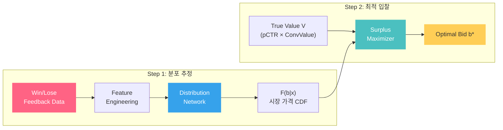
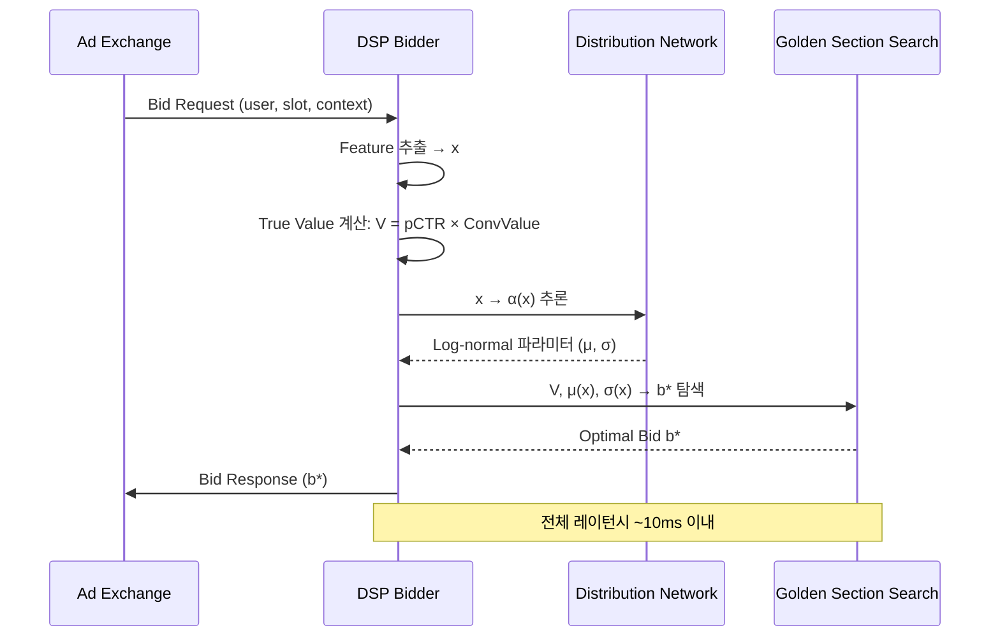

2017년을 기점으로 디지털 광고 시장의 경매 방식이 **2nd Price에서 1st Price으로** 대전환되었습니다. AppNexus, Index Exchange, OpenX, Rubicon Project가 잇따라 전환했고, Google AdX도 2019년에 합류했습니다. 이 변화는 DSP 엔지니어에게 전혀 새로운 문제를 던졌습니다: **"내 진짜 가치(True Value)보다 얼마나 깎아서 입찰해야 하는가?"**

이 글에서는 두 편의 논문을 중심으로 Bid Shading의 이론과 실무를 해부합니다:

- **Ghosh et al. (Adobe Research, 2020)** — "Scalable Bid Landscape Forecasting in Real-time Bidding"
- **Zhou et al. (Yahoo/Verizon Media, KDD 2021)** — "An Efficient Deep Distribution Network for Bid Shading in First-Price Auctions"

> 개념을 먼저 직관적으로 체험하고 싶다면, [Bid Shading Visualizer 데모](demo-bid-shading.html)를 열어 슬라이더를 조작해보세요. 이 글의 수식과 개념이 데모에서 어떻게 동작하는지 확인할 수 있습니다.

---

## 1. 왜 Bid Shading이 필요한가?

### ① 1st Price vs 2nd Price: 게임의 규칙이 바뀌었다

2nd Price 경매에서 DSP의 최적 전략은 간단했습니다: **True Value 그대로 입찰**(Truthful Bidding). 어차피 2등 가격을 지불하므로, 높게 입찰해도 손해 볼 일이 없었습니다. 하지만 1st Price에서는 **내 입찰가 그대로 지불**합니다. True Value로 입찰하면 이겨도 남는 게 없습니다.

| 구분 | 2nd Price Auction | 1st Price Auction |
|------|-------------------|-------------------|
| 지불 금액 | 2등 입찰가 (= 시장가) | **내 입찰가 그대로** |
| 최적 전략 | Truthful Bidding ($b = V$) | **Bid Shading ($b < V$)** |
| 시장 가격 정보 | 낙찰 시 Clearing Price 관측 | 패찰 시 경쟁자 가격 **미관측** |
| DSP 복잡도 | 낮음 (가치 계산만) | 높음 (분포 추정 + 최적화 필요) |

이 전환의 배경에는 두 가지 동기가 있었습니다:

- **투명성**: 1st Price에서는 입찰가 = 지불가이므로, 광고주가 정확히 얼마를 지불하는지 명확
- **Header Bidding 호환**: 2nd Price 경매는 Header Bidding의 워터폴 구조와 충돌

### ② Surplus 극대화 문제 정의

Bid Shading의 목표는 **기대 Surplus를 극대화**하는 것입니다. Zhou et al.은 이를 다음과 같이 정의합니다:

$$s(b; V, x) = \underbrace{(V - b)}_{\text{낙찰 시 이익 (Surplus)}} \cdot \underbrace{\Pr(\hat{b} < b \mid x)}_{\text{낙찰 확률 (Win Rate)}}$$

- $V$ : True Value (= pCTR × Conversion Value). pCTR 모델이 결정하는 값
- $b$ : 실제 입찰가 (DSP가 결정하는 변수)
- $\hat{b}$ : 시장의 Minimum Winning Price (경쟁자 최고 입찰가)
- $x$ : 컨텍스트 피처 벡터 (유저 특성, 지면, 시간대, 디바이스 등)

직관적으로 해석하면:

- $b$를 올리면 → Win Rate $\Pr(\hat{b} < b)$ 증가 → 하지만 이익 $(V - b)$ 감소
- $b$를 내리면 → 이익 $(V - b)$ 증가 → 하지만 Win Rate 감소

이 **시소 관계**의 균형점이 최적 입찰가 $b^*$입니다. [데모의 Sweep 차트](demo-bid-shading.html)에서 이 균형점을 직접 확인할 수 있습니다.

```python
import numpy as np
from scipy.stats import lognorm

def surplus(b, V, mu, sigma):
    """Surplus = (V - b) × F(b|x): 이익 × 낙찰 확률"""
    if b <= 0 or b >= V:
        return 0.0
    win_prob = lognorm.cdf(b, s=sigma, scale=np.exp(mu))
    return (V - b) * win_prob

# True Value $5, 시장가격 Log-normal(μ=0.8, σ=0.5)
V, mu, sigma = 5.0, 0.8, 0.5
bids = np.linspace(0.1, V - 0.1, 50)
surpluses = [surplus(b, V, mu, sigma) for b in bids]

best_idx = np.argmax(surpluses)
print(f"  최적 입찰가 b* = ${bids[best_idx]:.2f}")
print(f"  최대 Surplus  = ${surpluses[best_idx]:.3f}")
print(f"  Shading 비율  = {(1 - bids[best_idx]/V)*100:.0f}% 할인")
# b를 올리면 Win Rate↑ but 이익↓, 내리면 반대 — 이 균형이 b*
```

### ③ End-to-End 파이프라인 개요

최적 입찰가를 실시간으로 계산하려면 **2단계 파이프라인**이 필요합니다:



- **Step 1 (분포 추정)**: 과거 경매 데이터에서 시장 가격 분포 $F(b \mid x)$를 학습
- **Step 2 (최적 입찰)**: 학습된 분포와 True Value $V$를 이용해 Surplus를 극대화하는 $b^*$를 탐색

이 글의 나머지는 각 단계를 깊이 파고듭니다. 특히 Step 1에서 마주치는 **Censored Data 문제**가 핵심 난관입니다.

---

## 2. Censored Data 문제: 시장의 절반은 보이지 않는다

### ① Right-Censoring이란?

DSP 입장에서 경매 결과 데이터는 **비대칭적**입니다:

| 경매 결과 | 관측 가능한 정보 | 수식 표현 |
|-----------|------------------|-----------|
| **낙찰 (Win)** | 실제 Clearing Price $w_i$ | $w_i$ 직접 관측 |
| **패찰 (Lose)** | "내 입찰가 $b_i$보다 높았다"는 사실만 | $W_i > b_i$ (하한만 알 수 있음) |

패찰한 경매에서는 경쟁자가 $2.01을 입찰했는지, $10.00을 입찰했는지 알 수 없습니다. 오직 "내 $2.00보다는 높았다"는 것만 알 수 있습니다. 내 입찰가 **오른쪽(이상)**의 분포가 잘려있으므로 이를 **Right-Censoring**이라 부릅니다.

이것은 의학의 **생존 분석(Survival Analysis)**과 정확히 같은 구조입니다. "관찰 기간 내 사망하지 않은 환자의 실제 수명을 모른다"와 "패찰한 경매의 실제 시장 가격을 모른다"는 수학적으로 동치입니다.

> [데모](demo-bid-shading.html)에서 **"Censored View로 전환"** 버튼을 눌러보세요. 내 입찰가 이상의 히스토그램이 "???" 사선 패턴으로 바뀌며, 실제 DSP가 보는 정보의 한계를 눈으로 확인할 수 있습니다.

### ② Naive 추정이 실패하는 이유

가장 단순한 접근은 "관측된 데이터(낙찰한 경매의 clearing price)만으로 분포를 추정"하는 것입니다. 하지만 이것은 **선택 편향(Selection Bias)**에 빠집니다:

$$\hat{\mu}_{\text{naive}} = \mathbb{E}[W \mid W < b] \;<\; \mathbb{E}[W] = \mu_{\text{true}}$$

관측된 데이터는 모두 "내가 이긴 경매" = **경쟁자 가격이 낮았던 경매**에서만 추출됩니다. 따라서 시장 가격의 평균과 중앙값을 **체계적으로 과소추정**합니다.

데모에서 Censored View를 켜면 나타나는 **분홍 점선**이 바로 이 Naive 추정입니다. 실제 분포(God View)와 비교했을 때:

- Mean이 20~40% 과소추정됨
- Shading을 과도하게 적용 → 낙찰률 급감 → 전체 수익 하락

Ghosh et al.은 iPinYou 데이터에서 이 문제를 Figure 1로 직접 보여줍니다: Kaplan-Meier 추정치와 단순 Gaussian Fit의 괴리가 매우 큽니다.

### ③ Censored Regression의 핵심 아이디어

Censored Data를 올바르게 다루는 핵심은 **Win 데이터와 Lose 데이터를 다르게 취급**하는 것입니다. 두 논문 모두 다음 형태의 손실 함수를 사용합니다:

$$\mathcal{L} = \underbrace{\sum_{i \in \mathcal{W}} \log P(w_i \mid x_i)}_{\text{낙찰: PDF 직접 사용}} + \underbrace{\sum_{i \in \mathcal{L}} \log \Pr(W_i > b_i \mid x_i)}_{\text{패찰: Survival Function 사용}}$$

- $\mathcal{W}$ : 낙찰(Win) 경매 집합, $\mathcal{L}$ : 패찰(Lose) 경매 집합
- $P(w_i \mid x_i)$ : 시장 가격의 PDF (확률 밀도)
- $\Pr(W_i > b_i \mid x_i) = 1 - F(b_i \mid x_i)$ : 시장 가격이 내 입찰가를 초과할 확률 (Survival Function)

**직관적 해석**: 낙찰한 경매에서는 실제 관측된 시장 가격 $w_i$의 likelihood를 최대화합니다. 패찰한 경매에서는 "시장 가격이 내 입찰가보다 높다"는 **부분 정보**의 likelihood를 최대화합니다. 이렇게 하면 Lose 데이터의 하한(lower bound) 정보도 학습에 활용하여, Naive 추정의 과소추정 문제를 보정할 수 있습니다.

이것이 Censored Regression의 핵심이며, 두 논문의 출발점입니다. 차이는 **어떤 분포 가정을 사용하느냐**에 있습니다.

---

## 3. 분포 추정 모델의 진화: Standard CR에서 MCNet까지

### ① Standard Censored Regression (Baseline)

가장 기본적인 Censored Regression은 winning price가 **정규분포**를 따른다고 가정합니다:

$$W_i \mid x_i \sim \mathcal{N}(\beta^T x_i, \; \sigma^2)$$

여기서 $\beta$는 feature 가중치, $\sigma$는 **모든 bid request에 대해 동일한** 표준편차(등분산, homoscedastic)입니다.

이 모델의 두 가지 **치명적 가정**:

1. **등분산(Homoscedasticity)**: 프리미엄 지면이든 롱테일 지면이든, 시간대가 낮이든 밤이든, 분산 $\sigma$가 같다고 가정. 현실에서는 당연히 다릅니다.
2. **단봉(Unimodal) 가우시안**: 시장 가격 분포가 피크 하나인 종 모양이라고 가정. 하지만 실제로는 소규모 DSP 클러스터와 대형 DSP 클러스터가 서로 다른 가격대에 몰려있어 **다봉(multi-modal)** 분포를 보입니다.

Ghosh et al.은 iPinYou 데이터의 Figure 1에서 이 두 가정이 모두 위반됨을 직접 보여줍니다.

### ② Fully Parametric Censored Regression (P-CR) — Ghosh et al.

첫 번째 개선은 **이분산(heteroscedastic) 모델**입니다. $\sigma$를 고정 상수가 아니라 feature의 함수로 만듭니다:

$$\sigma_i = \exp(\alpha^T x_i)$$

- $\alpha$ : 분산을 결정하는 별도의 가중치 벡터
- $\exp(\cdot)$ : 양수 보장을 위한 변환

이제 bid request의 특성에 따라 분산이 달라집니다. 예를 들어 경쟁이 치열한 프리미엄 지면은 $\sigma$가 작고(가격이 촘촘), 롱테일 지면은 $\sigma$가 클 수 있습니다. 하지만 여전히 **단봉 가우시안** 가정은 유지됩니다.

### ③ MCNet (Mixture Density Censored Network) — Ghosh et al.

Ghosh et al.의 핵심 기여는 **Mixture Density Network를 Censored Data에 적용**한 MCNet입니다. $K$개의 가우시안 혼합으로 임의의 분포를 근사합니다:

$$P(w \mid x) = \sum_{k=1}^{K} \underbrace{\pi_k(x)}_{\text{혼합 가중치}} \cdot \frac{1}{\sigma_k(x)} \phi\!\left(\frac{w - \mu_k(x)}{\sigma_k(x)}\right)$$

- $\pi_k(x)$ : $k$번째 혼합 성분의 가중치 (softmax로 출력, 합 = 1)
- $\mu_k(x)$ : $k$번째 성분의 평균 (딥 네트워크 출력)
- $\sigma_k(x)$ : $k$번째 성분의 표준편차 ($\exp(\cdot)$으로 양수 보장)
- $\phi$ : 표준 정규분포 PDF

딥 네트워크가 입력 $x$로부터 $3K$개의 파라미터($\mu_k, \sigma_k, \pi_k$)를 동시에 출력합니다. 이로써:

- **이분산**: 각 성분의 $\sigma_k(x)$가 feature에 따라 다름
- **다봉**: $K$개 성분의 혼합으로 복수의 피크 표현 가능
- **Censored Data 처리**: 위의 Censored Likelihood와 결합하여 Win/Lose 데이터 모두 활용

### ④ Zhou et al.의 접근: 단일 분포 + 강력한 네트워크

Zhou et al.은 다른 전략을 취합니다. 혼합 모델 대신 **단일 파라메트릭 분포**를 사용하되, **네트워크 구조를 강화**합니다. 4가지 분포를 비교 실험한 결과:

| 분포 | Log-loss | Surplus Lift (vs 프로덕션) | 특징 |
|------|----------|--------------------------|------|
| Truncated Normal | 0.87 | +1.45% | 음수 허용 안 함, 양쪽 꼬리 제한 |
| Exponential | 0.68 | +5.12% | 단순, 무기억 성질 |
| Gamma | 0.58 | +6.85% | 유연한 형태, 양수 지지 |
| **Log-normal** | **0.56** | **+9.65%** | **오른쪽 긴 꼬리, 양수 지지** |

**Log-normal이 압도적**입니다. 이유는 명확합니다: RTB 시장의 입찰가는 양수이며, 대부분 중간 가격대에 집중되지만 가끔 매우 높은 입찰이 있습니다. 이러한 **양수 + 오른쪽 긴 꼬리(right-skewed)** 특성을 log-normal이 가장 잘 포착합니다.

네트워크 구조도 비교했습니다 (log-normal 분포 기준):

| 네트워크 구조 | Log-loss | Surplus Lift | 특징 |
|-------------|----------|-------------|------|
| Logistic Regression | 0.718 | baseline | 선형, Feature Interaction 없음 |
| FM | 0.569 | +4.52% | 2차 Feature Interaction |
| FwFM | 0.558 | +4.70% | 가중 FM |
| Wide & Deep | 0.522 | +6.36% | 선형 + DNN 결합 |
| **DeepFM** | **0.521** | **+7.10%** | **FM + DNN, 고차 Interaction 학습** |

**핵심 조합: Log-normal 분포 + DeepFM 네트워크**가 최적입니다.

---

## 4. 최적 입찰가 계산: Surplus Maximization

분포 $F(b \mid x)$를 학습했다면, 이제 $b^*$를 찾아야 합니다.

### ① Surplus Unimodality 증명

Zhou et al.의 핵심 이론적 기여는 **surplus 함수의 단봉성(unimodality) 증명**입니다. Log-normal 분포의 경우:

$$s(b) = (V - b) \cdot \Phi\!\left(\frac{\ln b - \mu(x)}{\sigma(x)}\right)$$

- $\Phi$ : 표준 정규분포 CDF
- $\mu(x), \sigma(x)$ : 네트워크가 출력한 log-normal 파라미터

**Theorem 1 (Zhou et al.)**: Truncated-normal, Exponential, Gamma, Log-normal 분포 모두에서 surplus 함수 $s(b)$는 구간 $(0, V)$에서 **정확히 하나의 극대값(global maximum)**을 가지며, 극소값은 없다.

증명의 핵심은 $s''(b)$가 $(0, V)$에서 최대 하나의 근을 가진다는 것을 각 분포별로 보이는 것입니다. 예를 들어 log-normal의 경우:

$$s''(b) = \frac{f_{\ln}(b)}{b\sigma^2} \left[(\mu - \sigma^2 - \ln b)(V - b) - 2\sigma^2 b\right]$$

대괄호 안의 함수가 $b$에 대해 볼록(convex)이므로 최대 하나의 근을 가집니다.

**이것이 중요한 이유**: 극대값이 하나뿐이라는 것은 **어떤 탐색 알고리즘이든 최적해를 찾을 수 있다**는 보장입니다. Grid Search도 되지만, 훨씬 효율적인 방법이 있습니다.

### ② Golden Section Search

단봉 함수에서 최적값을 찾는 가장 효율적인 방법은 **황금 비율 탐색(Golden Section Search)**입니다:

```python
import numpy as np
from scipy.stats import lognorm

def golden_section_search(V, mu, sigma, tol=0.01):
    """황금 비율 탐색으로 최적 입찰가 b* 계산"""
    def surplus(b):
        return (V - b) * lognorm.cdf(b, s=sigma, scale=np.exp(mu))

    gr = (np.sqrt(5) + 1) / 2  # 황금 비율 ≈ 1.618
    a, b = 1e-6, V - 1e-6

    iters = 0
    while (b - a) > tol:
        x1 = b - (b - a) / gr
        x2 = a + (b - a) / gr
        if surplus(x1) > surplus(x2):
            b = x2
        else:
            a = x1
        iters += 1

    optimal_bid = (a + b) / 2
    print(f"  b* = ${optimal_bid:.4f}  ({iters}회 반복, 구간 < ${tol})")
    return optimal_bid

# V=$5.00, 시장가격 Log-normal(μ=0.8, σ=0.5)
b_star = golden_section_search(V=5.0, mu=0.8, sigma=0.5, tol=0.01)
# Grid Search(500개) 대비 약 25배 빠른 수렴
```

**수렴 속도**: 매 반복마다 탐색 구간이 $1/\phi \approx 0.618$배로 줄어듭니다. $V = \$5.00$, $\varepsilon = \$0.01$일 때 약 **20회 반복**이면 충분합니다. Grid Search($N = 500$개 그리드)보다 25배 빠릅니다.

이 효율성이 **수십억 건/일의 실시간 서빙**을 가능하게 합니다. CDF 평가($F(b \mid x)$)만 빠르면 전체 bid 최적화가 $O(\log(1/\varepsilon))$에 완료됩니다.

### ③ 실시간 서빙 아키텍처

Zhou et al.은 VerizonMedia DSP에서 이 파이프라인을 프로덕션 배포한 아키텍처를 공개합니다:



핵심 포인트:
- Distribution Network는 **오프라인 학습 → 주기적 모델 로딩**
- Golden Section Search는 **온라인 실시간 실행** (~20회 CDF 평가)
- 전체 Bid Shading 모듈은 기존 DSP 파이프라인에 **플러그인**으로 추가

---

## 5. 실험 결과와 프로덕션 임팩트

### ① iPinYou Dataset — Ghosh et al.

공개 데이터셋 iPinYou (53M 샘플, win rate 22.87%)에서의 실험:

- **MCNet**(혼합 밀도 네트워크)이 Standard Censored Regression, Kaplan-Meier 추정 대비 **NLL(Negative Log-Likelihood)과 분포 캘리브레이션** 모두에서 유의미한 개선
- 특히 **다봉 분포 구간**에서 MCNet의 강점이 두드러짐: 단일 가우시안으로는 포착할 수 없는 복수 피크를 정확히 모델링
- Adobe Adcloud(Adobe 자사 DSP) 데이터에서도 동일한 경향 확인

### ② Yahoo/Verizon Offline — Zhou et al.

VerizonMedia DSP의 실제 입찰 데이터에서:

- 12개 Feature (exchange_id, device_type, sub_domain, ad layout, hour, day_of_week 등) 사용
- 7일 학습 → 1일 테스트
- **Non-censored**(open auction, winning price 제공): Log-normal이 **+9.65% surplus lift**
- **Censored**(closed auction, winning price 비제공): Log-normal이 **+5.32% surplus lift**

Non-censored와 Censored의 성능 차이(9.65% vs 5.32%)는 **winning price 정보의 가치**를 정량적으로 보여줍니다. SSP가 winning price를 공개하는 Open Auction은 DSP에게 약 **4%p의 추가 최적화 여지**를 제공합니다.

### ③ Online A/B 테스트 — Zhou et al.

VerizonMedia DSP에서 3일간 Online A/B 테스트를 진행한 결과:

| 캠페인 최적화 목표 | eCPX 개선 (median) | 비용 효율 개선 캠페인 비율 | ROI (BPI) |
|------------------|-------------------|--------------------------|-----------|
| CPA (전환) | -3.5% | 62.3% | **+8.57%** |
| CPC (클릭) | -0.9% | 54.5% | +2.35% |
| CPM (노출) | -6.2% | 71.8% | +2.35% |

- eCPX 감소 = 같은 성과를 더 싼 비용으로 달성 → 광고주 ROI 개선
- **71.5% 이상의 캠페인**에서 비용 효율이 개선됨
- **수십억 bid request/일**을 처리하는 세계 최대 규모 DSP 중 하나에서 프로덕션 검증

### ④ 두 논문의 포지셔닝

| 차원 | Ghosh et al. (Adobe, 2020) | Zhou et al. (Yahoo, KDD 2021) |
|------|---------------------------|-------------------------------|
| **초점** | 분포 추정 (Step 1) | End-to-End (Step 1 + Step 2) |
| **분포 모델** | Gaussian Mixture (MCNet, K성분) | 단일 분포 (Log-normal 최적) |
| **Censoring 처리** | Censored Likelihood (PDF + Survival) | Censored + Non-censored 통합 |
| **최적 입찰** | 별도 다루지 않음 | Golden Section Search + Unimodality 증명 |
| **실시간 서빙** | 언급 없음 | 프로덕션 아키텍처 공개 |
| **검증** | iPinYou (공개) + Adobe Adcloud (자사 DSP) | Yahoo/Verizon Online A/B (프로덕션) |
| **핵심 기여** | 이질적 분산 + 다봉 분포 모델링 | Unimodality 증명 + O(log n) 최적 탐색 |

두 논문은 **상호 보완적**입니다. Ghosh et al.이 "분포 추정을 어떻게 정확하게 할 것인가"에 집중한다면, Zhou et al.은 "추정한 분포로 실제 bid를 어떻게 실시간으로 최적화하고 서빙할 것인가"까지 포함하는 end-to-end 시스템입니다. 만약 시장이 심하게 multi-modal하다면 MCNet의 혼합 모델이 유리하고, 레이턴시가 극도로 중요하다면 Zhou et al.의 단일 분포 + Golden Section 조합이 실용적입니다.

---

## 6. 실무 피처 엔지니어링 가이드

논문들이 "feature vector $x$"로 추상화하는 부분을 실무에서 어떻게 구성하는지 정리합니다. Zhou et al.이 실험에 사용한 12개 피처를 기반으로, 실무에서 검증된 피처 카테고리를 소개합니다.

### ① 핵심 피처 카테고리

| 카테고리 | 피처 예시 | 영향도 | 설명 |
|---------|---------|-------|------|
| **Exchange 특성** | exchange_id, auction_type | ★★★ | Exchange마다 경쟁 강도와 가격 분포가 근본적으로 다름 |
| **지면 특성** | domain, sub_domain, ad_layout, slot_size | ★★★ | 프리미엄 매체 vs 롱테일의 가격 차이가 수 배 |
| **시간 특성** | hour_of_day, day_of_week | ★★☆ | 출퇴근 시간대, 주말 vs 평일의 경쟁 강도 차이 |
| **디바이스 특성** | device_type, os, browser | ★★☆ | 모바일 vs 데스크톱, iOS vs Android의 가격대 차이 |
| **유저 특성** | geo (country/region), audience_segment | ★★☆ | 미국 vs 동남아, 고가치 세그먼트의 가격 차이 |
| **광고 특성** | ad_format (banner/video/native), creative_size | ★☆☆ | 비디오 지면이 배너보다 높은 가격대 형성 |

### ② 피처 선택 시 주의사항

**Cardinality 관리**: `sub_domain`처럼 카디널리티가 수만~수십만인 피처는 직접 원핫 인코딩하면 차원이 폭발합니다. 실무에서는:
- Hashing Trick (feature hashing)으로 고정 차원에 매핑
- 상위 N개만 유지하고 나머지는 "기타"로 묶기
- Embedding Layer로 저차원 벡터에 학습

**Cross Feature**: `exchange_id × hour_of_day`처럼 피처 간 교차항이 중요합니다. 특정 Exchange는 낮 시간대에만 경쟁이 치열할 수 있습니다. DeepFM이 이 Cross Feature를 자동 학습하는 것이 강점입니다.

**사용하면 안 되는 피처**: 자신의 과거 입찰가(`my_previous_bid`)를 피처로 넣으면 **자기 참조 루프**가 발생합니다. 시장 분포는 내 입찰과 독립적이어야 합니다.

---

## 7. 시간에 따른 시장 분포 변화 대응

실무에서 가장 과소평가되는 문제 중 하나입니다. 시장 분포 $F(b|x)$는 **고정되어 있지 않습니다**.

### ① 분포가 변하는 원인

| 원인 | 시간 스케일 | 영향 |
|------|-----------|------|
| **시간대 변동** | 시간 단위 | 출근 시간 vs 새벽의 경쟁 강도 차이 |
| **요일 변동** | 일 단위 | 주말 쇼핑 트래픽 증가 → 커머스 지면 가격 급등 |
| **시즌 효과** | 주~월 단위 | 블랙 프라이데이, 연말 시즌에 입찰가 전반 상승 |
| **경쟁 DSP 전략 변경** | 일~주 단위 | 대형 DSP의 알고리즘 업데이트 → 시장 구조 변화 |
| **SSP Floor Price 조정** | 비정기 | Floor 인상 → 하위 분포 잘림 (left-truncation) |

### ② 대응 전략

**모델 재학습 주기 설정**:
- **일 단위 재학습**이 일반적인 베이스라인. Zhou et al.도 "7일 학습 → 1일 테스트"로 실험
- 시즌 전환기(블랙 프라이데이 전후)에는 **학습 윈도우를 짧게** (3일) 조정하여 최신 분포를 빠르게 반영
- 학습 데이터에 **시간 감쇠 가중치(time-decay weighting)** 적용: 최근 데이터에 높은 가중치

**실시간 보정 (Online Calibration)**:
- 오프라인 모델의 예측을 실시간 Win Rate 관측으로 보정
- 예: 모델이 예측한 Win Rate = 30%인데 실제 최근 1시간 Win Rate = 20%이면, 시장 가격이 올랐다는 신호 → Shading 비율을 줄여 입찰가를 높임

**Distribution Shift 모니터링**:
- 시간대별 예측 Win Rate vs 실제 Win Rate의 괴리(calibration gap) 추적
- Gap이 임계치(예: 5%p)를 초과하면 모델 재학습 트리거 또는 온라인 보정 강도 증가

---

## 8. 보론: Quality Index가 존재할 때의 시장 가격 재정의

앞선 섹션들에서는 입찰가 자체가 경매 순위를 결정하는 순수 CPM 경매를 가정했습니다. 하지만 실제 RTB 경매에서는 SSP가 입찰가에 **Quality Index(QI)** -- 광고 품질 점수, Viewability 예측치, 클릭률 보정 계수 등 -- 를 곱한 **Rank Index(RI)**로 순위를 매깁니다. 이때 자연스러운 의문이 생깁니다: "낙찰자의 Raw Bid가 내 입찰가보다 **낮은데** 내가 졌다면, 섹션 2에서 정의한 Censored Data의 전제(시장 가격 > 내 입찰가)가 깨지는 것 아닌가?"

결론부터 말하면, **깨지지 않습니다.** 핵심은 "시장 가격"의 정의를 Raw Bid가 아닌 **Required Bid**로 변환하는 것입니다.

### Required Bid: 내가 이기려면 얼마를 써야 했는가

구체적인 시나리오를 보겠습니다.

| 참여자 | Raw Bid | Quality Index | Rank Index (Bid x QI) | 결과 |
|--------|---------|---------------|----------------------|------|
| **나 (패찰)** | $80 | 1.0 | 80 | Lose |
| **경쟁자 (낙찰)** | $60 | 2.0 | 120 | Win |

경쟁자의 Raw Bid($60)는 내 Raw Bid($80)보다 **낮습니다.** 그런데 내가 졌습니다. QI가 2배 높은 경쟁자가 더 적은 돈으로도 더 높은 Rank Index를 확보했기 때문입니다.

이 상황에서 **Required Bid** -- 내가 이기기 위해 필요했던 최소 입찰가 -- 를 계산하면:

$$\text{Required Bid} = \frac{\text{Winner's RI}}{\text{My QI}} = \frac{120}{1.0} = \$120$$

이제 관계가 역전됩니다: **Required Bid($120) > My Bid($80)**. Censored Regression의 전제가 성립합니다. 섹션 2의 Right-Censoring 프레임워크와 섹션 4의 Surplus 극대화 공식을 그대로 적용할 수 있되, "시장 가격"을 Required Bid로 치환하면 됩니다.

### 비유: 높이뛰기 경기

직관적으로 이해하기 위해 높이뛰기에 비유해보겠습니다.

- **경쟁자**는 키가 큰 선수(QI = 2.0)입니다. 60cm만 점프해도 120cm 바를 넘습니다.
- **나**는 키가 작은 선수(QI = 1.0)입니다. 80cm를 점프해도 120cm 바를 넘지 못합니다.
- 경쟁자가 "덜 뛰었다(Raw Bid가 낮다)"는 사실은 중요하지 않습니다. **바의 높이(Required Bid)가 내 점프력(My Bid)을 초과했다**는 사실이 핵심입니다.

따라서 "Market Height > 80cm(내 점프)" -- 즉 시장 가격이 내 입찰가보다 높다 -- 는 유효한 관측입니다.

### 핵심 통찰

**"품질이 부족해서 진 것"도 돈으로 환산하면 "돈을 덜 내서 진 것"과 수학적으로 동치입니다.** QI 차이로 인한 패찰이든, Raw Bid 차이로 인한 패찰이든, Required Bid 공간으로 변환하면 동일한 Censored Regression 문제로 귀결됩니다.

참고로, 모든 참여자의 QI = 1.0인 순수 CPM 경매에서는 Required Bid = Winner's Raw Bid가 되어, 앞선 섹션들에서 다룬 표준적인 경우와 정확히 일치합니다. 즉 QI가 없는 경매는 이 프레임워크의 **특수 케이스**입니다.

실무적으로 DSP가 경쟁자의 정확한 QI 값을 항상 알 수 있는 것은 아닙니다. 하지만 SSP가 제공하는 Minimum Bid to Win 같은 신호를 통해 Required Bid를 근사할 수 있고, 수학적 프레임워크 자체는 QI 정보의 정밀도와 무관하게 성립합니다.

---

## 마무리

1. **1st Price Auction에서 Bid Shading은 선택이 아니라 필수** — True Value 그대로 입찰하면 이익이 0. [데모](demo-bid-shading.html)에서 No Shade의 E[Profit] = $0.00을 직접 확인해보세요.

2. **Censored Data를 무시하면 시장 가격을 체계적으로 과소추정** — Naive 추정의 위험성. 반드시 Censored Regression 또는 Survival Analysis 기법이 필요합니다.

3. **분포 선택이 성능을 좌우** — Log-normal이 RTB 시장에서 가장 강력합니다. 다봉 분포가 의심되면 MCNet을 고려하세요.

4. **Unimodality 증명 덕분에 Golden Section Search로 O(log n) 최적 입찰** — Grid Search가 불필요하며, 실시간 서빙이 가능합니다.

5. **End-to-End가 핵심** — 분포 추정만 잘해서는 부족합니다. 최적 입찰가 계산 + 서빙 레이턴시까지 고려해야 프로덕션에서 성과를 낼 수 있습니다.

이 기술은 Google DV360, The Trade Desk, Yahoo DSP, Amazon DSP 등 **모든 주요 DSP**에서 프로덕션으로 운영 중입니다. pCTR 모델의 정확도가 True Value의 정확도를 결정하고, True Value가 정확해야 Bid Shading이 효과적이므로 — **pCTR 모델러와 Bidding 엔지니어의 협업**이 이 파이프라인의 성패를 좌우합니다.

---

### 참고문헌

- Ghosh, A., Mitra, S., Sarkhel, S., Xie, J., Wu, G., & Swaminathan, V. (2020). *Scalable Bid Landscape Forecasting in Real-time Bidding*. arXiv:2001.06587.
- Zhou, T., He, H., Pan, S., Karlsson, N., Shetty, B., Kitts, B., ... & Flores, A. (2021). *An Efficient Deep Distribution Network for Bid Shading in First-Price Auctions*. In Proceedings of the 27th ACM SIGKDD Conference on Knowledge Discovery and Data Mining (KDD '21).
