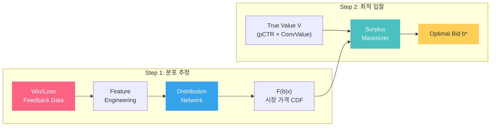
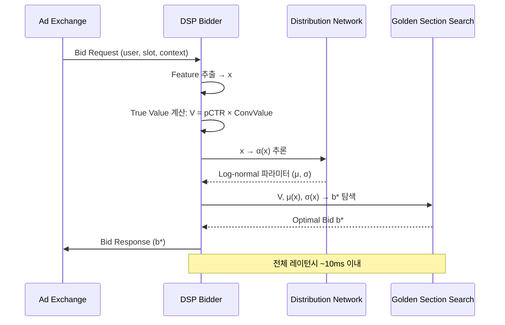

2017년 무렵부터 디지털 광고 시장의 경매 방식이 **2nd Price에서 1st Price로** 대전환되었습니다. AppNexus·Index Exchange·OpenX·Rubicon Project 같은 거래소가 먼저 움직였습니다. 2019년 무렵 Google Ad Manager(AdX)까지 합류하며 사실상 업계 표준이 됐습니다. 규칙이 왜 바뀌었는지는 [2등 가격 경매](post.html?id=second-price-auction)에서 다룹니다. 이 글은 그 다음 질문만 파고듭니다: **"내 진짜 가치(True Value)보다 얼마나 깎아서 입찰해야 하는가?"**

이 글에서는 두 편의 논문을 중심으로 Bid Shading의 이론과 실무를 해부합니다:

- **Ghosh et al. (Adobe Research, 2020)** — "Scalable Bid Landscape Forecasting in Real-time Bidding"
- **Zhou et al. (Yahoo/Verizon Media, KDD 2021)** — "An Efficient Deep Distribution Network for Bid Shading in First-Price Auctions"

> 먼저 직관으로 체험하고 싶다면 [Bid Shading Visualizer 데모](demo-bid-shading.html)의 슬라이더를 움직여 보세요. 이 글의 수식이 실제로 어떻게 움직이는지 볼 수 있습니다.

---

## 1. 왜 Bid Shading이 필요한가?

### ① 1st Price vs 2nd Price: 게임의 규칙이 바뀌었다

2nd Price 경매에서 DSP의 최적 전략은 간단했습니다: **True Value 그대로 입찰**(Truthful Bidding). 어차피 2등 가격을 지불하므로, 높게 입찰해도 손해 볼 일이 없었습니다. 하지만 1st Price에서는 **내 입찰가 그대로 지불**합니다. True Value로 입찰하면 이겨도 남는 게 없습니다.

| 구분 | 2nd Price Auction | 1st Price Auction |
|------|-------------------|-------------------|
| 지불 금액 | 2등 입찰가 (= 시장가) | **내 입찰가 그대로** |
| 최적 전략 | Truthful Bidding ($b = V$) | **Bid Shading ($b < V$)** |
| 시장 가격 정보 | 낙찰 시 Clearing Price 관측 | 패찰 시 경쟁자 가격 **미관측** |
| DSP 복잡도 | 낮음 (가치 계산만) | 높음 (분포 추정 + 최적화 필요) |

이 전환의 배경에는 두 가지 동기가 있었습니다:

- **투명성**: 1st Price에서는 입찰가 = 지불가이므로, 광고주가 정확히 얼마를 지불하는지 명확
- **Header Bidding 호환**: 2nd Price 경매는 [헤더비딩](post.html?id=header-bidding)의 워터폴 구조와 충돌

> 헷갈리기 쉬운 이웃 주제가 하나 있습니다. 이 글은 **경매 한 번에 얼마를 부를지**, 즉 가치 추정과 마지막 깎기를 다룹니다. 하루 예산과 목표 CPA를 맞추려고 입찰가를 위아래로 미는 제어는 [Auto-Bidding & Pacing](post.html?id=auto-bidding-pacing)이 담당합니다.

### ② Surplus 극대화 문제 정의

Bid Shading의 목표는 **기대 Surplus를 극대화**하는 것입니다. Zhou et al.은 이를 다음과 같이 정의합니다:

$$s(b; V, x) = \underbrace{(V - b)}_{\text{낙찰 시 이익 (Surplus)}} \cdot \underbrace{\Pr(\hat{b} < b \mid x)}_{\text{낙찰 확률 (Win Rate)}}$$

- $V$ : True Value (= pCTR × Conversion Value). pCTR 모델이 결정하는 값
- $b$ : 실제 입찰가 (DSP가 결정하는 변수)
- $\hat{b}$ : 시장의 Minimum Winning Price (경쟁자 최고 입찰가)
- $x$ : 컨텍스트 피처 벡터 (유저 특성, 지면, 시간대, 디바이스 등)

직관적으로 해석하면:

- $b$를 올리면 → Win Rate $\Pr(\hat{b} < b)$ 증가 → 하지만 이익 $(V - b)$ 감소
- $b$를 내리면 → 이익 $(V - b)$ 증가 → 하지만 Win Rate 감소

이 **시소 관계**의 균형점이 최적 입찰가 $b^*$입니다. [데모의 Sweep 차트](demo-bid-shading.html)에서 이 균형점을 직접 확인할 수 있습니다.

```python
import numpy as np
from scipy.stats import lognorm

def surplus(b, V, mu, sigma):
    """Surplus = (V - b) × F(b|x): 이익 × 낙찰 확률"""
    if b <= 0 or b >= V:
        return 0.0
    win_prob = lognorm.cdf(b, s=sigma, scale=np.exp(mu))
    return (V - b) * win_prob

# True Value $5, 시장가격 Log-normal(μ=0.8, σ=0.5)
V, mu, sigma = 5.0, 0.8, 0.5
bids = np.linspace(0.1, V - 0.1, 50)
surpluses = [surplus(b, V, mu, sigma) for b in bids]

best_idx = np.argmax(surpluses)
print(f"  최적 입찰가 b* = ${bids[best_idx]:.2f}")
print(f"  최대 Surplus  = ${surpluses[best_idx]:.3f}")
print(f"  Shading 비율  = {(1 - bids[best_idx]/V)*100:.0f}% 할인")
# b를 올리면 Win Rate↑ but 이익↓, 내리면 반대 — 이 균형이 b*
# 출력:
#   최적 입찰가 b* = $2.65
#   최대 Surplus  = $1.496
#   Shading 비율  = 47% 할인
```

### ③ 깎기 비율을 바꿔 보면 — 가상 데이터

말로는 시소지만 숫자로 보면 뚜렷합니다. 진짜 가치 1,000원인 노출 하나를 놓고 깎는 비율만 바꿔 봅니다. 경쟁자 최고가는 **가상 데이터** 20,000건이고, 그 평균은 546원입니다.

| 깎기 비율 | 내 입찰가 | 승률 | 기대이익 |
|---|---|---|---|
| 0% | 1,000원 | 94.0% | **0.0원** |
| 20% | 800원 | 85.9% | 171.7원 |
| 40% | 600원 | 66.9% | **267.6원** |
| 50% | 500원 | 51.3% | 256.4원 |

0%는 이겨도 남는 게 없습니다. 50%는 마진이 크지만 절반을 놓칩니다. 최적점은 양 끝이 아니라 **가운데**에 있습니다.

```python
import random

V = 1000  # 이 노출의 진짜 가치(원). pCTR x 전환가치로 계산된 값.

# 가상 데이터: 경쟁자 최고가를 20,000번 뽑아 '진짜 시장 분포'를 만든다.
# 로그정규를 쓰는 이유는 입찰가가 늘 양수이고 오른쪽 꼬리가 길기 때문이다.
def market(mu):
    random.seed(42)
    return [random.lognormvariate(mu, 0.45) for _ in range(20000)]

def profit(bid, prices):
    wins = sum(1 for p in prices if p < bid)   # 경쟁가가 내 입찰가보다 낮으면 내가 이김
    win_rate = wins / len(prices)
    return win_rate, win_rate * (V - bid)      # 기대이익 = 승률 x (가치 - 입찰가)

for label, mu in [("평상시", 6.2), ("경쟁 과열", 7.0)]:
    prices = market(mu)
    print("%s: 시장 평균 %.0f원" % (label, sum(prices) / len(prices)))
    print("  깎기 |   입찰 |   승률 | 기대이익")
    best = (0, 0.0)
    for cut in (0, 10, 20, 30, 40, 50):
        bid = V * (100 - cut) // 100
        wr, ep = profit(bid, prices)
        print("  %2d%% | %4d원 | %5.1f%% | %6.1f원" % (cut, bid, wr * 100, ep))
        if ep > best[1]:
            best = (cut, ep)
    print("  -> 최적은 %d%% 깎기" % best[0])

# 출력:
# 평상시: 시장 평균 546원
#   깎기 |   입찰 |   승률 | 기대이익
#    0% | 1000원 |  94.0% |    0.0원
#   10% |  900원 |  90.7% |   90.7원
#   20% |  800원 |  85.9% |  171.7원
#   30% |  700원 |  78.1% |  234.4원
#   40% |  600원 |  66.9% |  267.6원
#   50% |  500원 |  51.3% |  256.4원
#   -> 최적은 40% 깎기
# 경쟁 과열: 시장 평균 1215원
#   깎기 |   입찰 |   승률 | 기대이익
#    0% | 1000원 |  41.8% |    0.0원
#   10% |  900원 |  32.9% |   32.9원
#   20% |  800원 |  24.2% |   48.3원
#   30% |  700원 |  16.1% |   48.2원
#   40% |  600원 |   9.2% |   36.7원
#   50% |  500원 |   4.2% |   21.0원
#   -> 최적은 20% 깎기
```

경쟁이 과열되면 최적점이 움직입니다. 시장 평균이 546원에서 1,215원으로 오르자 최적 깎기가 40%에서 20%로 내려왔습니다. 비싼 시장에서는 덜 깎아야 이깁니다. 꼭대기가 평평한 것도 눈여겨보세요. 과열 시장의 20%와 30%는 0.1원 차이입니다.

### ④ End-to-End 파이프라인 개요

최적 입찰가를 실시간으로 계산하려면 **2단계 파이프라인**이 필요합니다:


```mermaid
graph LR
    subgraph Step1["Step 1: 분포 추정"]
        DATA["Win/Lose<br/>Feedback Data"] --> FEAT["Feature<br/>Engineering"]
        FEAT --> MODEL["Distribution<br/>Network"]
        MODEL --> DIST["F(b|x)<br/>시장 가격 CDF"]
    end

    subgraph Step2["Step 2: 최적 입찰"]
        TV["True Value V<br/>(pCTR × ConvValue)"] --> OPT["Surplus<br/>Maximizer"]
        DIST --> OPT
        OPT --> BID["Optimal Bid b*"]
    end

    style DATA fill:#ff6384,stroke:#ff6384,color:#fff
    style MODEL fill:#36a2eb,stroke:#36a2eb,color:#fff
    style OPT fill:#4bc0c0,stroke:#4bc0c0,color:#fff
    style BID fill:#ffce56,stroke:#ffce56,color:#333
```

- **Step 1 (분포 추정)**: 과거 경매 데이터에서 시장 가격 분포 $F(b \mid x)$를 학습
- **Step 2 (최적 입찰)**: 학습된 분포와 True Value $V$를 이용해 Surplus를 극대화하는 $b^*$를 탐색

이 글의 나머지는 각 단계를 깊이 파고듭니다. 특히 Step 1에서 마주치는 **Censored Data 문제**가 핵심 난관입니다.

---

## 2. Censored Data 문제: 시장의 절반은 보이지 않는다 [무대: 열린 RTB]

### ① Right-Censoring이란?

DSP 입장에서 경매 결과 데이터는 **비대칭적**입니다:

| 경매 결과 | 관측 가능한 정보 | 수식 표현 |
|-----------|------------------|-----------|
| **낙찰 (Win)** | 실제 Clearing Price $w_i$ | $w_i$ 직접 관측 |
| **패찰 (Lose)** | "내 입찰가 $b_i$보다 높았다"는 사실만 | $W_i > b_i$ (하한만 알 수 있음) |

패찰한 경매에서는 경쟁자가 $2.01을 불렀는지 $10.00을 불렀는지 알 수 없습니다. 오직 "내 $2.00보다는 높았다"는 것만 압니다. 내 입찰가 **오른쪽(이상)**의 분포가 잘려있으므로 이를 **Right-Censoring**이라 부릅니다.

이것은 의학의 **생존 분석(Survival Analysis)**과 정확히 같은 구조입니다. "관찰 기간 내 사망하지 않은 환자의 실제 수명을 모른다"와 "패찰한 경매의 실제 시장 가격을 모른다"는 수학적으로 동치입니다.

> [데모](demo-bid-shading.html)에서 **"Censored View로 전환"** 버튼을 눌러보세요. 내 입찰가 이상의 히스토그램이 "???" 사선 패턴으로 바뀝니다. DSP가 보는 정보의 한계를 눈으로 확인할 수 있습니다.

### ② Naive 추정이 실패하는 이유

가장 단순한 접근은 "관측된 데이터(낙찰한 경매의 clearing price)만으로 분포를 추정"하는 것입니다. 하지만 이것은 **선택 편향(Selection Bias)**에 빠집니다:

$$\hat{\mu}_{\text{naive}} = \mathbb{E}[W \mid W < b] \;<\; \mathbb{E}[W] = \mu_{\text{true}}$$

관측된 데이터는 모두 "내가 이긴 경매" = **경쟁자 가격이 낮았던 경매**에서만 추출됩니다. 따라서 시장 가격의 평균과 중앙값을 **체계적으로 과소추정**합니다.

데모에서 Censored View를 켜면 나타나는 **분홍 점선**이 바로 이 Naive 추정입니다. 실제 분포(God View)와 비교했을 때:

- Mean이 20~40% 과소추정됨
- Shading을 과도하게 적용 → 낙찰률 급감 → 전체 수익 하락

Ghosh et al.은 iPinYou 데이터에서 이 문제를 Figure 1로 직접 보여줍니다: Kaplan-Meier 추정치와 단순 Gaussian Fit의 괴리가 매우 큽니다.

얼마나 어긋나는지 직접 돌려 봅니다. 이긴 경매의 낙찰가만 모아 분포를 다시 적합하고, 그 분포로 입찰가를 다시 정합니다. 이걸 세 번 반복합니다.

```python
import math, random, statistics

V = 1000
random.seed(42)
TRUE = [random.lognormvariate(6.2, 0.45) for _ in range(20000)]  # §1과 같은 시장(진짜 평균 546원)

def best_bid(win_prob):
    """승률 함수를 받아 기대이익이 가장 큰 입찰가를 10원 단위로 고른다."""
    return max(range(200, 1000, 10), key=lambda b: win_prob(b) * (V - b))

def real(bid):
    """실제 시장에서의 승률과 기대이익 — 독자만 볼 수 있는 정답."""
    wr = sum(1 for p in TRUE if p < bid) / len(TRUE)
    return wr, wr * (V - bid)

bid = best_bid(lambda b: real(b)[0])   # 시장을 다 안다고 가정한 최적값 = 비교 기준
print("정답: 입찰 %d원 | 승률 %.1f%% | 기대이익 %.1f원" % (bid, real(bid)[0] * 100, real(bid)[1]))

for rnd in (1, 2, 3):
    won = [math.log(p) for p in TRUE if p < bid]        # 이긴 경매의 낙찰가만 관측된다
    m, s = statistics.mean(won), statistics.stdev(won)  # 그 표본에 로그정규를 그대로 적합
    fit = statistics.NormalDist(m, s)
    bid = best_bid(lambda b: fit.cdf(math.log(b)))      # 편향된 분포로 다시 최적화
    print("%d회차: 추정평균 %d원 -> 입찰 %d원 | 승률 %.1f%% | 기대이익 %.1f원"
          % (rnd, math.exp(m + s * s / 2), bid, real(bid)[0] * 100, real(bid)[1]))

# 출력:
# 정답: 입찰 570원 | 승률 62.5% | 기대이익 268.9원
# 1회차: 추정평균 392원 -> 입찰 500원 | 승률 51.3% | 기대이익 256.4원
# 2회차: 추정평균 360원 -> 입찰 470원 | 승률 45.9% | 기대이익 243.0원
# 3회차: 추정평균 345원 -> 입찰 460원 | 승률 44.0% | 기대이익 237.6원
```

첫 바퀴에서 벌써 546원을 392원으로 봅니다. 28% 과소추정입니다. 그러면 편향이 스스로를 키웁니다. 낮게 추정하니 낮게 부르고, 낮게 부르니 더 싼 경매만 이깁니다. 세 바퀴에 기대이익이 268.9원에서 237.6원으로 12% 줄었습니다.

### ③ 잘린 데이터에서 되찾을 수 있는 것과 없는 것

앞 절에서 "이긴 것만 보면 시장을 싸게 본다"를 확인했습니다. 그럼 되돌릴 방법은 있을까요. 있습니다. 다만 **어디까지만** 있습니다.

핵심은 패찰도 정보라는 점입니다. 졌다는 건 "낙찰가가 적어도 내 입찰가는 넘었다"는 뜻입니다. 정확한 값은 몰라도 하한은 압니다. 이 정보를 버리지 않고 쓰는 도구가 **Kaplan-Meier**입니다. 원래 의학에서 "환자가 아직 살아 있는데 추적이 끊긴" 경우를 다루려고 만든 방법입니다. 여기서는 "경매가 아직 안 끝났는데 관측이 끊긴" 것으로 그대로 옮겨집니다.

```python
# 잘린 데이터에서 진짜 분포를 되찾는 법 — Kaplan-Meier.
#
# 상황: 내가 입찰가 b를 냈다. 이기면 낙찰가를 본다. 지면 "b보다 높았다"만 안다.
#       이긴 것만 모아 평균을 내면 시장을 실제보다 싸게 본다(비싼 경매가 통째로 빠지니까).
# 아이디어: 패찰도 "적어도 b는 넘었다"는 정보다. 그 정보를 버리지 않고 쓴다.

import random
random.seed(42)

N = 20_000
MEAN_LOG, SIGMA_LOG = 6.2, 0.6      # 시장가를 로그정규로 가정(가상 데이터)
MY_BID = 570                        # 내 입찰가 — 이보다 비싸면 패찰

market = [random.lognormvariate(MEAN_LOG, SIGMA_LOG) for _ in range(N)]
true_mean = sum(market) / N

# 관측 데이터: 이기면 (낙찰가, 관측됨), 지면 (내 입찰가, 잘림=censored)
obs = [(p, True) if p <= MY_BID else (MY_BID, False) for p in market]
lost = sum(1 for _, seen in obs if not seen)

# ── ① 흔히 저지르는 계산: 이긴 것만 평균 ──
won = [p for p, seen in obs if seen]
naive_mean = sum(won) / len(won)

# ── ② Kaplan-Meier 생존함수 ──
# S(t) = "낙찰가가 t를 넘을 확률". 가격을 오름차순으로 훑으며
# 관측된 지점마다 (1 - 그 가격에서 끝난 수 / 아직 남은 수) 를 곱해 간다.
# 잘린 항목은 '끝났다'로 세지 않지만, 그 전까지 '남은 수'에는 들어간다 —
# 이게 패찰 정보를 계산에 참여시키는 방식이다.
events = sorted(obs, key=lambda x: x[0])
at_risk = len(events)
surv = 1.0
prev = 0.0
km_restricted = 0.0                  # 생존함수 아래 면적 = E[min(가격, MY_BID)]
i = 0
while i < len(events):
    price = events[i][0]
    tied = [e for e in events[i:] if e[0] == price]
    deaths = sum(1 for _, seen in tied if seen)
    km_restricted += surv * (price - prev)      # 구간 [prev, price) 의 면적
    if at_risk > 0 and deaths > 0:
        surv *= (1 - deaths / at_risk)
    at_risk -= len(tied)
    prev = price
    i += len(tied)

# KM이 가정 없이 맞힐 수 있는 건 "내 입찰가까지 자른 평균"이다.
# 정답도 같은 방식으로 잘라서 비교해야 공정하다.
true_restricted = sum(min(p, MY_BID) for p in market) / N

print(f"경매 {N:,}건 · 내 입찰가 {MY_BID}원 · 패찰 {lost/N*100:.1f}%")
print()
print("[내 입찰가까지 자른 평균] — KM이 가정 없이 맞힐 수 있는 구간")
print(f"  정답                    {true_restricted:7.1f}원")
print(f"  Kaplan-Meier            {km_restricted:7.1f}원   ({(km_restricted/true_restricted-1)*100:+.2f}%)")
print()
print("[전체 시장 평균] — 내 입찰가 위쪽은 관측이 아예 없다")
print(f"  정답                    {true_mean:7.1f}원")
print(f"  이긴 것만 평균          {naive_mean:7.1f}원   ({(naive_mean/true_mean-1)*100:+.1f}%)")
print()
print("→ 이긴 것만 보면 시장을 40% 싸게 본다. 비싼 경매가 통째로 빠지니까.")
print("→ KM은 패찰을 '적어도 내 입찰가는 넘었다'로 써서, 관측 구간을 오차 0.1% 안에 맞힌다.")
print("→ 하지만 내 입찰가 위쪽은 되살릴 수 없다. 그건 데이터가 아니라 가정의 영역이다.")
print("→ 그래서 실무는 일부 트래픽에 일부러 높게 입찰해 꼬리를 사 온다(탐색 비용).")

# 출력:
# 경매 20,000건 · 내 입찰가 570원 · 패찰 40.6%
#
# [내 입찰가까지 자른 평균] — KM이 가정 없이 맞힐 수 있는 구간
#   정답                      442.9원
#   Kaplan-Meier              442.9원   (+0.00%)
#
# [전체 시장 평균] — 내 입찰가 위쪽은 관측이 아예 없다
#   정답                      591.0원
#   이긴 것만 평균            355.9원   (-39.8%)
#
# → 이긴 것만 보면 시장을 40% 싸게 본다. 비싼 경매가 통째로 빠지니까.
# → KM은 패찰을 '적어도 내 입찰가는 넘었다'로 써서, 관측 구간을 오차 0.1% 안에 맞힌다.
# → 하지만 내 입찰가 위쪽은 되살릴 수 없다. 그건 데이터가 아니라 가정의 영역이다.
# → 그래서 실무는 일부 트래픽에 일부러 높게 입찰해 꼬리를 사 온다(탐색 비용).
```

결과를 두 덩이로 나눠 읽어야 합니다.

**위쪽 — 내 입찰가까지 자른 평균.** KM이 정답을 오차 0.00%로 맞혔습니다. 관측이 있는 구간에서는 패찰 정보를 제대로 쓰면 편향이 사라진다는 뜻입니다.

**아래쪽 — 전체 시장 평균.** 이긴 것만 보면 591원을 356원으로, **40% 싸게** 봅니다. 그런데 KM도 이 숫자는 못 맞힙니다. 내 입찰가 위쪽에는 관측이 하나도 없기 때문입니다. **거기는 데이터가 아니라 가정의 영역입니다.**

여기서 실무의 요령이 하나 나옵니다. 꼬리를 알고 싶으면 **사 와야 합니다.** 일부 트래픽에 일부러 높게 입찰해 비싼 경매의 낙찰가를 관측하는 것입니다. 그 입찰은 대체로 손해입니다. 손해를 내고 정보를 사는 셈이니, 탐색 비용입니다([탐색과 활용](post.html?id=exploration-exploitation)에서 다루는 그 저울과 같은 구조입니다).

### ④ Censored Regression의 핵심 아이디어

Censored Data를 올바르게 다루는 핵심은 **Win 데이터와 Lose 데이터를 다르게 취급**하는 것입니다. 두 논문 모두 다음 형태의 손실 함수를 사용합니다:

$$\mathcal{L} = \underbrace{\sum_{i \in \mathcal{W}} \log P(w_i \mid x_i)}_{\text{낙찰: PDF 직접 사용}} + \underbrace{\sum_{i \in \mathcal{L}} \log \Pr(W_i > b_i \mid x_i)}_{\text{패찰: Survival Function 사용}}$$

- $\mathcal{W}$ : 낙찰(Win) 경매 집합, $\mathcal{L}$ : 패찰(Lose) 경매 집합
- $P(w_i \mid x_i)$ : 시장 가격의 PDF (확률 밀도)
- $\Pr(W_i > b_i \mid x_i) = 1 - F(b_i \mid x_i)$ : 시장 가격이 내 입찰가를 초과할 확률 (Survival Function)

**직관적 해석**: 낙찰한 경매에서는 실제 관측된 시장 가격 $w_i$의 likelihood를 최대화합니다. 패찰한 경매에서는 "시장 가격이 내 입찰가보다 높다"는 **부분 정보**의 likelihood를 최대화합니다. 이렇게 하면 Lose 데이터의 하한(lower bound)도 학습에 쓰입니다. 그래서 Naive의 과소추정이 보정됩니다.

이것이 Censored Regression의 핵심이고 두 논문의 출발점입니다. 차이는 **분포 가정**에 있습니다.

---

## 3. 분포 추정 모델의 진화: Standard CR에서 MCNet까지

### ① Standard Censored Regression (Baseline)

가장 기본적인 Censored Regression은 winning price가 **정규분포**를 따른다고 가정합니다:

$$W_i \mid x_i \sim \mathcal{N}(\beta^T x_i, \; \sigma^2)$$

$\beta$는 feature 가중치입니다. $\sigma$는 표준편차인데, **모든 bid request에서 같은 값**이라고 가정합니다(등분산, homoscedastic).

이 모델의 두 가지 **치명적 가정**:

1. **등분산(Homoscedasticity)**: 프리미엄 지면이든 롱테일 지면이든, 시간대가 낮이든 밤이든, 분산 $\sigma$가 같다고 가정. 현실에서는 당연히 다릅니다.
2. **단봉(Unimodal) 가우시안**: 시장 가격 분포가 피크 하나인 종 모양이라고 가정. 하지만 실제로는 소규모 DSP와 대형 DSP가 서로 다른 가격대에 몰려 **다봉(multi-modal)**이 됩니다.

Ghosh et al.은 iPinYou 데이터의 Figure 1에서 이 두 가정이 모두 위반됨을 직접 보여줍니다.

### ② Fully Parametric Censored Regression (P-CR) — Ghosh et al.

첫 번째 개선은 **이분산(heteroscedastic) 모델**입니다. $\sigma$를 고정 상수가 아니라 feature의 함수로 만듭니다:

$$\sigma_i = \exp(\alpha^T x_i)$$

- $\alpha$ : 분산을 결정하는 별도의 가중치 벡터
- $\exp(\cdot)$ : 양수 보장을 위한 변환

이제 bid request 특성에 따라 분산이 달라집니다. 경쟁이 치열한 프리미엄 지면은 $\sigma$가 작고(가격이 촘촘), 롱테일 지면은 클 수 있습니다. 하지만 **단봉 가우시안** 가정은 그대로입니다.

### ③ MCNet (Mixture Density Censored Network) — Ghosh et al.

Ghosh et al.의 핵심 기여는 **Mixture Density Network를 Censored Data에 적용**한 MCNet입니다. $K$개의 가우시안 혼합으로 임의의 분포를 근사합니다:

$$P(w \mid x) = \sum_{k=1}^{K} \underbrace{\pi_k(x)}_{\text{혼합 가중치}} \cdot \frac{1}{\sigma_k(x)} \phi\!\left(\frac{w - \mu_k(x)}{\sigma_k(x)}\right)$$

- $\pi_k(x)$ : $k$번째 혼합 성분의 가중치 (softmax로 출력, 합 = 1)
- $\mu_k(x)$ : $k$번째 성분의 평균 (딥 네트워크 출력)
- $\sigma_k(x)$ : $k$번째 성분의 표준편차 ($\exp(\cdot)$으로 양수 보장)
- $\phi$ : 표준 정규분포 PDF

딥 네트워크가 입력 $x$로부터 $3K$개의 파라미터($\mu_k, \sigma_k, \pi_k$)를 동시에 출력합니다. 이로써:

- **이분산**: 각 성분의 $\sigma_k(x)$가 feature에 따라 다름
- **다봉**: $K$개 성분의 혼합으로 복수의 피크 표현 가능
- **Censored Data 처리**: 위의 Censored Likelihood와 결합하여 Win/Lose 데이터 모두 활용

### ④ Zhou et al.의 접근: 단일 분포 + 강력한 네트워크

Zhou et al.은 다른 전략을 씁니다. 혼합 모델 대신 **단일 파라메트릭 분포**를 쓰되 **네트워크를 강화**합니다. 4가지 분포를 비교 실험한 결과:

| 분포 | Log-loss | Surplus Lift (vs 프로덕션) | 특징 |
|------|----------|--------------------------|------|
| Truncated Normal | 0.87 | +1.45% | 음수 허용 안 함, 양쪽 꼬리 제한 |
| Exponential | 0.68 | +5.12% | 단순, 무기억 성질 |
| Gamma | 0.58 | +6.85% | 유연한 형태, 양수 지지 |
| **Log-normal** | **0.56** | **+9.65%** | **오른쪽 긴 꼬리, 양수 지지** |

**Log-normal이 압도적**입니다. 이유는 명확합니다: RTB 입찰가는 양수이고, 대부분 중간 가격대에 몰리지만 가끔 매우 높은 입찰이 있습니다. 이 **양수 + 오른쪽 긴 꼬리(right-skewed)** 특성을 log-normal이 가장 잘 포착합니다.

네트워크 구조도 비교했습니다 (log-normal 분포 기준):

| 네트워크 구조 | Log-loss | Surplus Lift | 특징 |
|-------------|----------|-------------|------|
| Logistic Regression | 0.718 | baseline | 선형, Feature Interaction 없음 |
| FM | 0.569 | +4.52% | 2차 Feature Interaction |
| FwFM | 0.558 | +4.70% | 가중 FM |
| Wide & Deep | 0.522 | +6.36% | 선형 + DNN 결합 |
| **DeepFM** | **0.521** | **+7.10%** | **FM + DNN, 고차 Interaction 학습** |

**핵심 조합: Log-normal 분포 + DeepFM 네트워크**가 최적입니다.

---

## 4. 최적 입찰가 계산: Surplus Maximization

분포 $F(b \mid x)$를 학습했다면, 이제 $b^*$를 찾아야 합니다.

### ① Surplus Unimodality 증명

Zhou et al.의 핵심 이론적 기여는 **surplus 함수의 단봉성(unimodality) 증명**입니다. Log-normal 분포의 경우:

$$s(b) = (V - b) \cdot \Phi\!\left(\frac{\ln b - \mu(x)}{\sigma(x)}\right)$$

- $\Phi$ : 표준 정규분포 CDF
- $\mu(x), \sigma(x)$ : 네트워크가 출력한 log-normal 파라미터

**Theorem 1 (Zhou et al.)**: Truncated-normal, Exponential, Gamma, Log-normal 분포 모두에서 surplus 함수 $s(b)$는 구간 $(0, V)$에서 **정확히 하나의 극대값(global maximum)**을 가지며, 극소값은 없다.

:::deep 더 깊이 — 단봉성은 어떻게 증명하는가

증명의 핵심은 $s''(b)$가 $(0, V)$에서 최대 하나의 근을 가진다는 것을 각 분포별로 보이는 것입니다. 예를 들어 log-normal의 경우:

$$s''(b) = \frac{f_{\ln}(b)}{b\sigma^2} \left[(\mu - \sigma^2 - \ln b)(V - b) - 2\sigma^2 b\right]$$

대괄호 안의 함수가 $b$에 대해 볼록(convex)이므로 최대 하나의 근을 가집니다. 근이 하나면 $s'(b)$의 부호는 한 번만 바뀝니다. 그래서 봉우리가 하나로 확정됩니다.
:::

**이것이 중요한 이유**: 극대값이 하나뿐이면 **어떤 탐색 알고리즘이든 최적해를 찾습니다**. Grid Search도 되지만 훨씬 효율적인 방법이 있습니다.

### ② Golden Section Search

단봉 함수에서 최적값을 찾는 가장 효율적인 방법은 **황금 비율 탐색(Golden Section Search)**입니다. [데모](demo-golden-section.html)에서 단계별로 찾아가는 과정을 볼 수 있습니다.

```python
import numpy as np
from scipy.stats import lognorm

def golden_section_search(V, mu, sigma, tol=0.01):
    """황금 비율 탐색으로 최적 입찰가 b* 계산"""
    def surplus(b):
        return (V - b) * lognorm.cdf(b, s=sigma, scale=np.exp(mu))

    gr = (np.sqrt(5) + 1) / 2  # 황금 비율 ≈ 1.618
    a, b = 1e-6, V - 1e-6

    iters = 0
    while (b - a) > tol:
        x1 = b - (b - a) / gr
        x2 = a + (b - a) / gr
        if surplus(x1) > surplus(x2):
            b = x2
        else:
            a = x1
        iters += 1

    optimal_bid = (a + b) / 2
    print(f"  b* = ${optimal_bid:.4f}  ({iters}회 반복, 구간 < ${tol})")
    return optimal_bid

# V=$5.00, 시장가격 Log-normal(μ=0.8, σ=0.5)
b_star = golden_section_search(V=5.0, mu=0.8, sigma=0.5, tol=0.01)
# Grid Search(500개) 대비 약 25배 빠른 수렴
# 출력:
#   b* = $2.6788  (13회 반복, 구간 < $0.01)
```

**수렴 속도**: 매 반복마다 탐색 구간이 $1/\phi \approx 0.618$배로 줄어듭니다. $V = \$5.00$, $\varepsilon = \$0.01$일 때 약 **20회 반복**이면 충분합니다. Grid Search($N = 500$개 그리드)보다 25배 빠릅니다.

이 효율성이 **수십억 건/일의 실시간 서빙**을 가능하게 합니다. CDF 평가($F(b \mid x)$)만 빠르면 bid 최적화가 $O(\log(1/\varepsilon))$에 끝납니다.

### ③ 실시간 서빙 아키텍처

Zhou et al.은 VerizonMedia DSP에서 이 파이프라인을 프로덕션 배포한 아키텍처를 공개합니다:


```mermaid
sequenceDiagram
    participant AX as Ad Exchange
    participant DSP as DSP Bidder
    participant DN as Distribution Network
    participant GSS as Golden Section Search

    AX->>DSP: Bid Request (user, slot, context)
    DSP->>DSP: Feature 추출 → x
    DSP->>DSP: True Value 계산: V = pCTR × ConvValue
    DSP->>DN: x → α(x) 추론
    DN-->>DSP: Log-normal 파라미터 (μ, σ)
    DSP->>GSS: V, μ(x), σ(x) → b* 탐색
    GSS-->>DSP: Optimal Bid b*
    DSP->>AX: Bid Response (b*)
    Note over DSP,GSS: 전체 레이턴시 ~10ms 이내
```

핵심 포인트:
- Distribution Network는 **오프라인 학습 → 주기적 모델 로딩**
- Golden Section Search는 **온라인 실시간 실행** (~20회 CDF 평가)
- 전체 Bid Shading 모듈은 기존 DSP 파이프라인에 **플러그인**으로 추가

---

## 5. 실험 결과와 프로덕션 임팩트

### ① iPinYou Dataset — Ghosh et al.

공개 데이터셋 iPinYou (53M 샘플, win rate 22.87%)에서의 실험:

- **MCNet**(혼합 밀도 네트워크)이 Standard Censored Regression, Kaplan-Meier 추정 대비 **NLL(Negative Log-Likelihood)과 분포 캘리브레이션** 모두에서 유의미한 개선
- 특히 **다봉 분포 구간**에서 MCNet의 강점이 두드러짐: 단일 가우시안으로는 포착할 수 없는 복수 피크를 정확히 모델링
- Adobe Adcloud(Adobe 자사 DSP) 데이터에서도 동일한 경향 확인

### ② Yahoo/Verizon Offline — Zhou et al.

VerizonMedia DSP의 실제 입찰 데이터에서:

- 12개 Feature (exchange_id, device_type, sub_domain, ad layout, hour, day_of_week 등) 사용
- 7일 학습 → 1일 테스트
- **Non-censored**(open auction, winning price 제공): Log-normal이 **+9.65% surplus lift**
- **Censored**(closed auction, winning price 비제공): Log-normal이 **+5.32% surplus lift**

Non-censored와 Censored의 차이는 9.65% vs 5.32%입니다. 이 격차가 곧 **winning price 정보의 값**입니다. SSP가 winning price를 공개하는 Open Auction은 DSP에게 약 **4%p의 추가 최적화 여지**를 줍니다.

### ③ Online A/B 테스트 — Zhou et al.

VerizonMedia DSP에서 3일간 Online A/B 테스트를 진행한 결과:

| 캠페인 최적화 목표 | eCPX 개선 (median) | 비용 효율 개선 캠페인 비율 | ROI (BPI) |
|------------------|-------------------|--------------------------|-----------|
| CPA (전환) | -3.5% | 62.3% | **+8.57%** |
| CPC (클릭) | -0.9% | 54.5% | +2.35% |
| CPM (노출) | -6.2% | 71.8% | +2.35% |

- eCPX 감소 = 같은 성과를 더 싼 비용으로 달성 → 광고주 ROI 개선
- **71.5% 이상의 캠페인**에서 비용 효율이 개선됨
- **수십억 bid request/일**을 처리하는 세계 최대 규모 DSP 중 하나에서 프로덕션 검증

### ④ 두 논문의 포지셔닝

| 차원 | Ghosh et al. (Adobe, 2020) | Zhou et al. (Yahoo, KDD 2021) |
|------|---------------------------|-------------------------------|
| **초점** | 분포 추정 (Step 1) | End-to-End (Step 1 + Step 2) |
| **분포 모델** | Gaussian Mixture (MCNet, K성분) | 단일 분포 (Log-normal 최적) |
| **Censoring 처리** | Censored Likelihood (PDF + Survival) | Censored + Non-censored 통합 |
| **최적 입찰** | 별도 다루지 않음 | Golden Section Search + Unimodality 증명 |
| **실시간 서빙** | 언급 없음 | 프로덕션 아키텍처 공개 |
| **검증** | iPinYou (공개) + Adobe Adcloud (자사 DSP) | Yahoo/Verizon Online A/B (프로덕션) |
| **핵심 기여** | 이질적 분산 + 다봉 분포 모델링 | Unimodality 증명 + O(log n) 최적 탐색 |

두 논문은 **상호 보완적**입니다. Ghosh et al.은 "분포를 얼마나 정확히 추정할까"에 집중합니다. Zhou et al.은 "그 분포로 입찰가를 어떻게 실시간 최적화·서빙할까"까지 갑니다. 시장이 심하게 multi-modal이면 MCNet의 혼합 모델이 유리합니다. 레이턴시가 극도로 중요하면 Zhou et al.의 단일 분포 + Golden Section이 실용적입니다.

---

## 6. 실무 피처 엔지니어링 가이드

논문들이 "feature vector $x$"로 추상화한 부분을 실무에서 어떻게 채우는지 정리합니다. Zhou et al.이 쓴 12개 피처를 기반으로 검증된 카테고리를 소개합니다.

### ① 핵심 피처 카테고리

| 카테고리 | 피처 예시 | 영향도 | 설명 |
|---------|---------|-------|------|
| **Exchange 특성** | exchange_id, auction_type | 매우 높음 | Exchange마다 경쟁 강도와 가격 분포가 근본적으로 다름 |
| **지면 특성** | domain, sub_domain, ad_layout, slot_size | 매우 높음 | 프리미엄 매체 vs 롱테일의 가격 차이가 수 배 |
| **시간 특성** | hour_of_day, day_of_week | 중간 | 출퇴근 시간대, 주말 vs 평일의 경쟁 강도 차이 |
| **디바이스 특성** | device_type, os, browser | 중간 | 모바일 vs 데스크톱, iOS vs Android의 가격대 차이 |
| **유저 특성** | geo (country/region), audience_segment | 높음 | 미국 vs 동남아, 고가치 세그먼트의 가격 차이 |
| **광고 특성** | ad_format (banner/video/native), creative_size | 높음 | 비디오 지면이 배너보다 높은 가격대 형성 |

영향도는 **시장 가격 예측에 얼마나 세게 작용하는지**의 상대 크기입니다. 업계 통념 기준이고, 실제 순위는 인벤토리 구성에 따라 달라집니다.

거래소와 지면이 가장 센 이유는 단순합니다. **가격대 자체를 결정하기 때문입니다.** 프리미엄 매체와 롱테일은 낙찰가가 수 배 차이 나고, 거래소마다 참여 DSP 수와 경매 규칙이 달라 경쟁 강도가 근본적으로 다릅니다. 반면 시간대는 같은 지면 안에서 위아래로 흔드는 정도입니다.

실무에서는 이 순서가 곧 작업 순서가 됩니다. **거래소·지면부터 잘게 나누고**, 그 안에서 시간·디바이스로 다시 쪼갭니다. 반대로 하면 세그먼트가 잘게 쪼개지기만 하고 예측은 안 좋아집니다. 지면 하나에 시간대 24개를 붙이는 것보다, 지면 100개를 구분하는 게 먼저입니다.

### ② 피처 선택 시 주의사항

**Cardinality 관리**: `sub_domain`처럼 카디널리티가 수만~수십만인 피처는 직접 원핫 인코딩하면 차원이 폭발합니다. 실무에서는:
- Hashing Trick (feature hashing)으로 고정 차원에 매핑
- 상위 N개만 유지하고 나머지는 "기타"로 묶기
- Embedding Layer로 저차원 벡터에 학습

**Cross Feature**: `exchange_id × hour_of_day`처럼 피처 간 교차항이 중요합니다. 특정 Exchange는 낮 시간대에만 경쟁이 치열할 수 있습니다. DeepFM이 이 교차항을 자동 학습하는 것이 강점입니다.

**사용하면 안 되는 피처**: 자신의 과거 입찰가(`my_previous_bid`)를 피처로 넣으면 **자기 참조 루프**가 발생합니다. 시장 분포는 내 입찰과 독립적이어야 합니다.

---

## 7. 시간에 따른 시장 분포 변화 대응

실무에서 가장 과소평가되는 문제 중 하나입니다. 시장 분포 $F(b|x)$는 **고정되어 있지 않습니다**.

### ① 분포가 변하는 원인

| 원인 | 시간 스케일 | 영향 |
|------|-----------|------|
| **시간대 변동** | 시간 단위 | 출근 시간 vs 새벽의 경쟁 강도 차이 |
| **요일 변동** | 일 단위 | 주말 쇼핑 트래픽 증가 → 커머스 지면 가격 급등 |
| **시즌 효과** | 주~월 단위 | 블랙 프라이데이, 연말 시즌에 입찰가 전반 상승 |
| **경쟁 DSP 전략 변경** | 일~주 단위 | 대형 DSP의 알고리즘 업데이트 → 시장 구조 변화 |
| **SSP Floor Price 조정** | 비정기 | Floor 인상 → 하위 분포 잘림 (left-truncation) |

### ② 대응 전략

**모델 재학습 주기 설정**:
- **일 단위 재학습**이 일반적인 베이스라인. Zhou et al.도 "7일 학습 → 1일 테스트"로 실험
- 시즌 전환기(블랙 프라이데이 전후)에는 **학습 윈도우를 짧게**(3일) 잡아 최신 분포를 빠르게 반영
- 학습 데이터에 **시간 감쇠 가중치(time-decay weighting)** 적용: 최근 데이터에 높은 가중치

**실시간 보정 (Online Calibration)**:
- 오프라인 모델의 예측을 실시간 Win Rate 관측으로 보정
- 예: 모델이 예측한 Win Rate = 30%인데 실제 최근 1시간 Win Rate = 20%이면, 시장 가격이 올랐다는 신호 → Shading 비율을 줄여 입찰가를 높임

**Distribution Shift 모니터링**:
- 시간대별 예측 Win Rate vs 실제 Win Rate의 괴리(calibration gap) 추적
- Gap이 임계치(예: 5%p)를 초과하면 모델 재학습 트리거 또는 온라인 보정 강도 증가

---

## 8. 보론: Quality Index가 존재할 때의 시장 가격 재정의

앞선 섹션들에서는 입찰가 자체가 경매 순위를 결정하는 순수 CPM 경매를 가정했습니다. 하지만 실제 RTB 경매에서는 SSP가 입찰가에 **Quality Index(QI)**를 곱합니다. QI는 광고 품질 점수나 Viewability 예측치 같은 보정 계수입니다. 그 곱이 **Rank Index(RI)**이고, 순위는 이 값으로 매깁니다. 순위 계산이 왜 이렇게 생겼는지는 [eCPM 랭킹](post.html?id=ecpm-ranking)에 정리돼 있습니다. 이때 자연스러운 의문이 생깁니다: "낙찰자의 Raw Bid가 내 입찰가보다 **낮은데** 내가 졌다면? 섹션 2에서 정의한 Censored Data의 전제(시장 가격 > 내 입찰가)가 깨지는 것 아닌가?"

결론부터 말하면, **깨지지 않습니다.** 핵심은 "시장 가격"의 정의를 Raw Bid가 아닌 **Required Bid**로 변환하는 것입니다.

### Required Bid: 내가 이기려면 얼마를 써야 했는가

구체적인 시나리오를 보겠습니다.

| 참여자 | Raw Bid | Quality Index | Rank Index (Bid x QI) | 결과 |
|--------|---------|---------------|----------------------|------|
| **나 (패찰)** | $80 | 1.0 | 80 | Lose |
| **경쟁자 (낙찰)** | $60 | 2.0 | 120 | Win |

경쟁자의 Raw Bid($60)는 내 Raw Bid($80)보다 **낮습니다.** 그런데 내가 졌습니다. QI가 2배 높은 경쟁자가 더 적은 돈으로도 더 높은 Rank Index를 확보했기 때문입니다.

**Required Bid**는 내가 이기려면 필요했던 최소 입찰가입니다. 계산하면:

$$\text{Required Bid} = \frac{\text{Winner's RI}}{\text{My QI}} = \frac{120}{1.0} = \$120$$

이제 관계가 역전됩니다: **Required Bid($120) > My Bid($80)**. Censored Regression의 전제가 성립합니다. 섹션 2의 Right-Censoring 프레임워크와 섹션 4의 Surplus 공식을 그대로 쓸 수 있습니다. "시장 가격"만 Required Bid로 치환하면 됩니다.

### 비유: 높이뛰기 경기

높이뛰기에 비유해 보겠습니다.

- **경쟁자**는 키가 큰 선수(QI = 2.0)입니다. 60cm만 점프해도 120cm 바를 넘습니다.
- **나**는 키가 작은 선수(QI = 1.0)입니다. 80cm를 점프해도 120cm 바를 넘지 못합니다.
- 경쟁자가 "덜 뛰었다(Raw Bid가 낮다)"는 사실은 중요하지 않습니다. **바의 높이(Required Bid)가 내 점프력(My Bid)을 초과했다**는 사실이 핵심입니다.

따라서 "Market Height > 80cm(내 점프)" -- 즉 시장 가격이 내 입찰가보다 높다 -- 는 유효한 관측입니다.

### 핵심 통찰

**"품질이 부족해서 진 것"도 돈으로 환산하면 "돈을 덜 내서 진 것"과 수학적으로 동치입니다.** QI 때문이든 Raw Bid 때문이든, Required Bid 공간으로 옮기면 같은 Censored Regression 문제가 됩니다.

모든 참여자의 QI가 1.0인 순수 CPM 경매라면 Required Bid = 낙찰자의 Raw Bid입니다. 앞선 섹션들이 다룬 표준 경우와 정확히 일치합니다. 즉 QI가 없는 경매는 이 프레임워크의 **특수 케이스**입니다.

실무에서 DSP가 경쟁자의 QI를 정확히 아는 경우는 드뭅니다. 하지만 SSP가 주는 Minimum Bid to Win 같은 신호로 Required Bid를 근사할 수 있습니다. 수학적 프레임워크 자체는 QI 정보의 정밀도와 무관하게 성립합니다.

---

## 9. 담장 안에서는 이 추정 문제가 없다 [무대: 닫힌 생태계]

**여기까지는 열린 RTB 이야기입니다. 담장 안에서는 §2의 잘린 데이터 문제가 아예 생기지 않습니다.**

네이버·카카오처럼 지면과 경매를 한 회사가 다 가진 구조를 담장 안이라 부릅니다. 경매를 직접 열기 때문에 누가 얼마를 불렀는지 전부 로그에 남습니다. 분포를 추정할 이유가 없습니다. 이미 다 보고 있으니까요.

대신 안 보이는 쪽이 뒤바뀝니다. 담장 밖에서는 DSP가 시장을 못 봤습니다. 담장 안에서는 광고주가 계산 과정을 못 봅니다. 플랫폼이 "3,500원이면 1등입니다"라며 깎아 주지만 그 근거는 공개하지 않습니다. 이 구조는 [Walled Garden](post.html?id=walled-garden)에 정리돼 있습니다.

---

## 마무리

1. **1st Price Auction에서 Bid Shading은 선택이 아니라 필수** — True Value 그대로 입찰하면 이익이 0. §1③ 표의 첫 줄과 [데모](demo-bid-shading.html)의 No Shade가 같은 얘기입니다.

2. **Censored Data를 무시하면 시장 가격을 체계적으로 과소추정** — Naive 추정의 위험성. 반드시 Censored Regression 또는 Survival Analysis 기법이 필요합니다.

3. **분포 선택이 성능을 좌우** — Log-normal이 RTB 시장에서 가장 강력합니다. 다봉 분포가 의심되면 MCNet을 고려하세요.

4. **Unimodality 증명 덕분에 Golden Section Search로 O(log n) 최적 입찰** — Grid Search 없이 실시간 서빙이 가능합니다.

5. **End-to-End가 핵심** — 분포 추정만 잘해서는 부족합니다. 최적 입찰가 계산 + 서빙 레이턴시까지 고려해야 프로덕션에서 성과가 납니다.

이 기술은 **주요 DSP 대부분**이 프로덕션으로 돌립니다. Google DV360, The Trade Desk, Yahoo DSP, Amazon DSP가 그 예입니다. pCTR 모델의 정확도가 True Value를 결정합니다. True Value가 정확해야 Bid Shading이 먹힙니다. 그래서 **pCTR 모델러와 Bidding 엔지니어의 협업**이 성패를 좌우합니다.

---

### 참고문헌

- Ghosh, A., Mitra, S., Sarkhel, S., Xie, J., Wu, G., & Swaminathan, V. (2020). *Scalable Bid Landscape Forecasting in Real-time Bidding*. arXiv:2001.06587.
- Zhou, T., He, H., Pan, S., Karlsson, N., Shetty, B., Kitts, B., ... & Flores, A. (2021). *An Efficient Deep Distribution Network for Bid Shading in First-Price Auctions*. In Proceedings of the 27th ACM SIGKDD Conference on Knowledge Discovery and Data Mining (KDD '21).

---

## 더 깊이 보기

- 규칙이 왜 1등 가격으로 바뀌었나 → [2등 가격 경매](post.html?id=second-price-auction)
- 예산·목표를 맞추는 제어 층 → [Auto-Bidding & Pacing](post.html?id=auto-bidding-pacing)
- 광고 ML 전체 지도에서 이 글의 위치 → [ML 엔지니어 트랙](ml-track.html)
