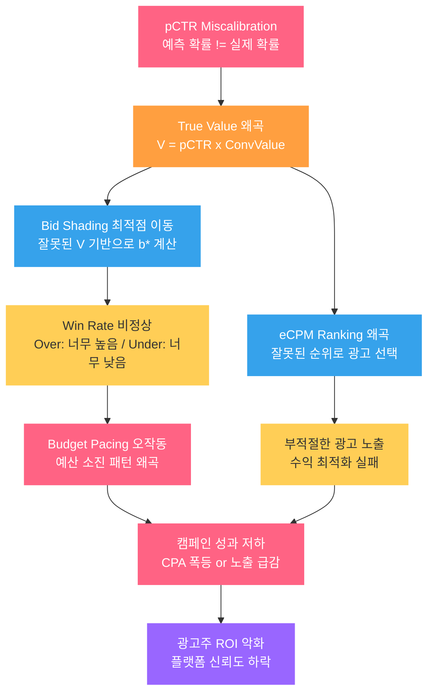
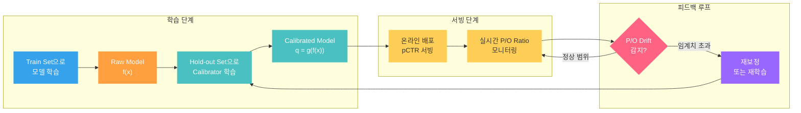
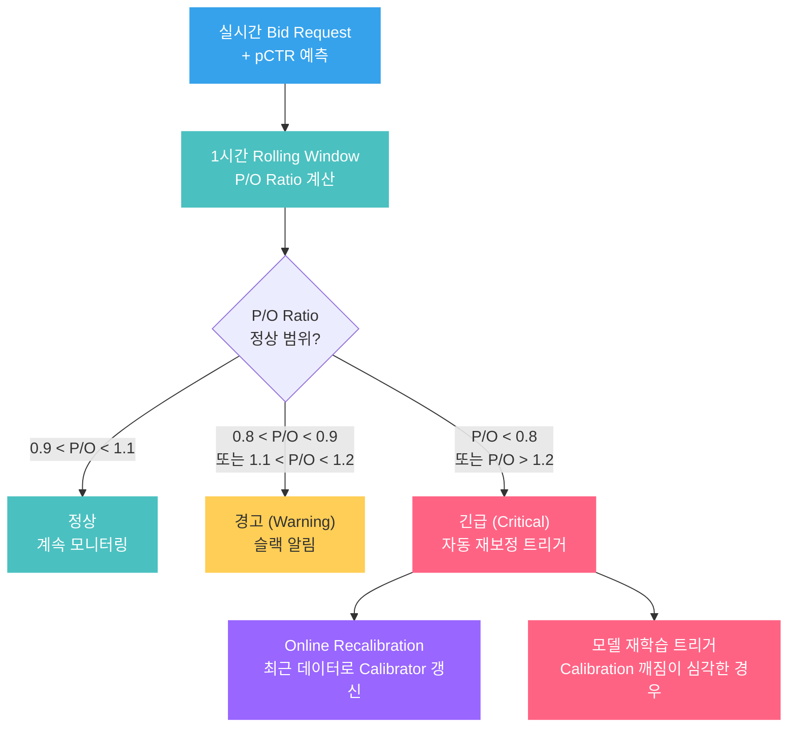

pCTR 모델의 AUC가 0.85입니다. 팀원들과 자축하며 프로덕션에 배포했습니다. 그런데 일주일 후 광고주 대시보드를 열어보니, ROI가 오히려 나빠졌습니다. 캠페인 절반은 CPA가 폭등했고, 나머지 절반은 노출 자체가 급감했습니다. 모델이 "잘 맞추고" 있었는데 왜 돈을 잃은 걸까요?

답은 간단합니다. **AUC는 "순서(ranking)"만 평가하고, "확률값 자체의 정확도"는 평가하지 않습니다.** 광고 시스템에서는 pCTR 값이 직접 입찰가 계산에 사용됩니다:

$$\text{True Value} = pCTR \times \text{Conversion Value}$$

입찰가의 근거가 되는 확률값이 체계적으로 틀리면, 아무리 순서를 잘 맞춰도 돈을 잃습니다. 이것이 **Calibration** 문제입니다.

> [Bid Shading 포스트](post.html?id=bid-shading-censored)에서 True Value를 기반으로 최적 입찰가를 계산하는 구조를 다뤘습니다. [Auto-Bidding 포스트](post.html?id=auto-bidding-pacing)에서는 True Value가 Budget Pacing의 입력이 되는 과정을 다뤘습니다. 그리고 [eCPM 랭킹 포스트](post.html?id=ecpm-ranking)에서 pCTR이 광고 랭킹의 핵심 입력임을 확인했습니다. 이 모든 시스템의 **전제 조건**이 바로 "pCTR 값 자체가 정확할 것" — 즉 Calibration입니다.

---

## 1. Discrimination vs Calibration: 무엇이 다른가

모델 평가에서 가장 흔한 혼동은 **Discrimination**과 **Calibration**을 구분하지 못하는 것입니다. 이 둘은 완전히 다른 속성입니다.

| 속성 | Discrimination (AUC) | Calibration |
|------|---------------------|-------------|
| **측정 대상** | 양성/음성 샘플의 순서를 맞추는 능력 | 예측 확률이 실제 확률과 일치하는 정도 |
| **핵심 질문** | "클릭할 광고가 안 클릭할 광고보다 높은 점수를 받았는가?" | "pCTR 2%로 예측한 광고가 실제로 2% 클릭되는가?" |
| **완벽한 상태** | AUC = 1.0 (모든 양성이 모든 음성보다 높음) | 예측 = 실제 (모든 구간에서) |
| **평가 도구** | ROC Curve, AUC | Reliability Diagram, ECE, P/O Ratio |
| **개선 방법** | 피처 엔지니어링, 모델 아키텍처, 학습 데이터 | Post-hoc Calibration (Platt, Isotonic 등) |
| **광고에서의 역할** | 어떤 광고를 보여줄지 **순서** 결정 | 입찰가를 **얼마로** 설정할지 결정 |

### 직관적 비유

Discrimination은 **시험 등수**와 같습니다. 1등이 2등보다 잘했다는 것만 알면 됩니다. Calibration은 **절대 점수**와 같습니다. 85점이라고 적었으면 실제 실력이 85점이어야 합니다.

광고 시스템에서는 둘 다 필요하지만, Calibration이 더 치명적입니다. 이유는 명확합니다: **입찰가는 순서가 아니라 절대값으로 계산됩니다.** pCTR 0.01과 0.03은 "순서"로는 같은 방향이지만, 입찰가로는 3배 차이입니다.

---

## 2. Calibration이 광고 비즈니스에 미치는 영향

### Over-confident (과대 예측) 시나리오

pCTR을 실제보다 높게 예측하면, True Value가 과대 계산되고, 입찰가를 높게 제출합니다.

| 항목 | 실제 | 모델 예측 |
|------|------|----------|
| CTR | 1% | 3% (3배 과대) |
| Conversion Value | $10 | $10 |
| True Value | $0.10 | **$0.30** |
| 입찰가 (Bid Shading 후) | ~$0.07 | **~$0.21** |

결과:
- 경매에서 **자주 이기지만**, 실제 CTR은 1%이므로 전환이 기대의 1/3
- 광고주 CPA가 3배 상승 (목표 $10 → 실제 $30)
- 광고주 이탈, 플랫폼 신뢰도 하락

### Under-confident (과소 예측) 시나리오

pCTR을 실제보다 낮게 예측하면, True Value가 과소 계산되고, 입찰가를 낮게 제출합니다.

| 항목 | 실제 | 모델 예측 |
|------|------|----------|
| CTR | 3% | 1% (3배 과소) |
| Conversion Value | $10 | $10 |
| True Value | $0.30 | **$0.10** |
| 입찰가 (Bid Shading 후) | ~$0.21 | **~$0.07** |

결과:
- 경매에서 **거의 못 이김** (win rate 급감)
- 노출 자체가 사라짐 → 캠페인 예산 소진 못함
- Budget Pacing이 예산을 쓰려고 입찰 강도를 높여도, True Value 자체가 낮으니 효과 없음

### 시스템 전체로의 파급 효과

Miscalibration은 하나의 모델 문제로 끝나지 않습니다. 광고 시스템의 모든 하류 컴포넌트가 pCTR 값을 **절대값으로** 사용하기 때문에, 오류가 연쇄적으로 전파됩니다.

핵심은 이것입니다: **AUC가 높은 모델의 Miscalibration은 오히려 더 위험합니다.** AUC가 높으면 팀이 모델 성능에 자신감을 갖고 배포하지만, Calibration이 틀어져 있으면 잘못된 확률값이 시스템 전체에 자신 있게 전파됩니다.

---

## 3. Calibration 측정: 모델이 잘 보정되었는지 어떻게 아는가

### Reliability Diagram (Calibration Plot)

Reliability Diagram은 Calibration을 **시각적으로** 진단하는 가장 직관적인 도구입니다.

**구성 방법:**
1. 모델의 예측 확률을 M개 bin으로 나눈다 (예: [0, 0.1), [0.1, 0.2), ...)
2. 각 bin에 속한 샘플들의 **평균 예측 확률**(X축)과 **실제 양성 비율**(Y축)을 계산한다
3. 점들을 찍어 연결한다

**해석:**
- **Perfect Calibration**: 모든 점이 대각선 위에 놓임 (예측 = 실제)
- **Over-confident**: 점들이 대각선 **아래**에 위치 (예측 > 실제, 과대 예측)
- **Under-confident**: 점들이 대각선 **위**에 위치 (예측 < 실제, 과소 예측)

| 패턴 | 대각선 대비 위치 | 의미 | 광고 임팩트 |
|------|----------------|------|------------|
| Perfect | 대각선 위 | 예측 = 실제 | 최적 입찰 |
| Over-confident | 대각선 아래 | "2% 예측했지만 실제는 1%" | CPA 폭등 |
| Under-confident | 대각선 위 | "1% 예측했지만 실제는 2%" | 노출 급감 |
| S자 곡선 | 중간은 맞지만 양 끝이 틀림 | 극단값에서 miscalibration | 세그먼트별 편차 |

### ECE (Expected Calibration Error)

Reliability Diagram을 **하나의 숫자**로 요약한 것이 ECE입니다.

$$ECE = \sum_{m=1}^{M} \frac{|B_m|}{n} \left| \text{acc}(B_m) - \text{conf}(B_m) \right|$$

- $M$ : bin 개수
- $B_m$ : $m$번째 bin에 속한 샘플 집합
- $|B_m|$ : $m$번째 bin의 샘플 수
- $n$ : 전체 샘플 수
- $\text{acc}(B_m)$ : bin $m$의 실제 양성 비율 (accuracy)
- $\text{conf}(B_m)$ : bin $m$의 평균 예측 확률 (confidence)

직관적으로 해석하면: **각 bin에서 "예측 확률"과 "실제 비율"의 차이를 샘플 수로 가중 평균**한 것입니다. ECE = 0이면 완벽한 Calibration, 높을수록 miscalibrated입니다.

> ECE를 계산할 때 bin 개수 $M$의 선택이 결과에 영향을 미칩니다. 일반적으로 $M = 10 \sim 20$을 사용하되, bin당 샘플 수가 충분한지(최소 수백 개) 확인해야 합니다. 샘플이 적은 bin은 노이즈가 크므로 equal-frequency binning(각 bin의 샘플 수를 균등하게)을 권장합니다.

### 실무 메트릭: Predicted/Observed Ratio (P/O Ratio)

ECE보다 실무에서 더 자주 쓰이는 지표가 **P/O Ratio**입니다. 계산이 극도로 단순하고, 해석이 직관적이기 때문입니다.

$$\text{P/O Ratio} = \frac{\bar{p}}{\bar{y}} = \frac{\text{평균 예측 CTR}}{\text{실제 CTR}}$$

| P/O Ratio | 해석 | 조치 |
|-----------|------|------|
| 1.0 | 완벽하게 보정됨 | 유지 |
| > 1.0 (예: 1.3) | Over-confident (30% 과대 예측) | 입찰가 30% 과다 → 보정 필요 |
| < 1.0 (예: 0.7) | Under-confident (30% 과소 예측) | 입찰가 30% 과소 → 보정 필요 |

P/O Ratio의 진정한 가치는 **세그먼트별로 쪼개서 모니터링**할 수 있다는 점입니다.

| 세그먼트 | 평균 pCTR | 실제 CTR | P/O Ratio | 상태 |
|---------|----------|---------|-----------|------|
| Exchange A | 2.1% | 2.0% | 1.05 | 양호 |
| Exchange B | 1.8% | 1.2% | **1.50** | Over-confident |
| Mobile | 3.2% | 3.0% | 1.07 | 양호 |
| Desktop | 1.5% | 2.1% | **0.71** | Under-confident |
| 오전 (6-12시) | 1.9% | 1.8% | 1.06 | 양호 |
| 오후 (18-24시) | 2.5% | 1.6% | **1.56** | Over-confident |

이 테이블이 보여주는 것: **Global P/O Ratio가 1.0에 가깝더라도, 세그먼트별로는 심각하게 miscalibrated일 수 있습니다.** Exchange B에서는 50% 과대 예측, Desktop에서는 29% 과소 예측입니다. Global Calibration만으로는 이 문제를 발견할 수 없습니다.

---

## 4. Calibration 보정 기법

모델 학습이 끝난 후, **Post-hoc Calibration** 기법으로 예측 확률을 보정할 수 있습니다. 핵심 원리는 동일합니다: 모델의 raw output $f(x)$에 **단조 변환(monotonic transformation)**을 적용하여 확률값을 실제에 가깝게 맞추는 것입니다.

### Platt Scaling

Platt Scaling은 가장 널리 쓰이는 보정 기법입니다. 모델의 raw output(logit)에 **sigmoid 변환**을 적용합니다.

$$q = \sigma(A \cdot f(x) + B) = \frac{1}{1 + \exp(-(A \cdot f(x) + B))}$$

- $f(x)$ : 모델의 raw output (logit 또는 예측 확률)
- $A, B$ : validation set에서 학습하는 2개의 파라미터
- $q$ : 보정된 확률

**학습 방법:** Validation set에서 $A$와 $B$를 NLL(Negative Log-Likelihood) 최소화로 학습합니다. 이때 학습에 사용하는 데이터는 반드시 모델 학습에 사용하지 않은 **hold-out** 데이터여야 합니다.

**장점:**
- 파라미터 2개로 매우 가볍고, 서빙 시 sigmoid 연산 하나 추가
- 대부분의 실무 상황에서 충분히 효과적
- Production-ready: 구현이 단순하고 안정적

**한계:**
- 전역적(global) 보정 → 하나의 $(A, B)$ 쌍이 모든 데이터에 적용
- 세그먼트별 편향 패턴이 다르면 (Exchange A는 over, Exchange B는 under), 전역 보정으로는 부족

### Isotonic Regression

Isotonic Regression은 **비모수적 단조 변환**입니다. 데이터를 구간별로 나누어 각 구간에서 개별적으로 보정합니다.

**핵심 원리:** 예측 확률을 정렬한 후, 실제 양성 비율이 단조 증가(monotonically increasing)하도록 **step function**을 학습합니다. 즉 Platt Scaling이 하나의 S자 곡선을 적용하는 것과 달리, Isotonic Regression은 **구간별로 다른 보정값**을 적용합니다.

**장점:**
- Platt Scaling보다 유연: 비선형 miscalibration 패턴도 보정 가능
- 모수적 가정이 없으므로 다양한 형태의 왜곡에 대응

**한계:**
- 데이터가 많아야 안정적 (bin당 수백~수천 샘플 필요)
- 데이터가 적으면 overfitting 위험 → calibration이 오히려 나빠질 수 있음
- Platt보다 서빙이 약간 복잡 (lookup table 또는 구간 매핑 필요)

### Temperature Scaling

Temperature Scaling은 **파라미터 하나**로 전체 확률 분포의 "날카로움"을 조절합니다.

$$q = \sigma\left(\frac{f(x)}{T}\right)$$

- $T$ : Temperature 파라미터 (validation set에서 학습)
- $T > 1$ : 확률을 부드럽게 (confident한 예측을 완화) → Over-confident 보정
- $T < 1$ : 확률을 날카롭게 (불확실한 예측을 강화) → Under-confident 보정
- $T = 1$ : 원래 모델 그대로

**장점:**
- 파라미터 단 하나 → overfitting 위험 최소
- 서빙 오버헤드 거의 없음 (나눗셈 하나)
- 특히 Neural Network의 over-confidence 보정에 효과적

**한계:**
- 전역적 보정 (Platt과 동일한 한계)
- 보정의 자유도가 가장 낮음 → 복잡한 miscalibration 패턴에는 부족

### Histogram Binning

Histogram Binning은 예측 확률을 bin으로 나눈 후, 각 bin의 예측값을 해당 bin의 **실제 양성 비율**로 교체합니다. 개념적으로 가장 단순합니다.

**장점:**
- 구현이 극도로 단순 (bin별 lookup)
- 비모수적이며 bin 내에서는 완벽하게 보정됨

**한계:**
- bin 경계에서 불연속적 (discontinuity)
- bin 개수 선택에 민감
- 충분한 데이터가 없으면 bin별 추정치가 불안정

### 기법 비교

| 기법 | 파라미터 수 | 유연성 | 데이터 요구량 | 서빙 오버헤드 | 실무 추천도 |
|------|-----------|--------|-------------|-------------|-----------|
| Platt Scaling | 2 ($A, B$) | 중간 | 낮음 | 극히 낮음 (sigmoid 1회) | 높음 -- 기본 선택 |
| Isotonic Regression | $O(n)$ | 높음 | 높음 | 낮음 (lookup) | 중간 -- 데이터 충분 시 |
| Temperature Scaling | 1 ($T$) | 낮음 | 매우 낮음 | 극히 낮음 (나눗셈 1회) | 높음 -- NN 모델에 특히 |
| Histogram Binning | $M$ (bin 수) | 높음 | 높음 | 극히 낮음 (lookup) | 낮음 -- 불연속성 문제 |

> 실무 권장: **Platt Scaling부터 시작하라.** 대부분의 경우 충분히 효과적이고, 구현과 서빙이 단순합니다. Platt으로 부족한 경우(세그먼트별 편향 패턴이 복잡한 경우)에만 Isotonic Regression이나 세그먼트별 Platt을 고려하세요. Temperature Scaling은 Deep Learning 모델의 over-confidence가 주 문제일 때 가장 먼저 시도할 기법입니다.

---

## 5. 프로덕션 Calibration 파이프라인

Calibration 보정은 일회성 작업이 아닙니다. 프로덕션 환경에서는 **지속적인 모니터링과 재보정** 파이프라인이 필요합니다.

### 학습-보정 분리 원칙

Calibrator를 학습할 때 **가장 흔한 실수**는 모델 학습에 사용한 데이터로 Calibrator도 학습하는 것입니다. 이렇게 하면 Calibrator가 모델의 학습 데이터에 과적합된 예측값을 기준으로 보정하게 되어, 새로운 데이터에서 Calibration이 깨집니다.

**올바른 방법:**

| 데이터셋 | 용도 | 비율 (예시) |
|---------|------|-----------|
| Train Set | 모델 $f(x)$ 학습 | 70% |
| Calibration Set | Calibrator $g(\cdot)$ 학습 | 15% |
| Test Set | 최종 평가 (AUC + ECE + P/O) | 15% |

데이터가 부족한 경우, **Cross-Validation Calibration**을 사용합니다:

1. Train Set을 K-fold로 나눈다
2. 각 fold에서 K-1개 fold로 모델 학습, 나머지 1개 fold에서 예측값 생성
3. 모든 fold의 예측값을 합쳐서 Calibrator 학습

이 방법은 모든 학습 데이터를 Calibration에 활용하면서도 데이터 오염을 방지합니다.

### 세그먼트별 보정

Section 3의 P/O Ratio 테이블에서 확인했듯, Global Calibration으로는 세그먼트별 편향을 해결할 수 없습니다. 프로덕션에서는 **세그먼트별 Calibrator**를 운영합니다.

**세그먼트 키 선정 기준:**

| 세그먼트 키 | 이유 | P/O 편차 패턴 예시 |
|------------|------|-------------------|
| exchange_id | Exchange마다 트래픽 특성이 다름 | Exchange A: 1.05, Exchange B: 1.50 |
| device_type | Mobile vs Desktop CTR 패턴 상이 | Mobile: 1.07, Desktop: 0.71 |
| hour_of_day | 시간대별 유저 행동 변화 | 오전: 1.06, 저녁: 1.56 |
| ad_format | Banner vs Native vs Video 특성 차이 | Banner: 0.95, Video: 1.40 |

**구현 방식은 두 가지입니다:**

**방식 1: 세그먼트별 Platt Scaling**
- 각 세그먼트에 대해 별도의 $(A_s, B_s)$를 학습
- 장점: 세그먼트 특성에 맞는 정밀 보정
- 단점: 세그먼트가 많으면 파라미터 관리 복잡, 데이터가 적은 세그먼트는 불안정

**방식 2: 세그먼트별 P/O Ratio 보정**
- 각 세그먼트의 P/O Ratio $r_s$를 계산한 후, 예측값을 $r_s$로 나눔
- $q_s = \frac{f(x)}{r_s}$
- 장점: 극도로 단순, 실시간 업데이트 용이
- 단점: 선형 보정이므로, 세그먼트 내 비선형 왜곡은 남음

실무에서는 **방식 2를 기본으로 사용**하고, 트래픽이 충분한 주요 세그먼트에 대해서만 방식 1을 적용하는 하이브리드 전략이 일반적입니다.

### 시간에 따른 드리프트 대응

Calibration은 **시간이 지나면 반드시 깨집니다.** 유저 행동 변화, 시즌 효과, 경쟁 환경 변화 등으로 CTR 분포가 shift하면, 과거 데이터로 학습한 Calibrator는 더 이상 유효하지 않습니다.

**실시간 모니터링 체계:**

| 수준 | P/O Ratio 범위 | 조치 |
|------|---------------|------|
| 정상 | 0.9 -- 1.1 | 계속 모니터링 |
| 경고 | 0.8 -- 0.9 또는 1.1 -- 1.2 | 슬랙 알림, 원인 분석 시작 |
| 긴급 | < 0.8 또는 > 1.2 | 자동 재보정 트리거 |

**Online Recalibration** 전략:
- 최근 N시간(예: 6시간)의 데이터로 Calibrator 파라미터를 **온라인 갱신**
- Platt Scaling의 경우 $(A, B)$를 exponential moving average로 업데이트
- P/O Ratio 보정의 경우, rolling P/O ratio를 직접 적용

> [Online Learning 포스트](post.html?id=online-learning-delayed-feedback)에서 Concept Drift와 모델 Staleness 문제를 다뤘습니다. Calibration Drift는 Concept Drift의 직접적인 결과이며, Online Learning 파이프라인과 Calibration 모니터링은 연동되어야 합니다.

---

## 6. Calibration vs Discrimination: Trade-off는 있는가

자주 받는 질문입니다: "Calibration을 보정하면 AUC가 떨어지지 않나요?"

**답: 일반적으로 No.** Post-hoc Calibration 기법(Platt, Isotonic, Temperature)은 모두 **단조 변환(monotonic transformation)**입니다. 단조 변환은 순서를 보존하므로, 이론적으로 **AUC에 영향을 주지 않습니다.**

직관적으로: $f(x_1) > f(x_2)$이면, 단조 변환 후에도 $g(f(x_1)) > g(f(x_2))$입니다. 순서가 바뀌지 않으므로 AUC는 동일합니다.

| 상황 | AUC 변화 | Calibration 변화 | 설명 |
|------|---------|-----------------|------|
| Post-hoc Calibration 적용 | 불변 | 개선 | 단조 변환이므로 ranking 보존 |
| Calibration-aware Loss로 재학습 | 미세 변화 가능 | 개선 | Loss 함수 변경으로 모델 자체가 변함 |
| 극단적 Isotonic 보정 (데이터 부족) | 미세 하락 가능 | 개선 (과적합 위험) | 비단조적 노이즈가 끼어들 수 있음 |

**실무 원칙:**

> "먼저 AUC를 최대화하고, 그 다음 Calibration을 보정하라." 이 순서가 중요합니다. AUC(Discrimination)는 모델 아키텍처, 피처, 학습 데이터의 영역이고, Calibration은 Post-hoc 보정의 영역입니다. 두 문제를 분리하면 각각 독립적으로 최적화할 수 있습니다.

단, **Calibration-aware 학습**이라는 접근도 있습니다. Cross-entropy Loss 자체가 Calibration을 유도하는 성질이 있으므로, 학습 과정에서 Calibration을 함께 최적화하는 것입니다. Facebook의 실무 사례(He et al., 2014)에서는 모델 학습 시 Cross-entropy Loss를 사용하되, 배포 전에 추가로 Calibration Layer를 적용하는 **이중 보정** 전략을 사용합니다.

---

## 7. 실무에서 자주 만나는 Calibration 함정

### 함정 1: Label이 이미 편향되어 있다

CTR 모델의 Label(클릭/비클릭)이 이미 편향되어 있으면, 모델이 아무리 잘 학습해도 Calibration이 깨집니다.

- **Click Flooding**: 봇 트래픽이 클릭을 부풀림 → 실제 CTR보다 높은 양성 비율 → Under-confident 모델
- **Delayed Label**: 전환이 늦게 도착하여 음성으로 처리된 샘플이 나중에 양성이 됨 → Over-confident 모델
- **Position Bias**: 상위 노출 광고의 클릭률이 부풀려짐 → 위치별로 다른 Calibration 오류

### 함정 2: 학습 데이터와 서빙 데이터의 분포 차이

모델은 과거 데이터로 학습하고 미래 데이터에 적용됩니다. 이 시간 차이가 Calibration을 깨뜨립니다.

- **Train/Serve Skew**: 학습 데이터의 CTR 분포와 서빙 시점의 CTR 분포가 다름
- **Selection Bias**: 학습 데이터는 이전 모델이 선택한 광고에서만 생성 → 탐색되지 않은 영역의 Calibration 불확실

### 함정 3: Calibration을 Global로만 확인한다

Section 3에서 강조했듯, Global P/O Ratio = 1.0이어도 세그먼트별로는 심각하게 틀릴 수 있습니다. **반드시 세그먼트별로 쪼개서** 확인해야 합니다. 특히 다음 세그먼트에서 편차가 큰 경우가 많습니다:

- 새로 추가된 Exchange 또는 Publisher
- 특정 디바이스/OS 버전
- 피크 시간대 vs 비피크 시간대
- 새 광고 포맷

---

## 마무리

핵심을 다섯 가지로 정리합니다.

**1. AUC와 Calibration은 다른 속성이다.** AUC는 순서(ranking)의 정확도, Calibration은 확률값 자체의 정확도입니다. 광고 시스템에서는 확률값이 직접 입찰가로 변환되므로, Calibration이 비즈니스에 더 직접적인 영향을 미칩니다.

**2. Miscalibration은 시스템 전체로 전파된다.** pCTR의 Calibration 오류는 True Value 왜곡 → Bid Shading 오작동 → Budget Pacing 오작동 → 캠페인 성과 저하로 연쇄적으로 퍼집니다.

**3. P/O Ratio를 세그먼트별로 모니터링하라.** Global P/O Ratio만으로는 부족합니다. Exchange, Device, 시간대 등 핵심 세그먼트별로 쪼개서 모니터링해야 숨겨진 Miscalibration을 발견할 수 있습니다.

**4. Platt Scaling부터 시작하라.** 대부분의 실무 상황에서 Platt Scaling이면 충분합니다. 복잡한 기법은 Platt으로 해결되지 않는 문제가 확인된 후에 도입하세요.

**5. Calibration은 일회성이 아니라 지속적 과정이다.** 시장은 끊임없이 변하고, Calibration은 반드시 깨집니다. 실시간 모니터링과 자동 재보정 파이프라인이 프로덕션 필수 요소입니다.

> AUC는 모델의 **똑똑함**이고, Calibration은 모델의 **정직함**입니다. 광고 시스템은 정직한 모델을 원합니다. 똑똑하지만 부정직한 모델은 경매에서 체계적으로 잘못된 가격을 제시하고, 그 비용은 고스란히 광고주와 플랫폼이 부담합니다.

---

## 참고문헌

- Niculescu-Mizil, A. & Caruana, R. (2005). *Predicting Good Probabilities with Supervised Learning.* ICML 2005. -- Platt Scaling과 Isotonic Regression의 체계적 비교.
- Guo, C. et al. (2017). *On Calibration of Modern Neural Networks.* ICML 2017. -- Temperature Scaling 제안. 현대 Neural Network이 over-confident한 이유와 해결책.
- He, X. et al. (2014). *Practical Lessons from Predicting Clicks of Ads at Facebook.* AdKDD 2014. -- Facebook 광고 pCTR 모델의 Calibration 실무 사례.
- McMahan, H.B. et al. (2013). *Ad Click Prediction: a View from the Trenches.* KDD 2013. -- Google 광고 시스템의 대규모 CTR 예측과 Calibration 운영 경험.