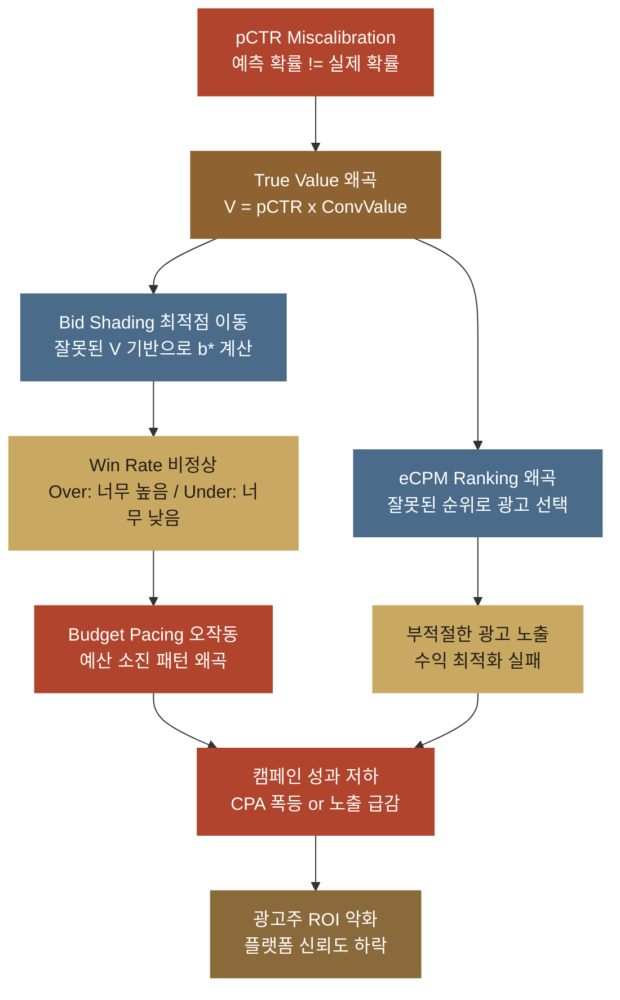
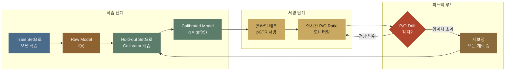
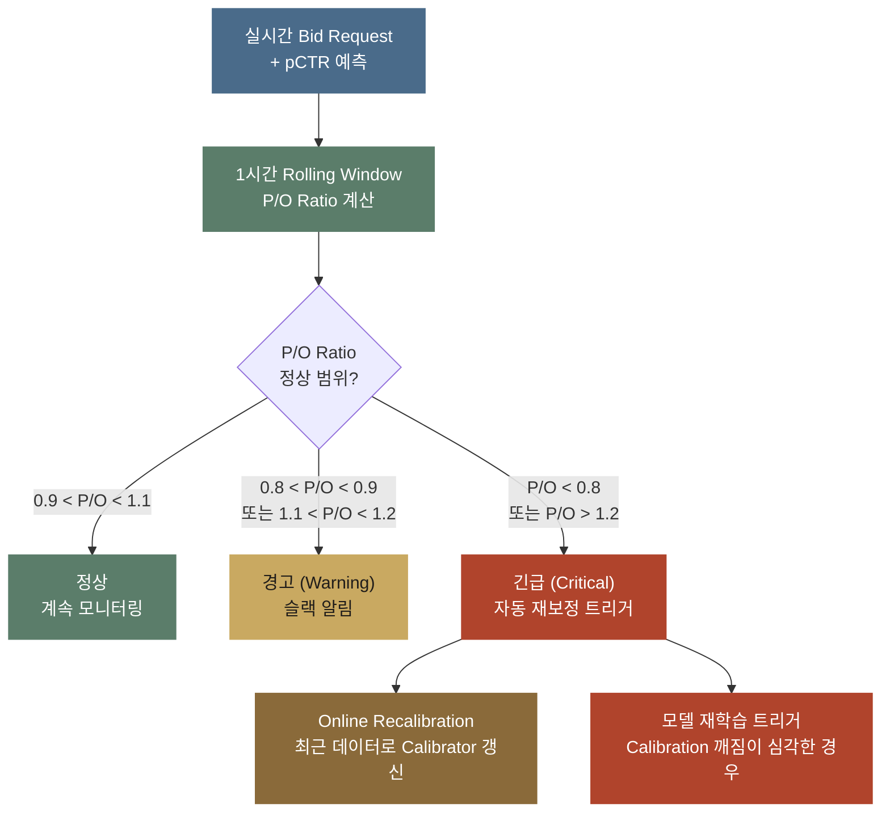

pCTR 모델의 AUC가 0.85입니다. 팀원들과 자축하며 프로덕션에 배포했습니다. 그런데 일주일 후 광고주 대시보드를 열어보니, ROI가 오히려 나빠졌습니다. 캠페인 절반은 CPA가 폭등했고, 나머지 절반은 노출 자체가 급감했습니다. 모델이 "잘 맞추고" 있었는데 왜 돈을 잃은 걸까요?

답은 간단합니다. **AUC는 "순서(ranking)"만 평가합니다.** 확률값 자체가 맞는지는 보지 않습니다. 그런데 광고 시스템은 pCTR 값을 입찰가 계산에 그대로 씁니다.

$$\text{True Value} = pCTR \times \text{Conversion Value}$$

입찰의 근거가 되는 확률이 늘 같은 방향으로 틀리면 어떻게 될까요. 순서를 잘 맞춰도 돈을 잃습니다. 이것이 **Calibration**(보정) 문제입니다.

<a href="demo-calibration.html" class="btn-demo">보정 왜곡을 직접 슬라이더로 실험해보기 →</a>

슬라이더를 조금 움직이면 낙찰 결과가 흔들리는 게 보입니다.

> 이어지는 글들을 먼저 적어 둡니다.
> - pCTR이 무엇이고 eCPM에 어떻게 곱해지는지 → [pCTR 예측](post.html?id=pctr-prediction)
> - True Value로 최적 입찰가를 만드는 구조 → [Bid Shading](post.html?id=bid-shading-censored)
> - True Value가 예산 페이싱의 입력이 되는 과정 → [Auto-Bidding](post.html?id=auto-bidding-pacing)
> - pCTR이 광고 랭킹의 핵심 입력인 이유 → [eCPM 랭킹](post.html?id=ecpm-ranking)
>
> 이 시스템들의 **전제 조건**은 하나입니다. "pCTR 값 자체가 정확할 것" — 즉 Calibration입니다.

---

## 1. Discrimination vs Calibration: 무엇이 다른가

모델 평가에서 가장 흔한 혼동은 **Discrimination**과 **Calibration**을 구분하지 못하는 것입니다. 이 둘은 완전히 다른 속성입니다.

| 속성 | Discrimination (AUC) | Calibration |
|------|---------------------|-------------|
| **측정 대상** | 양성/음성 샘플의 순서를 맞추는 능력 | 예측 확률이 실제 확률과 일치하는 정도 |
| **핵심 질문** | "클릭할 광고가 안 클릭할 광고보다 높은 점수를 받았는가?" | "pCTR 2%로 예측한 광고가 실제로 2% 클릭되는가?" |
| **완벽한 상태** | AUC = 1.0 (모든 양성이 모든 음성보다 높음) | 예측 = 실제 (모든 구간에서) |
| **평가 도구** | ROC Curve, AUC | Reliability Diagram, ECE, P/O Ratio |
| **개선 방법** | 피처 엔지니어링, 모델 아키텍처, 학습 데이터 | Post-hoc Calibration (Platt, Isotonic 등) |
| **광고에서의 역할** | 어떤 광고를 보여줄지 **순서** 결정 | 입찰가를 **얼마로** 설정할지 결정 |

### 직관적 비유

Discrimination은 **시험 등수**와 같습니다. 1등이 2등보다 잘했다는 것만 알면 됩니다. Calibration은 **절대 점수**와 같습니다. 85점이라고 적었으면 실제 실력이 85점이어야 합니다.

광고 시스템에서는 둘 다 필요하지만, Calibration이 더 치명적입니다. 이유는 명확합니다: **입찰가는 순서가 아니라 절대값으로 계산됩니다.** pCTR 0.01과 0.03은 "순서"로는 같은 방향이지만, 입찰가로는 3배 차이입니다.

---

## 2. Calibration이 광고 비즈니스에 미치는 영향

### Over-confident (과대 예측) 시나리오

pCTR을 실제보다 높게 예측하면, True Value가 과대 계산되고, 입찰가를 높게 제출합니다.

| 항목 | 실제 | 모델 예측 |
|------|------|----------|
| CTR | 1% | 3% (3배 과대) |
| Conversion Value | `$10` | `$10` |
| True Value | `$0.10` | `$0.30` |
| 입찰가 (Bid Shading 후) | `~$0.07` | `~$0.21` |

결과:
- 경매에서 **자주 이기지만**, 실제 CTR은 1%이므로 전환이 기대의 1/3
- 광고주 CPA가 3배 상승 (목표 `$10` → 실제 `$30`)
- 광고주 이탈, 플랫폼 신뢰도 하락

### Under-confident (과소 예측) 시나리오

pCTR을 실제보다 낮게 예측하면, True Value가 과소 계산되고, 입찰가를 낮게 제출합니다.

| 항목 | 실제 | 모델 예측 |
|------|------|----------|
| CTR | 3% | 1% (3배 과소) |
| Conversion Value | `$10` | `$10` |
| True Value | `$0.30` | `$0.10` |
| 입찰가 (Bid Shading 후) | `~$0.21` | `~$0.07` |

결과:
- 경매에서 **거의 못 이김** (win rate 급감)
- 노출 자체가 사라짐 → 캠페인 예산 소진 못함
- Budget Pacing이 예산을 쓰려고 입찰 강도를 높여도, True Value 자체가 낮으니 효과 없음

### 가상 데이터로 손해액을 계산해 본다

위 두 시나리오는 광고 하나만 놓고 본 것입니다. 실제 경매에는 후보가 여러 개 들어옵니다. 이때 보정 오류는 **누가 1등이 되는가**를 바꿉니다. 아래는 **가상 데이터**입니다.

| 광고 | 지면 세그먼트 | 모델 pCTR | 실제 CTR | CPC 입찰가 | COPC (실제÷예측) |
|------|-------------|----------|---------|-----------|-----------------|
| A | 앱 하단 배너 | 2.40% | 1.50% | ₩300 | 0.625 (과대예측) |
| B | 웹 인피드 | 1.20% | 1.40% | ₩500 | 1.167 (과소예측) |
| C | 앱 인피드 | 1.00% | 2.00% | ₩400 | **2.000** (과소예측) |
| D | 웹 상단 배너 | 1.80% | 1.60% | ₩350 | 0.889 (과대예측) |
| E | 앱 리워드 | 2.00% | 1.00% | ₩250 | **0.500** (과대예측) |

'실제 CTR'은 로그가 충분히 쌓인 뒤에야 알 수 있는 값입니다. 랭킹을 매기는 순간 손에 있는 건 모델 pCTR뿐입니다. 지면마다 틀린 방향이 다르다는 점을 눈여겨보세요. A·D·E는 부풀려 봤고, B·C는 낮춰 봤습니다.

```python
# 보정이 틀리면 얼마를 잃는가 — 표준 라이브러리만 씁니다.
# 상황: 한 번의 노출 기회에 광고 후보 5개가 들어왔습니다. 하나만 보여줄 수 있습니다.
# 플랫폼은 eCPM(노출 1,000회당 기대 매출)이 가장 큰 후보를 고릅니다.
# eCPM 계산의 상세는 eCPM 랭킹 글에 있습니다. 여기서는 '1등이 바뀌는가'만 봅니다.

# --- 가상 데이터 ---------------------------------------------------------
# 각 행 = (광고, 지면 세그먼트, 모델이 내놓은 pCTR, 나중에 확인된 실제 CTR, CPC 입찰가(원))
# '실제 CTR'은 로그가 충분히 쌓인 뒤에야 알 수 있는 값입니다.
# 랭킹을 매기는 순간 손에 있는 건 모델 pCTR뿐입니다. 그게 이 문제의 핵심입니다.
CANDIDATES = [
    ("A", "앱 하단 배너", 0.024, 0.015, 300),
    ("B", "웹 인피드",   0.012, 0.014, 500),
    ("C", "앱 인피드",   0.010, 0.020, 400),
    ("D", "웹 상단 배너", 0.018, 0.016, 350),
    ("E", "앱 리워드",   0.020, 0.010, 250),
]
IMPRESSIONS = 1000              # 이 지면에 노출 기회가 1,000회 있다고 가정
DAILY_IMPRESSIONS = 10_000_000  # 서비스 전체 하루 노출 규모 (환산용)

CPC = {ad: cpc for ad, _s, _p, _r, cpc in CANDIDATES}    # 광고별 클릭 단가
REAL = {ad: real for ad, _s, _p, real, _c in CANDIDATES}  # 광고별 실제 CTR


def ranking(pctr_by_ad):
    """주어진 pCTR로 eCPM을 매겨 큰 순서대로 돌려줍니다.
    eCPM = pCTR x CPC x 1000. 클릭당 과금이라 pCTR을 곱해야 노출 가치가 됩니다."""
    board = [(pctr_by_ad[ad] * CPC[ad] * 1000, ad) for ad in pctr_by_ad]
    board.sort(reverse=True)    # 맨 앞이 1등
    return board


def show(title, board):
    """랭킹을 보기 좋게 출력합니다."""
    print(title)
    for i, (score, ad) in enumerate(board, 1):
        print(f"  {i}위 {ad}  eCPM {score:,.0f}원")


# --- 1단계: 후보별로 예측이 얼마나 틀렸는지 본다 --------------------------
# COPC = Click Over Predicted Click = 실제 클릭 / 예측 클릭.
# 1보다 크면 실제가 더 많았다는 뜻 → 모델이 '과소예측'했습니다.
# 1보다 작으면 예측이 더 많았다는 뜻 → 모델이 '과대예측'했습니다.
print("광고  모델pCTR  실제CTR   COPC  판정        지면")
pred_clicks = 0.0   # 예측 클릭 총합 (COPC의 분모)
real_clicks = 0.0   # 실제 클릭 총합 (COPC의 분자)
for ad, seg, pctr, real_ctr, _cpc in CANDIDATES:
    copc = real_ctr / pctr                    # 후보 하나의 COPC
    pred_clicks += IMPRESSIONS * pctr         # 노출 x 예측 CTR = 예측 클릭 수
    real_clicks += IMPRESSIONS * real_ctr     # 노출 x 실제 CTR = 실제 클릭 수
    verdict = "과소예측" if copc > 1 else "과대예측"
    print(f" {ad}   {pctr:6.2%}  {real_ctr:6.2%}  {copc:5.3f}  {verdict}    {seg}")

global_copc = real_clicks / pred_clicks       # 전체를 뭉쳐서 본 COPC
print(f"\n전체 COPC = {real_clicks:.0f} / {pred_clicks:.0f} = {global_copc:.3f}"
      f"  (1보다 작으니 전체적으로 과대예측)")
print(f"뒤집어 본 P/O Ratio = 예측/실제 = {1 / global_copc:.3f}")

# --- 2단계: 보정 없이 랭킹을 매긴다 ---------------------------------------
raw = {ad: pctr for ad, _s, pctr, _r, _c in CANDIDATES}
board_raw = ranking(raw)
show("\n[보정 없음] eCPM 랭킹", board_raw)

# --- 3단계: 전체 COPC로 한 번에 보정한다 (가장 흔한 첫 시도) --------------
# 모든 예측에 같은 배수(global_copc)를 곱해 전체 평균만 맞춥니다.
# 같은 배수를 곱하는 건 단조 변환이라, 순서를 절대 바꾸지 못합니다.
scaled = {ad: pctr * global_copc for ad, _s, pctr, _r, _c in CANDIDATES}
after = real_clicks / sum(IMPRESSIONS * p for p in scaled.values())
show(f"\n[전체 보정] 보정 후 전체 COPC = {after:.3f}  <- 지표는 완벽해졌다",
     ranking(scaled))

# --- 4단계: 세그먼트별로 보정한다 -----------------------------------------
# 지면마다 틀리는 방향이 달랐으니, 지면별 배수를 따로 씁니다.
# 이 예시는 세그먼트마다 광고가 하나씩이라 보정값이 곧 실제 CTR이 됩니다.
# 실제로는 한 세그먼트에 광고가 수천 개 있고, 세그먼트 배수는 그 평균 오차만 걷어냅니다.
by_segment = {ad: pctr * (REAL[ad] / pctr) for ad, _s, pctr, _r, _c in CANDIDATES}
board_seg = ranking(by_segment)
show("\n[세그먼트별 보정] eCPM 랭킹", board_seg)

# --- 5단계: 그래서 얼마 손해인가 ------------------------------------------
# 뽑힌 광고가 다르면 실제로 들어오는 돈도 달라집니다.
# 실제 매출 = 노출 수 x 실제 CTR x CPC. 예측이 아니라 실제 CTR로 계산합니다.
bad = board_raw[0][1]    # 보정 안 하고 뽑은 1등
good = board_seg[0][1]   # 제대로 보정하고 뽑은 1등
rev_bad = IMPRESSIONS * REAL[bad] * CPC[bad]
rev_good = IMPRESSIONS * REAL[good] * CPC[good]
gap = rev_good - rev_bad
print(f"\n1등 비교: 보정 없음 → {bad} / 세그먼트 보정 → {good}")
print(f"노출 1,000회 실제 매출: {bad} {rev_bad:,.0f}원 vs {good} {rev_good:,.0f}원")
print(f"차이 {gap:,.0f}원 = {gap / rev_good:.1%} 손실")
print(f"하루 {DAILY_IMPRESSIONS:,}회 노출이면 {gap / IMPRESSIONS * DAILY_IMPRESSIONS:,.0f}원/일")

# 출력:
# 광고  모델pCTR  실제CTR   COPC  판정        지면
#  A    2.40%   1.50%  0.625  과대예측    앱 하단 배너
#  B    1.20%   1.40%  1.167  과소예측    웹 인피드
#  C    1.00%   2.00%  2.000  과소예측    앱 인피드
#  D    1.80%   1.60%  0.889  과대예측    웹 상단 배너
#  E    2.00%   1.00%  0.500  과대예측    앱 리워드
#
# 전체 COPC = 75 / 84 = 0.893  (1보다 작으니 전체적으로 과대예측)
# 뒤집어 본 P/O Ratio = 예측/실제 = 1.120
#
# [보정 없음] eCPM 랭킹
#   1위 A  eCPM 7,200원
#   2위 D  eCPM 6,300원
#   3위 B  eCPM 6,000원
#   4위 E  eCPM 5,000원
#   5위 C  eCPM 4,000원
#
# [전체 보정] 보정 후 전체 COPC = 1.000  <- 지표는 완벽해졌다
#   1위 A  eCPM 6,429원
#   2위 D  eCPM 5,625원
#   3위 B  eCPM 5,357원
#   4위 E  eCPM 4,464원
#   5위 C  eCPM 3,571원
#
# [세그먼트별 보정] eCPM 랭킹
#   1위 C  eCPM 8,000원
#   2위 B  eCPM 7,000원
#   3위 D  eCPM 5,600원
#   4위 A  eCPM 4,500원
#   5위 E  eCPM 2,500원
#
# 1등 비교: 보정 없음 → A / 세그먼트 보정 → C
# 노출 1,000회 실제 매출: A 4,500원 vs C 8,000원
# 차이 3,500원 = 43.8% 손실
# 하루 10,000,000회 노출이면 35,000,000원/일
```

결과를 세 줄로 요약하면 이렇습니다.

**1. 보정 없이 뽑은 1등은 A입니다.** 모델은 A의 CTR을 2.40%로 봤지만 실제는 1.50%였습니다.

**2. 전체 COPC를 1.000으로 맞춰도 1등은 그대로 A입니다.** 모든 예측에 같은 배수를 곱하는 보정은 순서를 바꾸지 못합니다. 대시보드의 보정 지표는 완벽해지지만, 손해는 한 푼도 줄지 않습니다.

**3. 세그먼트별로 보정하면 1등이 C로 바뀝니다.** C는 실제 CTR이 2.00%인데 모델은 1.00%로 절반만 보고 있었습니다.

돈으로 보면 이렇습니다. A를 1,000회 노출하면 실제 매출은 4,500원입니다. C를 노출했다면 8,000원이었습니다. 노출 1,000회마다 3,500원, 즉 43.8%를 흘리고 있었던 셈입니다. 하루 1,000만 노출이면 3,500만 원입니다. 물론 실제 트래픽에 이 후보 5개만 반복되지는 않습니다. 이 환산은 규모 감각을 잡는 용도입니다. 그래도 방향은 분명합니다. AUC 대시보드는 이 손실을 한 번도 알려주지 않습니다.

### 시스템 전체로의 파급 효과

Miscalibration은 하나의 모델 문제로 끝나지 않습니다. 광고 시스템의 모든 하류 컴포넌트가 pCTR 값을 **절대값으로** 사용하기 때문에, 오류가 연쇄적으로 전파됩니다.


```mermaid
graph TD
    A["pCTR Miscalibration<br/>예측 확률 != 실제 확률"] --> B["True Value 왜곡<br/>V = pCTR x ConvValue"]
    B --> C["Bid Shading 최적점 이동<br/>잘못된 V 기반으로 b* 계산"]
    B --> D["eCPM Ranking 왜곡<br/>잘못된 순위로 광고 선택"]
    C --> E["Win Rate 비정상<br/>Over: 너무 높음 / Under: 너무 낮음"]
    D --> F["부적절한 광고 노출<br/>수익 최적화 실패"]
    E --> G["Budget Pacing 오작동<br/>예산 소진 패턴 왜곡"]
    G --> H["캠페인 성과 저하<br/>CPA 폭등 or 노출 급감"]
    F --> H
    H --> I["광고주 ROI 악화<br/>플랫폼 신뢰도 하락"]

    style A fill:#b0442c,stroke:#b0442c,color:#fff
    style B fill:#8f6231,stroke:#8f6231,color:#fff
    style C fill:#4a6b8a,stroke:#4a6b8a,color:#fff
    style D fill:#4a6b8a,stroke:#4a6b8a,color:#fff
    style E fill:#c9a961,stroke:#c9a961,color:#201d1a
    style F fill:#c9a961,stroke:#c9a961,color:#201d1a
    style G fill:#b0442c,stroke:#b0442c,color:#fff
    style H fill:#b0442c,stroke:#b0442c,color:#fff
    style I fill:#8a6a3a,stroke:#8a6a3a,color:#fff
```

핵심은 이것입니다. **AUC가 높은 모델의 Miscalibration은 오히려 더 위험합니다.** AUC가 높으면 팀은 자신감을 갖고 배포합니다. 그런데 Calibration이 틀어져 있으면, 잘못된 확률값이 그 자신감을 타고 시스템 전체로 퍼집니다.

---

## 3. Calibration 측정: 모델이 잘 보정되었는지 어떻게 아는가

### Reliability Diagram (Calibration Plot)

Reliability Diagram은 Calibration을 **시각적으로** 진단하는 가장 직관적인 도구입니다.

**구성 방법:**
1. 모델의 예측 확률을 M개 bin으로 나눈다 (예: [0, 0.1), [0.1, 0.2), ...)
2. 각 bin에 속한 샘플들의 **평균 예측 확률**(X축)과 **실제 양성 비율**(Y축)을 계산한다
3. 점들을 찍어 연결한다

**해석:**
- **Perfect Calibration**: 모든 점이 대각선에 딱 붙는다 (예측 = 실제)
- **Over-confident**: 점들이 대각선보다 **아래쪽**에 앉는다 (예측 > 실제, 과대 예측)
- **Under-confident**: 점들이 대각선보다 **위쪽**에 뜬다 (예측 < 실제, 과소 예측)

| 패턴 | 대각선 대비 위치 | 의미 | 광고 임팩트 |
|------|----------------|------|------------|
| Perfect | 대각선에 붙음 | 예측 = 실제 | 최적 입찰 |
| Over-confident | 대각선보다 아래 | "2% 예측했지만 실제는 1%" | CPA 폭등 |
| Under-confident | 대각선보다 위 | "1% 예측했지만 실제는 2%" | 노출 급감 |
| S자 곡선 | 중간은 맞지만 양 끝이 틀림 | 극단값에서 miscalibration | 세그먼트별 편차 |

<div class="demo-embed-wrap">
<iframe class="demo-embed" src="demo-calibration.html?embed=1" height="560" loading="lazy" title="보정 왜곡 미니 데모"></iframe>
<a class="demo-embed-open" href="demo-calibration.html" target="_blank" rel="noopener">↗ 전체 데모로 열기 (가이드 투어 포함)</a>
</div>

기울기와 편향을 움직여 보면 곡선이 대각선에서 떨어지는 모습이 보입니다.

```python
import numpy as np

def reliability_diagram_data(y_true, y_prob, n_bins=10):
    """Reliability Diagram 데이터: (평균 예측, 실제 비율) 쌍"""
    bin_edges = np.linspace(0, 1, n_bins + 1)
    centers, accs, counts = [], [], []
    for i in range(n_bins):
        mask = (y_prob >= bin_edges[i]) & (y_prob < bin_edges[i + 1])
        if mask.sum() == 0:
            continue
        centers.append(y_prob[mask].mean())
        accs.append(y_true[mask].mean())
        counts.append(mask.sum())
    return centers, accs, counts

# 예시: Over-confident 모델의 Reliability Diagram 데이터
np.random.seed(42)
y_true = np.random.binomial(1, 0.03, size=10000)
y_prob = np.clip(np.random.beta(2, 50, size=10000), 0, 1)

centers, accs, counts = reliability_diagram_data(y_true, y_prob)
for c, a, n in zip(centers, accs, counts):
    gap = "Over ↓" if c > a else "Under ↑"
    print(f"  예측={c:.3f}  실제={a:.3f}  (n={n:,})  {gap}")
# 대각선 위 = Under-confident, 아래 = Over-confident
# 출력:
#   예측=0.036  실제=0.026  (n=9,720)  Over ↓
#   예측=0.120  실제=0.032  (n=280)  Over ↓
```

### ECE (Expected Calibration Error)

Reliability Diagram을 **하나의 숫자**로 요약한 것이 ECE입니다.

$$ECE = \sum_{m=1}^{M} \frac{|B_m|}{n} \left| \text{acc}(B_m) - \text{conf}(B_m) \right|$$

- $M$ : bin 개수
- $B_m$ : $m$번째 bin에 속한 샘플 집합
- $|B_m|$ : $m$번째 bin의 샘플 수
- $n$ : 전체 샘플 수
- $\text{acc}(B_m)$ : bin $m$의 실제 양성 비율 (accuracy)
- $\text{conf}(B_m)$ : bin $m$의 평균 예측 확률 (confidence)

직관적으로 해석하면: **각 bin에서 "예측 확률"과 "실제 비율"의 차이를 샘플 수로 가중 평균**한 것입니다. ECE = 0이면 완벽한 Calibration, 높을수록 miscalibrated입니다.

> ECE를 계산할 때 bin 개수 $M$의 선택이 결과에 영향을 미칩니다. 일반적으로 $M = 10 \sim 20$을 사용하되, bin당 샘플 수가 충분한지(최소 수백 개) 확인해야 합니다. 샘플이 적은 bin은 노이즈가 크므로 equal-frequency binning(각 bin의 샘플 수를 균등하게)을 권장합니다.

```python
import numpy as np

def expected_calibration_error(y_true, y_prob, n_bins=10):
    """ECE: 예측 확률과 실제 비율의 가중 평균 차이"""
    bin_edges = np.linspace(0, 1, n_bins + 1)
    ece = 0.0
    for i in range(n_bins):
        mask = (y_prob >= bin_edges[i]) & (y_prob < bin_edges[i + 1])
        if mask.sum() == 0:
            continue
        bin_acc = y_true[mask].mean()    # 실제 양성 비율
        bin_conf = y_prob[mask].mean()   # 평균 예측 확률
        ece += (mask.sum() / len(y_true)) * abs(bin_acc - bin_conf)
    return ece

# 예시: Over-confident 모델
np.random.seed(42)
y_true = np.random.binomial(1, 0.02, size=10000)   # 실제 CTR 2%
y_prob = np.clip(np.random.beta(2, 30, size=10000), 0, 1)

print(f"  ECE = {expected_calibration_error(y_true, y_prob):.4f}")
print(f"  (0에 가까울수록 보정이 잘 된 모델)")
# 출력:
#   ECE = 0.0443
#   (0에 가까울수록 보정이 잘 된 모델)
```

### 실무 메트릭: Predicted/Observed Ratio (P/O Ratio)

ECE보다 실무에서 더 자주 쓰이는 지표가 **P/O Ratio**입니다. 계산이 극도로 단순하고, 해석이 직관적이기 때문입니다.

$$\text{P/O Ratio} = \frac{\bar{p}}{\bar{y}} = \frac{\text{평균 예측 CTR}}{\text{실제 CTR}}$$

| P/O Ratio | 해석 | 조치 |
|-----------|------|------|
| 1.0 | 완벽하게 보정됨 | 유지 |
| > 1.0 (예: 1.3) | Over-confident (30% 과대 예측) | 입찰가 30% 과다 → 보정 필요 |
| < 1.0 (예: 0.7) | Under-confident (30% 과소 예측) | 입찰가 30% 과소 → 보정 필요 |

P/O Ratio의 진정한 가치는 **세그먼트별로 쪼개서 모니터링**할 수 있다는 점입니다.

| 세그먼트 | 평균 pCTR | 실제 CTR | P/O Ratio | 상태 |
|---------|----------|---------|-----------|------|
| Exchange A | 2.1% | 2.0% | 1.05 | 양호 |
| Exchange B | 1.8% | 1.2% | **1.50** | Over-confident |
| Mobile | 3.2% | 3.0% | 1.07 | 양호 |
| Desktop | 1.5% | 2.1% | **0.71** | Under-confident |
| 오전 (6-12시) | 1.9% | 1.8% | 1.06 | 양호 |
| 오후 (18-24시) | 2.5% | 1.6% | **1.56** | Over-confident |

이 테이블이 보여주는 것은 하나입니다. **Global P/O Ratio가 1.0에 가까워도, 세그먼트별로는 심각하게 miscalibrated일 수 있습니다.** Exchange B에서는 50% 과대 예측, Desktop에서는 29% 과소 예측입니다. Global Calibration만으로는 이 문제를 발견할 수 없습니다.

### COPC: 방향이 반대인 쌍둥이 지표

같은 것을 재면서 분자와 분모만 뒤집은 지표가 있습니다. **COPC**입니다. Click Over Predicted Click의 줄임말입니다.

$$\text{COPC} = \frac{\text{실제 클릭 수}}{\text{예측 클릭 수}}$$

P/O Ratio와 분자·분모가 반대이므로, 1을 기준으로 한 해석도 반대가 됩니다.

| 지표 | 정의 | 1보다 크면 | 1보다 작으면 |
|------|------|-----------|-------------|
| P/O Ratio | 예측 ÷ 실제 | 과대 예측 (입찰 과다) | 과소 예측 (입찰 부족) |
| COPC | 실제 ÷ 예측 | **과소 예측** (입찰 부족) | **과대 예측** (입찰 과다) |

표를 외우기보다 이름으로 기억하는 편이 낫습니다. COPC는 이름부터 실제 클릭(Click)이 먼저 나옵니다. 분자가 실제이니, 값이 크면 실제가 더 많았다는 뜻입니다. 즉 모델이 낮게 본 것입니다.

방향을 거꾸로 읽는 사고는 실무에서 정말 자주 일어납니다. 대시보드를 열면 어느 쪽 지표인지부터 확인하세요. [pCTR 예측](post.html?id=pctr-prediction) 글의 예시 모델은 COPC 1.13이었습니다. 실제가 예측보다 13% 많았다는 뜻이고, 뒤집으면 P/O Ratio 0.88입니다. 이 글 2절의 가상 데이터는 반대쪽이었습니다. 전체 COPC 0.893, P/O Ratio 1.120으로 과대 예측이었습니다.

:::deep 더 깊이 — Brier score를 쪼개면 그 안에 보정 오차가 앉아 있다
ECE는 bin을 어떻게 자르느냐에 따라 답이 흔들립니다. bin 없이 재는 지표도 있습니다. **Brier score**입니다. 예측 확률과 실제 라벨(0 또는 1)의 제곱 오차 평균입니다.

$$BS = \frac{1}{n}\sum_{i=1}^{n}(p_i - y_i)^2$$

Murphy(1973)는 이 값이 세 조각으로 정확히 쪼개진다는 것을 보였습니다. 같은 예측값을 가진 샘플끼리 K개 그룹으로 묶으면 이렇게 됩니다.

$$BS = \underbrace{\frac{1}{n}\sum_{k} n_k (p_k - \bar{y}_k)^2}_{\text{reliability}} - \underbrace{\frac{1}{n}\sum_{k} n_k (\bar{y}_k - \bar{y})^2}_{\text{resolution}} + \underbrace{\bar{y}(1 - \bar{y})}_{\text{uncertainty}}$$

- **reliability**: 그룹의 예측값 $p_k$와 그 그룹의 실제 비율 $\bar{y}_k$의 차이입니다. 이게 곧 보정 오차입니다. 작을수록 좋습니다.
- **resolution**: 그룹별 실제 비율이 전체 평균 $\bar{y}$에서 얼마나 벌어지는지입니다. 순서를 가르는 힘, 즉 Discrimination에 대응합니다. 클수록 좋으니 부호가 마이너스입니다.
- **uncertainty**: 데이터 자체의 분산입니다. 모델이 무엇을 하든 바뀌지 않습니다.

여기서 한 가지가 분명해집니다. Discrimination과 Calibration은 한 지표 안에서 **서로 다른 항**으로 앉아 있습니다. 뒤섞여 있는 게 아닙니다. reliability만 줄이는 작업이 Post-hoc Calibration입니다. resolution을 키우는 작업이 피처·모델 개선입니다. 6절에서 말하는 "먼저 AUC, 그다음 Calibration"이라는 순서의 수학적 근거가 바로 이 분해입니다.
:::

---

## 4. Calibration 보정 기법

모델 학습이 끝난 후, **Post-hoc Calibration** 기법으로 예측 확률을 보정할 수 있습니다. 아래 기법들의 핵심 원리는 모두 같습니다. 모델의 raw output $f(x)$에 **단조 변환**(monotonic transformation)을 적용합니다. 순서는 그대로 두고, 값만 실제에 가깝게 당기는 변환입니다.

### Platt Scaling

Platt Scaling은 가장 널리 쓰이는 보정 기법입니다. 모델의 raw output(logit)에 **sigmoid 변환**을 적용합니다.

$$q = \sigma(A \cdot f(x) + B) = \frac{1}{1 + \exp(-(A \cdot f(x) + B))}$$

- $f(x)$ : 모델의 raw output (logit 또는 예측 확률)
- $A, B$ : validation set에서 학습하는 2개의 파라미터
- $q$ : 보정된 확률

**학습 방법:** Validation set에서 $A$와 $B$를 NLL(Negative Log-Likelihood) 최소화로 학습합니다. 이때 학습에 사용하는 데이터는 반드시 모델 학습에 사용하지 않은 **hold-out** 데이터여야 합니다.

```python
import numpy as np
from scipy.optimize import minimize
from scipy.special import expit  # sigmoid

def platt_scaling_fit(logits, y_true):
    """Platt Scaling: NLL 최소화로 A, B 학습"""
    def nll(params):
        A, B = params
        q = expit(A * logits + B)           # q = sigmoid(A·f(x) + B)
        q = np.clip(q, 1e-7, 1 - 1e-7)
        return -np.mean(y_true * np.log(q) + (1 - y_true) * np.log(1 - q))
    return minimize(nll, x0=[1.0, 0.0], method="L-BFGS-B").x

# 예시: Over-confident 모델 보정
np.random.seed(42)
logits = np.random.randn(5000) * 0.5
y_true = (np.random.rand(5000) < expit(logits * 0.7)).astype(float)

A, B = platt_scaling_fit(logits, y_true)
print(f"  학습된 파라미터: A={A:.3f}, B={B:.3f}")
print(f"  보정 전 평균 예측: {expit(logits).mean():.4f}")
print(f"  보정 후 평균 예측: {expit(A * logits + B).mean():.4f}")
print(f"  실제 양성 비율:    {y_true.mean():.4f}")
# 서빙 시: calibrated_pCTR = sigmoid(A * model_logit + B)
# 출력:
#   학습된 파라미터: A=0.761, B=0.063
#   보정 전 평균 예측: 0.5007
#   보정 후 평균 예측: 0.5158
#   실제 양성 비율:    0.5158
```

**장점:**
- 파라미터 2개로 매우 가볍고, 서빙 시 sigmoid 연산 하나 추가
- 대부분의 실무 상황에서 충분히 효과적
- Production-ready: 구현이 단순하고 안정적

**한계:**
- 전역적(global) 보정 → 하나의 $(A, B)$ 쌍이 모든 데이터에 적용
- 세그먼트별 편향 패턴이 다르면 (Exchange A는 over, Exchange B는 under), 전역 보정으로는 부족

### Isotonic Regression

Isotonic Regression은 **비모수적 단조 변환**입니다. 데이터를 구간별로 나누어 각 구간에서 개별적으로 보정합니다.

**핵심 원리:** 예측 확률을 정렬한 후, 실제 양성 비율이 단조 증가(monotonically increasing)하도록 **step function**을 학습합니다. 즉 Platt Scaling이 하나의 S자 곡선을 적용하는 것과 달리, Isotonic Regression은 **구간별로 다른 보정값**을 적용합니다.

**장점:**
- Platt Scaling보다 유연: 비선형 miscalibration 패턴도 보정 가능
- 모수적 가정이 없으므로 다양한 형태의 왜곡에 대응

**한계:**
- 데이터가 많아야 안정적 (bin당 수백~수천 샘플 필요)
- 데이터가 적으면 overfitting 위험 → calibration이 오히려 나빠질 수 있음
- Platt보다 서빙이 약간 복잡 (lookup table 또는 구간 매핑 필요)

### Temperature Scaling

Temperature Scaling은 **파라미터 하나**로 전체 확률 분포의 "날카로움"을 조절합니다.

$$q = \sigma\left(\frac{f(x)}{T}\right)$$

- $T$ : Temperature 파라미터 (validation set에서 학습)
- $T > 1$ : 확률을 부드럽게 (confident한 예측을 완화) → Over-confident 보정
- $T < 1$ : 확률을 날카롭게 (불확실한 예측을 강화) → Under-confident 보정
- $T = 1$ : 원래 모델 그대로

**장점:**
- 파라미터 단 하나 → overfitting 위험 최소
- 서빙 오버헤드 거의 없음 (나눗셈 하나)
- 특히 Neural Network의 over-confidence 보정에 효과적

**한계:**
- 전역적 보정 (Platt과 동일한 한계)
- 보정의 자유도가 가장 낮음 → 복잡한 miscalibration 패턴에는 부족

### Histogram Binning

Histogram Binning은 예측 확률을 bin으로 나눈 후, 각 bin의 예측값을 해당 bin의 **실제 양성 비율**로 교체합니다. 개념적으로 가장 단순합니다.

**장점:**
- 구현이 극도로 단순 (bin별 lookup)
- 비모수적이며 bin 내에서는 완벽하게 보정됨

**한계:**
- bin 경계에서 불연속적 (discontinuity)
- bin 개수 선택에 민감
- 충분한 데이터가 없으면 bin별 추정치가 불안정

### 기법 비교

| 기법 | 파라미터 수 | 유연성 | 데이터 요구량 | 서빙 오버헤드 | 실무 추천도 |
|------|-----------|--------|-------------|-------------|-----------|
| Platt Scaling | 2 ($A, B$) | 중간 | 낮음 | 극히 낮음 (sigmoid 1회) | 높음 -- 기본 선택 |
| Isotonic Regression | $O(n)$ | 높음 | 높음 | 낮음 (lookup) | 중간 -- 데이터 충분 시 |
| Temperature Scaling | 1 ($T$) | 낮음 | 매우 낮음 | 극히 낮음 (나눗셈 1회) | 높음 -- NN 모델에 특히 |
| Histogram Binning | $M$ (bin 수) | 높음 | 높음 | 극히 낮음 (lookup) | 낮음 -- 불연속성 문제 |

> 실무 권장: **Platt Scaling부터 시작하라.** 대부분의 경우 충분히 효과적이고, 구현과 서빙이 단순합니다. Platt으로 부족한 경우(세그먼트별 편향 패턴이 복잡한 경우)에만 Isotonic Regression이나 세그먼트별 Platt을 고려하세요. Temperature Scaling은 Deep Learning 모델의 over-confidence가 주 문제일 때 가장 먼저 시도할 기법입니다.

---

## 5. 프로덕션 Calibration 파이프라인

Calibration 보정은 일회성 작업이 아닙니다. 프로덕션 환경에서는 **지속적인 모니터링과 재보정** 파이프라인이 필요합니다.


```mermaid
graph LR
    subgraph Training["학습 단계"]
        TRAIN["Train Set으로<br/>모델 학습"] --> RAW["Raw Model<br/>f(x)"]
        RAW --> CAL["Hold-out Set으로<br/>Calibrator 학습"]
        CAL --> CALMODEL["Calibrated Model<br/>q = g(f(x))"]
    end

    subgraph Serving["서빙 단계"]
        CALMODEL --> DEPLOY["온라인 배포<br/>pCTR 서빙"]
        DEPLOY --> MONITOR["실시간 P/O Ratio<br/>모니터링"]
    end

    subgraph Feedback["피드백 루프"]
        MONITOR --> DRIFT{"P/O Drift<br/>감지?"}
        DRIFT -->|"임계치 초과"| RECAL["재보정<br/>또는 재학습"]
        DRIFT -->|"정상 범위"| MONITOR
        RECAL --> CAL
    end

    style TRAIN fill:#4a6b8a,stroke:#4a6b8a,color:#fff
    style RAW fill:#8f6231,stroke:#8f6231,color:#fff
    style CAL fill:#5b7d6a,stroke:#5b7d6a,color:#fff
    style CALMODEL fill:#5b7d6a,stroke:#5b7d6a,color:#fff
    style DEPLOY fill:#c9a961,stroke:#c9a961,color:#201d1a
    style MONITOR fill:#c9a961,stroke:#c9a961,color:#201d1a
    style DRIFT fill:#b0442c,stroke:#b0442c,color:#fff
    style RECAL fill:#8a6a3a,stroke:#8a6a3a,color:#fff
```

### 학습-보정 분리 원칙

Calibrator를 학습할 때 **가장 흔한 실수**는 모델 학습에 사용한 데이터로 Calibrator도 학습하는 것입니다. 모델은 자기가 본 데이터에서는 실제보다 잘 맞춥니다. 그 과적합된 예측값을 기준으로 보정하면, 새 데이터에서 Calibration이 깨집니다.

**올바른 방법:**

| 데이터셋 | 용도 | 비율 (예시) |
|---------|------|-----------|
| Train Set | 모델 $f(x)$ 학습 | 70% |
| Calibration Set | Calibrator $g(\cdot)$ 학습 | 15% |
| Test Set | 최종 평가 (AUC + ECE + P/O) | 15% |

데이터가 부족하면 **Cross-Validation Calibration**을 씁니다.

1. Train Set을 K-fold로 나눈다
2. 각 fold에서 K-1개 fold로 모델 학습, 나머지 1개 fold에서 예측값 생성
3. 모든 fold의 예측값을 합쳐서 Calibrator 학습

이 방법은 학습 데이터를 전부 Calibration에 쓰면서도 데이터 오염을 막습니다.

### 세그먼트별 보정

Section 3의 P/O Ratio 테이블에서 확인했듯, Global Calibration으로는 세그먼트별 편향을 해결할 수 없습니다. 프로덕션에서는 **세그먼트별 Calibrator**를 운영합니다.

**세그먼트 키 선정 기준:**

| 세그먼트 키 | 이유 | P/O 편차 패턴 예시 |
|------------|------|-------------------|
| exchange_id | Exchange마다 트래픽 특성이 다름 | Exchange A: 1.05, Exchange B: 1.50 |
| device_type | Mobile vs Desktop CTR 패턴 상이 | Mobile: 1.07, Desktop: 0.71 |
| hour_of_day | 시간대별 유저 행동 변화 | 오전: 1.06, 저녁: 1.56 |
| ad_format | Banner vs Native vs Video 특성 차이 | Banner: 0.95, Video: 1.40 |

**구현 방식은 두 가지입니다:**

**방식 1: 세그먼트별 Platt Scaling**
- 각 세그먼트에 대해 별도의 $(A_s, B_s)$를 학습
- 장점: 세그먼트 특성에 맞는 정밀 보정
- 단점: 세그먼트가 많으면 파라미터 관리 복잡, 데이터가 적은 세그먼트는 불안정

**방식 2: 세그먼트별 P/O Ratio 보정**
- 각 세그먼트의 P/O Ratio $r_s$를 계산한 후, 예측값을 $r_s$로 나눔
- $q_s = \frac{f(x)}{r_s}$
- 장점: 극도로 단순, 실시간 업데이트 용이
- 단점: 선형 보정이므로, 세그먼트 내 비선형 왜곡은 남음

실무에서는 **방식 2를 기본으로 사용**하고, 트래픽이 충분한 주요 세그먼트에 대해서만 방식 1을 적용하는 하이브리드 전략이 일반적입니다.

### 시간에 따른 드리프트 대응

Calibration은 **시간이 지나면 반드시 깨집니다.** 유저 행동, 시즌, 경쟁 환경은 계속 바뀝니다. CTR 분포가 그렇게 움직이면, 과거 데이터로 학습한 Calibrator는 더 이상 맞지 않습니다.

**실시간 모니터링 체계:**


```mermaid
graph TD
    A["실시간 Bid Request<br/>+ pCTR 예측"] --> B["1시간 Rolling Window<br/>P/O Ratio 계산"]
    B --> C{"P/O Ratio<br/>정상 범위?"}
    C -->|"0.9 < P/O < 1.1"| D["정상<br/>계속 모니터링"]
    C -->|"0.8 < P/O < 0.9<br/>또는 1.1 < P/O < 1.2"| E["경고 (Warning)<br/>슬랙 알림"]
    C -->|"P/O < 0.8<br/>또는 P/O > 1.2"| F["긴급 (Critical)<br/>자동 재보정 트리거"]
    F --> G["Online Recalibration<br/>최근 데이터로 Calibrator 갱신"]
    F --> H["모델 재학습 트리거<br/>Calibration 깨짐이 심각한 경우"]

    style A fill:#4a6b8a,stroke:#4a6b8a,color:#fff
    style B fill:#5b7d6a,stroke:#5b7d6a,color:#fff
    style D fill:#5b7d6a,stroke:#5b7d6a,color:#fff
    style E fill:#c9a961,stroke:#c9a961,color:#201d1a
    style F fill:#b0442c,stroke:#b0442c,color:#fff
    style G fill:#8a6a3a,stroke:#8a6a3a,color:#fff
    style H fill:#b0442c,stroke:#b0442c,color:#fff
```

| 수준 | P/O Ratio 범위 | 조치 |
|------|---------------|------|
| 정상 | 0.9 -- 1.1 | 계속 모니터링 |
| 경고 | 0.8 -- 0.9 또는 1.1 -- 1.2 | 슬랙 알림, 원인 분석 시작 |
| 긴급 | < 0.8 또는 > 1.2 | 자동 재보정 트리거 |

**Online Recalibration** 전략:
- 최근 N시간(예: 6시간)의 데이터로 Calibrator 파라미터를 **온라인 갱신**
- Platt Scaling의 경우 $(A, B)$를 exponential moving average로 업데이트
- P/O Ratio 보정의 경우, rolling P/O ratio를 직접 적용

> Calibration Drift는 Concept Drift의 직접적인 결과입니다. Concept Drift와 모델 Staleness 문제는 따로 다뤘습니다. [Online Learning](post.html?id=online-learning-delayed-feedback) 글을 보세요. Online Learning 파이프라인과 Calibration 모니터링은 붙어 있어야 합니다.

---

## 6. Calibration vs Discrimination: Trade-off는 있는가

자주 받는 질문이 있습니다. "Calibration을 보정하면 AUC가 떨어지지 않나요?"

**답: 일반적으로 No.** Post-hoc Calibration 기법(Platt, Isotonic, Temperature)은 모두 **단조 변환(monotonic transformation)**입니다. 단조 변환은 순서를 보존하므로, 이론적으로 **AUC에 영향을 주지 않습니다.**

직관적으로 보겠습니다. $f(x_1) > f(x_2)$이면 단조 변환 후에도 $g(f(x_1)) > g(f(x_2))$입니다. 순서가 바뀌지 않으니 AUC는 동일합니다.

| 상황 | AUC 변화 | Calibration 변화 | 설명 |
|------|---------|-----------------|------|
| Post-hoc Calibration 적용 | 불변 | 개선 | 단조 변환이므로 ranking 보존 |
| Calibration-aware Loss로 재학습 | 미세 변화 가능 | 개선 | Loss 함수 변경으로 모델 자체가 변함 |
| 극단적 Isotonic 보정 (데이터 부족) | 미세 하락 가능 | 개선 (과적합 위험) | 비단조적 노이즈가 끼어들 수 있음 |

**실무 원칙:**

> "먼저 AUC를 최대화하고, 그 다음 Calibration을 보정하라." 이 순서가 중요합니다. AUC(Discrimination)는 모델 아키텍처, 피처, 학습 데이터의 영역이고, Calibration은 Post-hoc 보정의 영역입니다. 두 문제를 분리하면 각각 독립적으로 최적화할 수 있습니다.

단, **Calibration-aware 학습**이라는 접근도 있습니다. Cross-entropy Loss 자체에 Calibration을 유도하는 성질이 있습니다. 그래서 학습 과정에서 Calibration을 함께 최적화하기도 합니다. Facebook 사례(He et al., 2014)는 이렇게 합니다. 학습은 Cross-entropy Loss로 하고, 배포 전에 Calibration Layer를 한 번 더 얹습니다. 이런 **이중 보정** 전략입니다.

---

## 7. 실무에서 자주 만나는 Calibration 함정

### 함정 1: Label이 이미 편향되어 있다

CTR 모델의 Label(클릭/비클릭)이 이미 편향되어 있으면, 모델이 아무리 잘 학습해도 Calibration이 깨집니다.

- **Click Flooding**: 봇 트래픽이 클릭을 부풀립니다. 관측 CTR이 실제보다 높게 잡히니, 측정된 P/O Ratio는 1보다 작아집니다(COPC는 1보다 커짐). 모델이 과소 예측하는 것처럼 보입니다.
- **Delayed Label**: 전환이 늦게 도착해 학습 시점에는 음성으로 찍힙니다. 방향이 두 갈래로 갈리니 조심해야 합니다. 그 데이터로 학습한 모델은 확률을 낮게 보도록 배웁니다(진짜 과소 예측). 반면 아직 도착하지 않은 전환 때문에 관측값이 낮게 잡히면, 그 순간의 P/O Ratio는 1보다 크게 나옵니다(과대 예측처럼 보임). 라벨이 다 도착한 뒤에 다시 재야 합니다. 자세한 구조는 [pCVR 모델링](post.html?id=pcvr-modeling)에 있습니다.
- **Position Bias**: 상위 노출 광고의 클릭률이 부풀려집니다. 그래서 위치별로 Calibration 오류가 달라집니다. 보정 방법은 [Position Bias & ULTR](post.html?id=position-bias-ultr)에서 다룹니다.
- **Negative Sampling**: 무클릭 샘플을 버리고 학습하면 확률이 통째로 위로 부풉니다. 보정 없이 쓰면 심한 과대 예측이 됩니다. 되돌리는 공식은 [Negative Sampling & Bias](post.html?id=negative-sampling-bias)에 있습니다.

### 함정 2: 학습 데이터와 서빙 데이터의 분포 차이

모델은 과거 데이터로 학습하고 미래 데이터에 적용됩니다. 이 시간 차이가 Calibration을 깨뜨립니다.

- **Train/Serve Skew**: 학습 데이터의 CTR 분포와 서빙 시점의 CTR 분포가 다름
- **Selection Bias**: 학습 데이터는 이전 모델이 선택한 광고에서만 생성 → 탐색되지 않은 영역의 Calibration 불확실

### 함정 3: Calibration을 Global로만 확인한다

Section 3에서 강조했듯, Global P/O Ratio = 1.0이어도 세그먼트별로는 심각하게 틀릴 수 있습니다. **반드시 세그먼트별로 쪼개서** 확인해야 합니다. 특히 아래 세그먼트에서 편차가 큰 경우가 많습니다.

- 새로 추가된 Exchange 또는 Publisher
- 특정 디바이스/OS 버전
- 피크 시간대 vs 비피크 시간대
- 새 광고 포맷

---

## 8. 담장 안에서는 모든 입찰을 관측한다 [무대: 닫힌 생태계]

**보정에 쓸 데이터가 끊기지 않습니다. 대신 오차의 청구서도 전부 자기 앞으로 옵니다.**

한 회사가 광고 요청부터 랭킹, 노출, 클릭 로그까지 모두 갖고 있는 구조를 담장 안(walled garden)이라 부릅니다. 여기서는 랭킹에 올린 후보의 예측값과, 실제로 노출된 광고의 클릭 결과가 같은 로그에 남습니다. 세그먼트별 P/O Ratio를 시간 단위로 갱신할 수 있습니다. 5절의 자동 재보정 파이프라인이 실제로 돌아가는 세계입니다.

여기서 흔한 오해를 하나 짚어야 합니다. "우리 랭킹에만 쓰니까 절댓값이 좀 틀려도 순서만 맞으면 된다"는 말입니다. 2절에서 확인했듯 그 말은 **모든 예측이 같은 배수로** 틀렸을 때만 맞습니다. 지면별·포맷별로 틀린 방향이 다르면 1등이 바뀝니다. 담장 안에서는 그 손실이 곧 자기 매출입니다. 가상 데이터로는 노출 1,000회마다 3,500원이 사라졌습니다.

과금 방식이 섞이면 절댓값은 더 중요해집니다. CPC 광고와 CPM 광고, 예약(CPT) 물량이 한 지면을 두고 경쟁하는 경우입니다. 서로 다른 단위를 eCPM으로 환산해 비교해야 합니다. 이 환산식에는 pCTR의 절댓값이 반드시 들어갑니다. 환산 방식은 [eCPM 랭킹](post.html?id=ecpm-ranking)에 정리돼 있습니다.

담장 안의 또 다른 이점은 탐색을 스스로 설계할 수 있다는 점입니다. 보정이 불확실한 구간에 노출을 일부러 조금 흘려보내 데이터를 만들 수 있습니다. 이건 플랫폼 내부 정책 문제로 끝납니다. 남의 허락이 필요 없습니다. 탐색 설계는 [탐색과 활용](post.html?id=exploration-exploitation)에서 다룹니다.

---

## 9. 열린 RTB에서는 이긴 노출만 보인다 [무대: 열린 RTB]

**DSP는 낙찰된 노출만 봅니다. 그래서 보정에 쓸 데이터부터 편향됩니다.**

열린 RTB에서는 여러 회사가 릴레이로 한 노출을 처리합니다. DSP는 입찰에 참여하고, 이기면 광고를 내보내고, 그 노출의 클릭 로그를 받습니다. 문제는 **패찰한 입찰**입니다. 진 경매의 노출이 어떻게 됐는지는 알 수 없습니다. 클릭 로그가 아예 생기지 않습니다.

그래서 P/O Ratio를 계산할 재료가 이긴 경매에만 존재합니다. 이걸 승자 편향이라고 부릅니다. 게다가 이 편향은 스스로를 키웁니다. 어떤 세그먼트를 과대 예측하면 입찰가가 높아져 더 자주 이깁니다. 그 세그먼트 데이터만 잔뜩 쌓입니다. 반대로 과소 예측한 세그먼트는 계속 패찰합니다. 데이터가 마르니 보정할 기회조차 오지 않습니다. 7절의 함정 2가 열린 RTB에서 훨씬 독하게 나타나는 이유입니다.

세그먼트 키 자체도 담장 안보다 믿기 어렵습니다. 같은 Exchange 안에서도 지면 정보가 가려지거나 뭉뚱그려 오는 경우가 있습니다. 3절의 Exchange별 P/O 테이블은 열린 RTB에서 특히 중요합니다. 그런데 그 키의 신뢰도가 낮다는 게 함정입니다.

낙찰가 정보도 잘려 있습니다. 진 경매의 상대 입찰가는 볼 수 없습니다. 이 잘린 데이터(censored data) 문제는 따로 정리했습니다. [Bid Shading](post.html?id=bid-shading-censored) 글을 보세요. 그래서 열린 RTB의 DSP는 예산의 일부를 일부러 탐색에 씁니다. 확실히 이길 입찰만 계속하면, 모델은 자기가 이미 아는 구간만 다시 확인하게 됩니다. 이 구조적 차이는 [Walled Garden](post.html?id=walled-garden)에 더 정리돼 있습니다.

---

## 마무리

핵심을 다섯 가지로 정리합니다.

**1. AUC와 Calibration은 다른 속성이다.** AUC는 순서(ranking)의 정확도, Calibration은 확률값 자체의 정확도입니다. 광고 시스템에서는 확률값이 직접 입찰가로 변환되므로, Calibration이 비즈니스에 더 직접적인 영향을 미칩니다.

**2. Miscalibration은 시스템 전체로 전파된다.** pCTR의 Calibration 오류는 True Value 왜곡 → Bid Shading 오작동 → Budget Pacing 오작동 → 캠페인 성과 저하로 연쇄적으로 퍼집니다.

**3. P/O Ratio를 세그먼트별로 모니터링하라.** Global P/O Ratio만으로는 부족합니다. Exchange, Device, 시간대 등 핵심 세그먼트별로 쪼개서 모니터링해야 숨겨진 Miscalibration을 발견할 수 있습니다.

**4. Platt Scaling부터 시작하라.** 대부분의 실무 상황에서 Platt Scaling이면 충분합니다. 복잡한 기법은 Platt으로 해결되지 않는 문제가 확인된 후에 도입하세요.

**5. Calibration은 일회성이 아니라 지속적 과정이다.** 시장은 끊임없이 변하고, Calibration은 반드시 깨집니다. 실시간 모니터링과 자동 재보정 파이프라인이 프로덕션 필수 요소입니다.

> AUC는 모델의 **똑똑함**이고, Calibration은 모델의 **정직함**입니다. 광고 시스템은 정직한 모델을 원합니다. 똑똑하지만 부정직한 모델은 경매에서 체계적으로 잘못된 가격을 제시하고, 그 비용은 고스란히 광고주와 플랫폼이 부담합니다.

---

## 더 깊이 보기

- pCTR의 정의와 eCPM 곱셈부터 → [pCTR 예측](post.html?id=pctr-prediction)
- 샘플링이 확률을 부풀리는 문제와 되돌리는 공식 → [Negative Sampling & Bias](post.html?id=negative-sampling-bias)
- 라벨 오염과 지연 전환 → [pCVR 모델링](post.html?id=pcvr-modeling)
- 위치가 만드는 클릭 왜곡 → [Position Bias & ULTR](post.html?id=position-bias-ultr)
- 1등을 정하는 계산의 상세 → [eCPM 랭킹](post.html?id=ecpm-ranking)
- 모델 구조의 진화(LR → DeepFM → DIN) → [Deep CTR 모델](post.html?id=deep-ctr-models)
- 보정된 확률이 입찰가로 바뀌는 경로 → [Bid Shading & Censored Data](post.html?id=bid-shading-censored)
- 보정이 시간에 따라 깨지는 문제 → [Online Learning & Delayed Feedback](post.html?id=online-learning-delayed-feedback)
- 담장 안과 열린 RTB의 구조 차이 → [Walled Garden](post.html?id=walled-garden)
- 보정 왜곡을 슬라이더로 직접 실험 → [Calibration 데모](demo-calibration.html)
- 광고 ML 전체 지도에서 이 글의 위치 → [ML 엔지니어 트랙](ml-track.html)

---

## 참고문헌

- Niculescu-Mizil, A. & Caruana, R. (2005). *Predicting Good Probabilities with Supervised Learning.* ICML 2005. -- Platt Scaling과 Isotonic Regression의 체계적 비교.
- Guo, C. et al. (2017). *On Calibration of Modern Neural Networks.* ICML 2017. -- Temperature Scaling 제안. 현대 Neural Network이 over-confident한 이유와 해결책.
- He, X. et al. (2014). *Practical Lessons from Predicting Clicks of Ads at Facebook.* AdKDD 2014. -- Facebook 광고 pCTR 모델의 Calibration 실무 사례.
- McMahan, H.B. et al. (2013). *Ad Click Prediction: a View from the Trenches.* KDD 2013. -- Google 광고 시스템의 대규모 CTR 예측과 Calibration 운영 경험.
- Murphy, A.H. (1973). *A New Vector Partition of the Probability Score.* Journal of Applied Meteorology. -- Brier score를 reliability/resolution/uncertainty로 쪼개는 분해의 출처.