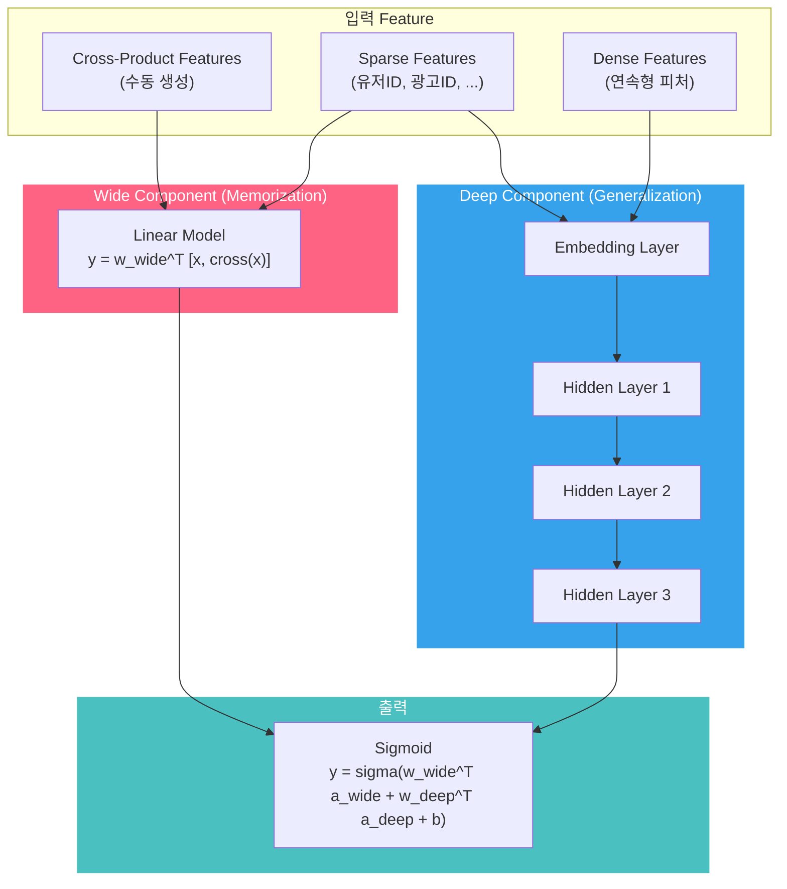
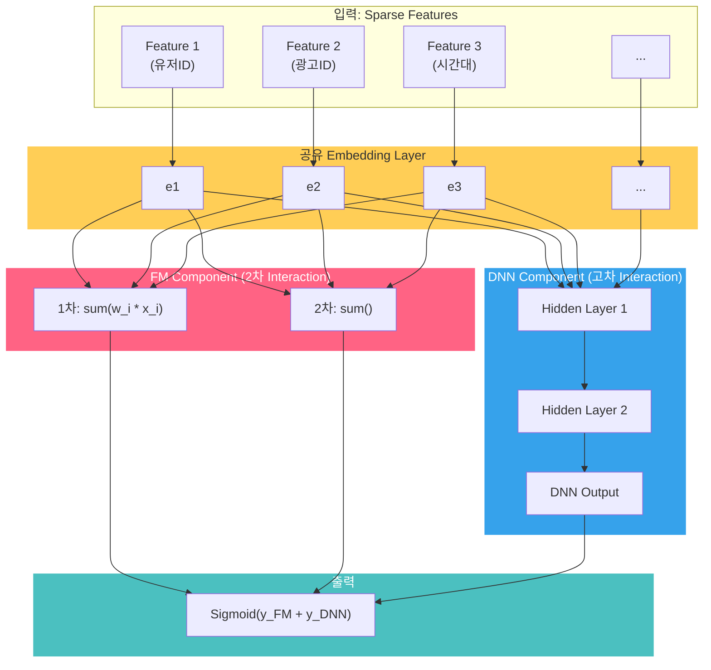
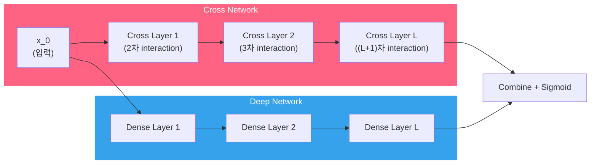
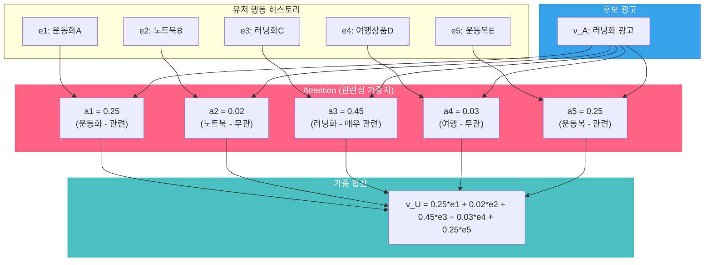
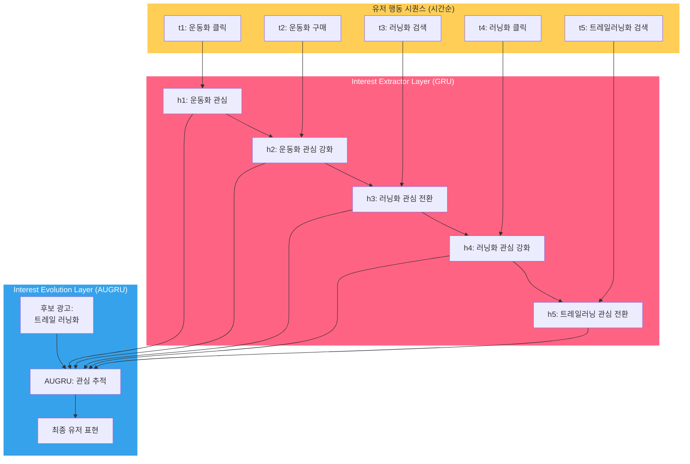

pCTR은 광고 시스템의 심장입니다. [Bid Shading](post.html?id=bid-shading-censored)에서 최적 입찰가를 계산하려면 True Value가 정확해야 하고, True Value의 핵심이 pCTR입니다. [Auto-Bidding](post.html?id=auto-bidding-pacing)에서 수십만 번의 입찰을 최적화하려면 매 기회의 가치를 정확히 평가해야 하고, 그 기초가 pCTR입니다. [모델 서빙 아키텍처](post.html?id=model-serving-architecture)에서 Multi-Stage Ranking의 각 단계에 어떤 모델을 배치할지 결정하려면, 모델의 정확도와 복잡도 trade-off를 이해해야 합니다.

이 글은 CTR 예측 모델의 진화를 **"어떤 문제를 풀려고 했는가"** 관점으로 추적합니다. 각 모델이 이전 모델의 어떤 한계를 극복했는지, 그리고 그 혁신이 프로덕션 광고 시스템에서 왜 중요한지를 해부합니다.

---

## 1. 핵심 비교: Executive Summary

먼저 전체 지형을 봅니다. LR부터 DIEN까지, 각 모델이 CTR 예측의 어떤 문제를 해결했는지 한눈에 비교합니다.

| 모델 | 연도 | 핵심 혁신 | Feature Interaction | 유저 행동 반영 | 복잡도 |
|------|------|----------|-------------------|-------------|-------|
| **LR** | - | Baseline, 해석 가능 | 수동 Cross Feature | 없음 | 매우 낮음 |
| **FM** | 2010 | Latent Vector로 Interaction 자동 학습 | 2차 (자동) | 없음 | 낮음 |
| **FFM** | 2016 | Field-aware: 필드별 다른 Latent Vector | 2차 (필드별) | 없음 | 중간 |
| **Wide & Deep** | 2016 | Memorization + Generalization 결합 | 수동(Wide) + 암묵적(Deep) | 없음 | 중간 |
| **DeepFM** | 2017 | FM + DNN, Embedding 공유로 End-to-End | 2차(FM) + 고차(DNN) | 없음 | 중간 |
| **DCN** | 2017 | Cross Network으로 명시적 고차 Interaction | 명시적 고차 (L-layer) | 없음 | 중간 |
| **DCN-v2** | 2021 | Weight Matrix + Mixture of Experts | 명시적 고차 (풍부한 표현력) | 없음 | 중~높음 |
| **DIN** | 2018 | 후보 광고 기반 Attention으로 행동 가중 | 고차 (DNN) | Attention 기반 | 높음 |
| **DIEN** | 2019 | GRU + AUGRU로 관심사의 시간적 변화 모델링 | 고차 (DNN) | 시퀀스 + Attention | 매우 높음 |

> 핵심 관찰: 모델의 진화는 크게 두 축을 따릅니다. (1) Feature Interaction을 더 풍부하게 포착하는 방향, (2) 유저 행동 시퀀스를 더 정교하게 반영하는 방향. 이 두 축이 합쳐질 때 CTR 예측의 정확도가 비약적으로 향상됩니다.

---

## 2. Sparse Feature의 도전: 왜 광고 CTR이 특별한가

### 광고 CTR 예측의 특수성

이미지 분류나 NLP와 달리, 광고 CTR 예측은 **극도로 sparse한 categorical feature**가 지배합니다. 유저 ID, 광고 ID, 퍼블리셔 ID, 광고주 ID, 캠페인 ID, 크리에이티브 ID — 이 모든 것이 categorical이며, 각각 수십만에서 수억 개의 고유값을 가집니다.

| 특성 | 일반 ML (이미지, NLP) | 광고 CTR 예측 |
|------|---------------------|-------------|
| **주요 Feature 타입** | Dense (픽셀, 임베딩) | Sparse Categorical |
| **Feature Space 차원** | 수백~수천 | **수천만~수억** |
| **Feature 밀도** | 거의 모든 값이 non-zero | 대부분 0 (One-hot) |
| **Feature Interaction** | CNN/Transformer가 자동 학습 | **명시적 설계 또는 전용 아키텍처 필요** |
| **데이터 분포** | 비교적 균일 | **극도의 Long-tail** (인기 광고 << 전체) |

### One-hot의 한계와 Embedding의 필수성

유저 ID가 1,000만 개라면, One-hot 인코딩은 1,000만 차원의 벡터를 만듭니다. 이것을 직접 모델에 넣으면:

- 파라미터 수가 폭발합니다 (LR의 weight만 해도 수억 개)
- Sparse Feature 간의 interaction을 학습할 수 없습니다 (대부분의 feature 쌍이 한 번도 함께 등장하지 않음)
- 새로운 유저/광고에 대한 일반화가 불가능합니다 (Cold-start)

Embedding은 이 문제의 해법입니다. 수천만 차원의 One-hot 벡터를 수십~수백 차원의 dense vector로 압축합니다:

$$\text{Embedding}: \mathbb{R}^{|V|} \xrightarrow{\text{lookup}} \mathbb{R}^{k} \quad (|V| \gg k)$$

여기서 $|V|$은 vocabulary 크기 (수천만), $k$는 embedding 차원 (보통 8~128)입니다. Embedding Table의 크기가 광고 모델의 **메모리 병목**이 되는 이유이기도 합니다. [모델 서빙 아키텍처](post.html?id=model-serving-architecture) 포스트에서 Embedding Lookup이 서빙의 최대 병목임을 확인했습니다.

### Feature Interaction이 CTR을 결정한다

광고 CTR 예측에서 **개별 feature보다 feature 간의 조합(interaction)**이 훨씬 중요합니다.

- `user_gender=여성` 단독으로는 CTR 예측에 거의 도움이 안 됩니다
- `user_gender=여성 AND ad_category=화장품` 조합은 CTR을 크게 높입니다
- `user_gender=여성 AND ad_category=화장품 AND hour=21` 3차 조합은 더 정확합니다

이 Feature Interaction을 어떻게 포착하느냐가 CTR 모델 진화의 핵심 축입니다.

---

## 3. Feature Interaction의 진화

### ① Logistic Regression (Baseline)

모든 CTR 예측의 출발점입니다. Feature vector $x$에 대해:

$$\hat{y} = \sigma(w^T x + b) = \frac{1}{1 + e^{-(w^T x + b)}}$$

LR은 각 feature에 독립적인 weight $w_i$를 부여합니다. Feature 간의 interaction은 **엔지니어가 수동으로** cross feature를 만들어야 합니다:

```
# 수동 Cross Feature Engineering
feature["gender_X_adcat"] = feature["gender"] + "_" + feature["ad_category"]
feature["gender_X_adcat_X_hour"] = feature["gender"] + "_" + feature["ad_category"] + "_" + str(feature["hour"])
```

**한계**: 2차 interaction만 해도 feature 수가 $O(n^2)$으로 폭발하고, 3차 이상은 사실상 수동으로 만들 수 없습니다. 어떤 feature 쌍이 유용한지 도메인 지식에 의존해야 하며, 새로운 feature가 추가될 때마다 cross feature를 다시 설계해야 합니다.

**실무에서의 위치**: 그럼에도 LR은 여전히 중요합니다. [모델 서빙 아키텍처](post.html?id=model-serving-architecture) 포스트의 Multi-Stage Ranking에서 Pre-Ranking 단계의 경량 모델로 널리 사용됩니다. 해석 가능성, 학습 속도, 서빙 레이턴시 면에서 타의 추종을 불허합니다.

### ② FM (Factorization Machines, 2010)

Rendle이 2010년에 제안한 FM은 CTR 예측의 **패러다임 전환**이었습니다. 핵심 아이디어: 모든 feature 쌍의 interaction을 **latent vector의 내적**으로 학습합니다.

$$\hat{y} = w_0 + \sum_{i=1}^{n} w_i x_i + \sum_{i=1}^{n} \sum_{j=i+1}^{n} \langle v_i, v_j \rangle x_i x_j$$

여기서 $v_i \in \mathbb{R}^k$는 feature $i$의 latent vector, $\langle v_i, v_j \rangle = \sum_{f=1}^{k} v_{i,f} \cdot v_{j,f}$는 내적입니다.

**왜 혁신인가**: LR에서 interaction weight $w_{ij}$를 직접 학습하면, feature $i$와 $j$가 함께 등장한 데이터가 있어야 합니다. Sparse 데이터에서는 대부분의 쌍이 한 번도 함께 등장하지 않으므로 학습이 불가능합니다. FM은 각 feature의 latent vector를 독립적으로 학습한 뒤, interaction을 내적으로 계산하므로 **한 번도 함께 등장하지 않은 feature 쌍의 interaction도 추정**할 수 있습니다.

**계산 트릭**: 나이브하게 계산하면 $O(kn^2)$이지만, 수식을 변환하면 $O(kn)$으로 줄일 수 있습니다:

$$\sum_{i=1}^{n} \sum_{j=i+1}^{n} \langle v_i, v_j \rangle x_i x_j = \frac{1}{2} \sum_{f=1}^{k} \left[ \left( \sum_{i=1}^{n} v_{i,f} x_i \right)^2 - \sum_{i=1}^{n} v_{i,f}^2 x_i^2 \right]$$

이 트릭 덕분에 FM은 대규모 광고 시스템에서도 실시간 서빙이 가능합니다.

```python
import numpy as np

def fm_interaction_naive(V, x):
    """Naive: O(kn²) — 모든 쌍의 내적을 직접 계산"""
    n = len(x)
    result = 0.0
    for i in range(n):
        for j in range(i + 1, n):
            result += np.dot(V[i], V[j]) * x[i] * x[j]
    return result

def fm_interaction_fast(V, x):
    """O(kn) 트릭: (합의 제곱 - 제곱의 합) / 2"""
    vx = V * x[:, np.newaxis]
    square_of_sum = np.sum(vx, axis=0) ** 2
    sum_of_square = np.sum(vx ** 2, axis=0)
    return 0.5 * np.sum(square_of_sum - sum_of_square)

# 5개 Feature, embedding 차원 k=4
np.random.seed(42)
V = np.random.randn(5, 4)
x = np.array([1, 0, 1, 1, 0], dtype=float)  # sparse feature

naive = fm_interaction_naive(V, x)
fast = fm_interaction_fast(V, x)
print(f"  Naive O(kn²): {naive:.4f}")
print(f"  Fast  O(kn):  {fast:.4f}")
print(f"  동일 결과: {np.isclose(naive, fast)}")
# O(kn) 트릭으로 실시간 서빙에서도 모든 피처 쌍 상호작용 계산 가능
```

**한계**: FM은 **2차 interaction까지만** 포착합니다. `유저 X 광고 X 시간대` 같은 3차 이상의 interaction은 학습할 수 없습니다.

### ③ Wide & Deep (Google, 2016)

Google이 2016년에 Google Play Store 앱 추천에 적용한 Wide & Deep은 **Memorization과 Generalization의 결합**이라는 새로운 관점을 제시했습니다.



- **Wide (Memorization)**: Cross-product feature 변환을 통해 **특정 패턴을 직접 기억**합니다. "남성 AND 25-34세 AND 게임 앱 → 높은 설치율"과 같은 직접적 패턴을 기억합니다.
- **Deep (Generalization)**: Sparse feature를 embedding한 뒤 DNN에 넣어 **본 적 없는 feature 조합에도 일반화**합니다.

최종 예측:

$$\hat{y} = \sigma \left( w_{wide}^T [x, \phi(x)] + w_{deep}^T a^{(l_f)} + b \right)$$

여기서 $\phi(x)$는 cross-product 변환, $a^{(l_f)}$는 Deep의 마지막 hidden layer 출력입니다.

Google Play Store에서 Wide & Deep을 적용한 결과, 기존 모델 대비 앱 설치율이 3.9% 향상되었다고 보고했습니다.

**한계**: Wide 파트의 cross-product feature를 **수동으로 설계**해야 합니다. 어떤 feature 쌍을 cross할지 도메인 전문가의 개입이 필요하며, 이것이 모델의 성능 상한을 결정합니다. 수백 개의 feature가 있을 때 최적의 cross-product 조합을 찾는 것은 사실상 불가능합니다.

### ④ DeepFM (2017)

DeepFM은 Wide & Deep의 핵심 한계 — Wide 파트의 수동 feature engineering — 를 해결합니다. 핵심 아이디어: **Wide를 FM으로 대체**하고, FM과 DNN이 **embedding을 공유**하여 end-to-end로 학습합니다.



$$\hat{y} = \sigma(y_{FM} + y_{DNN})$$

여기서 $y_{FM}$은 FM Component의 출력 (1차 + 2차 interaction), $y_{DNN}$은 DNN Component의 출력 (고차 interaction)입니다. 핵심은 FM과 DNN이 **동일한 Embedding Table을 공유**한다는 것입니다. 이로 인해:

- 별도의 feature engineering이 필요 없습니다 (Wide & Deep과의 가장 큰 차이)
- FM이 low-order interaction을, DNN이 high-order interaction을 분담합니다
- End-to-end 학습으로 embedding이 두 component 모두에 최적화됩니다

| 비교 항목 | Wide & Deep | DeepFM |
|----------|-------------|--------|
| Low-order Interaction | 수동 Cross Feature (Wide) | **FM이 자동 학습** |
| High-order Interaction | DNN (Deep) | DNN (Deep) |
| Feature Engineering | **필요 (Wide 파트)** | 불필요 |
| Embedding 공유 | Wide와 Deep 별도 | **FM과 DNN 공유** |
| End-to-End 학습 | 부분적 | **완전한 End-to-End** |

[Bid Shading 포스트](post.html?id=bid-shading-censored)에서 Zhou et al.이 시장 가격 분포 추정에 여러 네트워크 구조를 비교한 결과, **DeepFM이 Surplus Lift +7.10%로 최고 성능**을 기록했습니다. FM의 2차 interaction과 DNN의 고차 interaction이 결합되어, 시장 가격에 영향을 미치는 복잡한 feature 조합 (exchange, 시간대, 디바이스, 광고 카테고리 등)을 효과적으로 포착한 것입니다.

### ⑤ DCN / DCN-v2 (Google, 2017/2021)

DCN(Deep & Cross Network)은 Feature Interaction 학습에 대한 또 다른 접근입니다. FM이 2차까지만 포착하는 한계를, **Cross Network**으로 극복합니다. Cross Network는 **명시적으로 고차 feature interaction을 학습**하되, DNN보다 파라미터 효율적입니다.

#### Cross Layer의 수식

Cross Network의 각 layer는 다음과 같이 정의됩니다:

$$x_{l+1} = x_0 \odot (W_l x_l + b_l) + x_l$$

여기서 $x_0$은 입력, $x_l$은 $l$번째 layer의 출력, $W_l$은 weight, $\odot$은 element-wise 곱입니다. DCN의 원래 수식에서는 $W_l$이 벡터였습니다:

$$x_{l+1} = x_0 \cdot x_l^T w_l + b_l + x_l$$

핵심 특성:

- **$L$-layer Cross Network은 $(L+1)$차까지의 feature interaction을 명시적으로 학습**합니다
- 각 layer가 $x_0$과의 interaction을 추가하므로, interaction 차수가 layer마다 1씩 증가합니다
- 파라미터 수는 layer당 $O(d)$로, DNN의 $O(d^2)$보다 훨씬 효율적입니다



#### DCN-v2 (2021)

DCN의 원래 Cross Layer에서 $W_l$은 벡터였습니다. 이는 **rank-1 행렬**만 만들 수 있어 표현력이 제한됩니다. DCN-v2는 이를 **full-rank weight matrix**로 확장했습니다:

$$x_{l+1} = x_0 \odot (W_l x_l + b_l) + x_l$$

여기서 $W_l \in \mathbb{R}^{d \times d}$는 행렬입니다. 파라미터 수가 증가하는 trade-off가 있지만, **Mixture of Experts (MoE)** 구조를 도입하여 효율적으로 확장합니다:

$$W_l = \sum_{i=1}^{K} G_i(x) \cdot W_l^{(i)}$$

여기서 $G_i(x)$는 gating function, $W_l^{(i)}$는 expert별 weight matrix입니다. 각 입력에 따라 다른 expert를 활성화하여, 파라미터 효율성을 유지하면서 표현력을 높입니다.

| 비교 항목 | FM | DCN | DCN-v2 |
|----------|-----|-----|--------|
| Interaction 차수 | 2차 | $(L+1)$차 | $(L+1)$차 |
| Cross weight | 내적 (스칼라) | 벡터 (rank-1) | **행렬 (full-rank)** |
| 파라미터 효율 | $O(nk)$ | $O(Ld)$ | $O(Ld^2 / K)$ (MoE) |
| 표현력 | 제한적 | 중간 | **높음** |

---

## 4. 유저 행동 시퀀스의 도입: DIN & DIEN

3절의 모델들은 feature interaction을 더 풍부하게 포착하는 데 집중했습니다. 하지만 이 모델들에는 공통적인 **구조적 한계**가 있습니다: **유저의 과거 행동(behavior sequence)을 고정 길이 벡터로 압축**한다는 것입니다.

유저가 지난 30일간 100개의 상품을 클릭했다면, 기존 모델은 이 100개 행동의 embedding을 sum 또는 mean pooling으로 하나의 벡터로 축약합니다:

$$v_U = \frac{1}{H} \sum_{j=1}^{H} e_j \quad \text{(mean pooling)}$$

이 방식의 문제: 유저가 운동화도 보고, 노트북도 보고, 여행 상품도 봤다면 — 이 모든 관심사가 하나의 벡터에 평균되어 **어떤 관심사도 제대로 반영하지 못합니다**. 운동화 광고를 볼 때, 유저의 노트북 구매 이력은 무관한 잡음입니다.

### ① DIN (Alibaba, 2018)

DIN(Deep Interest Network)은 이 문제를 **Attention 메커니즘**으로 해결합니다. 핵심 아이디어: **현재 후보 광고(candidate ad)와 관련된 유저 행동에만 주목**합니다.

#### Attention 메커니즘

유저의 행동 히스토리 $\{e_1, e_2, ..., e_H\}$와 후보 광고 embedding $v_A$가 주어질 때:

$$v_U(A) = f(v_A, e_1, e_2, ..., e_H) = \sum_{j=1}^{H} a(e_j, v_A) \cdot e_j$$

여기서 attention weight $a(e_j, v_A)$는:

$$a(e_j, v_A) = \frac{\exp(\text{MLP}(e_j, v_A, e_j - v_A, e_j \odot v_A))}{\sum_{k=1}^{H} \exp(\text{MLP}(e_k, v_A, e_k - v_A, e_k \odot v_A))}$$

MLP에 $e_j$와 $v_A$뿐만 아니라, 차이($e_j - v_A$)와 element-wise 곱($e_j \odot v_A$)까지 입력하여 풍부한 관련성 신호를 포착합니다.



**직관**: 러닝화 광고를 볼 때, 유저의 과거 러닝화/운동화/운동복 구매 이력에 높은 weight가 부여되고, 노트북이나 여행 상품에는 거의 0에 가까운 weight가 부여됩니다. 동일한 유저라도 **후보 광고가 바뀌면 유저 표현 $v_U$가 달라집니다** -- 이것이 DIN의 핵심 혁신입니다.

```python
import numpy as np

def din_attention(user_behaviors, candidate_ad):
    """DIN: 후보 광고에 따라 유저 행동 가중치가 달라짐"""
    scores = []
    for behavior in user_behaviors:
        # Attention 입력: [행동, 후보, 차이, element-wise 곱]
        diff = behavior - candidate_ad
        product = behavior * candidate_ad
        mlp_input = np.concatenate([behavior, candidate_ad, diff, product])
        score = np.tanh(mlp_input.sum())  # 실제론 학습된 MLP
        scores.append(score)

    # Softmax → 행동별 관련성 가중치
    exp_s = np.exp(scores - np.max(scores))
    weights = exp_s / exp_s.sum()

    user_repr = sum(w * b for w, b in zip(weights, user_behaviors))
    return weights, user_repr

# 예시: 러닝화 광고 vs 유저의 5개 행동
np.random.seed(42)
d = 8
behaviors = {
    "운동화": np.random.randn(d) + [1,0,0,0,0,0,0,0],
    "노트북": np.random.randn(d) + [0,0,1,0,0,0,0,0],
    "러닝화": np.random.randn(d) + [1,0,0,0,0,0,0,0],
    "여행팩": np.random.randn(d) + [0,0,0,1,0,0,0,0],
    "운동복": np.random.randn(d) + [1,0,0,0,0,0,0,0],
}
candidate = np.random.randn(d) + [1,0,0,0,0,0,0,0]  # 러닝화 광고

weights, _ = din_attention(list(behaviors.values()), candidate)
for name, w in zip(behaviors.keys(), weights):
    bar = "█" * int(w * 40)
    print(f"  {name:4s}: {w:.3f} {bar}")
# 운동화/러닝화/운동복에 높은 가중치 → 관련 행동만 주목
```

#### DIN vs 기존 방식 비교

| 비교 항목 | 기존 (Sum/Mean Pooling) | DIN (Attention) |
|----------|----------------------|-----------------|
| 유저 표현 | 고정 (후보 광고와 무관) | **후보 광고에 따라 동적 변화** |
| 정보 손실 | 다양한 관심사가 평균화 | **관련 행동만 선택적 증폭** |
| 계산 비용 | $O(H)$ | $O(H \cdot d)$ (attention 계산) |
| 후보 광고 수 $N$일 때 | 유저 표현 1번 계산 | **$N$번 계산 (서빙 비용 증가)** |

> 서빙 관점의 주의점: DIN에서 유저 표현은 후보 광고마다 달라지므로, 50개 후보에 대해 attention을 50번 계산해야 합니다. 이것이 [모델 서빙 아키텍처](post.html?id=model-serving-architecture)에서 Multi-Stage Ranking이 필수적인 이유 중 하나입니다. DIN 같은 무거운 모델은 Ranking 단계(50개 이하)에서만 사용합니다.

### ② DIEN (Alibaba, 2019)

DIN은 유저 행동의 **관련성**은 포착하지만, **시간적 변화(temporal evolution)**는 반영하지 못합니다. "1주 전에 운동화에 관심 → 3일 전에 러닝화로 관심 이동 → 어제부터 트레일 러닝화에 관심" — 이런 관심사의 **흐름**을 DIN은 포착할 수 없습니다. DIEN(Deep Interest Evolution Network)은 이 한계를 극복합니다.

DIEN은 두 개의 핵심 layer로 구성됩니다:



#### Interest Extractor Layer

GRU(Gated Recurrent Unit)로 행동 시퀀스에서 **관심사 시퀀스**를 추출합니다:

$$h_t = \text{GRU}(h_{t-1}, e_t)$$

각 시점의 hidden state $h_t$는 해당 시점까지의 유저 관심사를 요약합니다. 추가로, auxiliary loss를 통해 다음 행동을 예측하도록 학습하여 hidden state의 품질을 높입니다:

$$L_{aux} = -\frac{1}{T-1} \sum_{t=1}^{T-1} \left[ \log \sigma(h_t^T e_{t+1}^+) + \log(1 - \sigma(h_t^T e_{t+1}^-)) \right]$$

여기서 $e_{t+1}^+$는 실제 다음 행동, $e_{t+1}^-$는 negative sample입니다.

#### Interest Evolution Layer

AUGRU(Attention-based GRU)로 **후보 광고와 관련된 관심사의 시간적 변화**를 추적합니다. 일반 GRU의 update gate를 attention score로 조절합니다:

$$a_t = \text{Attention}(h_t, v_A)$$

$$\tilde{u}_t = a_t \cdot u_t$$

$$h'_t = (1 - \tilde{u}'_t) \odot h'_{t-1} + \tilde{u}'_t \odot \tilde{h}'_t$$

attention score $a_t$가 낮으면 (후보 광고와 무관한 관심사) update gate가 닫혀 정보가 전달되지 않고, $a_t$가 높으면 (관련 관심사) update gate가 열려 정보가 전달됩니다.

**직관적 예시**:

| 시점 | 유저 행동 | GRU 상태 (Interest Extractor) | AUGRU (트레일 러닝화 광고 기준) |
|------|---------|---------------------------|---------------------------|
| t1 | 운동화 클릭 | 운동화 관심 | 약간 관련 → 부분 전달 |
| t2 | 운동화 구매 | 운동화 관심 강화 | 약간 관련 → 부분 전달 |
| t3 | 러닝화 검색 | 러닝화로 관심 전환 | 관련 → 전달 |
| t4 | 러닝화 클릭 | 러닝화 관심 강화 | 관련 → 전달 |
| t5 | 트레일 러닝화 검색 | 트레일 러닝으로 전환 | **매우 관련 → 강하게 전달** |

최종 hidden state는 "운동화 → 러닝화 → 트레일 러닝화"로의 관심사 진화를 반영합니다.

| 비교 항목 | DIN | DIEN |
|----------|-----|------|
| 유저 행동 모델링 | Attention (순서 무시) | **GRU + Attention (순서 반영)** |
| 관심사 변화 | 반영 불가 | **시간적 evolution 추적** |
| Auxiliary Loss | 없음 | **다음 행동 예측으로 hidden state 강화** |
| 모델 복잡도 | 중간 | 높음 (GRU + AUGRU) |
| 서빙 레이턴시 | 중간 | **높음 (sequential 연산)** |

---

## 5. 실무 선택 가이드: 어떤 모델을 써야 하는가

이론적 우수성과 프로덕션 적합성은 다른 문제입니다. 아래 가이드는 실무 상황별 모델 선택을 돕습니다.

| 상황 | 트래픽 규모 | 유저 행동 데이터 | 서빙 레이턴시 제약 | Feature Engineering 리소스 | 추천 모델 |
|------|-----------|-------------|---------------|----------------------|---------|
| **MVP / 초기** | 소규모 (일 수십만) | 없거나 적음 | 느슨 (50ms+) | 적음 | **LR + 수동 Cross Feature** |
| **성장기** | 중규모 (일 수백만) | 기본 클릭 로그 | 보통 (20ms) | 중간 | **DeepFM** |
| **대규모, 행동 데이터 부족** | 대규모 (일 수억) | 적음 | 엄격 (10ms) | 많음 | **DCN-v2** |
| **대규모, 행동 데이터 풍부** | 대규모 (일 수억) | 풍부한 클릭/구매 시퀀스 | Ranking 단계 5ms | 많음 | **DIN** |
| **대규모, 시퀀스 + 시간 중요** | 대규모 | 시계열 행동 데이터 | Ranking 단계 5ms | 많음 | **DIEN** |

### Multi-Stage에서의 모델 배치

실제 프로덕션에서는 하나의 모델만 사용하지 않습니다. [모델 서빙 아키텍처](post.html?id=model-serving-architecture)에서 다뤘듯이, 각 단계에 적합한 모델을 배치합니다:

| Ranking 단계 | 후보 수 | 레이턴시 예산 | 적합 모델 | 이유 |
|-------------|--------|-----------|---------|------|
| **Pre-Ranking** | 수백 → 50 | ~1ms | LR, 작은 MLP | 빠른 필터링이 핵심 |
| **Ranking** | 50 → 5 | ~3-5ms | DeepFM, DCN-v2, DIN | 정밀 예측이 핵심 |
| **Re-Ranking** | 5 → 1 | ~0.5ms | 규칙 + 점수 보정 | 비즈니스 로직 적용 |

> 실무 원칙: "모델의 AUC 1% 향상보다, 적절한 모델을 적절한 단계에 배치하는 시스템 설계가 더 큰 비즈니스 임팩트를 만든다."

---

## 6. 서빙과의 연결: 모델이 아무리 좋아도 10ms 안에 돌아야 한다

### 모델 복잡도 vs 서빙 레이턴시 Trade-off

모델이 복잡해질수록 CTR 예측 정확도는 올라가지만, 서빙 레이턴시도 증가합니다. 100ms RTB 타임아웃 안에서 모든 것이 완료되어야 하므로, 모델에 할당할 수 있는 시간은 기껏해야 3-5ms입니다.

| 모델 | 오프라인 AUC (상대) | 추론 레이턴시 (50개 배치) | 모델 크기 |
|------|-----------------|---------------------|---------|
| LR | baseline | 0.1ms | 수 MB |
| FM | +0.5~1% | 0.3ms | 수십 MB |
| DeepFM | +1~2% | 1.5ms | 수백 MB |
| DCN-v2 | +1.5~2.5% | 2ms | 수백 MB |
| DIN | +2~3% | 3ms | 수백 MB ~ 1 GB |
| DIEN | +2.5~3.5% | 5ms+ | 1 GB+ |

### 프로덕션에서의 경량화 전략

복잡한 모델의 성능을 유지하면서 서빙 레이턴시를 줄이는 기법들입니다:

**Knowledge Distillation**: 복잡한 teacher 모델(DIN, DIEN)의 예측을 가벼운 student 모델(DeepFM, MLP)이 학습합니다. Teacher의 soft label은 hard label보다 더 풍부한 정보를 담고 있어, student가 원래 능력 이상의 성능을 낼 수 있습니다.

$$L_{student} = \alpha \cdot L_{CE}(y, \hat{y}_{student}) + (1 - \alpha) \cdot L_{KD}(\hat{y}_{teacher}, \hat{y}_{student})$$

**Quantization**: FP32 → FP16 → INT8로 모델 정밀도를 낮춥니다. 모델 크기가 2-4배 줄고, 추론 속도가 1.5-3배 빨라지며, 정확도 손실은 보통 0.1% 미만입니다.

**Embedding Compression**: 전체 모델 크기의 90% 이상을 차지하는 Embedding Table을 압축합니다. Hash Embedding, Mixed-Dimension Embedding, Pruning 등의 기법이 있습니다.

> 이 경량화 기법들의 상세 내용은 [모델 서빙 아키텍처](post.html?id=model-serving-architecture) 포스트에서 다뤘습니다. [Feature Store](post.html?id=feature-store-serving) 포스트에서는 모델에 피처를 10ms 안에 공급하는 파이프라인을 해부했습니다.

---

## 마무리

CTR 예측 모델의 진화에서 핵심 5가지를 정리합니다:

1. **Sparse Feature에서 Feature Interaction이 핵심이다** -- 개별 feature보다 feature 간의 조합이 CTR을 결정합니다. LR의 수동 cross feature에서 FM의 자동 2차 interaction, DCN의 명시적 고차 interaction으로 진화했습니다.

2. **Embedding 공유가 End-to-End 학습을 가능하게 했다** -- DeepFM이 FM과 DNN의 embedding을 공유함으로써 수동 feature engineering 없이도 low-order와 high-order interaction을 동시에 포착합니다.

3. **유저 행동 시퀀스는 고정 벡터로 압축할 수 없다** -- DIN의 Attention은 후보 광고에 따라 유저 표현을 동적으로 변화시키고, DIEN의 AUGRU는 관심사의 시간적 변화까지 추적합니다.

4. **프로덕션에서는 모델 복잡도와 서빙 레이턴시의 균형이 전부다** -- 아무리 정확한 모델도 10ms 안에 돌지 못하면 쓸모없습니다. Multi-Stage Ranking에서 각 단계에 적합한 모델을 배치하고, Distillation과 Quantization으로 경량화해야 합니다.

5. **모델 아키텍처는 수단이고, 최종 목표는 정확한 pCTR이다** -- 정확한 pCTR → 정확한 True Value ($V = pCTR \times \text{ConvValue}$) → 효율적 [Bid Shading](post.html?id=bid-shading-censored) → 최적 [Auto-Bidding](post.html?id=auto-bidding-pacing). 모델은 이 파이프라인의 한 조각입니다.

---

### 참고문헌

- Rendle, S. (2010). *Factorization Machines*. In Proceedings of the 10th IEEE International Conference on Data Mining (ICDM).
- Cheng, H.-T., Koc, L., Harmsen, J., et al. (2016). *Wide & Deep Learning for Recommender Systems*. In Proceedings of the 1st Workshop on Deep Learning for Recommender Systems (DLRS).
- Guo, H., Tang, R., Ye, Y., Li, Z., & He, X. (2017). *DeepFM: A Factorization-Machine based Neural Network for CTR Prediction*. In Proceedings of IJCAI.
- Wang, R., Fu, B., Fu, G., & Wang, M. (2017). *Deep & Cross Network for Ad Click Predictions*. In Proceedings of the ADKDD Workshop.
- Wang, R., Shivanna, R., Cheng, D., Jain, S., Lin, D., Hong, L., & Chi, E. (2021). *DCN V2: Improved Deep & Cross Network and Practical Lessons for Web-scale Learning to Rank Systems*. In Proceedings of The Web Conference (WWW).
- Zhou, G., Zhu, X., Song, C., Fan, Y., Zhu, H., Ma, X., ... & Gai, K. (2018). *Deep Interest Network for Click-Through Rate Prediction*. In Proceedings of the 24th ACM SIGKDD.
- Zhou, G., Mou, N., Fan, Y., Pi, Q., Bian, W., Zhou, C., Zhu, X., & Gai, K. (2019). *Deep Interest Evolution Network for Click-Through Rate Prediction*. In Proceedings of the AAAI Conference on Artificial Intelligence.
