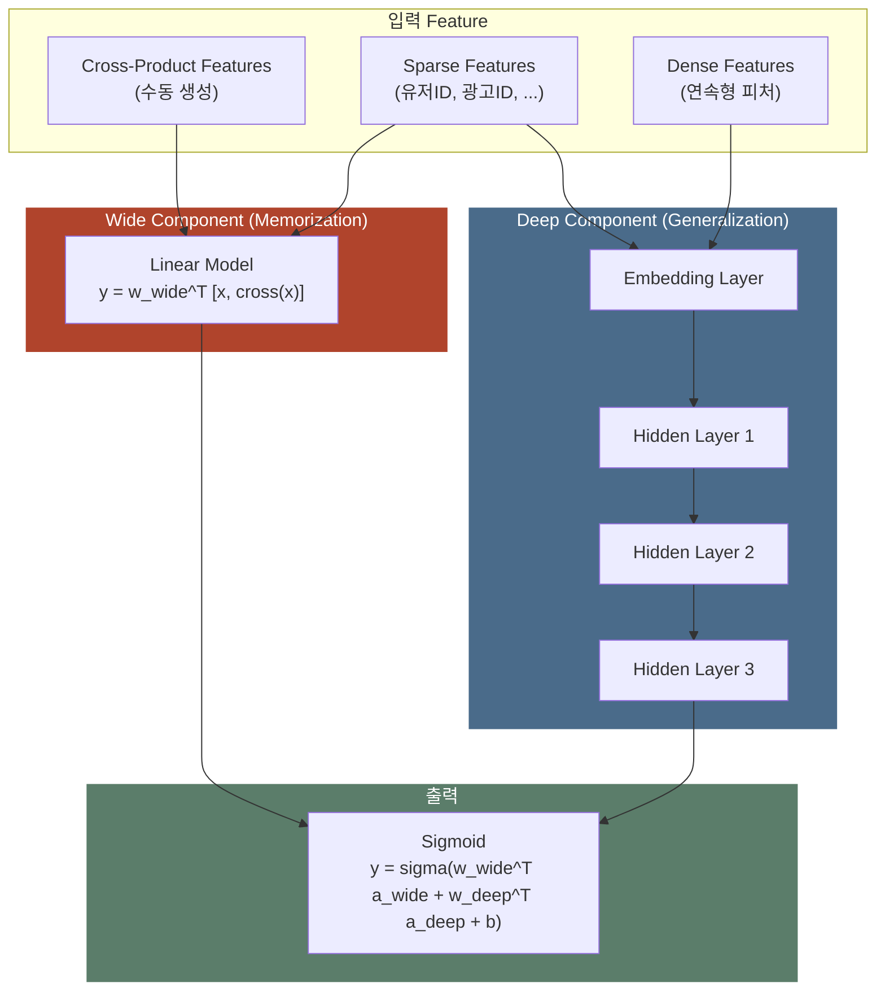
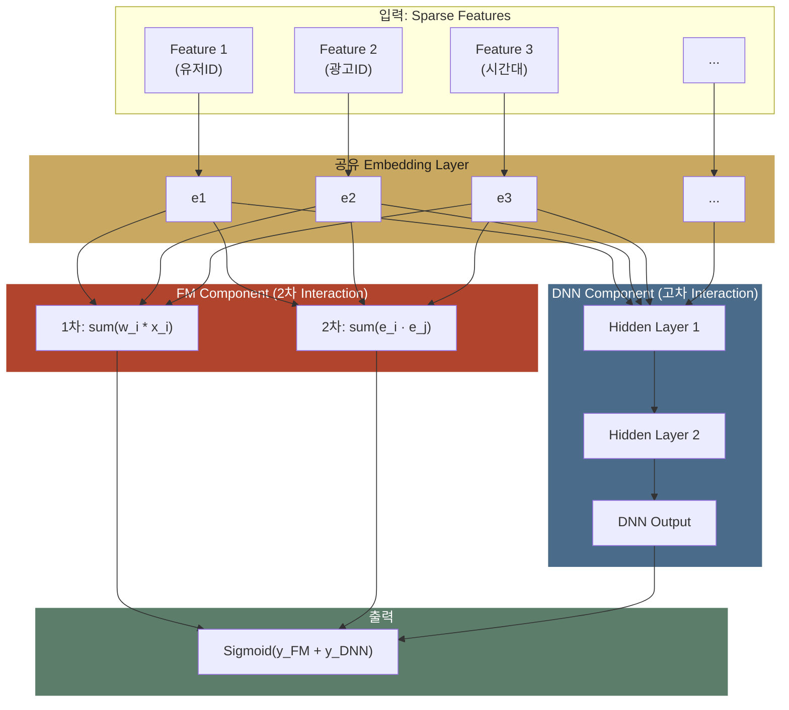
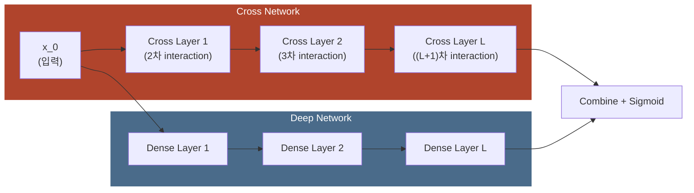
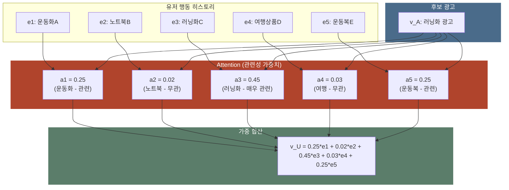
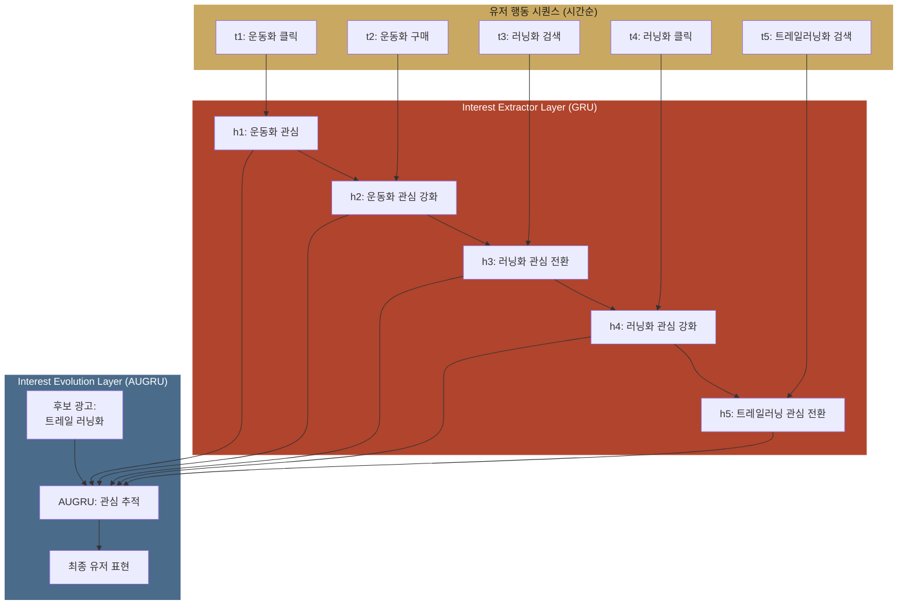

저녁 8시, 지하철에서 폰을 켭니다. 앱을 열면 광고 한 칸이 뜹니다. 그 칸에 무엇을 넣을지는 확률 하나가 결정합니다. "이 사람이 이 광고를 누를까?" 이 예측 확률을 pCTR이라고 부릅니다.

그런데 이 확률을 무엇으로 계산할까요. 나이, 시간대, 광고 카테고리 같은 조각들이 재료입니다. 문제는 조각을 어떻게 **조합**하느냐입니다. "20대"만으로는 아무것도 알 수 없습니다. "20대 × 저녁 × 화장품"이 되어야 뜻이 생깁니다.

지난 15년간 CTR 모델의 역사는 이 조합을 누가 만드느냐의 역사였습니다. 처음엔 사람이 손으로 적어 넣었습니다. 다음엔 모델이 스스로 만들었습니다. 마지막엔 모델이 유저의 행동 순서까지 읽기 시작했습니다.

> 한 줄 요약: CTR 모델의 진화는 두 축이다. 피처 조합을 사람 손에서 모델로 넘긴 축, 유저 행동을 평균에서 attention으로 바꾼 축.

pCTR은 광고 시스템의 심장입니다. 이 확률이 틀리면 그 뒤가 전부 틀립니다.

- 최적 입찰가를 계산하려면 True Value가 정확해야 합니다. 그 핵심이 pCTR입니다 → [Bid Shading](post.html?id=bid-shading-censored)
- 하루 수십만 번의 입찰을 배분하려면 매 기회의 가치를 알아야 합니다 → [Auto-Bidding](post.html?id=auto-bidding-pacing)
- 어느 단계에 어떤 모델을 놓느냐는 정확도와 지연의 맞교환입니다 → [모델 서빙 아키텍처](post.html?id=model-serving-architecture)

pCTR의 정의와 eCPM으로 이어지는 길은 [pCTR 예측](post.html?id=pctr-prediction)에서 다룹니다. 이 글은 그 확률을 계산하는 상자 안만 엽니다.

이 글은 CTR 예측 모델의 진화를 **"어떤 문제를 풀려고 했는가"** 관점으로 추적합니다. 각 모델이 이전 모델의 어떤 한계를 넘었는지 봅니다. 그리고 그 혁신이 프로덕션 광고 시스템에서 왜 중요한지 해부합니다.

> **골라 읽는 법** — 절이 11개인 긴 글입니다. 처음부터 다 읽지 않아도 됩니다.
>
> - 모델 계보만 훑으려면 → 1~3절
> - 유저 행동 시퀀스(DIN·DIEN)만 → 4절
> - 고르는 기준과 서빙 제약만 → 5~6절
> - 두 무대 비교만 → 7~8절

---
## 1. 핵심 비교: Executive Summary

먼저 전체 지형을 봅니다. LR부터 DIEN까지, 각 모델이 CTR 예측의 어떤 문제를 해결했는지 한눈에 비교합니다.

| 모델 | 연도 | 핵심 혁신 | Feature Interaction | 유저 행동 반영 | 복잡도 |
|------|------|----------|-------------------|-------------|-------|
| **LR** | - | Baseline, 해석 가능 | 수동 Cross Feature | 없음 | 매우 낮음 |
| **FM** | 2010 | Latent Vector로 Interaction 자동 학습 | 2차 (자동) | 없음 | 낮음 |
| **FFM** | 2016 | Field-aware: 필드별 다른 Latent Vector | 2차 (필드별) | 없음 | 중간 |
| **Wide & Deep** | 2016 | Memorization + Generalization 결합 | 수동(Wide) + 암묵적(Deep) | 없음 | 중간 |
| **DeepFM** | 2017 | FM + DNN, Embedding 공유로 End-to-End | 2차(FM) + 고차(DNN) | 없음 | 중간 |
| **DCN** | 2017 | Cross Network으로 명시적 고차 Interaction | 명시적 고차 (L-layer) | 없음 | 중간 |
| **DCN-v2** | 2021 | Weight Matrix + Mixture of Experts | 명시적 고차 (풍부한 표현력) | 없음 | 중~높음 |
| **DIN** | 2018 | 후보 광고 기반 Attention으로 행동 가중 | 고차 (DNN) | Attention 기반 | 높음 |
| **DIEN** | 2019 | GRU + AUGRU로 관심사의 시간적 변화 모델링 | 고차 (DNN) | 시퀀스 + Attention | 매우 높음 |

> 핵심 관찰: 모델의 진화는 크게 두 축을 따릅니다. (1) Feature Interaction을 더 풍부하게 포착하는 방향, (2) 유저 행동 시퀀스를 더 정교하게 반영하는 방향. 이 두 축이 합쳐질 때 CTR 예측의 정확도가 비약적으로 향상됩니다.

표를 위에서 아래로 읽으면 두 흐름이 보입니다.

첫째, **Feature Interaction 열이 "수동"에서 "자동"으로 넘어갑니다.** LR 시대에는 엔지니어가 "성별 × 카테고리" 같은 조합을 손으로 적어 넣었습니다. FM이 그 일을 모델에게 넘겼습니다. DCN은 3차, 4차 조합까지 자동으로 올라갔습니다.

둘째, **유저 행동 열이 "없음"에서 "시퀀스"로 바뀝니다.** 2017년까지의 모델은 유저를 ID 하나로만 봤습니다. DIN부터는 "이 유저가 최근에 무엇을 눌렀는가"를 직접 읽습니다.

두 축은 서로 독립입니다. 그래서 실무에서는 섞어 씁니다. DCN-v2의 cross network 위에 DIN의 attention을 얹은 구조가 흔합니다. 표의 아래로 갈수록 정확도는 오르고 지연도 같이 오릅니다. 6절에서 이 맞교환을 숫자로 봅니다.

한 가지를 미리 못 박아 둡니다. 구조를 아무리 키워도 예측의 **절대값**이 실제 클릭률과 안 맞으면 낙찰자가 틀립니다. 순위 지표만 좋아진 모델은 돈을 잃습니다. 이건 구조가 아니라 보정이 푸는 문제입니다. 자세한 건 [Calibration](post.html?id=calibration)에 있습니다.

---

## 2. Sparse Feature의 도전: 왜 광고 CTR이 특별한가

### 광고 CTR 예측의 특수성

이미지 분류나 NLP와 달리, 광고 CTR 예측은 **극도로 sparse한 categorical feature**가 지배합니다. 유저 ID, 광고 ID, 퍼블리셔 ID, 광고주 ID, 캠페인 ID, 크리에이티브 ID. 전부 categorical입니다. 각각 수십만에서 수억 개의 고유값을 가집니다.

| 특성 | 일반 ML (이미지, NLP) | 광고 CTR 예측 |
|------|---------------------|-------------|
| **주요 Feature 타입** | Dense (픽셀, 임베딩) | Sparse Categorical |
| **Feature Space 차원** | 수백~수천 | **수천만~수억** |
| **Feature 밀도** | 거의 모든 값이 non-zero | 대부분 0 (One-hot) |
| **Feature Interaction** | CNN/Transformer가 자동 학습 | **명시적 설계 또는 전용 아키텍처 필요** |
| **데이터 분포** | 비교적 균일 | **극도의 Long-tail** (인기 광고 << 전체) |

### One-hot의 한계와 Embedding의 필수성

유저 ID가 1,000만 개라면, One-hot 인코딩은 1,000만 차원의 벡터를 만듭니다. 이것을 직접 모델에 넣으면:

- 파라미터 수가 폭발합니다 (LR의 weight만 해도 수억 개)
- Sparse Feature 간의 interaction을 학습할 수 없습니다 (대부분의 feature 쌍이 한 번도 함께 등장하지 않음)
- 새로운 유저/광고에 대한 일반화가 불가능합니다 (Cold-start)

Embedding은 이 문제의 해법입니다. 수천만 차원의 One-hot 벡터를 수십~수백 차원의 dense vector로 압축합니다.

$$\text{Embedding}: \mathbb{R}^{|V|} \xrightarrow{\text{lookup}} \mathbb{R}^{k} \quad (|V| \gg k)$$

여기서 $|V|$은 vocabulary 크기(수천만)입니다. $k$는 embedding 차원으로, 보통 8~128을 씁니다. 이 Embedding Table이 광고 모델의 **메모리 병목**입니다. 서빙에서 Embedding Lookup이 최대 병목이 되는 이유입니다. 자세한 건 [서빙 아키텍처](post.html?id=model-serving-architecture)에 있습니다.

파라미터가 얼마나 줄어드는지는 직접 곱해 보면 바로 보입니다.

```python
# One-hot 교차 vs Embedding — 파라미터 수를 실제로 곱해 본다.
# 표준 라이브러리만 쓰고, 무작위성도 없다. 그냥 산수다.

N_USER = 10_000_000   # 유저 1,000만 명 (중견 서비스의 월간 활성 유저 규모)
N_AD   = 1_000_000    # 광고 100만 개 (크리에이티브 단위로 세면 이 정도가 된다)
K      = 16           # embedding 차원. 실무에서 8~128 사이를 쓴다.

# 방법 A: "이 유저 × 이 광고" 조합마다 weight를 하나씩 준다.
#   LR로 유저-광고 상호작용을 배우려면 이 방법밖에 없다.
onehot_cross = N_USER * N_AD

# 방법 B: 유저와 광고에 각각 embedding을 주고, 상호작용은 내적으로 만든다.
#   조합을 미리 만들지 않으므로 파라미터는 '유저 수 + 광고 수'에만 비례한다.
emb_params = N_USER * K + N_AD * K

print(f"A. one-hot 교차 weight : {onehot_cross:,} 개")
print(f"B. embedding 파라미터  : {emb_params:,} 개")
print(f"   B가 A보다 {onehot_cross / emb_params:,.0f}배 적다")

# FP32(4바이트)로 저장했을 때 메모리. 서버에 올라가는지가 여기서 갈린다.
GB = 1024 ** 3
print(f"A 메모리(FP32): {onehot_cross * 4 / GB:,.0f} GB")
print(f"B 메모리(FP32): {emb_params * 4 / GB:,.2f} GB")

# 파라미터가 줄어드는 것만 이득이 아니다. '배울 수 있느냐'가 더 큰 차이다.
#   A는 그 유저와 그 광고가 함께 등장한 로그가 있어야 weight를 배운다.
#   실제로 한 유저가 평생 만나는 광고는 많아야 수백 개다.
seen_per_user = 300
coverage = seen_per_user * N_USER / onehot_cross
print(f"A에서 학습 가능한 조합 비율: {coverage * 100:.4f}%")

# 출력:
# A. one-hot 교차 weight : 10,000,000,000,000 개
# B. embedding 파라미터  : 176,000,000 개
#    B가 A보다 56,818배 적다
# A 메모리(FP32): 37,253 GB
# B 메모리(FP32): 0.66 GB
# A에서 학습 가능한 조합 비율: 0.0300%
```

숫자를 읽어 봅니다. one-hot 교차는 37TB, embedding은 0.66GB입니다. 5만 6천 배 차이입니다.

더 중요한 건 마지막 줄입니다. one-hot 교차 방식에서 실제로 학습되는 조합은 **0.03%**뿐입니다. 나머지 99.97%는 데이터를 한 번도 못 봐서 weight가 영원히 0에 머뭅니다. Embedding은 조합이 아니라 유저와 광고를 따로 배웁니다. 그래서 처음 만나는 조합에도 값을 내놓을 수 있습니다.

### Feature Interaction이 CTR을 결정한다

광고 CTR 예측에서 **개별 feature보다 feature 간의 조합(interaction)**이 훨씬 중요합니다.

- `user_gender=여성` 단독으로는 CTR 예측에 거의 도움이 안 됩니다
- `user_gender=여성 AND ad_category=화장품` 조합은 CTR을 크게 높입니다
- `user_gender=여성 AND ad_category=화장품 AND hour=21` 3차 조합은 더 정확합니다

이 Feature Interaction을 어떻게 포착하느냐가 CTR 모델 진화의 핵심 축입니다.

---

## 3. Feature Interaction의 진화

### ① Logistic Regression (Baseline)

모든 CTR 예측의 출발점입니다. Feature vector $x$에 대해:

$$\hat{y} = \sigma(w^T x + b) = \frac{1}{1 + e^{-(w^T x + b)}}$$

LR은 각 feature에 독립적인 weight $w_i$를 부여합니다. Feature 간의 interaction은 **엔지니어가 수동으로** cross feature를 만들어 넣어야 합니다.

```
# 수동 Cross Feature Engineering
feature["gender_X_adcat"] = feature["gender"] + "_" + feature["ad_category"]
feature["gender_X_adcat_X_hour"] = feature["gender"] + "_" + feature["ad_category"] + "_" + str(feature["hour"])
```

**한계**: 2차 interaction만 해도 feature 수가 $O(n^2)$으로 폭발하고, 3차 이상은 사실상 수동으로 만들 수 없습니다. 어떤 feature 쌍이 유용한지 도메인 지식에 의존해야 하며, 새로운 feature가 추가될 때마다 cross feature를 다시 설계해야 합니다.

**실무에서의 위치**: 그럼에도 LR은 여전히 중요합니다. [모델 서빙 아키텍처](post.html?id=model-serving-architecture) 포스트의 Multi-Stage Ranking에서 Pre-Ranking 단계의 경량 모델로 널리 사용됩니다. 해석 가능성, 학습 속도, 서빙 레이턴시 면에서 타의 추종을 불허합니다.

#### 교차 피처가 없으면 얼마나 못 배우나 — 숫자로

말로만 하면 감이 안 옵니다. 미니 로지스틱 회귀를 직접 짜서 확인합니다.

가상 로그를 하나 만듭니다. 20대는 저녁에 반응하고, 40대는 출근길 아침에 반응합니다. 대신 **나이만 봐도, 시간만 봐도 클릭률은 똑같이 2.5%**가 되게 설계했습니다. 신호가 조합에만 숨어 있는 상황입니다.

```python
# LR은 "20대 × 저녁" 같은 조합을 스스로 배울 수 없다.
# 교차 피처를 손으로 넣으면 무엇이 달라지는지 숫자로 확인한다.
# 표준 라이브러리만 사용한다.
import random, math
from collections import Counter

random.seed(42)

# ── 1. 가상 로그 만들기 ────────────────────────────────────────────
# 조합이 맞으면 4.5%, 어긋나면 0.5%. 나이별 평균은 (4.5+0.5)/2 = 2.5%로
# 두 나이대가 똑같다. 시간대도 같은 이유로 똑같다. 단독 신호가 0인 설계다.
TRUE_CTR = {("20대", "저녁"): 0.045, ("20대", "아침"): 0.005,
            ("40대", "아침"): 0.045, ("40대", "저녁"): 0.005}

N = 40000
rows = []
for _ in range(N):
    age  = random.choice(["20대", "40대"])
    hour = random.choice(["아침", "저녁"])
    y = 1 if random.random() < TRUE_CTR[(age, hour)] else 0   # 노출 1건의 클릭 여부
    rows.append((age, hour, y))

base = sum(r[2] for r in rows) / N
print(f"표본 전체 클릭률: {base*100:.2f}%")
for key in ["20대", "40대", "아침", "저녁"]:            # 단독 피처의 클릭률
    n_imp = sum(1 for a, h, _ in rows if key in (a, h))
    n_clk = sum(y for a, h, y in rows if key in (a, h))
    print(f"  {key} 단독: {n_clk/n_imp*100:.2f}%")

# ── 2. 피처 두 가지 방식 ───────────────────────────────────────────
def plain(a, h):                 # A: 나이·시간을 따로따로 (LR이 흔히 받는 형태)
    return [f"age={a}", f"hour={h}"]

def cross(a, h):                 # B: A + "나이_시간" 교차 피처 하나를 손으로 붙임
    return plain(a, h) + [f"age_x_hour={a}_{h}"]

# ── 3. 학습 준비: 같은 조합끼리 미리 접는다 ───────────────────────
# 광고 로그는 조합 수가 유한하므로, 4만 행을 (노출, 클릭) 4행으로 접을 수 있다.
# 접어도 로지스틱 손실은 완전히 같다. 대신 학습이 정확하고 빨라진다.
imp, clk = Counter(), Counter()
for a, h, y in rows:
    imp[(a, h)] += 1
    clk[(a, h)] += y

def train(featfn, steps=3000, lr=2.0):
    """전체 배치 경사하강. 파라미터는 '피처 이름 → weight' 딕셔너리다."""
    w = {}
    b = math.log(base / (1 - base))       # bias를 base CTR의 logit에서 출발
    for _ in range(steps):
        gb, gw = 0.0, {}
        for cell, n in imp.items():
            z = b + sum(w.get(nm, 0.0) for nm in featfn(*cell))
            p = 1 / (1 + math.exp(-z))
            g = (n * p - clk[cell]) / N    # 로지스틱 손실의 기울기 = 예측합 - 실제합
            gb += g
            for nm in featfn(*cell):       # sparse 피처는 값이 1이라 g를 그대로 쓴다
                gw[nm] = gw.get(nm, 0.0) + g
        b -= lr * gb
        for nm, g in gw.items():
            w[nm] = w.get(nm, 0.0) - lr * g
    return w, b

# ── 4. 두 지표로 채점 ──────────────────────────────────────────────
def evaluate(featfn, w, b):
    preds = []
    for a, h, y in rows:
        z = b + sum(w.get(nm, 0.0) for nm in featfn(a, h))
        preds.append((1 / (1 + math.exp(-z)), y))
    # LogLoss: 확률의 '절대값'을 재는 지표. 낮을수록 좋다.
    ll = -sum(y*math.log(p) + (1-y)*math.log(1-p) for p, y in preds) / len(preds)
    # AUC: '순위'만 재는 지표. 순위합으로 계산하고, 동점은 평균 순위로 센다.
    preds.sort(key=lambda t: t[0])
    i, rank_sum, npos = 0, 0.0, 0
    while i < len(preds):
        j = i
        while j < len(preds) and preds[j][0] == preds[i][0]:   # 동점 구간 묶기
            j += 1
        avg_rank = (i + 1 + j) / 2
        for k in range(i, j):
            if preds[k][1] == 1:
                rank_sum += avg_rank
                npos += 1
        i = j
    nneg = len(preds) - npos
    return (rank_sum - npos*(npos+1)/2) / (npos*nneg), ll

for label, fn in [("A 원 피처만", plain), ("B 교차 피처 추가", cross)]:
    w, b = train(fn)
    auc, ll = evaluate(fn, w, b)
    print(f"{label}  AUC {auc:.3f}  LogLoss {ll:.4f}  weight {len(w)}개")
    if fn is cross:
        for cell in imp:
            z = b + sum(w.get(nm, 0.0) for nm in fn(*cell))
            print(f"   {cell[0]} x {cell[1]}: 예측 {1/(1+math.exp(-z))*100:5.2f}%"
                  f"  표본 {clk[cell]/imp[cell]*100:5.2f}%")

# 출력:
# 표본 전체 클릭률: 2.43%
#   20대 단독: 2.48%
#   40대 단독: 2.37%
#   아침 단독: 2.42%
#   저녁 단독: 2.43%
# A 원 피처만  AUC 0.506  LogLoss 0.1141  weight 4개
# B 교차 피처 추가  AUC 0.707  LogLoss 0.1050  weight 8개
#    20대 x 아침: 예측  0.51%  표본  0.51%
#    40대 x 아침: 예측  4.29%  표본  4.29%
#    20대 x 저녁: 예측  4.40%  표본  4.40%
#    40대 x 저녁: 예측  0.42%  표본  0.42%
```

결과를 읽어 봅니다. 단독 피처의 클릭률은 2.37%부터 2.48%까지, 전체 평균 2.43%와 사실상 같습니다. 나이나 시간을 따로 보면 아무 정보가 없다는 뜻입니다.

그래서 **A는 순위를 전혀 세우지 못합니다.** AUC 0.506은 동전 던지기(0.500)와 다르지 않습니다. LogLoss 0.1141은 "전부 2.43%라고 답하기"와 거의 같은 값입니다.

**B는 교차 피처 하나만 붙였는데 AUC가 0.707로 올라갑니다.** LogLoss는 0.1141에서 0.1050으로 8.0% 내려갑니다. 학습된 weight 개수는 4개에서 8개로 늘어난 것이 전부입니다. 조합별 예측값은 표본 클릭률을 소수점까지 되찾았습니다.

여기서 두 가지를 챙겨야 합니다. 첫째, 클릭률이 2~3%대인 광고 데이터에서 LogLoss는 대략 0.09~0.13 사이에 놓입니다. 이 범위를 크게 벗어난 숫자가 나오면 계산이 틀렸다고 의심해야 합니다. 둘째, 교차 피처는 손으로 하나 붙였습니다. 피처가 40종이면 2차 조합만 780개입니다. 3차는 9,880개입니다. 어느 것을 붙여야 하는지 사람이 다 고를 수는 없습니다. 이 지점에서 FM이 등장합니다.

### ② FM (Factorization Machines, 2010)

Rendle이 2010년에 제안한 FM은 CTR 예측의 **패러다임 전환**이었습니다. 핵심 아이디어: 모든 feature 쌍의 interaction을 **latent vector의 내적**으로 학습합니다.

$$\hat{y} = w_0 + \sum_{i=1}^{n} w_i x_i + \sum_{i=1}^{n} \sum_{j=i+1}^{n} \langle v_i, v_j \rangle x_i x_j$$

여기서 $v_i \in \mathbb{R}^k$는 feature $i$의 latent vector입니다. $\langle v_i, v_j \rangle$는 두 벡터의 내적입니다. 즉 $\sum_{f=1}^{k} v_{i,f} v_{j,f}$를 뜻합니다.

**왜 혁신인가**: LR에서 interaction weight $w_{ij}$를 직접 학습하면, feature $i$와 $j$가 함께 등장한 데이터가 있어야 합니다. Sparse 데이터에서는 대부분의 쌍이 한 번도 함께 등장하지 않으므로 학습이 불가능합니다. FM은 각 feature의 latent vector를 독립적으로 학습한 뒤, interaction을 내적으로 계산하므로 **한 번도 함께 등장하지 않은 feature 쌍의 interaction도 추정**할 수 있습니다.

**계산 트릭**: 나이브하게 계산하면 $O(kn^2)$이지만, 수식을 변환하면 $O(kn)$으로 줄일 수 있습니다:

$$\sum_{i=1}^{n} \sum_{j=i+1}^{n} \langle v_i, v_j \rangle x_i x_j = \frac{1}{2} \sum_{f=1}^{k} \left[ \left( \sum_{i=1}^{n} v_{i,f} x_i \right)^2 - \sum_{i=1}^{n} v_{i,f}^2 x_i^2 \right]$$

이 트릭 덕분에 FM은 대규모 광고 시스템에서도 실시간 서빙이 가능합니다. 두 방법이 정말 같은 값을 내는지 확인해 봅니다.

```python
# FM의 2차 상호작용을 두 방법으로 계산해 결과가 같은지 확인한다.
# 나이브한 방법은 O(k·n²), 트릭을 쓰면 O(k·n)이다. 표준 라이브러리만 사용한다.
import random

random.seed(42)

n, k = 5, 4                                                    # 피처 5개, latent 차원 4
V = [[random.gauss(0, 1) for _ in range(k)] for _ in range(n)]  # 피처별 latent vector
x = [1.0, 0.0, 1.0, 1.0, 0.0]                                  # sparse 입력: 1·3·4번만 켜짐

def naive(V, x):
    """모든 피처 쌍을 직접 돌면서 내적을 더한다 — 쌍의 개수만큼 반복한다."""
    total, pairs = 0.0, 0
    for i in range(len(x)):
        for j in range(i + 1, len(x)):
            dot = sum(V[i][f] * V[j][f] for f in range(len(V[i])))
            total += dot * x[i] * x[j]
            pairs += 1
    return total, pairs

def fast(V, x):
    """(합의 제곱 - 제곱의 합) / 2. 쌍을 한 번도 만들지 않는다."""
    total = 0.0
    for f in range(len(V[0])):                                  # latent 차원마다 한 번
        s  = sum(V[i][f] * x[i] for i in range(len(x)))          # 그 차원의 가중합
        sq = sum((V[i][f] * x[i]) ** 2 for i in range(len(x)))    # 제곱들의 합
        total += s * s - sq                                      # 대각선 항을 걷어낸다
    return 0.5 * total

a, pairs = naive(V, x)
b = fast(V, x)
print(f"naive O(k n^2) = {a:.6f}   (피처 쌍 {pairs}개를 직접 돌았다)")
print(f"fast  O(k n)   = {b:.6f}   (쌍을 만들지 않았다)")
print(f"차이 {abs(a-b):.1e} — 부동소수점 오차 수준")

# 피처가 늘어나면 두 방법의 격차가 벌어진다. 서빙에서 이 차이가 생사를 가른다.
for nn in (10, 100, 1000, 10000):
    print(f"  피처 {nn:5d}개 → 쌍 {nn*(nn-1)//2:>11,}개  vs  트릭은 {nn:,}칸 훑기")

# 출력:
# naive O(k n^2) = -1.423433   (피처 쌍 10개를 직접 돌았다)
# fast  O(k n)   = -1.423433   (쌍을 만들지 않았다)
# 차이 4.4e-16 — 부동소수점 오차 수준
#   피처    10개 → 쌍          45개  vs  트릭은 10칸 훑기
#   피처   100개 → 쌍       4,950개  vs  트릭은 100칸 훑기
#   피처  1000개 → 쌍     499,500개  vs  트릭은 1,000칸 훑기
#   피처 10000개 → 쌍  49,995,000개  vs  트릭은 10,000칸 훑기
```

같은 값이 나옵니다. 차이는 부동소수점 오차뿐입니다. 그런데 피처가 1만 개면 쌍은 5천만 개입니다. 트릭을 쓰면 1만 칸을 두 번 훑는 것으로 끝납니다.

:::deep 더 깊이 — (합의 제곱 - 제곱의 합)이 왜 쌍의 합과 같은가
latent 차원 하나만 떼어 놓고 봅니다. 값을 $z_i = v_{i,f} x_i$라고 쓰면, 우리가 원하는 값은 $\sum_{i < j} z_i z_j$입니다.

합을 통째로 제곱해 보면 답이 보입니다.

$$\left(\sum_i z_i\right)^2 = \sum_i z_i^2 + 2\sum_{i < j} z_i z_j$$

곱셈을 전개하면 항이 두 종류로 갈립니다. 자기 자신과 곱한 대각선 항 $z_i^2$, 그리고 서로 다른 둘을 곱한 항 $z_i z_j$입니다. 대각선이 아닌 항은 $(i, j)$와 $(j, i)$로 두 번씩 나오니 계수가 2입니다. 그래서 양변에서 대각선을 빼고 2로 나누면 원하던 값만 남습니다.

$$\sum_{i < j} z_i z_j = \frac{1}{2}\left[ \left(\sum_i z_i\right)^2 - \sum_i z_i^2 \right]$$

차원 $f$마다 이 계산을 한 번씩 하고 더하면 FM의 2차항이 됩니다. 핵심은 쌍을 한 번도 만들지 않았다는 점입니다. 필요한 건 합 한 번과 제곱합 한 번, 즉 피처를 두 번 훑는 것뿐입니다. 그래서 비용이 $O(kn)$으로 내려갑니다.

실서비스에서 이 차이는 결정적입니다. 광고 한 건을 3ms 안에 채점해야 하는 상황에서, 이 트릭이 없으면 FM은 애초에 서빙에 올릴 수 없습니다.
:::

**한계**: FM은 **2차 interaction까지만** 포착합니다. `유저 X 광고 X 시간대` 같은 3차 이상의 interaction은 학습할 수 없습니다.

### ③ Wide & Deep (Google, 2016)

Google은 2016년 Google Play Store의 앱 추천에 Wide & Deep을 적용했습니다. 이 모델은 **Memorization과 Generalization의 결합**이라는 새 관점을 제시했습니다.


```mermaid
graph TD
    subgraph Input["입력 Feature"]
        SPARSE["Sparse Features<br/>(유저ID, 광고ID, ...)"]
        DENSE["Dense Features<br/>(연속형 피처)"]
        CROSS["Cross-Product Features<br/>(수동 생성)"]
    end

    subgraph Wide["Wide Component (Memorization)"]
        W_LINEAR["Linear Model<br/>y = w_wide^T [x, cross(x)]"]
    end

    subgraph Deep["Deep Component (Generalization)"]
        EMB["Embedding Layer"]
        H1["Hidden Layer 1"]
        H2["Hidden Layer 2"]
        H3["Hidden Layer 3"]
    end

    SPARSE --> EMB
    DENSE --> EMB
    CROSS --> W_LINEAR
    SPARSE --> W_LINEAR
    EMB --> H1
    H1 --> H2
    H2 --> H3

    subgraph Output["출력"]
        COMBINE["Sigmoid<br/>y = sigma(w_wide^T a_wide + w_deep^T a_deep + b)"]
    end

    W_LINEAR --> COMBINE
    H3 --> COMBINE

    style Wide fill:#b0442c,stroke:#b0442c,color:#fff
    style Deep fill:#4a6b8a,stroke:#4a6b8a,color:#fff
    style Output fill:#5b7d6a,stroke:#5b7d6a,color:#fff
```

- **Wide (Memorization)**: Cross-product feature 변환을 통해 **특정 패턴을 직접 기억**합니다. "남성 AND 25-34세 AND 게임 앱 → 높은 설치율"과 같은 직접적 패턴을 기억합니다.
- **Deep (Generalization)**: Sparse feature를 embedding한 뒤 DNN에 넣어 **본 적 없는 feature 조합에도 일반화**합니다.

두 갈래는 마지막에 하나의 sigmoid로 합쳐집니다.

$$\hat{y} = \sigma \left( w_{wide}^T [x, \phi(x)] + w_{deep}^T a^{(l_f)} + b \right)$$

여기서 $\phi(x)$는 cross-product 변환입니다. $a^{(l_f)}$는 Deep의 마지막 hidden layer 출력입니다.

Google Play Store에서 Wide & Deep을 적용한 결과, 기존 모델 대비 앱 설치율이 3.9% 향상되었다고 보고했습니다.

**한계**: Wide 파트의 cross-product feature를 **수동으로 설계**해야 합니다. 어떤 feature 쌍을 cross할지 도메인 전문가의 개입이 필요하며, 이것이 모델의 성능 상한을 결정합니다. 수백 개의 feature가 있을 때 최적의 cross-product 조합을 찾는 것은 사실상 불가능합니다.

### ④ DeepFM (2017)

DeepFM은 Wide & Deep의 핵심 한계 — Wide 파트의 수동 feature engineering — 를 해결합니다. 핵심 아이디어: **Wide를 FM으로 대체**하고, FM과 DNN이 **embedding을 공유**하여 end-to-end로 학습합니다.


```mermaid
graph TD
    subgraph Input["입력: Sparse Features"]
        F1["Feature 1<br/>(유저ID)"]
        F2["Feature 2<br/>(광고ID)"]
        F3["Feature 3<br/>(시간대)"]
        FN["..."]
    end

    subgraph EmbeddingLayer["공유 Embedding Layer"]
        E1["e1"]
        E2["e2"]
        E3["e3"]
        EN["..."]
    end

    subgraph FM_Component["FM Component (2차 Interaction)"]
        FM_ADD["1차: sum(w_i * x_i)"]
        FM_INNER["2차: sum(e_i · e_j)"]
    end

    subgraph DNN_Component["DNN Component (고차 Interaction)"]
        DNN_H1["Hidden Layer 1"]
        DNN_H2["Hidden Layer 2"]
        DNN_OUT["DNN Output"]
    end

    F1 --> E1
    F2 --> E2
    F3 --> E3
    FN --> EN

    E1 --> FM_ADD
    E2 --> FM_ADD
    E3 --> FM_ADD
    E1 --> FM_INNER
    E2 --> FM_INNER
    E3 --> FM_INNER

    E1 --> DNN_H1
    E2 --> DNN_H1
    E3 --> DNN_H1
    EN --> DNN_H1
    DNN_H1 --> DNN_H2
    DNN_H2 --> DNN_OUT

    subgraph Output["출력"]
        SIG["Sigmoid(y_FM + y_DNN)"]
    end

    FM_ADD --> SIG
    FM_INNER --> SIG
    DNN_OUT --> SIG

    style FM_Component fill:#b0442c,stroke:#b0442c,color:#fff
    style DNN_Component fill:#4a6b8a,stroke:#4a6b8a,color:#fff
    style EmbeddingLayer fill:#c9a961,stroke:#c9a961,color:#201d1a
    style Output fill:#5b7d6a,stroke:#5b7d6a,color:#fff
```

$$\hat{y} = \sigma(y_{FM} + y_{DNN})$$

여기서 $y_{FM}$은 FM Component의 출력입니다. 1차항과 2차 interaction을 담습니다. $y_{DNN}$은 DNN Component의 출력으로, 고차 interaction을 담습니다.

핵심은 FM과 DNN이 **동일한 Embedding Table을 공유**한다는 점입니다. 덕분에 세 가지가 달라집니다.

- 별도의 feature engineering이 필요 없습니다 (Wide & Deep과의 가장 큰 차이)
- FM이 low-order interaction을, DNN이 high-order interaction을 분담합니다
- End-to-end 학습으로 embedding이 두 component 모두에 최적화됩니다

| 비교 항목 | Wide & Deep | DeepFM |
|----------|-------------|--------|
| Low-order Interaction | 수동 Cross Feature (Wide) | **FM이 자동 학습** |
| High-order Interaction | DNN (Deep) | DNN (Deep) |
| Feature Engineering | **필요 (Wide 파트)** | 불필요 |
| Embedding 공유 | Wide와 Deep 별도 | **FM과 DNN 공유** |
| End-to-End 학습 | 부분적 | **완전한 End-to-End** |

[Bid Shading](post.html?id=bid-shading-censored) 글에 실측 비교가 나옵니다. Zhou et al.이 시장 가격 분포 추정에 여러 네트워크 구조를 붙여 봤습니다. 그중 **DeepFM이 Surplus Lift +7.10%로 최고 성능**을 기록했습니다.

FM의 2차 interaction과 DNN의 고차 interaction이 함께 작동한 결과입니다. 시장 가격은 exchange, 시간대, 디바이스, 광고 카테고리가 얽혀서 정해집니다. 이런 복잡한 조합을 두 갈래가 나눠서 포착했습니다.

### ⑤ DCN / DCN-v2 (Google, 2017/2021)

DCN(Deep & Cross Network)은 Feature Interaction 학습에 대한 또 다른 접근입니다. FM이 2차까지만 포착하는 한계를, **Cross Network**으로 극복합니다. Cross Network는 **명시적으로 고차 feature interaction을 학습**하되, DNN보다 파라미터 효율적입니다.

#### Cross Layer의 수식

Cross Network의 각 layer는 이렇게 정의됩니다.

$$x_{l+1} = x_0 \odot (W_l x_l + b_l) + x_l$$

여기서 $x_0$은 입력, $x_l$은 $l$번째 layer의 출력입니다. $W_l$은 weight이고 $\odot$은 element-wise 곱입니다. DCN의 원래 논문에서는 $W_l$이 벡터였습니다.

$$x_{l+1} = x_0 \cdot x_l^T w_l + b_l + x_l$$

핵심 특성은 세 가지입니다.

- **$L$-layer Cross Network은 $(L+1)$차까지의 feature interaction을 명시적으로 학습**합니다
- 각 layer가 $x_0$과의 interaction을 추가하므로, interaction 차수가 layer마다 1씩 증가합니다
- 파라미터 수는 layer당 $O(d)$로, DNN의 $O(d^2)$보다 훨씬 효율적입니다


```mermaid
graph LR
    subgraph CrossNetwork["Cross Network"]
        X0["x_0<br/>(입력)"]
        CL1["Cross Layer 1<br/>(2차 interaction)"]
        CL2["Cross Layer 2<br/>(3차 interaction)"]
        CL3["Cross Layer L<br/>((L+1)차 interaction)"]
    end

    subgraph DeepNetwork["Deep Network"]
        D1["Dense Layer 1"]
        D2["Dense Layer 2"]
        D3["Dense Layer L"]
    end

    X0 --> CL1
    CL1 --> CL2
    CL2 --> CL3
    X0 --> D1
    D1 --> D2
    D2 --> D3

    CL3 --> OUT["Combine + Sigmoid"]
    D3 --> OUT

    style CrossNetwork fill:#b0442c,stroke:#b0442c,color:#fff
    style DeepNetwork fill:#4a6b8a,stroke:#4a6b8a,color:#fff
```

#### DCN-v2 (2021)

DCN의 원래 Cross Layer에서 $W_l$은 벡터였습니다. 이는 **rank-1 행렬**만 만들 수 있어 표현력이 제한됩니다. DCN-v2는 이를 **full-rank weight matrix**로 확장했습니다.

$$x_{l+1} = x_0 \odot (W_l x_l + b_l) + x_l$$

여기서 $W_l \in \mathbb{R}^{d \times d}$는 행렬입니다. 대신 파라미터 수가 늘어나는 대가가 따릅니다. 그래서 **Mixture of Experts (MoE)** 구조로 이 비용을 나눕니다.

$$W_l = \sum_{i=1}^{K} G_i(x) \cdot W_l^{(i)}$$

여기서 $G_i(x)$는 gating function입니다. $W_l^{(i)}$는 expert별 weight matrix입니다. 입력에 따라 다른 expert가 켜지므로, 파라미터 효율을 유지하면서 표현력을 높입니다.

| 비교 항목 | FM | DCN | DCN-v2 |
|----------|-----|-----|--------|
| Interaction 차수 | 2차 | $(L+1)$차 | $(L+1)$차 |
| Cross weight | 내적 (스칼라) | 벡터 (rank-1) | **행렬 (full-rank)** |
| 파라미터 효율 | $O(nk)$ | $O(Ld)$ | $O(Ld^2 / K)$ (MoE) |
| 표현력 | 제한적 | 중간 | **높음** |

---

## 4. 유저 행동 시퀀스의 도입: DIN & DIEN

3절의 모델들은 feature interaction을 더 풍부하게 포착하는 데 집중했습니다. 하지만 이 모델들에는 공통된 **구조적 한계**가 있습니다. 유저의 과거 행동(behavior sequence)을 고정 길이 벡터 하나로 눌러 담는다는 점입니다.

유저가 지난 30일간 100개의 상품을 클릭했다고 합시다. 기존 모델은 이 100개 행동의 embedding을 하나의 벡터로 평균합니다.

$$v_U = \frac{1}{H} \sum_{j=1}^{H} e_j \quad \text{(mean pooling)}$$

문제는 이렇습니다. 유저가 운동화도 보고, 노트북도 보고, 여행 상품도 봤다면 어떻게 될까요. 세 관심사가 한 벡터에 뭉개져서 **어느 것도 제대로 남지 않습니다**. 운동화 광고를 볼 때, 유저의 노트북 구매 이력은 무관한 잡음입니다.

### ① DIN (Alibaba, 2018)

DIN(Deep Interest Network)은 이 문제를 **Attention 메커니즘**으로 해결합니다. 핵심 아이디어: **현재 후보 광고(candidate ad)와 관련된 유저 행동에만 주목**합니다.

#### Attention 메커니즘

유저의 행동 히스토리 $\{e_1, e_2, ..., e_H\}$가 있습니다. 후보 광고 embedding $v_A$가 주어지면 유저 표현을 이렇게 만듭니다.

$$v_U(A) = f(v_A, e_1, e_2, ..., e_H) = \sum_{j=1}^{H} a(e_j, v_A) \cdot e_j$$

여기서 attention weight $a(e_j, v_A)$는 softmax로 정규화한 관련성 점수입니다.

$$a(e_j, v_A) = \frac{\exp(\text{MLP}(e_j, v_A, e_j - v_A, e_j \odot v_A))}{\sum_{k=1}^{H} \exp(\text{MLP}(e_k, v_A, e_k - v_A, e_k \odot v_A))}$$

MLP에는 네 가지를 함께 넣습니다. 행동 $e_j$, 후보 $v_A$, 둘의 차이 $e_j - v_A$입니다. 그리고 element-wise 곱 $e_j \odot v_A$까지 넣습니다. 차이와 곱을 같이 주면 관련성 신호가 훨씬 풍부해집니다.


```mermaid
graph TD
    subgraph UserBehavior["유저 행동 히스토리"]
        B1["e1: 운동화A"]
        B2["e2: 노트북B"]
        B3["e3: 러닝화C"]
        B4["e4: 여행상품D"]
        B5["e5: 운동복E"]
    end

    subgraph CandidateAd["후보 광고"]
        AD["v_A: 러닝화 광고"]
    end

    subgraph AttentionLayer["Attention (관련성 가중치)"]
        A1["a1 = 0.25<br/>(운동화 - 관련)"]
        A2["a2 = 0.02<br/>(노트북 - 무관)"]
        A3["a3 = 0.45<br/>(러닝화 - 매우 관련)"]
        A4["a4 = 0.03<br/>(여행 - 무관)"]
        A5["a5 = 0.25<br/>(운동복 - 관련)"]
    end

    subgraph WeightedSum["가중 합산"]
        VU["v_U = 0.25*e1 + 0.02*e2 + 0.45*e3 + 0.03*e4 + 0.25*e5"]
    end

    B1 --> A1
    B2 --> A2
    B3 --> A3
    B4 --> A4
    B5 --> A5
    AD --> A1
    AD --> A2
    AD --> A3
    AD --> A4
    AD --> A5
    A1 --> VU
    A2 --> VU
    A3 --> VU
    A4 --> VU
    A5 --> VU

    style AttentionLayer fill:#b0442c,stroke:#b0442c,color:#fff
    style CandidateAd fill:#4a6b8a,stroke:#4a6b8a,color:#fff
    style WeightedSum fill:#5b7d6a,stroke:#5b7d6a,color:#fff
```

**직관**: 러닝화 광고를 볼 때, 유저의 과거 러닝화/운동화/운동복 구매 이력에 높은 weight가 부여되고, 노트북이나 여행 상품에는 거의 0에 가까운 weight가 부여됩니다. 동일한 유저라도 **후보 광고가 바뀌면 유저 표현 $v_U$가 달라집니다** -- 이것이 DIN의 핵심 혁신입니다.

같은 유저를 두 광고로 채점하면 가중치가 어떻게 갈리는지, 직접 돌려서 봅니다.

```python
# DIN: 같은 유저라도 '어떤 광고를 채점하느냐'에 따라 유저 표현이 달라진다.
# attention 가중치가 실제로 어떻게 갈리는지 확인한다. 표준 라이브러리만 사용한다.
import random, math

random.seed(42)
D = 8      # embedding 차원
T = 3.0    # softmax 온도. 낮추면 가중치가 더 날카로워진다.

def emb(axis):
    """가상 embedding. axis 자리에 +2.0을 얹어 '카테고리 방향'을 만든다.
       실제 모델에서는 이 벡터를 클릭 로그로 학습한다."""
    v = [random.gauss(0, 0.4) for _ in range(D)]
    v[axis] += 2.0
    return v

AXIS = {"운동": 0, "전자기기": 2, "여행": 3}     # 카테고리마다 쓰는 축을 다르게
behaviors = {                                     # 이 유저가 최근에 본 상품 5개
    "운동화": emb(AXIS["운동"]),
    "노트북": emb(AXIS["전자기기"]),
    "러닝화": emb(AXIS["운동"]),
    "여행팩": emb(AXIS["여행"]),
    "운동복": emb(AXIS["운동"]),
}

def attention(behavior_vecs, candidate):
    """DIN의 attention. 실제로는 학습된 MLP지만, 여기서는
       '방향이 맞고 거리가 가까우면 관련 있다'는 손 계산으로 대신한다."""
    scores = []
    for v in behavior_vecs:
        dot  = sum(a*b for a, b in zip(v, candidate))            # 방향이 얼마나 맞나
        dist = sum((a-b)**2 for a, b in zip(v, candidate))       # 얼마나 떨어져 있나
        scores.append((dot - 0.5*dist) / T)
    m = max(scores)                                   # overflow 방지용으로 최대값을 뺀다
    e = [math.exp(s - m) for s in scores]
    total = sum(e)
    return [x/total for x in e]                       # softmax → 합이 1인 가중치

SPORTS = ["운동화", "러닝화", "운동복"]
for ad_name, axis in [("러닝화 광고", "운동"), ("노트북 광고", "전자기기")]:
    ws = attention(list(behaviors.values()), emb(AXIS[axis]))
    print(f"[{ad_name}] 채점 — 같은 유저, 같은 행동 5개")
    for name, w in zip(behaviors, ws):
        print(f"   {name}: {w:.3f} {'█' * round(w*40)}")
    share = sum(w for n, w in zip(behaviors, ws) if n in SPORTS)
    print(f"   운동 관련 3개가 가져간 비중: {share*100:.1f}%")

print(f"mean pooling이라면 5개 모두 {1/len(behaviors):.3f} — 운동 관련 비중은 60.0% 고정")

# 출력:
# [러닝화 광고] 채점 — 같은 유저, 같은 행동 5개
#    운동화: 0.376 ███████████████
#    노트북: 0.026 █
#    러닝화: 0.370 ███████████████
#    여행팩: 0.061 ██
#    운동복: 0.167 ███████
#    운동 관련 3개가 가져간 비중: 91.3%
# [노트북 광고] 채점 — 같은 유저, 같은 행동 5개
#    운동화: 0.029 █
#    노트북: 0.846 ██████████████████████████████████
#    러닝화: 0.022 █
#    여행팩: 0.063 ███
#    운동복: 0.040 ██
#    운동 관련 3개가 가져간 비중: 9.1%
# mean pooling이라면 5개 모두 0.200 — 운동 관련 비중은 60.0% 고정
```

같은 유저, 같은 행동 5개인데 결과가 완전히 다릅니다. 러닝화 광고를 채점할 때는 운동 관련 행동이 가중치의 **91.3%**를 가져갑니다. 노트북 광고로 바꾸면 그 비중이 **9.1%**로 떨어집니다.

mean pooling은 어느 광고를 채점하든 60.0%로 고정입니다. 광고가 바뀌어도 유저 표현이 그대로라는 뜻입니다. 이 차이가 DIN의 전부입니다.

#### DIN vs 기존 방식 비교

| 비교 항목 | 기존 (Sum/Mean Pooling) | DIN (Attention) |
|----------|----------------------|-----------------|
| 유저 표현 | 고정 (후보 광고와 무관) | **후보 광고에 따라 동적 변화** |
| 정보 손실 | 다양한 관심사가 평균화 | **관련 행동만 선택적 증폭** |
| 계산 비용 | $O(H)$ | $O(H \cdot d)$ (attention 계산) |
| 후보 광고 수 $N$일 때 | 유저 표현 1번 계산 | **$N$번 계산 (서빙 비용 증가)** |

> 서빙 관점의 주의점: DIN에서 유저 표현은 후보 광고마다 달라집니다. 후보가 50개면 attention을 50번 계산해야 합니다. Multi-Stage Ranking이 필수인 이유가 여기 있습니다. DIN 같은 무거운 모델은 Ranking 단계(50개 이하)에서만 씁니다. 단계별 배치는 [서빙 아키텍처](post.html?id=model-serving-architecture)에서 다룹니다.

### ② DIEN (Alibaba, 2019)

DIN은 유저 행동의 **관련성**은 포착합니다. 하지만 **시간적 변화(temporal evolution)**는 반영하지 못합니다. 1주 전엔 운동화, 3일 전엔 러닝화, 어제부터는 트레일 러닝화. 이런 관심사의 **흐름**을 DIN은 보지 못합니다. 순서를 섞어도 결과가 똑같기 때문입니다. DIEN(Deep Interest Evolution Network)은 이 한계를 넘습니다.

DIEN은 두 개의 핵심 layer로 구성됩니다.


```mermaid
graph TD
    subgraph BehaviorSeq["유저 행동 시퀀스 (시간순)"]
        B1["t1: 운동화 클릭"]
        B2["t2: 운동화 구매"]
        B3["t3: 러닝화 검색"]
        B4["t4: 러닝화 클릭"]
        B5["t5: 트레일러닝화 검색"]
    end

    subgraph InterestExtractor["Interest Extractor Layer (GRU)"]
        H1["h1: 운동화 관심"]
        H2["h2: 운동화 관심 강화"]
        H3["h3: 러닝화 관심 전환"]
        H4["h4: 러닝화 관심 강화"]
        H5["h5: 트레일러닝 관심 전환"]
    end

    subgraph InterestEvolution["Interest Evolution Layer (AUGRU)"]
        direction LR
        AD_Q["후보 광고:<br/>트레일 러닝화"]
        AU1["AUGRU: 관심 추적"]
        FINAL["최종 유저 표현"]
    end

    B1 --> H1
    B2 --> H2
    B3 --> H3
    B4 --> H4
    B5 --> H5
    H1 --> H2
    H2 --> H3
    H3 --> H4
    H4 --> H5

    H1 --> AU1
    H2 --> AU1
    H3 --> AU1
    H4 --> AU1
    H5 --> AU1
    AD_Q --> AU1
    AU1 --> FINAL

    style InterestExtractor fill:#b0442c,stroke:#b0442c,color:#fff
    style InterestEvolution fill:#4a6b8a,stroke:#4a6b8a,color:#fff
    style BehaviorSeq fill:#c9a961,stroke:#c9a961,color:#201d1a
```

#### Interest Extractor Layer

GRU(Gated Recurrent Unit)로 행동 시퀀스에서 **관심사 시퀀스**를 뽑습니다.

$$h_t = \text{GRU}(h_{t-1}, e_t)$$

각 시점의 hidden state $h_t$는 그때까지의 유저 관심사를 요약합니다. 여기에 auxiliary loss를 하나 더 얹습니다. 다음 행동을 맞히도록 같이 학습시켜 hidden state의 품질을 올립니다.

$$L_{aux} = -\frac{1}{T-1} \sum_{t=1}^{T-1} \left[ \log \sigma(h_t^T e_{t+1}^+) + \log(1 - \sigma(h_t^T e_{t+1}^-)) \right]$$

여기서 $e_{t+1}^+$는 실제 다음 행동입니다. $e_{t+1}^-$는 negative sample입니다. 음성 샘플을 고르는 방법은 [음성 샘플링](post.html?id=negative-sampling-bias)에서 다룹니다.

#### Interest Evolution Layer

AUGRU(Attention-based GRU)로 **후보 광고와 관련된 관심사의 시간적 변화**를 추적합니다. 일반 GRU의 update gate를 attention score로 조절합니다.

$$a_t = \text{Attention}(h_t, v_A)$$

$$\tilde{u}_t = a_t \cdot u_t$$

$$h'_t = (1 - \tilde{u}'_t) \odot h'_{t-1} + \tilde{u}'_t \odot \tilde{h}'_t$$

$a_t$가 낮으면 후보 광고와 무관한 관심사라는 뜻입니다. 이때 update gate가 닫혀 그 시점의 정보가 다음으로 넘어가지 않습니다. $a_t$가 높으면 반대입니다. gate가 열려 정보가 그대로 흐릅니다.

**직관적 예시**:

| 시점 | 유저 행동 | GRU 상태 (Interest Extractor) | AUGRU (트레일 러닝화 광고 기준) |
|------|---------|---------------------------|---------------------------|
| t1 | 운동화 클릭 | 운동화 관심 | 약간 관련 → 부분 전달 |
| t2 | 운동화 구매 | 운동화 관심 강화 | 약간 관련 → 부분 전달 |
| t3 | 러닝화 검색 | 러닝화로 관심 전환 | 관련 → 전달 |
| t4 | 러닝화 클릭 | 러닝화 관심 강화 | 관련 → 전달 |
| t5 | 트레일 러닝화 검색 | 트레일 러닝으로 전환 | **매우 관련 → 강하게 전달** |

최종 hidden state는 "운동화 → 러닝화 → 트레일 러닝화"로의 관심사 진화를 반영합니다.

| 비교 항목 | DIN | DIEN |
|----------|-----|------|
| 유저 행동 모델링 | Attention (순서 무시) | **GRU + Attention (순서 반영)** |
| 관심사 변화 | 반영 불가 | **시간적 evolution 추적** |
| Auxiliary Loss | 없음 | **다음 행동 예측으로 hidden state 강화** |
| 모델 복잡도 | 중간 | 높음 (GRU + AUGRU) |
| 서빙 레이턴시 | 중간 | **높음 (sequential 연산)** |

---

## 5. 실무 선택 가이드: 어떤 모델을 써야 하는가

이론적 우수성과 프로덕션 적합성은 다른 문제입니다. 아래 가이드는 실무 상황별 모델 선택을 돕습니다.

모델을 고르는 기준은 논문이 나온 순서가 아닙니다. 실제로 물어야 할 것은 세 가지입니다.

**유저 행동 로그가 쌓여 있는가.** DIN과 DIEN은 유저 한 명당 수십 개의 행동 시퀀스를 전제로 합니다. 시퀀스 평균 길이가 3~4개면 attention이 볼 게 없습니다. 그러면 mean pooling과 결과가 거의 같아집니다. 이 조건은 서비스 형태가 결정합니다. 7절과 8절에서 자세히 봅니다.

**피처 조합을 관리할 사람이 있는가.** LR과 Wide & Deep의 성능은 cross feature 목록의 품질이 좌우합니다. 그 목록을 계속 손볼 사람이 없으면 DeepFM 쪽이 낫습니다. 조합을 모델이 알아서 배우기 때문입니다.

**지연 예산이 몇 ms인가.** 6절에서 보듯 DIEN은 DeepFM의 3배 이상 걸립니다. 예산이 3ms인데 5ms 모델을 올리면 응답이 타임아웃으로 버려집니다. 정확도가 아니라 응답률이 깎이므로 손해가 훨씬 큽니다.

| 상황 | 트래픽 규모 | 유저 행동 데이터 | 서빙 레이턴시 제약 | Feature Engineering 리소스 | 추천 모델 |
|------|-----------|-------------|---------------|----------------------|---------|
| **MVP / 초기** | 소규모 (일 수십만) | 없거나 적음 | 느슨 (50ms+) | 적음 | **LR + 수동 Cross Feature** |
| **성장기** | 중규모 (일 수백만) | 기본 클릭 로그 | 보통 (20ms) | 중간 | **DeepFM** |
| **대규모, 행동 데이터 부족** | 대규모 (일 수억) | 적음 | 엄격 (10ms) | 많음 | **DCN-v2** |
| **대규모, 행동 데이터 풍부** | 대규모 (일 수억) | 풍부한 클릭/구매 시퀀스 | Ranking 단계 5ms | 많음 | **DIN** |
| **대규모, 시퀀스 + 시간 중요** | 대규모 | 시계열 행동 데이터 | Ranking 단계 5ms | 많음 | **DIEN** |

### Multi-Stage에서의 모델 배치

실제 프로덕션에서는 하나의 모델만 쓰지 않습니다. 각 단계에 맞는 모델을 따로 배치합니다. 이 구조는 [서빙 아키텍처](post.html?id=model-serving-architecture)에서 다뤘습니다.

| Ranking 단계 | 후보 수 | 레이턴시 예산 | 적합 모델 | 이유 |
|-------------|--------|-----------|---------|------|
| **Pre-Ranking** | 수백 → 50 | ~1ms | LR, 작은 MLP | 빠른 필터링이 핵심 |
| **Ranking** | 50 → 5 | ~3-5ms | DeepFM, DCN-v2, DIN | 정밀 예측이 핵심 |
| **Re-Ranking** | 5 → 1 | ~0.5ms | 규칙 + 점수 보정 | 비즈니스 로직 적용 |

> 실무 원칙: 모델의 AUC를 1% 올리는 일보다, 적절한 모델을 적절한 단계에 배치하는 시스템 설계가 비즈니스 임팩트가 더 크다.

이 글은 랭킹 모델 한 개의 안쪽만 봅니다. 앞뒤 단계는 다른 글의 몫입니다.

- 수백만 후보에서 수백 개를 건져 올리는 단계 → [Two-Tower Retrieval](post.html?id=two-tower-retrieval)
- Tower를 여러 개 두고 CTR·CVR을 함께 배우는 구조 → [Multi-Task Learning](post.html?id=multi-task-learning)
- 이 글에서 본 구조는 그 Tower 하나의 **안쪽**에 그대로 들어갑니다
- 예측 확률의 절대값을 실제에 맞추는 일 → [Calibration](post.html?id=calibration)

---

## 6. 서빙과의 연결: 모델이 아무리 좋아도 10ms 안에 돌아야 한다

### 모델 복잡도 vs 서빙 레이턴시 Trade-off

모델이 복잡해질수록 CTR 예측 정확도는 올라가지만, 서빙 레이턴시도 증가합니다. 100ms RTB 타임아웃 안에서 모든 것이 완료되어야 하므로, 모델에 할당할 수 있는 시간은 기껏해야 3-5ms입니다.

아래는 **가상 데이터**입니다. 실제 벤치마크가 아니라, 한 서비스에서 같은 로그로 같은 피처를 써서 순서대로 올려 봤을 때의 전형적인 모양을 숫자로 옮긴 것입니다. base CTR 2.5%, 해시 버킷 400만, embedding 16차원을 가정했습니다.

| 모델 | AUC | LogLoss | 파라미터 수 | embedding 비중 | 추론(50개 배치) | FP32 크기 |
|------|-----|---------|----------|-------------|-------------|--------|
| 상수 예측(2.5%) | 0.500 | 0.1169 | 1 | 0% | — | — |
| LR (원 피처) | 0.698 | 0.1152 | 400만 | 0% | 0.1ms | 15 MB |
| LR + 수동 cross 200종 | 0.724 | 0.1141 | 1,711만 | 0% | 0.15ms | 65 MB |
| GBDT + LR | 0.728 | 0.1136 | 1,717만 | 0% | 0.8ms | 65 MB |
| FM | 0.730 | 0.1134 | 6,800만 | 94.1% | 0.3ms | 259 MB |
| Wide & Deep | 0.733 | 0.1130 | 8,144만 | 78.6% | 1.4ms | 311 MB |
| DeepFM | 0.735 | 0.1128 | 6,834만 | 93.7% | 1.5ms | 261 MB |
| DCN-v2 | 0.739 | 0.1125 | 6,458만 | 99.1% | 2.0ms | 246 MB |
| DIN | 0.743 | 0.1120 | 6,435만 | 99.5% | 3.0ms | 245 MB |
| DIEN | 0.746 | 0.1118 | 6,435만 | 99.5% | 5.2ms | 245 MB |

이 표에서 세 가지를 읽어야 합니다.

첫째, **AUC 증가폭이 계단마다 줄어듭니다.** LR에 cross feature를 붙인 첫 계단이 +0.026으로 가장 큽니다. DeepFM에서 DIEN까지 네 계단을 다 올라가도 +0.011입니다. 반면 레이턴시는 1.5ms에서 5.2ms로 3.5배가 됩니다.

둘째, **LogLoss는 0.1118~0.1169 사이에 갇혀 있습니다.** 클릭률이 2.5%인 데이터에서는 이 범위를 벗어날 수 없습니다. 아무것도 안 배운 상수 예측이 이미 0.1169이기 때문입니다. CTR 예측에서 지표 개선폭이 소수 넷째 자리 단위인 이유입니다.

셋째, **파라미터 수는 구조와 거의 무관합니다.** DCN-v2와 DIN의 차이는 0.4%뿐입니다. DeepFM까지 넓혀도 6% 안입니다. 전부 embedding table이 잡아먹기 때문입니다. 직접 세어 봅니다.

```python
# 구조를 바꿔도 모델 크기는 거의 안 변한다 — embedding table이 전부 잡아먹기 때문이다.
# 위 가상 표의 '파라미터 수' 열을 그대로 계산해 본다. 표준 라이브러리만 사용한다.

V      = 4_000_000     # 해시 버킷 400만 (hashing trick으로 vocabulary를 고정)
K      = 16            # embedding 차원
FIELDS = 40            # 필드(피처 그룹) 수. 유저ID·광고ID·시간대·디바이스 등
CROSS_KINDS, CROSS_BUCKETS = 200, 65_536   # 손으로 만든 cross feature 200종

emb_table   = V * K                          # embedding table — 여기가 몸통이다
lr_weight   = V                              # LR/FM 1차항: 피처마다 스칼라 하나
wide_weight = CROSS_KINDS * CROSS_BUCKETS    # Wide 파트의 cross feature weight

def mlp(dims):
    """dims를 순서대로 잇는 fully-connected MLP의 파라미터 수 (weight + bias)"""
    return sum(dims[i]*dims[i+1] + dims[i+1] for i in range(len(dims)-1))

deep_mlp = mlp([FIELDS*K, 400, 200, 1])      # 640 → 400 → 200 → 1
cross_v2 = 3 * (FIELDS*K * 64 * 2)           # DCN-v2 cross layer 3장 (rank 64로 분해)
att_mlp  = mlp([4*K, 80, 40, 1])             # DIN attention: 입력 4종(행동·후보·차·곱)
gru      = 2 * 3 * (K*K + K*K + K)           # GRU + AUGRU, gate 3개씩
gbdt     = 500 * 63 * 2                      # 트리 500개, 노드 63개, 분기점+출력값

models = [
    ("LR (원 피처)",    {"linear": lr_weight}),
    ("LR + 수동 cross", {"linear": lr_weight, "wide": wide_weight}),
    ("GBDT + LR",       {"linear": lr_weight, "wide": wide_weight, "tree": gbdt}),
    ("FM",              {"linear": lr_weight, "embedding": emb_table}),
    ("Wide & Deep",     {"linear": lr_weight, "wide": wide_weight,
                         "embedding": emb_table, "mlp": deep_mlp}),
    ("DeepFM",          {"linear": lr_weight, "embedding": emb_table, "mlp": deep_mlp}),
    ("DCN-v2",          {"embedding": emb_table, "mlp": deep_mlp, "cross": cross_v2}),
    ("DIN",             {"embedding": emb_table, "mlp": deep_mlp, "attention": att_mlp}),
    ("DIEN",            {"embedding": emb_table, "mlp": deep_mlp,
                         "attention": att_mlp, "gru": gru}),
]

def pad(s, width):
    """한글은 표시 폭이 2칸이다. 글자 수로 맞추면 표가 어긋나므로 폭으로 맞춘다."""
    w = sum(2 if ord(c) > 0x2E80 else 1 for c in s)
    return s + " " * max(0, width - w)

print(pad("모델", 18) + "   총 파라미터   embedding   FP32 크기")
for name, parts in models:
    total = sum(parts.values())
    share = parts.get("embedding", 0) / total * 100
    print(f"{pad(name, 18)} {total:>13,} {share:>10.1f}% {total*4/1024**2:>8.0f} MB")

print()
print(f"embedding table 하나 = {emb_table:,}개 ({emb_table*4/1024**2:.0f} MB)")
print(f"DIN이 DCN-v2 위에 더한 attention MLP = {att_mlp:,}개")
print(f"  → embedding table의 {att_mlp/emb_table*100:.4f}%")

# 출력:
# 모델                 총 파라미터   embedding   FP32 크기
# LR (원 피처)           4,000,000        0.0%       15 MB
# LR + 수동 cross       17,107,200        0.0%       65 MB
# GBDT + LR             17,170,200        0.0%       65 MB
# FM                    68,000,000       94.1%      259 MB
# Wide & Deep           81,444,001       78.6%      311 MB
# DeepFM                68,336,801       93.7%      261 MB
# DCN-v2                64,582,561       99.1%      246 MB
# DIN                   64,345,282       99.5%      245 MB
# DIEN                  64,348,450       99.5%      245 MB
#
# embedding table 하나 = 64,000,000개 (244 MB)
# DIN이 DCN-v2 위에 더한 attention MLP = 8,481개
#   → embedding table의 0.0133%
```

마지막 줄이 이 절의 핵심입니다. DIN의 attention MLP는 8,481개 파라미터입니다. embedding table의 **0.0133%**입니다. 구조를 바꿔서 얻는 정확도는 파라미터를 늘려서 얻은 것이 아닙니다. 같은 크기의 embedding을 더 잘 쓰는 방법을 바꾼 것입니다.

그래서 실무의 병목은 모델 크기가 아니라 **연산 순서**입니다. DIEN이 느린 이유도 파라미터가 많아서가 아닙니다. GRU가 시점을 하나씩 순서대로 밟아야 해서, 병렬로 계산할 수 없기 때문입니다.

### 프로덕션에서의 경량화 전략

복잡한 모델의 성능을 유지하면서 서빙 레이턴시를 줄이는 기법들입니다.

**Knowledge Distillation**: 복잡한 teacher 모델(DIN, DIEN)의 예측을 가벼운 student 모델(DeepFM, MLP)이 학습합니다. Teacher의 soft label은 hard label보다 더 풍부한 정보를 담고 있어, student가 원래 능력 이상의 성능을 낼 수 있습니다.

$$L_{student} = \alpha \cdot L_{CE}(y, \hat{y}_{student}) + (1 - \alpha) \cdot L_{KD}(\hat{y}_{teacher}, \hat{y}_{student})$$

**Quantization**: FP32 → FP16 → INT8로 모델 정밀도를 낮춥니다. 모델 크기가 2-4배 줄고, 추론 속도가 1.5-3배 빨라지며, 정확도 손실은 보통 0.1% 미만입니다.

**Embedding Compression**: 전체 모델 크기의 90% 이상을 차지하는 Embedding Table을 압축합니다. Hash Embedding, Mixed-Dimension Embedding, Pruning 등의 기법이 있습니다.

> 경량화 기법의 상세는 [서빙 아키텍처](post.html?id=model-serving-architecture)에서 다뤘습니다. 피처 공급 파이프라인은 [Feature Store](post.html?id=feature-store-serving)에 있습니다.

---

## 7. 담장 안에서 DIN이 먹히는 이유 [무대: 닫힌 생태계]

같은 DIN 논문을 읽고 같은 코드를 짜도, 어느 회사에서는 AUC가 오르고 어느 회사에서는 안 오릅니다. 갈림길은 모델이 아니라 **로그**입니다.

네이버·카카오·쿠팡 같은 담장 안 플랫폼에는 로그인이 있습니다. 유저가 검색하고, 클릭하고, 장바구니에 넣고, 결제한 기록이 하나의 계정에 모입니다. 앱을 지웠다 다시 깔아도 같은 계정으로 이어집니다.

이 조건이 DIN류 모델의 전제입니다. 유저 한 명당 최근 행동 50개, 100개를 꺼내 올 수 있습니다. attention이 그중에서 후보 광고와 관련된 것을 골라낼 수 있습니다. 6절 가상 표에서 DIN이 DeepFM보다 +0.008 앞선 것도 이 시퀀스를 전제로 한 숫자입니다.

담장 안에서 실제로 챙기는 것들을 적어 봅니다.

- **유저 ID를 그대로 embedding할 수 있습니다.** 계정이 안정적이라 hashing 없이 실제 ID를 쓸 수 있습니다. Cold-start가 신규 가입자에만 발생합니다.
- **행동에 종류가 붙습니다.** 검색·클릭·장바구니·구매를 구분해서 시퀀스에 넣습니다. "장바구니에 넣었지만 안 산 상품"은 클릭보다 훨씬 강한 신호입니다.
- **비광고 로그가 학습 데이터가 됩니다.** 커머스 검색·상품 조회 기록은 광고 노출과 무관하게 쌓입니다. 광고 로그만으로는 절대 못 얻는 양입니다.
- **시퀀스 길이가 길어 DIEN의 순서 정보가 살아납니다.** 관심사가 옮겨 가는 궤적을 실제로 볼 수 있습니다.

대신 비용을 냅니다. 유저당 100개 행동을 매 요청마다 꺼내 오면 Feature Store의 부하가 커집니다. 그래서 실무에서는 시퀀스를 잘라 씁니다. 최근 N개만 쓰거나, 미리 계산한 관심사 벡터를 캐시에 올려 둡니다. 이 절충의 상세는 [Feature Store](post.html?id=feature-store-serving)에서 다룹니다.

---

## 8. 열린 RTB에서는 시퀀스 자체가 없다 [무대: 열린 RTB]

열린 RTB의 DSP는 같은 모델을 쓸 수 없습니다. 이유는 하나입니다. **유저를 이어 붙일 열쇠가 없습니다.**

Bid Request로 들어오는 정보를 보면 이렇습니다. 도메인 또는 앱 번들 ID, 광고 슬롯 크기, 디바이스 종류, 대략적 위치, 그리고 있으면 device ID나 쿠키 ID. 유저의 과거 클릭 이력은 들어오지 않습니다. DSP가 자기 로그에서 그 ID를 찾아 붙여야 합니다.

문제는 그 ID가 오래 살지 못한다는 점입니다. 브라우저의 3rd-party 쿠키 제한과 모바일의 앱 추적 동의 절차 이후, 매칭되는 유저 비율 자체가 떨어졌습니다. 매칭이 되어도 그 ID로 쌓인 행동은 몇 개뿐입니다. 담장 안의 100개짜리 시퀀스와는 다른 세계입니다.

시퀀스가 3~4개면 attention은 할 일이 없습니다. 3개 중에서 관련된 것을 고르는 일과 3개를 평균하는 일은 결과가 거의 같습니다. DIN의 이득은 여기서 사라집니다.

그래서 열린 RTB의 모델은 다른 곳에 힘을 씁니다.

- **문맥 피처의 조합에 집중합니다.** 도메인 × 슬롯 위치 × 시간대 × 디바이스 조합이 주력입니다. 유저를 모르니 "지금 이 자리"가 정보의 거의 전부입니다.
- **DCN-v2 같은 명시적 고차 교차가 잘 맞습니다.** 시퀀스 모듈이 필요 없으니 그 예산을 교차 차수에 씁니다. 6절 표에서 DCN-v2는 2.0ms로 DIN보다 1ms 빠릅니다.
- **도메인·앱 단위 집계 피처가 유저 피처를 대신합니다.** "이 도메인의 최근 7일 CTR" 같은 값이 무거운 유저 시퀀스보다 실전에서 강합니다.
- **입찰 자체의 왜곡을 함께 다뤄야 합니다.** 이긴 입찰만 결과를 볼 수 있는 구조라 학습 데이터가 편향됩니다 → [Bid Shading](post.html?id=bid-shading-censored)

정리하면 이렇습니다. 담장 안에서는 **유저를 아는 것**이 무기라서 모델의 진화가 시퀀스 방향으로 갔습니다. 열린 RTB에서는 **자리를 아는 것**이 무기라서 교차 방향으로 갔습니다. 두 세계의 지형 차이는 [Walled Garden](post.html?id=walled-garden)에서 다룹니다.

---

## 마무리

CTR 예측 모델의 진화에서 핵심 5가지를 정리합니다:

1. **Sparse Feature에서 Feature Interaction이 핵심이다** -- 개별 feature보다 feature 간의 조합이 CTR을 결정합니다. LR의 수동 cross feature에서 FM의 자동 2차 interaction, DCN의 명시적 고차 interaction으로 진화했습니다.

2. **Embedding 공유가 End-to-End 학습을 가능하게 했다** -- DeepFM이 FM과 DNN의 embedding을 공유함으로써 수동 feature engineering 없이도 low-order와 high-order interaction을 동시에 포착합니다.

3. **유저 행동 시퀀스는 고정 벡터로 압축할 수 없다** -- DIN의 Attention은 후보 광고에 따라 유저 표현을 동적으로 변화시키고, DIEN의 AUGRU는 관심사의 시간적 변화까지 추적합니다.

4. **프로덕션에서는 모델 복잡도와 서빙 레이턴시의 균형이 전부다** -- 아무리 정확한 모델도 10ms 안에 돌지 못하면 쓸모없습니다. Multi-Stage Ranking에서 각 단계에 적합한 모델을 배치하고, Distillation과 Quantization으로 경량화해야 합니다.

5. **모델 아키텍처는 수단이고, 최종 목표는 정확한 pCTR이다** -- 정확한 pCTR → 정확한 True Value ($V = pCTR \times \text{ConvValue}$) → 효율적 [Bid Shading](post.html?id=bid-shading-censored) → 최적 [Auto-Bidding](post.html?id=auto-bidding-pacing). 모델은 이 파이프라인의 한 조각입니다.

---

### 참고문헌

- Rendle, S. (2010). *Factorization Machines*. In Proceedings of the 10th IEEE International Conference on Data Mining (ICDM).
- Cheng, H.-T., Koc, L., Harmsen, J., et al. (2016). *Wide & Deep Learning for Recommender Systems*. In Proceedings of the 1st Workshop on Deep Learning for Recommender Systems (DLRS).
- Guo, H., Tang, R., Ye, Y., Li, Z., & He, X. (2017). *DeepFM: A Factorization-Machine based Neural Network for CTR Prediction*. In Proceedings of IJCAI.
- Wang, R., Fu, B., Fu, G., & Wang, M. (2017). *Deep & Cross Network for Ad Click Predictions*. In Proceedings of the ADKDD Workshop.
- Wang, R., Shivanna, R., Cheng, D., Jain, S., Lin, D., Hong, L., & Chi, E. (2021). *DCN V2: Improved Deep & Cross Network and Practical Lessons for Web-scale Learning to Rank Systems*. In Proceedings of The Web Conference (WWW).
- Zhou, G., Zhu, X., Song, C., Fan, Y., Zhu, H., Ma, X., ... & Gai, K. (2018). *Deep Interest Network for Click-Through Rate Prediction*. In Proceedings of the 24th ACM SIGKDD.
- Zhou, G., Mou, N., Fan, Y., Pi, Q., Bian, W., Zhou, C., Zhu, X., & Gai, K. (2019). *Deep Interest Evolution Network for Click-Through Rate Prediction*. In Proceedings of the AAAI Conference on Artificial Intelligence.

---

## 헷갈리기 쉬운 점

- **최신 모델이 항상 좋은 게 아니다.** DIN의 이득은 유저 시퀀스에서 나옵니다. 시퀀스가 짧으면 DeepFM과 결과가 같습니다. 8절에서 봤듯 열린 RTB에서는 이 조건이 안 갖춰집니다.
- **AUC가 올라도 돈은 잃을 수 있다.** AUC는 순위만 봅니다. 예측 확률의 절대값이 틀리면 입찰가가 통째로 틀어집니다. 1절에서 못 박은 대로, 이건 보정의 몫입니다 → [Calibration](post.html?id=calibration)
- **파라미터가 많아서 느린 게 아니다.** 6절에서 DIN의 attention은 전체의 0.0133%였습니다. DIEN이 느린 진짜 이유는 GRU를 순서대로 밟아야 해서입니다.
- **LogLoss 0.04 같은 숫자는 나올 수 없다.** 클릭률 2~3%대 데이터에서 LogLoss는 대략 0.09~0.13입니다. 그보다 훨씬 낮으면 라벨이 새어 들어갔거나 계산이 틀린 것입니다.
- **"교차 피처를 자동으로 배운다"는 말이 전처리를 없애 주지는 않는다.** FM·DeepFM이 배우는 건 embedding 간의 조합입니다. 어떤 필드를 모델에 넣을지, 연속형 값을 어떻게 나눌지는 여전히 사람이 정합니다.
- **DIN의 attention은 후보마다 다시 계산된다.** 유저 표현을 미리 캐시할 수 없습니다. 후보 50개면 50번 계산합니다. 이게 Pre-Ranking과 Ranking을 나누는 이유입니다.

---

## 더 깊이 보기

- pCTR의 정의와 eCPM으로 이어지는 길 → [pCTR 예측](post.html?id=pctr-prediction)
- 예측 확률의 절대값을 실제에 맞추기 → [Calibration](post.html?id=calibration)
- 이 구조가 들어가는 Tower를 여러 개 두는 법 → [Multi-Task Learning](post.html?id=multi-task-learning)
- 수백만 후보에서 수백 개를 건지는 앞 단계 → [Two-Tower Retrieval](post.html?id=two-tower-retrieval)
- 단계별 모델 배치와 경량화 → [모델 서빙 아키텍처](post.html?id=model-serving-architecture)
- 피처를 10ms 안에 공급하는 파이프라인 → [Feature Store](post.html?id=feature-store-serving)
- 클릭 없는 노출을 얼마나 버릴지 → [Negative Sampling & Bias](post.html?id=negative-sampling-bias)
- 보여준 광고만 배우는 편향 → [Position Bias & ULTR](post.html?id=position-bias-ultr)
- 전환은 며칠 뒤에 오는 문제 → [Online Learning & Delayed Feedback](post.html?id=online-learning-delayed-feedback)
- pCTR이 입찰가로 바뀌는 과정 → [Bid Shading & Censored Data](post.html?id=bid-shading-censored)
- 담장 안과 열린 RTB의 지형 차이 → [Walled Garden](post.html?id=walled-garden)
- 광고 ML 전체 지도에서 이 글의 위치 → [ML 엔지니어 트랙](ml-track.html)
- 약어가 헷갈리면 → [쉬운 용어 사전](ecosystem-terms.html#pctr-cvr)
