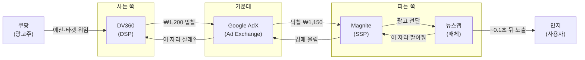

민지가 뉴스앱을 여는 순간, 기사 사이 빈 배너 한 칸이 약 0.1초 만에 광고로 채워진다. 그 한 칸을 두고 광고주(예: 쿠팡)와 민지 사이에는 사실 **세 명의 중개인**이 서 있다. DSP·SSP·Ad Exchange.

이름은 어렵지만 하는 일은 단순하다. 이 글은 셋이 **각각 뭘 하는지**, **어떤 실제 회사**가 그 역할인지, 그리고 **한 장면**으로 어떻게 맞물리는지를 — 수식 없이 풀어본다.

> 한 줄 요약: **SSP는 파는 쪽 대리인, DSP는 사는 쪽 대리인, Ad Exchange는 둘이 만나는 경매장.**

---

## 1. 한 줄로 — 주식시장에 빗대면

광고 한 칸을 사고파는 일은 주식 거래와 닮았다.

- **SSP** = 파는 쪽 증권사. 매체를 대신해 ‘팔아주는’ 창구.
- **DSP** = 사는 쪽 증권사. 광고주를 대신해 ‘사주는’ 창구.
- **Ad Exchange** = 거래소 그 자체. 주문이 실시간으로 체결되는 NASDAQ 같은 장터.

> 매체는 SSP에 “내 빈자리 좀 팔아줘”, 광고주는 DSP에 “좋은 자리 좀 사줘”라고 맡긴다. 그 둘의 주문이 만나 체결되는 시장이 **Ad Exchange**다.

부동산으로 바꿔도 똑같다. SSP = 매도 중개인, DSP = 매수 중개인, Exchange = 매물이 실시간 경매되는 장.

---

## 2. SSP — 파는 쪽(매체)의 판매 대리인

**문제.** 뉴스앱·유튜브 같은 매체는 광고 자리(지면)는 많은데, 그걸 살 광고주는 수천 곳이다. 일일이 직접 거래할 수가 없다.

**SSP가 하는 일.** 매체를 대신해 그 빈자리를 거래소 경매에 올리고, 가장 비싸게 사는 쪽에 판다. 목표는 단 하나 — **매체 수익을 최대로**.

구체적으로는:

- **바닥값(Floor Price) 설정** — “이 밑으로는 안 팝니다”.
- **여러 거래소에 동시 연결(Header Bidding)** — 경쟁을 붙여 더 비싸게.
- **저품질·부적절 광고 거르기**.

**실제 회사.** Google Ad Manager(GAM) · Magnite · PubMatic · OpenX. 국내에선 매체 수익화 도구로 카카오 애드핏.

> SSP는 철저히 **‘파는 쪽’ 편**이다. 비싸게 파는 게 일.

---

## 3. DSP — 사는 쪽(광고주)의 구매 대리인

**문제.** 광고주(쿠팡 등)는 같은 순간 전 세계에서 열리는 수천만 건의 경매를 사람이 일일이 쫓을 수 없다.

**DSP가 하는 일.** 광고주의 예산·타겟·목표(ROAS)를 받아, 여러 거래소 경매에 **자동으로 입찰**한다. 누구에게, 얼마를 부를지 대신 결정한다.

구체적으로는:

- **타겟팅** — 내 광고를 누구에게 보여줄지.
- **입찰가 산정** — 이 사람이 누를 확률(pCTR)을 예측해 값을 매김.
- **예산 배분(Pacing)** — 하루 예산을 고르게.
- **Bid Shading** — 예상 가치보다 살짝 낮춰 부르기.

**실제 회사.** Google DV360 · The Trade Desk · Criteo · Amazon DSP. 국내에선 네이버 GFA · 카카오모먼트.

> DSP는 철저히 **‘사는 쪽’ 편**이다. SSP의 정확히 반대편.

---

## 4. Ad Exchange — 가운데 경매장

**SSP(팔 사람)와 DSP(살 사람)가 만나는 중립 시장.** 광고 노출 1건마다 실시간 경매(RTB)가 열린다.

**하는 일.** 0.1초 안에 수십~수백 개 DSP에게 “이 자리 살래?”라고 요청을 뿌리고, 들어온 입찰 중 **최고가를 낙찰**시킨다. 이긴 쪽이 ‘얼마를 낼지’는 규칙(1등값/2등값)에 따라 정한다.

**왜 중립 시장이 필요할까?** 파는 쪽 수천, 사는 쪽 수천이 1:1로 다 만나면 난장판이 된다. 거래소가 가운데서 한 번에 매칭해 준다.

**실제 회사.** Google AdX(지금은 Google Ad Manager에 통합) · Magnite · OpenX · Index Exchange.

> Exchange는 **심판 겸 장터**다. 어느 편도 아니다.

---

## 5. 한 장면으로 다시 — 0.1초의 여정

세 중개인이 실제로 어떻게 맞물리는지, 실제 회사 이름을 넣어 한 번에 보자.

단계로 풀면:

1. 민지가 뉴스앱을 연다 → 기사 사이 320×100 빈자리 발생.
2. 뉴스앱이 **SSP(Magnite)** 에 “이 자리 팔아줘” (최저 ₩800).
3. Magnite가 **Ad Exchange(Google AdX)** 에 경매로 올린다.
4. AdX가 여러 DSP에 동시 요청 — 쿠팡의 대리인 **DSP(DV360)** 도 받는다.
5. DV360이 “민지가 이 운동화 광고를 누를까?”를 예측해 **₩1,200**에 입찰.
6. 경매에서 최고가 DV360 낙찰. 2등값 규칙이면 실제로는 **₩1,150**만 낸다.
7. 쿠팡 광고가 민지 화면에 뜬다. 앱을 연 지 약 **100ms**.

---

## 6. 한눈 비교표

| 역할 | 누구 편 | 하는 일 | 실제 예시 | 왜 필요한가 |
|---|---|---|---|---|
| **SSP** | 매체(파는 쪽) | 지면을 모아 경매에 올려 비싸게 판다 | Google Ad Manager · Magnite · PubMatic · 카카오 애드핏 | 매체가 수천 구매자와 직접 거래 못 함 |
| **DSP** | 광고주(사는 쪽) | 예산·타겟을 받아 여러 경매에 자동 입찰 | DV360 · The Trade Desk · Criteo · 네이버 GFA · 카카오모먼트 | 광고주가 수천만 경매를 못 쫓음 |
| **Ad Exchange** | 중립(가운데) | 실시간 경매로 양쪽을 매칭, 낙찰 결정 | Google AdX · Magnite · OpenX · Index Exchange | 양쪽이 만날 중립 시장이 필요 |

---

## 7. 헷갈리기 쉬운 점

- **SSP와 Exchange의 경계가 모호하다.** Magnite·PubMatic은 SSP이면서 Exchange 역할도 한다. 요즘은 한 회사가 둘 다 하는 경우가 많아 칼같이 나뉘지 않는다.
- **DSP ≠ Ad Network.** Ad Network는 지면을 ‘묶음’으로 떼와 파는 옛 방식, DSP는 실시간 경매에 ‘건별’로 입찰한다.
- **월드가든에선 이 분리가 안 보인다.** 네이버·카카오·구글·메타는 한 회사가 매체·SSP·Exchange·DSP를 다 갖고 있다. 그래서 네이버 GFA·카카오모먼트는 그 닫힌 울타리 안에서 ‘사는 쪽’ 도구로만 보인다.

---

## 더 깊이 보기

- Ad Network와 Ad Exchange는 어떻게 다른가 (역사·아키텍처) → [Ad Network vs Ad Exchange](post.html?id=ad-network-vs-exchange)
- 요청부터 노출까지 기술 상세 → [광고 서빙 플로우](post.html?id=ad-serving-flow)
- DSP는 왜 입찰가를 살짝 낮춰 부를까 (Bid Shading) → [Bid Shading & Censored Data](post.html?id=bid-shading-censored)
- 처음이라면, 그림으로 먼저 → [쉬운 버전 ‘광고가 뜨기까지’](ecosystem-easy.html#rtb)
- 약어가 헷갈리면 → [쉬운 용어 사전](ecosystem-terms.html)
