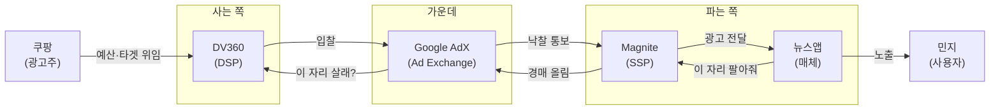

민지가 뉴스앱을 연다. 기사와 기사 사이, 320×100 크기 빈 배너 한 칸이 잠깐 나타난다.

그 빈칸이 광고로 채워지기까지 걸리는 시간은 **약 0.1초**다. 눈을 한 번 깜빡이기도 전이다.

그런데 이 0.1초 사이에 광고주(예: 쿠팡)와 민지의 화면 사이로 **세 명의 중개인**이 끼어든다. DSP·SSP·Ad Exchange다. 이름은 낯설어도 하는 일은 단순하다.

이 글은 셋이 각각 뭘 하는지 실제 회사 이름으로 짚는다. 그 0.1초 동안 데이터가 어떻게 오가는지도 표로 재구성한다. 그리고 광고주가 낸 돈 ₩1,000 중 매체에 얼마가 도착하는지 직접 계산해 본다.

> 한 줄 요약: SSP는 파는 쪽 대리인, DSP는 사는 쪽 대리인, Ad Exchange는 둘이 만나는 경매장이다. 이 셋이 서로 다른 회사라서, 돈이 그 사이를 오갈 때마다 한 번씩 깎인다.

---

## 1. 한 줄로 — 주식시장에 빗대면

**광고 한 칸을 사고파는 일은 주식을 사고파는 일과 구조가 같다.** 파는 쪽 대리인, 사는 쪽 대리인, 그리고 그 둘이 만나는 거래소가 따로 있다.

매체(뉴스앱)는 "이 빈자리 좀 팔아줘"라고 **SSP**에 맡긴다. 증권사에 매도 주문을 넣는 것과 같다. 광고주(쿠팡)는 "좋은 자리 좀 사줘"라고 **DSP**에 맡긴다. 매수 주문을 넣는 셈이다. 그 두 주문이 실시간으로 만나 체결되는 곳이 **Ad Exchange**다. 주식시장의 거래소와 같은 자리다.

부동산으로 바꿔도 같은 그림이 나온다. SSP는 매도 중개인, DSP는 매수 중개인, Exchange는 매물이 실시간으로 경매되는 장이다. 다른 점은 딱 하나다. 이 경매는 사람이 아니라 소프트웨어가, 광고 지면이 열릴 때마다 자동으로 진행된다.

그래서 셋의 관계를 억지로 외우려 하지 않아도 된다. **판다(SSP) · 산다(DSP) · 만난다(Exchange).** 이 비유 하나면 충분하다. 다음 세 절에서 이 셋을 하나씩 뜯어본다.

---

## 2. SSP — 파는 쪽(매체)의 판매 대리인

**SSP(Supply-Side Platform)는 매체를 대신해 광고 자리를 가장 비싸게 파는 대리인이다.** 이름의 '수요'가 아니라 '공급' 쪽, 즉 매체 편이라는 뜻이다.

뉴스앱·유튜브 같은 매체는 팔아야 할 광고 자리(지면)는 넘치는데, 그걸 살 광고주는 수천 곳이다. 매체가 광고주 하나하나와 직접 계약하고 단가를 협상할 수는 없다. SSP는 이 문제를 대신 풀어준다. 매체의 재고를 통째로 받아 거래소 경매에 올리고, 가장 비싸게 사겠다는 쪽에 판다.

SSP가 실제로 하는 일은 세 가지로 요약된다. 첫째, **바닥값(Floor Price)**을 정한다. "이 밑으로는 안 판다"는 최저선이다. 둘째, **여러 거래소에 동시에 연결**한다(헤더비딩). 거래소 하나에만 팔면 그 거래소가 부르는 값에 매일 수밖에 없으니, 여러 곳에 동시에 뿌려 경쟁을 붙인다. 셋째, **저품질·부적절 광고를 거른다.** 아무리 비싸게 불러도 매체 브랜드를 해치는 광고는 막아야 한다.

실제로 이 역할을 하는 회사는 Google Ad Manager(GAM)·Magnite·PubMatic·OpenX다. 국내에서는 카카오 애드핏이 매체 수익화 도구로 비슷한 역할을 한다. 이들은 하나같이 **매체 편**이다. 광고주가 얼마를 더 쓰든 관심 없고, 매체가 얼마를 더 받는지가 SSP의 성적표다.

---

## 3. DSP — 사는 쪽(광고주)의 구매 대리인

**DSP(Demand-Side Platform)는 광고주를 대신해 좋은 자리를 자동으로 사들이는 대리인이다.** 이름의 '수요' 쪽, 즉 광고주 편이라는 뜻이다. SSP와는 정확히 반대편에 선다.

광고주(쿠팡 등)가 마주한 문제는 규모다. 같은 순간 전 세계에서 수많은 경매가 동시에 열린다. 사람이 일일이 "이 자리를 살까 말까"를 판단할 수 없는 규모다. DSP는 광고주의 예산·타겟·목표(예: ROAS)를 미리 입력받아, 그 기준에 맞는 경매에만 자동으로 입찰한다.

DSP 안에서 실제로 굴러가는 일은 네 가지다. 첫째, **타겟팅**이다. 이 광고를 누구에게 보여줄지 정하는 일이다. 둘째, **입찰가 산정**이다. 이 사람이 광고를 누를 확률, 즉 pCTR을 예측해 값을 매긴다. 셋째, **예산 배분**(Pacing)이다. 하루 예산이 오전에 몰리지 않게 고르게 쓴다. 넷째, **Bid Shading**이다. 내가 매긴 가치보다 살짝 낮춰 부른다. pCTR 예측과 Bid Shading은 이 블로그의 다른 글에서 따로 깊게 다룬다.

실제 회사로는 Google DV360·The Trade Desk(TTD)·Criteo·Amazon DSP가 있다. 국내에서는 네이버 GFA와 카카오모먼트가 광고주 입장에서 쓰는 DSP 성격의 도구다. **광고주가 직접 쓰는 화면이 DSP**라고 기억해 두면, 뒤에 나올 헷갈리는 지점(13절)을 정리하기 쉬워진다.

---

## 4. Ad Exchange — 가운데 경매장

**Ad Exchange는 SSP(팔 사람)와 DSP(살 사람)가 만나는 중립 시장이다.** 광고 노출 1건이 생길 때마다 그 자리에서 실시간 경매(RTB)가 열린다.

Exchange가 하는 일은 한 문장으로 요약된다. 짧은 시간 안에 여러 DSP에게 "이 자리 살래?"라고 요청을 뿌리고, 들어온 입찰 중 가장 높은 값을 낙찰시킨다. 이긴 쪽이 실제로 얼마를 내는지는 경매 방식(1등가·2등가)에 따라 갈린다. 그 이유는 [2등 가격 경매](post.html?id=second-price-auction) 글에서 따로 다룬다.

왜 이런 중립 시장이 따로 필요할까. 파는 쪽 수천 곳과 사는 쪽 수천 곳이 서로 1:1로 연결을 맺으면 관리해야 할 접점이 감당할 수 없이 늘어난다. 거래소가 가운데서 표준 규격(OpenRTB)으로 한 번에 매칭해 준다. 그러면 SSP는 거래소 하나에만 연결해도 사실상 대부분의 DSP에 재고를 노출할 수 있다.

실제 회사로는 Google AdX·Magnite·OpenX·Index Exchange가 있다. Google AdX는 2018년 무렵 Google Ad Manager 브랜드로 통합됐다. Exchange는 **심판 겸 장터**다. SSP도 DSP도 아닌, 어느 편도 들지 않는 자리다.

:::deep 더 깊이 — Ad Network와 Ad Exchange, 뭐가 다른가
초심자가 가장 자주 헷갈리는 지점 중 하나다. 이름도 비슷하고 하는 일도 겉으로는 비슷해 보인다. 하지만 원래 이 둘은 **재고를 누가 갖고 있느냐**가 다른, 서로 다른 사업 모델이었다.

**Ad Network**가 먼저 등장했다. 작은 매체 여러 곳의 남는 자리를 통째로 사들여 재고로 쌓아 두고, 광고주에게 묶음으로 되파는 방식이다. 도매상에 가깝다. 네트워크가 재고를 직접 떠안기 때문에, 못 팔면 네트워크가 손해를 본다. 대신 매체 입장에서는 팔릴지 안 팔릴지 걱정할 필요가 없었다.

**Ad Exchange**는 반대다. 재고를 사서 쌓아 두지 않는다. 그저 실시간으로 경매가 열리는 장을 마련할 뿐이다. 주식 거래소가 주식을 소유하지 않고 매칭만 하는 것과 같다. 재고 위험은 여전히 매체(정확히는 SSP를 통한 매체)가 진다.

그런데 실무에서는 이 경계가 많이 흐려졌다. Google의 광고 상품군은 네트워크로 출발해, 지금은 거래소 기능(AdX)까지 한 회사 브랜드 안에 들어가 있다. Magnite·PubMatic 같은 회사도 재고를 사들이는 거래와 실시간 경매 중개를 동시에 한다. 게다가 헤더비딩이 널리 퍼지면서, 같은 지면 하나가 여러 거래소·네트워크에 동시에 뿌려지는 게 표준이 됐다. 그래서 요즘은 "이 회사가 네트워크냐 거래소냐"보다 "이 거래에서 재고 위험을 누가 지느냐"를 물어야 실체에 더 가깝다.
:::

---

## 5. 한 장면으로 다시 — 0.1초 동안 무슨 일이 벌어지나

**민지가 뉴스앱을 켠 순간부터 광고가 뜨기까지, 데이터는 정확히 이런 순서로 오간다.** 회사 이름을 넣어 한 장면으로 재구성하면 이렇다.


```mermaid
graph LR
  ADV["쿠팡<br/>(광고주)"]
  subgraph BUY["사는 쪽"]
    DSP["DV360<br/>(DSP)"]
  end
  subgraph MKT["가운데"]
    EX["Google AdX<br/>(Ad Exchange)"]
  end
  subgraph SELL["파는 쪽"]
    SSP["Magnite<br/>(SSP)"]
    PUB["뉴스앱<br/>(매체)"]
  end
  USER["민지<br/>(사용자)"]

  ADV -->|"예산·타겟 위임"| DSP
  PUB -->|"이 자리 팔아줘"| SSP
  SSP -->|"경매 올림"| EX
  EX -->|"이 자리 살래?"| DSP
  DSP -->|"입찰"| EX
  EX -->|"낙찰 통보"| SSP
  SSP -->|"광고 전달"| PUB
  PUB -->|"노출"| USER
```

그림은 '누가 누구와' 이어지는지만 보여준다. 실제로 궁금한 건 **그 화살표 하나하나에서 무엇이 오가고, 시간이 얼마나 쌓이는가**다. 아래는 그 과정을 가정한 예시 데이터다. 실제 측정값이 아니라 자릿수 감을 잡기 위한 가상의 타임라인이다.

| 단계 | 누가 → 누구에게 | 무엇을 보냄 | 누적 시간(ms) |
|---|---|---|---|
| 1 | 사용자 → 매체 | 뉴스앱 페이지 요청 | 0 |
| 2 | 매체 → SSP | 지면 정보 + 바닥값(₩800) | 5 |
| 3 | SSP → Exchange | 경매 등록 요청 | 10 |
| 4 | Exchange → DSP 여러 곳 | Bid Request(지면·사용자 세그먼트·바닥값) | 15 |
| 5 | DSP들 → Exchange | pCTR 계산 후 Bid Response(입찰가) | 65 |
| 6 | Exchange (내부) | 최고가 비교 + 2등가 계산 | 75 |
| 7 | Exchange → SSP | 낙찰 통보(낙찰자 + 낙찰가 ₩1,150) | 80 |
| 8 | SSP → 매체 → 사용자 | 광고 크리에이티브 전달 + 렌더링 | 100 |

표에서 가장 눈여겨볼 곳은 표의 5번째 줄이다. **8단계 중 절반(15ms→65ms, 50ms)**이 DSP들의 응답 대기에 쓰인다. 각 DSP가 "이 사람이 이 광고를 누를 확률"을 계산하는 데 걸리는 시간이다. 나머지 단계는 대부분 네트워크 왕복과 비교·통보에 쓰인다.

표 7번째 줄의 낙찰가에도 설명이 필요하다. 예를 들어 DV360이 ₩1,200을 불러 이겼다고 하자. 2등가 규칙이라면 낙찰자는 자기가 부른 값을 다 내지 않는다. 2등 입찰가에 맞춰 실제로는 **₩1,150**만 낸다. 이 결정은 표의 6번째 줄, Exchange 내부에서 일어난다.

여기서 4번째 줄과 5번째 줄을 잘 보면, DSP가 여러 곳인데도 시간이 크게 늘지 않는 이유를 알 수 있다. Exchange는 이들에게 **동시에(병렬로)** 요청을 뿌린다. 한 곳씩 순서대로 물어봤다면 100ms는 어림도 없었을 것이다. 병렬 브로드캐스트가 이 속도의 핵심 트릭이다.

이 병렬 경매를 직접 눌러 보면 감이 더 잘 잡힌다. 아래 데모에서 Floor Price를 올리거나 경매 방식(1등가/2등가)을 바꿔 보자. DSP들의 입찰가가 실시간으로 어떻게 움직이는지 확인할 수 있다.

<div class="demo-embed-wrap">
<iframe class="demo-embed" src="demo-rtb.html?embed=1" height="560" loading="lazy" title="RTB 경매 미니 데모"></iframe>
<a class="demo-embed-open" href="demo-rtb.html" target="_blank" rel="noopener">↗ 전체 데모로 열기</a>
</div>

---

## 6. 왜 100ms 안에 끝내야 할까

**사람은 0.1초 안팎의 지연은 잘 못 느끼지만, 그 이상 늘어지면 화면이 버벅인다고 느낀다.** 광고 서빙이 이 시간 안에 끝나야 하는 첫 번째 이유다.

두 번째 이유는 돈이다. 광고 자리 하나에 쓰는 시간이 늘어질수록, 그 사이 사용자는 페이지를 떠날 수도 있다. 광고가 안 뜬 채로 스크롤해 지나칠 수도 있다. 매체 입장에서는 팔 수 있었던 자리 하나가 그냥 날아가는 셈이다. 그래서 거의 모든 Exchange는 **콜아웃 타임아웃**을 건다. 이 시간 안에 응답하지 못한 DSP는 자동으로 탈락 처리된다.

이 타임아웃 값은 회사마다, 지면마다 다르다. 공개된 숫자를 하나로 못 박기는 어렵고, 업계에서는 대략 수십~수백 ms 사이로 폭넓게 알려져 있다. 5절의 표에서 DSP 응답에 50ms를 배정한 것도 이 폭 안에 있는 예시일 뿐, 특정 회사의 실측치가 아니다.

이 시간 예산은 **DSP 하나가 아니라 DSP 전체에 공통으로 적용된다**. 어떤 DSP의 pCTR 모델이 아무리 정교해도, 타임아웃 안에 응답을 못 내놓으면 그 정교함은 쓸모가 없다. 그래서 DSP 엔지니어링에서 모델 정확도 못지않게 중요하게 취급되는 지표가 **응답 지연(latency)**이다.

---

## 7. 수수료(Take Rate) — 광고주의 ₩1,000, 매체엔 얼마나 도착할까

**광고주가 낸 돈은 SSP·Exchange·DSP를 거치며 단계마다 조금씩 깎인다.** 이 깎이는 비율을 다 합친 것을 **take rate**라 부른다.

take rate가 왜 생기는지는 당연하다. SSP도 DSP도 Exchange도 회사고, 회사는 수익이 있어야 굴러간다. 문제는 이 수수료가 **한눈에 안 보인다는 점**이다. 광고주는 "₩1,000을 썼다"는 것만 알고, 매체는 "얼마를 받았다"는 것만 안다. 그 사이 몇 단계에서 얼마씩 떼였는지는 계약 당사자가 아니면 보이지 않는다.

이 불투명함 때문에, 업계 바깥에서 실제로 얼마나 새는지 추적하려는 조사가 여러 차례 있었다. 자주 인용되는 예로 영국 광고주협회(ISBA)가 PwC와 함께 2020년 무렵 진행한 프로그래매틱 공급망 조사가 있다. 미국 ANA(전미광고주협회)도 비슷한 문제의식으로 여러 조사를 진행해 왔다. 이런 조사들은 대체로 "광고주가 쓴 돈 중 매체에 도착하는 몫이 대략 절반 안팎"이라는 방향의 결론을 낸다. 다만 조사마다 방법론과 표본이 달라서, 실제 인용되는 비율은 문헌에 따라 40%대부터 60%대까지 폭이 크다. **정확한 업계 표준값이라기보다 "생각보다 많이 샌다"는 방향성으로 읽는 게 안전하다.**

아래 표는 그 구조를 이해하기 위한 예시 계산이다. 각 단계 수수료율은 이 글에서 임의로 정한 예시 수치이지, 실제 어느 회사의 공개 요율이 아니다.

| 단계 | 누가 떼어가나 | 이 단계 수수료율(예시) | 남는 금액 |
|---|---|---|---|
| 0 | 광고주 지출 | — | ₩1,000 |
| 1 | DSP 수수료 | 20% | ₩800 |
| 2 | Exchange 수수료 | 15% | ₩680 |
| 3 | SSP 수수료 | 20% | ₩544 |
| 4 | 매체 실수령 | — | **₩544** |

₩1,000 중 매체에 도착하는 건 **₩544**, 실효 take rate는 **45.6%**다. 세 번의 수수료가 곱으로 쌓이기 때문에, 각 단계는 15~20%로 크지 않아 보여도 합치면 절반 가까이 사라진다. 다음 절 파이썬 코드에서 이 계산을 함수로 만들어, 중개 단계가 늘고 줄 때 이 숫자가 어떻게 움직이는지 본다.

---

## 8. 파이썬으로 직접 계산해보기

**take rate 구조는 결국 '비율을 몇 번 곱하느냐'의 문제다.** 코드로 만들어 두면 중개 단계가 늘고 줄 때 매체 몫이 어떻게 변하는지 바로 비교할 수 있다.

아래 코드는 표준 라이브러리만 쓴다. 7절의 표와 같은 예시 수수료율(20%·15%·20%)을 그대로 넣어 검산한 뒤, 중개 단계 하나를 추가하거나 제거했을 때를 비교한다.

```python
# 광고주 지출이 몇 단계 중개를 거쳐 매체에 도착하는지 계산한다.
# 수수료율은 이 글에서 쓰는 예시값이다 — 특정 회사의 공개 요율이 아니다.

SPEND = 1_000  # 광고주가 이 노출 1건에 쓴 돈(원)

def take_home(spend, fee_rates):
    """각 단계가 '남은 금액'에서 fee_rate만큼 뗀 뒤 다음 단계로 넘긴다.
    반환값: (매체가 최종적으로 받는 금액, 단계별 잔액 리스트)."""
    remaining = spend
    trail = [remaining]
    for rate in fee_rates:
        remaining *= (1 - rate)
        trail.append(remaining)
    return remaining, trail

def effective_take_rate(spend, publisher_revenue):
    # 광고주 지출 대비, 중간에서 사라진 비율
    return (spend - publisher_revenue) / spend

# 3단계 구조: DSP 20%, Exchange 15%, SSP 20% (예시 수치)
base_rates = [0.20, 0.15, 0.20]
publisher_revenue, trail = take_home(SPEND, base_rates)

print("기본 3단계 검산")
for step, amount in enumerate(trail):
    print(f"  단계 {step}   잔액 {amount:8,.0f}원")
print(f"실효 take rate {effective_take_rate(SPEND, publisher_revenue):.1%}")

# 중개 단계가 하나 늘거나(리셀러 추가) 줄 때(Exchange 생략, PMP 직거래)
scenarios = {
    "기본 3단계(DSP·Exchange·SSP)": [0.20, 0.15, 0.20],
    "리셀러 추가 4단계(+10%p 단계)": [0.20, 0.15, 0.10, 0.20],
    "Exchange 생략 2단계(PMP 직거래)": [0.20, 0.20],
}

print()
print("중개 단계별 비교")
for name, rates in scenarios.items():
    revenue, _ = take_home(SPEND, rates)
    rate = effective_take_rate(SPEND, revenue)
    print(f"  {name:<28} 매체 실수령 {revenue:6,.0f}원   take rate {rate:5.1%}")

# 출력:
# 기본 3단계 검산
#   단계 0   잔액    1,000원
#   단계 1   잔액      800원
#   단계 2   잔액      680원
#   단계 3   잔액      544원
# 실효 take rate 45.6%
#
# 중개 단계별 비교
#   기본 3단계(DSP·Exchange·SSP)     매체 실수령    544원   take rate 45.6%
#   리셀러 추가 4단계(+10%p 단계)         매체 실수령    490원   take rate 51.0%
#   Exchange 생략 2단계(PMP 직거래)     매체 실수령    640원   take rate 36.0%
```

리셀러가 하나 늘면 매체 몫은 ₩544에서 ₩490으로 줄고, take rate는 45.6%에서 51.0%로 늘어난다. 반대로 Exchange를 건너뛰는 **PMP(Private Marketplace) 직거래**를 써 보자. 매체 몫은 ₩640까지 올라가고 take rate는 36.0%로 준다. 중개 단계 하나하나가 곧 돈이라는 뜻이다.

이 코드에서 눈여겨볼 부분은 `trail`이다. 각 단계 잔액을 리스트로 남겨 두면, 몇 번째 단계에서 얼마가 빠졌는지 나중에 그대로 추적할 수 있다. 실무에서 이 구조를 그대로 로그로 남기면, 광고주가 "내 돈이 어디서 새는지" 물었을 때 답할 수 있는 최소한의 근거가 된다.

---

## 9. 열린 RTB에서는 왜 셋이 나뉘어 있는가 [무대: 열린 RTB]

**SSP·Exchange·DSP가 서로 다른 회사이기 때문에, 계약도 수수료도 데이터도 회사 경계를 넘을 때마다 끊긴다.** 7절의 take rate가 여러 단계로 쌓이는 이유도 바로 이 '분리' 때문이다.

Magnite는 Google이 아니고, The Trade Desk도 Google이 아니다. 각자 독립된 회사라서, 거래 하나마다 별도의 계약과 별도의 수수료율이 붙는다. 이 여러 회사를 하나의 언어로 잇는 역할을 **OpenRTB**라는 공개 규격이 한다. Bid Request·Bid Response의 형식을 표준화한다. 그러면 Magnite가 올린 경매에 DV360도 TTD도 똑같은 방식으로 응답할 수 있다.

회사가 나뉘어 있다는 건 수수료가 여러 번 쌓인다는 뜻이면서, 동시에 **아무도 전체를 다 못 본다**는 뜻이기도 하다. 광고주는 자기가 낸 돈이 어느 SSP를 거쳤는지 다 알기 어렵다. 매체도 자기 지면을 어느 DSP가 얼마에 사 갔는지 낱낱이 보기 어렵다. `ads.txt`·`sellers.json` 같은 공급망 투명성 규격이 최근 몇 년 사이 생겨났다. 이 구조적인 불투명함을 조금이라도 걷어내려는 시도다.

정리하면, 열린 RTB의 '깨끗한 3분할'(파는 쪽·중개·사는 쪽)은 그 자체로 장점이자 비용이다. 각자 전문화할 수 있다는 장점과, 경계를 넘을 때마다 수수료와 불투명함이 쌓인다는 비용이 함께 온다.

---

## 10. 담장 안에서는 왜 경계가 안 보이는가 [무대: 닫힌 생태계]

**네이버·카카오는 매체·SSP·Exchange·DSP를 전부 한 회사가 갖고 있다. 그래서 경계 자체가 없다.** 나뉘어 있어야 생기는 계약·수수료 단계도 함께 사라진다.

네이버 안에서 벌어지는 광고 거래를 생각해 보자. 지면(네이버 서비스 화면)도 네이버, 그 자리를 경매에 올리는 로직도 네이버, 낙찰을 결정하는 로직도 네이버다. 광고주가 손에 쥐는 도구는 **네이버 GFA** 하나뿐이다. 카카오도 마찬가지로 지면과 매칭 로직을 다 갖고 있고, 광고주는 **카카오모먼트**만 쓴다.

그래서 GFA·카카오모먼트는 겉모습은 DSP와 비슷해도, 9절에서 본 '회사 간 경계'가 없다. 광고주 입장에서는 그냥 "사는 쪽 도구" 하나만 보인다. SSP 수수료가 몇 %인지, Exchange 수수료가 몇 %인지 같은 7절의 단계별 구조는 광고주에게 아예 노출되지 않는다. 그 몫들은 전부 네이버·카카오라는 한 회사 안의 내부 배분일 뿐이다.

이게 나쁘다는 뜻은 아니다. 오히려 담장 안에서는 조인이 깨끗해서 좋은 점도 많다. 다만 이 글의 관점에서는 다르게 봐야 한다. **닫힌 생태계는 '단계별로 나눠 볼 수 있는 대상'이 아니다**. 하나의 회사가 매기는 하나의 가격일 뿐이다.

---

## 11. 한눈 비교표

**세 역할을 한 표에 놓고 보면, 서로 다른 두 편에 서 있다는 게 또렷해진다.** SSP는 파는 쪽, DSP는 사는 쪽, Exchange는 어느 쪽도 아니다.

이 표를 읽는 요령은 '누구 편인가' 열부터 보는 것이다. 이름의 D(Demand, 수요)와 S(Supply, 공급)가 그대로 편을 가리킨다. **D로 시작하면 광고주 편, S로 시작하면 매체 편**이다. 이 구분이 익숙해지면 낯선 약어를 만나도 이름만 보고 대략 어느 편인지 짐작할 수 있다.

다만 실무에서는 이 경계가 표처럼 깔끔하지만은 않다. Magnite·PubMatic은 SSP이면서 동시에 Exchange 기능도 갖고 있어서, 한 회사가 표의 두 줄에 걸쳐 있는 셈이다. 앞서 다룬 심화 박스(Ad Network vs Ad Exchange)가 힌트를 준다. 이런 겹침은 '재고 위험을 누가 지는가'라는 질문으로 풀어야 실체가 보인다.

| 역할 | 누구 편 | 하는 일 | 실제 예시 | 왜 필요한가 |
|---|---|---|---|---|
| **SSP** | 매체(파는 쪽) | 지면을 모아 경매에 올려 가장 비싸게 판다 | Google Ad Manager · Magnite · PubMatic · 카카오 애드핏 | 매체가 수천 광고주와 직접 거래 못 함 |
| **DSP** | 광고주(사는 쪽) | 예산·타겟을 받아 여러 경매에 자동 입찰 | DV360 · The Trade Desk · Criteo · 네이버 GFA · 카카오모먼트 | 광고주가 수많은 경매를 못 쫓음 |
| **Ad Exchange** | 중립(가운데) | 실시간 경매로 양쪽을 매칭, 낙찰 결정 | Google AdX · Magnite · OpenX · Index Exchange | 양쪽이 만날 중립 시장이 필요 |

---

## 12. 한눈 정리

**이 글에서 나온 숫자만 다시 모으면 이렇다.** 개념 하나하나보다, 숫자가 어떻게 서로 연결되는지가 더 중요하다.

| 개념 | 뜻 | 이 글에서 본 숫자 | 핵심 |
|---|---|---|---|
| **SSP** | 매체의 판매 대리인 | 바닥값 예시 ₩800 | 파는 쪽 편 |
| **DSP** | 광고주의 구매 대리인 | 입찰 예시 ₩1,200 → 낙찰가 ₩1,150(2등가) | 사는 쪽 편 |
| **Ad Exchange** | 중립 경매장 | 8단계 누적 **100ms** | 병렬 요청이라 가능한 속도 |
| **DSP 응답 시간** | 콜아웃 타임아웃 | 8단계 중 50ms(15→65ms) 소모 | 정확도 못지않게 중요한 지표 |
| **Take rate** | 중간에서 사라지는 몫 | 예시 계산 **45.6%**(₩1,000 → ₩544) | 단계 수만큼 곱으로 쌓임 |
| **단계 수의 효과** | 중개 하나 늘고 줄 때 | 4단계 51.0% / 2단계(PMP) 36.0% | 단계 = 곧 돈 |
| **업계 조사 인용치** | ISBA·ANA류 조사 | "대략 절반 안팎", 문헌마다 40%대~60%대 | 정밀한 값이 아니라 방향성으로 읽기 |

이 표에서 가장 기억할 숫자 하나만 고르라면 **45.6%**다. 광고주가 낸 돈의 절반 가까이가 중간 세 단계에서 사라진다는 뜻이다. 이 숫자는 이 글이 정한 예시 요율(20%·15%·20%)의 결과일 뿐, 실제 계약서의 요율은 회사마다 다르고 대개 공개되지 않는다.

0.1초라는 속도와 45.6%라는 수수료는 같은 구조에서 나온 두 얼굴이다. **여러 회사가 나뉘어 있어야 서로 경쟁하고, 경쟁해야 속도와 가격이 맞춰진다.** 그 대신 회사가 나뉜 만큼 수수료 단계도 데이터 경계도 늘어난다. 9·10절에서 본 열린 RTB와 닫힌 생태계의 차이가 결국 이 트레이드오프의 두 극단이다.

---

## 13. 헷갈리기 쉬운 점

- **DSP는 광고주 편, SSP는 매체 편** — 알파벳 D·S가 그대로 편을 가리킨다. D=Demand(수요=광고주), S=Supply(공급=매체)로 외우면 헷갈리지 않는다.
- **SSP와 Ad Exchange의 경계는 실무에서 흐려져 있다.** Magnite·PubMatic은 SSP이면서 Exchange 역할도 겸한다. 회사 이름표보다 '재고 위험을 누가 지는가'를 물어야 한다.
- **DSP ≠ Ad Network.** Ad Network는 재고를 사서 되파는 도매상에 가깝고, DSP는 경매마다 건별로 자동 입찰한다. 둘은 등장 시기도 재고를 다루는 방식도 다르다.
- **담장 안에서는 이 세 역할이 안 보인다.** 네이버 GFA·카카오모먼트는 광고주에게 '사는 쪽 도구' 하나로만 보이고, SSP·Exchange에 해당하는 몫은 회사 내부에 묻힌다.
- **이 글의 take rate 숫자(45.6%)는 업계 표준값이 아니다.** 예시 요율로 계산한 결과일 뿐이고, 실제 조사들은 40%대부터 60%대까지 폭넓게 다른 숫자를 보고한다.

---

## 더 깊이 보기

- Ad Network와 Ad Exchange, 역사·아키텍처까지 더 깊이 → [Ad Network vs Ad Exchange](post.html?id=ad-network-vs-exchange)
- 요청부터 노출까지 기술 상세 → [광고 서빙 플로우](post.html?id=ad-serving-flow)
- DSP는 왜 입찰가를 살짝 낮춰 부를까(Bid Shading) → [Bid Shading & Censored Data](post.html?id=bid-shading-censored)
- 이겨도 왜 2등 값만 낼까(2등가 경매) → [2등 가격 경매](post.html?id=second-price-auction)
- 경매 방식을 직접 눌러보며 배우기 → [RTB 경매 데모](demo-rtb.html)
- 처음이라면, 그림으로 먼저 → [쉬운 버전 '광고가 뜨기까지'](ecosystem-easy.html#rtb)
- 약어가 헷갈리면 → [쉬운 용어 사전](ecosystem-terms.html)
- 광고 ML 전체 지도에서 이 글의 위치 → [ML 엔지니어 트랙](ml-track.html)
