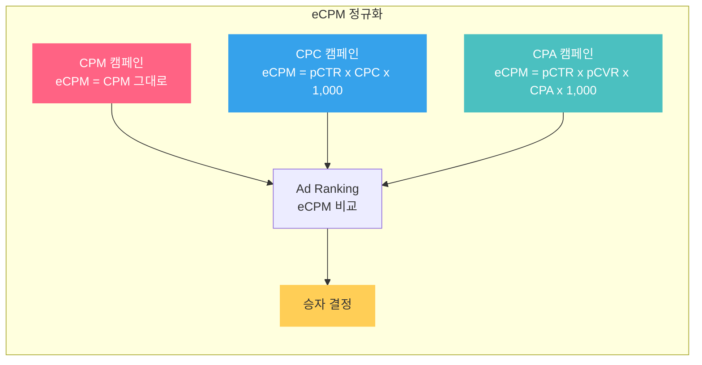
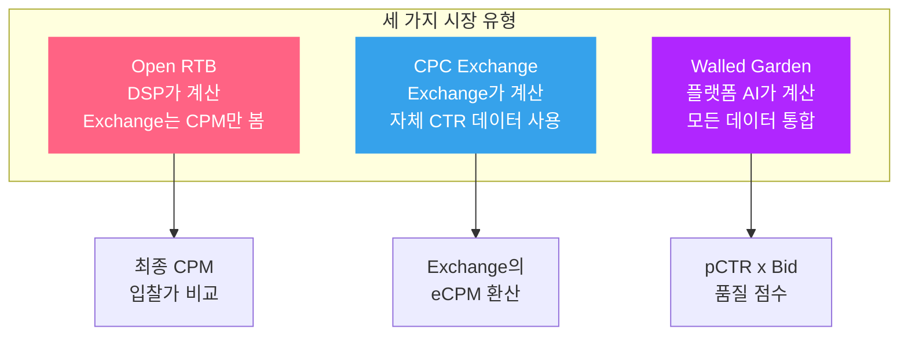
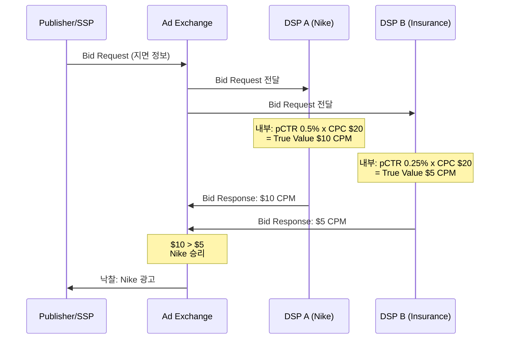
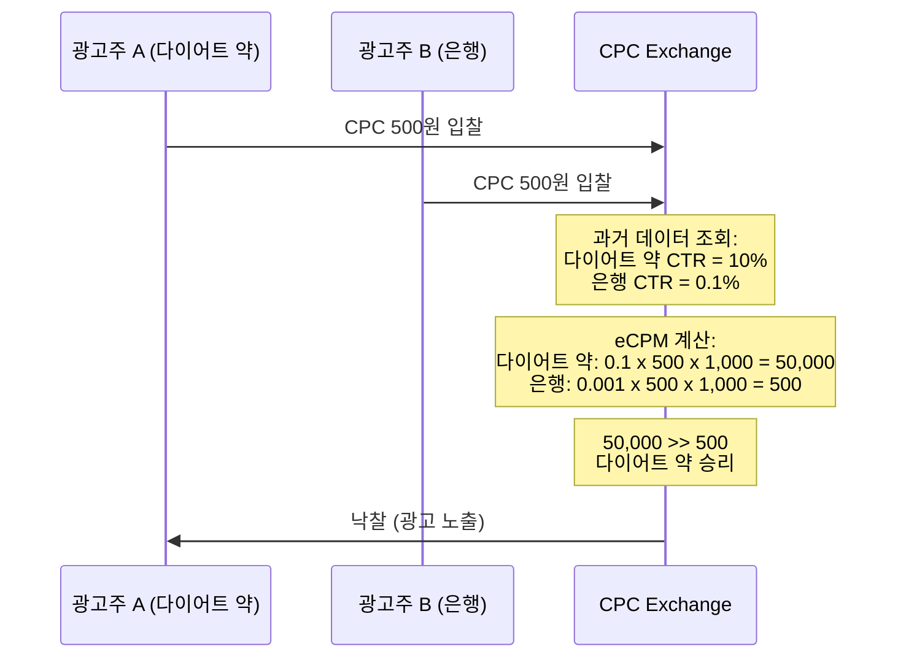

광고 경매에서 "누가 1등인가"는 단순히 돈을 많이 낸 순서가 아닙니다. 시장 유형에 따라 전혀 다른 기준으로 승자가 결정됩니다. 이 글은 eCPM의 정의와 계산법을 정리하고, Open RTB, CPC Exchange, Walled Garden 세 가지 시장에서 랭킹이 어떻게 달라지는지 비교합니다.

---

## 1. eCPM이란 무엇인가

eCPM은 **effective Cost Per Mille**의 약자로, 1,000회 노출당 기대 수익을 나타내는 지표입니다. 광고 플랫폼이 서로 다른 과금 모델(CPM, CPC, CPA)의 캠페인을 **하나의 기준으로 비교**하기 위해 사용합니다.

### 기본 공식

CPC 과금 캠페인의 eCPM은 다음과 같이 계산합니다:

$$eCPM = pCTR \times CPC \times 1{,}000$$

- $pCTR$ : 예측 클릭률 (predicted Click-Through Rate). 0.01이면 1%
- $CPC$ : 클릭당 비용 (Cost Per Click)
- $1{,}000$ : Mille, 즉 1,000회 노출 단위로 환산하기 위한 상수

직관적으로 해석하면: **"이 광고를 1,000번 노출했을 때, 플랫폼이 벌 수 있는 기대 수익"**입니다.

### CPA 과금으로 확장

CPA(Cost Per Action) 과금인 경우, 전환까지의 확률 체인을 모두 곱합니다:

$$eCPM = pCTR \times pCVR \times CPA \times 1{,}000$$

- $pCVR$ : 예측 전환률 (predicted Conversion Rate). 클릭 후 전환이 일어날 확률
- $CPA$ : 전환당 비용

예를 들어, $pCTR = 2\%$, $pCVR = 5\%$, $CPA = 10{,}000$원이면:

$$eCPM = 0.02 \times 0.05 \times 10{,}000 \times 1{,}000 = 10{,}000\text{원}$$

이 캠페인은 1,000회 노출당 약 10,000원의 수익을 플랫폼에 안겨줄 것으로 기대됩니다.

### 왜 "effective"인가

eCPM의 "e"는 **effective**, 즉 "실질적"이라는 뜻입니다. 실제 CPM 과금이 아닌 캠페인도 CPM 기준으로 **환산**했다는 의미입니다. CPC 캠페인이든 CPA 캠페인이든, eCPM이라는 공통 잣대 위에서 비교할 수 있게 됩니다.

> [광고 기술 생태계 전체 지도](post.html?id=adtech-ecosystem-map)에서 eCPM이 전체 파이프라인에서 어디에 위치하는지 확인하세요. DSP의 Ad Ranking 단계에서 True Value 계산의 핵심이 바로 eCPM입니다.

---

## 2. CPM vs eCPM: 사후 측정 vs 사전 예측

CPM과 eCPM은 이름이 비슷하지만 **본질적으로 다른 지표**입니다. 가장 중요한 차이는 **시점**입니다.

| 구분 | CPM | eCPM |
|------|-----|------|
| **정식 명칭** | Cost Per Mille | effective Cost Per Mille |
| **계산 시점** | 사후 (캠페인 종료 후) | 사전 (노출 결정 전) |
| **공식** | $\frac{\text{실제 지출}}{\text{실제 노출 수}} \times 1{,}000$ | $pCTR \times CPC \times 1{,}000$ |
| **성격** | 후행 지표 (backward-looking) | 선행 지표 (forward-looking) |
| **용도** | 캠페인 성과 리포팅, 매체 수익 분석 | 실시간 광고 랭킹, 입찰 의사결정 |
| **데이터 요구** | 실제 발생한 비용과 노출 | pCTR 모델 예측값 + 입찰가 |

### 왜 이 구분이 중요한가

광고 시스템에서 **랭킹 결정은 노출 전**에 이루어집니다. 아직 노출이 일어나지 않았으므로 "실제 CPM"은 존재하지 않습니다. 따라서 **미래 수익을 예측하는 eCPM**이 랭킹의 기준이 됩니다.

구체적인 예시로 살펴보겠습니다:

| 지표 | 캠페인 A | 캠페인 B |
|------|---------|---------|
| 과금 모델 | CPC | CPC |
| CPC 입찰가 | 500원 | 1,000원 |
| pCTR (예측) | 4% | 1% |
| **eCPM** | $0.04 \times 500 \times 1{,}000 = $ **20,000원** | $0.01 \times 1{,}000 \times 1{,}000 = $ **10,000원** |
| 캠페인 종료 후 실제 CTR | 3.5% | 1.2% |
| **실제 CPM (사후)** | $0.035 \times 500 \times 1{,}000 = $ **17,500원** | $0.012 \times 1{,}000 \times 1{,}000 = $ **12,000원** |

eCPM 기준으로 캠페인 A가 승리했고(20,000 > 10,000), 사후에 측정한 실제 CPM에서도 A가 더 높았습니다(17,500 > 12,000). 그러나 두 값이 정확히 일치하지는 않습니다 -- pCTR 예측과 실제 CTR 사이에는 항상 오차가 존재하기 때문입니다. eCPM의 정확도는 **pCTR 모델의 예측 정확도**에 직접적으로 의존합니다.

---

## 3. 서로 다른 과금 모델의 정규화

현실의 Ad Exchange에서는 CPM, CPC, CPA 과금 캠페인이 **동일한 지면**을 놓고 동시에 경쟁합니다. 과금 단위가 다른 캠페인을 어떻게 공정하게 비교할 수 있을까요? 답은 **모든 캠페인을 eCPM으로 정규화**하는 것입니다.

### 세 캠페인의 경쟁 예시

| 캠페인 | 과금 모델 | 입찰 정보 | pCTR | pCVR | eCPM 계산 | eCPM |
|--------|----------|----------|------|------|-----------|------|
| A | CPM | CPM $8,000 | - | - | CPM 그대로 사용 | **8,000원** |
| B | CPC | CPC 2,000원 | 5% | - | $0.05 \times 2{,}000 \times 1{,}000$ | **100,000원** |
| C | CPA | CPA 50,000원 | 3% | 10% | $0.03 \times 0.1 \times 50{,}000 \times 1{,}000$ | **150,000원** |

승자는 **캠페인 C (CPA)**입니다. CPA 과금은 전환이 실제로 발생해야만 비용이 청구되므로, 광고주 입장에서는 "비싸 보이는" $50,000원이지만, 플랫폼 입장에서 기대 수익으로 환산하면 가장 높습니다.

### 정규화 과정을 수식으로 정리



이 정규화가 **공정한 비교**를 가능하게 하는 이유는, 모든 캠페인을 "1,000회 노출당 플랫폼 기대 수익"이라는 동일한 단위로 변환했기 때문입니다. 과금 모델이 무엇이든, 플랫폼은 **가장 높은 기대 수익을 주는 광고**를 선택합니다.

```python
def compute_ecpm(bid_type, bid, pCTR=None, pCVR=None):
    """과금 모델별 eCPM 정규화: 1,000회 노출당 기대 수익"""
    if bid_type == "CPM":
        return bid                            # CPM은 그대로
    elif bid_type == "CPC":
        return pCTR * bid * 1000              # 클릭 확률 × CPC × 1000
    elif bid_type == "CPA":
        return pCTR * pCVR * bid * 1000       # 클릭 × 전환 확률 × CPA × 1000
    raise ValueError(f"Unknown: {bid_type}")

# 세 캠페인이 동일 지면에서 경쟁
campaigns = [
    {"name": "캠페인A(CPM)", "type": "CPM", "bid": 8000},
    {"name": "캠페인B(CPC)", "type": "CPC", "bid": 2000, "pCTR": 0.05},
    {"name": "캠페인C(CPA)", "type": "CPA", "bid": 50000,
     "pCTR": 0.03, "pCVR": 0.10},
]

results = []
for c in campaigns:
    ecpm = compute_ecpm(c["type"], c["bid"], c.get("pCTR"), c.get("pCVR"))
    results.append((c["name"], ecpm))
    print(f"  {c['name']}: eCPM = {ecpm:,.0f}원")

winner = max(results, key=lambda x: x[1])
print(f"\n  승자: {winner[0]} (eCPM {winner[1]:,.0f}원)")
# 과금 모델이 달라도 eCPM으로 공정 비교 가능
```

여기서 핵심은 pCTR과 pCVR 모델의 정확도입니다. 모델이 클릭률을 과대 예측하면 eCPM이 부풀려져서 실제 수익보다 높은 랭킹을 받게 되고, 이는 플랫폼 매출 손실로 이어집니다.

---

## 4. 세 가지 시장의 랭킹 결정 방식

eCPM의 **개념**은 동일하지만, 시장 유형에 따라 **누가 eCPM을 계산하고, 어떤 데이터를 사용하는지**가 완전히 달라집니다. 이 차이가 "누가 1등인가"를 결정합니다.



### 4.1 Open RTB: 최종 CPM 입찰가 기준

Open RTB 환경에서 Exchange는 각 DSP의 **최종 CPM 입찰가**만 봅니다. DSP 내부에서 pCTR을 어떻게 계산했는지, True Value를 어떻게 산출했는지는 Exchange가 알 수 없습니다.

**경매 구조:**



**구체적 예시:**

| 항목 | DSP A (Nike) | DSP B (Insurance) |
|------|-------------|-------------------|
| 내부 pCTR 예측 | 0.5% | 0.25% |
| CPC 입찰가 | $20 | $20 |
| 내부 eCPM 계산 | $0.005 x $20 x 1,000 = **$100** | $0.0025 x $20 x 1,000 = **$50** |
| Exchange에 제출하는 CPM 입찰가 | **$10** (Bid Shading 적용) | **$5** (Bid Shading 적용) |
| Exchange가 보는 값 | **$10 CPM** | **$5 CPM** |
| **결과** | **승리** | 패배 |

여기서 주목할 점이 두 가지 있습니다:

1. **Exchange는 $10과 $5만 비교합니다.** DSP 내부의 pCTR 값이나 eCPM 계산 과정은 Exchange에게 블랙박스입니다.
2. **DSP가 제출하는 CPM 입찰가는 내부 eCPM과 다릅니다.** [Bid Shading](post.html?id=bid-shading-censored) 등의 전략으로 True Value보다 낮게 입찰하기 때문입니다.

**리스크:** DSP의 pCTR 모델이 부정확하면, 가치를 잘못 평가한 입찰가를 제출하게 됩니다. pCTR을 과대 예측하면 과다입찰로 손해를 보고, 과소 예측하면 이길 수 있는 경매를 놓치는 기회손실이 발생합니다.

### 4.2 CPC Exchange: Exchange가 과거 데이터로 eCPM 환산

CPC Exchange에서는 DSP가 **CPC 금액**만 입찰합니다. 여기서 결정적 차이가 생깁니다: eCPM 환산을 **Exchange가 자체 데이터로** 수행합니다. Exchange는 해당 광고의 과거 노출/클릭 데이터를 축적하고 있으므로, 자체 CTR 추정치를 사용합니다.

**경매 구조:**



**구체적 예시:**

| 항목 | 광고주 A (다이어트 약) | 광고주 B (은행) |
|------|---------------------|----------------|
| CPC 입찰가 | 500원 | 500원 |
| Exchange의 과거 CTR 데이터 | **10%** | **0.1%** |
| Exchange의 eCPM 계산 | $0.1 \times 500 \times 1{,}000 = $ **50,000원** | $0.001 \times 500 \times 1{,}000 = $ **500원** |
| **결과** | **승리** | 패배 |

동일한 CPC 500원을 입찰했지만, eCPM은 **100배** 차이가 납니다. 다이어트 약 광고가 클릭률이 100배 높기 때문에, 플랫폼 입장에서 기대 수익이 압도적으로 큽니다.

**핵심 포인트:** CPC Exchange에서는 Exchange가 보유한 **"과거 데이터 장부"가 심판 역할**을 합니다. 광고주가 아무리 높은 CPC를 입찰해도, Exchange의 데이터에서 해당 광고의 CTR이 낮다고 판단하면 랭킹이 밀립니다. 이것은 광고주에게 **광고 품질 개선의 동기**를 부여합니다 -- 클릭률 높은 소재를 만들수록 같은 CPC로도 더 많은 노출을 얻습니다.

### 4.3 Walled Garden: 플랫폼 AI 모델이 모든 것을 평가

Walled Garden(네이버, 카카오, 구글, 메타 등)에서는 플랫폼이 **자체 pCTR 모델**을 운영하며, 광고주의 입찰가에 pCTR 예측값을 곱한 **품질 반영 점수**로 랭킹을 결정합니다. 플랫폼이 DSP, Exchange, Publisher를 모두 겸하므로, 유저 데이터부터 광고 성과 데이터까지 모든 정보를 활용할 수 있습니다.

**랭킹 점수:**

$$\text{Ranking Score} = pCTR_{\text{platform}} \times \text{Bid}$$

**구체적 예시 -- 음식점 검색 광고:**

| 항목 | 광고주 A (파스타집) | 광고주 B (떡볶이집) |
|------|-------------------|-------------------|
| 입찰가 | 1,000원 | 3,000원 |
| 플랫폼 pCTR 예측 | **10%** | **1%** |
| Ranking Score | $0.1 \times 1{,}000 = $ **100** | $0.01 \times 3{,}000 = $ **30** |
| **결과** | **승리** | 패배 |

떡볶이집이 **3배 높은 금액**을 입찰했지만, 플랫폼의 pCTR 모델이 파스타집의 클릭 가능성을 10배 높게 예측했기 때문에 파스타집이 승리합니다. 이 구조의 의미는 다음과 같습니다:

- **돈만으로는 1등이 될 수 없습니다.** 품질(pCTR)이 낮은 광고는 아무리 높은 입찰가를 써도 랭킹에서 밀릴 수 있습니다.
- **플랫폼의 pCTR 모델이 절대적 권한**을 가집니다. 광고주는 이 모델의 평가 기준을 정확히 알 수 없습니다.
- **유저 경험 보호** 효과가 있습니다. 클릭률이 낮은(유저가 관심 없는) 광고가 돈의 힘으로 상위에 노출되는 것을 방지합니다.

> [Walled Garden 포스트](post.html?id=walled-garden)에서 폐쇄형 생태계의 구조와 Open RTB와의 차이를 더 깊이 확인하세요.

```python
def ranking_comparison():
    """세 시장 유형에서 동일 광고주의 랭킹 결과 비교"""
    ads = {
        "A(고품질)": {"cpc": 1000, "pCTR": 0.10, "cpm": 8000},
        "B(고입찰)": {"cpc": 3000, "pCTR": 0.01, "cpm": 25000},
    }
    markets = {
        "Open RTB":      lambda a: a["cpm"],                  # 입찰가만
        "CPC Exchange":  lambda a: a["pCTR"] * a["cpc"] * 1000,  # eCPM
        "Walled Garden": lambda a: a["pCTR"] * a["cpc"],      # pCTR × Bid
    }

    for market, score_fn in markets.items():
        scores = {name: score_fn(ad) for name, ad in ads.items()}
        winner = max(scores, key=scores.get)
        parts = "  ".join(f"{n}={s:,.0f}" + (" ← 승" if n == winner else "")
                         for n, s in scores.items())
        print(f"  {market:15s}: {parts}")

ranking_comparison()
# Open RTB: 돈이 결정 → B 승리
# CPC/Walled Garden: 품질이 결정 → A 승리
```

### 4.4 세 시장의 비교

| 비교 항목 | Open RTB | CPC Exchange | Walled Garden |
|----------|----------|-------------|---------------|
| **승자 결정 기준** | 최종 CPM 입찰가 | Exchange가 환산한 eCPM | 플랫폼 pCTR x Bid |
| **eCPM 계산 주체** | DSP (내부) | Exchange | 플랫폼 |
| **pCTR의 역할** | DSP 내부 의사결정 | Exchange의 과거 데이터 기반 | 플랫폼 AI 모델 기반 |
| **공정성 메커니즘** | 시장 경쟁 (복수 DSP) | Exchange 데이터 객관성 | 플랫폼 모델의 품질 평가 |
| **광고주 투명성** | 높음 (자체 모델 통제) | 중간 (Exchange 데이터 의존) | 낮음 (블랙박스 모델) |
| **품질 반영도** | 간접적 (DSP 판단) | 직접적 (CTR 기반 환산) | 매우 직접적 (pCTR 가중) |
| **주요 리스크** | DSP pCTR 모델 오류 | Exchange 데이터 편향 | 플랫폼 모델 독점적 권한 |

이 표에서 핵심적인 패턴이 보입니다: **오른쪽으로 갈수록 "품질"의 비중이 커지고, "돈"만으로 이기기 어려워집니다.** Open RTB에서는 DSP가 알아서 pCTR을 반영하지만 Exchange는 강제하지 않습니다. CPC Exchange는 Exchange가 CTR을 반영합니다. Walled Garden은 플랫폼이 pCTR을 직접 곱하여 품질이 낮은 광고를 구조적으로 불이익합니다.

---

## 5. eCPM 최적화: 플랫폼과 광고주의 전략

eCPM은 플랫폼과 광고주 모두에게 최적화 대상입니다. 그러나 두 입장에서 최적화의 의미가 다릅니다.

### 5.1 플랫폼 관점: pCTR 정확도가 곧 매출이다

플랫폼의 총 수익은 모든 노출에 대한 eCPM의 합입니다:

$$\text{Revenue} = \sum_{i=1}^{N} eCPM_i = \sum_{i=1}^{N} pCTR_i \times Bid_i$$

pCTR 모델이 정확할수록:

1. **올바른 랭킹 결정** -- 실제로 클릭될 광고가 상위에 노출되어, 클릭 수익이 증가합니다.
2. **과소예측 방지** -- 가치 높은 광고가 낮은 eCPM을 받아 밀리는 손실을 줄입니다.
3. **과대예측 방지** -- 클릭되지 않을 광고가 상위에 노출되어 수익 없이 지면을 낭비하는 것을 방지합니다.

**실시간 계산의 요구사항:**

| 요구사항 | 수치 | 이유 |
|---------|------|------|
| 레이턴시 | 10ms 이내 | RTB 타임아웃 100ms 중 모델 추론에 할당 가능한 시간 |
| QPS | 수만~수십만 | 초당 처리해야 할 Bid Request 수 |
| 후보 수 | 수백 개/요청 | 하나의 지면에 경쟁하는 광고 후보 |
| 모델 갱신 | 일 1회 이상 | CTR 패턴 변화를 반영하기 위해 |

pCTR 모델의 아키텍처와 서빙 전략은 별도의 깊은 주제입니다. 이에 대해서는 [모델 서빙 아키텍처 포스트](post.html?id=model-serving-architecture)를 참고하세요.

### 5.2 광고주 관점: 같은 예산으로 더 높은 랭킹을 얻기

eCPM 공식을 다시 보겠습니다:

$$eCPM = pCTR \times Bid \times 1{,}000$$

광고주가 eCPM을 높이는 방법은 두 가지입니다:

**방법 1: 입찰가(Bid)를 올린다**

가장 단순하지만, 비용이 선형으로 증가합니다. 예산이 한정된 상황에서는 지속 가능하지 않습니다.

**방법 2: pCTR을 올린다 (광고 품질 개선)**

pCTR이 높아지면 같은 입찰가로도 더 높은 eCPM을 얻습니다. 구체적인 전략은 다음과 같습니다:

| 전략 | 설명 | pCTR 영향 |
|------|------|----------|
| **소재 최적화** | A/B 테스트로 클릭률 높은 광고 소재 선별 | CTR 2~3배 차이 가능 |
| **타겟팅 정밀화** | 관심사 높은 유저에게만 노출 | 관련성 높은 유저 = 높은 CTR |
| **랜딩 페이지 개선** | 빠른 로딩, 명확한 CTA | 일부 플랫폼은 랜딩 품질도 반영 |
| **시간대/지면 최적화** | CTR이 높은 시간대와 지면에 집중 | 같은 소재도 맥락에 따라 CTR 변동 |

이것이 Walled Garden 플랫폼들이 "품질 점수"를 강조하는 이유입니다. 광고주가 품질을 개선하면 -> pCTR이 오르면 -> 같은 입찰가로 더 높은 랭킹 -> 더 많은 노출 -> 플랫폼도 더 많은 수익. **양쪽 모두에게 이득**인 구조입니다.

---

## 6. eCPM의 한계

eCPM이 광고 랭킹의 핵심 지표이지만, 만능은 아닙니다. 실무에서 마주치는 한계들을 정리합니다.

### ① pCTR 예측 오류의 증폭

eCPM은 pCTR에 선형으로 비례합니다. 따라서 **pCTR 오류가 eCPM 오류로 직접 전파**됩니다.

| 상황 | pCTR 예측 | 실제 CTR | eCPM (Bid 1,000원) | 실제 가치 |
|------|----------|---------|-------------------|----------|
| 과대예측 | 5% | 1% | 50,000원 | 10,000원 |
| 정확 | 2% | 2% | 20,000원 | 20,000원 |
| 과소예측 | 0.5% | 2% | 5,000원 | 20,000원 |

과대예측된 광고가 1위를 차지하면, 노출은 되지만 클릭은 발생하지 않아 플랫폼 수익이 기대에 미치지 못합니다. 과소예측된 광고는 실제로는 가치가 높음에도 노출 기회를 잃습니다. 이것이 pCTR 모델의 **Calibration**(예측 확률과 실제 확률의 일치도)이 AUC만큼 중요한 이유입니다.

### ② 단기 수익 편향 (Short-term Revenue Bias)

eCPM은 **즉시 발생하는 수익**만 반영합니다. 다음과 같은 장기적 가치는 포착하지 못합니다:

- **유저 LTV (Lifetime Value)**: 지금 당장 클릭률이 낮더라도, 해당 유저가 장기적으로 높은 가치를 가질 수 있음
- **브랜드 광고의 가치**: 직접 클릭으로 이어지지 않더라도 브랜드 인지도를 높이는 효과
- **유저 이탈 리스크**: eCPM이 높은 광고라도 유저 경험을 해치면 장기적으로 플랫폼 트래픽이 감소

### ③ 공정성 문제 (Fairness)

eCPM 기반 랭킹을 순수하게 적용하면, **특정 광고주 또는 카테고리가 지면을 독점**할 수 있습니다. 예를 들어, 금융/보험 광고는 전환 가치가 높아 eCPM이 높은 경향이 있습니다. 이 경우:

- 유저가 특정 카테고리 광고만 반복적으로 보게 됨
- 중소 광고주의 진입 장벽이 높아짐
- 광고 다양성이 떨어져 장기적으로 유저 경험이 악화

이 때문에 실무에서는 eCPM에 **보정 요소**를 추가합니다:

$$\text{Final Score} = eCPM \times \alpha_{\text{diversity}} \times \beta_{\text{pacing}} \times \gamma_{\text{policy}}$$

- $\alpha_{\text{diversity}}$ : 카테고리/광고주 다양성 보정
- $\beta_{\text{pacing}}$ : 예산 페이싱(하루 예산을 균등 분배)
- $\gamma_{\text{policy}}$ : 정책적 가중치(민감 카테고리 제한 등)

### ④ 클릭 너머의 가치를 반영하지 못함

eCPM의 "C"는 Click입니다. 하지만 광고의 가치가 항상 클릭에 있는 것은 아닙니다:

- **View-through Conversion**: 광고를 보기만 하고 나중에 직접 검색하여 전환
- **Assisted Conversion**: 첫 번째 광고가 인지를 만들고, 다른 경로로 전환
- **Engagement Quality**: 같은 클릭이라도 30초 체류와 즉시 이탈은 다른 가치

이러한 한계를 보완하기 위해, 일부 플랫폼에서는 클릭 이외의 신호(체류 시간, 스크롤 깊이, 영상 시청 완료율 등)를 eCPM 계산에 반영하는 방향으로 발전하고 있습니다.

---

## 마무리

1. **eCPM은 "돈"과 "품질"을 하나의 숫자로 압축한 지표**입니다. 서로 다른 과금 모델(CPM, CPC, CPA)의 캠페인을 동일 기준으로 비교하여 "누가 이 지면을 차지할 것인가"를 결정합니다.

2. **CPM은 과거를, eCPM은 미래를 봅니다.** 광고 랭킹은 노출 전에 결정되므로, 사후 지표인 CPM이 아니라 사전 예측인 eCPM이 의사결정의 기준이 됩니다.

3. **시장 유형에 따라 "누가 품질을 평가하는가"가 달라집니다.** Open RTB에서는 DSP가 내부적으로 pCTR을 반영하고, CPC Exchange에서는 Exchange가 과거 데이터로 판단하며, Walled Garden에서는 플랫폼의 AI 모델이 절대적 권한을 가집니다.

4. **오른쪽으로 갈수록 품질의 비중이 커집니다.** Open RTB에서는 돈만으로 이길 수 있지만, Walled Garden에서는 입찰가가 3배 높아도 pCTR이 낮으면 패배합니다. 이 구조는 광고 품질 개선의 인센티브를 만듭니다.

5. **eCPM의 정확도는 pCTR 모델의 정확도에 직접 의존합니다.** 플랫폼이든 DSP이든, 좋은 pCTR 모델을 가진 쪽이 더 나은 랭킹 결정을 내리고, 궁극적으로 더 높은 수익을 얻습니다.

DSP가 1st Price Auction에서 eCPM을 기반으로 입찰가를 최적화하는 구체적인 방법은 [Bid Shading 포스트](post.html?id=bid-shading-censored)에서 다루고 있습니다. eCPM으로 "얼마의 가치가 있는가"를 계산한 뒤, Bid Shading으로 "얼마를 실제로 입찰할 것인가"를 결정하는 것이 DSP 입찰 전략의 전체 그림입니다.
