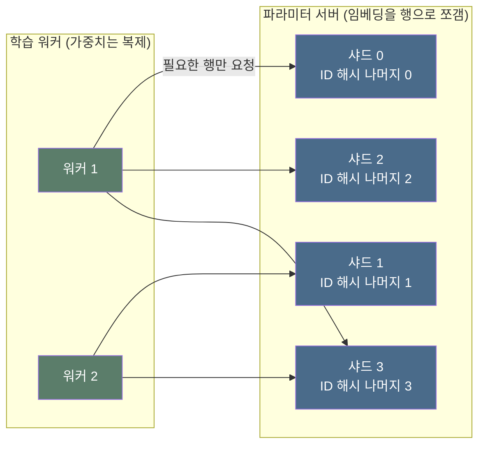

광고 서버 안에는 아주 긴 사전이 한 권 들어 있다.

표제어는 유저 ID와 광고 ID다. 뜻풀이는 사람이 읽어도 모르는 숫자 서른두 개다. 그래도 하는 일은 사전과 똑같다. ID를 넣으면 그 ID의 뜻이 나온다.

문제는 두께다. 표제어가 2억 개를 넘고, 매일 수만 개가 새로 생기고 수만 개가 죽는다. 그리고 이 사전을 초당 수만 번 펼쳐 봐야 한다. 이걸 **임베딩 테이블(embedding table)** 이라고 부른다.

왜 이런 사전이 필요한지는 [Deep CTR 모델의 진화](post.html?id=deep-ctr-models)에서 다뤘다. 차원을 몇으로 잡을지는 [CTR 피처 엔지니어링 실전](post.html?id=ctr-feature-engineering)의 몫이다. 이 글은 그다음, **이미 정해진 사전을 매일 어떻게 굴리느냐**만 본다.

> 한 줄 요약: 임베딩 테이블은 ID마다 한 줄씩 적힌 아주 긴 사전이다. 서버 한 대에 안 들어가서 쪼개고, 배치 하나가 건드리는 줄이 0.0005%뿐이라 희소하게 갱신한다. 죽은 줄은 계속 버려야 하고, 모델과 한 몸으로 배포해야 한다.

---

## 1. 사전은 두 조각으로 되어 있다

**임베딩 테이블은 실은 두 덩어리다. ID를 행 번호로 바꾸는 매핑, 그리고 행 번호로 찾는 숫자 행렬.**

이 구분이 글 전체의 뼈대다. 첫째 덩어리는 `ad_000812 → 5번 행` 같은 매핑, 즉 사전의 색인이다. 둘째 덩어리는 5번 행에 적힌 숫자 32개, 즉 실제 뜻풀이다. 학습이 고치는 건 둘째뿐인데, 사고는 첫째에서 더 자주 난다(§7).

테이블도 한 권이 아니다. 유저용, 소재용, 지면용이 따로 있고 크기와 성격이 제각각이다. 카테고리 테이블은 5만 줄이라 통째로 얹어도 되지만, 유저 테이블은 2억 줄이라 그럴 수 없다.

| 테이블 | 행 수 | ID 수명 | 성격 |
|---|---|---|---|
| 유저 ID | 2억 | 수년 | 크고, 조회는 요청당 1번 |
| 광고 소재 | 3,000만 | 며칠~몇 달 | 조회가 후보 수만큼 터진다 |
| 캠페인 | 300만 | 몇 달 | 소재보다 오래 산다 |
| 지면 슬롯 | 500만 | 수년 | 거의 안 죽는다 |
| 상품 카테고리 | 5만 | 영구 | 작아서 통째로 복제 |

(위 수치는 전부 가상 데이터다. 사내 실측치가 아니라 자리 크기만 맞춘 값이다.)

마지막 열이 이 글의 목차와 거의 같다. 큰 쪽은 쪼개야 하고, 조회가 터지는 쪽은 캐시가 필요하고, 수명이 짧은 쪽은 계속 버려야 한다.

---

## 2. 서버 한 대에 안 들어간다

**곱셈 세 번이면 답이 나온다. 행 수 × 차원 × 값 하나의 바이트. 그런데 학습에는 여기에 3배가 붙는다.**

서빙만 보면 계산이 단순하다. 2억 줄 × 32차원 × 4바이트면 23.8GB다. 테이블을 다 합쳐도 27.7GB니 램 128GB 서버 한 대에 들어갈 것 같다.

학습은 다르다. 옵티마이저가 값마다 상태를 따로 들기 때문이다. Adam은 1차·2차 모멘트를 각각 저장해 값 하나가 숫자 세 개가 된다. 27.7GB가 83.2GB로 뛴다. 이 3배를 놓쳐서 "서빙은 되는데 학습이 안 뜨는" 일이 자주 생긴다.

```python
# 임베딩 테이블이 메모리를 얼마나 먹는지 직접 곱해 본다.
# 서빙은 파라미터만 들면 되지만 학습은 옵티마이저 상태까지 든다. 표준 라이브러리만 쓴다.
import math

GB = 1024 ** 3
SERVER_GB = 64        # 서버 한 대가 임베딩에 내줄 수 있는 몫(가상). 램 전부는 못 쓴다.

# 가상 테이블 구성 — (이름, 행 수, 차원). 자리 크기만 맞춘 값이고 사내 실측치가 아니다.
tables = [("유저 ID", 200_000_000, 32), ("광고 소재", 30_000_000, 32),
          ("지면 슬롯", 5_000_000, 16), ("카테고리", 50_000, 16)]


def gb(rows, dim, nbytes):
    """행 수 × 차원 × 값 하나의 바이트 → GB."""
    return rows * dim * nbytes / GB


total = 0.0
for name, rows, dim in tables:
    g = gb(rows, dim, 4)                       # FP32 = 값 하나에 4바이트
    total += g
    print("%13s행 x %2d차원 = %7.3f GB  %s" % (format(rows, ","), dim, g, name))
print("파라미터 합계 %20.3f GB" % total)

# 학습 때는 옵티마이저가 값 하나마다 상태를 더 들고 있다. 그 개수가 그대로 배수가 된다.
#   SGD 상태 없음 → 1배 / Adagrad 누적 제곱합 1개 → 2배 / Adam 모멘트 2개 → 3배
for opt, mult in (("SGD", 1), ("Adagrad", 2), ("Adam", 3)):
    need = total * mult
    print("학습 %-8s x%d → %6.1f GB · 샤드 %d대" % (opt, mult, need, math.ceil(need / SERVER_GB)))

# 유저 테이블만 건드려 한계선이 어디서 넘는지 본다. 기준은 학습(Adam).
rest = total - gb(200_000_000, 32, 4)
for users in (100_000_000, 200_000_000, 500_000_000):
    cells = []
    for dim in (16, 32, 64):
        need = (gb(users, dim, 4) + rest) * 3
        cells.append("%2d차원 %6.1fGB %s" % (dim, need, "OK" if need <= SERVER_GB else "쪼갠다"))
    print("유저 %3d백만 | %s" % (users // 1_000_000, " | ".join(cells)))

# 출력:
#   200,000,000행 x 32차원 =  23.842 GB  유저 ID
#    30,000,000행 x 32차원 =   3.576 GB  광고 소재
#     5,000,000행 x 16차원 =   0.298 GB  지면 슬롯
#        50,000행 x 16차원 =   0.003 GB  카테고리
# 파라미터 합계               27.719 GB
# 학습 SGD      x1 →   27.7 GB · 샤드 1대
# 학습 Adagrad  x2 →   55.4 GB · 샤드 1대
# 학습 Adam     x3 →   83.2 GB · 샤드 2대
# 유저 100백만 | 16차원   29.5GB OK | 32차원   47.4GB OK | 64차원   83.2GB 쪼갠다
# 유저 200백만 | 16차원   47.4GB OK | 32차원   83.2GB 쪼갠다 | 64차원  154.7GB 쪼갠다
# 유저 500백만 | 16차원  101.0GB 쪼갠다 | 32차원  190.4GB 쪼갠다 | 64차원  369.3GB 쪼갠다
```

마지막 세 줄이 실무 감각에 가깝다. 한 대 한계가 64GB면 유저 1억 명은 32차원까지, 2억 명이면 16차원까지 버틴다. 5억 명이면 16차원으로도 안 된다. 유저 수는 우리가 정하는 게 아니다. 그래서 차원을 깎거나, 쪼개거나, 정밀도를 줄이는 세 갈래만 남는다.

---

## 3. 그래서 쪼갠다 — 행 단위 샤딩

**임베딩만 쪼개고 모델 가중치는 복제한다. 쪼갤 때는 반드시 행 단위로 쪼갠다.**

모델에서 임베딩을 뺀 나머지는 작다. MLP 몇 층은 다 합쳐도 수십 MB라 워커마다 복제해도 된다. 임베딩만 여러 대에 나눠 놓는데, 이 서버를 **파라미터 서버**라고 부른다. 워커는 계산만 하고 파라미터 서버는 사전만 들고 있는다.

쪼개는 축은 행이다. 조회 단위가 행 하나이기 때문이다. `ad_000812`의 뜻을 알려면 숫자 32개를 다 받아야 한다. 절반이 딴 서버에 있으면 왕복이 두 번이 된다.



나누는 규칙도 중요하다. ID 번호순으로 뭉텅뭉텅 나누면 안 된다. 광고 ID는 대개 순번이라 최근 소재가 뒷번호에 몰리고, 요청은 최근 소재에 쏠린다. 그러면 마지막 샤드만 뜨겁고 나머지는 논다. 그래서 ID를 해시한 나머지로 흩뿌려 인기 ID를 여러 샤드에 퍼뜨린다. 그래도 한 줄만 유별나게 뜨거우면 그 줄만 여러 샤드에 복제해 읽기를 나눈다.

---

## 4. 학습 때: 한 배치가 건드리는 줄은 0.0005%다

**임베딩은 아주 드물게 갱신된다. 코드가 이 사실을 모르면 학습이 하루치를 하루에 못 끝낸다.**

배치 1,024건이 들어왔다고 하자. 유저 행은 최대 1,024줄, 2억 줄 중 0.0005%만 등장한다. 광고 행은 인기 소재가 겹쳐서 827줄뿐이다. 나머지 99.999%의 줄은 기울기가 0이다.

그래서 갱신도 건드린 줄만 해야 한다. 이걸 **희소 갱신(sparse update)** 이라고 부른다. 반대로 테이블 전체를 훑는 방식이 밀집 갱신이다. 프레임워크가 임베딩을 그냥 큰 행렬로 보면 밀집 갱신이 된다.

```python
# 학습 배치 한 번이 임베딩 테이블의 몇 줄을 건드리는지 세어 본다.
# 그 비율이 곧 희소 갱신과 밀집 갱신의 비용 차이다. 표준 라이브러리만 쓴다.
import random

random.seed(42)

USER_ROWS = 200_000_000    # 유저 테이블 행 수 (가상)
AD_ROWS = 30_000_000       # 광고 소재 테이블 행 수 (가상)
DIM = 32
BATCH = 1_024              # 배치 한 번에 들어가는 노출 로그 수
BW_GBPS = 50               # 서버 메모리 대역폭 50GB/s (가상)
STEPS = 172_800            # 초당 2스텝을 하루 내내 돌린다고 하자

# 유저는 배치 안에서 거의 겹치지 않으니 균등하게 뽑는다.
users = [random.randrange(USER_ROWS) for _ in range(BATCH)]
# 광고는 인기 쏠림이 심하다. rank = N^u (u는 0~1 균등)로 상위 쏠림을 흉내 낸다.
ads = [int(AD_ROWS ** random.random()) for _ in range(BATCH)]

u, a = len(set(users)), len(set(ads))
print("배치 %s건이 건드리는 줄" % format(BATCH, ","))
print("  유저 %4d줄 / %s줄 = %.7f%%" % (u, format(USER_ROWS, ","), 100 * u / USER_ROWS))
print("  광고 %4d줄 / %s줄 = %.7f%%  (인기 소재가 겹쳐 %d건이 중복)"
      % (a, format(AD_ROWS, ","), 100 * a / AD_ROWS, BATCH - a))

# 옵티마이저가 한 스텝에서 만지는 값의 개수를 두 방식으로 센다.
sparse = (u + a) * DIM                        # 건드린 줄만
dense = (USER_ROWS + AD_ROWS) * DIM           # 테이블 전체
print("\n한 스텝에서 만지는 값 %s개(희소) vs %s개(밀집) → %s배"
      % (format(sparse, ","), format(dense, ","), format(round(dense / sparse), ",")))

# 아픈 건 곱셈이 아니라 메모리를 오가는 바이트다.
# Adam은 값 하나에 파라미터·1차 모멘트·2차 모멘트를 각각 읽고 쓴다 → 왕복 6번.
for label, values in (("희소", sparse), ("밀집", dense)):
    sec = values * 4 * 6 / 1024 ** 3 / BW_GBPS
    print("%s 갱신 %10.4f GB 이동 → %9.3f ms/스텝 → 하루 %s스텝에 %8.1f초"
          % (label, values * 4 * 6 / 1024 ** 3, sec * 1000, format(STEPS, ","), sec * STEPS))
print("밀집은 하루치가 %.1f일 걸린다 — 학습이 트래픽을 영원히 못 따라잡는다"
      % (dense * 4 * 6 / 1024 ** 3 / BW_GBPS * STEPS / 86_400))

# 출력:
# 배치 1,024건이 건드리는 줄
#   유저 1024줄 / 200,000,000줄 = 0.0005120%
#   광고  827줄 / 30,000,000줄 = 0.0027567%  (인기 소재가 겹쳐 197건이 중복)
#
# 한 스텝에서 만지는 값 59,232개(희소) vs 7,360,000,000개(밀집) → 124,257배
# 희소 갱신     0.0013 GB 이동 →     0.026 ms/스텝 → 하루 172,800스텝에      4.6초
# 밀집 갱신   164.5088 GB 이동 →  3290.176 ms/스텝 → 하루 172,800스텝에 568542.5초
# 밀집은 하루치가 6.6일 걸린다 — 학습이 트래픽을 영원히 못 따라잡는다
```

12만 배보다 마지막 줄이 무섭다. 밀집으로 짜면 하루치 스텝에 6.6일이 든다. 아예 못 돌린다는 뜻이다.

옵티마이저 선택도 여기서 갈린다. Adam의 2차 모멘트는 매 스텝 모든 값을 조금씩 감쇠시키는 게 원래 정의다. 건드린 줄만 갱신하면 그 정의와 어긋난다. Adagrad는 감쇠 없이 제곱합만 쌓으니 희소 갱신이 원래 수식과 정확히 같아진다. 임베딩에 Adagrad 계열이 오래 쓰인 이유다.

희소하다는 사실은 워커를 여러 대 쓰는 방식도 바꾼다. 동기 학습은 모두가 기울기를 낼 때까지 기다리는데, 건드리지 않은 줄까지 모아 합치는 통신이 낭비다. 비동기 학습은 각자 먹은 만큼 바로 반영해서, 남이 고친 값을 못 보고 낡은 값으로 계산할 위험이 있다. 그런데 워커 16대가 각자 1,024건을 처리해도 2억 줄에서 겹치는 줄은 거의 없다. 충돌이 없으면 낡은 값도 안 생긴다. 그래서 실무는 섞는다. MLP는 동기로 모으고 임베딩만 비동기로 맡긴다.

---

## 5. ID의 수명 — 언제 버리나

**아무것도 지우지 않으면 테이블은 단조 증가한다. 지우는 규칙이 곧 크기 관리다.**

광고 소재는 계속 태어나고 죽는다. 캠페인이 끝나면 그 소재는 다시 안 나오는데 테이블의 줄은 그대로 남는다. 그러니 두 달 뒤에는 §2의 계산이 틀리고, 세 달 뒤에는 서버가 부족하다.

버리는 규칙은 크게 셋이다. **빈도 컷**은 등장이 적은 줄을, **LRU**는 마지막 등장이 오래된 줄을, **TTL**은 최근 며칠 안에 등장하지 않은 줄을 버린다. 셋이 실제로 얼마나 다른지 재 보자.

```python
# 테이블을 목표 크기로 줄일 때 어떤 줄을 버려야 손해가 적은가.
# 빈도 컷 / LRU(마지막 등장 순) / TTL(최근 며칠 안에 등장) / 무작위를 비교한다.
import random

random.seed(42)

N_IDS = 300_000          # 광고 소재 풀 (가상)
DAYS = 30                # 30일 동안 로그를 쌓는다
REQ = 50_000             # 하루 노출 5만 건 (빨리 끝나는 규모로 줄였다)
TARGET = 30_000          # 목표 테이블 크기
TTL = 3                  # TTL 정책: 최근 3일 안에 등장한 줄만 남긴다

# 소재마다 인기도와 수명을 준다. 인기도는 1/rank^1.1, 수명은 캠페인 길이라 제각각이다.
# 태어난 날이 다르다는 게 중요하다 — 소재는 계속 새로 생기고 캠페인이 끝나면 안 나온다.
pop, born, died = [], [], []
for i in range(N_IDS):
    pop.append(1.0 / (i + 10) ** 1.1)
    b = random.randrange(-60, DAYS)
    born.append(b)
    died.append(b + random.choice([7, 14, 30, 90, 365]))

seen = [0] * N_IDS       # 총 등장 횟수 → 빈도 컷의 기준
last = [-999] * N_IDS    # 마지막 등장 일 → LRU·TTL의 기준


def sample(day, n):
    """그날 살아 있는 소재만 인기도에 비례해 n건 뽑는다."""
    alive = [i for i in range(N_IDS) if born[i] <= day < died[i]]
    return random.choices(alive, weights=[pop[i] for i in alive], k=n)


for day in range(DAYS):
    for i in sample(day, REQ):
        seen[i] += 1
        last[i] = day

logged = [i for i in range(N_IDS) if seen[i] > 0]
print("30일 로그에 등장한 소재 %s개 → %s개만 남긴다(%.0f%%)"
      % (format(len(logged), ","), format(TARGET, ","), 100 * TARGET / len(logged)))

# 남길 집합을 정책별로 만든다. 정렬 기준만 다르다.
policies = [("빈도 컷", sorted(logged, key=lambda i: (-seen[i], i))[:TARGET]),
            ("LRU", sorted(logged, key=lambda i: (-last[i], -seen[i], i))[:TARGET]),
            ("TTL %d일" % TTL, [i for i in logged if last[i] >= DAYS - TTL]),
            ("무작위", random.sample(logged, TARGET))]

# 채점은 다음 날 트래픽으로 한다. 과거를 맞히는 게 아니라 미래를 덮는 게 목표다.
future = sample(DAYS, REQ)
print("31일째 노출 %s건, 서로 다른 소재 %s개\n" % (format(len(future), ","), format(len(set(future)), ",")))
print("정책        남긴 줄   커버   못 찾음   평균 등장   31일에 살아 있음")
for name, keep in policies:
    ks = set(keep)
    hit = sum(1 for i in future if i in ks)
    alive = sum(1 for i in keep if died[i] > DAYS)
    print("%-9s %7s개 %5.1f%% %8s건 %8.1f회 %14.1f%%"
          % (name, format(len(keep), ","), 100 * hit / len(future), format(len(future) - hit, ","),
             sum(seen[i] for i in keep) / len(keep), 100 * alive / len(keep)))

# 출력:
# 30일 로그에 등장한 소재 122,788개 → 30,000개만 남긴다(24%)
# 31일째 노출 50,000건, 서로 다른 소재 14,736개
#
# 정책        남긴 줄   커버   못 찾음   평균 등장   31일에 살아 있음
# 빈도 컷       30,000개  86.0%    6,984건     44.9회           81.0%
# LRU        30,000개  85.3%    7,357건     37.8회           96.8%
# TTL 3일     32,001개  85.5%    7,263건     35.5회           96.7%
# 무작위        30,000개  25.2%   37,387건     13.6회           77.2%
```

먼저 무작위와의 격차가 눈에 들어온다. 같은 3만 줄인데 커버가 25.2%와 86.0%로 갈린다. 인기 쏠림이 심해서, 잘 고르면 4분의 1만 남겨도 트래픽의 86%를 덮는다.

정책 셋 사이의 차이는 뜻밖에 작다. 커버율이 0.7%p 안에 다 들어온다. 실제 차이는 뒤쪽 두 열에 있다. 빈도 컷이 남긴 줄의 19%는 31일에 이미 죽은 소재다. 오래전에 인기 있었다는 이유로 자리를 차지한다. LRU는 96.8%가 살아 있다. TTL은 크기를 정하지 못한다. 3일로 잘랐더니 3만 2천이 남았다. 실무는 크기를 LRU로 잡고, 새 ID는 최소 등장 횟수를 넘길 때까지 테이블에 넣지 않는다.

지운 ID가 다시 오면 사전에 없다. 이때 쓰는 게 **OOV 행**, 등록되지 않은 ID 전부가 공유하는 한 줄이다. 조회는 성공하고 점수도 나오지만 그 광고만의 개성이 없다. 위 실험에서는 노출 7,357건, 전체의 14.7%가 이 상태였다. 그 요청은 카테고리·광고주 같은 상위 정보에 기대야 한다.

---

## 6. 서빙 때: 조회가 흩어져 있다

**임베딩 조회의 문제는 양이 아니라 흩어짐이다. 필요한 바이트는 작은데 가져오는 거리가 길다.**

요청 하나가 만드는 조회 횟수를 세어 보면 감이 온다. 후보 광고가 2,000개면 소재·캠페인·카테고리 테이블을 각각 2,000번 뒤진다.

| 테이블 | 조회 대상 | 요청당 조회 수 |
|---|---|---|
| 유저 | 요청한 유저 1명 | 1 |
| 유저 행동 시퀀스 | 최근 클릭 50개 | 50 |
| 지면 슬롯 | 노출 자리 1개 | 1 |
| 광고 소재 | 후보 2,000개 | 2,000 |
| 캠페인 | 후보의 캠페인 | 2,000 |
| 상품 카테고리 | 후보의 카테고리 | 2,000 |
| **합계** | | **6,052** |

(가상 데이터다. 후보 수와 시퀀스 길이는 서비스마다 다르다.)

6,052번을 하나씩 원격에 물어보면 답이 없다. 왕복 0.15ms만 잡아도 900ms다. 그래서 샤드별로 ID를 묶어 한 번에 요청한다. 샤드가 8개면 왕복이 8번으로 줄어든다. 루프 안에서 한 건씩 조회하는 코드가 가장 흔한 성능 사고다.

로컬에서 읽어도 흩어짐은 남는다. CPU는 메모리를 64바이트 덩어리(캐시 라인) 단위로 읽는다. 32차원 FP32 행은 128바이트라 라인 두 개에 딱 맞는다. 그런데 행이 라인 경계에 안 맞게 놓이면 128바이트를 위해 라인 세 개, 192바이트를 옮긴다. 그래서 행 길이를 캐시 라인 배수로 맞추고 정렬해 얹는다.

인기 ID만 프로세스 안에 두고 나머지를 원격에 두는 2계층 구성이 여기서 나온다. 캐시 적중률과 지연 감소는 [광고 모델 서빙 아키텍처](post.html?id=model-serving-architecture)에서, 저장·갱신 계층은 [Feature Store와 실시간 서빙](post.html?id=feature-store-serving)에서 다뤘다.

---

## 7. 배포와 버전 — 모델과 테이블은 한 몸이다

**사전이 어긋나면 같은 ID가 다른 뜻이 된다. 그리고 아무 에러도 나지 않는다.**

배포할 때 매핑과 행렬의 짝이 안 맞으면 조회는 성공한다. 5번 행을 달라고 하면 5번 행을 준다. 그게 남의 줄이라는 걸 아무도 모른다. 죽은 ID를 지우고 사전을 다시 만들면 뒤쪽 번호가 전부 밀리는데, 3%만 지웠는데도 거의 모든 줄의 번호가 바뀐다.

```python
# 사전과 행렬의 버전이 어긋나면 무슨 일이 생기나. 예외는 안 난다. 값만 남의 것이 된다.
import random

random.seed(42)

N, DIM, DIE, BORN = 100_000, 16, 0.03, 5_000   # 어제 ID 10만 개, 3% 종료, 신규 5천 (가상)

old = ["ad_%06d" % i for i in range(N)]
v1 = {ad: r for r, ad in enumerate(sorted(old))}          # 어제 사전: 정렬해 0번부터 번호를 준다

# 하루가 지났다. 일부가 죽고 새 ID가 들어온다. 사전을 다시 만들며 빈 행을 없앤다(압축).
dead = set(random.sample(old, int(N * DIE)))
alive = [a for a in old if a not in dead] + ["ad_%06d" % (N + i) for i in range(BORN)]
v2 = {ad: r for r, ad in enumerate(sorted(alive))}        # 오늘 사전

sur = [a for a in old if a not in dead]                   # 죽지 않고 살아남은 ID
same = sum(1 for a in sur if v1[a] == v2[a])
print("살아남은 %s개 중 행 번호가 그대로인 것 %d개 (%.2f%%)"
      % (format(len(sur), ","), same, 100 * same / len(sur)))

# 행렬은 v2 기준으로 학습됐다고 하자. 사전만 v1이면 조회가 남의 줄을 집어 온다.
table = [[random.gauss(0, 0.5) for _ in range(DIM)] for _ in range(len(alive))]
user = [random.gauss(0, 0.5) for _ in range(DIM)]
score = lambda row: sum(x * y for x, y in zip(user, row))

cands = random.sample(sur, 2_000)                         # 이번 요청의 후보 광고 2,000개
right = [score(table[v2[a]]) for a in cands]              # 사전도 v2 — 정상
wrong = [score(table[v1[a]]) for a in cands]              # 사전만 v1 — 어긋남

for label, v in (("정상 ", right), ("어긋남", wrong)):
    m = sum(v) / len(v)
    sd = (sum((x - m) ** 2 for x in v) / len(v)) ** 0.5
    print("%s 평균 %+.4f · 표준편차 %.4f · 최댓값 %+.4f" % (label, m, sd, max(v)))

# 분포는 멀쩡한데 순위가 남의 것인지 확인한다.
rt = sorted(range(len(cands)), key=lambda i: -right[i])
wt = sorted(range(len(cands)), key=lambda i: -wrong[i])
print("Top-10 겹침 %d개 · Top-100 겹침 %d개"
      % (len(set(rt[:10]) & set(wt[:10])), len(set(rt[:100]) & set(wt[:100]))))

# 출력:
# 살아남은 97,000개 중 행 번호가 그대로인 것 53개 (0.05%)
# 정상  평균 -0.0024 · 표준편차 0.6933 · 최댓값 +2.0844
# 어긋남 평균 -0.0004 · 표준편차 0.6980 · 최댓값 +2.4388
# Top-10 겹침 0개 · Top-100 겹침 3개
```

가장 중요한 건 점수 분포다. 평균과 표준편차가 정상과 거의 같고 최댓값도 비슷하다. 분포만 보는 모니터링은 이 사고를 못 잡는다. 그런데 Top-10은 하나도 안 겹치고 Top-100도 3개뿐이다. 우리가 내보내는 광고가 남의 광고다.

막는 방법은 셋이다. 첫째, 모델과 사전과 행렬을 **한 아티팩트로 묶어** 배포하고 롤백도 셋을 같이 되돌린다. 둘째, 사전 지문(CRC32)을 헤더에 실어 로드할 때 맞춰 보고 다르면 뜨지 않게 한다. 셋째, 압축을 미룬다. 죽은 행을 비워 두면 번호가 흔들리지 않는다. 빈 행 메모리는 하루 3,000행이면 0.18MB, 1년 모아도 67MB뿐이다. 그래서 압축은 분기에 한 번, 모델을 처음부터 다시 학습하는 날에만 한다. 새 ID를 뒤에만 붙이는 증분 배포는 기존 번호가 안 밀려 안전하다([온라인 학습과 지연 피드백](post.html?id=online-learning-delayed-feedback)의 증분 학습과 짝이 맞는다).

---

## 8. 담장 안: 유저 테이블에 자원을 쓴다 [무대: 닫힌 생태계]

**로그인 ID는 어제도 오늘도 같다. 그래서 유저 줄이 오래 살고, 미리 계산해 얹어 둘 수 있다.**

담장 안에서 광고를 파는 회사는 유저를 로그인 계정으로 알아본다. 그 ID는 몇 년을 산다. 이 안정성이 운영을 세 군데에서 편하게 만든다.

첫째, 유저 줄이 배울 시간을 충분히 받는다. 한 달에 수백 번 등장하면 그 숫자 32개가 실제로 그 사람을 담는다. 둘째, 퇴출 기준이 트래픽이 아니라 계정 상태다. 탈퇴나 장기 휴면으로 지우면 되니 LRU를 급하게 돌릴 필요가 없다. 셋째, 미리 계산해 캐시에 얹어 둘 수 있다. 구워 둔 벡터를 찾아올 키가 흔들리지 않기 때문이다. 이 이득은 [Two-Tower Retrieval](post.html?id=two-tower-retrieval)에서 다뤘다.

그래서 담장 안의 예산은 유저 테이블로 쏠린다. §2에서 유저 테이블이 전체의 86%를 먹은 게 우연이 아니다. 대신 오래 사는 만큼 오래된 취향이 남아, 3년 전 관심사가 지금 벡터에 섞여 있다.

---

## 9. 열린 RTB: 유저 줄은 한 번 쓰고 버려진다 [무대: 열린 RTB]

**쿠키가 매번 다르면 유저 테이블은 배울 시간을 못 받는다. 그래서 자원을 광고·지면·문맥으로 옮긴다.**

열린 RTB에서 광고를 사는 DSP는 남의 쿠키를 본다. 브라우저마다 다르고 수명이 짧다. 그러면 유저 임베딩이 두 군데서 동시에 망가진다. 학습에서는 그 줄이 한두 번만 등장해 초기값에서 거의 안 움직인다. 서빙에서는 어제 만든 줄을 찾을 키가 없다.

한두 번 등장한 ID에 숫자 32개를 배정하는 건 순수한 낭비다. 그래서 DSP의 테이블 예산은 수명이 긴 쪽으로 간다. 도메인과 슬롯 위치는 몇 년을 살고, 광고 소재도 자기 캠페인이라 오래 관리한다. 문맥(시간대·디바이스·지면 카테고리)은 아예 안 죽는다.

| 갈림 | 닫힌 생태계 | 열린 RTB (DSP) |
|---|---|---|
| **유저 테이블 비중** | 전체의 80% 이상 | 10% 이하 또는 없음 |
| **유저 ID 수명** | 수년 (로그인 계정) | 며칠 (쿠키) |
| **유저 줄의 평균 등장** | 수백 회 | 1~2회 |
| **가장 큰 테이블** | 유저 ID | 광고 소재 + 지면 |
| **퇴출 기준** | 탈퇴·장기 휴면 | 캠페인 종료·LRU |

(위 수치는 가상 데이터다. 방향만 실무와 같다.)

담장 안에서 만든 모델을 DSP에 그대로 옮기면 유저 테이블이 메모리만 먹는다. 반대로 DSP의 설계를 담장 안에 가져오면 가장 좋은 신호를 버린다.

---

## 10. 정밀도 줄이기 — FP32에서 int8까지

**정밀도를 낮추면 메모리는 정직하게 줄어든다. 문제는 어느 줄이 먼저 망가지느냐다.**

값 하나를 4바이트로 저장할 이유는 없다. FP16이면 반, int8이면 4분의 1이다. 27.7GB가 7GB가 되면 §2의 고민이 대부분 사라진다. 다만 임베딩은 학습 파라미터다. 학습은 FP32로 하고 다 배운 뒤 서빙용으로만 낮춘다.

int8로 낮출 때 결정할 게 하나 있다. 스케일을 행마다 따로 잡을지, 테이블 전체가 하나를 공유할지다. 공유가 더 싼데, 여기서 사고가 난다.

:::deep 더 깊이 — int8 양자화의 스케일과 제로포인트
값의 범위를 정수 256칸에 밀어 넣는 일이다. 임베딩 값은 0을 중심으로 대칭이라 보통 제로포인트 $z$를 0으로 두는 대칭(symmetric) 방식을 쓴다. 그러면 스케일 하나만 잡으면 된다.

$$s = \frac{\max |x|}{127}, \qquad \hat{x} = s \cdot \mathrm{clip}(\mathrm{round}(x/s),\, -127,\, 127)$$

값이 한쪽으로 치우쳤다면 최솟값·최댓값을 다 쓰는 비대칭 방식이 낫다. $s = (x_{\max} - x_{\min})/255$ 로 잡고 $z$ 를 0이 아닌 값으로 옮긴다. 되돌릴 때는 $\hat{x} = s\,(q - z)$ 다. 대신 $z \ne 0$ 이면 정수 내적에 보정항이 붙어 느려진다.

행별 스케일은 행당 4바이트를 더 쓴다. 32차원이면 12.5%, 아래 표의 7.0GB와 7.9GB 차이다.
:::

```python
# FP32 → FP16 → int8. 메모리는 정직하게 줄어드는데 점수는 어디서 망가지나.
# struct의 'e' 포맷이 IEEE 754 반정밀도(FP16)라 실제 반올림을 그대로 재현한다.
import math
import random
import struct

random.seed(42)

DIM = 32
N = 2_000                # 광고 벡터 2,000개를 유저 벡터 하나로 채점한다
ROWS = 235_000_000       # 전체 테이블 행 수 (가상)

user = [random.gauss(0, 0.5) for _ in range(DIM)]
# 실제 테이블은 행마다 벡터 길이가 크게 다르다. 자주 학습된 ID일수록 길어지는 경향이 있다.
ads = []
for _ in range(N):
    mag = math.exp(random.gauss(0, 1.0))                     # 이 행 전체의 길이를 정하는 배수
    ads.append([mag * random.gauss(0, 0.5) for _ in range(DIM)])
norms = [math.sqrt(sum(x * x for x in a)) for a in ads]
shared = max(abs(x) for row in ads for x in row) / 127.0     # 공용 스케일은 최댓값 하나가 정한다
print("행 벡터 길이 최소 %.3f · 최대 %.1f → %.0f배 차이 · 공용 스케일 %.6f"
      % (min(norms), max(norms), max(norms) / min(norms), shared))


def fp16(v):
    """FP16으로 반올림했다 다시 읽는다. 유효 자리가 소수 3~4자리로 줄어든다."""
    return [struct.unpack("e", struct.pack("e", x))[0] for x in v]


def int8(v, scale=None):
    """스케일이 없으면 그 행의 최댓값으로 잡는다(행별). 주면 그 값을 쓴다(공용)."""
    s = scale or max(abs(x) for x in v) / 127.0
    return [max(-127, min(127, round(x / s))) * s for x in v]


def dot(a, b):
    return sum(x * y for x, y in zip(a, b))


base = [dot(user, a) for a in ads]
rank0 = sorted(range(N), key=lambda i: -base[i])
tops = {k: set(rank0[:k]) for k in (10, 100, 500)}
long_half = set(sorted(range(N), key=lambda i: -norms[i])[:N // 2])

# 행 하나에 저장되는 바이트. 행별 스케일은 스케일(FP32 4바이트)도 같이 저장해야 한다.
variants = [("FP32 (기준)", DIM * 4, ads), ("FP16", DIM * 2, [fp16(a) for a in ads]),
            ("int8 행별", DIM + 4, [int8(a) for a in ads]),
            ("int8 공용", DIM, [int8(a, shared) for a in ads])]

print("\n정밀도        크기   상대오차   Top-10 Top-100 Top-500   긴 벡터  짧은 벡터")
for name, row_bytes, table in variants:
    score = [dot(user, a) for a in table]
    rel = [abs(s - b) / abs(b) for s, b in zip(score, base)]
    rank = sorted(range(N), key=lambda i: -score[i])
    keep = [len(tops[k] & set(rank[:k])) for k in (10, 100, 500)]
    # 같은 오차를 긴 벡터 절반과 짧은 벡터 절반으로 갈라 본다. 여기서 정체가 드러난다.
    hi = sum(rel[i] for i in long_half) / len(long_half)
    lo = sum(rel[i] for i in set(range(N)) - long_half) / (N - len(long_half))
    print("%-11s %5.1fGB %8.2f%%  %3d/10 %4d/100 %4d/500 %8.2f%% %8.2f%%"
          % (name, ROWS * row_bytes / 1024 ** 3, 100 * sum(rel) / N,
             keep[0], keep[1], keep[2], 100 * hi, 100 * lo))

# 출력:
# 행 벡터 길이 최소 0.072 · 최대 59.6 → 824배 차이 · 공용 스케일 0.228337
#
# 정밀도        크기   상대오차   Top-10 Top-100 Top-500   긴 벡터  짧은 벡터
# FP32 (기준)    28.0GB     0.00%   10/10  100/100  500/500     0.00%     0.00%
# FP16         14.0GB     0.15%   10/10  100/100  500/500     0.14%     0.17%
# int8 행별       7.9GB     4.00%   10/10  100/100  499/500     3.59%     4.40%
# int8 공용       7.0GB   158.34%   10/10   98/100  475/500    42.95%   273.74%
```

FP16은 사실상 공짜다. 크기가 반이 되는데 상대오차 0.15%, 순위 변화 0건이다. 서빙 테이블은 FP16이 기본값에 가깝다.

int8은 스케일 방식이 갈림길이다. 행별로 잡으면 상대오차 4%에 Top-500 중 499개가 그대로다. 공용으로 잡으면 상대오차가 158%로 뛴다. 마지막 두 열이 이유다. 긴 벡터는 43%만 틀리는데 짧은 벡터는 274% 틀린다. 공용 스케일은 테이블에서 가장 큰 값 하나가 정하는데, 그 눈금으로 짧은 벡터를 재면 대부분 0 아니면 1로 뭉개진다.

벡터가 긴 줄은 자주 학습된 인기 ID고, 짧은 줄은 등장이 적은 롱테일이다. 즉 공용 스케일은 **인기 광고는 지키고 롱테일만 망가뜨린다**. 지표에 잘 안 잡히고, 새 광고주의 소재가 조용히 손해를 본다.

---

## 헷갈리기 쉬운 점

- **테이블 크기와 학습 메모리는 다른 숫자다.** 서빙 27.7GB짜리가 학습에서는 83.2GB다. 용량 계획을 서빙 기준으로 세우면 학습이 안 뜬다.
- **희소 갱신은 최적화가 아니라 전제다.** 밀집으로 짜면 하루치가 6.6일 걸린다. "일단 돌리고 나중에 최적화"가 안 통하는 드문 자리다.
- **ID를 지운다고 모델이 그 광고를 못 보는 게 아니다.** OOV 행으로 점수가 나온다. 그래서 퇴출을 세게 걸어도 티가 안 난다. 커버율을 따로 재야 한다.
- **버전 어긋남은 에러가 아니라 침묵이다.** 점수 분포가 정상과 거의 같아 모니터링으로는 안 걸린다. 배포 시점에 지문으로 막아야 한다.
- **int8이 정확도를 거의 안 깎는다는 말은 조건부다.** 스케일을 행마다 잡았을 때의 이야기다. 공용 스케일에서는 롱테일이 세 자릿수 퍼센트로 틀어진다.

---

## 더 깊이 보기

- 이 테이블이 왜 필요한지, 모델 안에서 어떻게 쓰이는지 → [Deep CTR 모델의 진화](post.html?id=deep-ctr-models)
- 차원 정하기·해싱 트릭·시퀀스 피처 → [CTR 피처 엔지니어링 실전](post.html?id=ctr-feature-engineering)
- 임베딩으로 후보를 검색하는 법 → [Two-Tower Retrieval](post.html?id=two-tower-retrieval)
- 캐시 적중률·배칭·p99 같은 서빙 일반론 → [광고 모델 서빙 아키텍처](post.html?id=model-serving-architecture)
- 광고 ML 전체 지도에서 이 글의 위치 → [ML 엔지니어 트랙](ml-track.html)
