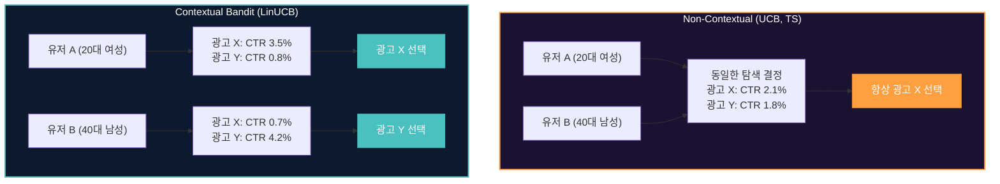
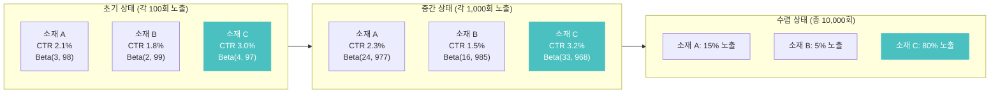
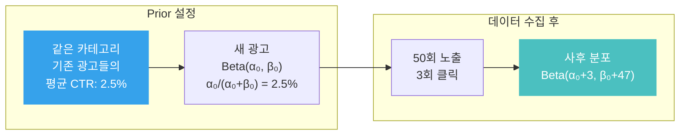
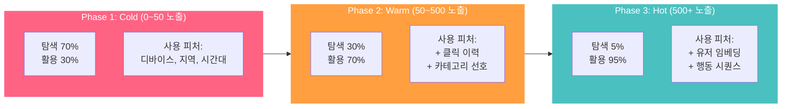
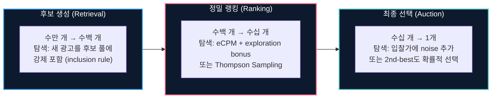

광고 시스템은 매 순간 선택의 기로에 놓입니다: **지금까지 가장 잘 되는 광고를 계속 보여줄 것인가(Exploitation), 아직 데이터가 부족한 새 광고에 기회를 줄 것인가(Exploration)?**

Exploitation만 하면 단기 수익은 안정적이지만, 더 좋은 광고를 영원히 발견하지 못합니다. Exploration만 하면 데이터는 쌓이지만, 성과가 낮은 광고에 예산을 낭비합니다. 이 **탐색-활용 딜레마(Exploration-Exploitation Dilemma)**는 광고 랭킹, 소재 최적화, 오디언스 확장, 캠페인 초기 학습 등 광고 시스템 전반에 걸친 근본적 문제입니다.

이 글에서는 딜레마의 본질을 직관적으로 설명한 뒤, 광고 시스템에서 쓰이는 주요 탐색 전략을 비교하고, 실무에서 가장 까다로운 **Cold-Start 문제**의 해법까지 다룹니다.

> 개별 알고리즘의 수학적 상세가 궁금하다면: [UCB vs Thompson Sampling](post.html?id=ucb-ts), [LinUCB 상세 해석](post.html?id=linucb), [Standard TS vs Linear TS](post.html?id=TS-linTS)를 참고하세요. 이 글은 그 시리즈의 **통합 프리퀄**입니다.

---

## 1. 핵심 비교 (Executive Summary)

| 전략 | 탐색 방식 | 컨텍스트 활용 | 수렴 속도 | 구현 복잡도 | 광고 시스템 적합도 |
|------|----------|-------------|----------|-----------|-----------------|
| **Greedy** | 탐색 없음 (순수 활용) | X | - | 매우 낮음 | 부적합 (학습 불가) |
| **Epsilon-Greedy** | 확률 $\epsilon$로 랜덤 탐색 | X | 느림 | 낮음 | 프로토타입 수준 |
| **UCB1** | 불확실성 상한으로 탐색 | X | 중간 | 낮음 | 기본 베이스라인 |
| **Thompson Sampling** | 사후 분포에서 샘플링 | X | 빠름 | 중간 | 소규모 A/B 대체 |
| **LinUCB** | 컨텍스트 기반 불확실성 | O | 빠름 | 높음 | 프로덕션 추천 |
| **Neural Bandit** | 딥 네트워크 + 탐색 | O | 빠름 | 매우 높음 | 대규모 시스템 |

---

## 2. 탐색-활용 딜레마의 본질

### 왜 딜레마인가?

가장 직관적인 예시는 **식당 선택**입니다:

- **Exploitation**: 항상 가장 좋아하는 단골집에 간다 → 만족도가 안정적이지만, 숨은 맛집을 놓친다
- **Exploration**: 매일 새로운 식당에 간다 → 맛집을 발견할 수 있지만, 대부분의 식사가 실망스럽다

광고 시스템으로 바꾸면:

- **Exploitation**: CTR이 가장 높은 광고만 계속 노출 → 단기 eCPM 극대화, 하지만 새 광고의 잠재력을 평가할 기회가 없음
- **Exploration**: 데이터가 부족한 광고에도 노출 기회 부여 → 장기적으로 더 좋은 광고를 발견할 수 있지만, 단기 수익 감소

핵심은 **정보의 가치(Value of Information)**입니다. 탐색은 단기적으로 비용이지만, 그로 인해 얻는 정보가 미래의 더 나은 의사결정을 가능하게 합니다.

### 수학적 정의: Regret

탐색-활용 전략의 성능은 **Regret(후회)**으로 측정합니다:

$$R_T = \sum_{t=1}^{T} \left( \mu^* - \mu_{a_t} \right)$$

- $T$: 총 라운드 수 (= 총 광고 노출 수)
- $\mu^*$: 최적 arm(= 최고 CTR 광고)의 기대 보상
- $\mu_{a_t}$: 시점 $t$에서 선택한 arm의 기대 보상
- $R_T$: 최적 전략 대비 누적 손실

좋은 탐색 전략은 **sublinear regret** ($R_T = O(\sqrt{T \log T})$ 등)을 달성합니다. 즉, 시간이 지날수록 최적 전략에 수렴합니다.

### 광고 시스템에서 Regret의 의미

광고에서 Regret은 곧 **매출 손실**입니다:

| Regret 원인 | 시나리오 | 비용 |
|------------|---------|------|
| **과소 탐색** | CTR 5%인 신규 광고를 발견하지 못하고, CTR 2%인 기존 광고만 노출 | 노출당 3%p CTR 차이 × 전환 가치 |
| **과다 탐색** | CTR 0.1%인 저품질 광고에 1만 회 노출 | 1만 회 × (최적 CTR - 0.1%) × 전환 가치 |
| **탐색 지연** | 새 광고의 잠재력을 파악하는 데 10만 회 필요 (비효율적 탐색) | 10만 회의 학습 비용 |

---

## 3. 탐색 전략의 진화: Random에서 Context-Aware까지

### ① Epsilon-Greedy: 가장 단순한 탐색

```
매 노출 시:
  확률 (1-ε): 현재 최고 CTR 광고를 노출 (Exploitation)
  확률 ε:     랜덤으로 광고를 선택 (Exploration)
```

**장점**: 구현이 극도로 간단 (난수 하나면 됨)

**한계**:
- 탐색이 **무차별적**: 이미 충분히 탐색한 광고와 전혀 데이터가 없는 광고를 동일 확률로 선택
- $\epsilon$ 설정이 어려움: 너무 크면 수익 손실, 너무 작으면 학습 부족
- 시간이 지나도 탐색 비율이 줄지 않음 (decaying $\epsilon$으로 완화 가능하지만 근본적 해결은 아님)

**광고 실무**: 프로토타입이나 A/B 테스트 대체 수준. 프로덕션에서는 거의 사용하지 않음.

### ② UCB (Upper Confidence Bound): 불확실성 기반 탐색

UCB의 핵심 아이디어는 **"불확실한 것에 낙관적으로 행동하라(Optimism in the Face of Uncertainty)"**입니다:

$$a_t = \arg\max_a \left[ \underbrace{\hat{\mu}_a}_{\text{현재 추정 CTR}} + \underbrace{c \sqrt{\frac{\ln t}{N_a}}}_{\text{불확실성 보너스}} \right]$$

- $\hat{\mu}_a$: 광고 $a$의 현재 추정 CTR (평균 보상)
- $N_a$: 광고 $a$가 노출된 횟수
- $c$: 탐색 강도 파라미터

**직관**: 노출이 적은 광고($N_a$가 작음)는 불확실성 보너스가 크므로 선택될 확률이 높아집니다. 노출이 쌓이면 보너스가 줄어들고, 추정 CTR 자체의 정확도가 올라갑니다.

**Epsilon-Greedy 대비 장점**:
- **적응적 탐색**: 데이터가 부족한 광고를 자동으로 더 탐색
- **수렴 보장**: $O(\sqrt{T \log T})$ regret bound

**한계**:
- 컨텍스트(유저, 지면, 시간대)를 활용하지 못함
- 모든 유저에게 같은 탐색 결정을 내림

> UCB의 상세 분석은 [UCB vs Thompson Sampling](post.html?id=ucb-ts)을 참고하세요.

### ③ Thompson Sampling: 확률적 탐색

Thompson Sampling은 **"각 arm의 보상 분포에서 샘플을 뽑아, 샘플이 가장 큰 arm을 선택"**합니다:

$$\theta_a \sim \text{Beta}(\alpha_a, \beta_a), \quad a_t = \arg\max_a \theta_a$$

- $\alpha_a$: 광고 $a$의 클릭 수 + 1
- $\beta_a$: 광고 $a$의 비클릭 수 + 1
- $\text{Beta}(\alpha, \beta)$: 사후 분포

**직관**: 데이터가 적은 광고는 Beta 분포가 넓게 퍼져있어 높은 샘플이 뽑힐 확률이 있습니다(= 탐색). 데이터가 쌓이면 분포가 좁아져 실제 CTR 근처에서만 샘플링됩니다(= 활용).

**UCB 대비 장점**:
- 경험적으로 더 빠르게 수렴 (특히 arm 수가 많을 때)
- **확률적 탐색**: 같은 상태에서도 매번 다른 arm을 선택할 수 있어, 탐색이 자연스럽게 다양화됨
- 배치(batch) 환경에서도 잘 동작

**한계**: UCB와 마찬가지로 컨텍스트 미활용

> Thompson Sampling의 상세 비교는 [Standard TS vs Linear TS](post.html?id=TS-linTS)를 참고하세요.

### ④ Contextual Bandit: 컨텍스트를 활용한 개인화 탐색

실제 광고 시스템에서는 **모든 유저에게 같은 광고가 최적이지 않습니다**. 20대 여성에게는 패션 광고가, 40대 남성에게는 자동차 광고가 더 높은 CTR을 보입니다. Contextual Bandit은 유저/지면/시간 등의 **컨텍스트 피처**를 반영하여 탐색합니다.

대표 알고리즘인 **LinUCB**:

$$a_t = \arg\max_a \left[ \underbrace{x_t^T \hat{\theta}_a}_{\text{컨텍스트 기반 CTR 추정}} + \underbrace{\alpha \sqrt{x_t^T A_a^{-1} x_t}}_{\text{컨텍스트 의존 불확실성}} \right]$$

- $x_t$: 현재 컨텍스트 피처 벡터 (유저 특성, 지면 특성, 시간대 등)
- $\hat{\theta}_a$: 광고 $a$의 학습된 파라미터 벡터
- $A_a$: 광고 $a$의 공분산 행렬 (불확실성 정보 저장)

**핵심 차이**: 불확실성 보너스가 **컨텍스트에 따라 달라집니다**. 특정 유저-광고 조합에 대해 데이터가 부족하면 그 조합의 불확실성이 크므로 탐색하고, 이미 충분한 데이터가 있으면 활용합니다.



> LinUCB의 수학적 상세 해석은 [Disjoint LinUCB 모델 상세 해석](post.html?id=linucb)을 참고하세요.

---

## 4. 광고 시스템에서의 탐색 적용 영역

탐색-활용 문제는 광고 시스템의 **여러 계층**에서 동시에 발생합니다:

| 적용 영역 | Arm (선택지) | 보상 | 탐색의 의미 | 대표 접근 |
|----------|------------|------|-----------|----------|
| **광고 랭킹** | 후보 광고 풀 | 클릭/전환 | 새 광고에 노출 기회 부여 | LinUCB, Neural Bandit |
| **소재 최적화** | 동일 광고의 소재 변형 (A/B/C) | CTR | 어떤 소재가 가장 효과적인지 학습 | Thompson Sampling |
| **오디언스 확장** | 타겟팅 세그먼트 | 전환율 | 새로운 유저 세그먼트 탐색 | Epsilon-Greedy, UCB |
| **입찰 전략** | Bid Shading 비율 | Surplus | 최적 Shading 비율 탐색 | Bayesian Optimization |
| **캠페인 초기 학습** | 지면 x 시간대 조합 | CPA | 어떤 조합이 효율적인지 탐색 | Contextual Bandit |

### 소재 최적화 예시: Thompson Sampling 적용

광고주가 3개의 배너 소재(A, B, C)를 등록했다고 가정합니다:



Thompson Sampling은 자동으로:
1. **초기**: 세 소재에 비슷한 비율로 노출 (Beta 분포가 넓어서 역전 가능)
2. **중간**: 소재 C에 점점 더 많은 노출 집중, B는 감소
3. **수렴**: 소재 C가 80% 이상의 노출을 차지, A/B는 소량의 탐색만 유지

A/B 테스트처럼 "50:50으로 나눠서 N일 기다리기"가 아니라, **데이터가 쌓이는 대로 실시간으로 트래픽을 최적 소재에 집중**합니다. 이것이 Bandit 기반 최적화의 핵심 장점입니다.

---

## 5. Cold-Start 문제: 데이터가 없을 때 어떻게 탐색하는가

탐색-활용 딜레마가 가장 극단적으로 나타나는 것이 **Cold-Start**입니다. 새 광고, 새 유저, 새 지면이 시스템에 들어왔을 때, 과거 데이터가 전혀 없는 상태에서 어떤 결정을 내려야 하는가?

### Cold-Start의 유형

| 유형 | 상황 | 문제 | 빈도 |
|------|------|------|------|
| **New Ad (Item Cold-Start)** | 새 광고/소재가 등록됨 | pCTR 추정 불가, 노출 기회를 줄지 말지 결정 불가 | 매일 수천~수만 건 |
| **New User (User Cold-Start)** | 새 유저가 첫 방문 | 유저 선호도 정보 없음, 개인화 불가 | 전체 트래픽의 10~30% |
| **New Publisher (Context Cold-Start)** | 새 지면/앱이 연동됨 | 지면 품질과 유저 특성 미파악 | 주 단위 |

### New Ad Cold-Start 해법

새 광고가 들어왔을 때, pCTR = 0이면 [eCPM 랭킹](post.html?id=ecpm-ranking)에서 영원히 0점을 받아 노출 기회를 얻지 못합니다. 이를 해결하는 전략들:

#### ① Exploration Bonus (탐색 보너스)

가장 직관적인 방법. 새 광고의 eCPM에 보너스를 추가하여 강제로 노출 기회를 부여합니다:

$$\text{Score}_a = \underbrace{\text{eCPM}_a}_{\text{추정 가치}} + \underbrace{\gamma \cdot \frac{1}{\sqrt{N_a + 1}}}_{\text{탐색 보너스}}$$

- $N_a$: 광고 $a$의 누적 노출 수
- $\gamma$: 탐색 강도 하이퍼파라미터
- $N_a = 0$이면 보너스가 최대 → 새 광고가 노출 기회를 얻음
- $N_a$가 충분히 쌓이면 보너스 → 0 → 순수 eCPM 기반 경쟁

**장점**: 구현이 간단, UCB와 본질적으로 동일  
**한계**: $\gamma$ 튜닝이 필요, 보너스가 너무 크면 저품질 광고가 과도하게 노출

#### ② Prior 기반 초기화 (Bayesian Approach)

Thompson Sampling을 사용할 때, 새 광고의 사전 분포(Prior)를 **카테고리 평균**으로 초기화합니다:



- **Uninformative Prior** $\text{Beta}(1, 1)$: 아무 정보 없음 → 수렴이 느림
- **Informative Prior** $\text{Beta}(\alpha_0, \beta_0)$: 카테고리/광고주 과거 실적 기반 → 합리적 초기 추정

Prior의 강도($\alpha_0 + \beta_0$)가 "사전 지식에 대한 확신"을 나타냅니다. 값이 크면 데이터가 많이 필요해야 Prior를 극복할 수 있고, 작으면 소량의 데이터로도 빠르게 업데이트됩니다.

#### ③ Feature Transfer (피처 기반 일반화)

Contextual Bandit이나 [Deep CTR 모델](post.html?id=deep-ctr-models)의 강점이 여기서 발휘됩니다. 새 광고 자체의 클릭 데이터는 없지만, **광고의 피처(카테고리, 광고주, 소재 유형, 랜딩 페이지 도메인 등)**는 있습니다.

LinUCB나 DNN 모델은 피처 공간에서 학습하므로:
- 새 광고의 피처가 기존 고성과 광고와 유사하면 → 높은 초기 CTR 추정
- 전혀 새로운 피처 조합이면 → 불확실성이 높으므로 탐색 우선

이것이 **Cold-Start에서 Contextual Bandit이 Non-Contextual 방법보다 근본적으로 유리한 이유**입니다.

#### ④ 비교 테이블

| 해법 | 필요 정보 | 수렴 속도 | 구현 복잡도 | 적합 상황 |
|------|----------|----------|-----------|----------|
| **Exploration Bonus** | 노출 횟수만 | 느림 | 낮음 | 간단한 시스템, 빠른 적용 |
| **Informative Prior** | 카테고리/광고주 통계 | 중간 | 중간 | TS 기반 시스템 |
| **Feature Transfer** | 광고 피처 벡터 | 빠름 | 높음 | Contextual Bandit/DNN 기반 시스템 |
| **Hybrid (Prior + Feature)** | 둘 다 | 가장 빠름 | 높음 | 대규모 프로덕션 시스템 |

### New User Cold-Start 해법

새 유저의 경우, 개인화된 CTR 예측이 불가능합니다. 실무에서 흔히 쓰는 전략:

**① Population Fallback**: 개인 데이터가 없으면 전체 유저 평균(또는 세그먼트 평균) CTR로 대체. 유저 행동이 쌓이면 점진적으로 개인화 모델로 전환.

**② Feature Hierarchy**: 유저 ID 임베딩은 사용 불가하지만, 디바이스, OS, 지역, 시간대 같은 **익명 피처**는 첫 요청에서도 사용 가능. 이 피처들로 "대략적 개인화" 수행.

**③ Exploration Phase**: 새 유저의 처음 N회 노출은 탐색 비율을 높여서 유저의 관심사를 빠르게 학습. N회 이후 exploitation 비중 증가.



---

## 6. 프로덕션 탐색 시스템 설계

### 탐색 예산(Exploration Budget) 관리

실무에서 탐색은 **무제한이 아닙니다**. 광고주의 예산을 탐색에 사용하는 것이므로, 탐색 비용을 관리해야 합니다:

| 제약 | 설명 | 대응 |
|------|------|------|
| **광고주 기대** | 광고주는 ROI를 기대하지, 탐색 비용을 내고 싶지 않음 | 탐색 비용을 플랫폼이 부담하거나, 전체 캠페인 성과에 포함 |
| **예산 제약** | 일 예산 $100에서 탐색에 $30을 쓸 수 없음 | 탐색 비율 상한(cap) 설정: 예산의 5~15% |
| **품질 제약** | 극도로 낮은 CTR 광고에 탐색 노출은 UX 저하 | 최소 품질 기준(pCTR floor) 미달 시 탐색 제외 |

### Multi-Stage에서의 탐색

[광고 서빙 아키텍처](post.html?id=model-serving-architecture)에서 다뤘듯이, 프로덕션 시스템은 **Multi-Stage Ranking**(후보 생성 → 필터링 → 정밀 랭킹)으로 구성됩니다. 탐색은 각 단계에서 다르게 적용됩니다:



핵심 원칙: **앞 단계에서는 관대하게(더 많은 후보 포함), 뒤 단계에서는 정교하게(Bandit 알고리즘으로 최적 탐색)**

### 탐색 효과 모니터링

탐색이 실제로 시스템에 기여하는지 측정하는 핵심 지표:

| 지표 | 정의 | 의미 |
|------|------|------|
| **Discovery Rate** | 탐색으로 발견된 고성과 광고의 비율 | 탐색이 실제로 가치를 창출하는가 |
| **Exploration Cost** | 탐색 노출의 평균 eCPM vs 활용 노출의 평균 eCPM | 탐색의 단기 비용 |
| **Time-to-Convergence** | 새 광고가 안정적 CTR 추정에 도달하는 데 필요한 노출 수 | 탐색 효율성 |
| **Long-term Revenue Lift** | 탐색 ON vs OFF의 장기(7일+) 매출 차이 | 탐색의 비즈니스 가치 |

---

## 마무리

1. **탐색-활용 딜레마는 광고 시스템의 근본적 문제** — 단기 수익(exploitation)과 장기 학습(exploration) 사이의 균형이 전체 시스템의 성과를 결정합니다.

2. **전략은 진화한다: Random → Uncertainty-based → Context-aware** — Epsilon-Greedy의 무차별 탐색에서 UCB/TS의 적응적 탐색으로, 다시 LinUCB의 개인화된 탐색으로. 컨텍스트를 활용할수록 탐색 효율이 올라갑니다.

3. **Cold-Start는 탐색 문제의 극단적 형태** — 새 광고/유저/지면에 대해 Exploration Bonus, Informative Prior, Feature Transfer를 조합하여 빠르게 학습해야 합니다.

4. **프로덕션에서 탐색은 비용 관리 문제** — 탐색 예산 상한, 품질 기준, Multi-Stage별 전략 차등 적용이 필요합니다.

5. **모든 것은 연결되어 있다** — 정확한 pCTR([Deep CTR 모델](post.html?id=deep-ctr-models))이 있어야 Exploitation이 효과적이고, 잘 보정된 확률([Calibration](post.html?id=calibration))이 있어야 탐색의 수렴이 빨라지며, 탐색으로 발견된 최적 광고가 [Bid Shading](post.html?id=bid-shading-censored)과 [Auto-Bidding](post.html?id=auto-bidding-pacing)의 입력이 됩니다.

---

### 참고문헌

- Auer, P., Cesa-Bianchi, N., & Fischer, P. (2002). Finite-time Analysis of the Multiarmed Bandit Problem. *Machine Learning*, 47(2-3), 235-256.
- Chapelle, O., & Li, L. (2011). An Empirical Evaluation of Thompson Sampling. *NeurIPS*.
- Li, L., Chu, W., Langford, J., & Schapire, R. (2010). A Contextual-Bandit Approach to Personalized News Article Recommendation. *WWW 2010*.
- Agarwal, A., Bird, S., Cozowicz, M., et al. (2016). Making Contextual Decisions with Low Technical Debt. *arXiv:1606.03966*.
