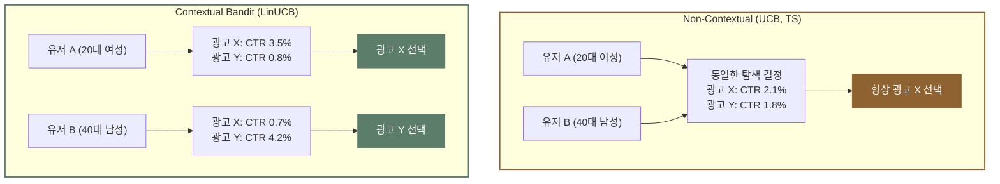
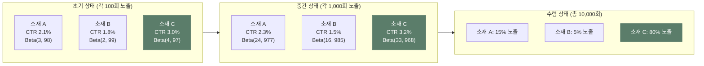
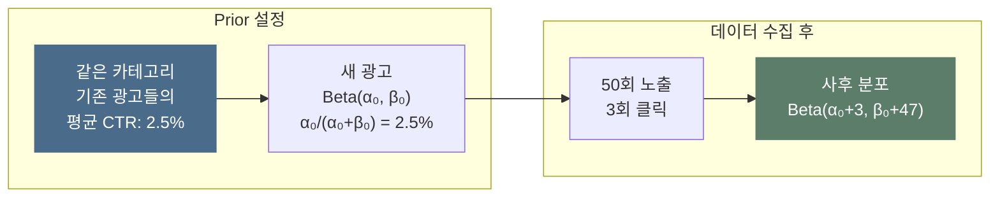
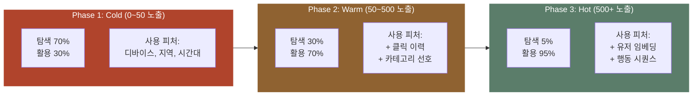
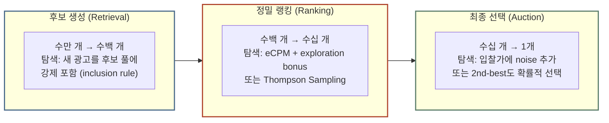

광고 시스템은 매 순간 선택의 기로에 놓입니다. **지금까지 가장 잘 되는 광고를 계속 보여줄 것인가(Exploitation)? 아니면 아직 데이터가 부족한 새 광고에 기회를 줄 것인가(Exploration)?**

Exploitation만 하면 단기 수익은 안정적이지만, 더 좋은 광고를 영원히 발견하지 못합니다. Exploration만 하면 데이터는 쌓이지만, 성과가 낮은 광고에 예산을 낭비합니다. 이 긴장을 **탐색-활용 딜레마(Exploration-Exploitation Dilemma)**라고 부릅니다. 광고 랭킹, 소재 최적화, 오디언스 확장, 캠페인 초기 학습 등 광고 시스템 전반에 걸친 근본적 문제입니다.

이 글은 먼저 딜레마의 본질을 비유로 설명합니다. 그다음 탐색에 실제로 얼마나 비용이 드는지 원화로 계산해 봅니다. 이어서 실무에서 가장 까다로운 **Cold-Start 문제**의 해법을 다룹니다. 마지막으로 알고리즘만으로는 안 풀리는 조직·리스크 차원의 한계까지 짚습니다.

> 개별 알고리즘의 수학적 상세는 이 글의 범위가 아닙니다. 전체 계보는 [멀티암드 밴딧: 알고리즘 계보 지도](post.html?id=mab-summary)가 담당합니다. 이 글은 그 알고리즘들이 왜 필요해졌는지와, 알고리즘만으로는 안 풀리는 부분을 다룹니다.

> **골라 읽는 법** — 절이 8개인 긴 글입니다. 처음부터 다 읽지 않아도 됩니다.
>
> - 딜레마가 뭔지만 → 1~2절
> - 알고리즘 계보만 → 3절
> - 광고에 어떻게 적용하는지만 → 4~5절
> - 프로덕션 설계만 → 6절

---
## 1. 핵심 비교 (Executive Summary)

**여섯 전략은 결국 "탐색을 얼마나, 어떻게 할 것인가"라는 같은 질문에 대한 서로 다른 답입니다.** 아래 표는 그 답을 한눈에 비교합니다. 각 전략의 수식과 구현은 이 글의 범위가 아닙니다. 뒤에 나오는 형제 글들이 하나씩 전담합니다.

| 전략 | 탐색 방식 | 컨텍스트 활용 | 수렴 속도 | 구현 복잡도 | 광고 시스템 적합도 |
|------|----------|-------------|----------|-----------|-----------------|
| **Greedy** | 탐색 없음 (순수 활용) | X | - | 매우 낮음 | 부적합 (학습 불가) |
| **Epsilon-Greedy** | 확률 $\epsilon$로 랜덤 탐색 | X | 느림 | 낮음 | 프로토타입 수준 |
| **UCB1** | 불확실성 상한으로 탐색 | X | 중간 | 낮음 | 기본 베이스라인 |
| **Thompson Sampling** | 사후 분포에서 샘플링 | X | 빠름 | 중간 | 소규모 A/B 대체 |
| **LinUCB** | 컨텍스트 기반 불확실성 | O | 빠름 | 높음 | 프로덕션 추천 |
| **Neural Bandit** | 딥 네트워크 + 탐색 | O | 빠름 | 매우 높음 | 대규모 시스템 |

표를 읽는 순서는 왼쪽에서 오른쪽입니다. 위로 갈수록 탐색이 원시적입니다. 아래로 갈수록 정교합니다. Greedy는 탐색을 아예 안 해서 논외이고, Epsilon-Greedy부터가 진짜 시작점입니다.

여기서 중요한 건 순서가 아니라 **"복잡도가 올라간다고 항상 더 좋은 건 아니다"**라는 점입니다. Neural Bandit은 구현 복잡도가 가장 높습니다. 하지만 트래픽이 작은 캠페인에는 오히려 과합니다. 학습할 데이터 자체가 부족하면 복잡한 모델은 오히려 불안정하게 수렴합니다. 어떤 전략을 쓸지는 소재 수·트래픽 규모·컨텍스트 데이터 유무로 정해집니다. 이 판단 기준은 뒤에 나오는 '탐색 비용을 원화로 환산하면'에서 더 다룹니다. A/B 테스트와의 결정 기준 비교는 [A/B 테스트 vs 멀티암드 밴딧](post.html?id=ab-test-vs-mab)을 참고하세요.

표를 직접 검증하려면 [멀티암드 밴딧: 알고리즘 계보 지도](post.html?id=mab-summary)를 보세요. 이 글에서는 표 대신, **탐색이라는 행위 자체에 실제로 얼마나 돈이 드는지**를 계산합니다.

---

## 2. 탐색-활용 딜레마의 본질

### 왜 딜레마인가?

가장 직관적인 예시는 **식당 선택**입니다:

- **Exploitation**: 항상 가장 좋아하는 단골집에 간다 → 만족도가 안정적이지만, 숨은 맛집을 놓친다
- **Exploration**: 매일 새로운 식당에 간다 → 맛집을 발견할 수 있지만, 대부분의 식사가 실망스럽다

광고 시스템으로 바꾸면:

- **Exploitation**: CTR이 가장 높은 광고만 계속 노출 → 단기 eCPM 극대화, 하지만 새 광고의 잠재력을 평가할 기회가 없음
- **Exploration**: 데이터가 부족한 광고에도 노출 기회 부여 → 장기적으로 더 좋은 광고를 발견할 수 있지만, 단기 수익 감소

핵심은 **정보의 가치(Value of Information)**입니다. 탐색은 단기적으로 비용이지만, 그로 인해 얻는 정보가 미래의 더 나은 의사결정을 가능하게 합니다.

### 수학적 정의: Regret

탐색-활용 전략의 성능은 **Regret(후회)**으로 측정합니다.

$$R_T = \sum_{t=1}^{T} \left( \mu^* - \mu_{a_t} \right)$$

- $T$: 총 라운드 수 (= 총 광고 노출 수)
- $\mu^*$: 최적 arm(= 최고 CTR 광고)의 기대 보상
- $\mu_{a_t}$: 시점 $t$에서 선택한 arm의 기대 보상
- $R_T$: 최적 전략 대비 누적 손실

좋은 탐색 전략은 **sublinear regret** ($R_T = O(\sqrt{T \log T})$ 등)을 달성합니다. 즉, 시간이 지날수록 최적 전략에 수렴합니다.

### 광고 시스템에서 Regret의 의미

광고에서 Regret은 곧 **매출 손실**입니다.

| Regret 원인 | 시나리오 | 비용 |
|------------|---------|------|
| **과소 탐색** | CTR 5%인 신규 광고를 발견하지 못하고, CTR 2%인 기존 광고만 노출 | 노출당 3%pCTR 차이 × 전환 가치 |
| **과다 탐색** | CTR 0.1%인 저품질 광고에 1만 회 노출 | 1만 회 × (최적 CTR - 0.1%) × 전환 가치 |
| **탐색 지연** | 새 광고의 잠재력을 파악하는 데 10만 회 필요 (비효율적 탐색) | 10만 회의 학습 비용 |

---

## 3. 탐색 전략의 진화: Random에서 Context-Aware까지

### ① Epsilon-Greedy: 가장 단순한 탐색

```
매 노출 시:
  확률 (1-ε): 현재 최고 CTR 광고를 노출 (Exploitation)
  확률 ε:     랜덤으로 광고를 선택 (Exploration)
```

**장점**: 구현이 극도로 간단 (난수 하나면 됨)

**한계**:
- 탐색이 **무차별적**: 이미 충분히 탐색한 광고와 전혀 데이터가 없는 광고를 동일 확률로 선택
- $\epsilon$ 설정이 어려움: 너무 크면 수익 손실, 너무 작으면 학습 부족
- 시간이 지나도 탐색 비율이 줄지 않음 (decaying $\epsilon$으로 완화 가능하지만 근본적 해결은 아님)

**광고 실무**: 프로토타입이나 A/B 테스트 대체 수준. 프로덕션에서는 거의 사용하지 않음.

### ② UCB (Upper Confidence Bound): 불확실성 기반 탐색

UCB의 핵심 아이디어는 **"불확실한 것에 낙관적으로 행동하라(Optimism in the Face of Uncertainty)"**입니다.

$$a_t = \arg\max_a \left[ \underbrace{\hat{\mu}_a}_{\text{현재 추정 CTR}} + \underbrace{c \sqrt{\frac{\ln t}{N_a}}}_{\text{불확실성 보너스}} \right]$$

- $\hat{\mu}_a$: 광고 $a$의 현재 추정 CTR (평균 보상)
- $N_a$: 광고 $a$가 노출된 횟수
- $c$: 탐색 강도 파라미터

**직관**: 노출이 적은 광고($N_a$가 작음)는 불확실성 보너스가 크므로 선택될 확률이 높아집니다. 노출이 쌓이면 보너스가 줄어들고, 추정 CTR 자체의 정확도가 올라갑니다.

**Epsilon-Greedy 대비 장점**:
- **적응적 탐색**: 데이터가 부족한 광고를 자동으로 더 탐색
- **수렴 보장**: $O(\sqrt{T \log T})$ regret bound

**한계**:
- 컨텍스트(유저, 지면, 시간대)를 활용하지 못함
- 모든 유저에게 같은 탐색 결정을 내림

> UCB의 상세 분석은 [UCB vs Thompson Sampling](post.html?id=ucb-vs-ts)을 참고하세요.

<div class="demo-embed-wrap">
<iframe class="demo-embed" src="demo-ucb1.html?embed=1" height="560" loading="lazy" title="UCB1 미니 데모"></iframe>
<a class="demo-embed-open" href="demo-ucb1.html" target="_blank" rel="noopener">↗ 전체 데모로 열기 (가이드 투어 포함)</a>
</div>

UCB가 "덜 써 본 것에 가산점을 준다"는 걸 손으로 확인하는 데모입니다. 노출을 쌓아 보면 **신뢰구간이 좁아지면서 가산점이 줄어드는 모습**이 보이고, 그래서 초반에는 골고루 시도하다 나중에 한쪽으로 쏠립니다.

### ③ Thompson Sampling: 확률적 탐색

Thompson Sampling은 **"각 arm의 보상 분포에서 샘플을 뽑아, 샘플이 가장 큰 arm을 선택"**합니다.

$$\theta_a \sim \text{Beta}(\alpha_a, \beta_a), \quad a_t = \arg\max_a \theta_a$$

- $\alpha_a$: 광고 $a$의 클릭 수 + 1
- $\beta_a$: 광고 $a$의 비클릭 수 + 1
- $\text{Beta}(\alpha, \beta)$: 사후 분포

**직관**: 데이터가 적은 광고는 Beta 분포가 넓게 퍼져있어 높은 샘플이 뽑힐 확률이 있습니다(= 탐색). 데이터가 쌓이면 분포가 좁아져 실제 CTR 근처에서만 샘플링됩니다(= 활용).

**UCB 대비 장점**:
- 경험적으로 더 빠르게 수렴 (특히 arm 수가 많을 때)
- **확률적 탐색**: 같은 상태에서도 매번 다른 arm을 선택할 수 있어, 탐색이 자연스럽게 다양화됨
- 배치(batch) 환경에서도 잘 동작

**한계**: UCB와 마찬가지로 컨텍스트 미활용

> 상세 비교는 [Standard TS vs Linear TS](post.html?id=TS-linTS)를 참고하세요.

### ④ Contextual Bandit: 컨텍스트를 활용한 개인화 탐색

실제 광고 시스템에서는 **모든 유저에게 같은 광고가 최적이지 않습니다**. 20대 여성에게는 패션 광고가, 40대 남성에게는 자동차 광고가 더 높은 CTR을 보입니다. Contextual Bandit은 유저/지면/시간 등의 **컨텍스트 피처**를 반영하여 탐색합니다.

대표 알고리즘은 **LinUCB**입니다.

$$a_t = \arg\max_a \left[ \underbrace{x_t^T \hat{\theta}_a}_{\text{컨텍스트 기반 CTR 추정}} + \underbrace{\alpha \sqrt{x_t^T A_a^{-1} x_t}}_{\text{컨텍스트 의존 불확실성}} \right]$$

- $x_t$: 현재 컨텍스트 피처 벡터 (유저 특성, 지면 특성, 시간대 등)
- $\hat{\theta}_a$: 광고 $a$의 학습된 파라미터 벡터
- $A_a$: 광고 $a$의 공분산 행렬 (불확실성 정보 저장)

**핵심 차이**: 불확실성 보너스가 **컨텍스트에 따라 달라집니다**. 특정 유저-광고 조합에 대해 데이터가 부족하면 그 조합의 불확실성이 크므로 탐색하고, 이미 충분한 데이터가 있으면 활용합니다.


```mermaid
graph TB
    subgraph NonContextual["Non-Contextual (UCB, TS)"]
        NC_USER1["유저 A (20대 여성)"] --> NC_DECIDE["동일한 탐색 결정<br/>광고 X: CTR 2.1%<br/>광고 Y: CTR 1.8%"]
        NC_USER2["유저 B (40대 남성)"] --> NC_DECIDE
        NC_DECIDE --> NC_RESULT["항상 광고 X 선택"]
    end

    subgraph Contextual["Contextual Bandit (LinUCB)"]
        C_USER1["유저 A (20대 여성)"] --> C_DECIDE1["광고 X: CTR 3.5%<br/>광고 Y: CTR 0.8%"]
        C_USER2["유저 B (40대 남성)"] --> C_DECIDE2["광고 X: CTR 0.7%<br/>광고 Y: CTR 4.2%"]
        C_DECIDE1 --> C_RESULT1["광고 X 선택"]
        C_DECIDE2 --> C_RESULT2["광고 Y 선택"]
    end

    style NonContextual stroke:#8f6231,stroke-width:2px
    style Contextual stroke:#5b7d6a,stroke-width:2px
    style NC_RESULT fill:#8f6231,stroke:#8f6231,color:#fff
    style C_RESULT1 fill:#5b7d6a,stroke:#5b7d6a,color:#fff
    style C_RESULT2 fill:#5b7d6a,stroke:#5b7d6a,color:#fff
```

> 수학적 상세 해석은 [Disjoint LinUCB 모델 상세 해석](post.html?id=disjoint-linucb)을 보세요.

---

## 4. 광고 시스템에서의 탐색 적용 영역

탐색-활용 문제는 광고 시스템의 **여러 계층**에서 동시에 발생합니다.

| 적용 영역 | Arm (선택지) | 보상 | 탐색의 의미 | 대표 접근 |
|----------|------------|------|-----------|----------|
| **광고 랭킹** | 후보 광고 풀 | 클릭/전환 | 새 광고에 노출 기회 부여 | LinUCB, Neural Bandit |
| **소재 최적화** | 동일 광고의 소재 변형 (A/B/C) | CTR | 어떤 소재가 가장 효과적인지 학습 | Thompson Sampling |
| **오디언스 확장** | 타겟팅 세그먼트 | 전환율 | 새로운 유저 세그먼트 탐색 | Epsilon-Greedy, UCB |
| **입찰 전략** | Bid Shading 비율 | Surplus | 최적 Shading 비율 탐색 | Bayesian Optimization |
| **캠페인 초기 학습** | 지면 x 시간대 조합 | CPA | 어떤 조합이 효율적인지 탐색 | Contextual Bandit |

### 소재 최적화 예시: Thompson Sampling 적용

광고주가 3개의 배너 소재(A, B, C)를 등록했다고 가정합니다.


```mermaid
graph LR
    subgraph Initial["초기 상태 (각 100회 노출)"]
        A1["소재 A<br/>CTR 2.1%<br/>Beta(3, 98)"]
        B1["소재 B<br/>CTR 1.8%<br/>Beta(2, 99)"]
        C1["소재 C<br/>CTR 3.0%<br/>Beta(4, 97)"]
    end

    subgraph Mid["중간 상태 (각 1,000회 노출)"]
        A2["소재 A<br/>CTR 2.3%<br/>Beta(24, 977)"]
        B2["소재 B<br/>CTR 1.5%<br/>Beta(16, 985)"]
        C2["소재 C<br/>CTR 3.2%<br/>Beta(33, 968)"]
    end

    subgraph Final["수렴 상태 (총 10,000회)"]
        A3["소재 A: 15% 노출"]
        B3["소재 B: 5% 노출"]
        C3["소재 C: 80% 노출"]
    end

    Initial --> Mid --> Final

    style C1 fill:#5b7d6a,stroke:#5b7d6a,color:#fff
    style C2 fill:#5b7d6a,stroke:#5b7d6a,color:#fff
    style C3 fill:#5b7d6a,stroke:#5b7d6a,color:#fff
```

Thompson Sampling은 자동으로 다음 순서를 따릅니다.
1. **초기**: 세 소재에 비슷한 비율로 노출 (Beta 분포가 넓어서 역전 가능)
2. **중간**: 소재 C에 점점 더 많은 노출 집중, B는 감소
3. **수렴**: 소재 C가 80% 이상의 노출을 차지, A/B는 소량의 탐색만 유지

A/B 테스트처럼 "50:50으로 나눠서 N일 기다리기"가 아니라, **데이터가 쌓이는 대로 실시간으로 트래픽을 최적 소재에 집중**합니다. 이것이 Bandit 기반 최적화의 핵심 장점입니다.

---

## 5. Cold-Start 문제: 데이터가 없을 때 어떻게 탐색하는가

탐색-활용 딜레마가 가장 극단적으로 나타나는 것이 **Cold-Start**입니다. 새 광고, 새 유저, 새 지면이 시스템에 들어왔을 때, 과거 데이터가 전혀 없는 상태에서 어떤 결정을 내려야 하는가?

### Cold-Start의 유형

| 유형 | 상황 | 문제 | 빈도 |
|------|------|------|------|
| **New Ad (Item Cold-Start)** | 새 광고/소재가 등록됨 | pCTR 추정 불가, 노출 기회를 줄지 말지 결정 불가 | 매일 수천~수만 건 |
| **New User (User Cold-Start)** | 새 유저가 첫 방문 | 유저 선호도 정보 없음, 개인화 불가 | 전체 트래픽의 10~30% |
| **New Publisher (Context Cold-Start)** | 새 지면/앱이 연동됨 | 지면 품질과 유저 특성 미파악 | 주 단위 |

### New Ad Cold-Start 해법

새 광고가 들어왔을 때 pCTR = 0이면 어떻게 될까요? [eCPM 랭킹](post.html?id=ecpm-ranking)에서 영원히 0점을 받습니다. 그러면 노출 기회를 얻지 못합니다. 이를 해결하는 전략들:

#### ① Exploration Bonus (탐색 보너스)

가장 직관적인 방법. 새 광고의 eCPM에 보너스를 추가하여 강제로 노출 기회를 부여합니다.

$$\text{Score}_a = \underbrace{\text{eCPM}_a}_{\text{추정 가치}} + \underbrace{\gamma \cdot \frac{1}{\sqrt{N_a + 1}}}_{\text{탐색 보너스}}$$

- $N_a$: 광고 $a$의 누적 노출 수
- $\gamma$: 탐색 강도 하이퍼파라미터
- $N_a = 0$이면 보너스가 최대 → 새 광고가 노출 기회를 얻음
- $N_a$가 충분히 쌓이면 보너스 → 0 → 순수 eCPM 기반 경쟁

**장점**: 구현이 간단, UCB와 본질적으로 동일  
**한계**: $\gamma$ 튜닝이 필요, 보너스가 너무 크면 저품질 광고가 과도하게 노출

#### ② Prior 기반 초기화 (Bayesian Approach)

Thompson Sampling을 사용할 때, 새 광고의 사전 분포(Prior)를 **카테고리 평균**으로 초기화합니다.


```mermaid
graph LR
    subgraph Prior["Prior 설정"]
        CAT["같은 카테고리<br/>기존 광고들의<br/>평균 CTR: 2.5%"]
        NEW["새 광고<br/>Beta(α₀, β₀)<br/>α₀/(α₀+β₀) = 2.5%"]
        CAT --> NEW
    end

    subgraph Update["데이터 수집 후"]
        DATA["50회 노출<br/>3회 클릭"]
        POSTERIOR["사후 분포<br/>Beta(α₀+3, β₀+47)"]
        NEW --> DATA
        DATA --> POSTERIOR
    end

    style CAT fill:#4a6b8a,stroke:#4a6b8a,color:#fff
    style POSTERIOR fill:#5b7d6a,stroke:#5b7d6a,color:#fff
```

- **Uninformative Prior** $\text{Beta}(1, 1)$: 아무 정보 없음 → 수렴이 느림
- **Informative Prior** $\text{Beta}(\alpha_0, \beta_0)$: 카테고리/광고주 과거 실적 기반 → 합리적 초기 추정

Prior의 강도($\alpha_0 + \beta_0$)가 "사전 지식에 대한 확신"을 나타냅니다. 값이 크면 데이터가 많이 필요해야 Prior를 극복할 수 있고, 작으면 소량의 데이터로도 빠르게 업데이트됩니다.

#### ③ Feature Transfer (피처 기반 일반화)

Contextual Bandit이나 [Deep CTR 모델](post.html?id=deep-ctr-models)의 강점이 여기서 발휘됩니다. 새 광고 자체의 클릭 데이터는 없지만, **광고의 피처(카테고리, 광고주, 소재 유형, 랜딩 페이지 도메인 등)**는 있습니다.

LinUCB나 DNN 모델은 피처 공간에서 학습합니다.
- 새 광고의 피처가 기존 고성과 광고와 유사하면 → 높은 초기 CTR 추정
- 전혀 새로운 피처 조합이면 → 불확실성이 높으므로 탐색 우선

그래서 이것이 **Cold-Start에서 Contextual Bandit이 Non-Contextual 방법보다 근본적으로 유리한 이유**입니다.

#### ④ 비교 테이블

| 해법 | 필요 정보 | 수렴 속도 | 구현 복잡도 | 적합 상황 |
|------|----------|----------|-----------|----------|
| **Exploration Bonus** | 노출 횟수만 | 느림 | 낮음 | 간단한 시스템, 빠른 적용 |
| **Informative Prior** | 카테고리/광고주 통계 | 중간 | 중간 | TS 기반 시스템 |
| **Feature Transfer** | 광고 피처 벡터 | 빠름 | 높음 | Contextual Bandit/DNN 기반 시스템 |
| **Hybrid (Prior + Feature)** | 둘 다 | 가장 빠름 | 높음 | 대규모 프로덕션 시스템 |

### New User Cold-Start 해법

새 유저의 경우, 개인화된 CTR 예측이 불가능합니다. 실무에서 흔히 쓰는 전략:

**① Population Fallback**: 개인 데이터가 없으면 전체 유저 평균(또는 세그먼트 평균) CTR로 대체. 유저 행동이 쌓이면 점진적으로 개인화 모델로 전환.

**② Feature Hierarchy**: 유저 ID 임베딩은 사용 불가하지만, 디바이스, OS, 지역, 시간대 같은 **익명 피처**는 첫 요청에서도 사용 가능. 이 피처들로 "대략적 개인화" 수행.

**③ Exploration Phase**: 새 유저의 처음 N회 노출은 탐색 비율을 높여서 유저의 관심사를 빠르게 학습. N회 이후 exploitation 비중 증가.


```mermaid
graph LR
    subgraph Phase1["Phase 1: Cold (0~50 노출)"]
        P1_E["탐색 70%<br/>활용 30%"]
        P1_F["사용 피처:<br/>디바이스, 지역, 시간대"]
    end

    subgraph Phase2["Phase 2: Warm (50~500 노출)"]
        P2_E["탐색 30%<br/>활용 70%"]
        P2_F["사용 피처:<br/>+ 클릭 이력<br/>+ 카테고리 선호"]
    end

    subgraph Phase3["Phase 3: Hot (500+ 노출)"]
        P3_E["탐색 5%<br/>활용 95%"]
        P3_F["사용 피처:<br/>+ 유저 임베딩<br/>+ 행동 시퀀스"]
    end

    Phase1 --> Phase2 --> Phase3

    style Phase1 fill:#b0442c,stroke:#b0442c,color:#fff
    style Phase2 fill:#8f6231,stroke:#8f6231,color:#fff
    style Phase3 fill:#5b7d6a,stroke:#5b7d6a,color:#fff
```

---

## 6. 프로덕션 탐색 시스템 설계

### 탐색 예산(Exploration Budget) 관리

실무에서 탐색은 **무제한이 아닙니다**. 광고주의 예산을 탐색에 사용하는 것이므로, 탐색 비용을 관리해야 합니다.

| 제약 | 설명 | 대응 |
|------|------|------|
| **광고주 기대** | 광고주는 ROI를 기대하지, 탐색 비용을 내고 싶지 않음 | 탐색 비용을 플랫폼이 부담하거나, 전체 캠페인 성과에 포함 |
| **예산 제약** | 일 예산 $100에서 탐색에 $30을 쓸 수 없음 | 탐색 비율 상한(cap) 설정: 예산의 5~15% |
| **품질 제약** | 극도로 낮은 CTR 광고에 탐색 노출은 UX 저하 | 최소 품질 기준(pCTR floor) 미달 시 탐색 제외 |

### 탐색 비용을 원화로 환산하면

**"탐색 비율 상한을 예산의 5~15%로 잡는다"는 위 대응이 어디서 나온 숫자인지 계산해 보겠습니다.** 신규 소재 하나가 진짜 좋은지 나쁜지 알려면 노출을 얼마나 줘야 할까요. 그 노출 동안 소재가 나쁘면 얼마를 손해 볼까요. 반대로 아예 안 줘 보면 얼마를 놓칠까요. 세 질문에 숫자로 답하면 "탐색 비율 5~15%"가 감이 아니라 계산이 됩니다.

기준선을 하나 잡습니다. 지금 CTR 2.0%짜리 소재를 쓰고 있고, 클릭 1회의 가치는 500원이라고 합시다. 신규 소재가 이 기준보다 몇 % 더 좋은지 확인하려는 상황을 6가지로 나눠 계산했습니다.

| 검증하려는 향상폭 | 신규 소재 CTR | 필요한 최소 노출수(arm당) | 열세로 판명 시 탐색 비용(최악) | 안 해봤을 때 연간 기회비용 |
|---|---|---|---|---|
| 10% | 2.2% | 80,679회 | 80,679원 | 12,000,000원 |
| 20% | 2.4% | 21,106회 | 42,211원 | 24,000,000원 |
| 30% | 2.6% | 9,795회 | 29,384원 | 36,000,000원 |
| 50% | 3.0% | 3,822회 | 19,112원 | 60,000,000원 |
| 100% | 4.0% | 1,138회 | 11,381원 | 120,000,000원 |
| 200% | 6.0% | 373회 | 7,456원 | 240,000,000원 |

아래 코드는 표준 라이브러리만 쓰고, 위 표를 그대로 재현합니다.

```python
# 신규 소재 하나를 '검증'하는 데 필요한 최소 노출수와, 그 탐색의 비용을 계산한다.
# 표준 라이브러리만 사용한다 (statistics.NormalDist는 3.8+ 표준 라이브러리).
from statistics import NormalDist

BASE_CTR = 0.020                  # 지금 쓰고 있는 소재의 CTR (검증 기준선)
CPC = 500                         # 클릭 1회의 가치(원) - 이 절 전체에서 통일해서 쓴다
CONFIDENCE = 0.95                 # 95% 신뢰수준(양측 검정)
POWER = 0.80                      # 80% 검정력
MONTHLY_IMPRESSIONS = 1_000_000   # 이 지면/캠페인의 월간 노출 규모

z_a = NormalDist().inv_cdf(1 - (1 - CONFIDENCE) / 2)   # 신뢰수준 → z값 (약 1.96)
z_b = NormalDist().inv_cdf(POWER)                       # 검정력 → z값 (약 0.84)

def required_n(p1, p2):
    """두 CTR(p1, p2) 차이를 통계적으로 검출하는 데 필요한 표본 수(arm당). 2-표본 비율 검정 공식."""
    pooled_var = p1 * (1 - p1) + p2 * (1 - p2)
    return (z_a + z_b) ** 2 * pooled_var / (p2 - p1) ** 2

print(f"{'검증 향상폭':>8} {'신규 CTR':>8} {'필요노출/arm':>12} {'탐색비용(최악)':>13} {'미탐색 기회비용/년':>17}")
for lift in [0.10, 0.20, 0.30, 0.50, 1.00, 2.00]:      # 검증하려는 상대 향상폭(10%~200%)
    p2 = BASE_CTR * (1 + lift)
    n = required_n(BASE_CTR, p2)
    delta = p2 - BASE_CTR
    explore_cost = n * delta * CPC                             # 새 소재가 반대로 그만큼 나쁠 때의 손실
    yearly_opportunity_cost = delta * MONTHLY_IMPRESSIONS * 12 * CPC   # 진짜 승자인데 평생 안 써봤을 때
    print(f"{lift:>7.0%} {p2:>7.1%} {n:>12,.0f} {explore_cost:>12,.0f}원 {yearly_opportunity_cost:>16,.0f}원")

# 출력:
#   검증 향상폭   신규 CTR     필요노출/arm      탐색비용(최악)        미탐색 기회비용/년
#     10%    2.2%       80,679       80,679원       12,000,000원
#     20%    2.4%       21,106       42,211원       24,000,000원
#     30%    2.6%        9,795       29,384원       36,000,000원
#     50%    3.0%        3,822       19,112원       60,000,000원
#    100%    4.0%        1,138       11,381원      120,000,000원
#    200%    6.0%          373        7,456원      240,000,000원
```

표를 읽으면 두 가지가 한눈에 보입니다.

첫째, **작은 향상을 확인하려면 노출이 폭발적으로 많이 필요합니다.** 10% 향상을 확인하는 데는 arm당 80,679회가 있어야 합니다. 200% 향상(3배 좋은 소재)은 373회면 충분합니다. 차이가 큰 소재는 금방 티가 나고, 차이가 작은 소재는 오래 지켜봐야 압니다.

둘째, **탐색 비용은 유한하지만, 안 해봤을 때의 기회비용은 훨씬 큽니다.** 50% 향상 케이스를 보면, 그 소재가 반대로 나쁠 경우의 손실은 19,112원입니다. 반면 진짜 좋은 소재였는데 1년 내내 안 써본 기회비용은 6천만원입니다. 최악의 경우를 가정해도 탐색이 훨씬 싸게 먹힙니다.

다만 이 계산에는 숨은 전제가 하나 있습니다. **노출은 공짜로 쌓이지 않습니다.** 하루 노출 규모가 33,333회이고 그중 10%를 탐색에 쓴다면, 하루에 모이는 탐색 표본은 3,333회입니다. 10% 향상을 확인하는 데 필요한 80,679회를 모으려면 약 24일이 걸립니다. 반면 50% 향상 확인에 필요한 3,822회는 하루 만에 모입니다. 작은 개선을 검증하는 데는 시간이 오래 걸린다는 뜻입니다. 그 시간 동안 소재의 실제 성과가 그대로일 거라는 보장은 없습니다.

### 탐색 비율을 얼마로 잡을까 — 시뮬레이션으로 보기

**탐색을 많이 할수록 좋은 소재를 더 잘 찾습니다. 그런데 수익까지 항상 같이 오르는 건 아닙니다.** 탐색 비율 0%(첫 한 바퀴만 돌고 고정)·5%·20%·50%를 비교합니다. 같은 조건에서 3,000회 노출씩 300번 반복해 평균을 냈습니다.

```python
# 탐색 비율(엡실론) 0% / 5% / 20% / 50%를 같은 조건에서 비교한다.
# 각각 평균 수익과 '진짜 좋은 소재를 찾아낼 확률'이 어떻게 달라지는지 본다.
import random

CPC = 500                 # 클릭 1회의 가치(원) - 위 표와 같은 단위
TRUE_CTR = {"A": 0.020, "B": 0.021, "C": 0.018, "D": 0.032, "E": 0.015}  # D가 숨은 1등
ARMS = list(TRUE_CTR)
BEST = max(ARMS, key=lambda a: TRUE_CTR[a])
T = 3000                  # 소재 1세트가 서비스되는 동안의 노출 수
REPEATS = 300              # 같은 실험을 300번 반복해 '확률'을 추정한다

def run_once(epsilon, rng):
    counts = {a: 0 for a in ARMS}
    sums = {a: 0 for a in ARMS}
    clicks = 0
    for t in range(T):
        unseen = [a for a in ARMS if counts[a] == 0]
        if unseen:
            arm = unseen[0]                                     # 처음엔 하나씩 돌아가며 찔러본다
        elif rng.random() < epsilon:
            arm = rng.choice(ARMS)                               # 탐색: 무작위 소재
        else:
            arm = max(ARMS, key=lambda a: sums[a] / counts[a])   # 활용: 지금까지 1등
        reward = 1 if rng.random() < TRUE_CTR[arm] else 0
        counts[arm] += 1
        sums[arm] += reward
        clicks += reward
    believed_best = max(ARMS, key=lambda a: sums[a] / counts[a] if counts[a] else 0)
    return clicks, believed_best == BEST

master = random.Random(7)
print(f"진짜 1등: {BEST} (CTR {TRUE_CTR[BEST]:.1%}) · 노출 {T:,}회 x {REPEATS}회 반복 평균\n")
print(f"{'탐색비율':>8} {'평균수익':>12} {'좋은 소재 발견확률':>18}")
for epsilon in [0.0, 0.05, 0.2, 0.5]:
    total_clicks = 0
    found = 0
    for _ in range(REPEATS):
        rng = random.Random(master.randrange(10**9))
        clicks, ok = run_once(epsilon, rng)
        total_clicks += clicks
        found += ok
    avg_revenue = total_clicks / REPEATS * CPC
    print(f"{epsilon:>7.0%} {avg_revenue:>11,.0f}원 {found/REPEATS:>17.1%}")

# 출력:
# 진짜 1등: D (CTR 3.2%) · 노출 3,000회 x 300회 반복 평균
#
#     탐색비율         평균수익         좋은 소재 발견확률
#      0%      30,085원              2.3%
#      5%      33,865원             40.7%
#     20%      37,303원             74.3%
#     50%      36,415원             80.0%
```

**20%에서 수익이 가장 높고, 50%에서는 오히려 떨어집니다.** 발견 확률은 50%가 80.0%로 제일 높지만, 수익은 20%(37,303원)가 50%(36,415원)보다 좋습니다. 이미 좋은 소재를 찾은 뒤에도 계속 절반을 낭비하기 때문입니다. 탐색은 "많이 할수록 좋다"가 아니라 "필요한 만큼만 하는 게 좋다"는 뜻입니다.

그런데 "필요한 만큼"이 상황마다 다릅니다. 소재가 몇 개인지, 트래픽이 얼마나 큰지, 소재 수명이 얼마나 긴지에 따라 최적 탐색 비율 자체가 움직입니다. 세 요인을 하나씩 바꿔가며 확인했습니다.

```python
# 최적 탐색 비율은 고정된 값이 아니라 상황에 따라 달라진다.
# 소재 수 · 트래픽 규모 · 소재 수명 세 요인을 하나씩 바꿔가며,
# 후보 엡실론 중 어떤 값이 평균 수익을 최대화하는지 찾는다.
import random

CPC = 500
CANDIDATES = [0.0, 0.05, 0.1, 0.2, 0.35, 0.5]   # 후보 탐색 비율
REPEATS = 60

def run_once(rng, k, t_total, epsilon, lifetime):
    ctr = [0.02] * k
    ctr[rng.randrange(k)] = 0.03            # k개 중 1개만 CTR 50% 높은 '숨은 1등'
    counts = [0] * k
    sums = [0.0] * k
    clicks = 0
    for t in range(t_total):
        if lifetime and t > 0 and t % lifetime == 0:
            ctr = [0.02] * k                # 소재 수명 만료 - 승자가 다른 소재로 바뀐다(비정상성)
            ctr[rng.randrange(k)] = 0.03
        if 0 in counts:
            arm = counts.index(0)
        elif rng.random() < epsilon:
            arm = rng.randrange(k)
        else:
            means = [sums[i] / counts[i] for i in range(k)]
            arm = means.index(max(means))
        reward = 1 if rng.random() < ctr[arm] else 0
        counts[arm] += 1
        sums[arm] += reward
        clicks += reward
    return clicks * CPC

def best_epsilon(k, t_total, lifetime, seed):
    master = random.Random(seed)
    scored = []
    for epsilon in CANDIDATES:
        total = 0.0
        for _ in range(REPEATS):
            rng = random.Random(master.randrange(10**9))
            total += run_once(rng, k, t_total, epsilon, lifetime)
        scored.append((epsilon, total / REPEATS))
    return max(scored, key=lambda x: x[1]), scored

scenarios = [
    ("소재 3개",                 dict(k=3,  t_total=3000,  lifetime=None), 1),
    ("소재 20개",                dict(k=20, t_total=3000,  lifetime=None), 2),
    ("트래픽 소규모(500회)",       dict(k=5,  t_total=500,   lifetime=None), 3),
    ("트래픽 대규모(20,000회)",    dict(k=5,  t_total=20000, lifetime=None), 4),
    ("소재 수명 김(사실상 무한)",   dict(k=5,  t_total=3000,  lifetime=None), 5),
    ("소재 수명 짧음(300회마다 교체)", dict(k=5, t_total=3000, lifetime=300), 6),
]

print(f"{'상황':<24} {'최적 탐색비율':>10} {'그 수익':>12}   {'0% 탐색 대비'}")
for name, params, seed in scenarios:
    (best_eps, best_rev), scored = best_epsilon(seed=seed, **params)
    zero_rev = dict(scored)[0.0]
    lift = (best_rev - zero_rev) / zero_rev
    print(f"{name:<24} {best_eps:>9.0%} {best_rev:>11,.0f}원   {lift:+.0%}")

# 출력:
# 상황                          최적 탐색비율         그 수익   0% 탐색 대비
# 소재 3개                          20%      40,658원   +14%
# 소재 20개                         10%      33,283원   +10%
# 트래픽 소규모(500회)                  50%       5,675원   +2%
# 트래픽 대규모(20,000회)               10%     266,875원   +22%
# 소재 수명 김(사실상 무한)                 5%      35,808원   +11%
# 소재 수명 짧음(300회마다 교체)            20%      33,817원   +3%
```

네 가지가 눈에 띕니다.

소재가 3개면 최적 탐색 비율은 20%였습니다. 소재가 20개로 늘면 10%로 오히려 떨어졌습니다. 무작위로 찔러보는 탐색은 후보가 많을수록 헛스윙이 늘어나기 때문입니다. 후보가 많으면 필요한 건 탐색량 자체가 아니라 [똑똑하게 찔러보는 방법](post.html?id=ucb-family)입니다.

트래픽이 작으면(500회) 탐색 비율을 올려도 이득이 크지 않았습니다. 배울 기회 자체가 적어서입니다. 트래픽이 크면(20,000회) 10%만으로 충분했고, 그 이득도 22%로 가장 컸습니다. 오래, 많이 서빙되는 지면일수록 탐색에 쓰는 비율은 낮아도 됩니다.

소재 수명이 길면(사실상 무한) 최적 비율은 5%였습니다. 소재가 300회마다 새로 바뀌면(비정상성) 최적 비율이 20%로 뛰었습니다. 세상이 자주 바뀌면 어제 찾은 답을 오늘도 믿을 수 없어서, 탐색을 계속 반복해야 하기 때문입니다.

네 가지 결과 모두 같은 결론으로 모입니다. **"탐색 비율 5~15%"라는 위 대응은 출발점이지, 정답이 아닙니다.** 소재 수·트래픽·소재 수명이 바뀌면 그 숫자도 다시 계산해야 합니다.

### 담장 안에서는 탐색을 정책으로 통제한다 [무대: 닫힌 생태계]

**네이버·밴드 같은 닫힌 생태계에서는 탐색 비용을 플랫폼이 직접 떠안습니다. 그 대가로 탐색량을 정책으로 세밀하게 조절할 수 있습니다.** 노출을 플랫폼이 직접 배정하기 때문입니다.

위 시뮬레이션이 보여준 게 바로 이 지점입니다. 소재가 3개면 20%가 최적이었습니다. 소재가 20개면 10%가 최적이었습니다. 트래픽이 작으면 얼마를 탐색하든 큰 차이가 없었습니다. 트래픽이 크면 10%만으로도 충분했습니다. 소재 수명이 짧으면 탐색 비율을 다시 올려야 했습니다.

위 시뮬레이션은 "탐색 비율은 5%로 고정한다" 같은 규칙이 왜 위험한지 보여줍니다. 상황마다 최적값이 다른데 하나의 숫자로 밀어붙이면, 어떤 캠페인에서는 탐색이 부족하고 어떤 캠페인에서는 낭비가 됩니다. 닫힌 생태계는 노출을 직접 배정하므로, 캠페인·지면·소재 수명별로 탐색 비율을 각각 다르게 정책화할 수 있습니다. 이 자유도가 담장 안 탐색 설계의 핵심 자산입니다.

물론 정책을 세밀하게 짤 수 있다고 저절로 잘 짜이는 건 아닙니다. 그 정책을 누가 정하고 누가 비용을 감수하는지는 뒤에서 조직의 문제로 다시 다룹니다.

### 열린 경매에서는 탐색 예산을 세우기 자체가 어렵다 [무대: 열린 RTB]

**열린 RTB의 광고주는 위 시뮬레이션 같은 계획을 세우기 어렵습니다. 이겨야만 탐색이 되고, 패찰하면 그 시도 자체가 없었던 일이 되기 때문입니다.**

닫힌 생태계는 노출을 직접 배정합니다. 노출 10,000회를 탐색에 쓰겠다고 정하면 그대로 10,000회가 집행됩니다. 열린 RTB는 다릅니다. 응찰 10,000번을 탐색에 배정해도, 그중 몇 번이나 낙찰될지는 미리 알 수 없습니다. 인기 있는 지면일수록 경쟁이 세서 낙찰률이 낮고, 낙찰률이 낮으면 같은 탐색 예산으로 모을 수 있는 데이터도 줄어듭니다.

위 표의 "필요 노출수"는 낙찰된 노출 기준입니다. 10% 향상을 확인하려면 arm당 80,679회가 있어야 합니다. 닫힌 생태계라면 노출 예산만 정하면 이 숫자에 도달하는 시점을 계산할 수 있습니다. 열린 RTB에서는 응찰을 그만큼 늘려도 낙찰률이 떨어지면 도달 시점이 한없이 늘어집니다. 심지어 캠페인이 끝날 때까지 필요한 표본에 못 미칠 수도 있습니다.

그래서 열린 RTB의 광고주는 탐색 예산을 "노출 수"가 아니라 "응찰 수"로 세울 수밖에 없습니다. 실제로 몇 번이나 탐색이 집행될지는 경매가 끝나야 압니다. 이 불확실성이 닫힌 생태계에는 없는, 열린 RTB만의 추가 비용입니다.

:::deep 더 깊이 — 알고리즘이 못 푸는 탐색 문제: 조직의 인센티브

지금까지 다룬 건 전부 "탐색을 어떻게 할까"였습니다. 그런데 실무에서 더 자주 부딪히는 질문은 "탐색을 왜 안 하려고 하는가"입니다. 알고리즘은 이 질문에 답을 못 줍니다. 이건 조직 구조의 문제이기 때문입니다.

탐색에는 항상 확실한 단기 손실이 있습니다. 위 표의 계산이 그걸 원화로 보여줬습니다. 반면 탐색의 이익은 불확실하고, 나중에, 종종 다른 팀의 성과로 잡힙니다. 이번 분기 매출로 평가받는 담당자 입장에서 이 거래는 밑지는 장사입니다. 20% 탐색을 돌려서 실제로 더 좋은 소재를 찾아도, 그 이익은 다음 분기 숫자에 찍힙니다. 이번 분기 숫자에는 탐색 때문에 깎인 손실만 찍힙니다.

그래서 흔히 벌어지는 일은 이렇습니다. 알고리즘 팀은 탐색 비율 20%가 최적이라고 계산합니다. 그런데 캠페인 운영팀은 5%로 낮춰 달라고 요청합니다. 이번 분기 숫자를 지켜야 하기 때문입니다. 이 조정은 알고리즘 문제가 아닙니다. 누가 탐색의 비용을 지고 누가 탐색의 이익을 가져가는지, 그 배분이 어긋나 있는 조직 문제입니다.

이 문제를 알고리즘으로 풀 수는 없습니다. 대신 실무에서 쓰는 우회로가 있습니다. 탐색 비용을 개별 캠페인이 아니라 플랫폼 전체 예산으로 흡수하는 방법이 하나입니다. 탐색으로 찾은 성과를, 발견 시점의 팀이 아니라 처음 탐색을 실행한 팀의 실적으로 소급 인정하는 회계 규칙도 있습니다. 결국 "탐색 비율을 몇 %로 할까"는 계산의 문제이고, "그 탐색을 누가 감수할까"는 조직의 문제입니다. 후자를 안 풀면 아무리 정교한 알고리즘도 현장에서 5%로 깎여 나갑니다.

브랜드 리스크와 비정상성도 같은 계열의 한계입니다. 브랜드 리스크는 검증 안 된 소재를 실제 사용자에게 보여주는 비용입니다. 비정상성은 어제의 탐색 결과가 오늘은 낡은 정보가 되는 문제입니다. 비정상성의 알고리즘 차원 논의는 [멀티암드 밴딧: 알고리즘 계보 지도](post.html?id=mab-summary)에서 다룹니다. 다만 그 논의는 "확신이 굳어질수록 탐색이 준다"는 알고리즘 내부 메커니즘만 설명합니다. "누가 그 탐색 비용을 감수할 것인가"라는 질문에는 답하지 못합니다. 그 답은 언제나 조직의 몫입니다.
:::

### Multi-Stage에서의 탐색

프로덕션 시스템은 여러 단계를 거치는 **Multi-Stage Ranking**(후보 생성 → 필터링 → 정밀 랭킹)으로 구성됩니다. 자세한 흐름은 [광고 서빙 아키텍처](post.html?id=model-serving-architecture)에서 다뤘습니다. 탐색은 각 단계에서 다르게 적용됩니다.


```mermaid
graph LR
    subgraph Stage1["후보 생성 (Retrieval)"]
        S1["수만 개 → 수백 개<br/>탐색: 새 광고를 후보 풀에<br/>강제 포함 (inclusion rule)"]
    end

    subgraph Stage2["정밀 랭킹 (Ranking)"]
        S2["수백 개 → 수십 개<br/>탐색: eCPM + exploration bonus<br/>또는 Thompson Sampling"]
    end

    subgraph Stage3["최종 선택 (Auction)"]
        S3["수십 개 → 1개<br/>탐색: 입찰가에 noise 추가<br/>또는 2nd-best도 확률적 선택"]
    end

    Stage1 --> Stage2 --> Stage3

    style Stage1 stroke:#4a6b8a,stroke-width:2px
    style Stage2 stroke:#b0442c,stroke-width:2px
    style Stage3 stroke:#5b7d6a,stroke-width:2px
```

핵심 원칙은 간단합니다. 앞 단계에서는 관대하게 판단해 후보를 더 많이 포함합니다. 뒤 단계로 갈수록 정교하게 판단해 Bandit 알고리즘으로 최적 탐색을 합니다.

### 탐색 효과 모니터링

탐색이 실제로 시스템에 기여하는지는 다음 핵심 지표로 측정합니다.

| 지표 | 정의 | 의미 |
|------|------|------|
| **Discovery Rate** | 탐색으로 발견된 고성과 광고의 비율 | 탐색이 실제로 가치를 창출하는가 |
| **Exploration Cost** | 탐색 노출의 평균 eCPM vs 활용 노출의 평균 eCPM | 탐색의 단기 비용 |
| **Time-to-Convergence** | 새 광고가 안정적 CTR 추정에 도달하는 데 필요한 노출 수 | 탐색 효율성 |
| **Long-term Revenue Lift** | 탐색 ON vs OFF의 장기(7일+) 매출 차이 | 탐색의 비즈니스 가치 |

---

## 마무리

1. **탐색-활용 딜레마는 광고 시스템의 근본적 문제** — 단기 수익(exploitation)과 장기 학습(exploration) 사이의 균형이 전체 시스템의 성과를 결정합니다.

2. **전략은 진화한다: Random → Uncertainty-based → Context-aware** — Epsilon-Greedy의 무차별 탐색에서 UCB/TS의 적응적 탐색으로, 다시 LinUCB의 개인화된 탐색으로. 컨텍스트를 활용할수록 탐색 효율이 올라갑니다.

3. **Cold-Start는 탐색 문제의 극단적 형태** — 새 광고/유저/지면에 대해 Exploration Bonus, Informative Prior, Feature Transfer를 조합하여 빠르게 학습해야 합니다.

4. **프로덕션에서 탐색은 비용 관리 문제** — 탐색 예산 상한, 품질 기준, Multi-Stage별 전략 차등 적용이 필요합니다. 그 상한이 "예산의 5~15%"인 이유는 감이 아니라 계산입니다. 소재 수·트래픽 규모·소재 수명에 따라 최적 탐색 비율 자체가 달라지기 때문입니다.

5. **모든 것은 연결되어 있다** — 정확한 pCTR([Deep CTR 모델](post.html?id=deep-ctr-models))이 있어야 Exploitation이 효과적이고, 잘 보정된 확률([Calibration](post.html?id=calibration))이 있어야 탐색의 수렴이 빨라지며, 탐색으로 발견된 최적 광고가 [Bid Shading](post.html?id=bid-shading-censored)과 [Auto-Bidding](post.html?id=auto-bidding-pacing)의 입력이 됩니다.

6. **알고리즘이 못 푸는 부분도 있습니다** — 탐색 비용은 계산할 수 있어도, 그 비용을 누가 감수할지는 조직의 인센티브 문제입니다. 브랜드 리스크와 비정상성도 알고리즘 바깥의 한계입니다.

---

### 참고문헌

- Auer, P., Cesa-Bianchi, N., & Fischer, P. (2002). Finite-time Analysis of the Multiarmed Bandit Problem. *Machine Learning*, 47(2-3), 235-256.
- Chapelle, O., & Li, L. (2011). An Empirical Evaluation of Thompson Sampling. *NeurIPS*.
- Li, L., Chu, W., Langford, J., & Schapire, R. (2010). A Contextual-Bandit Approach to Personalized News Article Recommendation. *WWW 2010*.
- Agarwal, A., Bird, S., Cozowicz, M., et al. (2016). Making Contextual Decisions with Low Technical Debt. *arXiv:1606.03966*.

---

## 더 깊이 보기

- 밴딧 문제 자체와 알고리즘 계보 → [멀티암드 밴딧: 알고리즘 계보 지도](post.html?id=mab-summary)
- UCB와 톰슨 샘플링, 결정적 vs 확률적 비교 → [UCB vs Thompson Sampling](post.html?id=ucb-vs-ts)
- UCB1 → LinUCB → Hybrid로 이어지는 계보 → [UCB 알고리즘 패밀리](post.html?id=ucb-family)
- 톰슨 샘플링을 컨텍스트로 확장하면 → [Standard TS vs Linear TS](post.html?id=TS-linTS)
- LinUCB 점수 구성을 시각적으로 뜯어보기 → [Disjoint LinUCB 모델 상세 해석](post.html?id=disjoint-linucb)
- A/B 테스트와 밴딧, 언제 무엇을 쓰나 → [A/B 테스트 vs 멀티암드 밴딧](post.html?id=ab-test-vs-mab)
- 두 알고리즘을 직접 돌려보기 → [밴딧 비교 데모](demo-compare-bandits.html)
- 광고 ML 전체 지도에서 이 글의 위치 → [ML 엔지니어 트랙](ml-track.html)
