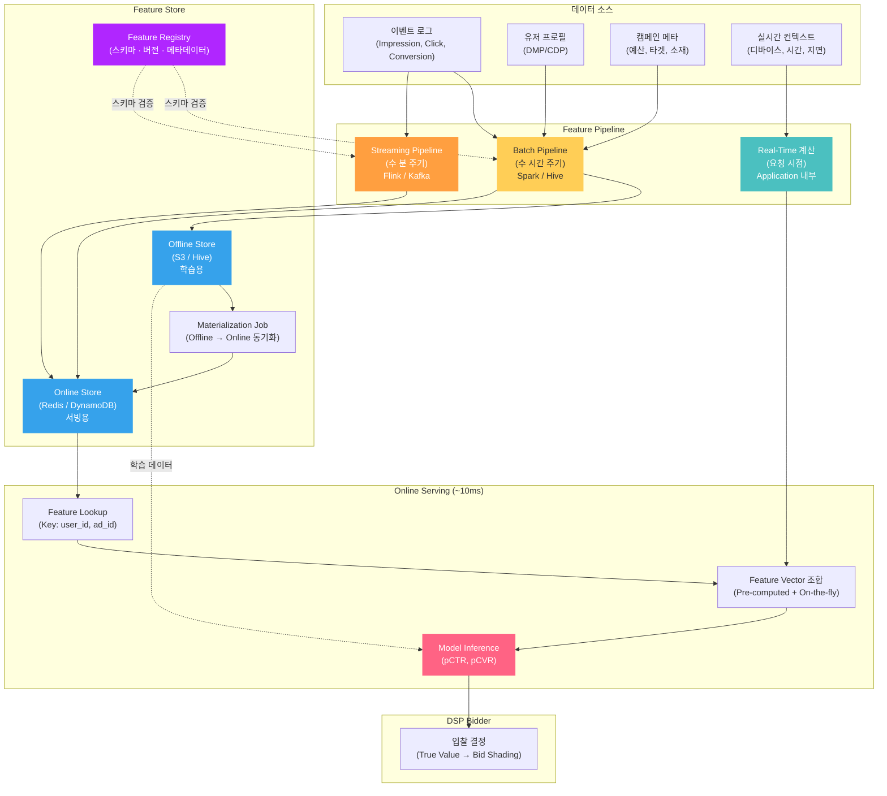
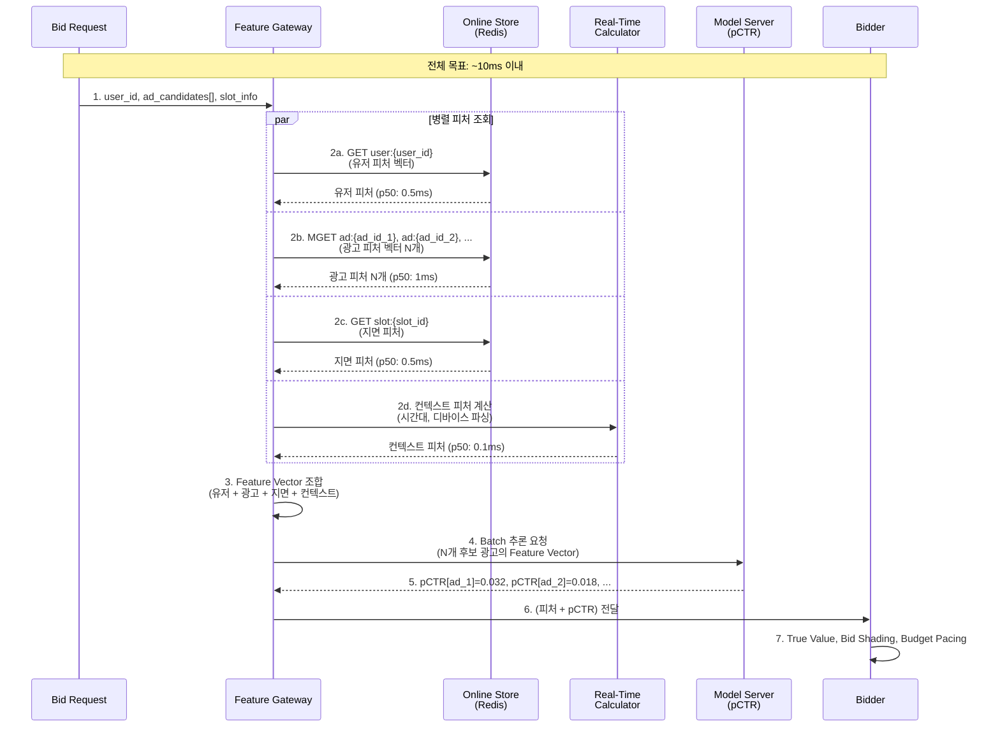
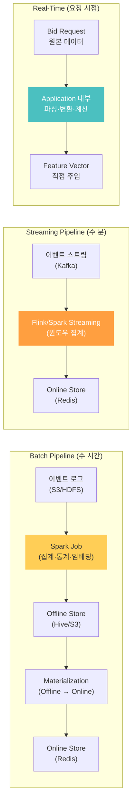
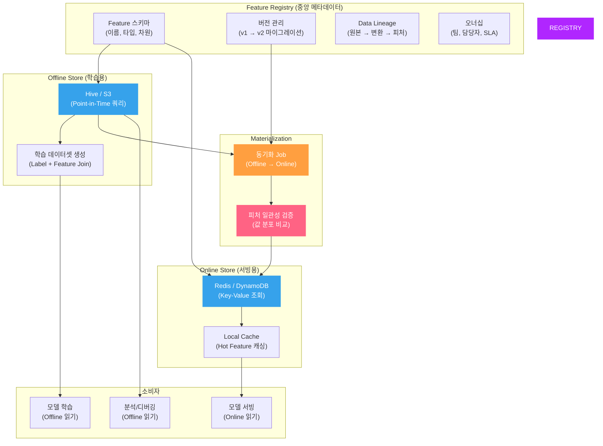
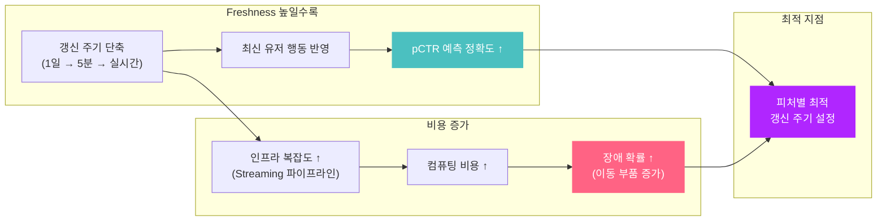
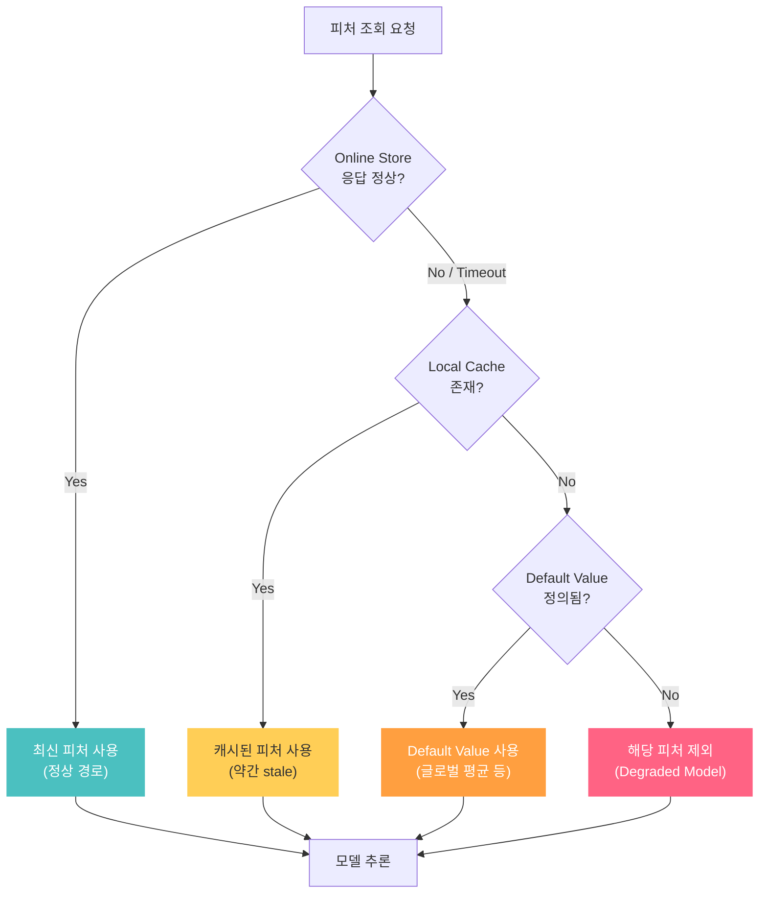

pCTR 모델의 AUC를 0.01 올리는 데 몇 주를 투자하지만, **100ms 안에 피처를 모아서 추론하는 시스템**이 없으면 그 모델은 프로덕션에서 아무 일도 하지 못합니다. 이 글은 광고 ML 시스템의 **데이터 공급망** — Feature Store와 Real-Time Serving 아키텍처를 ML Engineer의 시선으로 해부합니다.

> [pCTR 모델러를 위한 광고 기술 생태계 전체 지도](post.html?id=adtech-ecosystem-map)에서 Feature Store 노드를 한 줄로 소개했습니다. 이 글은 그 노드를 확대하여, 피처가 생성되고 저장되고 서빙되는 전체 과정을 다룹니다.

---

## 1. Feature Serving 전체 조감도

먼저 숲을 봅니다. 광고 ML 시스템에서 피처가 흐르는 전체 경로입니다:



핵심은 **세 갈래의 피처 파이프라인**(Batch / Streaming / Real-Time)이 하나의 Feature Store로 합류하고, 서빙 시점에 이들이 단일 Feature Vector로 조합된다는 것입니다.

### 광고 요청 1건에 필요한 피처 분류

| 피처 유형 | 예시 | 생성 방식 | 갱신 주기 | 저장 위치 |
|-----------|------|----------|----------|----------|
| **유저 피처** | 과거 7일 CTR, 관심사 세그먼트, 최근 본 카테고리 | Batch / Streaming | 수 시간 ~ 수 분 | Online Store |
| **광고 피처** | 광고 과거 CTR, 소재 임베딩, 캠페인 잔여 예산 | Batch / Streaming | 수 시간 ~ 수 분 | Online Store |
| **지면 피처** | 지면 카테고리, 평균 CTR, 광고 슬롯 위치 | Batch | 수 시간 | Online Store |
| **컨텍스트 피처** | 디바이스, OS, 시간대, 요일, 지역 | Real-Time | 요청 시점 | 계산 후 즉시 사용 |
| **교차 피처** | 유저×광고 과거 노출 횟수, 유저×카테고리 선호도 | Batch / Streaming | 수 시간 ~ 수 분 | Online Store |

---

## 2. 한 번의 광고 요청에서 피처가 모이는 과정

유저가 페이지를 열고 Bid Request가 도착한 순간부터, 피처가 조합되어 모델 추론이 완료되기까지의 타임라인입니다:



### 시간 예산 분배

| 단계 | 소요 시간 (p50) | 비고 |
|------|----------------|------|
| Feature Lookup (병렬) | ~1ms | Redis MGET, 네트워크 왕복 포함 |
| 컨텍스트 피처 계산 | ~0.1ms | CPU 연산만 (I/O 없음) |
| Feature Vector 조합 | ~0.5ms | 메모리 내 concat + 정규화 |
| Model Inference | ~2-5ms | 모델 복잡도에 비례 |
| Bid Logic | ~1ms | True Value + Shading |
| **합계** | **~5-8ms** | DSP 내부 처리 총합 |

**병렬 조회가 핵심입니다.** 유저/광고/지면/컨텍스트 피처를 순차적으로 가져오면 4ms → 병렬로 가져오면 1ms. 이 차이가 후보 광고 수를 2배 이상 늘릴 여유를 만듭니다.

---

## 3. Offline vs Near-Real-Time vs Real-Time Feature Pipeline

세 가지 파이프라인은 각각 다른 시간 해상도의 피처를 담당합니다:



### 파이프라인별 상세 비교

| | Batch | Near-Real-Time | Real-Time |
|---|---|---|---|
| **갱신 주기** | 수 시간 ~ 1일 | 수 초 ~ 수 분 | 요청 시점 (0ms) |
| **처리 엔진** | Spark, Hive, BigQuery | Flink, Spark Streaming, Kafka Streams | 애플리케이션 내부 코드 |
| **대표 피처** | 유저 7일 CTR, 광고 과거 성과, 유저 임베딩 | 최근 5분 CTR, 실시간 예산 소진율, 트렌딩 카테고리 | 디바이스 타입, 시간대, OS 버전, 지면 URL |
| **저장소** | S3/Hive → Redis | Redis 직접 기록 | 저장 안 함 (즉시 소비) |
| **장점** | 복잡한 집계 가능, 대용량 처리 | 최신 트렌드 반영, 적정 복잡도 | 지연 없음, I/O 없음 |
| **한계** | 데이터 지연 (stale), 최신성 부족 | 인프라 복잡도 높음, 정확한 집계 어려움 | 단순 계산만 가능 |
| **장애 시 영향** | 피처가 점점 stale → 모델 성능 서서히 저하 | 실시간 시그널 누락 → 입찰 정확도 하락 | Bid Request 파싱 실패 → 입찰 불가 |

### 피처별 파이프라인 매핑 예시

```
[Batch]  유저 과거 7일 CTR         ← Spark에서 일 1회 집계
[Batch]  광고 소재 임베딩            ← 모델 학습 후 업데이트
[Batch]  유저 관심사 세그먼트        ← DMP/CDP 연동, 일 1회 갱신

[Stream] 유저 최근 5분 클릭 수      ← Flink 윈도우 집계, Redis INCR
[Stream] 광고 최근 1시간 CTR        ← Sliding window, 매 분 갱신
[Stream] 캠페인 잔여 예산 비율      ← 소진 이벤트 실시간 차감

[RT]     디바이스 타입 (mobile/desktop)  ← Bid Request User-Agent 파싱
[RT]     시간대 (hour_of_day)            ← 서버 시각 기준 계산
[RT]     지면 URL 카테고리               ← URL 패턴 매칭 또는 lookup
```

---

## 4. Feature Store 아키텍처 심층 해부

Feature Store는 단순한 저장소가 아닙니다. **학습과 서빙에서 동일한 피처를 보장**하는 시스템입니다:



### 핵심 컴포넌트

**Feature Registry**: Feature Store의 "카탈로그"입니다. 모든 피처의 이름, 타입, 차원, 생성 파이프라인, 담당 팀을 중앙에서 관리합니다. 새 피처를 등록하면 스키마 검증이 자동으로 파이프라인에 적용됩니다.

**Offline Store**: Hive나 S3에 시간축(timestamp)과 함께 피처를 저장합니다. 학습 데이터를 만들 때 **Point-in-Time Join**이 핵심입니다 — "이 유저가 이 광고를 본 시점에 피처 값이 무엇이었는가"를 정확히 복원해야 합니다. 미래 데이터가 섞이면 data leakage가 발생합니다.

**Online Store**: Redis나 DynamoDB에 최신 피처 값을 Key-Value로 저장합니다. 서빙 시 `GET user:12345` 한 번으로 유저의 전체 피처 벡터를 가져옵니다. p99 레이턴시 1ms 이내가 목표입니다.

**Materialization Job**: Offline Store의 피처를 Online Store로 동기화합니다. 이 과정에서 **피처 일관성 검증**(값 분포, null 비율, 범위 체크)을 수행하여, Offline과 Online의 피처가 일치하는지 확인합니다.

### Training-Serving Skew: Feature Store가 풀어야 할 근본 문제

Feature Store가 없던 시절에는 이런 일이 일상이었습니다:

```
# 학습 코드 (Python)
user_ctr = clicks_7d / impressions_7d          # 0으로 나누기 처리 없음

# 서빙 코드 (Java)  
user_ctr = clicks_7d / max(impressions_7d, 1)  # 0으로 나누기 방지
```

같은 피처인데 학습과 서빙에서 계산 로직이 다릅니다. 이것이 **Training-Serving Skew**입니다.

| Skew 유형 | 원인 | 결과 |
|-----------|------|------|
| **로직 Skew** | 학습/서빙 코드가 다른 언어·로직 | 동일 입력에 다른 피처 값 → 모델 성능 저하 |
| **시간 Skew** | 학습 시 미래 데이터 포함 (data leakage) | 오프라인 AUC 높지만 온라인 성능 낮음 |
| **분포 Skew** | 학습 데이터와 서빙 데이터의 분포 차이 | 입력 분포가 벗어나면 예측 신뢰도 하락 |

Feature Store는 **피처 정의를 한 곳에서 관리**하여 로직 Skew를 방지하고, **Point-in-Time Join**으로 시간 Skew를 방지합니다. 분포 Skew는 모니터링으로 감지합니다.

---

## 5. Feature Freshness vs Latency 트레이드오프

"피처를 더 자주 갱신하면 모델 성능이 올라간다"는 직관적이지만, 비용과 복잡도가 함께 올라갑니다:



### 피처별 최적 갱신 주기 가이드라인

| 피처 | 권장 갱신 주기 | 근거 |
|------|--------------|------|
| 유저 관심사 세그먼트 | 1일 | 관심사는 천천히 변함, 배치로 충분 |
| 유저 임베딩 | 1일 | 모델 재학습 주기와 동기화 |
| 유저 과거 7일 CTR | 1일 | 7일 윈도우 → 1일 지연은 ~14% 오차 |
| 광고 과거 CTR | 1시간 ~ 1일 | 새 광고는 빠른 갱신 필요, 성숙 광고는 1일 OK |
| 유저 최근 클릭 수 | 5분 | 직전 행동이 다음 클릭에 강한 영향 |
| 캠페인 잔여 예산 | 1분 | 예산 소진 속도에 따라 입찰 조절 필수 |
| 디바이스 / 시간대 | 실시간 | 요청마다 달라지는 값, 계산 비용 극히 낮음 |

### Freshness가 pCTR에 미치는 직관적 예시

유저가 오전에 자동차 관련 기사를 10개 클릭했다고 합시다.

- **24시간 전 CTR 피처**: 어제까지의 행동만 반영 → 자동차 관심사를 모름 → 자동차 광고 pCTR 과소추정 → 입찰 기회 손실
- **5분 전 CTR 피처**: 직전 클릭 패턴 반영 → 자동차 관심사 포착 → 자동차 광고 pCTR 정확 추정 → 적정 입찰 → 낙찰

이 차이가 **Streaming Pipeline의 존재 이유**입니다. 다만 모든 피처를 5분 갱신할 필요는 없고, 위 표처럼 **피처의 변화 속도에 맞춰 갱신 주기를 차등 설정**하는 것이 비용 대비 효과적입니다.

---

## 6. 장애 시나리오 & Reliability

Feature Store는 광고 입찰의 **크리티컬 패스**에 있습니다. 장애가 곧 매출 손실입니다.

### 장애 유형별 영향과 대응

| 장애 유형 | 증상 | 영향 | 대응 전략 |
|-----------|------|------|----------|
| **Online Store 전체 장애** | 피처 조회 실패 | 모든 입찰 중단 | Multi-AZ 복제, 핫 스탠바이 |
| **Online Store 지연** | p99 레이턴시 급증 | 입찰 타임아웃 증가 → Win Rate 하락 | 타임아웃 설정 + Default Value 폴백 |
| **Batch Pipeline 지연** | 피처가 점점 stale | 모델 정확도 서서히 저하 | Freshness 모니터링 + 알림 |
| **Streaming Pipeline 장애** | 실시간 피처 갱신 중단 | 최근 행동 미반영 → 개인화 품질 하락 | Batch 피처로 자동 폴백 |
| **특정 피처 null 급증** | 파이프라인 버그/스키마 변경 | 모델 입력 오류 → 비정상 예측 | null 비율 모니터링 + 임계치 알림 |
| **피처 값 분포 이상** | 업스트림 데이터 변경 | 예측값 편향 → 과대/과소 입찰 | Feature Drift 감지 (PSI, KL Divergence) |

### Fallback 전략 계층



각 계층으로 갈수록 예측 품질은 떨어지지만, **입찰 자체를 중단하는 것보다는 낫습니다**. Feature Store 설계 시 모든 피처에 대해 Default Value를 정의해두는 것이 안전합니다.

### Feature Drift 모니터링

프로덕션에서 피처 분포가 변하면 모델 성능이 저하됩니다. 주요 감지 지표:

| 지표 | 설명 | 알림 기준 (예시) |
|------|------|----------------|
| **PSI (Population Stability Index)** | 학습 데이터 대비 서빙 데이터의 분포 변화 | PSI > 0.2 → 경고 |
| **Null 비율** | 피처 값이 null인 요청 비율 | 평소 대비 3배 이상 → 경고 |
| **값 범위** | min/max/mean의 이동 | 이동평균 대비 3σ 이탈 → 경고 |
| **Freshness** | 피처의 마지막 갱신 시각 | 기대 주기 대비 2배 초과 → 경고 |

---

## 마무리

1. **피처 파이프라인은 세 갈래** — Batch(수 시간), Streaming(수 분), Real-Time(요청 시점)이 각각 다른 시간 해상도의 피처를 담당합니다. 피처의 변화 속도에 맞춰 파이프라인을 선택하세요.

2. **병렬 조회가 레이턴시의 핵심** — 10ms 예산 안에서 유저/광고/지면 피처를 순차적으로 가져오면 시간이 부족합니다. 병렬 조회와 local caching으로 I/O를 최소화하세요.

3. **Training-Serving Skew는 Feature Store가 해결** — 학습과 서빙에서 같은 피처 정의를 사용하도록 Feature Registry로 중앙 관리하고, Point-in-Time Join으로 data leakage를 방지하세요.

4. **Freshness는 무조건 높을수록 좋지 않다** — 피처별 최적 갱신 주기가 다릅니다. 인프라 복잡도와 비용 대비 성능 개선 효과를 따져서 차등 설정하세요.

5. **장애 대비는 설계 단계에서** — Online Store 장애 시 Local Cache → Default Value → Degraded Model로 이어지는 fallback 계층을 미리 구축하고, Feature Drift 모니터링으로 조기 감지하세요.

> 이 글에서 다룬 Feature Store와 Serving 아키텍처는 [광고 기술 생태계 전체 지도](post.html?id=adtech-ecosystem-map)의 DSP 내부 "Feature Store" 노드를 확대한 것입니다. 다음 글에서는 이 피처들을 소비하는 **모델 서빙 아키텍처**(Multi-Stage Ranking, 모델 경량화, A/B 실험)를 다룰 예정입니다.
