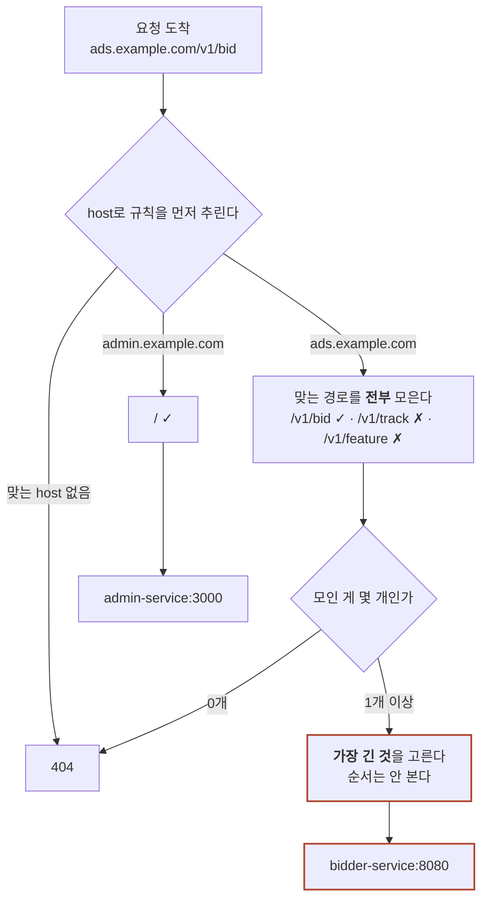

서버 한 대가 요청을 받고 있다. 프로세스 이름은 `bidder`, 주소는 `10.0.3.14:8080`. 매체 한 곳이 이 주소로 초당 3,000건씩 입찰 요청을 보낸다. 요청은 `POST /v1/bid` 한 종류뿐이고, 12ms 안에 답해야 한다. 늦으면 그 건은 없던 일이 된다.

이 그림에는 LB도 Ingress도 API Gateway도 라우터도 없다. 매체의 설정 파일에 우리 서버 IP가 그대로 적혀 있고, 요청은 거기로 곧장 간다. 그리고 이 구성은 잘 돌아간다. 서버가 안 죽고, 배포를 안 하고, 서비스가 하나뿐인 동안은 그렇다.

이 글은 그 다음을 따라간다. 서비스가 하나에서 열둘로 늘어나는 동안 부품은 한꺼번에 등장하지 않는다. 매번 구체적인 사고가 하나 나고, 그걸 막으려고 부품이 하나 생긴다. 순서대로 보면 넷의 경계가 저절로 갈린다.

이 글의 숫자는 전부 설명을 위해 지어낸 값이다. 실제 입찰 제한시간은 매체·거래소마다 다르다.

> **한 줄 요약:** LB·Ingress·API Gateway·라우터는 한꺼번에 설계된 것이 아니다. 서비스가 늘 때마다 생긴 문제에 하나씩 답한 결과다.

> **골라 읽는 법** — 절이 8개인 긴 글입니다. 처음부터 다 읽지 않아도 됩니다.
>
> - 부품이 왜 생겼는지 순서대로 → 1~5절
> - "라우터"라는 말이 헷갈리면 → 3절
> - Ingress와 API Gateway의 경계만 → 4절
> - 넷을 표로 비교만 → 6절
> - 흔한 오해만 → 7절

---

## 1. 서버 한 대 — 매체가 주소를 직접 부른다

**부품이 하나도 없는 상태에서는 매체가 우리 서버 주소를 직접 안다. 그래서 서버가 잠깐만 멈춰도 그 시간만큼 요청이 통째로 사라진다.**

매체 쪽 연동 설정 파일에는 이렇게 적혀 있다.

```yaml
# 매체 서버의 DSP 연동 설정
bidders:
  - name: our-dsp
    endpoint: http://10.0.3.14:8080/v1/bid
    timeout_ms: 12
```

`10.0.3.14` 는 우리 `bidder` 서버의 IP다. 매체는 이 주소로만 요청을 보낸다.

매체와 우리는 같은 데이터센터 안에서 전용 회선으로 붙어 있다. 중간에 거치는 것도 없다. 그래서 사설 IP를 그대로 부를 수 있고, TLS 없이도 되고, 12ms라는 빡빡한 예산이 성립한다. 바깥 인터넷을 건너는 열린 RTB 연동이라면 이 숫자가 훨씬 커진다.

문제는 배포할 때 드러난다. 새 버전을 올리려면 `bidder` 프로세스를 내리고 새 프로세스를 띄워야 한다. 그 사이 `10.0.3.14:8080` 은 아무도 듣지 않는 포트가 된다. 이때 매체가 보낸 요청은 느린 응답을 받는 게 아니다. 연결 자체가 거부된다(`connection refused`). 12ms 예산 안에서는 재시도할 여유도 없다.

<figure style="text-align:center; margin:2rem 0;">
<svg viewBox="0 0 700 150" role="img" aria-label="매체 한 곳이 bidder 서버 한 대의 IP를 직접 호출하는 구조. 그 서버 한 칸이 배포 중에 사라지면 대신 부를 곳이 없다." style="width:100%; max-width:680px; height:auto; font-family:var(--font-sans)">
<defs>
<marker id="gw1-arr" markerWidth="9" markerHeight="9" refX="7.5" refY="3" orient="auto"><path d="M0,0 L7.5,3 L0,6 Z" style="fill:var(--accent-primary)"/></marker>
</defs>
<rect x="20" y="46" width="130" height="58" rx="9" style="fill:var(--bg-tertiary); stroke:var(--border-color); stroke-width:1.5"/>
<text x="85" y="71" text-anchor="middle" style="font-size:13px; fill:var(--text-primary)">매체 1곳</text>
<text x="85" y="89" text-anchor="middle" style="font-size:9.5px; fill:var(--text-muted)">설정에 IP가 박혀 있다</text>
<line x1="150" y1="75" x2="244" y2="75" style="stroke:var(--accent-primary); stroke-width:2" marker-end="url(#gw1-arr)"/>
<text x="197" y="66" text-anchor="middle" style="font-size:10px; fill:var(--text-muted); font-family:var(--font-mono)">10.0.3.14:8080</text>
<rect x="248" y="40" width="162" height="70" rx="13" style="fill:none; stroke:var(--state-bad); stroke-width:1.4; stroke-dasharray:5 4"/>
<rect x="254" y="46" width="150" height="58" rx="9" style="fill:var(--bg-secondary); stroke:var(--accent-primary); stroke-width:1.8"/>
<text x="329" y="71" text-anchor="middle" style="font-size:13px; font-weight:700; fill:var(--accent-primary)">bidder</text>
<text x="329" y="89" text-anchor="middle" style="font-size:9.5px; fill:var(--text-muted)">서버 1대</text>
<line x1="434" y1="75" x2="414" y2="75" style="stroke:var(--state-bad); stroke-width:1.4; stroke-dasharray:5 4"/>
<text x="440" y="70" style="font-size:11px; fill:var(--state-bad)">배포하면 이 칸이 잠깐 사라진다</text>
<text x="440" y="88" style="font-size:11px; fill:var(--state-bad)">그동안 요청은 전부 실패</text>
</svg>
<figcaption style="margin-top:0.75rem; font-size:0.9rem; color:var(--text-muted)">실선이 하나뿐인 게 이 그림의 전부다. 그 하나가 끊기면 매체 쪽에 대안이 없다.</figcaption>
</figure>

얼마나 사라지는지 세어 보자. 아래 숫자는 설명을 위해 지어낸 가상 수치다.

| 항목 | 값 |
|---|---|
| 하루 배포 횟수 | 4회 |
| 배포 1회당 프로세스가 없는 시간 | 20초 |
| 이 매체의 초당 입찰 요청 | 3,000건 |
| **하루에 버려지는 요청** | **4 × 20 × 3,000 = 240,000건** |

하루 24만 건이다. 이 요청들은 우리가 응찰조차 못 한 건이라 매출로도 안 잡히고, 우리 쪽 에러 로그에도 안 남는다. 로그를 남길 프로세스가 그 순간 떠 있지 않기 때문이다. 매체 리포트에만 "응답률이 낮은 DSP"로 조용히 기록된다.

배포를 조심히 하면 되지 않느냐고 물을 수 있다. 그런데 배포를 멈춰도 서버는 죽는다. 디스크가 차거나, 커널이 패닉을 내거나, 앞단 스위치가 재시작한다. 이때 매체가 대신 부를 주소가 없다. 설정 파일에 적힌 주소가 하나뿐이기 때문이다. 그래서 서버를 여러 대로 늘리는 것 말고는 답이 없다.

---

## 2. 세 대로 늘렸다 — LB가 생긴다

**서버를 3대로 늘리면 한 대가 죽어도 서비스는 산다. 대신 "매체가 어느 주소를 불러야 하나"라는 문제가 새로 생긴다.**

`bidder` 를 `10.0.3.14`, `10.0.3.15`, `10.0.3.16` 세 대에 띄웠다고 하자. 이제 배포는 한 대씩 돌아가며 하면 된다. 한 대를 내리는 동안 나머지 두 대가 요청을 받는다. 1절에서 하루 24만 건을 날리던 20초가 없어진다.

대신 배포 중에는 남은 2대가 3대 몫을 받는다. 평상시 서버당 1,000 QPS이던 것이 그동안 1,500 QPS가 된다. 3대라는 숫자는 평상시가 아니라 이 순간을 기준으로 잡아야 한다. 평상시에 딱 맞게 잡으면 배포할 때마다 지연이 튄다.

그런데 매체 입장에서 보면 곤란해진다. 설정 파일에 IP 3개를 다 적어야 하나. `10.0.3.15` 가 죽으면 매체 담당자에게 연락해서 그 줄을 빼 달라고 해야 하나. 서버를 5대로 늘릴 때마다 매체 수십 곳에 같은 부탁을 반복해야 하나. 우리 쪽 사정을 매체가 대신 관리하는 꼴이다.

**로드 밸런서(LB, Load Balancer)** 가 이 자리를 메운다. 대표 주소 하나를 앞에 세우고, 그 뒤에 서버 3대를 대상으로 등록한다. 매체 설정에는 이제 `10.0.9.7` 하나만 적힌다. 뒤에 서버가 3대인지 12대인지는 매체가 알 필요가 없다.

LB가 실제로 하는 일은 두 가지다. 하나는 들어온 연결을 대상 중 하나에 넘기는 것이다. 다른 하나는 **살아 있는 대상만 고르는 것**이다. 두 번째를 하려면 LB가 대상의 상태를 계속 확인해야 한다. 그래서 주기적으로 정해진 주소를 찔러 본다. 이걸 헬스체크(health check)라고 한다.

설정값은 이런 모양이다. 아래 값도 설명을 위해 잡은 가상 수치다.

| 설정 | 값 | 뜻 |
|---|---|---|
| 검사 경로 | `GET /healthz` | 200이 오면 살아 있는 것으로 본다 |
| 검사 주기 | 5초 | 5초마다 한 번씩 물어본다 |
| 타임아웃 | 2초 | 2초 안에 답이 없으면 그 회차는 실패 |
| 제외 조건 | 연속 2회 실패 | 죽은 뒤 최대 12초에 대상에서 빠진다 |
| 복귀 조건 | 연속 2회 성공 | 고쳐진 뒤 최대 10초에 다시 받는다 |

여기서 "연속 2회"가 핵심이다. 1회 실패로 빼면 네트워크가 한 번 튄 것만으로 멀쩡한 서버가 빠진다. 반대로 5회를 기다리면 이미 죽은 서버에 약 27초 동안 요청이 계속 들어간다. 그 27초치 요청은 전부 실패다. 27초는 5초 주기로 다섯 번을 세고 마지막 타임아웃 2초를 더한 값이다. 2회는 그 사이에서 고른 값이고, 최악의 경우 5+5+2 = 12초 만에 빠진다.

검사 주기만큼 중요한 것이 `/healthz` 가 무엇을 보고 200을 답하느냐다. 프로세스가 살아 있기만 하면 200을 주는 구현이 가장 흔하다. 그런데 이러면 `bidder` 가 떠 있지만 모델 저장소를 못 읽는 상태를 못 잡는다. 그 서버는 계속 대상에 남아 요청을 받으면서, 계속 빈 응답을 낸다.

반대로 `/healthz` 안에서 의존하는 것을 전부 확인하면 다른 사고가 난다. 모델 저장소가 3초 흔들리면 3대가 동시에 실패를 답한다. 그러면 세 대가 한꺼번에 빠지고, 대상 그룹에 한 대도 안 남는다.

선은 이 자리에 긋는다. **나 하나만 빠지면 해결되는 것**은 `/healthz` 에서 본다 — 모델 파일 적재 여부, 스레드풀 고갈, 로컬 디스크. **모두가 같이 쓰는 것**은 보지 않는다 — 공용 저장소, 공용 DB. 뒤엣것이 죽으면 남은 서버도 똑같이 못 하니, 빼 봐야 보낼 곳이 없다.

배포도 이 장치를 그대로 쓴다. 새 버전을 올릴 서버는 먼저 `/healthz` 를 실패로 바꿔 스스로 대상에서 빠진다. 빠진 뒤에 프로세스를 교체하고, 준비가 끝나면 다시 200을 답한다. 그러면 10초 안에 대상으로 돌아온다. 1절에서 24만 건을 버리게 만들었던 20초가 여기서는 대부분 사라진다.

대부분이지 전부가 아니다. LB는 연결 단위로 대상을 고른다. 대상에서 뺀다는 건 "새 연결을 더 보내지 않는다"는 뜻이지, 이미 맺어진 연결을 옮긴다는 뜻이 아니다. 매체는 12ms 예산 때문에 연결을 계속 붙여 두고 쓴다. 그래서 앱이 종료할 때 남은 연결을 스스로 닫아 줘야(graceful shutdown) 비로소 손실이 0이 된다. 이걸 빼먹으면 헬스체크를 아무리 잘 잡아도 배포 때마다 몇백 건이 샌다.

<figure style="text-align:center; margin:2rem 0;">
<svg viewBox="0 0 700 240" role="img" aria-label="매체가 LB 대표 주소 하나만 호출하고, LB가 헬스체크로 살아 있는 bidder 서버 두 대에만 요청을 넘기는 구조. 배포 중인 서버 한 대는 대상에서 빠져 있지만 헬스체크는 계속 받는다." style="width:100%; max-width:680px; height:auto; font-family:var(--font-sans)">
<defs>
<marker id="gw2-arr" markerWidth="9" markerHeight="9" refX="7.5" refY="3" orient="auto"><path d="M0,0 L7.5,3 L0,6 Z" style="fill:var(--accent-primary)"/></marker>
<marker id="gw2-hc" markerWidth="8" markerHeight="8" refX="6.5" refY="2.5" orient="auto"><path d="M0,0 L6.5,2.5 L0,5 Z" style="fill:var(--text-muted)"/></marker>
</defs>
<rect x="14" y="86" width="120" height="58" rx="9" style="fill:var(--bg-tertiary); stroke:var(--border-color); stroke-width:1.5"/>
<text x="74" y="111" text-anchor="middle" style="font-size:13px; fill:var(--text-primary)">매체 1곳</text>
<text x="74" y="129" text-anchor="middle" style="font-size:9.5px; fill:var(--text-muted)">설정에 주소 1개</text>
<line x1="134" y1="115" x2="214" y2="115" style="stroke:var(--accent-primary); stroke-width:2" marker-end="url(#gw2-arr)"/>
<text x="174" y="106" text-anchor="middle" style="font-size:10px; fill:var(--text-muted); font-family:var(--font-mono)">10.0.9.7</text>
<text x="293" y="66" text-anchor="middle" style="font-size:10.5px; fill:var(--accent-primary)">이번 절에서 새로 생긴 칸</text>
<rect x="218" y="78" width="150" height="74" rx="9" style="fill:var(--bg-secondary); stroke:var(--accent-primary); stroke-width:2"/>
<text x="293" y="104" text-anchor="middle" style="font-size:13px; font-weight:700; fill:var(--accent-primary)">LB</text>
<text x="293" y="122" text-anchor="middle" style="font-size:9.5px; fill:var(--text-muted)">대표 IP 1개</text>
<text x="293" y="138" text-anchor="middle" style="font-size:9.5px; fill:var(--text-muted)">IP·포트만 본다 (L4)</text>
<text x="293" y="174" text-anchor="middle" style="font-size:10px; fill:var(--text-muted); font-family:var(--font-mono)">GET /healthz · 5s</text>
<text x="293" y="191" text-anchor="middle" style="font-size:9.5px; fill:var(--text-muted)">점선 화살표 = 헬스체크</text>
<rect x="470" y="40" width="214" height="180" rx="10" style="fill:none; stroke:var(--text-muted); stroke-width:1.3; stroke-dasharray:6 4"/>
<text x="577" y="58" text-anchor="middle" style="font-size:11px; fill:var(--text-muted)">대상 그룹 — bidder 3대</text>
<rect x="486" y="68" width="182" height="42" rx="9" style="fill:var(--bg-tertiary); stroke:var(--border-color); stroke-width:1.5"/>
<text x="577" y="87" text-anchor="middle" style="font-size:13px; fill:var(--text-primary)">bidder</text>
<text x="577" y="102" text-anchor="middle" style="font-size:10px; fill:var(--text-muted); font-family:var(--font-mono)">10.0.3.14</text>
<rect x="486" y="120" width="182" height="42" rx="9" style="fill:var(--bg-tertiary); stroke:var(--border-color); stroke-width:1.5"/>
<text x="577" y="139" text-anchor="middle" style="font-size:13px; fill:var(--text-primary)">bidder</text>
<text x="577" y="154" text-anchor="middle" style="font-size:10px; fill:var(--text-muted); font-family:var(--font-mono)">10.0.3.15</text>
<rect x="486" y="172" width="182" height="42" rx="9" style="fill:var(--bg-secondary); stroke:var(--text-muted); stroke-width:1.5; stroke-dasharray:5 4"/>
<text x="577" y="190" text-anchor="middle" style="font-size:11px; fill:var(--text-muted)">배포 중 — 대상에서 빠짐</text>
<text x="577" y="205" text-anchor="middle" style="font-size:10px; fill:var(--text-muted); font-family:var(--font-mono)">10.0.3.16</text>
<line x1="368" y1="100" x2="482" y2="84" style="stroke:var(--accent-primary); stroke-width:2" marker-end="url(#gw2-arr)"/>
<line x1="368" y1="108" x2="482" y2="102" style="stroke:var(--text-muted); stroke-width:1.1; stroke-dasharray:4 3" marker-end="url(#gw2-hc)"/>
<line x1="368" y1="116" x2="482" y2="136" style="stroke:var(--accent-primary); stroke-width:2" marker-end="url(#gw2-arr)"/>
<line x1="368" y1="124" x2="482" y2="152" style="stroke:var(--text-muted); stroke-width:1.1; stroke-dasharray:4 3" marker-end="url(#gw2-hc)"/>
<line x1="368" y1="132" x2="482" y2="202" style="stroke:var(--text-muted); stroke-width:1.1; stroke-dasharray:4 3" marker-end="url(#gw2-hc)"/>
</svg>
<figcaption style="margin-top:0.75rem; font-size:0.9rem; color:var(--text-muted)">LB가 끼어들면서 "누가 살아 있나"를 아는 주체가 매체에서 우리 쪽으로 넘어왔다. 빠진 서버에도 헬스체크는 계속 간다 — 그래야 돌아올 수 있다.</figcaption>
</figure>

### L4 LB가 못 하는 것

지금 이 LB는 IP와 포트만 본다. 이런 방식을 L4 LB라고 부른다. 4는 TCP·UDP를 담당하는 계층의 번호다. 연결이 들어오면 대상 하나를 골라 그대로 넘길 뿐, 그 연결에 어떤 HTTP 요청이 실려 오는지는 열어 보지 않는다.

우리가 매체에 열어 준 주소는 두 개다. `POST /v1/bid` 는 12ms 안에 답해야 하는 입찰 요청이다. `POST /v1/track` 은 노출·클릭을 기록하는 요청이라 100ms가 걸려도 된다. 그런데 L4 LB에게는 둘 다 그냥 "8080 포트로 들어온 TCP 연결"이다. 어느 쪽인지 구분할 방법이 없다.

구분하지 못하면 사고가 난다. `/v1/track` 이 100ms를 쓰는 동안 그 서버의 처리 슬롯 하나가 묶인다. 트래킹이 몰리는 시간대에는 `/v1/bid` 가 슬롯을 못 잡아 12ms를 넘긴다. 느린 쪽이 빠른 쪽을 끌어내리는 것이다.

포트를 나누면 되지 않느냐 — 8080은 입찰, 8081은 트래킹으로. 그러면 매체 설정을 다시 고쳐 달라고 부탁해야 한다. 지금은 두 개지만 서비스가 열둘이 되면 포트도 열두 개다. 2절에서 막 벗어난 자리로 되돌아가는 것이다.

경로를 보고 갈라 보내려면 요청 안을 열어 보는 부품이 필요하다. 그게 3절이다.

---

## 3. 서비스를 넷으로 쪼갰다 — Ingress가 생긴다

**서비스를 넷으로 나누면 앞에 세울 대표 주소도 넷이 된다. Ingress는 주소를 다시 하나로 되돌리고, 대신 경로를 보고 갈라 보낸다.**

이 절에 나오는 숫자도 전부 설명을 위해 지어낸 값이다.

`bidder` 한 프로세스에 네 가지가 같이 들어 있었다. 입찰 응답 만들기, pCTR 예측, 피처 조회, 노출·클릭 기록이다. 이걸 `bidder`·`pctr`·`feature-store`·`log-collector` 넷으로 갈랐다. pCTR 모델만 하루 세 번 올리고 싶은데, 그때마다 입찰 프로세스까지 같이 내려야 했기 때문이다.

서비스마다 LB를 하나씩 세우면 2절을 네 번 반복하는 꼴이 된다. 안에서만 부르는 `pctr` 과 `feature-store` 도 여러 대로 띄우니 대표 주소는 넷 다 필요하다.

| 항목 | LB를 넷 세우면 | Ingress 하나면 |
|---|---|---|
| 대표 주소 | 4개 | 1개 |
| 대상 그룹·헬스체크 설정 | 4벌 | 1벌 |
| 매체가 알아야 할 주소 | 2개 (입찰·트래킹) | 1개 |
| 월 LB 비용 | 4배 | 1배 |

보통 여기에 TLS 인증서 4장이 한 줄 더 붙는다. 이 글의 입찰 경로는 전용 회선 위 평문이라 그 줄이 없다.

**Ingress** 는 이 자리에 규칙표 하나를 놓는다. 주소는 다시 하나로 돌아가고, 그 뒤에서 요청을 열어 보고 갈라 보낸다. 2절의 LB가 없어지는 것은 아니다. LB는 그대로 대표 주소를 들고 있고, 그 대상이 `bidder` 서버 3대에서 Ingress로 바뀐다. `/v1/track` 이 이제 `log-collector` 로 빠지니 입찰 슬롯을 더 이상 먹지 않는다. 2절에서 12ms를 넘기게 만들던 원인이 여기서 사라진다.

대신 매체 설정을 한 번 더 고쳐야 한다. Ingress는 요청 헤더에 실린 호스트 이름을 보고 규칙을 고르기 때문이다. 그래서 `10.0.9.7` 을 `ads.example.com` 으로 바꾸고, 사내 DNS에 그 이름을 같은 IP로 등록한다. 이 부탁은 이번이 마지막이다. 포트는 서비스마다 하나씩 늘지만 이름은 하나로 끝난다.

<figure style="text-align:center; margin:2rem 0;">
<svg viewBox="0 0 700 236" role="img" aria-label="매체가 이름 하나로 LB를 부르고, LB 뒤에 놓인 Ingress가 쪼갠 서비스 넷 중 셋으로 요청을 갈라 보내는 구조. pctr 칸에는 화살표가 닿지 않는다." style="width:100%; max-width:680px; height:auto; font-family:var(--font-sans)">
<defs>
<marker id="gw3-arr" markerWidth="9" markerHeight="9" refX="7.5" refY="3" orient="auto"><path d="M0,0 L7.5,3 L0,6 Z" style="fill:var(--accent-primary)"/></marker>
</defs>
<rect x="6" y="90" width="104" height="60" rx="9" style="fill:var(--bg-tertiary); stroke:var(--border-color); stroke-width:1.5"/>
<text x="58" y="112" text-anchor="middle" style="font-size:13px; fill:var(--text-primary)">매체 1곳</text>
<text x="58" y="128" text-anchor="middle" style="font-size:9.5px; fill:var(--text-muted)">설정에 주소 1개</text>
<text x="58" y="142" text-anchor="middle" style="font-size:9px; fill:var(--text-muted); font-family:var(--font-mono)">ads.example.com</text>
<line x1="110" y1="120" x2="144" y2="120" style="stroke:var(--accent-primary); stroke-width:2" marker-end="url(#gw3-arr)"/>
<text x="204" y="84" text-anchor="middle" style="font-size:9.5px; fill:var(--text-muted)">2절 그대로</text>
<rect x="148" y="92" width="112" height="56" rx="9" style="fill:var(--bg-secondary); stroke:var(--border-color); stroke-width:1.5"/>
<text x="204" y="114" text-anchor="middle" style="font-size:13px; fill:var(--text-primary)">LB</text>
<text x="204" y="131" text-anchor="middle" style="font-size:10px; fill:var(--text-muted); font-family:var(--font-mono)">10.0.9.7</text>
<line x1="260" y1="120" x2="292" y2="120" style="stroke:var(--accent-primary); stroke-width:2" marker-end="url(#gw3-arr)"/>
<text x="372" y="72" text-anchor="middle" style="font-size:10.5px; fill:var(--accent-primary)">이번 절에서 새로 생긴 칸</text>
<rect x="296" y="88" width="152" height="64" rx="9" style="fill:var(--bg-secondary); stroke:var(--accent-primary); stroke-width:2"/>
<text x="372" y="116" text-anchor="middle" style="font-size:13px; font-weight:700; fill:var(--accent-primary)">Ingress</text>
<text x="372" y="135" text-anchor="middle" style="font-size:9.5px; fill:var(--text-muted)">규칙표 — host · path 를 본다</text>
<rect x="482" y="20" width="210" height="200" rx="10" style="fill:none; stroke:var(--text-muted); stroke-width:1.3; stroke-dasharray:6 4"/>
<text x="587" y="36" text-anchor="middle" style="font-size:11px; fill:var(--text-muted)">쪼갠 서비스 4개</text>
<rect x="498" y="44" width="178" height="38" rx="9" style="fill:var(--bg-tertiary); stroke:var(--border-color); stroke-width:1.5"/>
<text x="587" y="68" text-anchor="middle" style="font-size:12.5px; fill:var(--text-primary)">bidder</text>
<rect x="498" y="88" width="178" height="38" rx="9" style="fill:var(--bg-tertiary); stroke:var(--border-color); stroke-width:1.5"/>
<text x="587" y="112" text-anchor="middle" style="font-size:12.5px; fill:var(--text-primary)">pctr</text>
<rect x="498" y="132" width="178" height="38" rx="9" style="fill:var(--bg-tertiary); stroke:var(--border-color); stroke-width:1.5"/>
<text x="587" y="156" text-anchor="middle" style="font-size:12.5px; fill:var(--text-primary)">feature-store</text>
<rect x="498" y="176" width="178" height="38" rx="9" style="fill:var(--bg-tertiary); stroke:var(--border-color); stroke-width:1.5"/>
<text x="587" y="200" text-anchor="middle" style="font-size:12.5px; fill:var(--text-primary)">log-collector</text>
<line x1="450" y1="102" x2="494" y2="64" style="stroke:var(--accent-primary); stroke-width:2" marker-end="url(#gw3-arr)"/>
<line x1="450" y1="126" x2="494" y2="150" style="stroke:var(--accent-primary); stroke-width:2" marker-end="url(#gw3-arr)"/>
<line x1="450" y1="138" x2="494" y2="194" style="stroke:var(--accent-primary); stroke-width:2" marker-end="url(#gw3-arr)"/>
</svg>
<figcaption style="margin-top:0.75rem; font-size:0.9rem; color:var(--text-muted)">2절의 LB는 없어지지 않았다. 바뀐 건 그 대상이 bidder 3대에서 Ingress로 옮겨간 것뿐이다.</figcaption>
</figure>

규칙표는 실제로 이런 모양이다.

```yaml
# Ingress 규칙 — 네 줄 다 pathType: Prefix 다. 맞는 줄을 전부 찾은 뒤 가장 긴 것을 고른다. 적힌 순서는 상관없다.
rules:
  - host: ads.example.com
    paths:
      - path: /v1/bid      →  bidder-service:8080
      - path: /v1/track    →  log-collector:8080
      - path: /v1/feature  →  feature-store:8080
  - host: admin.example.com
    paths:
      - path: /            →  admin-service:3000
# 맞는 줄이 하나도 없으면 404.
```

서비스는 넷인데 줄은 셋이다. `pctr` 은 매체가 아니라 `bidder` 가 부르므로 규칙표에 없다. 규칙표는 클러스터 바깥에서 들어오는 요청만 다룬다. `/v1/feature` 도 매체용이 아니라 사내 운영 도구가 피처 값을 볼 때 쓴다.

요청 하나가 이 표를 지나는 길은 이렇다.



순서가 상관없다는 말이 곧 안전하다는 뜻은 아니다. 언젠가 `/v1` 아래를 통째로 한곳에 보내는 규칙을 하나 넣게 된다. `/v1/bid` 는 안 뺏긴다. 더 길게 맞는 줄이 어디에 적혀 있든 이기기 때문이다. 대신 `/v1` 아래에서 404로 떨어지던 것이 전부 그 새 규칙으로 빨려 들어간다. `/v1/report` 도, `/v1/status` 도, 오타로 들어온 `/v1/bidd` 도. 문법 오류도 없고, 배포도 성공하고, 헬스체크도 전부 초록이다.

규칙표에서 이기는 것은 위치가 아니라 길이다. **가장 길게 맞는 줄이 이긴다.** 그래서 짧은 경로를 새로 추가할 때는 그 아래로 무엇이 딸려 들어오는지부터 세어 봐야 한다. `pathType` 은 `Prefix` 면 `/v1/bid` 아래 경로까지 같이 걸리고, `Exact` 면 딱 그 경로만 걸린다. 단, 글자 단위가 아니라 `/` 로 끊은 조각 단위다 — `/v1/bid` 는 `/v1/bid/test` 를 잡지만 `/v1/bidder` 는 안 잡는다.

### "라우터"가 가리키는 세 가지

지금까지 Ingress라고 부른 것은 규칙표, 곧 적어 놓은 설정이다. 그 표를 읽고 실제로 요청을 넘기는 것은 따로 도는 프로세스다. 그 프로세스를 "라우터"라고들 부르는데, 이 말이 문맥마다 다른 것을 가리킨다.

| 어디서 쓰는 말인가 | 무엇을 가리키나 | 실제 이름 |
|---|---|---|
| 쿠버네티스 | 규칙표를 실제로 실행하는 프로세스 | Ingress Controller (nginx·traefik) |
| OpenShift | 규칙표에 해당하는 자체 리소스 (라우터 프로세스가 읽는 대상) | `Route` 오브젝트 |
| 앱 코드 안 | 들어온 경로를 함수에 연결하는 것 | `@app.route("/v1/bid")` |

셋이 하는 일은 같다. 경로를 보고 어디로 보낼지 정한다. 다른 것은 **어느 층에서 도느냐**다. 그런데 **셋은 두 층이다.** 1·2행은 같은 층이고 플랫폼이 다를 뿐이다. 쿠버네티스를 쓰면 1행, OpenShift를 쓰면 2행이지 둘을 같이 지나가지 않는다. 3행만 다른 층이다. 그래서 `POST /v1/bid` 한 건은 두 층을 지난다. 바깥에서 Ingress Controller가 `bidder-service` 를 고르고, 그 안에서 `@app.route("/v1/bid")` 함수가 실행된다.

이제 매체가 열 곳으로 늘었다. 그중 한 곳이 설정을 잘못 올려 초당 3,000건이 아니라 30,000건을 보내기 시작한다. 규칙표에는 이걸 막을 칸이 없다. `host` 와 `path` 밖에 안 보기 때문이다. 어느 매체가 보낸 요청인지조차 모른다. 그게 4절이다.

---

## 4. 매체가 열 곳으로 늘었다 — API Gateway가 생긴다

**Ingress 규칙표에는 "누가 보냈나"를 적을 칸이 없다. 매체를 가려야 하는 일이 쌓이면 그 칸을 가진 부품이 뒤에 하나 더 생긴다.**

매체가 열 곳이 됐다. 조건이 다 다르다. 아래 값은 전부 설명을 위해 지어낸 가상 수치다.

| 매체 | 인증 방식 | 초당 허용 | 쓰는 버전 |
|---|---|---|---|
| A앱 | API 키 | 3,000 | v2 |
| B웹 | HMAC 서명 | 8,000 | v2 |
| C제휴 | API 키 | 500 | v1 |
| D앱 | OAuth 토큰 | 1,200 | v1 |
| E웹 | API 키 | 4,500 | v2 |
| 나머지 5곳 (합계) | — | 12,800 | — |

열 곳을 다 더하면 초당 3만 건이다. 3절 끝에서 A앱 한 곳이 3,000이 아니라 30,000 — 열 곳 전체와 맞먹는 양 — 을 보내기 시작했다. A앱만 느려지는 게 아니라 나머지 아홉 곳이 같이 느려진다. 3만 건을 감당하는 것과 한 곳이 3만 건을 쏟는 것을 막는 것은 다른 문제다.

이 표를 규칙표로 옮길 방법이 없다. 규칙표에는 `host` 와 `path` 칸뿐이다. 다음 넷이 전부 안 된다.

- **매체별 인증키 확인** — 요청을 누가 보냈는지 규칙표가 모른다.
- **초당 호출 제한** — 매체를 구분 못 하니 500과 8,000을 따로 걸 수 없다.
- **`v1`/`v2` 분기** — 버전은 `x-api-version` 헤더로 온다. 규칙표는 헤더를 안 본다.
- **응답 형식 변환** — v1 매체는 옛 필드 이름을 기대하는데 `bidder` 는 v2 형식만 만든다.

구현체에 따라 애너테이션으로 헤더 조건을 밀어 넣을 수는 있지만, nginx에서 traefik으로 갈아탈 때 통째로 다시 써야 한다.

**API Gateway** 는 Ingress 뒤에 서서 이 넷을 맡는다. 규칙표와 다른 점은 `header` 조건과 정책 칸(`common`·`policies`)이다.

```yaml
# API Gateway 설정 — 규칙표에 없던 것: header 조건과 정책
# 두 라우트가 겹칠 때 무엇이 이기는지는 제품마다 다르다 — 순서인 곳도, 더 구체적인 쪽인 곳도 있다.
# 여기서는 어느 쪽이든 bid-v1이 이긴다. 조건이 하나 더 많고, 위에 있다.
common:                                    # 모든 라우트가 먼저 지나간다
  - auth:      { type: api-key, header: x-media-key }   # A앱 기준. HMAC·OAuth 매체는 방식만 다르고 자리는 같다
  - ratelimit: { key: media_id, per_second: media_quota }   # 값은 위 표의 초당 허용 열
  - timeout:   { ms: 10 }
routes:
  - id: bid-v1                             # 버전 헤더를 보낸 매체만 여기로
    match: { host: ads.example.com, path: /v1/bid, header: { x-api-version: "1" } }
    target: bidder-service:8080
    policies:
      - response: { transform: v2_to_v1 }  # 옛 필드 이름으로 되돌려 준다
  - id: bid-v2                             # 헤더가 없으면 여기. v3를 내도 이 기본값은 v2에 둔다
    match: { host: ads.example.com, path: /v1/bid }
    target: bidder-service:8080
```

버전을 경로로 나눌 수도 있다 — `/v2/bid` 를 새로 파면 된다. 그러면 v2를 쓰는 매체 전부에 주소를 고쳐 달라고 해야 한다. 3절에서 그 부탁은 이번이 마지막이라고 했다. 그래서 경로는 `/v1/bid` 로 두고, 옛 버전을 쓰는 매체만 헤더로 알린다. 대신 기본값은 시간이 갈수록 가장 오래된 버전이 되고, 그걸 언제 걷을지는 따로 정해야 한다.

주소는 그대로다. 대신 A앱은 `x-media-key` 헤더 한 줄을 새로 넣는다. 버전 헤더는 안 보내도 된다. 한 줄 늘긴 했지만 성격이 다르다. 주소는 우리 안쪽이 바뀔 때마다 따라 바뀌었다 — 서버가 늘어서 한 번, 서비스를 쪼개서 또 한 번. 인증키는 A앱이 A앱인 한 그대로다. 새로 붙는 아홉 곳은 처음 연동할 때 주소와 키를 같이 받는다.

`timeout` 을 12로 적고 싶겠지만 그러면 늦는다. 12ms는 매체가 요청을 보내고 답을 받기까지 전부다. Ingress를 지나는 데 0.3ms, Gateway가 인증키와 쿼터를 보는 데 1.1ms가 든다(가상 수치). LB는 연결을 넘기기만 하니 셈에서 뺀다. 그래서 `bidder` 를 기다리는 시간은 10ms로 잡는다. 남는 0.6ms가 여유분이다. v1 매체는 여기에 응답 변환이 더 붙는데, 그 몫은 이 0.6ms 안에서 쓴다. v1을 쓰는 곳은 C제휴 500과 D앱 1,200, 초당 3만 건 중 1,700건이다. `bidder` 가 평소 쓰는 건 8ms 안팎이고, 10ms는 그 위에 얹은 상한이다.

<figure style="text-align:center; margin:2rem 0;">
<svg viewBox="0 0 700 240" role="img" aria-label="조건이 서로 다른 매체 10곳의 요청이 LB와 Ingress를 지나 API Gateway 한 칸에 모여 인증·쿼터를 거친 뒤, 서비스 넷 중 셋으로 나뉘는 구조." style="width:100%; max-width:680px; height:auto; font-family:var(--font-sans)">
<defs>
<marker id="gw4-arr" markerWidth="9" markerHeight="9" refX="7.5" refY="3" orient="auto"><path d="M0,0 L7.5,3 L0,6 Z" style="fill:var(--accent-primary)"/></marker>
</defs>
<rect x="2" y="30" width="118" height="172" rx="10" style="fill:none; stroke:var(--text-muted); stroke-width:1.3; stroke-dasharray:6 4"/>
<text x="61" y="46" text-anchor="middle" style="font-size:11px; fill:var(--text-muted)">매체 10곳</text>
<rect x="12" y="56" width="98" height="42" rx="9" style="fill:var(--bg-tertiary); stroke:var(--border-color); stroke-width:1.5"/>
<text x="61" y="75" text-anchor="middle" style="font-size:11.5px; fill:var(--text-primary)">A앱</text>
<text x="61" y="90" text-anchor="middle" style="font-size:9px; fill:var(--text-muted); font-family:var(--font-mono)">API 키 · 3,000</text>
<rect x="12" y="106" width="98" height="42" rx="9" style="fill:var(--bg-tertiary); stroke:var(--border-color); stroke-width:1.5"/>
<text x="61" y="125" text-anchor="middle" style="font-size:11.5px; fill:var(--text-primary)">B웹</text>
<text x="61" y="140" text-anchor="middle" style="font-size:9px; fill:var(--text-muted); font-family:var(--font-mono)">HMAC · 8,000</text>
<rect x="12" y="156" width="98" height="42" rx="9" style="fill:var(--bg-tertiary); stroke:var(--border-color); stroke-width:1.5"/>
<text x="61" y="175" text-anchor="middle" style="font-size:11.5px; fill:var(--text-primary)">…외 8곳</text>
<text x="61" y="190" text-anchor="middle" style="font-size:9px; fill:var(--text-muted); font-family:var(--font-mono)">합계 19,000</text>
<line x1="110" y1="77" x2="146" y2="105" style="stroke:var(--accent-primary); stroke-width:2" marker-end="url(#gw4-arr)"/>
<line x1="110" y1="127" x2="146" y2="120" style="stroke:var(--accent-primary); stroke-width:2" marker-end="url(#gw4-arr)"/>
<line x1="110" y1="177" x2="146" y2="135" style="stroke:var(--accent-primary); stroke-width:2" marker-end="url(#gw4-arr)"/>
<text x="235" y="78" text-anchor="middle" style="font-size:9.5px; fill:var(--text-muted)">3절까지 그대로</text>
<rect x="150" y="92" width="62" height="56" rx="9" style="fill:var(--bg-secondary); stroke:var(--border-color); stroke-width:1.5"/>
<text x="181" y="114" text-anchor="middle" style="font-size:13px; fill:var(--text-primary)">LB</text>
<text x="181" y="131" text-anchor="middle" style="font-size:10px; fill:var(--text-muted); font-family:var(--font-mono)">10.0.9.7</text>
<line x1="212" y1="120" x2="232" y2="120" style="stroke:var(--accent-primary); stroke-width:2" marker-end="url(#gw4-arr)"/>
<rect x="236" y="92" width="106" height="56" rx="9" style="fill:var(--bg-secondary); stroke:var(--accent-secondary); stroke-width:1.8"/>
<text x="289" y="114" text-anchor="middle" style="font-size:13px; fill:var(--accent-secondary)">Ingress</text>
<text x="289" y="131" text-anchor="middle" style="font-size:9.5px; fill:var(--text-muted)">host · path</text>
<line x1="342" y1="120" x2="362" y2="120" style="stroke:var(--accent-primary); stroke-width:2" marker-end="url(#gw4-arr)"/>
<text x="445" y="64" text-anchor="middle" style="font-size:10.5px; fill:var(--accent-primary)">이번 절에서 새로 생긴 칸</text>
<rect x="366" y="82" width="158" height="76" rx="9" style="fill:var(--bg-secondary); stroke:var(--accent-primary); stroke-width:2"/>
<text x="445" y="106" text-anchor="middle" style="font-size:13px; font-weight:700; fill:var(--accent-primary)">API Gateway</text>
<text x="445" y="126" text-anchor="middle" style="font-size:9.5px; fill:var(--text-muted)">매체 인증 · 쿼터</text>
<text x="445" y="142" text-anchor="middle" style="font-size:9.5px; fill:var(--text-muted)">버전 라우팅</text>
<rect x="536" y="20" width="162" height="200" rx="10" style="fill:none; stroke:var(--text-muted); stroke-width:1.3; stroke-dasharray:6 4"/>
<text x="617" y="36" text-anchor="middle" style="font-size:11px; fill:var(--text-muted)">쪼갠 서비스 4개</text>
<rect x="547" y="44" width="140" height="38" rx="9" style="fill:var(--bg-tertiary); stroke:var(--border-color); stroke-width:1.5"/>
<text x="617" y="68" text-anchor="middle" style="font-size:12.5px; fill:var(--text-primary)">bidder</text>
<rect x="547" y="88" width="140" height="38" rx="9" style="fill:var(--bg-tertiary); stroke:var(--border-color); stroke-width:1.5"/>
<text x="617" y="112" text-anchor="middle" style="font-size:12.5px; fill:var(--text-primary)">pctr</text>
<rect x="547" y="132" width="140" height="38" rx="9" style="fill:var(--bg-tertiary); stroke:var(--border-color); stroke-width:1.5"/>
<text x="617" y="156" text-anchor="middle" style="font-size:12.5px; fill:var(--text-primary)">feature-store</text>
<rect x="547" y="176" width="140" height="38" rx="9" style="fill:var(--bg-tertiary); stroke:var(--border-color); stroke-width:1.5"/>
<text x="617" y="200" text-anchor="middle" style="font-size:12.5px; fill:var(--text-primary)">log-collector</text>
<line x1="524" y1="104" x2="544" y2="66" style="stroke:var(--accent-primary); stroke-width:2" marker-end="url(#gw4-arr)"/>
<line x1="524" y1="124" x2="544" y2="150" style="stroke:var(--accent-primary); stroke-width:2" marker-end="url(#gw4-arr)"/>
<line x1="524" y1="136" x2="544" y2="192" style="stroke:var(--accent-primary); stroke-width:2" marker-end="url(#gw4-arr)"/>
</svg>
<figcaption style="margin-top:0.75rem; font-size:0.9rem; color:var(--text-muted)">화살표가 pctr 에 닿지 않는 것은 3절과 같다. 왼쪽이 스무 줄이 돼도 오른쪽 절반은 그대로다.</figcaption>
</figure>

정책을 서비스마다 따로 두면 어떻게 되는지 개수로 세어 보자.

```python
# "규칙을 서비스마다 따로 두면 뭐가 문제인가" — 개수로 답한다.
#
# 상황: 서비스 4개, 매체 10곳. 인증·쿼터·타임아웃 세 가지 정책을 지켜야 한다.
#   방식 A(각자): 서비스 4곳이 세 정책을 각각 구현한다.
#   방식 B(한 곳): Gateway 한 곳에 구현하고 서비스는 모른 채 둔다.
# 모든 숫자는 설명을 위한 가상 데이터다.
from unicodedata import east_asian_width

SERVICES = 4
POLICIES = 3
LINES_PER_POLICY = 60      # 정책 하나를 구현하는 코드 줄수(가정)
CHANGES_PER_QUARTER = 2    # 정책이 바뀌는 횟수
INCIDENT_RATE = 0.02       # 배포 1회당 사고 확률(가정)

# ── 방식 A: 정책이 서비스 수만큼 복제된다 ──
a_copies = SERVICES * POLICIES
a_lines = a_copies * LINES_PER_POLICY
a_deploys = SERVICES                       # 정책 1회 변경 → 서비스 전부 배포
# 손으로 4번 구현하면 한 곳이 어긋날 기회가 그만큼 생긴다.
# 한 곳이 정확히 같게 구현될 확률을 0.9로 두면, 넷이 모두 같을 확률은 0.9^3.
a_match = 0.9 ** (SERVICES - 1)

# ── 방식 B: 한 곳에만 있다 ──
b_copies = POLICIES
b_lines = b_copies * LINES_PER_POLICY
b_deploys = 1
b_match = 1.0                              # 한 벌뿐이라 어긋날 데가 없다

# ── 한글은 화면에서 두 칸을 먹는다. 칸수를 직접 세어 맞춘다 ──
def w(s):
    return sum(2 if east_asian_width(c) in "WF" else 1 for c in s)

def row(label, a, b):
    a, b = str(a), str(b)
    print(label + " " * (26 - w(label))
          + " " * (16 - w(a)) + a
          + " " * (20 - w(b)) + b)

print(f"서비스 {SERVICES}개 · 정책 {POLICIES}종 · 분기당 변경 {CHANGES_PER_QUARTER}회")
print()
row("", "A) 서비스마다", "B) Gateway 한 곳")
row("구현 벌수", a_copies, b_copies)
row("총 코드 줄수", f"{a_lines:,}", f"{b_lines:,}")
row("정책 1회 변경 시 배포", a_deploys, b_deploys)
row("분기당 배포", a_deploys * CHANGES_PER_QUARTER, b_deploys * CHANGES_PER_QUARTER)
row("구현이 모두 일치할 확률", f"{a_match:.1%}", f"{b_match:.1%}")
print()
print(f"분기당 기대 사고  A {a_deploys*CHANGES_PER_QUARTER*INCIDENT_RATE:.2f}건"
      f"   B {b_deploys*CHANGES_PER_QUARTER*INCIDENT_RATE:.2f}건")
print()
print("→ 코드량이 문제가 아니다. 정책 하나를 고치는 데 배포가 몇 번 필요한가가 문제다.")
print("→ 벌수가 늘수록 '어딘가 한 곳만 다르게 구현돼 있는' 상태가 기본값이 된다.")

# 출력:
# 서비스 4개 · 정책 3종 · 분기당 변경 2회
#
#                              A) 서비스마다    B) Gateway 한 곳
# 구현 벌수                               12                   3
# 총 코드 줄수                           720                 180
# 정책 1회 변경 시 배포                    4                   1
# 분기당 배포                              8                   2
# 구현이 모두 일치할 확률              72.9%              100.0%
#
# 분기당 기대 사고  A 0.16건   B 0.04건
#
# → 코드량이 문제가 아니다. 정책 하나를 고치는 데 배포가 몇 번 필요한가가 문제다.
# → 벌수가 늘수록 '어딘가 한 곳만 다르게 구현돼 있는' 상태가 기본값이 된다.
```

눈여겨볼 줄은 세 번째다. 쿼터 하나를 고치는 데 방식 A는 배포가 네 번 필요하다. 네 번 중 하나만 늦어도 그동안은 서비스마다 다른 값이 걸린다. 넷이 애초에 같게 구현돼 있을 확률은 72.9%다. 나머지 27.1%는 사고가 날 때까지 아무 표시도 내지 않는다.

무엇을 Gateway에 두고 무엇을 서비스에 남기나. **우리 광고 데이터를 안 봐도 정해지면 Gateway. 봐야 정해지면 서비스.** 인증키가 맞나, 이 매체가 이번 초에 몇 건을 넘겼나, 버전이 몇인가 — 셋 다 광고 데이터를 안 본다. 쿼터 계수는 인스턴스마다 따로 세고 주기적으로 맞춘다. 반대로 이 캠페인에 예산이 남았나, 이 사용자에게 이 광고를 이미 보였나는 `bidder` 만 안다.

Gateway가 그것까지 물어보게 만들 수는 있다. 그러면 홉이 하나 더 붙고, 그 홉은 매체 열 곳의 모든 요청에 붙는다. 위에서 잡은 0.6ms 여유가 거기서 없어진다.

경계를 표로 못 박으면 이렇다.

| | Ingress | API Gateway |
|---|---|---|
| 무엇을 보고 나누나 | 호스트 · 경로 | 호스트 · 경로 + 헤더 · 인증키 · 매체 |
| 정책을 갖나 | 아니오 (규칙표뿐 — 애너테이션은 구현체 전용) | 예 — 인증 · 쿼터 · 변환 · 타임아웃 |
| 설정이 바뀌는 이유 | 서비스가 늘거나 줄 때 | 매체가 늘거나 정책이 바뀔 때 |
| 없으면 무엇이 늘어나나 | 서비스마다 대표 주소와 헬스체크 설정이 한 벌씩 붙는다 | 인증·쿼터·타임아웃이 서비스 수만큼 복제된다 |

방금 센 것을 안쪽 호출에 그대로 대 보자. Gateway가 걷어 간 것은 매체가 보낸 요청뿐이다. `bidder` 가 `pctr` 을 부르고 `pctr` 이 `feature-store` 를 부르는 호출은 그 앞을 지나지 않는다. 그 사이의 재시도와 타임아웃은 지금도 서비스마다 각자 코드에 적혀 있다. 넷일 때는 손으로 넣을 만했다. 열둘이 되면 그 "사이"가 몇 개인지부터 세어 봐야 한다. 그게 5절이다.

---

## 5. 서비스가 열둘이 됐다 — 메시를 써야 하나

**안쪽 호출에는 아직 아무 부품도 없다. 메시가 그 자리를 채우는데, 12ms 예산에서는 그 값을 낼 수 있는지부터 계산해야 한다.**

서비스가 여덟 개 더 생겨 열둘이 됐다. `pcvr` · `budget` · `frequency` · `creative` · `audience` · `pacing` · `model-registry` · `report` 다. 매체는 이 이름을 하나도 모른다 — 전부 안에서만 부른다.

1절부터 4절까지 쌓은 부품은 밖에서 안으로 들어오는 길 위에 있다. `bidder` 가 `pctr` 을 부르고 `pctr` 이 `feature-store` 를 부르는 호출은 LB도 Ingress도 Gateway도 지나지 않는다.

그런데 이 호출에도 같은 것이 필요하다. `pctr` 이 답을 안 주면 몇 ms에 포기하나. 한 번 더 부르나, pCTR 없이 응찰하나. 12ms를 넘긴 요청은 어디서 늦었나. 지금은 이 답이 서비스마다 각자 코드에 들어 있다.

<figure style="text-align:center; margin:2rem 0;">
<svg viewBox="0 0 700 326" role="img" aria-label="밖에서 안으로 들어온 요청이 서비스 사이를 여러 번 오가고, 그때마다 사이드카를 지나는 구조." style="width:100%; max-width:680px; height:auto; font-family:var(--font-sans)">
<defs>
<marker id="gw5-arr" markerWidth="9" markerHeight="9" refX="7.5" refY="3" orient="auto"><path d="M0,0 L7.5,3 L0,6 Z" style="fill:var(--accent-primary)"/></marker>
<marker id="gw5-dim" markerWidth="8" markerHeight="8" refX="6.5" refY="2.5" orient="auto"><path d="M0,0 L6.5,2.5 L0,5 Z" style="fill:var(--text-muted)"/></marker>
</defs>
<text x="83" y="27" text-anchor="middle" style="font-size:10px; fill:var(--text-muted)">여기까지가 밖에서 안으로</text>
<rect x="8" y="34" width="150" height="206" rx="10" style="fill:none; stroke:var(--text-muted); stroke-width:1.3; stroke-dasharray:6 4"/>
<rect x="22" y="44" width="122" height="34" rx="9" style="fill:var(--bg-tertiary); stroke:var(--border-color); stroke-width:1.5"/>
<text x="83" y="65" text-anchor="middle" style="font-size:11px; fill:var(--text-primary)">매체 10곳</text>
<line x1="83" y1="78" x2="83" y2="92" style="stroke:var(--text-muted); stroke-width:1.1" marker-end="url(#gw5-dim)"/>
<rect x="22" y="94" width="122" height="34" rx="9" style="fill:var(--bg-tertiary); stroke:var(--border-color); stroke-width:1.5"/>
<text x="83" y="115" text-anchor="middle" style="font-size:11px; fill:var(--text-primary)">LB</text>
<line x1="83" y1="128" x2="83" y2="142" style="stroke:var(--text-muted); stroke-width:1.1" marker-end="url(#gw5-dim)"/>
<rect x="22" y="144" width="122" height="34" rx="9" style="fill:var(--bg-tertiary); stroke:var(--border-color); stroke-width:1.5"/>
<text x="83" y="165" text-anchor="middle" style="font-size:11px; fill:var(--text-primary)">Ingress</text>
<line x1="83" y1="178" x2="83" y2="192" style="stroke:var(--text-muted); stroke-width:1.1" marker-end="url(#gw5-dim)"/>
<rect x="22" y="194" width="122" height="34" rx="9" style="fill:var(--bg-tertiary); stroke:var(--border-color); stroke-width:1.5"/>
<text x="83" y="215" text-anchor="middle" style="font-size:11px; fill:var(--text-primary)">API Gateway</text>
<text x="434" y="27" text-anchor="middle" style="font-size:10px; fill:var(--text-muted)">서비스 12개 중 6개만 그렸다</text>
<rect x="182" y="34" width="504" height="260" rx="10" style="fill:none; stroke:var(--text-muted); stroke-width:1.3; stroke-dasharray:6 4"/>
<line x1="314" y1="99" x2="374" y2="99" style="stroke:var(--border-color); stroke-width:1"/>
<line x1="492" y1="99" x2="552" y2="99" style="stroke:var(--border-color); stroke-width:1"/>
<line x1="255" y1="122" x2="255" y2="188" style="stroke:var(--border-color); stroke-width:1"/>
<line x1="433" y1="122" x2="433" y2="188" style="stroke:var(--border-color); stroke-width:1"/>
<line x1="611" y1="122" x2="611" y2="188" style="stroke:var(--border-color); stroke-width:1"/>
<line x1="314" y1="114" x2="374" y2="194" style="stroke:var(--border-color); stroke-width:1"/>
<line x1="374" y1="114" x2="314" y2="194" style="stroke:var(--border-color); stroke-width:1"/>
<line x1="492" y1="114" x2="552" y2="194" style="stroke:var(--border-color); stroke-width:1"/>
<line x1="552" y1="114" x2="492" y2="194" style="stroke:var(--border-color); stroke-width:1"/>
<line x1="144" y1="206" x2="196" y2="206" style="stroke:var(--accent-primary); stroke-width:2" marker-end="url(#gw5-arr)"/>
<path d="M196,224 L188,224 L188,266 L338,266 L338,224 L374,224" style="fill:none; stroke:var(--accent-primary); stroke-width:2; stroke-linejoin:round" marker-end="url(#gw5-arr)"/>
<path d="M374,200 L350,200 L350,155 L528,155 L528,200 L552,200" style="fill:none; stroke:var(--accent-primary); stroke-width:2; stroke-linejoin:round" marker-end="url(#gw5-arr)"/>
<rect x="196" y="76" width="118" height="46" rx="9" style="fill:var(--bg-secondary); stroke:var(--border-color); stroke-width:1.5"/>
<rect x="199" y="82" width="10" height="34" rx="3" style="fill:var(--accent-secondary)"/>
<text x="260" y="104" text-anchor="middle" style="font-size:12.5px; fill:var(--text-primary)">budget</text>
<rect x="374" y="76" width="118" height="46" rx="9" style="fill:var(--bg-secondary); stroke:var(--border-color); stroke-width:1.5"/>
<rect x="377" y="82" width="10" height="34" rx="3" style="fill:var(--accent-secondary)"/>
<text x="438" y="104" text-anchor="middle" style="font-size:12.5px; fill:var(--text-primary)">frequency</text>
<rect x="552" y="76" width="118" height="46" rx="9" style="fill:var(--bg-secondary); stroke:var(--border-color); stroke-width:1.5"/>
<rect x="555" y="82" width="10" height="34" rx="3" style="fill:var(--accent-secondary)"/>
<text x="616" y="104" text-anchor="middle" style="font-size:12.5px; fill:var(--text-primary)">log-collector</text>
<rect x="196" y="188" width="118" height="46" rx="9" style="fill:var(--bg-secondary); stroke:var(--border-color); stroke-width:1.5"/>
<rect x="199" y="194" width="10" height="34" rx="3" style="fill:var(--accent-secondary)"/>
<text x="260" y="216" text-anchor="middle" style="font-size:12.5px; fill:var(--text-primary)">bidder</text>
<rect x="374" y="188" width="118" height="46" rx="9" style="fill:var(--bg-secondary); stroke:var(--border-color); stroke-width:1.5"/>
<rect x="377" y="194" width="10" height="34" rx="3" style="fill:var(--accent-secondary)"/>
<text x="438" y="216" text-anchor="middle" style="font-size:12.5px; fill:var(--text-primary)">pctr</text>
<rect x="552" y="188" width="118" height="46" rx="9" style="fill:var(--bg-secondary); stroke:var(--border-color); stroke-width:1.5"/>
<rect x="555" y="194" width="10" height="34" rx="3" style="fill:var(--accent-secondary)"/>
<text x="616" y="216" text-anchor="middle" style="font-size:12.5px; fill:var(--text-primary)">feature-store</text>
<rect x="196" y="304" width="10" height="14" rx="2" style="fill:var(--accent-secondary)"/>
<text x="212" y="315" style="font-size:10px; fill:var(--text-muted)">사이드카</text>
<line x1="280" y1="311" x2="306" y2="311" style="stroke:var(--border-color); stroke-width:1"/>
<text x="312" y="315" style="font-size:10px; fill:var(--text-muted)">서로 부를 수 있는 사이</text>
<line x1="452" y1="311" x2="478" y2="311" style="stroke:var(--accent-primary); stroke-width:2"/>
<text x="484" y="315" style="font-size:10px; fill:var(--text-muted)">요청 하나가 지나는 길</text>
</svg>
<figcaption style="margin-top:0.75rem; font-size:0.9rem; color:var(--text-muted)">앞 네 절 전부가 왼쪽 한 덩어리로 줄었다. 오른쪽은 여섯 개만 그렸는데도 선이 상자보다 많다.</figcaption>
</figure>

**서비스 메시** 는 이 답을 코드 밖으로 꺼낸다. 서비스마다 프록시를 하나씩 붙이고, 나가고 들어오는 호출을 전부 그 프록시가 받게 한다. 이 프록시가 사이드카(sidecar)다. 재시도 횟수, 타임아웃, 추적 ID 이어 붙이기, 서비스 간 mTLS — 넷 다 사이드카 설정에 적는다. `bidder` 코드는 한 줄도 안 바뀐다.

4절에서 Gateway가 정책을 한 곳에 모은 것과 같은 해법인데, 모을 곳이 서비스마다 하나다.

무는 값이 있다. 호출 하나가 프록시를 두 번 지난다. 나갈 때 부르는 쪽, 들어갈 때 받는 쪽이다. 한 번 지나는 데 0.3ms로 잡는다. 4절의 Ingress 통과와 값만 같고 잰 대상이 다르다. 12ms에서 이게 얼마인지 세어 보자. 아래 값은 4절에서 쓴 것 그대로이고, 전부 설명을 위한 가상 수치다.

```python
# "서비스가 열둘이 되면 사이드카를 넣을 수 있나" — 12ms 예산으로 답한다.
#
# 상황: 4절까지 서비스는 4개였다. 이제 12개다. 안쪽 호출의 재시도·타임아웃을
#   서비스 코드에서 빼내 사이드카에 맡길 수 있는지 두 가지로 잰다.
#     (가) 손볼 '사이'가 몇 곳으로 늘어나나
#     (나) 사이드카가 12ms 예산을 얼마나 먹나
#   앞단 0.3·1.1ms 와 bidder 8/10ms 는 4절에서 쓴 값 그대로다. 전부 가상 데이터다.
from unicodedata import east_asian_width

def w(s):                       # 한글은 모노스페이스에서 두 칸을 먹는다
    return sum(2 if east_asian_width(c) in "WF" else 1 for c in s)

def row(*cells):                # (글자, 칸수) 쌍을 오른쪽 맞춤으로 찍는다
    print("".join(" " * (n - w(c)) + c for c, n in cells))

# ── (가) 서비스가 늘면 '사이'가 몇 곳이 되나 ──
# 한 서비스가 평균 2곳을 부른다고 두자. 실제 호출은 가능한 조합보다 훨씬 적다.
row(("서비스", 8), ("가능한 호출 방향", 20), ("실제 호출(평균 2곳)", 22))
for n in (1, 4, 8, 12, 20):
    row((f"{n}개", 8), (f"{n*(n-1)}곳", 20), (f"{0 if n == 1 else 2*n}곳", 22))
print()

# ── (나) 12ms 예산에서 사이드카가 먹는 몫 ──
BUDGET = 12.0
FRONT  = 0.3 + 1.1      # Ingress + Gateway (4절)
BIDDER = {"평소": 8.0, "상한": 10.0}   # 평소 8.0 = 자체 3.0 + pctr 3.0 + feature-store 2.0
HOPS   = 4              # 안쪽 호출 2개 × 양 끝. bidder 앞단은 빼고 센 값이다
HOP    = 0.3            # 사이드카 1회 통과 (Envoy p50 하단). 위 Ingress 0.3 과는 값만 같다

def verdict(t):
    return f"여유 {BUDGET-t:.2f}ms" if t <= BUDGET else f"초과 {t-BUDGET:.2f}ms"

row(("", 8), ("메시 전", 12), ("메시 후", 12), ("예산 12ms", 18))
for name, ms in BIDDER.items():
    row((name, 8), (f"{FRONT+ms:.1f}ms", 12), (f"{FRONT+ms+HOPS*HOP:.1f}ms", 12),
        (verdict(FRONT + ms + HOPS * HOP), 18))
print()

row(("1회 통과", 12), ("평소", 22), ("상한", 22))   # 통과 지연을 바꿔 가며
for hop in (0.15, 0.3, 0.5, 1.0):
    cells = [(f"{hop:.2f}ms", 12)]
    for ms in BIDDER.values():
        t = FRONT + ms + HOPS * hop
        cells.append((f"{t:.1f}ms  {verdict(t)}", 22))
    row(*cells)
print()

for name, ms in BIDDER.items():   # 한 번 통과에 쓸 수 있는 시간
    print(f"{name} 기준  ({BUDGET:.0f} - {FRONT+ms:.1f}) / {HOPS}회 = 한 번에 {(BUDGET-FRONT-ms)/HOPS:.2f}ms")
print(f"bidder 앞단까지 5회로 세면   평소 {FRONT+8.0+5*HOP:.1f}ms · 상한 {FRONT+10.0+5*HOP:.1f}ms")
print()
print("→ 평소값으로 재면 들어간다. 상한으로 재면 0.15ms를 넘는 순간 넘친다.")
print("→ 12ms에서 재야 하는 쪽은 상한이다. 늦은 응답은 버려지니 평소값은 답이 못 된다.")
print("→ 그래서 기준은 서비스 개수가 아니라 '남은 여유 ÷ 통과 횟수'다.")

# 출력:
#   서비스    가능한 호출 방향   실제 호출(평균 2곳)
#      1개                 0곳                   0곳
#      4개                12곳                   8곳
#      8개                56곳                  16곳
#     12개               132곳                  24곳
#     20개               380곳                  40곳
#
#              메시 전     메시 후         예산 12ms
#     평소       9.4ms      10.6ms       여유 1.40ms
#     상한      11.4ms      12.6ms       초과 0.60ms
#
#     1회 통과                  평소                  상한
#       0.15ms   10.0ms  여유 2.00ms   12.0ms  여유 0.00ms
#       0.30ms   10.6ms  여유 1.40ms   12.6ms  초과 0.60ms
#       0.50ms   11.4ms  여유 0.60ms   13.4ms  초과 1.40ms
#       1.00ms   13.4ms  초과 1.40ms   15.4ms  초과 3.40ms
#
# 평소 기준  (12 - 9.4) / 4회 = 한 번에 0.65ms
# 상한 기준  (12 - 11.4) / 4회 = 한 번에 0.15ms
# bidder 앞단까지 5회로 세면   평소 10.9ms · 상한 12.9ms
#
# → 평소값으로 재면 들어간다. 상한으로 재면 0.15ms를 넘는 순간 넘친다.
# → 12ms에서 재야 하는 쪽은 상한이다. 늦은 응답은 버려지니 평소값은 답이 못 된다.
# → 그래서 기준은 서비스 개수가 아니라 '남은 여유 ÷ 통과 횟수'다.
```

평소로 재면 들어가고 상한으로 재면 넘친다. 어느 쪽으로 재야 하나. 1절에서 늦은 응답은 없던 일이 된다고 했다. 매체는 12ms를 넘긴 응답을 봐주지 않는다. 상한이 기준이고, 0.6ms가 모자란다.

빠져나갈 길은 셋이다. 첫째, 더 빠른 사이드카. 통과 0.15ms면 합이 딱 12.0ms인데 여유가 0이다. Envoy p50 하단의 절반을 요구하는 셈이다. 둘째, 통과 횟수 줄이기. 받는 쪽 프록시만 지나게 하면 호출당 1회, 모두 2회다. 한 번에 쓸 수 있는 시간이 0.30ms로 두 배가 되지만 합은 또 정확히 12.0ms다. 부르는 쪽에서 걸던 재시도와 타임아웃은 코드로 돌아간다. 셋째, 세는 방법 바꾸기. `bidder` 앞단까지 세면 5회이고 상한은 12.9ms다. 어느 쪽으로 세도 넘는 것은 같다.

### 전용선 평문인데 mTLS가 값어치를 하나

메시가 주는 넷 중 mTLS는 이 글의 전제와 부딪힌다. 매체와 우리 사이는 같은 데이터센터의 전용 회선이고 평문이다(1절). 클러스터 안도 같은 사설망이라 도청을 막으려고 켤 자리가 아니다.

값어치는 다른 데 있다. 지금 `feature-store` 는 자기를 부르는 것이 `pctr` 인지 IP로만 안다. 그 IP는 파드가 다시 뜰 때마다 바뀐다. mTLS는 IP 대신 서비스 이름에 신원을 건다. 그래야 "`feature-store` 는 `pctr` 만 부를 수 있다"를 적을 수 있다. 열둘이면 이걸 적을 곳이 스물넷이다.

값은 위 사이드카 0.3ms 안에 이미 들어 있다. 연결을 붙여 두므로(2절) 핸드셰이크는 요청마다 붙지 않고, 매번 붙는 것은 암·복호화뿐이다.

### 언제 넣나

기준은 서비스가 몇 개냐가 아니다. 나눗셈 한 번이다.

**한 번 통과에 쓸 수 있는 시간 = 남은 여유 ÷ 통과 횟수.**

우리 입찰 경로는 (12 − 11.4) ÷ 4 = 0.15ms다. 실측 사이드카가 그보다 느리면 못 넣는다. 여유가 5ms인 경로라면 5 ÷ 4 = 1.25ms까지 쓰니 넣는다. 서비스가 열둘이어도 입찰 경로에는 못 넣고, 넷이어도 리포트 경로에는 넣는다.

전부 아니면 전무는 아니다. 사이드카를 붙일 대상은 고를 수 있다. 입찰 경로는 빼고 `report`·`model-registry`·`log-collector` 쪽만 넣으면 된다. 대신 재시도와 타임아웃이 가장 급한 곳이 12ms를 다투는 입찰 경로다. 값을 못 치르는 자리와 얻을 것이 가장 큰 자리가 겹친다.

부품은 여기까지다. 다섯 절에서 하나씩 생긴 것을 한 장에 겹쳐 놓으면 경계가 보인다. 그게 6절이다.

---

## 6. 완성된 지도

**다섯 절에서 하나씩 생긴 칸을 한 줄에 놓으면 순서가 그대로 경계가 된다. 왼쪽 칸일수록 요청의 겉만 보고, 오른쪽으로 갈수록 안을 연다.**

<figure style="text-align:center; margin:2rem 0;">
<svg viewBox="0 0 700 272" role="img" aria-label="매체에서 시작해 LB·Ingress·API Gateway를 지나 서비스에 이르는 전체 경로와, 각 부품이 무엇을 보고 나누는지." style="width:100%; max-width:680px; height:auto; font-family:var(--font-sans)">
<defs>
<marker id="gw6-arr" markerWidth="9" markerHeight="9" refX="7.5" refY="3" orient="auto"><path d="M0,0 L7.5,3 L0,6 Z" style="fill:var(--accent-primary)"/></marker>
</defs>
<rect x="4" y="88" width="110" height="56" rx="9" style="fill:var(--bg-secondary); stroke:var(--border-color); stroke-width:1.5"/>
<text x="59" y="121" text-anchor="middle" style="font-size:13px; fill:var(--text-primary)">매체 10곳</text>
<text x="59" y="161" text-anchor="middle" style="font-size:9px; fill:var(--text-muted); font-family:var(--font-mono)">ads.example.com</text>
<line x1="114" y1="116" x2="130" y2="116" style="stroke:var(--accent-primary); stroke-width:2" marker-end="url(#gw6-arr)"/>
<rect x="134" y="88" width="74" height="56" rx="9" style="fill:var(--bg-secondary); stroke:var(--border-color); stroke-width:1.5"/>
<text x="171" y="121" text-anchor="middle" style="font-size:13px; fill:var(--text-primary)">LB</text>
<text x="171" y="161" text-anchor="middle" style="font-size:9.5px; fill:var(--text-muted)">IP · 포트</text>
<line x1="208" y1="116" x2="224" y2="116" style="stroke:var(--accent-primary); stroke-width:2" marker-end="url(#gw6-arr)"/>
<rect x="228" y="88" width="104" height="56" rx="9" style="fill:var(--bg-secondary); stroke:var(--border-color); stroke-width:1.5"/>
<text x="280" y="121" text-anchor="middle" style="font-size:13px; fill:var(--text-primary)">Ingress</text>
<text x="280" y="161" text-anchor="middle" style="font-size:9.5px; fill:var(--text-muted)">호스트 · 경로</text>
<line x1="332" y1="116" x2="348" y2="116" style="stroke:var(--accent-primary); stroke-width:2" marker-end="url(#gw6-arr)"/>
<rect x="352" y="88" width="150" height="56" rx="9" style="fill:var(--bg-secondary); stroke:var(--border-color); stroke-width:1.5"/>
<text x="427" y="121" text-anchor="middle" style="font-size:13px; fill:var(--text-primary)">API Gateway</text>
<text x="427" y="161" text-anchor="middle" style="font-size:9.5px; fill:var(--text-muted)">+ 헤더 · 인증키 · 매체</text>
<rect x="522" y="28" width="174" height="216" rx="10" style="fill:none; stroke:var(--text-muted); stroke-width:1.3; stroke-dasharray:6 4"/>
<text x="609" y="45" text-anchor="middle" style="font-size:10.5px; fill:var(--text-muted)">서비스 메시 (선택)</text>
<line x1="502" y1="108" x2="530" y2="83" style="stroke:var(--accent-primary); stroke-width:2" marker-end="url(#gw6-arr)"/>
<line x1="502" y1="120" x2="530" y2="172" style="stroke:var(--accent-primary); stroke-width:2" marker-end="url(#gw6-arr)"/>
<line x1="502" y1="130" x2="530" y2="210" style="stroke:var(--accent-primary); stroke-width:2" marker-end="url(#gw6-arr)"/>
<rect x="534" y="56" width="150" height="54" rx="9" style="fill:var(--bg-secondary); stroke:var(--border-color); stroke-width:1.5"/>
<text x="609" y="76" text-anchor="middle" style="font-size:12.5px; fill:var(--text-primary)">bidder</text>
<rect x="542" y="82" width="134" height="22" rx="6" style="fill:var(--bg-tertiary); stroke:var(--border-color); stroke-width:1.5"/>
<text x="609" y="97" text-anchor="middle" style="font-size:9.5px; fill:var(--text-muted)">라우터 · 코드 경로</text>
<rect x="534" y="118" width="150" height="32" rx="9" style="fill:var(--bg-secondary); stroke:var(--border-color); stroke-width:1.5"/>
<text x="609" y="139" text-anchor="middle" style="font-size:12.5px; fill:var(--text-primary)">pctr</text>
<rect x="534" y="156" width="150" height="32" rx="9" style="fill:var(--bg-secondary); stroke:var(--border-color); stroke-width:1.5"/>
<text x="609" y="177" text-anchor="middle" style="font-size:12.5px; fill:var(--text-primary)">feature-store</text>
<rect x="534" y="194" width="150" height="32" rx="9" style="fill:var(--bg-secondary); stroke:var(--border-color); stroke-width:1.5"/>
<text x="609" y="215" text-anchor="middle" style="font-size:12.5px; fill:var(--text-primary)">log-collector</text>
<text x="609" y="237" text-anchor="middle" style="font-size:9.5px; fill:var(--text-muted)">…외 8개</text>
<text x="609" y="261" text-anchor="middle" style="font-size:9.5px; fill:var(--text-muted)">메시 — 서비스 사이 호출</text>
</svg>
<figcaption style="margin-top:0.75rem; font-size:0.9rem; color:var(--text-muted)">점선은 메시 하나뿐이다. 나머지 넷은 앞 절에서 이미 켜졌고, 메시만 5절의 나눗셈을 통과해야 켜진다.</figcaption>
</figure>

| 부품 | 어디서 도나 | 무엇을 보고 나누나 | 없으면 무엇이 늘어나나 |
|---|---|---|---|
| LB | 클러스터 밖 | IP · 포트 (L4) | 서버 한 대가 죽으면 대안이 없다 |
| Ingress | 클러스터 입구 | 호스트 · 경로 (L7) | 서비스마다 대표 주소와 헬스체크 설정이 한 벌씩 붙는다 |
| API Gateway | 앱 계층 | 경로 + 헤더 · 인증키 · 매체 | 인증 · 쿼터 · 타임아웃이 서비스 수만큼 복제된다 |
| 라우터 | 앱 안 | 코드 경로 | 한 서비스 안에서 요청을 구분 못 한다 |
| 서비스 메시 | 서비스 사이 | 서비스 간 호출 | 재시도 · 타임아웃을 서비스마다 짠다 |

표의 마지막 칸이 이 글의 줄거리다. 부품은 기능을 더하려고 들어온 것이 아니다. 없을 때 사람이 관리할 것이 몇 벌로 불어나느냐가 먼저였고, 부품은 그 뒤에 왔다.

셋째 칸은 아래로 갈수록 조건이 하나씩 붙는다. 다섯 줄이 다 "나눈다"는 같은 말을 쓰는데, 보는 것이 전부 다르다. 넷을 헷갈리는 이유가 여기 있다.

넷째 줄만 생긴 순서가 다르다. 라우터는 어느 절에서 새로 생긴 것이 아니다. 1절의 서버 한 대에도 `POST /v1/bid` 를 함수에 잇는 코드는 있었다.

이 글은 부품을 하나씩 켜면서 왔고, 아래 데모는 그것을 거꾸로 돌린다. Ingress를 끈 채 서비스 수를 1로 내리면 요청이 다시 통과한다 — 3절이 시작되기 전 자리다.

<div class="demo-embed-wrap">
<iframe class="demo-embed" src="demo-request-path.html?embed=1" height="560" loading="lazy" title="요청 경로 시뮬레이터"></iframe>
<a class="demo-embed-open" href="demo-request-path.html" target="_blank" rel="noopener">↗ 전체 데모로 열기 (가이드 투어 포함)</a>
</div>

---

## 7. 헷갈리기 쉬운 점

**"Ingress랑 API Gateway랑 같은 것 아닌가."**

둘 다 L7에서 경로를 본다. 3절 규칙표도 `/v1/bid` 를 보고 갈랐고, 4절 Gateway도 같은 경로를 본다. 겹치는 것은 여기까지다.

갈리는 곳은 정책이다. 규칙표에는 그 요청을 누가 보냈는지 적을 칸이 없다. Gateway에는 인증·쿼터·타임아웃·응답 변환이 설정 항목으로 있다. 그래서 바뀌는 이유가 다르다 — 규칙표는 서비스가 늘 때, Gateway는 매체가 늘 때 바뀐다.

경계가 고정된 것은 아니다. 쿠버네티스가 Ingress 다음으로 내놓은 Gateway API는 헤더 조건과 트래픽 분할을 규격 안에 갖고 있다. 4절에서 구현체마다 다르게 밀어 넣던 것이 표준이 된 셈이다. 다만 인증·쿼터·응답 변환은 아직 규격 밖이라 지금은 둘이다.

**"LB가 있으면 Ingress는 필요 없나."**

Ingress도 앞에 LB가 하나 필요하다. 규칙표를 실행하는 프로세스도 여러 개 뜨기 때문이다. 3절에서 LB는 없어지지 않았고, 그 대상만 `bidder` 서버 3대에서 Ingress로 바뀌었다.

클라우드에서는 이게 잘 안 보인다. Ingress를 만들면 LB가 자동으로 딸려 오는 구성이 흔해서 없는 것처럼 느껴질 뿐이다. 요금 항목에는 남는다.

대체가 아니라 덧붙임이다. 2절 LB는 IP와 포트만 보고 연결을 넘기고, 3절 Ingress는 그 연결에 실린 요청을 열어 호스트와 경로를 본다. 하는 일이 다르니 한쪽이 다른 쪽을 지우지 못한다.

**"Gateway를 넣으면 느려지지 않나."**

느려진다. 4절에서 인증키와 쿼터를 보는 데 1.1ms를 잡았다(가상 수치). 12ms의 9%다. 공짜가 아니다.

견줄 대상은 3절 끝의 사고다. A앱 한 곳이 초당 3만 건을 쏟는 동안 쿼터를 볼 자리가 없으면, 나머지 아홉 곳이 같이 12ms를 넘긴다. 모든 요청에 1.1ms를 얹는 쪽과, 그동안 열 곳이 다 같이 넘기는 쪽 중 하나를 고른다.

인증과 쿼터를 계속하려면 그 1.1ms는 없애는 것이 아니라 옮기는 것이다. `bidder` 안에서 같은 검사를 하면 10ms 상한 안에서 그 시간을 쓴다. 4절에서 센 대로 구현은 12벌이 되고, 값 하나 고치는 데 배포가 네 번이다.

---

## 8. 더 깊이 보기

- [쿠버네티스 네트워킹 쉽게 이해하기](post.html?id=kubernetes-networking) — 이 글이 Ingress에서 멈춘 아래쪽, Pod와 Service의 주소
- [소프트웨어 아키텍처 패턴 6가지](post.html?id=software-architecture-patterns) — 3절에서 서비스를 넷으로 쪼갠 판단
- [모델 서빙 아키텍처](post.html?id=model-serving-architecture) — 이 경로 끝의 `pctr` 이 남은 시간에 실제로 하는 일
- [광고 시스템 로그 파이프라인](post.html?id=ad-log-pipeline) — 이 경로로 들어온 입찰 한 건이 로그를 몇 줄 남기는지
- [Kafka는 왜 있나](post.html?id=kafka-log-pipeline) — `log-collector` 가 받은 그 로그가 다음에 어디로 가는지
