코드를 작성하는 것보다 Git을 잘못 써서 코드를 날리는 것이 더 무섭습니다. `git pull`과 `git fetch`의 차이를 모르고, `merge`와 `rebase`를 감으로 선택하고, 충돌이 나면 일단 `--force`부터 쓰는 — 이런 상황에서 이 글이 출발합니다. Git의 핵심 명령어를 **다이어그램으로 시각화**하여, 각 명령이 어떤 공간에서 어떤 데이터를 어디로 옮기는지 한눈에 보이게 정리했습니다.

---

## 1. Git의 4개 공간 — 전체 멘탈 모델

Git을 이해하는 가장 중요한 첫 걸음은 **4개의 공간**을 구분하는 것입니다. 모든 Git 명령은 이 공간들 사이에서 데이터를 이동시킵니다.

<div class="chart-layer">
  <div class="chart-layer-title">REMOTE REPOSITORY (origin)</div>
  <div class="chart-layer-row">
    <div class="chart-layer-group">
      <div class="chart-layer-group-label">GitHub / GitLab 서버</div>
      <div class="chart-layer-items">
        <span class="chart-layer-item pink">origin/main</span>
        <span class="chart-layer-item pink">origin/feature</span>
        <span class="chart-layer-item pink">팀원 모두가 공유</span>
      </div>
    </div>
  </div>
  <div class="chart-layer-arrow">&#8595; git fetch &nbsp;&nbsp;&nbsp; &#8593; git push</div>
  <div class="chart-layer-title">LOCAL REPOSITORY (.git/)</div>
  <div class="chart-layer-row">
    <div class="chart-layer-group">
      <div class="chart-layer-group-label">커밋 히스토리</div>
      <div class="chart-layer-items">
        <span class="chart-layer-item blue">HEAD</span>
        <span class="chart-layer-item blue">main</span>
        <span class="chart-layer-item blue">feature/login</span>
      </div>
    </div>
  </div>
  <div class="chart-layer-arrow">&#8595; git checkout / restore &nbsp;&nbsp;&nbsp; &#8593; git commit</div>
  <div class="chart-layer-title">STAGING AREA (Index)</div>
  <div class="chart-layer-row">
    <div class="chart-layer-group">
      <div class="chart-layer-group-label">다음 커밋에 포함될 변경</div>
      <div class="chart-layer-items">
        <span class="chart-layer-item orange">git add로 등록한 파일</span>
        <span class="chart-layer-item orange">커밋 전 최종 검토 단계</span>
      </div>
    </div>
  </div>
  <div class="chart-layer-arrow">&#8595; git restore --staged &nbsp;&nbsp;&nbsp; &#8593; git add</div>
  <div class="chart-layer-title">WORKING DIRECTORY</div>
  <div class="chart-layer-row">
    <div class="chart-layer-group">
      <div class="chart-layer-group-label">실제 파일 시스템</div>
      <div class="chart-layer-items">
        <span class="chart-layer-item green">에디터에서 보는 파일</span>
        <span class="chart-layer-item green">수정/추가/삭제 작업</span>
      </div>
    </div>
  </div>
</div>

같은 흐름을 **좌에서 우로** 한 줄로 보면:

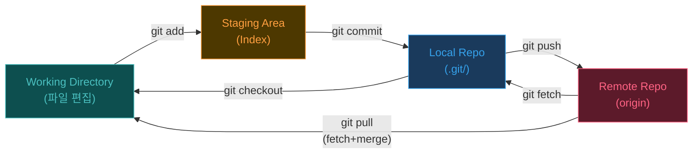

> **핵심:** 모든 Git 명령은 결국 이 4개 공간 사이의 데이터 이동입니다. 아래 모든 섹션에서 "이 명령은 어디에서 어디로 데이터를 옮기는가?"를 기억하세요.

### HEAD란 무엇인가?

이 글 전체에서 `HEAD`가 자주 등장합니다. 먼저 정확히 짚고 넘어갑니다.

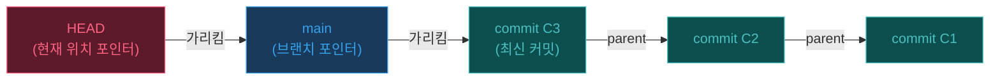

**HEAD는 "지금 내가 어디에 있는가"를 알려주는 포인터입니다.** 보통은 브랜치를 가리키고, 그 브랜치가 다시 최신 커밋을 가리킵니다.

| 개념 | 정체 | 비유 |
|------|------|------|
| **HEAD** | 현재 체크아웃된 위치를 가리키는 포인터 | "You are here" 표지판 |
| **브랜치** (main, feature/x) | 특정 커밋을 가리키는 포인터 | 책갈피 |
| **커밋** | 코드의 스냅샷 + 부모 커밋 링크 | 사진 (되돌릴 수 있는) |

HEAD가 사용되는 핵심 패턴:

```bash
git diff HEAD          # Working Dir과 현재 커밋 비교
git reset --soft HEAD~1  # HEAD를 1개 전 커밋으로 이동 (변경은 유지)
git log HEAD~5..HEAD   # 최근 5개 커밋 보기
```

> **Detached HEAD:** `git checkout <커밋해시>`로 브랜치가 아닌 특정 커밋을 직접 체크아웃하면 HEAD가 브랜치를 거치지 않고 커밋을 직접 가리킵니다. 이 상태에서 커밋하면 어떤 브랜치에도 속하지 않으므로, 반드시 `git checkout -b <새 브랜치>`로 브랜치를 만들어주세요.

---

## 2. git add & git commit — 변경을 기록하는 기본 단위

가장 기본적인 워크플로우: 파일 수정 → 스테이징 → 커밋.

<div class="chart-steps">
  <div style="font-size:0.85rem; font-weight:700; color:var(--text-primary); margin-bottom:12px;">기본 Edit → Add → Commit 사이클</div>
  <div class="chart-step">
    <div class="chart-step-indicator">
      <div class="chart-step-dot green">1</div>
      <div class="chart-step-line"></div>
    </div>
    <div class="chart-step-content">
      <div class="chart-step-title">파일 수정 (Working Directory)</div>
      <div class="chart-step-desc">에디터에서 코드를 수정합니다. 이 시점에서 변경은 Working Directory에만 존재합니다.</div>
      <span class="chart-step-badge green">Working Directory</span>
    </div>
  </div>
  <div class="chart-step">
    <div class="chart-step-indicator">
      <div class="chart-step-dot orange">2</div>
      <div class="chart-step-line"></div>
    </div>
    <div class="chart-step-content">
      <div class="chart-step-title">git add — 스테이징</div>
      <div class="chart-step-desc">커밋에 포함할 변경을 선택합니다. <code>git add -p</code>를 쓰면 파일 내 특정 부분만 선택 가능.</div>
      <span class="chart-step-badge orange">Working Dir → Staging Area</span>
    </div>
  </div>
  <div class="chart-step">
    <div class="chart-step-indicator">
      <div class="chart-step-dot yellow">3</div>
      <div class="chart-step-line"></div>
    </div>
    <div class="chart-step-content">
      <div class="chart-step-title">git status — 상태 확인</div>
      <div class="chart-step-desc">Staged(초록), Unstaged(빨강), Untracked 파일을 확인합니다.</div>
      <span class="chart-step-badge yellow">확인 단계</span>
    </div>
  </div>
  <div class="chart-step">
    <div class="chart-step-indicator">
      <div class="chart-step-dot pink">4</div>
    </div>
    <div class="chart-step-content">
      <div class="chart-step-title">git commit — 스냅샷 저장</div>
      <div class="chart-step-desc">Staging Area의 내용을 Local Repository에 새 커밋으로 저장합니다.</div>
      <span class="chart-step-badge pink">Staging Area → Local Repo</span>
    </div>
  </div>
</div>

### git add 옵션 비교

| 명령 | 동작 | 사용 시점 |
|------|------|----------|
| `git add <file>` | 특정 파일만 스테이징 | 정확히 원하는 파일만 커밋할 때 |
| `git add -p` | 파일 내 변경을 hunk 단위로 선택 | 하나의 파일에 여러 변경이 섞여 있을 때 |
| `git add .` | 현재 디렉토리 하위 전체 | 모든 변경을 한 번에 커밋할 때 |
| `git add -A` | 전체 리포지토리의 모든 변경 | 루트에서 전체 커밋 (삭제 포함) |

### 좋은 커밋 메시지의 구조

```bash
# 형식
git commit -m "type: 한 줄 요약 (50자 이내)"

# 예시
git commit -m "feat: 유저 로그인 API 추가"
git commit -m "fix: pCTR 모델 로딩 시 null pointer 수정"
git commit -m "refactor: bid shading 모듈 인터페이스 분리"
```

> **Tip:** `git commit --amend`는 마지막 커밋의 메시지나 내용을 수정합니다. 단, 이미 push한 커밋은 amend하지 마세요 — force push가 필요해집니다.

---

## 3. git diff — 변경 사항 비교의 모든 것

`git diff`는 **어떤 두 시점**을 비교하느냐에 따라 완전히 다른 결과를 보여줍니다.

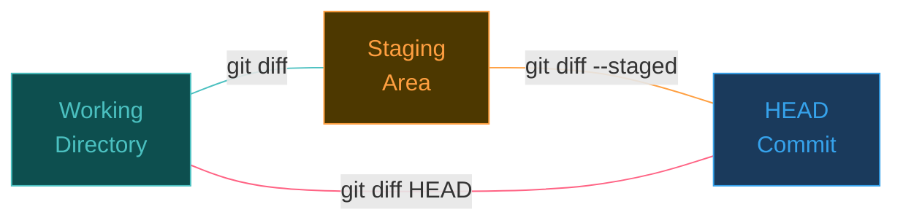

| 명령 | 비교 대상 | 용도 |
|------|----------|------|
| `git diff` | Working Dir vs Staging | 아직 `add`하지 않은 변경 확인 |
| `git diff --staged` | Staging vs HEAD | `commit` 전 최종 점검 |
| `git diff HEAD` | Working Dir vs HEAD | 전체 변경을 한눈에 |
| `git diff main..feature` | 두 브랜치 간 차이 | PR 전 변경 범위 확인 |
| `git diff HEAD~3..HEAD` | 최근 3개 커밋의 변경 | 작업 범위 리뷰 |

### diff 출력 읽는 법

```diff
diff --git a/src/model.py b/src/model.py
index 3a1b2c3..4d5e6f7 100644
--- a/src/model.py        ← 변경 전 파일
+++ b/src/model.py        ← 변경 후 파일
@@ -10,7 +10,8 @@        ← 10번째 줄부터 7줄 → 8줄로 변경
 class CTRModel:
     def __init__(self):
-        self.lr = 0.01    ← 삭제된 줄 (빨강)
+        self.lr = 0.001   ← 추가된 줄 (초록)
+        self.dropout = 0.3
         self.epochs = 10
```

---

## 4. git stash — 작업 중 임시 저장소

작업 도중 급한 일이 생겼을 때, 현재 변경을 **임시 저장**하고 다른 브랜치로 이동할 수 있습니다.

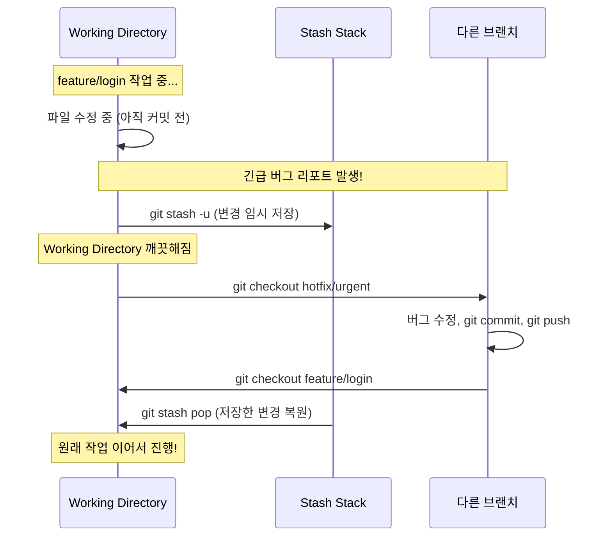

### stash 명령어 정리

| 명령 | 동작 | 비고 |
|------|------|------|
| `git stash` | 현재 변경 임시 저장 | tracked 파일만 |
| `git stash -u` | untracked 파일 포함 저장 | 새로 만든 파일도 포함 |
| `git stash push -m "메시지"` | 설명 붙여서 저장 | 여러 stash 관리 시 유용 |
| `git stash list` | 저장 목록 확인 | `stash@{0}`, `stash@{1}`, ... |
| `git stash pop` | 최근 stash 적용 + 삭제 | 가장 많이 사용 |
| `git stash apply` | 적용만 (삭제 안 함) | 여러 브랜치에 같은 변경 적용 시 |
| `git stash drop stash@{n}` | 특정 stash 삭제 | 불필요한 stash 정리 |
| `git stash clear` | 전체 stash 삭제 | 주의: 복구 불가 |

> **Tip:** stash는 스택 구조입니다. 가장 최근에 저장한 것이 `stash@{0}`이고, `pop`하면 가장 최근 것이 나옵니다.

---

## 5. git fetch vs git pull — Remote 동기화의 두 가지 방법

이 둘의 차이를 모르면, 의도치 않은 merge가 발생하거나 작업이 꼬일 수 있습니다.

<div class="chart-cards" style="grid-template-columns: repeat(2, 1fr);">
  <div class="chart-card">
    <div class="chart-card-header">
      <div class="chart-card-icon blue">F</div>
      <div>
        <div class="chart-card-name">git fetch</div>
        <div class="chart-card-subtitle">안전한 다운로드</div>
      </div>
    </div>
    <div class="chart-card-body">
      <div class="chart-card-row">
        <span class="chart-card-row-label">동작</span>
        <span class="chart-card-row-value">Remote → Local Repo 다운로드</span>
      </div>
      <div class="chart-card-row">
        <span class="chart-card-row-label">Working Dir</span>
        <span class="chart-card-row-value">변경 없음 (안전)</span>
      </div>
      <div class="chart-card-row">
        <span class="chart-card-row-label">다음 단계</span>
        <span class="chart-card-row-value">git merge 또는 git rebase 수동 실행</span>
      </div>
      <div class="chart-card-row">
        <span class="chart-card-row-label">사용 시점</span>
        <span class="chart-card-row-value">변경을 먼저 확인하고 싶을 때</span>
      </div>
    </div>
    <div class="chart-card-tags">
      <span class="chart-card-tag">안전</span>
      <span class="chart-card-tag">2단계</span>
    </div>
  </div>
  <div class="chart-card">
    <div class="chart-card-header">
      <div class="chart-card-icon orange">P</div>
      <div>
        <div class="chart-card-name">git pull</div>
        <div class="chart-card-subtitle">한 번에 가져오기</div>
      </div>
    </div>
    <div class="chart-card-body">
      <div class="chart-card-row">
        <span class="chart-card-row-label">동작</span>
        <span class="chart-card-row-value">git fetch + git merge 자동 실행</span>
      </div>
      <div class="chart-card-row">
        <span class="chart-card-row-label">Working Dir</span>
        <span class="chart-card-row-value">즉시 업데이트 (충돌 가능)</span>
      </div>
      <div class="chart-card-row">
        <span class="chart-card-row-label">다음 단계</span>
        <span class="chart-card-row-value">없음 (자동 merge)</span>
      </div>
      <div class="chart-card-row">
        <span class="chart-card-row-label">사용 시점</span>
        <span class="chart-card-row-value">빠르게 최신 코드를 받고 싶을 때</span>
      </div>
    </div>
    <div class="chart-card-tags">
      <span class="chart-card-tag">빠름</span>
      <span class="chart-card-tag">1단계</span>
    </div>
  </div>
</div>

두 명령의 흐름을 시퀀스 다이어그램으로 비교하면:

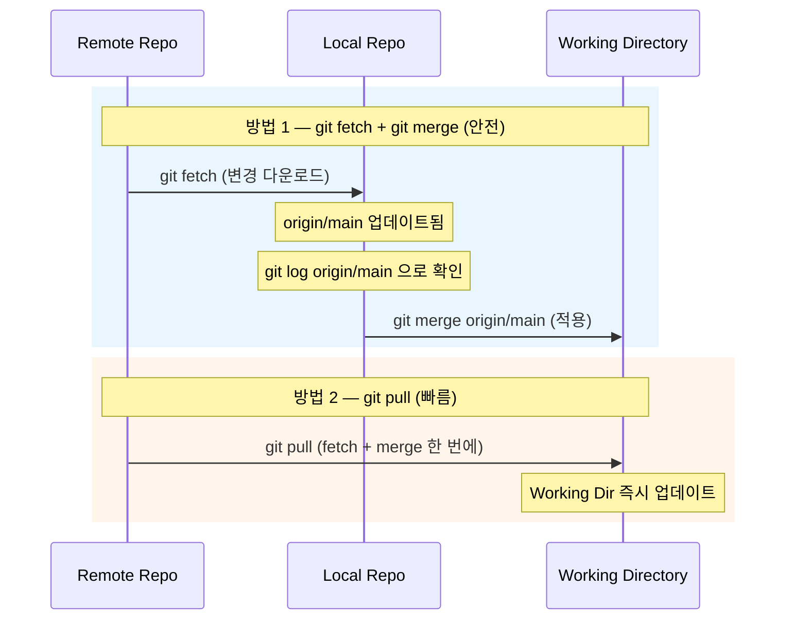

> **실무 권장:** `git pull --rebase`를 사용하면 불필요한 merge commit 없이 깔끔한 히스토리를 유지할 수 있습니다. 많은 팀이 이 방식을 기본으로 설정합니다:
> ```bash
> git config --global pull.rebase true
> ```

### "Divergent Branch" 경고 — git pull이 혈압을 올리는 이유

어느 날 평소처럼 `git pull`을 했는데 이런 메시지가 뜹니다:

```
hint: You have divergent branches and need to specify how to reconcile them.
hint: You can do so by running one of the following commands sometime before
hint: your next pull:
hint:
hint:   git config pull.rebase false  # merge
hint:   git config pull.rebase true   # rebase
hint:   git config pull.ff only       # fast-forward only
hint:
hint: You can replace "git config" with "git config --global" to set a default
hint: preference for all repositories.
```

**왜 이 경고가 뜨는가?** Local과 Remote가 **각각 독립적으로 커밋을 쌓아서 분기(diverge)된 상태**이기 때문입니다:

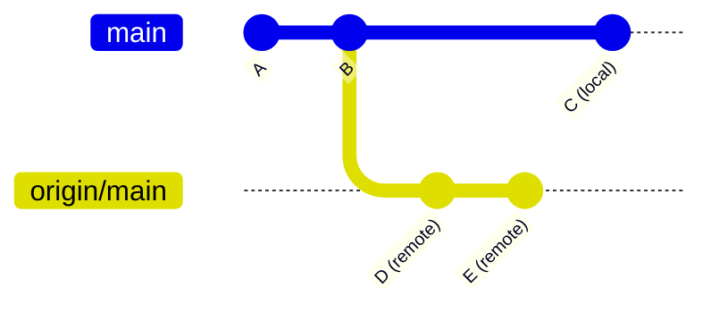

이 상태에서 `git pull`은 두 갈래를 합쳐야 하는데, **어떻게 합칠지(merge? rebase? 거부?)를 Git이 모르기 때문에** 사용자에게 묻는 것입니다. Git 2.27부터 이 경고가 추가되었고, 기본 전략을 설정하지 않으면 매번 출력됩니다.

### git pull의 3가지 전략: merge vs rebase vs ff-only

| 전략 | 설정 | 동작 | 히스토리 모양 | 적합한 상황 |
|------|------|------|-------------|------------|
| **merge** | `pull.rebase false` | fetch + merge → 합류 커밋 생성 | 갈래가 보이는 다이아몬드 형태 | merge commit을 명시적으로 남기고 싶을 때 |
| **rebase** | `pull.rebase true` | fetch + rebase → 내 커밋을 remote 뒤에 재배치 | 일직선 | 깔끔한 히스토리 선호, 대부분의 실무 팀 |
| **ff-only** | `pull.ff only` | fast-forward가 가능할 때만 pull, 불가능하면 **거부** | 일직선 (항상) | 분기 자체를 허용하지 않는 엄격한 워크플로우 |

#### Fast-Forward란 정확히 무엇인가?

Fast-forward는 **"합칠 것이 없는" 상황**입니다. Local에 추가 커밋이 없고, Remote만 앞서 나간 경우:

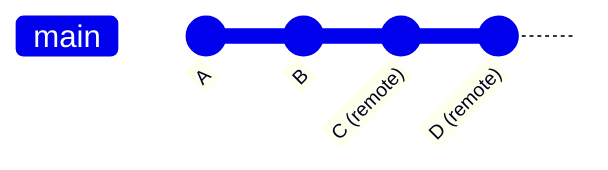

이 경우 Local의 `main` 포인터를 Remote의 최신 커밋으로 **그냥 앞으로 옮기면** 됩니다 — merge도 rebase도 필요 없이, 포인터만 "빨리 감기(fast-forward)"합니다. 충돌 가능성이 0이므로 가장 안전합니다.

**`pull.ff only`의 의미**: "fast-forward가 가능한 상황에서만 pull을 수행하고, 내가 로컬 커밋을 쌓아서 분기가 발생한 상태라면 pull을 거부한다." 즉, **분기가 생기기 전에 먼저 해결하라**는 엄격한 정책입니다. 이 경우 사용자는 직접 `git rebase` 또는 `git merge`를 선택해서 분기를 해소한 뒤 다시 pull해야 합니다.

### git config로 기본 전략 설정하기

경고를 영구적으로 없애려면 기본 전략을 설정합니다:

```bash
# 방법 1: rebase (가장 많이 쓰는 실무 설정)
git config --global pull.rebase true

# 방법 2: merge (전통적 방식, merge commit 남김)
git config --global pull.rebase false

# 방법 3: fast-forward only (분기 자체를 거부)
git config --global pull.ff only
```

`--global`은 모든 저장소에 적용됩니다. 특정 저장소에만 다르게 설정하려면 `--global`을 빼면 됩니다:

```bash
# 이 저장소에서만 rebase 사용
git config pull.rebase true
```

> **실무 추천 요약:**
> - **개인 프로젝트** 또는 **소규모 팀**: `pull.rebase true` — 히스토리가 깔끔하고, 대부분의 상황에서 안전
> - **팀 컨벤션이 이미 있다면**: 팀 설정을 따르세요. merge 기반 워크플로우를 쓰는 팀에서 혼자 rebase하면 히스토리가 꼬입니다
> - **분기를 원천 차단하고 싶다면**: `pull.ff only` — 가장 엄격하지만, `git pull` 전에 항상 최신 상태를 유지해야 하는 규율이 필요

---

## 6. Branching — 브랜치의 생성, 이동, 삭제

브랜치는 **특정 커밋을 가리키는 포인터**입니다. 새 브랜치를 만드는 것은 포인터 하나를 추가하는 것이므로 거의 비용이 없습니다.

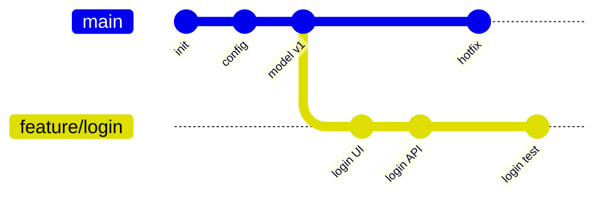

위 다이어그램에서 `main`과 `feature/login`은 독립적으로 커밋을 쌓고 있습니다. 서로의 작업에 영향을 주지 않습니다.

### 브랜치 명령어

| 명령 | 동작 | 비고 |
|------|------|------|
| `git branch` | 로컬 브랜치 목록 | 현재 브랜치에 `*` 표시 |
| `git branch -a` | 로컬 + 리모트 브랜치 전체 | `remotes/origin/...` 포함 |
| `git branch feature/x` | 새 브랜치 생성 | 이동하지는 않음 |
| `git checkout -b feature/x` | 생성 + 이동 | 가장 많이 쓰는 패턴 |
| `git switch feature/x` | 브랜치 이동 | Git 2.23+ 최신 방식 |
| `git switch -c feature/x` | 생성 + 이동 | `checkout -b`의 최신 대안 |
| `git branch -d feature/x` | 병합된 브랜치 삭제 | merge 안 된 경우 거부 |
| `git branch -D feature/x` | 강제 삭제 | 주의: merge 여부 무시 |

### 브랜치 네이밍 컨벤션

```
feature/  → 새 기능 개발        (feature/user-auth)
bugfix/   → 버그 수정           (bugfix/null-pointer)
hotfix/   → 긴급 수정           (hotfix/prod-crash)
release/  → 릴리스 준비         (release/v2.1.0)
chore/    → 설정/인프라 변경    (chore/update-deps)
```

---

## 7. git merge vs git rebase — 브랜치 통합의 두 가지 철학

같은 상황에서 merge와 rebase는 완전히 다른 히스토리를 만듭니다.

### Merge: 히스토리 보존

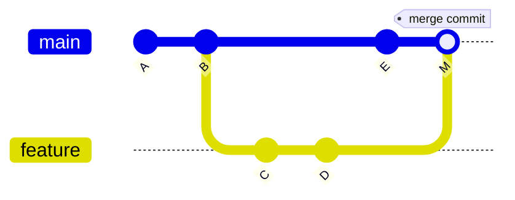

`git merge feature`는 양쪽 브랜치의 끝점을 합치는 **merge commit (M)**을 생성합니다. 원본 커밋 C, D가 그대로 보존됩니다.

### Rebase: 히스토리 정리

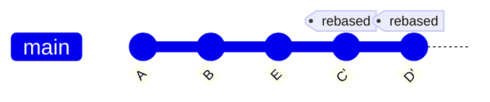

`git rebase main`은 feature 브랜치의 커밋 C, D를 main의 끝(E) 뒤에 **복사**합니다. 원본 C, D는 사라지고 새로운 C', D'이 생깁니다.

<div class="chart-cards" style="grid-template-columns: repeat(2, 1fr);">
  <div class="chart-card">
    <div class="chart-card-header">
      <div class="chart-card-icon green">M</div>
      <div>
        <div class="chart-card-name">git merge</div>
        <div class="chart-card-subtitle">히스토리 보존</div>
      </div>
    </div>
    <div class="chart-card-body">
      <div class="chart-card-row">
        <span class="chart-card-row-label">히스토리</span>
        <span class="chart-card-row-value">비선형 (merge commit 생성)</span>
      </div>
      <div class="chart-card-row">
        <span class="chart-card-row-label">원본 커밋</span>
        <span class="chart-card-row-value">보존됨 (해시 변경 없음)</span>
      </div>
      <div class="chart-card-row">
        <span class="chart-card-row-label">안전성</span>
        <span class="chart-card-row-value">높음 — 공유 브랜치에 안전</span>
      </div>
      <div class="chart-card-row">
        <span class="chart-card-row-label">단점</span>
        <span class="chart-card-row-value">히스토리가 복잡해질 수 있음</span>
      </div>
      <div class="chart-card-row">
        <span class="chart-card-row-label">적합한 상황</span>
        <span class="chart-card-row-value">main 통합, PR merge</span>
      </div>
    </div>
    <div class="chart-card-tags">
      <span class="chart-card-tag">Non-destructive</span>
      <span class="chart-card-tag">Shared Branch</span>
    </div>
  </div>
  <div class="chart-card">
    <div class="chart-card-header">
      <div class="chart-card-icon orange">R</div>
      <div>
        <div class="chart-card-name">git rebase</div>
        <div class="chart-card-subtitle">히스토리 정리</div>
      </div>
    </div>
    <div class="chart-card-body">
      <div class="chart-card-row">
        <span class="chart-card-row-label">히스토리</span>
        <span class="chart-card-row-value">선형 (깔끔한 일직선)</span>
      </div>
      <div class="chart-card-row">
        <span class="chart-card-row-label">원본 커밋</span>
        <span class="chart-card-row-value">재작성됨 (새 해시)</span>
      </div>
      <div class="chart-card-row">
        <span class="chart-card-row-label">안전성</span>
        <span class="chart-card-row-value">위험 — 공유 브랜치 금지</span>
      </div>
      <div class="chart-card-row">
        <span class="chart-card-row-label">단점</span>
        <span class="chart-card-row-value">force push 필요할 수 있음</span>
      </div>
      <div class="chart-card-row">
        <span class="chart-card-row-label">적합한 상황</span>
        <span class="chart-card-row-value">로컬 feature 브랜치 정리</span>
      </div>
    </div>
    <div class="chart-card-tags">
      <span class="chart-card-tag">Linear History</span>
      <span class="chart-card-tag">Local Only</span>
    </div>
  </div>
</div>

> **Golden Rule:** 이미 Remote에 push한 커밋은 rebase하지 마세요. 다른 팀원의 히스토리와 충돌합니다.

### 언제 무엇을 쓸까?

| 상황 | 권장 | 이유 |
|------|------|------|
| main에 feature 브랜치 통합 (PR) | `merge` | 히스토리 보존, 롤백 쉬움 |
| feature 브랜치에 main 최신 반영 | `rebase` | 깔끔한 히스토리, PR diff 명확 |
| 로컬 커밋 정리 (push 전) | `rebase -i` | squash, reword로 커밋 정리 |
| 팀 규칙이 없을 때 | `merge` | 더 안전한 기본값 |

---

## 8. git push — Local에서 Remote로

`git push`는 Local Repository의 커밋을 Remote Repository로 업로드합니다.

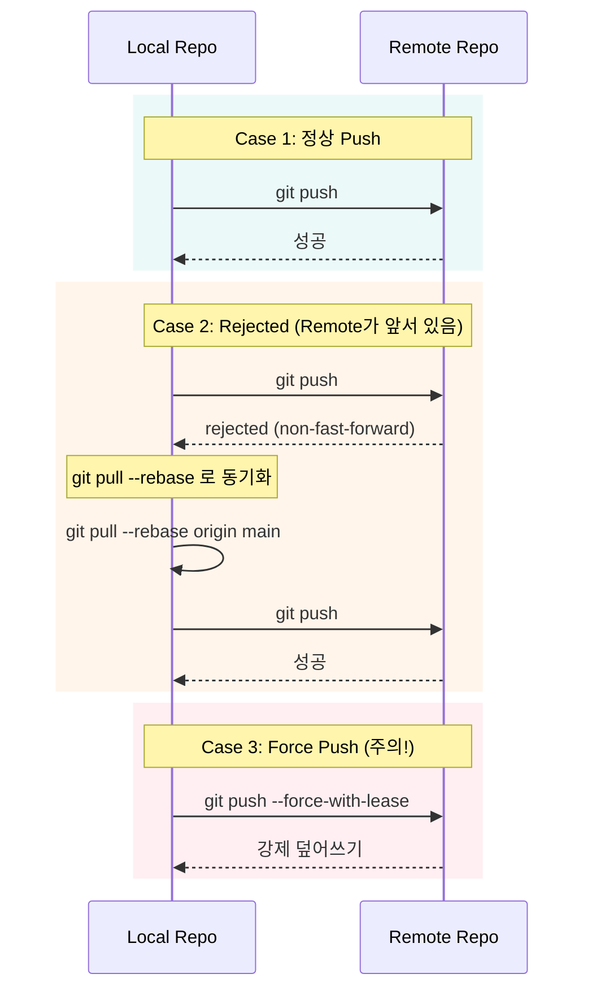

### push 명령어 비교

| 명령 | 동작 | 안전성 |
|------|------|--------|
| `git push` | 현재 브랜치를 upstream으로 push | 안전 |
| `git push -u origin feature/x` | upstream 설정 + push | 안전 (최초 push 시) |
| `git push --force-with-lease` | 강제 push (다른 사람 커밋 확인) | 보통 |
| `git push --force` | 강제 push (확인 없이 덮어쓰기) | 위험 |

> **항상 `--force-with-lease`를 쓰세요.** `--force`는 다른 팀원이 push한 커밋도 무조건 덮어쓰지만, `--force-with-lease`는 마지막으로 fetch한 이후 다른 사람이 push했다면 거부합니다.

---

## 9. Conflict 해결 — 충돌은 피할 수 없다

merge나 rebase 중 같은 파일의 같은 부분을 양쪽에서 수정했다면, Git은 자동으로 합칠 수 없어 **충돌(conflict)**을 발생시킵니다.

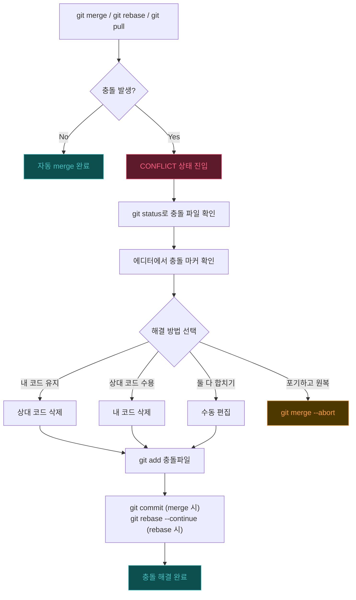

### 충돌 마커 읽는 법

```text
<<<<<<< HEAD (현재 브랜치 — 내 코드)
learning_rate = 0.001
=======
learning_rate = 0.01
>>>>>>> feature/experiment (들어오는 브랜치 — 상대 코드)
```

해결 후:

```python
learning_rate = 0.005  # 둘 다 참고하여 결정
```

그리고 `git add`로 해결한 파일을 스테이징한 뒤 `git commit` (또는 `git rebase --continue`)으로 마무리합니다.

> **Tip:** VS Code, IntelliJ 등 대부분의 에디터에서 충돌 마커를 감지하고 "Accept Current / Accept Incoming / Accept Both" 버튼을 제공합니다.

---

## 10. 자주 쓰는 보조 명령어 모음

<div class="chart-cards">
  <div class="chart-card">
    <div class="chart-card-header">
      <div class="chart-card-icon blue">L</div>
      <div>
        <div class="chart-card-name">git log</div>
        <div class="chart-card-subtitle">커밋 히스토리 조회</div>
      </div>
    </div>
    <div class="chart-card-body">
      <div class="chart-card-row">
        <span class="chart-card-row-label">기본</span>
        <span class="chart-card-row-value">git log</span>
      </div>
      <div class="chart-card-row">
        <span class="chart-card-row-label">한 줄</span>
        <span class="chart-card-row-value">git log --oneline</span>
      </div>
      <div class="chart-card-row">
        <span class="chart-card-row-label">그래프</span>
        <span class="chart-card-row-value">git log --oneline --graph --all</span>
      </div>
    </div>
    <div class="chart-card-tags">
      <span class="chart-card-tag">조회</span>
    </div>
  </div>
  <div class="chart-card">
    <div class="chart-card-header">
      <div class="chart-card-icon pink">R</div>
      <div>
        <div class="chart-card-name">git reset</div>
        <div class="chart-card-subtitle">커밋 되돌리기</div>
      </div>
    </div>
    <div class="chart-card-body">
      <div class="chart-card-row">
        <span class="chart-card-row-label">--soft</span>
        <span class="chart-card-row-value">commit 취소 (staging 유지)</span>
      </div>
      <div class="chart-card-row">
        <span class="chart-card-row-label">--mixed</span>
        <span class="chart-card-row-value">commit + add 취소 (기본값)</span>
      </div>
      <div class="chart-card-row">
        <span class="chart-card-row-label">--hard</span>
        <span class="chart-card-row-value">모든 변경 삭제 (위험!)</span>
      </div>
    </div>
    <div class="chart-card-tags">
      <span class="chart-card-tag">되돌리기</span>
      <span class="chart-card-tag">주의</span>
    </div>
  </div>
  <div class="chart-card">
    <div class="chart-card-header">
      <div class="chart-card-icon green">V</div>
      <div>
        <div class="chart-card-name">git revert</div>
        <div class="chart-card-subtitle">안전한 되돌리기</div>
      </div>
    </div>
    <div class="chart-card-body">
      <div class="chart-card-row">
        <span class="chart-card-row-label">동작</span>
        <span class="chart-card-row-value">되돌리기 커밋을 새로 생성</span>
      </div>
      <div class="chart-card-row">
        <span class="chart-card-row-label">히스토리</span>
        <span class="chart-card-row-value">원본 커밋 보존 (안전)</span>
      </div>
      <div class="chart-card-row">
        <span class="chart-card-row-label">사용</span>
        <span class="chart-card-row-value">이미 push한 커밋 되돌릴 때</span>
      </div>
    </div>
    <div class="chart-card-tags">
      <span class="chart-card-tag">안전</span>
      <span class="chart-card-tag">push 후</span>
    </div>
  </div>
  <div class="chart-card">
    <div class="chart-card-header">
      <div class="chart-card-icon orange">C</div>
      <div>
        <div class="chart-card-name">git cherry-pick</div>
        <div class="chart-card-subtitle">특정 커밋만 가져오기</div>
      </div>
    </div>
    <div class="chart-card-body">
      <div class="chart-card-row">
        <span class="chart-card-row-label">동작</span>
        <span class="chart-card-row-value">다른 브랜치의 커밋을 복사</span>
      </div>
      <div class="chart-card-row">
        <span class="chart-card-row-label">사용</span>
        <span class="chart-card-row-value">git cherry-pick &lt;hash&gt;</span>
      </div>
      <div class="chart-card-row">
        <span class="chart-card-row-label">주의</span>
        <span class="chart-card-row-value">새 해시 생성 (복사본)</span>
      </div>
    </div>
    <div class="chart-card-tags">
      <span class="chart-card-tag">선택적</span>
    </div>
  </div>
  <div class="chart-card">
    <div class="chart-card-header">
      <div class="chart-card-icon yellow">T</div>
      <div>
        <div class="chart-card-name">git tag</div>
        <div class="chart-card-subtitle">릴리스 표시</div>
      </div>
    </div>
    <div class="chart-card-body">
      <div class="chart-card-row">
        <span class="chart-card-row-label">lightweight</span>
        <span class="chart-card-row-value">git tag v1.0.0</span>
      </div>
      <div class="chart-card-row">
        <span class="chart-card-row-label">annotated</span>
        <span class="chart-card-row-value">git tag -a v1.0.0 -m "msg"</span>
      </div>
      <div class="chart-card-row">
        <span class="chart-card-row-label">push</span>
        <span class="chart-card-row-value">git push origin --tags</span>
      </div>
    </div>
    <div class="chart-card-tags">
      <span class="chart-card-tag">릴리스</span>
    </div>
  </div>
  <div class="chart-card">
    <div class="chart-card-header">
      <div class="chart-card-icon green">S</div>
      <div>
        <div class="chart-card-name">git reflog</div>
        <div class="chart-card-subtitle">Git의 안전망</div>
      </div>
    </div>
    <div class="chart-card-body">
      <div class="chart-card-row">
        <span class="chart-card-row-label">동작</span>
        <span class="chart-card-row-value">HEAD 이동 기록 전체 조회</span>
      </div>
      <div class="chart-card-row">
        <span class="chart-card-row-label">사용</span>
        <span class="chart-card-row-value">실수로 삭제한 커밋 복구</span>
      </div>
      <div class="chart-card-row">
        <span class="chart-card-row-label">복구</span>
        <span class="chart-card-row-value">git reset --hard HEAD@{n}</span>
      </div>
    </div>
    <div class="chart-card-tags">
      <span class="chart-card-tag">복구</span>
      <span class="chart-card-tag">안전망</span>
    </div>
  </div>
</div>

### git reset 모드 상세 비교

| 모드 | Staging Area | Working Directory | 사용 시점 |
|------|-------------|-------------------|----------|
| `--soft` | 유지 | 유지 | commit 메시지만 수정하고 싶을 때 |
| `--mixed` (기본값) | 초기화 | 유지 | add까지 취소하고 다시 선별할 때 |
| `--hard` | 초기화 | 초기화 | 모든 변경을 완전히 버릴 때 (위험!) |

> **`reset --hard`를 쓰기 전에 항상 `git stash`로 백업하세요.** 또는 `git reflog`로 복구 가능한지 확인하세요.

---

## 11. 실무 브랜치 전략 — Git Flow vs GitHub Flow vs Trunk-Based

팀의 규모와 배포 주기에 따라 적합한 브랜치 전략이 다릅니다.

### Git Flow — 정기 릴리스 조직

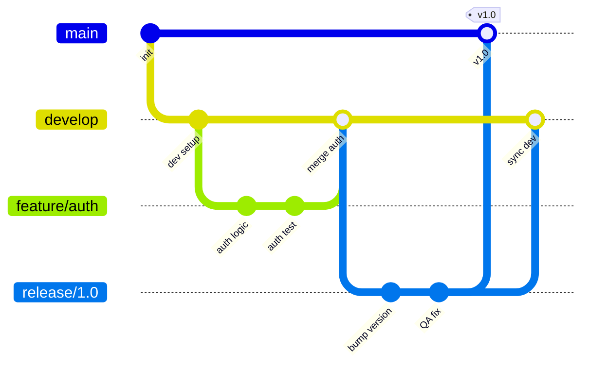

<div class="chart-cards">
  <div class="chart-card">
    <div class="chart-card-header">
      <div class="chart-card-icon orange">G</div>
      <div>
        <div class="chart-card-name">Git Flow</div>
        <div class="chart-card-subtitle">정기 릴리스</div>
      </div>
    </div>
    <div class="chart-card-body">
      <div class="chart-card-row">
        <span class="chart-card-row-label">브랜치</span>
        <span class="chart-card-row-value">main, develop, feature, release, hotfix</span>
      </div>
      <div class="chart-card-row">
        <span class="chart-card-row-label">배포 주기</span>
        <span class="chart-card-row-value">주/월 단위 정기 릴리스</span>
      </div>
      <div class="chart-card-row">
        <span class="chart-card-row-label">적합한 팀</span>
        <span class="chart-card-row-value">대규모, QA 프로세스 존재</span>
      </div>
    </div>
    <div class="chart-card-tags">
      <span class="chart-card-tag">복잡</span>
      <span class="chart-card-tag">엄격</span>
    </div>
  </div>
  <div class="chart-card">
    <div class="chart-card-header">
      <div class="chart-card-icon blue">H</div>
      <div>
        <div class="chart-card-name">GitHub Flow</div>
        <div class="chart-card-subtitle">PR 기반 배포</div>
      </div>
    </div>
    <div class="chart-card-body">
      <div class="chart-card-row">
        <span class="chart-card-row-label">브랜치</span>
        <span class="chart-card-row-value">main + feature 브랜치만</span>
      </div>
      <div class="chart-card-row">
        <span class="chart-card-row-label">배포 주기</span>
        <span class="chart-card-row-value">PR merge 시 자동 배포</span>
      </div>
      <div class="chart-card-row">
        <span class="chart-card-row-label">적합한 팀</span>
        <span class="chart-card-row-value">CI/CD 갖춘 중소 규모 팀</span>
      </div>
    </div>
    <div class="chart-card-tags">
      <span class="chart-card-tag">간단</span>
      <span class="chart-card-tag">CI/CD</span>
    </div>
  </div>
  <div class="chart-card">
    <div class="chart-card-header">
      <div class="chart-card-icon green">T</div>
      <div>
        <div class="chart-card-name">Trunk-Based</div>
        <div class="chart-card-subtitle">빈번한 통합</div>
      </div>
    </div>
    <div class="chart-card-body">
      <div class="chart-card-row">
        <span class="chart-card-row-label">브랜치</span>
        <span class="chart-card-row-value">main + 단명 브랜치 (1-2일)</span>
      </div>
      <div class="chart-card-row">
        <span class="chart-card-row-label">배포 주기</span>
        <span class="chart-card-row-value">하루 여러 번</span>
      </div>
      <div class="chart-card-row">
        <span class="chart-card-row-label">적합한 팀</span>
        <span class="chart-card-row-value">소규모, Feature Flag 사용</span>
      </div>
    </div>
    <div class="chart-card-tags">
      <span class="chart-card-tag">최소</span>
      <span class="chart-card-tag">Feature Flag</span>
    </div>
  </div>
</div>

> **현실적인 선택:** 대부분의 중소 규모 팀은 **GitHub Flow**가 적합합니다. Git Flow는 모바일 앱처럼 릴리스 관리가 복잡한 경우에, Trunk-Based는 Google/Netflix 같은 고도의 자동화가 갖춰진 환경에 적합합니다.

---

## 12. 실무 워크플로우 치트시트 — 상황별 명령어 시퀀스

### Workflow A: 아침에 코드 받고 작업 시작하기

<div class="chart-steps">
  <div style="font-size:0.85rem; font-weight:700; color:var(--text-primary); margin-bottom:12px;">Daily Workflow: 코드 받기 → 작업 → Push</div>
  <div class="chart-step">
    <div class="chart-step-indicator">
      <div class="chart-step-dot green">1</div>
      <div class="chart-step-line"></div>
    </div>
    <div class="chart-step-content">
      <div class="chart-step-title">git fetch origin</div>
      <div class="chart-step-desc">Remote 변경 사항 확인. Working Directory는 아직 변경 없음.</div>
      <span class="chart-step-badge green">Remote → Local Repo</span>
    </div>
  </div>
  <div class="chart-step">
    <div class="chart-step-indicator">
      <div class="chart-step-dot green">2</div>
      <div class="chart-step-line"></div>
    </div>
    <div class="chart-step-content">
      <div class="chart-step-title">git pull --rebase origin main</div>
      <div class="chart-step-desc">최신 코드를 받으면서 로컬 커밋을 그 위에 재배치.</div>
      <span class="chart-step-badge green">Remote → Working Dir</span>
    </div>
  </div>
  <div class="chart-step">
    <div class="chart-step-indicator">
      <div class="chart-step-dot orange">3</div>
      <div class="chart-step-line"></div>
    </div>
    <div class="chart-step-content">
      <div class="chart-step-title">git checkout -b feature/my-task</div>
      <div class="chart-step-desc">작업용 브랜치를 생성하고 이동.</div>
      <span class="chart-step-badge orange">브랜치 생성</span>
    </div>
  </div>
  <div class="chart-step">
    <div class="chart-step-indicator">
      <div class="chart-step-dot yellow">4</div>
      <div class="chart-step-line"></div>
    </div>
    <div class="chart-step-content">
      <div class="chart-step-title">코드 작성 → git add -p → git commit</div>
      <div class="chart-step-desc">의미 있는 단위로 커밋. -p 옵션으로 변경을 선별.</div>
      <span class="chart-step-badge yellow">Working Dir → Local Repo</span>
    </div>
  </div>
  <div class="chart-step">
    <div class="chart-step-indicator">
      <div class="chart-step-dot pink">5</div>
    </div>
    <div class="chart-step-content">
      <div class="chart-step-title">git push -u origin feature/my-task</div>
      <div class="chart-step-desc">Remote에 push하고 PR 생성 준비.</div>
      <span class="chart-step-badge pink">Local Repo → Remote</span>
    </div>
  </div>
</div>

### Workflow B: 작업 중 긴급 핫픽스 요청

<div class="chart-steps">
  <div style="font-size:0.85rem; font-weight:700; color:var(--text-primary); margin-bottom:12px;">Hotfix Workflow: 현재 작업 보존 → 긴급 수정 → 복원</div>
  <div class="chart-step">
    <div class="chart-step-indicator">
      <div class="chart-step-dot green">1</div>
      <div class="chart-step-line"></div>
    </div>
    <div class="chart-step-content">
      <div class="chart-step-title">git stash -u</div>
      <div class="chart-step-desc">현재 변경 임시 저장 (untracked 포함).</div>
      <span class="chart-step-badge green">Working Dir → Stash</span>
    </div>
  </div>
  <div class="chart-step">
    <div class="chart-step-indicator">
      <div class="chart-step-dot orange">2</div>
      <div class="chart-step-line"></div>
    </div>
    <div class="chart-step-content">
      <div class="chart-step-title">git checkout main && git pull</div>
      <div class="chart-step-desc">main으로 이동하고 최신 코드 받기.</div>
      <span class="chart-step-badge orange">Remote → Working Dir</span>
    </div>
  </div>
  <div class="chart-step">
    <div class="chart-step-indicator">
      <div class="chart-step-dot orange">3</div>
      <div class="chart-step-line"></div>
    </div>
    <div class="chart-step-content">
      <div class="chart-step-title">git checkout -b hotfix/urgent-fix</div>
      <div class="chart-step-desc">핫픽스 브랜치 생성.</div>
      <span class="chart-step-badge orange">브랜치 생성</span>
    </div>
  </div>
  <div class="chart-step">
    <div class="chart-step-indicator">
      <div class="chart-step-dot yellow">4</div>
      <div class="chart-step-line"></div>
    </div>
    <div class="chart-step-content">
      <div class="chart-step-title">수정 → git commit → git push</div>
      <div class="chart-step-desc">버그 수정하고 commit, push. PR 생성.</div>
      <span class="chart-step-badge yellow">Working Dir → Remote</span>
    </div>
  </div>
  <div class="chart-step">
    <div class="chart-step-indicator">
      <div class="chart-step-dot pink">5</div>
      <div class="chart-step-line"></div>
    </div>
    <div class="chart-step-content">
      <div class="chart-step-title">git checkout feature/my-task</div>
      <div class="chart-step-desc">원래 작업 브랜치로 복귀.</div>
      <span class="chart-step-badge pink">브랜치 이동</span>
    </div>
  </div>
  <div class="chart-step">
    <div class="chart-step-indicator">
      <div class="chart-step-dot blue">6</div>
    </div>
    <div class="chart-step-content">
      <div class="chart-step-title">git stash pop</div>
      <div class="chart-step-desc">임시 저장한 변경 복원. 원래 작업 이어서 진행.</div>
      <span class="chart-step-badge blue">Stash → Working Dir</span>
    </div>
  </div>
</div>

### Workflow C: PR 전 브랜치 정리

<div class="chart-steps">
  <div style="font-size:0.85rem; font-weight:700; color:var(--text-primary); margin-bottom:12px;">PR 준비: main 최신 반영 → 히스토리 정리 → Push</div>
  <div class="chart-step">
    <div class="chart-step-indicator">
      <div class="chart-step-dot green">1</div>
      <div class="chart-step-line"></div>
    </div>
    <div class="chart-step-content">
      <div class="chart-step-title">git fetch origin</div>
      <div class="chart-step-desc">Remote의 최신 상태 가져오기.</div>
      <span class="chart-step-badge green">Remote → Local Repo</span>
    </div>
  </div>
  <div class="chart-step">
    <div class="chart-step-indicator">
      <div class="chart-step-dot orange">2</div>
      <div class="chart-step-line"></div>
    </div>
    <div class="chart-step-content">
      <div class="chart-step-title">git rebase origin/main</div>
      <div class="chart-step-desc">main의 최신 커밋 위에 내 커밋을 재배치. 충돌 발생 시 해결.</div>
      <span class="chart-step-badge orange">Local Repo 히스토리 재배치</span>
    </div>
  </div>
  <div class="chart-step">
    <div class="chart-step-indicator">
      <div class="chart-step-dot pink">3</div>
    </div>
    <div class="chart-step-content">
      <div class="chart-step-title">git push --force-with-lease</div>
      <div class="chart-step-desc">rebase로 변경된 히스토리를 Remote에 반영. 반드시 --force-with-lease 사용.</div>
      <span class="chart-step-badge pink">Local Repo → Remote (강제)</span>
    </div>
  </div>
</div>

### Workflow D: 실수로 main에 직접 commit한 경우

<div class="chart-steps">
  <div style="font-size:0.85rem; font-weight:700; color:var(--text-primary); margin-bottom:12px;">실수 복구: main 커밋을 새 브랜치로 이전</div>
  <div class="chart-step">
    <div class="chart-step-indicator">
      <div class="chart-step-dot pink">1</div>
      <div class="chart-step-line"></div>
    </div>
    <div class="chart-step-content">
      <div class="chart-step-title">git log --oneline</div>
      <div class="chart-step-desc">실수로 main에 들어간 커밋을 확인.</div>
      <span class="chart-step-badge pink">상황 파악</span>
    </div>
  </div>
  <div class="chart-step">
    <div class="chart-step-indicator">
      <div class="chart-step-dot orange">2</div>
      <div class="chart-step-line"></div>
    </div>
    <div class="chart-step-content">
      <div class="chart-step-title">git branch feature/rescue</div>
      <div class="chart-step-desc">현재 위치에서 새 브랜치 생성. 커밋은 이 브랜치에 남음.</div>
      <span class="chart-step-badge orange">브랜치 생성 (커밋 보존)</span>
    </div>
  </div>
  <div class="chart-step">
    <div class="chart-step-indicator">
      <div class="chart-step-dot yellow">3</div>
      <div class="chart-step-line"></div>
    </div>
    <div class="chart-step-content">
      <div class="chart-step-title">git checkout main</div>
      <div class="chart-step-desc">main 브랜치로 이동.</div>
      <span class="chart-step-badge yellow">브랜치 이동</span>
    </div>
  </div>
  <div class="chart-step">
    <div class="chart-step-indicator">
      <div class="chart-step-dot yellow">4</div>
      <div class="chart-step-line"></div>
    </div>
    <div class="chart-step-content">
      <div class="chart-step-title">git reset --hard origin/main</div>
      <div class="chart-step-desc">main을 Remote 상태로 원복. 실수 커밋은 feature/rescue에만 남음.</div>
      <span class="chart-step-badge yellow">main 원복</span>
    </div>
  </div>
  <div class="chart-step">
    <div class="chart-step-indicator">
      <div class="chart-step-dot green">5</div>
    </div>
    <div class="chart-step-content">
      <div class="chart-step-title">git checkout feature/rescue</div>
      <div class="chart-step-desc">구출한 브랜치에서 작업 이어가기.</div>
      <span class="chart-step-badge green">정상 워크플로우 복귀</span>
    </div>
  </div>
</div>

### 종합 치트시트

| 상황 | 명령어 시퀀스 |
|------|-------------|
| 최신 코드 받기 | `git fetch && git pull --rebase` |
| 새 기능 시작 | `git checkout -b feature/x` |
| 작업 임시 저장 | `git stash -u` |
| 변경 확인 | `git diff --staged` |
| 커밋 메시지 수정 | `git commit --amend` (push 전만!) |
| 마지막 커밋 취소 | `git reset --soft HEAD~1` |
| push한 커밋 되돌리기 | `git revert <hash>` |
| 브랜치에 main 최신 반영 | `git fetch && git rebase origin/main` |
| PR 준비 push | `git push -u origin feature/x` |
| 삭제한 커밋 복구 | `git reflog` → `git reset --hard HEAD@{n}` |
| 특정 커밋만 가져오기 | `git cherry-pick <hash>` |
| 릴리스 태그 | `git tag -a v1.0.0 -m "msg" && git push --tags` |
