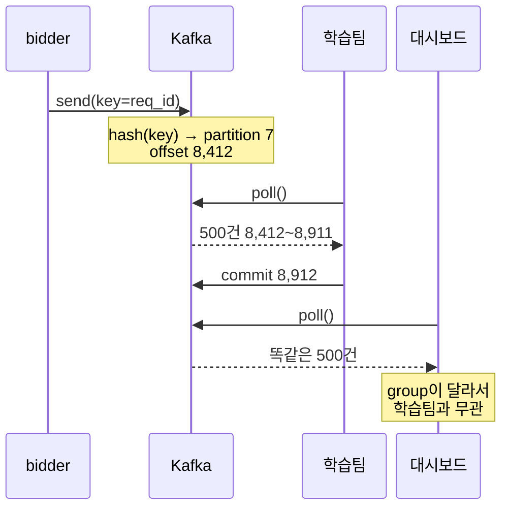
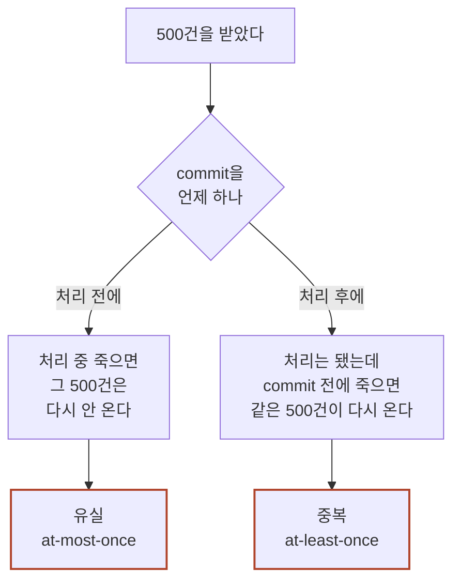

광고 하나가 방금 노출됐다. 요청 번호는 `r-8f21`, 광고 번호는 `9931`, 지면은 `A앱` 의 `main_top` 이다. 그리고 이 사실을 알아야 하는 곳이 넷이다 — 학습팀, 정산팀, 대시보드, 광고주 리포트.

넷이 원하는 것은 다 다르다. 학습팀은 이 줄을 pCTR 모델 학습 데이터로 쓴다. 하루에 한 번 몰아서 읽으면 된다. 정산팀은 매체에 줄 돈을 계산한다. 한 건도 빠지면 안 되고 두 번 세도 안 된다. 대시보드는 몇 초 안에 숫자가 올라가야 한다. 광고주 리포트는 몇 분 늦어도 되지만 광고별로 정확히 갈라야 한다.

줄 자체는 이렇게 생겼다.

```json
{"req_id":"r-8f21","ad_id":9931,"slot":"main_top","media":"A앱","pctr":0.0213,"bid":182.4,"ts":1786000101}
```

이 줄의 뼈대를 만드는 것은 `bidder` 다. `pctr` 0.0213 과 `bid` 182.4 는 응찰을 계산한 그 프로세스 안에만 있는 값이라 다른 데서는 만들 수 없다. 노출됐다는 확인만 매체가 `log-collector` 로 따로 보내고, 두 줄은 `req_id` 로 이어 붙는다. 그러니 이 줄이 처음 생기는 자리는 12ms 예산이 걸린 입찰 경로 위다.

이 글의 숫자는 전부 설명을 위해 지어낸 값이다. 실제 트래픽·지연·배포 주기는 회사마다 다르다.

> **한 줄 요약:** Kafka는 한 번 쓰고 여러 팀이 각자 읽는 로그 보관소다. 보내는 쪽과 읽는 쪽을 떼어 놓는 것이 전부다.

> **골라 읽는 법** — 절이 8개인 긴 글입니다. 처음부터 다 읽지 않아도 됩니다.
>
> - Kafka가 왜 필요한지만 → 1절
> - producer가 무엇인지 → 2절
> - partition을 몇 개로 잡을지 → 3절
> - 여러 팀이 같은 로그를 읽는 구조 → 4~5절
> - 보존 기간을 며칠로 잡을지 → 6절
> - 로그가 학습 데이터가 되는 부분 → 7절
> - 흔한 오해만 → 8절

---

## 1. Kafka 없이 하면 어디서 터지나

**로그를 넷에게 나르는 방법은 Kafka 말고도 셋이 있다. 셋 다 돌아가긴 하는데, 각자 다른 자리에서 줄이 사라진다.**

셋을 차례로 놓고 어디서 끊기는지 센다. 앞으로 나오는 볼륨은 하나로 고정한다. 노출 로그는 하루 2억 2,800만 줄이고, 초로 나누면 초당 2,639건이다. 응찰 요청은 매체 열 곳을 합쳐 초당 30,000건이고, `bidder` 는 대당 1,000건을 받아 30대다. 노출 2,639건은 그중 낙찰돼 실제로 뜬 것만 센 수다. 전부 가상 수치다.

### ① `bidder` 가 네 팀 서버를 직접 부른다

가장 먼저 떠오르는 방법이다. 줄이 생기면 그 자리에서 네 곳에 HTTP로 알린다. 새 팀이 생기면 주소를 한 줄 더 넣으면 된다.

문제는 시간이다. 12ms는 매체가 요청을 보내고 답을 받기까지 전부다. 앞단(Ingress·API Gateway)이 1.4ms를 쓰고 `bidder` 의 응찰 계산이 8ms를 쓴다고 하자. 사내망 왕복과 받는 쪽 처리를 합쳐 한 호출을 2ms로 잡는다.

| 이 요청 한 건이 쓰는 시간 | ms |
|---|---|
| 앞단 (Ingress · API Gateway) | 1.4 |
| `bidder` 응찰 계산 | 8.0 |
| 학습팀 서버 호출 | 2.0 |
| 정산팀 서버 호출 | 2.0 |
| 대시보드 서버 호출 | 2.0 |
| 광고주 리포트 서버 호출 | 2.0 |
| **합계** | **17.4** |
| **예산** | **12.0** |

2ms가 과하다고 볼 수도 있다. 한 호출이 0.6ms로 아주 빠르다고 해 보자. 그러면 1.4 + 8.0 + 0.6×4 = 11.8ms로 겨우 들어간다. 남는 여유가 0.2ms다. 받는 쪽 넷 중 하나만 조금 느려져도 그 여유가 없어진다. 우리 응답 시간이 우리가 관리하지 않는 서버 넷에 매달린다.

응답을 안 기다리면 되지 않느냐고 물을 수 있다. 실제로 그렇게 만든다. 그러면 12ms는 지켜진다. 대신 다른 것이 `bidder` 안으로 들어온다.

학습팀이 배포하는 20초를 생각해 보자. 그동안 그 서버는 아무것도 안 받는다. 노출은 초당 2,639건씩 계속 생긴다. 20초면 52,780줄이다. 이 줄들은 `bidder` 프로세스 메모리에 쌓인다.

여기서 답해야 할 질문이 넷이다.

- 얼마나 쌓을 것인가
- 넘치면 버릴 것인가, 아니면 입찰을 막을 것인가
- 재시도는 몇 번 할 것인가
- 재시도 사이 간격은 얼마인가

그리고 답이 받는 쪽마다 다르다. 정산팀 줄은 한 건도 버리면 안 된다. 대시보드 줄은 버려도 다음 초에 새 숫자가 올라온다. 그러니 이 코드가 네 벌 필요하다.

마지막 문제가 남는다. 이 큐는 `bidder` 프로세스 안에 있다. `bidder` 도 하루 4번 배포한다. 배포할 때 큐에 남아 있던 줄은 같이 내려간다. 받는 쪽이 멈춰 있으면 내려가기 전에 비울 수도 없다.

### ② 파일에 쓰고 나중에 옮긴다

두 번째는 로컬 디스크에 줄을 붙여 쓰는 것이다. 그리고 5분마다 한 번씩 파일을 공용 저장소로 옮긴다. 쓰는 쪽은 빠르다. 디스크에 덧붙이는 것뿐이라 12ms 예산을 거의 안 먹는다. 받는 쪽이 멈춰도 `bidder` 는 아무 영향을 안 받는다.

사라지는 자리는 옮기기 전이다.

초당 2,639줄을 30대가 나눠 받으면 대당 약 88줄이다. 5분은 300초이니 대당 26,400줄이 로컬에 쌓인다. 아직 아무 데도 안 옮겨진 줄이다.

저녁 피크가 끝나면 오토스케일이 30대를 10대로 줄인다. 20대가 내려간다. 내려가는 시점은 옮기는 주기와 아무 상관이 없다. 평균 절반인 13,200줄이 남아 있다고 보면 20대에서 264,000줄이다.

종료 훅에서 마지막으로 한 번 옮기면 되지 않느냐. 정상 종료에는 된다. 디스크가 차거나 커널이 패닉을 내면 훅이 안 돈다. 훅에게 주어지는 시간도 정해져 있고, 그 시간을 넘기면 강제로 종료된다.

파일을 계속 따라 읽는 에이전트를 붙이면 5분이 몇 초로 줄어든다. 맞다. 그래도 에이전트는 그 인스턴스 안에서 돈다. 인스턴스가 사라지면 아직 안 읽은 끝부분도 같이 사라진다.

유실보다 오래 남는 문제가 하나 더 있다. 파일에는 "누가 어디까지 읽었나"가 없다. 학습팀이 지난 3일치를 다시 읽으려면 어느 파일이 어느 시각 것인지를 이름으로 알아내야 한다. 그래서 파일 이름 규칙이 네 팀과의 계약이 된다. 옮기는 쪽이 경로를 한 번 바꾸면 읽는 넷이 다 깨진다.

### ③ DB에 바로 넣는다

세 번째는 줄 하나를 그대로 테이블에 넣는 것이다. 네 팀은 각자 SQL로 가져간다. 유실이 없고 되감아 읽는 것도 SQL 한 줄이다. 앞의 둘보다 확실히 낫다.

깨지는 곳은 인덱스다. 네 팀이 찾는 조건이 다 다르다.

| 읽는 곳 | 어떤 조건으로 찾나 | 필요한 인덱스 |
|---|---|---|
| 학습팀 | 하루치를 통째로 | `ts` |
| 정산팀 | 매체별로 묶어 하루 합계 | `(media, ts)` |
| 대시보드 | 최근 5분을 지면별로 | `(slot, ts)` |
| 광고주 리포트 | 광고별로 기간 합계 | `(ad_id, ts)` |

인덱스가 넷이면 줄 하나를 넣을 때 다섯 군데를 건드린다. 본체 한 곳에 인덱스 네 곳이다. 초당 2,639줄이면 초당 13,195군데다. 저녁 피크에 평균의 3배가 몰린다고 보면 초당 39,585군데가 된다.

숫자만 보면 못 할 것도 없다. 문제는 읽기가 같은 테이블 위에서 돈다는 것이다. 정산팀은 마감에 하루치 2억 2,800만 줄을 통째로 훑는다. 그 스캔이 도는 동안 쓰기 지연이 오른다. 지연이 커넥션 타임아웃을 넘기면 그 순간의 줄은 아예 들어가지 못한다.

집계 테이블을 미리 만들어 두면 그 스캔이 줄어든다. 맞는 말이다. 대신 집계를 돌리는 작업이 새로 생기고, 그 작업이 원본을 읽는 것은 그대로다. 읽는 쪽이 넷에서 다섯이 된 것이다.

그리고 이건 튜닝으로 안 없어진다. 요구가 정면으로 충돌하기 때문이다. 정산팀은 이 테이블을 1년 남기길 원한다. 대시보드는 최근 5분만 빠르면 되는데, 테이블이 커질수록 그 5분 쿼리가 느려진다. 한쪽을 맞추면 다른 쪽이 나빠진다. 한 테이블이 네 팀의 요구를 동시에 만족할 수 없다.

<figure style="text-align:center; margin:2rem 0;">
<svg viewBox="0 0 700 274" role="img" aria-label="Kafka 없이 로그를 나르는 세 방법을 위아래로 나란히 놓은 그림. 세 줄 다 왼쪽의 bidder 에서 출발하지만 각각 다른 지점에서 끊겨, 오른쪽의 학습팀·정산팀·대시보드·광고주 리포트 네 칸에 실선이 하나도 닿지 않는다." style="width:100%; max-width:680px; height:auto; font-family:var(--font-sans)">
<defs>
<marker id="kf1-arr" markerWidth="9" markerHeight="9" refX="7.5" refY="3" orient="auto"><path d="M0,0 L7.5,3 L0,6 Z" style="fill:var(--accent-primary)"/></marker>
</defs>
<rect x="558" y="16" width="136" height="244" rx="10" style="fill:none; stroke:var(--text-muted); stroke-width:1.3; stroke-dasharray:6 4"/>
<text x="626" y="32" text-anchor="middle" style="font-size:11px; fill:var(--text-muted)">이 줄을 읽어야 하는 곳</text>
<rect x="568" y="42" width="116" height="44" rx="9" style="fill:var(--bg-secondary); stroke:var(--border-color); stroke-width:1.5"/>
<text x="626" y="62" text-anchor="middle" style="font-size:12px; fill:var(--text-primary)">학습팀</text>
<text x="626" y="77" text-anchor="middle" style="font-size:9.5px; fill:var(--text-muted)">하루 1회면 된다</text>
<rect x="568" y="94" width="116" height="44" rx="9" style="fill:var(--bg-secondary); stroke:var(--border-color); stroke-width:1.5"/>
<text x="626" y="114" text-anchor="middle" style="font-size:12px; fill:var(--text-primary)">정산팀</text>
<text x="626" y="129" text-anchor="middle" style="font-size:9.5px; fill:var(--text-muted)">한 건도 못 버린다</text>
<rect x="568" y="146" width="116" height="44" rx="9" style="fill:var(--bg-secondary); stroke:var(--border-color); stroke-width:1.5"/>
<text x="626" y="166" text-anchor="middle" style="font-size:12px; fill:var(--text-primary)">대시보드</text>
<text x="626" y="181" text-anchor="middle" style="font-size:9.5px; fill:var(--text-muted)">몇 초 안</text>
<rect x="568" y="198" width="116" height="44" rx="9" style="fill:var(--bg-secondary); stroke:var(--border-color); stroke-width:1.5"/>
<text x="626" y="218" text-anchor="middle" style="font-size:12px; fill:var(--text-primary)">광고주 리포트</text>
<text x="626" y="233" text-anchor="middle" style="font-size:9.5px; fill:var(--text-muted)">몇 분 안</text>
<text x="8" y="34" style="font-size:11px; fill:var(--text-primary)">① 네 팀 서버를 직접 부른다</text>
<rect x="8" y="42" width="84" height="40" rx="9" style="fill:var(--bg-tertiary); stroke:var(--border-color); stroke-width:1.5"/>
<text x="50" y="67" text-anchor="middle" style="font-size:12.5px; fill:var(--text-primary)">bidder</text>
<line x1="92" y1="62" x2="114" y2="62" style="stroke:var(--accent-primary); stroke-width:2" marker-end="url(#kf1-arr)"/>
<rect x="120" y="42" width="150" height="40" rx="9" style="fill:var(--bg-secondary); stroke:var(--accent-primary); stroke-width:2"/>
<text x="195" y="61" text-anchor="middle" style="font-size:12.5px; fill:var(--text-primary)">HTTP 호출 4번</text>
<text x="195" y="75" text-anchor="middle" style="font-size:9.5px; fill:var(--text-muted)">한 번 2ms · 넷이면 8ms</text>
<line x1="270" y1="62" x2="306" y2="62" style="stroke:var(--state-bad); stroke-width:2.4; stroke-dasharray:5 4"/>
<line x1="312" y1="56" x2="324" y2="68" style="stroke:var(--state-bad); stroke-width:2.4"/>
<line x1="324" y1="56" x2="312" y2="68" style="stroke:var(--state-bad); stroke-width:2.4"/>
<line x1="334" y1="62" x2="556" y2="62" style="stroke:var(--text-muted); stroke-width:1; stroke-dasharray:2 5"/>
<text x="440" y="57" text-anchor="middle" style="font-size:9.5px; fill:var(--state-bad)">합계 17.4ms · 예산 12ms 초과</text>
<text x="8" y="120" style="font-size:11px; fill:var(--text-primary)">② 파일에 쓰고 나중에 옮긴다</text>
<rect x="8" y="128" width="84" height="40" rx="9" style="fill:var(--bg-tertiary); stroke:var(--border-color); stroke-width:1.5"/>
<text x="50" y="153" text-anchor="middle" style="font-size:12.5px; fill:var(--text-primary)">bidder</text>
<line x1="92" y1="148" x2="110" y2="148" style="stroke:var(--accent-primary); stroke-width:2" marker-end="url(#kf1-arr)"/>
<rect x="114" y="128" width="170" height="40" rx="9" style="fill:var(--bg-secondary); stroke:var(--accent-primary); stroke-width:2"/>
<text x="199" y="147" text-anchor="middle" style="font-size:12.5px; fill:var(--text-primary)">인스턴스 안 로컬 파일</text>
<text x="199" y="161" text-anchor="middle" style="font-size:9.5px; fill:var(--text-muted)">5분마다 한 번 옮긴다</text>
<line x1="284" y1="148" x2="320" y2="148" style="stroke:var(--state-bad); stroke-width:2.4; stroke-dasharray:5 4"/>
<line x1="326" y1="142" x2="338" y2="154" style="stroke:var(--state-bad); stroke-width:2.4"/>
<line x1="338" y1="142" x2="326" y2="154" style="stroke:var(--state-bad); stroke-width:2.4"/>
<line x1="348" y1="148" x2="556" y2="148" style="stroke:var(--text-muted); stroke-width:1; stroke-dasharray:2 5"/>
<text x="450" y="143" text-anchor="middle" style="font-size:9.5px; fill:var(--state-bad)">20대 축소 · 264,000줄 유실</text>
<text x="8" y="206" style="font-size:11px; fill:var(--text-primary)">③ DB 한 테이블에 바로 넣는다</text>
<rect x="8" y="214" width="84" height="40" rx="9" style="fill:var(--bg-tertiary); stroke:var(--border-color); stroke-width:1.5"/>
<text x="50" y="239" text-anchor="middle" style="font-size:12.5px; fill:var(--text-primary)">bidder</text>
<line x1="92" y1="234" x2="110" y2="234" style="stroke:var(--accent-primary); stroke-width:2" marker-end="url(#kf1-arr)"/>
<rect x="114" y="214" width="200" height="40" rx="9" style="fill:var(--bg-secondary); stroke:var(--accent-primary); stroke-width:2"/>
<text x="214" y="233" text-anchor="middle" style="font-size:12.5px; fill:var(--text-primary)">DB 한 테이블</text>
<text x="214" y="247" text-anchor="middle" style="font-size:9.5px; fill:var(--text-muted)">인덱스 4개 · 초당 13,195군데</text>
<line x1="314" y1="234" x2="350" y2="234" style="stroke:var(--state-bad); stroke-width:2.4; stroke-dasharray:5 4"/>
<line x1="356" y1="228" x2="368" y2="240" style="stroke:var(--state-bad); stroke-width:2.4"/>
<line x1="368" y1="228" x2="356" y2="240" style="stroke:var(--state-bad); stroke-width:2.4"/>
<line x1="378" y1="234" x2="556" y2="234" style="stroke:var(--text-muted); stroke-width:1; stroke-dasharray:2 5"/>
<text x="467" y="229" text-anchor="middle" style="font-size:9.5px; fill:var(--state-bad)">마감 스캔 중 쓰기 실패</text>
</svg>
<figcaption style="margin-top:0.75rem; font-size:0.9rem; color:var(--text-muted)">굵은 실선은 실제로 도는 길, 가는 점선은 가야 하는데 못 가는 길이다. 방법을 셋 다 바꿔 봐도 맨 왼쪽 bidder 칸과 맨 오른쪽 네 칸은 그대로다.</figcaption>
</figure>

세 방법을 한 표에 놓으면 이렇다.

| 방법 | 어디서 줄이 사라지나 | 한 번에 얼마나 |
|---|---|---|
| ① 직접 HTTP | 예산 초과 · 받는 쪽이 멈춰 있는 동안 | 학습팀 배포 20초당 52,780줄 |
| ② 파일 + 옮기기 | 옮기기 전에 인스턴스가 내려갈 때 | 20대 축소 1회당 264,000줄 |
| ③ DB 직행 | 무거운 읽기가 도는 동안 쓰기가 밀려서 | 마감 스캔이 도는 시간만큼 |

셋은 끊기는 자리가 다른데 원인은 하나다. **보내는 쪽이 받는 쪽 사정을 알아야 한다는 것이다.**

①은 받는 쪽 넷의 주소와 상태와 재시도 정책을 `bidder` 가 들고 있다. ②는 파일 이름과 옮기는 주기를 양쪽이 맞춰 놓아야 한다. ③은 인덱스와 보관 기간을 네 팀이 합의해야 한다. 받는 쪽이 하나 늘 때마다 보내는 쪽이 따라 바뀐다.

### 이미 셋 중 하나를 쓰고 있다면

지금 돌아가는 파이프라인이 위 셋 중 하나라면, 먼저 볼 곳이 정해져 있다. 세 가지 다 그래프나 대시보드에는 잘 안 잡히는 자리다.

| 지금 쓰는 방식 | 가장 먼저 확인할 것 |
|---|---|
| 직접 HTTP | 받는 쪽이 30초 없을 때 보내는 쪽이 무엇을 하는지 코드에서 찾는다. 버리나, 쌓나, 기다리나 |
| 파일 + 옮기기 | 인스턴스가 내려가는 순간 안 옮긴 줄이 몇 분치인지 잰다. 그 몇 분치는 대개 어디에도 안 세어진다 |
| DB 직행 | 가장 무거운 읽기 쿼리가 도는 시간대의 쓰기 지연을 같은 그래프에 겹쳐 본다 |

셋 다 "평소에는 멀쩡한데 특정 순간에만 사라진다"는 공통점이 있다. 그래서 평균값 그래프로는 안 보인다. 배포 시각, 축소 시각, 마감 시각에 맞춰서 봐야 보인다.

그러면 답은 무엇인가. 새 저장소를 하나 더 사는 것이 아니다. 보내는 쪽과 받는 쪽 **사이에 놓을 자리** 하나가 필요하다. 보내는 쪽은 그 자리에만 쓰고, 받는 쪽은 그 자리에서만 읽는다. 서로를 모르게 하는 것이다. Kafka가 하는 일이 정확히 이것이다.

그러면 보내는 쪽 코드는 어떻게 생겼나. 12ms 예산 안에서 무엇을 하고 무엇을 안 하나. 그게 2절이다.

---

## 2. producer — 보내는 쪽

**producer 는 별도 서버가 아니다. `bidder` 프로세스 안의 라이브러리다. 보내는 코드가 12ms 예산 위에서 돈다.**

Kafka 를 쓴다고 "로그 서버"가 새로 뜨는 게 아니다. `bidder` 의존성에 라이브러리 한 줄이 늘고, 프로세스 안에 producer 객체가 생긴다.

1절의 그 줄을 그대로 보낸다.

```json
{"req_id":"r-8f21","ad_id":9931,"slot":"main_top","media":"A앱","pctr":0.0213,"bid":182.4,"ts":1786000101}
```

`bidder` 가 응찰 직후 만든다. 이렇게 넘긴다.

```python
# (의사코드 — 브로커가 있어야 돌아갑니다. 호출 모양만 봅니다.)
producer.send(
    topic="ad.impression",
    key=req_id.encode(),          # 이 값으로 어느 partition 에 들어갈지 정해진다 (3절)
    value=json.dumps(record).encode(),
)
# send()는 기다리지 않는다. 버퍼에 넣고 바로 돌아온다.
# 실제 전송은 백그라운드 스레드가 배치로 묶어 보낸다.
```

인자 셋에 받는 쪽 주소가 없다. 학습팀도 정산팀도 이 코드에 안 나오고, 읽는 팀이 다섯이 돼도 그대로다. **`bidder` 는 이제 누가 읽는지 모른다.** 1절 ①이 들고 있던 네 팀의 주소·상태·재시도 정책이 사라졌다. 브로커 주소는 알아도 읽는 쪽 때문에 바뀌진 않는다.

### `send()` 가 안 기다린다

1절 ①은 네 팀을 부르느라 8.0ms 를 더 써서 합계 17.4ms, 예산 12ms 를 넘겼다. `send()` 는 그 자리에 네트워크 왕복을 안 놓는다. 직렬화와 메모리 복사만 남아 합계 9.4ms, 여유 2.6ms 다. 이건 `bidder` 평소 8.0ms 로 잰 값이다. 상한 10.0ms 로 재면 11.4ms 에 여유 0.6ms 다.

1절 ①도 응답을 안 기다리면 12ms 는 지켜졌다. 대신 큐가 `bidder` 안으로 들어왔고, 얼마나 쌓을지·넘치면 어쩔지·재시도는 몇 번일지를 받는 쪽마다 정해야 했다. producer 는 답이 한 벌이다.

기다리는 건 버퍼가 꽉 찼을 때뿐이다. 동작은 클라이언트마다 다르다 — 자바 클라이언트는 `max.block.ms` 만큼 기다렸다 예외를 던진다. 기본값 60초는 지어낸 값이 아니고, 12ms 위에서는 멈춘 것과 같다.

### `acks` — 무엇을 성공으로 칠까

`send()` 가 돌아왔다고 브로커가 받은 건 아니다. 어디까지 기다릴지가 `acks` 다.

| `acks` | 언제 성공으로 치나 | 유실 | 지연 |
|---|---|---|---|
| `0` | 보냈으면 끝 | 브로커가 죽으면 사라진다 | 가장 짧다 |
| `1` | 리더가 받았으면 | 리더가 죽고 복제 전이면 사라진다 | 중간 |
| `all` | 복제본까지 받았으면 | 거의 없다 | 가장 길다 |

지연 열은 `send()` 가 아니라 백그라운드 전송 시간이다. 입찰 경로는 어느 줄이든 평소 9.4ms · 상한 11.4ms 로 같다.

관행은 노출·클릭에 `1`, 정산·전환에 `all` 이다. 법이 아니라 판단이고 근거는 잃으면 무엇을 잃느냐다. 2억 2,800만 줄에서 몇 줄 빠져도 pCTR 은 그대로지만 정산은 매체에 줄 돈이 틀린다.

그런데 우리 `ad.impression` 은 `1` 로 두면 안 된다. 이 topic 을 정산팀이 읽기 때문이다(1절). **한 topic 을 여러 팀이 읽으면 `acks` 는 가장 엄한 읽는 쪽에 맞춘다.**

`all` 의 "거의 없다"에도 조건이 붙는다. 따라잡은 복제본(ISR)이 리더 하나로 줄면 `all` 이 `1` 과 같아지니 `min.insync.replicas` 를 2 이상으로 둔다. 중복은 `acks` 밖의 일이라 `enable.idempotence` 몫이다.

버퍼에 남은 줄은 `bidder` 가 죽으면 브로커에 닿은 적이 없다. `flush` 로 비우고 내려가되, 1절 ②처럼 정상 종료에만 된다.

**우리 `ad.impression` 의 답은 `acks=all`, `min.insync.replicas=2`, 종료 시 `flush` 다.**

남은 것은 코드에서 지나친 `key` 다. 초당 2,639건이 들어오는데 읽는 쪽이 하나면 못 따라간다. 나눠 읽으려면 topic 안이 갈라져 있어야 하고 `key` 가 어디로 갈지를 정한다. partition 을 몇 개로 잡을지가 3절이다.

---

## 3. topic과 partition — 어디에 쌓이나

**topic 은 이름표고, 그 안은 partition 여러 개로 갈라져 있다. partition 수가 처리량 상한이고, key 가 순서 보장 범위다.**

topic 은 이름표다. 셋으로 나눈다 — `ad.impression` · `ad.click` · `ad.conversion`. 하나로 합치면 노출만 필요한 대시보드도 클릭·전환까지 읽어 걸러야 한다.

partition 은 그 topic 안을 세로로 가른 것이다. 데모 화면은 "칸"이라고도 부른다. 설정에 적히는 이름이 `partitions` 라 이 글은 `partition` 으로 쓴다. 줄은 그중 한 곳에 붙고, 붙은 자리마다 offset 이라는 번호가 매겨진다.

<figure style="text-align:center; margin:2rem 0;">
<svg viewBox="0 0 700 308" role="img" aria-label="topic ad.impression 하나가 partition 12개로 갈라져 있고, partition 마다 줄이 왼쪽부터 차례로 붙어 있는 그림. 줄마다 0부터 세는 offset 번호가 붙어 있고 partition 마다 붙은 줄 수가 다르다." style="width:100%; max-width:680px; height:auto; font-family:var(--font-sans)">
<defs>
<marker id="kf3-arr" markerWidth="9" markerHeight="9" refX="7.5" refY="3" orient="auto"><path d="M0,0 L7.5,3 L0,6 Z" style="fill:var(--accent-primary)"/></marker>
</defs>
<text x="8" y="20" style="font-size:11px; fill:var(--text-muted)">topic</text>
<text x="46" y="20" style="font-size:13px; fill:var(--text-primary); font-family:var(--font-mono)">ad.impression</text>
<text x="692" y="20" text-anchor="end" style="font-size:9.5px; fill:var(--text-muted)">네모 하나가 줄 하나 · 숫자는 offset</text>
<rect x="6" y="28" width="688" height="272" rx="10" style="fill:none; stroke:var(--text-muted); stroke-width:1.3; stroke-dasharray:6 4"/>
<g style="fill:var(--bg-secondary); stroke:var(--border-color); stroke-width:1.5">
<rect x="96" y="38" width="30" height="14" rx="4"/><rect x="130" y="38" width="30" height="14" rx="4"/><rect x="164" y="38" width="30" height="14" rx="4"/><rect x="198" y="38" width="30" height="14" rx="4"/><rect x="232" y="38" width="30" height="14" rx="4"/><rect x="266" y="38" width="30" height="14" rx="4"/><rect x="300" y="38" width="30" height="14" rx="4"/>
<g style="stroke:none; fill:var(--text-muted); font-family:var(--font-mono); font-size:9px; text-anchor:middle"><text x="16" y="48" style="font-size:10px; text-anchor:start">partition 0</text><text x="111" y="48">0</text><text x="145" y="48">1</text><text x="179" y="48">2</text><text x="213" y="48">3</text><text x="247" y="48">4</text><text x="281" y="48">5</text><text x="315" y="48">6</text></g>
<rect x="96" y="59" width="30" height="14" rx="4"/><rect x="130" y="59" width="30" height="14" rx="4"/><rect x="164" y="59" width="30" height="14" rx="4"/><rect x="198" y="59" width="30" height="14" rx="4"/><rect x="232" y="59" width="30" height="14" rx="4"/>
<g style="stroke:none; fill:var(--text-muted); font-family:var(--font-mono); font-size:9px; text-anchor:middle"><text x="16" y="69" style="font-size:10px; text-anchor:start">partition 1</text><text x="111" y="69">0</text><text x="145" y="69">1</text><text x="179" y="69">2</text><text x="213" y="69">3</text><text x="247" y="69">4</text></g>
<rect x="96" y="80" width="30" height="14" rx="4"/><rect x="130" y="80" width="30" height="14" rx="4"/><rect x="164" y="80" width="30" height="14" rx="4"/><rect x="198" y="80" width="30" height="14" rx="4"/><rect x="232" y="80" width="30" height="14" rx="4"/><rect x="266" y="80" width="30" height="14" rx="4"/><rect x="300" y="80" width="30" height="14" rx="4"/><rect x="334" y="80" width="30" height="14" rx="4"/><rect x="368" y="80" width="30" height="14" rx="4"/>
<g style="stroke:none; fill:var(--text-muted); font-family:var(--font-mono); font-size:9px; text-anchor:middle"><text x="16" y="90" style="font-size:10px; text-anchor:start">partition 2</text><text x="111" y="90">0</text><text x="145" y="90">1</text><text x="179" y="90">2</text><text x="213" y="90">3</text><text x="247" y="90">4</text><text x="281" y="90">5</text><text x="315" y="90">6</text><text x="349" y="90">7</text><text x="383" y="90">8</text></g>
<rect x="96" y="101" width="30" height="14" rx="4"/><rect x="130" y="101" width="30" height="14" rx="4"/><rect x="164" y="101" width="30" height="14" rx="4"/><rect x="198" y="101" width="30" height="14" rx="4"/><rect x="232" y="101" width="30" height="14" rx="4"/><rect x="266" y="101" width="30" height="14" rx="4"/>
<g style="stroke:none; fill:var(--text-muted); font-family:var(--font-mono); font-size:9px; text-anchor:middle"><text x="16" y="111" style="font-size:10px; text-anchor:start">partition 3</text><text x="111" y="111">0</text><text x="145" y="111">1</text><text x="179" y="111">2</text><text x="213" y="111">3</text><text x="247" y="111">4</text><text x="281" y="111">5</text></g>
<rect x="96" y="122" width="30" height="14" rx="4"/><rect x="130" y="122" width="30" height="14" rx="4"/><rect x="164" y="122" width="30" height="14" rx="4"/><rect x="198" y="122" width="30" height="14" rx="4"/>
<g style="stroke:none; fill:var(--text-muted); font-family:var(--font-mono); font-size:9px; text-anchor:middle"><text x="16" y="132" style="font-size:10px; text-anchor:start">partition 4</text><text x="111" y="132">0</text><text x="145" y="132">1</text><text x="179" y="132">2</text><text x="213" y="132">3</text></g>
<rect x="96" y="143" width="30" height="14" rx="4"/><rect x="130" y="143" width="30" height="14" rx="4"/><rect x="164" y="143" width="30" height="14" rx="4"/><rect x="198" y="143" width="30" height="14" rx="4"/><rect x="232" y="143" width="30" height="14" rx="4"/><rect x="266" y="143" width="30" height="14" rx="4"/><rect x="300" y="143" width="30" height="14" rx="4"/><rect x="334" y="143" width="30" height="14" rx="4" style="stroke:var(--accent-primary); stroke-width:2"/>
<g style="stroke:none; fill:var(--text-muted); font-family:var(--font-mono); font-size:9px; text-anchor:middle"><text x="16" y="153" style="font-size:10px; text-anchor:start">partition 5</text><text x="111" y="153">0</text><text x="145" y="153">1</text><text x="179" y="153">2</text><text x="213" y="153">3</text><text x="247" y="153">4</text><text x="281" y="153">5</text><text x="315" y="153">6</text><text x="349" y="153">7</text></g>
<rect x="96" y="164" width="30" height="14" rx="4"/><rect x="130" y="164" width="30" height="14" rx="4"/><rect x="164" y="164" width="30" height="14" rx="4"/><rect x="198" y="164" width="30" height="14" rx="4"/><rect x="232" y="164" width="30" height="14" rx="4"/><rect x="266" y="164" width="30" height="14" rx="4"/>
<g style="stroke:none; fill:var(--text-muted); font-family:var(--font-mono); font-size:9px; text-anchor:middle"><text x="16" y="174" style="font-size:10px; text-anchor:start">partition 6</text><text x="111" y="174">0</text><text x="145" y="174">1</text><text x="179" y="174">2</text><text x="213" y="174">3</text><text x="247" y="174">4</text><text x="281" y="174">5</text></g>
<rect x="96" y="185" width="30" height="14" rx="4"/><rect x="130" y="185" width="30" height="14" rx="4"/><rect x="164" y="185" width="30" height="14" rx="4"/><rect x="198" y="185" width="30" height="14" rx="4"/><rect x="232" y="185" width="30" height="14" rx="4"/><rect x="266" y="185" width="30" height="14" rx="4"/><rect x="300" y="185" width="30" height="14" rx="4"/><rect x="334" y="185" width="30" height="14" rx="4"/><rect x="368" y="185" width="30" height="14" rx="4"/>
<g style="stroke:none; fill:var(--text-muted); font-family:var(--font-mono); font-size:9px; text-anchor:middle"><text x="16" y="195" style="font-size:10px; text-anchor:start">partition 7</text><text x="111" y="195">0</text><text x="145" y="195">1</text><text x="179" y="195">2</text><text x="213" y="195">3</text><text x="247" y="195">4</text><text x="281" y="195">5</text><text x="315" y="195">6</text><text x="349" y="195">7</text><text x="383" y="195">8</text></g>
<rect x="96" y="206" width="30" height="14" rx="4"/><rect x="130" y="206" width="30" height="14" rx="4"/><rect x="164" y="206" width="30" height="14" rx="4"/><rect x="198" y="206" width="30" height="14" rx="4"/><rect x="232" y="206" width="30" height="14" rx="4"/>
<g style="stroke:none; fill:var(--text-muted); font-family:var(--font-mono); font-size:9px; text-anchor:middle"><text x="16" y="216" style="font-size:10px; text-anchor:start">partition 8</text><text x="111" y="216">0</text><text x="145" y="216">1</text><text x="179" y="216">2</text><text x="213" y="216">3</text><text x="247" y="216">4</text></g>
<rect x="96" y="227" width="30" height="14" rx="4"/><rect x="130" y="227" width="30" height="14" rx="4"/><rect x="164" y="227" width="30" height="14" rx="4"/><rect x="198" y="227" width="30" height="14" rx="4"/><rect x="232" y="227" width="30" height="14" rx="4"/><rect x="266" y="227" width="30" height="14" rx="4"/><rect x="300" y="227" width="30" height="14" rx="4"/>
<g style="stroke:none; fill:var(--text-muted); font-family:var(--font-mono); font-size:9px; text-anchor:middle"><text x="16" y="237" style="font-size:10px; text-anchor:start">partition 9</text><text x="111" y="237">0</text><text x="145" y="237">1</text><text x="179" y="237">2</text><text x="213" y="237">3</text><text x="247" y="237">4</text><text x="281" y="237">5</text><text x="315" y="237">6</text></g>
<rect x="96" y="248" width="30" height="14" rx="4"/><rect x="130" y="248" width="30" height="14" rx="4"/><rect x="164" y="248" width="30" height="14" rx="4"/><rect x="198" y="248" width="30" height="14" rx="4"/><rect x="232" y="248" width="30" height="14" rx="4"/><rect x="266" y="248" width="30" height="14" rx="4"/>
<g style="stroke:none; fill:var(--text-muted); font-family:var(--font-mono); font-size:9px; text-anchor:middle"><text x="16" y="258" style="font-size:10px; text-anchor:start">partition 10</text><text x="111" y="258">0</text><text x="145" y="258">1</text><text x="179" y="258">2</text><text x="213" y="258">3</text><text x="247" y="258">4</text><text x="281" y="258">5</text></g>
<rect x="96" y="269" width="30" height="14" rx="4"/><rect x="130" y="269" width="30" height="14" rx="4"/><rect x="164" y="269" width="30" height="14" rx="4"/><rect x="198" y="269" width="30" height="14" rx="4"/><rect x="232" y="269" width="30" height="14" rx="4"/><rect x="266" y="269" width="30" height="14" rx="4"/><rect x="300" y="269" width="30" height="14" rx="4"/><rect x="334" y="269" width="30" height="14" rx="4"/>
<g style="stroke:none; fill:var(--text-muted); font-family:var(--font-mono); font-size:9px; text-anchor:middle"><text x="16" y="279" style="font-size:10px; text-anchor:start">partition 11</text><text x="111" y="279">0</text><text x="145" y="279">1</text><text x="179" y="279">2</text><text x="213" y="279">3</text><text x="247" y="279">4</text><text x="281" y="279">5</text><text x="315" y="279">6</text><text x="349" y="279">7</text></g>
</g>
<line x1="520" y1="150" x2="370" y2="150" style="stroke:var(--accent-primary); stroke-width:2" marker-end="url(#kf3-arr)"/>
<text x="526" y="147" style="font-size:10px; fill:var(--accent-primary); font-family:var(--font-mono)">r-8f21</text>
<text x="526" y="160" style="font-size:9.5px; fill:var(--text-muted)">offset 7 — 여덟 번째 줄</text>
</svg>
<figcaption style="margin-top:0.75rem; font-size:0.9rem; color:var(--text-muted)">offset 은 partition 마다 0부터 따로 센다. partition 3 의 4번과 partition 8 의 4번은 아무 관계가 없는 두 줄이다.</figcaption>
</figure>

**한 partition 은 consumer group 안에서 한 명만 맡는다.** consumer 를 partition 보다 많이 띄우면 남는 사람은 논다. partition 수가 처리량 상한인 이유다.

### 몇 개로 잡나

2절이 남긴 질문이다. 초당 2,639건을 나눠 읽으려면 몇 개여야 하나.

**partition 최소치 = 초당 들어오는 줄 ÷ consumer 한 명의 초당 처리량**

consumer 한 명이 초당 800줄을 처리한다고 하자. 지어낸 값이다. 피크는 평균의 3배다(1절).

| 언제 | 초당 들어오는 줄 | ÷ 800 | 필요한 partition |
|---|---|---|---|
| 평시 | 2,639 | 3.30 | 4개 |
| 저녁 피크 (평균의 3배) | 7,917 | 9.90 | 10개 |

평시로 재면 4개고, 피크에 6개가 모자란다. 재야 하는 쪽은 피크고 답은 10개다. **우리는 12개로 잡는다.**

100개로 잡아 두면 되지 않나. 값이 붙는다. producer 는 partition 마다 배치 버퍼를 하나씩 든다. `bidder` 30대에 100개면 버퍼가 3,000개고, 한 버퍼에 모이는 줄은 그만큼 잘게 쪼개진다.

### 어느 partition 으로 가나

2절 코드에서 지나친 `key` 가 정한다.

**partition 번호 = hash(key) % partition 수**

해시 함수도, key 를 안 넘겼을 때의 동작도 클라이언트와 버전마다 다르다. 자바 클라이언트는 murmur2 를 쓰고, 2.4부터는 key 가 없으면 배치 하나를 한 partition 에 몰아 보낸다.

**Kafka 는 topic 전체의 순서를 지켜 주지 않는다. 순서는 한 partition 안에서만 지켜진다.** partition 이 12개면 줄이 12개로 따로 서고, 그 12개 사이에는 아무 약속이 없다.

key 를 고르는 일은 "무엇 단위로 순서가 지켜지나"를 고르는 일이다. 후보 셋을 10만 줄에 넣어 보자.

```python
# "key 를 무엇으로 잡아야 하나" — 10만 줄을 partition 12개에 넣고 세어 본다.
#
# 상황: ad.impression 을 partition 12개로 만들었다. key 후보가 셋이다.
#   req_id  전부 다른 값 / ad_id  500종에 상위 5개가 40% / 없음  라운드로빈
# 이 글의 볼륨은 하루 2억 2,800만 줄(초당 2,639건)이다. 아래 10만 줄은 분포만
#   보려고 뽑은 표본이고, ad_id 쏠림도 partition 12도 전부 지어낸 값이다.
# 해시는 재현되라고 직접 짠 것이다. 자바 클라이언트 기본 partitioner 는 murmur2 를
#   쓰고, key 가 없을 때도 2.4부터 라운드로빈이 아니라 배치 단위 sticky 다.
from unicodedata import east_asian_width
import random

P, ROWS = 12, 100_000
random.seed(7)

def h(s):                       # 어느 클라이언트의 것도 아닌, 재현만 되는 해시
    n = 0
    for ch in s:
        n = (n * 31 + ord(ch)) & 0xFFFFFFFF
    return n

def w(s):                       # 한글은 모노스페이스에서 두 칸을 먹는다
    return sum(2 if east_asian_width(c) in "WF" else 1 for c in s)

def row(*cells):                # (글자, 칸수) 쌍을 오른쪽 맞춤으로 찍는다
    print("".join(" " * (n - w(c)) + c for c, n in cells))

# ── 노출 로그 10만 줄. 상위 5개 광고가 40%, 나머지 495개가 60% ──
HOT = [9931, 1204, 5510, 3388, 7702]
COLD = list(range(10000, 10495))
REQ = random.sample(range(16 ** 8), ROWS)        # req_id 10만 개, 전부 다른 값
logs = [(f"r-{q:08x}", random.choice(HOT) if random.random() < 0.4 else random.choice(COLD))
        for q in REQ]

# ── key 종류별로 어느 partition 에 들어가는지 센다 ──
def spread(kind):
    bins = [0] * P
    for i, (req, ad) in enumerate(logs):
        if kind == "req_id":  bins[h(req) % P] += 1
        elif kind == "ad_id": bins[h(str(ad)) % P] += 1
        else:                 bins[i % P] += 1          # key 없음
    return bins

KEEPS = {"req_id": "같은 req_id 안에서만", "ad_id": "같은 ad_id 안에서만", "없음": "없다"}

print(f"{ROWS:,}줄을 partition {P}개에 넣었을 때 한 곳이 받은 줄 수")
row(("key", 8), ("가장 많은 곳", 16), ("가장 적은 곳", 16), ("최대÷최소", 12), ("순서 보장", 24))
for kind, keep in KEEPS.items():
    b = spread(kind)
    row((kind, 8), (f"{max(b):,}", 16), (f"{min(b):,}", 16),
        (f"{max(b) / min(b):.2f}배", 12), (keep, 24))
print()

# ── 나중에 partition 을 12개에서 24개로 늘리면 같은 req_id 가 어디로 가나 ──
moved = sum(1 for req, _ in logs if h(req) % 24 != h(req) % P)
print(f"partition 을 {P}개 → 24개로 늘리면: {ROWS:,}줄 중 {moved:,}줄({moved / ROWS:.0%})이 다른 곳으로 간다")
print()
print("→ req_id 가 약속하는 건 고름이 아니다. 같은 req_id 가 늘 같은 곳이라는 것뿐이다.")
print("→ ad_id 는 쏠린다. 전체가 밀리는 게 아니라 몰린 곳을 맡은 consumer 하나만 밀린다.")
print("→ key 를 빼면 가장 고른데, 같은 요청의 노출과 클릭이 갈라진다.")
print("→ partition 수는 나눗셈에 들어간다. 늘리는 순간 절반이 옮겨가고 거기서 순서가 끊긴다.")

# 출력:
# 100,000줄을 partition 12개에 넣었을 때 한 곳이 받은 줄 수
#      key    가장 많은 곳    가장 적은 곳   최대÷최소               순서 보장
#   req_id           8,496           8,174      1.04배    같은 req_id 안에서만
#    ad_id          21,191           4,690      4.52배     같은 ad_id 안에서만
#     없음           8,334           8,333      1.00배                    없다
#
# partition 을 12개 → 24개로 늘리면: 100,000줄 중 49,936줄(50%)이 다른 곳으로 간다
#
# → req_id 가 약속하는 건 고름이 아니다. 같은 req_id 가 늘 같은 곳이라는 것뿐이다.
# → ad_id 는 쏠린다. 전체가 밀리는 게 아니라 몰린 곳을 맡은 consumer 하나만 밀린다.
# → key 를 빼면 가장 고른데, 같은 요청의 노출과 클릭이 갈라진다.
# → partition 수는 나눗셈에 들어간다. 늘리는 순간 절반이 옮겨가고 거기서 순서가 끊긴다.
```

`ad_id` 는 4.52배로 갈렸다. 21,191줄이 몰린 partition 을 맡은 consumer 하나만 밀리고, 사람을 더 붙여도 그 자리는 한 명이 맡는다. key 없음은 1.00배로 가장 고른 대신 순서가 어디서도 안 지켜진다.

**우리 답은 `req_id` 다.** 1.04배로 고르게 퍼진 건 값이 전부 달라서 따라온 결과지 약속이 아니다. 약속하는 건 하나다. 같은 요청의 노출과 클릭이 같은 partition 에 간다. 7절 조인이 그 partition 안에서 끝난다.

마지막 줄이 12개를 지금 정해야 하는 이유다. `% 12` 와 `% 24` 는 같은 key 를 다른 곳에 보낸다. 10만 줄 중 49,936줄이 옮겨갔고, 그 줄들은 예전 자리에 남은 같은 key 의 줄과 더는 한 줄에 안 선다. 줄이지도 못한다. partition 은 늘릴 수만 있다. 답이 10개인데 12개로 잡은 건 그래서다.

아래에서 직접 바꿔 보자. key 를 `ad_id` 로 바꾸면 쏠린 곳이, partition 을 4에서 8로 밀면 옮겨간 줄이 표시된다.

<div class="demo-embed-wrap">
<iframe class="demo-embed" src="demo-kafka-partition.html?embed=1" height="620" loading="lazy" title="Kafka Partition 놀이터"></iframe>
<a class="demo-embed-open" href="demo-kafka-partition.html" target="_blank" rel="noopener">↗ 전체 데모로 열기 (가이드 투어 포함)</a>
</div>

partition 12개와 key `req_id` 가 정해졌다. 남은 것은 읽는 쪽이다. 12개를 누가 나눠 맡고, 학습팀과 정산팀이 같은 줄을 각자 읽나. 그게 4절이다.

---

## 4. consumer group — 누가 읽나

**consumer group 은 읽는 팀 하나다. group 이 다르면 같은 줄을 각자 통째로 읽고, 한 group 안에서는 partition 12개를 나눠 맡는다.**

읽는 쪽 설정에 `group.id` 가 있다. 이 값이 같으면 한 팀이고 다르면 다른 팀이다. 1절의 넷이 네 값을 쓴다.

| 읽는 곳 | `group.id` | consumer 수 | 한 명이 맡는 partition |
|---|---|---|---|
| 학습팀 | `train-daily` | 4 | 3개 |
| 정산팀 | `billing` | 12 | 1개 |
| 대시보드 | `dash-live` | 6 | 2개 |
| 광고주 리포트 | `advertiser-report` | 2 | 6개 |

이름도 인원도 지어낸 값이다. 맨 오른쪽 칸은 3절이 정한 12를 consumer 수로 나눈 것이라, 어느 줄이든 다시 곱하면 12로 돌아온다.

정산팀에 13번째를 붙이면 어떻게 되나. 3절의 한 문장이 여기서 값을 낸다 — 한 partition 은 group 안에서 한 명만 맡는다. 13번째는 아무것도 못 받고 논다. **group 안 consumer 수의 상한이 partition 수다.**

group 사이는 규칙이 다르다. 아래 그림의 학습팀과 대시보드는 서로 다른 group 이고, 서로를 모른다.



학습팀이 partition 7 을 8,912 까지 읽었다고 적어도 대시보드가 적어 둔 번호는 그대로다. 브로커는 읽혔다고 줄을 지우지 않는다. 지우는 기준은 따로 있고 6절에서 센다.

그래서 되감기가 된다. 학습팀이 피처를 하나 바꿔 3일치를 다시 읽는다고 하자. 2.28억 × 3 = 6.84억 줄이다. 그동안 정산팀이 적어 둔 번호는 자기 자리에 그대로 있다. 1절 ③의 DB 였다면 이 6.84억 줄 스캔이 정산팀 쿼리와 같은 테이블 위에서 돌았다.

**1절이 세운 "한 번 쓰고 각자 읽는다"가 여기서 실제 물건이 된다.** 브로커에 있는 줄은 하나고, group 마다 따로 있는 것은 그 줄의 사본이 아니라 "어디까지 읽었나" 하나다.

그 번호가 offset 이다. 그것을 언제 적느냐가 5절이다.

---

## 5. offset — 어디까지 읽었나

**offset 은 partition 안의 줄 번호고 group 마다 따로 적힌다. 처리 전에 적느냐 후에 적느냐가 유실이냐 중복이냐를 정한다.**

commit 은 "여기까지 읽었다"를 적는 일이다. consumer 가 죽었다 살아나면 적힌 번호부터 다시 받는다. 그래서 처리와 commit 의 순서가 전부다.



둘 다 사고다. 고를 수 있는 건 사고의 종류뿐이다. 하루에 몇 건인지 세어 보자.

```python
# "commit 을 처리 전에 하나 후에 하나" — 하루치로 세어 본다.
#
# 상황: 정산팀 group 이 ad.impression 을 읽는다. consumer 는 12명이다(4절 표).
#   한 번에 500건씩 받아 처리하고 offset 을 올린다. 하루 456,000번 받는다.
#   consumer 는 하루 3번 죽는다 — 배포 2회 + 장애 1회. 죽는 자리는 배치 중간이다.
# 하루 2.28억 줄과 bid 182.4 만 1절에서 가져왔고 나머지는 전부 지어낸 값이다.
from unicodedata import east_asian_width

ROWS, BATCH, CONSUMERS, DEATHS = 228_000_000, 500, 12, 3
POLLS = ROWS // BATCH                  # 456,000번
PRICE = 182.4 / 1000                   # bid 는 1,000회 노출 기준 가격이다
REVENUE = ROWS * PRICE
PER_SEC = ROWS / 86_400 / CONSUMERS    # consumer 한 명이 초당 받는 줄
AUTO_SEC = 5                           # auto commit 간격. 가정값이다

def w(s):                              # 한글은 모노스페이스에서 두 칸을 먹는다
    return sum(2 if east_asian_width(c) in "WF" else 1 for c in s)

def row(*cells):                       # (글자, 칸수) 쌍을 오른쪽 맞춤으로 찍는다
    print("".join(" " * (n - w(c)) + c for c, n in cells))

# ── 죽는 순간 아직 확정 안 된 구간이 방식마다 다르다 ──
manual = round(BATCH * 0.5)                     # 배치 하나의 절반
auto = round(PER_SEC * AUTO_SEC * 0.5)          # 커밋 간격 하나치의 절반

CASES = [
    ("처리 전 commit", manual, 0, "at-most-once"),
    ("처리 후 commit", 0, manual, "at-least-once"),
    (f"auto commit {AUTO_SEC}초", 0, auto, "at-least-once"),
]

print(f"하루 {ROWS:,}줄 · 한 번에 {BATCH}건 · {POLLS:,}번 받음 · 하루 {DEATHS}번 죽음")
row(("방식", 18), ("하루 유실", 11), ("하루 중복", 11), ("금액", 12), ("부르는 이름", 16))
for name, lost, dup, label in CASES:
    a, b = lost * DEATHS, dup * DEATHS
    row((name, 18), (f"{a:,}건", 11), (f"{b:,}건", 11),
        (f"{(a + b) * PRICE:,.1f}원", 12), (label, 16))
print()
print(f"→ 금액만 보면 고칠 이유가 없다. 하루 매출 {REVENUE:,.0f}원의 "
      f"{manual * DEATHS * PRICE / REVENUE:.5%} 다.")
print("→ 무서운 건 크기가 아니라 성질이다. 유실은 매체가 세어 오면 드러나고,")
print("   중복은 이미 나간 돈이라 다음 달에 빼야 한다.")
print(f"→ auto commit 은 셋째 선택지가 아니다. 중복을 {auto / manual:.1f}배로 키운 '처리 후' 다.")

# 출력:
# 하루 228,000,000줄 · 한 번에 500건 · 456,000번 받음 · 하루 3번 죽음
#               방식  하루 유실  하루 중복        금액     부르는 이름
#     처리 전 commit      750건        0건     136.8원    at-most-once
#     처리 후 commit        0건      750건     136.8원   at-least-once
#    auto commit 5초        0건    1,650건     301.0원   at-least-once
#
# → 금액만 보면 고칠 이유가 없다. 하루 매출 41,587,200원의 0.00033% 다.
# → 무서운 건 크기가 아니라 성질이다. 유실은 매체가 세어 오면 드러나고,
#    중복은 이미 나간 돈이라 다음 달에 빼야 한다.
# → auto commit 은 셋째 선택지가 아니다. 중복을 2.2배로 키운 '처리 후' 다.
```

표에 안 들어간 것이 하나 있다. 위 계산은 하나가 죽었을 때 그 한 명 몫만 밀린다고 본 것이다. 실제로는 consumer 하나가 빠지면 group 이 partition 을 다시 나눈다. 이때 12개를 전부 놓았다 다시 받는 방식이면 미확정 구간이 12개 몫이 된다. 250 × 12 = 3,000건이다. 하루 세 번이면 9,000건, 1,641.6원이다. 옮겨가는 것만 놓는 방식이면 250건 그대로다. **어느 쪽인지는 클라이언트 버전과 설정에 달렸다.** 정산팀이 못 견디는 자리가 여기다. 금액이 작은 게 문제가 아니라 그 금액을 미리 못 정하는 게 문제다.

중복은 학습 쪽에도 닿는다. 같은 노출이 두 줄이면 그 광고의 클릭률 분모만 늘어 추정이 아래로 밀린다.

### "그냥 auto commit 켜면 되잖아"

`enable.auto.commit` 을 켜면 commit 을 적을 코드가 없어진다. 세 가지가 답이다.

첫째, 새 선택지가 아니다. 위 둘 중 하나이고 보통 "처리 후" 쪽이다. 다음 `poll()` 이 지난 배치의 번호를 올린다. 중복은 그대로 있다.

둘째, 미확정 구간이 배치 하나에서 간격 하나로 늘어난다. 250건이 550건이 됐다.

셋째, 그 시점을 코드가 못 정한다. 언제 올라갈지가 시계에 달려 있어서 "이 500건을 다 넣었으니 이제 올린다"를 쓸 수 없다. 정산팀에 필요한 건 그 문장이다.

처리를 다른 스레드에 넘기면 방향까지 뒤집힌다. 아직 처리 중인 줄의 번호가 먼저 올라가 중복이 아니라 유실이 된다. `enable.auto.commit` 도 간격도 기본값이 클라이언트와 버전마다 다르니 쓰는 것을 열어 확인한다.

### 2절이 미뤄 둔 중복

2절이 "중복은 `enable.idempotence` 몫"이라며 넘겼다. 그건 producer 가 재시도할 때 브로커에 같은 줄이 두 번 쓰이는 것을 막는다. 5절의 중복은 다르다. topic 에 줄은 하나뿐이고 읽는 쪽이 그 하나를 두 번 처리한다. 쓰는 쪽 설정으로는 안 풀린다.

읽는 쪽에서 흔한 답이 둘이다.

| 방법 | 하는 일 | 대가 |
|---|---|---|
| 처리와 commit 을 한 트랜잭션에 | 집계를 쓰는 DB 트랜잭션 안에 offset 도 같이 넣고, 브로커가 아니라 그 테이블을 진실로 삼는다 | 결과를 쓰는 곳이 트랜잭션을 지원해야 한다. 결과가 다시 Kafka 면 읽는 쪽에 `read_committed` 가 붙고 처리량이 깎인다 |
| 처리 쪽을 멱등하게 | 정산 테이블에 `req_id` 유니크 키를 걸고 이미 있으면 아무 일도 안 한다 | 2.28억 줄만큼의 키를 들고 있어야 한다. 그 키를 지우는 기간이 곧 중복을 막을 수 있는 창이다 |

어느 쪽이 맞다고는 못 한다. 정하는 것은 결과를 어디에 쓰느냐다. 결과가 DB 한 곳이면 첫째가 깔끔하고, 여러 곳에 흩어지면 둘째 말고 방법이 없다. 다만 멱등 쪽이 더 자주 보인다. 트랜잭션은 읽는 쪽과 쓰는 쪽을 같이 고쳐야 하는데 유니크 키는 우리 테이블 하나로 끝나기 때문이다.

### 그래서 우리 넷은

| group | commit 시점 | 왜 |
|---|---|---|
| 대시보드 | 처리 전 | 최근 5분만 보는 화면이라 750건 유실은 다음 갱신에 사라진다 |
| 학습팀 | 처리 후 | 중복이 클릭률을 아래로 밀지만 2.28억 줄에 750건이면 소수점 아래다 |
| 광고주 리포트 | 처리 후 | 중복이 수치를 위로 민다. 광고별로 갈라 보니 정산 결과를 다시 읽는 편이 낫다 |
| 정산팀 | 처리 후 + `req_id` 유니크 키 | 유실도 중복도 안 되니 둘 중 하나를 고르는 대신 처리 쪽에서 막는다 |

**정산팀만 다르게 하는 게 아니라, 정산팀만 commit 시점으로 정하지 않는다.** 나머지 셋은 무엇을 잃어도 되는지가 정해져 있어서 한 줄로 끝난다.

commit 시점이 정해져도 되감기에는 조건이 하나 붙는다. 4절의 3일치가 아직 브로커에 남아 있어야 한다. 얼마나 남겨 두나가 6절이다.

---

## 6. 보관 기간 — 왜 지나간 것도 읽을 수 있나

**Kafka 는 읽혔다고 지우지 않는다. 나이나 크기로 지운다. 그래서 학습이 사흘 멈춰도 되감을 수 있다.**

4절이 미뤄 둔 기준이 이것이다. 네 group 이 다 읽어도 줄은 그 자리에 있다. 브로커가 보는 것은 둘뿐이다 — 얼마나 오래됐나, 얼마나 쌓였나.

설정 이름은 `log.retention.ms` 와 `log.retention.bytes` 다. 크기 쪽은 partition 마다 센다. 아파치 카프카 브로커 기본값은 나이 7일인데, 배포판과 매니지드 서비스는 다르게 잡아 두니 쓰는 것을 열어 확인한다. key 마다 마지막 값만 남기는 `cleanup.policy=compact` 도 있지만 우리 topic 에는 안 맞는다. 노출은 한 건 한 건이 다 필요한 줄이다.

그래서 며칠인가. 5절이 넘긴 질문이다. 디스크와 되감기를 같이 센다.

```python
# "보존 기간을 며칠로 잡나" — 디스크와 되감기를 같이 센다.
#
# 상황: ad.impression 하루 2.28억 줄, ad.click 하루 228만 줄. 한 줄 200바이트.
#   복제 3벌, 브로커 6대, 대당 디스크 500GB. partition 은 12개고(3절)
#   consumer 한 명은 초당 800줄을 처리한다(3절). 학습팀 평시 인원은 4명이다(4절).
# 하루 2.28억 줄만 1절에서 가져왔고 나머지는 전부 지어낸 값이다.
from unicodedata import east_asian_width

BYTES, RF, BROKERS, DISK = 200, 3, 6, 500       # 한 줄 바이트 · 복제 · 브로커 · 대당 GB
GB = 10 ** 9
TOPICS = {"ad.impression": 228_000_000, "ad.click": 2_280_000}
KEEP_DAYS = [3, 7, 14, 30]
IN_SEC = TOPICS["ad.impression"] / 86_400       # 초당 들어오는 줄 — 하루 평균이다
ONE, MAX_N = 800, 12                            # 한 명 초당 처리량 · partition 수

def w(s):                              # 한글은 모노스페이스에서 두 칸을 먹는다
    return sum(2 if east_asian_width(c) in "WF" else 1 for c in s)

def row(*cells):                       # (글자, 칸수) 쌍을 오른쪽 맞춤으로 찍는다
    print("".join(" " * (n - w(c)) + c for c, n in cells))

# ── 보존일수별 디스크. 복제가 3벌이라 실제로 차지하는 건 원본의 3배다 ──
print(f"한 줄 {BYTES}바이트 · 복제 {RF}벌 · 브로커 {BROKERS}대 (대당 디스크 {DISK}GB)")
row(("보존", 6), *[(t, 16) for t in TOPICS], ("합계", 13), ("브로커 한 대", 26))
for d in KEEP_DAYS:
    each = [n * BYTES * RF * d / GB for n in TOPICS.values()]
    tot = sum(each)
    row((f"{d}일", 6), *[(f"{g:,.1f}GB", 16) for g in each], (f"{tot:,.1f}GB", 13),
        (f"{tot / BROKERS:,.1f}GB (디스크의 {tot / BROKERS / DISK:.0%})", 26))
print()

# ── 멈췄다 돌아왔을 때. 밀린 줄의 나이가 보존 창을 넘으면 그만큼은 이미 없다 ──
KEEP = 7
def catch_up(days, n):                 # 밀린 나이가 0이 되기까지 걸리는 날
    drain = n * ONE - IN_SEC           # 읽는 동안에도 새 줄이 IN_SEC 만큼 들어온다
    return days * IN_SEC / drain if drain > 0 else float("inf")

print(f"보존 {KEEP}일 · 학습팀이 멈췄다 돌아왔을 때")
row(("멈춘 기간", 11), ("되감기", 17), ("4명이면", 12), (f"{MAX_N}명이면", 12))
for d in [1, 3, 7, 10]:
    verdict = "전부 된다" if d < KEEP else ("경계에 걸린다" if d == KEEP else f"앞 {d - KEEP}일치가 없다")
    row((f"{d}일", 11), (verdict, 17),
        (f"{catch_up(d, 4):.1f}일", 12), (f"{catch_up(d, MAX_N):.1f}일", 12))
print()

big = sum(n * BYTES * RF * 30 / GB for n in TOPICS.values()) / BROKERS
print(f"→ 7일을 30일로 늘리면 디스크가 {30 / 7:.1f}배다. 브로커 한 대가 {big:,.1f}GB 를 들어야 해서 {DISK}GB 에 안 들어간다.")
print("→ 지우는 기준은 나이지 읽혔는지가 아니다. 네 group 이 다 읽어도 7일은 그대로 남는다.")
print(f"→ 보존 안이라고 끝은 아니다. 3일 멈춤을 4명이면 {catch_up(3, 4):.1f}일, "
      f"{MAX_N}명이면 {catch_up(3, MAX_N):.1f}일에 따라잡는다.")
print(f"→ 위 둘은 하루 평균 유입으로 잰 값이다. 피크 유입 {IN_SEC * 3:,.0f}건에서는 "
      f"4명({4 * ONE:,}건)이 배수는커녕 더 밀린다.")

# 출력:
# 한 줄 200바이트 · 복제 3벌 · 브로커 6대 (대당 디스크 500GB)
#   보존   ad.impression        ad.click         합계              브로커 한 대
#    3일         410.4GB           4.1GB      414.5GB     69.1GB (디스크의 14%)
#    7일         957.6GB           9.6GB      967.2GB    161.2GB (디스크의 32%)
#   14일       1,915.2GB          19.2GB    1,934.4GB    322.4GB (디스크의 64%)
#   30일       4,104.0GB          41.0GB    4,145.0GB   690.8GB (디스크의 138%)
#
# 보존 7일 · 학습팀이 멈췄다 돌아왔을 때
#   멈춘 기간           되감기     4명이면    12명이면
#         1일        전부 된다       4.7일       0.4일
#         3일        전부 된다      14.1일       1.1일
#         7일    경계에 걸린다      32.9일       2.7일
#        10일  앞 3일치가 없다      47.0일       3.8일
#
# → 7일을 30일로 늘리면 디스크가 4.3배다. 브로커 한 대가 690.8GB 를 들어야 해서 500GB 에 안 들어간다.
# → 지우는 기준은 나이지 읽혔는지가 아니다. 네 group 이 다 읽어도 7일은 그대로 남는다.
# → 보존 안이라고 끝은 아니다. 3일 멈춤을 4명이면 14.1일, 12명이면 1.1일에 따라잡는다.
# → 위 둘은 하루 평균 유입으로 잰 값이다. 피크 유입 7,917건에서는 4명(3,200건)이 배수는커녕 더 밀린다.
```

**우리 답은 7일이다.** 4절이 든 3일치 되감기에 나흘이 남는다.

<figure style="text-align:center; margin:2rem 0;">
<svg viewBox="0 0 520 214" role="img" aria-label="시간축 위에 보존 창 7일을 놓은 그림. 첫 줄은 브로커에 남아 있는 구간, 둘째 줄은 학습이 3일 멈춘 구간, 셋째 줄은 10일 멈춘 구간이다. 셋째 줄의 앞 3일치만 보존 창 왼쪽으로 넘어가 있다." style="width:100%; max-width:500px; height:auto; font-family:var(--font-sans)">
<defs>
<marker id="kf6-arr" markerWidth="9" markerHeight="9" refX="7.5" refY="3" orient="auto"><path d="M0,0 L7.5,3 L0,6 Z" style="fill:var(--text-muted)"/></marker>
</defs>
<text x="8" y="24" style="font-size:13px; fill:var(--text-primary)">① 브로커에 남아 있는 것</text>
<rect x="44" y="32" width="133" height="26" rx="9" style="fill:none; stroke:var(--state-bad); stroke-width:1.8; stroke-dasharray:6 4"/>
<text x="110" y="50" text-anchor="middle" style="font-size:12.5px; fill:var(--state-bad)">지워짐</text>
<rect x="177" y="32" width="311" height="26" rx="9" style="fill:var(--bg-secondary); stroke:var(--accent-primary); stroke-width:2"/>
<text x="332" y="50" text-anchor="middle" style="font-size:13px; fill:var(--text-primary)">보존 7일 — 그대로 있다</text>
<text x="8" y="84" style="font-size:13px; fill:var(--text-primary)">② 학습이 3일 멈췄다</text>
<text x="345" y="106" text-anchor="end" style="font-size:12.5px; fill:var(--text-muted)">전부 보존 창 안</text>
<rect x="355" y="90" width="133" height="22" rx="9" style="fill:var(--bg-tertiary); stroke:var(--accent-primary); stroke-width:2"/>
<text x="421" y="106" text-anchor="middle" style="font-size:12.5px; fill:var(--text-primary)">3일치</text>
<text x="8" y="138" style="font-size:13px; fill:var(--text-primary)">③ 학습이 10일 멈췄다</text>
<rect x="44" y="144" width="133" height="22" rx="9" style="fill:none; stroke:var(--state-bad); stroke-width:1.8; stroke-dasharray:6 4"/>
<text x="110" y="160" text-anchor="middle" style="font-size:12.5px; fill:var(--state-bad)">앞 3일치가 없다</text>
<rect x="177" y="144" width="311" height="22" rx="9" style="fill:var(--bg-secondary); stroke:var(--border-color); stroke-width:1.5"/>
<text x="332" y="160" text-anchor="middle" style="font-size:12.5px; fill:var(--text-primary)">뒤 7일치만 남았다</text>
<line x1="36" y1="186" x2="510" y2="186" style="stroke:var(--text-muted); stroke-width:1.2" marker-end="url(#kf6-arr)"/>
<g style="stroke:var(--text-muted); stroke-width:1.2"><line x1="44" y1="182" x2="44" y2="190"/><line x1="177" y1="182" x2="177" y2="190"/><line x1="355" y1="182" x2="355" y2="190"/><line x1="488" y1="182" x2="488" y2="190"/></g>
<g style="font-size:12.5px; fill:var(--text-muted); text-anchor:middle"><text x="44" y="204">10일 전</text><text x="177" y="204">7일 전</text><text x="355" y="204">3일 전</text><text x="488" y="204">지금</text></g>
</svg>
<figcaption style="margin-top:0.75rem; font-size:0.9rem; color:var(--text-muted)">세 줄 다 오른쪽 끝이 지금이고 왼쪽으로 갈수록 오래된 줄이다. 점선 상자는 브로커에 이미 없는 구간이다.</figcaption>
</figure>

둘째 표에 조건이 하나 더 붙어 있다. 보존 창 안이라고 저절로 복구되지 않는다. 밀린 것을 읽는 동안에도 새 줄은 초당 2,639건씩 들어온다. 4명으로 3일치를 따라잡으면 14.1일이 걸린다. 12명까지 늘려야 1.1일이다. **되감는 속도의 상한도 partition 수다.**

### "그냥 30일 남기면 되잖아"

디스크가 4.3배가 된다. 브로커 한 대가 690.8GB 를 들어야 하는데 대당 500GB 다. 14일은 대당 322.4GB 로 들어가긴 한다. 그러면 그 이레를 더 사서 막을 사고가 무엇인지 답할 수 있어야 한다.

오래 두는 것이 필요한 자리는 따로 있다. 정산이 이 줄을 1년 들고 있어야 하는 것은 Kafka 가 아니라 뒤쪽 웨어하우스의 몫이다(1절 ③). **Kafka 의 보존 기간은 장기 보관 기간이 아니라 읽는 쪽이 늦어도 되는 기한이다.**

남은 것은 이 줄이 무엇이 되느냐다. 2절이 보낸 한 줄이 학습 데이터가 되는 자리가 7절이다.

---

## 7. 로그 한 줄이 학습 데이터가 되기까지

**노출 줄이 X 고 클릭 줄이 y 다. 둘을 `req_id` 로 이어 붙이면 학습 한 줄이 된다. 어려운 건 클릭이 늦게 온다는 것이다.**

2절이 보낸 `ad.impression` 한 줄에는 클릭했는지가 없다. 그건 같은 `req_id` 를 달고 `ad.click` 에 따로 온다.

```json
{"req_id":"r-8f21","ad_id":9931,"click_ts":1786002501}
```

노출의 `ts` 가 1786000101 이었으니 2,400초, 40분 뒤다. 이 줄이 있으면 y=1 이고 없으면 y=0 이다.

| topic | 학습에서 무엇이 되나 | 하루 줄 수 |
|---|---|---|
| `ad.impression` | X — 그 요청의 피처 | 2억 2,800만 |
| `ad.click` | y — 클릭했는가 | 228만 |

228만 ÷ 2억 2,800만 = 1.00%다. 이 값이 pCTR 모델이 맞히려는 것이다.

**3절이 `req_id` 를 고른 이유가 여기서 값을 낸다.** 두 topic 이 같은 key 를 쓰고 partition 수도 같은 12다. `hash("r-8f21") % 12` 는 양쪽에서 같은 번호를 낸다. 노출과 클릭이 같은 자리에 있으니 조인이 partition 하나 안에서 끝난다. key 를 안 넣었으면 클릭 한 건마다 partition 12개를 다 뒤져야 한다.

### 얼마나 기다렸다 이어 붙이나

클릭이 40분 뒤에 온다면 노출을 40분 넘게 들고 있어야 짝이 맞는다. 얼마나 들고 있을지가 조인 창이다.

<figure style="text-align:center; margin:2rem 0;">
<svg viewBox="0 0 520 206" role="img" aria-label="노출 한 줄에서 화살표 둘이 아래 클릭 줄 두 개로 내려가는 그림. 왼쪽 클릭은 조인 창 세로선 안쪽에 있고, 오른쪽 클릭은 세로선 바깥에 점선 상자로 놓여 있다." style="width:100%; max-width:500px; height:auto; font-family:var(--font-sans)">
<defs>
<marker id="kf7-arr" markerWidth="9" markerHeight="9" refX="7.5" refY="3" orient="auto"><path d="M0,0 L7.5,3 L0,6 Z" style="fill:var(--accent-primary)"/></marker>
</defs>
<text x="270" y="20" text-anchor="middle" style="font-size:13px; fill:var(--accent-primary)">조인 창 3시간</text>
<line x1="270" y1="26" x2="270" y2="166" style="stroke:var(--accent-primary); stroke-width:2; stroke-dasharray:6 4"/>
<text x="8" y="44" style="font-size:12.5px; fill:var(--text-muted); font-family:var(--font-mono)">ad.impression</text>
<rect x="22" y="50" width="76" height="26" rx="9" style="fill:var(--bg-secondary); stroke:var(--accent-primary); stroke-width:2"/>
<text x="60" y="68" text-anchor="middle" style="font-size:13px; fill:var(--text-primary)">노출</text>
<line x1="60" y1="76" x2="104" y2="104" style="stroke:var(--accent-primary); stroke-width:2" marker-end="url(#kf7-arr)"/>
<line x1="62" y1="76" x2="358" y2="104" style="stroke:var(--accent-primary); stroke-width:2" marker-end="url(#kf7-arr)"/>
<text x="8" y="102" style="font-size:12.5px; fill:var(--text-muted); font-family:var(--font-mono)">ad.click</text>
<rect x="69" y="108" width="76" height="26" rx="9" style="fill:var(--bg-secondary); stroke:var(--border-color); stroke-width:1.5"/>
<text x="107" y="126" text-anchor="middle" style="font-size:13px; fill:var(--text-primary)">클릭</text>
<rect x="325" y="108" width="76" height="26" rx="9" style="fill:none; stroke:var(--state-bad); stroke-width:1.8; stroke-dasharray:6 4"/>
<text x="363" y="126" text-anchor="middle" style="font-size:13px; fill:var(--state-bad)">클릭</text>
<text x="107" y="152" text-anchor="middle" style="font-size:12.5px; fill:var(--text-primary)">창 안 · y = 1</text>
<text x="363" y="152" text-anchor="middle" style="font-size:12.5px; fill:var(--state-bad)">창 밖 · y = 0</text>
<line x1="30" y1="178" x2="500" y2="178" style="stroke:var(--text-muted); stroke-width:1.2"/>
<g style="stroke:var(--text-muted); stroke-width:1.2"><line x1="60" y1="174" x2="60" y2="182"/><line x1="270" y1="174" x2="270" y2="182"/><line x1="480" y1="174" x2="480" y2="182"/></g>
<g style="font-size:12.5px; fill:var(--text-muted); text-anchor:middle"><text x="60" y="198">노출 시각</text><text x="270" y="198">3시간 뒤</text><text x="480" y="198">6시간 뒤</text></g>
</svg>
<figcaption style="margin-top:0.75rem; font-size:0.9rem; color:var(--text-muted)">가로축은 노출 시각부터 잰 시간이다. 화살표 둘은 같은 노출에 딸린 클릭이고, 도착 시각만 다르다.</figcaption>
</figure>

창을 넘겨 온 클릭도 버려지지는 않는다. 과금도 리포트도 그대로 센다. 다만 학습 데이터에서는 그 노출이 이미 y=0 으로 확정된 뒤다.

| 조인 창 | 그 안에 들어온 클릭 | 놓치는 클릭 | 학습이 보는 클릭률 |
|---|---|---|---|
| 5분 | 91.0% | 205,200건 | 0.910% |
| 1시간 | 98.2% | 41,040건 | 0.982% |
| 3시간 | 99.4% | 13,680건 | 0.994% |
| 24시간 | 99.9% | 2,280건 | 0.999% |

지어낸 분포다. 놓치는 클릭은 하루 228만에 남은 비율을 곱한 값이고, 클릭률은 1.00%에서 그만큼 깎인 값이다.

**우리 답은 3시간이다.** 24시간으로 늘리면 11,400건을 더 건진다. 228만의 0.5%다. 그 0.5%를 사려고 학습 데이터 확정이 21시간 늦어진다.

반대로 5분으로 줄이면 클릭률이 0.910%로 보인다. 9%가 깎인 값이다. 모델은 그 깎인 값을 맞히도록 학습한다. **조인 창은 파이프라인 설정이 아니라 라벨 정의다.**

마지막은 여기서 자주 밟는 것들이다.

---

## 8. 자주 밟는 지뢰

**"Kafka 는 큐다" — 반만 맞다.**

큐는 꺼내면 없어진다. Kafka 는 읽어도 남는다(6절). 그래서 넷이 같은 줄을 각자 읽고, 학습팀이 되감아도 정산팀 자리는 그대로다(4절).

맞는 자리는 한 group 안이다. `train-daily` 안에서는 한 줄을 한 명만 가져가고 commit 하면 다시 안 온다.

**partition 수가 최대 병렬도다.**

정산팀에 13번째 consumer 를 붙이면 그 사람은 논다(4절). 사람을 붙였는데 그래프가 안 움직이면 여기부터 본다.

늘려서 빠져나갈 수도 없다. 12를 24로 바꾸면 같은 key 의 절반이 다른 자리로 간다(3절의 10만 줄 중 49,936줄). partition 수는 처음에 피크로 잡는 값이다.

**key 없이 보내면 순서가 안 지켜진다.**

같은 요청의 노출과 클릭이 다른 partition 으로 흩어진다. 7절의 조인이 partition 하나에서 끝나던 것이 12개를 다 뒤지는 일이 된다.

key 를 빼면 가장 고르게 퍼지긴 한다(3절의 1.00배). 고름과 순서 중 하나를 고르는 자리이고, 우리는 순서를 골랐다.

**consumer lag 을 봐야 한다.**

초당 3,200줄을 처리한다는 그래프는 정상인지 아닌지를 말해 주지 않는다. 유입이 2,639면 줄어드는 중이고 7,917이면 밀리는 중이다.

lag 은 partition 마다 마지막 offset 에서 commit 된 offset 을 뺀 값이다. group 합만 보면 한 곳만 밀리는 3절의 쏠림을 못 본다. 재는 방법은 도구마다 다르다.

**브로커 운영은 이 글 밖이다.**

복제 계수·ISR·리밸런싱·컨트롤러는 이름만 짚고 넘어갔다. 브로커를 몇 대 어느 랙에 둘지, ISR 이 리더 하나로 줄었을 때 무엇을 할지는 다른 글의 몫이다.

이 글이 답한 것은 우리가 정하는 값 일곱이다. `acks` 와 `key` 와 `partitions` 는 보내는 쪽에서 정한다(2·3절). `group.id` · commit 시점 · 보존 기간 · 조인 창은 읽는 쪽 사정으로 정한다(4~7절). 매니지드 Kafka 를 쓰든 직접 운영하든 이 일곱은 우리 몫이다.

## 더 깊이 보기

- [광고 요청 하나가 서비스까지 가는 길](post.html?id=gateway-ingress-router) — 이 로그를 만든 요청이 `bidder` 까지 온 길. 12ms 중 1.4ms 를 앞단이 쓴다
- [광고 시스템 로그 파이프라인](post.html?id=ad-log-pipeline) — 이 글은 topic 셋만 봤다. 입찰 한 건이 실제로 남기는 로그는 열 종이다
- [광고 로그 시스템 완전 해부](post.html?id=ad-log-system) — 필드를 하나 더 넣어야 할 때. 스키마가 바뀌는 동안 읽는 넷을 안 깨는 방법
- [Feature Store & Real-Time Serving](post.html?id=feature-store-serving) — 7절이 만든 X 쪽. 학습에 쓴 피처와 서빙에서 쓰는 피처가 어긋나는 자리
- [Online Learning & Delayed Feedback](post.html?id=online-learning-delayed-feedback) — 조인 창의 확대판. 클릭은 3시간이지만 전환은 며칠이 걸린다
- [로그가 모델이 되기까지 데모](demo-log-to-model.html) — 6·7절이 한 일을 아홉 단계로 넘겨 보는 화면
