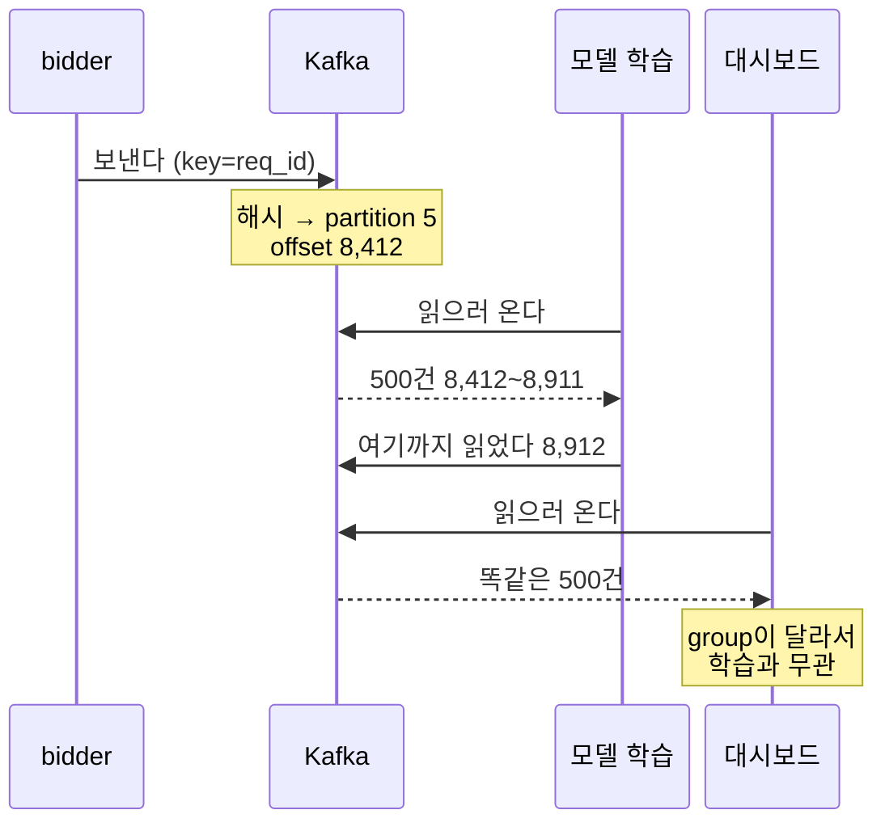
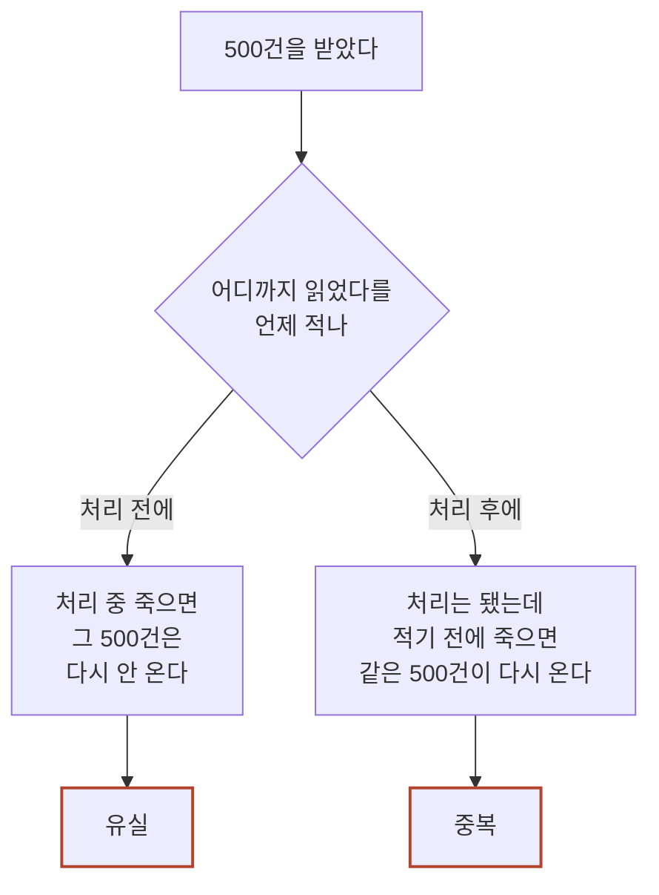

앞 글에서 따라온 그 클릭이 방금 브로커에 놓였습니다. `topic` 은 `ad.click`, `partition` 은 5, `offset` 은 8,412 입니다. 탭한 지 1,112 밀리초 만입니다.

그런데 지훈 씨가 이 줄 하나를 열어 봐도 쓸 데가 없습니다. **"광고 9931 이 눌렸다"만 있고 그 광고가 왜 그 사람에게 나갔는지가 없습니다.** 그 정보는 40분 전 응찰 때 만들어진 다른 줄에 있습니다.

**따로 놓인 두 줄을 어떻게 다시 붙일까요? 그리고 왜 같은 줄을 네 팀이 각자 읽을까요?**

이 글은 브로커 안을 봅니다. `topic`·`partition`·`consumer group`·`offset` 네 이름이 나오는데, **넷 다 이 두 질문에 답하려고 있는 것들입니다.** 먼저 Kafka 없이 해 보면 어디서 터지는지부터 봅니다.

> **한 줄 요약:** Kafka 는 한 번 쓰고 여러 팀이 각자 읽는 로그 보관소입니다. 보내는 쪽과 읽는 쪽을 떼어 놓는 것이 전부이고, 네 이름은 그 떼어 놓기를 어떻게 하는지의 이름입니다.

> **골라 읽는 법** — 절이 일곱 개입니다.
>
> - Kafka 가 왜 필요한지만 → 1절
> - topic 과 partition, 몇 개로 잡나 → 2절
> - 네 팀이 같은 줄을 읽는 구조 → 3절
> - 어디까지 읽었는지를 언제 적나 → 4절
> - 며칠 들고 있나 → 5절
> - 두 줄을 이어 붙여 학습 데이터로 → 6절
> - 자주 밟는 것 → 7절

숫자는 전부 설명을 위해 지어낸 값입니다. 하루 노출 2억 2,800만 줄(초당 2,639건)과 클릭 228만 건은 앞 글들과 같은 값입니다.

---

## 1. Kafka 없이 하면 어디서 터지나

**로그를 네 곳에 나르는 방법은 Kafka 말고도 셋이 있습니다. 셋 다 돌아가긴 하는데 각자 다른 자리에서 줄이 사라집니다.**

광고가 한 번 노출되면 그 사실을 알아야 하는 곳이 넷입니다. 앞 글에서 본 그 넷입니다.

| 읽는 곳 | 무엇이 필요한가 | 언제까지 |
|---|---|---|
| 실시간 대시보드 | 몇 건인지만 | 2초 |
| 예산 소진 확인 | 캠페인별 누적 금액 | 5초 |
| 광고주 리포트 | 광고별로 정확히 갈린 수치 — 그대로 청구서가 됩니다 | 5분 |
| 모델 학습 | 하루치를 통째로. 빠지면 안 됩니다 | 다음 날 새벽 |

이 줄을 만드는 것은 `bidder` 입니다. 응찰을 계산한 그 프로세스 안에서만 알 수 있는 값이 있기 때문입니다.

```json
{"req_id":"r-8f21","ad_id":9931,"slot":"main_top","media":"A앱","pctr":0.0213,"bid":182.4,"ts":1786000101}
```

**입찰 요청 하나는 12 밀리초 안에 답해야 합니다.** [로드밸런서·Ingress·API Gateway](post.html?id=gateway-ingress-router) 편에서 정한 그 예산이고, 넘긴 응답은 매체가 버립니다. 이 제약이 아래 셋을 전부 가릅니다.

### ① `bidder` 가 네 곳을 직접 부릅니다

가장 먼저 떠오르는 방법입니다. 줄이 생기면 그 자리에서 네 곳에 HTTP 로 알리고, 새 팀이 생기면 주소를 한 줄 더 넣습니다.

**문제는 시간입니다.** 앞단이 1.4 밀리초를 쓰고 `bidder` 의 응찰 계산이 상한 10 밀리초입니다. 사내망 왕복과 받는 쪽 처리를 합쳐 한 호출을 2 밀리초로 잡으면, 네 번이 8 밀리초입니다. 다 더하면 **19.4 밀리초**이고 예산은 12 밀리초입니다.

한 호출을 0.4 밀리초까지 깎아도 안 들어갑니다. 넷이면 1.6 밀리초이고 합계가 13.0 밀리초입니다. 게다가 그 0.4 밀리초는 **우리가 관리하지 않는 서버 넷이 다 빠를 때의 값**입니다.

응답을 안 기다리면 12 밀리초는 지켜집니다. 대신 다른 것이 `bidder` 안으로 들어옵니다. 한 팀이 20초 배포하는 동안 노출은 초당 2,639건씩 계속 생겨 52,780줄이 `bidder` 메모리에 쌓입니다. 얼마나 쌓을지, 넘치면 버릴지, 재시도는 몇 번 할지를 정해야 하는데 **답이 받는 쪽마다 다릅니다.** 광고주 리포트 줄은 한 건도 버리면 안 되고 대시보드 줄은 버려도 됩니다. 그러니 이 코드가 네 벌 필요합니다.

그리고 이 큐는 `bidder` 프로세스 안에 있습니다. `bidder` 도 하루 4번 배포하고, **배포할 때 큐에 남아 있던 줄은 같이 내려갑니다.**

### ②와 ③은 다른 자리에서 터집니다

나머지 둘은 결론만 짚겠습니다.

| 방법 | 어디서 터지나 |
|---|---|
| ② 파일에 쓰고 5분마다 옮깁니다 | 오토스케일이 30대를 20대로 줄이면 아직 안 옮긴 줄이 같이 사라집니다. 대당 평균 13,200줄이면 10대에서 132,000줄입니다. 그리고 파일에는 "누가 어디까지 읽었나"가 없어서, 파일 이름 규칙이 네 팀과의 계약이 됩니다 |
| ③ DB 에 바로 넣습니다 | 네 팀이 찾는 조건이 달라 인덱스가 넷 필요합니다. 줄 하나를 넣을 때 다섯 군데를 건드리고, 광고주 리포트가 마감에 하루치 2.28억 줄을 훑는 동안 그 쓰기 지연이 오릅니다. 튜닝으로 안 없어집니다 — 리포트는 1년 남기길 원하고 대시보드는 테이블이 작아야 빠릅니다 |

**셋의 공통점은 하나입니다.** ①은 네 곳의 주소와 재시도 정책을 `bidder` 가 들고 있습니다. ②는 파일 이름과 주기를 양쪽이 맞춰야 하고, ③은 인덱스와 보존 기간을 네 팀이 합의해야 합니다. **받는 쪽이 하나 늘 때마다 보내는 쪽이 따라 바뀝니다.**

그리고 셋 다 "평소에는 멀쩡한데 특정 순간에만 사라진다"는 성질이 있습니다. 평균 그래프로는 안 보이고 배포 시각·축소 시각·마감 시각에 맞춰 봐야 보입니다.

**그러면 답은 무엇일까요.** 받는 쪽을 하나 더 만드는 것이 아닙니다. 보내는 쪽과 받는 쪽 **사이에 놓을 자리** 하나가 필요합니다. 보내는 쪽은 그 자리에만 쓰고 받는 쪽은 그 자리에서만 읽어, 서로를 모르게 하는 것입니다. **Kafka 가 하는 일이 정확히 이것입니다.**

## 2. topic 과 partition — 어디에 쌓이나

**topic 은 이름표이고, 그 안은 partition 여러 개로 갈라져 있습니다. partition 수가 처리량 상한이고, key 가 순서 보장 범위입니다.**

먼저 보내는 쪽부터 짚고 넘어가겠습니다. **Kafka 로 보내는 것은 별도 서버가 아니라 `bidder` 프로세스 안의 라이브러리입니다.** 의존성에 한 줄이 늘고 객체가 하나 생기는 것이 전부이고, 넘기는 것은 셋입니다 — 어느 topic 에, 어떤 key 로, 무슨 값을. **여기 받는 쪽 주소가 없습니다.** 1절 ①이 들고 있던 네 곳의 주소·상태·재시도 정책이 사라진 자리가 이것입니다.

그리고 보내는 함수는 기다리지 않습니다. 버퍼에 넣고 바로 돌아오고 실제 전송은 뒤에서 배치로 묶여 나갑니다. 그래서 1절 ①의 8 밀리초가 여기서는 셈에 안 들어옵니다. 다만 **어디까지 기다렸다 성공으로 칠지는 설정 한 줄로 정합니다.** 보냈으면 끝으로 칠 수도 있고, 복제본까지 받은 것을 확인할 수도 있습니다. 광고주 리포트가 이 줄을 읽으니 우리는 복제본까지 확인하는 쪽으로 둡니다. **한 topic 을 여러 팀이 읽으면 가장 엄한 읽는 쪽에 맞춥니다.**

### topic 을 무엇으로 가르나

`ad.impression` · `ad.click` · `ad.conversion` 셋으로 나눕니다. 하나로 합치면 노출만 필요한 대시보드도 클릭·전환까지 읽어 걸러야 합니다.

**가르는 기준은 사건 종류이지 읽는 팀이 아닙니다.** 리포트용으로 `ad.impression.report` 를 따로 만들면 같은 줄이 팀 수만큼 복사됩니다. 디스크와 쓰기가 그만큼 늘고, 네 벌이 어긋나기 시작하면 어느 벌이 맞는지 아무도 모릅니다. 값은 그다음이 더 큽니다. **topic 이름에 받는 팀 이름이 들어가는 순간 보내는 쪽이 다시 받는 쪽을 알게 됩니다.** 1절이 없앤 것이 그대로 돌아옵니다.

### partition 을 몇 개로 잡나

partition 은 topic 안을 세로로 가른 것입니다. 줄은 그중 한 곳에 붙고, 붙은 자리마다 offset 이라는 번호가 매겨집니다.

**한 partition 은 한 팀 안에서 한 명만 맡습니다.** 그래서 읽는 사람을 partition 보다 많이 띄우면 남는 사람은 놉니다. **partition 수가 처리량 상한인 이유가 이것입니다.**

**partition 최소치 = 초당 들어오는 줄 ÷ 한 명의 초당 처리량**

한 명이 초당 800줄을 처리한다고 하겠습니다. 평시 2,639건이면 3.3이라 4개면 되는데, 저녁 피크는 평균의 3배인 7,917건이라 9.9, 곧 10개가 필요합니다. **재야 하는 쪽은 피크이니 답은 10개이고, 우리는 12개로 잡습니다.** 둘을 더 얹는 이유는 이 절 끝에 있습니다.

100개로 잡아 두면 되지 않느냐고 할 수 있습니다. 값이 두 자리에 붙습니다. 보내는 쪽은 partition 마다 배치 버퍼를 하나씩 드는데, `bidder` 30대에 100개면 버퍼가 3,000개입니다. 한 대가 초당 88줄을 만드는 것을 100개로 나누면 한 버퍼에 초당 0.88줄이라 **배치가 줄 하나짜리가 됩니다.** 12개면 한 버퍼에 초당 7.3줄이라 그나마 묶입니다.

12개로 정한 `ad.impression` 은 이렇게 생겼습니다.

<figure style="text-align:center; margin:2rem 0;">
<svg viewBox="0 0 500 310" role="img" aria-label="topic ad.impression 하나가 partition 12개로 갈라져 있고, partition 마다 줄이 왼쪽부터 차례로 붙어 있는 그림. 줄마다 0부터 세는 offset 번호가 붙어 있고 partition 마다 붙은 줄 수가 다르다. partition 5 의 offset 7 자리에 r-8f21 이 굵게 표시돼 있다." style="width:100%; max-width:500px; height:auto; font-family:var(--font-sans)">
<defs>
<marker id="kf3-arr" markerWidth="9" markerHeight="9" refX="7.5" refY="3" orient="auto"><path d="M0,0 L7.5,3 L0,6 Z" style="fill:var(--accent-primary)"/></marker>
</defs>
<text x="6" y="20" style="font-size:12.5px; fill:var(--text-muted)">topic</text>
<text x="52" y="20" style="font-size:13px; fill:var(--text-primary); font-family:var(--font-mono)">ad.impression</text>
<rect x="4" y="28" width="492" height="276" rx="10" style="fill:none; stroke:var(--text-muted); stroke-width:1.3; stroke-dasharray:6 4"/>
<g style="fill:var(--bg-secondary); stroke:var(--border-color); stroke-width:1.5">
<rect x="92" y="38" width="28" height="18" rx="4"/><rect x="124" y="38" width="28" height="18" rx="4"/><rect x="156" y="38" width="28" height="18" rx="4"/><rect x="188" y="38" width="28" height="18" rx="4"/><rect x="220" y="38" width="28" height="18" rx="4"/><rect x="252" y="38" width="28" height="18" rx="4"/><rect x="284" y="38" width="28" height="18" rx="4"/>
<g style="stroke:none; fill:var(--text-muted); font-family:var(--font-mono); font-size:12.5px; text-anchor:middle"><text x="6" y="51.5" style="font-size:12.5px; text-anchor:start; font-family:var(--font-sans)">partition 0</text><text x="106" y="51.5">0</text><text x="138" y="51.5">1</text><text x="170" y="51.5">2</text><text x="202" y="51.5">3</text><text x="234" y="51.5">4</text><text x="266" y="51.5">5</text><text x="298" y="51.5">6</text></g>
<rect x="92" y="60" width="28" height="18" rx="4"/><rect x="124" y="60" width="28" height="18" rx="4"/><rect x="156" y="60" width="28" height="18" rx="4"/><rect x="188" y="60" width="28" height="18" rx="4"/><rect x="220" y="60" width="28" height="18" rx="4"/>
<g style="stroke:none; fill:var(--text-muted); font-family:var(--font-mono); font-size:12.5px; text-anchor:middle"><text x="6" y="73.5" style="font-size:12.5px; text-anchor:start; font-family:var(--font-sans)">partition 1</text><text x="106" y="73.5">0</text><text x="138" y="73.5">1</text><text x="170" y="73.5">2</text><text x="202" y="73.5">3</text><text x="234" y="73.5">4</text></g>
<rect x="92" y="82" width="28" height="18" rx="4"/><rect x="124" y="82" width="28" height="18" rx="4"/><rect x="156" y="82" width="28" height="18" rx="4"/><rect x="188" y="82" width="28" height="18" rx="4"/><rect x="220" y="82" width="28" height="18" rx="4"/><rect x="252" y="82" width="28" height="18" rx="4"/><rect x="284" y="82" width="28" height="18" rx="4"/><rect x="316" y="82" width="28" height="18" rx="4"/>
<g style="stroke:none; fill:var(--text-muted); font-family:var(--font-mono); font-size:12.5px; text-anchor:middle"><text x="6" y="95.5" style="font-size:12.5px; text-anchor:start; font-family:var(--font-sans)">partition 2</text><text x="106" y="95.5">0</text><text x="138" y="95.5">1</text><text x="170" y="95.5">2</text><text x="202" y="95.5">3</text><text x="234" y="95.5">4</text><text x="266" y="95.5">5</text><text x="298" y="95.5">6</text><text x="330" y="95.5">7</text></g>
<rect x="92" y="104" width="28" height="18" rx="4"/><rect x="124" y="104" width="28" height="18" rx="4"/><rect x="156" y="104" width="28" height="18" rx="4"/><rect x="188" y="104" width="28" height="18" rx="4"/><rect x="220" y="104" width="28" height="18" rx="4"/><rect x="252" y="104" width="28" height="18" rx="4"/>
<g style="stroke:none; fill:var(--text-muted); font-family:var(--font-mono); font-size:12.5px; text-anchor:middle"><text x="6" y="117.5" style="font-size:12.5px; text-anchor:start; font-family:var(--font-sans)">partition 3</text><text x="106" y="117.5">0</text><text x="138" y="117.5">1</text><text x="170" y="117.5">2</text><text x="202" y="117.5">3</text><text x="234" y="117.5">4</text><text x="266" y="117.5">5</text></g>
<rect x="92" y="126" width="28" height="18" rx="4"/><rect x="124" y="126" width="28" height="18" rx="4"/><rect x="156" y="126" width="28" height="18" rx="4"/><rect x="188" y="126" width="28" height="18" rx="4"/>
<g style="stroke:none; fill:var(--text-muted); font-family:var(--font-mono); font-size:12.5px; text-anchor:middle"><text x="6" y="139.5" style="font-size:12.5px; text-anchor:start; font-family:var(--font-sans)">partition 4</text><text x="106" y="139.5">0</text><text x="138" y="139.5">1</text><text x="170" y="139.5">2</text><text x="202" y="139.5">3</text></g>
<rect x="92" y="148" width="28" height="18" rx="4"/><rect x="124" y="148" width="28" height="18" rx="4"/><rect x="156" y="148" width="28" height="18" rx="4"/><rect x="188" y="148" width="28" height="18" rx="4"/><rect x="220" y="148" width="28" height="18" rx="4"/><rect x="252" y="148" width="28" height="18" rx="4"/><rect x="284" y="148" width="28" height="18" rx="4"/><rect x="316" y="148" width="28" height="18" rx="4" style="stroke:var(--accent-primary); stroke-width:2"/>
<g style="stroke:none; fill:var(--text-muted); font-family:var(--font-mono); font-size:12.5px; text-anchor:middle"><text x="6" y="161.5" style="font-size:12.5px; text-anchor:start; font-family:var(--font-sans)">partition 5</text><text x="106" y="161.5">0</text><text x="138" y="161.5">1</text><text x="170" y="161.5">2</text><text x="202" y="161.5">3</text><text x="234" y="161.5">4</text><text x="266" y="161.5">5</text><text x="298" y="161.5">6</text><text x="330" y="161.5">7</text></g>
<rect x="92" y="170" width="28" height="18" rx="4"/><rect x="124" y="170" width="28" height="18" rx="4"/><rect x="156" y="170" width="28" height="18" rx="4"/><rect x="188" y="170" width="28" height="18" rx="4"/><rect x="220" y="170" width="28" height="18" rx="4"/><rect x="252" y="170" width="28" height="18" rx="4"/>
<g style="stroke:none; fill:var(--text-muted); font-family:var(--font-mono); font-size:12.5px; text-anchor:middle"><text x="6" y="183.5" style="font-size:12.5px; text-anchor:start; font-family:var(--font-sans)">partition 6</text><text x="106" y="183.5">0</text><text x="138" y="183.5">1</text><text x="170" y="183.5">2</text><text x="202" y="183.5">3</text><text x="234" y="183.5">4</text><text x="266" y="183.5">5</text></g>
<rect x="92" y="192" width="28" height="18" rx="4"/><rect x="124" y="192" width="28" height="18" rx="4"/><rect x="156" y="192" width="28" height="18" rx="4"/><rect x="188" y="192" width="28" height="18" rx="4"/><rect x="220" y="192" width="28" height="18" rx="4"/><rect x="252" y="192" width="28" height="18" rx="4"/><rect x="284" y="192" width="28" height="18" rx="4"/><rect x="316" y="192" width="28" height="18" rx="4"/>
<g style="stroke:none; fill:var(--text-muted); font-family:var(--font-mono); font-size:12.5px; text-anchor:middle"><text x="6" y="205.5" style="font-size:12.5px; text-anchor:start; font-family:var(--font-sans)">partition 7</text><text x="106" y="205.5">0</text><text x="138" y="205.5">1</text><text x="170" y="205.5">2</text><text x="202" y="205.5">3</text><text x="234" y="205.5">4</text><text x="266" y="205.5">5</text><text x="298" y="205.5">6</text><text x="330" y="205.5">7</text></g>
<rect x="92" y="214" width="28" height="18" rx="4"/><rect x="124" y="214" width="28" height="18" rx="4"/><rect x="156" y="214" width="28" height="18" rx="4"/><rect x="188" y="214" width="28" height="18" rx="4"/><rect x="220" y="214" width="28" height="18" rx="4"/>
<g style="stroke:none; fill:var(--text-muted); font-family:var(--font-mono); font-size:12.5px; text-anchor:middle"><text x="6" y="227.5" style="font-size:12.5px; text-anchor:start; font-family:var(--font-sans)">partition 8</text><text x="106" y="227.5">0</text><text x="138" y="227.5">1</text><text x="170" y="227.5">2</text><text x="202" y="227.5">3</text><text x="234" y="227.5">4</text></g>
<rect x="92" y="236" width="28" height="18" rx="4"/><rect x="124" y="236" width="28" height="18" rx="4"/><rect x="156" y="236" width="28" height="18" rx="4"/><rect x="188" y="236" width="28" height="18" rx="4"/><rect x="220" y="236" width="28" height="18" rx="4"/><rect x="252" y="236" width="28" height="18" rx="4"/><rect x="284" y="236" width="28" height="18" rx="4"/>
<g style="stroke:none; fill:var(--text-muted); font-family:var(--font-mono); font-size:12.5px; text-anchor:middle"><text x="6" y="249.5" style="font-size:12.5px; text-anchor:start; font-family:var(--font-sans)">partition 9</text><text x="106" y="249.5">0</text><text x="138" y="249.5">1</text><text x="170" y="249.5">2</text><text x="202" y="249.5">3</text><text x="234" y="249.5">4</text><text x="266" y="249.5">5</text><text x="298" y="249.5">6</text></g>
<rect x="92" y="258" width="28" height="18" rx="4"/><rect x="124" y="258" width="28" height="18" rx="4"/><rect x="156" y="258" width="28" height="18" rx="4"/><rect x="188" y="258" width="28" height="18" rx="4"/><rect x="220" y="258" width="28" height="18" rx="4"/><rect x="252" y="258" width="28" height="18" rx="4"/>
<g style="stroke:none; fill:var(--text-muted); font-family:var(--font-mono); font-size:12.5px; text-anchor:middle"><text x="6" y="271.5" style="font-size:12.5px; text-anchor:start; font-family:var(--font-sans)">partition 10</text><text x="106" y="271.5">0</text><text x="138" y="271.5">1</text><text x="170" y="271.5">2</text><text x="202" y="271.5">3</text><text x="234" y="271.5">4</text><text x="266" y="271.5">5</text></g>
<rect x="92" y="280" width="28" height="18" rx="4"/><rect x="124" y="280" width="28" height="18" rx="4"/><rect x="156" y="280" width="28" height="18" rx="4"/><rect x="188" y="280" width="28" height="18" rx="4"/><rect x="220" y="280" width="28" height="18" rx="4"/><rect x="252" y="280" width="28" height="18" rx="4"/><rect x="284" y="280" width="28" height="18" rx="4"/><rect x="316" y="280" width="28" height="18" rx="4"/>
<g style="stroke:none; fill:var(--text-muted); font-family:var(--font-mono); font-size:12.5px; text-anchor:middle"><text x="6" y="293.5" style="font-size:12.5px; text-anchor:start; font-family:var(--font-sans)">partition 11</text><text x="106" y="293.5">0</text><text x="138" y="293.5">1</text><text x="170" y="293.5">2</text><text x="202" y="293.5">3</text><text x="234" y="293.5">4</text><text x="266" y="293.5">5</text><text x="298" y="293.5">6</text><text x="330" y="293.5">7</text></g>
</g>
<line x1="430" y1="157" x2="352" y2="157" style="stroke:var(--accent-primary); stroke-width:2" marker-end="url(#kf3-arr)"/>
<text x="434" y="161.5" style="font-size:12.5px; fill:var(--accent-primary); font-family:var(--font-mono)">r-8f21</text>
</svg>
<figcaption style="margin-top:0.75rem; font-size:0.9rem; color:var(--text-muted)">네모 하나가 줄 하나이고 그 안의 숫자가 offset 입니다. offset 은 partition 마다 0부터 따로 셉니다. partition 3 의 4번과 partition 8 의 4번은 아무 관계가 없는 두 줄입니다. 굵게 두른 것이 우리 요청 r-8f21 입니다.</figcaption>
</figure>

### 어느 partition 으로 가나

**partition 번호 = key 의 해시 ÷ partition 수의 나머지**

**그래서 Kafka 는 topic 전체의 순서를 지켜 주지 않습니다. 순서는 한 partition 안에서만 지켜집니다.** partition 이 12개면 줄이 12개로 따로 서고, 그 12개 사이에는 아무 약속이 없습니다.

**key 를 고르는 일은 "무엇 단위로 순서가 지켜지나"를 고르는 일입니다.** 후보 셋을 10만 줄에 넣어 보면 이렇게 갈립니다.

| key 후보 | 가장 많은 곳 | 가장 적은 곳 | 최대÷최소 | 순서가 지켜지는 범위 |
|---|---|---|---|---|
| `req_id` (전부 다른 값) | 8,496줄 | 8,174줄 | 1.04배 | 같은 `req_id` 안에서만 |
| `ad_id` (상위 5개가 40%) | 21,191줄 | 4,690줄 | **4.52배** | 같은 `ad_id` 안에서만 |
| key 없음 | 8,334줄 | 8,333줄 | 1.00배 | 없습니다 |

`ad_id` 는 4.52배로 갈립니다. **21,191줄이 몰린 partition 을 맡은 한 명만 밀리고, 사람을 더 붙여도 그 자리는 여전히 한 명이 맡습니다.** key 없음은 가장 고른 대신 순서가 어디서도 안 지켜집니다.

**우리 답은 `req_id` 입니다.** 1.04배로 고르게 퍼진 것은 값이 전부 달라서 따라온 결과이지 약속이 아닙니다. 약속하는 것은 하나입니다 — **같은 요청의 노출과 클릭이 같은 partition 에 갑니다.** 6절의 이어 붙이기가 그 partition 안에서 끝납니다.

**여기가 12개를 지금 정해야 하는 이유입니다.** 12로 나눈 나머지와 24로 나눈 나머지는 같은 key 를 다른 곳에 보냅니다. 10만 줄 중 **절반이 다른 자리로 옮겨가고**, 그 줄들은 예전 자리에 남은 같은 key 의 줄과 더는 한 줄에 안 섭니다. 게다가 partition 은 늘릴 수만 있고 줄이지 못합니다. 답이 10개인데 12개로 잡은 것이 그래서입니다.

<div class="demo-embed-wrap">
<iframe class="demo-embed" src="demo-kafka-partition.html?embed=1" height="620" loading="lazy" title="Kafka Partition 놀이터"></iframe>
<a class="demo-embed-open" href="demo-kafka-partition.html" target="_blank" rel="noopener">↗ 전체 데모로 열기 (가이드 투어 포함)</a>
</div>

## 3. consumer group — 누가 읽나

**consumer group 은 읽는 팀 하나입니다. group 이 다르면 같은 줄을 각자 통째로 읽고, 한 group 안에서는 partition 12개를 나눠 맡습니다.**

읽는 쪽 설정에 `group.id` 가 있습니다. **이 값이 같으면 한 팀이고 다르면 다른 팀입니다.** 1절의 넷이 네 값을 씁니다.

| 읽는 곳 | 인원 | 한 명당 partition | 왜 그 인원인가 |
|---|---|---|---|
| 실시간 대시보드 | 6 | 2개 | 몇 초 안에 숫자가 올라가야 합니다 |
| 예산 소진 확인 | 6 | 2개 | 늦으면 예산을 넘겨 씁니다 |
| 광고주 리포트 | 12 | 1개 | 마감이 밀리면 안 되니 상한까지 채웠습니다 |
| 모델 학습 | 4 | 3개 | 하루 한 번 몰아 읽어 평시 유입만 따라가면 됩니다 |

오른쪽 열은 12를 인원으로 나눈 것이라 어느 줄이든 다시 곱하면 12로 돌아옵니다. **인원을 정하는 규칙은 2절과 같습니다** — 그 팀이 감당할 초당 줄 수를 한 명의 처리량으로 나누고, 상한은 partition 수입니다.

광고주 리포트에 13번째를 붙이면 어떻게 될까요. 2절의 한 문장이 여기서 값을 냅니다 — 한 partition 은 한 팀 안에서 한 명만 맡습니다. **13번째는 아무것도 못 받고 놉니다.**

**group 사이는 규칙이 다릅니다.** 아래 그림의 모델 학습과 대시보드는 서로 다른 group 이고 서로를 모릅니다.



모델 학습이 partition 5 를 8,912 까지 읽었다고 적어도 대시보드가 적어 둔 번호는 그대로입니다. **브로커는 읽혔다고 줄을 지우지 않습니다.**

그래서 되감기가 됩니다. 학습이 피처를 하나 바꿔 3일치를 다시 읽는다고 하면 6억 8,400만 줄입니다. 그동안 광고주 리포트가 적어 둔 번호는 자기 자리에 그대로 있습니다. **1절 ③의 DB 였다면 이 6.84억 줄 스캔이 리포트 쿼리와 같은 테이블 위에서 돌았을 것입니다.**

**1절이 세운 "한 번 쓰고 각자 읽는다"가 여기서 실제 물건이 됩니다.** 브로커에 있는 줄은 하나이고, group 마다 따로 있는 것은 그 줄의 사본이 아니라 "어디까지 읽었나" 하나뿐입니다.

## 4. offset — 어디까지 읽었나

**offset 은 partition 안의 줄 번호이고 group 마다 따로 적힙니다. 처리 전에 적느냐 후에 적느냐가 유실이냐 중복이냐를 정합니다.**

"여기까지 읽었다"를 적는 일을 commit 이라고 합니다. 읽는 쪽이 죽었다 살아나면 적힌 번호부터 다시 받으니, **처리와 commit 의 순서가 전부입니다.**



**둘 다 사고입니다. 고를 수 있는 것은 사고의 종류뿐입니다.** 광고주 리포트 group 을 하루치로 세어 보면 이렇습니다. 한 번에 500건씩 받아 처리하고, 배포 2회와 장애 1회로 하루 3번 죽는다고 하겠습니다.

| 방식 | 하루 유실 | 하루 중복 | 금액으로 |
|---|---|---|---|
| 처리 전에 적기 | 750건 | 0건 | 136.8원 |
| 처리 후에 적기 | 0건 | 750건 | 136.8원 |

**금액만 보면 고칠 이유가 없습니다.** 하루 매출 4,158만 원의 0.0003% 입니다. **무서운 것은 크기가 아니라 성질입니다.** 유실은 매체가 세어 오면 드러나고, 중복은 이미 나간 돈이라 다음 달에 빼야 합니다.

자동으로 적어 주는 설정을 켜면 되지 않느냐고 할 수 있습니다. **그것은 새 선택지가 아니라 위 둘 중 "처리 후" 쪽입니다.** 중복은 그대로 있고, 미확정 구간이 배치 하나에서 시간 간격 하나로 늘어 750건이 1,650건이 됩니다. 그리고 그 시점을 코드가 못 정합니다 — "이 500건을 다 넣었으니 이제 올린다"를 쓸 수 없습니다.

### 그래서 우리 넷은

| 읽는 곳 | 언제 적나 | 왜 |
|---|---|---|
| 실시간 대시보드 | 처리 전 | 최근 5분만 보는 화면이라 750건 유실은 다음 갱신에 사라집니다 |
| 예산 소진 확인 | 처리 후 | 덜 세는 것보다 두 번 세는 쪽이 안전합니다 |
| 모델 학습 | 처리 후 | 중복이 클릭률을 아래로 밀지만 2.28억 줄에 750건이면 소수점 아래입니다 |
| 광고주 리포트 | 처리 후 + `req_id` 유니크 키 | 유실도 중복도 안 되니 둘 중 하나를 고르는 대신 처리 쪽에서 막습니다 |

**광고주 리포트만 다르게 하는 것이 아니라, 리포트만 commit 시점으로 정하지 않습니다.** 나머지 셋은 무엇을 잃어도 되는지가 정해져 있어 한 줄로 끝납니다. 리포트는 테이블에 `req_id` 유니크 키를 걸어 **이미 있으면 아무 일도 안 하게** 만듭니다.

되감기에는 조건이 하나 붙습니다. 3절의 3일치가 아직 브로커에 남아 있어야 합니다. 얼마나 남겨 두는지가 5절입니다.

## 5. 보존 기간 — 왜 지나간 것도 읽을 수 있나

**Kafka 는 읽혔다고 지우지 않습니다. 나이나 크기로 지웁니다. 그래서 학습이 사흘 멈춰도 되감을 수 있습니다.**

3절이 미뤄 둔 기준이 이것입니다. 네 group 이 다 읽어도 줄은 그 자리에 있고, 브로커가 보는 것은 둘뿐입니다 — **얼마나 오래됐나, 얼마나 쌓였나.** 기본값은 나이 7일입니다.

그래서 며칠일까요. 디스크와 되감기를 같이 봅니다. 노출 하루 2.28억 줄, 클릭 228만 줄, 한 줄 200바이트, 복제 3벌, 브로커 6대에 대당 디스크 500GB 로 잡습니다.

| 보존 | 합계 | 브로커 한 대 | 디스크 500GB 대비 |
|---|---|---|---|
| 3일 | 414.5 GB | 69.1 GB | 14% |
| **7일** | **967.2 GB** | **161.2 GB** | **32%** |
| 14일 | 1,934.4 GB | 322.4 GB | 64% |
| 30일 | 4,145.0 GB | 690.8 GB | **138% — 안 들어갑니다** |

**우리 답은 7일입니다.** 3절이 든 3일치 되감기에 나흘이 남습니다.

"그냥 30일 남기면 되잖아"에 대한 답이 마지막 줄입니다. 디스크가 4.3배가 되고 브로커 한 대가 690.8GB 를 들어야 하는데 대당 500GB 입니다. 14일은 들어가긴 하는데, **그러면 그 이레를 더 사서 막을 사고가 무엇인지 답할 수 있어야 합니다.**

<figure style="text-align:center; margin:2rem 0;">
<svg viewBox="0 0 520 214" role="img" aria-label="시간축 위에 보존 창 7일을 놓은 그림. 첫 줄은 브로커에 남아 있는 구간, 둘째 줄은 학습이 3일 멈춘 구간, 셋째 줄은 10일 멈춘 구간이다. 셋째 줄의 앞 3일치만 보존 창 왼쪽으로 넘어가 있다." style="width:100%; max-width:500px; height:auto; font-family:var(--font-sans)">
<defs>
<marker id="kf6-arr" markerWidth="9" markerHeight="9" refX="7.5" refY="3" orient="auto"><path d="M0,0 L7.5,3 L0,6 Z" style="fill:var(--text-muted)"/></marker>
</defs>
<text x="8" y="24" style="font-size:13px; fill:var(--text-primary)">① 브로커에 남아 있는 것</text>
<rect x="44" y="32" width="133" height="26" rx="9" style="fill:none; stroke:var(--state-bad); stroke-width:1.8; stroke-dasharray:6 4"/>
<text x="110" y="50" text-anchor="middle" style="font-size:12.5px; fill:var(--state-bad)">지워짐</text>
<rect x="177" y="32" width="311" height="26" rx="9" style="fill:var(--bg-secondary); stroke:var(--accent-primary); stroke-width:2"/>
<text x="332" y="50" text-anchor="middle" style="font-size:13px; fill:var(--text-primary)">보존 7일 — 그대로 있습니다</text>
<text x="8" y="84" style="font-size:13px; fill:var(--text-primary)">② 학습이 3일 멈췄습니다</text>
<text x="345" y="106" text-anchor="end" style="font-size:12.5px; fill:var(--text-muted)">전부 보존 창 안</text>
<rect x="355" y="90" width="133" height="22" rx="9" style="fill:var(--bg-tertiary); stroke:var(--accent-primary); stroke-width:2"/>
<text x="421" y="106" text-anchor="middle" style="font-size:12.5px; fill:var(--text-primary)">3일치</text>
<text x="8" y="138" style="font-size:13px; fill:var(--text-primary)">③ 학습이 10일 멈췄습니다</text>
<rect x="44" y="144" width="133" height="22" rx="9" style="fill:none; stroke:var(--state-bad); stroke-width:1.8; stroke-dasharray:6 4"/>
<text x="110" y="160" text-anchor="middle" style="font-size:12.5px; fill:var(--state-bad)">앞 3일치가 없습니다</text>
<rect x="177" y="144" width="311" height="22" rx="9" style="fill:var(--bg-secondary); stroke:var(--border-color); stroke-width:1.5"/>
<text x="332" y="160" text-anchor="middle" style="font-size:12.5px; fill:var(--text-primary)">뒤 7일치만 남았습니다</text>
<line x1="36" y1="186" x2="510" y2="186" style="stroke:var(--text-muted); stroke-width:1.2" marker-end="url(#kf6-arr)"/>
<g style="stroke:var(--text-muted); stroke-width:1.2"><line x1="44" y1="182" x2="44" y2="190"/><line x1="177" y1="182" x2="177" y2="190"/><line x1="355" y1="182" x2="355" y2="190"/><line x1="488" y1="182" x2="488" y2="190"/></g>
<g style="font-size:12.5px; fill:var(--text-muted); text-anchor:middle"><text x="44" y="204">10일 전</text><text x="177" y="204">7일 전</text><text x="355" y="204">3일 전</text><text x="488" y="204">지금</text></g>
</svg>
<figcaption style="margin-top:0.75rem; font-size:0.9rem; color:var(--text-muted)">세 줄 다 오른쪽 끝이 지금이고 왼쪽으로 갈수록 오래된 줄입니다. 점선 상자는 브로커에 이미 없는 구간입니다.</figcaption>
</figure>

**보존 창 안이라고 저절로 복구되지는 않습니다.** 밀린 것을 읽는 동안에도 새 줄은 초당 2,639건씩 들어옵니다. 모델 학습이 4명으로 3일치를 따라잡으면 **14.1일**이 걸리고, 12명까지 늘려야 **1.1일**입니다. **되감는 속도의 상한도 partition 수입니다.**

오래 두는 것이 필요한 자리는 따로 있습니다. 리포트가 이 줄을 1년 들고 있어야 하는 것은 Kafka 가 아니라 뒤쪽 데이터 창고의 몫입니다. **Kafka 의 보존 기간은 장기 보관 기간이 아니라 읽는 쪽이 늦어도 되는 기한입니다.**

## 6. 두 줄을 이어 붙여 학습 데이터로

**노출 줄이 X 이고 클릭 줄이 y 입니다. 둘을 `req_id` 로 이어 붙이면 학습 한 줄이 됩니다. 어려운 것은 클릭이 늦게 온다는 점입니다.**

도입의 질문이 이 절의 답입니다. `bidder` 가 만든 노출 줄에는 클릭했는지가 없고, 그것은 같은 `req_id` 를 달고 `ad.click` 에 따로 옵니다. 지훈 씨가 앞 글에서 따라온 그 줄입니다.

읽는 쪽이 받는 것은 값 하나가 아니라 **어디에 어떻게 놓였는지가 같이 붙은 묶음**입니다.

```text
topic     ad.click
partition 5
offset    8412
key       r-8f21
value     {"event":"click","ad_id":9931,"slot":"main_top","req_id":"r-8f21",…}
```

**`offset` 8412 는 보내는 쪽이 만든 적 없는 값입니다.** 넘긴 것은 topic·key·value 셋이었고, 8412 는 브로커가 partition 5 끝에 붙이면서 매긴 번호입니다.

앞 글에서 본 수집 에이전트의 위치 파일과 하는 일이 같습니다. **다른 것은 있는 자리입니다.** 그 파일은 인스턴스 디스크에 있어 인스턴스가 사라지면 같이 없어지지만, 이 번호는 브로커에 남습니다.

노출과 클릭을 이어 붙이면 이렇게 끝납니다.

```json
{"req_id":"r-8f21","ad_id":9931,"slot":"main_top","media":"A앱","bid":182.4,"y":1}
```

**지훈 씨가 세 편에 걸쳐 따라온 그 탭이 저 `y:1` 한 글자입니다.** `pctr` 0.0213 이 빠진 것이 눈에 띄는데, 그것은 그때 모델이 낸 예측이라 X 에 그대로 넣지 않습니다. 예측을 다시 넣고 학습하면 **모델이 자기 출력을 따라 도는 셈**이 됩니다.

하루로 세면 노출 2억 2,800만 줄에 클릭 228만 줄이라 **1.00%** 이고, 이 값이 pCTR 모델이 맞히려는 것입니다.

**2절이 `req_id` 를 고른 이유가 여기서 값을 냅니다.** 다만 조건이 셋입니다. 두 topic 이 같은 key 를 쓸 것, partition 수가 둘 다 12일 것, 그리고 **보내는 쪽이 같은 방식으로 해시할 것**입니다.

셋째가 잘 빠집니다. `ad.impression` 은 `bidder` 가 넣고 `ad.click` 은 수집 서버가 넣습니다. **서비스가 둘이면 클라이언트도 둘일 수 있고, 해시 함수는 클라이언트마다 다릅니다.** 같은 `r-8f21` 을 다른 번호로 보내는 조합이 실제로 있습니다. 셋이 다 맞을 때만 노출과 클릭이 같은 자리에 있어 이어 붙이기가 partition 하나 안에서 끝납니다.

### 얼마나 기다렸다 이어 붙이나

이 클릭은 노출 40분 뒤에 눌렸습니다. 그러면 노출을 40분 넘게 들고 있어야 짝이 맞습니다. **얼마나 들고 있을지가 창의 크기입니다.**

| 창 | 놓치는 클릭 | 학습이 보는 클릭률 |
|---|---|---|
| 5분 | 205,200건 | 0.910% |
| 1시간 | 41,040건 | 0.982% |
| **3시간** | **13,680건** | **0.994%** |
| 24시간 | 2,280건 | 0.999% |

**우리 답은 3시간입니다.** 24시간으로 늘리면 11,400건을 더 건지는데 228만의 0.5% 이고, 그 0.5% 를 사려고 학습 데이터 확정이 21시간 늦어집니다.

<figure style="text-align:center; margin:2rem 0;">
<svg viewBox="0 0 520 206" role="img" aria-label="노출 한 줄에서 화살표 둘이 아래 클릭 줄 두 개로 내려가는 그림. 왼쪽 클릭은 창 세로선 안쪽에 있고, 오른쪽 클릭은 세로선 바깥에 점선 상자로 놓여 있다." style="width:100%; max-width:500px; height:auto; font-family:var(--font-sans)">
<defs>
<marker id="kf7-arr" markerWidth="9" markerHeight="9" refX="7.5" refY="3" orient="auto"><path d="M0,0 L7.5,3 L0,6 Z" style="fill:var(--accent-primary)"/></marker>
</defs>
<text x="270" y="20" text-anchor="middle" style="font-size:13px; fill:var(--accent-primary)">창 3시간</text>
<line x1="270" y1="26" x2="270" y2="166" style="stroke:var(--accent-primary); stroke-width:2; stroke-dasharray:6 4"/>
<text x="8" y="44" style="font-size:12.5px; fill:var(--text-muted); font-family:var(--font-mono)">ad.impression</text>
<rect x="22" y="50" width="76" height="26" rx="9" style="fill:var(--bg-secondary); stroke:var(--accent-primary); stroke-width:2"/>
<text x="60" y="68" text-anchor="middle" style="font-size:13px; fill:var(--text-primary)">노출</text>
<line x1="60" y1="76" x2="104" y2="104" style="stroke:var(--accent-primary); stroke-width:2" marker-end="url(#kf7-arr)"/>
<line x1="62" y1="76" x2="358" y2="104" style="stroke:var(--accent-primary); stroke-width:2" marker-end="url(#kf7-arr)"/>
<text x="8" y="102" style="font-size:12.5px; fill:var(--text-muted); font-family:var(--font-mono)">ad.click</text>
<rect x="69" y="108" width="76" height="26" rx="9" style="fill:var(--bg-secondary); stroke:var(--border-color); stroke-width:1.5"/>
<text x="107" y="126" text-anchor="middle" style="font-size:13px; fill:var(--text-primary)">클릭</text>
<rect x="325" y="108" width="76" height="26" rx="9" style="fill:none; stroke:var(--state-bad); stroke-width:1.8; stroke-dasharray:6 4"/>
<text x="363" y="126" text-anchor="middle" style="font-size:13px; fill:var(--state-bad)">클릭</text>
<text x="107" y="152" text-anchor="middle" style="font-size:12.5px; fill:var(--text-primary)">창 안 · y = 1</text>
<text x="363" y="152" text-anchor="middle" style="font-size:12.5px; fill:var(--state-bad)">창 밖 · y = 0</text>
<line x1="30" y1="178" x2="500" y2="178" style="stroke:var(--text-muted); stroke-width:1.2"/>
<g style="stroke:var(--text-muted); stroke-width:1.2"><line x1="60" y1="174" x2="60" y2="182"/><line x1="270" y1="174" x2="270" y2="182"/><line x1="480" y1="174" x2="480" y2="182"/></g>
<g style="font-size:12.5px; fill:var(--text-muted); text-anchor:middle"><text x="60" y="198">노출 시각</text><text x="270" y="198">3시간 뒤</text><text x="480" y="198">6시간 뒤</text></g>
</svg>
<figcaption style="margin-top:0.75rem; font-size:0.9rem; color:var(--text-muted)">가로축은 노출 시각부터 잰 시간입니다. 화살표 둘은 같은 노출에 딸린 클릭이고 도착 시각만 다릅니다.</figcaption>
</figure>

**창을 넘겨 온 클릭도 버려지지는 않습니다.** 과금도 리포트도 그대로 세고, 다만 학습 데이터에서는 그 노출이 이미 `y=0` 으로 확정된 뒤입니다.

반대로 5분으로 줄이면 클릭률이 0.910% 로 보입니다. 9% 가 깎인 값이고, **모델은 그 깎인 값을 맞히도록 학습합니다.** 그래서 이 창은 파이프라인 설정이 아니라 **라벨 정의**입니다.

그리고 재는 시각은 앞 글에서 정한 `event_time` 입니다. 도착 시각으로 재면 지하철에서 사흘 늦게 온 클릭이 창 밖으로 밀려나, **눌린 광고가 안 눌린 것으로 학습됩니다.**

## 7. 자주 밟는 것 넷

**"Kafka 는 큐다"** — 반만 맞습니다. 줄이 순서대로 들어가는 것은 같은데, 큐는 꺼내면 없어지고 Kafka 는 안 없어집니다. 지우는 기준은 읽혔는지가 아니라 나이입니다. 그래서 3절의 되감기가 되는 것이고, 큐라고만 알고 있으면 "다시 읽으면 되지 않나"라는 생각 자체가 안 떠오릅니다.

**partition 수가 최대 병렬도입니다.** 읽는 사람을 아무리 늘려도 partition 수를 넘으면 남는 사람은 놉니다. 밀릴 때 사람부터 늘리는 것이 첫 반응인데, **12명을 넘기는 순간 그 반응이 안 듣습니다.** 그때는 partition 을 늘려야 하고, 늘리는 순간 2절의 재배치가 일어납니다.

**key 없이 보내면 순서가 안 지켜집니다.** 고르게 퍼지는 대신 같은 요청의 노출과 클릭이 다른 자리로 갑니다. 그러면 6절의 이어 붙이기가 partition 12개를 다 뒤지는 일이 됩니다.

**밀린 양을 봐야 합니다.** 브로커에 쌓인 마지막 번호와 그 group 이 적어 둔 번호의 차이가 밀린 양입니다. 이 값이 계속 늘면 그 group 은 유입을 못 따라가는 중이고, 5절 창 안에서 못 따라잡으면 그만큼은 영영 못 읽습니다. **평균 지연 그래프에는 안 보이고 이 차이에만 보입니다.**

## 한눈 정리

| 질문 | 한 줄 답 |
|---|---|
| Kafka 가 왜 필요한가 | 보내는 쪽과 읽는 쪽을 떼어 놓으려고. 받는 쪽이 늘어도 보내는 쪽이 안 바뀝니다 |
| topic 을 무엇으로 가르나 | 사건 종류로. 읽는 팀 이름을 넣으면 1절이 없앤 것이 돌아옵니다 |
| partition 을 몇 개로 | 피크 유입 ÷ 한 명 처리량. 우리는 10이 답이고 12로 잡았습니다 |
| key 는 무엇으로 | `req_id`. 같은 요청의 노출과 클릭이 같은 자리에 갑니다 |
| consumer group 이 뭔가 | 읽는 팀 하나. group 이 다르면 같은 줄을 각자 통째로 읽습니다 |
| 어디까지 읽었다를 언제 적나 | 처리 전이면 유실, 후면 중복. 고르는 것은 사고의 종류입니다 |
| 며칠 들고 있나 | 7일. 장기 보관이 아니라 읽는 쪽이 늦어도 되는 기한입니다 |
| 노출과 클릭을 어떻게 붙이나 | `req_id` 로. 창 3시간이고 재는 시각은 `event_time` 입니다 |

## 더 깊이 보기

- 앞 글인 [로그 수집](post.html?id=log-hops-to-kafka) 편은 이 글이 시작한 자리까지 오는 길입니다. 같은 클릭 한 건이 자리마다 어떤 모양이었는지를 봅니다.
- 이 다음은 [데이터 파이프라인 설계](post.html?id=data-pipeline-design) 편입니다. Kafka 앞뒤에 무엇을 세울지를 읽는 쪽의 마감에서 거꾸로 짭니다.
- 읽는 쪽이 여섯·일곱으로 늘 때는 [데이터 유통 층](post.html?id=data-distribution-layer) 편을 봅니다.
- 6절이 만든 학습 한 줄의 X 쪽 — 학습 피처와 서빙 피처가 어긋나는 자리는 [Feature Store & Real-Time Serving](post.html?id=feature-store-serving) 편에 있습니다.
- 창의 확대판 — 클릭은 3시간이지만 전환은 며칠이 걸리는 이야기는 [지연 피드백과 온라인 학습](post.html?id=online-learning-delayed-feedback) 편입니다.
- 입찰 한 건이 남기는 로그 열 종은 [광고 시스템 로그 파이프라인](post.html?id=ad-log-pipeline) 편이 정리했습니다.
- [로그가 모델이 되기까지 데모](demo-log-to-model.html) — 이 글 뒤의 아홉 단계를 넘겨 보는 화면입니다.
