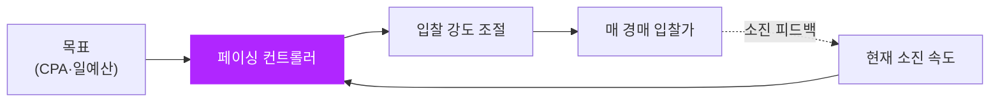
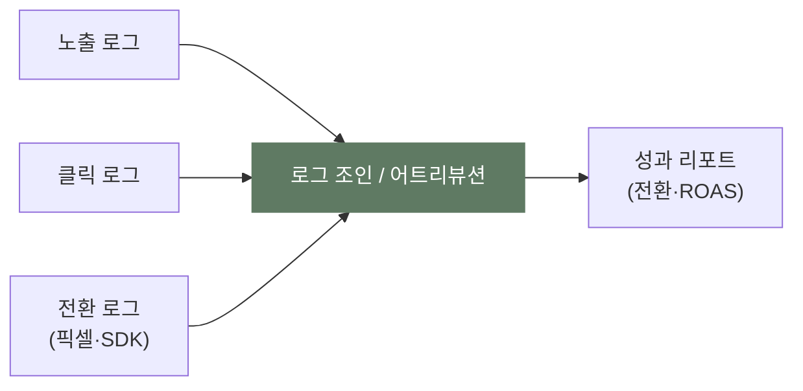

앞의 두 편에서 카카오가 **어떤 광고를(pCTR), 누구에게(타겟팅)** 보여줄지 고르는 과정을 봤습니다. 이제 남은 세 가지 — **얼마를 입찰하고(자동입찰)**, 하루 예산을 어떻게 나누며(페이싱), 그래서 **그게 진짜 효과였는지(측정)** — 광고 운영의 마지막 층을 우리 개념 글과 잇습니다.

> 가드레일 — 카카오의 입찰·최적화 알고리즘 구현은 비공개입니다. "자동입찰", "스마트메시지" 같은 기능 이름과 일반적 작동 원리만 다루고, 내부 수식은 우리가 쓴 개념 글로 링크합니다. 숫자는 전부 **가정 예시**입니다.

[1편: 상품 지도](post.html?id=kakao-ads-products) · [2편: 예측·타겟팅](post.html?id=kakao-ads-prediction-targeting)을 먼저 보면 흐름이 이어집니다.

---

## 1. 얼마를 낼까 — '자동입찰'은 플랫폼이 대신 깎아주는 것

카카오모먼트에서 입찰을 "자동"으로 두면, 광고주는 목표(예: 전환당 비용 CPA 1만 원)만 정하고 매 경매의 입찰가는 플랫폼이 알아서 정합니다. 이게 [Auto-Bidding & Budget Pacing](post.html?id=auto-bidding-pacing)에서 다룬 **자동 입찰**의 실제 모습입니다 — 하루에도 수십만 번 일어나는 경매마다 사람이 값을 부를 수는 없으니까요.

흥미로운 건, 정보를 다 가진 플랫폼이 왜 입찰가를 **깎아주는가**입니다. 광고주가 "무조건 노출"하겠다고 1만 원을 불러도 실제 경쟁이 3천 원 수준이면, 그대로 과금하면 예산이 순식간에 타고 효율이 폭락해 광고주가 떠납니다. 그래서 플랫폼은 "3,500원이면 이깁니다"라며 자동으로 깎습니다. 이 **Walled Garden식 Bid Shading**의 논리는 이미 [Walled Garden](post.html?id=walled-garden) 7절에 정리돼 있습니다(여기선 반복하지 않고 링크만 둡니다). 핵심 차이만 다시 말하면:

- [Open RTB의 Bid Shading](post.html?id=bid-shading-censored)은 **경쟁가를 모른 채** 안개 속에서 적정가를 추정하는 통계 문제(Censored Data).
- 카카오 같은 플랫폼의 자동입찰은 **패를 다 보면서** 광고주별 최적 깎기를 정하는 최적화 문제.

목적은 같습니다 — 1st Price 환경에서 과다 지불을 막아 광고주를 오래 붙잡아 두는 것.

---

## 2. 예산을 하루에 고르게 — 페이싱

목표 CPA를 맞추는 것과 별개로, **하루 예산을 시간에 걸쳐 고르게 쓰는** 문제가 있습니다. 아침 트래픽에 예산을 다 태우면 저녁의 더 좋은 기회를 놓치고, 너무 아끼면 예산이 남습니다.

예시(가정): 일 예산 30만 원인데 오전 10시에 이미 25만 원을 썼다면, 시스템은 남은 시간 입찰을 조여 속도를 늦춰야 합니다. 이렇게 "남은 예산 ÷ 남은 시간"을 맞춰가며 입찰 강도를 조절하는 게 **Budget Pacing**입니다. PID 컨트롤러나 라그랑주 듀얼 같은 기법으로 푸는 이 문제의 산수는 [Auto-Bidding & Budget Pacing](post.html?id=auto-bidding-pacing)에 있습니다.

> 톡채널의 "스마트메시지"처럼 누구에게·언제 보낼지를 자동 최적화하는 기능도, 결국 "제한된 자원(메시지 발송·예산)을 가장 반응 좋을 곳에 배분"하는 같은 종류의 문제입니다.

---

## 3. 효과를 어떻게 재나 — 픽셀·SDK 전환 추적

광고를 띄웠으면 "그래서 얼마나 팔렸나"를 알아야 합니다. 카카오는 광고주 웹사이트에 심는 **카카오 픽셀**과 앱에 심는 **SDK**로 전환(구매·가입 등)을 수집해 광고와 연결합니다.

이 "노출 → 클릭 → 전환"을 로그로 잇고 어느 광고의 공으로 볼지 정하는 일이 [광고 로그 파이프라인](post.html?id=ad-log-pipeline)과 [광고 로그 시스템 해부](post.html?id=ad-log-system)에서 다룬 **로그 조인과 어트리뷰션**입니다. 한 번의 입찰에서 Bid·Win·Impression·Click·Conversion 등 여러 로그가 따로 생기고, 이걸 한 사용자·한 캠페인으로 묶어야 비로소 "전환 1건"이 만들어집니다.

어트리뷰션 규칙(마지막 클릭에 몰아줄지, 거쳐간 접점에 나눌지)에 따라 같은 전환도 성적표가 달라진다는 점, 그리고 전환이 며칠 늦게 들어오는 **지연 피드백** 문제는 위 두 글에서 자세히 다룹니다.

---

## 4. "정말 광고 덕분일까" — 증분효과

마지막이자 가장 까다로운 질문. 리포트에 전환 100건이 찍혔다고, 그 100건이 **광고가 없었으면 안 일어났을** 전환일까요? 원래 살 사람이 마침 광고를 본 것일 수도 있습니다. 이 "광고가 추가로 만든 진짜 증가분"이 **증분효과(Incrementality)**입니다.

가장 깨끗한 답은 광고를 본 그룹과 안 본 그룹을 나눠 비교하는 실험입니다 — [인과추론 입문](post.html?id=causal-inference-101)에서 다룬 그대로죠. 하지만 늘 A/B를 돌릴 수 있는 건 아닙니다. 그럴 때 "광고를 안 켠 비슷한 지역·기간"을 대조군으로 세워 차이의 차이를 보는 [이중차분법(DiD)](post.html?id=difference-in-differences)이 증분효과를 재는 실전 도구가 됩니다.

> 플랫폼 리포트의 "전환 100건"과 인과적으로 검증된 "증분 전환"은 다를 수 있습니다. 이 간극을 의식하는 것이 광고 측정의 성숙도입니다.

---

## 5. 매핑 한눈에

| 카카오에서 벌어지는 일 | 우리가 배운 개념 | 더 읽기 |
|---|---|---|
| 자동입찰(목표 CPA로 알아서 입찰) | 자동 입찰 | [Auto-Bidding](post.html?id=auto-bidding-pacing) |
| 플랫폼이 입찰가를 깎아줌 | Walled Garden Bid Shading | [Walled Garden](post.html?id=walled-garden) · [Bid Shading](post.html?id=bid-shading-censored) |
| 하루 예산 고르게 쓰기 | 예산 페이싱 | [Auto-Bidding](post.html?id=auto-bidding-pacing) |
| 픽셀·SDK 전환 추적 | 로그 조인·어트리뷰션 | [로그 파이프라인](post.html?id=ad-log-pipeline) · [로그 시스템](post.html?id=ad-log-system) |
| "진짜 광고 덕분?" | 증분효과 측정 | [인과추론](post.html?id=causal-inference-101) · [이중차분](post.html?id=difference-in-differences) |

---

## 마무리 — 시리즈를 닫으며

1. 카카오의 **자동입찰**은 [Auto-Bidding](post.html?id=auto-bidding-pacing)의 실물이고, 정보를 다 가진 플랫폼이 입찰가를 깎는 이유는 [Walled Garden](post.html?id=walled-garden)식 Bid Shading으로 설명됩니다.
2. 성과 측정은 [로그 파이프라인](post.html?id=ad-log-pipeline)의 어트리뷰션 문제이고, "정말 효과였나"는 [인과추론](post.html?id=causal-inference-101)·[이중차분](post.html?id=difference-in-differences)의 증분효과 문제입니다.

이 3부작을 관통하는 한 줄: **카카오 광고라는 구체적 사례는, 이 블로그가 다룬 추상 개념들이 한 제품 위에서 동시에 작동하는 모습**입니다. 상품([1편](post.html?id=kakao-ads-products)) → 예측·타겟팅([2편](post.html?id=kakao-ads-prediction-targeting)) → 입찰·측정(이 편)으로 이어지는 흐름은, 곧 [광고 기술 생태계 전체 지도](post.html?id=adtech-ecosystem-map)와 [Walled Garden](post.html?id=walled-garden)을 실제 사례로 다시 읽는 일이었습니다.
