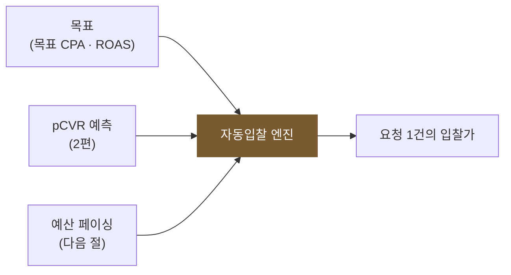
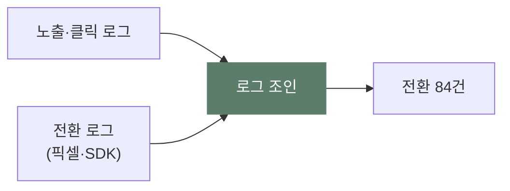

지수 씨는 작은 온라인 편집숍을 운영한다. 카카오모먼트에서 캠페인 하나를 켰다. 목표는 "전환당 비용(CPA) 1만 원, 하루 예산 100만 원"이었다. 버튼을 누른 뒤 그가 할 일은 거기서 끝났다.

며칠 뒤 대시보드를 열어 보니 이상한 게 보였다. 월요일은 예산이 정오도 되기 전에 바닥났다. 화요일은 자정이 다 되도록 30만 원이 그대로 남았다. 그리고 리포트 맨 아래엔 "전환 84건"이라는 숫자가 찍혀 있었다. 이 84건은 정말 광고 덕분에 생긴 걸까?

이 질문 세 개가 이 글의 전부다. 얼마를 부를지, 언제 쓸지, 그 숫자를 믿어도 될지. [1편](post.html?id=kakao-ads-products)에서 무엇이 팔리는지 봤다. [2편](post.html?id=kakao-ads-prediction-targeting)에서 누구에게 보여줄지 봤다. 이 글은 그 뒤, 골랐으면 얼마를 부르고 예산을 어떻게 나누고 효과를 어떻게 재는지를 마무리한다.

> 들어가기 전에 — 카카오 자동입찰의 내부 알고리즘과 정확한 페이싱 규칙, 수수료 구조는 공개돼 있지 않다. 상품 화면에 실제로 보이는 기능명(자동입찰·목표 CPA 설정 등)은 그대로 쓴다. 대신 내부 동작은 "업계에서 보통 이렇게 만든다"는 통념으로만 설명하고, 그렇게 밝힌다. 등장하는 모든 수치는 이해를 돕는 가상의 예시다. 실제 카카오의 입찰가·전환율·CPA가 아니다.

> 한 줄 요약: 자동입찰은 목표(CPA·ROAS) 하나를 받아 매 요청의 입찰가를 대신 정하는 일이다. 그 안에 pCVR 예측과 예산 페이싱이 함께 들어간다. 목표를 너무 타이트하게 걸면 입찰에서 계속 져 예산조차 못 쓴다. 그리고 그렇게 만든 전환 수는 어트리뷰션일 뿐, 광고가 정말 만든 증분과는 다른 질문이다.

---

## 1. 자동입찰이 결국 하는 일 — 목표를 받아 입찰가를 대신 정한다

**카카오모먼트에서 자동입찰에 목표 CPA를 입력하면, 그 뒤의 계산은 전부 시스템 몫이다. 광고주는 목표만 정하고 나머지 수십만 번의 입찰은 맡긴다.**

지수 씨가 입력한 값은 두 개뿐이었다. 목표 CPA 1만 원, 하루 예산 100만 원. 그런데 그 배너 자리를 두고 벌어지는 경쟁은 하루에도 수십만 번이다. 매번 사람이 입찰가를 정할 수는 없다. 그래서 시스템이 대신 계산한다. 이게 카카오모먼트가 실제로 제공하는 기능, **자동입찰**이다.

이 계산의 재료는 두 가지다. 하나는 "이 사람이 살 확률", 곧 pCVR이다. [2편](post.html?id=kakao-ads-prediction-targeting)에서 이 확률을 맞히는 법을 봤다. 다른 하나는 "지금 얼마나 급하게 써야 하는가", 곧 예산 페이싱이다. 이 둘을 합쳐야 매 요청의 입찰가 하나가 나온다. 아래 그림이 이 흐름을 보여준다.


```mermaid
graph LR
    GOAL["목표<br/>(목표 CPA · ROAS)"] --> BID["자동입찰 엔진"]
    PCVR["pCVR 예측<br/>(2편)"] --> BID
    PACE["예산 페이싱<br/>(다음 절)"] --> BID
    BID --> FINAL["요청 1건의 입찰가"]
    style BID fill:#7a5a30,stroke:#7a5a30,color:#fff
```

흥미로운 대조가 하나 있다. 열린 RTB에서는 광고주 쪽 DSP가 이 계산을 직접 짜야 한다. [Bid Shading](post.html?id=bid-shading-censored)에서 다룬 문제 그대로다. 경쟁자가 얼마를 부를지 몰라 분포를 추정해야 한다. 카카오 같은 담장 안에서는 이 추정 자체가 필요 없다. 플랫폼이 모든 입찰가를 직접 보고 있기 때문이다. 광고주는 목표만 말하면 나머지는 시스템이 안다. 이 대비는 §6·§7에서 자세히 다룬다.

---

## 2. 표① — 하루 예산, 언제 쓰느냐로 결과가 갈린다

**같은 하루 예산 100만 원이라도, 시간대별로 어떻게 나눠 쓰느냐에 따라 총 전환 수가 크게 달라진다. 예산의 크기가 아니라 배분이 문제다.**

지수 씨의 예산이 월요일엔 정오 전에 바닥났다고 했다. 이건 "예산이 부족해서"가 아니다. "이르게 다 써버려서"다. 오전 트래픽이 많다고 오전에 다 쓰면, 정작 전환이 잘 되는 저녁 시간대엔 입찰할 돈이 없다. 이렇게 하루 예산을 시간에 걸쳐 나누는 문제를 **예산 페이싱**이라 부른다.

아래 **표①**은 이 문제를 가상의 숫자로 보여준다. 하루를 4시간 단위 6개 구간으로 나눴다. 구간마다 전환율(CVR)이 다르다고 가정했다. 저녁 시간대(16~20시)가 가장 높다. 퇴근 후 카카오톡을 스크롤하는 시간이라면 그럴듯하다. **표의 모든 숫자는 가상이다.** 실제 카카오의 시간대별 전환율이 아니다.

세 전략을 겨룬다. 첫째는 **아침에 다 소진**이다. 00~12시 세 구간에 예산을 몰아 쓰고 그 뒤는 0원이다. 둘째는 **균등 분배**다. 여섯 구간에 똑같이 나눈다. 셋째는 **성과 좋은 시간대 가중**이다. 전환율이 높은 구간에 더 많은 예산을 배정한다. 클릭당 비용(CPC)은 전 시간대 500원으로 동일하다고 단순화했다.

| 시간대 | 전환율(CVR) | A: 아침에 다 소진 | B: 균등 분배 | C: 성과 가중 배분 |
|---|---|---|---|---|
| 00~04시(심야) | 0.8% | 333,333원 | 166,667원 | 80,808원 |
| 04~08시(새벽) | 1.0% | 333,333원 | 166,667원 | 101,010원 |
| 08~12시(오전) | 1.5% | 333,333원 | 166,667원 | 151,515원 |
| 12~16시(오후) | 2.2% | 0원 | 166,667원 | 222,222원 |
| 16~20시(저녁) | 2.6% | 0원 | 166,667원 | 262,626원 |
| 20~24시(밤) | 1.8% | 0원 | 166,667원 | 181,818원 |
| **총 전환 수** | — | **22.0건** | **33.0건** | **37.8건** |

같은 100만 원인데 결과가 22건에서 37.8건까지 벌어진다. 아침에 다 쓰면 전환율이 가장 높은 저녁 시간대를 통째로 놓친다. 균등 분배는 이 손실을 막지만, 심야처럼 전환율이 낮은 구간에도 같은 돈을 쓴다. 성과 가중 배분이 가장 많은 전환을 만든 이유는 단순하다. **돈을 잘 팔리는 시간에 더 많이 썼기 때문이다.**

---

## 3. 파이썬으로 세 전략의 총 전환 수 비교하기

**표①의 계산을 코드로 옮기면, 배분 방식 하나만 바꿔도 결과가 얼마나 벌어지는지 바로 확인할 수 있다.**

코드는 표와 똑같은 가정을 쓴다. 시간대별 전환율, 하루 예산 100만 원, 시간대 무관 CPC 500원. 표준 라이브러리만 쓰니 그대로 복사해 돌리면 표①의 숫자가 그대로 나온다.

```python
# 하루 예산 100만원을 세 가지 페이싱 전략으로 시간대별로 나눠 쓸 때
# 총 전환 수가 어떻게 달라지는지 비교한다. 표준 라이브러리만 쓴다.
# 모든 수치는 가상의 예시다 (실제 카카오 데이터 아님).

BUDGET = 1_000_000          # 하루 예산(원) - 가상
CPC = 500                   # 클릭당 비용(원) - 전 시간대 동일하다고 가정(단순화, 가상)

# 4시간 단위 6개 시간대의 전환율(CVR). 저녁(16-20시) 피크, 새벽 저조 - 가상.
dayparts = [
    ("00-04시(심야)", 0.008),
    ("04-08시(새벽)", 0.010),
    ("08-12시(오전)", 0.015),
    ("12-16시(오후)", 0.022),
    ("16-20시(저녁)", 0.026),
    ("20-24시(밤)",   0.018),
]

def total_conversions(alloc):
    """시간대별 배분액(alloc, 원)으로 총 전환 수를 계산."""
    total = 0.0
    for (name, cvr), budget_i in zip(dayparts, alloc):
        clicks = budget_i / CPC
        total += clicks * cvr
    return total

# 전략 A: 아침에 다 소진 - 00~12시 세 구간에 몰아쓰고 12시 이후는 0
alloc_a = [BUDGET / 3, BUDGET / 3, BUDGET / 3, 0, 0, 0]
# 전략 B: 균등 분배 - 6개 시간대에 똑같이
alloc_b = [BUDGET / 6] * 6
# 전략 C: 성과 좋은 시간대 가중 - CVR에 비례해서 배분
cvr_sum = sum(cvr for _, cvr in dayparts)
alloc_c = [BUDGET * (cvr / cvr_sum) for _, cvr in dayparts]

for label, alloc in [("아침에 다 소진", alloc_a), ("균등 분배", alloc_b), ("성과 가중 배분", alloc_c)]:
    total = total_conversions(alloc)
    print(f"{label:<12} 총 전환 {total:5.2f}건")

total_a, total_b, total_c = (total_conversions(a) for a in (alloc_a, alloc_b, alloc_c))
print(f"\n가중 배분이 균등 대비 {(total_c/total_b - 1)*100:+.1f}%,"
      f" 아침 몰빵 대비 {(total_c/total_a - 1)*100:+.1f}%")

# 출력:
# 아침에 다 소진     총 전환 22.00건
# 균등 분배        총 전환 33.00건
# 성과 가중 배분     총 전환 37.84건
#
# 가중 배분이 균등 대비 +14.7%, 아침 몰빵 대비 +72.0%
```

코드에서 눈여겨볼 곳은 두 군데다.

하나는 `alloc_c`를 만드는 줄이다. 예산을 CVR에 비례해서 나눈다. 전환율이 높은 시간대일수록 더 많은 돈이 배정된다. 다른 하나는 `total_conversions` 함수다. 배분 방식이 무엇이든 이 함수 하나로 총 전환을 계산한다. **전략의 차이는 결국 이 배분 벡터 하나의 차이일 뿐이다.**

:::deep 더 깊이 — 예산은 왜 '균등'하게만 쓰면 안 되는가
표①에서 균등 분배(33.0건)는 아침 몰빵(22.0건)보다 낫다. 그런데 성과 가중 배분(37.8건)이 균등보다 또 낫다. 왜 애초에 균등이 최선이 아닐까.

답은 간단하다. 시간대마다 **기대 가치**가 다르기 때문이다. 여기서 기대 가치란 "이 시간대에 1원을 쓰면 전환이 얼마나 생기는가"다. 저녁 시간대는 심야보다 이 값이 3배 넘게 높다(2.6% vs 0.8%). 기대 가치가 다른데 같은 돈을 쓰면, 가치 낮은 곳에 쓴 돈은 사실 낭비에 가깝다.

이건 [2편](post.html?id=kakao-ads-prediction-targeting)에서 이미 본 문제와 뼈대가 같다. 2편은 타겟 방식별로 CPA가 다를 때, 예산을 어떻게 나눠야 총 전환이 최대인지 그리디하게 풀었다. 여기서는 "타겟 방식" 대신 "시간대"가 배분 대상일 뿐이다. 제한된 예산을 기대 가치 높은 곳에 먼저 배정한다는 원리는 똑같다.

실무에서 이 배분을 계산하는 방식은 이 글의 단순한 비례 배분보다 정교하다. [Auto-Bidding](post.html?id=auto-bidding-pacing)에서 이걸 자세히 다뤘다. PID 컨트롤러나 라그랑주 승수법이 대표적이다. 매 순간 남은 예산과 남은 시간, 지금까지의 소진 속도를 보고 입찰 강도를 실시간으로 조절한다. 원리는 같다. 기대 가치가 높은 곳에 예산을 더 쓰는 것. 다만 "기대 가치가 높은 시간대"를 미리 표로 알 수 없으니, 계속 관측하며 조절할 뿐이다.
:::

---

## 4. 표② — 목표 CPA를 조이면 무슨 일이 벌어지나

**목표 CPA를 낮게 걸수록 시스템은 보수적으로 입찰한다. 너무 낮으면 입찰에서 계속 져 예산 자체를 못 쓴다.**

페이싱이 "언제 쓸지"의 문제라면, 목표 CPA는 "얼마나 공격적으로 부를지"의 문제다. §1에서 봤듯 자동입찰의 입찰가는 대략 **목표 CPA × pCVR**로 정해진다는 게 업계의 일반적인 방식이다. 목표 CPA를 낮게 걸면 입찰가 자체가 낮아진다. 낮은 입찰가는 경매에서 자주 진다.

아래 **표②**는 이 관계를 가상의 시뮬레이션으로 보여준다. 목표 CPA를 4단계로 바꿔가며, 승률(입찰에서 이기는 비율)과 예산 소진율, 전환 수, 실제로 나온 CPA를 계산했다. **표의 모든 숫자는 가상의 모델 결과다.** 실제 카카오 자동입찰의 수치가 아니다.

| 목표 CPA | 승률 | 예산 소진율 | 전환 수 | 실제 CPA |
|---|---|---|---|---|
| 3,000원 (매우 타이트) | 3.7% | 1.5% | 163건 | 2,469원 |
| 6,000원 (타이트) | 32.9% | 22.5% | 1,379건 | 4,396원 |
| 10,000원 (적당) | 70.3% | 65.7% | 2,875건 | 6,167원 |
| 15,000원 (느슨) | 90.3% | 100.0% | 3,644건 | 7,405원 |

가장 위 줄을 보자. 목표를 3,000원까지 조이면 승률이 3.7%로 떨어진다. 예산의 1.5%밖에 못 쓴다. 지수 씨가 화요일에 30만 원을 남긴 것도 같은 구조일 수 있다. 페이싱 문제가 아니라 목표 자체가 너무 타이트해서, 애초에 이길 입찰이 적었던 것이다. 이건 [2편](post.html?id=kakao-ads-prediction-targeting)의 맞춤타겟과 같은 모양이다. 정확도는 1등이어도 예산의 극히 일부만 쓰고 말았다. 도달이 좁으면 정확해도 물량이 안 나온다.

목표를 15,000원까지 풀면 이야기가 달라진다. 승률 90.3%, 예산은 거의 다 쓴다. 전환 수도 가장 많다. 그런데 실제 CPA(7,405원)는 여전히 목표(15,000원)보다 낮다. 시스템이 목표를 넘지 않도록 보수적으로 계산하기 때문이다. **목표를 푼다고 실제 CPA가 목표까지 치솟는 건 아니다.** 대신 더 많은, 상대적으로 비싼 기회까지 받아들이면서 물량이 늘어난다.

---

## 5. 파이썬으로 목표 CPA 시뮬레이션 — 승률·소진율·실제 CPA

**표②의 숫자가 어디서 나왔는지, 단순화한 모델로 직접 계산해 본다. 실제 카카오 알고리즘이 아니라 업계 통념을 본뜬 예시 모델이다.**

가정은 이렇다. 광고 요청마다 "이기는 데 필요한 시장가"가 있다. 자동입찰은 입찰가를 목표 CPA × 예측 pCVR로 정한다. 입찰가가 시장가를 넘으면 낙찰이다. 그리고 §1에서 말했듯, 담장 안 자동입찰은 낙찰에 필요한 만큼만 낸다고 가정했다.

```python
# 목표 CPA를 낮게/적당히/높게 걸었을 때 승률·예산 소진율·실제 CPA가
# 어떻게 움직이는지 시뮬레이션한다. 표준 라이브러리만 쓴다. 시드 고정.
# 전부 가상의 예시 모델이다 - 카카오 실제 자동입찰 알고리즘이 아니다.
#
# 단순화한 가정(업계에서 자동입찰이 흔히 쓰는 방식을 본뜬 것일 뿐, 실제 구현 아님):
#   - 매 요청마다 '이기는 데 필요한 시장가(market clearing price)'가 존재
#   - 자동입찰은 bid = 목표CPA x 예측 pCVR 로 입찰가를 정함 (2편의 pCVR 예측이 재료)
#   - 시장가보다 bid가 높으면 낙찰, 담장 안 자동입찰은 딱 필요한 만큼만 낸다고 가정
import random
random.seed(3)

N = 200_000                      # 하루 광고 요청 수(가상)
MU, SIGMA = 5.0106, 0.5          # 시장가 로그정규분포 파라미터 - 중앙값 약 150원(가상)
CVR_MEAN, CVR_SD = 0.02, 0.003   # 요청별 예측 pCVR 평균/표준편차(가상)

market_price = [random.lognormvariate(MU, SIGMA) for _ in range(N)]
pcvr = [max(0.002, random.gauss(CVR_MEAN, CVR_SD)) for _ in range(N)]

def simulate(target_cpa):
    wins = spend = conv = 0.0
    for price, p in zip(market_price, pcvr):
        bid = target_cpa * p           # bid = 목표CPA x pCVR
        if bid >= price:                # 시장가를 넘으면 낙찰
            wins += 1
            spend += price              # 딱 필요한 만큼만 지불(가정)
            conv += p
    return wins, spend, conv

targets = [3_000, 6_000, 10_000, 15_000]
results = [(t,) + simulate(t) for t in targets]
baseline_spend = results[-1][2]   # 가장 느슨한 시나리오의 지출 = 가상의 예산 기준선

print("목표CPA   승률     예산소진율   전환수     실제CPA")
for target, wins, spend, conv in results:
    print(f"{target:>7,}원  {wins/N:>6.1%}   {spend/baseline_spend:>8.1%}   "
          f"{conv:>7.1f}건   {spend/conv:>9,.0f}원")

# 출력:
# 목표CPA   승률     예산소진율   전환수     실제CPA
#   3,000원    3.7%       1.5%     162.9건       2,469원
#   6,000원   32.9%      22.5%    1378.5건       4,396원
#  10,000원   70.3%      65.7%    2874.9건       6,167원
#  15,000원   90.3%     100.0%    3643.5건       7,405원
```

코드에서 눈여겨볼 곳은 두 군데다.

하나는 `bid = target_cpa * p` 줄이다. 목표 CPA에 예측 pCVR을 곱해 입찰가를 만든다. 목표가 같아도 pCVR이 높은 요청일수록 입찰가가 높아진다. 다른 하나는 `spend += price`다. 낙찰되면 시장가만큼만 낸다고 가정했다. 이건 §1에서 말한 "플랫폼이 대신 깎아준다"는 가정을 그대로 코드에 옮긴 것이다.

결과를 보면 목표를 조일수록 승률과 소진율이 같이 무너진다. 3,000원에서는 승률 3.7%, 소진율 1.5%다. 15,000원에서는 승률 90.3%, 소진율 100%다. 그런데 실제 CPA는 네 경우 모두 목표보다 낮다. **승률과 물량은 목표에 민감하지만, 실제 CPA는 목표를 넘지 않는 선에서만 움직인다.** 이 모델은 단순화한 예시일 뿐, 실제 카카오 시스템이 이 공식 그대로 계산한다는 뜻은 아니다.

---

## 6. 담장 안에서 자동입찰이 하는 일 [무대: 닫힌 생태계]

**카카오의 자동입찰은 모든 광고의 입찰가를 직접 보면서 값을 정한다. 그래서 어림짐작이 없다. 대신 광고주는 그 계산 과정을 들여다볼 수 없다.**

열린 RTB의 DSP는 경쟁자가 얼마를 부를지 모른 채 입찰가를 정해야 한다. 그런데 카카오모먼트의 자동입찰은 다르다. 노출·클릭·구매 로그뿐 아니라, 같은 지면에 몰린 다른 광고주의 입찰가까지 전부 한 회사의 시스템 안에 있다. 그래서 "이 정도면 이긴다"는 계산에 추정이 끼어들 필요가 없다. 1편의 표①에서 패찰가 4개까지 전부 봤던 것과 같은 이유다.

이 이점은 페이싱에도 그대로 이어진다. 남은 예산과 남은 시간, 지금까지의 소진 속도도 전부 플랫폼이 실시간으로 보고 있다. 그래서 §2의 표①처럼 시간대별 배분을 세밀하게 조절할 수 있다. 광고주가 직접 시간대별 전환율을 추정해 배분을 짤 필요가 없다. 시스템이 이미 그 데이터를 갖고 있기 때문이다.

그런데 이 편리함에는 대가가 있다. 지수 씨가 볼 수 있는 건 목표 CPA를 입력하는 화면과, 그 결과로 나온 리포트뿐이다. 어떤 요청에 얼마를 불렀는지, 왜 화요일엔 예산이 남았는지, 그 중간 계산은 보이지 않는다. **정보를 다 가진 건 플랫폼이지 광고주가 아니다.** 이게 담장 안 자동입찰의 트레이드오프다. 어림짐작은 사라지지만, 그 자리를 블랙박스가 대신 채운다.

---

## 7. 열린 RTB라면 광고주가 직접 깎아야 한다 [무대: 열린 RTB]

**열린 RTB에서는 이 모든 계산을 광고주 쪽 DSP가 직접 떠안는다. 패찰하면 경쟁자가 얼마를 불렀는지조차 알 수 없다.**

같은 "목표 CPA 자동입찰"을 열린 RTB에서 하려면 훨씬 많은 것을 스스로 풀어야 한다. 낙찰가는 보이지만 패찰가는 안 보인다. [Bid Shading](post.html?id=bid-shading-censored)에서 다룬 **Censored Data** 문제다. 경쟁자의 입찰가 분포를 통계적으로 추정해야, "이 정도면 이긴다"는 값을 겨우 알 수 있다.

페이싱도 마찬가지다. §2의 표①처럼 시간대별 전환율을 볼 수는 있다. 하지만 그 데이터가 카카오만큼 촘촘하지 않다. 서드파티 쿠키가 줄고 iOS ATT가 식별자를 막으면서, 시간대별 성과를 사람 단위로 잇는 일 자체가 어려워졌다. [1편](post.html?id=kakao-ads-products)에서 이미 다룬 이야기다.

그래서 열린 RTB의 목표는 카카오와 같아도 방법은 다르다. **1st Price 경매에서 과다 지불을 막는다**는 목표는 똑같다. 카카오는 정보로 이 문제를 푼다. 모든 입찰가를 보고 있으니 계산으로 끝난다. 열린 RTB는 추정으로 이 문제를 푼다. 안 보이는 절반을 통계로 메운다. 담장 안팎을 가르는 건 결국 **무엇을 볼 수 있느냐**다.

---

## 8. 성과 측정 — 그 전환 수는 진짜 효과가 아니다

**픽셀·SDK가 잡은 "전환 84건"은 회계다. 광고가 없었어도 그중 몇 건은 일어났을 수 있다. 그 차이를 재려면 이 글만으로는 부족하다.**

카카오는 광고주 웹사이트에 심는 **카카오 픽셀**과 앱에 심는 **SDK**로 구매·가입 같은 전환을 받는다. 이 신호는 노출·클릭 로그와 조인되어 "어느 광고의 전환인가"로 묶인다. 지수 씨가 본 "전환 84건"이 만들어지는 과정이 이거다.


```mermaid
graph LR
    IMP["노출·클릭 로그"] --> JOIN["로그 조인"]
    CONV["전환 로그<br/>(픽셀·SDK)"] --> JOIN
    JOIN --> REPORT["전환 84건"]
    style JOIN fill:#5b7d6a,stroke:#5b7d6a,color:#fff
```

이 로그들을 사람 단위로 잇는 일은 [광고 로그 파이프라인](post.html?id=ad-log-pipeline)에 있다. 그런데 이 84건은 **어트리뷰션 규칙**이 만든 숫자다. 마지막 클릭에 몰아줄지, 거쳐 간 접점에 나눌지 — 규칙에 따라 같은 로그에서도 다른 숫자가 나온다. 이 규칙과 그 함정은 [어트리뷰션 입문](post.html?id=attribution-basics)에서 자세히 다뤘다. **이 글에서 그 계산을 다시 하지 않는다.**

진짜 궁금한 건 다른 질문이다. "광고가 없었어도 84건 중 몇 건은 일어났을까?" 이 답을 얻으려면 일부러 광고를 안 보여준 대조군, 즉 **홀드아웃**이 필요하다. 홀드아웃을 어떻게 설계하는지는 [RCT](post.html?id=rct-randomized-experiment)에 있다. 이 차이는 [어트리뷰션 입문 §7](post.html?id=attribution-basics)에 이미 계산돼 있다.

그래서 지수 씨의 "전환 84건"에 대한 정직한 답은 이렇다. **그 숫자는 진짜다. 하지만 그 84건 전부가 광고 덕분이라는 뜻은 아니다.** 얼마나가 진짜 증분인지는 카카오 픽셀 리포트만 봐서는 알 수 없다. 홀드아웃을 돌려야 나온다.

---

## 9. 한눈 정리

| 개념 | 뜻 | 이 글에서 본 숫자 | 핵심 |
|---|---|---|---|
| 자동입찰 | 목표를 받아 입찰가를 대신 정함 | 입찰가 ≈ 목표 CPA × pCVR | pCVR 예측 + 페이싱이 재료 |
| 예산 페이싱 | 하루 예산을 시간에 걸쳐 배분 | 아침몰빵 22건 vs 가중배분 37.8건 | 균등도 아침몰빵보단 낫지만 최선은 아님 |
| 목표 CPA | 입찰 강도를 정하는 손잡이 | 3,000원→소진율 1.5% / 15,000원→100% | 너무 조이면 예산을 못 씀 |
| 실제 CPA | 목표와 다른, 결과로 나온 값 | 네 시나리오 모두 목표보다 낮음 | 목표는 상한이지 실제값이 아님 |
| 담장 안 자동입찰 | 플랫폼이 모든 입찰가를 보고 대신 정함 | 패찰가 없이도 계산 끝 | 어림짐작 없음, 대신 블랙박스 |
| 열린 RTB Bid Shading | DSP가 패찰가 없이 직접 추정 | Censored Data | 어림짐작이 불가피 |
| 어트리뷰션 vs 증분 | 회계 vs 광고가 실제로 만든 효과 | 전환 84건 ≠ 증분 84건 | 증분은 홀드아웃으로만 잰다 |

---

## 10. 헷갈리기 쉬운 점

- **목표 CPA를 낮게 걸면 무조건 좋다? 아니다.** 표②에서 봤듯, 너무 낮으면 승률이 무너져 예산의 극히 일부만 쓰고 만다. 전환 수 자체가 적어진다.
- **예산이 남는 이유가 항상 페이싱 문제는 아니다.** §2는 "언제 쓰는지"가 문제였다. §4는 "애초에 이길 입찰이 부족한지"가 문제였다. 둘은 원인이 다르다.
- **실제 CPA가 목표 CPA를 넘는 일은 잘 없다.** 표②의 네 시나리오 모두 실제 CPA가 목표보다 낮았다. 목표는 시스템이 지키려는 상한에 가깝다.
- **담장 안이라고 광고주가 다 아는 건 아니다.** 플랫폼은 모든 입찰가를 본다. 하지만 광고주에게 보이는 건 목표 입력창과 리포트뿐이다. 계산 과정은 블랙박스다.
- **전환 수가 많다고 광고 효과가 큰 건 아니다.** 픽셀·SDK가 잡은 숫자는 어트리뷰션 규칙의 결과다. 광고가 없었어도 일어났을 전환이 섞여 있을 수 있다.

---

## 더 깊이 보기

- 무엇이 팔리고 eCPM으로 어떻게 줄 세워지나 → [1편: 카카오 광고 상품 지도](post.html?id=kakao-ads-products)
- 무엇으로 확률을 맞히고 누구를 겨냥하나 → [2편: 카카오는 무엇으로 광고를 고르나](post.html?id=kakao-ads-prediction-targeting)
- 예산 페이싱의 PID·라그랑주 산수 → [Auto-Bidding & Budget Pacing](post.html?id=auto-bidding-pacing)
- 패찰가 없이 입찰가를 추정하는 법 → [Bid Shading: Censored Data](post.html?id=bid-shading-censored)
- 어트리뷰션 규칙과 증분의 차이 → [어트리뷰션 입문](post.html?id=attribution-basics)
- 홀드아웃 실험을 제대로 설계하는 법 → [RCT: 무작위 실험](post.html?id=rct-randomized-experiment)
- 광고 ML 전체 지도에서 이 글의 위치 → [ML 엔지니어 트랙](ml-track.html)
