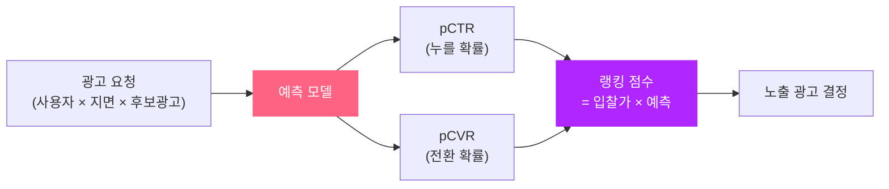
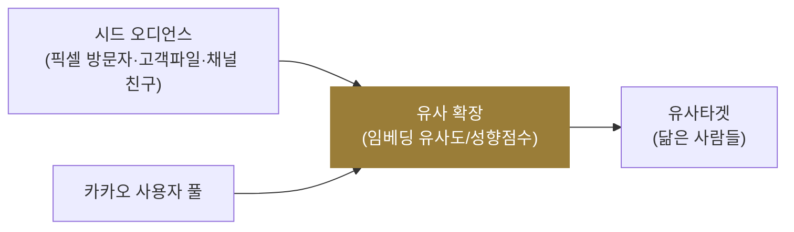

1편에서 비즈보드·키워드광고가 결국 **"입찰가 × 예상반응률로 줄 세우는"** 문제라고 했습니다. 그 줄 세우기의 심장이 바로 **예상반응률 = pCTR(예상 클릭률)·pCVR(예상 전환율)** 입니다. 이번 편은 카카오가 "어떤 광고를, 누구에게 보여줄지" 정하는 **예측·타겟팅**의 층을, 우리가 공부한 모델링 글들과 연결합니다.

> 가드레일 — 카카오의 실제 모델 구조·피처는 공개되어 있지 않습니다. 그래서 "카카오는 X 모델을 쓴다"가 아니라, **"이런 지면·이런 문제에는 보통 어떤 기법이 들어가는가"** 를 우리 개념 글과 잇는 방식으로 설명합니다. 숫자는 전부 이해용 **가정 예시**입니다.

[1편: 카카오 광고 상품 지도](post.html?id=kakao-ads-products)를 먼저 읽으면 흐름이 자연스럽습니다.

---

## 1. 줄 세우기의 심장 — pCTR과 pCVR

비즈보드 한 칸, 다음 검색 결과 맨 위 한 줄. 여러 광고가 그 자리를 원할 때, 시스템은 각 광고에 대해 묻습니다. **"이 사용자가 이걸 누를 확률은?"(pCTR)**, 그리고 전환 캠페인이라면 **"눌러서 실제로 살 확률은?"(pCVR)**.

이 확률을 잘 맞히는 게임의 역사가 [Deep CTR 모델의 진화](post.html?id=deep-ctr-models)입니다. 단순 로지스틱 회귀에서 시작해, 피처 간 상호작용을 잡는 FM, 딥러닝을 얹은 Wide&Deep·DeepFM, 사용자의 행동 시퀀스에 주목하는 DIN까지 — "더 정확한 pCTR"을 향한 진화죠.

카카오처럼 **클릭(CTR)과 전환(CVR)을 동시에 신경 쓰는** 성과형 광고에서는, 둘을 따로 학습하기보다 한 모델에서 같이 배우는 게 유리합니다. 클릭 데이터는 풍부하지만 전환 데이터는 희귀한데, 클릭에서 배운 표현을 전환 예측이 빌려 쓸 수 있기 때문입니다. 이게 [Multi-Task Learning](post.html?id=multi-task-learning)에서 다룬 ESMM·MMoE 같은 구조가 풀려는 문제입니다.

---

## 2. 왜 '보정(Calibration)'이 돈 문제인가

여기서 흔한 오해 하나. "모델이 클릭을 잘 맞히면(AUC 높으면) 끝 아닌가?" 광고에선 아닙니다. 랭킹 점수가 `입찰가 × pCTR`이라면, pCTR의 **절댓값**이 곧 과금·예산과 직결됩니다.

예시(가정): 실제 클릭률이 2%인 광고를 모델이 4%라고 부풀리면, 시스템은 이 광고의 가치를 2배로 착각해 과하게 노출하고 예산을 빠르게 태웁니다. 순위(누가 1등인지)는 맞혀도 **숫자 자체가 틀리면 돈이 샙니다**. 그래서 예측 평균을 실제 분포에 맞추는 [Calibration](post.html?id=calibration)이 필수입니다 — "AUC가 높아도 돈을 잃는 이유"가 그 글의 부제죠.

---

## 3. 누구에게 보여줄까 — 카카오모먼트의 타겟팅

카카오모먼트에서 광고주가 오디언스를 고르는 방식은 크게 세 갈래입니다. 각각이 우리가 본 타겟팅 개념의 응용입니다.

| 모먼트 타겟팅 | 무엇인가 | 관련 개념 |
|---|---|---|
| 데모/관심사(나이·성별·지역·업종) | 규칙 기반 세그먼트 | [세그멘테이션](post.html?id=audience-segmentation) |
| 맞춤타겟 — 내 데이터(픽셀·SDK 방문자, 고객파일, 채널 친구) | 1st-party 시드 오디언스 | [세그멘테이션](post.html?id=audience-segmentation) |
| 유사타겟 | 시드와 닮은 사람으로 확장 | [Lookalike Modeling](post.html?id=lookalike-modeling) |

흐름으로 보면 이렇습니다. 광고주가 자기 고객(예: 구매자 명단이나 픽셀로 모은 방문자)을 **시드**로 올리면 → 카카오가 그 시드와 닮은 사람을 자사 사용자 풀에서 찾아 **유사타겟**으로 확장합니다. "전환 유저 소수에서 유사 유저 다수를 발굴"하는 바로 그 문제 — [Lookalike Modeling](post.html?id=lookalike-modeling)에서 임베딩 유사도·성향점수로 푸는 방식을 그대로 떠올리면 됩니다.

> 확장을 넓게 잡으면 도달은 커지지만 정밀도가 떨어지고, 좁게 잡으면 그 반대입니다. 이 트레이드오프(Expansion Ratio)도 [Lookalike](post.html?id=lookalike-modeling) 글에 정리돼 있습니다.

---

## 4. 톡·다음·맵을 합치면 — 1st-party 데이터의 힘

카카오의 진짜 무기는 모델 자체보다 **데이터의 통합**입니다. 같은 로그인 ID로 카카오톡·다음 검색·카카오맵·쇼핑·결제가 한 울타리 안에 있으니, "이 사람"에 대한 신호가 3rd-party 쿠키로 긁어모은 것과 비교가 안 되게 풍부하고 정확합니다. 이 구조적 우위는 [Walled Garden](post.html?id=walled-garden)의 2절(데이터 통합)에서 자세히 다뤘습니다 — 3rd-party 쿠키가 사라질수록 이 우위는 더 커집니다.

그런데 이 풍부한 데이터를 **0.1초 안에** 모델 입력으로 조립하는 건 별개의 공학 문제입니다. "이 유저의 최근 7일 클릭률" 같은 피처를 매 요청마다 실시간으로 공급하는 [Feature Store & 실시간 서빙](post.html?id=feature-store-serving)이 그 일을 합니다. 데이터가 많다는 것과, 그걸 제때 쓸 수 있다는 건 다른 이야기죠.

---

## 5. 위치가 클릭을 부풀린다 — 비즈보드·피드의 Position Bias

마지막 함정 하나. 비즈보드 맨 위에 떴던 광고는 클릭이 많습니다. 그런데 그게 **광고가 좋아서**일까요, **자리가 좋아서**일까요? 둘을 구분하지 못하면 "위라서 클릭 많고 → 클릭 많으니 계속 위" 라는 부익부(rich-get-richer) 루프에 빠집니다.

피드·목록형 지면에서 늘 생기는 이 문제가 [Position Bias & Unbiased Learning to Rank](post.html?id=position-bias-ultr)입니다. 노출 위치가 주는 효과를 떼어내고 **순수한 광고 품질**만으로 랭킹해야, 좋은 광고가 제 위치를 찾습니다. [Walled Garden](post.html?id=walled-garden) 글에서 본 `pCTR = P(본다|위치) × P(클릭|봤을 때, 광고품질)` 분해가 바로 이걸 푸는 장치입니다.

---

## 6. 매핑 한눈에

| 카카오에서 벌어지는 일 | 우리가 배운 개념 | 더 읽기 |
|---|---|---|
| "누를까?" 예측 | pCTR 모델의 진화 | [Deep CTR](post.html?id=deep-ctr-models) |
| 클릭+전환 동시 학습 | 멀티태스크 | [Multi-Task Learning](post.html?id=multi-task-learning) |
| 예측 숫자가 과금과 직결 | 보정 | [Calibration](post.html?id=calibration) |
| 데모·관심사·맞춤 오디언스 | 세그멘테이션 | [세그멘테이션](post.html?id=audience-segmentation) |
| 유사타겟 확장 | 룩얼라이크 | [Lookalike](post.html?id=lookalike-modeling) |
| 톡·다음·맵 데이터 통합 | 1st-party 우위 + 실시간 피처 | [Walled Garden](post.html?id=walled-garden) · [Feature Store](post.html?id=feature-store-serving) |
| 윗자리라 클릭 많은 착시 | 포지션 편향 보정 | [Position Bias](post.html?id=position-bias-ultr) |

---

## 마무리

1. 카카오의 "어떤 광고를"은 **pCTR·pCVR 예측**, "누구에게"는 **세그먼트·맞춤·유사타겟**으로 정해집니다. 둘 다 이 블로그가 이미 다룬 모델링·타겟팅 문제입니다.
2. 광고에서는 **잘 맞히는 것(랭킹)** 만큼 **숫자를 정확히 맞히는 것(Calibration)** 이 중요합니다 — 절댓값이 곧 돈이라서요.
3. 카카오의 진짜 해자는 모델보다 **톡·다음·맵의 1st-party 데이터 통합**이고, 그걸 실시간으로 쓰는 [Feature Store](post.html?id=feature-store-serving)가 받칩니다.

다음 편 **"카카오에서 캠페인이 굴러가는 법"** 에서는 이렇게 고른 광고에 **얼마를 입찰하고(자동입찰)**, 예산을 어떻게 나누며(페이싱), 성과를 어떻게 측정하는지(어트리뷰션·증분효과)를 마지막으로 연결합니다.
