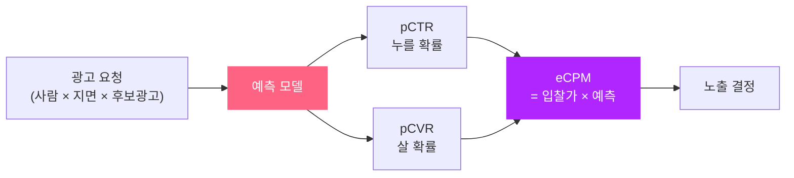
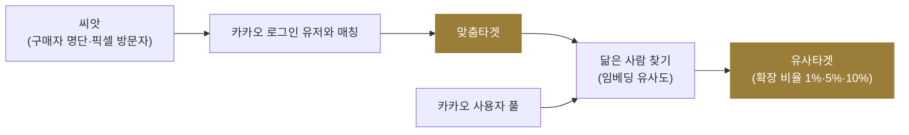

카카오톡 지갑 탭을 열었다. 낯선 배너가 떠 있었다. 이틀 전 카카오페이로 캠핑장 예약금을 냈다. 뜬 광고는 캠핑 의자였다. 그 결제를 지켜본 곳은 카카오뿐이다. 그런데 다른 앱을 켜면 이런 일이 잘 안 생긴다.

1편에서 이 배너 한 칸이 어떻게 팔리는지 봤다. 여러 광고가 eCPM으로 줄을 섰다. `입찰가 × pCTR`이 가장 높은 광고가 자리를 가져갔다. 그런데 그 pCTR, 그러니까 "이 사람이 누를 확률"을 카카오는 무엇으로 맞힐까. 애초에 "누구에게 보여줄지"는 어떻게 좁힐까.

이 두 질문이 이번 편의 전부다. 예측(pCTR·pCVR)의 재료가 무엇인지 본다. 타겟팅(맞춤·유사타겟)이 도달과 정확도를 어떻게 맞바꾸는지도 본다.

> 들어가기 전에 — 카카오의 실제 모델 구조·피처·타겟 정확도·데이터 규모는 공개돼 있지 않다. 상품 화면에 실제로 보이는 기능명(맞춤타겟·유사타겟 등)은 그대로 쓴다. 대신 내부 구현은 업계 통념으로만 설명한다. 등장하는 모든 수치는 이해를 돕는 **가상의 예시**다. 실제 카카오의 pCTR·도달·전환율이 아니다.

[1편: 카카오 광고 상품 지도](post.html?id=kakao-ads-products)를 먼저 읽으면 흐름이 이어진다.

> 한 줄 요약: 카카오의 예측은 로그인 데이터를 깔고 시작해서, 처음부터 다른 선에서 출발한다. 타겟을 좁힐수록 전환율은 오르지만 도달은 준다 — 유사타겟이 그 사이를 메운다. 하지만 예측이 정교해도 숫자를 실제 확률에 맞추는 보정(Calibration)이 없으면 소용없다. 1편에서 본 낙찰자 뒤집힘이 담장 안에서도 그대로 벌어진다.

---

## 1. 예측이 광고를 고른다 — pCTR·pCVR 다시 보기

**비즈보드 한 칸, 검색 결과 위 한 줄. 그 자리를 두고 벌어지는 경쟁은 결국 확률 하나의 싸움이다.**

1편에서 본 계산은 이렇다. `eCPM = 입찰가 × 예상 반응률`. 여기서 예상 반응률이 pCTR, 즉 예상 클릭률이다. 전환이 목표인 캠페인이라면 pCVR(예상 전환율)까지 한 번 더 곱한다. 광고 요청이 들어올 때마다, 시스템은 사람 한 명 한 명에 대해 이 확률을 새로 계산한다.

이 확률을 잘 맞히는 일의 역사는 이미 다뤘다. 단순한 회귀에서 시작했다. 피처 조합을 자동으로 찾는 FM이 나왔다. 딥러닝을 얹은 DeepFM이 나왔다. 사람마다 다른 관심사에 주목하는 DIN까지 이어졌다. "더 정확한 pCTR"을 향한 진화였다. 계보는 [pCTR: 이 사람이 누를까](post.html?id=pctr-prediction)에 있다. 모델 구조 발전사는 [Deep CTR 모델의 진화](post.html?id=deep-ctr-models)에 정리돼 있다. 여기서는 그 모델이 무엇을 재료로 쓰는지에 집중한다.

카카오처럼 클릭과 전환을 둘 다 신경 쓰는 광고가 있다. 이런 광고는 두 확률을 따로 학습하지 않는다. 클릭 데이터는 흔하다. 전환 데이터는 드물다. 클릭에서 배운 패턴을 전환 예측이 빌려 쓰는 편이 유리하다. 이런 구조를 [멀티태스크 러닝](post.html?id=multi-task-learning)이라 부른다. ESMM·MMoE 같은 모델이 이 문제를 푼다.


```mermaid
graph LR
    REQ["광고 요청<br/>(사람 × 지면 × 후보광고)"] --> M["예측 모델"]
    M --> PCTR["pCTR<br/>누를 확률"]
    M --> PCVR["pCVR<br/>살 확률"]
    PCTR --> SCORE["eCPM<br/>= 입찰가 × 예측"]
    PCVR --> SCORE
    SCORE --> WIN["노출 결정"]
    style M fill:#ff6384,stroke:#ff6384,color:#fff
    style SCORE fill:#b026ff,stroke:#b026ff,color:#fff
```

그런데 같은 모델 구조라도 어디서 돌리느냐에 따라 결과가 달라진다. 재료, 즉 데이터가 다르기 때문이다. 다음 절에서 그 차이를 숫자로 본다.

---

## 2. 담장 안에서 예측이 다르게 출발한다 [무대: 닫힌 생태계]

**같은 광고, 다른 사람이라도 로그인 데이터가 붙는 순간 pCTR 추정치가 갈린다. 붙기 전엔 다들 비슷해 보이던 게, 붙고 나면 갈라진다.**

로그인하지 않은 사람에게 광고를 보여줘야 한다고 하자. 모델이 가진 단서는 거의 없다. 이 지면·이 시간대·이 광고 카테고리의 평균 클릭률 정도가 전부다. 그래서 로그인 전 예측은 사람마다 큰 차이가 없다. 그 광고 카테고리의 "평균" 근처에 몰린다.

카카오는 다르다. 톡·다음·페이·T·맵이 같은 로그인 ID로 묶여 있다. 이 사람이 최근 무엇을 검색했는지 알 수 있다. 무엇을 결제했는지도 안다. 어떤 톡채널에 관심을 보였는지도 피처가 된다. [Walled Garden](post.html?id=walled-garden)에서 이 이점을 다뤘다. 데이터 통합이 예측의 재료로 그대로 들어온다.

아래 **표①**은 같은 광고 5개를 서로 다른 사람에게 보여줄 때를 비교한다. "익명 트래픽만 있을 때"와 "로그인 기반 관심·행동 피처가 붙었을 때"다. pCTR 예측이 어떻게 갈리는지 보여준다. **전부 가상의 수치다.** 실제 카카오 모델의 출력이 아니다.

| # | 광고 | 익명 트래픽만 있을 때 pCTR | 로그인 기반 피처 추가 후 pCTR | 근거가 된 신호 |
|---|---|---|---|---|
| 1 | 캠핑용품 | 1.2%(카테고리 평균) | **3.8%** | 최근 카카오페이로 캠핑장 결제 |
| 2 | 유아용품 | 1.2%(카테고리 평균) | **4.5%** | 최근 유아용품 결제 이력 |
| 3 | 항공권 | 1.2%(카테고리 평균) | **3.1%** | 최근 카카오T로 공항 픽업 예약 |
| 4 | 카드사 신규가입 | 1.2%(카테고리 평균) | **0.4%** | 이미 해당 카드 보유(무관심 신호) |
| 5 | 뷰티 브랜드 | 1.2%(카테고리 평균) | **0.9%** | 관련 카테고리 행동 전혀 없음 |

여기서 중요한 건 "로그인 데이터가 있으면 pCTR이 항상 오른다"가 아니다. 4번과 5번을 보자. 로그인 정보가 붙자 예측이 오히려 내려갔다. 익명일 때는 모두가 카테고리 평균(1.2%) 근처에 뭉쳐 있었다. 진짜 신호가 들어오자 갈렸다. 관심 있는 사람은 위로, 무관심한 사람은 아래로 갈렸다. 이게 "예측의 출발점부터 다르다"는 말의 실체다. 익명 상태의 예측은 사실 평균으로의 추측에 가깝다. 로그인 데이터가 그 추측을 진짜 예측으로 바꾼다. 다만 이 신호를 0.1초 안에 조립하는 건 또 다른 공학 문제다. 미리 계산해 둔 값을 초저지연으로 꺼내 와야 한다. [Feature Store](post.html?id=feature-store-serving)가 이 역할을 한다.

---

## 3. 좁힐수록 잘 맞고, 좁힐수록 준다 — 타겟 방식과 표②

**"누구에게 보여줄지"를 좁히는 건 공짜가 아니다. 정확도를 사는 대신 도달을 값으로 치른다.**

카카오모먼트에서 광고주가 고르는 오디언스는 크게 네 갈래다. 데모그래픽은 나이·성별·지역 같은 규칙 기반 세그먼트다. 관심사는 카테고리 관심 신호로 묶은 세그먼트다. 맞춤타겟은 광고주가 직접 올리는 자기 고객 리스트다. 유사타겟은 맞춤타겟과 닮은 사람으로 확장한 것이다. 넷 다 [세그멘테이션](post.html?id=audience-segmentation)에서 다룬 세그먼트 유형의 응용이다. 유사타겟은 [Lookalike Modeling](post.html?id=lookalike-modeling)의 실물이다.

이 넷을 나란히 놓으면 뚜렷한 패턴이 보인다. 아래 **표②**는 같은 캠페인을 여섯 가지 방식으로 돌렸을 때를 비교한다. 도달 규모와 전환율이 어떻게 바뀌는지 보여준다. **역시 가상의 수치다.** 실제 도달·전환율이 아니다.

| 타겟 방식 | 도달 규모 | 전환율(CVR) |
|---|---|---|
| 데모그래픽(연령·성별·지역) | 5,000,000명 | 0.25% |
| 관심사(카테고리 관심 신호) | 1,600,000명 | 0.60% |
| 유사타겟 10% | 1,400,000명 | 0.90% |
| 유사타겟 5% | 700,000명 | 1.50% |
| 유사타겟 1% | 150,000명 | 3.20% |
| 맞춤타겟(내 고객 리스트) | 80,000명 | 4.50% |

표를 위에서 아래로 읽으면 도달은 줄고 전환율은 오른다. 데모그래픽의 500만 명은 광고와 무관한 사람까지 섞여 있다. 그래서 전환율이 낮다. 맞춤타겟의 8만 명은 이미 이 브랜드를 아는 사람들이다. 전환율이 18배 가까이 높다. 유사타겟 1%·5%·10%는 그 사이 어딘가에 놓인다. 확장 비율이 커질수록 맞춤타겟에서 멀어진다. 대신 데모그래픽에 가까워지는 스펙트럼이다.

그런데 표를 숫자로만 읽으면 함정에 빠진다. 전환율이 가장 높다고 그 타겟이 가장 좋다는 뜻은 아니다. 도달이 너무 작으면 총 전환 건수 자체가 적을 수 있다. 다음 절에서 이걸 직접 계산해 확인한다.

---

## 4. 파이썬으로 확인하기 — 가장 정확한 타겟이 최선은 아니다

**표②의 도달과 전환율을 곱하면 총 전환 수가 나온다. 그 숫자를 보면 다른 그림이 보인다.**

계산은 두 단계다. (a) 각 타겟 방식의 도달×전환율로 총 전환 수와 CPA(전환 1건당 비용)를 구한다. 비용은 도달 규모 곱하기 CPM(노출 1,000명당 단가)으로 잡는다. 좁은 타겟일수록 경쟁이 몰려 CPM이 비싸진다고 가정했다. (b) 예산이 2천만 원으로 고정됐을 때, 어떤 조합이 총 전환을 가장 많이 만드는지 그리디하게 배분해 본다.

표준 라이브러리만 쓴다. 그대로 복사해 돌리면 아래 출력이 그대로 나온다.

```python
# 카카오모먼트에서 고를 수 있는 타겟 방식 6개를, 표2의 가상 도달·전환율로 비교한다.
# (a) "가장 정확한 타겟(맞춤타겟)이 반드시 최선은 아니다"를 총 전환 수로 확인하고,
# (b) 예산이 고정일 때 어떤 조합이 최적인지 그리디 배분으로 계산한다.
# 표준 라이브러리만 쓴다.

# 타겟 방식 | 도달 규모(명) | 전환율(CVR) | CPM(노출 1,000명당 비용, 원) - 전부 가상 수치.
targets = [
    ("데모그래픽",    5_000_000, 0.0025,  3_000),
    ("관심사",        1_600_000, 0.0060,  4_000),
    ("유사타겟 10%",  1_400_000, 0.0090,  5_000),
    ("유사타겟 5%",     700_000, 0.0150,  6_500),
    ("유사타겟 1%",     150_000, 0.0320,  9_000),
    ("맞춤타겟",         80_000, 0.0450, 12_000),
]

def full_stats(name, reach, cvr, cpm):
    max_conv = reach * cvr            # 이 타겟을 100% 소진했을 때 전환 수
    max_cost = reach / 1000 * cpm     # 100% 소진에 드는 비용
    cpa = max_cost / max_conv         # 전환 1건당 비용
    return {"name": name, "reach": reach, "cvr": cvr, "cpm": cpm,
            "max_conv": max_conv, "max_cost": max_cost, "cpa": cpa}

stats = [full_stats(*t) for t in targets]

print("[표2 그대로 - 타겟 방식별 총 전환 수와 CPA]")
for s in stats:
    print(f"  {s['name']:<10s} 도달 {s['reach']:>9,}명  전환율 {s['cvr']*100:4.2f}%  "
          f"총전환 {s['max_conv']:>7,.0f}건  CPA {s['cpa']:>7,.1f}원")

# (a) "가장 정확한 타겟이 최선인가?" - CPA가 가장 좋은 맞춤타겟과, 총 전환이 가장 많은 유사10%를 비교.
best_cpa = min(stats, key=lambda s: s["cpa"])
best_volume = max(stats, key=lambda s: s["max_conv"])
print(f"\n[정리] CPA 1등: {best_cpa['name']}(전환 {best_cpa['max_conv']:,.0f}건) "
      f"vs 총전환 1등: {best_volume['name']}(전환 {best_volume['max_conv']:,.0f}건)")

# (b) 예산이 고정일 때 최적 조합 - CPA 낮은 순으로 그리디하게 채운다(각 타겟의 최대 소진 한도까지).
def greedy_allocate(stats, budget):
    order = sorted(stats, key=lambda s: s["cpa"])  # 효율(CPA) 좋은 순
    remaining = budget
    total_conv = 0.0
    plan = []
    for s in order:
        if remaining <= 0:
            plan.append((s["name"], 0, 0.0))
            continue
        spend = min(remaining, s["max_cost"])          # 이 타겟에 쓸 돈(한도 내)
        reach_used = spend / (s["cpm"] / 1000)         # 그 돈으로 사는 도달 인원
        conv = reach_used * s["cvr"]
        total_conv += conv
        remaining -= spend
        plan.append((s["name"], spend, conv))
    return plan, total_conv, budget - remaining

BUDGET = 20_000_000  # 가상의 고정 예산(원)
plan, total_conv, spent = greedy_allocate(stats, BUDGET)

print(f"\n[전략 1] 정확도 최우선 - 맞춤타겟에만 예산 {BUDGET:,}원을 몰아준다")
custom = next(s for s in stats if s["name"] == "맞춤타겟")
spend_custom = min(BUDGET, custom["max_cost"])
conv_custom = spend_custom / (custom["cpm"] / 1000) * custom["cvr"]
print(f"  실제로 쓴 돈 {spend_custom:,.0f}원 (나머지 {BUDGET - spend_custom:,.0f}원은 살 사람이 없어 못 씀)")
print(f"  전환 {conv_custom:,.0f}건")

print(f"\n[전략 2] 도달 최우선 - 데모그래픽에만 예산 {BUDGET:,}원을 몰아준다")
demo = next(s for s in stats if s["name"] == "데모그래픽")
spend_demo = min(BUDGET, demo["max_cost"])
conv_demo = spend_demo / (demo["cpm"] / 1000) * demo["cvr"]
print(f"  실제로 쓴 돈 {spend_demo:,.0f}원 (나머지 {BUDGET - spend_demo:,.0f}원은 도달이 다 차서 못 씀)")
print(f"  전환 {conv_demo:,.0f}건")

print(f"\n[전략 3] 효율순 그리디 배분 - CPA 낮은 타겟부터 한도까지 채우고 다음으로 넘어간다")
for name, spend, conv in plan:
    print(f"  {name:<10s} 배정 {spend:>11,.0f}원  전환 {conv:>8,.1f}건")
print(f"  -> 총 소진 {spent:,.0f}원 / 예산 {BUDGET:,}원, 총 전환 {total_conv:,.1f}건, "
      f"블렌디드 CPA {spent/total_conv:,.1f}원")

# 출력:
# [표2 그대로 - 타겟 방식별 총 전환 수와 CPA]
#   데모그래픽      도달 5,000,000명  전환율 0.25%  총전환  12,500건  CPA 1,200.0원
#   관심사        도달 1,600,000명  전환율 0.60%  총전환   9,600건  CPA   666.7원
#   유사타겟 10%   도달 1,400,000명  전환율 0.90%  총전환  12,600건  CPA   555.6원
#   유사타겟 5%    도달   700,000명  전환율 1.50%  총전환  10,500건  CPA   433.3원
#   유사타겟 1%    도달   150,000명  전환율 3.20%  총전환   4,800건  CPA   281.2원
#   맞춤타겟       도달    80,000명  전환율 4.50%  총전환   3,600건  CPA   266.7원
#
# [정리] CPA 1등: 맞춤타겟(전환 3,600건) vs 총전환 1등: 유사타겟 10%(전환 12,600건)
#
# [전략 1] 정확도 최우선 - 맞춤타겟에만 예산 20,000,000원을 몰아준다
#   실제로 쓴 돈 960,000원 (나머지 19,040,000원은 살 사람이 없어 못 씀)
#   전환 3,600건
#
# [전략 2] 도달 최우선 - 데모그래픽에만 예산 20,000,000원을 몰아준다
#   실제로 쓴 돈 15,000,000원 (나머지 5,000,000원은 도달이 다 차서 못 씀)
#   전환 12,500건
#
# [전략 3] 효율순 그리디 배분 - CPA 낮은 타겟부터 한도까지 채우고 다음으로 넘어간다
#   맞춤타겟       배정     960,000원  전환  3,600.0건
#   유사타겟 1%    배정   1,350,000원  전환  4,800.0건
#   유사타겟 5%    배정   4,550,000원  전환 10,500.0건
#   유사타겟 10%   배정   7,000,000원  전환 12,600.0건
#   관심사        배정   6,140,000원  전환  9,210.0건
#   데모그래픽      배정           0원  전환      0.0건
#   -> 총 소진 20,000,000원 / 예산 20,000,000원, 총 전환 40,710.0건, 블렌디드 CPA 491.3원
```

코드에서 눈여겨볼 곳이 두 군데다.

하나는 `[정리]` 줄이다. CPA가 가장 좋은 건 맞춤타겟, 266.7원이다. 그런데 총 전환이 가장 많은 건 유사타겟 10%, 12,600건이다. 맞춤타겟은 도달이 8만 명뿐이다. 전환율이 아무리 높아도 총량에서는 밀린다. 가장 정확한 타겟과 가장 남는 타겟은 다른 답을 낼 수 있다.

다른 하나는 세 전략의 비교다. 맞춤타겟에만 몰아주면(전략 1) 96만 원을 쓰고 나면 살 사람이 없다. 나머지 1,904만 원이 그냥 남는다. 데모그래픽에 몰아줘도(전략 2) 1,500만 원에서 도달이 다 찬다. 500만 원이 남는다. 둘 다 예산을 다 못 쓴다. CPA 낮은 순으로 채우는 그리디 배분(전략 3)만 2천만 원을 남김없이 쓴다. 전환도 40,710건으로 가장 많다. 실무에서는 한 타겟에 올인하지 않는다. 효율 좋은 타겟부터 순서대로 채우는 조합이 이긴다.

---

## 5. 유사타겟은 이렇게 만들어진다 — 씨앗과 확장 비율

**유사타겟은 마법이 아니다. 광고주가 아는 사람(씨앗)에서 출발해, 닮은 사람을 자사 사용자 풀에서 찾는 확장 작업이다.**

과정은 이렇다. 광고주가 자기 고객 명단을 카카오에 올린다. 구매자 이메일·전화번호 해시나 픽셀 방문자 목록이다. 이게 **씨앗(seed)**이다. 카카오는 이 씨앗과 실제로 대응하는 자사 로그인 유저를 찾는다. 이걸로 **맞춤타겟**을 만든다. 그다음, 맞춤타겟과 "닮은" 사람을 전체 사용자 풀에서 찾아 넓히면 **유사타겟**이 된다. 정확히 어떤 기법으로 "닮음"을 재는지는 카카오가 공개하지 않았다. 다만 업계가 일반적으로 쓰는 방식은 있다. 사용자를 벡터(임베딩)로 표현한다. 씨앗의 평균 벡터와 가까운 순서로 후보를 뽑는 식이다. 자세한 계산법은 [Lookalike Modeling](post.html?id=lookalike-modeling)에 있다.


```mermaid
graph LR
    SEED["씨앗<br/>(구매자 명단·픽셀 방문자)"] --> MATCH["카카오 로그인 유저와 매칭"]
    MATCH --> CUSTOM["맞춤타겟"]
    CUSTOM --> EXPAND["닮은 사람 찾기<br/>(임베딩 유사도)"]
    POOL["카카오 사용자 풀"] --> EXPAND
    EXPAND --> LAL["유사타겟<br/>(확장 비율 1%·5%·10%)"]
    style CUSTOM fill:#9a7d38,stroke:#9a7d38,color:#fff
    style LAL fill:#9a7d38,stroke:#9a7d38,color:#fff
```

여기서 씨앗의 크기가 결정적이다. 씨앗이 너무 적으면 무슨 일이 생길까. 수백 명 이하라고 하자. 그 사람들의 공통점이 진짜 패턴인지 우연인지 구분이 안 된다. 씨앗 300명 중 다수가 우연히 같은 시간대에 접속했다고 하자. 모델이 그 시간대를 "닮음"의 기준으로 잘못 배울 수 있다. 반대로 씨앗이 너무 많으면 얘기가 달라진다. 수백만 명이라고 하자. 서로 다른 유형이 섞여 평균 자체가 흐려진다. 럭셔리 구매자와 초특가 사냥꾼이 한 씨앗에 섞였다고 하자. 평균은 둘 중 누구도 대표하지 못하는 지점에 놓인다. 그래서 실무에서는 씨앗 크기를 수만에서 수십만 명 사이로 맞추는 게 흔한 기준이다.

확장 비율(1%·5%·10%)은 손잡이 하나다. 씨앗에서 얼마나 멀리까지 "닮았다"고 인정할지를 정한다. 표②에서 봤듯, 비율을 늘리면 도달은 커진다. 대신 씨앗과의 유사성은 옅어져 전환율이 떨어진다. 이 손잡이를 어디에 맞출지는 캠페인 목표에 달려 있다. 전환이 급하면 좁게 잡는다. 인지도가 목표면 넓게 잡는다.

---

## 6. 랭킹은 맞는데 숫자가 틀리면 — 캘리브레이션이라는 복병

**pCTR이 순서를 잘 맞혀도, 절댓값이 틀리면 낙찰자가 바뀐다. 1편에서 본 '10% 오차' 사고가 담장 안에서도 똑같이 벌어질 수 있다.**

1편 [카카오 광고 상품 지도](post.html?id=kakao-ads-products)의 표①을 떠올려 보자. 다섯 광고가 eCPM으로 경쟁했다. 1위였던 광고의 pCTR 예측이 실제보다 10% 높았다. 이 사실이 나중에 드러나자 낙찰자가 통째로 바뀌었다. 노출 1,000회당 900원, 4%를 카카오가 손해 봤다. 그 사고의 원인은 순서를 못 맞혀서가 아니었다. 순서(랭킹)는 맞았다. 크기(절댓값)가 부풀어 있었다.

이 문제를 다루는 이름이 보정(Calibration)이다. pCTR 모델을 AUC로만 평가하면 이 사고를 못 잡는다. AUC는 "클릭한 노출의 예측이 안 클릭한 노출보다 높았나"만 본다. 예측값에 같은 배수를 곱해도 AUC는 전혀 달라지지 않는다. 그런데 입찰가는 pCTR의 절댓값에 그대로 비례한다. 그래서 실무에서는 AUC와 별개로 지표를 하나 더 본다. COPC나 P/O Ratio 같은, 절댓값 자체를 재는 지표다.

담장 안이라고 이 문제에서 자유롭지 않다. 오히려 담장 안은 표①·표②에서 본 것처럼 예측이 세밀하게 갈린다. 어느 한쪽이 조금만 틀려도 순위가 쉽게 뒤집힌다. 로그인 데이터로 예측을 정교하게 만든 노력이 있다. 보정 하나가 빠지면 그 노력이 그대로 낙찰가 오차로 샌다.

:::deep 더 깊이 — 왜 담장 안에서도 캘리브레이션이 실무 핵심인가
1편의 사고를 다시 보자. B(카드사)의 예측 pCTR은 1.6%였다. 실제로는 1.44%였다(10% 과대예측). 이 오차 하나로 eCPM 순위 1위가 D(이커머스)로 바뀌었다. 담장 안에서는 노출·클릭·구매 로그가 전부 한 회사에 있다. 이런 오차를 발견하고 고치는 일 자체는 열린 RTB보다 쉽다. 자기 로그만 보면 되기 때문이다.

문제는 "쉽다"가 "저절로 된다"는 뜻은 아니라는 점이다. 표①에서 봤듯 로그인 데이터가 붙으면 예측치가 사람마다 크게 갈린다. 0.4%부터 4.5%까지 벌어졌다. 이렇게 넓은 구간에 걸친 예측일수록 구간별로 쪼개서 봐야 한다. 특정 구간, 예를 들어 신규 유저나 특정 지면에서만 유독 과대·과소예측이 몰리는 경우가 흔하다. 전체 평균으로는 보정이 잘 된 것처럼 보인다. 세그먼트 하나를 열어 보면 크게 틀어져 있을 수 있다.

그래서 실무에서는 전체 비율 하나만 보지 않는다. 지면·기기·시간대·오디언스 유형별로 쪼개서 모니터링한다. 표②의 여섯 타겟 방식도 그 자체로 하나의 모니터링 축이 될 수 있다. 맞춤타겟에서는 보정이 맞다고 하자. 유사타겟 10%에서는 틀어져 있다고 하자. 그 구간만 따로 재보정해야 한다. 자세한 보정 기법과 모니터링 파이프라인은 [Calibration](post.html?id=calibration)에 정리돼 있다.
:::

---

## 7. 이 표들이 열린 RTB에선 왜 안 나오나 [무대: 열린 RTB]

**표①·표②를 만들 수 있었던 이유는 하나다. 카카오가 노출부터 로그인, 결제까지 전부 한 회사 안에서 보고 있었기 때문이다.**

열린 RTB의 광고주는 이런 표를 이렇게 깨끗하게 못 만든다. 광고주가 보는 유저 정보는 대개 서드파티 쿠키나 광고 식별자에서 온다. 그런데 그 쿠키·식별자는 브라우저·기기가 바뀌면 끊긴다. 같은 사람이라도 폰에서는 딴 사람으로 보일 수 있다. PC에서는 또 딴 사람으로 보일 수 있다. 표①에서 본 "로그인 기반 피처"에 해당하는 것 자체가 부실하다. 아예 없는 경우도 많다.

게다가 iOS의 ATT(앱 추적 동의)는 이 부실함을 더 키운다. 서드파티 쿠키 축소도 마찬가지다. [Walled Garden](post.html?id=walled-garden)에서 이미 다룬 이야기다. 열린 RTB의 타겟팅은 원래도 남의 신호에 기댔다. 그런데 그 신호 자체가 계속 줄어드는 중이다. 유사타겟에 해당하는 기능도 마찬가지다. 씨앗은 있어도 확장에 쓸 재료가 얇아졌다.

그래서 열린 RTB의 광고주는 같은 타겟팅을 하려 해도 더 거친 도구를 쓴다. 자체 데이터가 있는 광고주라면 픽셀·SDK로 모아 씨앗을 만든다. 하지만 그 씨앗이 플랫폼의 전체 사용자 풀과 얼마나 잘 이어지는지는 담장 안만큼 보장되지 않는다. 정확도의 출발점 자체가 다르다는 건 바로 이 지점을 가리킨다.

---

## 8. 한눈 정리

| 개념 | 뜻 | 이 글에서 본 숫자 | 핵심 |
|---|---|---|---|
| 1st-party 신호 | 로그인 기반 관심·행동 피처 | 캠핑 1.2%→3.8%, 카드 1.2%→0.4% | 데이터가 붙으면 사람마다 갈린다 |
| 타겟 스펙트럼 | 데모그래픽→관심사→유사타겟→맞춤타겟 | 도달 500만→8만 명, 전환율 0.25%→4.50% | 좁힐수록 정확, 좁힐수록 작아짐 |
| 총 전환 vs CPA | 도달×전환율 | 맞춤타겟 CPA 1위(266.7원) vs 유사10% 전환량 1위(12,600건) | 가장 정확한 게 늘 최선은 아님 |
| 예산 배분 | CPA 낮은 순 그리디 채우기 | 2천만 원 → 전환 40,710건 | 한 타겟 올인보다 조합이 이김 |
| 유사타겟 확장 | 씨앗 → 닮은 사람 찾기 | 씨앗이 너무 작아도, 너무 커도 문제 | 확장 비율이 정밀도-도달 손잡이 |
| 캘리브레이션 | 예측 절댓값을 실제에 맞추기 | 1편 10% 오차 → 낙찰자 교체 | 담장 안이라도 안 하면 돈이 샘 |

---

## 9. 헷갈리기 쉬운 점

- **타겟을 좁힐수록 무조건 좋다? 아니다.** 표②·파이썬 계산에서 봤듯, 맞춤타겟은 전환율이 제일 높아도 총 전환은 6개 중 꼴찌였다. 도달이 너무 작으면 정확도가 총량을 못 이긴다.
- **1st-party 데이터면 프라이버시 문제가 없다? 아니다.** 자기 회사가 직접 모은 데이터라도 사용자 동의 범위 안에서만 써야 하는 건 같다. 톡·페이·T를 넘나드는 활용은 오히려 더 넓은 동의를 필요로 할 수 있다.
- **로그인 데이터가 붙으면 pCTR은 항상 오른다? 아니다.** 표①의 4·5번처럼, 무관심 신호가 잡히면 예측은 오히려 내려간다. 로그인 데이터는 위로 부풀리는 게 아니라 갈라놓는 역할이다.
- **유사타겟은 씨앗을 그대로 복사하는 기능이 아니다.** 씨앗과 닮은 새로운 사람을 찾는 확장이다. 씨앗 자체를 다시 타겟팅하고 싶으면 맞춤타겟을 쓰면 된다.
- **예측이 정교해도 보정이 안 되면 소용없다.** 담장 안이라 데이터가 좋아도, 1편에서 본 것처럼 절댓값이 틀리면 낙찰자가 바뀐다. 정확한 예측과 정직한 확률은 다른 문제다.

---

## 더 깊이 보기

- 이 예측이 실제로 팔리는 자리 → [1편: 카카오 광고 상품 지도](post.html?id=kakao-ads-products)
- 입찰·페이싱·측정으로 마무리하는 이야기 → [3편: 카카오에서 캠페인이 굴러가는 법](post.html?id=kakao-ads-bidding-measurement)
- pCTR·pCVR의 기초와 계보 → [pCTR: 이 사람이 누를까](post.html?id=pctr-prediction)
- 예측 절댓값을 실제에 맞추는 법 → [Calibration: AUC가 높아도 돈을 잃는 이유](post.html?id=calibration)
- 세그먼트 유형과 만드는 법 → [오디언스 세그멘테이션](post.html?id=audience-segmentation)
- 유사타겟의 수학적 디테일 → [Lookalike Modeling](post.html?id=lookalike-modeling)
- 광고 ML 전체 지도에서 이 글의 위치 → [ML 엔지니어 트랙](ml-track.html)
