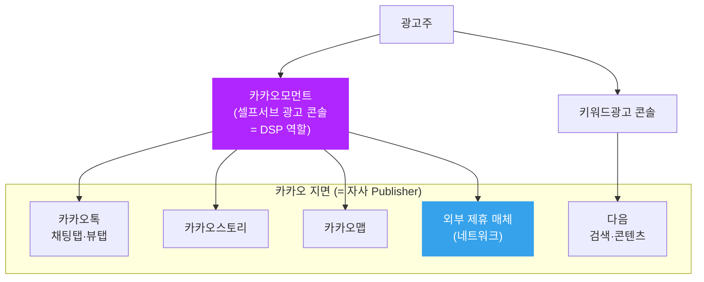
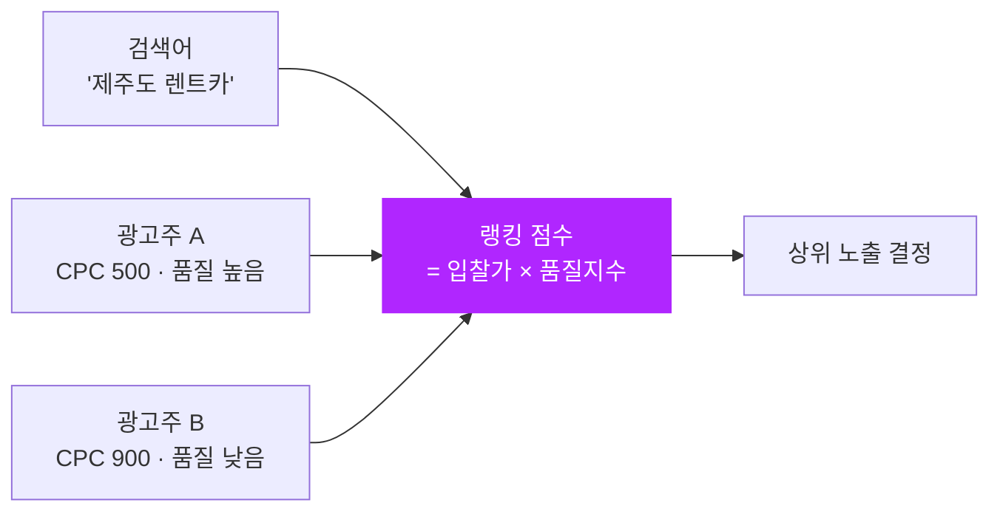

카카오톡을 열면 채팅 목록 맨 위에 작은 배너 하나가 보입니다. 그게 **카카오 비즈보드**입니다. 우리가 이 블로그에서 다룬 "디스플레이 인벤토리", "실시간 경매", "eCPM 랭킹" 같은 추상적인 개념들이, 실제로는 바로 그 배너 한 칸에서 작동하고 있습니다.

이 글은 **카카오의 실제 광고 상품**을 하나씩 짚으면서, 각 상품이 우리가 이미 공부한 어떤 개념의 응용인지 연결합니다. 구조론(왜 카카오·네이버는 광고의 모든 단계를 자사 안에 두는가)은 이미 [Walled Garden](post.html?id=walled-garden) 글에서 깊게 다뤘으니, 여기서는 **"무엇이 팔리고, 어떻게 줄 세워지는가"** — 상품과 지면의 층에 집중합니다.

> 들어가기 전에 — 이 글은 카카오가 **공개한 광고 상품**(비즈보드·모먼트·키워드광고 등)의 일반적인 작동 방식만 다룹니다. 카카오 내부의 모델·알고리즘 구현은 공개되어 있지 않으므로, "이런 종류의 문제에는 보통 어떤 기법이 쓰이는가"를 우리 개념 글과 연결하는 방식으로 설명합니다. 등장하는 숫자는 모두 이해를 돕기 위한 **가정된 예시**입니다.

처음이라면 [30분만에 이해하는 광고 시스템](post.html?id=adtech-30min-primer)을 먼저 보면 용어가 한결 편합니다.

---

## 1. 한 장으로 보는 카카오 광고 지면

카카오 광고를 헷갈리게 만드는 건 "상품 이름"과 "지면"과 "관리 도구"가 섞여 불리기 때문입니다. 셋을 분리하면 단순해집니다.

- **지면(어디에 뜨나)**: 카카오톡(채팅 탭·뷰 탭), 다음(검색·콘텐츠), 카카오스토리, 카카오맵, 그리고 외부 제휴 매체(네트워크).
- **상품(무엇을 사나)**: 비즈보드, 디스플레이/동영상 광고, 키워드광고, 톡채널 메시지 등.
- **관리 도구(어떻게 사나)**: 대부분 **카카오모먼트**라는 셀프서브 콘솔에서 캠페인을 만들고 입찰을 건다.

이 그림에서 이미 익숙한 모양이 보입니다. 광고주 → (입찰을 대신 거는) 콘솔 → (자사가 소유한) 지면. [Ad Serving Flow](post.html?id=ad-serving-flow)에서 본 "광고주 → DSP → 지면" 흐름의 카카오 버전입니다. 다만 그 사이의 거래소·SSP가 **하나의 회사 안에 들어와 있다**는 게 [Walled Garden](post.html?id=walled-garden)의 핵심이었죠.

---

## 2. 비즈보드 — 톡 채팅탭의 프리미엄 디스플레이

**비즈보드**는 카카오톡 채팅 목록 최상단에 노출되는 배너입니다. 한국에서 카카오톡의 도달 범위를 생각하면, 이건 굉장히 눈에 잘 띄는 **프리미엄 디스플레이 인벤토리**입니다. 배너를 누르면 톡채널, 톡스토어, 애드뷰(전체화면 랜딩), 비즈니스폼 등으로 연결됩니다.

엔지니어 관점에서 비즈보드는 우리가 [eCPM과 광고 랭킹](post.html?id=ecpm-ranking)에서 다룬 **디스플레이 슬롯 하나를 두고 벌어지는 경쟁**입니다. 한 칸뿐인 자리를 여러 광고주가 원하니, 누구를 보여줄지 정하는 기준이 필요합니다.

- **과금이 CPC·CPM으로 갈려도 비교 기준은 eCPM**: 누구는 클릭당(CPC), 누구는 노출당(CPM) 값을 부릅니다. 서로 다른 단위를 한 줄에 세우려면 "1,000회 노출당 기대수익(eCPM)"으로 환산해야 합니다. `eCPM = 입찰가 × 예상반응률 × 1000` 류의 환산이 그것입니다. → [eCPM과 광고 랭킹](post.html?id=ecpm-ranking)
- **"예상반응률"이 곧 pCTR**: 같은 입찰가라도 더 잘 눌릴 광고가 더 높은 자리를 받습니다. 이 "잘 눌릴 확률"을 예측하는 게 [Deep CTR 모델](post.html?id=deep-ctr-models)의 일이고, 다음 편에서 자세히 봅니다.

> 예시(가정): 광고주 A가 CPM 5,000원, 광고주 B가 CPC 200원에 예상 클릭률 3%라면 — B의 eCPM은 200원 × 3% × 1000 = 6,000원. 입찰 단가만 보면 A가 비싸 보여도, 환산하면 B가 더 가치 있는 노출입니다.

---

## 3. 카카오모먼트 — 광고주의 셀프서브 조종석 (= DSP 역할)

**카카오모먼트**는 광고주가 직접 캠페인을 만들고, 타겟을 정하고, 입찰을 거는 셀프서브 플랫폼입니다. [30분 입문](post.html?id=adtech-30min-primer)에서 "DSP는 광고주를 대신해 입찰을 결정하는 로봇"이라고 했는데, 카카오모먼트가 바로 그 **DSP 역할**을 합니다. 단, 외부 거래소에 입찰하는 게 아니라 **카카오 자사 지면 안에서의 경매**에 참가한다는 점이 Open RTB의 DSP와 다릅니다.

모먼트에서 광고주가 누르는 버튼들을, 우리가 배운 개념으로 번역하면 이렇습니다.

| 모먼트에서 고르는 것 | 실제로 정하는 것 | 관련 개념 글 |
|---|---|---|
| 캠페인 목표(전환·방문·도달·조회) | 무엇을 최적화할지 (KPI) | [Auto-Bidding & Budget Pacing](post.html?id=auto-bidding-pacing) |
| 게재 지면(톡·다음·스토리·네트워크) | 인벤토리 선택 | [Ad Network vs Ad Exchange](post.html?id=ad-network-vs-exchange) |
| 오디언스(데모·관심사·맞춤·유사) | 누구에게 보여줄지 | [오디언스 세그멘테이션](post.html?id=audience-segmentation) |
| 입찰 방식(자동·수동) / 과금(CPC·CPM·CPA·CPV) | 얼마를 어떻게 낼지 | [eCPM과 광고 랭킹](post.html?id=ecpm-ranking) |

특히 게재 지면에서 **"네트워크"**를 선택하면 카카오 자사 매체를 넘어 외부 제휴 매체에까지 광고가 나갑니다. 이 순간 구조는 순수 Walled Garden에서 **하이브리드**로 바뀝니다 — 자사 프리미엄 지면은 내부 경매로, 외부 네트워크는 더 열린 방식으로 굴리는 거죠. 이 하이브리드 전략은 [Walled Garden](post.html?id=walled-garden)의 6절과 [Ad Network vs Ad Exchange](post.html?id=ad-network-vs-exchange)에서 다룬 그대로입니다.

---

## 4. 키워드광고 — 다음 검색의 '의도' 기반 광고

다음(Daum) 검색창에 "제주도 렌트카"를 치면 결과 위에 광고가 붙습니다. 이게 **키워드광고**입니다. 디스플레이 광고와 결정적으로 다른 점은 **검색어 자체가 가장 강력한 신호**라는 것입니다. 배너는 "이 사람이 관심 있을까?"를 추정해야 하지만, 검색 광고는 사용자가 **이미 의도를 입력**했습니다.

이건 [Walled Garden](post.html?id=walled-garden) 글의 "검색 의도가 최강 피처"라는 대목과 정확히 같은 이야기입니다. 그래서 검색 광고의 랭킹은 보통 이렇게 굴러갑니다.

- 같은 키워드를 산 광고주끼리만 경쟁한다(경쟁 범위가 좁다).
- 순위는 단순히 입찰가 순이 아니라 **입찰가 × 품질(예상 클릭률 등)** 로 정해진다.
- 그래서 입찰가가 낮아도 더 관련성 높은 광고가 위로 갈 수 있다.

"품질지수에 따라 낮은 입찰가로도 이긴다"는 구조의 자세한 산수는 [eCPM과 광고 랭킹](post.html?id=ecpm-ranking)에 있습니다.

---

## 5. 톡채널 메시지 — 친구에게 직접 보내는 광고

비즈보드·모먼트·키워드광고가 "낯선 사람에게 보여주는" 광고라면, **톡채널 메시지**는 이미 채널을 추가한(친구를 맺은) 사용자에게 직접 메시지를 보내는 광고입니다. 도달 대상이 좁지만 관계가 있어 반응이 높을 수 있습니다.

여기서 흥미로운 기술 질문이 생깁니다. "누구에게, 언제, 어떤 메시지를 보내야 반응이 좋을까?" 친구가 10만 명이라도 아무에게나 다 보내면 차단·이탈을 부릅니다. 그래서 **보낼 대상을 고르는 것** 자체가 [오디언스 세그멘테이션](post.html?id=audience-segmentation)·[Lookalike Modeling](post.html?id=lookalike-modeling) 문제이고, "이 사람이 이 메시지에 반응할까"를 점치는 건 또다시 예측 모델의 일입니다. 이 부분은 2편에서 이어집니다.

---

## 6. 상품 → 개념 글 한눈에 매핑

지금까지를 한 표로 압축합니다. 이 표가 이 시리즈의 지도입니다.

| 카카오 상품 | 우리가 배운 '무엇' | 더 읽기 |
|---|---|---|
| 비즈보드 | 프리미엄 디스플레이 슬롯의 eCPM 경매 | [eCPM 랭킹](post.html?id=ecpm-ranking) · [Ad Serving Flow](post.html?id=ad-serving-flow) |
| 카카오모먼트 | 자사 지면에 입찰하는 DSP + 셀프서브 | [Walled Garden](post.html?id=walled-garden) · [30분 입문](post.html?id=adtech-30min-primer) |
| 모먼트 '네트워크' 지면 | 내부 경매 + 외부 매체의 하이브리드 | [Ad Network vs Exchange](post.html?id=ad-network-vs-exchange) |
| 키워드광고(다음) | 검색 의도 기반 랭킹(입찰가×품질) | [eCPM 랭킹](post.html?id=ecpm-ranking) · [Walled Garden](post.html?id=walled-garden) |
| 톡채널 메시지 | 타겟 선정 = 세그멘테이션·룩얼라이크 | [세그멘테이션](post.html?id=audience-segmentation) · [Lookalike](post.html?id=lookalike-modeling) |

---

## 마무리

1. 카카오 광고는 **지면 · 상품 · 관리도구**를 분리하면 단순해집니다. 대부분 **카카오모먼트**(= DSP 역할)에서 자사 지면 경매에 입찰하는 구조입니다.
2. 비즈보드·키워드광고는 결국 **"한 자리를 두고 입찰가 × 예상반응률(품질)로 줄 세우는"** 우리가 아는 랭킹 문제입니다.
3. 구조(왜 다 자사 안에 두나)는 [Walled Garden](post.html?id=walled-garden)에, 산수(eCPM·품질지수)는 [eCPM 랭킹](post.html?id=ecpm-ranking)에 이미 있습니다.

다음 편 **"카카오는 무엇으로 광고를 고르나"**에서는 이 줄 세우기의 심장인 **pCTR 예측**과, 카카오톡·다음·맵의 1st-party 데이터로 만드는 **맞춤타겟·유사타겟**을 우리 모델링 글들과 연결합니다.
