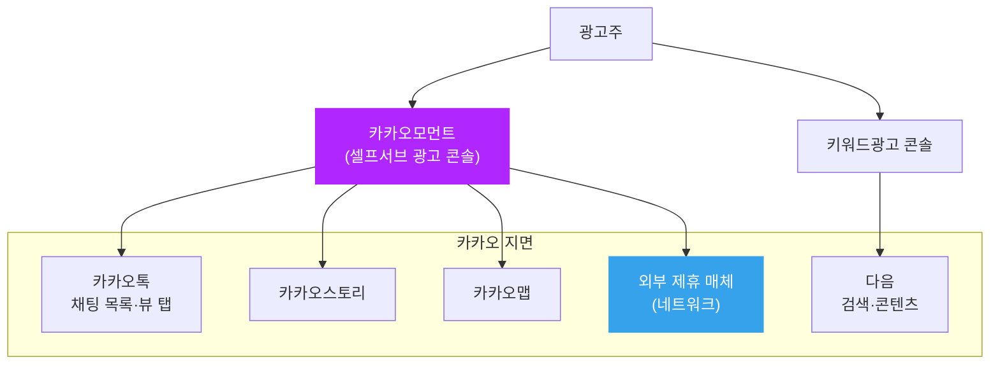
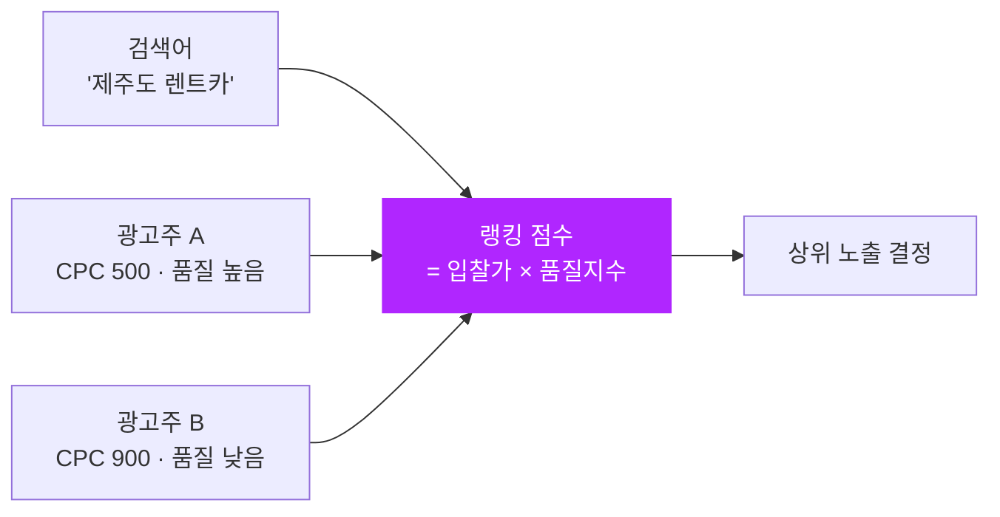

카카오톡을 켠다. 채팅 목록 맨 위에 배너 하나가 떠 있다. 어제는 여행 앱이었는데, 오늘은 카드 광고다. 왜 매번 다른 광고가, 하필 지금 뜰까?

답은 단순하다. 그 배너 자리 하나를 놓고, 보이지 않는 곳에서 여러 광고가 값을 부르고 있었다. 그리고 그 값을 매기고 줄 세우는 방법을, 우리는 이미 이 블로그에서 배웠다 — **eCPM 랭킹**이라는 이름으로.

이 글은 카카오의 실제 광고 상품을 하나씩 짚는다. 비즈보드, 카카오모먼트, 키워드광고, 톡채널 메시지. 그리고 각 상품이 우리가 배운 어떤 개념의 실물인지 연결한다. 구조(왜 자사 안에 다 두는가)는 이미 [Walled Garden](post.html?id=walled-garden)에서 다뤘다. 여기서는 그 안에서 **무엇이 팔리고, 어떻게 줄 세워지는가** — 상품과 지면의 층에 집중한다.

> 들어가기 전에 — 이 글은 카카오가 공개한 광고 상품의 일반적인 작동 방식만 다룬다. 내부 모델·알고리즘 구현은 공개돼 있지 않다. 그래서 "이런 문제엔 보통 어떤 기법이 쓰이는가"를 우리 개념 글과 잇는 방식으로 설명한다. 등장하는 숫자는 전부 이해를 돕기 위한 **가상의 예시**다. 실제 낙찰가·단가가 아니다.

처음이라면 [30분만에 이해하는 광고 시스템](post.html?id=adtech-30min-primer)을 먼저 보면 용어가 편하다.

> 한 줄 요약: 카카오 광고 상품은 새로운 개념이 아니다. 우리가 배운 **eCPM 랭킹**이 실제 지면 위에서 돌아가는 모습이다. 비즈보드 배너 한 칸도 결국 **입찰가 × pCTR**로 줄을 세우는 문제이고, 그 예측이 10%만 틀려도 낙찰자가 바뀐다.

---

## 1. 지면 · 상품 · 도구 — 세 겹으로 나누면 단순해진다

**카카오 광고가 헷갈리는 건 '자리'와 '상품'과 '도구'가 뒤섞여 불리기 때문이다. 셋을 나누면 단순해진다.**

먼저 **지면**, 광고가 뜨는 자리다. 카카오톡(채팅 목록, 뷰 탭), 다음(검색·콘텐츠), 카카오스토리, 카카오맵, 그리고 외부 제휴 매체(네트워크)까지 여러 곳이 있다.

다음은 **상품**, 즉 광고주가 실제로 사는 것이다. 비즈보드, 카카오모먼트로 집행하는 디스플레이·동영상 광고, 키워드광고, 톡채널 메시지. 이 네 가지가 이 글에서 다룰 전부다.

마지막은 **도구**, 상품을 사는 방법이다. 대부분은 **카카오모먼트**라는 셀프서브 콘솔에서 캠페인을 만들고 입찰을 건다. 키워드광고만 별도 콘솔을 쓴다.


```mermaid
graph TB
    ADV["광고주"] --> MOMENT["카카오모먼트<br/>(셀프서브 광고 콘솔)"]
    ADV --> KW["키워드광고 콘솔"]

    subgraph INV["카카오 지면"]
        TALK["카카오톡<br/>채팅 목록·뷰 탭"]
        DAUM["다음<br/>검색·콘텐츠"]
        STORY["카카오스토리"]
        MAP["카카오맵"]
        NET["외부 제휴 매체<br/>(네트워크)"]
    end

    MOMENT --> TALK
    MOMENT --> STORY
    MOMENT --> MAP
    MOMENT --> NET
    KW --> DAUM

    style MOMENT fill:#b026ff,stroke:#b026ff,color:#fff
    style NET fill:#36a2eb,stroke:#36a2eb,color:#fff
```

이 그림에 이미 익숙한 모양이 보인다. 광고주 → (입찰을 대신 거는) 콘솔 → (자사가 소유한) 지면. [Ad Serving Flow](post.html?id=ad-serving-flow)에서 본 흐름의 카카오 버전이다. 다만 그 사이의 거래소·SSP가 **하나의 회사 안**에 들어와 있다. 그게 [Walled Garden](post.html?id=walled-garden)의 핵심이었다.

---

## 2. 비즈보드 한 칸, 다섯 광고가 겨루면

**비즈보드 한 칸을 두고 벌어지는 경쟁은, 우리가 배운 eCPM 랭킹을 한 치도 벗어나지 않는다.**

**비즈보드**는 카카오톡 채팅 목록 맨 위에 뜨는 배너다. 한국에서 카카오톡의 도달력을 생각하면 이건 굉장히 눈에 잘 띄는 자리다. 배너를 누르면 톡채널, 톡스토어, 애드뷰(전체화면 랜딩), 비즈니스폼 등으로 연결된다.

이 한 칸을 여러 광고주가 원한다. 누구는 노출당(CPM), 누구는 클릭당(CPC) 값을 부른다. 단위가 다른 입찰을 한 줄에 세우려면 공통 잣대가 필요하다. 그게 **eCPM**이다. `eCPM = 입찰가 × 예상 반응률 × 1000` 이라는 환산이다. 여기서 "예상 반응률"이 곧 **pCTR**(예상 클릭률)이다. 자세한 계산은 [eCPM과 광고 랭킹](post.html?id=ecpm-ranking)에 있다. 여기서는 실물 사례로 확인만 한다.

아래 **표①**은 비즈보드 한 칸을 두고 겨루는 후보 5개다. **전부 가상의 숫자**다. 실제 낙찰가·입찰가가 아니다.

| 순위 | 광고주 | 과금방식 | 입찰가 | 예측 pCTR | eCPM 계산 | eCPM |
|---|---|---|---|---|---|---|
| 1위 | B(카드사) | CPC | 1,500원 | 1.6% | 1,500 × 0.016 × 1,000 | **24,000원** |
| 2위 | D(이커머스) | CPC | 900원 | 2.5% | 900 × 0.025 × 1,000 | **22,500원** |
| 3위 | C(모바일 게임) | CPC | 700원 | 3.2% | 700 × 0.032 × 1,000 | **22,400원** |
| 4위 | E(교육 앱) | CPC | 2,200원 | 0.9% | 2,200 × 0.009 × 1,000 | **19,800원** |
| 5위 | A(뷰티 브랜드) | CPM | 9,000원 | – | 그대로 사용 | **9,000원** |

숫자를 보면 직관을 배신하는 지점이 있다. A는 입찰가만 보면 9,000원으로 두 번째로 높다. 그런데 순위는 꼴찌다. CPM은 클릭 여부와 무관하게 노출 자체에 값을 매기므로 pCTR의 도움을 못 받는다. 반대로 C는 입찰가가 700원으로 가장 낮다. 그런데 pCTR이 3.2%로 제일 높아서 3위까지 올라온다. **eCPM은 "얼마를 부르나"가 아니라 "얼마나 벌어줄 것 같나"를 묻는 질문이다.** 이 표 한 장이 이 글의 핵심이다. 비즈보드 한 칸은 곧 eCPM 랭킹의 실물이다.

---

## 3. 파이썬으로 낙찰자를 뽑고, 예측이 틀렸을 때를 확인한다

**같은 계산을 코드로 짜면, pCTR 예측 오차 10%가 왜 낙찰자를 통째로 바꾸는지 눈으로 보인다.**

코드는 두 단계로 나뉜다. (a) 위 표 그대로 5개 후보의 eCPM을 계산해 낙찰자를 뽑는다. (b) 그런데 나중에 알고 보니, 1위였던 B(카드사)의 pCTR 예측이 실제보다 10% 높았다. 이 '진짜' 값으로 다시 계산하면 순위가 어떻게 바뀌는지 본다.

표준 라이브러리만 쓴다. 그대로 복사해 돌리면 아래 출력이 그대로 나온다.

```python
# 비즈보드 한 칸을 두고 겨루는 후보 5개의 eCPM을 계산해 낙찰자를 뽑는다.
# 그리고 1위였던 광고의 pCTR '예측'이 실제(참값)보다 10% 높았다면
# 낙찰자 자체가 바뀐다는 것까지 확인한다. 표준 라이브러리만 쓴다.

def ecpm(billing, bid, pctr=None):
    """billing이 CPM이면 입찰가 그대로, CPC면 pCTR × 입찰가 × 1000."""
    if billing == "CPM":
        return bid
    if billing == "CPC":
        return pctr * bid * 1000
    raise ValueError(f"알 수 없는 과금방식: {billing}")

# 가상의 예시 숫자다 — 실제 카카오 비즈보드 단가·낙찰 사례가 아니다.
candidates = [
    {"name": "A(뷰티)",      "billing": "CPM", "bid": 9000, "pctr": None},
    {"name": "B(카드사)",    "billing": "CPC", "bid": 1500, "pctr": 0.016},
    {"name": "C(모바일게임)", "billing": "CPC", "bid": 700,  "pctr": 0.032},
    {"name": "D(이커머스)",  "billing": "CPC", "bid": 900,  "pctr": 0.025},
    {"name": "E(교육앱)",    "billing": "CPC", "bid": 2200, "pctr": 0.009},
]

def rank(cands, pctr_key="pctr"):
    scored = [(c["name"], ecpm(c["billing"], c["bid"], c[pctr_key])) for c in cands]
    return sorted(scored, key=lambda x: x[1], reverse=True)

# (a) 예측 pCTR 기준 — 실시간 서빙이 실제로 쓰는 값
predicted = rank(candidates)
print("[예측 pCTR 기준 랭킹 - 실시간 서빙이 실제로 쓰는 값]")
for i, (name, score) in enumerate(predicted, 1):
    print(f"  {i}위 {name:10s} eCPM {score:8,.0f}원")
print(f"  -> 낙찰자: {predicted[0][0]}\n")

# (b) 사실 B(카드사)의 진짜 pCTR은 예측보다 10% 낮았다(모델이 과대예측).
#     예측 1.6% -> 실제 1.6% * 0.9 = 1.44%.
true_candidates = [dict(c) for c in candidates]
for c in true_candidates:
    if c["name"] == "B(카드사)":
        c["true_pctr"] = c["pctr"] * 0.9   # 예측보다 10% 낮은 실제값
    else:
        c["true_pctr"] = c["pctr"]

actual = rank(true_candidates, pctr_key="true_pctr")
print("[실제(참값) pCTR 기준 랭킹 - B의 예측이 10% 과대했다고 밝혀진 뒤]")
for i, (name, score) in enumerate(actual, 1):
    print(f"  {i}위 {name:10s} eCPM {score:8,.0f}원")
print(f"  -> '진짜' 승자였어야 할 광고: {actual[0][0]}\n")

# 낙찰자가 B에서 바뀌었는지, 바뀌었다면 플랫폼이 얼마를 손해봤는지 계산.
predicted_winner, predicted_top_score = predicted[0]
true_score_of_predicted_winner = next(
    score for name, score in actual if name == predicted_winner
)
true_winner, true_top_score = actual[0]

print("[정리]")
print(f"  예측 기준 낙찰자         : {predicted_winner} (예측 eCPM {predicted_top_score:,.0f}원)")
print(f"  같은 광고의 실제 eCPM    : {true_score_of_predicted_winner:,.0f}원")
print(f"  10% 오차가 드러난 뒤 1위 : {true_winner} (eCPM {true_top_score:,.0f}원)")
loss = true_top_score - true_score_of_predicted_winner
print(f"  플랫폼이 노출 1,000회당 놓친 몫 : {loss:,.0f}원 ({loss / true_top_score:.1%})")
assert predicted_winner != true_winner  # 이 예시는 낙찰자가 바뀌는 경우를 보여주기 위한 것

# 출력:
# [예측 pCTR 기준 랭킹 - 실시간 서빙이 실제로 쓰는 값]
#   1위 B(카드사)     eCPM   24,000원
#   2위 D(이커머스)    eCPM   22,500원
#   3위 C(모바일게임)   eCPM   22,400원
#   4위 E(교육앱)     eCPM   19,800원
#   5위 A(뷰티)      eCPM    9,000원
#   -> 낙찰자: B(카드사)
#
# [실제(참값) pCTR 기준 랭킹 - B의 예측이 10% 과대했다고 밝혀진 뒤]
#   1위 D(이커머스)    eCPM   22,500원
#   2위 C(모바일게임)   eCPM   22,400원
#   3위 B(카드사)     eCPM   21,600원
#   4위 E(교육앱)     eCPM   19,800원
#   5위 A(뷰티)      eCPM    9,000원
#   -> '진짜' 승자였어야 할 광고: D(이커머스)
#
# [정리]
#   예측 기준 낙찰자         : B(카드사) (예측 eCPM 24,000원)
#   같은 광고의 실제 eCPM    : 21,600원
#   10% 오차가 드러난 뒤 1위 : D(이커머스) (eCPM 22,500원)
#   플랫폼이 노출 1,000회당 놓친 몫 : 900원 (4.0%)
```

코드에서 눈여겨볼 곳은 두 군데다.

하나는 `ecpm` 함수다. CPM은 입찰가를 그대로 쓰고, CPC는 pCTR을 곱해야 노출당 기대값이 나온다. 과금방식이 섞여 있어도 함수 하나로 정규화된다.

다른 하나는 `true_pctr`이다. 실시간 서빙은 **예측**만 갖고 낙찰자를 정한다. 실제 값은 나중에야, 그것도 일부만 알게 된다. 코드는 이 시차를 "예측 기준 랭킹"과 "실제 기준 랭킹" 두 번의 계산으로 흉내 낸다.

결과를 보자. 예측 기준으로는 B가 24,000원으로 1위였다. 그런데 B의 진짜 pCTR은 예측보다 10% 낮은 1.44%였다. 이걸로 다시 계산하면 B의 진짜 eCPM은 21,600원이다. D(22,500원)보다 낮다. **낙찰자가 B에서 D로 바뀐다.** 카카오는 이 노출 1,000회당 900원(4.0%)을 손해 본 셈이다. 정확히 예측했다면 D가 낙찰돼 22,500원을 벌었을 것이다.

이 손해는 담장 안이라서 생기는 게 아니다. **담장 안이든 밖이든, pCTR 예측이 틀리면 돈이 샌다.** 다만 담장 안에서는 이 손해가 오직 예측 정확도의 문제로만 남는다. 이건 [eCPM과 광고 랭킹](post.html?id=ecpm-ranking)에서 다룬 예측 오류 증폭과 같다. 카카오라는 구체적 지면 위에서 일어났을 뿐이다.

---

## 4. 카카오모먼트 — 자사 지면 안에서만 도는 DSP

**카카오모먼트는 광고주가 스스로 입찰을 거는 조종석이다. 다만 그 입찰이 향하는 경매장은 카카오 바깥에 없다.**

[30분 입문](post.html?id=adtech-30min-primer)에서 DSP를 "광고주 대신 입찰을 결정하는 로봇"이라 했다. 카카오모먼트가 그 역할을 한다. 광고주가 캠페인을 만들고, 타겟을 정하고, 입찰가나 목표를 입력하면 나머지는 시스템이 대신한다.

다만 결정적인 차이가 있다. Open RTB의 DSP는 외부 거래소 여러 곳에 동시에 입찰한다. 카카오모먼트는 **카카오 자사 지면 안에서의 경매**에만 참가한다. 나갈 문이 하나뿐이라는 뜻이다.

모먼트에서 광고주가 누르는 버튼을, 우리가 배운 개념으로 옮기면 이렇다.

| 모먼트에서 고르는 것 | 실제로 정하는 것 | 관련 개념 글 |
|---|---|---|
| 캠페인 목표(전환·방문·도달) | 무엇을 최적화할지 | [Auto-Bidding](post.html?id=auto-bidding-pacing) |
| 게재 지면(톡·다음·스토리·네트워크) | 인벤토리 선택 | [Ad Network vs Exchange](post.html?id=ad-network-vs-exchange) |
| 오디언스(데모·맞춤·유사) | 누구에게 보여줄지 | [세그멘테이션](post.html?id=audience-segmentation) |
| 입찰·과금(CPC·CPM·CPA) | 얼마를 어떻게 낼지 | [eCPM 랭킹](post.html?id=ecpm-ranking) |

게재 지면에서 "네트워크"를 고르면 얘기가 달라진다. 카카오 자사 매체를 넘어 외부 제휴 매체까지 광고가 나간다. 이 순간 구조는 순수 담장 안에서 **하이브리드**로 바뀐다. 자사 프리미엄 지면은 내부 경매로 판다. 외부 네트워크는 좀 더 열린 방식으로 굴린다. 이 하이브리드 전략은 [Walled Garden](post.html?id=walled-garden)에 이미 정리돼 있다.

이 조종석에서 "무엇을, 누구에게"를 어떻게 고르는지는 2편에서 다룬다. 여기서는 이 콘솔이 **DSP 역할을 하되, 문은 하나뿐이다**라는 사실만 기억하면 된다.

---

## 5. 키워드광고 — 이미 반쯤 이기고 들어가는 검색 의도

**다음 검색창에 입력한 단어 자체가 가장 강력한 신호다. 그래서 검색광고는 랭킹 방식부터 다르다.**

다음(Daum) 검색창에 "제주도 렌트카"를 치면 결과 위에 광고가 붙는다. 이게 **키워드광고**다. 배너 광고와 결정적으로 다른 점이 하나 있다. 배너는 "이 사람이 관심 있을까"를 추정해야 한다. 검색광고는 사용자가 **이미 의도를 입력**했다.

이건 [Walled Garden](post.html?id=walled-garden)의 "검색 의도가 최강 피처"와 같다. 그래서 검색광고의 랭킹은 보통 이렇게 굴러간다. 같은 키워드를 산 광고주끼리만 경쟁한다. 경쟁 범위 자체가 좁다. 순위는 입찰가 순이 아니다. **입찰가 × 품질(예상 클릭률 등)**로 정해진다. 그래서 입찰가가 낮아도 관련성 높은 광고가 위로 갈 수 있다.


```mermaid
graph LR
    Q["검색어<br/>'제주도 렌트카'"] --> RANK["랭킹 점수<br/>= 입찰가 × 품질지수"]
    A1["광고주 A<br/>CPC 500 · 품질 높음"] --> RANK
    A2["광고주 B<br/>CPC 900 · 품질 낮음"] --> RANK
    RANK --> OUT["상위 노출 결정"]
    style RANK fill:#b026ff,stroke:#b026ff,color:#fff
```

이 그림도 결국 §2에서 본 것과 같은 계산이다. 입찰가만으로 순위가 정해지지 않는다. 품질(pCTR류 지표)이 곱해져야 순위가 나온다. 그 산수는 이미 [eCPM과 광고 랭킹](post.html?id=ecpm-ranking)에 자세히 있다.

---

## 6. 톡채널 메시지 — 노출이 아니라 '발송'을 파는 상품

**비즈보드·모먼트·키워드광고가 '보여주는' 상품이라면, 톡채널 메시지는 '보낸다'는 점에서 결이 다르다.**

비즈보드·카카오모먼트·키워드광고는 낯선 사람에게도 노출된다. **톡채널 메시지**는 다르다. 이미 채널을 추가한(친구를 맺은) 사용자에게만 간다. 도달 범위는 좁지만, 관계가 있어 반응이 다를 수 있다.

여기서 흥미로운 질문이 생긴다. "누구에게, 언제, 어떤 메시지를 보내야 반응이 좋을까?" 친구가 10만 명이라도 아무에게나 다 보내면 차단·이탈을 부른다. 그래서 **보낼 대상을 고르는 것** 자체가 하나의 문제가 된다. 이건 [세그멘테이션](post.html?id=audience-segmentation) 문제다. 좁혀 말하면 [Lookalike](post.html?id=lookalike-modeling) 문제이기도 하다. "이 사람이 이 메시지에 반응할까"를 점치는 건 또 예측 모델의 일이다. 이 부분은 2편에서 자세히 잇는다.

과금은 보낸 메시지 단위로 매겨진다. 정확한 단가는 시기·상품 구성에 따라 계속 바뀐다. 그래서 여기서는 숫자를 적지 않는다. 대신 구조만 본다. 톡채널 메시지는 **노출 경매가 아니라 발송 대상 선정의 문제**다.

---

## 7. 상품 지도 한눈에

**네 상품을 한 표에 놓으면, 이 시리즈가 앞으로 갈 길이 보인다.**

지금까지 본 비즈보드·카카오모먼트·키워드광고·톡채널 메시지를 한 표로 모은다. "무엇을 파는가", "과금 기준", "우리가 배운 개념", "어느 글로 이어지는가" 네 열이다.

| 상품 | 무엇을 파는가 | 과금 기준 | 우리가 배운 개념 | 더 읽기 |
|---|---|---|---|---|
| 비즈보드 | 채팅 목록 상단 배너 노출(사실상 슬롯 1개) | 노출·클릭 단위 실시간 입찰 + 기간 단위 예약 | eCPM 랭킹 — 한 슬롯을 둔 경매 | [eCPM 랭킹](post.html?id=ecpm-ranking) |
| 카카오모먼트 디스플레이 | 톡·다음·스토리·맵·네트워크의 배너·동영상 노출 | 캠페인 목표별 CPC·CPM·CPA | 셀프서브 DSP + 오디언스 타겟팅 | [Walled Garden](post.html?id=walled-garden) |
| 키워드광고 | 다음 검색결과 상단 텍스트 광고 클릭 | CPC(입찰가 × 품질지수) | 검색 의도 기반 랭킹 | [eCPM 랭킹](post.html?id=ecpm-ranking) |
| 톡채널 메시지 | 채널을 추가한 대상에게 메시지 발송 1건 | 발송 건당 비용 | 오디언스 세그멘테이션·유사타겟 | [세그멘테이션](post.html?id=audience-segmentation) |

과금 기준 열의 정확한 단가는 적지 않았다. 시기와 상품 구성에 따라 계속 바뀌기 때문이다. 대신 구조만 봤다. 표를 위에서 아래로 읽으면 패턴이 보인다. 노출(비즈보드) → 노출·행동(모먼트) → 클릭(키워드광고) → 관계(톡채널) 순서다. 상품마다 "무엇을 대가로 돈을 받는가"가 조금씩 옮겨간다.

이 표가 이 시리즈 전체의 지도다. 다음 편은 "무엇을(pCTR)", "누구에게(타겟팅)"를 자세히 판다. 마지막 편은 "얼마를(자동입찰)", "정말 효과였나(측정)"를 판다.

---

## 8. 이 자리가 열린 RTB였다면 [무대: 열린 RTB]

**같은 배너 한 칸이 열린 RTB의 지면이었다면, 방금 본 표①은 애초에 존재할 수 없다.**

표①을 다시 보자. 우리는 5개 후보의 입찰가와 pCTR을 전부 봤다. 순위도, 낙찰가도, 패찰한 4개의 정확한 값까지 다 봤다. 이게 가능했던 이유는 하나뿐이다. **우리가 카카오의 자리에 서 있었기 때문**이다.

열린 RTB에서는 이 표를 아무도 통째로 못 본다. 광고주 대신 뛰는 DSP가 여러 회사다. 그 DSP들을 모으는 SSP·거래소도 또 다른 회사다. 지면 주인인 퍼블리셔까지 셋 다 남남이다. 광고주가 낸 돈은 이 여러 단계를 거치며 수수료로 조금씩 떼인다. 퍼블리셔에게 그대로 가지 않는다.

더 결정적인 차이가 있다. 이 세계에서 어느 한 참가자가 보는 건 "내가 이겼다" 또는 "졌다"뿐이다. 진 쪽은 얼마에 졌는지조차 모른다. 이건 [Bid Shading](post.html?id=bid-shading-censored)의 censored data 문제다. B가 24,000원에 낙찰됐다는 결과는 볼 수 있다. 하지만 D가 22,500원을 불렀다는 사실은 아무도 못 본다.

그래서 이 글의 표①은 사실 특권적인 관찰이다. 카카오라는 한 회사 안에 서 있었기에 가능했다. 다음 절에서 그 특권이 정확히 무엇을 가능하게 하는지 본다.

---

## 9. 담장 안이라서 보이는 것 [무대: 닫힌 생태계]

**카카오는 낙찰가뿐 아니라 패찰가까지 다 본다. 그 정보로 지면을 예약과 경매, 두 갈래로 나눠 파는 것도 스스로 정한다.**

담장 안에서는 노출·클릭·입찰이 전부 한 회사의 로그다. 조인이 따로 필요 없다. [Walled Garden](post.html?id=walled-garden)에서 다룬 정보 통합의 이점이 여기서도 그대로 작동한다. 표①의 5개 입찰을 전부 관측할 수 있었던 것도 같은 이유다.

이 이점은 두 갈래로 쓰인다. 첫째, eCPM 랭킹 자체를 실시간으로 튜닝할 수 있다. 예측이 자꾸 틀리는 광고주가 있으면 즉시 잡아낼 수 있다. 둘째, 지면을 어떻게 나눠 팔지도 스스로 정할 수 있다. 일부는 미리 정해진 값으로 예약 판매하고, 나머지만 표①처럼 실시간 경매에 부친다. 이 두 물량이 어떻게 공존하는지는 아래 심화에서 다룬다.

물론 한계도 있다. 담장 안의 관측은 **담장 안까지만** 유효하다. 카카오가 보는 건 카카오 지면의 입찰뿐이다. 이 사용자가 다른 곳에서 무엇을 봤는지는 알 수 없다. 그건 이 담장의 문제가 아니라 모든 담장의 공통된 한계다.

:::deep 더 깊이 — 예약(CPT) 물량과 경매 물량은 어떻게 공존하는가
카카오 비즈보드 같은 인기 지면은 실제로 두 갈래로 팔린다. 하나는 **보장형**이다. 정해진 시간대에 그 자리를 통째로 독점하는 방식이다. 흔히 시간 단위로 값을 매긴다는 뜻에서 **CPT**(Cost Per Time)라 부른다. 다른 하나는 **성과형**이다. 노출이 날 때마다 실시간으로 경쟁하는, 표①에서 본 방식이다.

왜 두 갈래가 같이 있을까. 브랜드 광고주는 "이 시간엔 무조건 내 광고만" 뜨길 원한다. 도달과 주목도가 목적이라, 경쟁자와 자리를 나눠 갖는 걸 원치 않는다. 반면 퍼포먼스 광고주는 "이 조건에 맞는 사람에게만, 필요한 만큼만" 노출되길 원한다. 효율이 목적이다. 두 니즈는 서로 다르다. 어느 한 방식만으로는 둘 다 만족시킬 수 없다.

공존하는 방식은 순서에 있다. 예약 물량을 먼저 확정해서 빼 둔다. 그리고 남은 재고만 표①과 같은 경매로 돌린다.

예를 들어 보자(가상의 숫자다). 비즈보드 하루 노출량 중 40%를 예약으로 이미 채웠다고 하자. 그러면 나머지 60%만 실시간 경매의 몫이다. 이 60%의 기대 eCPM이 표①처럼 22,000원대라고 하자. 예약가가 그보다 낮으면, 플랫폼은 그 물량을 경매로 더 돌리고 싶어진다. 반대로 예약가가 더 높다면, 예약을 더 받는 쪽이 이득이다.

바로 이 경계에서 판단이 생긴다. **예약을 얼마나 잡을 것인가.** 예약을 많이 잡으면 매출이 예측 가능해지고 브랜드 광고주를 오래 붙잡는다. 대신 경매에 남는 재고가 줄어, 수요가 몰리는 시즌엔 더 높은 eCPM을 놓칠 수 있다. 반대로 예약을 적게 잡으면 경매의 기대 수익은 커진다. 하지만 "이 시간 독점"을 원하는 브랜드 수요 자체를 잃을 수 있다.

결국 이 결정도 예측 문제로 수렴한다. 예약 비율을 정하려면 "이 물량을 경매에 넘기면 대략 얼마가 나올까"를 미리 가늠해야 한다. 이것도 수요 예측이다. [헤더비딩](post.html?id=header-bidding)은 밖의 여러 SSP를 동시에 겨루게 해 이 판단을 시장에 맡긴다. 담장 안은 예약과 경매를 저울질하는 판단을 회사가 직접 떠안는다. 겨루는 대상이 다를 뿐, "같은 자리를 여럿에게 겨루게 해 값을 찾는다"는 원리는 같다.
:::

---

## 10. 한눈 정리

| 개념 | 뜻 | 이 글에서 본 숫자 | 핵심 |
|---|---|---|---|
| 비즈보드 | 채팅 목록 상단 배너 슬롯 | 5개 후보 중 eCPM 24,000원이 1위 | eCPM 랭킹의 실물 |
| eCPM 랭킹 | 입찰가 × pCTR로 줄 세우기 | B 24,000 > D 22,500 > C 22,400 | 입찰가만으론 순위 안 정해짐 |
| 예측 오차의 대가 | pCTR 예측이 실제와 다를 때 | 10% 과대예측 → 낙찰자 B에서 D로 | 담장 안이라도 예측이 곧 돈 |
| 카카오모먼트 | 자사 지면 전용 셀프서브 DSP | 톡·다음·스토리·맵·네트워크 | 문이 하나뿐인 DSP |
| 키워드광고 | 검색 의도 기반 랭킹 | 입찰가 × 품질지수 | 낮은 입찰가도 품질로 역전 |
| 예약(CPT) vs 경매 | 같은 지면, 두 판매 방식 | 예약 40% + 경매 60%(가상) | 예약 비율도 결국 수요 예측 문제 |
| 열린 RTB 대조 | 표①이 왜 담장 안에서만 가능한가 | 패찰가 4개까지 전부 관측 | 밖에선 censored data |

---

## 11. 헷갈리기 쉬운 점

- **카카오모먼트는 DSP인가?** 반은 맞고 반은 틀리다. 광고주 대신 입찰을 걸어준다는 점은 DSP와 같다. 하지만 외부 거래소로 나가지 않는다. 카카오 자사 지면 안에서만 경매한다. 열린 RTB의 DSP와는 이 점이 다르다.
- **eCPM 랭킹이 '공정하다'는 뜻은 아니다.** 돈과 품질을 섞은 규칙일 뿐이다. 그 규칙이 어떤 광고를 구조적으로 유리하게 만들 수도 있다.
- **비즈보드가 전부 실시간 경매는 아니다.** 보장형(CPT)과 성과형이 같은 지면을 나눠 쓴다. 둘의 비율은 플랫폼의 판단이다.
- **담장 안이라고 경쟁이 없는 건 아니다.** 예약 물량과 경매 물량이 같은 자리를 두고 저울질된다. 겨루는 대상이 밖이 아니라 안에 있을 뿐이다.
- **키워드광고는 돈 많이 낸 사람이 무조건 1등이 아니다.** 품질지수가 곱해진다. 입찰가가 낮아도 관련성이 높으면 위로 갈 수 있다.
- **pCTR 예측이 조금만 틀려도 낙찰자가 바뀐다.** 담장 안이라 정보가 많아도, 예측 자체가 틀리면 소용없다. 표①에서 확인한 그대로다.

---

## 더 깊이 보기

- 예측·타겟팅으로 이어지는 다음 이야기 → [2편: 카카오는 무엇으로 광고를 고르나](post.html?id=kakao-ads-prediction-targeting)
- 입찰·측정으로 마무리하는 이야기 → [3편: 카카오에서 캠페인이 굴러가는 법](post.html?id=kakao-ads-bidding-measurement)
- eCPM 계산과 세 시장 비교 → [eCPM과 광고 랭킹](post.html?id=ecpm-ranking)
- pCTR이 왜 돈인지 더 깊이 → [pCTR: 이 사람이 누를까](post.html?id=pctr-prediction)
- 왜 카카오·네이버는 모든 단계를 자사 안에 두는가 → [Walled Garden](post.html?id=walled-garden)
- 광고 ML 전체 지도에서 이 글의 위치 → [ML 엔지니어 트랙](ml-track.html)
