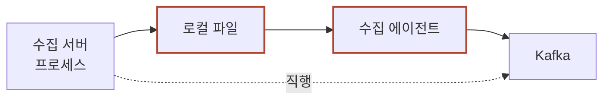

지훈 씨가 앞 글에서 여섯 자리를 배우고 나서 숫자를 하나 세어 봤습니다. 수집 서버 파일에 어제 쌓인 줄이 **5,928만 줄**입니다. 그런데 대시보드가 세는 이벤트는 **2억 3,028만 건**입니다.

같은 하루인데 줄 수와 건수가 네 배 가까이 다릅니다. 어느 쪽이 틀린 것도 아니고, 중간에 무엇이 빠지거나 늘어난 것도 아닙니다.

**한 줄이 어느 자리에서 네 건이 될까요?**

앞 글은 클릭 한 건이 지나는 여섯 자리를 **방향**으로 봤습니다 — 누가 밀고 누가 가지러 가는지입니다. 이 글은 같은 클릭 한 건을 **모양**으로 봅니다. 자리마다 열어서 무엇이 붙고 무엇이 사라지는지 봅니다. 위 질문의 답도 그중 한 자리에 있습니다.

> **한 줄 요약:** 같은 클릭 한 건이 자리마다 다른 모양으로 있습니다. 앱 안에서는 객체 110바이트, 서버 파일에서는 타입 없는 텍스트 183바이트, 변환기를 지나면 필드 15개짜리 JSON 309바이트입니다. 어디에 어떤 모양으로 머무느냐가 그 자리에서 무엇을 잃을 수 있는지를 정합니다.

> **골라 읽는 법** — 절이 여덟 개입니다.
>
> - 앱 안에서 무슨 일이 생기나 → 1·2절
> - 수집 서버 안의 데이터가 왜 타입이 없나 → 3절
> - 파일을 거치나 바로 보내나 → 4절
> - 한 줄이 네 건이 되는 자리 → 5절
> - 변환이 무엇을 바꾸나 → 6절
> - 여섯 자리를 한 표로 → 7절
> - 자주 밟는 것 → 8절

따라가는 것은 앞 글과 **완전히 같은 클릭 한 건**입니다. 2026년 8월 16일 16시 48분 21초, A앱 메인 상단에 뜬 광고 `9931` 을 누군가 눌렀습니다. 그 광고가 화면에 뜬 것은 40분 전인 16시 08분입니다. 앱을 켜 둔 채 두었다가 돌아와 누른 것이고, 이 40분이 6절에서 값을 냅니다.

숫자는 설명을 위해 지어낸 값입니다. 다만 바이트는 지어내지 않고 그 지어낸 문자열을 실제로 세어 적었습니다.

---

## 1. 앱 안에서 줄이 만들어집니다

**이벤트를 만드는 것은 수집 서버가 아니라 앱 안의 SDK 입니다. 그리고 클릭만 즉시 보냅니다.**

앱에 붙은 광고 SDK 가 탭을 받아 객체 하나를 만듭니다. 필드는 일곱입니다.

```text
ClickEvent(event="click", ad_id=9931, slot="main_top", req_id="r-8f21",
           ts=1786002501234, tz=540, sdk="3.2.1")
```

`ts` 는 밀리초 단위로 16:48:21.234 입니다. `tz=540` 은 이 기기의 시간대가 UTC+9 라는 뜻이고, `req_id` 는 이 광고를 내려 준 요청에 붙은 번호입니다. **`req_id` 가 이 글에서 가장 오래 따라다니는 값입니다** — 노출 줄과 클릭 줄을 나중에 이어 붙이는 열쇠가 이것입니다.

**SDK 는 이벤트를 두 갈래로 나눕니다.** 노출은 큐에 모았다가 묶어 보내고, 클릭은 만들자마자 그대로 보냅니다. 이유는 탭 다음에 벌어지는 일입니다. 탭하면 랜딩 페이지가 열리고 앱은 백그라운드로 내려갑니다. 백그라운드에서 앱이 얼마나 더 도는지는 OS 가 정하니, 큐에 넣어 두면 그 안에서 못 보내고 끝날 수 있습니다.

**노출은 한 건이 빠져도 다음 건이 곧 옵니다. 클릭은 한 건이 정산과 학습 라벨에 그대로 들어갑니다.** 같은 SDK 의 같은 큐인데 한 건을 잃었을 때 잃는 것이 이벤트마다 다르니, 보내는 방식도 갈립니다. 노출은 큐에 10건이 차거나 마지막 전송에서 5초가 지나면 보냅니다.

전송이 실패하면 SDK 는 이벤트를 디스크 큐에 적습니다. 지하철에서 네트워크가 끊긴 경우가 그렇습니다. 메모리 큐는 앱이 죽으면 같이 사라지지만 디스크 큐는 남아서, 다음 실행 때 남은 것부터 보냅니다. **사용자가 사흘 뒤에 앱을 열면 그 이벤트도 사흘 늦게 도착합니다.** 며칠 늦게 도착하는 로그의 첫 원인이 여기입니다.

그래서 시각을 기기에서 박습니다. 도착한 시각으로 날짜를 매기면 이 클릭이 사흘 뒤 날짜에 붙어, 실제로 눌린 날의 집계가 비고 사흘 뒤 날짜가 부풉니다. 대신 기기 시계가 틀리면 `ts` 도 같이 틀리니, 서버는 자기 시계로 잰 시각을 따로 적습니다. 그 이야기가 3절입니다.

## 2. 보내기 — HTTP 요청 한 번

**전송은 한 번의 HTTP 요청입니다. 응답을 못 받으면 다시 보내고, 그래서 중복이 생깁니다.**

SDK 가 만든 객체는 이 요청 하나로 서버에 건너갑니다.

```text
POST /v1/events HTTP/1.1
Host: log.adsvc.example
Content-Type: application/json
User-Agent: AdSDK/3.2.1 (iPhone; iOS 19.2)

{"event":"click","ad_id":9931,"slot":"main_top","req_id":"r-8f21","ts":1786002501234}
```

**본문은 85바이트이고, 1절의 객체 110바이트보다 25바이트 작습니다.** `tz` 와 `sdk` 가 본문에서 빠졌기 때문입니다. 두 값은 한 세션 동안 안 바뀌니 이벤트마다 되풀이해 실을 이유가 없어 요청 헤더로 올렸습니다. `sdk` 는 위 `User-Agent` 의 `AdSDK/3.2.1` 이 그대로 그 값입니다.

응답은 `HTTP/1.1 204 No Content` 한 줄이고 본문이 없습니다. `{"ok":true}` 를 돌려줄 수도 있는데, 그 본문은 11바이트입니다. **11바이트가 얼마가 되는지는 요청 수를 세면 나옵니다.** 하루 요청이 5,928만 번이니 응답 본문만 652 MB 이고, 그 데이터 요금은 사용자가 냅니다. 보내는 쪽은 받았다는 사실만 알면 되니 안 돌려주는 쪽을 고릅니다.

**재전송이 있는 곳에는 중복이 있습니다.** SDK 는 2초 안에 204 를 못 받으면 같은 요청을 다시 보냅니다. 서버가 이미 받아 놓고 응답만 늦은 경우에도 다시 보내는데, 보내는 쪽에서 둘을 구별할 방법이 없기 때문입니다. 그래서 클릭 한 번이 서버에 두 줄로 들어옵니다. [API 연동 실무](post.html?id=api-kinds-and-contracts) 편 5절에서 본 그 문제가 여기서도 그대로입니다.

거를 값은 1절에서 이미 만들어 뒀습니다. **광고 요청 하나에 클릭은 한 번뿐이라, `req_id` 와 이벤트 종류 두 값이면 같은 건인지 알아볼 수 있습니다.** 다시 보내도 그 두 값은 같으니 받는 쪽이 두 번째를 버립니다. 받는 쪽이 도착할 때 번호를 새로 붙이면 재전송마다 새 번호가 생겨 이 성질이 사라집니다.

이 요청의 왕복은 168 밀리초입니다. DNS 조회, TLS 연결, 전송, 서버 처리가 그 안에 다 들어 있습니다.

## 3. 수집 서버 안 — 타입이 없는 텍스트 한 줄

**수집 서버 안의 데이터는 텍스트 한 줄이고 타입이 없습니다. `9931` 은 숫자가 아니라 글자 넷입니다.**

수집 서버는 nginx 입니다. 요청을 받으면 이 형식대로 한 줄을 적게 해 뒀습니다.

```text
log_format collect '$remote_addr $time_iso8601 $request_method $uri $status '
                   '$request_time "$http_user_agent" $request_body';
```

2절의 요청이 들어오면 파일 끝에 이 줄이 붙습니다.

```text
121.130.8.24 2026-08-16T16:48:21+09:00 POST /v1/events 204 0.002 "AdSDK/3.2.1 (iPhone; iOS 19.2)" {"event":"click","ad_id":9931,"slot":"main_top","req_id":"r-8f21","ts":1786002501234}
```

183바이트입니다. 뒤쪽 중괄호 85바이트는 2절의 요청 본문 그대로입니다. 앞의 98바이트가 서버가 붙인 것인데, 보낸 IP·받은 시각·메서드·경로·상태 코드·처리 시간·앱 이름표 일곱입니다. `$time_iso8601` 이 서버 시계로 잰 시각인데 값이 초까지만 있습니다. 밀리초가 필요하면 `$msec` 를 형식에 더해야 합니다.

**이 줄에는 타입이 없습니다.** `9931` 도 `204` 도 `0.002` 도 전부 글자입니다. 파일 안에서 보면 `9`, `9`, `3`, `1` 네 글자가 이어져 있을 뿐입니다. `ad_id` 를 숫자로 쓰려면 누군가 정수로 바꿔야 하고, 그 자리가 6절입니다.

그래서 이 자리에서는 `"ad_id":9931` 과 `"ad_id":"9931"` 이 그냥 서로 다른 두 줄입니다. **앱이 타입을 잘못 실어 보내도 여기서는 아무 말도 안 나옵니다.** 걸리는 곳은 6절입니다.

`tz` 는 이 줄에 없습니다. 2절에서 헤더로 올린 두 값 중 `sdk` 는 앱 이름표 안의 `AdSDK/3.2.1` 로 되돌아왔지만 `tz` 는 안 돌아옵니다. 이 서비스가 한국 한 곳만 보고 있어 값이 전부 540 이기 때문입니다. **대신 이 결정은 되돌리기 어렵습니다.** 다른 시간대가 들어오는 날부터 찍히고 그 앞은 영영 비어 있습니다.

**유실 지점은 버퍼입니다.** 설정에 `buffer=32k` 를 주면 nginx 는 32KB 를 모았다가 한 번에 씁니다. 디스크 호출이 줄어 초당 수백 줄을 훨씬 싸게 감당합니다. 대신 그 32KB 는 워커 프로세스의 메모리 안에 있어서, 워커가 죽으면 같이 사라집니다. 없어질 수 있는 최대치는 **179줄**입니다.

이것은 nginx 의 동작입니다. 애플리케이션이 직접 파일에 쓰면 버퍼 크기와 내보내는 시점을 그 코드가 정합니다. **"로그는 버퍼에 모였다 나간다"를 서버 일반의 성질로 옮기면 틀립니다.** 확인할 것은 내가 쓰는 그 제품의 설정 한 줄입니다.

이 줄은 이제 파일 끝에 붙어 잠시 머뭅니다. 왜 파일을 한 번 거치는지가 4절입니다.

## 4. 파일을 거치나 바로 보내나

**파일을 한 번 거치면 Kafka 가 멈춰도 237시간을 버팁니다. 직행은 10.9분입니다. 그 값으로 640 밀리초를 삽니다.**

3절의 줄은 파일 끝에 붙었습니다. 굳이 그럴 이유가 없어 보입니다. 수집 서버 프로세스 안에서 Kafka 로 보내는 코드를 열고 바로 보내면 자리 두 개가 통째로 빠집니다.



테두리가 굵은 두 칸이 직행에서 빠지는 자리입니다. 점선이 직행이고, 실선을 따라가는 것이 이 글의 경로입니다.

두 설계를 한 표에 놓으면 이렇습니다.

| | 파일 경유 | 프로세스 안에서 직행 |
|---|---|---|
| 요청 처리를 끝낸 뒤 Kafka 까지 | **942 ms** | **256 ms** |
| Kafka 가 멈추면 버티는 시간 | 디스크 100GB → **237시간** | 메모리 512MB → **10.9분** |
| 수집 서버가 죽으면 | 파일은 남습니다 | 버퍼가 사라집니다 |
| 인스턴스가 사라지면 | 파일도 같이 사라집니다 | 같습니다 |
| 디스크가 차면 | 쓰기가 실패해 로그가 끊깁니다 | 영향 없습니다 |
| 언어 | 무관합니다 | Kafka 클라이언트가 있는 언어여야 합니다 |

차이 686 밀리초는 파일에서 기다리는 640 과 에이전트에서 쓰는 46 두 자리가 통째로 빠진 값입니다. 나머지 구간은 두 설계가 같습니다.

**버티는 시간이 이렇게 갈리는 것은 쌓이는 양이 다르기 때문입니다.** 파일에는 요청 하나가 한 줄로 쌓입니다. 하루 5,928만 줄에 한 줄 183바이트이니 초당 123 KB 이고, 디스크 100GB 면 237시간입니다.

직행은 다릅니다. 텍스트가 아니라 타입이 붙은 JSON 을 메모리에 드는데, 이건 이벤트마다 하나씩입니다. 초당 2,665건에 건당 309바이트이니 초당 804 KB 이고, 512MB 가 10.9분에 찹니다.

**우리 답은 파일 경유입니다.** 근거는 표에서 딱 한 줄, 버티는 시간입니다. Kafka 브로커가 밤에 멈추고 아침에 사람이 알아채면 10.9분은 이미 한참 지나 있고 237시간은 안 지나 있습니다.

메모리를 키우면 되지 않느냐고 할 수 있습니다. 512MB 를 8GB 로 올리면 10.9분이 2.9시간이 됩니다. 그래도 표의 세 번째 줄은 안 바뀝니다. **프로세스가 죽으면 8GB 가 통째로 사라지고, 수집 서버는 배포할 때마다 프로세스를 내립니다.** 버티려고 키운 버퍼가 배포 한 번에 비워지는 것입니다. 크기의 문제가 아니라 무엇이 살아남느냐의 문제입니다.

직행이 틀린 것은 아닙니다. 직행이 나은 자리가 셋 있습니다. 640 밀리초를 낼 수 없을 만큼 지연이 빡빡한 경로가 첫째입니다. 디스크가 없거나 쓰기가 막힌 컨테이너가 둘째이고, 수집 서버가 이미 Kafka 클라이언트가 있는 언어인 곳이 셋째입니다.

**판정 기준은 하나입니다. Kafka 가 30분 멈춰도 되나.** 30분은 브로커 한 대가 멈춘 것을 사람이 알아채고 붙는 데 걸리는 시간으로 잡은 값입니다. 괜찮다면 직행을 골라도 잃을 것이 없고, 안 괜찮다면 640 밀리초를 내고 파일을 거칩니다. 고르는 것은 **지연이냐 유실이냐**이지 어느 쪽이 옳은 설계냐가 아닙니다.

## 5. 수집 에이전트 — 한 줄이 네 건이 되는 자리

**에이전트가 하는 일은 셋입니다. 파일을 따라 읽고, 어디까지 읽었는지 적어 두고, 묶여 온 것을 쪼갭니다.**

에이전트는 수집 서버와 같은 인스턴스에 뜬 별도 프로세스입니다. 파일 끝을 계속 따라가다 새 줄이 붙으면 읽어서 Kafka 로 보냅니다. 3절의 줄을 읽어 봉투에 담으면 346바이트가 됩니다.

```json
{"@timestamp":"2026-08-16T07:48:22.104Z","host":{"name":"web-03"},"log":{"file":{"path":"/var/log/nginx/event.log"},"offset":88213},"message":"121.130.8.24 2026-08-16T16:48:21+09:00 POST /v1/events 204 0.002 \"AdSDK/3.2.1 (iPhone; iOS 19.2)\" {\"event\":\"click\",\"ad_id\":9931,\"slot\":\"main_top\",\"req_id\":\"r-8f21\",\"ts\":1786002501234}"}
```

**원문이 `message` 칸에 문자열 그대로 들어가 있습니다.** 에이전트는 내용을 해석하지 않습니다. 해석하려면 로그 형식을 알아야 하고, 그러면 형식이 바뀔 때마다 에이전트를 고쳐야 하기 때문입니다.

**도입의 질문에 대한 답이 여기입니다.** 파일에 쌓이는 것은 초당 686줄인데 Kafka 로 나가는 것은 초당 2,665건입니다. 그 차이가 벌어지는 곳이 이 자리입니다.

우리 클릭은 한 줄에 한 건이라 안 쪼개집니다. 노출은 다릅니다. 이 클릭의 광고가 화면에 뜬 16시 08분의 요청은 이렇게 남았습니다.

```text
121.130.8.24 2026-08-16T16:08:26+09:00 POST /v1/events 204 0.004 "AdSDK/3.2.1 (iPhone; iOS 19.2)" {"event":"imp","e":[{"req_id":"r-8f21","ad_id":9931,"slot":"main_top","ts":1786000101118},{"req_id":"r-9d55","ad_id":8820,"slot":"feed_2","ts":1786000101173},{"req_id":"r-4a17","ad_id":7715,"slot":"feed_7","ts":1786000101241},{"req_id":"r-2e93","ad_id":6604,"slot":"feed_12","ts":1786000101305}]}
```

`e` 배열에 노출 4건이 들어 있고, 줄 전체는 394바이트입니다. **첫 건의 `req_id` 가 `r-8f21` 입니다** — 40분 뒤에 눌리는 그 노출입니다. 나머지 셋은 같은 화면의 다른 지면이라 `req_id` 가 다릅니다. `req_id` 는 광고 요청 하나에 하나씩 붙는 번호이고 지면마다 요청이 따로 나가기 때문입니다.

네 건의 `ts` 는 16:08:21 안에 있는데 서버가 받은 시각은 16:08:26 입니다. 5초가 뜬 것은 1절의 타이머 때문입니다.

에이전트는 이 줄에서 `e` 배열을 열어 **원소 하나마다 레코드 하나를 만들어 내보냅니다.** 그래서 한 줄이 네 건이 됩니다. 클릭 줄은 `e` 가 없으니 한 건 그대로 지나갑니다. 하루치로 세면 이렇게 갈립니다.

| 줄 종류 | 하루 줄 수 | 한 줄에 든 이벤트 | 하루 이벤트 |
|---|---|---|---|
| 노출 요청 | 5,700만 | 4 | 2억 2,800만 |
| 클릭 요청 | 228만 | 1 | 228만 |
| **합계** | **5,928만** | | **2억 3,028만** |

초당으로 바꾸면 686줄이 들어와 2,665건이 나갑니다. **쪼개면서 `req_id` 를 새로 매기면 안 됩니다.** 배열 안에 건마다 들어 있는 것을 그대로 따라 나가게 해야, 2절의 중복 걸러 내기와 6절의 이어 붙이기가 둘 다 살아납니다.

**어디까지 읽었나를 적어 두는 파일이 있습니다.** 한 행을 꺼내 적으면 이렇습니다.

```text
/var/log/collect/e-2026081616.log   inode=8391204   offset=48,271,104
```

`offset` 은 그 파일에서 몇 바이트째까지 읽었는지입니다. 에이전트가 재시작하면 이 값부터 이어 읽습니다. **이 값이 없으면 처음부터 다시 읽거나 끝으로 건너뜁니다. 앞은 중복이고 뒤는 유실입니다.**

어디까지 읽었나를 적어 두는 물건이 Kafka 이전에도 있는 셈입니다. 다음 글에서 볼 Kafka 의 offset 과 하는 일이 같고, 다른 것은 있는 자리입니다. **Kafka 의 것은 브로커에 있고 이 파일은 에이전트 로컬 디스크에 있습니다.** 인스턴스가 사라지면 이 파일도 같이 사라지고, 4절 표에서 두 설계가 같은 칸에 있던 줄이 이것입니다.

**로테이션이 함정입니다.** 파일 이름은 한 시간마다 바뀌고 두 파일은 inode 가 다릅니다. 위치 파일이 이름이 아니라 inode 로 자리를 잡는 이유가 이것입니다. 문제는 옛 파일의 끝인데, 16시 파일의 마지막 몇 KB 를 아직 안 읽은 상태에서 그 파일이 지워지면 그만큼이 안 갑니다. **지우는 쪽은 대개 디스크를 비우는 cron 이고, 다 읽었는지 에이전트에게 물어보지 않습니다.**

이 봉투는 아직 원문을 문자열로 들고 있습니다. 타입을 붙이고 밖에서 값을 가져와 채우는 것이 6절입니다.

## 6. 변환기 — 타입이 붙고 시각이 둘로 갈립니다

**변환기가 하는 일은 다섯입니다. 쪼개고, 타입을 붙이고, 밖에서 값을 가져와 붙이고, 지우고, 검증합니다.**

| 작업 | 이 줄에서 무슨 일이 | 결과 |
|---|---|---|
| 쪼개기 | `message` 문자열을 필드로 엽니다 | 봉투 4칸 → 원문이 열립니다 |
| 타입 붙이기 | 문자열을 숫자로 | `"9931"` → `9931` |
| 보강 | 밖에서 값을 가져와 붙입니다 | 앱 이름표 → `device`·`os` / IP → 그대로 / `ad_id` → `campaign_id`·`advertiser_id`·`cost`·`media` |
| 지우기 | 이벤트와 무관한 것 | `ts`(폰 시계)·봉투 칸 |
| 검증 | 스키마에 안 맞으면 뺍니다 | 기기 시계가 서버보다 앞서면 따로 뺍니다 |

다섯을 걸고 나면 이렇게 됩니다.

```json
{"event":"click","ad_id":9931,"slot":"main_top","req_id":"r-8f21","campaign_id":5502,"advertiser_id":311,"cost":182.4,"media":"A앱","client_ip":"121.130.8.24","device":"iPhone","os":"iOS 19.2","event_time":"2026-08-16T16:48:21+09:00","ingest_time":"2026-08-16T16:48:22.104+09:00","status":204,"latency_ms":2}
```

**바뀐 것은 셋입니다.** 필드가 15개가 됐고, 바이트는 346에서 309로 오히려 37 줄었고, 그리고 **숫자가 생겼습니다.** 변환 전에는 `204` 도 `0.002` 도 글자였습니다.

15개가 어디서 왔는지 갈라 보면 셋입니다. 원문을 열어 다섯이 나왔고, 앱 이름표에서 둘을 뜯었고, 캠페인 표와 광고 메타를 읽어 넷을 채웠습니다. 나머지 넷은 서버가 알던 값입니다.

사라진 것도 있습니다. 폰 시계가 말한 `ts` 는 서버 시각이 있으니 안 들고 가고, 봉투 칸도 안 들고 갑니다. **검증에 걸린 줄은 버리지 않고 따로 모읍니다.** 버리면 무엇이 몇 건 틀렸는지 알 방법이 없기 때문입니다.

**보강은 밖을 부르는 일입니다.** `ad_id` 9931 에서 `campaign_id` 5502 를 얻으려면 광고 메타를 읽어야 합니다. 그 저장소가 느려지면 변환이 밀리고, 변환이 밀리면 에이전트가 파일을 덜 읽습니다. **안 읽힌 만큼 5절 파일에 줄이 쌓이는데, 4절이 잰 237시간이 여기서 값을 냅니다.** 조회가 막힌 동안 들어온 것이 디스크에 남아 있습니다. 메모리 직행이면 10.9분 만에 넘칩니다.

캐시를 붙이면 대부분 해결됩니다. 광고 메타는 자주 안 바뀝니다. 대신 캐시가 낡으면 틀린 `campaign_id` 가 박히고, **박힌 뒤에는 그 줄을 고쳐 쓰지 못합니다.** 다시 만들어 새로 넣는 수밖에 없습니다.

### 시각 둘을 어디에 쓰나

**이 절에서 가장 오래 남는 것이 이것입니다.**

| 이름 | 값 | 누가 찍나 | 믿을 수 있나 |
|---|---|---|---|
| `event_time` | 16:48:21 | 기기 | 기기 시계가 틀리면 틀립니다 |
| `ingest_time` | 16:48:22.104 | 우리 서버 | 서버 시계라 믿을 수 있습니다 |

**둘을 어디에 쓰는지가 정해져 있습니다.** 저장소를 날짜로 자르는 것은 `ingest_time` 이고, 노출과 클릭을 이어 붙이는 창을 재는 것은 `event_time` 입니다. 섞으면 양쪽이 다 깨집니다.

날짜를 `event_time` 으로 자르면 1절의 디스크 큐가 걸립니다. 사흘 늦게 온 클릭이 사흘 전 자리에 붙어, **집계가 끝난 날의 파일이 다시 커집니다.**

이어 붙이는 창을 `ingest_time` 으로 재면 반대쪽이 깨집니다. 이 글의 클릭은 노출 40분 뒤에 눌렸습니다. 그 클릭이 지하철에서 못 나가고 사흘 뒤에 도착했다고 하겠습니다. `ingest_time` 으로 재면 간격이 40분이 아니라 사흘로 보여 창 밖으로 밀려나고, **눌린 클릭이 안 눌린 것으로 학습됩니다.** 8절이 이 자리를 다시 짚습니다.

이제 309바이트짜리 JSON 이 Kafka 로 넘어갑니다. 넘어간 뒤에 어떤 일이 생기는지는 다음 글이 이어서 봅니다. 브로커는 이 줄을 배치로 묶어 압축해 두기 때문에, 디스크에 실제로 앉는 크기는 309바이트보다 훨씬 작습니다.

## 7. 여섯 자리를 한 표로

**한 건이 탭에서 Kafka 도달까지 여섯 자리를 거칩니다. 자리마다 잃을 수 있는 것이 다릅니다.**

| # | 어디 | 무슨 모양 | 크기 | 머뭅니다 | 여기서 죽으면 사라지는 것 |
|---|---|---|---|---|---|
| ① | 앱 SDK 큐 | 객체 | 110 B | 클릭 0초 · 노출 최대 5초 | 앱이 죽으면 메모리 큐에 있던 것 |
| ② | 네트워크 | HTTP 요청 본문 | 85 B | 168 ms | 응답을 못 받으면 재전송 → 중복 |
| ③ | 수집 서버 | 텍스트 한 줄 | 183 B | 2 ms | 로그 버퍼 32KB(최대 179줄) |
| ④ | 로컬 파일 | 텍스트 한 줄 | 183 B | 640 ms | 인스턴스가 사라지면 안 읽은 끝부분 |
| ⑤ | 수집 에이전트 | 봉투에 담긴 원문 | 346 B | 46 ms | 위치 파일과 같이 사라지면 위치 |
| ⑥ | 변환기 | 타입이 붙은 JSON | 309 B | 220 ms | 조회 저장소가 느려지면 밀립니다 |

머무는 시간을 ①부터 ⑥까지 더하면 1,076 밀리초입니다. 거기에 변환기에서 브로커로 보내는 36 밀리초를 더하면 **탭에서 Kafka 도달까지 1,112 밀리초**입니다. 앞 글이 쓴 그 값이 이렇게 나옵니다.

**크기를 위에서 아래로 훑으면 한 번 부풀었다 꺼집니다.** 110바이트로 들어와 봉투에서 346바이트로 가장 커지고, 변환기에서 309바이트로 꺼집니다. 부푸는 자리는 원문을 감싸는 곳이고, 꺼지는 자리는 안 쓸 것을 버리는 곳입니다.

<figure style="text-align:center; margin:2rem 0;">
<svg viewBox="0 0 510 290" role="img" aria-label="여섯 자리를 위에서 아래로 쌓은 지도. 자리마다 왼쪽에 이름과 머무는 시간이 있고 오른쪽에 크기 막대가 있다. 막대 길이는 바이트에 비례해서 수집 에이전트의 346바이트가 가장 길고 HTTP 요청 본문의 85바이트가 가장 짧다. 맨 아래 점선은 탭에서 브로커 도달까지 1,112 밀리초라는 경계다." style="width:100%; max-width:500px; height:auto; font-family:var(--font-sans)">
<defs>
<marker id="lh7-arr" markerWidth="9" markerHeight="9" refX="7.5" refY="3" orient="auto"><path d="M0,0 L7.5,3 L0,6 Z" style="fill:var(--accent-secondary)"/></marker>
</defs>
<text x="6" y="14" style="font-size:12.5px; fill:var(--text-muted)">자리와 머무는 시간</text>
<text x="506" y="14" text-anchor="end" style="font-size:12.5px; fill:var(--text-muted)">크기 — 바이트에 비례</text>
<line x1="14" y1="35" x2="14" y2="215" style="stroke:var(--border-color); stroke-width:1.5"/>
<line x1="14" y1="226" x2="14" y2="248" style="stroke:var(--accent-secondary); stroke-width:1.5" marker-end="url(#lh7-arr)"/>
<g style="fill:var(--bg-secondary); stroke:var(--border-color); stroke-width:1.2">
<circle cx="14" cy="35" r="9"/><circle cx="14" cy="71" r="9"/><circle cx="14" cy="107" r="9"/><circle cx="14" cy="143" r="9"/><circle cx="14" cy="179" r="9"/><circle cx="14" cy="215" r="9"/>
</g>
<g style="font-size:12.5px; fill:var(--text-secondary); text-anchor:middle">
<text x="14" y="39.5">①</text><text x="14" y="75.5">②</text><text x="14" y="111.5">③</text><text x="14" y="147.5">④</text><text x="14" y="183.5">⑤</text><text x="14" y="219.5">⑥</text>
</g>
<g style="font-size:12.5px; fill:var(--text-primary)">
<text x="30" y="39">앱 SDK 큐</text><text x="30" y="75">네트워크</text><text x="30" y="111">수집 서버</text><text x="30" y="147">로컬 파일</text><text x="30" y="183">수집 에이전트</text><text x="30" y="219">변환기</text>
</g>
<g style="font-size:12.5px; fill:var(--text-muted)">
<text x="30" y="54">클릭 0초 · 노출 최대 5초</text><text x="30" y="90">168 ms</text><text x="30" y="126">2 ms</text><text x="30" y="162">640 ms</text><text x="30" y="198">46 ms</text><text x="30" y="234">220 ms</text>
</g>
<g style="fill:var(--bg-tertiary); stroke:var(--border-color); stroke-width:1.5">
<rect x="290" y="29" width="53" height="12" rx="2"/><rect x="290" y="65" width="41" height="12" rx="2"/><rect x="290" y="101" width="88" height="12" rx="2"/><rect x="290" y="137" width="88" height="12" rx="2"/>
</g>
<rect x="290" y="173" width="166" height="12" rx="2" style="fill:var(--bg-secondary); stroke:var(--accent-primary); stroke-width:2.5"/>
<rect x="290" y="209" width="148" height="12" rx="2" style="fill:var(--bg-secondary); stroke:var(--accent-secondary); stroke-width:2.5"/>
<g style="font-size:12.5px; fill:var(--text-secondary); font-family:var(--font-mono); text-anchor:end">
<text x="506" y="39">110 B</text><text x="506" y="75">85 B</text><text x="506" y="111">183 B</text><text x="506" y="147">183 B</text><text x="506" y="183">346 B</text><text x="506" y="219">309 B</text>
</g>
<line x1="6" y1="256" x2="506" y2="256" style="stroke:var(--accent-secondary); stroke-width:1.5; stroke-dasharray:6 4"/>
<text x="30" y="274" style="font-size:12.5px; fill:var(--accent-secondary)">탭 → Kafka 도달 1,112 ms = 1,076 + 보내는 36</text>
<text x="506" y="274" text-anchor="end" style="font-size:12.5px; fill:var(--text-muted)">그중 640 ms 가 파일 대기</text>
</svg>
<figcaption style="margin-top:0.75rem; font-size:0.9rem; color:var(--text-muted)">가장 오래 머무는 자리는 로컬 파일입니다. 1,112 밀리초 중 640이 거기입니다. 4절이 산 것이 바로 이 640이고, 그 대가로 237시간을 얻었습니다.</figcaption>
</figure>

아래 데모에서 에이전트나 Kafka 를 직접 멈춰 보면 그 앞 칸이 차오르는 순간이 그대로 보입니다. 데모는 수집 서버와 파일을 한 층으로 묶어 여섯 층으로 그립니다. 자리 사이인 네트워크와 보내는 시간은 층이 없어 안 그립니다.

<div class="demo-embed-wrap">
<iframe class="demo-embed" src="demo-log-hops.html?embed=1" height="890" loading="lazy" title="로그 여섯 층 흐름 데모"></iframe>
<a class="demo-embed-open" href="demo-log-hops.html" target="_blank" rel="noopener">↗ 전체 데모로 열기</a>
</div>

## 8. 자주 밟는 것 넷

넷 다 자리의 경계에서 생깁니다. **자리 하나만 보고 있으면 안 보이는 것들입니다.**

**"수집 서버가 로그를 만든다"**

만드는 것은 앱 안의 SDK 이고 수집 서버는 받아 적습니다. 순서를 뒤집어 외우면 안 보이는 구간이 생깁니다.

수집 서버 그래프는 평평한데 실제 클릭이 줄어드는 일이 그래서 생깁니다. **SDK 가 안 만들었거나 네트워크에서 못 갔으면 수집 서버에는 애초에 안 옵니다.** 안 온 것은 수집 서버가 못 세니 그 구간은 어느 지표에도 안 나옵니다. 보려면 SDK 가 몇 건을 만들었고 몇 건을 보냈는지를 따로 실어 보내야 합니다. [API 기초](post.html?id=api-basics) 편 9절의 그 문제가 여기서도 그대로입니다.

**"수집 단계의 숫자는 숫자다"**

3절의 로그 줄에서 `9931` 은 글자 넷이고, 5절 봉투 안에서도 그대로 문자열입니다. **타입이 처음 생기는 자리는 6절입니다.**

그 앞에서 집계하면 문자열 비교가 됩니다. 문자열로 정렬하면 `"1000"` 이 `"999"` 보다 앞에 오는데, 크기가 아니라 글자 순서로 세우기 때문입니다. 앱이 `"ad_id":"9931"` 로 잘못 실어 보내도 3절에서는 아무 말이 안 나옵니다.

**시각 둘을 섞는 것**

날짜로 자르는 것은 `ingest_time`, 이어 붙이는 창을 재는 것은 `event_time` 입니다. 바꿔 쓰면 조용히 깨집니다.

창을 `ingest_time` 으로 재는 경우를 보겠습니다. 디스크 큐에 걸려 사흘 늦게 온 클릭은 눌린 것이 노출 40분 뒤인데 사흘로 보입니다. 창 밖이라 밀려나고 그 노출은 학습에서 안 눌린 것이 됩니다. **에러는 안 납니다.** 파이프라인은 끝까지 돌고, 보이는 것은 모델이 조금 나빠지는 것뿐입니다.

**파일을 거치는 자리의 유실은 그래프에 안 잡히는 것**

4절이 고른 파일 경유가 ④와 ⑤를 만들었고, 그 둘 사이가 유실의 자리입니다. 다만 두 경우를 갈라야 합니다.

**에이전트만 죽는 것은 유실이 아닙니다.** 위치 파일이 남아 있으면 다시 떠서 그 자리부터 이어 읽어 늦게라도 옵니다. 인스턴스가 통째로 사라지면 다릅니다. 안 읽은 끝부분과 위치 파일이 같이 없어지고 그 줄은 안 옵니다.

이것이 평균 그래프에 안 잡힙니다. 초당 2,665건 중 몇십 건이 빠져도 선이 안 움직입니다. **봐야 할 것은 인스턴스가 줄어든 시각**이고, 오토스케일이 축소한 시각에 맞춰 그 인스턴스의 마지막 줄을 확인해야 보입니다.

## 한눈 정리

| 질문 | 한 줄 답 |
|---|---|
| 이벤트를 누가 만드나 | 앱 안의 SDK 입니다. 수집 서버는 받아 적습니다 |
| 왜 클릭만 즉시 보내나 | 탭하면 앱이 백그라운드로 내려가 큐 안에서 못 보내고 끝날 수 있습니다 |
| 수집 서버 안의 `9931` 은 | 숫자가 아니라 글자 넷입니다. 타입은 변환기에서 붙습니다 |
| 왜 파일을 한 번 거치나 | Kafka 가 멈춰도 237시간을 버팁니다. 직행은 10.9분입니다 |
| 한 줄이 언제 네 건이 되나 | 에이전트가 묶여 온 노출 배열을 쪼갤 때입니다 |
| 시각 둘을 어디에 쓰나 | 날짜 자르기는 `ingest_time`, 이어 붙이는 창은 `event_time` |
| 탭에서 Kafka 까지 | 1,112 밀리초. 그중 640이 파일에서 기다린 시간입니다 |

## 더 깊이 보기

- 이 다음은 [Kafka 기초](post.html?id=kafka-log-pipeline) 편입니다. 이 글이 브로커 문 앞에서 끝난 자리에서 시작해 topic·partition·consumer group·offset 을 봅니다.
- 앞 글인 [데이터 파이프라인 입문](post.html?id=pipeline-push-and-pull) 편은 같은 클릭 한 건을 모양이 아니라 **방향**으로 봅니다. 누가 밀고 누가 가지러 가는지입니다.
- 2절의 재전송과 중복은 [API 연동 실무](post.html?id=api-kinds-and-contracts) 편 5절이 전환 1,000건으로 값을 냅니다.
- 수집 계층의 나머지 — 스키마가 바뀌는 동안 읽는 쪽을 안 깨는 방법은 [광고 로그 시스템 완전 해부](post.html?id=ad-log-system) 편에 있습니다.
- 이 글은 클릭 하나를 따라갔습니다. 입찰 한 건이 남기는 로그 열 종은 [광고 시스템 로그 파이프라인](post.html?id=ad-log-pipeline) 편이 정리했습니다.
- 이어 붙이는 창의 확대판 — 클릭은 3시간이지만 전환은 며칠이 걸리는 이야기는 [지연 피드백과 온라인 학습](post.html?id=online-learning-delayed-feedback) 편입니다.
