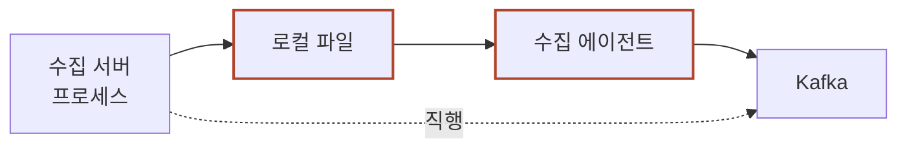

2026년 8월 6일 16시 48분 21초, 누군가 A앱에서 광고 하나를 탭했다. 광고 번호는 `9931`, 지면은 `main_top`, 요청 번호는 `r-8f21` 이다. 같은 광고가 그 화면에 뜬 것은 40분 전인 16시 08분 21초다. 앱을 켜 둔 채 두었다가 돌아와 누른 것이다.

이 탭 한 번은 나중에 pCTR 모델 학습 데이터의 `y=1` 한 줄이 된다. 그 사이에 이 사건은 다섯 군데에 머문다. 머무는 곳마다 모양이 바뀐다. 앱 안에서는 객체다. 전송 중에는 JSON 본문이다. 수집 서버 안에서는 텍스트 한 줄이다.

[Kafka는 왜 있나](post.html?id=kafka-log-pipeline) 7절에 이런 문장이 있다. "`ad.impression` 은 `bidder` 가 넣고 `ad.click` 은 매체를 거쳐 `log-collector` 가 넣는다."

앞 문장은 그 글이 다 펼쳤다. 이 글은 뒤 문장을 펼친다. "매체를 거쳐"와 "넣는다" 사이에 다섯 군데가 있다. 이 글은 그 다섯을 하나씩 연다.

이 글의 숫자는 전부 설명을 위해 지어낸 값이다. 바이트 수만은 그 지어낸 데이터를 실제로 세어 적었다. 실제 지연·용량은 회사마다 다르다.

> **한 줄 요약:** 화면에서 생긴 이벤트 하나는 Kafka에 닿기까지 다섯 군데에 머물고, 머물 때마다 모양이 바뀐다. 어디에 얼마나 머무느냐가 무엇을 잃을 수 있느냐를 정한다.

> **골라 읽는 법** — 절이 9개인 긴 글입니다. 처음부터 다 읽지 않아도 됩니다.
>
> - 수집기 안의 데이터가 어떻게 생겼는지만 → 3절
> - 변환이 무엇을 바꾸는지 → 6절
> - Kafka 안에 무엇이 들어 있는지 → 7절
> - consume 하면 무엇이 오는지 → 8절
> - 저장했다 보내나 바로 보내나 → 1·4절
> - 홉 아홉 개를 한 표로 → 9절

---

## 1. 화면 안에서 무슨 일이 생기나

**이벤트를 만드는 것은 수집기가 아니라 앱 안의 SDK다. 그리고 클릭만 즉시 보낸다.**

| 지금 어디 | 무슨 모양 | 몇 바이트 | 얼마나 머무나 |
|---|---|---|---|
| 앱 안 SDK 큐 | `ClickEvent` 객체 | 102 B | 클릭은 0 ms · 노출은 최대 5초 |

앱에 붙은 광고 SDK 가 탭을 받아 객체 하나를 만든다. 필드는 8개다.

```text
ClickEvent(t="clk", rid="r-8f21", ad=9931, s="main_top",
           ts=1786002501234, seq=47, tz=540, sdk="3.2.1")
```

`ts` 는 밀리초 단위 epoch 이고 16:48:21.234 다. `tz=540` 은 이 기기의 시간대가 UTC+9 라는 뜻이다. `seq` 는 앱을 실행한 뒤 이 SDK 가 만든 몇 번째 이벤트인지다. 47이면 47번째다. 앱을 다시 켜면 0으로 돌아간다. 그래서 `seq` 하나로는 이벤트를 특정하지 못한다. `rid` 와 붙여 `r-8f21`+`47` 로 써야 유일해진다. 이 쌍이 2절의 멱등키가 된다.

SDK 는 이벤트를 두 갈래로 나눈다. 노출은 큐에 모았다가 묶어 보낸다. 클릭은 만들자마자 그대로 보낸다. 이유는 탭 다음에 벌어지는 일이다. 탭하면 랜딩 페이지가 열리고 앱은 백그라운드로 내려간다. 백그라운드에서 앱이 얼마나 더 도는지는 OS 가 정한다. 큐에 넣어 두면 그 안에서 못 보내고 끝날 수 있다. 그래서 클릭만 예외로 뺀다.

노출은 두 조건 중 먼저 오는 쪽에서 보낸다. 큐에 10건이 차거나, 마지막 전송에서 5초가 지나거나다. 노출은 한 건이 빠져도 다음 건이 곧 온다. 클릭은 한 건이 정산과 학습 라벨에 그대로 들어간다. 같은 SDK 안에서 두 이벤트의 값이 다르다.

전송이 실패하면 SDK 는 이벤트를 디스크 큐에 적는다. 지하철에서 네트워크가 끊긴 경우가 그렇다. 메모리 큐는 앱이 죽으면 같이 사라지지만 디스크 큐는 남는다. 다음 실행 때 남은 것부터 보낸다. 사용자가 사흘 뒤에 앱을 열면 그 이벤트도 사흘 늦게 도착한다. 며칠 늦게 도착하는 로그의 첫 원인이 여기다.

그래서 시각을 기기에서 박는다. 도착한 시각으로 날짜를 매기면 이 클릭이 사흘 뒤 날짜에 붙는다. 실제로 눌린 날의 집계가 비고 사흘 뒤 날짜가 부푼다. 대신 기기 시계가 틀리면 `ts` 도 같이 틀린다. 그래서 서버는 자기 시계로 잰 시각을 따로 적는다(2절).

이 글은 홉마다 같은 질문을 한다. 저장했다 보내나, 만들자마자 보내나. 첫 답은 하나가 아니다. 이벤트 종류마다 다르다. 같은 SDK 의 같은 큐인데 노출은 저장하고 클릭은 저장하지 않는다. 무엇을 잃어도 되는지가 이벤트마다 다르기 때문이다.

---

## 2. 전송 — HTTP 요청 한 번

**전송은 한 번의 HTTP 요청이다. 응답을 못 받으면 다시 보내고, 그래서 중복이 생긴다.**

| 지금 어디 | 무슨 모양 | 몇 바이트 | 얼마나 머무나 |
|---|---|---|---|
| 앱과 수집 서버 사이 | HTTP 요청 본문(JSON) | 79 B | 168 ms |

SDK 가 만든 객체는 이 요청 하나로 서버에 건너간다.

```text
POST /v1/e HTTP/1.1
Host: log.adsvc.example
Content-Type: application/json
User-Agent: MyApp/3.2.1 (iPhone; iOS 19.2)

{"t":"clk","rid":"r-8f21","ad":9931,"s":"main_top","ts":1786002501234,"seq":47}
```

본문은 79 B 다. 1절의 객체 102 B 보다 23 B 작다. `tz` 와 `sdk` 가 본문에서 빠졌기 때문이다. 두 값은 한 세션 동안 안 바뀐다. 이벤트마다 되풀이해 실을 이유가 없어 요청 헤더로 올린다. `sdk` 는 위 `User-Agent` 의 `MyApp/3.2.1` 이 그대로 그 값이다. 위 블록은 설명에 필요한 헤더만 남긴 것이다.

응답은 `HTTP/1.1 204 No Content` 한 줄이고 본문이 없다. `{"ok":true}` 를 돌려줄 수도 있다. 그 본문은 11 B 다. 보내는 쪽은 받았다는 사실만 알면 되니 안 돌려준다.

11 B 가 얼마가 되는지는 요청 수를 세면 나온다. 노출은 묶여 가므로 요청 수가 노출 수보다 적다. 기기 한 대가 5초 안에 10건을 채우는 일은 드물어 대개 5초 타이머가 먼저 돈다. 여기서는 한 요청에 평균 4건이 묶인다고 하자. 그러면 노출 2억 2,800만 건이 요청 5,700만 번이 된다. 클릭 228만 건은 건건이 가니 그대로 228만 번이다. 합쳐서 하루 5,928만 번이다. 응답 본문만 652 MB 다. 그 데이터 요금은 사용자가 낸다. 파싱 시간도 사용자 기기가 쓴다.

보내는 방법이 이것 하나는 아니다. 웹 지면은 1×1 픽셀 이미지를 GET 으로 부르는 방식을 오래 썼다.

| | GET 픽셀 | POST 배치 |
|---|---|---|
| 어디서 쓰나 | 웹, 서드파티 지면, 앱 종료 직전 | 앱 SDK |
| 한 번에 | 1건 | 여러 건 |
| 길이 제한 | URL 길이(실무상 2KB 안팎) | 없다시피 |
| 앱이 죽어도 | 브라우저가 마저 보낸다 | 안 간다 |

이 글이 따라가는 것은 오른쪽 칸이다. 왼쪽 칸은 남의 페이지 안에서 도는 웹·서드파티 지면 이야기라 이 클릭과 조건이 다르다.

**재전송이 있는 곳에는 중복이 있다.** SDK 는 2초 안에 204 를 못 받으면 같은 요청을 다시 보낸다. 서버가 이미 받아 놓고 응답만 늦은 경우에도 다시 보낸다. 보내는 쪽에서 둘을 구별할 방법이 없다. 그래서 클릭 한 번이 서버에 두 줄로 들어온다.

거를 값은 1절에서 이미 만들어 뒀다. 멱등키 `rid`+`seq` 는 보내는 쪽이 만든다. 재전송해도 같은 값이라 받는 쪽이 두 번째를 버릴 수 있다. 받는 쪽이 도착할 때 키를 붙이면 재전송마다 새 키가 생긴다. 그러면 중복 제거가 불가능하다. 같은 규칙을 [광고 로그 시스템 완전 해부](post.html?id=ad-log-system) 7절이 수집 계층 전체에 적용한다.

이 요청의 왕복은 168 ms 다. DNS 조회, TLS handshake, 전송, 서버 처리가 그 안에 다 들어 있다. 수집 서버는 요청을 받은 순간을 자기 시계로 적는다. 그 값이 `collect_ts` 다. 이 글은 168 ms 를 전부 가는 쪽에 몰아 `collect_ts` 를 16:48:21.402 로 둔다. 이제 시각이 둘이다 — 기기가 박은 `ts` 와 서버가 박은 `collect_ts`. 3절부터 이 둘이 계속 같이 나온다.

---

## 3. 수집 서버 안 — 텍스트 한 줄

**수집기 안의 데이터는 텍스트 한 줄이고 타입이 없다. `9931` 은 숫자가 아니라 글자 넷이다.**

| 지금 어디 | 무슨 모양 | 몇 바이트 | 얼마나 머무나 |
|---|---|---|---|
| 수집 서버 프로세스 | 액세스 로그 텍스트 한 줄 | 169 B | 2 ms |

수집 서버는 nginx 다. 요청을 받으면 이 형식대로 한 줄을 적게 해 뒀다.

```text
log_format collect '$remote_addr $time_iso8601 $request_method $uri $status '
                   '$request_time "$http_user_agent" $request_body';
```

2절의 요청이 들어오면 파일 끝에 이 줄이 붙는다.

```text
10.2.31.7 2026-08-06T16:48:21+09:00 POST /v1/e 204 0.002 "MyApp/3.2.1 (iPhone; iOS 19.2)" {"t":"clk","rid":"r-8f21","ad":9931,"s":"main_top","ts":1786002501234,"seq":47}
```

169 B 다. 뒤쪽 중괄호 79 B 는 2절의 요청 본문 그대로다. 앞의 90 B 는 서버가 붙인 것이다 — 보낸 IP, 받은 시각, 메서드, 경로, 상태 코드, 처리 시간, User-Agent. `$time_iso8601` 이 2절이 말한 `collect_ts` 다. 다만 값이 `2026-08-06T16:48:21+09:00` 이라 초까지만 있다. 2절이 정한 16:48:21.402 의 뒤 세 자리는 이 줄에 안 남는다. 밀리초가 필요하면 `$msec` 를 형식에 더해야 한다. 이 글은 더하지 않은 줄을 그대로 따라간다.

**이 줄에는 타입이 없다.** `9931` 도 `204` 도 `0.002` 도 전부 글자다. 파일 안에서 보면 `9`, `9`, `3`, `1` 네 글자가 이어져 있을 뿐이다. `ad` 를 숫자로 쓰려면 누군가 정수로 바꿔야 하고, 그 자리가 6절이다. 그래서 이 홉에서는 `"ad":9931` 과 `"ad":"9931"` 이 그냥 서로 다른 두 줄이다. 앱이 타입을 잘못 실어 보내도 여기서는 아무 말도 안 나온다. 걸리는 곳은 6절이다.

`tz` 는 이 줄에 없다. 2절에서 헤더로 올린 두 값 중 `sdk` 는 `$http_user_agent` 안의 `MyApp/3.2.1` 로 되돌아왔다. `tz` 는 되돌아오지 않는다. 이 서비스가 한국 한 곳만 보고 있어서 값이 전부 540 이기 때문이다. 하루 5,928만 줄에 같은 값을 되풀이해 적을 이유가 없다. 대신 이 결정은 되돌리기 어렵다. 다른 시간대가 들어오는 날부터 찍히고 그 앞은 영영 비어 있다.

응답이 먼저고 로그가 그다음이다. nginx 는 204 를 돌려준 뒤에 이 줄을 쓴다. 로그 쓰기가 응답을 붙잡지 않는다. `$request_time` 에 찍힌 0.002 가 그 값이다. 요청을 받아 응답을 다 보내기까지 2 ms 였다는 뜻이고, 로그 쓰기는 그 2 ms 밖에서 일어난다.

**유실 지점은 버퍼다.** 설정에 `access_log /var/log/collect.log collect buffer=32k;` 를 주면 nginx 는 32KB 를 모았다가 한 번에 쓴다. 디스크 호출이 줄어 초당 수백 줄을 훨씬 싸게 감당한다. 대신 그 32KB 는 워커 프로세스의 메모리 안에 있다. 워커가 죽으면 같이 사라진다. 32,768 B ÷ 169 B ≈ 194줄이다. 크래시 한 번에 194건이 없어진다는 말이 아니다. 없어질 수 있는 최대치가 194건이라는 말이다.

이것은 nginx 의 동작이다. 다른 서버는 다르다. 애플리케이션이 직접 파일에 쓰면 버퍼 크기와 내보내는 시점을 그 코드가 정한다. 로그 라이브러리를 끼우면 라이브러리 설정이 정한다. "로그는 버퍼에 모였다 나간다"를 서버 일반의 성질로 옮기면 틀린다. 확인할 것은 내가 쓰는 그 제품의 설정 한 줄이다.

**세는 단위가 둘이다.** 위 줄은 클릭 한 건짜리다. 노출 줄은 그렇지 않다.

| 무엇 | 하루 | 초당 |
|---|---|---|
| 요청 (액세스 로그 줄 수) | 5,928만 | 686건 |
| 이벤트 (노출 확인 + 클릭) | 2억 3,028만 | 2,665건 |

2절에서 노출은 평균 4건씩 묶여 왔다. 그 요청 하나가 액세스 로그 한 줄이 된다. 한 줄 안에 노출 4건이 들어 있다는 뜻이다. 그 한 줄을 4건으로 쪼개는 것은 5절의 수집 에이전트 파서다. 클릭은 건건이 가므로 한 줄에 한 건이고, 그래서 위 169 B 줄이 클릭 한 건짜리다.

앞으로 나오는 숫자는 둘 중 어느 쪽을 세는지 보고 읽어야 한다. 파일에 쌓이는 줄은 초당 686줄이다. Kafka 로 흘러 들어가는 이벤트는 초당 2,665건이다.

이 줄은 이제 파일 끝에 붙어 잠시 머문다. 왜 파일을 한 번 거치는지가 4절이다.

---

## 4. 파일이냐 직행이냐

**파일을 한 번 거치면 Kafka 가 멈춰도 61.7시간을 버틴다. 직행은 10.4분이다. 그 값으로 640 ms 를 산다.**

3절의 줄은 파일 끝에 붙었다. 굳이 그럴 이유가 없어 보인다. 수집 서버 프로세스 안에서 Kafka producer 를 열고 바로 보내면 홉 두 개가 통째로 빠진다. 이 절은 그 둘을 나란히 놓고 잰다.

먼저 이 글이 형제 글과 어긋나 보이는 자리를 짚어야 한다. [Kafka는 왜 있나](post.html?id=kafka-log-pipeline) 1절 ②는 "파일에 쓰고 나중에 옮긴다"를 유실 사례로 깠다. 오토스케일이 30대를 20대로 줄이는 순간 132,000줄이 사라진다는 계산까지 붙였다. 그런데 그 글이 깐 것은 파일이 아니라 5분이다. 계산의 전제가 5분마다 파일을 공용 저장소로 옮기는 배치이고, 사라지는 자리도 "옮기기 전"이라고 그 글이 못 박았다. 그리고 같은 절에 이런 문장이 있다. "파일을 계속 따라 읽는 에이전트를 붙이면 5분이 몇 초로 줄어든다. 맞다."

이 글의 설계가 바로 그것이다. 파일 끝을 계속 따라 읽는 에이전트가 붙어 있다. 그 글이 말한 몇 초가 여기서는 686 ms 다 — 파일에서 640 ms, 에이전트에서 46 ms.

그 글이 남긴 경고 하나는 여기서도 그대로다. 인스턴스가 통째로 사라지면 아직 안 읽은 끝부분도 같이 사라진다. 아래 표에서 두 설계가 같은 칸에 있는 줄이 그것이다. 다른 경고 하나는 여기서 안 생긴다. 그 글은 "파일에는 누가 어디까지 읽었나가 없다"를 지적했다. 여기서 파일은 종착지가 아니라 686 ms 짜리 중간 기착이다. 되감아 읽는 일은 Kafka 의 offset 이 맡는다.

두 갈래를 그림으로 놓으면 이렇다.



테두리가 굵은 두 칸이 직행에서 빠지는 홉이다. 점선이 직행이고, 실선을 따라가는 것이 이 글의 경로다.

이제 숫자로 잰다. 아래 예제는 탭에서 Kafka 까지 홉마다 시간을 더한다. 그다음 Kafka 를 멈춰 세워 놓고, 앞에 쌓이는 것이 어디까지 버티는지 잰다.

```python
# "탭에서 Kafka 까지 얼마나 걸리고, 앞이 멈추면 어디까지 버티나" — 홉을 더해 본다.
#
# 상황: 16:48:21.234 에 탭한 클릭 한 건이 홉을 차례로 지난다. 홉마다 머무는
#   시간을 더해 Kafka 에 닿는 시각을 낸다. 그다음 Kafka 가 멈췄다고 하고,
#   파일 경유와 프로세스 안 직행이 각각 얼마나 버티는지 잰다.
# 하루 유입은 Kafka 글 값을 합친 것이다 — 노출 확인 2.28억 + 클릭 228만.
# 홉별 밀리초, 디스크 100GB, 메모리 512MB 는 전부 지어낸 값이다.
from unicodedata import east_asian_width

TAP = 1786002501234                       # 2026-08-06 16:48:21.234 KST
ROWS_DAY = 228_000_000 + 2_280_000
PER_SEC = ROWS_DAY / 86_400               # 수집 서버가 초당 받는 줄
LINE_TEXT, LINE_JSON = 169, 308           # 예제 2에서 잰 한 줄 바이트
DISK, MEM = 100 * 10 ** 9, 512 * 10 ** 6

# (홉 이름, 머무는 밀리초, 무슨 모양으로 있나)
HOPS = [
    ("앱 SDK 메모리 큐",   0, "구조체 (클릭은 즉시 보낸다)"),
    ("HTTP 왕복",        168, "요청 본문 JSON"),
    ("수집 서버 처리",      2, "액세스 로그 한 줄"),
    ("로컬 파일",         640, "텍스트 파일 끝에 붙어 있다"),
    ("수집 에이전트",       46, "문자열만 든 map"),
    ("변환기",            220, "타입이 붙은 JSON"),
    ("producer → 브로커",  36, "배치로 묶인 바이트"),
]

def w(s):
    return sum(2 if east_asian_width(c) in "WF" else 1 for c in s)

def row(*cells):
    print("".join(" " * (n - w(c)) + c for c, n in cells))

def clock(ms):                            # 밀리초를 16:48:21.234 꼴로
    s, sub = divmod(TAP + ms, 1000)
    h, m = divmod(s % 86_400 // 60, 60)
    return f"{(h + 9) % 24:02d}:{m:02d}:{s % 60:02d}.{sub:03d}"

print(f"탭 {clock(0)} 부터 홉마다 쌓이는 시간")
row(("홉", 20), ("머문다", 9), ("여기를 떠나는 시각", 22), ("무슨 모양으로", 30))
acc = 0
for name, ms, shape in HOPS:
    acc += ms
    row((name, 20), (f"{ms:,} ms", 9), (clock(acc), 22), (shape, 30))
print()
print(f"→ 탭에서 Kafka 까지 {acc:,} ms. 그중 {HOPS[3][1]:,} ms 가 로컬 파일에서 기다린 시간이다.")

# ── 같은 줄을 누가 언제 읽나. group 마다 다르다 ──
#    학습은 다음 날 03:00 에 하루치를 몰아 읽는다. 탭한 16:48:21 부터의 초를 센다
NEXT_3AM = 27 * 3600 - (16 * 3600 + 48 * 60 + 21)
READERS = [("대시보드", 900, None), ("정산", 2_900, None),
           ("학습", NEXT_3AM * 1000 - acc, "다음 날 03:00:00")]
print()
print("같은 줄을 읽는 시각은 group 마다 다르다")
row(("group", 12), ("Kafka 도달 뒤", 15), ("보는 시각", 18), ("탭부터", 12))
for name, wait, label in READERS:
    t = acc + wait
    dur = (lambda x: f"{x:,} ms" if x < 3_600_000 else f"{x / 3_600_000:,.1f}시간")
    row((name, 12), (dur(wait), 15), (label or clock(t), 18), (dur(t), 12))
print()

# ── Kafka 가 멈췄다. 앞에 쌓인 것이 어디까지 버티나 ──
file_bps = PER_SEC * LINE_TEXT            # 파일에는 액세스 로그 텍스트가 쌓인다
mem_bps = PER_SEC * LINE_JSON             # 직행이면 변환된 JSON 을 메모리에 든다
print(f"Kafka 가 멈췄을 때 (초당 {PER_SEC:,.0f}건이 계속 들어온다)")
row(("어디에 쌓이나", 18), ("크기", 10), ("초당", 12), ("버티는 시간", 14))
row(("로컬 파일 (디스크)", 18), (f"{DISK / 10 ** 9:,.0f} GB", 10),
    (f"{file_bps / 1000:,.0f} KB", 12), (f"{DISK / file_bps / 3600:,.1f}시간", 14))
row(("직행 (메모리 버퍼)", 18), (f"{MEM / 10 ** 6:,.0f} MB", 10),
    (f"{mem_bps / 1000:,.0f} KB", 12), (f"{MEM / mem_bps / 60:,.1f}분", 14))
print()
print(f"→ {DISK / file_bps / (MEM / mem_bps):,.0f}배 차이다. 파일을 한 번 거치는 값이 이것이다.")
print(f"→ 대신 {HOPS[3][1]:,} ms 를 매 건마다 낸다. 대시보드가 몇 초 안에 숫자를 올려야 하는데")
print(f"   그중 {HOPS[3][1] / 1000:,.1f}초를 여기서 쓴다.")
print("→ 판정 기준은 하나다. Kafka 가 30분 멈춰도 되나, 안 되나.")

# 출력:
# 탭 16:48:21.234 부터 홉마다 쌓이는 시간
#                   홉   머문다    여기를 떠나는 시각                 무슨 모양으로
#     앱 SDK 메모리 큐     0 ms          16:48:21.234   구조체 (클릭은 즉시 보낸다)
#            HTTP 왕복   168 ms          16:48:21.402                요청 본문 JSON
#       수집 서버 처리     2 ms          16:48:21.404             액세스 로그 한 줄
#            로컬 파일   640 ms          16:48:22.044    텍스트 파일 끝에 붙어 있다
#        수집 에이전트    46 ms          16:48:22.090               문자열만 든 map
#               변환기   220 ms          16:48:22.310              타입이 붙은 JSON
#    producer → 브로커    36 ms          16:48:22.346            배치로 묶인 바이트
#
# → 탭에서 Kafka 까지 1,112 ms. 그중 640 ms 가 로컬 파일에서 기다린 시간이다.
#
# 같은 줄을 읽는 시각은 group 마다 다르다
#        group  Kafka 도달 뒤         보는 시각      탭부터
#     대시보드         900 ms      16:48:23.246    2,012 ms
#         정산       2,900 ms      16:48:25.246    4,012 ms
#         학습       10.2시간  다음 날 03:00:00    10.2시간
#
# Kafka 가 멈췄을 때 (초당 2,665건이 계속 들어온다)
#      어디에 쌓이나      크기        초당   버티는 시간
# 로컬 파일 (디스크)    100 GB      450 KB      61.7시간
# 직행 (메모리 버퍼)    512 MB      821 KB        10.4분
#
# → 356배 차이다. 파일을 한 번 거치는 값이 이것이다.
# → 대신 640 ms 를 매 건마다 낸다. 대시보드가 몇 초 안에 숫자를 올려야 하는데
#    그중 0.6초를 여기서 쓴다.
# → 판정 기준은 하나다. Kafka 가 30분 멈춰도 되나, 안 되나.
```

**450 KB/s 는 상한이다.** 이 코드는 이벤트 하나마다 액세스 로그 한 줄이 생긴다고 봤다. 초당 2,665건이 각자 169 B 짜리 줄을 갖는다고 센 값이다. 실제 줄 수는 3절 표대로 초당 686줄이다. 노출 4건이 한 줄에 묶여 오면 되풀이되는 앞부분 90 B 를 네 번이 아니라 한 번만 적는다. 그래서 실제로 쌓이는 바이트는 450 KB/s 보다 적고, 디스크가 버티는 시간은 61.7시간보다 길다. 재는 쪽은 상한이다. 형제 글 1절이 `bidder` 의 응찰 계산을 평소값 8ms 가 아니라 상한 10ms 로 잰 것과 같은 이유다. 불리한 쪽으로 재 두면 실제가 그보다 나쁠 일이 없다.

메모리 쪽 308 B 가 169 B 보다 큰 것에도 이유가 있다. 직행이면 텍스트 한 줄이 아니라 타입이 붙은 JSON 을 메모리에 든다. 그 308 B 짜리 모양은 6절에서 나온다. 같은 이벤트가 더 큰 자리를 차지하니 512MB 가 그만큼 더 빨리 찬다.

두 설계를 한 표에 놓으면 이렇다.

| | 파일 경유 | 프로세스 안 producer 직행 |
|---|---|---|
| 홉 수 | 3 (파일 → 에이전트 → Kafka) | 1 |
| 요청 처리를 끝낸 뒤 Kafka 까지 | **942 ms** | **256 ms** |
| Kafka 가 멈추면 버티는 시간 | 디스크 100GB → **61.7시간** | 메모리 512MB → **10.4분** |
| 수집 서버가 죽으면 | 파일은 남는다. 안 읽은 끝부분만 늦어진다 | 버퍼가 사라진다 |
| 인스턴스가 사라지면 | 파일도 같이 사라진다 | 같다 |
| 디스크가 차면 | 쓰기 실패가 요청 처리까지 흔든다 | 영향 없다 |
| 배포 | 수집 서버와 전송 로직을 따로 배포 | 같이 배포 |
| 언어 | 무관 | Kafka 클라이언트가 있는 언어여야 |

942 ms 는 16:48:21.404 부터 16:48:22.346 까지다. 3절 줄이 찍힌 순간부터 Kafka 도달까지다. 직행이면 같은 자리에서 256 ms 뒤인 16:48:21.660 에 닿는다. 차이 686 ms 는 파일 640 ms 와 에이전트 46 ms 두 홉이 통째로 빠진 값이다. 나머지 구간은 두 설계가 같다 — 변환 220 ms 와 producer 36 ms.

**우리 답은 파일 경유다.** 근거는 표에서 딱 한 줄, 버티는 시간이다. 61.7시간과 10.4분은 356배 차이다. Kafka 브로커가 밤에 멈추고 아침에 사람이 알아채면 10.4분은 이미 한참 지나 있다. 61.7시간은 안 지나 있다. 그 값으로 640 ms 를 산다.

메모리를 키우면 되지 않느냐. 512MB 를 8GB 로 올리면 10.4분이 2.7시간이 된다. 그래도 표의 네 번째 줄은 안 바뀐다. 프로세스가 죽으면 8GB 가 통째로 사라진다. 수집 서버는 배포할 때마다 프로세스를 내린다. 버티려고 키운 버퍼가 배포 한 번에 비워진다. 디스크는 프로세스가 죽어도 남는다. 크기의 문제가 아니라 무엇이 살아남느냐의 문제다.

직행이 틀린 것이 아니다. 직행이 나은 자리가 셋 있다.

- 지연이 밀리초로 중요한 곳. 640 ms 를 낼 수 없는 경로가 있다.
- 디스크가 없거나 쓰기가 막힌 컨테이너. 쓸 곳이 없으면 파일 경유가 아예 성립하지 않는다.
- 언어가 이미 맞는 곳. 수집 서버가 JVM 이면 producer 를 그 자리에 여는 값이 싸다.

**판정 기준은 하나다. Kafka 가 30분 멈춰도 되나.** 30분은 브로커 한 대가 멈춘 것을 사람이 알아채고 붙는 데 걸리는 시간으로 잡은 값이다. 30분이 괜찮다면 직행을 골라도 잃을 것이 없다. 안 괜찮다면 640 ms 를 내고 파일을 거친다. 고르는 것은 지연이냐 유실이냐이지 어느 쪽이 옳은 설계냐가 아니다.

다음 홉은 그 파일을 따라 읽는 에이전트다. 문자열만 든 map 이 거기서 나온다.
