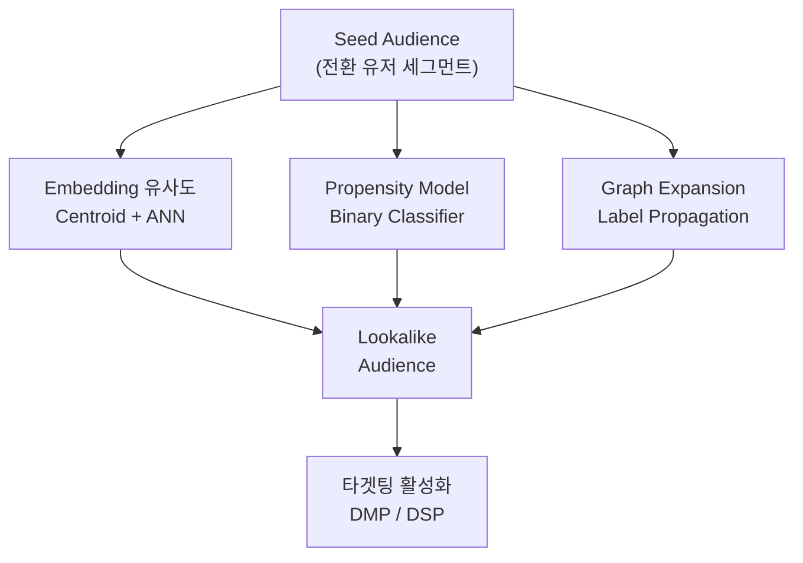
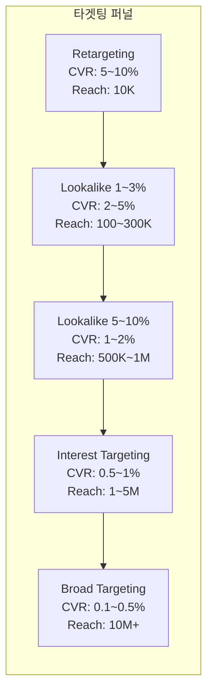
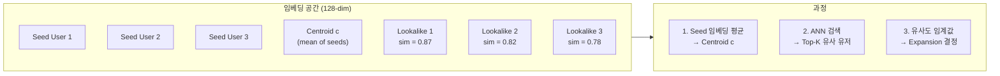
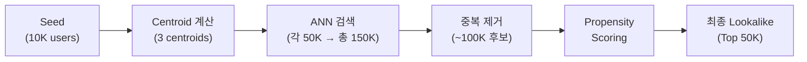
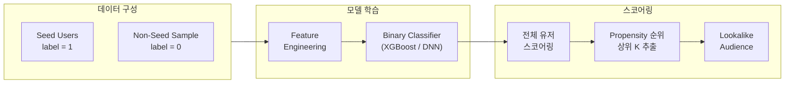
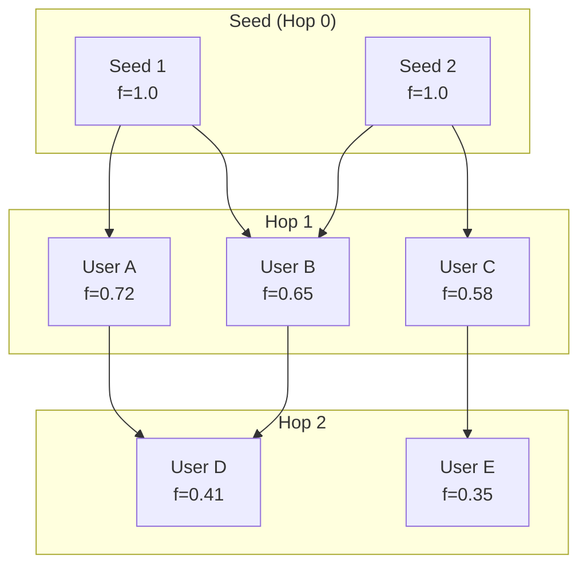
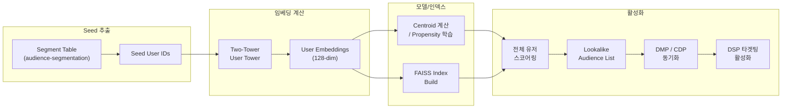
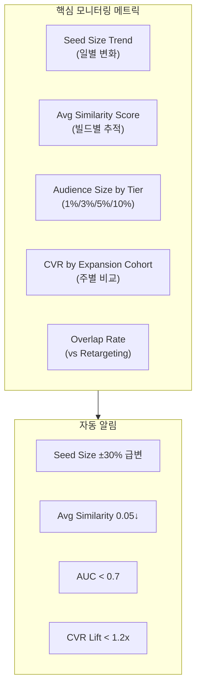

광고주가 보유한 전환 유저는 1,000명입니다. 이 1,000명과 "비슷한" 유저 10만~100만 명을 찾아 타겟팅하면 어떨까요? 이것이 **Lookalike Modeling**의 핵심 질문이며, 리타겟팅 다음으로 가장 높은 ROI를 보이는 타겟팅 전략입니다. "알려진 좋은 유저(Seed)"에서 출발하여 "아직 발견되지 않은 좋은 유저"로 확장하는 것 — 개념은 단순하지만, 실제 구현은 임베딩 공간의 기하학, 분류 모델의 편향, 그래프 전파의 수렴 조건까지 여러 기술적 결정이 얽혀 있습니다.

[오디언스 세그멘테이션](post.html?id=audience-segmentation)에서 만들어진 세그먼트가 Lookalike의 Seed가 되고, [Ad Tech 개발 레이어 맵](post.html?id=adtech-dev-layers)에서 Lookalike는 타겟팅 레이어의 핵심 모듈로 작동합니다. 특히 [Two-Tower Model](post.html?id=two-tower-retrieval)이 생성하는 유저 임베딩은 Lookalike를 위한 유사도 계산의 기반이 됩니다. 이 글은 Lookalike의 세 가지 핵심 접근법(Embedding 유사도, Propensity Model, Graph Expansion)을 해부하고, Seed 구성부터 프로덕션 파이프라인까지 — Lookalike Modeling의 전체 스펙트럼을 엔지니어 관점에서 다룹니다.

---

## 1. 핵심 비교 (Executive Summary)

Lookalike Modeling에는 크게 세 가지 접근법이 있습니다. 각각의 핵심 아이디어, 입력 데이터, 그리고 프로덕션 특성을 먼저 비교합니다.

### 3대 접근법 비교

| 접근법 | 핵심 아이디어 | 입력 데이터 | 확장성 | Precision@1% | 구현 복잡도 |
|--------|-------------|-----------|--------|-------------|-----------|
| **Embedding 유사도** | Seed 중심(Centroid)과 ANN 거리 | 유저 임베딩 (128~256-dim) | 매우 높음 (ANN으로 수억 유저 처리) | 높음 | 중간 |
| **Propensity Model** | Seed vs Non-Seed 이진 분류 | 유저 피처 전체 (수백~수천 차원) | 높음 (배치 스코어링) | 매우 높음 | 중간 |
| **Graph Expansion** | 관계 그래프 Label Propagation | 소셜/행동 그래프 | 중간 (그래프 크기 제약) | 높음 | 높음 |

### 멀티 플랫폼 Lookalike 비교

플랫폼마다 Lookalike의 기반 기술과 제어 수준이 크게 다릅니다:

| 플랫폼 | 기술 기반 | 데이터 소스 | Expansion 옵션 | 광고주 제어 | 한계 |
|--------|---------|-----------|---------------|-----------|------|
| **Meta (Facebook)** | Social + Interest Graph + ML | 로그인 기반 cross-platform | 1~10% 슬라이더 | 높음 (소스/비율 선택) | Walled Garden 내부만 |
| **Google** | Search/Browse history + ML | Google Account cross-service | 자동 (Performance Max) | 낮음 (자동화 위주) | Similar Audiences 폐지 |
| **DSP (TTD, DV360)** | 3rd-party data + ML | Cookie/MAID (제한적) | 커스텀 비율 설정 | 중간 | Cookie 폐지 영향 직격 |
| **네이버/카카오** | 1st-party 통합 데이터 | 검색+쇼핑+콘텐츠 | 플랫폼 제공 옵션 | 중간 | 플랫폼 외부 활용 불가 |



> **실무에서는 단일 접근법보다 조합이 강력합니다.** Embedding 유사도로 빠르게 후보 풀을 생성하고, Propensity Model로 순위를 재조정하면 — 속도(Embedding)와 정밀도(Propensity)를 동시에 달성할 수 있습니다. Facebook의 내부 Lookalike도 Graph + Embedding + Classifier의 앙상블입니다.

### Lookalike vs 다른 타겟팅 전략 비교

Lookalike의 위치를 다른 타겟팅 전략과 비교하면 그 가치가 더 명확해집니다:

| 타겟팅 전략 | 대상 | 도달 범위 | 전환율 | CPA | 주요 한계 |
|-----------|------|---------|-------|-----|---------|
| **Retargeting** | 이미 방문/전환한 유저 | 매우 좁음 | 매우 높음 | 매우 낮음 | 규모 확장 불가, 기존 유저만 |
| **Lookalike 1~3%** | Seed와 유사한 신규 유저 | 좁~중간 | 높음 | 낮음 | Seed 품질에 의존 |
| **Lookalike 5~10%** | Seed와 느슨하게 유사한 유저 | 중간~넓음 | 중간 | 중간 | 시그널 희석 |
| **Interest Targeting** | 특정 관심사 유저 | 넓음 | 낮~중간 | 중간~높음 | 관심사 ≠ 구매 의도 |
| **Broad Targeting** | 전체 모집단 | 매우 넓음 | 낮음 | 높음 | 비효율적 지출 |

Retargeting은 가장 높은 전환율을 보이지만 **규모 확장이 불가능**합니다 — 이미 사이트를 방문한 유저만 대상이기 때문입니다. Lookalike는 Retargeting의 높은 전환율을 유지하면서 **신규 유저로 확장**할 수 있는 유일한 전략입니다. 이것이 Lookalike가 "리타겟팅 다음으로 가장 높은 ROI"라 불리는 이유입니다.



---

## 2. Seed Audience: Lookalike의 출발점

Lookalike의 성능은 모델 아키텍처보다 **Seed의 품질**에 더 크게 좌우됩니다. "좋은 유저"를 정확하게 정의하지 못하면, 아무리 정교한 확장 알고리즘을 사용해도 "좋은 유저와 비슷한 유저"를 찾을 수 없습니다. 이 섹션에서는 Seed 선정 전략과 품질 평가 방법을 다룹니다.

### 2-1. Seed 선정 전략

Seed를 어떻게 정의하느냐에 따라 Lookalike의 방향이 완전히 달라집니다:

| Seed 유형 | 정의 | 장점 | 위험 |
|----------|------|------|------|
| **전체 전환자** | 구매/가입 완료 유저 전체 | 데이터 풍부, 통계적 안정성 | 저가치 전환(쿠폰 사냥꾼 등) 포함 가능 |
| **High-LTV 전환자** | 상위 20% LTV 유저 | 고품질 시그널, 고가치 유저 발굴 | Seed 크기 작음 → 오버피팅 위험 |
| **특정 이벤트** | 장바구니 추가, 앱 설치 등 | 캠페인 목적에 특화 | 최종 전환과 괴리 가능 |
| **기존 세그먼트** | RFM Champions, VIP 등급 등 | 이미 검증된 비즈니스 그룹 | 이미 알려진 유저만 (신규 패턴 부재) |

**최적 Seed 크기**: 최소 1,000명이 필요하며, **Sweet Spot은 1만~10만 명**입니다.

- **너무 작은 Seed (< 500명)**: 노이즈에 오버피팅합니다. 소수 유저의 우연한 공통점(예: 특정 시간대 접속)을 패턴으로 학습할 위험이 높습니다.
- **너무 큰 Seed (> 100만 명)**: 시그널이 희석됩니다. "전환 유저"라는 레이블이 너무 다양한 행동 패턴을 포함하면, Centroid는 아무 유저도 대표하지 못하는 "평균의 함정"에 빠집니다.
- **1만~10만 명**: 충분한 통계적 안정성을 확보하면서도, 전환 유저의 핵심 패턴이 살아 있는 구간입니다.

[오디언스 세그멘테이션](post.html?id=audience-segmentation)에서 다룬 SQL Rule-based 세그먼트, RFM 스코어링, ML 클러스터링이 바로 이 Seed를 구축하는 방법론입니다. Lookalike는 세그멘테이션의 결과물을 입력으로 받는 **하류(Downstream) 프로세스**입니다.

> Seed 정의에서 가장 흔한 실수는 "전환 유저 전체"를 무조건 Seed로 사용하는 것입니다. 프로모션 기간 중 가입한 유저, 1회성 체험 구매 유저, 환불 유저를 포함하면 Seed의 동질성(Homogeneity)이 급격히 떨어집니다. **전환의 "질"을 기준으로 Seed를 필터링**하는 것이 첫 번째 최적화입니다.

### 2-2. Seed 품질 평가

Seed를 정의한 후, 확장 전에 반드시 품질을 진단해야 합니다. 품질이 낮은 Seed를 확장하면 "노이즈의 확대 재생산"이 일어납니다.

**3가지 핵심 진단 지표**:

1. **Homogeneity (동질성)**: 임베딩 공간에서 Seed 내부 유저 간 평균 cosine similarity. 동질적인 Seed일수록 Centroid가 의미 있는 중심을 나타냅니다.

$$\text{Homogeneity}(S) = \frac{1}{|S|^2} \sum_{i,j \in S} \text{sim}(u_i, u_j)$$

2. **Signal Strength**: Seed의 전환율(CVR)과 전체 모집단 전환율의 비율. 이 비율이 높을수록 Seed가 명확한 "좋은 유저" 시그널을 가지고 있습니다.

$$\text{Signal Strength} = \frac{\text{CVR}_{\text{seed}}}{\text{CVR}_{\text{population}}}$$

3. **Feature Distribution**: 핵심 피처들이 전체 모집단 대비 더 좁은 분포를 가져야 합니다. 예를 들어, Seed 유저의 앱 사용 시간이 전체 대비 분산이 낮다면 → 일관된 행동 패턴이 존재한다는 의미입니다.

| 진단 지표 | Good Seed | Bad Seed | 주요 원인 |
|-----------|-----------|---------|----------|
| Intra-similarity | > 0.3 | < 0.15 | 이질적 유저 혼합 (LTV 편차 큼) |
| CVR Uplift | > 3x | < 1.5x | 시그널 약함 (정의 기준 느슨) |
| Size | 5K ~ 100K | < 500 or > 1M | 너무 작거나 너무 큼 |
| Feature Variance | 낮음 (집중된 분포) | 높음 (분산 분포) | 정의 기준 불명확 / 프로모션 유저 포함 |

**Bad Seed 진단 시 조치**:
- Intra-similarity < 0.15 → Seed를 K-Means로 서브클러스터링하여 각 클러스터를 별도 Seed로 분리
- CVR Uplift < 1.5x → 전환 기준을 강화 (예: 1회 구매 → 2회 이상 재구매)
- Size < 500 → 시간 윈도우 확장 (30일 → 90일) 또는 이벤트 기준 완화
- Feature Variance 높음 → 이상치 유저 필터링 또는 Sub-seed 분리

### 2-3. Value-Based Seed (가치 가중)

단순한 "Seed에 속하는지 여부(binary)"를 넘어서, **각 Seed 유저의 가치(value)를 가중치로 반영**하는 방법이 있습니다. Facebook의 "Value-Based Lookalike"가 대표적입니다.

$$c_{\text{weighted}} = \frac{\sum_{i \in S} w_i \cdot u_i}{\sum_{i \in S} w_i}$$

여기서 $w_i$는 유저 $i$의 LTV(Lifetime Value) 또는 구매 금액입니다. 고가치 유저의 임베딩에 더 높은 가중치를 부여하므로, Centroid가 고가치 유저 쪽으로 편향됩니다. 이는 "전환 유저와 유사한 유저"가 아니라 "**고가치 전환 유저**와 유사한 유저"를 찾는 것으로, ROAS 최적화 캠페인에서 특히 효과적입니다.

[LTV(Long Term Value)](post.html?id=ltv-ad-ranking)에서 다룬 LTV 예측 모델의 출력을 가중치로 사용할 수 있습니다. LTV 예측의 정확도가 Value-Based Lookalike의 성능을 직접 결정하므로, LTV 모델 개선이 Lookalike 성능 개선으로 이어지는 선순환 구조가 형성됩니다.

**Propensity 모델에서의 Value-Based 접근**:

Propensity 모델에서는 이진 분류 대신 **회귀(Regression)**로 재정의할 수 있습니다:

$$\hat{v}(x) = f(x; \theta)$$

여기서 $\hat{v}$는 예상 LTV이며, Seed 유저는 실제 LTV를 레이블로, Non-Seed 유저는 0을 레이블로 사용합니다. 예측된 $\hat{v}$ 순서로 Lookalike를 구성하면, 높은 LTV가 기대되는 유저가 상위에 위치합니다.

| 방식 | 목적 | Seed 레이블 | 결과물 |
|------|------|-----------|-------|
| Binary Lookalike | "Seed와 유사한" 유저 | 0 / 1 | Propensity Score (유사 확률) |
| Value-Based Lookalike | "고가치 Seed와 유사한" 유저 | LTV 금액 (연속값) | Expected Value (기대 가치) |

---

## 3. Embedding 기반 Lookalike

가장 직관적이고 구현이 빠른 접근법입니다. 유저를 벡터 공간에 임베딩하고, Seed 유저의 중심(Centroid)에서 가까운 유저를 Lookalike로 선정합니다. 이미 [Two-Tower Model](post.html?id=two-tower-retrieval)에서 학습된 유저 임베딩을 재활용할 수 있다는 것이 가장 큰 장점입니다.

### 3-1. Two-Tower 임베딩 공간 활용

Two-Tower Model의 User Tower는 유저의 행동 데이터(클릭 이력, 검색 쿼리, 구매 패턴 등)를 입력받아 고밀도 벡터(Dense Vector)를 출력합니다. 이 벡터 공간에서 **유사한 행동 패턴을 가진 유저는 가까이 위치**합니다.

$$u_i = f_{\text{user}}(x_i; \theta_{\text{user}}) \in \mathbb{R}^d$$

여기서 $f_{\text{user}}$는 Two-Tower의 User Tower, $x_i$는 유저 $i$의 피처, $\theta_{\text{user}}$는 학습된 파라미터, $d$는 임베딩 차원(보통 128~256)입니다.

핵심 인사이트는 **새로운 모델이 필요 없다**는 것입니다. 광고 Retrieval을 위해 이미 학습된 Two-Tower 모델이 생성하는 유저 임베딩에는 광고 반응 패턴이 이미 인코딩되어 있습니다. Lookalike를 위한 별도 모델 학습 없이, 이 임베딩을 그대로 활용하면 됩니다.

물론 한계도 존재합니다. Two-Tower 임베딩은 광고 클릭/전환 예측에 최적화되었으므로, "유저 간 유사도"를 직접 목적 함수로 학습한 것은 아닙니다. 따라서 Lookalike 전용 임베딩(예: Contrastive Learning으로 전환 유저 간 유사도를 극대화한 모델)이 더 나은 결과를 줄 수 있습니다. 하지만 실무에서 이 차이는 대개 Seed 품질의 영향보다 작으므로, **첫 버전은 Two-Tower 임베딩으로 시작**하는 것이 합리적입니다.

### 3-2. Seed Centroid 계산과 ANN 검색

Seed 유저 집합 $S = \{u_1, u_2, \ldots, u_n\}$이 주어지면, 먼저 중심점(Centroid)을 계산합니다.

**Mean Centroid** (가장 기본적인 방법):

$$c = \frac{1}{|S|} \sum_{i \in S} u_i$$

모든 Seed 유저의 임베딩을 단순 평균합니다. 직관적이지만, Seed가 동질적(Homogeneous)일 때만 효과적입니다.

**Cosine Similarity** (유사도 계산):

$$\text{sim}(u, c) = \frac{u^T c}{\|u\| \cdot \|c\|}$$

전체 유저 풀에서 Centroid와의 cosine similarity가 높은 유저를 Lookalike 후보로 선정합니다.

**Top-K ANN 검색** (효율적 확장):

$$\text{Lookalike}(S, k) = \text{TopK}_{u \notin S}\left(\text{sim}(u, c)\right)$$

수억 명의 유저 풀에서 Top-K를 brute-force로 계산하면 시간이 너무 오래 걸립니다. [Two-Tower Model](post.html?id=two-tower-retrieval)에서 다룬 FAISS, ScaNN 같은 ANN(Approximate Nearest Neighbor) 인덱스를 사용하면 수밀리초 만에 Top-K를 추출할 수 있습니다.



**Expansion 비율 제어**: 유사도 임계값(threshold)을 조정하여 Lookalike 크기를 제어합니다. Threshold를 높이면 → Seed와 매우 유사한 소수만 포함 (High Precision, Low Reach). Threshold를 낮추면 → 더 넓은 범위 포함 (Low Precision, High Reach). 이것이 Facebook의 "1~10% 슬라이더"의 기술적 실체입니다.

### 3-3. Multi-Centroid (이질적 Seed 처리)

**문제**: 단순 Mean Centroid는 Seed가 이질적(Heterogeneous)일 때 실패합니다. 예를 들어, 쇼핑몰의 전환 유저 Seed에 "명품 구매자"와 "초특가 사냥꾼"이 함께 포함되어 있다면 — 이 두 그룹의 임베딩은 벡터 공간에서 매우 다른 위치에 있습니다. 두 그룹의 평균인 Centroid는 **어느 그룹에도 속하지 않는 빈 공간**에 놓이게 됩니다.

이것을 "평균의 함정(Averaging Fallacy)"이라 부릅니다. 평균이 의미 있으려면 분포가 단봉(Unimodal)이어야 하는데, 이질적 Seed는 다봉(Multimodal) 분포를 가집니다.

**해결**: Seed 임베딩에 K-Means 클러스터링을 적용하여 K개의 서브클러스터를 찾고, 각 서브클러스터의 Centroid로 별도 ANN 검색을 수행합니다.

$$\{c_1, c_2, \ldots, c_K\} = \text{K-Means}(\{u_i\}_{i \in S}, K)$$

$$\text{Lookalike}_{\text{multi}}(S, k) = \bigcup_{j=1}^{K} \text{TopK}_{u \notin S}\left(\text{sim}(u, c_j)\right)$$

각 Centroid에서 독립적으로 ANN 검색을 수행한 후, 결과를 합집합하고 중복을 제거합니다. 최종 순위는 모든 Centroid 중 최대 유사도를 기준으로 정합니다:

$$\text{score}(u) = \max_{j=1}^{K} \text{sim}(u, c_j)$$

**K 선택**: 보통 K=3~5로 시작합니다. K가 너무 크면 각 서브클러스터의 Seed가 너무 작아져서 의미 없는 Centroid가 생기고, K=1이면 단순 Mean Centroid와 동일합니다. Silhouette Score를 기반으로 최적 K를 자동 탐색할 수도 있지만, 실무에서는 K=3으로 시작한 후 Lookalike 성과를 보면서 조정하는 것이 일반적입니다.

다음은 Multi-Centroid Lookalike의 전체 구현 예시입니다:

```python
import numpy as np
import faiss
from sklearn.cluster import KMeans

# 1. Seed 임베딩 로드
seed_embeddings = np.load('seed_embeddings.npy').astype('float32')  # (n_seed, 128)
all_embeddings = np.load('all_user_embeddings.npy').astype('float32')  # (N, 128)
all_user_ids = np.load('all_user_ids.npy')

# 2. 정규화 (cosine similarity → inner product)
faiss.normalize_L2(seed_embeddings)
faiss.normalize_L2(all_embeddings)

# 3. Multi-Centroid: Seed를 K개 서브클러스터로 분할
K_SUB = 3
kmeans_seed = KMeans(n_clusters=K_SUB, random_state=42, n_init=10)
kmeans_seed.fit(seed_embeddings)
centroids = kmeans_seed.cluster_centers_.astype('float32')  # (K, 128)
faiss.normalize_L2(centroids)

# 4. FAISS Inner Product 인덱스 구축
dim = all_embeddings.shape[1]
index = faiss.IndexFlatIP(dim)
index.add(all_embeddings)

# 5. 각 Centroid로 ANN 검색
TOP_K = 50000  # 확장 대상 유저 수
all_scores = np.full(len(all_embeddings), -1.0)

for j in range(K_SUB):
    query = centroids[j:j+1]
    scores, indices = index.search(query, TOP_K)
    for rank in range(TOP_K):
        idx = indices[0][rank]
        score = scores[0][rank]
        all_scores[idx] = max(all_scores[idx], score)

# 6. Seed 제외 + 상위 K 추출
seed_user_set = set(np.load('seed_user_ids.npy'))
candidates = [
    (all_user_ids[i], all_scores[i])
    for i in range(len(all_scores))
    if all_scores[i] > 0 and all_user_ids[i] not in seed_user_set
]
candidates.sort(key=lambda x: -x[1])
lookalike_audience = candidates[:TOP_K]

print(f"Lookalike audience size: {len(lookalike_audience)}")
print(f"Top similarity: {lookalike_audience[0][1]:.4f}")
print(f"Bottom similarity: {lookalike_audience[-1][1]:.4f}")
```

**코드 설명**:
1. L2 정규화 후 Inner Product = Cosine Similarity이므로, FAISS의 `IndexFlatIP`를 직접 사용합니다.
2. K-Means로 Seed를 K개 서브클러스터로 분할하고, 각 Centroid를 쿼리로 ANN 검색합니다.
3. 유저별로 모든 Centroid에 대한 유사도의 최대값을 저장합니다 (Multi-Centroid의 핵심).
4. Seed 유저를 제외하고 유사도 내림차순으로 정렬하여 최종 Lookalike 오디언스를 생성합니다.

프로덕션에서는 `IndexFlatIP` 대신 `IndexIVFPQ` 등 근사 인덱스를 사용하여 수억 유저 규모에서도 효율적으로 검색합니다. 인덱스 선택에 대한 상세는 [Two-Tower Model](post.html?id=two-tower-retrieval)의 ANN 섹션을 참고하세요.

### 3-4. Embedding Lookalike의 장단점 정리

**장점**:
- **구현 속도**: Two-Tower 임베딩이 이미 존재하면, Centroid 계산 + ANN 검색만 추가하면 됩니다. 추가 모델 학습 없이 수시간 내에 MVP를 만들 수 있습니다.
- **확장성**: FAISS/ScaNN의 ANN 인덱스 덕분에 수억 유저 규모에서도 밀리초 단위 검색이 가능합니다.
- **해석 가능성**: "유사도 스코어"라는 직관적 메트릭으로 Lookalike의 품질을 설명할 수 있습니다.
- **실시간 가능**: Centroid만 메모리에 올려두면 Bid Request 시점에 실시간 유사도 계산이 가능합니다.

**한계**:
- **임베딩 품질 의존**: Two-Tower가 광고 클릭 예측에 최적화되었으므로, "유저 간 유사도"와는 약간의 괴리가 있을 수 있습니다. 특히 Cold Start 유저(행동 데이터 부족)의 임베딩은 불안정합니다.
- **피처 활용 제한**: 임베딩에 인코딩되지 않은 피처(예: 최근 검색 키워드, 디바이스 가격대)를 직접 활용할 수 없습니다.
- **Centroid 함정**: Seed가 이질적이면 Mean Centroid가 무의미해집니다. Multi-Centroid로 완화할 수 있지만 완전한 해결은 아닙니다.
- **비선형 관계 미포착**: cosine similarity는 선형 거리 메트릭이므로, "Seed와 비선형적으로 유사한" 패턴을 놓칠 수 있습니다.

이러한 한계를 극복하기 위해, 많은 프로덕션 시스템에서는 Embedding 기반을 **1차 필터(Retrieval)**로 사용하고, Propensity 기반을 **2차 정렬(Ranking)**로 사용하는 Two-Stage 구조를 채택합니다.



이 Two-Stage 구조는 ANN으로 빠르게 후보를 줄이고(10M → 100K), Propensity로 정밀하게 순위를 매겨(100K → 50K) 속도와 정밀도를 동시에 달성합니다.

---

## 4. Propensity 기반 Lookalike

Embedding 기반이 "거리"를 활용한다면, Propensity 기반은 "확률"을 활용합니다. "이 유저가 Seed에 포함될 확률"을 예측하는 이진 분류기(Binary Classifier)를 학습하고, 높은 확률의 유저를 Lookalike로 선정합니다. 대부분의 프로덕션 환경에서 **Embedding보다 높은 Precision**을 달성하는 것으로 알려져 있습니다.



### 4-1. Seed vs Non-Seed 이진 분류

Lookalike를 이진 분류 문제로 재정의합니다:

- **Positive (label = 1)**: Seed 유저
- **Negative (label = 0)**: 일반 모집단에서 샘플링한 유저

$$P(\text{seed} \mid x) = \sigma(f(x; \theta))$$

여기서 $\sigma$는 sigmoid 함수, $f$는 분류 모델, $x$는 유저 피처 벡터입니다. 모든 유저에 대해 이 확률(Propensity Score)을 계산하고, 높은 순서대로 Lookalike 오디언스를 구성합니다.

Embedding 기반과의 핵심 차이는 **입력 데이터의 풍부함**입니다. Embedding 기반은 미리 학습된 고정 차원의 벡터만 사용하지만, Propensity 기반은 원시 피처(demographics, 행동 집계, 디바이스 정보, 시간대 패턴 등) 전체를 활용합니다. 모델이 "어떤 피처가 Seed와 Non-Seed를 구분하는 데 중요한지"를 직접 학습하므로, 임베딩에 포착되지 않은 패턴도 활용할 수 있습니다.

**Feature Set 구성** (예시):
- **Demographics**: 연령대, 성별, 지역
- **행동 집계**: 최근 7/14/30일 페이지뷰 수, 세션 수, 체류 시간
- **구매 패턴**: 평균 주문 금액, 구매 카테고리 분포, 구매 빈도
- **디바이스/플랫폼**: OS, 디바이스 가격대, 앱 vs 웹
- **시간 패턴**: 주 활동 시간대, 주말 vs 평일 비율
- **임베딩**: Two-Tower 유저 임베딩을 피처로 추가 (Embedding + Propensity 하이브리드)

[Feature Store](post.html?id=feature-store-serving)에서 관리되는 피처들이 여기서 직접 활용됩니다.

### 4-2. Feature Interaction과 모델 선택

| 모델 | 장점 | 한계 | 적합 상황 |
|------|------|------|----------|
| **Logistic Regression** | 빠름, 해석 가능, Feature Importance 명확 | Feature interaction 수동 구성 필요 | 베이스라인, 해석 필요시, 빠른 이터레이션 |
| **XGBoost / LightGBM** | Feature interaction 자동 학습, 높은 성능, 빠른 학습 | 고차원 임베딩 활용 제한적 | 대부분의 프로덕션 환경 |
| **DNN (DeepFM 등)** | 임베딩 + 피처 동시 학습, 풍부한 high-order interaction | 학습 시간 길고 해석 어려움 | 임베딩 풍부 + 대규모 데이터 |

[Deep CTR Models](post.html?id=deep-ctr-models)에서 다룬 DeepFM, DCN의 아키텍처가 여기서도 그대로 적용됩니다. CTR 예측과 Lookalike의 모델 구조가 유사한 이유는 — 둘 다 "유저 피처 → 이진 확률"을 예측하는 문제이기 때문입니다. 차이는 레이블의 정의(클릭 vs Seed 소속)뿐입니다.

다음은 XGBoost 기반 Propensity Lookalike의 구현 예시입니다:

```python
import xgboost as xgb
import numpy as np
from sklearn.model_selection import train_test_split
from sklearn.metrics import roc_auc_score

# 1. 데이터 구성: Seed (label=1) + Random Sample (label=0)
seed_features = np.load('seed_features.npy')       # (n_seed, d)
population_features = np.load('population_features.npy')  # (n_pop, d)

# Negative sampling: 1:10 비율 (seed 대비 10배)
n_neg = len(seed_features) * 10
neg_indices = np.random.choice(len(population_features), n_neg, replace=False)
neg_features = population_features[neg_indices]

X = np.vstack([seed_features, neg_features])
y = np.array([1] * len(seed_features) + [0] * n_neg)

X_train, X_val, y_train, y_val = train_test_split(X, y, test_size=0.2, stratify=y)

# 2. XGBoost 학습
dtrain = xgb.DMatrix(X_train, label=y_train)
dval = xgb.DMatrix(X_val, label=y_val)

params = {
    'objective': 'binary:logistic',
    'eval_metric': 'auc',
    'max_depth': 6,
    'learning_rate': 0.1,
    'scale_pos_weight': n_neg / len(seed_features),
    'subsample': 0.8,
    'colsample_bytree': 0.8,
}

model = xgb.train(
    params, dtrain,
    num_boost_round=200,
    evals=[(dval, 'val')],
    early_stopping_rounds=20,
    verbose_eval=50
)

# 3. 전체 유저 스코어링
all_features = np.load('all_user_features.npy')
dall = xgb.DMatrix(all_features)
propensity_scores = model.predict(dall)

# 4. 상위 K 추출 (Seed 제외)
top_k = 100000
ranked_indices = np.argsort(-propensity_scores)
seed_index_set = set(range(len(seed_features)))  # Seed 유저 인덱스
lookalike_indices = [i for i in ranked_indices if i not in seed_index_set][:top_k]

print(f"AUC: {roc_auc_score(y_val, model.predict(dval)):.4f}")
print(f"Lookalike top propensity: {propensity_scores[lookalike_indices[0]]:.4f}")
```

**코드 설명**:
1. `scale_pos_weight`로 클래스 불균형을 보정합니다 (Seed가 Negative의 1/10이므로 10배 가중).
2. Validation AUC가 0.8 이상이면 모델이 Seed와 Non-Seed를 잘 구분하고 있다는 의미입니다.
3. AUC가 0.95 이상이면 오히려 의심해야 합니다 — 데이터 누출(Leakage)이거나, 모델이 "이미 전환한 유저"를 외우고 있을 수 있습니다.

### 4-3. Negative Sampling 전략

Propensity Lookalike에서 **Negative 세트 구성은 모델 성능을 결정하는 핵심 요소**입니다. "Seed가 아닌 유저"를 어떻게 샘플링하느냐에 따라, 모델이 학습하는 "차별점"이 완전히 달라집니다.

**3가지 전략 비교**:

| 전략 | 방법 | 장점 | 위험 |
|------|------|------|------|
| **Random Sampling** | 전체 모집단에서 무작위 샘플 | 간단, 편향 없음 | Seed와 매우 유사한 유저가 Negative에 포함될 수 있음 |
| **Stratified Sampling** | 인구통계 분포를 유지하며 샘플 | Demographic 편향 방지 | 구현 약간 복잡 |
| **Hard Negative Mining** | Seed 근처지만 전환하지 않은 유저 샘플 | 미세한 차이 학습, 높은 Precision | 모델이 과도하게 보수적으로 학습할 위험 |

[Negative Sampling & Bias](post.html?id=negative-sampling-bias)에서 다룬 선택 편향(Selection Bias) 문제가 여기서도 동일하게 적용됩니다.

> Negative 샘플이 Seed와 너무 유사하면 모델이 미세한 차이만 학습하고, 너무 이질적이면 피상적 규칙만 학습합니다. 최적의 Negative는 **"Seed에 가까우면서도 전환하지 않은" 유저**입니다. 실무에서는 Random Sampling으로 시작한 후, Feature Importance를 분석하여 Demographic 피처가 상위를 차지하면 → Stratified로 전환, Precision이 부족하면 → Hard Negative를 추가하는 단계적 접근이 가장 효과적입니다.

**실무 Tip: Negative Ratio의 영향**

| Positive : Negative 비율 | AUC 경향 | Precision@1% 경향 | 학습 시간 |
|------------------------|---------|-------------------|---------|
| 1:3 | 약간 낮음 | 높음 | 빠름 |
| 1:10 | 최적 | 최적 | 중간 |
| 1:50 | 약간 높음 | 약간 낮음 (false negative 영향) | 느림 |
| 1:100 | 높음 | 낮음 (과도한 불균형) | 매우 느림 |

대부분의 경우 **1:10 비율**이 최적 균형점입니다. 비율이 너무 높으면 Negative 중에 실제로 Seed와 유사한 유저(잠재적 Lookalike)가 많이 포함되어, 모델이 이들을 "Negative"로 학습하는 역설이 발생합니다.

---

## 5. Graph 기반 Lookalike

### 5-1. 소셜/행동 그래프 확장

Graph 기반 Lookalike는 유저 간의 **관계(Edge)**를 통해 Seed의 레이블을 전파합니다. 임베딩이 "개별 유저의 특성"을 포착한다면, 그래프는 "유저 간의 연결 구조"를 포착합니다. 친구 관계, 공통 관심사, 공동 구매 이력 등으로 구성된 그래프에서 Seed 유저와 가까운 노드를 Lookalike로 선정합니다.

**그래프 구성 (Edge 유형)**:
- **소셜 Edge**: 친구/팔로우 관계 (Facebook, 카카오)
- **관심사 Edge**: 같은 페이지 좋아요, 같은 카테고리 조회
- **행동 Edge**: 같은 시간대 앱 사용, 같은 상품 조회
- **구매 Edge**: 같은 상품 구매, 같은 브랜드 구매

**Label Propagation**: Seed 노드에 레이블 1을 부여하고, 그래프를 따라 반복적으로 전파합니다:

$$f^{(t+1)} = \alpha S f^{(t)} + (1-\alpha) y$$

여기서:
- $S$: 정규화된 인접 행렬 (Normalized Adjacency Matrix)
- $y$: 초기 레이블 벡터 (Seed = 1, 나머지 = 0)
- $\alpha$: 전파 강도 (0.5~0.8이 일반적)
- $f^{(t)}$: t번째 반복에서의 각 노드의 Seed-similarity 스코어

수렴 후 $f^*_i$는 노드 $i$가 Seed와 얼마나 "가까운지"를 나타냅니다. 높은 값을 가진 노드가 Lookalike 후보입니다.



User B가 Seed 1과 Seed 2 모두와 연결되어 있으므로 f=0.65로 높은 스코어를 받습니다. User D는 Hop 2이지만 A와 B 두 경로를 통해 Seed와 연결되므로 f=0.41을 받습니다. 이처럼 **다중 경로(Multi-path)**를 통해 연결된 유저가 단일 경로 유저보다 높은 스코어를 받는 것이 Label Propagation의 핵심 특성입니다.

**Meta(Facebook) Lookalike가 강력한 이유**: Meta는 세계 최대의 소셜 그래프(친구 연결), 관심사 그래프(페이지 좋아요, 그룹 멤버십), 인게이지먼트 그래프(포스트 반응, 댓글)를 보유하고 있습니다. 이 다층적 그래프 구조가 전파 경로를 풍부하게 만들어, 단일 채널 데이터로는 발견할 수 없는 유사 유저를 찾아냅니다. [Walled Garden](post.html?id=walled-garden)에서 다룬 것처럼, 이 그래프 데이터는 플랫폼 외부로 유출되지 않으므로 — Meta의 Lookalike 품질은 외부에서 복제가 불가능합니다.

### 5-2. GNN Embedding + Lookalike

전통적 Label Propagation의 한계를 넘어, **Graph Neural Network(GNN)**를 사용하면 그래프 구조와 노드 피처를 동시에 활용하는 임베딩을 학습할 수 있습니다.

**GraphSAGE** (대표적 GNN 아키텍처):

$$h_v^{(l+1)} = \sigma\left(W^{(l)} \cdot \text{AGGREGATE}\left(\{h_u^{(l)} : u \in \mathcal{N}(v)\}\right)\right)$$

여기서:
- $h_v^{(l)}$: 노드 $v$의 $l$번째 레이어 임베딩
- $\mathcal{N}(v)$: 노드 $v$의 이웃 집합
- $\text{AGGREGATE}$: 이웃 임베딩 집계 함수 (mean, max-pool, LSTM 등)
- $W^{(l)}$: 학습 가능한 가중치 행렬

Multi-hop 이웃 집계를 통해 **커뮤니티 구조(Community Structure)**를 임베딩에 인코딩합니다. 같은 커뮤니티에 속한 유저는 유사한 GNN 임베딩을 가지며, 이는 Two-Tower 임베딩이 포착하지 못하는 "관계 기반 유사성"을 표현합니다.

**GNN 임베딩 + Two-Tower 임베딩 결합**:

$$u_{\text{combined}} = [u_{\text{two-tower}} \| h_{\text{GNN}}]$$

두 임베딩을 concatenation하면, 개인 행동 패턴(Two-Tower)과 네트워크 위치(GNN)를 동시에 고려하는 Lookalike가 가능합니다. 다만 GNN 학습에는 대규모 그래프 처리 인프라가 필요하므로, 대부분의 in-house 팀에서는 Two-Tower 임베딩으로 시작하고 GNN은 성숙 단계에서 도입합니다.

### 5-3. Graph 기반의 장단점과 적용 조건

| 관점 | 장점 | 한계 |
|------|------|------|
| **데이터 활용** | 개인 피처 없이 관계만으로 확장 가능 | 그래프 구축 자체가 어려움 (데이터 필요) |
| **Cold Start** | 연결만 있으면 신규 유저도 스코어링 가능 | Isolated 노드(연결 없음)는 스코어 0 |
| **다양성** | 피처 기반과 다른 관점의 유사 유저 발견 | 소셜 그래프 접근이 어려운 환경에서는 비실용적 |
| **Precision** | 다중 경로 연결 시 높은 정밀도 | 전파 깊이(Hop)가 깊어지면 노이즈 증가 |

**Graph 기반이 특히 유효한 조건**:
1. **소셜 플랫폼**: 친구/팔로우 그래프가 풍부한 환경 (Meta, LinkedIn, 카카오)
2. **마켓플레이스**: 공동 구매/조회 그래프가 풍부한 환경 (쿠팡, 네이버 쇼핑)
3. **Embedding 부재**: Two-Tower 모델이 없는 초기 시스템에서 관계 데이터만으로 Lookalike 구현
4. **Cross-domain**: 여러 서비스 간 유저 관계를 통합할 때 (카카오톡 + 카카오쇼핑 + 카카오맵)

> Graph 기반 Lookalike의 현실적 장벽은 **"그래프 데이터 확보"**입니다. Meta처럼 소셜 그래프를 직접 보유한 플랫폼은 극소수이며, 대부분의 광고 시스템에서는 행동 기반 공동 출현(Co-occurrence) 그래프를 직접 구축해야 합니다. 이 구축 비용이 Embedding/Propensity 대비 높기 때문에, Graph 기반은 **플랫폼 사업자가 아닌 한 ROI가 낮은 접근법**일 수 있습니다.

---

## 6. Expansion Ratio: Reach vs Precision 트레이드오프

### 6-1. 1% / 5% / 10% 확장 비교

Expansion Ratio는 전체 모집단 중 Lookalike에 포함할 비율입니다. Facebook의 "1~10% 슬라이더"가 대표적입니다. 모집단 10M(천만 명) 기준으로 구체적인 수치를 비교합니다:

| Expansion | 오디언스 크기 (10M 기준) | Incremental Lift | CPA 변화 | Seed 대비 CVR | 권장 사용처 |
|-----------|------------------------|-----------------|----------|--------------|-----------|
| **1%** | 100K | +120% | +10% | 70~80% | 퍼포먼스 (CPA 엄격) |
| **3%** | 300K | +80% | +25% | 50~60% | 균형점 (대부분의 캠페인) |
| **5%** | 500K | +50% | +40% | 35~45% | 도달 + 퍼포먼스 혼합 |
| **10%** | 1M | +20% | +70% | 20~30% | 브랜드 인지도 캠페인 |

> Expansion을 1%에서 10%로 늘리면 도달(Reach)은 **10배 증가**하지만, Incremental Lift는 **1/6로 감소**합니다. 이것이 Lookalike의 근본적 트레이드오프입니다. "더 넓게 확장하면 더 좋은 것 아닌가?"라는 직관은 틀렸습니다 — 확장할수록 Seed와의 유사성이 급격히 감소하고, 결국 Broad Targeting과 구분이 없어집니다.

**수학적 직관**: 임베딩 공간에서 Centroid 주변의 유저 밀도는 대략 거리의 역제곱에 비례합니다. 1% 확장은 Centroid에서 반경 $r_1$ 내의 유저, 10% 확장은 반경 $r_{10}$ 내의 유저를 포함합니다. 128차원 공간에서 볼륨은 $r^{128}$에 비례하므로, 10배 많은 유저를 포함하려면 반경이 $10^{1/128} \approx 1.018$배만 늘어나면 됩니다. 하지만 이 작은 반경 증가에도 유사도 분포의 꼬리(tail) 영역에 있는 유저가 대량으로 유입되어 평균 품질이 크게 하락합니다.

### 6-2. 광고주 목표별 최적 Expansion

| 광고주 목표 | KPI | 권장 Expansion | 이유 |
|-----------|-----|---------------|------|
| **직접 반응 (DR)** | CPA, ROAS | 1~3% | 전환 품질 최우선, 비용 효율 극대화 |
| **앱 설치** | CPI, D7 Retention | 3~5% | 설치 볼륨 확보 + 리텐션 품질 균형 |
| **브랜드 인지도** | Reach, CPM | 5~10% | 도달 극대화, 전환보다 노출 중요 |
| **신규 고객 확보** | CAC, First Purchase | 1~3% | 기존 고객과 겹침 최소화 필요 |

**실무에서의 점진적 확장(Gradual Expansion) 전략**:

1% → 성과 확인 → 3% → 성과 확인 → 5%로 점진적으로 확장하면서, 각 단계에서 CPA와 CVR을 모니터링합니다. CPA가 목표치를 초과하는 지점이 해당 캠페인의 **최적 Expansion 경계**입니다.

```
Expansion 1% → CPA $5.2 (OK) → 3%로 확장
Expansion 3% → CPA $6.8 (OK) → 5%로 확장
Expansion 5% → CPA $9.5 (목표 초과) → 3%로 롤백
→ 최적 Expansion: 3%
```

### 6-3. Tiered Lookalike 전략

하나의 Expansion을 고르는 대신, **여러 Expansion 레벨을 동시에 운영**하면서 각각에 다른 입찰/예산 전략을 적용하는 방법입니다:

| Tier | Expansion | 입찰 전략 | 일 예산 비중 | 목적 |
|------|-----------|---------|------------|------|
| **Tier 1** | 1% | 공격적 (높은 CPC/CPM) | 40% | 핵심 타겟 확보 |
| **Tier 2** | 3% (1% 제외) | 보통 | 35% | 확장 + 효율 균형 |
| **Tier 3** | 5% (3% 제외) | 보수적 (낮은 CPC/CPM) | 25% | 도달 확장 탐색 |

핵심은 **Tier 간 유저 중복을 제거**하는 것입니다. Tier 2에서 Tier 1 유저를 제외하고, Tier 3에서 Tier 1+2 유저를 제외합니다. 이렇게 하면 동일 유저에게 두 번 입찰하는 카니발리제이션을 방지하고, 각 Tier의 순수 Incremental 효과를 측정할 수 있습니다.

이 전략은 Facebook 광고에서 특히 많이 사용되며, 각 Tier를 별도 Ad Set으로 설정하고 "Custom Audience 제외" 기능으로 중복을 관리합니다.

---

## 7. 멀티 플랫폼 비교

Lookalike 기능은 대부분의 주요 광고 플랫폼에서 제공하지만, 기반 기술과 데이터 소스에 따라 품질과 제어 수준이 크게 다릅니다.

| 구분 | Meta (Facebook) | Google | DSP (The Trade Desk 등) | 네이버/카카오 |
|------|----------------|--------|----------------------|-------------|
| **기술 기반** | Social Graph + Interest Graph + ML 앙상블 | Search/Browse history + ML | 3rd-party data + ML | 1st-party 통합 데이터 + ML |
| **데이터 소스** | 로그인 기반 cross-platform (FB, IG, WhatsApp) | Google Account cross-service (Search, YouTube, Gmail) | Cookie/MAID (제한적, 소멸 중) | 검색+쇼핑+콘텐츠 (각 플랫폼 내) |
| **Expansion 옵션** | 1~10% 슬라이더, 국가별 설정 | 자동 (Performance Max 내 자동 확장) | 커스텀 비율 설정, 유사도 임계값 조정 | 플랫폼 제공 사전 정의 옵션 |
| **Value-Based** | 지원 (LTV 기반 가중 Lookalike) | 지원 (Smart Bidding 내 Value 최적화) | 일부 지원 (DSP에 따라 상이) | 제한적 |
| **Cross-device** | 결정론적 (로그인 기반 ID 매칭) | 결정론적 (Google Account ID) | 확률론적 (Device Graph 추정) | 결정론적 (네이버/카카오 계정 ID) |
| **한계** | Walled Garden 내부 활성화만 가능 | Similar Audiences 폐지, 자동화 위주 | Cookie 폐지로 데이터 품질 급감 | 각 플랫폼 생태계 내부로 제한 |

[Walled Garden](post.html?id=walled-garden)에서 다룬 것처럼, Walled Garden 플랫폼(Meta, Google, 네이버, 카카오)은 풍부한 1st-party 로그인 데이터를 기반으로 본질적으로 더 높은 품질의 Lookalike를 제공합니다. Open Web DSP는 3rd-party cookie 의존도가 높아 데이터 품질에서 구조적 열위에 있으며, cookie 폐지와 함께 이 격차가 더 벌어지고 있습니다.

> Google은 2023년 **Similar Audiences를 폐지**하고 Performance Max의 자동 타겟팅으로 대체했습니다. 이는 Lookalike의 "수동 제어"가 "알고리즘 자동화"로 전환되는 업계 트렌드를 반영합니다. 광고주가 직접 Expansion 비율을 조절하는 대신, 플랫폼 알고리즘이 캠페인 목표(전환, ROAS)에 맞춰 자동으로 오디언스를 확장합니다. 이 전환은 광고주의 제어권을 축소하지만, 동시에 "잘못된 Expansion 설정"으로 인한 성능 저하를 방지하는 효과도 있습니다.

**한국 플랫폼 특수성**:

네이버와 카카오는 각각 검색/쇼핑 데이터와 메시징/소셜 데이터를 기반으로 Lookalike를 제공합니다. 네이버의 강점은 **검색 의도(Intent) 기반 유사 유저 확장**이고, 카카오의 강점은 **메시지/소셜 관계 기반 확장**입니다. 두 플랫폼 모두 로그인 기반 결정론적 식별이 가능하므로 cross-device 매칭 품질이 높지만, 플랫폼 외부(오픈 웹)에서의 활용이 불가능하다는 제한이 있습니다.

---

## 8. 평가: Incremental Lift & Overlap 분석

Lookalike 오디언스를 만들었다면, 그것이 실제로 **"효과가 있는지"**를 측정해야 합니다. 단순히 CVR이 높다는 것은 충분하지 않습니다 — 그 유저들이 광고를 보지 않았어도 전환했을 수 있기 때문입니다. 또한 Lookalike가 기존 리타겟팅과 지나치게 겹치면, 새로운 유저를 발굴하는 것이 아니라 같은 유저에게 이중 비용을 지출하는 것입니다.

### 8-1. Incremental Lift 측정

**골드 스탠다드**: Lookalike가 "광고 노출이 없었으면 전환하지 않았을 유저"를 실제로 찾아내는지 측정합니다.

$$\text{Incremental Lift} = \frac{\text{CVR}_{\text{exposed}} - \text{CVR}_{\text{control}}}{\text{CVR}_{\text{control}}}$$

**측정 방법론**:

1. **Ghost Ad (Gold Standard)**: Lookalike 오디언스를 Treatment와 Control로 랜덤 분할합니다. Treatment는 실제 광고 노출, Control은 "광고가 노출될 수 있었던 시점"을 기록만 하고 실제 노출은 하지 않습니다. 두 그룹의 전환율 차이가 순수한 Incremental 효과입니다.

2. **PSA (Public Service Announcement) Control**: Control 그룹에 공익 광고를 노출합니다. 실제 광고 노출 그룹과의 전환율 차이를 측정합니다. Ghost Ad보다 구현이 쉽지만, PSA 광고 자체가 약간의 영향을 줄 수 있습니다.

3. **Geo-holdout**: 특정 지역은 Lookalike 타겟팅을 끄고, 나머지 지역은 켠 상태에서 비교합니다. 개인 수준 실험이 어려울 때의 대안입니다.

**좋은 Incremental Lift 기준**:
- Lookalike 1%: Incremental Lift > 100%가 일반적
- Lookalike 5%: Incremental Lift > 30%이면 양호
- Lookalike 10%: Incremental Lift > 10%이면 양호
- Lift ≤ 0%: Lookalike가 효과 없음 → Seed 재정의 또는 접근법 변경 필요

**Lift 측정 시 주의할 함정들**:

| 함정 | 현상 | 원인 | 해결 |
|------|------|------|------|
| Selection Bias | Lookalike CVR이 높지만 Lift는 낮음 | 원래 전환할 유저를 타겟팅 | Ghost Ad / PSA Control로 순수 Lift 측정 |
| Seasonal Effect | Lift가 갑자기 급등/급락 | 프로모션, 시즌 이벤트 영향 | 충분한 기간(2주+) 평균, 전년 동기 비교 |
| Attribution Window | 같은 캠페인인데 측정 기간에 따라 Lift가 달라짐 | 전환 지연(attribution window) | View-through + Click-through 통합, 7~14일 윈도우 |
| Contamination | Control 그룹도 높은 CVR | Control 유저가 다른 채널에서 노출 | Cross-channel holdout, Geo-level 실험 |

### 8-2. Overlap 분석과 카니발리제이션

Lookalike 오디언스가 기존 타겟팅 오디언스와 지나치게 겹치면, "새로운 유저 발굴"이라는 Lookalike의 핵심 가치가 사라집니다.

$$\text{Overlap Rate} = \frac{|\text{Lookalike} \cap \text{Retargeting}|}{|\text{Lookalike}|}$$

**건강한 Overlap 기준**:

| 비교 대상 | 건강한 Overlap | 위험 수준 | 조치 |
|----------|--------------|----------|------|
| Lookalike vs Retargeting | < 15% | > 30% | Seed에서 기존 전환자 제외, Retargeting 유저 Blocklist 적용 |
| Lookalike vs Broad Targeting | < 40% | > 60% | Expansion 비율 축소, Seed 특화 |
| Lookalike 1% vs 5% | ~70% 포함 | N/A (정상) | 점진적 확장이 정상 작동 확인 |

**카니발리제이션(Cannibalization) 진단**:

카니발리제이션은 Lookalike 캠페인이 리타겟팅 캠페인의 전환을 "빼앗는" 현상입니다. 전체 전환 수는 늘지 않는데 Lookalike 전환이 늘고 리타겟팅 전환이 줄면 → 카니발리제이션이 발생한 것입니다. 이를 방지하려면:

1. **오디언스 배타적 분리**: Lookalike에서 리타겟팅 대상 유저를 명시적으로 제외
2. **빈도 제어**: 한 유저가 여러 캠페인에서 중복 노출되지 않도록 frequency cap 적용
3. **어트리뷰션 분석**: Multi-touch attribution으로 각 캠페인의 순수 기여분 분리

---

## 9. 프로덕션 아키텍처

### 9-1. Batch 파이프라인

대부분의 Lookalike 시스템은 Batch 파이프라인으로 운영됩니다. 일 1회~주 1회 주기로 Seed를 갱신하고, 임베딩/모델을 업데이트하며, Lookalike 오디언스 목록을 재생성합니다.



**Seed 추출 SQL 예시** — 최근 30일 구매 상위 20% LTV 유저:

```sql
-- Seed 추출: 최근 30일 구매 상위 20% LTV 유저
WITH user_ltv AS (
    SELECT user_id,
           SUM(revenue) AS total_revenue,
           COUNT(*) AS purchase_count,
           NTILE(5) OVER (ORDER BY SUM(revenue) DESC) AS ltv_quintile
    FROM purchase_events
    WHERE event_date >= DATE_SUB(CURRENT_DATE, INTERVAL 30 DAY)
    GROUP BY user_id
    HAVING COUNT(*) >= 2
)
SELECT user_id
FROM user_ltv
WHERE ltv_quintile = 1;  -- 상위 20%
```

이 SQL의 핵심 설계 의도:
- `HAVING COUNT(*) >= 2`: 1회성 구매자 제외 → Seed 품질 향상
- `NTILE(5) ... ltv_quintile = 1`: 상위 20% LTV 유저만 선택 → High-value Seed
- `30일 윈도우`: 최신성 확보. [LTV(Long Term Value)](post.html?id=ltv-ad-ranking)에서 다룬 LTV 정의와 연결됩니다.

**전체 Batch 파이프라인 실행 순서**:

| 단계 | 작업 | 소요 시간 (10M 유저 기준) | 의존성 |
|------|------|------------------------|--------|
| 1 | Seed SQL 추출 | ~5분 | 전환 데이터 ETL 완료 |
| 2 | Two-Tower 유저 임베딩 추론 | ~30분 (GPU) | User Tower 모델 배포 |
| 3 | FAISS 인덱스 빌드 | ~10분 | 임베딩 추론 완료 |
| 4 | Centroid 계산 / Propensity 학습 | ~5분 / ~20분 | Seed + 임베딩/피처 |
| 5 | 전체 유저 스코어링 | ~15분 | 모델 + 인덱스 |
| 6 | DMP/CDP 동기화 | ~10분 | 오디언스 목록 생성 |
| **전체** | | **~1~1.5시간** | |

### 9-2. Real-Time Lookalike Scoring

일부 시스템에서는 Bid Request 시점에 실시간으로 Lookalike 스코어를 계산합니다. Batch 방식보다 최신 데이터를 반영할 수 있지만, 인프라 비용이 높습니다.

**실시간 경로**:
1. Bid Request 수신 → 유저 ID 추출
2. [Feature Store](post.html?id=feature-store-serving)에서 실시간 피처 조회
3. [Two-Tower](post.html?id=two-tower-retrieval) User Tower로 유저 임베딩 실시간 계산
4. 사전 로드된 Seed Centroid와 cosine similarity 계산
5. Threshold 비교 → 타겟팅 여부 결정

| 구분 | Batch | Real-Time |
|------|-------|-----------|
| **갱신 지연** | 시간~일 | 실시간 (ms 단위) |
| **커버리지** | 전체 유저 사전 스코어링 | 요청 시점 동적 계산 |
| **인프라 비용** | 낮음 (주기적 Spark/Dataflow) | 높음 (상시 서빙 인스턴스) |
| **정밀도** | 약간 stale (갱신 주기 만큼 지연) | 최신 임베딩 + 피처 반영 |
| **적합 사용** | 대부분의 캠페인 (일 1회 갱신 충분) | 실시간 행동 반영이 중요한 캠페인 |
| **구현 복잡도** | 중간 (배치 파이프라인) | 높음 (Feature Store + 모델 서빙) |

**실무 권장**: 대부분의 캠페인은 Batch로 충분합니다. Lookalike 오디언스의 "유저가 누구인가"는 시간 단위로 크게 변하지 않기 때문입니다. Real-Time은 "직전 행동에 따라 동적으로 타겟팅을 결정"해야 하는 특수한 경우(예: 방금 앱을 설치한 유저를 즉시 업셀 타겟에 포함)에 한정하여 도입하는 것이 비용 효율적입니다.

### 9-3. 운영: 갱신 주기, 모니터링, Seed Refresh

Lookalike는 "한 번 만들고 끝"이 아닙니다. Seed는 시간이 지나면 stale해지고, 유저 행동 패턴은 변화하며, 시즌/이벤트에 따라 전환 유저의 특성이 달라집니다. 지속적인 운영 없이는 Lookalike 성능이 점진적으로 하락합니다.

**운영 항목 및 권장 주기**:

| 운영 항목 | 권장 주기 | 경고 임계값 | 조치 |
|----------|---------|-----------|------|
| **Seed 갱신** | 일 1회 | Seed size ±30% 급변 | 전환 데이터 이상 확인, 프로모션 영향 필터링 |
| **모델/인덱스 리빌드** | 일 1회 | AUC < 0.7 (Propensity 기준) | 피처 드리프트 확인, 모델 재학습 |
| **Audience 크기 모니터링** | 매 빌드시 | ±20% 급변 | 임계값 조정, Seed 변화 추적 |
| **Avg Similarity 추적** | 매 빌드시 | 전주 대비 0.05 이상 하락 | 임베딩 모델 드리프트, Seed 변질 확인 |
| **CVR by Expansion Cohort** | 주 1회 | Lift < 1.2x (vs Broad) | Expansion 축소, Seed 재정의 |

**Seed Freshness Decay 패턴**:

Seed를 갱신하지 않으면, 시간이 지남에 따라 Lookalike 성능이 점진적으로 하락합니다. 전환 유저의 행동 패턴은 변하는데 Seed는 과거 시점에 고정되어 있기 때문입니다.

일반적인 Decay 패턴:
- **1~7일**: 거의 성능 저하 없음
- **7~14일**: 5~10% CVR 하락
- **14~30일**: 15~25% CVR 하락
- **30일+**: 30%+ CVR 하락, Broad 대비 Lift 급감

따라서 최소 주 1회, 이상적으로는 일 1회 Seed 갱신이 권장됩니다.

**Monitoring Dashboard 설계**:

Lookalike 시스템의 건강 상태를 실시간으로 파악하기 위한 대시보드 구성 요소:



실무에서는 Airflow/Prefect 등의 오케스트레이션 도구로 Batch 파이프라인을 스케줄링하고, 각 단계의 메트릭을 DataDog/Prometheus 등에 기록합니다. 임계값 위반 시 Slack/PagerDuty 알림을 발송하여 빠른 대응을 유도합니다.

**일반적인 장애 시나리오와 대응**:

| 장애 | 증상 | 근본 원인 | 대응 |
|------|------|---------|------|
| Seed 급감 | Audience 크기 50%↓ | 전환 추적 코드 장애, ETL 실패 | 이전 빌드 롤백, 전환 파이프라인 점검 |
| Similarity 급락 | Avg sim 0.1↓ | 임베딩 모델 배포 오류, 피처 드리프트 | 임베딩 버전 확인, 이전 인덱스 롤백 |
| AUC 급락 | Propensity AUC 0.6 | 피처 스키마 변경, 데이터 누락 | Feature Store 점검, 피처 값 분포 확인 |
| CVR Lift 소멸 | Lookalike CVR ≈ Broad CVR | Seed 품질 저하, 시장 변화 | Seed 재정의, 전환 기준 강화 |

**A/B 테스트 프레임워크**:

Lookalike 모델이나 Seed 정의를 변경할 때는 반드시 A/B 테스트로 검증합니다:

- **Treatment**: 새로운 Lookalike 모델/Seed
- **Control**: 현재 Lookalike 모델/Seed
- **메트릭**: Incremental CPA Lift, CVR, ROAS
- **기간**: 최소 2주 (주간 패턴 포함)
- **통계적 유의성**: p-value < 0.05, 최소 검정력(Power) 80%

---

## 10. Privacy & 미래: Cookieless 시대의 Lookalike

Lookalike Modeling의 미래를 논의할 때 빠뜨릴 수 없는 주제가 **프라이버시 규제와 3rd-party cookie 폐지**입니다. GDPR, CCPA, 그리고 Apple의 ATT(App Tracking Transparency) 정책은 Lookalike의 기반 데이터를 근본적으로 변화시키고 있습니다.

### 10-1. Cookie 폐지가 Lookalike에 미치는 영향

| 영향 | Walled Garden (Meta/Google/네이버) | Open Web DSP |
|------|-----------------------------------|-------------|
| **유저 식별** | 영향 적음 (로그인 기반) | 심각 (Cookie/MAID 의존) |
| **Seed 매칭** | 높은 매칭률 유지 | 매칭률 급감 (50%↓ 예상) |
| **임베딩 품질** | 유지 (자사 데이터) | 하락 (행동 데이터 축소) |
| **Expansion 정밀도** | 유지 | 하락 |

Open Web에서 활동하는 DSP(The Trade Desk, DV360 등)의 Lookalike는 가장 큰 타격을 받습니다. 유저 식별 자체가 어려워지면 Seed 매칭률이 떨어지고, 행동 데이터가 축소되면 임베딩/피처 품질이 하락합니다.

### 10-2. 대응 전략

**1st-party Data 강화**: 광고주가 직접 수집한 데이터(이메일, 전화번호 해시)를 기반으로 Seed를 구성합니다. Google의 Customer Match, Meta의 Custom Audience가 이 방향의 대표적 제품입니다.

**Cohort 기반 Lookalike**: 개인이 아닌 유사 관심사 그룹(Cohort) 단위로 Lookalike를 수행합니다. Google의 Topics API가 제공하는 관심사 카테고리를 Seed의 관심사 분포와 매칭하여, 유사한 관심사 분포를 가진 Cohort을 Lookalike으로 선정합니다.

**Clean Room 활용**: 광고주와 플랫폼이 데이터를 직접 공유하지 않고, 암호화된 환경(Clean Room)에서 Seed 매칭과 Lookalike 확장을 수행합니다. AWS Clean Rooms, Snowflake Data Clean Room, Google Ads Data Hub가 대표적입니다.

> Cookieless 시대에 Lookalike의 핵심 경쟁력은 **"얼마나 풍부한 1st-party 데이터를 가지고 있는가"**로 전환됩니다. 3rd-party cookie에 의존하던 Lookalike는 소멸하고, 로그인 기반 플랫폼과 1st-party 데이터가 풍부한 광고주만이 고품질 Lookalike를 유지할 수 있습니다.

---

## 마무리

Lookalike Modeling은 "알려진 좋은 유저"에서 "아직 모르는 좋은 유저"로의 확장 문제입니다. 이 글에서 다룬 핵심 내용을 5가지로 정리합니다:

1. **Embedding 기반은 빠르고, Propensity 기반은 정밀하다** — 첫 버전은 Two-Tower 임베딩 + Centroid ANN으로 빠르게 론칭하고, 성능 개선이 필요하면 Propensity Model(XGBoost/DNN)로 전환합니다. 두 접근법을 결합하면 속도와 정밀도를 동시에 달성할 수 있습니다.

2. **Seed 품질이 Lookalike 성능의 80%를 결정한다** — 모델 아키텍처 튜닝보다 Seed 정의를 먼저 최적화해야 합니다. Intra-similarity > 0.3, CVR Uplift > 3x, Size 5K~100K가 Good Seed의 기준입니다. "전환 유저 전체"가 아니라 "가치 있는 전환 유저"를 Seed로 정의하는 것이 첫 번째 최적화입니다.

3. **Multi-Centroid는 이질적 Seed의 가장 실용적 해법이다** — 단순 Mean Centroid는 다봉 분포에서 실패합니다. K-Means로 Seed를 K=3~5 서브클러스터로 분할하고 각각 ANN 검색하는 Multi-Centroid 방식이 구현 대비 효과가 가장 높습니다.

4. **Expansion Ratio는 "높을수록 좋다"가 아니라 "목표에 맞는 최적점"이다** — 퍼포먼스 캠페인은 1~3%, 브랜드 캠페인은 5~10%. 점진적 확장(1% → 3% → 5%)으로 최적점을 탐색하고, CPA가 목표를 초과하는 지점에서 멈춰야 합니다.

5. **Lookalike는 "만들고 끝"이 아니다** — Seed Refresh(일 1회), Overlap 모니터링(vs 리타겟팅 < 15%), Incremental Lift 측정(Ghost Ad / PSA Control)이 지속적으로 필요합니다. 갱신 없이 30일이 지나면 CVR이 30% 이상 하락할 수 있습니다.

> Lookalike Modeling의 본질은 "알려진 좋은 유저"에서 "아직 모르는 좋은 유저"로의 확장이다. 이 확장의 품질은 [세그멘테이션](post.html?id=audience-segmentation)의 정밀도, [임베딩](post.html?id=two-tower-retrieval)의 표현력, 그리고 Expansion 비율의 절제가 함께 결정한다. 세 요소 중 하나라도 부족하면, Lookalike는 "비슷한 유저"가 아니라 "그냥 아무 유저"를 타겟팅하는 비싼 Broad Targeting이 된다.

---

## 참고문헌

1. Ma, J. et al. (2016). "Sub-linear Audience Expansion via Lookalike Modeling." *ADKDD Workshop*, Facebook. — Facebook의 Lookalike 핵심 알고리즘, Multi-seed expansion의 실무 적용을 다룬 원조 논문.

2. Liu, H. et al. (2019). "Real-time Attention Based Look-alike Model for Recommender System." *KDD*, JD.com. — Attention 기반 실시간 Lookalike, Seed 내 유저별 가중치를 동적으로 계산하는 RALM 아키텍처 제안.

3. Johnson, J. et al. (2019). "Billion-scale similarity search with GPUs." *IEEE Transactions on Big Data*. — FAISS 라이브러리의 핵심 논문. 수십억 벡터에서 밀리초 단위 ANN 검색을 가능하게 한 기술적 기반.

4. Hamilton, W. et al. (2017). "Inductive Representation Learning on Large Graphs." *NeurIPS*. — GraphSAGE 논문. 대규모 그래프에서 노드 임베딩을 효율적으로 학습하는 방법론으로, Graph 기반 Lookalike의 기술적 기반.

5. Huang, P.S. et al. (2013). "Learning Deep Structured Semantic Models for Web Search Using Clickthrough Data." *CIKM*. — DSSM/Two-Tower 아키텍처의 원조 논문. 유저-아이템 임베딩 기반 Retrieval의 출발점.

6. Zhu, X. & Ghahramani, Z. (2002). "Learning from Labeled and Unlabeled Data with Label Propagation." *CMU Technical Report*. — Label Propagation 알고리즘의 이론적 기반. Graph 기반 Lookalike에서 Seed 레이블을 전파하는 수학적 프레임워크.

7. Chen, T. & Guestrin, C. (2016). "XGBoost: A Scalable Tree Boosting System." *KDD*. — Propensity 기반 Lookalike에서 가장 널리 사용되는 모델의 핵심 논문.
