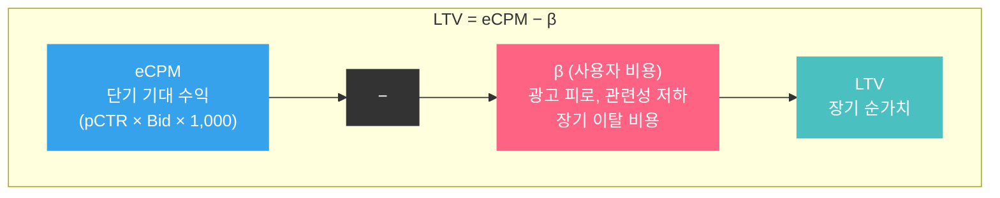
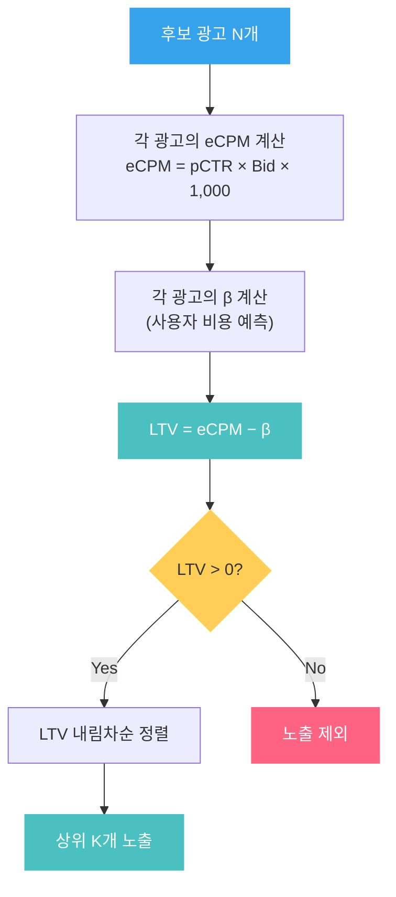
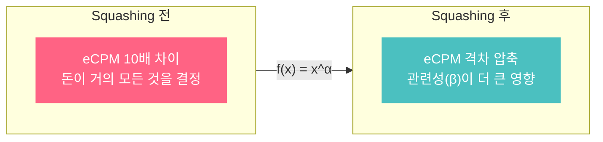

"이 광고를 1등으로 노출하면 당장 100원을 벌 수 있다. 하지만 유저가 짜증을 느끼고 내일 돌아오지 않으면?" — eCPM 랭킹만으로는 이 질문에 답할 수 없습니다. 이 글은 eCPM을 넘어 **광고 노출의 장기적 순가치**를 측정하는 LTV(Long Term Value) 개념을 소개하고, 왜 대부분의 광고 플랫폼이 eCPM이 아닌 LTV로 랭킹을 결정하는지 해부합니다.

> 이 글은 [eCPM과 광고 랭킹](post.html?id=ecpm-ranking) 포스트의 연장선입니다. eCPM의 정의와 계산법을 먼저 읽으면 이해가 쉽습니다.

---

## 1. eCPM 랭킹의 한계

[eCPM 포스트](post.html?id=ecpm-ranking)에서 정리했듯이, eCPM은 **1,000회 노출당 기대 수익**입니다:

$$eCPM = pCTR \times Bid \times 1{,}000$$

eCPM이 높은 순서대로 광고를 정렬하면, 플랫폼의 **단기 수익은 최대화**됩니다. 그런데 왜 이것만으로는 부족할까요?

### 편의점 비유

편의점 주인이 진열대를 수익 극대화 기준으로만 배치한다고 생각해 봅시다:

- 마진이 가장 높은 에너지 드링크를 눈높이 선반에 **10종** 나열
- 고객이 찾는 생수, 우유, 도시락은 구석으로 밀림
- 단기적으로 에너지 드링크 매출은 오르지만, 고객은 "이 편의점은 내가 원하는 게 없다"며 발길을 돌림

광고 플랫폼도 마찬가지입니다:

| eCPM만 최적화하면 | 결과 |
|---|---|
| 입찰가 높은 광고가 항상 1등 | 관련성 낮은 광고 반복 노출 |
| 유저 경험 무시 | **Ad Fatigue**(광고 피로) 누적 |
| 클릭률 하락 | 광고주 ROI 악화 → 예산 삭감 |
| 트래픽 이탈 | 플랫폼 장기 매출 감소 |

**단기 수익 극대화가 장기 수익을 갉아먹는 구조**입니다. 이 문제를 해결하기 위해 등장한 것이 **LTV(Long Term Value)** 개념입니다.

---

## 2. LTV란 무엇인가

LTV(Long Term Value)는 광고 노출 1회가 플랫폼에 가져다주는 **장기적 순가치**입니다. 핵심 아이디어는 단순합니다:

$$LTV = eCPM - \beta$$

- $eCPM$ : 이 광고를 노출했을 때 얻는 **단기 기대 수익**
- $\beta$ (베타) : 이 광고를 노출했을 때 발생하는 **사용자 비용** (user cost, 또는 CPM cost)

### 직관적 해석

"이 광고를 보여줬을 때 **버는 돈(eCPM)**에서 **잃는 가치(β)**를 뺀 나머지"입니다.



### β가 왜 필요한가

β가 없으면(β = 0) LTV = eCPM이 되어, 순수하게 돈만 보는 랭킹이 됩니다. β를 도입함으로써:

- 관련성 낮은 광고 → β가 커짐 → LTV가 낮아져 순위가 밀림
- 관련성 높은 광고 → β가 작음 → LTV가 높아져 상위 노출
- LTV < 0인 광고 → **아예 노출하지 않음** (유저에게 해롭기만 한 광고)

이것은 eCPM 포스트에서 다뤘던 Walled Garden의 **품질 점수** 개념을 수학적으로 일반화한 것입니다. 품질이 낮은 광고는 β가 커져서, 아무리 높은 입찰가를 써도 LTV 기준으로 밀릴 수 있습니다.

---

## 3. 사용자 비용(β)의 이해

β는 "이 광고를 보여줬을 때 유저가 치르는 비용"을 화폐 단위로 환산한 값입니다. 유저가 직접 돈을 내는 것은 아니지만, 플랫폼 입장에서 **장기적으로 잃게 되는 가치**를 뜻합니다.

### Ad Fatigue와 Ad Blindness

**Ad Fatigue**(광고 피로)는 동일하거나 관련 없는 광고에 반복 노출될 때 유저가 느끼는 짜증과 무관심입니다. 이것이 누적되면 **Ad Blindness**(광고 무시)로 이어집니다 — 유저가 광고 영역 자체를 의식적으로 회피하게 되는 현상입니다.

### β에 영향을 주는 요소들

| 요소 | β가 커지는 경우 | β가 작아지는 경우 |
|------|----------------|------------------|
| **관련성** | 유저 의도와 무관한 광고 | 검색어/관심사와 정확히 매칭 |
| **빈도** | 같은 광고 반복 노출 (frequency capping 없음) | 적절한 빈도 제어 |
| **품질** | 저품질 소재, 미스리딩 제목 | 깔끔한 소재, 명확한 CTA |
| **침투성** | 전면 팝업, 자동 재생 영상 | 네이티브 광고, 자연스러운 배치 |
| **유저 맥락** | 긴급한 정보 탐색 중 광고 삽입 | 쇼핑/탐색 의도가 있는 맥락 |

### 식당 비유

식당 메뉴판에 광고를 끼워넣는다고 상상해 봅시다:

- **β가 작은 경우**: 메뉴판 하단에 "이 식당의 인기 디저트" 추천 → 자연스러움, 오히려 도움
- **β가 큰 경우**: 메뉴판 한가운데에 관련 없는 보험 광고 삽입 → 짜증, 재방문율 하락

β는 이 "짜증"을 **돈으로 환산한 것**입니다. "이 광고 때문에 유저 한 명이 이탈하면, 그 유저의 미래 방문에서 발생했을 수익 × 이탈 확률"과 같은 방식으로 추정합니다.

### β의 추정 방법 (일반론)

실무에서 β를 추정하는 대표적인 접근법은 다음과 같습니다:

1. **과거 데이터 기반**: 광고 노출 후 유저 이탈률, 재방문 주기 변화를 측정
2. **A/B 테스트**: 광고를 보여준 그룹 vs 보여주지 않은 그룹의 장기 행동 비교
3. **유저 피드백 신호**: "광고 숨기기", "관련 없음" 클릭 비율을 β의 proxy로 활용
4. **모델 학습**: 유저/광고/맥락 피처를 입력으로 β를 예측하는 ML 모델 구축

---

## 4. LTV 기반 랭킹이 동작하는 방식

LTV 기반 랭킹은 다음 절차로 동작합니다:



### 숫자 예제: 세 광고의 경쟁

검색어 "여행 가방"에 대해 세 광고가 경쟁하는 상황입니다:

| 항목 | 광고 A (명품 가방) | 광고 B (여행용 캐리어) | 광고 C (다이어트 약) |
|------|------------------|---------------------|-------------------|
| Bid (CPC) | 3,000원 | 1,500원 | 5,000원 |
| pCTR | 2% | 5% | 0.3% |
| **eCPM** | $0.02 \times 3{,}000 \times 1{,}000 = $ **60,000원** | $0.05 \times 1{,}500 \times 1{,}000 = $ **75,000원** | $0.003 \times 5{,}000 \times 1{,}000 = $ **15,000원** |
| β (사용자 비용) | 25,000원 | 5,000원 | 20,000원 |
| **LTV** | 60,000 − 25,000 = **35,000원** | 75,000 − 5,000 = **70,000원** | 15,000 − 20,000 = **−5,000원** |
| **결과** | 2위 | **1위** | **노출 제외** |

핵심 포인트:

1. **eCPM 기준이었다면 광고 B(75,000)가 1위, 광고 A(60,000)가 2위, 광고 C(15,000)가 3위**였을 것입니다. LTV에서도 1~2위 순서는 같지만, 3위인 광고 C는 **아예 노출되지 않습니다**.
2. 광고 C는 eCPM이 양수(15,000원)이므로 eCPM 랭킹에서는 노출됩니다. 하지만 β가 eCPM보다 커서 **LTV < 0**, 즉 "보여주면 손해"인 광고입니다. "여행 가방"을 검색한 유저에게 다이어트 약 광고는 관련성이 없어 β가 높습니다.
3. 광고 B(여행용 캐리어)는 입찰가가 가장 낮지만, **검색 의도와 완벽히 매칭**되어 β가 작고 pCTR도 높아 LTV 1위를 차지합니다.

```python
def compute_ltv(pCTR, bid, beta):
    """LTV = eCPM - β"""
    ecpm = pCTR * bid * 1000
    ltv = ecpm - beta
    return ecpm, ltv

ads = [
    {"name": "광고A(명품 가방)",   "pCTR": 0.02, "bid": 3000, "beta": 25000},
    {"name": "광고B(여행용 캐리어)", "pCTR": 0.05, "bid": 1500, "beta": 5000},
    {"name": "광고C(다이어트 약)",  "pCTR": 0.003, "bid": 5000, "beta": 20000},
]

print("  검색어: '여행 가방'\n")
ranked = []
for ad in ads:
    ecpm, ltv = compute_ltv(ad["pCTR"], ad["bid"], ad["beta"])
    status = "노출" if ltv > 0 else "제외 (LTV < 0)"
    print(f"  {ad['name']}: eCPM={ecpm:,.0f}원, β={ad['beta']:,.0f}원, "
          f"LTV={ltv:,.0f}원 → {status}")
    if ltv > 0:
        ranked.append((ad["name"], ltv))

ranked.sort(key=lambda x: -x[1])
print(f"\n  최종 랭킹:")
for i, (name, ltv) in enumerate(ranked, 1):
    print(f"    {i}위: {name} (LTV {ltv:,.0f}원)")
```

---

## 5. Squashing: 입찰가 격차를 압축하기

LTV 공식에는 한 가지 더 고려할 사항이 있습니다. eCPM 부분에서 **입찰가 차이가 지나치게 큰 경우**, 관련성(β)이 아무리 좋아도 돈의 힘을 이기지 못하는 문제입니다.

### 문제: 돈이 품질을 압도하는 경우

| 광고 | Bid | pCTR | eCPM | β | LTV |
|------|-----|------|------|---|-----|
| 대기업 A | 50,000원 | 1% | 500,000원 | 100,000원 | 400,000원 |
| 스타트업 B | 500원 | 10% | 50,000원 | 5,000원 | 45,000원 |

대기업 A는 관련성이 낮아 β가 10만원이나 되지만, 입찰가가 100배 높아서 LTV에서도 압도합니다. 유저에게는 스타트업 B의 광고가 훨씬 유용한데도 말이죠.

### Squashing Function의 도입

이 문제를 해결하기 위해, eCPM에 **오목 함수(concave function)**를 적용합니다:

$$LTV = f(eCPM) - \beta$$

여기서 $f$는 오목 함수입니다. 대표적으로:

$$f(x) = x^{\alpha}, \quad 0 < \alpha < 1$$

예를 들어 $\alpha = 0.5$ (제곱근)이면:

$$LTV = \sqrt{eCPM} - \beta$$

### Squashing의 효과

$\alpha = 0.5$를 적용해 봅시다:

| 광고 | eCPM | $\sqrt{eCPM}$ | β | LTV (Squashed) |
|------|------|--------------|---|-----------------|
| 대기업 A | 500,000원 | 707 | 100,000원 | **−99,293** |
| 스타트업 B | 50,000원 | 224 | 5,000원 | **−4,776** |

위 예제에서는 squashing이 극단적으로 적용되어 둘 다 음수가 되었습니다. 실제로는 $\alpha$와 β의 스케일을 조정하여 균형을 맞춥니다. 핵심은 **입찰가 격차가 압축된다**는 점입니다:

- Squashing 전: eCPM 비율 = 500,000 / 50,000 = **10배**
- Squashing 후: $\sqrt{eCPM}$ 비율 = 707 / 224 ≈ **3.2배**

10배의 입찰가 차이가 3.2배로 압축됩니다. 이렇게 되면 β(관련성)가 랭킹에 미치는 영향이 상대적으로 커집니다.



### 왜 오목 함수인가

오목 함수의 핵심 성질은 **"이미 큰 값의 증가분을 체감시키는 것"**입니다:

- $\sqrt{100} = 10$, $\sqrt{400} = 20$ → 4배 차이가 2배로 압축
- $\sqrt{10{,}000} = 100$, $\sqrt{40{,}000} = 200$ → 동일하게 2배

이 성질 덕분에 입찰가가 극단적으로 높은 광고의 "돈의 힘"이 줄어들고, **관련성이 높은 광고가 합리적인 입찰가로도 경쟁할 수 있는 구조**를 만듭니다.

> Squashing은 [Calibration](post.html?id=calibration) 이후 단계에서 적용됩니다. pCTR이 잘 보정되어 있지 않으면 eCPM 자체가 왜곡되므로, Squashing의 효과도 제대로 발휘되지 않습니다.

---

## 6. GSP 경매에서의 LTV

LTV는 랭킹뿐 아니라 **과금**에도 영향을 줍니다. 대부분의 CPC 기반 광고 플랫폼은 **GSP(Generalized Second Price)** 경매를 사용하는데, LTV 기반 랭킹에서 GSP 과금이 어떻게 동작하는지 살펴보겠습니다.

### GSP의 기본 원칙

GSP에서 각 위치의 광고주는 **자신의 바로 아래 순위 광고가 해당 위치를 차지하기 위해 필요한 최소 금액**을 지불합니다. LTV 기반 랭킹에서는:

$$CPC_{\text{실제}} = \frac{LTV_{\text{next}} + \beta_{\text{me}}}{pCTR_{\text{me}} \times 1{,}000}$$

직관적으로: "내 바로 아래 광고의 LTV를 이기기 위해 필요한 최소 eCPM"을 역산하여, 그에 해당하는 CPC를 내는 것입니다.

### 숫자 예제

앞선 "여행 가방" 예제에서 1위인 광고 B의 실제 과금을 계산해 봅시다:

- 광고 B(1위): pCTR = 5%, β = 5,000원
- 광고 A(2위): LTV = 35,000원

$$CPC_{\text{B}} = \frac{35{,}000 + 5{,}000}{0.05 \times 1{,}000} = \frac{40{,}000}{50} = 800\text{원}$$

광고 B는 1,500원을 입찰했지만, 실제로는 **800원만 과금**됩니다. 이것이 GSP의 특성 — 입찰가보다 낮은 금액을 지불합니다.

---

## 7. 정리: eCPM vs LTV

| 비교 항목 | eCPM 랭킹 | LTV 랭킹 |
|----------|----------|---------|
| **공식** | $pCTR \times Bid \times 1{,}000$ | $f(eCPM) - \beta$ |
| **최적화 목표** | 단기 수익 최대화 | 장기 순가치 최대화 |
| **사용자 경험** | 고려하지 않음 | β로 명시적 반영 |
| **관련성 낮은 광고** | 입찰가 높으면 1위 가능 | β가 커서 순위 하락 또는 노출 제외 |
| **LTV < 0인 광고** | 노출됨 (eCPM > 0이면) | **노출 제외** |
| **입찰가 격차** | 선형 반영 | Squashing으로 압축 |
| **장기 효과** | 유저 이탈 → 트래픽 감소 리스크 | 유저 경험 보호 → 지속 가능한 성장 |

### 핵심 요약

1. **eCPM은 "얼마나 벌 수 있는가"**, LTV는 **"벌고 나서 순수하게 남는 가치는 얼마인가"**입니다. 그 차이가 바로 사용자 비용 β입니다.

2. **β는 광고가 유저에게 미치는 부정적 영향**을 화폐 단위로 환산한 것입니다. 관련성이 높으면 β가 작고, 관련성이 없거나 품질이 낮으면 β가 커집니다.

3. **LTV < 0인 광고는 노출하지 않습니다.** "보여주면 벌기보다 잃는 게 많다"는 뜻이므로, 플랫폼 입장에서 빈 지면으로 두는 것이 더 낫습니다.

4. **Squashing Function**은 입찰가 격차를 압축하여, 돈만으로 이기는 구조를 방지합니다. 이를 통해 관련성 높은 광고가 합리적인 입찰가로도 경쟁할 수 있는 환경을 만듭니다.

5. LTV는 결국 **"돈"과 "경험"의 균형점**입니다. 플랫폼은 광고 수익이 필요하지만, 유저 경험을 해치면 트래픽 자체가 줄어 장기 수익이 감소합니다. LTV는 이 트레이드오프를 하나의 수식으로 표현한 것입니다.

> 다음 단계로, DSP가 eCPM을 기반으로 1st Price Auction에서 입찰가를 최적화하는 방법은 [Bid Shading](post.html?id=bid-shading-censored)에서, 예산을 하루 동안 균등하게 분배하는 전략은 [Auto-Bidding & Budget Pacing](post.html?id=auto-bidding-pacing)에서 다루고 있습니다.
