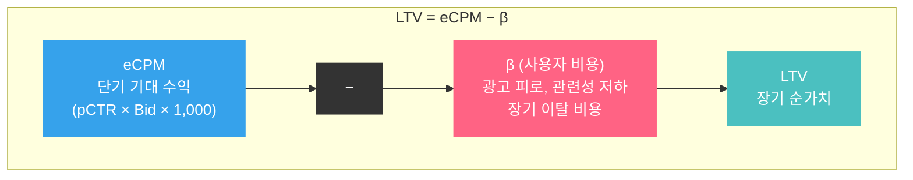
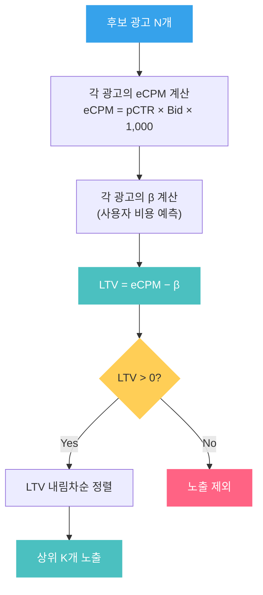
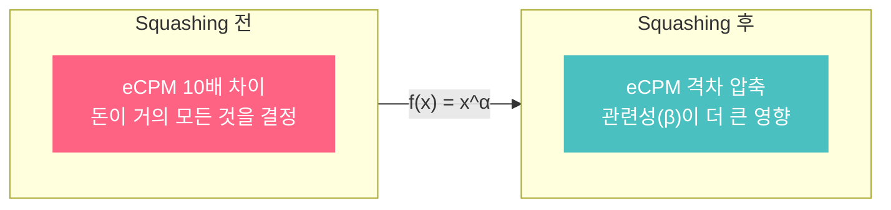

"이 광고를 1등으로 노출하면 당장 100원을 벌 수 있다. 하지만 유저가 짜증을 느끼고 내일 돌아오지 않으면?" — eCPM 랭킹만으로는 이 질문에 답할 수 없습니다. 이 글은 eCPM을 넘어 **광고 노출의 장기적 순가치**를 측정하는 LTV(Long Term Value) 개념을 소개합니다. 그리고 왜 대부분의 광고 플랫폼이 eCPM이 아닌 LTV로 랭킹을 결정하는지 해부합니다.

> 이 글은 [eCPM과 광고 랭킹](post.html?id=ecpm-ranking) 포스트의 연장선입니다. eCPM의 정의와 계산법을 먼저 읽으면 이해가 쉽습니다.

---

## 1. eCPM 랭킹의 한계

[eCPM 포스트](post.html?id=ecpm-ranking)에서 정리했듯이, eCPM은 **1,000회 노출당 기대 수익**입니다.

$$eCPM = pCTR \times Bid \times 1{,}000$$

eCPM이 높은 순서대로 광고를 정렬하면, 플랫폼의 **단기 수익은 최대화**됩니다. 그런데 왜 이것만으로는 부족할까요?

### 편의점 비유

편의점 주인이 진열대를 수익 극대화 기준으로만 배치한다고 생각해 봅시다.

- 마진이 가장 높은 에너지 드링크를 눈높이 선반에 **10종** 나열
- 고객이 찾는 생수, 우유, 도시락은 구석으로 밀림
- 단기적으로 에너지 드링크 매출은 오르지만, 고객은 "이 편의점은 내가 원하는 게 없다"며 발길을 돌림

광고 플랫폼도 마찬가지입니다.

| eCPM만 최적화하면 | 결과 |
|---|---|
| 입찰가 높은 광고가 항상 1등 | 관련성 낮은 광고 반복 노출 |
| 유저 경험 무시 | **Ad Fatigue**(광고 피로) 누적 |
| 클릭률 하락 | 광고주 ROI 악화 → 예산 삭감 |
| 트래픽 이탈 | 플랫폼 장기 매출 감소 |

**단기 수익 극대화가 장기 수익을 갉아먹는 구조**입니다. 이 문제를 해결하기 위해 등장한 것이 **LTV(Long Term Value)** 개념입니다.

---

## 2. LTV란 무엇인가

LTV(Long Term Value)는 광고 노출 1회가 플랫폼에 가져다주는 **장기적 순가치**입니다. 핵심 아이디어는 단순합니다:

$$LTV = eCPM - \beta$$

- $eCPM$ : 이 광고를 노출했을 때 얻는 **단기 기대 수익**
- $\beta$ (베타) : 이 광고를 노출했을 때 발생하는 **사용자 비용** (user cost, 또는 CPM cost)

### 직관적 해석

"이 광고를 보여줬을 때 **버는 돈(eCPM)**에서 **잃는 가치(β)**를 뺀 나머지"입니다.


```mermaid
graph LR
    subgraph LTV_Formula["LTV = eCPM − β"]
        direction LR
        ECPM["eCPM<br/>단기 기대 수익<br/>(pCTR × Bid × 1,000)"]
        MINUS["−"]
        BETA["β (사용자 비용)<br/>광고 피로, 관련성 저하<br/>장기 이탈 비용"]
        RESULT["LTV<br/>장기 순가치"]

        ECPM --> MINUS --> BETA
        BETA --> RESULT
    end

    style ECPM fill:#36a2eb,stroke:#36a2eb,color:#fff
    style BETA fill:#ff6384,stroke:#ff6384,color:#fff
    style RESULT fill:#4bc0c0,stroke:#4bc0c0,color:#fff
    style MINUS fill:#333,stroke:#333,color:#fff
```

### β가 왜 필요한가

β가 없으면(β = 0) LTV = eCPM이 되어, 순수하게 돈만 보는 랭킹이 됩니다. β를 도입함으로써:

- 관련성 낮은 광고 → β가 커짐 → LTV가 낮아져 순위가 밀림
- 관련성 높은 광고 → β가 작음 → LTV가 높아져 상위 노출
- LTV < 0인 광고 → **아예 노출하지 않음** (유저에게 해롭기만 한 광고)

이것은 eCPM 포스트에서 다뤘던 Walled Garden의 **품질 점수** 개념을 수학적으로 일반화한 것입니다. 품질이 낮은 광고는 β가 커져서, 아무리 높은 입찰가를 써도 LTV 기준으로 밀릴 수 있습니다.

---

## 3. 사용자 비용(β)의 이해

β는 "이 광고를 보여줬을 때 유저가 치르는 비용"을 화폐 단위로 환산한 값입니다. 유저가 직접 돈을 내는 것은 아니지만, 플랫폼 입장에서 **장기적으로 잃게 되는 가치**를 뜻합니다.

### Ad Fatigue와 Ad Blindness

**Ad Fatigue**(광고 피로)는 동일하거나 관련 없는 광고에 반복 노출될 때 유저가 느끼는 짜증과 무관심입니다. 이것이 누적되면 **Ad Blindness**(광고 무시)로 이어집니다 — 유저가 광고 영역 자체를 의식적으로 회피하게 되는 현상입니다.

### β에 영향을 주는 요소들

| 요소 | β가 커지는 경우 | β가 작아지는 경우 |
|------|----------------|------------------|
| **관련성** | 유저 의도와 무관한 광고 | 검색어/관심사와 정확히 매칭 |
| **빈도** | 같은 광고 반복 노출 (frequency capping 없음) | 적절한 빈도 제어 |
| **품질** | 저품질 소재, 미스리딩 제목 | 깔끔한 소재, 명확한 CTA |
| **침투성** | 전면 팝업, 자동 재생 영상 | 네이티브 광고, 자연스러운 배치 |
| **유저 맥락** | 긴급한 정보 탐색 중 광고 삽입 | 쇼핑/탐색 의도가 있는 맥락 |

### 식당 비유

식당 메뉴판에 광고를 끼워넣는다고 상상해 봅시다:

- **β가 작은 경우**: 메뉴판 하단에 "이 식당의 인기 디저트" 추천 → 자연스러움, 오히려 도움
- **β가 큰 경우**: 메뉴판 한가운데에 관련 없는 보험 광고 삽입 → 짜증, 재방문율 하락

β는 이 "짜증"을 **돈으로 환산한 것**입니다. "이 광고 때문에 유저 한 명이 이탈하면, 그 유저의 미래 방문에서 발생했을 수익 × 이탈 확률"과 같은 방식으로 추정합니다.

### β의 추정 방법 (일반론)

실무에서 β를 추정하는 대표적인 접근법은 다음과 같습니다.

1. **과거 데이터 기반**: 광고 노출 후 유저 이탈률, 재방문 주기 변화를 측정
2. **A/B 테스트**: 광고를 보여준 그룹 vs 보여주지 않은 그룹의 장기 행동 비교
3. **유저 피드백 신호**: "광고 숨기기", "관련 없음" 클릭 비율을 β의 proxy로 활용
4. **모델 학습**: 유저/광고/맥락 피처를 입력으로 β를 예측하는 ML 모델 구축

β를 직접 만지면서 실험해 볼 수 있습니다. 반복 노출로 반응이 식어가는 속도, 그리고 몇 번째 노출부터 "적정 빈도"를 넘는지를 슬라이더로 직접 바꿔 보세요.

<div class="demo-embed-wrap">
<iframe class="demo-embed" src="demo-frequency-capping.html?embed=1" height="560" loading="lazy" title="광고 피로와 최적 빈도 상한 미니 데모"></iframe>
<a class="demo-embed-open" href="demo-frequency-capping.html" target="_blank" rel="noopener">↗ 전체 데모로 열기</a>
</div>

---

## 4. LTV 기반 랭킹이 동작하는 방식

LTV 기반 랭킹은 다음 절차로 동작합니다.


```mermaid
flowchart TD
    A["후보 광고 N개"] --> B["각 광고의 eCPM 계산<br/>eCPM = pCTR × Bid × 1,000"]
    B --> C["각 광고의 β 계산<br/>(사용자 비용 예측)"]
    C --> D["LTV = eCPM − β"]
    D --> E{"LTV > 0?"}
    E -->|Yes| F["LTV 내림차순 정렬"]
    E -->|No| G["노출 제외"]
    F --> H["상위 K개 노출"]

    style A fill:#36a2eb,stroke:#36a2eb,color:#fff
    style D fill:#4bc0c0,stroke:#4bc0c0,color:#fff
    style E fill:#ffce56,stroke:#ffce56,color:#333
    style G fill:#ff6384,stroke:#ff6384,color:#fff
    style H fill:#4bc0c0,stroke:#4bc0c0,color:#fff
```

### 숫자 예제: 세 광고의 경쟁

검색어 "여행 가방"에 대해 세 광고가 경쟁하는 상황입니다.

| 항목 | 광고 A (명품 가방) | 광고 B (여행용 캐리어) | 광고 C (다이어트 약) |
|------|------------------|---------------------|-------------------|
| Bid (CPC) | 3,000원 | 1,500원 | 5,000원 |
| pCTR | 2% | 5% | 0.3% |
| **eCPM** | $0.02 \times 3{,}000 \times 1{,}000 = $ **60,000원** | $0.05 \times 1{,}500 \times 1{,}000 = $ **75,000원** | $0.003 \times 5{,}000 \times 1{,}000 = $ **15,000원** |
| β (사용자 비용) | 25,000원 | 5,000원 | 20,000원 |
| **LTV** | 60,000 − 25,000 = **35,000원** | 75,000 − 5,000 = **70,000원** | 15,000 − 20,000 = **−5,000원** |
| **결과** | 2위 | **1위** | **노출 제외** |

핵심 포인트:

1. **eCPM 기준이었다면 광고 B(75,000)가 1위, 광고 A(60,000)가 2위, 광고 C(15,000)가 3위**였을 것입니다. LTV에서도 1~2위 순서는 같지만, 3위인 광고 C는 **아예 노출되지 않습니다**.
2. 광고 C는 eCPM이 양수(15,000원)이므로 eCPM 랭킹에서는 노출됩니다. 하지만 β가 eCPM보다 커서 **LTV < 0**, 즉 "보여주면 손해"인 광고입니다. "여행 가방"을 검색한 유저에게 다이어트 약 광고는 관련성이 없어 β가 높습니다.
3. 광고 B(여행용 캐리어)는 입찰가가 가장 낮지만, **검색 의도와 완벽히 매칭**되어 β가 작고 pCTR도 높아 LTV 1위를 차지합니다.

```python
def compute_ltv(pCTR, bid, beta):
    """LTV = eCPM - β"""
    ecpm = pCTR * bid * 1000
    ltv = ecpm - beta
    return ecpm, ltv

ads = [
    {"name": "광고A(명품 가방)",   "pCTR": 0.02, "bid": 3000, "beta": 25000},
    {"name": "광고B(여행용 캐리어)", "pCTR": 0.05, "bid": 1500, "beta": 5000},
    {"name": "광고C(다이어트 약)",  "pCTR": 0.003, "bid": 5000, "beta": 20000},
]

print("  검색어: '여행 가방'\n")
ranked = []
for ad in ads:
    ecpm, ltv = compute_ltv(ad["pCTR"], ad["bid"], ad["beta"])
    status = "노출" if ltv > 0 else "제외 (LTV < 0)"
    print(f"  {ad['name']}: eCPM={ecpm:,.0f}원, β={ad['beta']:,.0f}원, "
          f"LTV={ltv:,.0f}원 → {status}")
    if ltv > 0:
        ranked.append((ad["name"], ltv))

ranked.sort(key=lambda x: -x[1])
print(f"\n  최종 랭킹:")
for i, (name, ltv) in enumerate(ranked, 1):
    print(f"    {i}위: {name} (LTV {ltv:,.0f}원)")

# 출력:
#   검색어: '여행 가방'
#
#   광고A(명품 가방): eCPM=60,000원, β=25,000원, LTV=35,000원 → 노출
#   광고B(여행용 캐리어): eCPM=75,000원, β=5,000원, LTV=70,000원 → 노출
#   광고C(다이어트 약): eCPM=15,000원, β=20,000원, LTV=-5,000원 → 제외 (LTV < 0)
#
#   최종 랭킹:
#     1위: 광고B(여행용 캐리어) (LTV 70,000원)
#     2위: 광고A(명품 가방) (LTV 35,000원)
#
# eCPM만 보면 A(60,000)가 C(15,000)보다 훨씬 앞이고 셋 다 노출 후보다.
# 사용자 비용 β를 빼면 C는 LTV가 음수가 되어 아예 탈락한다.
# 지금 당장 버는 돈보다, 그 노출이 사용자를 얼마나 지치게 하는지가 순위를 가른다.
```

---

## 5. 단기 eCPM과 90일 LTV — 순위가 뒤집히는 경우

**단기 eCPM 1위 광고가 90일 LTV 기준으로는 4위로 밀릴 수 있습니다. 클릭은 잘 되지만 다시 안 사는 손님과, 클릭은 적어도 계속 사는 손님의 차이입니다.**

마트 시식 코너를 생각해 봅시다. 반값 할인 스티커를 붙인 상품은 오늘 확실히 잘 팔립니다. 그런데 그 손님이 다음 달에도 이 마트에 와서 정가로 같은 상품을 사갈까요? 대부분 아닙니다. 반대로 정기배송 상품은 오늘 매대에서 손님을 하나 덜 잡더라도, 그 손님이 석 달 동안 매달 결제합니다.

앞서 다룬 LTV는 **"이 광고를 보여주는 비용(β)"을 뺀 값**이었습니다. 이번엔 다른 축을 봅니다. **"이 클릭이 만들어내는 손님이 앞으로 얼마나 오래, 얼마나 자주 다시 사는가"** — 즉 가치 자체가 얼마나 큰가를 보는 것입니다. 비용(β)을 빼는 쪽이 아니라, 미래 가치를 더하는 쪽입니다.

이걸 반영하려면 eCPM 공식에서 손볼 곳이 하나 있습니다. 원래 eCPM은 `pCTR × 입찰가 × 1,000`이었습니다. 여기서 **입찰가(이번 한 번의 즉시 가치) 대신 '이 손님이 앞으로 90일간 남길 총가치'를 넣으면** 됩니다.

$$\text{LTV 기준 점수} = pCTR \times (\text{90일 고객 LTV}) \times 1{,}000$$

즉 "이 클릭 하나가 장기적으로 얼마짜리 손님을 남기는가"를 재는 것입니다. pCTR은 그대로 두고, 곱해지는 '가치' 항목만 바꾼 셈입니다.

말로는 감이 안 오니 다섯 광고로 직접 비교해 봅시다.

| 광고 | 입찰가(CPC) | pCTR | 단기 eCPM | 단기 순위 | 예상 재구매율(90일) | 90일 LTV | LTV 순위 |
|---|---|---|---|---|---|---|---|
| 반값특가 무선이어폰 | 1,500원 | 8.0% | 120,000원 | **1위** | 5% | 25,000원 | 4위 |
| 미스터리박스 반짝특가 | 1,100원 | 6.0% | 66,000원 | 2위 | 8% | 30,000원 | 5위 |
| 브랜드 비타민 3개월분 | 1,000원 | 4.0% | 40,000원 | 3위 | 50% | 52,000원 | 3위 |
| 유아용 기저귀 정기배송 | 700원 | 3.5% | 24,500원 | 4위 | 60% | 180,000원 | **1위** |
| 원두커피 정기구독 | 800원 | 3.0% | 24,000원 | 5위 | 55% | 150,000원 | 2위 |

표의 1행과 4행을 나란히 봅시다. **반값특가 무선이어폰은 단기 eCPM으로 1위지만, LTV 순위로는 4위로 내려앉습니다.** 입찰가도 높고 클릭도 잘 되지만, 재구매율이 5%뿐이라 이 손님은 대개 이번 한 번으로 끝납니다. 반대로 **기저귀 정기배송은 단기 eCPM 4위(입찰가도 낮고 클릭률도 낮습니다)인데, 재구매율이 60%라 LTV 순위로는 1위로 올라옵니다.** 한 번 자리 잡으면 석 달 동안 여러 번 결제하는 손님을 데려오기 때문입니다.

파이썬으로 그대로 확인해 보겠습니다.

```python
# 5개 광고의 '단기 eCPM 순위'와 '90일 LTV 순위'를 각각 계산해 비교한다.
# 표준 라이브러리만 쓰니 그대로 복붙해 돌려볼 수 있다.
ads = [
    # 광고명, 입찰가(CPC,원), pCTR, 예상 재구매율(90일), 90일 LTV(원)
    {"name": "반값특가 무선이어폰",   "bid": 1500, "pctr": 0.080, "repurchase": 0.05, "ltv90": 25_000},
    {"name": "미스터리박스 반짝특가", "bid": 1100, "pctr": 0.060, "repurchase": 0.08, "ltv90": 30_000},
    {"name": "브랜드 비타민 3개월분", "bid": 1000, "pctr": 0.040, "repurchase": 0.50, "ltv90": 52_000},
    {"name": "유아용 기저귀 정기배송", "bid": 700,  "pctr": 0.035, "repurchase": 0.60, "ltv90": 180_000},
    {"name": "원두커피 정기구독",     "bid": 800,  "pctr": 0.030, "repurchase": 0.55, "ltv90": 150_000},
]

for ad in ads:
    ad["ecpm"] = ad["pctr"] * ad["bid"] * 1000         # 단기: 이번 클릭이 지금 버는 돈
    ad["ltv_score"] = ad["pctr"] * ad["ltv90"] * 1000  # 장기: 이번 클릭이 남기는 손님의 90일 가치

def rank_by(key):                                       # 점수 내림차순으로 순위 매기기
    ordered = sorted(ads, key=lambda a: -a[key])
    return {a["name"]: i + 1 for i, a in enumerate(ordered)}

ecpm_rank = rank_by("ecpm")
ltv_rank = rank_by("ltv_score")

print(f"{'광고':<22}{'단기eCPM':>10}{'eCPM순위':>9}{'LTV점수':>13}{'LTV순위':>8}  변동")
for ad in sorted(ads, key=lambda a: ecpm_rank[a["name"]]):
    name = ad["name"]
    delta = ecpm_rank[name] - ltv_rank[name]            # 양수면 LTV로 갈수록 순위가 내려간 것
    mark = f"{delta:+d}" if delta else "-"
    print(f"{name:<22}{ad['ecpm']:>9,.0f}원{ecpm_rank[name]:>7}위{ad['ltv_score']:>12,.0f}{ltv_rank[name]:>7}위  {mark}")

# 출력:
# 광고                        단기eCPM   eCPM순위        LTV점수   LTV순위  변동
# 반값특가 무선이어폰              120,000원      1위   2,000,000      4위  -3
# 미스터리박스 반짝특가              66,000원      2위   1,800,000      5위  -3
# 브랜드 비타민 3개월분             40,000원      3위   2,080,000      3위  -
# 유아용 기저귀 정기배송             24,500원      4위   6,300,000      1위  +3
# 원두커피 정기구독                24,000원      5위   4,500,000      2위  +3
```

eCPM 1위였던 이어폰과 2위였던 미스터리박스는 둘 다 LTV 순위에서 3계단씩 떨어집니다. 공통점은 재구매율이 5%, 8%로 바닥이라는 점입니다. 반대로 기저귀·커피는 재구매율이 55~60%라 3계단씩 뛰어오릅니다. **입찰가·pCTR이 아니라 재구매율이 순위를 뒤집는 변수입니다.**

그런데 이 "90일 LTV"라는 숫자, 지금 당장 어떻게 알 수 있을까요? 광고를 노출하는 순간에는 그 손님이 90일 뒤 재구매할지 아직 아무도 모릅니다.

:::deep 더 깊이 — 90일을 기다릴 수 없다: 초기 신호로 LTV를 예측하는 문제
90일 LTV를 '진짜로' 확인하려면 90일을 기다려야 합니다. 그런데 광고 랭킹은 지금 당장 매겨야 하고, 90일 뒤엔 이미 그 광고 예산은 다 쓰고 없습니다. 기다렸다가 정답을 넣는 건 애초에 불가능합니다.

그래서 실무에서는 **초기 신호로 미래 가치를 미리 추정하는 모델**을 씁니다. 가입·구매 후 7일 동안의 행동을 피처로 씁니다. 첫 구매액, 재방문 횟수, 앱 세션 길이, 장바구니에 남긴 항목 수 같은 신호입니다. 이 피처로 "이 사람의 90일 LTV는 대략 얼마"라고 미리 찍습니다. 이런 모델을 흔히 **pLTV(predicted LTV)**라 부릅니다.

문제는 7일치 신호만으로 90일 뒤를 맞히기가 쉽지 않다는 점입니다. 반값특가 이어폰을 산 손님도 첫 7일의 행동(앱 켜보기, 리뷰 읽기)은 정기구독을 시작한 손님과 크게 다르지 않을 수 있습니다. 진짜 차이, 즉 재구매하느냐 마느냐는 한참 뒤에야 드러납니다.

이 예측 오차가 랭킹에 그대로 번집니다. 아래는 위 표의 '실제 90일 LTV'에 노이즈를 섞어, '7일 신호 기반 예측치'인 척 흉내 낸 것입니다.

```python
# 7일 초기 신호로 90일 LTV를 '예측'한다고 가정하고, 그 오차가 순위를 얼마나 흔드는지 본다.
# 표준 라이브러리만 쓴다. 노이즈는 seed를 고정해 재현 가능하게 만든다.
import random
random.seed(6)

ads = [
    {"name": "반값특가 무선이어폰",   "pctr": 0.080, "ltv90_true": 25_000},
    {"name": "미스터리박스 반짝특가", "pctr": 0.060, "ltv90_true": 30_000},
    {"name": "브랜드 비타민 3개월분", "pctr": 0.040, "ltv90_true": 52_000},
    {"name": "유아용 기저귀 정기배송", "pctr": 0.035, "ltv90_true": 180_000},
    {"name": "원두커피 정기구독",     "pctr": 0.030, "ltv90_true": 150_000},
]
NOISE = 0.35   # 7일 신호만으로 90일 값을 맞히는 모델의 예측 오차(표준편차 비율). 이 정도도 낙관적이다.

def rank_by(data, key):
    ordered = sorted(data, key=lambda a: -a[key])
    return {a["name"]: i + 1 for i, a in enumerate(ordered)}

for ad in ads:
    ad["score_true"] = ad["pctr"] * ad["ltv90_true"] * 1000
    predicted = max(ad["ltv90_true"] * (1 + random.gauss(0, NOISE)), 0)  # 예측이 음수일 순 없다
    ad["ltv90_pred"] = predicted
    ad["score_pred"] = ad["pctr"] * predicted * 1000

true_rank = rank_by(ads, "score_true")
pred_rank = rank_by(ads, "score_pred")

print(f"{'광고':<22}{'실제 LTV':>11}{'예측 LTV':>11}{'실제순위':>8}{'예측순위':>8}")
for ad in sorted(ads, key=lambda a: true_rank[a["name"]]):
    name = ad["name"]
    flag = "  <- 순위 오류" if pred_rank[name] != true_rank[name] else ""
    print(f"{name:<22}{ad['ltv90_true']:>10,.0f}{ad['ltv90_pred']:>11,.0f}{true_rank[name]:>7}위{pred_rank[name]:>7}위{flag}")

# 출력:
# 광고                         실제 LTV     예측 LTV    실제순위    예측순위
# 유아용 기저귀 정기배송             180,000    184,607      1위      2위  <- 순위 오류
# 원두커피 정기구독                150,000    227,413      2위      1위  <- 순위 오류
# 브랜드 비타민 3개월분              52,000     37,888      3위      4위  <- 순위 오류
# 반값특가 무선이어폰                25,000     29,372      4위      3위  <- 순위 오류
# 미스터리박스 반짝특가               30,000     11,212      5위      5위
```

노이즈 하나 섞었을 뿐인데 5개 중 4개의 순위가 실제와 어긋납니다. 특히 눈여겨볼 줄은 반값특가 이어폰입니다. 실제로는 4위인데, 예측 모델이 우연히 부풀려 3위로 착시를 일으킵니다. **재구매 안 하는 손님을 재구매할 것처럼 잘못 예측하면, 미끼 광고가 LTV 랭킹에서 다시 위로 올라옵니다.** 예측이 랭킹을 지배하는 한, 예측이 틀리는 방향으로 랭킹도 같이 틀어집니다.

이 구조는 [pCVR 모델링](post.html?id=pcvr-modeling) 글의 '지연 전환' 절에서 다룬 문제와 뼈대가 같습니다. 그 글에서는 "오늘 학습해야 하는데, 어제 클릭한 사람 중 나중에 살 사람의 라벨이 아직 안 왔다"는 문제를 다뤘습니다. 여기서도 구조는 같습니다. 지금 랭킹을 매겨야 하는데, 진짜 결과인 90일 뒤 재구매 여부는 아직 안 왔습니다. 다만 지연의 길이가 다릅니다. 전환은 길어야 며칠에서 몇 주면 대부분 들어오지만, LTV는 그 창이 90일로 훨씬 깁니다. 같은 병인데 증상이 훨씬 심한 셈입니다.
:::

예측 오차 말고 랭킹을 흔드는 변수가 하나 더 있습니다. 설령 90일 LTV를 정확히 예측했다 해도, 그 미래 값을 **지금 당장 얼마로 쳐줄지**는 또 다른 정책 결정입니다.

돈은 지금 받는 게 나중에 받는 것보다 낫습니다. 은행 이자와 같은 이유입니다. 그래서 미래에 들어올 돈은 할인율만큼 깎아 **현재가치(PV, Present Value)**로 환산하는 게 금융의 표준 관행입니다. 90일 LTV 중에서도 **이미 확정된 최초 구매분**은 깎을 필요가 없지만, **아직 오지 않은 재구매분**은 할인 대상입니다.

```python
# 90일 LTV 중 '이미 확정된 몫(최초 구매)'과 '아직 안 온 몫(재구매)'을 나누고,
# 재구매 몫만 할인율로 현재가치(PV)로 환산해 세 번째 순위를 만든다.
ads = [
    {"name": "반값특가 무선이어폰",   "pctr": 0.080, "repurchase": 0.05, "ltv90": 25_000},
    {"name": "미스터리박스 반짝특가", "pctr": 0.060, "repurchase": 0.08, "ltv90": 30_000},
    {"name": "브랜드 비타민 3개월분", "pctr": 0.040, "repurchase": 0.50, "ltv90": 52_000},
    {"name": "유아용 기저귀 정기배송", "pctr": 0.035, "repurchase": 0.60, "ltv90": 180_000},
    {"name": "원두커피 정기구독",     "pctr": 0.030, "repurchase": 0.55, "ltv90": 150_000},
]

MONTHLY_RATE = 0.05   # 월 5% -- "미래 가치를 얼마나 믿는가"를 나타내는 다이얼
MONTHS_OUT = 3        # 재구매분은 대략 90일(3개월) 시점에 들어온다고 가정
discount = 1 / (1 + MONTHLY_RATE) ** MONTHS_OUT   # ≈ 0.864

def rank_by(data, key):
    ordered = sorted(data, key=lambda a: -a[key])
    return {a["name"]: i + 1 for i, a in enumerate(ordered)}

for ad in ads:
    ad["ltv_score"] = ad["pctr"] * ad["ltv90"] * 1000             # 할인 전(위 표의 LTV 점수와 동일)
    immediate = ad["ltv90"] * (1 - ad["repurchase"])              # 최초 구매분 -- 이미 확정, 할인 없음
    future = ad["ltv90"] * ad["repurchase"]                       # 재구매분 -- 아직 안 왔으니 할인 대상
    ad["ltv90_pv"] = immediate + future * discount
    ad["ltv_score_pv"] = ad["pctr"] * ad["ltv90_pv"] * 1000       # 할인 후

before_rank = rank_by(ads, "ltv_score")
after_rank = rank_by(ads, "ltv_score_pv")

print(f"{'광고':<22}{'LTV순위(할인전)':>16}{'LTV순위(할인후)':>16}")
for ad in sorted(ads, key=lambda a: before_rank[a["name"]]):
    name = ad["name"]
    flag = "  <- 순위 변동" if after_rank[name] != before_rank[name] else ""
    print(f"{name:<22}{before_rank[name]:>15}위{after_rank[name]:>15}위{flag}")

# 출력:
# 광고                          LTV순위(할인전)      LTV순위(할인후)
# 유아용 기저귀 정기배송                        1위              1위
# 원두커피 정기구독                           2위              2위
# 브랜드 비타민 3개월분                        3위              4위  <- 순위 변동
# 반값특가 무선이어폰                          4위              3위  <- 순위 변동
# 미스터리박스 반짝특가                         5위              5위
```

3위와 4위가 자리를 바꿨습니다. 비타민(재구매율 50%)은 가치의 절반이 아직 안 온 미래라 할인의 타격을 크게 받습니다. 반면 이어폰(재구매율 5%)은 가치의 95%가 이미 확정된 최초 구매분이라 깎을 것도 별로 없습니다. **미래가 많이 남은 광고일수록 할인율에 더 민감합니다.**

1·2위인 기저귀·커피는 순위가 그대로입니다. 이 둘은 애초 격차가 워낙 커서 월 5% 할인 정도로는 흔들리지 않습니다. 하지만 할인율을 더 올리면, 가령 "이 예측을 반도 못 믿겠다"고 보수적으로 잡으면 격차가 큰 자리도 언젠가 흔들릴 수 있습니다. **결국 할인율은 "이 미래 값을 얼마나 믿을 것인가"를 숫자 하나로 표현한 정책 다이얼입니다.** 다이얼을 어디에 놓느냐에 따라 광고 5개의 줄은 세 번째로 다시 섞입니다.

---

## 6. Squashing: 입찰가 격차를 압축하기

LTV 공식에는 한 가지 더 고려할 사항이 있습니다. eCPM 부분에서 **입찰가 차이가 지나치게 큰 경우**, 관련성(β)이 아무리 좋아도 돈의 힘을 이기지 못하는 문제입니다.

### 문제: 돈이 품질을 압도하는 경우

| 광고 | Bid | pCTR | eCPM | β | LTV |
|------|-----|------|------|---|-----|
| 대기업 A | 50,000원 | 1% | 500,000원 | 100,000원 | 400,000원 |
| 스타트업 B | 500원 | 10% | 50,000원 | 5,000원 | 45,000원 |

대기업 A는 관련성이 낮아 β가 10만원이나 되지만, 입찰가가 100배 높아서 LTV에서도 압도합니다. 유저에게는 스타트업 B의 광고가 훨씬 유용한데도 말이죠.

### Squashing Function의 도입

이 문제를 해결하기 위해, eCPM에 **오목 함수(concave function)**를 적용합니다:

$$LTV = f(eCPM) - \beta$$

여기서 $f$는 오목 함수입니다. 대표적인 형태는 다음과 같습니다.

$$f(x) = x^{\alpha}, \quad 0 < \alpha < 1$$

예를 들어 $\alpha = 0.5$(제곱근)라고 하면 이렇게 됩니다.

$$LTV = \sqrt{eCPM} - \beta$$

### Squashing의 효과

$\alpha = 0.5$를 적용해 보겠습니다.

| 광고 | eCPM | $\sqrt{eCPM}$ | β | LTV (Squashed) |
|------|------|--------------|---|-----------------|
| 대기업 A | 500,000원 | 707 | 100,000원 | **−99,293** |
| 스타트업 B | 50,000원 | 224 | 5,000원 | **−4,776** |

위 예제에서는 squashing이 극단적으로 적용되어 둘 다 음수가 되었습니다. 실제로는 $\alpha$와 β의 스케일을 조정하여 균형을 맞춥니다. 핵심은 **입찰가 격차가 압축된다**는 점입니다:

- Squashing 전: eCPM 비율 = 500,000 / 50,000 = **10배**
- Squashing 후: $\sqrt{eCPM}$ 비율 = 707 / 224 ≈ **3.2배**

10배의 입찰가 차이가 3.2배로 압축됩니다. 이렇게 되면 β(관련성)가 랭킹에 미치는 영향이 상대적으로 커집니다.


```mermaid
graph LR
    subgraph Before["Squashing 전"]
        B1["eCPM 10배 차이<br/>돈이 거의 모든 것을 결정"]
    end
    subgraph After["Squashing 후"]
        A1["eCPM 격차 압축<br/>관련성(β)이 더 큰 영향"]
    end

    Before -->|"f(x) = x^α"| After

    style B1 fill:#ff6384,stroke:#ff6384,color:#fff
    style A1 fill:#4bc0c0,stroke:#4bc0c0,color:#fff
```

### 왜 오목 함수인가

오목 함수의 핵심 성질은 **"이미 큰 값의 증가분을 체감시키는 것"**입니다.

- $\sqrt{100} = 10$, $\sqrt{400} = 20$ → 4배 차이가 2배로 압축
- $\sqrt{10{,}000} = 100$, $\sqrt{40{,}000} = 200$ → 동일하게 2배

이 성질 덕분에 입찰가가 극단적으로 높은 광고의 "돈의 힘"이 줄어듭니다. 그 결과 관련성이 높은 광고가 합리적인 입찰가로도 경쟁할 수 있는 구조가 만들어집니다.

> Squashing은 [Calibration](post.html?id=calibration) 이후 단계에서 적용됩니다. pCTR이 잘 보정되어 있지 않으면 eCPM 자체가 왜곡되므로, Squashing의 효과도 제대로 발휘되지 않습니다.

---

## 7. GSP 경매에서의 LTV

LTV는 랭킹뿐 아니라 **과금**에도 영향을 줍니다. 대부분의 CPC 기반 광고 플랫폼은 GSP(Generalized Second Price) 경매를 사용합니다. 여기서는 LTV 기반 랭킹에서 GSP 과금이 어떻게 동작하는지 살펴보겠습니다.

### GSP의 기본 원칙

GSP에서 각 위치의 광고주는 **자신의 바로 아래 순위 광고가 해당 위치를 차지하기 위해 필요한 최소 금액**을 지불합니다. LTV 기반 랭킹에서는 다음과 같이 계산합니다.

$$CPC_{\text{실제}} = \frac{LTV_{\text{next}} + \beta_{\text{me}}}{pCTR_{\text{me}} \times 1{,}000}$$

직관적으로 풀면 이런 뜻입니다. "내 바로 아래 광고의 LTV를 이기기 위해 필요한 최소 eCPM"을 역산해, 그에 해당하는 CPC를 냅니다.

### 숫자 예제

앞선 "여행 가방" 예제에서 1위인 광고 B의 실제 과금을 계산해 봅시다:

- 광고 B(1위): pCTR = 5%, β = 5,000원
- 광고 A(2위): LTV = 35,000원

$$CPC_{\text{B}} = \frac{35{,}000 + 5{,}000}{0.05 \times 1{,}000} = \frac{40{,}000}{50} = 800\text{원}$$

광고 B는 1,500원을 입찰했지만, 실제로는 **800원만 과금**됩니다. 이것이 GSP의 특성 — 입찰가보다 낮은 금액을 지불합니다.

---

## 8. 닫힌 생태계에서만 LTV 랭킹이 가능한 이유 [무대: 닫힌 생태계]

**재구매·이탈까지 자기 로그로 오래 추적할 수 있어야 LTV 추정이 가능합니다. 그래서 이 글에서처럼 랭킹에 LTV를 직접 넣는 것은, 닫힌 생태계에서 훨씬 현실적입니다.**

앞서 표에서 쓴 "재구매율 60%" 같은 숫자를 다시 봅시다. 이 숫자가 신빙성을 가지려면, 그 손님이 90일 뒤에도 정말 돌아와서 결제했는지를 **누군가 실제로 관찰**할 수 있어야 합니다. 네이버·카카오 같은 담장 안에서는 이게 어렵지 않습니다. 로그인 기반이라 첫 구매도, 90일 뒤 재구매도 같은 계정 ID로 잡힙니다. 노출·클릭·구매·재구매가 전부 한 회사의 로그 안에 있습니다. 그래서 이어 붙이는 일이 간단합니다. [어트리뷰션 글](post.html?id=attribution-basics)에서 본 "조인 한 번"이면 충분합니다.

그래서 닫힌 생태계 플랫폼은 두 가지를 다 가집니다. 재구매 여부를 실측할 데이터, 그리고 그 데이터로 다음 광고 순위를 매길 동기입니다. 광고 하나가 데려온 손님이 실제로 90일 동안 얼마를 썼는지 자체 로그로 집계할 수 있으니, 예측 모델을 자체적으로 만들고 검증할 수 있습니다. 예측이 틀렸다면 다음 분기에 실제 재구매 데이터로 다시 맞추면 됩니다.

이게 가능한 이유는 결국 **범위가 담장 안으로 닫혀 있기 때문**입니다. 담장 밖에서 이 손님이 무엇을 더 샀는지는 몰라도 상관없습니다. 이 플랫폼 안에서의 재구매만 재도 LTV 추정치가 충분히 쓸모 있습니다.

---

## 9. 열린 RTB에서는 광고주의 값을 빌려야 한다 [무대: 열린 RTB]

**전환 이후를 플랫폼이 못 보니, 90일 뒤 그 손님이 얼마를 썼는지는 광고주만 압니다. 플랫폼은 광고주가 넘겨주는 값에 의존해야 합니다.**

DSP·매체는 클릭까지는 봅니다. 하지만 그 사람이 광고주의 사이트나 앱에서 90일 동안 무엇을 사고 다시 샀는지는 원칙적으로 못 봅니다. [어트리뷰션 글](post.html?id=attribution-basics)에서 봤던 것과 같은 담장 문제입니다. 그 글에서는 여정을 잇는 게 문제였다면, 여기서는 여정이 끝난 뒤의 결과 자체를 못 보는 게 문제입니다.

그래서 열린 RTB에서 LTV 기반 랭킹을 흉내 내려면 다른 방법이 필요합니다. 광고주가 전환 API를 통해 "이 전환의 가치는 얼마"라는 숫자를 직접 넘겨줘야 합니다. 이를 실무에서 **가치 기반 입찰(value-based bidding)**이라 부릅니다. 플랫폼은 이 광고주가 넘겨준 숫자를 곧이곧대로 믿고 랭킹에 넣는 수밖에 없습니다.

문제는 두 겹입니다. 첫째, 광고주가 이 값을 정확히, 정직하게 넘겨준다는 보장이 없습니다. 부풀려 신고하면 자기 광고가 유리해집니다. 둘째, 광고주 자신도 이 손님의 90일 가치를 모르는 채로 예측치를 넘기는 경우가 대부분입니다. 앞서 다룬 예측 오차 문제가 광고주 쪽에서 한 번 더 생기는 셈입니다. 결국 열린 RTB의 LTV 랭킹은 **관측된 사실이 아니라, 남이 전달한 추정치 위에 세워집니다.** 닫힌 생태계의 LTV가 자기 로그라는 1차 데이터 위에 서 있는 것과는 근본적으로 다른 기반입니다.

---

## 10. 정리: eCPM vs LTV

| 비교 항목 | eCPM 랭킹 | LTV 랭킹 |
|----------|----------|---------|
| **공식** | $pCTR \times Bid \times 1{,}000$ | $f(eCPM) - \beta$ |
| **최적화 목표** | 단기 수익 최대화 | 장기 순가치 최대화 |
| **사용자 경험** | 고려하지 않음 | β로 명시적 반영 |
| **관련성 낮은 광고** | 입찰가 높으면 1위 가능 | β가 커서 순위 하락 또는 노출 제외 |
| **LTV < 0인 광고** | 노출됨 (eCPM > 0이면) | **노출 제외** |
| **입찰가 격차** | 선형 반영 | Squashing으로 압축 |
| **미래 가치 반영** | 반영 안 함 (이번 클릭만) | 재구매까지 반영, 할인율로 신뢰도 조정 |
| **장기 효과** | 유저 이탈 → 트래픽 감소 리스크 | 유저 경험 보호 → 지속 가능한 성장 |

### 핵심 요약

1. **eCPM은 "얼마나 벌 수 있는가"**, LTV는 **"벌고 나서 순수하게 남는 가치는 얼마인가"**입니다. 그 차이가 바로 사용자 비용 β입니다.

2. **β는 광고가 유저에게 미치는 부정적 영향**을 화폐 단위로 환산한 것입니다. 관련성이 높으면 β가 작고, 관련성이 없거나 품질이 낮으면 β가 커집니다.

3. **LTV < 0인 광고는 노출하지 않습니다.** "보여주면 벌기보다 잃는 게 많다"는 뜻이므로, 플랫폼 입장에서 빈 지면으로 두는 것이 더 낫습니다.

4. **Squashing Function**은 입찰가 격차를 압축하여, 돈만으로 이기는 구조를 방지합니다. 이를 통해 관련성 높은 광고가 합리적인 입찰가로도 경쟁할 수 있는 환경을 만듭니다.

5. LTV는 결국 **"돈"과 "경험"의 균형점**입니다. 플랫폼은 광고 수익이 필요하지만, 유저 경험을 해치면 트래픽 자체가 줄어 장기 수익이 감소합니다. LTV는 이 트레이드오프를 하나의 수식으로 표현한 것입니다.

6. **eCPM은 이번 클릭의 즉시 가치만 봅니다. LTV는 그 클릭이 남기는 손님의 재구매까지 봅니다.** 다만 90일 뒤 값을 미리 알 수 없어 예측에 의존하고, 그 예측을 얼마나 믿을지(할인율)가 다시 랭킹을 바꿉니다. 그리고 이게 가능한 것 자체가 담장 안(닫힌 생태계)이라는 조건에 기댑니다. 담장 밖에서는 광고주가 넘겨주는 값에 의존할 수밖에 없습니다.

> 다음 단계로 두 가지가 이어집니다. DSP는 입찰가를 [Bid Shading](post.html?id=bid-shading-censored)으로 최적화합니다. 예산은 [Auto-Bidding & Budget Pacing](post.html?id=auto-bidding-pacing)으로 배분합니다.

---

## 더 깊이 보기

- eCPM과 세 시장의 랭킹 방식부터 → [eCPM과 광고 랭킹](post.html?id=ecpm-ranking)
- pCTR 예측의 기초(피처·모델·보정) → [pCTR: '이 사람이 누를까?'를 맞히는 확률](post.html?id=pctr-prediction)
- 전환 라벨과 지연 전환(이 글의 딥다이브와 같은 뼈대) → [pCVR 모델링](post.html?id=pcvr-modeling)
- 광고가 '진짜로' 만든 가치(증분·홀드아웃) → [어트리뷰션: 그 전환은 누구 공인가](post.html?id=attribution-basics)
- 입찰가를 실제로 최적화하는 법 → [Bid Shading & Censored Data](post.html?id=bid-shading-censored)
- 하루 예산을 배분하는 법 → [Auto-Bidding & Budget Pacing](post.html?id=auto-bidding-pacing)
- 광고 피로·최적 빈도를 직접 실험 → [Frequency Capping 데모](demo-frequency-capping.html)
- 광고 ML 전체 지도에서 이 글의 위치 → [ML 엔지니어 트랙](ml-track.html)
