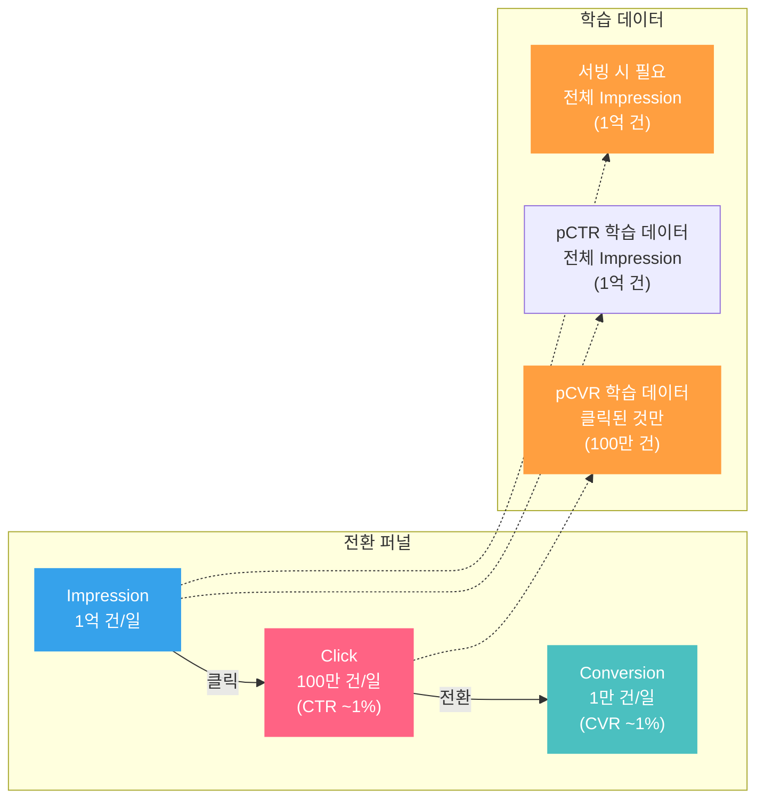
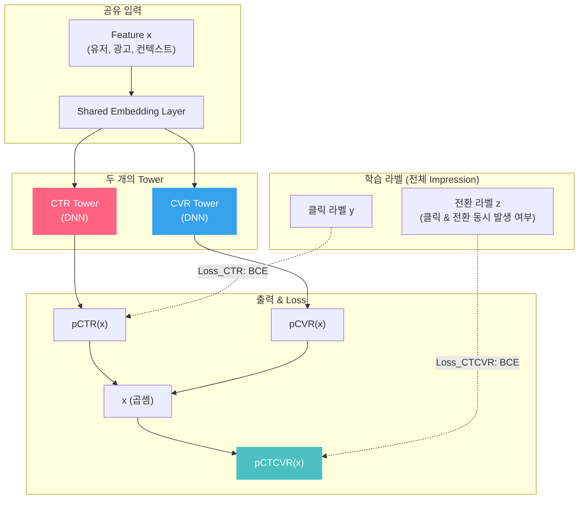
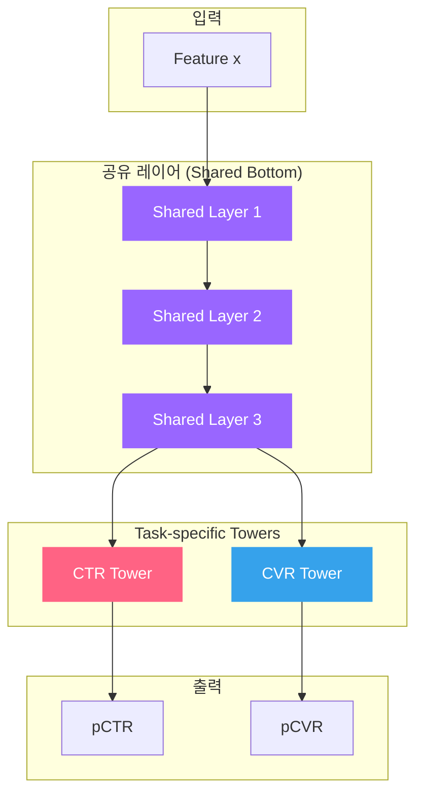
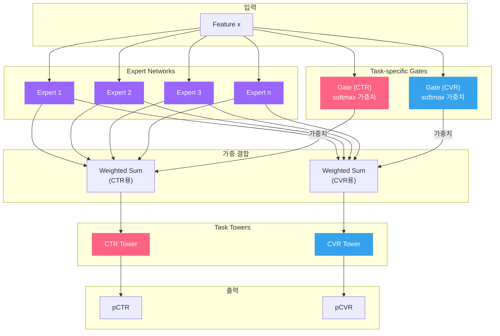
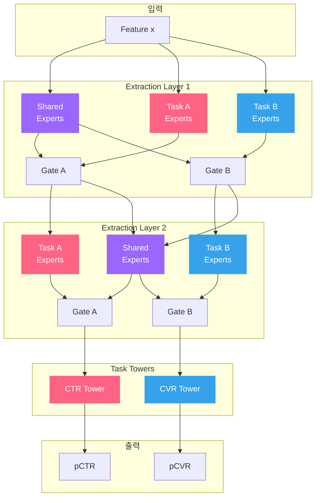

광고 시스템에서 pCTR과 pCVR은 별개의 모델로 학습되는 경우가 많습니다. 각 팀이 각자의 모델을 최적화하고, 서빙 시에 결과를 조합합니다. 자연스러운 접근이지만, 근본적인 문제가 있습니다. 클릭과 전환은 독립된 사건이 아닙니다. 노출 → 클릭 → 전환이라는 **sequential한 퍼널 관계**가 존재하고, 이 구조를 무시하면 학습 데이터 자체에 편향이 생깁니다.

핵심 문제는 pCVR 모델의 **Sample Selection Bias(SSB)**입니다. pCVR 모델은 "클릭한 샘플"만으로 학습하지만, 서빙 시에는 전체 노출 공간에서 예측해야 합니다. 이 train/serve 분포 불일치를 해결하는 가장 체계적인 방법이 **Multi-Task Learning(MTL)**입니다.

> [pCVR 모델링 포스트](post.html?id=pCVR-modeling)에서 SSB와 ESMM을 간략히 소개했습니다. 이 글은 MTL 아키텍처 전체를 조망합니다. [Calibration 포스트](post.html?id=calibration)에서 다룬 "예측 확률의 정확도"는 MTL 모델에서도 동일하게 중요하며, [Deep CTR 모델 포스트](post.html?id=deep-ctr-models)의 아키텍처들이 MTL의 각 Tower 내부에 그대로 활용됩니다.

---

## 1. 핵심 비교: Executive Summary

먼저 전체 지형을 봅니다. Single-Task부터 PLE까지, 각 접근법의 구조적 특성을 한눈에 비교합니다.

| 구조 | 아키텍처 | SSB 해결 | Task 간 간섭 | 파라미터 효율 | 실무 난이도 |
|------|---------|---------|-------------|-------------|-----------|
| **Single-Task (pCTR)** | 독립 모델 | 해당 없음 | 없음 | 낮음 (별도 모델) | 매우 낮음 |
| **Single-Task (pCVR)** | 독립 모델 (클릭 데이터만) | 미해결 | 없음 | 낮음 (별도 모델) | 낮음 |
| **ESMM** | 두 Tower + 곱셈 | 완전 해결 | 없음 (곱셈 결합) | 중간 (Embedding 공유) | 낮음 |
| **Shared-Bottom** | 공유 하위 레이어 + task별 Tower | 미해결 | 높음 (Negative Transfer) | 높음 (최대 공유) | 매우 낮음 |
| **MMoE** | 다중 Expert + task별 Gate | 미해결 | 낮음 (Gate가 조절) | 중간 | 중간 |
| **PLE** | Shared + Task-specific Expert, 다층 | 미해결 | 매우 낮음 | 중~낮음 (Expert 분리) | 높음 |

> 핵심 관찰: ESMM은 SSB를 해결하는 유일한 구조입니다. Shared-Bottom, MMoE, PLE는 SSB를 직접 해결하지 않지만, task 간 지식 공유와 간섭 조절에 초점을 맞춥니다. 실무에서는 ESMM의 곱셈 구조를 기반으로, Tower 내부에 MMoE나 PLE를 적용하는 하이브리드 구성이 일반적입니다.

---

## 2. 왜 pCVR을 따로 학습하면 안 되는가: Sample Selection Bias

### 전환 퍼널과 데이터 가용성

광고의 전환 퍼널은 세 단계입니다. 각 단계에서 사용 가능한 데이터의 규모가 급격히 줄어듭니다.

### 문제의 본질: Train/Serve 분포 불일치

pCVR 모델을 단독으로 학습하면, 학습 데이터는 "클릭이 발생한 샘플"에 한정됩니다. 그런데 서빙 시에는 "전체 노출"에 대해 전환 확률을 예측해야 합니다. 이것이 **Sample Selection Bias**입니다.

수식으로 정리하면:

- **학습 시**: $P(\text{Conversion}=1 \mid \text{Click}=1, x)$ --- 클릭한 것 중에서의 전환 확률
- **서빙 시**: $P(\text{Conversion}=1 \mid x)$ --- 전체 노출에서의 전환 확률

이 두 확률은 다릅니다. 클릭한 유저의 분포와 전체 유저의 분포가 다르기 때문입니다. 예를 들어, 특정 광고 카테고리에 관심이 높은 유저가 더 많이 클릭하므로, 클릭 데이터만 보면 그 카테고리의 전환율이 과대추정됩니다.

### ESMM의 핵심 아이디어: 곱셈 분해

이 문제를 해결하는 열쇠는 확률의 곱셈 분해입니다:

$$P(\text{Click}=1,\;\text{Conv}=1 \mid x) = P(\text{Click}=1 \mid x) \times P(\text{Conv}=1 \mid \text{Click}=1, x)$$

즉,

$$\text{pCTCVR}(x) = \text{pCTR}(x) \times \text{pCVR}(x)$$

좌변의 $\text{pCTCVR}(x) = P(\text{Click}=1,\;\text{Conv}=1 \mid x)$는 **전체 Impression 공간**에서 정의됩니다. 클릭과 전환이 모두 발생한 사건이므로, 전체 Impression 데이터에서 라벨을 구성할 수 있습니다. 이것이 ESMM의 핵심 통찰입니다.

---

## 3. ESMM (Entire Space Multi-Task Model, Alibaba 2018)

### 아키텍처

ESMM은 두 개의 Tower (CTR Tower, CVR Tower)로 구성되며, 공유 Embedding Layer 위에서 각각 독립적으로 예측을 수행합니다. 최종 출력은 두 Tower의 곱셈으로 만들어집니다.

### Loss 함수

ESMM의 Loss는 두 항으로 구성됩니다:

$$\mathcal{L} = \mathcal{L}_{CTR} + \mathcal{L}_{CTCVR}$$

$$\mathcal{L}_{CTR} = -\frac{1}{N}\sum_{i=1}^{N}\left[y_i \log(\text{pCTR}(x_i)) + (1-y_i)\log(1-\text{pCTR}(x_i))\right]$$

$$\mathcal{L}_{CTCVR} = -\frac{1}{N}\sum_{i=1}^{N}\left[z_i \log(\text{pCTCVR}(x_i)) + (1-z_i)\log(1-\text{pCTCVR}(x_i))\right]$$

여기서 $y_i$는 클릭 라벨, $z_i$는 클릭 & 전환 동시 발생 라벨, $N$은 전체 Impression 수입니다.

핵심은 **CVR에 대한 직접적인 Loss가 없다**는 점입니다. CVR Tower는 $\mathcal{L}_{CTCVR}$의 gradient가 곱셈 노드를 통해 역전파되면서 간접적으로 학습됩니다. 이 구조 덕분에 CVR Tower가 "클릭된 샘플"이 아닌 "전체 Impression"에서 학습할 수 있습니다.

### 왜 SSB가 해결되는가

| 관점 | 기존 pCVR 모델 | ESMM |
|------|-------------|------|
| **학습 데이터** | 클릭된 샘플만 (100만 건) | 전체 Impression (1억 건) |
| **학습 목표** | $P(\text{Conv} \mid \text{Click}, x)$ 직접 학습 | $P(\text{Click}, \text{Conv} \mid x)$를 통해 간접 학습 |
| **분포 불일치** | Train: 클릭 유저 / Serve: 전체 유저 | Train = Serve: 전체 유저 |
| **추가 이점** | 없음 | CTR의 풍부한 시그널이 공유 Embedding을 통해 CVR Tower로 전이 |

### Alibaba 실험 결과

Alibaba의 프로덕션 데이터(8억 건 이상)에서 ESMM은 기존 독립 CVR 모델 대비:

- CVR 예측 AUC: **+2.56%** 향상
- CTCVR 예측 AUC: **+3.25%** 향상
- 전체 Impression 공간에서 학습함으로써 Data Sparsity 문제도 동시에 완화

> ESMM의 강점은 SSB를 구조적으로 해결한다는 점입니다. 다른 MTL 아키텍처(Shared-Bottom, MMoE, PLE)는 task 간 지식 공유에 초점을 맞추지만, SSB를 직접 해결하지는 않습니다. 실무에서는 ESMM의 곱셈 구조를 유지하면서, Tower 내부의 feature interaction 구조를 MMoE나 PLE로 교체하는 하이브리드 접근이 일반적입니다.

---

## 4. Shared-Bottom & Hard Parameter Sharing

### 가장 기본적인 MTL 구조

Shared-Bottom은 MTL의 가장 단순하고 직관적인 형태입니다. 하위 레이어를 모든 task가 공유하고, 상위에 task별 Tower를 둡니다.

### 장점

- **구현이 간단**: 기존 Single-Task 모델에 Tower만 추가하면 됩니다
- **데이터 효율적**: Task 간 공유 표현을 학습하므로, 데이터가 적은 task(예: CVR)가 데이터가 풍부한 task(예: CTR)의 시그널을 활용합니다
- **파라미터 효율적**: 하위 레이어의 파라미터를 공유하므로 메모리와 서빙 비용이 절감됩니다
- **Regularization 효과**: 여러 task를 동시에 학습하면 각 task가 서로에게 regularizer 역할을 하여 overfitting을 방지합니다

### 한계: Negative Transfer

Shared-Bottom의 치명적 약점은 **Negative Transfer**입니다. Task 간 관계가 상충할 때, 공유 레이어가 두 task를 동시에 만족시키지 못하고 양쪽 성능이 모두 하락합니다.

광고 시스템에서의 전형적인 Negative Transfer 시나리오:

- **CTR과 CVR의 상충**: "낚시성 크리에이티브"는 CTR이 높지만 CVR이 낮습니다. 공유 표현이 CTR 최적화 쪽으로 끌리면, CVR 예측이 악화됩니다
- **Task 간 데이터 규모 차이**: CTR 데이터는 CVR 대비 100배 많습니다. Gradient가 CTR에 지배되어 CVR Tower가 제대로 학습되지 않습니다
- **Task 간 최적 표현의 차이**: CTR에 유용한 low-level 표현(예: 크리에이티브 시각 피처)이 CVR에는 불필요하거나 해로울 수 있습니다

이 Negative Transfer 문제를 해결하기 위해 등장한 것이 MMoE와 PLE입니다.

---

## 5. MMoE (Multi-gate Mixture-of-Experts, Google 2018)

### 핵심 아이디어

MMoE는 **하나의 공유 레이어** 대신 **여러 개의 Expert 네트워크**를 두고, 각 task가 **자신만의 Gating Network**를 통해 어떤 Expert를 얼마나 활용할지 동적으로 결정하는 구조입니다.

### 수식

$n$개의 Expert Network $f_1, f_2, \ldots, f_n$이 있을 때, task $k$의 Gating Network는 입력 $x$에 대해 softmax 가중치를 출력합니다:

$$g^k(x) = \text{softmax}(W_g^k \cdot x) \in \mathbb{R}^n$$

각 task $k$의 Expert 결합 결과는:

$$h^k(x) = \sum_{i=1}^{n} g_i^k(x) \cdot f_i(x)$$

여기서 $g_i^k(x)$는 task $k$가 expert $i$에 부여하는 가중치이고, $f_i(x)$는 expert $i$의 출력 벡터입니다. 이 결합 결과 $h^k(x)$가 task $k$의 Tower에 입력됩니다.

### Shared-Bottom 대비 장점

| 관점 | Shared-Bottom | MMoE |
|------|-------------|------|
| **표현 공유 방식** | 모든 task가 동일한 표현 사용 | 각 task가 필요한 Expert를 선택적으로 활용 |
| **Task 간 상충 대응** | 불가 (Negative Transfer) | Gate가 상충하는 Expert를 회피 |
| **유연성** | 없음 | 입력 $x$에 따라 동적으로 Expert 조합 변경 |
| **해석 가능성** | 낮음 | Gate 가중치로 task-expert 관계 분석 가능 |

실제로 Gate 가중치를 시각화하면, CTR task는 주로 "유저 행동 패턴" Expert에 높은 가중치를 부여하고, CVR task는 "광고 품질" Expert에 높은 가중치를 부여하는 패턴이 관측됩니다. 이것이 Shared-Bottom에서 발생하던 Negative Transfer를 완화하는 메커니즘입니다.

### Google 실험 결과

Google의 Census Income 데이터 실험에서 MMoE는 task correlation이 낮아질수록 Shared-Bottom 대비 성능 격차가 커졌습니다. Task correlation 0.0에서 Shared-Bottom은 급격한 성능 저하를 보인 반면, MMoE는 안정적인 성능을 유지했습니다. 이는 Gate가 task 간 상충을 효과적으로 조절함을 보여줍니다.

---

## 6. PLE (Progressive Layered Extraction, Tencent 2020)

### MMoE의 한계

MMoE에서 모든 Expert는 모든 task에 공유됩니다. Gate가 Expert 선택을 조절하지만, Expert 자체는 특정 task에 특화되지 않습니다. 이로 인해 두 가지 문제가 발생합니다:

1. **Seesaw 현상**: 한 task의 성능이 올라가면 다른 task가 떨어지는 trade-off가 완전히 해결되지 않습니다
2. **Task-specific 학습 부족**: Expert가 모든 task의 gradient를 받으므로, 특정 task에만 유용한 표현을 깊이 있게 학습하기 어렵습니다

### PLE의 구조

PLE는 **Shared Expert**와 **Task-specific Expert**를 명시적으로 분리하고, 이를 **다층으로 쌓아** progressive하게 task-specific 표현을 정제합니다.

### 핵심 혁신: Progressive Layered Extraction

PLE의 Extraction Network는 각 layer에서 다음을 수행합니다:

1. **Shared Expert**: 모든 task에 공통으로 유용한 표현을 학습
2. **Task-specific Expert**: 해당 task에만 유용한 표현을 학습
3. **Gate**: Shared Expert와 Task-specific Expert의 출력을 task별로 가중 결합

이것이 layer를 거듭할수록 **progressive하게** task-specific 표현이 정제됩니다. 하위 layer에서는 공통 표현 위주로 학습하고, 상위 layer로 갈수록 task 고유의 표현이 분화됩니다.

MMoE와의 핵심 차이:

| 관점 | MMoE | PLE |
|------|------|-----|
| **Expert 구분** | 모든 Expert가 공유 | Shared + Task-specific 명시 분리 |
| **Layer 수** | 단일 layer | 다층 (Progressive) |
| **Task-specific 학습** | Gate 가중치에 의존 | 전용 Expert가 명시적으로 학습 |
| **Seesaw 현상** | 부분적 완화 | 대폭 완화 |
| **파라미터 수** | Expert 수 x Expert 크기 | (Shared + Task별) Expert 수 x Layer 수 |

### Tencent 실험 결과

Tencent의 대규모 추천 시스템 실험에서 PLE는 다음과 같은 결과를 보였습니다:

- MMoE 대비 **모든 task에서 동시에** 성능 향상 (Seesaw 현상 해소)
- Task correlation이 낮을수록 MMoE 대비 개선 폭이 커짐
- 프로덕션 A/B 테스트에서 VCR(Video Completion Rate) +1.97%, VTR(View-Through Rate) +0.63% 개선

> PLE의 가장 큰 기여는 "모든 task의 성능을 동시에 올릴 수 있다"는 것을 실증한 점입니다. 기존 MTL에서는 한 task의 개선이 다른 task의 저하를 수반하는 Seesaw 현상이 흔했고, 이것이 MTL 도입의 가장 큰 장벽이었습니다.

---

## 7. 실무 선택 가이드

| 상황 | 추천 구조 | 이유 |
|------|---------|------|
| Task가 2개이고 sequential 관계 (CTR → CVR) | **ESMM** | SSB를 구조적으로 해결, 구현 간단 |
| Task가 3개 이상 (CTR, CVR, 체류 시간 등) | **MMoE** 또는 **PLE** | 다수 task 간 Gate로 유연한 지식 공유 |
| Task 간 상관관계가 높음 (CTR & Like) | **Shared-Bottom** | 간단한 구조로 충분, Negative Transfer 위험 낮음 |
| Task 간 상관관계가 낮음 (CTR & 체류 시간) | **PLE** | Task-specific Expert가 간섭을 방지 |
| 데이터 규모가 작음 (수백만 건 이하) | **Shared-Bottom** 또는 **ESMM** | 파라미터 공유로 데이터 효율 극대화 |
| 데이터 규모가 큼 (수억 건 이상) | **PLE** | 충분한 데이터로 Task-specific Expert 학습 가능 |
| 서빙 레이턴시가 엄격 (< 5ms) | **Shared-Bottom** 또는 **ESMM** | 파라미터 수 적음, 추론 경로 단순 |
| 서빙 레이턴시에 여유 (< 20ms) | **MMoE** 또는 **PLE** | Expert 병렬 연산으로 레이턴시 관리 가능 |

실무에서 가장 흔한 조합은 **ESMM + MMoE 하이브리드**입니다. ESMM의 곱셈 구조($\text{pCTCVR} = \text{pCTR} \times \text{pCVR}$)로 SSB를 해결하면서, 각 Tower 내부를 MMoE 구조로 구성하여 추가 task(좋아요, 공유, 체류 시간 등)와의 지식 공유를 최적화합니다.

---

## 8. Loss Weighting & Task Balancing

MTL에서 각 task의 Loss를 어떤 비율로 합칠 것인가는 모델 성능에 직접적인 영향을 미칩니다.

### Static Weighting

가장 단순하고 실무에서 가장 흔한 방식입니다. 각 task의 Loss에 수동으로 가중치를 설정합니다:

$$\mathcal{L} = w_1 \cdot \mathcal{L}_{CTR} + w_2 \cdot \mathcal{L}_{CVR} + w_3 \cdot \mathcal{L}_{engagement}$$

문제는 최적의 $w_1, w_2, w_3$를 찾기 위해 grid search가 필요하다는 점입니다. Task가 3개만 되어도 조합 수가 폭발합니다.

**실무 팁: Loss Scale 차이에 주의**

CTR 데이터는 CVR 대비 100배 많습니다. 동일한 가중치를 적용하면 CTR Loss의 gradient가 CVR을 압도합니다. 이를 해결하는 간단한 방법은 각 task의 Loss를 해당 task의 데이터 수로 나누어 정규화하는 것입니다:

$$\mathcal{L} = \frac{1}{N_{CTR}}\mathcal{L}_{CTR} + \frac{1}{N_{CVR}}\mathcal{L}_{CVR}$$

### Uncertainty Weighting (Kendall et al., 2018)

각 task의 **Homoscedastic Uncertainty** $\sigma_k$를 학습 가능한 파라미터로 두고, 불확실성이 큰 task의 가중치를 자동으로 낮추는 방법입니다:

$$\mathcal{L} = \frac{1}{2\sigma_1^2}\mathcal{L}_1 + \frac{1}{2\sigma_2^2}\mathcal{L}_2 + \log\sigma_1 + \log\sigma_2$$

- $\sigma_k$가 크면 (불확실성 높음) → 해당 task의 Loss 가중치 $\frac{1}{2\sigma_k^2}$이 작아짐
- $\log\sigma_k$ 항이 $\sigma_k$가 무한히 커지는 것을 방지하는 regularizer 역할

장점은 가중치를 수동으로 튜닝할 필요가 없다는 것이고, 단점은 $\sigma_k$가 학습 초기에 불안정할 수 있다는 점입니다.

### GradNorm (Chen et al., 2018)

각 task의 **gradient 크기**를 모니터링하고, gradient가 큰 task의 가중치를 낮추어 모든 task의 gradient가 비슷한 크기를 유지하도록 동적으로 조절합니다.

목표: 모든 task $k$에 대해 다음을 만족하도록 가중치 $w_k(t)$를 업데이트합니다:

$$\|G_k^W(t)\| \approx \bar{G}(t) \times [r_k(t)]^\alpha$$

여기서 $G_k^W(t)$는 task $k$의 weighted gradient 크기, $\bar{G}(t)$는 전체 평균 gradient 크기, $r_k(t)$는 task $k$의 상대적 학습 속도, $\alpha$는 balancing 강도를 조절하는 hyperparameter입니다.

### 방법 비교

| 방법 | 자동화 | 추가 파라미터 | 학습 안정성 | 구현 복잡도 |
|------|-------|------------|-----------|-----------|
| **Static Weighting** | 수동 | 없음 | 높음 | 매우 낮음 |
| **Uncertainty Weighting** | 자동 | Task 수만큼 | 중간 | 낮음 |
| **GradNorm** | 자동 | $\alpha$ 1개 | 중~높음 | 중간 |

실무 권장 순서:

1. **Static Weighting으로 시작** --- 각 task Loss를 데이터 수로 정규화한 후, CTR:CVR = 1:1로 시작
2. 성능이 불만족스러우면 **Uncertainty Weighting 적용** --- 구현이 간단하고 대부분의 경우 Static보다 개선
3. Task가 3개 이상이고 Seesaw 현상이 심하면 **GradNorm 검토** --- 구현 복잡도 대비 이점이 있는지 A/B 테스트로 확인

---

## 마무리

Multi-Task Learning의 핵심 5가지를 정리합니다:

1. **pCVR을 단독으로 학습하면 Sample Selection Bias가 발생한다** --- 클릭된 샘플만으로 학습하면 train/serve 분포가 불일치합니다. ESMM의 곱셈 분해($\text{pCTCVR} = \text{pCTR} \times \text{pCVR}$)가 이 문제를 구조적으로 해결합니다.

2. **Shared-Bottom은 간단하지만 Negative Transfer에 취약하다** --- Task 간 상충 시 공유 레이어가 양쪽 성능을 모두 악화시킵니다. CTR과 CVR처럼 데이터 규모와 최적 표현이 다른 task에서 특히 문제가 됩니다.

3. **MMoE는 Gate로 Negative Transfer를 완화한다** --- 각 task가 자신만의 Gating Network로 필요한 Expert를 선택적으로 활용합니다. Task correlation이 낮을수록 Shared-Bottom 대비 이점이 큽니다.

4. **PLE는 Shared Expert와 Task-specific Expert를 분리하여 Seesaw 현상을 해소한다** --- 다층 구조로 progressive하게 task-specific 표현을 정제하여, 모든 task의 성능을 동시에 올릴 수 있습니다.

5. **단일 모델이 여러 목표를 동시에 추구하면, 각 목표가 서로에게 regularizer 역할을 하여 일반화 성능이 올라간다** --- 이것이 MTL의 근본적인 이점이며, 광고 시스템처럼 여러 예측 task가 공통된 유저-광고 표현에 의존하는 도메인에서 특히 강력합니다.

> MTL은 모델 아키텍처만의 문제가 아닙니다. [Calibration](post.html?id=calibration)으로 각 task의 출력 확률을 보정하고, [Feature Store](post.html?id=feature-store-serving)로 공유 피처를 일관되게 공급하며, [모델 서빙 아키텍처](post.html?id=model-serving-architecture)에서 Multi-Task 모델의 추론 레이턴시를 관리해야 합니다. 아키텍처 선택은 이 전체 파이프라인의 한 조각입니다.

---

### 참고문헌

- Ma, X., Zhao, L., Huang, G., Wang, Z., Hu, Z., Zhu, X., & Gai, K. (2018). *Entire Space Multi-Task Model: An Effective Approach for Estimating Post-Click Conversion Rate*. In Proceedings of the 41st International ACM SIGIR Conference on Research and Development in Information Retrieval.
- Ma, J., Zhao, Z., Yi, X., Chen, J., Hong, L., & Chi, E. H. (2018). *Modeling Task Relationships in Multi-task Learning with Multi-gate Mixture-of-Experts*. In Proceedings of the 24th ACM SIGKDD International Conference on Knowledge Discovery & Data Mining.
- Tang, H., Liu, J., Zhao, M., & Gong, X. (2020). *Progressive Layered Extraction (PLE): A Novel Multi-Task Learning (MTL) Model for Personalized Recommendations*. In Proceedings of the 14th ACM Conference on Recommender Systems.
- Kendall, A., Gal, Y., & Cipolla, R. (2018). *Multi-Task Learning Using Uncertainty to Weigh Losses for Scene Geometry and Semantics*. In Proceedings of the IEEE Conference on Computer Vision and Pattern Recognition (CVPR).
