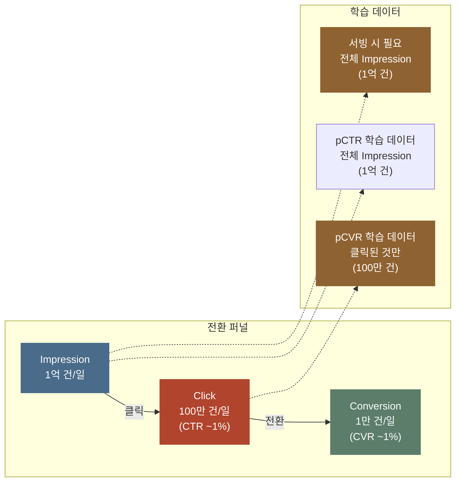
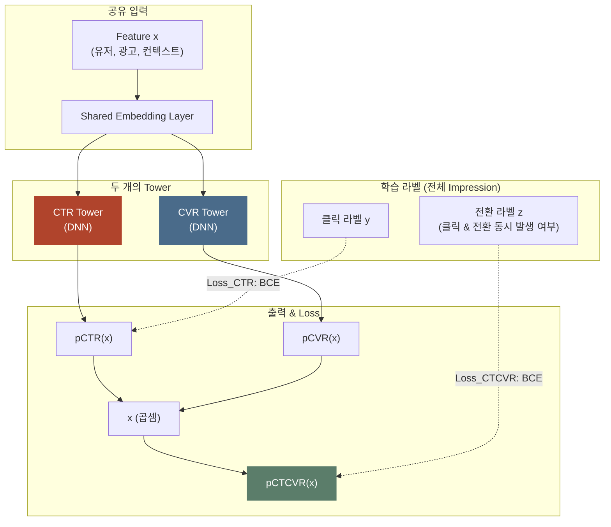
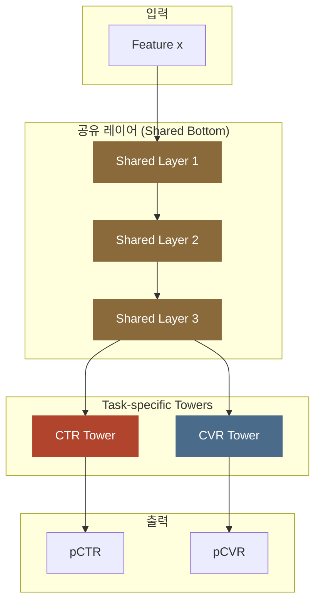
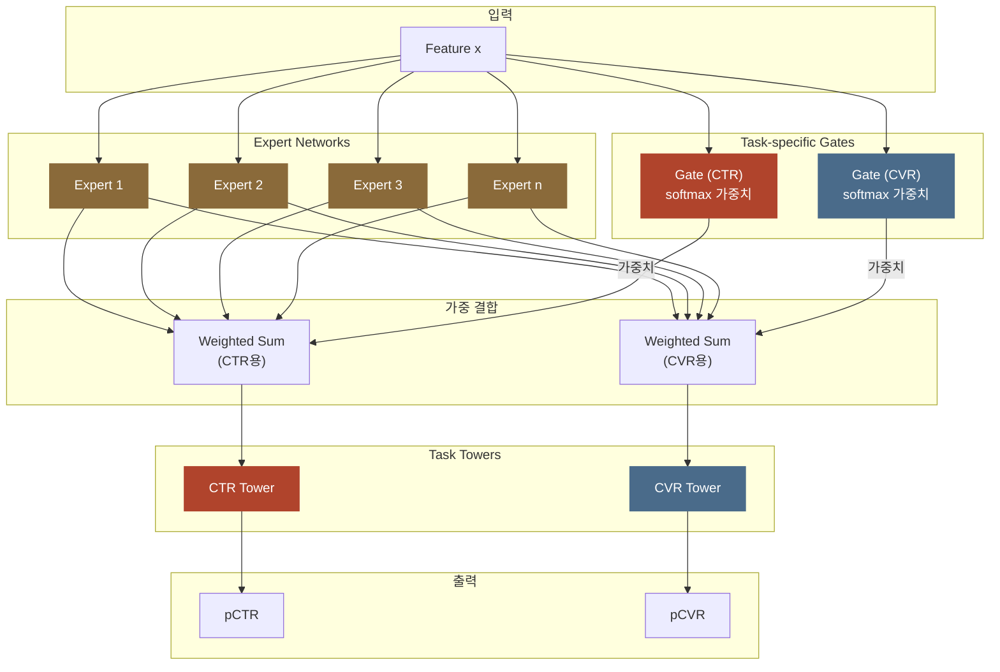
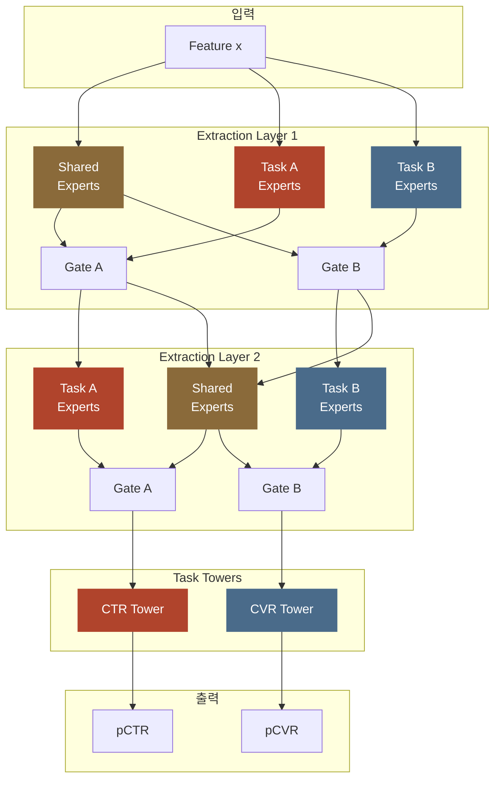

광고 시스템에서 pCTR과 pCVR은 별개의 모델로 학습되는 경우가 많습니다. 각 팀이 각자의 모델을 최적화하고, 서빙 시에 결과를 조합합니다. 자연스러운 접근이지만, 근본적인 문제가 있습니다. 클릭과 전환은 독립된 사건이 아닙니다. 노출 → 클릭 → 전환이라는 **순차적인 퍼널 관계**가 있습니다. 이 구조를 무시하면 학습 데이터 자체에 편향이 생깁니다.

핵심 문제는 pCVR 모델의 **Sample Selection Bias(SSB)**입니다. pCVR 모델은 "클릭한 샘플"만으로 학습합니다. 그런데 서빙 시에는 전체 노출 공간에서 예측해야 합니다. 이 train/serve 분포 불일치를 구조로 푸는 방법이 **Multi-Task Learning(MTL)**입니다.

> 한 줄 요약: 클릭과 전환을 **한 모델에서 같이 배우는** 이유는 두 가지입니다. 하나는 pCVR이 배우는 공간을 서빙하는 공간과 맞추는 것(ESMM). 다른 하나는 데이터가 적은 태스크가 많은 태스크의 표현을 빌려 쓰는 것(Shared-Bottom·MMoE·PLE). 빌려 쓰면 이득이지만, 두 태스크가 상충하면 그 이득이 0으로 사라집니다.

> **문제 정의**는 [pCVR 모델링](post.html?id=pcvr-modeling)에 있습니다. SSB, 지연 전환, 중복 전환이 거기 있습니다. 이 글은 그 문제를 **구조로 푸는 방법**만 다룹니다. 각 Tower 내부의 구조는 [Deep CTR 모델](post.html?id=deep-ctr-models)로 넘깁니다. 태스크가 여러 개면 [보정](post.html?id=calibration)도 태스크별로 따로 해야 합니다. 후보 생성 단계는 [Two-Tower 리트리벌](post.html?id=two-tower-retrieval)이 맡습니다.

> **골라 읽는 법** — 긴 글입니다(약 47분). 처음부터 다 읽지 않아도 됩니다.
>
> - 왜 pCVR을 따로 학습하면 안 되는지만 → 1~3절
> - 구조 계보(Shared-Bottom·MMoE·PLE)만 → 5·7·8절
> - 숫자로 확인하는 대목만 → 4·6·11절
> - 실무에서 뭘 고를지만 → 9·10절
> - 두 무대 비교만 → 12~13절

---
## 1. 핵심 비교: Executive Summary

**MTL 구조들은 서로 다른 두 문제를 풉니다.** 하나는 "어디서 배울까"(SSB)입니다. 다른 하나는 "표현을 어떻게 나눠 쓸까"(간섭)입니다. 이 둘을 섞어서 보면 아래 표가 잘 안 읽힙니다.

먼저 전체 지형을 봅니다. Single-Task부터 PLE까지, 각 접근법의 구조적 특성을 한눈에 비교합니다.

| 구조 | 아키텍처 | SSB 해결 | Task 간 간섭 | 파라미터 효율 | 실무 난이도 |
|------|---------|---------|-------------|-------------|-----------|
| **Single-Task (pCTR)** | 독립 모델 | 해당 없음 | 없음 | 낮음 (별도 모델) | 매우 낮음 |
| **Single-Task (pCVR)** | 독립 모델 (클릭 데이터만) | 미해결 | 없음 | 낮음 (별도 모델) | 낮음 |
| **ESMM** | 두 Tower + 곱셈 | 완전 해결 | 없음 (곱셈 결합) | 중간 (Embedding 공유) | 낮음 |
| **Shared-Bottom** | 공유 하위 레이어 + task별 Tower | 미해결 | 높음 (Negative Transfer) | 높음 (최대 공유) | 매우 낮음 |
| **MMoE** | 다중 Expert + task별 Gate | 미해결 | 낮음 (Gate가 조절) | 중간 | 중간 |
| **PLE** | Shared + Task-specific Expert, 다층 | 미해결 | 매우 낮음 | 중~낮음 (Expert 분리) | 높음 |

표를 통째로 외우지 말고 두 덩어리로 나눠 읽으세요. **ESMM은 학습 공간을 바꾸는 구조**입니다. 클릭된 샘플 대신 전체 노출에서 배우게 만듭니다. 반면 **Shared-Bottom·MMoE·PLE는 표현을 나눠 쓰는 구조**입니다. 어느 파라미터를 어느 태스크가 얼마나 쓸지를 정합니다. 그래서 이 둘은 경쟁 관계가 아닙니다. 실제 프로덕션 모델은 두 축을 겹쳐 씁니다.

> 핵심 관찰: ESMM은 SSB를 해결하는 유일한 구조입니다. Shared-Bottom, MMoE, PLE는 SSB를 직접 해결하지 않습니다. 대신 task 간 지식 공유와 간섭 조절에 초점을 맞춥니다. 실무에서는 ESMM의 곱셈 구조를 바탕으로 깔고 갑니다. 그 위에 Tower 내부를 MMoE나 PLE로 채우는 하이브리드 구성이 일반적입니다.

---

## 2. 왜 pCVR을 따로 학습하면 안 되는가: Sample Selection Bias

### 전환 퍼널과 데이터 가용성

광고의 전환 퍼널은 세 단계입니다. 각 단계에서 사용 가능한 데이터의 규모가 급격히 줄어듭니다.


```mermaid
graph LR
    subgraph Funnel["전환 퍼널"]
        IMP["Impression<br/>1억 건/일"]
        CLK["Click<br/>100만 건/일<br/>(CTR ~1%)"]
        CVR["Conversion<br/>1만 건/일<br/>(CVR ~1%)"]
    end

    IMP -->|"클릭"| CLK
    CLK -->|"전환"| CVR

    subgraph Data["학습 데이터"]
        D1["pCTR 학습 데이터<br/>전체 Impression<br/>(1억 건)"]
        D2["pCVR 학습 데이터<br/>클릭된 것만<br/>(100만 건)"]
        D3["서빙 시 필요<br/>전체 Impression<br/>(1억 건)"]
    end

    IMP -.-> D1
    CLK -.-> D2
    IMP -.-> D3

    style IMP fill:#4a6b8a,stroke:#4a6b8a,color:#fff
    style CLK fill:#b0442c,stroke:#b0442c,color:#fff
    style CVR fill:#5b7d6a,stroke:#5b7d6a,color:#fff
    style D2 fill:#8f6231,stroke:#8f6231,color:#fff
    style D3 fill:#8f6231,stroke:#8f6231,color:#fff
```

> 위 숫자는 설명용 **가상 예시**입니다. 노출 1억 건에 CTR 1%, CVR 1%를 가정했습니다. 실제 값은 매체와 상품에 따라 크게 다릅니다.

### 문제의 본질: Train/Serve 분포 불일치

pCVR 모델을 단독으로 학습하면, 학습 데이터는 "클릭이 발생한 샘플"에 한정됩니다. 그런데 서빙 시에는 "전체 노출"에 대해 전환 확률을 예측해야 합니다. 이것이 **Sample Selection Bias**입니다.

수식으로 정리하면:

- **학습 시**: $P(\text{Conversion}=1 \mid \text{Click}=1, x)$ --- 클릭한 것 중에서의 전환 확률
- **서빙 시**: $P(\text{Conversion}=1 \mid x)$ --- 전체 노출에서의 전환 확률

이 두 확률은 다릅니다. 클릭한 유저의 분포와 전체 유저의 분포가 다르기 때문입니다. 예를 들어, 특정 광고 카테고리에 관심이 높은 유저가 더 많이 클릭하므로, 클릭 데이터만 보면 그 카테고리의 전환율이 과대추정됩니다.

### ESMM의 핵심 아이디어: 곱셈 분해

이 문제를 푸는 열쇠는 확률의 곱셈 분해입니다.

$$P(\text{Click}=1,\;\text{Conv}=1 \mid x) = P(\text{Click}=1 \mid x) \times P(\text{Conv}=1 \mid \text{Click}=1, x)$$

같은 식을 광고 용어로 다시 쓰면 이렇게 됩니다.

$$\text{pCTCVR}(x) = \text{pCTR}(x) \times \text{pCVR}(x)$$

좌변의 pCTCVR은 "노출 하나가 클릭을 거쳐 전환까지 갈 확률"입니다. 이 값은 **전체 Impression 공간**에서 정의됩니다. 클릭과 전환이 모두 일어난 사건이라, 전체 노출 데이터에서 라벨을 그대로 만들 수 있습니다. 클릭이 없었던 노출은 라벨 0입니다. 이것이 ESMM의 핵심 통찰입니다.

---

## 3. ESMM (Entire Space Multi-Task Model, Alibaba 2018)

### 아키텍처

ESMM은 두 개의 Tower로 구성됩니다. CTR Tower와 CVR Tower입니다. 둘은 공유 Embedding Layer 위에 나란히 올라가 각각 예측합니다. 최종 출력은 두 Tower의 곱셈으로 만들어집니다.


```mermaid
graph TD
    subgraph Input["공유 입력"]
        X["Feature x<br/>(유저, 광고, 컨텍스트)"]
        EMB["Shared Embedding Layer"]
    end

    subgraph Towers["두 개의 Tower"]
        CTR_T["CTR Tower<br/>(DNN)"]
        CVR_T["CVR Tower<br/>(DNN)"]
    end

    subgraph Output["출력 & Loss"]
        PCTR["pCTR(x)"]
        PCVR["pCVR(x)"]
        MULT["x (곱셈)"]
        CTCVR["pCTCVR(x)"]
    end

    subgraph Labels["학습 라벨 (전체 Impression)"]
        L1["클릭 라벨 y"]
        L2["전환 라벨 z<br/>(클릭 & 전환 동시 발생 여부)"]
    end

    X --> EMB
    EMB --> CTR_T
    EMB --> CVR_T
    CTR_T --> PCTR
    CVR_T --> PCVR
    PCTR --> MULT
    PCVR --> MULT
    MULT --> CTCVR

    L1 -.->|"Loss_CTR: BCE"| PCTR
    L2 -.->|"Loss_CTCVR: BCE"| CTCVR

    style CTR_T fill:#b0442c,stroke:#b0442c,color:#fff
    style CVR_T fill:#4a6b8a,stroke:#4a6b8a,color:#fff
    style CTCVR fill:#5b7d6a,stroke:#5b7d6a,color:#fff
```

### Loss 함수

ESMM의 Loss는 두 항으로 구성됩니다.

$$\mathcal{L} = \mathcal{L}_{CTR} + \mathcal{L}_{CTCVR}$$

$$\mathcal{L}_{CTR} = -\frac{1}{N}\sum_{i=1}^{N}\left[y_i \log(\text{pCTR}(x_i)) + (1-y_i)\log(1-\text{pCTR}(x_i))\right]$$

$$\mathcal{L}_{CTCVR} = -\frac{1}{N}\sum_{i=1}^{N}\left[z_i \log(\text{pCTCVR}(x_i)) + (1-z_i)\log(1-\text{pCTCVR}(x_i))\right]$$

여기서 $y_i$는 클릭 라벨입니다. $z_i$는 클릭과 전환이 모두 일어났는지를 나타내는 라벨입니다. $N$은 전체 Impression 수입니다.

핵심은 **CVR에 대한 직접적인 Loss가 없다**는 점입니다. CVR Tower는 곱셈 노드를 통해서만 학습됩니다. $\mathcal{L}_{CTCVR}$의 gradient가 그 노드를 거꾸로 타고 흘러 들어옵니다. 이 구조 덕분에 CVR Tower가 "클릭된 샘플"이 아닌 "전체 Impression"에서 학습합니다.

:::deep 더 깊이 — 직접 손실이 없는데 CVR Tower는 어떻게 배우나
곱셈 노드의 미분을 한 번만 손으로 써 보면 답이 나옵니다. 표기를 줄여 pCTR을 $p$, pCVR을 $q$라 쓰겠습니다. 그러면 모델의 예측값은 $pq$이고, 라벨은 $z$입니다. 이진 교차엔트로피를 $pq$로 미분한 뒤, 연쇄법칙으로 $q$까지 내려가면 이렇게 됩니다.

$$\frac{\partial \mathcal{L}_{CTCVR}}{\partial q} = \frac{pq - z}{pq\,(1-pq)} \cdot p$$

핵심은 맨 뒤에 곱해진 $p$입니다. CVR Tower가 받는 gradient가 **pCTR에 비례**합니다.

이 한 줄이 두 가지를 동시에 설명합니다. 첫째, 클릭이 없었던 노출도 라벨 0으로 CVR Tower를 밀어 줍니다. 그래서 학습이 전체 노출 공간에서 일어납니다. 둘째, pCTR이 아주 낮은 노출은 CVR Tower를 거의 못 움직입니다. gradient가 $p$배로 줄어드니까요. 즉 ESMM은 "노출 전체를 균등하게" 배우는 게 아닙니다. **클릭 가능성으로 가중해서** 배웁니다. 이 성질이 있어야 pCVR의 뜻이 "클릭한 다음의 전환 확률"로 유지됩니다.

또 하나, 실무에서 자주 밟는 지뢰가 있습니다. $pq$는 아주 작은 수입니다. 노출당 전환이 0.06%면 $\log(1-pq)$ 항이 거의 0입니다. float32로 계산하면 유효 자릿수가 날아가기 쉽습니다. 그래서 프로덕션 구현은 logit 공간에서 안정화된 BCE를 씁니다. 두 Tower의 출력을 곱할 때도 확률을 직접 곱하지 않고 log를 더합니다.
:::

### 왜 SSB가 해결되는가

| 관점 | 기존 pCVR 모델 | ESMM |
|------|-------------|------|
| **학습 데이터** | 클릭된 샘플만 (100만 건) | 전체 Impression (1억 건) |
| **학습 목표** | $P(\text{Conv} \mid \text{Click}, x)$ 직접 학습 | $P(\text{Click}, \text{Conv} \mid x)$를 통해 간접 학습 |
| **분포 불일치** | Train: 클릭 유저 / Serve: 전체 유저 | Train = Serve: 전체 유저 |
| **추가 이점** | 없음 | CTR의 풍부한 시그널이 공유 Embedding을 통해 CVR Tower로 전이 |

### Alibaba 실험 결과

Alibaba는 프로덕션 데이터 8억 건 이상으로 ESMM을 검증했습니다. 기존 독립 CVR 모델과 비교한 결과입니다.

- CVR 예측 AUC: **+2.56%** 향상
- CTCVR 예측 AUC: **+3.25%** 향상
- 전체 Impression 공간에서 학습함으로써 Data Sparsity 문제도 동시에 완화

> ESMM의 강점은 SSB를 구조로 해결한다는 점입니다. 다른 MTL 아키텍처는 task 간 지식 공유에 초점을 맞춥니다. Shared-Bottom, MMoE, PLE 모두 SSB를 직접 해결하지는 않습니다. 실무에서는 ESMM의 곱셈 구조를 그대로 둡니다. 그 안의 Tower만 MMoE나 PLE로 바꿔 끼우는 하이브리드가 일반적입니다.

---

## 4. 파이썬으로 확인하기 ① — 클릭만 보고 배운 pCVR은 어디서 틀리나

**같은 데이터로 pCVR을 두 가지 방식으로 만들어 참값과 비교합니다.** 하나는 클릭된 샘플만 보고 배운 값입니다. 다른 하나는 ESMM 방식으로 전체 노출에서 얻은 값입니다. 결과부터 말하면 오차가 15배 차이 났습니다.

아래는 이 실험에 쓰는 **가상 데이터**입니다. 노출 10만 건, 클릭 2천 건, 전환 60건을 세그먼트 6개로 쪼갰습니다. 실제 로그가 아니라 설명을 위해 손으로 맞춘 숫자입니다.

| 세그먼트 (가상 데이터) | 노출 | 클릭 | CTR | 전환 | 참 CVR |
|---|---|---|---|---|---|
| 재방문 고관여 | 5,000 | 500 | 10.0% | 25 | 5.0% |
| 관심 카테고리 | 10,000 | 600 | 6.0% | 18 | 3.0% |
| 일반 사용자 | 20,000 | 500 | 2.5% | 10 | 2.0% |
| 신규 사용자 | 25,000 | 250 | 1.0% | 5 | 2.0% |
| 저관여 지면 | 25,000 | 125 | 0.5% | 2 | 1.6% |
| 신규 지면 | 15,000 | 25 | 0.17% | 0 | 0.0% |
| **합계** | **100,000** | **2,000** | **2.0%** | **60** | — |

이 표에서 평균 두 개를 먼저 구분해야 합니다. **클릭 가중 평균**은 60 ÷ 2,000 = 3.00%입니다. 클릭 데이터만 보는 모델이 "전체 평균"이라고 믿는 값입니다. **노출 가중 평균**은 1.85%입니다. 전체 노출에 값을 매길 때 실제로 맞아야 하는 눈금입니다. 두 숫자가 1.6배 벌어져 있습니다. 이 격차가 SSB의 크기입니다.

여기서 짚어 둘 점이 하나 있습니다. 정규화를 아예 걸지 않으면 두 방식의 세그먼트별 추정치는 **대수적으로 똑같습니다**. (전환÷노출)을 (클릭÷노출)로 나누면 전환÷클릭이니까요. 그러면 차이는 어디서 오나요. **몇 표본 위에서 배우는가**에서 옵니다. 클릭 공간의 표본은 2,000개, 노출 공간의 표본은 100,000개입니다. 같은 세기의 정규화를 걸어도 표본이 50배 많은 쪽이 훨씬 덜 끌려갑니다. 아래 코드는 두 방식에 정규화를 똑같이 100 표본만큼 걸고 비교합니다.

```python
# "클릭만 보고 배운 pCVR"과 "ESMM 방식으로 얻은 pCVR"을 같은 데이터로 비교한다.
# 가상 데이터: 노출 100,000 · 클릭 2,000 · 전환 60. 세그먼트 6개로 쪼개 놓았다.
# 클릭이 잘 나는 자리일수록 전환도 잘 난다 -- SSB(샘플 선택 편향)가 생기는 바로 그 조건이다.
# 표준 라이브러리만 쓴다.
import random

random.seed(42)  # 이 계산엔 난수가 없지만, 재현성 관례를 지킨다

# (세그먼트 이름, 노출, 클릭, 전환) -- 가상 데이터. 노이즈를 일부러 넣지 않았다.
# 노이즈가 없으니 '참 CVR'은 전환/클릭으로 딱 떨어진다. 두 방식의 차이만 순수하게 남는다.
SEGMENTS = [
    ("재방문 고관여", 5_000, 500, 25),   # CTR 10.0%  CVR 5.0%
    ("관심 카테고리", 10_000, 600, 18),  # CTR  6.0%  CVR 3.0%
    ("일반 사용자", 20_000, 500, 10),    # CTR  2.5%  CVR 2.0%
    ("신규 사용자", 25_000, 250, 5),     # CTR  1.0%  CVR 2.0%
    ("저관여 지면", 25_000, 125, 2),     # CTR  0.5%  CVR 1.6%
    ("신규 지면", 15_000, 25, 0),        # CTR  0.17% CVR 0.0%  <- 클릭이 거의 없는 자리
]

IMP = sum(s[1] for s in SEGMENTS)
CLK = sum(s[2] for s in SEGMENTS)
CVS = sum(s[3] for s in SEGMENTS)
print(f"전체   노출 {IMP:,} · 클릭 {CLK:,} · 전환 {CVS}")
print(f"클릭 가중 평균 전환율(클릭 데이터가 보는 값)  {CVS / CLK:.2%}")
print(f"노출 가중 평균 전환율(전체 노출의 실제 평균)  "
      f"{sum(i * (c / k) for _, i, k, c in SEGMENTS) / IMP:.2%}")
print()

# 정규화(선험 평균 쪽으로 끌어당기는 힘)를 두 방식에 '똑같이' 100 표본만큼 건다.
# 실무의 weight decay나 베이지안 스무딩이 하는 일을 가장 단순하게 흉내낸 것이다.
ALPHA = 100
PRIOR_CVR = CVS / CLK      # 클릭 공간의 선험값 = 3.00%
PRIOR_CTR = CLK / IMP      # 노출 공간의 선험값 = 2.00%
PRIOR_CTCVR = CVS / IMP    # 노출 공간의 선험값 = 0.06%


def cell(s, w, right=True):
    """한글을 폭 2칸으로 세서 표 칸을 맞춘다."""
    gap = " " * max(0, w - sum(2 if ord(c) > 0x2000 else 1 for c in s))
    return gap + s if right else s + gap


print(cell("세그먼트", 16, False) + cell("노출", 7) + cell("클릭", 6)
      + cell("참CVR", 8) + cell("(a)클릭만", 11) + cell("(b)ESMM", 10))

err_a = err_b = 0.0
for name, imp, clk, cnv in SEGMENTS:
    true_cvr = cnv / clk                    # 이 가상 데이터의 참값

    # (a) 클릭만 보고 학습: 분모가 '클릭 수'다. 클릭 25건짜리 세그먼트는
    #     표본 100의 힘에 눌려 값이 거의 통째로 3.00%(클릭 평균)로 끌려간다.
    pcvr_a = (cnv + ALPHA * PRIOR_CVR) / (clk + ALPHA)

    # (b) ESMM 방식: 노출 전체에서 pCTR과 pCTCVR을 각각 학습하고, 나눠서 pCVR을 얻는다.
    #     분모가 '노출 수'라서 같은 세기의 정규화가 훨씬 약하게 작용한다.
    pctr = (clk + ALPHA * PRIOR_CTR) / (imp + ALPHA)
    pctcvr = (cnv + ALPHA * PRIOR_CTCVR) / (imp + ALPHA)
    pcvr_b = pctcvr / pctr                  # 항등식을 거꾸로 쓴 것

    err_a += imp * abs(pcvr_a - true_cvr)   # 노출 수로 가중한 절대오차
    err_b += imp * abs(pcvr_b - true_cvr)
    print(cell(name, 16, False)
          + f"{imp:>7,}{clk:>6,}{true_cvr:>8.2%}{pcvr_a:>11.2%}{pcvr_b:>10.2%}")

print()
print(f"노출 가중 평균 절대오차   (a) {err_a / IMP * 100:.3f}%p   (b) {err_b / IMP * 100:.3f}%p")
print(f"(b)의 오차가 (a)보다 {err_a / err_b:.1f}배 작다")

# 출력:
# 전체   노출 100,000 · 클릭 2,000 · 전환 60
# 클릭 가중 평균 전환율(클릭 데이터가 보는 값)  3.00%
# 노출 가중 평균 전환율(전체 노출의 실제 평균)  1.85%
#
# 세그먼트           노출  클릭   참CVR  (a)클릭만   (b)ESMM
# 재방문 고관여     5,000   500   5.00%      4.67%     4.99%
# 관심 카테고리    10,000   600   3.00%      3.00%     3.00%
# 일반 사용자      20,000   500   2.00%      2.17%     2.00%
# 신규 사용자      25,000   250   2.00%      2.29%     2.01%
# 저관여 지면      25,000   125   1.60%      2.22%     1.62%
# 신규 지면        15,000    25   0.00%      2.40%     0.22%
#
# 노출 가중 평균 절대오차   (a) 0.637%p   (b) 0.042%p
# (b)의 오차가 (a)보다 15.2배 작다
```

출력의 맨 아래 줄이 이 실험의 결론입니다. 그리고 그 위 표의 마지막 행이 가장 극적입니다. **신규 지면은 노출 15,000건(전체의 15%)인데 클릭이 25건뿐입니다.** 참 CVR은 0.0%인데, 클릭만 보고 배운 값은 2.40%가 나왔습니다. 클릭 평균 3.00%가 그 세그먼트를 거의 그대로 덮어 버린 결과입니다. ESMM 방식은 0.22%로 참값에 훨씬 가깝습니다.

오차가 어디에 쏠렸는지도 봐야 합니다. 오차가 큰 세그먼트는 전부 **노출은 많고 클릭은 적은** 자리입니다. 그리고 하필 그 자리가 노출 예산이 많이 나가는 곳입니다. 노출 가중 평균 절대오차는 0.637%p 대 0.042%p로 15.2배 차이가 났습니다. 참 CVR이 2% 수준인 판에서 0.6%p는 30% 왜곡입니다. 입찰가는 pCTR × pCVR에 비례하니, 이 왜곡은 그대로 돈으로 번집니다. 자세한 계산은 [eCPM 랭킹](post.html?id=ecpm-ranking)에 있습니다.

주의할 점도 있습니다. 이 코드는 ESMM의 gradient 학습을 흉내낸 것이 아닙니다. "학습 공간이 넓어지면 같은 정규화가 약하게 작용한다"는 한 가지 메커니즘만 떼어내 보인 것입니다. 실제 ESMM의 이득은 여기에 하나가 더 붙습니다. 공유 Embedding이 CTR 태스크의 풍부한 신호로 함께 학습된다는 점입니다. 그 효과는 다음 파이썬 절에서 따로 확인합니다.

---

## 5. Shared-Bottom & Hard Parameter Sharing

### 가장 기본적인 MTL 구조

Shared-Bottom은 MTL의 가장 단순하고 직관적인 형태입니다. 하위 레이어를 모든 task가 공유하고, 상위에 task별 Tower를 둡니다.


```mermaid
graph TD
    subgraph Input["입력"]
        X["Feature x"]
    end

    subgraph Shared["공유 레이어 (Shared Bottom)"]
        S1["Shared Layer 1"]
        S2["Shared Layer 2"]
        S3["Shared Layer 3"]
    end

    subgraph TaskTowers["Task-specific Towers"]
        T1["CTR Tower"]
        T2["CVR Tower"]
    end

    subgraph Outputs["출력"]
        O1["pCTR"]
        O2["pCVR"]
    end

    X --> S1 --> S2 --> S3
    S3 --> T1 --> O1
    S3 --> T2 --> O2

    style S1 fill:#8a6a3a,stroke:#8a6a3a,color:#fff
    style S2 fill:#8a6a3a,stroke:#8a6a3a,color:#fff
    style S3 fill:#8a6a3a,stroke:#8a6a3a,color:#fff
    style T1 fill:#b0442c,stroke:#b0442c,color:#fff
    style T2 fill:#4a6b8a,stroke:#4a6b8a,color:#fff
```

### 장점

- **구현이 간단**: 기존 Single-Task 모델에 Tower만 추가하면 됩니다
- **데이터 효율적**: Task 간 공유 표현을 학습하므로, 데이터가 적은 task(예: CVR)가 데이터가 풍부한 task(예: CTR)의 시그널을 활용합니다
- **파라미터 효율적**: 하위 레이어의 파라미터를 공유하므로 메모리와 서빙 비용이 절감됩니다
- **Regularization 효과**: 여러 task를 동시에 학습하면 각 task가 서로에게 regularizer 역할을 하여 overfitting을 방지합니다

### 한계: Negative Transfer

Shared-Bottom의 치명적 약점은 **Negative Transfer**입니다. Task 간 관계가 상충할 때, 공유 레이어가 두 task를 동시에 만족시키지 못하고 양쪽 성능이 모두 하락합니다.

광고 시스템에서 전형적으로 나타나는 Negative Transfer는 세 가지입니다.

- **CTR과 CVR의 상충**: "낚시성 크리에이티브"는 CTR이 높지만 CVR이 낮습니다. 공유 표현이 CTR 최적화 쪽으로 끌리면, CVR 예측이 악화됩니다
- **Task 간 데이터 규모 차이**: CTR 데이터는 CVR 대비 100배 많습니다. Gradient가 CTR에 지배되어 CVR Tower가 제대로 학습되지 않습니다
- **Task 간 최적 표현의 차이**: CTR에 유용한 low-level 표현(예: 크리에이티브 시각 피처)이 CVR에는 불필요하거나 해로울 수 있습니다

이 Negative Transfer 문제를 해결하기 위해 등장한 것이 MMoE와 PLE입니다.

---

## 6. 파이썬으로 확인하기 ② — 표현을 빌려 쓰는 게 이득인 조건

**공유가 늘 이득이라면 MMoE도 PLE도 필요 없었을 겁니다.** 그래서 이번엔 공유의 이득이 사라지는 지점을 찾아봅니다. 조건 하나만 바꿔 두 세계를 나란히 돌립니다.

설정은 이렇습니다. 광고 200개, 노출 10만 건, 클릭 2천 건, 전환 60건짜리 **가상 데이터**입니다. 광고마다 배워야 할 임베딩 값이 하나씩 있으니, 배울 파라미터가 200개입니다. 전환 60건으로 200개를 채우면 값 하나하나가 심하게 흔들립니다. 클릭 2천 건이면 광고당 10건씩이라 훨씬 단단합니다. 이 격차가 "빌려 쓰기"의 동력입니다.

두 세계는 노출과 클릭까지 **완전히 같은 데이터**입니다. 전환 라벨만 다르게 붙였습니다.

| 세계 (가상 데이터) | 전환을 결정하는 것 | 클릭과의 관계 |
|---|---|---|
| **A 정렬** | 클릭을 잘 받는 광고가 전환도 잘 시킨다 | 같은 방향 |
| **B 상충** | 전환을 잘 시키는 광고는 클릭 성적과 무관하다 | 상관 0 |

비교 대상은 네 개입니다. **상수 예측**은 모두에게 전체 평균 전환율을 그대로 내놓는 모델입니다. 아무것도 학습하지 않은 바닥선입니다. **단독 학습**은 전환 60건으로 임베딩 200개까지 직접 배웁니다. **공유**는 CTR 태스크가 노출 10만 건에서 배운 임베딩을 얼려서 쓰고, 그 위의 파라미터 2개만 배웁니다. **이상적 모델**은 참 확률을 그대로 아는 모델로, 도달 가능한 천장입니다.

```python
# 전환이 60건뿐일 때, 클릭 2,000건에서 배운 표현을 공유하면 정말 이득인가.
# 그리고 어떤 조건에서 그 이득이 사라지는가.
# 가상 데이터: 광고 200개 · 노출 100,000건 · 클릭 2,000건(2%) · 전환 60건(클릭의 3%).
# 광고마다 배울 임베딩 값이 1개씩 있으니 배울 파라미터가 200개다.
# 전환 60건으로 200개를 채우면 값 하나하나가 흔들린다. 클릭 2,000건이면 훨씬 단단하다.
# 두 세계에서 각각 확인한다.
#   세계 A(정렬): 클릭을 잘 받는 광고가 전환도 잘 시킨다
#   세계 B(상충): 전환을 잘 시키는 광고는 클릭 성적과 아무 상관이 없다
# 표준 라이브러리만 쓴다.
import math
import random

random.seed(42)

ADS, IMPS = 200, 100_000
pull = [random.gauss(0, 1) for _ in range(ADS)]   # 광고별 '클릭을 부르는 힘'
sell = [random.gauss(0, 1) for _ in range(ADS)]   # 광고별 '사게 만드는 힘' (pull과 독립)


def sigmoid(z):
    return 1.0 / (1.0 + math.exp(-max(-30.0, min(30.0, z))))


# 참 모델. 상수(-5.6, -6.8, -5.0)는 클릭 2%·전환 3%가 나오게 맞춘 값이다.
def true_ctr(ad):
    return sigmoid(2.0 * pull[ad] - 5.6)


WORLDS = {
    "A 정렬": lambda ad: sigmoid(1.8 * pull[ad] - 6.8),   # 클릭과 같은 힘을 본다
    "B 상충": lambda ad: sigmoid(1.8 * sell[ad] - 5.0),   # 클릭과 무관한 힘을 본다
}


def pad(s, w):
    """한글은 폭 2칸으로 세서 표를 맞춘다."""
    return s + " " * max(0, w - sum(2 if ord(c) > 0x2000 else 1 for c in s))


def logloss(rows, predict):
    tot = 0.0
    for ad, z in rows:
        p = min(max(predict(ad), 1e-9), 1 - 1e-9)
        tot += -(z * math.log(p) + (1 - z) * math.log(1 - p))
    return tot / len(rows)


def fit_emb(rows, epochs, lr=0.1, l2=0.002):
    """pXX = sigmoid(e[광고] + b) 를 SGD로 학습한다. 광고별 값 e를 직접 배우는 방식.
    l2는 값이 무한히 커지는 것을 막는 정규화(weight decay)다."""
    e, b = [0.0] * ADS, -3.5
    idx = list(range(len(rows)))
    rnd = random.Random(7)
    for _ in range(epochs):
        rnd.shuffle(idx)
        for i in idx:
            ad, y = rows[i]
            d = sigmoid(e[ad] + b) - y            # BCE 미분은 (예측 - 라벨)로 딱 떨어진다
            e[ad] -= lr * (d + l2 * e[ad])
            b -= lr * d
    return e, b


def fit_head(rows, z, steps=300, lr=1.0):
    """공유 표현 z를 얼려 놓고 sigmoid(u*z[광고] + b)의 u·b 2개만 배운다.
    배울 게 200개에서 2개로 줄었으니, 전체 배치 경사하강으로 안정적으로 정해진다."""
    u, b, n = 0.0, -3.5, len(rows)
    for _ in range(steps):
        gu = gb = 0.0
        for ad, y in rows:
            d = sigmoid(u * z[ad] + b) - y
            gu += d * z[ad]
            gb += d
        u -= lr * gu / n
        b -= lr * gb / n
    return u, b


tr = [(ad, 1 if random.random() < true_ctr(ad) else 0)
      for ad in (random.randrange(ADS) for _ in range(IMPS))]
te = [(ad, 1 if random.random() < true_ctr(ad) else 0)
      for ad in (random.randrange(ADS) for _ in range(IMPS))]
tr_clk = [ad for ad, y in tr if y == 1]
te_clk = [ad for ad, y in te if y == 1]

# CTR 태스크를 노출 10만 건에서 학습한다. 이 결과가 '공유할 표현'이다.
# 클릭 2,000건은 CVR 입장에선 적지만, 광고 200개에 10건씩이면 임베딩을 채울 만하다.
ctr_emb, _ = fit_emb(tr, epochs=3)
mu = sum(ctr_emb) / ADS
sd = (sum((v - mu) ** 2 for v in ctr_emb) / ADS) ** 0.5
shared = [(v - mu) / sd for v in ctr_emb]   # 평균 0·표준편차 1로 맞춰 넘긴다
print(f"노출 {len(tr):,} · 클릭 {len(tr_clk):,} · 광고 {ADS}개 (평가용 클릭 {len(te_clk):,})")

for name, p_cvr in WORLDS.items():
    tr_c = [(ad, 1 if random.random() < p_cvr(ad) else 0) for ad in tr_clk]
    te_c = [(ad, 1 if random.random() < p_cvr(ad) else 0) for ad in te_clk]
    rate = sum(z for _, z in tr_c) / len(tr_c)
    solo_e, solo_b = fit_emb(tr_c, epochs=40)   # 전환 60건으로 200개를 직접 배운다
    u, b = fit_head(tr_c, shared)               # 표현은 CTR에서 빌려 온다
    base = logloss(te_c, lambda ad: rate)
    print(f"\n세계 {name} — 학습 데이터 전환 {sum(z for _, z in tr_c)}건 (전환율 {rate:.2%})")
    for label, fn in (("상수 예측(전체 평균)", lambda ad: rate),
                      ("단독 학습(임베딩까지)", lambda ad: sigmoid(solo_e[ad] + solo_b)),
                      ("공유(CTR 표현 고정)", lambda ad: sigmoid(u * shared[ad] + b)),
                      ("이상적 모델(참 확률)", p_cvr)):
        ll = logloss(te_c, fn)
        print("  " + pad(label, 24) + f"LogLoss {ll:.4f}"
              f"   상수 대비 {(ll - base) / base:+6.1%}")

# 출력:
# 노출 100,000 · 클릭 1,994 · 광고 200개 (평가용 클릭 1,983)
#
# 세계 A 정렬 — 학습 데이터 전환 61건 (전환율 3.06%)
#   상수 예측(전체 평균)    LogLoss 0.1165   상수 대비  +0.0%
#   단독 학습(임베딩까지)   LogLoss 0.1085   상수 대비  -6.8%
#   공유(CTR 표현 고정)     LogLoss 0.1066   상수 대비  -8.5%
#   이상적 모델(참 확률)    LogLoss 0.1049   상수 대비  -9.9%
#
# 세계 B 상충 — 학습 데이터 전환 65건 (전환율 3.26%)
#   상수 예측(전체 평균)    LogLoss 0.1357   상수 대비  +0.0%
#   단독 학습(임베딩까지)   LogLoss 0.1200   상수 대비 -11.6%
#   공유(CTR 표현 고정)     LogLoss 0.1359   상수 대비  +0.1%
#   이상적 모델(참 확률)    LogLoss 0.1068   상수 대비 -21.3%
```

세계 A를 먼저 보겠습니다. 상수 예측 0.1165에서 시작해 천장이 0.1049입니다. 개선의 여지는 -9.9%뿐입니다. 단독 학습은 그 여지의 69%를 회수했고(-6.8%), 공유는 86%를 회수했습니다(-8.5%). 전환 60건으로 200개를 배우는 것보다, 클릭 2천 건이 채워 준 표현을 빌려 쓰는 게 낫습니다. 이게 Shared-Bottom이 데이터 효율적이라고 말하는 이유의 실체입니다.

세계 B는 결과가 뒤집힙니다. **공유의 이득이 +0.1%, 사실상 0입니다.** 빌려 온 표현에 전환 정보가 없으니, 위에 얹은 파라미터 2개가 할 수 있는 최선이 "그 표현을 무시하기"입니다. 그러면 상수 예측과 같아집니다. 반면 단독 학습은 -11.6%를 얻었습니다. 흔들리는 추정치라도 없는 정보보다는 낫습니다.

여기서 얻을 교훈은 분명합니다. **공유는 두 태스크가 같은 표현을 필요로 할 때만 이득입니다.** 그리고 실제 광고 시스템은 세계 A와 세계 B 사이 어딘가에 있습니다. 어떤 피처는 클릭과 전환에 같이 듣고, 어떤 피처는 한쪽에만 듣습니다. 그래서 "전부 공유"와 "전부 분리" 둘 다 답이 아닙니다. 필요한 건 **어느 표현을 어느 태스크가 쓸지 고르는 장치**입니다. 그게 다음 절의 MMoE gate입니다.

---

## 7. MMoE (Multi-gate Mixture-of-Experts, Google 2018)

### 핵심 아이디어

MMoE는 **하나의 공유 레이어** 대신 **여러 개의 Expert 네트워크**를 둡니다. 그리고 각 task에 **자신만의 Gating Network**를 붙입니다. Gate가 "어떤 Expert를 얼마나 쓸지"를 요청마다 다시 정합니다. 앞 절의 세계 B 문제를 푸는 장치가 바로 이 Gate입니다.


```mermaid
graph TD
    subgraph Input["입력"]
        X["Feature x"]
    end

    subgraph Experts["Expert Networks"]
        E1["Expert 1"]
        E2["Expert 2"]
        E3["Expert 3"]
        En["Expert n"]
    end

    subgraph Gates["Task-specific Gates"]
        G1["Gate (CTR)<br/>softmax 가중치"]
        G2["Gate (CVR)<br/>softmax 가중치"]
    end

    subgraph Combine["가중 결합"]
        C1["Weighted Sum<br/>(CTR용)"]
        C2["Weighted Sum<br/>(CVR용)"]
    end

    subgraph Towers["Task Towers"]
        T1["CTR Tower"]
        T2["CVR Tower"]
    end

    subgraph Out["출력"]
        O1["pCTR"]
        O2["pCVR"]
    end

    X --> E1
    X --> E2
    X --> E3
    X --> En
    X --> G1
    X --> G2

    E1 --> C1
    E2 --> C1
    E3 --> C1
    En --> C1
    G1 -->|"가중치"| C1

    E1 --> C2
    E2 --> C2
    E3 --> C2
    En --> C2
    G2 -->|"가중치"| C2

    C1 --> T1 --> O1
    C2 --> T2 --> O2

    style E1 fill:#8a6a3a,stroke:#8a6a3a,color:#fff
    style E2 fill:#8a6a3a,stroke:#8a6a3a,color:#fff
    style E3 fill:#8a6a3a,stroke:#8a6a3a,color:#fff
    style En fill:#8a6a3a,stroke:#8a6a3a,color:#fff
    style G1 fill:#b0442c,stroke:#b0442c,color:#fff
    style G2 fill:#4a6b8a,stroke:#4a6b8a,color:#fff
    style T1 fill:#b0442c,stroke:#b0442c,color:#fff
    style T2 fill:#4a6b8a,stroke:#4a6b8a,color:#fff
```

### 수식

Expert Network가 $n$개 있다고 합시다. 각각 $f_1$부터 $f_n$까지입니다. task $k$의 Gating Network는 입력 $x$를 받아 softmax 가중치를 냅니다.

$$g^k(x) = \text{softmax}(W_g^k \cdot x) \in \mathbb{R}^n$$

이 가중치로 Expert들의 출력을 섞습니다.

$$h^k(x) = \sum_{i=1}^{n} g_i^k(x) \cdot f_i(x)$$

$g_i^k(x)$는 task $k$가 expert $i$에 주는 가중치입니다. $f_i(x)$는 expert $i$의 출력 벡터입니다. 이렇게 섞인 $h^k(x)$가 task $k$의 Tower로 들어갑니다. 가중치가 입력마다 다시 계산된다는 점이 중요합니다. 같은 모델이 요청마다 다른 Expert 조합을 쓴다는 뜻입니다. softmax라서 가중치의 합은 항상 1입니다.

### Shared-Bottom 대비 장점

| 관점 | Shared-Bottom | MMoE |
|------|-------------|------|
| **표현 공유 방식** | 모든 task가 동일한 표현 사용 | 각 task가 필요한 Expert를 선택적으로 활용 |
| **Task 간 상충 대응** | 불가 (Negative Transfer) | Gate가 상충하는 Expert를 회피 |
| **유연성** | 없음 | 입력 $x$에 따라 동적으로 Expert 조합 변경 |
| **해석 가능성** | 낮음 | Gate 가중치로 task-expert 관계 분석 가능 |

실제로 Gate 가중치를 뽑아 보면 태스크별로 쏠림이 보입니다. CTR task는 "유저 행동 패턴" Expert에 높은 가중치를 줍니다. CVR task는 "광고 품질" Expert 쪽으로 기웁니다. 두 task가 쓰는 Expert가 갈리면 서로의 gradient가 덜 부딪힙니다. 이것이 Negative Transfer를 완화하는 메커니즘입니다.

### Google 실험 결과

Google은 Census Income 데이터로 task correlation을 인위적으로 조절해 실험했습니다. 상관이 낮아질수록 MMoE와 Shared-Bottom의 격차가 벌어졌습니다. 상관 0.0에서 Shared-Bottom은 급격히 무너졌습니다. MMoE는 그 지점에서도 성능을 유지했습니다. Gate가 task 간 상충을 조절한다는 근거입니다. 앞 절 세계 B에서 공유의 이득이 0이 됐던 것과 같은 현상입니다.

---

## 8. PLE (Progressive Layered Extraction, Tencent 2020)

### MMoE의 한계

MMoE에서 모든 Expert는 모든 task에 공유됩니다. Gate가 Expert 선택을 조절할 뿐입니다. Expert 자체는 특정 task에 특화되지 않습니다. 이 때문에 두 가지 문제가 남습니다.

1. **Seesaw 현상**: 한 task의 성능이 올라가면 다른 task가 떨어지는 trade-off가 완전히 해결되지 않습니다
2. **Task-specific 학습 부족**: Expert가 모든 task의 gradient를 받으므로, 특정 task에만 유용한 표현을 깊이 있게 학습하기 어렵습니다

### PLE의 구조

PLE는 **Shared Expert**와 **Task-specific Expert**를 명시적으로 분리합니다. 그리고 이 묶음을 **여러 층으로 쌓습니다**. 층을 지날수록 task별 표현이 조금씩 더 다듬어집니다.


```mermaid
graph TD
    subgraph Input["입력"]
        X["Feature x"]
    end

    subgraph Layer1["Extraction Layer 1"]
        SE1["Shared<br/>Experts"]
        TE1A["Task A<br/>Experts"]
        TE1B["Task B<br/>Experts"]
        G1A["Gate A"]
        G1B["Gate B"]
    end

    subgraph Layer2["Extraction Layer 2"]
        SE2["Shared<br/>Experts"]
        TE2A["Task A<br/>Experts"]
        TE2B["Task B<br/>Experts"]
        G2A["Gate A"]
        G2B["Gate B"]
    end

    subgraph Towers["Task Towers"]
        TA["CTR Tower"]
        TB["CVR Tower"]
    end

    subgraph Out["출력"]
        OA["pCTR"]
        OB["pCVR"]
    end

    X --> SE1
    X --> TE1A
    X --> TE1B

    SE1 --> G1A
    TE1A --> G1A
    SE1 --> G1B
    TE1B --> G1B

    G1A --> TE2A
    G1A --> SE2
    G1B --> TE2B
    G1B --> SE2

    SE2 --> G2A
    TE2A --> G2A
    SE2 --> G2B
    TE2B --> G2B

    G2A --> TA --> OA
    G2B --> TB --> OB

    style SE1 fill:#8a6a3a,stroke:#8a6a3a,color:#fff
    style SE2 fill:#8a6a3a,stroke:#8a6a3a,color:#fff
    style TE1A fill:#b0442c,stroke:#b0442c,color:#fff
    style TE2A fill:#b0442c,stroke:#b0442c,color:#fff
    style TE1B fill:#4a6b8a,stroke:#4a6b8a,color:#fff
    style TE2B fill:#4a6b8a,stroke:#4a6b8a,color:#fff
    style TA fill:#b0442c,stroke:#b0442c,color:#fff
    style TB fill:#4a6b8a,stroke:#4a6b8a,color:#fff
```

### 핵심 혁신: Progressive Layered Extraction

PLE의 Extraction Network는 각 layer에서 세 가지 일을 합니다.

1. **Shared Expert**: 모든 task에 공통으로 유용한 표현을 학습
2. **Task-specific Expert**: 해당 task에만 유용한 표현을 학습
3. **Gate**: Shared Expert와 Task-specific Expert의 출력을 task별로 가중 결합

layer를 거듭할수록 task별 표현이 **점진적으로** 갈라집니다. 하위 layer에서는 공통 표현을 주로 배웁니다. 상위 layer로 갈수록 task 고유의 표현이 분화됩니다. 한 번에 갈라놓지 않고 층층이 갈라놓는 것이 이름에 붙은 "Progressive"의 뜻입니다.

MMoE와의 핵심 차이는 표로 보는 편이 빠릅니다.

| 관점 | MMoE | PLE |
|------|------|-----|
| **Expert 구분** | 모든 Expert가 공유 | Shared + Task-specific 명시 분리 |
| **Layer 수** | 단일 layer | 다층 (Progressive) |
| **Task-specific 학습** | Gate 가중치에 의존 | 전용 Expert가 명시적으로 학습 |
| **Seesaw 현상** | 부분적 완화 | 대폭 완화 |
| **파라미터 수** | Expert 수 x Expert 크기 | (Shared + Task별) Expert 수 x Layer 수 |

### Tencent 실험 결과

Tencent는 자사 대규모 추천 시스템에서 PLE를 검증했습니다. 결과는 세 줄로 요약됩니다.

- MMoE 대비 **모든 task에서 동시에** 성능 향상 (Seesaw 현상 해소)
- Task correlation이 낮을수록 MMoE 대비 개선 폭이 커짐
- 프로덕션 A/B 테스트에서 VCR(Video Completion Rate) +1.97%, VTR(View-Through Rate) +0.63% 개선

> PLE의 가장 큰 기여는 "모든 task의 성능을 동시에 올릴 수 있다"는 실증입니다. 기존 MTL에서는 한 task를 올리면 다른 task가 내려가기 일쑤였습니다. 이 Seesaw 현상이 MTL 도입의 가장 큰 장벽이었습니다.

---

## 9. 실무 선택 가이드

**고를 때 보는 것은 세 가지입니다.** task가 몇 개인가, 서로 얼마나 상관 있는가, 데이터가 얼마나 있는가. 아래 표는 이 세 축으로 자른 것입니다.

| 상황 | 추천 구조 | 이유 |
|------|---------|------|
| Task가 2개이고 sequential 관계 (CTR → CVR) | **ESMM** | SSB를 구조적으로 해결, 구현 간단 |
| Task가 3개 이상 (CTR, CVR, 체류 시간 등) | **MMoE** 또는 **PLE** | 다수 task 간 Gate로 유연한 지식 공유 |
| Task 간 상관관계가 높음 (CTR & Like) | **Shared-Bottom** | 간단한 구조로 충분, Negative Transfer 위험 낮음 |
| Task 간 상관관계가 낮음 (CTR & 체류 시간) | **PLE** | Task-specific Expert가 간섭을 방지 |
| 데이터 규모가 작음 (수백만 건 이하) | **Shared-Bottom** 또는 **ESMM** | 파라미터 공유로 데이터 효율 극대화 |
| 데이터 규모가 큼 (수억 건 이상) | **PLE** | 충분한 데이터로 Task-specific Expert 학습 가능 |
| 서빙 레이턴시가 엄격 (< 5ms) | **Shared-Bottom** 또는 **ESMM** | 파라미터 수 적음, 추론 경로 단순 |
| 서빙 레이턴시에 여유 (< 20ms) | **MMoE** 또는 **PLE** | Expert 병렬 연산으로 레이턴시 관리 가능 |

순서를 정해 두면 헤매지 않습니다. 먼저 **ESMM으로 SSB를 막는 것이 1순위**입니다. 이건 성능 문제가 아니라 정합성 문제입니다. 학습 공간과 서빙 공간이 어긋난 채로는 뒤에 뭘 붙여도 흔들립니다. 그다음이 표현 공유입니다. task가 둘뿐이면 Shared-Bottom으로 시작해도 충분합니다. 6절에서 봤듯 태스크가 정렬돼 있으면 단순 공유만으로도 이득이 큽니다. task가 셋 이상이 되거나 상관 낮은 task가 끼면 MMoE로 넘어갑니다. Seesaw가 지표에서 보이기 시작하면 그때 PLE를 검토합니다.

실무에서 가장 흔한 조합은 **ESMM + MMoE 하이브리드**입니다. 겉은 ESMM입니다. **pCTCVR = pCTR × pCVR** 구조로 SSB를 막습니다. 안쪽 Tower는 MMoE로 채웁니다. 그러면 추가 task와의 지식 공유까지 챙길 수 있습니다. 좋아요, 공유, 체류 시간 같은 것들입니다.

---

## 10. Loss Weighting & Task Balancing

MTL에서 각 task의 Loss를 어떤 비율로 합칠지는 모델 성능에 직접 영향을 줍니다. 구조를 아무리 잘 잡아도 이 비율을 잘못 두면 한쪽 태스크가 통째로 망가집니다. 얼마나 망가지는지는 11절에서 숫자로 봅니다.

### Static Weighting

가장 단순하고 실무에서 가장 흔한 방식입니다. 각 task의 Loss에 손으로 가중치를 매깁니다.

$$\mathcal{L} = w_1 \cdot \mathcal{L}_{CTR} + w_2 \cdot \mathcal{L}_{CVR} + w_3 \cdot \mathcal{L}_{engagement}$$

문제는 최적의 $w_1, w_2, w_3$를 찾기 위해 grid search가 필요하다는 점입니다. Task가 3개만 되어도 조합 수가 폭발합니다.

**실무 팁: Loss Scale 차이에 주의**

CTR 데이터는 CVR 대비 100배 많습니다. 같은 가중치를 주면 CTR Loss의 gradient가 CVR을 압도합니다. 가장 간단한 해법은 각 task의 Loss를 그 task의 데이터 수로 나누는 것입니다.

$$\mathcal{L} = \frac{1}{N_{CTR}}\mathcal{L}_{CTR} + \frac{1}{N_{CVR}}\mathcal{L}_{CVR}$$

### Uncertainty Weighting (Kendall et al., 2018)

각 task의 **Homoscedastic Uncertainty** $\sigma_k$를 학습 가능한 파라미터로 둡니다. 그러면 불확실성이 큰 task의 가중치가 자동으로 낮아집니다.

$$\mathcal{L} = \frac{1}{2\sigma_1^2}\mathcal{L}_1 + \frac{1}{2\sigma_2^2}\mathcal{L}_2 + \log\sigma_1 + \log\sigma_2$$

- $\sigma_k$가 크면 (불확실성 높음) → 해당 task의 Loss 가중치 $\frac{1}{2\sigma_k^2}$이 작아짐
- $\log\sigma_k$ 항이 $\sigma_k$가 무한히 커지는 것을 방지하는 regularizer 역할

장점은 가중치를 수동으로 튜닝할 필요가 없다는 것이고, 단점은 $\sigma_k$가 학습 초기에 불안정할 수 있다는 점입니다.

### GradNorm (Chen et al., 2018)

각 task의 **gradient 크기**를 학습 중에 계속 지켜봅니다. gradient가 큰 task의 가중치를 낮춥니다. 그렇게 모든 task의 gradient 크기를 비슷하게 맞춰 나갑니다.

목표는 이렇습니다. 모든 task $k$에 대해 다음을 만족하도록 가중치 $w_k(t)$를 업데이트합니다.

$$\|G_k^W(t)\| \approx \bar{G}(t) \times [r_k(t)]^\alpha$$

기호를 하나씩 풀면 이렇습니다. $G_k^W(t)$는 task $k$의 weighted gradient 크기입니다. $\bar{G}(t)$는 전체 태스크의 평균 gradient 크기입니다. $r_k(t)$는 task $k$의 상대적 학습 속도입니다. $\alpha$는 balancing을 얼마나 세게 걸지 정하는 hyperparameter입니다.

### 방법 비교

| 방법 | 자동화 | 추가 파라미터 | 학습 안정성 | 구현 복잡도 |
|------|-------|------------|-----------|-----------|
| **Static Weighting** | 수동 | 없음 | 높음 | 매우 낮음 |
| **Uncertainty Weighting** | 자동 | Task 수만큼 | 중간 | 낮음 |
| **GradNorm** | 자동 | $\alpha$ 1개 | 중~높음 | 중간 |

실무 권장 순서:

1. **Static Weighting으로 시작** --- 각 task Loss를 데이터 수로 정규화한 후, CTR:CVR = 1:1로 시작
2. 성능이 불만족스러우면 **Uncertainty Weighting 적용** --- 구현이 간단하고 대부분의 경우 Static보다 개선
3. Task가 3개 이상이고 Seesaw 현상이 심하면 **GradNorm 검토** --- 구현 복잡도 대비 이점이 있는지 A/B 테스트로 확인

---

## 11. 파이썬으로 확인하기 ③ — 가중치를 바꾸면 두 태스크가 시소를 탄다

**손실 = w1 × CTR손실 + w2 × CVR손실 에서 w만 바꿔 세 번 학습합니다.** (1,1), (1,5), (5,1) 세 가지입니다. 구조도 데이터도 그대로입니다. 그런데 두 태스크의 성적이 시소를 탑니다.

모델은 일부러 가장 극단적인 Shared-Bottom으로 잡았습니다. 공유하는 표현이 숫자 하나뿐입니다. 두 태스크는 그 숫자를 각자 배율과 절편만 바꿔 씁니다. 공유 표현이 하나뿐이니, 두 태스크가 다른 방향을 원하면 반드시 한쪽이 양보해야 합니다. 간섭이 가장 잘 보이도록 만든 설정입니다.

**가상 데이터**는 낚시성 크리에이티브를 숫자로 옮긴 것입니다. 피처 x0은 클릭 확률을 크게 올립니다(+2.0). 같은 x0이 전환 확률은 반대로 내립니다(-1.8). 누르게는 만들지만 사게는 못 만드는 광고입니다. 노출 4만 건 중 클릭이 9,454건 나왔습니다. CVR 손실은 그 클릭된 행에서만 계산됩니다.

읽기 전에 알아 둘 장치가 하나 있습니다. 세 실험 모두 **가중치 합을 2로 맞췄습니다**. 안 맞추면 가중치를 키운 쪽이 학습률까지 같이 커집니다. 그러면 상충 때문에 나빠진 건지 보폭이 커서 나빠진 건지 구분할 수 없습니다. 실무에서도 그대로 밟는 지뢰입니다.

```python
# 태스크 가중치 w1(CTR) : w2(CVR)를 바꾸면 두 태스크가 어떻게 상충하는지 직접 학습해 본다.
# 모델은 가장 극단적인 Shared-Bottom이다 -- 공유 표현이 숫자 하나 h뿐이고,
# 두 태스크는 그 h를 각자 배율·절편만 바꿔 쓴다.
# 공유 표현이 하나뿐이니, 두 태스크가 다른 방향을 원하면 반드시 한쪽이 양보해야 한다.
# 이것이 Negative Transfer를 눈으로 보는 가장 작은 실험이다. 표준 라이브러리만 쓴다.
import math
import random

random.seed(42)

D = 4  # 피처 4개

# 참 모델(가상). x0에서 두 태스크가 정면으로 상충한다 -- CTR엔 +2.0, CVR엔 -1.8.
# '낚시성 크리에이티브'를 숫자로 옮긴 것이다: 누르게는 만들지만 사게는 못 만든다.
W_CTR, B_CTR = [2.0, 1.5, 0.0, 0.0], -2.2   # 노출 기준 클릭 확률
W_CVR, B_CVR = [-1.8, 0.0, 2.0, 0.0], -1.2  # 클릭한 다음의 전환 확률


def sigmoid(z):
    z = max(-30.0, min(30.0, z))            # overflow 방지
    return 1.0 / (1.0 + math.exp(-z))


def dot(a, b):
    return sum(ai * bi for ai, bi in zip(a, b))


def make_rows(n):
    """노출 n건. 각 행은 (피처, 클릭여부 y, 전환여부 z).
    z는 '클릭했다면 전환했을까'이고, 실제 관측은 y==1인 행에서만 가능하다."""
    rows = []
    for _ in range(n):
        x = [random.gauss(0, 1) for _ in range(D)]
        y = 1 if random.random() < sigmoid(dot(W_CTR, x) + B_CTR) else 0
        z = 1 if random.random() < sigmoid(dot(W_CVR, x) + B_CVR) else 0
        rows.append((x, y, z))
    return rows


TRAIN, TEST = make_rows(40_000), make_rows(20_000)


def train(w1, w2, epochs=5, lr=0.02):
    """손실 = w1*CTR손실 + w2*CVR손실 을 SGD로 최소화한다.
    CVR 손실은 클릭이 있었던 행(y==1)에서만 계산된다 -- 실무의 pCVR 학습과 같다."""
    rnd = random.Random(7)                  # 초기값·셔플을 세 실험에서 똑같이 맞춘다
    ws = [rnd.gauss(0, 0.3) for _ in range(D)]   # 공유 파라미터
    cs = 0.0
    u1, b1 = rnd.gauss(0, 0.3), 0.0         # CTR 타워 (h -> pCTR)
    u2, b2 = rnd.gauss(0, 0.3), 0.0         # CVR 타워 (h -> pCVR)
    order = list(range(len(TRAIN)))
    for _ in range(epochs):
        rnd.shuffle(order)
        for i in order:
            x, y, z = TRAIN[i]
            h = math.tanh(dot(ws, x) + cs)  # 공유 표현 (1차원 병목)
            p1 = sigmoid(u1 * h + b1)
            d1 = w1 * (p1 - y)              # BCE 미분은 (예측 - 라벨)로 딱 떨어진다
            gh = d1 * u1                    # 공유 표현으로 흘러갈 gradient
            d2 = 0.0
            if y == 1:                      # CVR은 클릭된 행에서만 신호가 온다
                p2 = sigmoid(u2 * h + b2)
                d2 = w2 * (p2 - z)
                gh += d2 * u2               # 두 태스크의 gradient가 여기서 합쳐진다
            u1 -= lr * d1 * h
            b1 -= lr * d1
            if y == 1:
                u2 -= lr * d2 * h
                b2 -= lr * d2
            gz = gh * (1.0 - h * h)         # tanh의 미분
            for j in range(D):
                ws[j] -= lr * gz * x[j]
            cs -= lr * gz
    return ws, cs, u1, b1, u2, b2


def losses(p):
    """테스트셋 LogLoss를 태스크별로 잰다. 낮을수록 좋다."""
    ws, cs, u1, b1, u2, b2 = p
    l1 = n1 = l2 = n2 = 0.0
    for x, y, z in TEST:
        h = math.tanh(dot(ws, x) + cs)
        q1 = min(max(sigmoid(u1 * h + b1), 1e-12), 1 - 1e-12)
        l1 += -(y * math.log(q1) + (1 - y) * math.log(1 - q1))
        n1 += 1
        if y == 1:
            q2 = min(max(sigmoid(u2 * h + b2), 1e-12), 1 - 1e-12)
            l2 += -(z * math.log(q2) + (1 - z) * math.log(1 - q2))
            n2 += 1
    return l1 / n1, l2 / n2


print(f"학습 노출 {len(TRAIN):,}건 · 그중 클릭 {sum(r[1] for r in TRAIN):,}건")
solo_ctr = losses(train(1, 0))[0]           # 단독 학습된 CTR 모델
solo_cvr = losses(train(0, 1))[1]           # 단독 학습된 CVR 모델
print(f"단독 학습 기준선   CTR {solo_ctr:.4f}   CVR {solo_cvr:.4f}")
print(f"{'w1:w2':>7}{'CTR LogLoss':>14}{'CVR LogLoss':>14}   단독 대비")
for w1, w2 in [(1, 1), (1, 5), (5, 1)]:
    # 가중치 합을 2로 맞춘다. 안 그러면 가중치를 키운 쪽이 '학습률'까지 같이 커져,
    # 상충 때문에 나빠진 건지 보폭이 커서 나빠진 건지 구분할 수 없다.
    k = 2.0 / (w1 + w2)
    lc, lv = losses(train(w1 * k, w2 * k))
    print(f"{w1}:{w2:<5}{lc:>14.4f}{lv:>14.4f}   "
          f"CTR {lc - solo_ctr:+.4f} / CVR {lv - solo_cvr:+.4f}")

# 출력:
# 학습 노출 40,000건 · 그중 클릭 9,454건
# 단독 학습 기준선   CTR 0.3370   CVR 0.3061
#   w1:w2   CTR LogLoss   CVR LogLoss   단독 대비
# 1:1            0.3328        0.4618   CTR -0.0042 / CVR +0.1557
# 1:5            0.4152        0.3269   CTR +0.0783 / CVR +0.0208
# 5:1            0.3439        0.4687   CTR +0.0069 / CVR +0.1626
```

기준선부터 봅니다. 각 태스크를 혼자 학습시키면 CTR 0.3370, CVR 0.3061이 나옵니다. 간섭이 아예 없을 때의 성적입니다. 아래 세 줄은 모두 이 값과 비교하면 됩니다.

가장 눈에 띄는 줄은 첫 줄입니다. **아무 생각 없이 1:1로 두면 CVR이 +0.1557 나빠집니다.** CTR은 오히려 살짝 좋아졌습니다(-0.0042). 왜 이렇게 기울었을까요. CVR 손실은 클릭된 24%의 행에서만 발생합니다. gradient 총량이 애초에 CTR 쪽으로 기울어 있습니다. 1:1은 공평한 가중치처럼 보이지만 공평하지 않습니다.

CVR에 5배를 주면(1:5) CVR 손실이 0.3269까지 회복됩니다. 단독 학습과의 차이가 +0.0208로 줄었습니다. 대신 CTR이 +0.0783 나빠졌습니다. 정확히 시소입니다. 반대로 CTR에 5배를 주면(5:1) CVR이 +0.1626으로 가장 나빠집니다. 그런데 CTR도 1:1보다 나빠졌습니다(0.3439 대 0.3328). CTR은 1:1에서 이미 거의 최선이라 더 얻을 게 없다는 뜻입니다.

여기서 실무 감각 하나를 챙길 수 있습니다. **가중치를 올려 얻는 이득과 잃는 손해는 대칭이 아닙니다.** 데이터가 적은 태스크는 가중치를 올려야 겨우 제 성능이 납니다. 데이터가 많은 태스크는 이미 포화라 올려도 거의 안 오릅니다. 그래서 10절의 권장 순서가 "데이터 수로 정규화부터"인 것입니다.

그리고 이 표에는 좋은 칸이 없습니다. 어느 가중치를 골라도 한쪽은 단독 학습보다 나쁩니다. 공유 표현이 하나뿐이라 구조적으로 그렇습니다. 가중치 조절로는 시소의 받침점만 옮길 수 있습니다. 시소 자체를 없애려면 표현을 늘려야 합니다. 그게 MMoE의 Expert와 PLE의 task-specific Expert입니다.

---

## 12. 담장 안에서는 태스크 라벨이 깨끗하다 [무대: 닫힌 생태계]

**MTL의 전제는 "모든 태스크의 라벨이 같은 노출 줄에 정확히 붙어 있다"입니다.** 담장 안에서는 이 전제가 대체로 성립합니다.

네이버·카카오 같은 닫힌 생태계에서는 노출·클릭·전환이 모두 같은 회사 시스템을 지납니다. 결제가 승인되면 정산 시스템의 주문번호가 그대로 전환 로그에 실립니다. 그래서 "이 노출이 클릭됐고 전환까지 갔다"는 라벨을 노출 한 줄에 직접 붙일 수 있습니다. ESMM이 요구하는 것이 정확히 이 라벨입니다. 전체 노출 공간에 이 라벨을 매길 수 없으면 ESMM 자체가 성립하지 않습니다.

태스크를 늘리기도 쉽습니다. 자사 서비스라면 좋아요·저장·체류 시간·재방문이 모두 같은 유저 식별자로 한 줄에 모입니다. 그래서 MMoE나 PLE로 태스크 5~6개를 한 모델에 얹는 구성이 현실적입니다. 태스크 간 상관을 실제 데이터로 계산해 볼 수도 있습니다. 6절의 "세계 A냐 세계 B냐"를 추측이 아니라 측정으로 판단할 수 있다는 뜻입니다.

주의할 점도 있습니다. 담장 안이라고 라벨이 즉시 확정되는 건 아닙니다. 전환은 며칠에 걸쳐 도착합니다. 오늘 학습하면 아직 안 온 전환이 0으로 들어갑니다. 이 지연 문제는 구조로 풀리지 않습니다. [지연 피드백 글](post.html?id=online-learning-delayed-feedback)이 다루는 별개의 문제입니다.

---

## 13. 열린 RTB에서는 태스크마다 라벨 품질이 다르다 [무대: 열린 RTB]

**전환 신호가 남의 시스템에서, 여러 경로로, 뒤늦게 들어옵니다.** 그래서 클릭 라벨과 전환 라벨의 품질이 같지 않습니다.

클릭 라벨은 열린 RTB에서도 깨끗합니다. 우리가 응찰해 낙찰된 노출과 그 클릭은 우리 서버가 직접 봅니다. 반면 전환은 MMP·픽셀·포스트백을 통해 광고주 쪽에서 넘어옵니다. 같은 구매가 두 번 잡히기도 하고, 아예 안 잡히기도 합니다. ATT 이후에는 캠페인 단위로 뭉쳐진 집계만 오는 경우도 있습니다.

이 차이가 MTL에 그대로 꽂힙니다. ESMM이 배우는 라벨은 "이 노출이 전환으로 이어졌는가"입니다. 개별 노출과 전환을 이을 키가 없으면 그 라벨을 매길 수 없습니다. 라벨이 절반만 관측되면 pCTCVR 학습은 체계적으로 아래로 눌립니다. 그러면 곱셈 구조를 타고 pCVR도 같이 눌립니다. 담장 안에서 SSB를 풀어 주던 그 구조가, 여기서는 라벨 결손을 증폭하는 통로가 됩니다.

그래서 열린 RTB의 실무는 태스크마다 다른 신뢰도를 인정하고 시작합니다. 라벨 품질이 낮은 태스크에는 손실 가중치를 낮게 둡니다. 11절에서 봤듯 가중치를 낮추면 그 태스크는 확실히 나빠집니다. 다만 잘못된 라벨로 공유 표현을 오염시키는 것보다는 낫습니다. 자세한 사정은 [어트리뷰션](post.html?id=attribution-basics)에 있습니다. 전환 라벨 자체의 문제는 [pCVR 모델링](post.html?id=pcvr-modeling)에서 다뤘습니다.

---

## 마무리

Multi-Task Learning의 핵심 5가지를 정리합니다.

1. **pCVR을 단독으로 학습하면 Sample Selection Bias가 발생한다** --- 클릭된 샘플만으로 학습하면 train/serve 분포가 불일치합니다. ESMM의 곱셈 분해($\text{pCTCVR} = \text{pCTR} \times \text{pCVR}$)가 이 문제를 구조적으로 해결합니다.

2. **Shared-Bottom은 간단하지만 Negative Transfer에 취약하다** --- Task 간 상충 시 공유 레이어가 양쪽 성능을 모두 악화시킵니다. CTR과 CVR처럼 데이터 규모와 최적 표현이 다른 task에서 특히 문제가 됩니다.

3. **MMoE는 Gate로 Negative Transfer를 완화한다** --- 각 task가 자신만의 Gating Network로 필요한 Expert를 선택적으로 활용합니다. Task correlation이 낮을수록 Shared-Bottom 대비 이점이 큽니다.

4. **PLE는 Shared Expert와 Task-specific Expert를 분리하여 Seesaw 현상을 해소한다** --- 다층 구조로 progressive하게 task-specific 표현을 정제하여, 모든 task의 성능을 동시에 올릴 수 있습니다.

5. **단일 모델이 여러 목표를 동시에 추구하면, 각 목표가 서로에게 regularizer 역할을 하여 일반화 성능이 올라간다** --- 이것이 MTL의 근본적인 이점이며, 광고 시스템처럼 여러 예측 task가 공통된 유저-광고 표현에 의존하는 도메인에서 특히 강력합니다.

이 글에서 직접 돌려 본 숫자를 한 표에 모았습니다. 전부 **가상 데이터** 기준입니다.

| 무엇을 봤나 | 조건 | 결과 |
|---|---|---|
| SSB의 크기 (4절) | 노출 10만·클릭 2천·전환 60 | 클릭 가중 평균 3.00% vs 노출 가중 평균 1.85% |
| 클릭만 학습 vs ESMM (4절) | 정규화를 양쪽에 100 표본씩 | 노출 가중 오차 0.637%p vs 0.042%p (15.2배) |
| 가장 크게 틀린 자리 (4절) | 노출 15,000에 클릭 25 | 참 0.00% → 클릭만 2.40% / ESMM 0.22% |
| 표현 공유, 태스크 정렬 (6절) | 전환 61건·광고 200개 | 상수 대비 단독 -6.8% / 공유 -8.5% |
| 표현 공유, 태스크 상충 (6절) | 전환 65건·광고 200개 | 상수 대비 단독 -11.6% / 공유 +0.1% |
| 손실 가중치 (11절) | 1:1 / 1:5 / 5:1 | CVR 손실 +0.1557 / +0.0208 / +0.1626 |

> MTL은 모델 아키텍처만의 문제가 아닙니다. 각 task의 출력 확률은 [Calibration](post.html?id=calibration)으로 따로 보정해야 합니다. 공유 피처는 [Feature Store](post.html?id=feature-store-serving)가 공급합니다. 추론 비용은 [모델 서빙](post.html?id=model-serving-architecture)에서 관리합니다. 아키텍처 선택은 이 전체 파이프라인의 한 조각입니다.

---

## 더 깊이 보기

- SSB·지연 전환·중복 전환의 문제 정의 → [pCVR 모델링](post.html?id=pcvr-modeling)
- 각 Tower 내부 구조의 진화(LR→DeepFM→DIN) → [Deep CTR 모델의 진화](post.html?id=deep-ctr-models)
- 태스크가 여러 개면 보정도 태스크별로 → [Calibration](post.html?id=calibration)
- 후보를 먼저 좁히는 단계 → [Two-Tower 리트리벌](post.html?id=two-tower-retrieval)
- 지연 라벨로 온라인 학습하기 → [Online Learning & Delayed Feedback](post.html?id=online-learning-delayed-feedback)
- pCTR 기초부터 다시 → [pCTR 예측](post.html?id=pctr-prediction)
- 보여준 광고만 배우는 편향 → [Negative Sampling & Bias](post.html?id=negative-sampling-bias)
- pCTR × pCVR이 랭킹에 들어가는 자리 → [eCPM 랭킹](post.html?id=ecpm-ranking)
- Multi-Task 모델의 추론 비용 관리 → [모델 서빙 아키텍처](post.html?id=model-serving-architecture)
- 공유 피처를 일관되게 공급하기 → [Feature Store & Serving](post.html?id=feature-store-serving)
- 광고 ML 전체 지도에서 이 글의 위치 → [ML 엔지니어 트랙](ml-track.html)

---

### 참고문헌

- Ma, X., Zhao, L., Huang, G., Wang, Z., Hu, Z., Zhu, X., & Gai, K. (2018). *Entire Space Multi-Task Model: An Effective Approach for Estimating Post-Click Conversion Rate*. In Proceedings of the 41st International ACM SIGIR Conference on Research and Development in Information Retrieval.
- Ma, J., Zhao, Z., Yi, X., Chen, J., Hong, L., & Chi, E. H. (2018). *Modeling Task Relationships in Multi-task Learning with Multi-gate Mixture-of-Experts*. In Proceedings of the 24th ACM SIGKDD International Conference on Knowledge Discovery & Data Mining.
- Tang, H., Liu, J., Zhao, M., & Gong, X. (2020). *Progressive Layered Extraction (PLE): A Novel Multi-Task Learning (MTL) Model for Personalized Recommendations*. In Proceedings of the 14th ACM Conference on Recommender Systems.
- Kendall, A., Gal, Y., & Cipolla, R. (2018). *Multi-Task Learning Using Uncertainty to Weigh Losses for Scene Geometry and Semantics*. In Proceedings of the IEEE Conference on Computer Vision and Pattern Recognition (CVPR).
