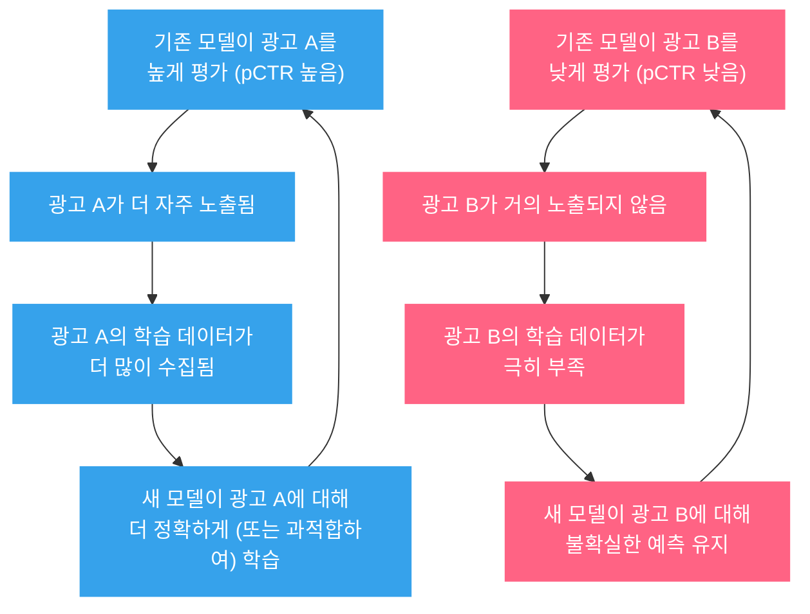

pCTR 모델을 학습시키기 위해 impression log를 열었습니다. 수십억 행의 데이터가 있고, 피처도 풍부합니다. 그런데 이 데이터에는 근본적인 문제가 하나 숨어 있습니다: **학습 데이터의 모든 행은 "이전 모델이 노출하기로 결정한 광고"에서만 생성되었습니다.** 노출되지 않은 광고가 클릭되었을지 여부는 영원히 알 수 없습니다. 학습 데이터 자체가 처음부터 편향되어 있는 것입니다.

이 편향을 무시하면 어떻게 될까요? 모델의 [Calibration](post.html?id=calibration)이 깨지고, 그 결과 [Bid Shading](post.html?id=bid-shading-censored)의 최적 입찰가가 왜곡됩니다. AUC가 아무리 높아도, 편향된 데이터에서 학습한 확률값은 체계적으로 틀립니다.

> 이 글은 광고 CTR 모델의 학습 데이터에 내재된 편향의 구조를 분석하고, Negative Sampling과 Sample Selection Bias의 보정 기법을 실무 관점에서 다룹니다.

---

## 1. 핵심 비교 (Executive Summary)

광고 CTR 모델의 학습 데이터에 영향을 미치는 주요 편향을 한눈에 정리합니다.

| 편향 유형 | 원인 | 영향 | 보정 기법 | 복잡도 |
|-----------|------|------|----------|--------|
| **Sample Selection Bias** | 모델이 선택한 광고만 노출 → 노출된 데이터만 학습 | $P(Y \mid X, O=1) \neq P(Y \mid X)$, 미노출 광고 성과 알 수 없음 | IPS, Doubly Robust | 높음 |
| **Position Bias** | 상위 위치의 광고가 더 많이 관찰됨 | 상위 광고 품질 과대추정, Rich-Get-Richer | IPS (Position), DLA, Regression EM | 중간 |
| **Negative Downsampling Bias** | 학습 효율을 위해 negative 샘플을 서브샘플링 | pCTR이 체계적으로 과대추정, Calibration 붕괴 | Log-odds Correction | 낮음 |
| **Impression Discounting** | 같은 유저에게 같은 광고 반복 노출 시 CTR 감소 | 최초 노출과 반복 노출의 CTR 혼합 → 평균 CTR 왜곡 | 노출 횟수별 보정 계수, 노출 횟수 피처 | 낮음 |

> 이 글은 **Negative Downsampling Bias**와 **Sample Selection Bias**를 집중적으로 다룹니다. Position Bias는 [Position Bias & ULTR 포스트](post.html?id=position-bias-ultr)에서 상세히 다뤘습니다.

---

## 2. 왜 광고 CTR 학습 데이터는 편향되는가

### 관측 편향 (Observational Bias)

광고 시스템에서 학습 데이터는 다음 과정을 거쳐 생성됩니다:

1. 광고 요청(Ad Request)이 도착한다
2. Candidate 광고 풀에서 모델이 eCPM 기반으로 랭킹한다
3. 상위 N개 광고가 노출된다
4. 노출된 광고의 클릭/비클릭 결과가 로깅된다

문제는 **3단계에서 탈락한 광고의 결과는 영원히 관측되지 않는다**는 것입니다. 이것이 반사실(Counterfactual)의 부재입니다. 유저 $u$에게 광고 $a$가 노출되지 않았을 때, "만약 노출했다면 클릭했을까?"라는 질문에는 답할 수 없습니다.

### Missing Not At Random (MNAR)

일반적인 데이터 분석에서 결측값(Missing Data)이 랜덤하게 발생하면 큰 문제가 되지 않습니다. 하지만 광고 데이터의 결측은 **체계적**입니다. 노출 여부 자체가 모델의 예측값, 입찰가, 경매 결과에 의해 결정되기 때문입니다.

$$P(\text{Observed} \mid X, Y) \neq P(\text{Observed} \mid X)$$

관측 확률이 결과 $Y$(클릭 여부)와 독립이 아닙니다. 모델이 "이 광고는 클릭될 가능성이 높다"고 예측한 광고가 더 많이 노출되므로, 관측 자체가 $Y$와 상관관계를 갖습니다. 이것이 MNAR 구조입니다.

### Feedback Loop: 편향이 편향을 강화한다

가장 심각한 문제는 편향이 자기 강화(Self-Reinforcing)된다는 것입니다.



왼쪽 루프(파란색)는 인기 광고의 데이터가 갈수록 풍부해지는 **Rich-Get-Richer** 현상입니다. 오른쪽 루프(빨간색)는 비인기 광고가 기회조차 얻지 못하는 **Cold-Start 고착** 현상입니다. 이 두 루프가 동시에 작동하면, 모델은 탐색(Exploration) 없이 착취(Exploitation)만 반복하게 됩니다. 이것이 [Exploration vs Exploitation 포스트](post.html?id=exploration-exploitation)에서 다룬 문제의 데이터 관점 표현입니다.

---

## 3. Negative Sampling: 왜 필요하고 어떻게 하는가

### 문제: 극단적 Class Imbalance

광고 CTR은 도메인에 따라 다르지만, 일반적으로 다음 범위에 있습니다:

| 광고 유형 | 대략적 CTR | Positive:Negative 비율 |
|-----------|-----------|----------------------|
| Display 광고 | 0.1% ~ 0.5% | 1:200 ~ 1:1,000 |
| 검색 광고 | 1% ~ 5% | 1:20 ~ 1:100 |
| 소셜 피드 광고 | 0.5% ~ 2% | 1:50 ~ 1:200 |

이런 극단적 Class Imbalance 환경에서 전체 데이터를 그대로 학습하면 세 가지 문제가 발생합니다:

**1. 학습 비효율.** 대부분의 gradient가 "너무 쉬운" negative 샘플에서 발생합니다. 모델은 이미 negative라고 확신하는 샘플을 반복적으로 학습하면서 계산 자원을 낭비합니다.

**2. 수렴 지연.** Positive 샘플이 전체의 0.1%라면, 모델이 의미 있는 positive gradient를 받기까지 수백 배치를 기다려야 합니다.

**3. 인프라 부담.** 하루 수십억 impression이 발생하는 시스템에서, 전체 데이터를 학습 파이프라인에 넣는 것은 스토리지와 컴퓨팅 측면에서 비현실적입니다.

### Random Negative Downsampling

가장 단순하고 널리 쓰이는 전략은 **Random Negative Downsampling**입니다. Positive 샘플은 전부 유지하고, Negative 샘플만 비율 $r$로 랜덤 추출합니다.

```python
import numpy as np

def negative_downsample(labels, features, ratio=0.1, seed=42):
    """Negative 샘플을 ratio 비율로 랜덤 다운샘플링.
    
    Args:
        labels: 클릭 여부 (0 or 1)
        features: 피처 행렬
        ratio: negative 샘플링 비율 (e.g., 0.1 = 10%만 유지)
    Returns:
        샘플링된 (labels, features)
    """
    rng = np.random.RandomState(seed)
    pos_mask = labels == 1
    neg_mask = labels == 0
    
    # Positive 전부 유지
    pos_indices = np.where(pos_mask)[0]
    
    # Negative에서 ratio 비율만 랜덤 추출
    neg_indices = np.where(neg_mask)[0]
    n_keep = int(len(neg_indices) * ratio)
    sampled_neg = rng.choice(neg_indices, size=n_keep, replace=False)
    
    keep = np.concatenate([pos_indices, sampled_neg])
    return labels[keep], features[keep]

# 예시: CTR 0.2%, negative sampling ratio 0.1
n_total = 10_000_000
n_pos = 20_000    # 0.2%
n_neg = 9_980_000 # 99.8%
# 다운샘플링 후: positive 20,000 + negative 998,000 = 1,018,000
# → 데이터 크기 약 10배 감소, positive 비율 0.2% → 약 2%로 상승
```

**장점:**
- 학습 데이터 크기가 $1/r$ 배 감소 (e.g., $r = 0.1$이면 10배)
- Positive 비율이 증가하여 학습 효율 개선
- 구현이 단순하고 재현 가능

**문제:**
- 예측 확률이 체계적으로 과대추정됨 (Calibration 붕괴)

### Calibration 보정 (Log-odds Correction)

Negative Downsampling 후 모델이 출력하는 확률 $q$는 원래 데이터 분포에서의 확률 $p$와 다릅니다. 다운샘플링으로 negative 비율이 줄었으므로, 모델은 positive 확률을 과대추정합니다.

보정 공식은 다음과 같습니다:

$$p = \frac{q}{q + \frac{1 - q}{r}}$$

여기서 $r$은 negative sampling ratio입니다. 이 공식의 유도 과정을 살펴보면:

원래 데이터에서의 odds는 $\frac{p}{1-p}$이고, 다운샘플링된 데이터에서의 odds는 $\frac{q}{1-q}$입니다. Positive는 전부 유지하고 Negative를 $r$ 비율로 줄였으므로:

$$\frac{q}{1-q} = \frac{1}{r} \cdot \frac{p}{1-p}$$

이를 $p$에 대해 정리하면 위의 보정 공식이 됩니다.

```python
def calibrate_downsampling(q, r):
    """Downsampling된 모델 출력 q를 원래 확률 p로 보정.
    
    Args:
        q: 모델 예측 확률 (downsampled 데이터에서 학습)
        r: negative sampling ratio
    Returns:
        p: 보정된 확률
    """
    return q / (q + (1 - q) / r)

# 예시
r = 0.1  # negative 10%만 사용
q = 0.15 # 모델이 15%로 예측

p = calibrate_downsampling(q, r)
print(f"모델 출력 q = {q:.2%}")
print(f"보정 후   p = {p:.4%}")
# 모델 출력 q = 15.00%
# 보정 후   p = 1.74%
# → 15%를 그대로 쓰면 입찰가가 약 8.6배 과대
```

이 보정이 없으면 pCTR이 체계적으로 과대추정되고, True Value = pCTR x Conversion Value가 함께 과대 계산되어, 입찰가가 비정상적으로 높아집니다. He et al. (2014)은 Facebook 광고 시스템에서 이 보정을 적용한 사례를 보고했습니다. [Calibration 포스트](post.html?id=calibration)에서 다룬 P/O Ratio 모니터링은 이 보정이 제대로 작동하는지 확인하는 핵심 도구입니다.

> Negative Downsampling은 학습 효율을 위해 거의 필수적이지만, **Log-odds Correction 없이 사용하면 Calibration을 파괴한다.** 이 보정은 서빙 파이프라인에 반드시 포함되어야 한다.

### Hard Negative Mining

Random Downsampling은 모든 negative 샘플을 동등하게 취급합니다. 하지만 모델 학습에 가장 유용한 negative 샘플은 **모델이 헷갈려하는 negative** -- 즉, 모델 스코어가 높은(positive에 가까운) negative 샘플입니다.

**전략:** 현재 모델로 negative 샘플의 pCTR을 예측하고, 점수가 높은 순서대로 우선 추출합니다.

```python
def hard_negative_sampling(model, neg_features, neg_labels, k, mix_ratio=0.5):
    """Hard Negative Mining: 모델이 헷갈려하는 negative 우선 추출.
    
    Args:
        model: 현재 학습된 모델
        neg_features: negative 샘플 피처
        neg_labels: negative 샘플 레이블 (모두 0)
        k: 추출할 총 샘플 수
        mix_ratio: hard negative 비율 (나머지는 random)
    Returns:
        선택된 인덱스
    """
    scores = model.predict_proba(neg_features)[:, 1]
    
    n_hard = int(k * mix_ratio)
    n_random = k - n_hard
    
    # 상위 스코어 negative: 모델이 positive로 착각하는 샘플
    hard_indices = np.argsort(scores)[-n_hard:]
    
    # 나머지는 랜덤 (분포 다양성 유지)
    remaining = np.setdiff1d(np.arange(len(neg_labels)), hard_indices)
    random_indices = np.random.choice(remaining, size=n_random, replace=False)
    
    return np.concatenate([hard_indices, random_indices])
```

**장점:**
- 결정 경계(Decision Boundary) 부근의 학습 효율 극대화
- 같은 양의 데이터로 AUC 개선 효과가 Random보다 큼

**주의점:**

| 위험 | 원인 | 대응 |
|------|------|------|
| False Negative 오염 | 레이블 노이즈로 실제 positive가 negative로 분류된 샘플이 hard negative로 선택됨 | 극단적으로 높은 스코어의 negative는 제외 (score threshold 설정) |
| 분포 왜곡 | Hard negative만 학습하면 전체 분포를 반영하지 못함 | Hard:Random 비율을 혼합 (e.g., 50:50) |
| 학습 불안정 | 매 에폭마다 hard negative가 바뀌어 loss 진동 | 주기적으로(매 N 에폭) 재추출, Curriculum Learning 적용 |

---

## 4. Sample Selection Bias: 노출 편향의 구조적 문제

### 문제 정의

학습 데이터의 구성을 형식적으로 정의하면:

$$\mathcal{D}_{\text{train}} = \{(x_i, y_i) \mid O_i = 1\}$$

여기서 $O_i \in \{0, 1\}$는 광고 $i$의 노출 여부입니다. 우리가 학습하고 싶은 것은 $P(Y \mid X)$ (광고 $x$가 주어졌을 때 클릭 확률)이지만, 실제로 학습하는 것은 $P(Y \mid X, O=1)$ (광고 $x$가 **노출되었을 때** 클릭 확률)입니다.

$$P(Y \mid X, O=1) \neq P(Y \mid X)$$

이 두 확률이 같으려면 노출 여부 $O$가 결과 $Y$와 독립이어야 합니다. 하지만 광고 시스템에서 $O$는 이전 모델의 pCTR 예측에 기반하므로, $O$와 $Y$는 상관관계를 가집니다. 구체적으로:

- 이전 모델이 pCTR을 높게 예측한 광고 → $O=1$ 확률이 높음
- pCTR이 높은 광고는 실제로도 CTR이 높을 가능성이 있음 (모델이 어느 정도 정확하다면)
- 따라서 $P(Y=1 \mid O=1) > P(Y=1)$ -- 학습 데이터의 평균 CTR이 전체 모집단의 평균 CTR보다 높음

이 편향은 모델이 정확할수록 오히려 심해집니다. 정확한 모델은 진짜 CTR이 높은 광고를 더 잘 골라서 노출하므로, 학습 데이터에 high-CTR 광고가 더 집중됩니다.

### IPS (Inverse Propensity Scoring) 보정

IPS는 인과추론(Causal Inference)에서 가져온 방법으로, **각 샘플에 "노출될 확률의 역수"를 가중치로 부여**하여 Selection Bias를 보정합니다.

Propensity Score를 다음과 같이 정의합니다:

$$e(x) = P(O = 1 \mid X = x)$$

이것은 피처 $x$를 가진 광고가 노출될 확률입니다. IPS 가중 손실 함수는:

$$\mathcal{L}_{\text{IPS}} = \frac{1}{n} \sum_{i: O_i=1} \frac{1}{e(x_i)} \ell(f(x_i), y_i)$$

여기서 $\ell$은 Cross-Entropy 등의 기본 손실 함수이고, $f$는 모델입니다.

**직관:** 자주 노출되는 광고(높은 $e(x)$)는 학습 데이터에 과대 대표되므로 가중치를 줄이고, 드물게 노출되는 광고(낮은 $e(x)$)는 과소 대표되므로 가중치를 높입니다. 이를 통해 "만약 모든 광고가 동등한 확률로 노출되었더라면" 관측했을 데이터 분포를 복원합니다.

```python
def ips_weighted_loss(predictions, labels, propensities, clip_range=(0.01, 1.0)):
    """IPS 가중 Cross-Entropy Loss.
    
    Args:
        predictions: 모델 예측 확률
        labels: 실제 클릭 여부 (0 or 1)
        propensities: 각 샘플의 노출 확률 P(O=1|X)
        clip_range: propensity clipping 범위 (분산 제어)
    Returns:
        가중 평균 loss
    """
    # Propensity Clipping: 극단적 가중치 방지
    clipped = np.clip(propensities, clip_range[0], clip_range[1])
    weights = 1.0 / clipped
    
    # Weighted Cross-Entropy
    eps = 1e-7
    ce = -(labels * np.log(predictions + eps) +
           (1 - labels) * np.log(1 - predictions + eps))
    
    return np.mean(weights * ce)

# 예시
propensities = np.array([0.8, 0.05, 0.3, 0.9, 0.02])
# 자주 노출(0.8) → 가중치 1.25 (낮춤)
# 드물게 노출(0.02) → 가중치 50 (높임, but clipped)
```

**IPS의 핵심 문제:**

| 문제 | 설명 | 대응 |
|------|------|------|
| **Propensity 추정의 어려움** | $e(x)$를 정확히 추정하기 어려움. 경매 메커니즘, 예산, 빈도 제한 등 복잡한 요인이 관여 | 로깅된 경매 데이터에서 별도 모델로 추정 |
| **높은 분산** | $e(x)$가 작으면 $1/e(x)$가 극단적으로 커짐 | Propensity Clipping, SNIPS (Self-Normalized IPS) |
| **Support 문제** | 절대로 노출되지 않는 광고($e(x) \approx 0$)는 보정 불가 | Exploration 트래픽 확보 (랜덤 노출 실험) |

**Propensity Clipping과 SNIPS:**

극단적 가중치 문제를 완화하는 두 가지 표준 기법입니다:

$$\text{Clipped IPS: } w_i = \min\left(\frac{1}{e(x_i)},\ M\right)$$

$$\text{SNIPS: } \mathcal{L}_{\text{SNIPS}} = \frac{\sum_{i} w_i \cdot \ell_i}{\sum_{i} w_i}$$

Clipping은 가중치 상한을 설정하고, SNIPS는 가중치를 정규화하여 분산을 줄입니다. 둘 다 bias-variance tradeoff로, 약간의 편향을 허용하는 대신 분산을 크게 줄입니다.

### Doubly Robust Estimator

IPS는 propensity $e(x)$가 정확해야 합니다. 직접 모델 예측(Direct Method)은 $P(Y \mid X)$의 추정이 정확해야 합니다. **Doubly Robust (DR) Estimator**는 이 둘을 결합하여, **둘 중 하나만 정확해도** 일관된(consistent) 추정을 제공합니다.

$$\hat{\mathcal{L}}_{\text{DR}} = \frac{1}{n} \sum_{i=1}^{n} \left[ \hat{\mu}(x_i) + \frac{O_i}{e(x_i)} \left( \ell_i - \hat{\mu}(x_i) \right) \right]$$

여기서:
- $\hat{\mu}(x_i)$: 직접 모델이 예측한 기대 손실 (imputed outcome)
- $e(x_i)$: propensity score
- $\ell_i$: 실제 관측된 손실 (노출된 경우만)
- $O_i$: 노출 여부 indicator

**직관:**
1. 먼저 직접 모델의 예측 $\hat{\mu}(x_i)$를 기본값으로 사용합니다
2. 노출된 샘플($O_i = 1$)에서, 실제 값과 직접 모델 예측의 **차이**(잔차)를 IPS로 보정하여 더합니다
3. 직접 모델이 정확하면 잔차가 작아 IPS 부분의 분산이 줄어듭니다
4. IPS가 정확하면 잔차 보정이 편향 없이 작동합니다

```python
def doubly_robust_loss(predictions, labels, propensities, 
                       imputed_outcomes, observed_mask):
    """Doubly Robust Loss Estimator.
    
    Args:
        predictions: 현재 모델의 예측 (학습 대상)
        labels: 실제 레이블
        propensities: P(O=1|X)
        imputed_outcomes: 직접 모델의 기대 손실 예측
        observed_mask: 노출 여부 (0 or 1)
    Returns:
        DR loss
    """
    eps = 1e-7
    # 개별 샘플 loss
    ce = -(labels * np.log(predictions + eps) +
           (1 - labels) * np.log(1 - predictions + eps))
    
    # 잔차 = 실제 loss - imputed loss
    residual = ce - imputed_outcomes
    
    # DR = imputed + IPS-corrected residual
    dr = imputed_outcomes + observed_mask / np.clip(propensities, 0.01, 1.0) * residual
    
    return np.mean(dr)
```

실무에서 DR Estimator는 IPS 단독보다 안정적입니다. 특히 propensity 추정이 부정확한 현실적 상황에서, 직접 모델의 예측이 "안전망" 역할을 하여 분산을 크게 줄여줍니다. Schnabel et al. (2016)은 추천 시스템에서 DR이 IPS보다 일관되게 낮은 MSE를 보였다고 보고했습니다.

---

## 5. 실무 파이프라인: 학습 데이터 구성 가이드

### End-to-End 파이프라인

```mermaid
graph LR
    subgraph Collection["1. 데이터 수집"]
        A["Impression Log<br/>(수십억 행/일)"] --> B["Label Join<br/>(Click, Conversion)"]
    end
    
    subgraph Sampling["2. 샘플링"]
        B --> C["Negative<br/>Downsampling<br/>(ratio r)"]
        C --> D["Hard Negative<br/>Mining<br/>(선택적)"]
    end
    
    subgraph Debiasing["3. 편향 보정"]
        D --> E["IPS 가중치<br/>계산"]
        E --> F["Doubly Robust<br/>보정 (선택적)"]
    end
    
    subgraph Training["4. 모델 학습"]
        F --> G["Weighted Loss로<br/>모델 학습"]
    end
    
    subgraph Serving["5. 서빙 보정"]
        G --> H["Log-odds<br/>Correction"]
        H --> I["Calibration<br/>검증 (P/O Ratio)"]
    end

    style A fill:#36a2eb,stroke:#36a2eb,color:#fff
    style B fill:#36a2eb,stroke:#36a2eb,color:#fff
    style C fill:#ff9f40,stroke:#ff9f40,color:#fff
    style D fill:#ff9f40,stroke:#ff9f40,color:#fff
    style E fill:#9966ff,stroke:#9966ff,color:#fff
    style F fill:#9966ff,stroke:#9966ff,color:#fff
    style G fill:#4bc0c0,stroke:#4bc0c0,color:#fff
    style H fill:#ff6384,stroke:#ff6384,color:#fff
    style I fill:#ff6384,stroke:#ff6384,color:#fff
```



### 각 단계별 실무 선택지

| 단계 | 선택지 | 적용 조건 | 주의사항 |
|------|--------|----------|---------|
| **Negative Sampling** | Random Downsampling | 항상 적용 (CTR < 5%) | Log-odds Correction 필수 |
| | Hard Negative Mining | AUC 정체 시 추가 | Hard:Random 비율 조절 필요 |
| **편향 보정** | IPS만 적용 | Propensity 추정이 신뢰할 만할 때 | Clipping 또는 SNIPS 병행 |
| | Doubly Robust | Propensity 추정이 불확실할 때 | Imputation 모델 별도 학습 필요 |
| | 보정 없음 | Exploration 트래픽이 충분할 때 (> 10%) | 편향 크기 모니터링 필수 |
| **서빙 보정** | Log-odds Correction | Negative Downsampling 적용 시 항상 | $r$ 값이 바뀌면 보정 계수도 갱신 |
| | Platt Scaling 추가 | Log-odds 보정 후에도 Calibration 오차 | Hold-out 데이터로 피팅 |

### Negative Sampling Ratio 결정 가이드

$r$ 값을 어떻게 정할 것인가는 CTR과 데이터 규모에 따라 달라집니다.

| 원래 CTR | 일일 데이터 규모 | 권장 $r$ | 다운샘플링 후 Positive 비율 | 근거 |
|---------|----------------|---------|--------------------------|------|
| 0.1% | 10억+ | 0.01 ~ 0.05 | 2% ~ 10% | 데이터 과잉, 공격적 샘플링 가능 |
| 0.5% | 1억 ~ 10억 | 0.05 ~ 0.1 | 5% ~ 10% | 표준적 설정 |
| 1% ~ 3% | 1천만 ~ 1억 | 0.1 ~ 0.3 | 3% ~ 10% | 보수적 샘플링 |
| 5%+ | 1천만 이하 | 0.5 ~ 1.0 | Imbalance가 심하지 않음 | 다운샘플링 불필요할 수 있음 |

핵심 원칙은 다음과 같습니다:

1. **다운샘플링 후 positive 비율이 2%~10% 범위가 되도록** $r$을 설정합니다
2. $r$이 너무 작으면 (e.g., 0.001) negative 다양성이 급감하여 모델 일반화 성능이 저하됩니다
3. $r$이 너무 크면 다운샘플링의 효율성 이점이 사라집니다
4. **A/B 테스트로 최적 $r$을 탐색**합니다. Offline AUC와 Online Calibration을 함께 확인합니다

### 모니터링: 편향 감지

편향은 시간에 따라 변합니다. 다음 지표를 세그먼트별로 추적해야 합니다:

**P/O Ratio (Predicted/Observed Ratio):** [Calibration 포스트](post.html?id=calibration)에서 소개한 지표입니다. P/O Ratio = 1.0이면 완벽한 Calibration이고, 1보다 크면 과대추정, 작으면 과소추정입니다.

모니터링 대상 세그먼트:

| 세그먼트 | 편향이 심해지는 상황 | 확인 주기 |
|---------|-------------------|----------|
| 신규 광고주 | 기존 모델에 학습 데이터 없음 → Selection Bias 극대 | 매일 |
| 신규 지면/Publisher | 분포 변화로 기존 propensity 무효화 | 매일 |
| 광고 카테고리 | 특정 카테고리 노출 편중 시 | 매주 |
| 시간대 | 피크/비피크 CTR 패턴 차이 | 매주 |
| 디바이스/OS | 새 디바이스 출시 시 데이터 부족 | 매월 |

```python
def monitor_po_ratio(predictions, actuals, segments, threshold=0.2):
    """세그먼트별 P/O Ratio 모니터링.
    
    Args:
        predictions: 모델 예측 pCTR
        actuals: 실제 클릭 여부
        segments: 세그먼트 레이블
        threshold: 알림 기준 (|P/O - 1| > threshold)
    Returns:
        세그먼트별 P/O Ratio 및 알림 여부
    """
    results = {}
    for seg in np.unique(segments):
        mask = segments == seg
        p = predictions[mask].mean()
        o = actuals[mask].mean()
        if o > 0:
            po_ratio = p / o
            alert = abs(po_ratio - 1.0) > threshold
            results[seg] = {"P/O": po_ratio, "n": mask.sum(), "alert": alert}
    return results

# 출력 예시:
# {"mobile_ios":   {"P/O": 1.05, "n": 2340000, "alert": False},
#  "new_publisher": {"P/O": 1.45, "n":   12000, "alert": True},  ← 과대추정
#  "desktop_win":  {"P/O": 0.72, "n":  890000, "alert": True}}   ← 과소추정
```

---

## 마무리

핵심을 다섯 가지로 정리합니다.

**1. 학습 데이터는 처음부터 편향되어 있다.** 광고 CTR 모델의 학습 데이터는 "이전 모델이 노출하기로 결정한 광고"에서만 생성됩니다. 이것은 MNAR 구조이며, Feedback Loop를 통해 편향이 자기 강화됩니다.

**2. Negative Downsampling은 필수지만, Log-odds Correction 없이는 독이다.** Class Imbalance 해소를 위한 다운샘플링은 학습 효율을 크게 개선하지만, 보정 공식 $p = q / (q + (1-q)/r)$을 서빙 시 반드시 적용해야 합니다.

**3. Hard Negative Mining은 AUC를 올리지만, 분포 왜곡에 주의하라.** 모델이 헷갈려하는 negative를 우선 학습하면 결정 경계가 개선되지만, Hard:Random 비율을 반드시 혼합하여 전체 분포를 유지해야 합니다.

**4. Sample Selection Bias는 IPS 또는 Doubly Robust로 보정한다.** 노출 편향은 propensity 역수 가중치로 보정하며, propensity 추정이 불확실하면 Doubly Robust Estimator가 더 안정적입니다.

**5. 편향은 고정되지 않는다 -- 모니터링이 핵심이다.** P/O Ratio를 세그먼트별로 지속 추적하고, 신규 광고주/지면/디바이스에서 편향이 심해지는지 감시해야 합니다. Calibration이 깨지면 입찰가가 왜곡되고, 그 비용은 광고주와 플랫폼이 부담합니다.

> 학습 데이터의 편향을 이해하지 못하면, 아무리 좋은 모델 아키텍처도 편향된 예측을 낼 뿐이다. 모델의 성능은 아키텍처가 아니라 데이터의 정직함에서 시작된다.

---

## 참고문헌

- He, X. et al. (2014). *Practical Lessons from Predicting Clicks of Ads at Facebook.* AdKDD 2014. -- Negative Downsampling과 Log-odds Correction의 실무 적용 사례. Facebook 광고 시스템의 대규모 CTR 예측 경험.
- McMahan, H.B. et al. (2013). *Ad Click Prediction: a View from the Trenches.* KDD 2013. -- Google 광고 시스템의 대규모 학습 파이프라인. FTRL-Proximal 최적화와 Calibration 운영 경험.
- Schnabel, T. et al. (2016). *Recommendations as Treatments: Debiasing Learning and Evaluation.* ICML 2016. -- 추천 시스템에서 IPS와 Doubly Robust Estimator의 체계적 비교. Selection Bias 보정의 이론적 프레임워크.
- Wang, X. et al. (2016). *Learning to Rank with Selection Bias in Personal Search.* SIGIR 2016. -- 검색 시스템에서 Selection Bias가 Learning to Rank에 미치는 영향과 IPS 기반 보정.