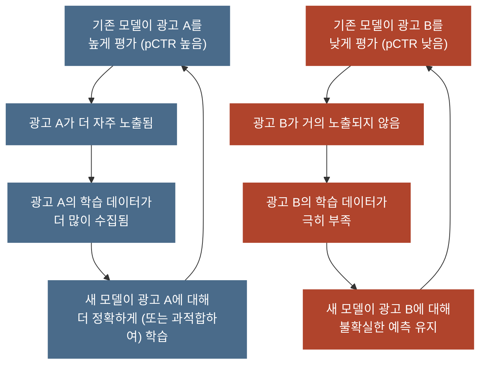

설문 용지를 세어 찬성률을 계산한다고 생각해 봅시다. 찬성표는 한 장도 빠짐없이 다 세었습니다. 반대표는 종이가 너무 많아서 10장 중 1장만 골라 세었습니다. 이렇게 계산한 찬성률은 실제보다 훨씬 높게 나옵니다. 반대표의 9할이 계산에서 사라졌으니까요. 표를 골라 담는 순간 비율이 위로 부풀어 오릅니다.

광고 클릭 모델은 매일 이 일을 합니다. 클릭은 노출 100번에 한두 번밖에 안 나옵니다. 안 눌린 로그는 하루에 수십억 행씩 쌓입니다. 그걸 다 학습에 넣으면 시간과 비용이 감당되지 않습니다. 그래서 안 눌린 로그만 일부러 줄여서 학습합니다. 대가로 예측 확률이 위로 부풉니다. 이 글은 그 부풀림을 되돌리는 공식 한 줄과, 그 공식으로도 못 되돌리는 더 깊은 편향을 다룹니다.

pCTR 모델을 학습시키기 위해 impression log를 열었습니다. 수십억 행의 데이터가 있고, 피처도 풍부합니다. 그런데 이 데이터에는 문제가 하나 더 숨어 있습니다. **학습 데이터의 모든 행은 "이전 모델이 노출하기로 결정한 광고"에서만 생성되었습니다.** 노출되지 않은 광고가 클릭되었을지 여부는 영원히 알 수 없습니다. 학습 데이터 자체가 처음부터 편향되어 있는 것입니다.

이 편향을 무시하면 어떻게 될까요? 먼저 모델의 [Calibration](post.html?id=calibration)이 깨집니다. 그러면 [Bid Shading](post.html?id=bid-shading-censored)의 최적 입찰가가 함께 왜곡됩니다. AUC가 아무리 높아도 소용이 없습니다. 편향된 데이터에서 학습한 확률값은 체계적으로 틀립니다. pCTR이 무엇인지부터 낯설다면 [pCTR 예측 모델링](post.html?id=pctr-prediction)을 먼저 보세요.

> 한 줄 요약: 안 눌린 로그를 1/10로 줄여 학습하면 진짜 2%인 클릭률이 17%로 부푼다. 되돌리는 공식은 딱 한 줄, $p = q / (q + (1-q)/r)$ 이다.

> **골라 읽는 법** — 절이 10개인 긴 글입니다. 처음부터 다 읽지 않아도 됩니다.
>
> - 편향이 왜 생기는지만 → 1~2절
> - 되돌리는 공식만 → 3~4절
> - 실무 파이프라인만 → 5절
> - 두 무대 비교만 → 6~7절

---
## 1. 핵심 비교 (Executive Summary)

**편향은 네 종류지만 뿌리는 하나입니다. "누가 학습 데이터에 들어왔는가"가 공평하지 않다는 것.**

광고 CTR 모델의 학습 데이터에 영향을 미치는 주요 편향을 한눈에 정리합니다.

| 편향 유형 | 원인 | 영향 | 보정 기법 | 복잡도 |
|-----------|------|------|----------|--------|
| **Sample Selection Bias** | 모델이 선택한 광고만 노출 → 노출된 데이터만 학습 | $P(Y \mid X, O=1) \neq P(Y \mid X)$, 미노출 광고 성과 알 수 없음 | IPS, Doubly Robust | 높음 |
| **Position Bias** | 상위 위치의 광고가 더 많이 관찰됨 | 상위 광고 품질 과대추정, Rich-Get-Richer | IPS (Position), DLA, Regression EM | 중간 |
| **Negative Downsampling Bias** | 학습 효율을 위해 negative 샘플을 서브샘플링 | pCTR이 체계적으로 과대추정, Calibration 붕괴 | Log-odds Correction | 낮음 |
| **Impression Discounting** | 같은 유저에게 같은 광고 반복 노출 시 CTR 감소 | 최초 노출과 반복 노출의 CTR 혼합 → 평균 CTR 왜곡 | 노출 횟수별 보정 계수, 노출 횟수 피처 | 낮음 |

네 줄을 두 갈래로 나눠 보면 머리가 정리됩니다. 위의 두 줄은 **우리가 당하는** 편향입니다. 어떤 광고를 보여줄지는 이전 모델이 이미 정했고, 그 결정은 되돌릴 수 없습니다. 아래의 두 줄은 **우리가 스스로 만든** 편향입니다. 학습 비용을 줄이려고 데이터를 골라 담았거나, 반복 노출로 CTR이 달라지는 것을 뭉개고 평균 냈기 때문에 생깁니다.

이 구분이 중요한 이유는 난이도가 갈리기 때문입니다. 스스로 만든 편향은 되돌릴 값을 우리가 알고 있어서 산수로 풀립니다. 다운샘플링 비율 $r$은 우리가 직접 정한 숫자니까요. 반대로 당하는 편향은 그 값을 추정해야 해서 훨씬 어렵습니다. 그래서 이 글은 쉬운 쪽을 먼저 끝내고 어려운 쪽으로 넘어갑니다. 3절이 Negative Downsampling Bias, 4절이 Sample Selection Bias입니다.

이름이 비슷해서 자주 헷갈리는 이웃도 하나 짚어 둡니다. Position Bias는 **자리 때문에 클릭이 왜곡되는** 문제입니다. 이 글의 편향은 **표본을 골라 담아서 확률이 왜곡되는** 문제입니다. 원인이 다르니 보정법도 다릅니다.

> 이 글은 **Negative Downsampling Bias**와 **Sample Selection Bias**를 집중적으로 다룹니다. 위치가 만드는 편향은 [Position Bias & ULTR](post.html?id=position-bias-ultr)에서 다룹니다.

---

## 2. 왜 광고 CTR 학습 데이터는 편향되는가

**학습 데이터는 하늘에서 떨어지지 않습니다. 어제의 모델이 골라 준 것입니다.**

### 관측 편향 (Observational Bias)

광고 시스템에서 학습 데이터는 다음 네 단계를 거쳐 생성됩니다.

1. 광고 요청(Ad Request)이 도착한다
2. Candidate 광고 풀에서 모델이 eCPM 기반으로 랭킹한다
3. 상위 N개 광고가 노출된다
4. 노출된 광고의 클릭/비클릭 결과가 로깅된다

문제는 **3단계에서 탈락한 광고의 결과는 영원히 관측되지 않는다**는 것입니다. 이것이 반사실(Counterfactual)의 부재입니다. 유저 $u$에게 광고 $a$가 노출되지 않았을 때, "만약 노출했다면 클릭했을까?"라는 질문에는 답할 수 없습니다.

### Missing Not At Random (MNAR)

일반적인 데이터 분석에서 결측값(Missing Data)이 랜덤하게 발생하면 큰 문제가 되지 않습니다. 하지만 광고 데이터의 결측은 **체계적**입니다. 노출 여부 자체가 모델의 예측값, 입찰가, 경매 결과에 의해 결정되기 때문입니다.

$$P(\text{Observed} \mid X, Y) \neq P(\text{Observed} \mid X)$$

관측 확률이 결과 $Y$(클릭 여부)와 독립이 아닙니다. 모델이 "이 광고는 클릭될 가능성이 높다"고 예측한 광고가 더 많이 노출되므로, 관측 자체가 $Y$와 상관관계를 갖습니다. 이것이 MNAR 구조입니다.

### Feedback Loop: 편향이 편향을 강화한다

가장 심각한 문제는 편향이 자기 강화(Self-Reinforcing)된다는 것입니다.


```mermaid
graph TD
    A["기존 모델이 광고 A를<br/>높게 평가 (pCTR 높음)"] --> B["광고 A가 더 자주 노출됨"]
    B --> C["광고 A의 학습 데이터가<br/>더 많이 수집됨"]
    C --> D["새 모델이 광고 A에 대해<br/>더 정확하게 (또는 과적합하여) 학습"]
    D --> A

    E["기존 모델이 광고 B를<br/>낮게 평가 (pCTR 낮음)"] --> F["광고 B가 거의 노출되지 않음"]
    F --> G["광고 B의 학습 데이터가<br/>극히 부족"]
    G --> H["새 모델이 광고 B에 대해<br/>불확실한 예측 유지"]
    H --> E

    style A fill:#4a6b8a,stroke:#4a6b8a,color:#fff
    style B fill:#4a6b8a,stroke:#4a6b8a,color:#fff
    style C fill:#4a6b8a,stroke:#4a6b8a,color:#fff
    style D fill:#4a6b8a,stroke:#4a6b8a,color:#fff
    style E fill:#b0442c,stroke:#b0442c,color:#fff
    style F fill:#b0442c,stroke:#b0442c,color:#fff
    style G fill:#b0442c,stroke:#b0442c,color:#fff
    style H fill:#b0442c,stroke:#b0442c,color:#fff
```

왼쪽 루프(파란색)는 인기 광고의 데이터가 갈수록 풍부해지는 **Rich-Get-Richer** 현상입니다. 오른쪽 루프(빨간색)는 비인기 광고가 기회조차 얻지 못하는 **Cold-Start 고착** 현상입니다. 두 루프가 동시에 돌면 모델은 탐색(Exploration) 없이 활용(Exploitation)만 반복합니다. 이것이 [탐색과 활용](post.html?id=exploration-exploitation) 문제의 데이터 쪽 얼굴입니다.

---

## 3. Negative Sampling: 왜 필요하고 어떻게 하는가

**안 눌린 로그를 다 쓰면 학습이 안 끝나고, 줄이면 확률이 부풉니다. 줄이고 되돌리는 게 정답입니다.**

### 문제: 극단적 Class Imbalance

광고 CTR은 도메인에 따라 다르지만, 대략 아래 범위에 있습니다.

| 광고 유형 | 대략적 CTR | Positive:Negative 비율 |
|-----------|-----------|----------------------|
| Display 광고 | 0.1% ~ 0.5% | 1:200 ~ 1:1,000 |
| 검색 광고 | 1% ~ 5% | 1:20 ~ 1:100 |
| 소셜 피드 광고 | 0.5% ~ 2% | 1:50 ~ 1:200 |

이런 극단적 Class Imbalance 환경에서 전체 데이터를 그대로 학습하면 세 가지 문제가 발생합니다.

**1. 학습 비효율.** 대부분의 gradient가 "너무 쉬운" negative 샘플에서 발생합니다. 모델은 이미 negative라고 확신하는 샘플을 반복적으로 학습하면서 계산 자원을 낭비합니다.

**2. 수렴 지연.** Positive 샘플이 전체의 0.1%라면, 모델이 의미 있는 positive gradient를 받기까지 수백 배치를 기다려야 합니다.

**3. 인프라 부담.** 하루 수십억 impression이 발생하는 시스템에서, 전체 데이터를 학습 파이프라인에 넣는 것은 스토리지와 컴퓨팅 측면에서 비현실적입니다.

### Random Negative Downsampling

가장 단순하고 널리 쓰이는 전략은 **Random Negative Downsampling**입니다. Positive 샘플은 전부 유지하고, Negative 샘플만 비율 $r$로 랜덤 추출합니다.

```python
import numpy as np

def negative_downsample(labels, features, ratio=0.1, seed=42):
    """Negative 샘플을 ratio 비율로 랜덤 다운샘플링.
    
    Args:
        labels: 클릭 여부 (0 or 1)
        features: 피처 행렬
        ratio: negative 샘플링 비율 (e.g., 0.1 = 10%만 유지)
    Returns:
        샘플링된 (labels, features)
    """
    rng = np.random.RandomState(seed)
    pos_mask = labels == 1
    neg_mask = labels == 0
    
    # Positive 전부 유지
    pos_indices = np.where(pos_mask)[0]
    
    # Negative에서 ratio 비율만 랜덤 추출
    neg_indices = np.where(neg_mask)[0]
    n_keep = int(len(neg_indices) * ratio)
    sampled_neg = rng.choice(neg_indices, size=n_keep, replace=False)
    
    keep = np.concatenate([pos_indices, sampled_neg])
    return labels[keep], features[keep]

# 예시: CTR 0.2%, negative sampling ratio 0.1
n_total = 10_000_000
n_pos = 20_000    # 0.2%
n_neg = 9_980_000 # 99.8%
# 다운샘플링 후: positive 20,000 + negative 998,000 = 1,018,000
# → 데이터 크기 약 10배 감소, positive 비율 0.2% → 약 2%로 상승
```

**장점:**
- 학습 데이터 크기가 $1/r$ 배 감소 (e.g., $r = 0.1$이면 10배)
- Positive 비율이 증가하여 학습 효율 개선
- 구현이 단순하고 재현 가능

**문제:**
- 예측 확률이 체계적으로 과대추정됨 (Calibration 붕괴)

### Calibration 보정 (Log-odds Correction)

Negative Downsampling 후 모델이 출력하는 확률 $q$는 원래 확률 $p$와 다릅니다. 학습 데이터에서 negative 비율이 줄었기 때문입니다. 모델은 "무클릭이 원래보다 훨씬 적은 세상"을 보고 배웁니다. 그래서 클릭 쪽 비중을 실제보다 높게 여기고, positive 확률을 과대추정합니다.

이 부풀림은 아래 한 줄로 정확히 되돌릴 수 있습니다.

$$p = \frac{q}{q + \frac{1 - q}{r}}$$

여기서 $r$은 negative sampling ratio입니다. $q$는 다운샘플링 데이터로 학습한 모델의 원 출력입니다. $p$가 되돌린 실제 확률입니다. 유도 과정은 아래 접이 블록에 담았습니다.

:::deep 더 깊이 — 왜 이 한 줄로 되돌려지나 (유도, 그리고 importance weighting)
다운샘플링은 positive는 그대로 두고 negative만 $r$배로 줄이는 조작입니다. 이 조작은 확률로 보면 복잡하지만 **odds**로 보면 아주 단순합니다. odds란 "일어날 경우 수 대 안 일어날 경우 수"의 비입니다.

원래 데이터에서의 odds는 $\frac{p}{1-p}$이고, 다운샘플링된 데이터에서의 odds는 $\frac{q}{1-q}$입니다. Positive는 전부 유지하고 Negative를 $r$ 비율로 줄였으므로, 분모 쪽만 $r$배로 줄어듭니다.

$$\frac{q}{1-q} = \frac{1}{r} \cdot \frac{p}{1-p}$$

즉 다운샘플링은 **odds를 정확히 $1/r$배 부풀리는 조작**입니다. 이를 $p$에 대해 정리하면 위의 보정 공식이 됩니다.

로지스틱 회귀로 생각하면 더 선명합니다. odds에 로그를 씌우면 $\ln(1/r)$만큼의 상수가 더해집니다. 즉 절편(bias) 하나만 위로 밀리고, 기울기는 전혀 건드리지 않습니다. 그래서 AUC 같은 순위 지표는 눈치를 못 채고 확률만 위로 뜹니다. 이 성질 덕분에 보정도 마지막에 한 번 되돌리기만 하면 됩니다.

**importance weighting과의 관계.** 같은 목적을 다른 방법으로 달성할 수도 있습니다. negative를 $r$배로 줄이는 대신, 남긴 negative에 가중치 $1/r$을 주고 학습하는 것입니다. 그러면 기대 손실이 원래 데이터와 같아집니다. 모델이 처음부터 원래 분포의 확률을 배우므로 서빙에서 보정할 필요가 없습니다.

그럼 왜 실무는 가중치 대신 보정식을 쓸까요. 가중치를 크게 주면 그 샘플 하나가 gradient를 크게 흔듭니다. 분산이 커져 학습이 불안해집니다. 반면 보정식은 학습을 전혀 건드리지 않고 마지막에 한 번 곱하는 산수입니다. 그래서 "샘플링해서 학습하고, 서빙에서 되돌린다"가 표준이 되었습니다.
:::

```python
def calibrate_downsampling(q, r):
    """Downsampling된 모델 출력 q를 원래 확률 p로 보정.
    
    Args:
        q: 모델 예측 확률 (downsampled 데이터에서 학습)
        r: negative sampling ratio
    Returns:
        p: 보정된 확률
    """
    return q / (q + (1 - q) / r)

# 예시
r = 0.1  # negative 10%만 사용
q = 0.15 # 모델이 15%로 예측

p = calibrate_downsampling(q, r)
print(f"모델 출력 q = {q:.2%}")
print(f"보정 후   p = {p:.4%}")
# 15%를 그대로 쓰면 입찰가가 약 8.6배 과대 평가된다 (0.15 / 0.017341 = 8.65)
# 출력:
# 모델 출력 q = 15.00%
# 보정 후   p = 1.7341%
```

이 보정이 없으면 pCTR이 체계적으로 과대추정됩니다. True Value = pCTR x Conversion Value도 함께 과대 계산됩니다. 결국 입찰가가 비정상적으로 높아집니다. He et al. (2014)은 Facebook 광고 시스템에서 이 보정을 적용한 사례를 보고했습니다. 보정이 제대로 도는지 확인하는 도구는 P/O Ratio입니다. 지표의 정의와 읽는 법은 [Calibration](post.html?id=calibration)에 있습니다.

> Negative Downsampling은 학습 효율을 위해 거의 필수적이다. 하지만 **Log-odds Correction 없이 쓰면 Calibration을 파괴한다.** 이 보정은 서빙 파이프라인에 반드시 포함되어야 한다.

### 숫자로 확인하기 — 2%가 17%로 부풀고, 다시 2%로 돌아온다

**공식이 진짜 되돌리는지는 직접 세어 보면 끝납니다. 가상 로그 50만 행으로 확인해 봅니다.**

말로만 "부푼다"고 하면 감이 안 옵니다. 그래서 진짜 클릭률을 우리가 미리 정해 둔 가상 로그를 만듭니다. 노출 50만 건, 세그먼트 3개, 전체 진짜 CTR은 2.0%입니다. 여기서 무클릭만 줄여 학습시키고, 모델이 뭐라고 답하는지 봅니다. 정답을 알고 있으니 얼마나 틀렸는지도 정확히 잴 수 있습니다.

아래 코드는 표준 라이브러리만 씁니다. 복사해서 그대로 돌리면 같은 숫자가 나옵니다.

```python
import random

random.seed(42)  # 시드 고정 — 몇 번 돌려도 같은 숫자가 나오게

# ── 1. 가상 로그 만들기 ───────────────────────────────────────────────
# 세그먼트 3개. 오른쪽 숫자가 '진짜 클릭률'이다.
# 우리는 정답을 알고 시작하지만, 모델은 로그만 보고 이 값을 맞혀야 한다.
SEG_CTR = {"morning_mobile": 0.005, "evening_mobile": 0.020, "search_intent": 0.050}

# 노출이 세그먼트에 나뉘는 비중.
# 가중평균이 정확히 2.0%가 되게 잡았다: 0.50*0.5% + 0.25*2.0% + 0.25*5.0% = 2.0%
SEG_SHARE = {"morning_mobile": 0.50, "evening_mobile": 0.25, "search_intent": 0.25}

N = 500_000               # 하루치 노출 로그라고 치자 (가상 데이터)
names = list(SEG_CTR)     # 세그먼트 이름 순서를 한 번 고정해 둔다
shares = [SEG_SHARE[s] for s in names]

# 로그 한 줄 = (세그먼트, 클릭했나 0/1). 실제 impression log를 흉내낸 것.
log = []
for _ in range(N):
    seg = random.choices(names, weights=shares, k=1)[0]  # 이 노출이 난 세그먼트
    y = 1 if random.random() < SEG_CTR[seg] else 0       # 진짜 확률로 클릭 추첨
    log.append((seg, y))

n_click = sum(y for _, y in log)
print(f"원본 로그 {len(log):,}행 · 클릭 {n_click:,}건 · CTR {n_click / len(log):.2%}")

# 세그먼트별 실제 노출 수. 서빙에서 만나는 트래픽 분포다 — 평균 예측의 가중치로 쓴다.
real_imp = {s: 0 for s in names}
for seg, _ in log:
    real_imp[seg] += 1


# ── 2. negative(무클릭)만 비율 r로 남긴다 ─────────────────────────────
def downsample(rows, r, seed=42):
    """클릭은 전부 살리고, 무클릭은 확률 r로만 살린다.
    r=0.1이면 무클릭 10건 중 평균 1건만 학습 데이터에 남는다."""
    rng = random.Random(seed)  # 바깥 난수 상태를 건드리지 않도록 별도 난수기
    return [row for row in rows if row[1] == 1 or rng.random() < r]


# ── 3. '모델' ────────────────────────────────────────────────────────
def fit(rows):
    """세그먼트별 평균 클릭률을 그대로 외우는, 가장 정직한 모델.
    학습 데이터 안에서는 완벽히 보정된 모델이다 — 그런데도 부푼다는 게 이 절의 요점."""
    imp, clk = {}, {}
    for seg, y in rows:                      # 전체를 한 번 훑는다 = 학습 1에폭에 해당
        imp[seg] = imp.get(seg, 0) + 1       # 세그먼트별 노출 수
        clk[seg] = clk.get(seg, 0) + y       # 세그먼트별 클릭 수
    return {s: clk[s] / imp[s] for s in imp}


# ── 4. 보정식 — 이 글의 핵심 한 줄 ────────────────────────────────────
def correct(q, r):
    """다운샘플링 데이터로 학습한 예측 q를 원래 확률로 되돌린다."""
    return q / (q + (1 - q) / r)


def avg_pred(model, r=None):
    """실제 트래픽 분포로 가중평균한 평균 예측. r을 주면 보정 후 값."""
    total = sum(real_imp.values())
    return sum(real_imp[s] * (model[s] if r is None else correct(model[s], r))
               for s in names) / total


# ── 5. 샘플링 비율 세 가지를 나란히 ───────────────────────────────────
for r in (1.0, 0.1, 0.01):
    train = downsample(log, r)
    model = fit(train)
    train_ctr = sum(y for _, y in train) / len(train)
    print(f"r={r:<5} 행 {len(train):>7,} · 학습셋 CTR {train_ctr:6.2%}"
          f" · 보정 전 {avg_pred(model):6.2%} · 보정 후 {avg_pred(model, r):6.2%}")

# ── 6. r=0.1에서 세그먼트별로 뜯어보기 ────────────────────────────────
model = fit(downsample(log, 0.1))
print("\n[r=0.1] 세그먼트별 · 진짜 CTR · 모델 출력 · 보정 후")
for s in names:
    q = model[s]
    print(f"  {s:<15} 진짜 {SEG_CTR[s]:6.2%} · 모델 {q:6.2%} · 보정 {correct(q, 0.1):6.2%}")

ratio = avg_pred(model) / avg_pred(model, 0.1)
print(f"\n보정을 빼먹으면 평균 예측이 진짜의 {ratio:.1f}배 → 입찰가도 그만큼 부푼다")

# 출력:
# 원본 로그 500,000행 · 클릭 9,937건 · CTR 1.99%
# r=1.0   행 500,000 · 학습셋 CTR  1.99% · 보정 전  1.99% · 보정 후  1.99%
# r=0.1   행  58,931 · 학습셋 CTR 16.86% · 보정 전 15.14% · 보정 후  1.98%
# r=0.01  행  14,821 · 학습셋 CTR 67.05% · 보정 전 54.43% · 보정 후  1.96%
#
# [r=0.1] 세그먼트별 · 진짜 CTR · 모델 출력 · 보정 후
#   morning_mobile  진짜  0.50% · 모델  4.69% · 보정  0.49%
#   evening_mobile  진짜  2.00% · 모델 17.33% · 보정  2.05%
#   search_intent   진짜  5.00% · 모델 33.90% · 보정  4.88%
#
# 보정을 빼먹으면 평균 예측이 진짜의 7.7배 → 입찰가도 그만큼 부푼다
```

같은 결과를 표로 옮기면 이렇습니다. **전부 위 코드가 뽑은 가상 데이터입니다.**

| 샘플링 비율 $r$ | 학습셋 행 수 | 학습셋 CTR | 보정 전 평균 예측 | 보정 후 평균 예측 | 1에폭 비용(행 수 기준) |
|---|---|---|---|---|---|
| 1/1 (안 줄임) | 500,000 | 1.99% | 1.99% | 1.99% | 1.00배 |
| **1/10** | 58,931 | **16.86%** | **15.14%** | **1.98%** | 0.12배 |
| 1/100 | 14,821 | 67.05% | 54.43% | 1.96% | 0.03배 |

읽는 법을 한 줄씩 짚어 봅니다. 첫 줄은 아무것도 줄이지 않은 기준선입니다. 학습셋 CTR 1.99%가 진짜 값이고, 모델도 1.99%라고 답합니다. 두 번째 줄에서 무클릭을 1/10로 줄였습니다. 학습셋 CTR이 16.86%로 뛰었습니다. 무클릭 10건 중 9건이 사라졌으니 당연한 결과입니다. 세 번째 줄은 1/100까지 줄인 경우입니다. 학습셋 CTR이 67%가 되어 "클릭이 반 이상"인 이상한 세상이 됩니다.

중요한 건 마지막 두 열입니다. 보정 전 평균 예측은 15.14%, 진짜의 **7.7배**입니다. 여기에 보정식을 한 번 통과시키면 1.98%로 돌아옵니다. 진짜 값 1.99%와 소수점 둘째 자리에서 만납니다. 1/100로 줄인 경우도 1.96%까지 돌아옵니다. 남은 0.03%p는 보정식의 오차가 아니라 표본이 줄어서 생긴 잡음입니다.

세그먼트별 출력을 보면 보정의 성격이 더 잘 보입니다. 진짜 0.50%인 세그먼트를 모델은 4.69%라고 답했고, 보정 후 0.49%로 돌아왔습니다. 진짜 5.00%인 세그먼트는 33.90% → 4.88%입니다. 부풀림의 배수가 세그먼트마다 다르다는 점을 눈여겨보세요. 낮은 확률은 약 9.4배, 높은 확률은 약 6.8배 부풀었습니다. 그래서 "전체 평균을 상수로 나누는" 식의 보정은 통하지 않습니다. 예측 하나하나에 공식을 따로 적용해야 합니다.

학습 비용도 같이 봅니다. 행 수가 500,000에서 58,931로 8.5배 줄었습니다. 1에폭 스캔 시간도 대체로 그 비율만큼 줄어듭니다. 참고로 위 코드의 집계 루프 시간을 재 보면 50만 행은 약 0.05초, 5.9만 행은 약 0.01초였습니다(기기마다 다릅니다). 하루 수십억 행 규모에서는 이 배수가 곧 학습 클러스터 비용이고, 재학습 주기를 며칠에서 몇 시간으로 줄이는 힘이 됩니다.

한 가지 함정이 표에 숨어 있습니다. 학습셋 CTR(16.86%)과 보정 전 평균 예측(15.14%)이 다릅니다. 다운샘플링이 세그먼트 구성비까지 바꿔 놓았기 때문입니다. 클릭이 몰린 세그먼트는 학습셋에서 비중이 커집니다. 그래서 "학습셋 평균 CTR"을 그대로 목표값으로 삼고 보정을 검산하면 어긋납니다. 검산은 항상 실제 트래픽 분포에서 해야 합니다.

### Hard Negative Mining

**같은 양을 남기더라도, 어떤 negative를 남기느냐로 학습 효율이 또 한 번 갈립니다.**

Random Downsampling은 모든 negative 샘플을 동등하게 취급합니다. 하지만 학습에 가장 유용한 negative는 **모델이 헷갈려하는 negative**입니다. 즉 모델 스코어가 높은(positive에 가까운) negative 샘플입니다. 이미 negative라고 확신하는 샘플을 또 보여줘도 모델은 배울 게 없습니다.

**전략:** 현재 모델로 negative 샘플의 pCTR을 예측하고, 점수가 높은 순서대로 우선 추출합니다.

```python
def hard_negative_sampling(model, neg_features, neg_labels, k, mix_ratio=0.5):
    """Hard Negative Mining: 모델이 헷갈려하는 negative 우선 추출.
    
    Args:
        model: 현재 학습된 모델
        neg_features: negative 샘플 피처
        neg_labels: negative 샘플 레이블 (모두 0)
        k: 추출할 총 샘플 수
        mix_ratio: hard negative 비율 (나머지는 random)
    Returns:
        선택된 인덱스
    """
    scores = model.predict_proba(neg_features)[:, 1]
    
    n_hard = int(k * mix_ratio)
    n_random = k - n_hard
    
    # 상위 스코어 negative: 모델이 positive로 착각하는 샘플
    hard_indices = np.argsort(scores)[-n_hard:]
    
    # 나머지는 랜덤 (분포 다양성 유지)
    remaining = np.setdiff1d(np.arange(len(neg_labels)), hard_indices)
    random_indices = np.random.choice(remaining, size=n_random, replace=False)
    
    return np.concatenate([hard_indices, random_indices])
```

**장점:**
- 결정 경계(Decision Boundary) 부근의 학습 효율 극대화
- 같은 양의 데이터로 AUC 개선 효과가 Random보다 큼

**주의점:**

| 위험 | 원인 | 대응 |
|------|------|------|
| False Negative 오염 | 레이블 노이즈로 실제 positive가 negative로 분류된 샘플이 hard negative로 선택됨 | 극단적으로 높은 스코어의 negative는 제외 (score threshold 설정) |
| 분포 왜곡 | Hard negative만 학습하면 전체 분포를 반영하지 못함 | Hard:Random 비율을 혼합 (e.g., 50:50) |
| 학습 불안정 | 매 에폭마다 hard negative가 바뀌어 loss 진동 | 주기적으로(매 N 에폭) 재추출, Curriculum Learning 적용 |

---

## 4. Sample Selection Bias: 노출 편향의 구조적 문제

### 문제 정의

학습 데이터의 구성을 형식적으로 정의하면:

$$\mathcal{D}_{\text{train}} = \{(x_i, y_i) \mid O_i = 1\}$$

여기서 $O_i \in \{0, 1\}$는 광고 $i$의 노출 여부입니다. 우리가 학습하고 싶은 것은 $P(Y \mid X)$ 입니다. 광고 $x$가 주어졌을 때의 클릭 확률입니다. 그런데 실제로 학습하는 것은 $P(Y \mid X, O=1)$ 입니다. 광고 $x$가 **노출되었을 때**의 클릭 확률입니다.

$$P(Y \mid X, O=1) \neq P(Y \mid X)$$

이 두 확률이 같으려면 노출 여부 $O$가 결과 $Y$와 독립이어야 합니다. 하지만 광고 시스템에서 $O$는 이전 모델의 pCTR 예측에 기반하므로, $O$와 $Y$는 상관관계를 가집니다. 구체적으로:

- 이전 모델이 pCTR을 높게 예측한 광고 → $O=1$ 확률이 높음
- pCTR이 높은 광고는 실제로도 CTR이 높을 가능성이 있음 (모델이 어느 정도 정확하다면)
- 따라서 $P(Y=1 \mid O=1) > P(Y=1)$ -- 학습 데이터의 평균 CTR이 전체 모집단의 평균 CTR보다 높음

이 편향은 모델이 정확할수록 오히려 심해집니다. 정확한 모델은 진짜 CTR이 높은 광고를 더 잘 골라서 노출하므로, 학습 데이터에 high-CTR 광고가 더 집중됩니다.

### IPS (Inverse Propensity Scoring) 보정

IPS는 인과추론(Causal Inference)에서 가져온 방법입니다. **각 샘플에 "노출될 확률의 역수"를 가중치로 부여**해 Selection Bias를 보정합니다.

Propensity Score를 다음과 같이 정의합니다.

$$e(x) = P(O = 1 \mid X = x)$$

이것은 피처 $x$를 가진 광고가 노출될 확률입니다. IPS 가중 손실 함수는:

$$\mathcal{L}_{\text{IPS}} = \frac{1}{n} \sum_{i: O_i=1} \frac{1}{e(x_i)} \ell(f(x_i), y_i)$$

여기서 $\ell$은 Cross-Entropy 등의 기본 손실 함수이고, $f$는 모델입니다.

**직관:** 자주 노출되는 광고(높은 $e(x)$)는 학습 데이터에 과대 대표되므로 가중치를 줄이고, 드물게 노출되는 광고(낮은 $e(x)$)는 과소 대표되므로 가중치를 높입니다. 이를 통해 "만약 모든 광고가 동등한 확률로 노출되었더라면" 관측했을 데이터 분포를 복원합니다.

```python
def ips_weighted_loss(predictions, labels, propensities, clip_range=(0.01, 1.0)):
    """IPS 가중 Cross-Entropy Loss.
    
    Args:
        predictions: 모델 예측 확률
        labels: 실제 클릭 여부 (0 or 1)
        propensities: 각 샘플의 노출 확률 P(O=1|X)
        clip_range: propensity clipping 범위 (분산 제어)
    Returns:
        가중 평균 loss
    """
    # Propensity Clipping: 극단적 가중치 방지
    clipped = np.clip(propensities, clip_range[0], clip_range[1])
    weights = 1.0 / clipped
    
    # Weighted Cross-Entropy
    eps = 1e-7
    ce = -(labels * np.log(predictions + eps) +
           (1 - labels) * np.log(1 - predictions + eps))
    
    return np.mean(weights * ce)

# 예시
propensities = np.array([0.8, 0.05, 0.3, 0.9, 0.02])
# 자주 노출(0.8) → 가중치 1.25 (낮춤)
# 드물게 노출(0.02) → 가중치 50 (높임, but clipped)
```

**IPS의 핵심 문제:**

| 문제 | 설명 | 대응 |
|------|------|------|
| **Propensity 추정의 어려움** | $e(x)$를 정확히 추정하기 어려움. 경매 메커니즘, 예산, 빈도 제한 등 복잡한 요인이 관여 | 로깅된 경매 데이터에서 별도 모델로 추정 |
| **높은 분산** | $e(x)$가 작으면 $1/e(x)$가 극단적으로 커짐 | Propensity Clipping, SNIPS (Self-Normalized IPS) |
| **Support 문제** | 절대로 노출되지 않는 광고($e(x) \approx 0$)는 보정 불가 | Exploration 트래픽 확보 (랜덤 노출 실험) |

**Propensity Clipping과 SNIPS:**

극단적 가중치 문제를 완화하는 두 가지 표준 기법이 있습니다.

$$\text{Clipped IPS: } w_i = \min\left(\frac{1}{e(x_i)},\ M\right)$$

$$\text{SNIPS: } \mathcal{L}_{\text{SNIPS}} = \frac{\sum_{i} w_i \cdot \ell_i}{\sum_{i} w_i}$$

Clipping은 가중치 상한을 설정하고, SNIPS는 가중치를 정규화하여 분산을 줄입니다. 둘 다 bias-variance tradeoff로, 약간의 편향을 허용하는 대신 분산을 크게 줄입니다.

### Doubly Robust Estimator

IPS는 propensity $e(x)$가 정확해야 합니다. 직접 모델 예측(Direct Method)은 $P(Y \mid X)$의 추정이 정확해야 합니다. **Doubly Robust (DR) Estimator**는 이 둘을 결합하여, **둘 중 하나만 정확해도** 일관된(consistent) 추정을 제공합니다.

$$\hat{\mathcal{L}}_{\text{DR}} = \frac{1}{n} \sum_{i=1}^{n} \left[ \hat{\mu}(x_i) + \frac{O_i}{e(x_i)} \left( \ell_i - \hat{\mu}(x_i) \right) \right]$$

여기서:
- $\hat{\mu}(x_i)$: 직접 모델이 예측한 기대 손실 (imputed outcome)
- $e(x_i)$: propensity score
- $\ell_i$: 실제 관측된 손실 (노출된 경우만)
- $O_i$: 노출 여부 indicator

**직관:**
1. 먼저 직접 모델의 예측 $\hat{\mu}(x_i)$를 기본값으로 사용합니다
2. 노출된 샘플($O_i = 1$)에서, 실제 값과 직접 모델 예측의 **차이**(잔차)를 IPS로 보정하여 더합니다
3. 직접 모델이 정확하면 잔차가 작아 IPS 부분의 분산이 줄어듭니다
4. IPS가 정확하면 잔차 보정이 편향 없이 작동합니다

```python
def doubly_robust_loss(predictions, labels, propensities, 
                       imputed_outcomes, observed_mask):
    """Doubly Robust Loss Estimator.
    
    Args:
        predictions: 현재 모델의 예측 (학습 대상)
        labels: 실제 레이블
        propensities: P(O=1|X)
        imputed_outcomes: 직접 모델의 기대 손실 예측
        observed_mask: 노출 여부 (0 or 1)
    Returns:
        DR loss
    """
    eps = 1e-7
    # 개별 샘플 loss
    ce = -(labels * np.log(predictions + eps) +
           (1 - labels) * np.log(1 - predictions + eps))
    
    # 잔차 = 실제 loss - imputed loss
    residual = ce - imputed_outcomes
    
    # DR = imputed + IPS-corrected residual
    dr = imputed_outcomes + observed_mask / np.clip(propensities, 0.01, 1.0) * residual
    
    return np.mean(dr)
```

실무에서 DR Estimator는 IPS 단독보다 안정적입니다. 특히 propensity 추정이 부정확한 현실적 상황에서, 직접 모델의 예측이 "안전망" 역할을 하여 분산을 크게 줄여줍니다. Schnabel et al. (2016)은 추천 시스템에서 DR이 IPS보다 일관되게 낮은 MSE를 보였다고 보고했습니다.

---

## 5. 실무 파이프라인: 학습 데이터 구성 가이드

### End-to-End 파이프라인


```mermaid
graph LR
    subgraph Collection["1. 데이터 수집"]
        A["Impression Log<br/>(수십억 행/일)"] --> B["Label Join<br/>(Click, Conversion)"]
    end
    
    subgraph Sampling["2. 샘플링"]
        B --> C["Negative<br/>Downsampling<br/>(ratio r)"]
        C --> D["Hard Negative<br/>Mining<br/>(선택적)"]
    end
    
    subgraph Debiasing["3. 편향 보정"]
        D --> E["IPS 가중치<br/>계산"]
        E --> F["Doubly Robust<br/>보정 (선택적)"]
    end
    
    subgraph Training["4. 모델 학습"]
        F --> G["Weighted Loss로<br/>모델 학습"]
    end
    
    subgraph Serving["5. 서빙 보정"]
        G --> H["Log-odds<br/>Correction"]
        H --> I["Calibration<br/>검증 (P/O Ratio)"]
    end

    style A fill:#4a6b8a,stroke:#4a6b8a,color:#fff
    style B fill:#4a6b8a,stroke:#4a6b8a,color:#fff
    style C fill:#8f6231,stroke:#8f6231,color:#fff
    style D fill:#8f6231,stroke:#8f6231,color:#fff
    style E fill:#8a6a3a,stroke:#8a6a3a,color:#fff
    style F fill:#8a6a3a,stroke:#8a6a3a,color:#fff
    style G fill:#5b7d6a,stroke:#5b7d6a,color:#fff
    style H fill:#b0442c,stroke:#b0442c,color:#fff
    style I fill:#b0442c,stroke:#b0442c,color:#fff
```

### 각 단계별 실무 선택지

| 단계 | 선택지 | 적용 조건 | 주의사항 |
|------|--------|----------|---------|
| **Negative Sampling** | Random Downsampling | 항상 적용 (CTR < 5%) | Log-odds Correction 필수 |
| | Hard Negative Mining | AUC 정체 시 추가 | Hard:Random 비율 조절 필요 |
| **편향 보정** | IPS만 적용 | Propensity 추정이 신뢰할 만할 때 | Clipping 또는 SNIPS 병행 |
| | Doubly Robust | Propensity 추정이 불확실할 때 | Imputation 모델 별도 학습 필요 |
| | 보정 없음 | Exploration 트래픽이 충분할 때 (> 10%) | 편향 크기 모니터링 필수 |
| **서빙 보정** | Log-odds Correction | Negative Downsampling 적용 시 항상 | $r$ 값이 바뀌면 보정 계수도 갱신 |
| | Platt Scaling 추가 | Log-odds 보정 후에도 Calibration 오차 | Hold-out 데이터로 피팅 |

### Negative Sampling Ratio 결정 가이드

$r$ 값을 어떻게 정할 것인가는 CTR과 데이터 규모에 따라 달라집니다.

| 원래 CTR | 일일 데이터 규모 | 권장 $r$ | 다운샘플링 후 Positive 비율 | 근거 |
|---------|----------------|---------|--------------------------|------|
| 0.1% | 10억+ | 0.01 ~ 0.05 | 2% ~ 10% | 데이터 과잉, 공격적 샘플링 가능 |
| 0.5% | 1억 ~ 10억 | 0.05 ~ 0.1 | 5% ~ 10% | 표준적 설정 |
| 1% ~ 3% | 1천만 ~ 1억 | 0.1 ~ 0.3 | 3% ~ 10% | 보수적 샘플링 |
| 5%+ | 1천만 이하 | 0.5 ~ 1.0 | Imbalance가 심하지 않음 | 다운샘플링 불필요할 수 있음 |

핵심 원칙은 다음과 같습니다:

1. **다운샘플링 후 positive 비율이 2%~10% 범위가 되도록** $r$을 설정합니다
2. $r$이 너무 작으면 (e.g., 0.001) negative 다양성이 급감하여 모델 일반화 성능이 저하됩니다
3. $r$이 너무 크면 다운샘플링의 효율성 이점이 사라집니다
4. **A/B 테스트로 최적 $r$을 탐색**합니다. Offline AUC와 Online Calibration을 함께 확인합니다

### 모니터링: 편향 감지

**편향은 한 번 보정하고 끝나는 것이 아닙니다. 트래픽이 변하면 편향도 같이 변합니다.**

편향은 시간에 따라 변합니다. 그래서 다음 지표를 세그먼트별로 추적해야 합니다.

**P/O Ratio (Predicted/Observed Ratio):** [Calibration 포스트](post.html?id=calibration)에서 소개한 지표입니다. P/O Ratio = 1.0이면 완벽한 Calibration이고, 1보다 크면 과대추정, 작으면 과소추정입니다.

모니터링 대상 세그먼트는 다음과 같습니다.

| 세그먼트 | 편향이 심해지는 상황 | 확인 주기 |
|---------|-------------------|----------|
| 신규 광고주 | 기존 모델에 학습 데이터 없음 → Selection Bias 극대 | 매일 |
| 신규 지면/Publisher | 분포 변화로 기존 propensity 무효화 | 매일 |
| 광고 카테고리 | 특정 카테고리 노출 편중 시 | 매주 |
| 시간대 | 피크/비피크 CTR 패턴 차이 | 매주 |
| 디바이스/OS | 새 디바이스 출시 시 데이터 부족 | 매월 |

```python
def monitor_po_ratio(predictions, actuals, segments, threshold=0.2):
    """세그먼트별 P/O Ratio 모니터링.
    
    Args:
        predictions: 모델 예측 pCTR
        actuals: 실제 클릭 여부
        segments: 세그먼트 레이블
        threshold: 알림 기준 (|P/O - 1| > threshold)
    Returns:
        세그먼트별 P/O Ratio 및 알림 여부
    """
    results = {}
    for seg in np.unique(segments):
        mask = segments == seg
        p = predictions[mask].mean()
        o = actuals[mask].mean()
        if o > 0:
            po_ratio = p / o
            alert = abs(po_ratio - 1.0) > threshold
            results[seg] = {"P/O": po_ratio, "n": mask.sum(), "alert": alert}
    return results

# 출력 예시:
# {"mobile_ios":   {"P/O": 1.05, "n": 2340000, "alert": False},
#  "new_publisher": {"P/O": 1.45, "n":   12000, "alert": True},  ← 과대추정
#  "desktop_win":  {"P/O": 0.72, "n":  890000, "alert": True}}   ← 과소추정
```

---

## 6. 담장 안에서는 어떻게 다른가 [무대: 닫힌 생태계]

**담장 안에서는 $r$을 내가 정하고, 떨어진 광고의 점수까지 내 로그에 남습니다. 보정이 산수로 끝납니다.**

네이버·카카오·메타처럼 자기 지면에 자기 광고를 붙이는 플랫폼을 담장 안이라고 부릅니다. 여기서는 노출 로그 전체가 내 것입니다. 그래서 3절의 다운샘플링 보정은 거의 공짜입니다. $r$을 내가 정했으니 값이 애초에 정확합니다. 추정할 것이 없으니 보정에 오차가 끼지 않습니다.

4절의 Sample Selection Bias도 사정이 낫습니다. 후보에 올랐다가 떨어진 광고의 점수를 전부 로깅할 수 있습니다. 경매 후보 목록, 각자의 pCTR, 최종 순위가 모두 내 시스템 안에 있습니다. 그러면 propensity $e(x)$를 추정할 재료가 실제로 존재합니다. 탐색 트래픽도 내가 설계할 수 있습니다. 전체의 1~5%를 무작위 노출로 떼어 두면, 편향 없는 작은 데이터셋이 매일 쌓입니다.

대신 담장 안에서 제일 자주 터지는 사고는 다른 종류입니다. **$r$이 파이프라인 여러 곳에서 어긋나는 것입니다.** 재학습 때 $r$을 0.1에서 0.05로 바꿨는데, 서빙 코드의 보정 상수는 0.1로 남아 있는 경우입니다. 그러면 예측이 조용히 두 배 부풉니다. 며칠 뒤 광고주 CPA가 튄 다음에야 발견됩니다.

그래서 $r$은 코드 상수로 두지 않습니다. 모델 파일의 메타데이터에 박아 모델과 함께 배포하는 것이 안전합니다. 학습이 쓴 값을 서빙이 그대로 읽어 가는 구조입니다. 이 값을 어디에 두고 나르는지는 [피처 스토어와 서빙](post.html?id=feature-store-serving)에 있습니다. 로그가 학습 데이터가 되는 경로는 [광고 로그 파이프라인](post.html?id=ad-log-pipeline)에 있습니다.

---

## 7. 열린 RTB에서는 왜 더 까다로운가 [무대: 열린 RTB]

**열린 RTB에서는 이긴 노출만 로그가 됩니다. 그래서 편향이 두 겹으로 쌓입니다.**

열린 RTB의 DSP는 남의 지면에 입찰해서 자리를 사 옵니다. 여기서는 입찰했다고 로그가 생기지 않습니다. 경매에서 이겨야 노출이 나고, 그때야 클릭과 무클릭이 찍힙니다. 그래서 편향이 두 겹입니다. 첫째, 내가 후보에서 떨어뜨린 광고는 결과를 모릅니다. 이건 담장 안과 같습니다. 둘째, 입찰까지 했는데 패찰한 노출도 결과를 모릅니다. 이 두 번째 겹이 담장 안에는 없습니다.

두 번째 겹이 특히 고약한 이유는 원인이 남의 손에 있다는 점입니다. 내가 이겼는지는 경쟁 DSP들이 얼마를 불렀는지에 달렸습니다. 그 값은 내 로그에 없습니다. 그래서 propensity $e(x)$ 안에 추정할 수 없는 부분이 남습니다. 이긴 입찰가만 보이고 진 입찰가는 가려진 이 구조를 검열된 데이터라고 부릅니다. 성질과 대응은 [Bid Shading](post.html?id=bid-shading-censored)에 있습니다.

실무에서 제일 먼저 챙길 것은 negative의 정의입니다. "노출됐는데 클릭 안 됨"과 "입찰했는데 패찰"을 한 통에 담으면 안 됩니다. 앞은 진짜 negative이고, 뒤는 결과를 모르는 미관측입니다. 이 둘을 섞어 다운샘플링하면 $r$의 의미가 무너집니다. 보정식이 무엇을 되돌리는지 알 수 없게 되기 때문입니다.

그래서 순서를 나눕니다. 다운샘플링과 보정은 이긴 노출에만 적용합니다. 패찰 데이터는 학습셋에서 빼고, 낙찰 확률을 따로 예측하는 모델로 다룹니다. 탐색의 여지도 담장 안보다 좁습니다. 무작위 노출을 만들려면 시장에서 실제로 이겨야 하고, 그 대가는 예산으로 지불됩니다.

---

## 마무리

핵심을 여섯 가지로 정리합니다.

**1. 학습 데이터는 처음부터 편향되어 있다.** 광고 CTR 모델의 학습 데이터는 "이전 모델이 노출하기로 결정한 광고"에서만 생성됩니다. 이것은 MNAR 구조이며, Feedback Loop를 통해 편향이 자기 강화됩니다.

**2. Negative Downsampling은 필수지만, Log-odds Correction 없이는 독이다.** 3절의 가상 데이터에서 진짜 2%짜리 CTR이 학습셋에서 16.86%로 부풀었고, 평균 예측은 진짜의 7.7배가 되었습니다. 보정 공식 $p = q / (q + (1-q)/r)$을 서빙에서 한 번 통과시키면 1.98%로 돌아옵니다.

**3. Hard Negative Mining은 AUC를 올리지만, 분포 왜곡에 주의하라.** 모델이 헷갈려하는 negative를 우선 학습하면 결정 경계가 개선되지만, Hard:Random 비율을 반드시 혼합하여 전체 분포를 유지해야 합니다.

**4. Sample Selection Bias는 IPS 또는 Doubly Robust로 보정한다.** 노출 편향은 propensity 역수 가중치로 보정하며, propensity 추정이 불확실하면 Doubly Robust Estimator가 더 안정적입니다.

**5. 편향은 고정되지 않는다 -- 모니터링이 핵심이다.** P/O Ratio를 세그먼트별로 지속 추적하고, 신규 광고주/지면/디바이스에서 편향이 심해지는지 감시해야 합니다. Calibration이 깨지면 입찰가가 왜곡되고, 그 비용은 광고주와 플랫폼이 부담합니다.

**6. 담장 안과 열린 RTB에서 난이도가 갈린다.** 담장 안은 $r$을 직접 정하고 떨어진 후보의 점수까지 로깅할 수 있어 보정이 산수에 가깝습니다. 열린 RTB는 이긴 노출만 로그가 되고 패찰 원인이 남의 입찰가에 있어, 추정 불가능한 부분이 남습니다.

> 학습 데이터의 편향을 이해하지 못하면, 아무리 좋은 모델 아키텍처도 편향된 예측을 낼 뿐이다. 모델의 성능은 아키텍처가 아니라 데이터의 정직함에서 시작된다.

---

## 참고문헌

- He, X. et al. (2014). *Practical Lessons from Predicting Clicks of Ads at Facebook.* AdKDD 2014. -- Negative Downsampling과 Log-odds Correction의 실무 적용 사례. Facebook 광고 시스템의 대규모 CTR 예측 경험.
- McMahan, H.B. et al. (2013). *Ad Click Prediction: a View from the Trenches.* KDD 2013. -- Google 광고 시스템의 대규모 학습 파이프라인. FTRL-Proximal 최적화와 Calibration 운영 경험.
- Schnabel, T. et al. (2016). *Recommendations as Treatments: Debiasing Learning and Evaluation.* ICML 2016. -- 추천 시스템에서 IPS와 Doubly Robust Estimator의 체계적 비교. Selection Bias 보정의 이론적 프레임워크.
- Wang, X. et al. (2016). *Learning to Rank with Selection Bias in Personal Search.* SIGIR 2016. -- 검색 시스템에서 Selection Bias가 Learning to Rank에 미치는 영향과 IPS 기반 보정.

---

## 더 깊이 보기

- pCTR의 정의와 eCPM 랭킹에서의 역할 → [pCTR 예측 모델링](post.html?id=pctr-prediction)
- 보정 기법 일반론(Platt·Isotonic)과 P/O Ratio 읽는 법 → [Calibration](post.html?id=calibration)
- 자리 때문에 클릭이 왜곡되는 다른 편향 → [Position Bias & ULTR](post.html?id=position-bias-ultr)
- 이 데이터를 먹고 자라는 모델 쪽 이야기 → [Deep CTR 모델의 진화](post.html?id=deep-ctr-models)
- 로그가 학습 데이터가 되기까지의 경로 → [광고 로그 파이프라인](post.html?id=ad-log-pipeline)
- $r$ 같은 보정 상수를 서빙까지 안전하게 나르기 → [피처 스토어와 서빙](post.html?id=feature-store-serving)
- 패찰한 노출이 안 보이는 검열 구조 → [Bid Shading & Censored Data](post.html?id=bid-shading-censored)
- 편향을 깨려면 얼마나 탐색해야 하나 → [탐색과 활용](post.html?id=exploration-exploitation)
- 전환까지 이어질 때 겹치는 선택 편향 → [pCVR 모델링](post.html?id=pcvr-modeling)
- 보정 왜곡을 슬라이더로 직접 확인 → [Calibration 데모](demo-calibration.html)
- 광고 ML 전체 지도에서 이 글의 위치 → [ML 엔지니어 트랙](ml-track.html)