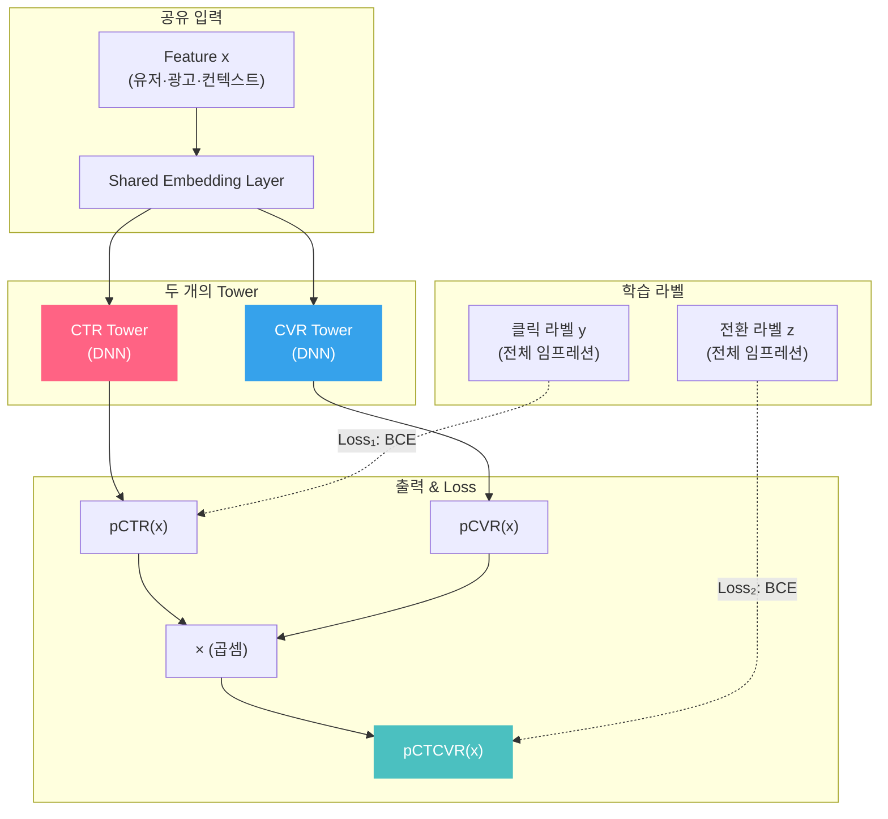

## 1. pCVR 모델링이 pCTR과 다른 점 (Precautions)
pCTR 모델링 경험을 바탕으로 pCVR로 확장할 때 직면하는 주요 챌린지들을 정리함.

### ① 샘플 선택 편향 (Sample Selection Bias, SSB)
- 현상: 모델은 '클릭된 데이터'만 학습하지만, 실제 서빙 시에는 '전체 노출' 컨텍스트에서 예측을 수행해야 함.
- 해결: ESMM(Entire Space Multi-Task Model) 구조를 도입하여 $P(z=1|y=1, x)$가 아닌 전체 공간에서 $P(y=1, z=1|x)$를 학습하도록 유도하는 것이 정석임.

#### ESMM 아키텍처 상세

ESMM(Ma et al., Alibaba, SIGIR 2018)은 전환 예측을 **전체 임프레션 공간**에서 수행하기 위해 고안된 Multi-Task 구조입니다.

핵심 분해:

$$pCTCVR(x) = \underbrace{pCTR(x)}_{\text{Task 1}} \times \underbrace{pCVR(x)}_{\text{Task 2}}$$

- **Task 1 (CTR Tower)**: 전체 임프레션 데이터로 학습 → 클릭 확률 예측
- **Task 2 (CVR Tower)**: 전체 임프레션 데이터로 학습하되, 최종 Loss는 $pCTR \times pCVR$의 곱으로 역전파
- **CTCVR**: 두 Tower의 출력을 곱한 값 → 실제 전환 라벨(impression → conversion)로 직접 감독



**왜 이 구조가 SSB를 해결하는가?**

- 기존 방식: CVR 모델을 **클릭된 샘플에서만** 학습 → $P(z=1|y=1, x)$를 학습하지만 서빙 시에는 $P(z=1|x)$가 필요 → 분포 불일치
- ESMM: CVR Tower의 출력(pCVR)이 CTR Tower의 출력(pCTR)과 곱해져 pCTCVR을 만들고, 이 곱이 **전체 임프레션 라벨**(CTCVR)로 감독됨 → CVR Tower는 여전히 $P(z=1|y=1, x)$를 모델링하지만, 클릭 필터 없이 전체 임프레션으로 학습하므로 Training-Serving 분포 불일치 해소
- 추가 이점: Embedding Layer 공유로 **전환 데이터의 희소성 문제**까지 완화 (CTR의 풍부한 클릭 시그널이 공유 임베딩을 통해 CVR Tower로 전이)

```python
# ESMM Forward Pass (Pseudocode)
# 핵심: 전체 임프레션 공간에서 학습 → Selection Bias 제거

class ESMM:
    def __init__(self, embed_dim, hidden_dim):
        self.shared_embedding = EmbeddingLayer(embed_dim)  # 공유 임베딩
        self.ctr_tower = DNN(hidden_dim)   # 클릭 예측 Tower
        self.cvr_tower = DNN(hidden_dim)   # 전환 예측 Tower

    def forward(self, x):
        emb = self.shared_embedding(x)        # 지식 전이의 핵심
        pCTR = sigmoid(self.ctr_tower(emb))   # P(click | impression)
        pCVR = sigmoid(self.cvr_tower(emb))   # P(convert | click)
        pCTCVR = pCTR * pCVR                  # P(convert | impression)
        return pCTR, pCVR, pCTCVR

    def loss(self, pCTR, pCTCVR, click_label, convert_label):
        # 두 Loss 모두 '전체 임프레션' 데이터 사용 (클릭 데이터만 X)
        L_ctr = binary_cross_entropy(pCTR, click_label)
        L_ctcvr = binary_cross_entropy(pCTCVR, convert_label)
        return L_ctr + L_ctcvr  # CVR Tower는 곱셈을 통해 간접 학습
```

### ② 데이터 희소성 (Data Sparsity)
- 현상: Click 대비 Conversion은 발생 빈도가 현저히 낮아 양성 샘플(Positive Sample) 확보가 어려움.
- 해결: CTR 태스크와의 Multi-task Learning을 통해 로우 레벨 임베딩 층을 공유하거나, 사전 학습된 CTR 모델의 가중치를 Transfer 하는 방식이 유효함.

### ③ 지연된 피드백 (Delayed Feedback)
- 현상: 클릭은 즉각적이나 전환은 며칠 뒤에도 발생함. 학습 시점에 미전환된 데이터를 단순 Negative로 처리하면 노이즈가 됨.
- 해결: 적절한 Attribution Window 설정이 필수이며, 윈도우 내 미전환 데이터를 처리하는 알고리즘적 보정 검토가 필요함.

#### FSIW (Fake Negative Weighted) 알고리즘 상세

Delayed Feedback의 핵심 문제는 **가짜 음성(Fake Negative)**입니다. 학습 시점에 아직 전환이 도착하지 않은 샘플을 Negative로 잘못 라벨링하면, 모델이 전환율을 체계적으로 과소추정합니다.

**Fake Negative의 규모**: 일반적으로 전환의 30~60%가 클릭 후 24시간 이후에 발생합니다. 학습 데이터를 당일에 수집하면, 전환 라벨의 절반 가까이가 Fake Negative입니다.

FSIW(Ktena et al., 2019)는 이 문제를 **Importance Weighting**으로 해결합니다:

$$\mathcal{L}_{FSIW} = \sum_{i \in \text{Positive}} \log p(y=1|x_i) + \sum_{i \in \text{Negative}} \underbrace{w_i}_{\text{보정 가중치}} \cdot \log(1 - p(y=1|x_i))$$

여기서 가중치 $w_i$는 **"이 샘플이 진짜 Negative일 확률"**을 반영합니다:

$$w_i = \frac{P(\text{True Negative} | x_i, \text{elapsed time})}{P(\text{Observed Negative} | x_i, \text{elapsed time})}$$

- 클릭 직후 수집된 Negative → 아직 전환이 올 가능성 높음 → $w_i$가 작음 (덜 신뢰)
- 클릭 후 7일 경과한 Negative → 진짜 Negative일 가능성 높음 → $w_i$가 큼 (높은 신뢰)

**실무 적용 시 고려사항**:
- **Delay Distribution 모델링**: 전환 지연 시간의 분포를 별도로 학습해야 합니다 (보통 Exponential 또는 Weibull 분포 사용)
- **Attribution Window와의 관계**: 윈도우를 짧게 설정하면 Fake Negative가 늘어나 FSIW 보정이 더 중요해지고, 길게 설정하면 학습 데이터의 신선도가 떨어집니다
- **대안 접근법**: ES-DFM(Elapsed-time Sampling based Delayed Feedback Model)은 지연 시간을 모델에 직접 피처로 넣어 학습하는 방식으로, FSIW 대비 구현이 단순합니다

```python
import numpy as np

def fsiw_weights(elapsed_hours, delay_lambda=0.05):
    """FSIW: 경과 시간에 따른 Negative 샘플 가중치"""
    # 전환 지연 ~ Exponential(λ): 오래될수록 진짜 Negative 확률 ↑
    survival = np.exp(-delay_lambda * elapsed_hours)
    return np.clip(1.0 - survival, 0.01, 1.0)

hours = np.array([1, 6, 12, 24, 48, 168])  # 1시간 ~ 7일
weights = fsiw_weights(hours)

for h, w in zip(hours, weights):
    bar = "█" * int(w * 20)
    trust = "낮은 신뢰" if w < 0.5 else "높은 신뢰"
    print(f"  경과 {h:3d}시간 → w={w:.3f} {bar} ({trust})")
# 클릭 직후 Negative: Fake Negative 가능성 높음 → 가중치 낮음
# 7일 후 Negative: 진짜 Negative일 확률 높음 → 가중치 높음
```

### ④ Last Click Attribution의 한계 
- 현재 실무에서 많이 쓰는 Last Click 방식은 구매 직전의 매체에만 기여도를 몰아주는 경향이 있음. 모델이 특정 시점의 광고만 과대평가하지 않도록 비즈니스 로직에 따른 라벨링 검증이 중요함.

---

## 2. 중복 전환 (Duplicated Conversion) 이슈와 대응
데이터 파이프라인 및 모델의 신뢰도를 저해하는 '중복 전환' 문제를 심층 분석함.

### ① 중복 발생 원인
- 기술적 요인: 사용자 페이지 새로고침, 뒤로 가기 액션, 중복 설치된 트래킹 태그 등.
- 비즈니스 요인: 여러 광고 채널을 거쳐 들어온 유저에 대해 각 플랫폼이 독자적으로 전환을 집계할 때 발생.

### ② 모델에 미치는 영향
- 라벨 노이즈: 동일 액션이 중복 학습되어 특정 피처에 과도한 가중치가 부여됨.
- 예측값 왜곡: 실제 확률보다 pCVR이 높게 튀어 비딩 로직에서 오버비딩(Over-bidding) 유발 및 광고주 ROAS 저하.

### ③ 실무적 해결 방안 (Deduplication)
- Transaction ID (Order ID) 활용: 결제 고유 번호를 Key로 잡아 파이프라인 상단에서 중복을 제거함 (가장 권장됨).
- Click ID 기반 1:1 매핑: 클릭 시 부여한 고유 ID를 전환 시점에 매칭하여 유일성을 보장함.
- Time-window 기반 필터링: 동일 유저가 단시간 내 동일 상품에 발생시킨 전환을 하나로 합침.

---

## 3. 개인적인 인사이트 (Summary)
pCVR은 모델의 아키텍처 개선만큼이나 '얼마나 깨끗하고 편향 없는 정답지(Label)를 구축하느냐'라는 데이터 엔지니어링 측면의 완성도가 성능을 좌우함. 특히 중복 제거 로직은 모델 학습 전 단계인 데이터 전처리 파이프라인에서 완결성을 가져야 함.
