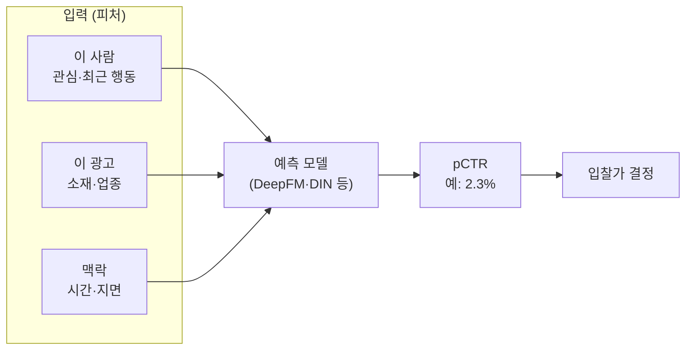

DSP가 경매에서 “이 자리에 ₩1,200 내겠다”고 부를 때, 그 ₩1,200은 어디서 나왔을까? 출발점은 단 하나의 숫자다 — **“이 사람이 이 광고를 누를 확률.”** 그 추정치를 **pCTR**이라 부른다.

이 글은 pCTR이 **무엇인지**, **왜 광고의 심장인지**, 그리고 **어떻게 그 확률을 맞히는지**를 — 모델 내부 수식 없이 — 풀어본다.

> 한 줄 요약: pCTR은 **‘누를 확률’의 예측치**다. 이 숫자가 입찰가와 광고 줄 세우기를 모두 좌우한다.

---

## 1. pCTR이 뭔가

**pCTR = predicted Click-Through Rate**, 즉 **‘예측한 클릭률’**이다.

- CTR(실측) = 실제로 노출 대비 몇 번 눌렸나 (지나간 결과).
- **pCTR(예측)** = 앞으로 이 노출이 눌릴 확률 (지금 맞혀야 하는 값).

예: “민지가 이 운동화 광고를 누를 확률 **2.3%**.” 0과 1 사이의 확률 한 개다. 과거 노출·클릭 기록으로 학습한 모델이 **매 광고 요청마다(0.1초 안에)** 즉석에서 찍어 준다.

---

## 2. 왜 ‘심장’인가 — pCTR이 돈을 정한다

광고를 줄 세울 때 **입찰가만 보지 않는다.** 매체 입장에선 “비싸게 부른 광고”가 아니라 “**노출 한 번에 돈이 제일 되는 광고**”가 이겨야 한다. 그 기준이 `입찰가 × pCTR`(기대 수익)이다.

**예시 — 더 싸게 불러도 이긴다:**

| 광고 | 클릭당 입찰가 | pCTR | 노출 1번의 기대 수익 |
|---|---|---|---|
| A | ₩1,000 | 1.0% | ₩10 |
| **B** | ₩800 | 2.0% | **₩16** |

B는 더 싸게 불렀지만 **누를 확률이 두 배**라, 노출당 기대 수익이 높아 이긴다. 그래서 pCTR이 0.1%만 정확해져도 매출이 출렁인다. **pCTR이 광고 시스템의 심장**이라 불리는 이유다.

> DSP의 입찰가도 같은 원리다. “이 클릭의 가치 × 누를 확률(pCTR)”이 곧 이 노출에 부를 수 있는 값의 상한이 된다.

---

## 3. 어떻게 맞히나 (직관)

모델에 세 가지를 넣는다.

모델은 **“과거에 이런 사람 × 이런 광고 × 이런 상황에서 몇 %가 눌렀나”**를 학습해 둔다. 새 요청이 오면 그 패턴으로 확률을 찍는다. 모델 자체는 단순한 로지스틱 회귀(LR)에서 시작해 FM → DeepFM → DIN처럼 점점 똑똑해져 왔다.

> 모델 내부가 궁금하면 → [Deep CTR 모델의 진화](post.html?id=deep-ctr-models)

---

## 4. pCVR — 클릭 다음의 ‘살 확률’

클릭이 목표가 아니라 **구매(전환)**가 목표라면, 누를 확률만으론 부족하다. **pCVR(예측 전환율)** — 누른 뒤 실제로 살 확률 — 까지 곱한다.

- 클릭이 목표: `입찰가 ≈ 가치 × pCTR`
- 전환이 목표: `입찰가 ≈ 가치 × pCTR × pCVR`

---

## 5. 함정 — 줄은 맞아도 ‘숫자’가 틀릴 수 있다

pCTR은 **순위 매기기(누가 더 누를까)**만 잘하면 될 것 같지만, 입찰가에 곱해지는 순간 **절대 확률값 자체가 정확**해야 한다.

모델이 전반적으로 “2.1%”라 보는데 실제가 “2.4%”라면, 입찰가가 통째로 낮게 깔린다. 그래서 예측 평균을 실제에 맞추는 **보정(Calibration)**이 필수다.

> AUC(줄 세우기 점수)가 높아도 돈을 잃는 이유 → [Calibration](post.html?id=calibration)

---

## 6. 한눈 정리

| 용어 | 뜻 | 어디에 쓰나 | 예시 |
|---|---|---|---|
| **CTR** | 실제 클릭률(결과) | 성과 측정 | 노출 100 중 클릭 2 = 2% |
| **pCTR** | 예측 클릭률 | 입찰가·광고 랭킹 | “이 노출, 2.3%” |
| **pCVR** | 예측 전환율 | 전환 목표 입찰 | “누르면 0.4% 구매” |
| **Calibration** | 예측 확률 보정 | 입찰가 왜곡 방지 | 2.1% → 실제 2.4%로 |

---

## 7. 헷갈리기 쉬운 점

- **pCTR은 ‘점수’가 아니라 ‘확률’이다.** 순위만 맞으면 되는 게 아니라 절댓값이 맞아야 한다(그래서 Calibration이 중요).
- **AUC 높음 ≠ 확률 정확함.** 줄은 잘 세워도 숫자가 부풀면 입찰이 틀어진다.
- **학습 데이터부터 편향돼 있다.** 보여준 광고만 클릭 기록이 남으니, 안 보여준 광고는 학습이 안 된다 → [Negative Sampling & Bias](post.html?id=negative-sampling-bias).

---

## 더 깊이 보기

- 모델 아키텍처의 진화(LR→DeepFM→DIN) → [Deep CTR 모델의 진화](post.html?id=deep-ctr-models)
- 예측 확률을 실제에 맞추기 → [Calibration: AUC가 높아도 돈을 잃는 이유](post.html?id=calibration)
- pCTR이 입찰가가 되는 과정 → [Bid Shading & Censored Data](post.html?id=bid-shading-censored)
- pCTR 정확도가 매출에 주는 영향(데모) → [pCTR Impact](demo-pctr-impact.html)
- 처음이라면, 그림으로 → [쉬운 버전 ‘모델이 배우는 법’](ecosystem-easy.html#modeling)
- 약어가 헷갈리면 → [쉬운 용어 사전](ecosystem-terms.html#pctr-cvr)
