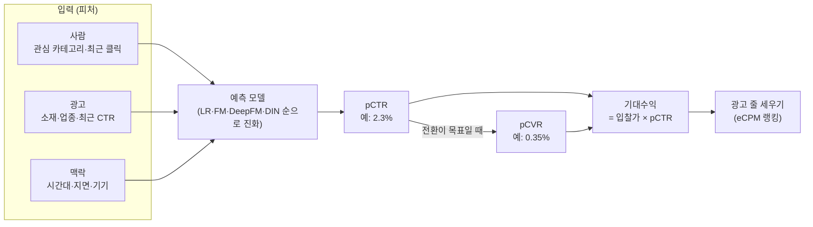

광고를 사는 쪽(DSP)이 경매에서 “이 자리에 ₩1,200 내겠다”고 부를 때, 그 ₩1,200은 어디서 나왔을까? 출발점은 단 하나의 숫자다 — **“이 사람이 이 광고를 누를 확률.”** 그 추정치를 **pCTR**이라 부른다.

이 글은 pCTR이 **무엇인지**, **왜 광고의 심장인지**를 먼저 풀어본다. 그리고 **어떻게 그 확률을 맞히는지**, **순위는 맞는데 숫자가 틀리면 무슨 일이 생기는지**까지 — 모델 내부 수식 없이 — 다룬다.

> 한 줄 요약: pCTR은 **‘누를 확률’의 예측치**다. 이 숫자가 입찰가와 광고 줄 세우기를 모두 좌우한다. 그런데 **순서(랭킹)만 맞고 크기(절댓값)가 틀려도 AUC는 티를 내지 않는다** — 그래서 보정(Calibration)이 따로 필요하다.

---

## 1. pCTR이 뭔가

**pCTR(predicted Click-Through Rate, 예측 클릭률)은 ‘이 노출이 눌릴 확률’을 모델이 미리 찍어보는 숫자다.** 실제로 몇 번 눌렸는지(CTR)는 이미 지나간 결과지만, pCTR은 아직 일어나지 않은 일에 대한 예측이다.

- **CTR(실측)**: 노출 대비 실제로 몇 번 클릭됐나. 지나간 결과라 캠페인이 끝나야 정확히 안다.
- **pCTR(예측)**: 지금 이 노출이 클릭될 확률. 광고 요청이 들어온 그 순간, 아직 아무 일도 일어나기 전에 찍어야 하는 값이다.

예를 들어 "민지가 이 운동화 광고를 누를 확률 2.3%"라는 식이다. 0과 1 사이의 확률 한 개일 뿐이지만, 이 숫자를 내놓는 데는 과거 수억 건의 노출·클릭 기록으로 학습한 모델이 동원된다. 그리고 그 모델은 광고 요청이 올 때마다, 보통 **0.1초 안에** 이 숫자를 즉석에서 다시 계산한다. 사람 한 명 한 명, 순간순간 다른 값이 나온다는 뜻이다.

---

## 2. 왜 ‘심장’인가 — eCPM이 광고 줄을 세운다

**광고 줄 세우기는 입찰가가 아니라 ‘노출 한 번의 기대수익’으로 한다. pCTR이 그 기대수익의 절반을 결정한다.**

매체 입장에선 "누가 더 비싸게 불렀나"는 관심사가 아니다. 매체가 실제로 파는 건 클릭이 아니라 **노출** 한 번이다. 그래서 광고를 "이 노출을 주면 기대할 수 있는 돈이 얼마인가"로 줄 세우고, 그 계산은 단순하다.

**기대수익 = 입찰가 × pCTR**

이걸 노출 1,000회 기준으로 환산한 값이 **eCPM**(effective Cost Per Mille, 노출 1,000회당 예상 수익)이다. 다섯 광고가 같은 자리를 놓고 겨루는 상황을 보자. 다 다른 값을 불렀고, pCTR도 모델이 각각 다르게 예측했다.

| 광고 | 클릭당 입찰가 | pCTR | 노출 1회 기대수익 | eCPM(1,000회) | 순위 |
|---|---|---|---|---|---|
| A | ₩1,000 | 1.0% | ₩10.0 | ₩10,000 | 3 |
| B | ₩800 | 2.0% | ₩16.0 | ₩16,000 | 2 |
| C | ₩1,500 | 0.6% | ₩9.0 | ₩9,000 | 4 |
| **D** | ₩600 | 2.8% | **₩16.8** | **₩16,800** | **1** |
| E | ₩2,000 | 0.4% | ₩8.0 | ₩8,000 | 5 |

**가장 비싸게 부른 E(₩2,000)가 꼴찌고, 가장 싸게 부른 D(₩600)가 1등이다.** D는 입찰가로는 다섯 중 가장 낮지만 pCTR이 2.8%로 압도적으로 높아서, 노출 1회의 기대수익(₩16.8)이 가장 크다. eCPM은 이 기대수익을 노출 1,000회 기준으로 늘려 쓴 값일 뿐이라 순위는 똑같다. (eCPM 자체를 더 자세히 보려면 → [eCPM 랭킹](post.html?id=ecpm-ranking))

이 표 하나가 "pCTR이 왜 돈인가"의 전부다. 입찰가를 아무리 높여 불러도 pCTR 추정이 낮으면 줄 뒤로 밀리고, 입찰가가 낮아도 pCTR이 높으면 앞으로 온다. pCTR을 0.1%포인트만 더 정확히 맞혀도 어떤 광고가 이기고 지는지가 뒤집힌다는 뜻이라, 매출이 바로 이 지점에서 출렁인다. DSP가 부르는 입찰가 자체도 같은 공식을 거꾸로 쓴 것이다. "이 클릭(또는 전환)의 가치 × pCTR"이 이 노출에 낼 수 있는 값의 상한이 된다.

다만 단위를 구분해 두자. 표의 '입찰가'는 **클릭 한 번당** 낼 값이고, 여기서 말하는 '노출에 낼 수 있는 값'은 **노출 한 번당**이다. 노출당 값이 곧 위에서 계산한 기대수익이다.

---

## 3. 순위는 맞는데 숫자가 틀리면 — 보정(Calibration)

**같은 모델이 하루치 노출 10만 건을 예측 구간별로 묶어 보면, 순위는 완벽하다. 그런데 전 구간에서 낮게 본다 — 구간별로 11~17%, 전체로는 13%다.**

실제 서비스 로그를 예측 구간별로 묶어 보자. pCTR을 0~1%부터 5% 이상까지 다섯 구간으로 나누고, 그 구간에서 실제로 몇 번 클릭이 났는지 대조한다.

| 예측 구간 | 노출 | 예측 평균 | 실제 CTR | 예측 클릭 | 실제 클릭 | COPC(실제÷예측) |
|---|---|---|---|---|---|---|
| 0~1% | 40,000 | 0.60% | 0.70% | 240 | 280 | 1.17 |
| 1~2% | 30,000 | 1.50% | 1.70% | 450 | 510 | 1.13 |
| 2~3% | 18,000 | 2.40% | 2.70% | 432 | 486 | 1.13 |
| 3~5% | 9,000 | 3.80% | 4.30% | 342 | 387 | 1.13 |
| 5%+ | 3,000 | 6.50% | 7.20% | 195 | 216 | 1.11 |
| **전체** | **100,000** | — | — | **1,659** | **1,879** | **1.13** |

줄을 세우는 능력은 흠잡을 데가 없다. 예측 구간이 높아질수록 실제 CTR도 그대로 따라 올라간다(0.70% → 1.70% → 2.70% → 4.30% → 7.20%). **문제는 절댓값이다.** 모든 구간에서 실제가 예측보다 높다 — 전체로 보면 예측은 1,659건인데 실제는 1,879건이 나왔다. 실제 클릭을 예측 클릭으로 나눈 값을 **COPC**(Click Over Predicted Click, 실제 클릭 ÷ 예측 클릭)라 부른다. 이 모델의 COPC는 **1.13**이다. 1보다 크다는 건 모델이 실제보다 낮게 보고 있었다는 뜻이다.

입찰가는 pCTR에 비례해 나가므로(2절), pCTR이 통째로 13% 낮으면 입찰가도 통째로 13% 낮게 깔린다. 순위는 그대로라 "제일 좋은 광고가 이긴다"는 원칙은 안 깨지지만, **이겼어야 할 경매에서 근소한 차이로 지는 일이 조용히 늘어난다.** COPC는 방향을 헷갈리기 쉽다. 이 블로그의 [Calibration](post.html?id=calibration) 글은 반대 방향인 P/O Ratio(예측÷실제)로 설명한다. 어느 글을 보고 있는지 늘 확인하고 읽어야 한다.

<div class="demo-embed-wrap">
<iframe class="demo-embed" src="demo-calibration.html?embed=1" height="560" loading="lazy" title="Calibration 미니 데모"></iframe>
<a class="demo-embed-open" href="demo-calibration.html" target="_blank" rel="noopener">↗ 전체 데모로 열기</a>
</div>

---

## 4. 파이썬으로 확인하기 — AUC는 그대로인데 돈은 잃는다

**모든 예측에 0.5를 곱해도 AUC는 소수점 열 자리까지 똑같다. 그런데 LogLoss는 확실히 나빠진다.** pCTR을 평가할 때 AUC 하나만 보면 이 사고를 절대 못 잡는다는 뜻이다.

**AUC**(Area Under the ROC Curve)는 "클릭한 노출의 예측이 안 클릭한 노출의 예측보다 높았나"만 센다. 예측값 자체가 얼마인지는 안 본다. 반면 입찰가는 예측값 그 자체(2절의 `입찰가 × pCTR`)에 곱해지므로, 예측이 통째로 눌리면 AUC는 눈치채지 못한 채 돈만 샌다. **LogLoss**는 모델이 낸 확률이 실제 결과와 얼마나 다른지를 재는 지표다(binary cross-entropy라고도 부른다). 반대로 절댓값을 그대로 본다. 말로는 그럴듯한데, 정말 그런지 코드로 직접 확인해 보자.

아래 코드는 노출 12건(클릭 3건)짜리 작은 예측 결과를 두고 `auc()`와 `logloss()`를 라이브러리 없이 직접 구현해 비교한다. 원본 예측 `p`와, 그 값에 전부 0.5를 곱한 `p_half`를 나란히 넣는다.

```python
# "AUC는 그대로인데 돈은 잃는다"를 직접 확인한다.
# AUC(줄 세우기 점수)는 예측값의 순위만 보고, LogLoss는 예측 확률의 절댓값까지 본다.
# 이 코드는 노출 12건(클릭 3건)의 pCTR 예측을 두 버전으로 비교한다:
#   p      = 원래 모델이 낸 예측
#   p_half = 그 예측에 전부 0.5를 곱한 것 (보정이 어긋나 예측이 통째로 눌린 상황)
# stdlib만 쓴다. 값은 하드코딩해 실행할 때마다 같은 결과가 나오게 한다.
import math

# (노출 번호, 실제 클릭 여부 y, 모델이 낸 pCTR 예측 p) — 클릭 3건, 무클릭 9건.
# 일부러 "낮은 p인데 클릭"(#2), "높은 p인데 무클릭"(#6)을 하나씩 섞어
# AUC가 1.0(완벽)이 아니게 만들었다 — 실제 모델도 이 정도 노이즈는 흔하다.
data = [
    (1,  0, 0.05), (2,  1, 0.12), (3,  1, 0.35), (4,  0, 0.08),
    (5,  0, 0.20), (6,  0, 0.30), (7,  0, 0.15), (8,  1, 0.45),
    (9,  0, 0.10), (10, 0, 0.25), (11, 0, 0.18), (12, 0, 0.22),
]


def auc(rows):
    """순위 기반 AUC를 직접 센다 (사이킷런 없이).
    모든 (클릭, 무클릭) 쌍을 하나씩 비교해, 클릭 쪽 예측이 더 높으면 1점,
    같으면 0.5점을 주고, 전체 쌍 수로 나눈다. 이게 AUC의 원래 정의(Mann-Whitney)다."""
    pos = [p for _, y, p in rows if y == 1]   # 클릭 3건의 예측
    neg = [p for _, y, p in rows if y == 0]   # 무클릭 9건의 예측
    win = 0.0
    for pp in pos:
        for pn in neg:
            if pp > pn:
                win += 1.0
            elif pp == pn:
                win += 0.5
    return win / (len(pos) * len(neg))        # 3*9 = 27쌍


def logloss(rows):
    """binary cross-entropy(로그 손실). row는 (id, y, p) 형태."""
    eps = 1e-12  # p가 0이나 1에 붙어 log(0)이 나는 사고 방지
    total = 0.0
    for _, y, p in rows:
        p = min(max(p, eps), 1 - eps)
        total += -(y * math.log(p) + (1 - y) * math.log(1 - p))
    return total / len(rows)


half = [(i, y, 0.5 * p) for i, y, p in data]   # 모든 예측에 0.5를 곱한 버전

auc_orig, auc_half = auc(data), auc(half)
ll_orig, ll_half = logloss(data), logloss(half)

print(f"AUC       원본 {auc_orig:.4f}  ->  절반 {auc_half:.4f}   (차이 {auc_orig - auc_half:.10f})")
print(f"LogLoss   원본 {ll_orig:.4f}  ->  절반 {ll_half:.4f}   ({ll_half - ll_orig:+.4f})")

# 입찰가는 관례상 '가치 × pCTR'에 비례한다. 예측을 절반으로 깎으면
# 이 12건 전부에서 입찰가도 정확히 절반이 된다 — 경매에서 조용히 밀린다.
CLICK_VALUE = 1_000  # 클릭 1회의 가치를 편의상 ₩1,000이라 두면
i, y, p = data[2]     # 노출 #3 (p=0.35, 실제로 클릭까지 된 건)
print(f"노출 #{i} 입찰가   원본 ₩{CLICK_VALUE * p:.0f}  ->  절반 ₩{CLICK_VALUE * 0.5 * p:.0f}")

# 출력:
# AUC       원본 0.7778  ->  절반 0.7778   (차이 0.0000000000)
# LogLoss   원본 0.4738  ->  절반 0.5713   (+0.0975)
# 노출 #3 입찰가   원본 ₩350  ->  절반 ₩175
```

이유는 수식 없이도 설명된다. `p_half = 0.5 * p`는 원래 값에 양수를 곱하기만 한 **단조증가 변환**이다. A가 B보다 크면 0.5A도 0.5B보다 항상 크다 — 순서가 바뀔 방법이 없다. 그래서 순서만 세는 AUC는 소수점 열 자리까지 완전히 그대로다. 반대로 클릭된 노출(양성)의 LogLoss 기여분은 `-log(0.5p) = log(2) - log(p)`다. 그래서 절반으로 깎을 때마다 정확히 `log(2) ≈ 0.693`만큼 손해를 보고 시작한다. 무클릭 노출(음성) 쪽은 예측이 낮아진 만큼 살짝 이득을 보지만, 그 이득은 클릭된 쪽의 손해보다 작다. **원래 확률이 대체로 맞던 모델이라면** 전체 LogLoss는 결국 나빠진다.

그리고 그 왜곡은 그대로 입찰가로 번진다. 위 코드의 노출 #3처럼, 입찰가가 pCTR에 비례한다면(2절) 예측이 반토막 나는 순간 입찰가도 반토막이다. AUC 대시보드는 여전히 초록불이고 모델 리뷰 회의에서는 "성능 그대로"라고 보고된다. 그러나 실제로는 모든 경매에서 절반 가격으로 싸우고 있는 셈이다. 그래서 실무에서는 AUC 하나만으로 배포를 승인하지 않고, 반드시 LogLoss나 COPC 같은 절댓값 지표를 같이 본다.

---

## 5. 어떻게 맞히나 (직관)

**모델은 ‘사람 × 광고 × 맥락’ 세 가지 입력을 받아 pCTR 하나를 뱉는다. 그 안의 계산 방식은 점점 더 복잡한 조합을 자동으로 찾는 쪽으로 진화해 왔다.**


```mermaid
graph LR
  subgraph IN["입력 (피처)"]
    U["사람<br/>관심 카테고리·최근 클릭"]
    A["광고<br/>소재·업종·최근 CTR"]
    C["맥락<br/>시간대·지면·기기"]
  end
  M["예측 모델<br/>(LR·FM·DeepFM·DIN 순으로 진화)"]
  P["pCTR<br/>예: 2.3%"]
  V["pCVR<br/>예: 0.35%"]
  E["기대수익<br/>= 입찰가 × pCTR"]
  R["광고 줄 세우기<br/>(eCPM 랭킹)"]
  U --> M
  A --> M
  C --> M
  M --> P --> E
  P -->|전환이 목표일 때| V --> E
  E --> R
```

첫 번째 ‘사람’ 입력엔 최근 본 상품 카테고리, 추정 연령대·성별, 최근 7일 클릭·구매 이력 같은 게 들어간다. ‘광고’ 입력은 소재 이미지·문구, 업종, 그 광고 자체의 최근 평균 CTR이다. ‘맥락’은 지금이 몇 시인지, 피드인지 배너인지, 모바일인지 PC인지처럼 노출이 일어나는 그 순간의 상황이다. 셋 다 사람이 하나하나 정한 규칙이 아니라, 과거 로그에서 "이런 조합일 때 몇 %가 눌렀나"를 모델이 스스로 찾아낸 패턴이다.

모델 계보는 **"조합을 사람이 다 못 적으니 기계가 대신 찾게 한다"**는 방향으로 흘러왔다. 로지스틱 회귀(LR, Logistic Regression)는 피처를 하나씩 넣고 가중치만 학습한다. "20대이면서 운동화 광고"처럼 두 피처를 곱한 조합까지 쓰려면, 사람이 그 조합 피처를 미리 만들어 넣어야 한다. 실제 피처는 수만 종류라 사람이 짝지어 볼 수 있는 조합엔 한계가 있다. FM(Factorization Machine)은 이 조합을 벡터 내적으로 자동 계산한다. 사람이 일일이 짝짓지 않아도 "함께 나타나면 유의미한 피처 쌍"을 찾아낸다. DeepFM은 여기에 딥러닝을 얹어 FM이 못 보는 더 복잡한(고차) 조합까지 잡는다. DIN(Deep Interest Network)은 한 걸음 더 나간다. 같은 사람이라도 "지금 이 광고와 관련 있는 과거 행동"에만 가중치를 더 실어준다. 운동화 광고가 뜨면, 그 사람의 과거 이력 중 신발 관련 클릭에 더 주의를 기울이는 식이다. 사람마다 관심사가 다르다는 사실을 모델 구조 안에 넣은 것이다.

정확도만 좇을 수 없는 이유도 있다. 이 모델은 광고 요청이 올 때마다 **0.1초 안에** 답해야 한다. DIN처럼 무거운 모델을 후보 광고 전부에 다 돌리면 시간이 모자란다. 그래서 실무에서는 가벼운 모델로 후보를 빠르게 추리고 마지막 소수의 후보에만 무거운 모델을 돌리는 **랭킹 캐스케이드** 구조를 쓴다. 정확도와 지연(latency)이 서로 맞바꿔야 하는 설계 변수라는 뜻이다.

> 모델 구조 자체가 더 궁금하면 → [Deep CTR 모델의 진화](post.html?id=deep-ctr-models), 캐스케이드 구조는 → [모델 서빙 아키텍처](post.html?id=model-serving-architecture)

---

## 6. pCVR — 클릭 다음의 ‘살 확률’

**목표가 클릭이 아니라 구매(전환)라면, 누를 확률만으로는 부족하다. 누른 다음 실제로 살 확률까지 곱해야 한다.**

**pCVR**(predicted Conversion Rate, 예측 전환율)의 정의는 이렇다. "클릭한 사람이 그다음 실제로 전환(구매·설치·가입 등)할 확률"의 예측치를 뜻한다. 클릭이 목표인 캠페인은 `입찰가 ≈ 가치 × pCTR`로 충분하다. 그런데 전환이 목표인 캠페인은 클릭까지 갔다가 안 사는 사람도 수두룩해서, 한 단계를 더 곱해야 한다.

**입찰가 ≈ 가치 × pCTR × pCVR**

2절의 D 광고를 그대로 가져와 보자. 이번엔 목표를 클릭에서 전환으로 바꾼다. D의 pCTR은 2.8%로 그대로 두고, 전환 가치를 ₩30,000, pCVR을 0.35%라고 하자. 노출 1회 기대수익은 ₩30,000 × 2.8% × 0.35% = **₩2.94**, eCPM(1,000회)으로는 **₩2,940**이다.

2절에서 클릭이 목표일 때 D의 eCPM은 ₩16,800이었다. **목표를 클릭에서 전환으로 바꾸는 것만으로, 같은 광고 같은 pCTR인데 순위표가 통째로 다시 계산된다.** pCVR은 pCTR보다 훨씬 작은 숫자다 — 클릭보다 구매가 훨씬 드무니까. 대신 전환 하나의 가치는 클릭 하나보다 훨씬 크다. 그래서 실제로는 **작아진 확률을 커진 가치가 상쇄**한다. 여기서 ₩2,940이 나온 건 전환 가치를 ₩30,000으로 낮게 잡았기 때문이지, 전환 목표가 늘 불리해서가 아니다.

---

## 7. 담장 안의 pCTR [무대: 닫힌 생태계]

**로그인한 사용자를 놓고 시작하니 피처가 넉넉하고 로그 조인이 깨끗하다. 대신 자기 트래픽 바깥의 분포는 알 도리가 없다.**

네이버·카카오 같은 닫힌 생태계에서는 지면도, 소재도, 사용자도 전부 한 회사의 것이다. 사용자가 로그인해 있으니 "이 사람이 최근 뭘 봤는지"부터 시작해 5절의 ‘사람’ 피처를 훨씬 풍부하게 채울 수 있다. 노출·클릭·구매 로그가 한 곳에 있어 조인도 깨끗하다. pCTR 모델을 학습시킬 때 데이터를 이어 붙이느라 씨름할 일이 상대적으로 적다.

이 깨끗함은 pCVR 쪽에서 특히 두드러진다. 클릭 이후의 구매까지 같은 로그인 계정으로 이어지니, 6절의 pCVR도 다른 회사 데이터에 기대지 않고 자체 학습이 가능하다.

대신 결정적인 한계가 있다. 이 모델은 **자기 트래픽 안에서만** 배운다. 우리 플랫폼에 아직 들어온 적 없는 새로운 광고주, 새로운 소재 유형, 새로운 지면이 등장한다고 하자. 모델은 비슷한 걸 한 번도 본 적 없는 상태에서 첫 pCTR을 찍어야 한다. 담장 밖 세상의 트렌드가 아무리 바뀌어도, 그게 담장 안으로 들어오기 전까지 모델은 알지 못한다. 정확도를 올리기는 쉬운 환경이지만, 그 정확도엔 항상 "우리 안에서는"이라는 단서가 붙는다.

---

## 8. 열린 RTB의 pCTR [무대: 열린 RTB]

**남의 지면에서, 남의 쿠키 신호만으로 맞혀야 한다. 게다가 경매에서 지고 나면 그 결과조차 못 볼 때가 있다.**

열린 RTB에서 광고를 사는 쪽(DSP)은 자기 지면이 없다. 요청이 올 때마다 지면도 사용자도 다른 회사의 것이라 매번 낯선 조합을 마주한다. 로그인 여부가 제각각이고 서드파티 쿠키까지 줄어드는 중이라, 5절의 ‘사람’ 피처는 닫힌 생태계만큼 풍부하지 않은 채로 pCTR을 찍어야 한다.

여기에 구조적인 맹점이 하나 더 있다. 이 경매에서 **패찰하면**(경매에서 지면) 그 노출이 클릭됐는지 안 됐는지조차 알 수 없다. 로그 자체가 안 남기 때문이다. 그래서 새로운 지면, 새로운 사용자 구간에 처음 들어가는 DSP는 그 구간에 대한 정보가 하나도 없는 채로 입찰해야 한다. 몇 번 패찰하고 나서야 감을 잡기 시작한다. **콜드 스타트(cold start)가 상수처럼 따라붙는다**는 게 이 세계의 기본값이다.

이 맹점은 다음 절의 "보여준 광고만 배운다"는 함정과 뿌리가 같다. 다만 여기서는 그 뿌리가 매 순간, 매 경매마다 반복된다는 점이 다르다.

---

## 9. 함정 — 보여준 광고만 배운다

**노출된 광고만 로그에 클릭·무클릭이 남는다. 안 보여준 광고는 맞았는지 틀렸는지조차 영원히 알 수 없다.**

pCTR 모델은 실제로 노출된 기록으로만 학습한다. 그런데 애초에 어떤 광고를 보여줄지 정하는 것도 지금 이 모델(또는 그 이전 버전)이다. 그러니 모델이 "이 사람에겐 안 맞을 것"이라 낮게 점쳐서 한 번도 보여주지 않은 조합은, 그 판단이 맞았는지 확인할 기회 자체가 없다. 데이터가 스스로의 판단만 강화하는 셈이다. 이걸 **선택 편향(selection bias)**이라 부른다.

그래서 실무에서는 확률이 높은 후보만 보여주지 않는다. 대신 낮은 순위의 광고를 적은 비율로 일부러 섞어 보여주는 **탐색(exploration)**을 설계해 넣는다. 당장의 기대수익은 조금 손해 보더라도, 안 보여줬으면 영원히 몰랐을 조합의 진짜 클릭률을 확인해야 모델이 계속 정확해진다.

이 함정은 담장 안팎 모두에 있지만 결이 다르다. 담장 안에서는 플랫폼이 탐색 비율을 스스로 설계할 수 있다(7절). 반면 열린 RTB의 개별 DSP는 남의 경매 결과라 패찰한 노출의 데이터를 아예 만들 수조차 없다(8절). 탐색의 여지 자체가 더 좁다. 이 편향은 [Negative Sampling & Bias](post.html?id=negative-sampling-bias)에서 더 다룬다.

:::deep 더 깊이 — 다운샘플링하면 확률이 부풀고, 어떻게 되돌리나
클릭은 원래 노출 대비 1~2%도 안 되게 드물다. 무클릭 로그를 전부 쓰면 학습 데이터가 쓸데없이 무거워진다. 실무에서는 무클릭(음성) 샘플을 비율 $r$만 남기고 나머지는 버린 뒤 학습한다(예: $r=0.1$이면 무클릭 10건 중 1건만 남긴다).

문제는 이렇게 학습한 모델이 내놓는 예측 $p'$가 실제보다 부풀어 있다는 점이다. 모델은 "무클릭이 원래보다 훨씬 적은 세상"을 보고 배웠으니, 클릭 쪽 비중을 실제보다 높게 여긴다. 이 부풀림은 아래 식으로 정확히 되돌릴 수 있다.

$$p = \frac{p'}{p' + \dfrac{1 - p'}{r}}$$

여기서 $p'$는 다운샘플링된 데이터로 학습한 모델의 원 출력이다. $r$은 무클릭 샘플을 남긴 비율(0과 1 사이), $p$는 되돌린 실제 확률이다. 이 보정을 빼먹으면 모델은 계통적으로(무작위가 아니라 항상 같은 방향으로) 확률을 잘못 보고한다. 그 오차는 그대로 입찰가에 실리는데, 방향은 예측이 통째로 위로 부풀어 COPC가 1보다 **작아지는** 쪽이다(과대예측). 3절의 COPC 1.13은 반대쪽 — 예측이 낮게 깔린 경우다. 실서비스 트래픽 분포가 학습 때와 달라지면 이런 방향으로도 틀어진다.
:::

:::deep 더 깊이 — 왜 LogLoss가 확률에 정직한 지표인가
LogLoss(binary cross-entropy)는 **proper scoring rule**이라 불리는 성질을 만족한다. 모델이 자기가 진짜로 믿는 확률을 그대로 보고할 때 기대 손실이 최솟값이 되도록, 지표 자체가 그렇게 설계돼 있다는 뜻이다. 확률을 실제보다 부풀리거나 낮춰서 둥글게 말해도 손해만 커질 뿐, 이득을 볼 방법이 없다. 그래서 LogLoss가 나빠졌다는 신호는 곧이곧대로 믿을 수 있다. 반면 AUC 같은 순위 지표는 예측값의 절댓값 자체엔 관심이 없어서 순서만 지키면 어떤 크기를 불러도 점수가 똑같다. 4절의 코드에서 예측을 절반으로 깎아도 AUC가 눈치채지 못한 이유가 바로 이거다.
:::

---

## 10. 한눈 정리

| 개념 | 뜻 | 이 글에서 본 숫자 | 핵심 |
|---|---|---|---|
| **CTR** | 실제 클릭률(결과) | — | 지나간 성과를 재는 사후 지표 |
| **pCTR** | 예측 클릭률 | eCPM 1위 D(₩16,800) vs 꼴찌 E(₩8,000) | 입찰가·광고 랭킹을 결정 |
| **pCVR** | 예측 전환율 | D를 전환 목표로 재계산 → eCPM ₩2,940 | 목표가 구매일 때 한 번 더 곱하는 값 |
| **Calibration** | 예측 확률 보정 | COPC 1.13 (구간별 11~17%, 전체 13% 낮게) | 순위는 맞아도 절댓값이 틀리면 입찰가가 왜곡 |

---

## 11. 헷갈리기 쉬운 점

- **pCTR은 ‘점수’가 아니라 ‘확률’이다.** 순위만 맞으면 되는 게 아니라 절댓값 자체가 맞아야 한다 — 그래서 Calibration이 따로 필요하다.
- **AUC 높음 ≠ 확률 정확함.** 4절에서 봤듯 예측을 절반으로 깎아도 AUC는 소수점까지 그대로였다. 순위 지표만 보고 배포를 승인하면 이 사고를 못 잡는다.
- **eCPM 순위는 입찰가 순위와 다르다.** 2절에서 가장 비싸게 부른 E가 꼴찌였다. "비싸게 부른 광고가 이긴다"는 가정 자체가 틀렸다.
- **COPC의 방향을 헷갈리지 마라.** 실제÷예측이라 1보다 크면 ‘낮게 본 것’이다. 이 블로그의 [Calibration](post.html?id=calibration) 글은 반대 방향인 P/O Ratio(예측÷실제)로 설명한다. 어느 글을 보고 있는지 확인하고 읽어야 한다.
- **학습 데이터부터 편향돼 있다.** 보여준 광고만 클릭 기록이 남으니, 안 보여준 조합은 영원히 배울 기회가 없다.

---

## 더 깊이 보기

- eCPM과 세 시장의 랭킹 방식 → [eCPM 랭킹](post.html?id=ecpm-ranking)
- 모델 아키텍처의 진화(LR→DeepFM→DIN) → [Deep CTR 모델의 진화](post.html?id=deep-ctr-models)
- 캐스케이드로 지연과 정확도를 맞바꾸는 법 → [모델 서빙 아키텍처](post.html?id=model-serving-architecture)
- 예측 확률을 실제에 맞추기 → [Calibration: AUC가 높아도 돈을 잃는 이유](post.html?id=calibration)
- pCTR이 입찰가가 되는 과정 → [Bid Shading & Censored Data](post.html?id=bid-shading-censored)
- 노출 편향과 탐색 설계 → [Negative Sampling & Bias](post.html?id=negative-sampling-bias)
- pCTR 정확도가 매출에 주는 영향(데모) → [pCTR Impact](demo-pctr-impact.html)
- 보정을 슬라이더로 직접 실험 → [Calibration 데모](demo-calibration.html)
- 광고 ML 전체 지도에서 이 글의 위치 → [ML 엔지니어 트랙](ml-track.html)
- 처음이라면, 그림으로 → [쉬운 버전 ‘모델이 배우는 법’](ecosystem-easy.html#modeling)
- 약어가 헷갈리면 → [쉬운 용어 사전](ecosystem-terms.html#pctr-cvr)
