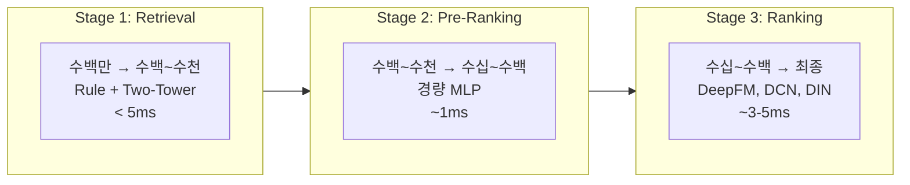
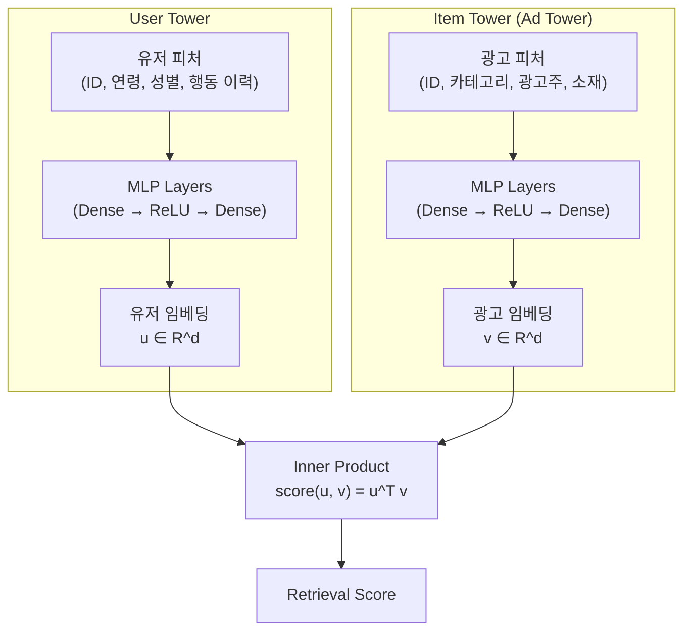
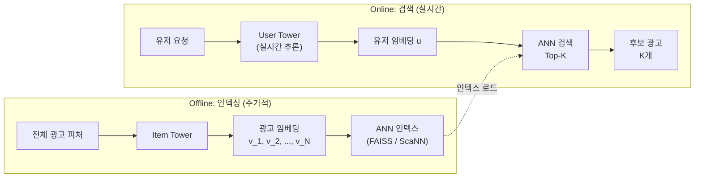

프로덕션 광고 시스템에는 수백만 개의 광고 후보가 존재하지만, 유저에게 실제로 보여줄 수 있는 광고는 1~3개입니다. 수백만 개 모두에 DeepFM이나 DCN 같은 무거운 pCTR 모델을 돌리는 것은 물리적으로 불가능합니다. **후보 생성(Retrieval)**은 이 수백만 개를 수백~수천 개로 줄이는 첫 관문이며, 여기서 놓친 광고는 아무리 정교한 랭킹 모델이 있어도 복구할 수 없습니다. 이 글은 Retrieval의 가장 강력한 방법론인 **Two-Tower Model**을 해부하고, ANN 인덱스를 통해 10ms 이내에 후보를 추리는 실무 아키텍처를 다룹니다.

> [모델 서빙 아키텍처](post.html?id=model-serving-architecture)에서 Multi-Stage Ranking의 전체 구조를, [Feature Store](post.html?id=feature-store-serving)에서 피처가 모델에 도달하는 과정을, [Deep CTR Models](post.html?id=deep-ctr-models)에서 랭킹 단계의 모델 진화를 다뤘습니다. 이 글은 그 파이프라인의 **가장 첫 번째 단계 -- Retrieval**에 집중합니다.

---

## 1. 핵심 비교 (Executive Summary)

Retrieval 방법론은 다양하지만, 프로덕션에서 실제로 쓰이는 선택지는 제한적입니다. 먼저 전체 지형을 봅니다:

| 방법 | 후보 수 처리 | 레이턴시 | 개인화 수준 | 구현 복잡도 |
|------|------------|---------|-----------|-----------|
| **Rule-based** | 수백만 → 수천 | < 1ms | 없음 (세그먼트 단위) | 매우 낮음 |
| **Inverted Index** | 수백만 → 수천 | < 1ms | 낮음 (속성 매칭) | 낮음 |
| **Two-Tower (DSSM)** | 수백만 → 수백~수천 | 1~5ms | 높음 (유저별 임베딩) | 중간 |
| **Multi-Interest** | 수백만 → 수백~수천 | 3~10ms | 매우 높음 (관심사별) | 높음 |
| **Graph-based** | 수백만 → 수백~수천 | 5~15ms | 매우 높음 (관계 기반) | 매우 높음 |

> 핵심 관찰: Rule-based와 Inverted Index는 빠르고 단순하지만 개인화에 한계가 있습니다. Two-Tower는 개인화와 레이턴시의 **최적 균형점**으로, 대부분의 프로덕션 광고 시스템에서 Retrieval의 핵심 엔진입니다.

---

## 2. 왜 Retrieval이 필요한가: Multi-Stage Ranking 복습

### 깔때기의 물리적 제약

수백만 개의 광고 후보에 대해 DeepFM 같은 복잡한 모델로 스코어링하면, 광고 하나당 추론에 0.1ms가 걸린다고 해도 100만 개에 100초가 필요합니다. RTB의 100ms 타임아웃 안에서 이것은 불가능합니다. 따라서 **단계별로 후보를 줄이면서 모델 복잡도를 올리는** 깔때기 구조가 필수입니다:



### 각 단계별 비교

| | Retrieval | Pre-Ranking | Ranking |
|---|---|---|---|
| **입력 후보** | 수백만 | 수백~수천 | 수십~수백 |
| **출력 후보** | 수백~수천 | 수십~수백 | 최종 1~10개 |
| **모델** | Rule / Two-Tower / ANN | 경량 MLP, LR | DeepFM, DCN, DIN |
| **레이턴시** | < 5ms | ~1ms | ~3-5ms |
| **최적화 목표** | **Recall** (누락 방지) | Recall + 경량성 | **Precision** (정확도) |

### Retrieval의 핵심 제약: Recall이 최우선

Retrieval 단계에서 탈락한 광고는 이후 어떤 단계에서도 복구할 수 없습니다. Pre-Ranking과 Ranking이 아무리 정교해도, 후보 풀에 없는 광고는 유저에게 도달하지 못합니다. 따라서 Retrieval은 **precision보다 recall을 극대화**해야 합니다. 좋은 광고를 하나라도 놓치는 것이, 나쁜 광고를 몇 개 포함하는 것보다 훨씬 치명적입니다.

> Retrieval에서 놓친 광고는 아무리 좋은 Ranking 모델이 있어도 복구할 수 없다. 이것이 Retrieval이 전체 파이프라인 성능의 상한선(upper bound)을 결정하는 이유이다.

---

## 3. Rule-Based Retrieval (Baseline)

### 타겟팅 규칙 매칭

가장 전통적인 Retrieval 방법은 광고주가 설정한 타겟 조건으로 필터링하는 것입니다. 캠페인마다 다음과 같은 타겟 조건이 존재합니다:

- **연령**: 20~34세
- **성별**: 여성
- **지역**: 서울, 경기
- **관심사 카테고리**: 패션, 뷰티
- **디바이스**: iOS

요청이 들어오면 유저의 속성과 캠페인의 타겟 조건을 매칭하여, 조건에 부합하는 광고만 후보로 통과시킵니다.

### Inverted Index

실무에서는 이 매칭을 효율적으로 수행하기 위해 **Inverted Index**를 구축합니다:

```
유저 속성 → 해당 속성을 타겟하는 광고 목록

gender=female   → [ad_001, ad_045, ad_112, ad_389, ...]
age=25-34       → [ad_001, ad_023, ad_045, ad_078, ...]
region=seoul    → [ad_001, ad_045, ad_200, ad_567, ...]

최종 후보 = intersection(gender, age, region)
         = [ad_001, ad_045, ...]
```

유저의 속성을 키로 인덱스를 조회하고, 교집합을 구하면 됩니다. 검색 엔진의 역색인과 동일한 원리이며, 수백만 광고에서 수천 개를 뽑는 데 1ms 이내로 충분합니다.

### 장점과 한계

| 장점 | 한계 |
|------|------|
| 매우 빠름 (< 1ms) | 타겟 조건 바깥의 잠재 고객을 발견하지 못함 |
| 구현이 단순하고 디버깅이 쉬움 | 타겟 조건이 넓으면 후보가 너무 많고, 좁으면 너무 적음 |
| 광고주 의도를 정확히 반영 | 개인화 불가 (동일 세그먼트 내 유저를 구분 못함) |
| 비즈니스 로직 준수 보장 | 새로운 유저-광고 매칭 탐색 불가 |

Rule-based Retrieval은 **필수 필터**로서의 역할은 계속하지만, 그 자체로는 개인화된 후보 생성이 불가능합니다. 이것이 Two-Tower Model이 필요한 이유입니다.

---

## 4. Two-Tower Model (DSSM)

Two-Tower Model은 2013년 Microsoft의 DSSM(Deep Structured Semantic Model)에서 시작하여, 현재 대부분의 대규모 추천/광고 시스템에서 Retrieval의 핵심 엔진으로 사용됩니다. 핵심 아이디어는 단순합니다: **유저와 광고를 같은 벡터 공간에 매핑하고, 가까운 것을 후보로 선택한다.**

### 4-1. 아키텍처



**User Tower**는 유저 피처를 입력받아 유저 임베딩 벡터를 출력합니다:

$$u = f_{\text{user}}(x_{\text{user}}) \in \mathbb{R}^d$$

**Item Tower**는 광고 피처를 입력받아 광고 임베딩 벡터를 출력합니다:

$$v = g_{\text{item}}(x_{\text{item}}) \in \mathbb{R}^d$$

두 벡터의 유사도가 Retrieval 점수입니다:

$$\text{score}(u, v) = u^T v$$

또는 cosine similarity를 사용하기도 합니다:

$$\text{score}(u, v) = \frac{u^T v}{\|u\| \cdot \|v\|}$$

두 타워가 **독립적으로** 임베딩을 계산한다는 점이 핵심입니다. 유저와 광고 사이의 교차 피처(cross feature)는 사용하지 않습니다. 이 제약이 서빙 시 엄청난 효율성을 가능하게 합니다.

### 4-2. 학습

#### Positive Pair

학습 데이터의 positive pair는 (유저, 클릭한 광고)입니다. 유저가 광고를 클릭했다면, 해당 유저 임베딩과 광고 임베딩의 내적이 높아야 합니다.

#### Negative Pair: 성능의 80%를 결정하는 선택

Two-Tower 학습에서 **negative sampling 전략이 모델 성능의 대부분을 결정**합니다. 어떤 광고를 "유저가 관심 없는 광고"로 규정할 것인가:

| 전략 | 방법 | 장점 | 단점 |
|------|------|------|------|
| **Random Negative** | 전체 광고 풀에서 랜덤 샘플링 | 구현 단순, 계산 효율적 | 대부분 too easy, 학습 신호 약함 |
| **In-batch Negative** | 같은 배치 내 다른 유저의 positive를 negative로 사용 | 추가 계산 없이 효율적, 적절한 난이도 | 인기 광고에 대한 sampling bias |
| **Hard Negative** | 노출되었으나 클릭하지 않은 광고 | 가장 informative한 학습 신호 | false negative 위험, 학습 불안정 가능 |

**In-batch Negative**가 실무에서 가장 널리 쓰입니다. 배치 크기가 $B$일 때, 각 유저의 positive 1개에 대해 나머지 $B-1$개가 자동으로 negative가 됩니다. 추가 샘플링 비용 없이 풍부한 negative를 확보할 수 있습니다.

다만, In-batch Negative는 인기 광고가 negative로 더 자주 등장하는 **sampling bias**가 발생합니다. 인기 광고는 많은 유저의 positive에 포함되므로, 다른 유저의 배치에서 negative로 과대 표집됩니다. 이를 보정하지 않으면 모델이 인기 광고의 점수를 과소평가하게 됩니다.

#### Loss Function

가장 일반적인 loss는 **Softmax Cross-Entropy**입니다. 배치 내 positive pair $(u_i, v_i^+)$에 대해:

$$\mathcal{L} = -\sum_{i=1}^{B} \log \frac{\exp(u_i^T v_i^+ / \tau)}{\sum_{j=1}^{B} \exp(u_i^T v_j / \tau)}$$

여기서 $\tau$는 temperature parameter로, 유사도 분포의 sharpness를 조절합니다. $\tau$가 작을수록 hard negative에 더 집중합니다.

**Sampling Bias Correction** (Yi et al., 2019)은 각 아이템의 sampling 확률 $p_j$를 보정합니다:

$$\mathcal{L} = -\sum_{i=1}^{B} \log \frac{\exp(u_i^T v_i^+ / \tau - \log p_{i}^+)}{\sum_{j=1}^{B} \exp(u_i^T v_j / \tau - \log p_j)}$$

이 보정이 없으면 인기 광고에 대한 systematic한 과소평가가 발생합니다.

### 4-3. 서빙: ANN (Approximate Nearest Neighbor)

Two-Tower의 진짜 강점은 서빙 효율성에 있습니다. 두 타워가 독립적이므로, 광고 임베딩을 사전 계산하여 인덱스에 저장해 둘 수 있습니다.



**Offline 단계:**

1. Item Tower로 모든 광고의 임베딩 $v_i$를 사전 계산
2. 전체 임베딩을 ANN 인덱스에 저장 (수백만 벡터)
3. 인덱스를 주기적으로 갱신 (hourly 또는 daily)

**Online 단계:**

1. 유저 요청이 들어오면 User Tower로 유저 임베딩 $u$를 실시간 계산
2. ANN 인덱스에서 $u$와 가장 유사한 top-K 광고를 검색
3. 검색 결과를 다음 단계(Pre-Ranking)로 전달

핵심은 **서빙 시점에 Item Tower를 실행하지 않는다**는 것입니다. 수백만 광고에 대해 모델 추론을 하는 대신, 사전 계산된 벡터에서 nearest neighbor 검색만 수행합니다. 이것이 수백만 후보에서 5ms 이내에 top-K를 추출할 수 있는 이유입니다.

### 4-4. ANN 인덱스 비교

ANN(Approximate Nearest Neighbor)은 정확한 nearest neighbor 대신 근사 결과를 빠르게 반환합니다. 정확도(recall)와 속도의 trade-off를 조절할 수 있습니다:

| 인덱스 | 알고리즘 | 검색 시간 (1M 벡터, d=128) | Recall@100 | 빌드 시간 | 메모리 |
|--------|---------|--------------------------|-----------|----------|-------|
| **FAISS-IVF** | Inverted File Index + PQ | ~0.5ms | 90~95% | 수 분 | 낮음 (PQ 압축) |
| **FAISS-HNSW** | Hierarchical NSW 그래프 | ~0.3ms | 95~99% | 수십 분 | 높음 (그래프 저장) |
| **ScaNN** | Anisotropic Vector Quantization | ~0.2ms | 95~98% | 수 분 | 중간 |
| **Annoy** | Random Projection Trees | ~1ms | 85~92% | 수 분 | 중간 |

| 선택 기준 | 권장 인덱스 |
|----------|-----------|
| Recall 최우선 | FAISS-HNSW |
| 레이턴시 최우선 | ScaNN |
| 메모리 제약 | FAISS-IVF + PQ |
| 빠른 프로토타이핑 | Annoy |

**FAISS-HNSW**는 recall이 가장 높지만 메모리를 많이 사용합니다. **ScaNN**은 Google이 개발한 라이브러리로, anisotropic vector quantization을 통해 recall과 속도 모두에서 우수한 성능을 보입니다. 실무에서는 FAISS-IVF와 HNSW를 조합하거나, ScaNN을 사용하는 경우가 가장 많습니다.

---

## 5. Two-Tower의 한계와 개선

### 5-1. 표현력 한계: User-Item Interaction 불가

Two-Tower의 가장 근본적인 한계는 **유저와 광고의 교차 피처(cross feature)를 포착하지 못한다**는 것입니다.

두 타워가 독립적으로 임베딩을 계산하므로, "이 유저의 이 속성이 이 광고의 이 속성과 만났을 때" 같은 fine-grained interaction을 모델링할 수 없습니다:

$$\text{Two-Tower: } \text{score} = f(x_{\text{user}})^T g(x_{\text{item}})$$

$$\text{Ranking Model: } \text{score} = h(x_{\text{user}}, x_{\text{item}}, x_{\text{user} \times \text{item}})$$

[DeepFM, DCN](post.html?id=deep-ctr-models) 같은 랭킹 모델은 유저-광고 교차 피처를 직접 입력받아 cross network이나 FM layer에서 interaction을 명시적으로 학습합니다. 따라서 랭킹 모델이 항상 더 정확합니다.

이것이 **"Retrieval은 recall, Ranking은 precision"**이라는 역할 분담의 근본적인 이유입니다. Retrieval은 정확도를 다소 희생하더라도 빠르게 넓은 후보를 확보하고, Ranking이 그 안에서 정밀하게 순위를 매기는 구조입니다.

### 5-2. Multi-Interest Model

#### 문제: 유저의 관심사는 하나가 아니다

유저 A가 패션, 전자제품, 여행에 모두 관심이 있다면, 단일 벡터 $u$로는 이 세 가지 관심사를 동시에 표현하기 어렵습니다. 벡터가 세 관심사의 평균 방향을 가리키게 되면, 어떤 관심사에도 정확히 매칭되지 않습니다:

$$u_{\text{평균}} = \frac{1}{3}(u_{\text{패션}} + u_{\text{전자}} + u_{\text{여행}})$$

이 평균 벡터는 패션 광고와도, 전자제품 광고와도, 여행 광고와도 최적이 아닌 중간 지점에 위치합니다.

#### 해법: K개의 관심사 벡터

**MIND**(Multi-Interest Network with Dynamic Routing, Alibaba, 2019)는 유저를 단일 벡터가 아닌 $K$개의 관심사 벡터로 표현합니다:

$$u_1, u_2, \ldots, u_K = \text{CapsuleRouting}(\text{유저 행동 시퀀스})$$

각 관심사 벡터 $u_k$는 유저의 특정 관심사 클러스터를 대표합니다. Capsule Network의 dynamic routing을 사용하여 행동 시퀀스에서 자동으로 관심사를 분리합니다.

**서빙 시:** 각 관심사 벡터 $u_k$로 별도의 ANN 검색을 수행하고, 결과의 합집합을 후보로 사용합니다:

$$\text{후보} = \bigcup_{k=1}^{K} \text{TopK}(u_k, \text{ANN Index})$$

$K$가 3~5이면 ANN 검색을 3~5회 수행해야 하므로 레이턴시가 증가하지만, 다양한 관심사를 커버하여 recall이 크게 향상됩니다.

### 5-3. User-side Real-time Update

#### 문제: 오프라인 유저 임베딩은 실시간 행동을 반영하지 못한다

유저 임베딩을 오프라인에서 배치로 계산하면, 유저가 방금 전 검색한 "제주 호텔"이 임베딩에 반영되지 않습니다. 다음 배치 업데이트(hourly 또는 daily)까지 유저의 최신 관심사가 무시됩니다.

#### 해법: 비대칭 아키텍처

실무에서의 해법은 **User Tower를 온라인에서 실시간 추론**하는 것입니다:

- **User Tower**: 경량 MLP로 설계하여 서빙 시점에 실시간 추론. 유저의 최근 행동(최근 클릭한 광고, 최근 검색어)을 피처로 포함
- **Item Tower**: 오프라인에서 배치로 임베딩을 계산하고 ANN 인덱스에 저장. 광고 피처는 자주 바뀌지 않으므로 주기적 갱신으로 충분

이 **비대칭 아키텍처**에서는 User Tower의 추론 레이턴시가 전체 Retrieval 레이턴시에 직접 영향을 줍니다. 따라서 User Tower는 가능한 한 경량으로 설계해야 합니다. 일반적으로 2~3 layer MLP, 임베딩 차원 64~128이면 1ms 이내 추론이 가능합니다.

---

## 6. 실무 설계 가이드

Two-Tower Retrieval 시스템을 구축할 때 내려야 하는 핵심 결정들입니다:

| 결정 사항 | 선택지 | 권장 |
|----------|--------|------|
| **임베딩 차원** | 64 / 128 / 256 | 128이 recall-레이턴시 균형점. 광고 수 1,000만 이하면 64도 충분 |
| **업데이트 주기** | Real-time / Hourly / Daily | User Tower: 실시간 추론. Item Index: hourly (새 캠페인 반영) |
| **Negative Sampling** | Random / In-batch / Hard | In-batch + Sampling Bias Correction이 표준. Hard negative를 10~20% 혼합 |
| **ANN 인덱스** | FAISS-IVF / HNSW / ScaNN | 1,000만 이하: HNSW (recall 최우선). 1억 이상: IVF+PQ (메모리 제약) |
| **Retrieval Top-K** | 100 / 500 / 1,000 / 5,000 | 500~1,000이 일반적. Recall@K와 다음 단계 처리량의 균형 |
| **Temperature $\tau$** | 0.05 / 0.1 / 0.2 | 0.05~0.1. 너무 작으면 학습 불안정, 너무 크면 학습 신호 약화 |
| **Serving Infra** | CPU / GPU | User Tower: CPU로 충분 (경량 MLP). ANN 검색: CPU (FAISS) |

### Rule-based + Two-Tower 하이브리드

실무에서는 Rule-based Retrieval과 Two-Tower를 **결합**하여 사용합니다:

1. **Rule-based 필터**: 예산 소진, 타겟 불일치, frequency cap 등 비즈니스 로직으로 명백한 비후보 제거
2. **Two-Tower Retrieval**: 필터를 통과한 후보 풀(또는 전체 풀)에서 개인화된 top-K 추출
3. **합집합**: 두 결과의 합집합을 Pre-Ranking에 전달

Rule-based는 비즈니스 제약 준수를 보장하고, Two-Tower는 개인화된 탐색을 담당합니다. 두 방법은 대체 관계가 아니라 보완 관계입니다.

---

## 7. Retrieval 평가 지표

### Recall@K: 가장 중요한 지표

Retrieval의 핵심 지표는 **Recall@K**입니다. Top-K 후보에 유저가 실제로 클릭(또는 전환)한 광고가 포함되어 있는 비율입니다:

$$\text{Recall@K} = \frac{|\{\text{클릭 광고}\} \cap \{\text{Top-K 후보}\}|}{|\{\text{클릭 광고}\}|}$$

예를 들어, 유저가 클릭한 광고가 10개이고 Top-500 후보에 그 중 9개가 포함되어 있다면, Recall@500 = 90%입니다.

### 지표 비교

| 지표 | 정의 | Retrieval 적합성 |
|------|------|----------------|
| **Recall@K** | Top-K에 positive가 포함된 비율 | 가장 중요. Retrieval의 핵심 목표 |
| **Hit Rate@K** | Top-K에 positive가 1개 이상 포함된 쿼리의 비율 | Recall@K와 유사하나 binary |
| **NDCG@K** | Top-K 내 순위까지 고려한 지표 | Retrieval보다 **Ranking 평가**에 적합 |
| **MRR** | 첫 positive의 역순위 평균 | Retrieval보다 **Ranking 평가**에 적합 |

Retrieval 단계에서는 **순위보다 포함 여부**가 중요합니다. Top-500에서 1위든 500위든, 후보에 포함되기만 하면 Ranking 단계에서 정확한 순위를 매길 수 있습니다.

### 오프라인 평가의 한계: Serving Bias

오프라인 Recall@K 평가에는 근본적인 한계가 있습니다. 학습 데이터의 클릭은 **기존 시스템이 노출한 광고에서만** 발생했습니다. 기존 시스템이 노출하지 않은 광고 중에도 유저가 클릭했을 광고가 존재하지만, 이를 평가할 방법이 없습니다.

따라서 오프라인 Recall@K가 높다고 해서 반드시 좋은 Retrieval은 아닙니다. 최종적으로는 **온라인 A/B 테스트**에서 CTR, 전환율, 매출 등 비즈니스 지표로 검증해야 합니다.

---

## 마무리

1. **Retrieval은 전체 파이프라인의 상한선** -- 수백만 후보에서 수백~수천 개를 추리는 첫 관문이며, 여기서 놓친 광고는 복구할 수 없습니다. Recall 극대화가 최우선 목표입니다.

2. **Two-Tower Model이 현재 표준** -- 유저와 광고를 독립적으로 임베딩하고, ANN 인덱스로 5ms 이내에 검색합니다. 독립 계산이라는 제약이 오히려 서빙 효율성을 가능하게 합니다.

3. **Negative Sampling이 성능을 결정** -- In-batch Negative + Sampling Bias Correction이 실무 표준입니다. Hard Negative를 적절히 혼합하면 recall이 추가로 향상됩니다.

4. **ANN 인덱스 선택은 규모에 따라** -- 1,000만 이하는 HNSW로 recall 극대화, 1억 이상은 IVF+PQ로 메모리와 속도의 균형을 잡으세요.

5. **Rule-based와 Two-Tower는 보완 관계** -- Rule-based는 비즈니스 제약 준수, Two-Tower는 개인화 탐색을 담당합니다. 실무에서는 항상 함께 사용합니다.

> 이 글에서 다룬 Retrieval은 [모델 서빙 아키텍처](post.html?id=model-serving-architecture)의 Multi-Stage Ranking에서 첫 번째 단계이며, 뒤따르는 Ranking 단계에서는 [Deep CTR Models](post.html?id=deep-ctr-models)의 DeepFM, DCN, DIN이 정밀한 스코어링을 수행합니다. Retrieval의 피처는 [Feature Store](post.html?id=feature-store-serving)가 공급합니다.

---

## 참고문헌

- Huang, P.-S., He, X., Gao, J., Deng, L., Acero, A., & Heck, L. (2013). Learning Deep Structured Semantic Models for Web Search using Clickthrough Data. *CIKM*.
- Yi, X., Yang, J., Hong, L., Cheng, D. Z., Heldt, L., Kumthekar, A., ... & Chi, E. (2019). Sampling-Bias-Corrected Neural Modeling for Large Corpus Item Recommendations. *RecSys*.
- Li, C., Liu, Z., Wu, M., Xu, Y., Zhao, H., Huang, P., ... & Lee, D. (2019). Multi-Interest Network with Dynamic Routing for Recommendation at Tmall. *CIKM*.
- Guo, R., Sun, P., Lindgren, E., Geng, Q., Simcha, D., Chern, F., & Kumar, S. (2020). Accelerating Large-Scale Inference with Anisotropic Vector Quantization. *ICML*.